# 第五章：*第五章*：发送文本**消息**

在 iPhone 上通话只是你与他人沟通的许多方式之一。除了通话之外，另一种流行的沟通方式是通过文本消息。与需要双方同时空闲进行通话的电话不同，文本消息允许你通过输入消息进行对话，并在方便时回复。最好的是，文本消息适用于拥有智能手机的每个人。

文本消息最初被称为**短消息服务**（**SMS**），它被设计成一种更便宜的通信方式。通过蜂窝网络发送音频需要大量的数据，但发送文本所需的数据量要少得多，这使得使用起来更快、更便宜。

文本消息已经超越了字母数字字符，包括图片、音频、视频以及像笑脸这样的表情符号。**多媒体消息服务**（**MMS**）是文本消息的扩展版本，允许你与他人分享所有类型的数据。

无论它叫什么名字，基本想法都是发送文本、图片、音频或视频给你的朋友，而不需要实际打电话。在 iPhone 上，你通过**消息**应用发送和接收文本消息。

在本章中，你将学习如何在 iPhone 上发送和使用文本消息的不同方法。涵盖的一些主题包括以下内容：

+   发送和接收文本消息

+   发送图片

+   发送表情符号和音频

+   发送视频

+   发送动画草图

+   通过 Apple Pay 发送金钱

当你不想打电话，或者如果你居住在一个对蜂窝数据额外收费的地区时，考虑发送文本消息作为一种便宜且快速与他人沟通的方式。

# 理解文本消息

文本消息是通过发送到智能手机电话号码的数据来工作的。这意味着你不能向或从需要插入墙上的电缆的固定电话发送或接收文本消息。

重要提示

不要在执行其他动作时发送或阅读文本消息，例如驾驶或行走。文本消息会分散你的注意力，让你无法看到周围的障碍和危险，从而危及你自己的生命以及他人的生命。如果你必须发送或阅读文本消息，请确保你只在安全的地方这样做，那里你不在驾驶，也不会撞到墙壁或其他障碍物，也不会成为他人的障碍。

你可以自由地发送和接收支持文本消息的任何移动电话的文本消息。然而，当通过 iMessage 向另一部 iPhone 发送文本消息时，消息将显示在蓝色气泡中。当从任何其他移动电话（如 Android 手机）发送文本消息或使用 iPhone 上的 SMS 时，文本消息将显示在绿色气泡中，如图*图 5.1*所示：

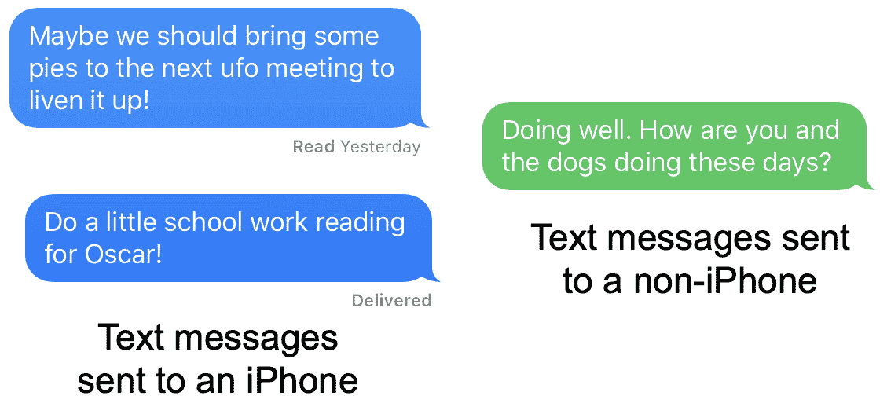

图 5.1 – 蓝色和绿色文本消息示例

向 iPhone 用户发送短信的一个优点是，你可以验证你的消息是否被另一部 iPhone 接收。这样，你可以确信你的短信已经发送出去，而使用 SMS 发送短信时无法验证这一点。

## 发送短信

短信是发送到电话号码的，因此通常最好在**联系人**应用中存储某人的姓名和电话号码。这样，你可以发送给实际的人名。

如果你不想在**联系人**应用中存储姓名和电话号码，你仍然可以通过在发送短信之前输入该人的电话号码来发送短信。这种方法比较笨拙，因为它需要输入完整的电话号码，但如果你不希望以任何原因在**联系人**应用中存储某人的姓名和电话号码，这种方法可能很方便。

要通过输入手机号码发送短信，请按照以下步骤操作：

1.  在主屏幕上点击**消息**图标。将出现**消息**屏幕。

1.  点击屏幕右上角的新消息图标。将出现如图 *图 5.2* 所示的**新消息**屏幕：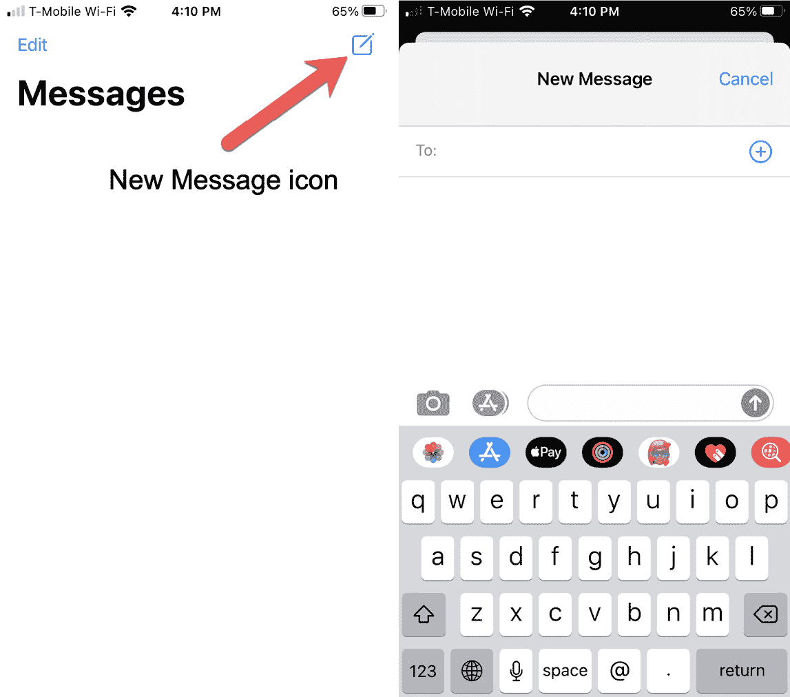

    图 5.2 – 新消息图标和新消息屏幕

1.  点击**收件人**文本字段并输入手机号码，包括任何区号或国家代码。或者，点击**收件人**文本字段最右侧圆圈内的**+**号以显示存储在**联系人**应用中的任何姓名。从该列表中，你可以点击一个姓名和手机号码来发送短信。

1.  点击**短信内容**文本字段中的文本，完成后点击屏幕最右侧的发送图标，如图 *图 5.3* 所示：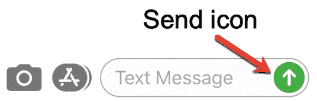

图 5.3 – 短信内容文本字段和发送图标

大多数人只是发送纯文本，但你也可以发送图片。这让你可以使用 iPhone 的相机捕获图片并通过短信发送该图像。

## 将图片作为短信发送

一旦你确定了发送短信的目的地（通过输入特定的手机号码或选择存储在**联系人**应用中的手机号码），你就可以输入要发送的文本。由于一张图片胜过千言万语，你可能还想发送一张图片。

这张图片可以是存储在 iPhone 的**照片**应用中的任何图片，也可以是使用 iPhone 相机捕获的任何图像。要在短信中发送图片，请按照以下步骤操作：

1.  打开**消息**应用，输入手机号码或从**联系人**应用中选择手机号码。

1.  点击位于短信图标左侧的相机图标，如图 *图 5.4* 所示。点击相机图标将显示相机界面：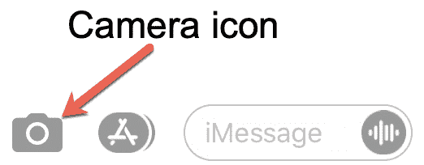

    图 5.4 – 相机图标

1.  将你的 iPhone 摄像头对准图片，然后轻触屏幕底部的中央白色按钮。或者，如*图 5.5*所示，轻触屏幕左上角的**照片**应用图标，以打开**照片**应用并选择图片：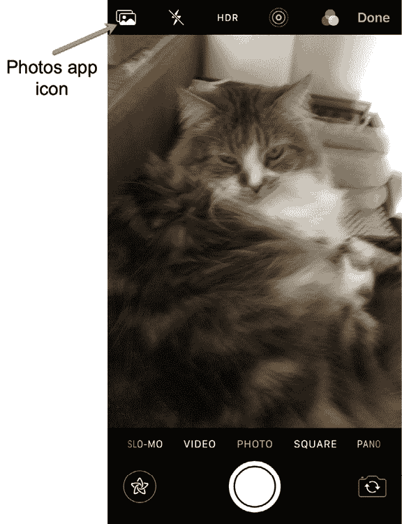

    图 5.5 – 摄像头屏幕

    无论你是通过摄像头捕捉图像还是选择**照片**应用中存储的图像，你选择的图像都会出现在文本气泡中，如*图 5.6*所示：

    

    图 5.6 – 要发送为短信的图片

1.  在文本字段中轻触并输入你想与图片一起发送的消息（发送带有图片的文本是可选的）。

1.  （可选）：如果你最终不想发送图片，请轻触所选图片右上角的关闭图标（**x**）。

1.  轻触文本消息字段最右侧的发送图标以发送你选择的图片。

发送图片可以很有趣，但你可能还想发送表情符号来表达你的情绪。

## 作为短信发送表情符号

表情符号代表不同图像的愚蠢和有趣图标，例如动物或笑脸。许多人发送表情符号作为图片评论或在文本之外来使短信更加生动。

要在短信中发送表情符号，请按照以下步骤操作：

1.  打开**信息**应用，输入手机号码或从**联系人**应用中选择一个手机号码。

1.  在**短信**文本字段中轻触，以便出现虚拟键盘。

1.  如*图 5.7*所示，轻触虚拟键盘左下角的地球图标：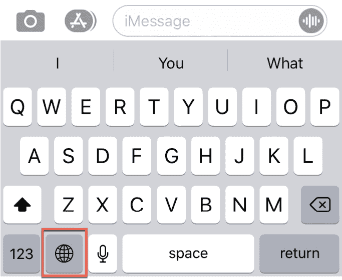

    图 5.7 – 虚拟键盘上的地球图标显示不同的键盘选项

    你可能需要多次轻触这个地球图标来循环显示可能出现的任何其他虚拟键盘。会出现一个表情符号列表，如*图 5.8*所示：

    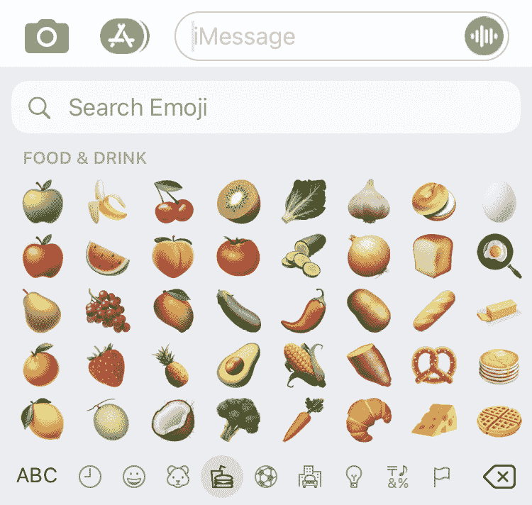

    图 5.8 – 表情符号键盘

1.  在屏幕底部轻触表情符号类别，以查看不同的一组表情符号，如笑脸或体育图像。你也可以左右滑动来查看不同的表情符号类别。

1.  轻触你想要发送的表情符号。你选择的表情符号会出现在文本气泡中。

1.  在文本字段中轻触并输入你想与表情符号一起发送的消息（发送带有表情符号的文本是可选的）。

1.  轻触文本消息字段最右侧的发送图标以发送你选择的表情符号。

表情符号代表在图片中用图片而不是文字表达自己的不同方式。有些人只发送表情符号，而有些人则发送文本和表情符号。为了另一种将图片作为短信发送的方式，也可以考虑使用贴纸。

## 作为短信发送贴纸

贴纸代表各种有趣和搞笑的图像图标，如动物或笑脸。许多人也将贴纸作为图片评论或与文本一起发送，以使短信更加生动。

要在短信中发送贴纸，请按照以下步骤操作：

1.  打开**消息**应用并输入一个手机号码，或从**联系人**应用中选择一个手机号码。

1.  轻按应用图标以显示选项列表，如图*图 5.9*所示（如果选项列表已经可见，则跳过此步骤）：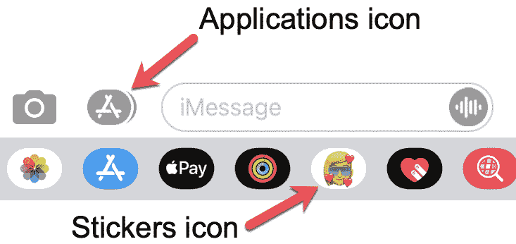

    图 5.9 – 应用图标显示/隐藏选项列表

1.  轻按贴纸图标以显示不同贴纸的列表，如图*图 5.10*所示：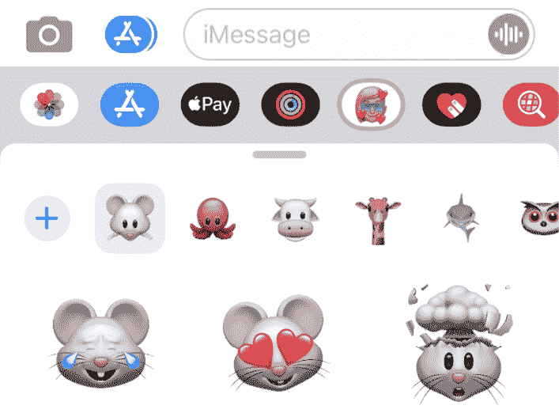

    图 5.10 – 贴纸图标显示不同的贴纸以选择

1.  轻按一个贴纸以发送。您所选的贴纸将出现在一个文字气泡中，如图*图 5.11*所示：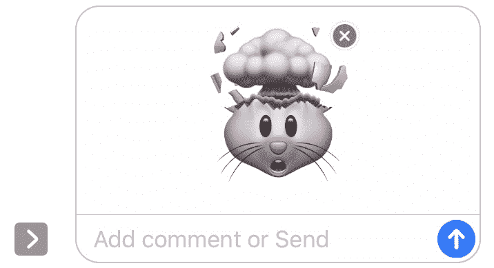

    图 5.11 – 发送贴纸

1.  在文本字段中轻按并输入要随贴纸发送的消息（发送带有贴纸的文本是可选的）。

1.  （可选）：如果您最终不想发送图片，请轻按所选贴纸右上角的关闭图标（**x**）。

1.  轻按文本消息字段最右侧的发送图标以发送您选择的贴纸。

贴纸只是向他人发送卡通图像的另一种方式。虽然你可以使用苹果提供的预设计贴纸，但你也可以自定义自己的贴纸。这样，你可以制作自己或他人的卡通图像。

## 创建 Memojis

而不是发送预先绘制的贴纸，花点时间设计自己的贴纸，称为 Memojis。即使你没有艺术倾向，你也可以简单地选择不同的颜色和选项来创建一个看起来不错的 Memoji，无论你是否具备绘画才能。只需几分钟，你可能会惊讶于自己制作的自定义 Memoji 是多么有创意，无论是看起来像自己还是像另一个人的卡通版本。

要创建表情符号，请按照以下步骤操作：

1.  打开**消息**应用并输入一个手机号码，或从**联系人**应用中选择一个手机号码。

1.  轻按应用图标以显示选项列表（见图*图 5.9*）。

1.  轻按贴纸图标以显示不同贴纸的列表（见图*图 5.10*）。

1.  在贴纸屏幕的左上角轻按**+**图标。将出现表情符号创建屏幕，如图*图 5.12*所示：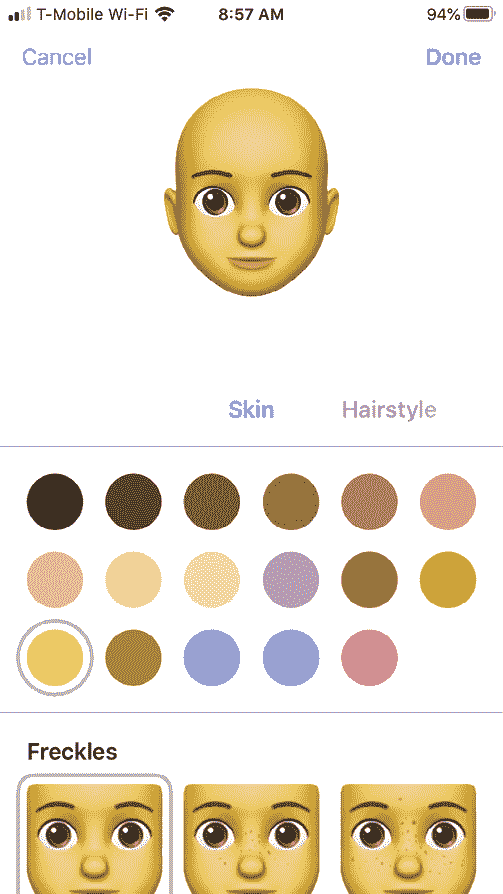

    图 5.12 – 创建自定义表情符号

1.  点击一个类别，例如**皮肤**、**发型**、**眉毛**、**眼睛**、**头部**、**鼻子**、**嘴巴**、**耳朵**、**面部毛发**、**眼镜**和**头饰**。每个类别都会显示不同的选项以供选择，这样你可以进一步自定义你的表情符号，如图 5.13 所示：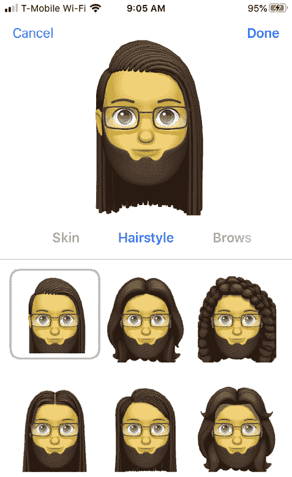

    图 5.13 – 选择不同的选项来自定义表情符号

1.  当你完成表情符号的创建后，点击**完成**。创建至少一个自定义表情符号后，每次点击贴纸图标时，你都可以选择和查看其变体，如图 5.14 所示：

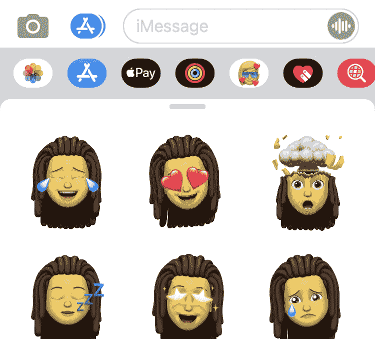

图 5.14 – 查看自定义表情符号的变体

一旦你创建了一个或多个自定义表情符号，你可能以后想要复制它们、编辑它们，或者完全删除它们。要复制、编辑或删除表情符号，请按照以下步骤操作：

1.  打开**消息**应用并输入一个手机号码，或从**联系人**应用中选择一个手机号码。

1.  点击应用程序图标以显示选项列表（见图 5.9）。

1.  点击贴纸图标以显示不同贴纸的列表（见图 5.10）。

1.  点击你想要编辑的表情符号。圆圈左上角会出现一个三点图标。

1.  点击这个三点图标。会出现一个表情符号编辑屏幕，如图 5.15 所示：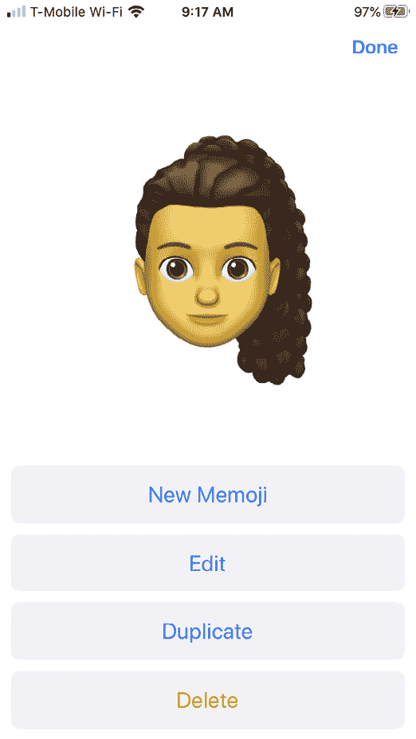

    图 5.15 – 表情符号编辑屏幕

1.  点击一个选项（**新建表情符号**、**编辑**、**复制**或**删除**）。

表情符号是一种通过短信发送图形图像的独特方式。对于那些喜欢锻炼他们的艺术技巧的人来说，你也可以发送用指尖绘制的绘图。

## 将数字触摸绘图作为短信发送

数字触摸是一种用指尖绘制简单图片或字母的方法。然后，你可以将这些简单的手指绘画或书写作为短信发送。

作为一种选择，你也可以拍照并在照片上添加绘图。这样，你可以突出显示照片的不同部分，例如指出一个问题或你希望某人看到的具体物品。

要在短信中发送数字触摸图像，请按照以下步骤操作：

1.  打开**消息**应用并输入一个手机号码，或从**联系人**应用中选择一个手机号码。

1.  点击应用程序图标以显示选项列表（见图 5.9）。

1.  点击数字触摸图标以显示绘图区域，如图 5.16 所示：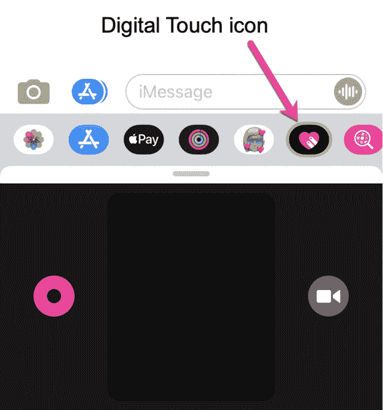

    图 5.16 – 数字触摸绘图区域

1.  点击左侧的颜色以显示其他颜色。然后，点击你想要使用的颜色。当你选择一种颜色时，一个相机图标会出现在绘图区域的右侧。

1.  点击绘图区域右侧出现的相机图标。会出现一个数字触摸相机屏幕，让您可以将绘图添加到可以记录的图像中，如图 *图 5.17* 所示：

    图 5.17 – 将数字触摸绘图添加到相机图像

1.  点击一个颜色并绘制一个图像。

1.  点击白色按钮以捕获静态图像，或点击红色按钮以捕获视频。屏幕右下角会出现一个蓝色发送图标。

1.  点击发送图标。

发送包含图片的绘图很有趣，但发送消息的另一种方式是通过音频。

## 将音频作为短信发送

有时，由于身体限制，输入消息可能会很麻烦或根本不可能。为了通过文本消息进行另一种通信方式，发送音频片段。这样，您可以说出您的消息，而对方可以听到您的消息。

注意

将音频作为短信发送仅限于与另一位 iPhone 用户进行短信交流。您不能将音频发送给使用不同智能手机的人，例如 Android 设备。

要在短信中发送音频，请按照以下步骤操作：

1.  打开 **消息** 应用并输入一个手机号码，或者从 **联系人** 应用中选择一个手机号码。确保您要发送短信的人使用的是 iPhone，您可以通过查看之前出现的蓝色文本气泡来识别。

1.  点击应用程序图标以显示选项列表（见图 *图 5.9*）。

1.  按住文本消息字段最右侧出现的音频按钮，如图 *图 5.18* 所示：

    图 5.18 – 音频按钮

1.  在继续按住音频按钮的同时说出您的消息。说完后，释放音频按钮。您的音频消息将显示出来，如图 *图 5.19* 所示：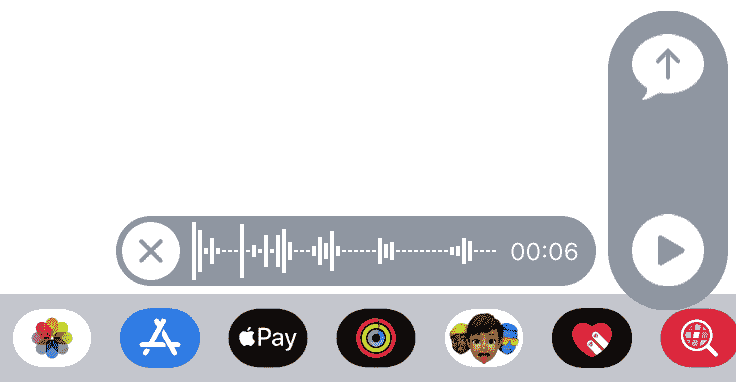

    图 5.19 – 准备发送的录音音频消息

1.  （可选）：如果您想在不发送的情况下删除音频录音，请点击音频录音左侧的关闭按钮（**x**）。

1.  点击发送图标（向上箭头）以发送您的音频。您的音频将显示出来，如图 *图 5.20* 所示：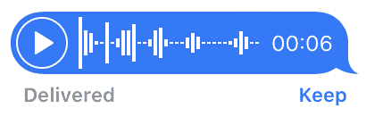

    图 5.20 – 一段音频录音

1.  如果您想保存您的音频录音，请点击 **保留**。如果您不点击 **保留**，您的音频录音将在几分钟后消失。

音频录音使得发送消息无需输入变得容易。为了另一种无需输入发送消息的方法，尝试发送动态活动图像，这些图像显示简单的动画，例如旋转的足球或挥动的旗帜。这些动态图像可以为您的文本消息增添趣味，并为任何您可能想要输入的文本提供有趣的补充。

## 将动态健身图像作为短信发送

动画图片比静态图片更能迅速吸引人的注意。如果您想在短信中添加动画图片，您可以从健身类别中选择，该类别显示动态图片。

要在短信中发送动画健身图片，请按照以下步骤操作：

1.  打开 **消息** 应用程序，输入手机号码，或从 **联系人** 应用程序中选择手机号码。

1.  点击应用程序图标以显示选项列表（见 *图 5.9*）。

1.  点击健身图标以查看动画图片列表，如图 *图 5.21* 所示：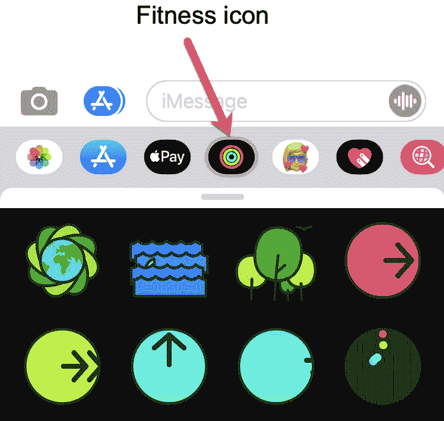

    图 5.21 – 健身动画图片

1.  点击一个动画图片。您选择的动画图片将出现在短信气泡中，如图 *图 5.22* 所示：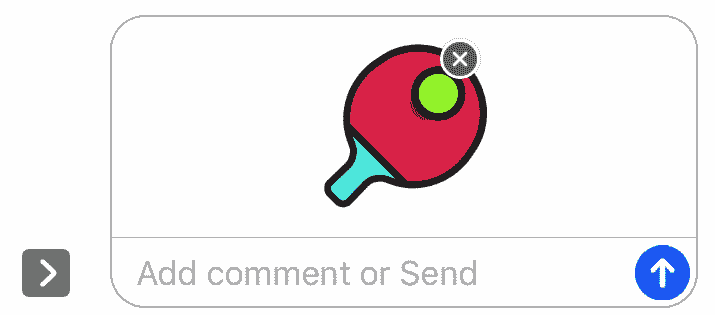

    图 5.22 – 发送动画图片

1.  (可选:) 如果您改变主意不想发送动画图片，请点击关闭按钮（**x**）。

1.  (可选:) 输入一些文本，与您的动画图片一起发送。

1.  点击发送图标以发送您的动画图片。

让我们来看看另一种我们可以通过短信发送的动画图片类型。

## 将动画图片作为短信发送

由于一张图片胜过千言万语，您可能希望将动画图片作为短信发送。您的 iPhone 附带了一系列动画图片，因此您可以选择最适合您情绪的那一个。要将动画图片作为短信发送，请按照以下步骤操作：

1.  打开 **消息** 应用程序，输入手机号码，或从 **联系人** 应用程序中选择手机号码。

1.  点击应用程序图标以显示选项列表（见 *图 5.9*）。您可能需要左右滑动以查看所有可用选项。

1.  点击图片图标以查看动画图片列表，如图 *图 5.23* 所示：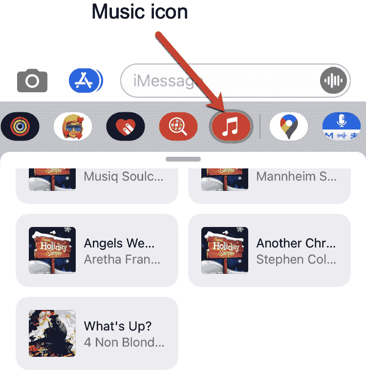

    图 5.23 – 选择动画图片

1.  (可选:) 如果您改变主意不想发送动画图片，请点击关闭按钮（**x**）。

1.  (可选:) 输入一些文本，与您的动画图片一起发送。

1.  点击发送图标以发送您的动画图片。

发送动画图片可以是一种有趣的方式，在无需键入的情况下分享您的感受和想法。如果您正在听一首反映您情绪的歌曲，您也可以无需键入任何内容就与他人分享您的音乐品味。

## 将正在播放的歌曲作为短信发送

许多人使用他们的 iPhone 播放他们在移动或坐着时可以享受的音乐。作为另一种与他人分享感受的有趣方式，您可以让他人知道您最近播放了哪些歌曲，而无需自己键入任何文字。

要在短信中让他人知道您的音乐品味，请按照以下步骤操作：

1.  打开 **消息** 应用程序，输入手机号码，或从 **联系人** 应用程序中选择手机号码。

1.  点击应用程序图标以显示选项列表（见 *图 5.9*）。你可能需要左右滑动以查看所有可用选项。

1.  点击音乐图标以查看最近播放的歌曲列表，如图 *图 5.24* 所示：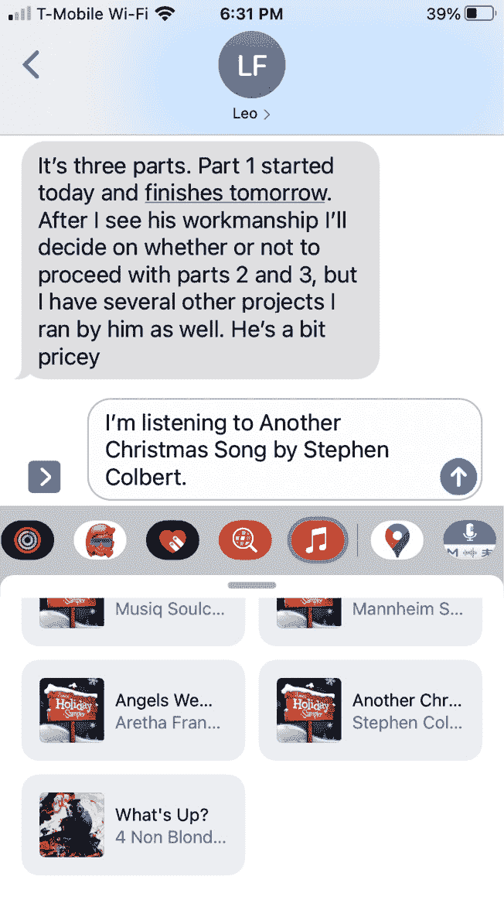

    图 5.24 – 从最近播放的音乐列表中选择

1.  点击一首最近播放的歌曲。你的 iPhone 会自动输入显示你选择的歌曲的文本，如图 *图 5.25* 所示：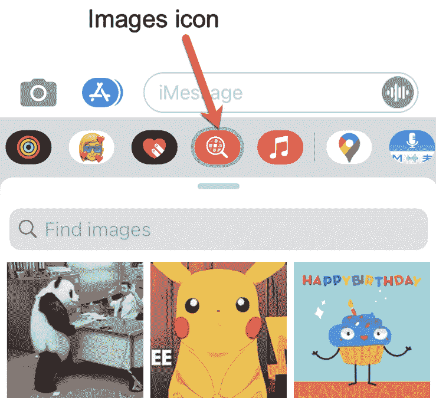

    图 5.25 – 选择最近播放的歌曲后自动创建的文本

1.  点击发送图标以发送你的短信。

发送当前播放的歌曲可能很有趣，但有时你可能还想发送金钱，这可以通过 Apple Pay（仅在世界某些地区可用）来完成。通过 Apple Pay 发送金钱，你可以轻松地在 iPhone 用户之间转账。

## 通过短信发送金钱

这些天，越来越多的人依赖数字现金而不是携带硬币或纸币，对于 iPhone 用户来说，携带数字现金最流行的方式之一就是通过 Apple Pay。

注意

Apple Pay 仅适用于之前已设置 Apple Pay 的 iPhone 或 iPad 用户。这意味着你不能通过 Apple Pay 向 Android 设备或任何非 iOS 设备发送金钱。你和接收者还必须设置 Apple Cash，这可以在你第一次通过 Apple Pay 发送金钱时完成。Apple Cash 需要链接到借记卡。此外，Apple Pay 可能不在所有国家和地区可用

要通过短信使用 Apple Pay 发送金钱，请按照以下步骤操作：

1.  打开 **消息** 应用并输入一个手机号码，或从 **联系人** 应用中选择一个手机号码。确保你发短信的人有一个 iPhone，你可以通过查看之前出现的蓝色文本气泡中的短信来识别。

1.  点击应用程序图标以显示选项列表（见 *图 5.9*）。

1.  点击 Apple Pay 图标。出现 Apple Pay 屏幕，如图 *图 5.26* 所示：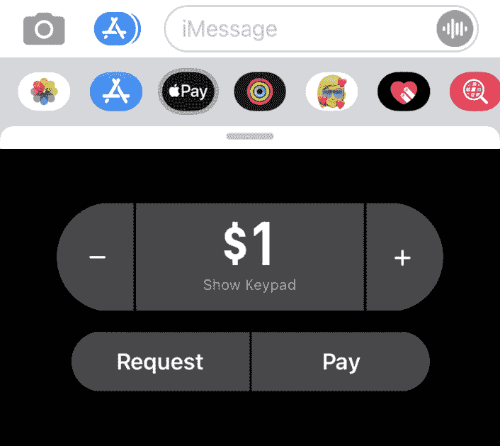

    图 5.26 – 通过 Apple Pay 选择要发送的金额

1.  点击 **-** 或 **+** 键以增加你想要发送的金额。

1.  （可选）：点击 **显示键盘** 以显示数字键盘，这样你就可以输入要发送的确切金额，如图 *图 5.27* 所示：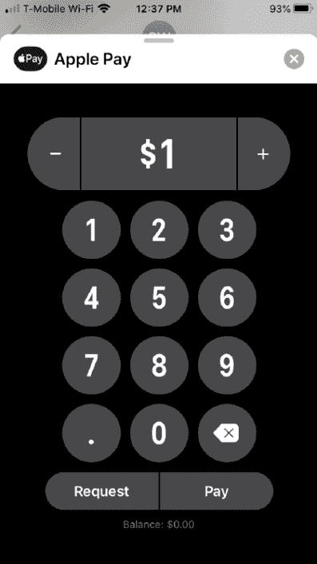

    图 5.27 – 使用数字键盘通过 Apple Pay 选择要发送的金额

1.  点击 **支付**，然后点击发送图标。

1.  通过 Touch ID 或 Face ID 授权支付。

通过 Apple Pay 发送金钱可以方便地分享现金。然而，有时你可能只想通过分享活动与朋友保持联系。

发送短信可能很有趣，但接收短信可能更好，因为这意味着其他人想与您沟通。是时候学习如何阅读和回复您收到的消息了。

# 接收和回复短信

每次您收到短信时，您都会在主屏幕上**消息**图标右上角看到一个通知数字。这个数字显示您收到的未读消息数量，如图*图 5.28*所示：

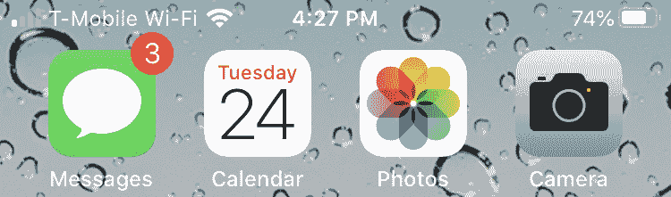

图 5.28 – 显示新消息通知的消息图标

如果您在收到消息时正在使用 iPhone，您将在屏幕顶部看到一条简短的消息，如图*图 5.29*所示：

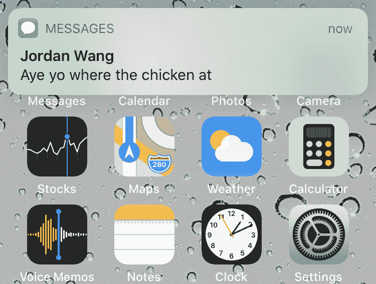

图 5.29 – 获取实时通知的 incoming message

**消息**应用列出了过去联系过您的人。如果您在**联系人**应用中添加了他们的姓名和手机号码，那么该人的姓名将显示出来。否则，只会显示该人的手机号码。

当您收到短信时，您可以按照以下步骤阅读：

1.  在主屏幕上轻触**消息**应用。任何包含未读消息的短信对话左侧都会出现一个蓝色圆点，如图*图 5.30*所示：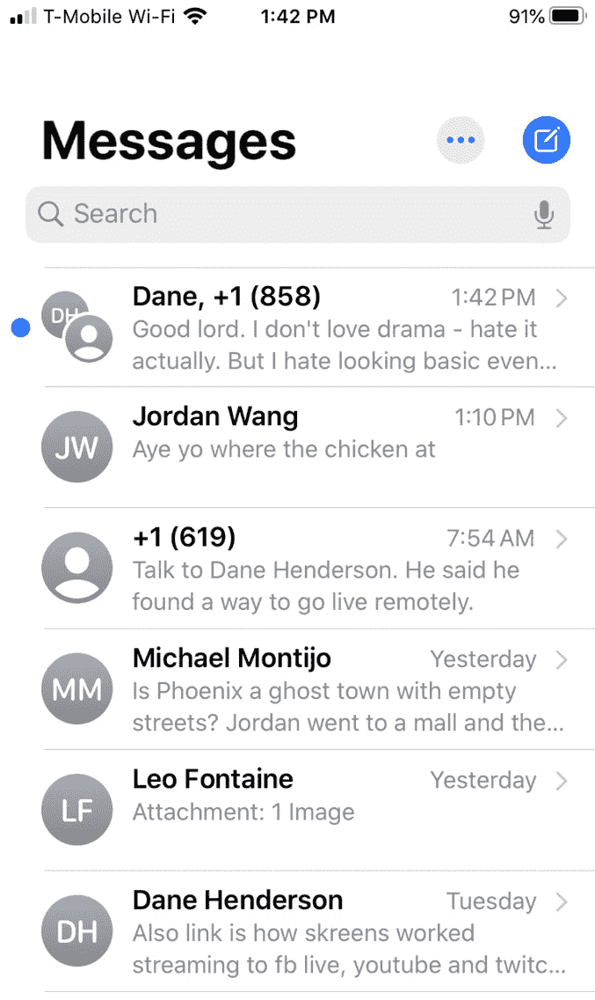

    图 5.30 – 蓝点标识包含未读消息的对话

1.  轻触包含您想要阅读的消息的对话。出现过去消息列表。

1.  滚动查看您收到的最新消息。

1.  轻触**短信**文本字段，输入您的文本，然后轻触发送图标以回复该人。

## 使用符号回复短信

虽然短信旨在简短，但即使是输入几个单词也可能很麻烦。这就是为什么**消息**应用提供了常见的符号（如点赞或踩），以便在不回复的情况下让其他人知道您的想法。

要用符号回复某人的消息，请按照以下步骤操作：

1.  在主屏幕上轻触**消息**应用。出现消息对话列表。

1.  轻触包含您想要回复的消息的对话。

1.  长按您想要回复的消息。会出现一个符号列表，如图*图 5.31*所示：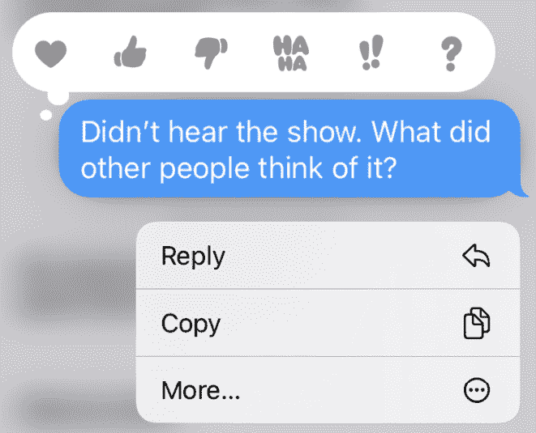

    图 5.31 – 长按消息以显示符号

1.  点击一个符号以发送它作为对所选文本消息的回复。（注意，在*Figure 5.31*中，你还有选择**复制**以复制整个文本消息的选项。这样，你可以将其粘贴到任何你想要的地方，例如笔记应用、文字处理软件、电子邮件或另一条短信。）

## 隐藏文本消息对话

如果你属于一个特别活跃的对话，你可能会不断收到消息，如果你的 iPhone 每次收到新消息时都会发出哔哔声或振动，可能会很烦人。为了在你收到特定对话中的新消息时隐藏任何类型的警报，你可以选择隐藏警报。

要在**消息**应用中隐藏对话的警报，请按照以下步骤操作：

1.  点击主屏幕上的**消息**应用。会出现一条消息对话列表。

1.  在你想要修改的对话上向左滑动。会出现一个蓝色隐藏警报和一个红色删除按钮，如图*Figure 5.32*所示：

    Figure 5.32 – 向左滑动对话显示删除选项

1.  点击隐藏警报。从现在起，当你在这个对话中收到新消息时，将不会收到任何警报。

要再次开启警报，只需重复前面的步骤，但这次不是选择隐藏警报，而是可以选择显示警报按钮。

如果你不再想保留某些对话，因为你不再需要它们或不再与那个人沟通，你可以选择完全删除一个对话。

## 删除文本消息对话

有时候，你可能和朋友或同事进行过对话，但后来你不再需要与那个人再次沟通。为了清除**消息**应用中显示的对话数量，你可以删除它们。

要在**消息**应用中删除一个对话，请按照以下步骤操作：

1.  点击主屏幕上的**消息**应用。会出现一条消息对话列表。

1.  在你想要修改的对话上向左滑动。会出现一个隐藏警报和删除按钮（见*Figure 5.32*）。屏幕底部会出现一个操作表，如图*Figure 5.33*所示，询问你是否要确认删除整个对话以及其中存储的任何消息：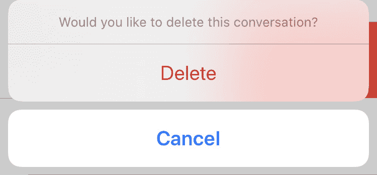

    Figure 5.33 – 一个操作表，询问确认删除整个**消息**对话

1.  点击**删除**。**消息**应用将永久删除你选择的对话。

定期查看你的对话，并删除你不再需要的对话。如果你觉得某些消息可能很重要，只需复制并粘贴它们以保存供将来参考。

通常，删除任何不必要的对话，以便**消息**应用只包含对你真正重要的对话和消息。

# 摘要

短信是与拥有手机的任何人快速轻松沟通的常见方式。虽然您始终可以以文本形式分享您的想法和观点，但不要局限于仅仅打字。考虑发送图片、音频，甚至通过 Apple Pay 发送数字现金。

短信功能旨在帮助您与重要的人或信息保持联系，因此，如果某些短信对话频繁提醒您，请考虑隐藏警报。定期浏览您的短信对话，删除不再需要的短信，以便您能集中精力关注当前想要和需要的对话。

短信是与他人沟通的绝佳方式，但在下一章中，您将学习如何与苹果的语音助手 Siri 交谈，她可以回答问题并帮助您在无需打字的情况下搜索互联网。
