# 第九章：*第九章*：使用 Safari 浏览互联网

iPhone 的一个吸引力是它将电脑放入你的口袋。当互联网首次向公众开放时，人们依赖个人电脑来浏览网站。然而，iPhone 使得在移动设备上浏览网页成为可能。

现在，如果你想在网上查找信息，你不必等到回家才能使用笨重的电脑。相反，你可以在 iPhone 上访问网站，并从在线购物和观看视频到阅读新闻和回复博客帖子做任何事情。

尽管由于 iPhone 屏幕比桌面或笔记本电脑屏幕小，iPhone 上的网页浏览与桌面或笔记本电脑上的网页浏览有所不同，但原理是相同的：加载浏览器并访问网站。区别只是学习如何在 iPhone 的较小屏幕和虚拟键盘上输入和查看网站。

本章涵盖的主题如下：

+   浏览网站

+   在网页间导航

+   打开和切换多个网页

+   隐私浏览

+   收藏网站

+   查看浏览历史记录

+   使用阅读列表

+   分享网站

+   使用 Safari 搜索

# 浏览网站

每个 iPhone 都配备了 Safari 浏览器，这与在每台 Macintosh 上找到的 Safari 浏览器类似（你始终可以在 iPhone 上下载并安装其他浏览器，但本章仅专注于使用 Safari）。

要浏览任何网站，你只需要知道网站地址，例如 [www.yahoo.com](http://www.yahoo.com) 或仅仅是 [apple.com](http://apple.com)。一旦你知道要访问哪个网站，你需要在 Safari 中输入这些信息。

注意

你不需要输入完整的网站地址，例如 `https://www.yahoo.com`。通常，只输入网站名称（例如 `yahoo`）和域名（例如 `.com`）会更简单、更快，而不是输入 `https://` 或 `www`。

## 输入网站地址

第一次启动 Safari 时，你必须输入一个网站地址才能访问互联网上的任何内容。从那时起，Safari 会跟踪你访问过的网站，因此你不必再次输入完整的网站地址来访问该网站。

要在 Safari 中输入网站地址，请按照以下步骤操作：

1.  在主屏幕上轻触**Safari**应用。Safari 应用屏幕出现。

1.  轻触屏幕顶部的文本字段，如图*图 9.1*所示。此文本字段允许你输入网站地址或搜索查询。一旦你轻触文本字段，屏幕底部就会出现键盘：

    图 9.1 – Safari 屏幕顶部的文本字段

1.  输入网站地址，例如`microsoft.com`或`nasa.gov`，然后点击虚拟键盘右下角出现的蓝色高亮**前往**按钮，如图 9.2 所示。如果你输入了一个有效的网站地址，网站将出现在屏幕上：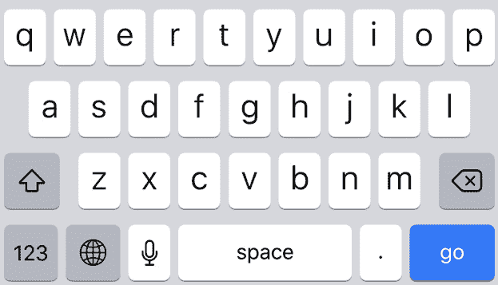

    图 9.2 – 虚拟键盘上的“前往”按钮

1.  将 iPhone 在纵向或横向模式下倾斜，以不同的方式查看任何网站，如图 9.3 所示。大多数（但不是所有）网站会根据 iPhone 的方向调整其内容：

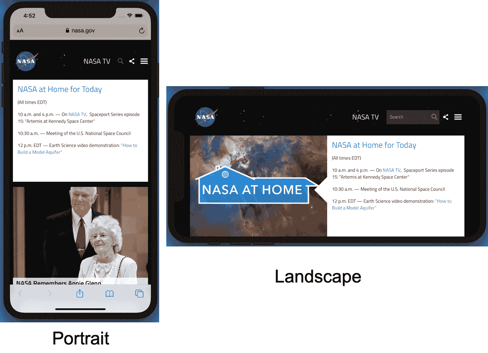

图 9.3 – 你可以在纵向或横向模式下查看任何网站

一旦访问了一个网站，你可以通过向上/下滑动手指来滚动查看所有可用的内容。由于 iPhone 屏幕比传统的电脑显示器小得多，你可能需要缩小或放大文本或重新加载网站，以确保你正在查看最新的内容。

## 改变文本大小

对于一些人来说，Safari 显示的文本太小，难以阅读。对于另一些人来说，Safari 显示的文本太大，难以看到网页上的所有内容。

为了帮助你调整网站上显示的文本大小，Safari 允许你缩小或放大文本。要缩小或放大文本，请按照以下步骤操作：

1.  在主屏幕上点击**Safari**应用。出现 Safari 应用屏幕。

1.  点击屏幕顶部的文本字段（见图 9.1）并输入网站地址，例如`yahoo.com`。出现字体大小和重新加载图标，如图 9.4 所示：

    图 9.4 – 字体大小和重新加载图标

1.  点击字体大小图标。出现一个菜单，显示字体大小百分比，例如**100%**。一个小的**A**图标出现在左侧，用于缩小字体大小，而一个较大的**A**图标出现在右侧，用于增加字体大小，如图 9.5 所示：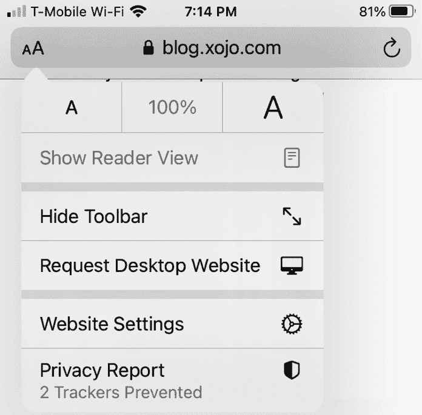

    图 9.5 – 改变网站上的文本字体大小

1.  点击小的**A**或大的**A**图标来调整字体大小。

字体大小图标允许你调整你访问的每个网站上的文本大小。如果你希望所有网站都使用特定的字体大小，你可以定义一个不同于**100%**的字体大小，这是默认设置。

要为所有网站定义字体大小放大，请按照以下步骤操作：

1.  在主屏幕上点击**设置**应用。出现**设置**应用屏幕。

1.  点击**Safari**。出现一个 Safari 设置列表。向下滚动，直到看到**页面缩放**。

1.  点击**页面缩放**。出现**页面缩放**屏幕，如图 9.6 所示。当前在 Safari 中加载的网站出现在顶部，例如**yahoo.com**：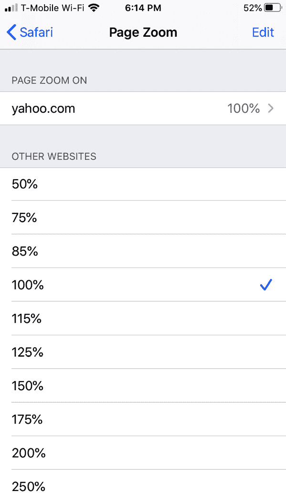

    图 9.6 – 页面缩放屏幕允许您为所有网站定义字体大小放大

1.  点击当前加载的网站名称，例如**yahoo.com**，以调整其字体大小，然后点击一个放大选项，例如**75%**或**125%**。

1.  点击屏幕左上角的**页面缩放**返回按钮以返回**页面缩放**屏幕。

1.  点击**其他网站**类别下的放大选项，为所有其他网站定义放大比例。

通过更改单个网站或所有网站的字体大小放大，您可以使得上网浏览对您的眼睛更加舒适。

在某些情况下，字体大小放大是可行的，但网站内容本身可能已经过时。为了确保您拥有最新的内容，您可能需要重新加载网页。

## 重新加载网页

如果您访问了一个网站，通常您会获得最新的内容。然而，如果内容发生变化，Safari 可能不会总是显示任何更改的内容。为了确保您正在查看网站上显示的最新内容，您可能需要定期重新加载网页。

要重新加载网页，请按照以下步骤操作：

1.  点击主屏幕上的**Safari**应用。Safari 应用屏幕出现。

1.  点击屏幕顶部的文本框（见*图 9.1*）并输入网站地址，例如`yahoo.com`。会出现字体大小和重新加载图标（见*图 9.4*）。

1.  点击重新加载图标。

一旦您访问了一个网站，您可能需要知道如何点击链接，以及如何在之前的网页之间来回切换。幸运的是，在 iPhone 上上网浏览与在电脑上上网浏览的工作方式相同，只是您需要使用触摸手势，并在屏幕的顶部和底部寻找图标。

# 在网页间导航

大多数网站由多个网页组成，从一个网站跳转到另一个网站是很常见的。从一页跳转到另一页的三个主要方式如下：

+   点击超链接。

+   点击返回图标。

+   点击前进图标。

超链接以蓝色文本的形式出现，可以跳转到同一网站或完全不同的网站上的另一个网页。*图 9.7*显示了典型的超链接的外观：

图 9.7 – 在网页上显示的超链接

当您点击屏幕顶部的文本框时，屏幕底部会出现返回和前进图标，如图*图 9.8*所示：

图 9.8 – 返回和前进图标

注意

前进图标将在您至少点击一次返回图标后才会出现暗淡。

要了解如何使用超链接和返回/前进图标，请按照以下步骤操作：

1.  点击主屏幕上的**Safari**应用。Safari 屏幕出现。

1.  点击屏幕顶部的文本框并输入网站地址，例如`apple.com`。

1.  点击任何蓝色超链接以访问另一个网页。

1.  点击屏幕顶部的文本字段，使后退和前进图标出现在屏幕底部。

1.  点击后退图标。注意，之前的网页会出现。

1.  点击前进图标。注意，在点击后退图标之前查看的网页会显示出来。

超链接可以带你去新的网页，而后退图标则允许你返回之前查看过的网页。一旦你至少点击一次后退图标，你将能够点击前进图标。后退和前进图标允许你在两个或多个之前查看过的网页之间来回切换。

然而，你可能想要同时打开两个或更多网页并在它们之间切换，这在 iPhone 上的 Safari 中也可以做到。

# 打开和切换多个网页

如果你熟悉在台式机或笔记本电脑上使用浏览器，你可能知道标签。标签允许你打开多个网页，并在需要时在它们之间切换。

## 打开额外的网页

要打开额外的网页，请按照以下步骤操作：

1.  点击主屏幕上的**Safari**应用。Safari 屏幕会出现。

1.  点击屏幕顶部的文本字段并输入网站地址，例如`apple.com`。屏幕底部会出现标签栏，如图*图 9.9*所示：

    图 9.9 – 显示所有标签的图标

1.  点击屏幕右下角的显示所有标签的图标。所有打开的网页会出现，屏幕底部会出现一个**+**图标，如图*图 9.10*所示：

    图 9.10 – 加号图标让您打开新网页

1.  点击**+**图标。屏幕顶部会出现一个文本字段，以及一个收藏和常访问网站列表，如图*图 9.11*所示：

    图 9.11 – 选择要打开的新网页

1.  输入网站地址，或点击显示之前访问过的网站的图标。Safari 会打开你选择的网站。

一旦你打开了两个或更多网站，你需要知道如何快速在它们之间切换。

## 在打开的网页间切换

打开多个网页的优势在于你可以从一个网页跳转到另一个网页。例如，你可以在不同的网页上显示天气预报、体育比分和新闻网站，这样你就可以查看所需信息，而无需输入网站地址并等待网页加载。

在网页间切换，请按照以下步骤操作：

1.  确保你已经按照*打开额外的网页*部分中的说明打开了两个或更多网页。

1.  点击屏幕顶部的文本字段。屏幕底部会出现显示所有标签的图标（见*图 9.9*）。

1.  点击显示所有标签的图标。所有打开的网页会像堆叠的卡片一样显示，如图*图 9.12*所示：

    图 9.12 – 查看多个打开的网页

1.  点击你想要查看的网页。你选择的网页将在 Safari 中显示。

由于你不必关闭一个网页并等待另一个网页加载，因此同时打开多个网页可能很方便。然而，当你不再需要它们时，你最终可能想要关闭一个或多个打开的网页。

## 关闭网页

你打开的网页越多，看到它们就越困难。这就是为什么你可能想要将打开的网页数量保持在合理的范围内，并关闭任何你不再需要的网页。

要关闭一个网页，请按照以下步骤操作：

1.  确保你已按照*打开其他网页*部分中的说明打开了两个或更多网页。

1.  点击屏幕顶部的文本框。所有标签页的图标出现在屏幕底部（见图*图 9.9*）。

1.  点击显示所有标签页的图标。所有打开的网页都像堆叠的卡片一样出现（见图*图 9.12*）。

1.  点击你想要关闭的网页右上角的关闭图标（**X**图标），如图*图 9.13*所示：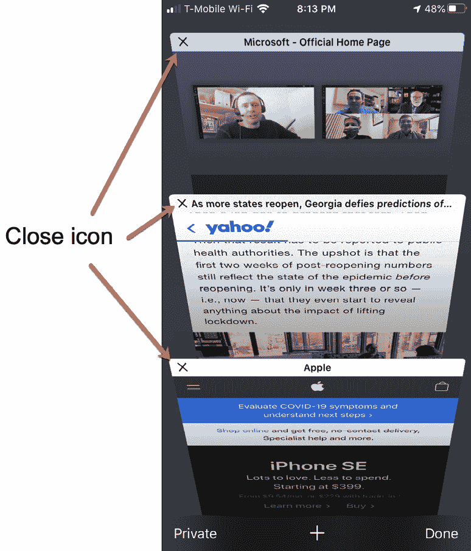

    图 9.13 – 网页上的关闭图标

1.  点击**完成**。

每次你浏览一个网站时，你都有可能泄露信息，如你的当前位置或你搜索的信息类型。如果你想保护你的隐私，你应该使用 Safari 的隐私浏览选项。

# 隐私浏览

隐私浏览允许你在不跟踪你访问的网页历史记录的情况下访问网站，阻止**自动填充**以防止记住在网页中输入的密码，并在关闭发送 cookie 的网页时删除任何 cookie。

要使用隐私浏览，请按照以下步骤操作：

1.  点击主屏幕上的**Safari**应用。Safari 屏幕出现。

1.  点击显示所有标签页的图标。

1.  点击**私人**。Safari 显示**隐私浏览模式**消息并在屏幕左下角突出显示**私人**，如图*图 9.14*所示：

    图 9.14 – 隐私浏览模式

1.  点击**+**图标以在隐私浏览模式下打开一个网站。

1.  点击屏幕顶部的文本框并输入网站地址，例如`apple.com`。

一旦你开始以隐私模式浏览，你可能最终想要关闭隐私浏览模式。要关闭隐私浏览模式，请按照以下步骤操作：

1.  点击显示所有标签页的图标。

1.  点击**私人**。

在隐私浏览模式之间切换可能很方便，但你可能还想在 Safari 中定义特定的隐私设置。

## 在 Safari 中定义隐私设置

隐私设置允许你定义 Safari 向网站提供多少（或多少）信息；以下是一些可用的设置：

+   **防止跨站跟踪**：阻止网站跟踪你访问的网站

+   **阻止所有 Cookie**：阻止网站在名为 Cookie 的文件中存储有关您活动数据

+   **欺诈网站警告**：如果 Safari 检测到疑似钓鱼网站（即模仿已知网站以窃取密码和其他重要信息的网站），则会显示警告

+   **检查 Apple Pay**：检查您是否可以通过 Apple Pay 在网站上支付产品

+   **清除历史记录和网站数据**：删除您的浏览历史记录和从访问网站存储的数据

为 Safari 定义一个或多个隐私设置，请按照以下步骤操作：

1.  在主屏幕上轻触**设置**应用。**设置**屏幕出现。

1.  轻触**Safari**。**Safari**设置屏幕出现。

1.  滚动到如图 9.15 所示的**隐私和安全**类别：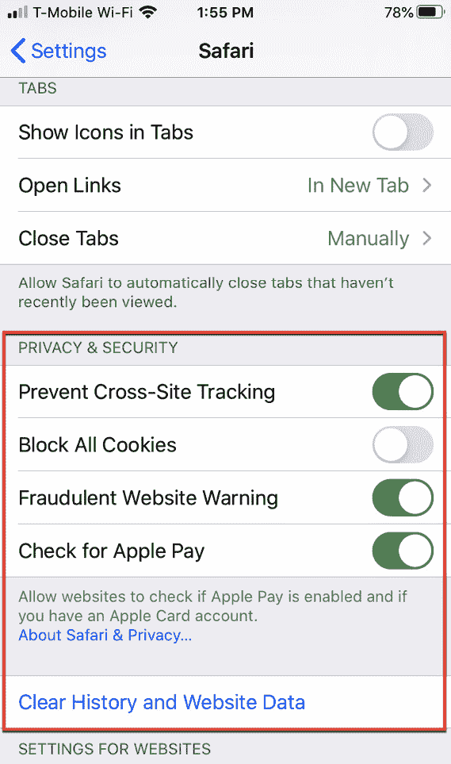

    图 9.15 – Safari 的隐私和安全设置

1.  （可选）轻触绿色开关以开启或关闭**阻止跨站跟踪**。

1.  （可选）轻触绿色开关以开启或关闭**阻止所有 Cookie**。

1.  （可选）轻触绿色开关以开启或关闭**欺诈网站警告**。

1.  （可选）轻触绿色开关以开启或关闭**检查 Apple Pay**。

1.  （可选）轻触**清除历史记录和网站数据**以删除您的浏览历史记录。

无论您是否使用隐私设置进行浏览，您可能会比其他网站访问更多网站。与其不断输入您最喜欢的网站的域名，不如将它们添加为书签，这样您就可以轻触手指即可访问。

# 收藏网站

书签允许您保存您喜欢的网站地址，这样您在想要访问它们时就不必再次输入。Safari 允许您将书签组织到文件夹中，这样您就可以创建一个仅包含新闻网站的文件夹，第二个文件夹包含娱乐网站，第三个文件夹包含与工作相关的网站。文件夹只是帮助您保持书签的有序。

## 创建书签

要收藏一个喜欢的网站，请按照以下步骤操作：

1.  在主屏幕上轻触**Safari**应用。**Safari**屏幕出现。

1.  在屏幕顶部的文本字段中轻触并输入网站地址，例如 `aljazeera.com`。屏幕底部出现一个标签栏，并显示分享图标，如图 9.16 所示：

    图 9.16 – 分享图标

1.  在屏幕底部轻触分享图标。从屏幕底部出现一个面板。

1.  滚动此页面，直到您看到如图 9.17 所示的选项列表：

    图 9.17 – 添加书签命令

1.  点击**添加书签**。 (如果您点击**添加到收藏夹**，可以将书签添加到**收藏夹**文件夹。如果您点击**添加到主屏幕**，可以添加一个将在主屏幕上显示的书签。) 将出现一个**添加书签**屏幕，允许您编辑书签的描述性名称、网站地址和保存书签的位置，如图 9.18 所示：

    点击一个位置来存储您的书签，例如**收藏夹**或**书签**。如果您点击**新建文件夹**，将出现一个**新建文件夹**屏幕，允许您输入描述性文件夹名称，如图 9.20 所示：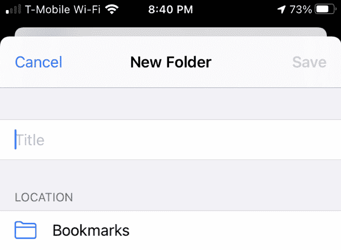

    图 9.18 – 添加书签屏幕

1.  图 9.22 – 书签屏幕

1.  一旦您添加了一个或多个网站的书签，您就可以快速打开这些网站而无需输入网站地址。

    点击一个书签以加载该网站。

    

1.  ![图 9.22_B14100.jpg]

    （可选）编辑书签的名称（在书签名称文本框最右侧点击**X**图标以清除所有文本）。

    书签可以方便地快速加载您喜欢的网站。然而，您的书签列表越长，找到特定网站就越困难。这就是为什么您需要知道如何删除书签的原因。

1.  在主屏幕上点击**Safari**应用。Safari 屏幕出现，并在屏幕底部显示书签图标，如图 9.21 所示：

书签让您只需轻触一下即可跳转到喜欢的网站。要访问书签网站，请按照以下步骤操作：

## 图 9.20 – 新建文件夹屏幕

要重新排列书签，请按照以下步骤操作：

1.  点击书签图标。出现**书签**屏幕，列出所有之前保存的书签网站，如图 9.22 所示：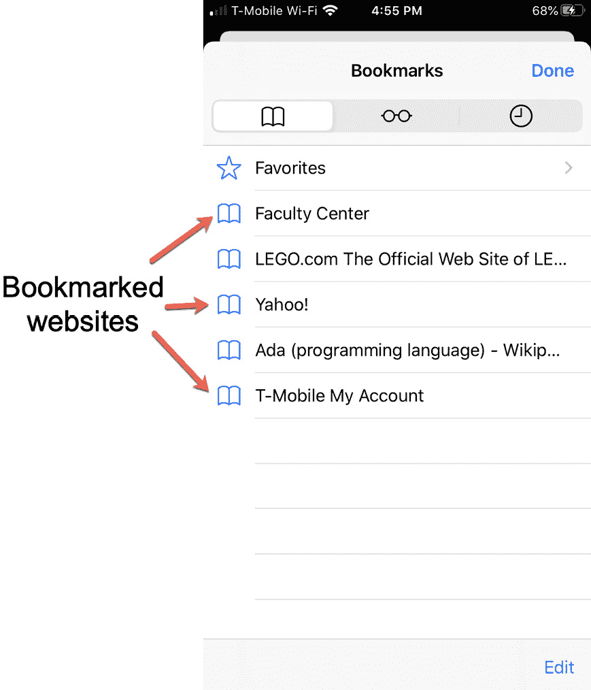

    

    

1.  使用书签

    ![图 9.20_B14100.jpg]

    点击书签图标。出现**书签**屏幕，列出所有之前保存的书签网站（见图 9.22）。

1.  当 Safari 添加书签时，书签列表可能不会按照您喜欢的顺序排列。幸运的是，您可以重新排列或甚至删除书签，以便使您的书签列表更易于管理。

图 9.19 – 定义存储书签的位置

## 删除和移动书签

在主屏幕上点击**Safari**应用。Safari 屏幕出现，并在屏幕底部显示书签图标（见图 9.21）。

图 9.21 – 书签图标

1.  点击**保存**。

1.  在**位置**类别下点击**书签**。**位置**类别显示一个**收藏夹**文件夹、一个**书签**文件夹和一个**新建文件夹**选项，如图 9.19 所示：

1.  点击屏幕右下角的 **编辑**。每个书签左侧会出现删除图标，右侧会出现移动图标，如图 *图 9.23* 所示：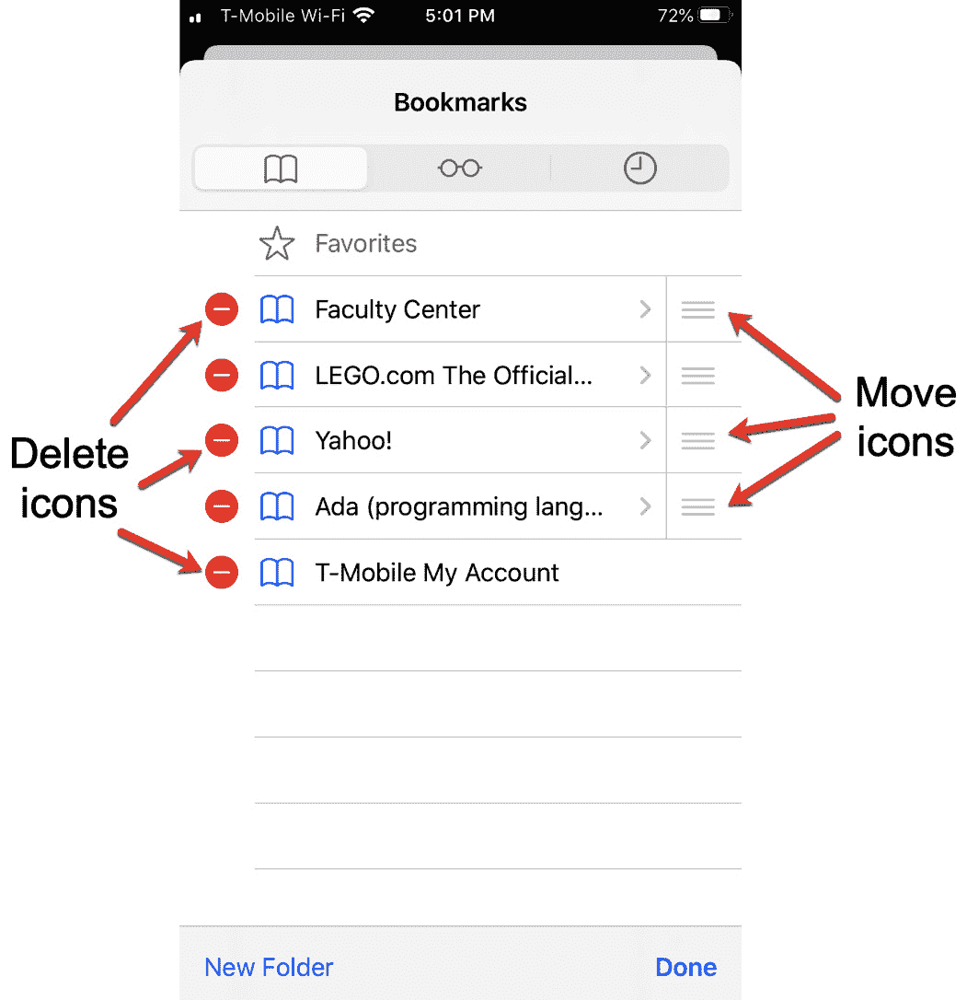

    图 9.23 – 编辑书签列表

1.  将指尖放在你想要移动的书签的移动图标上，并向上或向下滑动。

1.  点击 **完成**。

调整书签的顺序可以帮助你组织书签，但有时你可能想要完全删除一个书签。要删除书签，请按照以下步骤操作：

1.  点击主屏幕上的 **Safari** 应用。Safari 屏幕出现，并在屏幕底部显示书签图标（见 *图 9.21*）。

1.  点击书签图标。出现 **书签** 屏幕，列出所有之前保存的书签网站（见 *图 9.22*）。

1.  点击屏幕右下角的 **编辑**。每个书签左侧会出现删除图标，右侧会出现移动图标（见 *图 9.23*）。

1.  点击要删除的书签左侧的删除图标。书签右侧出现一个红色的 **删除** 按钮，如图 *图 9.24* 所示：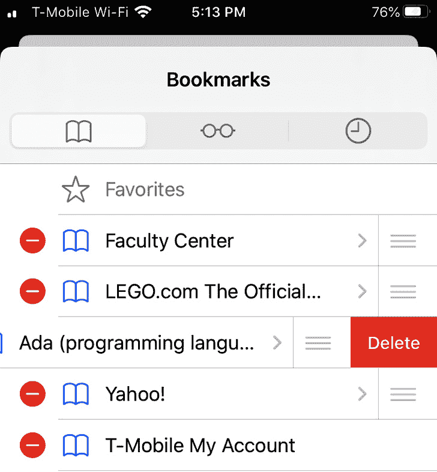

    图 9.24 – 删除书签

1.  点击 **删除** 按钮。

1.  点击 **完成**。

书签便于保存你喜欢的网站，但只有当你记得为特定网站添加书签时，书签才有用。为了以另一种方式访问之前访问过的网站，考虑使用你的浏览历史。

# 查看浏览历史

当你访问各种网站时，Safari 会记录所有网站地址（除非你使用 **私人浏览模式**）。通过查看你的浏览历史，你可以返回任何之前查看过的网站。

要重新打开之前访问过的网站，请按照以下步骤操作：

1.  点击主屏幕上的 **Safari** 应用。Safari 屏幕出现，并在屏幕底部显示书签图标（见 *图 9.21*）。

1.  点击书签图标。出现 **书签** 屏幕，列出所有之前保存的书签网站（见 *图 9.22*）。

1.  点击历史图标。出现一个之前查看过的网站地址列表，如图 *图 9.25* 所示：

    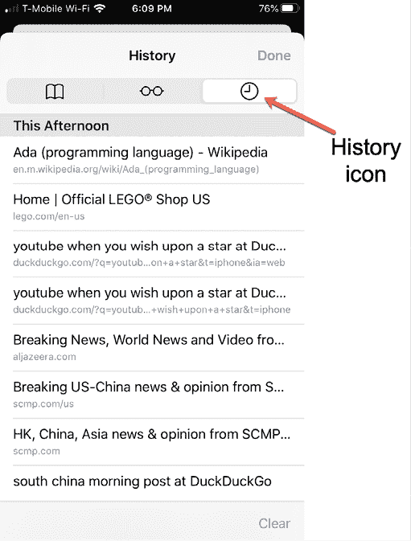

    图 9.25 – 前次查看的网站列表

1.  点击一个之前查看过的网站以再次查看它。

如果你记得访问过某个网站但忘记了地址，跟踪你的浏览历史可能会很有用。然而，你最终可能想要清除你的浏览历史以保护你的隐私。

要清除你的浏览历史，请按照以下步骤操作：

1.  点击主屏幕上的 **Safari** 应用。Safari 屏幕出现，并在屏幕底部显示书签图标（见 *图 9.21*）。

1.  点击书签图标。出现 **书签** 屏幕，列出所有之前保存的书签网站（见 *图 9.22*）。

1.  轻触历史图标。会出现之前查看过的网站地址列表（见图 9.25）。

1.  在屏幕右下角轻触**清除**按钮。会出现一个选项列表，如图 9.26 所示：

    图 9.26 – 选择清除浏览历史的方法

1.  轻触一个选项，例如**今天**或**所有时间**。Safari 会根据您选择的时间范围删除您的浏览历史。

使用书签或浏览历史查看之前打开的网站可能很方便，但如果你在一个没有互联网或蜂窝电话网络访问的地方，比如在飞机上，会发生什么？那么，你可以依赖一种叫做阅读列表的东西。

# 使用阅读列表

通常情况下，如果您没有互联网或蜂窝电话网络访问权限，您无法阅读网页。但是，如果您将网页下载并保存到阅读列表中，您可以在任何地方阅读保存的网页，即使您没有互联网或蜂窝电话网络访问权限。

## 将网页存储在阅读列表中

在您能够阅读任何内容之前，您需要将项目存储在阅读列表中。要将网页保存到阅读列表中，请按照以下步骤操作：

1.  在主屏幕上轻触**Safari**应用。Safari 屏幕出现。

1.  轻触屏幕顶部的文本框，并输入网站地址，然后导航到您想要保存的网页。

1.  轻触屏幕底部的分享图标。屏幕底部会出现一个图标列表。

1.  滑动图标列表，直到您看到如图 9.27 所示的命令列表：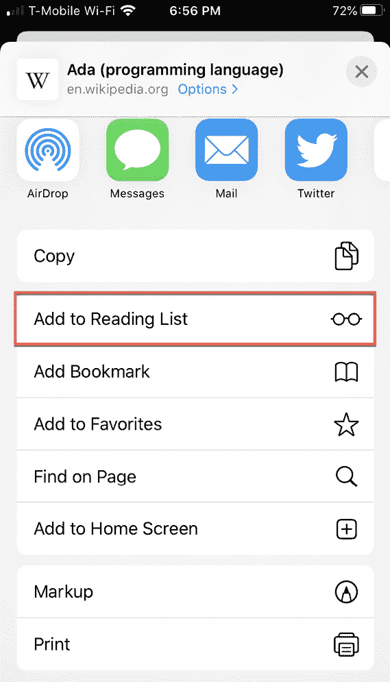

    图 9.27 – 添加到阅读列表的命令

1.  轻触**添加到阅读列表**。

一旦您将一个或多个网页保存到阅读列表中，您将来就可以随时阅读它们。

## 在阅读列表中查看网页

阅读列表让您能够保存要阅读的网页列表。只需记住，如果该网页的内容在未来发生变化，您只能阅读您在将其添加到阅读列表时保存的内容。

要阅读阅读列表中保存的网页，请按照以下步骤操作：

1.  在主屏幕上轻触**Safari**应用。Safari 屏幕出现。

1.  在屏幕底部轻触书签图标。

1.  轻触阅读列表图标。会出现如图 9.28 所示的已保存网页列表：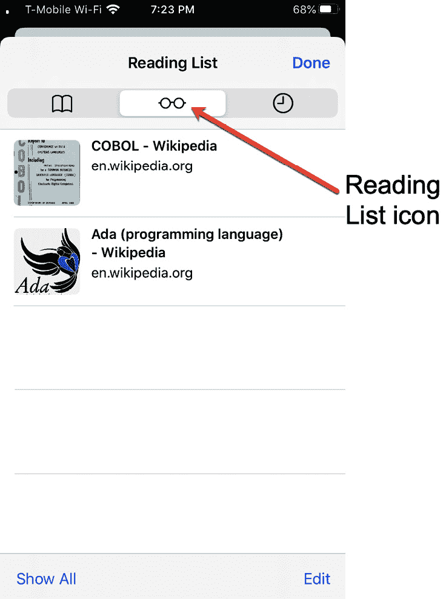

    图 9.28 – 阅读列表

1.  轻触要阅读的网页。

当您选择一个保存的网页进行阅读时，Safari 会自动将该网页从阅读列表中删除。

## 删除阅读列表中的网页

有时候，您可能将网页保存到阅读列表中，但后来决定您想在不阅读的情况下将其删除。要从阅读列表中删除网页，请按照以下步骤操作：

1.  在主屏幕上轻触**Safari**应用。Safari 屏幕出现。

1.  在屏幕底部轻触书签图标。

1.  轻触阅读列表图标。出现一个已保存网页的列表（见*图 9.28*）。

1.  在屏幕右下角轻触**编辑**。每个已保存网页左侧出现空圆圈。

1.  轻触图*9.29*中所示的一个或多个你想要删除的网页左侧的圆圈：

    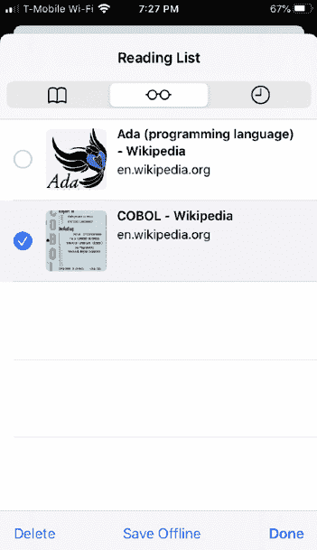

    图 9.29 – 在阅读列表中选择要删除的网页

1.  在屏幕左下角轻触**删除**。

1.  在屏幕右上角轻触**完成**。

在阅读列表中保存网页可以在将来为你提供阅读材料，但如果你想要轻松与他人分享有趣的网页，你需要知道如何轻松分享网站。

# 分享网站

很可能你会遇到一个包含有趣、搞笑或有用信息的网页，你可能想要与朋友、亲戚或同事分享。分享网站的三种常见方式如下：

+   通过电子邮件

+   通过短信

+   通过 AirDrop

要分享一个网站，请按照以下步骤操作：

1.  在主屏幕上轻触**Safari**应用。Safari 屏幕出现。

1.  访问你想要与他人分享的网页。

1.  在屏幕底部轻触分享图标。屏幕底部出现一个面板，显示代表你最近联系过的人的图标，以及**AirDrop**、**消息**和**邮件**图标，如图*图 9.30*所示：

    图 9.30 – 分享网页

1.  轻触代表最近联系人的图标，或者轻触**AirDrop**、**消息**或**邮件**图标。然后，指定你想要发送所选网站给的人。

通过与他人分享网站，你可以传递其他人可能永远找不到的信息。当人们收到你的网站链接时，他们只需轻触或点击即可访问该网站，而无需输入任何长的网站地址。

# 使用 Safari 搜索

当你知道你想要访问的特定网站时，你可以输入该网站地址。然而，很多时候，你可能知道你想要查找的信息，但不知道要访问的特定网站。

那时你需要搜索你想要的信息。要在 Safari 中搜索，请按照以下步骤操作：

1.  在主屏幕上轻触**Safari**应用。Safari 屏幕出现。

1.  在屏幕顶部的文本字段中轻触并输入一个定义你想要查找的单词或短语，例如`猫品种`或`鱼食谱`。

1.  在虚拟键盘右下角轻触蓝色**前往**按钮。Safari 显示与你的搜索条件匹配的网站列表。

当 Safari 在互联网上搜索时，它依赖于如 Google 之类的搜索引擎。如果你对搜索信息的结果不满意，尝试更改 Safari 使用的搜索引擎。

要定义 Safari 的搜索引擎，请按照以下步骤操作：

1.  在主屏幕上轻触**设置**应用。**设置**屏幕出现。

1.  点击**Safari**。将出现**Safari**设置屏幕。

1.  点击**搜索引擎**。将出现一个搜索引擎列表，如图 9.31 所示：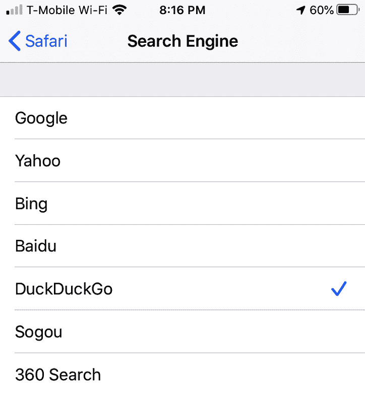

    图 9.31 – 为 Safari 选择搜索引擎

1.  点击要使用的搜索引擎，例如**Yahoo**或**Baidu**。

搜索引擎各有其优势和劣势，所以尝试不同的搜索引擎，直到你找到每次使用 Safari 搜索时都能持续给出最佳结果的搜索引擎。

# 摘要

iPhone 的有用之处不仅在于打电话或发送短信，还在于将电脑放入口袋，以便你可以访问互联网。通过 Safari，你可以浏览互联网上的任何网站。

几乎每个人在某个时候都需要上网搜索，所以请确保你知道如何搜索，并在必要时切换搜索引擎。如果你找到一个特别有用或有趣的网站，可以与你的朋友分享，或者将其添加到书签中，以便以后找到。

你还可以通过电子邮件分享网站，所以阅读下一章，它将重点介绍所有不同的阅读、编写和整理电子邮件消息的方法。
