# 第十六章：*第十六章*: 使用地图获取方向

当您在一个不熟悉的街区时，您可能不知道您在哪里或如何到达您想去的地方。即使您在城镇的熟悉地区，您可能也不知道如何到达某些地方，例如商店、公园或建筑物。为了帮助您四处走动，您需要一张地图。

当然，纸质地图很快就会过时，因此更好的解决方案是在您的 iPhone 上使用地图应用。地图应用不仅可以在您有蜂窝电话或 Wi-Fi 连接的情况下准确显示您的位置，而且还可以提供全球各大城市的路线。

使用 iPhone 和地图应用，您将不再有迷路的风险，无论是寻找您家附近的新地方，还是试图导航世界的陌生地区。

本章涵盖的主题如下：

+   自定义地图应用

+   获取方向

+   在您周围搜索

+   创建收藏位置

+   在地图上放置标记

+   使用指南针

+   改变地图的外观

# 自定义地图应用

在您开始使用**地图**应用之前，您可能想要对其进行自定义，例如更改是否显示英里或千米距离，以及是否将驾驶或公共交通设置为默认的显示交通类型。

要自定义地图应用，请按照以下步骤操作：

1.  点击主屏幕上的**设置**应用。出现**设置**屏幕。

1.  向下滚动并点击**地图**。**地图**屏幕显示您可以选择的设置，如图 16.1 所示：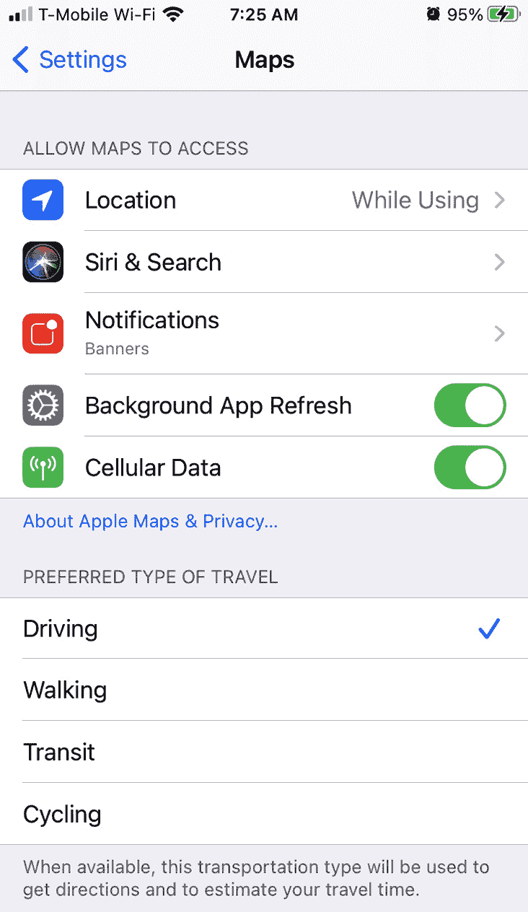

    图 16.1 – 自定义地图应用的设置

1.  向下滚动并选择您希望设置的选项，例如将距离设置为英里或千米，或将默认交通类型从驾驶更改为公共交通。

1.  点击**导航与指南**。出现**导航与指南**屏幕，如图 16.2 所示：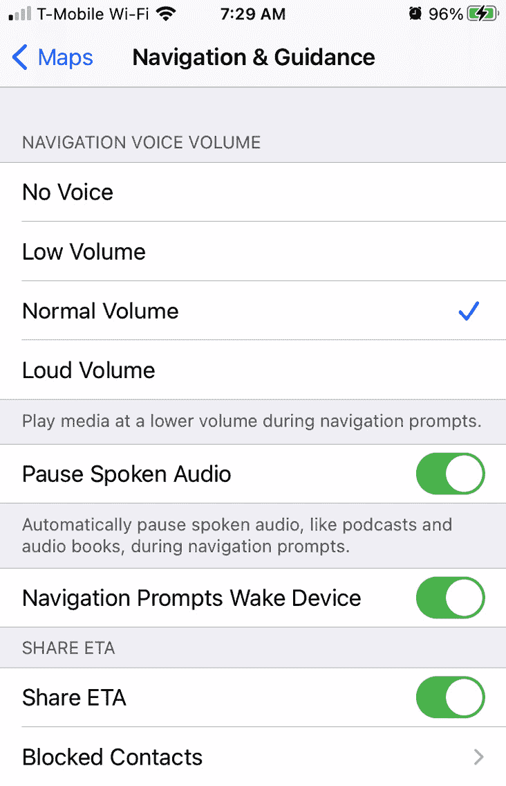

    图 16.2 – 自定义地图应用的设置

1.  点击任何其他选项，例如调整听方向时的音量。

1.  点击屏幕左上角的**返回**按钮返回到**地图**屏幕。

一旦您使用您喜欢的选项自定义了地图应用，您就可以开始使用**地图**来获取您想去的地方的路线。

# 获取方向

无论您身在何处，除非您知道您现在的位置，否则您无法到达新的位置。为了熟悉地图应用，请按照以下步骤操作：

1.  点击主屏幕上的**地图**应用。蓝色圆点将突出显示您的当前位置，如图 16.3 所示：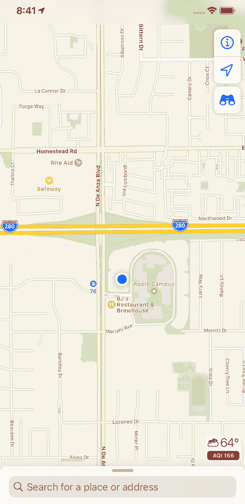

    图 16.3 – 蓝色圆点突出显示您的当前位置

1.  在屏幕上用两个手指捏合以查看更多细节，如图 16.4 所示：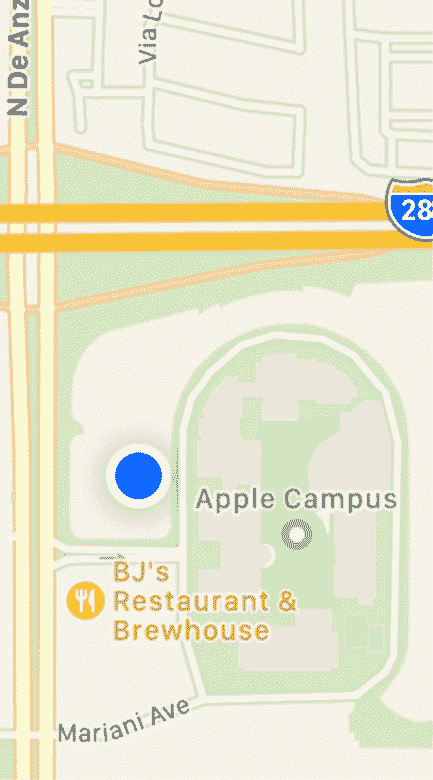

    图 16.4 – 双指捏合放大

1.  在屏幕上进一步分开两根手指以缩小地图，如图 16.5 所示：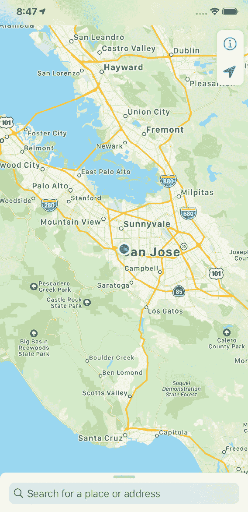

    图 16.5 – 双指分开缩小

1.  轻触屏幕底部的**搜索**文本框。会出现一个虚拟键盘，并列出最近的搜索以及常见的搜索地点，如图 16.6 所示：

    图 16.6 – 使用搜索文本框

1.  在虚拟键盘的右下角轻触**搜索**按钮，输入一个地点或街道地址。你的搜索结果会出现，如图 16.7 所示：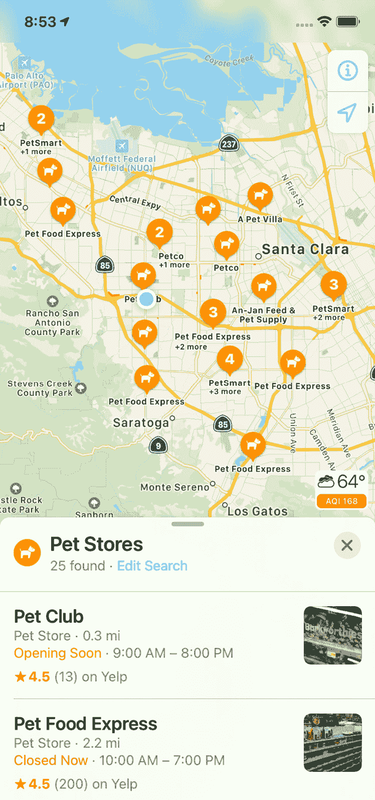

    图 16.7 – 查看搜索结果

1.  （可选）：轻触一个位置（如果你搜索的是某种场所，如加油站或餐厅）。**地图**应用会以更详细的方式显示你选择的位置，并带有**路线**按钮，如图 16.8 所示：

    图 16.8 – 路线按钮

1.  轻触**路线**按钮。**地图**应用显示不同的路线和选项，如驾车、步行或公共交通，如图 16.9 所示：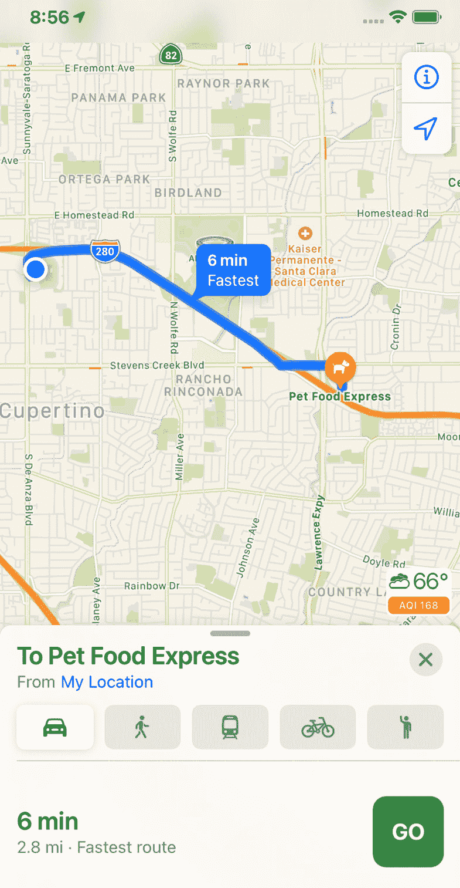

    图 16.9 – 显示路线

1.  （可选）：轻触屏幕底部的不同图标，例如步行或公共交通，以查看到达目的地的不同选项，如图 16.10 所示：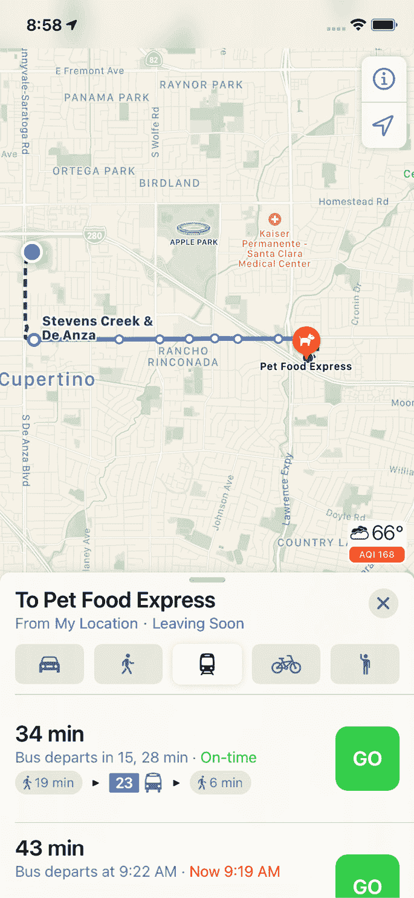

    图 16.10 – 显示替代的旅行方式

1.  轻触**前往**按钮以获取路线。**地图**应用在旅行过程中显示路线，如图 16.11 所示：

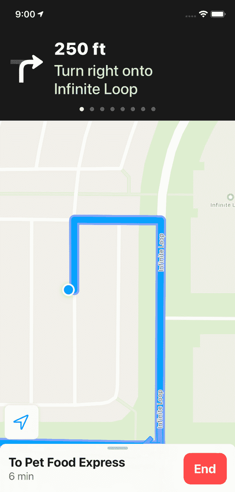

图 16.11 – 在前往目的地的过程中显示路线

有时候你可能想去某个地方，但在路上停下来取食物或为你的车加油。与其创建两个单独的目的地，你可以在前往最终目的地时简单地创建一个绕行路线。

## 添加绕行路线

当你朝着目的地前进时，你可能想在路上停下来加油（如果你在开车）或者找些东西吃。这时，**地图**应用会显示最近的选项，这样你就可以选择一个，并在前往最终目的地之前获得前往该目的地的路线。

要添加绕行路线，请按照以下步骤操作：

1.  按照**获取路线**部分中的步骤开始前往选定的目的地。**地图**应用在屏幕底部显示一个表格，如图 16.12 所示：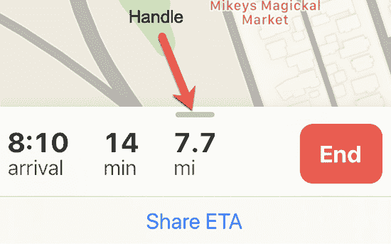

    图 16.12 – 屏幕底部的表格

1.  向上滑动把手以查看更多详细信息，如图*图 16.13*所示：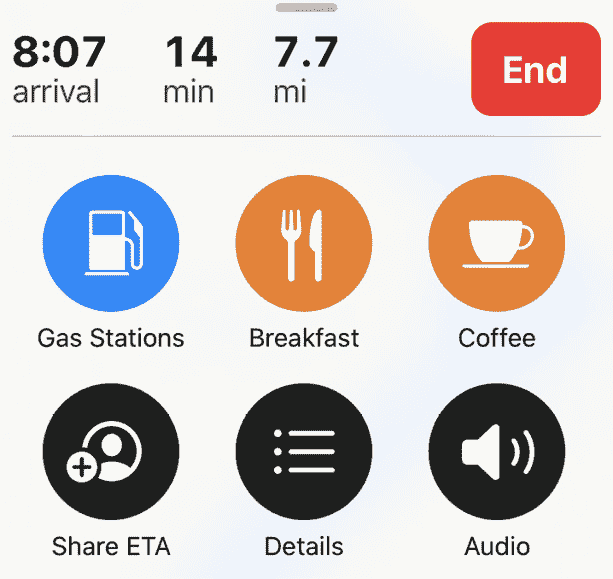

    图 16.13 – 屏幕底部完全展开的表格

1.  轻触一个绕行目的地，例如**加油站**或**咖啡店**。**地图**应用会显示一个选项列表。

1.  轻触一个选项。**地图**应用现在会为您提供绕行的路线。

当您到达十字路口或可以有多条路线选择的地方时，**地图**应用会为您提供路线。幸运的是，您可以看到完整的指令列表，这样您就可以提前知道您需要去哪里。

## 查看指令列表

在旅行过程中，**地图**应用会显示并告知您下一步去哪里。然而，您可能想查看所有指令的列表。要查看指令列表，请按照以下步骤操作：

1.  按照*获取方向*部分中的步骤操作，开始前往所选目的地。

1.  向上滑动把手以展开屏幕底部的整个表格（见图*图 16.13*）。

1.  轻触**详情**图标。会出现一个指令列表，如图*图 16.14*所示：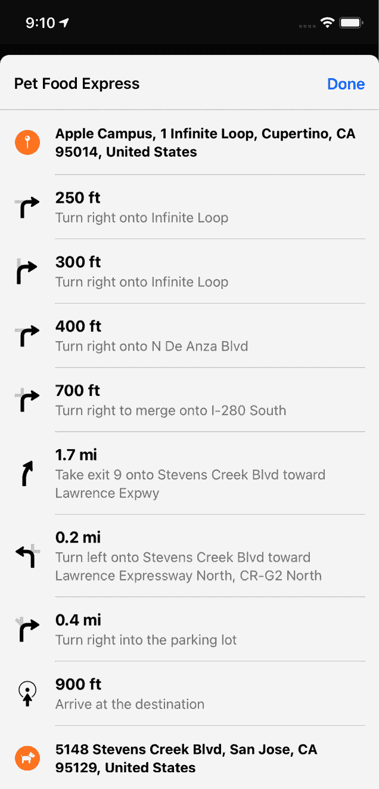

    图 16.14 – 旅行方向列表

1.  完成查看指令列表后，请轻触**完成**。

有时，您可能身处某个城镇的一部分，只想知道周围有什么，以便决定您想往哪个方向走。在这种情况下，**地图**应用可以显示您周围的情况，这样您就可以从附近的选项中选择您想走的路。

# 搜索周围

如果您在一个不熟悉的地方，您可能不知道您想去哪里，但您可能知道您想去餐厅、咖啡馆或超市。与其搜索特定位置，您可以让**地图**应用显示您周围的情况。

要查找您周围的情况，请按照以下步骤操作：

1.  在主屏幕上轻触**地图**应用。

1.  在**搜索**文本框中轻触。会出现最近搜索的列表以及附近地点的列表，如图*图 16.15*所示：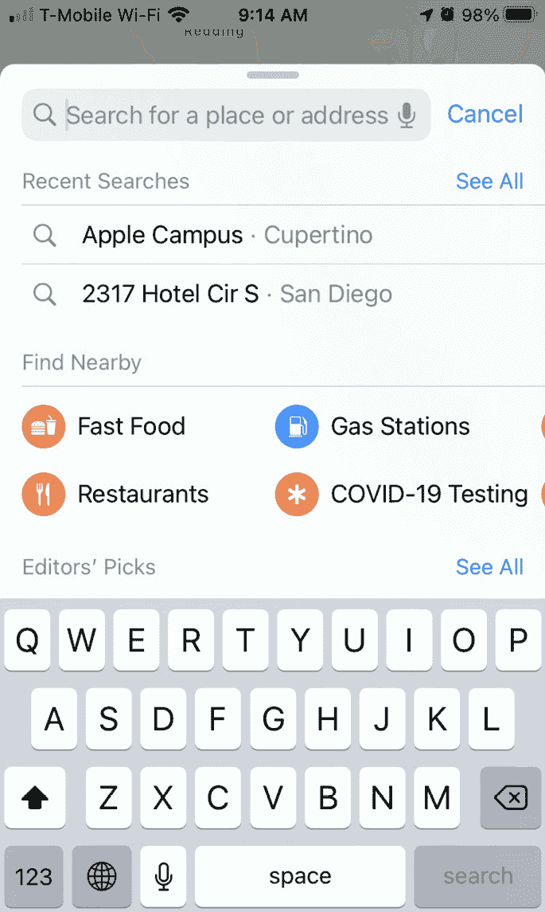

    图 16.15 – 附近地点列表

1.  轻触您想查找的地点类型，例如**杂货店**或**快餐店**。**地图**应用会显示一个选项列表，如图*图 16.16*所示：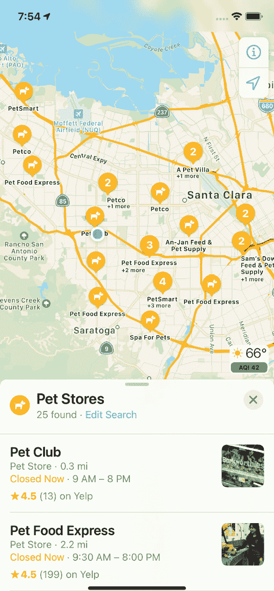

    图 16.16 – 显示您选择的类别的选项列表

1.  点击一个具体的地点。**地图**应用会显示一个**方向**按钮。

1.  轻触**驾驶**或**公交**，以查看您的路线。

在许多情况下，您可能会反复访问同一个地方。与其不断搜索它们，您可能更愿意将您喜欢的地点存储在一个列表中，这样您就可以快速访问而无需再次搜索。

# 创建收藏位置

您可能有一个喜欢的餐厅、夜总会、加油站和超市。为了方便找到您喜欢的位置，您可以将它们保存在列表中。这样，当您想访问您喜欢的位置之一时，您可以通过最少的搜索量获得路线。

第一步是找到您喜欢的位置，然后将其保存在您的收藏夹列表中。一旦您这样做，您就可以打开这个收藏夹列表，并通过一键点击获取到特定位置的路线。

要将位置保存在您的收藏夹列表中，请按照以下步骤操作：

1.  在主屏幕上点击**地图**应用。

1.  搜索您想要保存为收藏夹的位置，直到您看到蓝色的**路线**按钮。

1.  在屏幕底部附近的手柄上向上滑动，以显示整个选项列表，如图*图 16.17*所示：

    图 16.17 – 显示“保存到...”按钮

1.  点击**保存到...**按钮。出现集合列表。如果您还没有创建指南，将出现**新建指南...**按钮，如图*图 16.18*所示：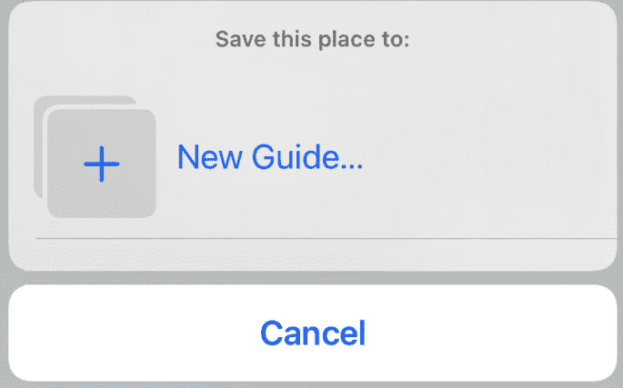

    图 16.18 – 向集合中添加位置

1.  点击**新建指南**按钮。出现**新建指南**屏幕，如图*图 16.19*所示：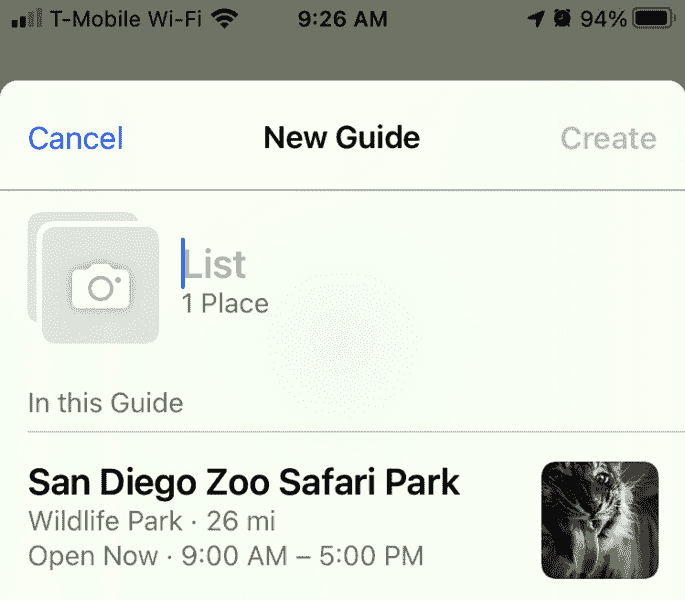

    图 16.19 – 新建指南屏幕

1.  为您的指南输入一个描述性的名称，然后点击**创建**。

一旦您创建了一个指南并至少添加了一个项目到该指南中，您就可以随时访问该收藏夹位置。

## 使用指南

一旦您在一个集合中存储了一个或多个位置，您就可以随时打开该集合以访问您存储的位置列表。

要获取到收藏夹位置的路线，请按照以下步骤操作：

1.  在主屏幕上点击**地图**应用。

1.  在屏幕底部附近的手柄上向上滑动，以显示完整的选项列表。**指南**类别列出了您创建的所有命名指南，如图*图 16.20*所示：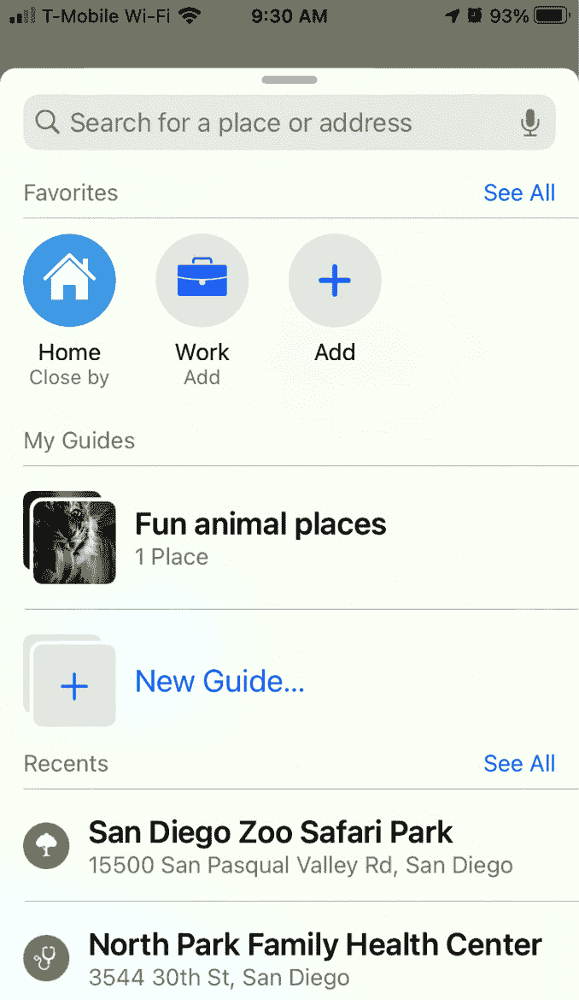

    图 16.20 – 已保存集合的列表

1.  点击您想要打开的指南名称。在该集合内部出现保存的位置列表。

1.  点击位置以显示蓝色的**路线**按钮。

1.  点击**路线**按钮以获取您喜欢位置的路线。

无论您多么喜欢一个位置，最终您可能想要删除该单个位置或整个存储您喜欢位置的集合。

## 删除指南中的位置

您可以删除整个指南（包括其中存储的任何位置），或者仅删除指南中的一个位置。

要删除整个指南或指南中的一个位置，请按照以下步骤操作：

1.  在主屏幕上点击**地图**应用。

1.  在屏幕底部附近向上滑动手柄，以显示完整的选项列表。指南类别列出了您创建的所有命名集合（参见*图 16.20*）。

1.  点击一个指南。在该指南中存储的收藏位置列表出现。

1.  在任何存储的位置上向左滑动。会出现一个**删除**按钮，如图*图 16.21*所示：

    图 16.21 – 删除按钮

1.  点击**删除**。（如果您点击**分享**按钮，您可以通过电子邮件、短信或 AirDrop 将位置信息发送给某人。）

如果您想删除整个指南而不是单个位置，请按照以下步骤操作：

1.  在主屏幕上点击**地图**应用。

1.  在屏幕底部附近向上滑动手柄以显示完整的选项列表。指南类别列出了您创建的所有命名指南（参见*图 16.20*）。

1.  向左滑动集合名称以显示**删除**按钮。

1.  点击**删除**。屏幕底部出现一条消息，询问您是否确实想删除整个集合。

1.  点击**删除**。

为了帮助您导航，您可能还希望在地图上添加标记以标识特定的兴趣区域。

# 在地图上放置标记

在纸质地图上，您可能会在某个特别重要的区域（如某人的房子或喜欢的徒步旅行区域）上乱涂乱画以突出显示。使用**地图**应用，您也可以添加标记来突出显示您希望突出的任何区域。

通过创建标记，您可以标识一个地点，并保存该位置以便您可以轻松再次找到它，或者与他人分享该位置，以便他们也可以找到它。

在地图上放置标记，请按照以下步骤操作：

1.  在主屏幕上点击**地图**应用。

1.  在屏幕上您想放置标记的位置按下并保持手指。会出现一个标记，如图*图 16.22*所示：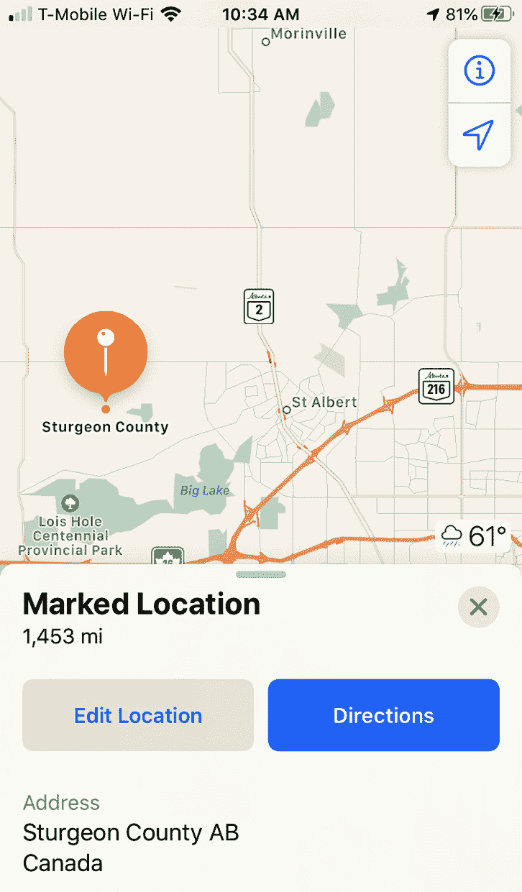

    图 16.22 – 放置标记

1.  点击**编辑位置**按钮。出现一个**编辑位置**屏幕，让您可以更精确地放置标记，如图*图 16.23*所示：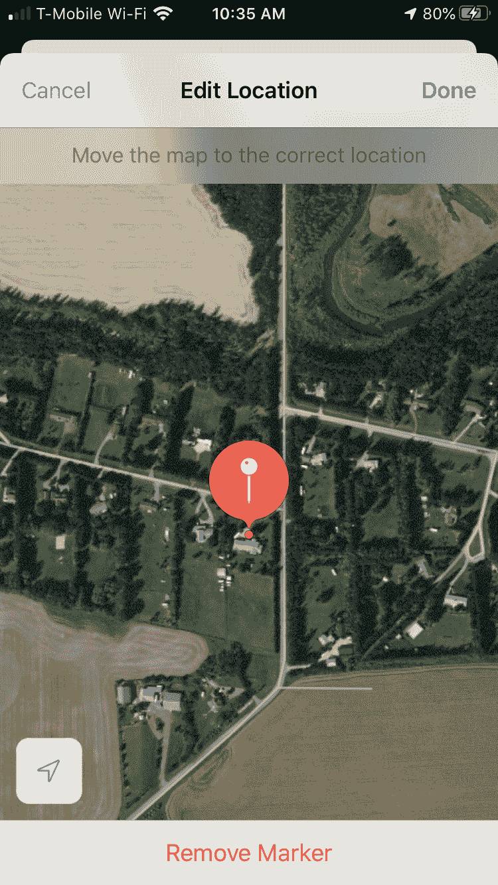

    图 16.23 – 放置标记

1.  滑动并捏合屏幕，精确地将标记放置在特定区域上方，然后点击**完成**。

1.  将手柄向上滑动以显示**标记位置**屏幕，如图*图 16.24*所示。此时，您可以点击**保存**按钮将此位置存储在指南中，或点击**分享**按钮将此位置与另一个人分享。您还可以点击**删除**从地图上移除标记：

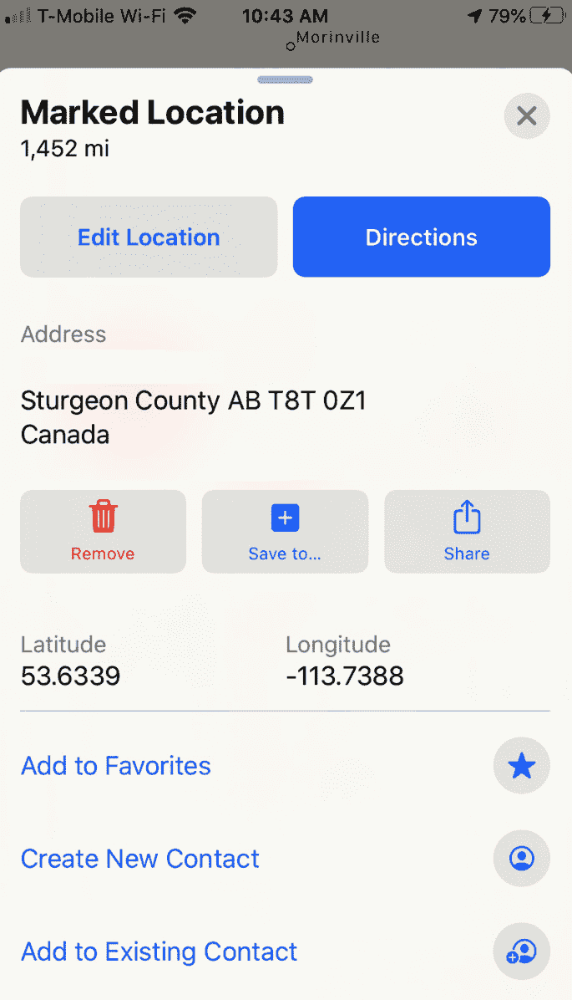

图 16.24 – 标记位置屏幕

标记可以帮助您自定义地图，但有时您可能不关心找到特定位置，而是使用指南针在特定方向上旅行。

# 使用指南针

如果你迷路了，需要向特定方向旅行，你可以将 iPhone 变成指南针。这样，你可以看到你想去的地方，并使用**地图**应用来显示如何继续朝你想要的方向前进。

要了解如何在**地图**应用中使用指南针，请按照以下步骤操作：

1.  点击主屏幕上的**地图**应用。

1.  用两个手指按在屏幕上并旋转屏幕，以在屏幕右上角显示指南针，如图 16.25 所示：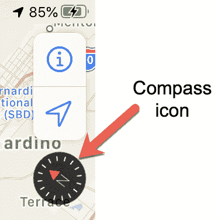

    图 16.25 – 地图应用中的指南针

1.  点击指南针图标，使其消失。

指南针可以帮助你在特定方向上导航。默认情况下，**地图**应用显示该区域的卡通版本，但你可以将这种外观切换为更逼真的卫星图像。

# 更改地图的外观

为了便于查看地图，**地图**应用显示该区域的卡通表示。然而，你还可以切换到逼真的卫星视图。

要更改地图的外观，请按照以下步骤操作：

1.  点击主屏幕上的**地图**应用。

1.  点击屏幕右上角的**I**图标。会出现一个**地图设置**表单，如图 16.26 所示：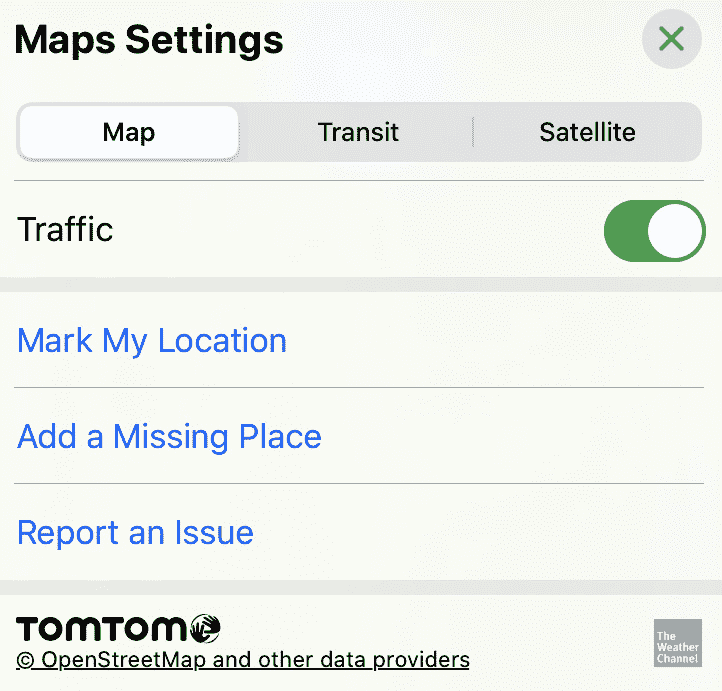

    图 16.26 – 地图设置屏幕

1.  点击**公交**标签页查看地图，突出显示公共交通路线，或点击**卫星**标签页查看地图的逼真照片版本，如图 16.27 所示：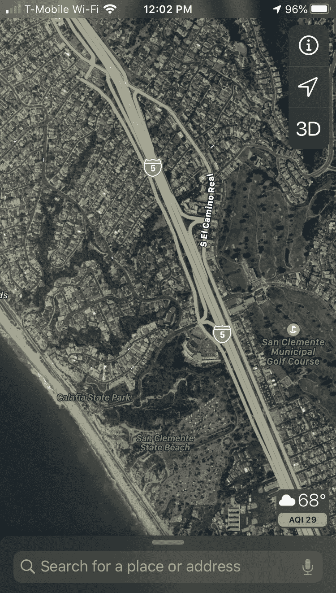

    图 16.27 – 地图的卫星视图

1.  点击表格右上角的关闭（**X**）图标，使其消失。

在任何时候，你都可以重复上述步骤，根据你的喜好切换到地图的另一个版本。

# 摘要

无论你是在不熟悉的地方旅行，还是在自己的社区内，地图应用都可能很有用，因为它可以显示到达特定目的地的最快路线。即使出现车祸或绕行，地图应用也会为你提供最快的路线，如果你更喜欢走不同的路，它还会提供替代路线。

除了使用地图应用获取路线外，你还可以使用地图应用定位喜欢的地点或场所，并将这些位置与他人分享。如果这些人也有 iPhone，他们可以通过驾车、步行或乘坐公共交通工具获得该位置的路线。

无论何时你需要去任何地方，地图应用都很方便。在旅行过程中，你也可能想知道你前往方向的风雨状况，或者如果你愿意，还可以跟踪时间或你的股票组合。

在下一章中，我们将探讨如何更改时间和天气设置以及获取股票信息。
