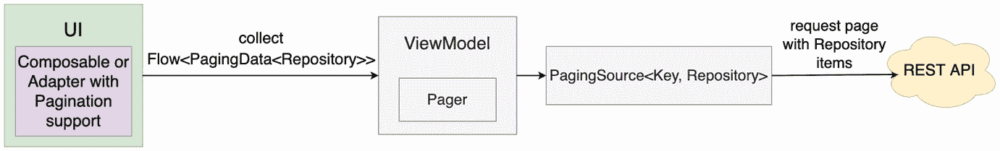
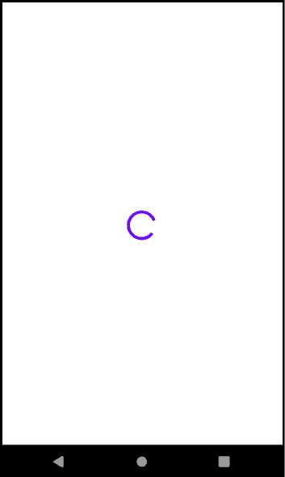
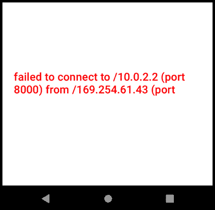
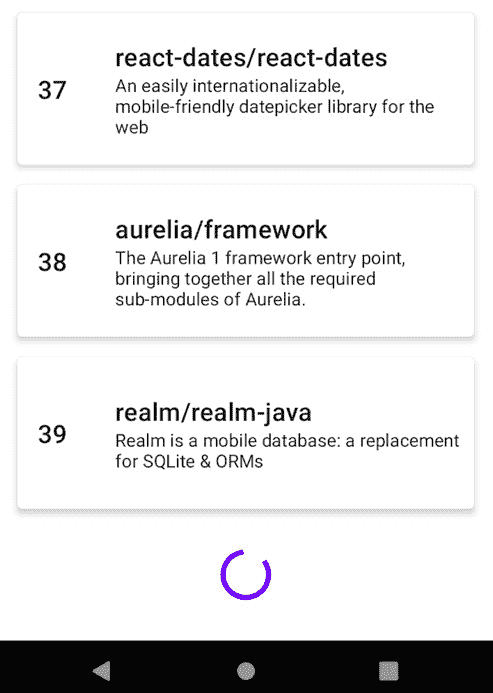
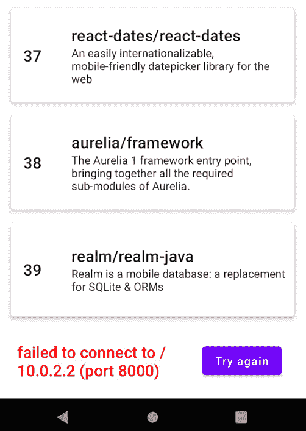

# 第十一章：*第十一章*：使用 Jetpack Paging 和 Kotlin Flow 创建无限列表

在前面的章节中，我们构建了伟大的餐厅应用，该应用显示了来自我们自己的后端的内容。然而，餐厅应用中显示的餐厅数量是固定的，用户只能浏览我们添加到 Firebase 数据库中的少数几家餐厅。

在本章中，我们将了解分页如何帮助我们显示大量项目数据集，而不会给后端施加压力，也不会消耗巨大的网络带宽。我们将在一个新应用中创建无限列表项目的印象，这个应用就是我们正在工作的 Repositories 应用，我们将借助另一个名为 **Paging** 的 Jetpack 库来实现这一点。

在第一部分，*为什么我们需要分页？*中，我们将探讨数据分页是什么以及它如何帮助我们将大型数据集拆分为数据页，从而优化我们应用与后端服务器之间的通信。接下来，在*导入和探索 Repositories 应用*部分，我们将探索一个将集成分页的项目：显示 GitHub 仓库信息的 Repositories 应用。

然后，在*使用 Kotlin Flow 处理数据流*部分，我们将介绍如何将分页内容表示为数据流，以及 Kotlin Flow 如何成为处理此类内容的绝佳解决方案。在最后一节，*探索 Jetpack Paging 的分页功能*中，我们首先将探索 Jetpack Paging 库作为我们在 Android 应用中处理分页内容的解决方案，然后，借助这个新库，我们将在我们的 Repositories 应用中集成分页功能，以创建无限列表仓库的错觉。

总结来说，在本章中，我们将涵盖以下部分：

+   为什么我们需要分页？

+   导入和探索 Repositories 应用

+   使用 Kotlin Flow 处理数据流

+   探索 Jetpack Paging 的分页功能

在深入之前，让我们为本章设置技术要求。

# 技术要求

构建本章的 Compose-based Android 项目通常需要你日常使用的工具。然而，为了顺利跟进，请确保你具备以下条件：

+   Arctic Fox 2020.3.1 版本的 Android Studio。你也可以使用更新的 Android Studio 版本，甚至是 Canary 构建，但请注意，IDE 界面和其他生成的代码文件可能与本书中使用的不同。

+   在 Android Studio 中安装了 Kotlin 1.6.10 或更高版本的插件

+   来自本书 GitHub 仓库的现有 Repositories 应用

本章的起点是你可以通过导航到本书 GitHub 仓库的 `Chapter_11` 目录，然后从 Android Studio 内导入 `repositories_app_starting_point_ch11` 目录找到的 Repositories 应用。不用担心，我们将在本章的后面一起完成这个操作。

要访问本章的解决方案代码，请导航到 `Chapter_11` 目录，然后在 Android Studio 中从 `repositories_app_solution_ch11` 目录导入。

您可以通过以下链接找到 `Chapter_11` 目录：

[`github.com/PacktPublishing/Kickstart-Modern-Android-Development-with-Jetpack-and-Kotlin/tree/main/Chapter_11`](https://github.com/PacktPublishing/Kickstart-Modern-Android-Development-with-Jetpack-and-Kotlin/tree/main/Chapter_11)

# 我们为什么需要分页？

假设我们有一个 Android 应用程序，允许你通过显示项目列表来探索 GitHub 仓库。它是通过使用 Retrofit 查询 GitHub **表示状态传输**（**REST**）**应用程序编程接口**（**API**）并获取应用内的固定数量的仓库来实现的。虽然 REST API 为每个仓库提供详细的信息，但应用只使用并显示仓库的标题和描述。

注意

不要混淆我们项目架构中抽象数据逻辑的仓库类与在我们的仓库应用中显示的 GitHub 仓库。

现在，让我们想象这个应用检索并显示 20 个仓库元素。因此，用户将能够滚动内容直到第 20 个元素，因此将能够可视化不超过 20 个元素。

但如果我们想允许用户在我们的列表中探索更多仓库呢？最终，应用的目的在于浏览更多的仓库，而不仅仅是 20 个。

我们可以更新网络调用，并一次性请求一个更大的元素列表。换句话说，我们可以重构我们的应用，在应用启动时一次性获取并显示 10,000 个仓库列表。

然而，采用这种方法，我们可以想到三个主要问题，如下所述：

+   `LazyColumn` 可用于以懒加载方式（当需要时）渲染 UI 元素，因此我们可以得出结论，这个问题可以很容易地解决。

+   **应用会对后端造成很大压力**——想象一下，如果每个 Android 应用客户端都从后端服务器请求 10,000 条数据库记录会发生什么——这些服务将不得不消耗大量资源来查询和返回这么多元素。

+   这样的 **超文本传输协议**（**HTTP**）请求和响应将导致由必须传输的大量 **JavaScript 对象表示法**（**JSON**）有效负载引起的高网络带宽消耗。所有 10,000 个元素可能包含许多字段和嵌套信息——很明显，在我们的应用和服务器之间发送这样的有效负载将非常低效。

虽然我们可以轻松解决第一个问题，但我们得出结论，第二个和第三个问题非常令人担忧。许多现实世界的应用程序和系统面临这些问题，为了减轻这些问题，采用了分页的概念，用于大多数基于客户端-服务器通信的关系，在这些关系中必须向最终用户显示大量数据集。

**分页**是一种对服务器友好的通信方法，它将大量结果分成多个较小的块。换句话说，如果您的后端支持分页，您的应用程序可以请求只获取部分数据（通常称为**页面**）并接收部分响应，从而允许在双方之间更快、更有效地传输。

当应用程序需要更多结果时，它只需请求另一页，再一页，依此类推。这种方法对应用和后端服务都有益，因为只有一小部分数据在某一时刻被提供和解释。

使用分页，如果用户决定只可视化一小部分项目然后切换到另一个应用，您的应用只会请求这一小部分数据。没有分页的情况下，在相同的情况下，您的后端会为您的应用提供整个项目的集合，而一些用户可能没有机会看到所有这些项目。这从您应用的角度来看是资源的浪费，但从您后端服务的角度来看尤其如此。此外，只有互联网上发送的大量负载中的一小部分是需要的。

要在 UI 上实现这种分页行为，对于移动应用来说有两种众所周知的 UI 方法，如下所述：

+   在一个类似于网页的屏幕上显示固定数量的项目。在这个页面上，有固定数量的滚动空间，因为如果用户想看到新项目，必须按下一个按钮来切换页面（通常表示特定页面的编号），然后加载并显示一组新数据，替换现有内容。

从移动**用户体验**（**UX**）的角度来看，这是一个糟糕的设计选择，因为与用于网页的显示器屏幕相比，在尺寸较小的设备（如手机）上滚动内容更为自然。

+   随着用户滚动，显示的项目列表会增长，从而产生列表无限的印象——这种做法通常被称为无限滚动。虽然没有无限列表这样的东西，但这种做法模仿了它。它从对初始页面/的几个请求开始，当用户滚动以查看更多元素时，它会动态地请求包含更多内容的更多页面。这种方法高度依赖于滚动，通常创造出更好的用户体验。

在本章中，我们将选择第二种方案——换句话说，我们将尝试实现分页以模拟无限列表效果。让我们也尝试在以下简化示例中可视化应用如何随着用户滚动而请求更多项目，其中**第 1 页**仅包含六个元素：

![图 11.1 – 观察如何通过分页实现无限列表

![img/B17788_11_01.jpg]

图 11.1 – 观察如何通过分页实现无限列表

为了让应用请求包含项目的第二页，用户必须进一步向下滚动，从而通知应用他们想要查看更多元素。

当应用捕捉到这个意图（因为用户到达列表的末尾）时，它会请求包含后端项目的第二页，使仓库列表增长，并允许用户浏览新内容。这个过程会不断重复，因为用户会不断到达列表的末尾。

在实现此分页方法之前，让我们首先了解我们的起点——GitHub 仓库应用！

# 导入并探索仓库应用

仓库应用项目是一个简单的应用，它显示从 GitHub 搜索 API 获取的仓库列表。该项目是 Compose 应用的一个简化版本，它只包含前几章中的一些概念，因为它试图成为实现分页的 Jetpack Paging 库的良好候选者，而不是一个完全实现的应用程序，该应用程序应用了书中教授的所有概念。

尽管如此，我们将看到仓库应用如何遵循`ViewModel`类来保持状态和展示数据，使用协程进行从服务器获取数据的**异步**（**async**）操作，以及使用 Compose 进行 UI 层。

让我们从将此项目导入 Android Studio 开始，如下所示：

1.  导航到本书的 GitHub 仓库页面，位于[`github.com/PacktPublishing/Kickstart-Modern-Android-Development-with-Jetpack-and-Kotlin`](https://github.com/PacktPublishing/Kickstart-Modern-Android-Development-with-Jetpack-and-Kotlin)。

1.  下载仓库文件。您可以通过按下**代码**按钮，然后选择**下载 zip**来完成此操作。

1.  解压下载的文件，并记住您这样做的地方。

1.  打开 Android Studio，点击**文件**选项卡，然后选择**打开**。

1.  搜索您解压项目文件的目录。一旦找到，导航到`Chapter_11`目录，选择`repositories_app_starting_point_ch11`目录，然后按**打开**。

1.  在您的测试设备上运行应用程序。

您应该注意到我们的仓库应用显示了一个仓库列表，列表中每个仓库项目的索引显示在左侧，如下面的截图所示：

![图 11.2 – 观察没有分页的仓库应用

![img/B17788_11_02.jpg]

图 11.2 – 查看未启用分页的仓库应用

如果你继续向下滚动，你会注意到只能查看 20 个元素。这意味着我们的应用不支持分页，用户只能浏览 20 个仓库。

如果我们查看`RepositoriesApiService.kt`文件，我们会注意到我们的应用通过`@GET()`端点**统一资源定位符**（**URL**）指令 REST API 获取仓库的第一页，每次只获取每页 20 个项目，如下面的代码片段所示：

```java
interface RepositoriesApiService {
   @GET("repositories?q=mobile&sort=stars&page=1&per_page=20")
   suspend fun getRepositories(): RepositoriesResponse
}
```

如果你查看请求中硬编码的参数，你会注意到我们的应用总是请求仓库的第一页。此外，因为它可以指定页码，这显然意味着我们访问的后端支持分页，但因为我们总是请求页码`1`，所以我们的应用没有利用这一点。

更具体地说，当应用执行此请求时，它将从索引为`1`的页面从后端检索 20 条记录。在本章的后面部分，我们将学习如何进行多个网络调用，请求不同的页码，从而实现分页。

注意

如果你想要构建一个支持分页的应用，你必须首先确保你的后端支持分页，就像 GitHub 搜索 API 一样。记住，分页的整个目的是减轻后端 API 的工作负担，并最小化与检索大量 JSON 有效负载相关的网络带宽消耗，所以如果你的后端不支持分页，你无法在你的应用中实现分页。

让我们简要地看一下我们从 GitHub API 收到的响应，通过导航到`Repository.kt`文件。基本上，我们得到一个`Repository`对象的列表，并解析仓库的`id`、`name`和`description`值，如下面的代码片段所示：

```java
data class RepositoriesResponse(
    @SerializedName("items") val repos: List<Repository>
)
data class Repository(
    @SerializedName("id")
    val id: String,
    @SerializedName("full_name")
    val name: String,
    @SerializedName("description")
    val description: String)
```

如前所述，我们的应用使用了 GitHub 搜索 API，这可以在`DependencyContainer.kt`类中更好地观察到，其中手动构建了 Retrofit 的`RepositoriesApiService`依赖项，并传递了此 API 的基本 URL。你可以查看此过程的代码如下所示：

```java
object DependencyContainer {
    val repositoriesRetrofitClient: RepositoriesApiService =         
        Retrofit.Builder()
            .addConverterFactory(GsonConverterFactory.create())
            .baseUrl("https://api.github.com/search/")
            .build().create(RepositoriesApiService::class.java)
}
```

如果你想要了解更多关于本章中使用的 API 的信息，请访问 GitHub 搜索 API 的官方文档，网址为[`docs.github.com/en/rest/search#search-repositories`](https://docs.github.com/en/rest/search#search-repositories)。

现在，回到我们的仓库应用，如果我们导航到`RepositoriesViewModel.kt`文件，我们会看到我们的`ViewModel`类使用`RepositoriesApiService`依赖项通过启动协程并将结果设置为一个包含`Repository`对象列表的 Compose `State`对象来获取仓库列表。代码如下所示：

```java
class RepositoriesViewModel(
    private val restInterface: RepositoriesApiService
    = DependencyContainer.repositoriesRetrofitClient
) : ViewModel() {
    val repositories = mutableStateOf(emptyList<Repository>())
    init {
        viewModelScope.launch {
            repositories.value =
                restInterface.getRepositories().repos
        }
    }
}
```

使用 Jetpack ViewModel 启动协程并通过 Retrofit 获取数据的做法与我们在 Restaurants App 中所做的是非常相似的。

UI 层也与 Restaurants App 类似。如果我们导航到 `MainActivity.kt` 文件，我们可以看到我们的 `Activity` 类创建了一个 `ViewModel` 实例，检索了一个 Compose `State` 对象，获取了其类型为 `List<Repository>` 的值，并将其传递给一个可组合函数以消费它，如下面的代码片段所示：

```java
class MainActivity : ComponentActivity() {
    override fun onCreate(savedInstanceState: Bundle?) {
        super.onCreate(savedInstanceState)
        setContent {
            RepositoriesAppTheme {
                val viewModel: RepositoriesViewModel = 
                    viewModel()
                val repos = viewModel.repositories.value
                RepositoriesScreen(repos)
            }
        }
    }
}
```

消费 `Repository` 对象列表的可组合函数位于 `RepositoriesScreen.kt` 文件中，如下面的代码片段所示：

```java
@Composable
fun RepositoriesScreen(repos: List<Repository>) {
    LazyColumn(
        contentPadding = PaddingValues(
            vertical = 8.dp,
            horizontal = 8.dp)
    ) {
        itemsIndexed(repos) { index, repo ->
            RepositoryItem(index, repo) 
        }
    }
}
```

正如 Restaurants App 一样，我们屏幕级别的可组合组件使用 `LazyColumn` 可组合组件来优化 UI 在列表中渲染元素的方式。

对于我们尝试实现分页的用例，`LazyColumn` 的使用非常重要，因为我们不希望我们的 UI 渲染成千上万的 UI 元素。幸运的是，正如我们所知，`LazyColumn` 已经为我们解决了这个问题，因为它只组合和布局屏幕上的可见元素。

现在，你可能已经注意到 `RepositoriesScreen` 可组合组件使用了我们在 Restaurants App 中使用的 `itemsIndexed()` 和 `items()` 函数。这是因为，由于我们的应用将支持分页，我们希望显示屏幕上显示的元素的索引，以便更好地理解我们现在在哪里。为了获取屏幕上可见的可组合项的索引，`itemsIndexed()` 函数为我们提供了这种信息。

最后，让我们简要地看一下显示 `Repository` 对象内容的 `RepositoryItem` 可组合组件的结构，同时渲染仓库的索引，如下所示：

```java
@Composable
fun RepositoryItem(index: Int, item: Repository) {
    Card(
        elevation = 4.dp,
        modifier = Modifier.padding(8.dp).height(120.dp)
    ) {
        Row(
            verticalAlignment = Alignment.CenterVertically,
            modifier = Modifier.padding(8.dp)
        ) {
            Text(
                text = index.toString(),
                style = MaterialTheme.typography.h6,
                modifier = Modifier
                    .weight(0.2f)
                    .padding(8.dp))
            Column(modifier = Modifier.weight(0.8f)) {
                Text(
                    text = item.name,
                    style = MaterialTheme.typography.h6)
                Text(
                    text = item.description,
                    style = MaterialTheme.typography.body2,
                    overflow = TextOverflow.Ellipsis,
                    maxLines = 3)
            }
        }
    }
}
```

现在我们已经简要介绍了 Repositories App 的当前状态，我们可以得出结论，它确实需要分页来显示更多仓库，尤其是在 GitHub 搜索 API 支持分页的情况下。现在是时候探讨另一个 pagination 强迫我们注意的重要方面，那就是数据流的概念。

# 使用 Kotlin Flow 处理数据流

如果我们想让我们的应用以无限列表的形式支持分页，很明显，我们现有的通过一次性的请求后端并导致一次 UI 更新的方法是不够的。

让我们先看一下以下代码片段，看看我们的 `RepositoriesViewModel` 类是如何请求数据的：

```java
class RepositoriesViewModel(
    private val restInterface: RepositoriesApiService =  [...]
) : ViewModel() {
    val repositories = mutableStateOf(emptyList<Repository>())
    init {
        viewModelScope.launch {
            repositories.value =
                restInterface.getRepositories().repos
        }
    }
}
```

当 `ViewModel` 初始化时，它在一个协程内部执行 `getRepositories()` 挂起函数。挂起函数返回一个 `Repository` 对象列表，并将其传递给 `repositories` 变量。这意味着我们的 `ViewModel` 以一次性调用挂起函数的形式进行一次性的数据请求——在用户滚动列表时不会进行其他请求以获取新的仓库。这就是为什么我们的应用程序从后端接收一个包含数据（对象初始列表）的单个事件作为单个结果。

我们可以想象，调用与我们的应用程序中类似的 `getRepositories()` 挂起函数将同样返回一次性响应，因为它的返回类型将是 `List<Repository>`，如下面的截图所示：

![图 11.3 – 使用挂起函数观察单次数据结果

![img/B17788_11_03.jpg]

图 11.3 – 使用挂起函数观察单次数据结果

注意

虽然我们的 `ViewModel` 包含一个类型为 `MutableState` 的 `repositories` 变量，这意味着它的值可以在时间上改变，但我们不会使用 Compose `State` 对象来观察数据层的变化，因为这会破坏层的职责。目前，在我们的代码中，我们调用一个返回单个结果或一组数据的挂起函数，该结果异步地传递给 `repositories` 变量，因此尽管我们的 UI 状态可以随时间改变，但它只接收一个更新。

为了支持无限列表，我们必须以某种方式设计我们的应用程序以接收随时间推移的多个结果，就像接收数据流一样。换句话说，我们的应用程序必须在用户滚动时请求新的 `Repository` 对象，从而接收包含多个事件的数据，而不仅仅是单个事件。每当有新的数据事件到来时，我们的应用程序应该获得一个新的 `Repository` 对象列表，其中现在包含了新接收的仓库。

要使我们的 `ViewModel` 以数据流的形式接收多个数据事件，我们可以使用 Flow。Kotlin 的 **Flow** 是建立在协程之上的数据类型，它公开了一个异步计算的多值流。

与只发出单个结果的挂起函数不同，Flow 允许我们在时间上顺序地发出多个值。然而，就像挂起函数以异步方式发出结果，你可以在协程中稍后获取一样，Flow 也以异步方式发出结果，因此你必须从启动的协程中观察其结果。

您可以使用 Flow 来监听来自各种来源的事件；例如，您可以使用 Flow 在用户位置每次改变时获取位置更新。或者，您可以使用 Flow 从您的 Room 数据库获取连续更新——而不是每次插入或更新项目时都手动查询数据库，您可以告诉 Room 返回一个流，该流将在您执行插入、更新等操作时发出包含最新内容的更新。

回到我们关于仓库的例子，让我们假设我们的 `getRepositories()` 函数不再是一个挂起函数，而是返回一个包含类型为 `List<Repository>` 的数据的流，如下面的截图所示：

![图 11.4 – 使用 Kotlin Flow 随时间观察多个结果]

![图片 B17788_11_04.jpg]

![图 11.4 – 使用 Kotlin Flow 随时间观察多个结果]

正如 Compose 的 `State` 对象持有特定类型的数据（例如，`State<Int>` 发射 `Int` 类型的值）一样，Flow 也持有特定类型的数据；在我们之前的例子中，该类型是我们感兴趣发射的数据类型，即 `List<Repository>`。

但我们如何观察流的发出值呢？

让我们以前面的例子为例，其中 `getRepositories()` 方法返回一个 `Flow<List<Repository>>` 实例，并假设我们正在尝试在一个 UI 组件中观察其值，如下所示：

```java
class SomeViewModel(…) : ViewModel() {
    init {
        viewModelScope.launch {
            getRepositories().collect { repos ->
                // Update UI
            }
        }
    }
    […]
}
```

由于流异步发出值，我们在启动的协程中获得了 `Flow<List<Repository>>` 实例，然后调用了 `.collect()` 方法，该方法反过来提供了一个代码块，我们可以在这里消费 `List<Repository>` 值。

与从挂起函数调用中获取此类列表相反，重要的是要记住流发出的值会随时间变化（或者至少应该变化）。换句话说，对于每个提供存储在 `repos` 变量中的值的回调，其类型为 `List<Repository>` 的值的内容可能不同，这允许我们在每次新的发射中更新 UI。

在本节中，我们探讨了流是什么以及我们如何消费它。然而，Kotlin Flow 是一个非常复杂的话题；例如，我们不会涵盖您创建流的方式或如何修改产生的流。如果您想了解更多关于 Flow 的信息，请查看官方 Android 文档：[`developer.android.com/kotlin/flow`](https://developer.android.com/kotlin/flow)。

现在我们来探索拼图中最后一块缺失的拼图——分页库。

# 探索使用 Jetpack Paging 的分页

要在我们的仓库应用中实现无限列表的仓库，我们必须找到一种方法，当用户滚动现有列表并到达底部时，请求更多仓库，从而动态添加新元素。而不是手动决定用户何时接近当前仓库列表的底部，然后触发网络请求以获取新项目，我们可以使用 Jetpack Paging 库，它将所有这些复杂性隐藏起来。

**Jetpack Paging** 是一个库，帮助我们从大量数据中加载和显示数据页，无论是通过网络请求还是从我们的本地数据存储，从而允许我们节省网络带宽并优化系统资源的利用。

在本章中，为了简单起见，我们将使用 Paging 库来显示从网络源（即 GitHub 搜索 API）获取的无限列表仓库，而不涉及本地缓存。

注意

Jetpack Paging 库现在处于其第三个实现迭代，通常被称为 Paging 3 或 Paging v3。在本章中，我们将使用这个最新版本，因此尽管我们只是简单地称之为 Jetpack Paging，但实际上我们指的是 Jetpack Paging 3。

Jetpack Paging 库抽象了与请求正确页面的复杂性，这取决于用户的滚动位置。实际上，它带来了许多好处，例如以下内容：

+   避免数据请求重复——你的应用程序只有在需要时才会请求数据；例如，当用户到达列表末尾并且必须渲染更多项目时。

+   分页数据默认在内存中缓存。在应用程序进程的生命周期内，一旦加载了一页，你的应用程序将永远不会再次请求它。如果你在本地数据库中缓存分页数据，那么你的应用程序在应用重启后等情况下不需要请求特定的页面。

+   分页数据以适合您需求的数据流类型暴露：Kotlin Flow、LiveData 或 RxJava。正如你可能猜到的，我们将使用 Flow。

+   对基于 View System 或 Compose 的 UI 组件的原生支持，当用户滚动到列表末尾时，这些组件会自动请求数据。有了这种支持，我们不必知道何时请求新的数据页，因为 UI 层会为我们自动触发。

+   由 UI 组件直接触发的重试和刷新功能。

在实际集成 Paging 库之前，让我们花点时间了解一下 Paging API 的主要组件部分。为了确保使用 Jetpack Paging API 在你的应用程序中实现分页，你必须使用以下内容：

+   一个 `PagingSource` 组件——定义分页内容的源数据。该对象决定请求哪一页，并从你的远程或本地数据源加载它。如果你希望你的分页内容既有本地又有远程数据源，你可以使用 Paging 库内置的 `RemoteMediator` API。有关更多信息，请参阅 *进一步阅读* 部分。

+   一个 `Pager` 组件——基于定义的 `PagingSource` 组件，你可以构建一个 `Pager` 对象，该对象将公开 `PagingData` 对象的流。你可以通过将 `PagingConfig` 对象传递给其构造函数并指定数据的大小来配置 `Pager` 对象，例如。

`PagingData` 类是对你的分页数据的包装，包含对应页面的项目集合。`PagingData` 对象负责触发对新页面的查询，该页面包含的项目随后被转发到 `PagingSource` 组件。

+   一个支持分页的专用 UI 组件——为了消费分页内容的流，你的 UI 必须使用能够处理分页数据的专用 UI 组件。如果你的 UI 基于传统的 View 系统，你可以使用 `PagingDataAdapter` 组件。由于我们的 UI 层基于 Compose，`LazyColumn` 已经为我们处理了分页数据的消费（更多内容将在下一节中介绍）。

为了直观地了解所有这些组件应该如何配合，让我们看看以下示例，即在我们的 Repositories 应用程序中可能的 Paging 库实现：



图 11.5 – 观察 Paging 库 API 在 Repositories 应用程序中的使用

在 UI 层面，我们的可组合组件收集了一个包含 `PagingData<Repository>` 对象流的流。`PagingData` 对象包含一个 `Repository` 对象列表，在幕后，它负责将新页面的请求转发到 `PagingSource`，而 `PagingSource` 则从我们的 REST API 获取新项目。

在 `ViewModel` 内部，我们将有一个 `Pager` 对象，它将使用 `PagingSource` 的一个实例。我们将定义一个 `PagingSource` 对象，以便它知道要请求哪一页以及在哪里请求——即 GitHub 搜索 API。

现在我们已经涵盖了使用 Jetpack Paging 进行分页集成的理论方面，让我们看看在本节中我们将要完成哪些实际任务。我们将执行以下操作：

+   使用 Jetpack Paging 实现分页

+   实现加载和错误状态以及重试功能

让我们开始第一个任务：将分页集成到我们的 Repositories 应用程序中。

## 使用 Jetpack Paging 实现分页

在本节中，我们将集成分页到我们的 Repositories 应用程序中，并借助 Jetpack Paging 创建一个无限列表的仓库。为了实现这一点，我们将实现并添加上一节中描述的所有组件。

让我们开始吧！按照以下步骤进行：

1.  首先，在应用级别的`build.gradle`文件中，在`dependencies`块中，添加 Jetpack Paging 的 Compose Gradle 依赖项，如下所示：

    ```java
    dependencies {
        […]
        implementation "androidx.paging:
            paging-compose:1.0.0-alpha14"
    }
    ```

更新`build.gradle`文件后，请确保将项目与其 Gradle 文件同步。您可以通过点击**文件**菜单选项，然后选择**同步项目与 Gradle 文件**来完成此操作。

1.  接下来，让我们重构我们的 Retrofit `RepositoriesApiService`接口，通过从`@GET()`请求注解中移除硬编码的页面索引`1`，并添加一个表示我们想要获取的页面索引的`page`查询参数类型`Int`。代码如下所示：

    ```java
    interface RepositoriesApiService {
        @GET("repositories?q=mobile&sort=stars&per_page=20")
        suspend fun getRepositories(@Query("page") page:Int): 
            RepositoriesResponse
    }
    ```

在这些更改之前，我们总是获取仓库结果的首页。现在，我们已经更新了我们的网络请求，以利用分页 REST API 的力量——即根据用户的滚动位置请求不同的页面索引。

为了实现这一点，我们使用了 Retrofit 的`@Query()`注解，它基本上会将我们在`getRepositories()`方法中定义的`page`参数值插入到`GET`请求中。由于 GitHub 搜索 API 期望在 URL 请求中有一个`"page"`查询键，因此我们将`"page"`键传递给了`@Query()`注解。

1.  现在是时候构建一个`PagingSource`组件了，该组件将通过我们的`RepositoriesApiService`依赖项请求新页面，并跟踪要请求的页面，同时还要在内存中缓存之前检索到的页面。

在应用的根包中，创建一个名为`RepositoriesPagingSource`的新类，并将其以下代码粘贴到该类下面：

```java
class RepositoriesPagingSource(
    private val restInterface: RepositoriesApiService
    = DependencyContainer.repositoriesRetrofitClient,
) : PagingSource<Int, Repository>() {
    override suspend fun load(params: LoadParams<Int>)
            : LoadResult<Int, Repository> {
    }
    override fun getRefreshKey(
        state: PagingState<Int, Repository>,
    ): Int? {
        return null
    }
}
```

让我们分析我们刚刚添加的代码。此组件正在执行以下操作：

+   它负责请求新页面，因此它依赖于`RepositoriesApiService`作为`restInterface`构造函数字段。

+   它是一个`PagingSource`组件，因此它继承自`PagingSource`类，同时定义了以下内容：

+   作为页面索引类型的键——在我们的例子中，GitHub 搜索 API 需要一个表示页面索引的整数，因此我们将键设置为`Int`。

+   加载数据的类型——在我们的例子中，是`Repository`对象。

    +   实现以下两个必需的函数：

+   `load()`挂起函数，该函数由 Paging 库自动调用，应异步获取更多项目。此方法接受一个`LoadParams`对象，该对象跟踪有关信息，例如必须请求的页面（索引）的键（索引）或项目的初始加载大小。此外，此方法返回一个`LoadResult`对象，指示特定查询结果是否成功或失败。

+   `getRefreshKey()`函数，在刷新事件发生时被调用以获取并返回最新的页面键，以便用户返回到最新的已知页面（而不是第一个页面）。刷新事件可以来自各种来源，例如用户触发的手动 UI 刷新、数据库缓存失效事件、系统事件等等。

为了简单起见，也因为我们将不会实现刷新功能，我们将跳过实现`getRefreshKey()`方法，所以我们只是在方法的主体中返回`null`。然而，如果你也想支持这种行为，请查看*进一步阅读*部分，其中列出了额外的资源，以帮助你提供此方法的实现。

1.  现在我们已经涵盖了两个强制方法的用途，让我们实现我们真正感兴趣的`load()`函数。

此方法应返回一个`LoadResult`对象，因此首先添加一个`try`-`catch`块，并在`catch`块内部，通过传递捕获到的`Exception`对象返回`LoadResult.Error`实例，如下面的代码片段所示：

```java
class RepositoriesPagingSource(…) : […] {
    override suspend fun load(params: LoadParams<Int>)
    : LoadResult<Int, Repository> {
        try {
        } catch (e: Exception) {
            return LoadResult.Error(e)
        }
    }
    override fun getRefreshKey(…): Int? { … }
}
```

采用这种方法，如果新页面的请求失败，我们通过返回`LoadResult.Error`对象让 Paging 库知道发生了错误事件。

1.  接下来，在`try`块内部，我们首先必须获取并存储我们感兴趣的下一页。将下一页的索引存储在`nextPage`变量中，如下所示：

    ```java
    class RepositoriesPagingSource(…) : […] {
        override suspend fun load(params: LoadParams<Int>)
        : LoadResult<Int, Repository> {
            try {
                val nextPage = params.key ?: 1
            } catch (e: Exception) {
                return LoadResult.Error(e) 
            }
        }
        override fun getRefreshKey(…): Int? { … }
    }
    ```

我们通过访问`params`参数并获取其`key`字段来获取下一页的索引——这个字段将始终给我们提供必须加载的下一页的索引。如果是第一次请求页面，`key`字段将是`null`，所以在这种情况下我们默认为`1`。

1.  由于我们现在知道了我们需要加载的下一个仓库页面的索引，让我们通过调用`restInterface`的`getRepositories()`方法并传递新定义的`nextPage`参数来查询我们的 REST API 以获取该特定页面，如下所示：

    ```java
    class RepositoriesPagingSource(…) : […] {
        override suspend fun load(params: LoadParams<Int>)
                : LoadResult<Int, Repository> {
            try {
                val nextPage = params.key ?: 1
                val repos = restInterface
                    .getRepositories(nextPage).repos
            } catch (e: Exception) {
                return LoadResult.Error(e) 
            }
        }
        override fun getRefreshKey(…): Int? { … }
    }
    ```

在这一步中，我们还将在`reposResponse`变量中存储响应内的`Repository`对象列表。

1.  接下来，我们必须返回一个`LoadResult`对象，因为此时我们的 REST API 请求是成功的。让我们实例化并返回一个`LoadResult.Page`对象，如下所示：

    ```java
    class RepositoriesPagingSource(…) : […] {
        override suspend fun load(params: LoadParams<Int>)
                : […] {
            try {
                val nextPage = params.key ?: 1
                val repos = restInterface
                    .getRepositories(nextPage).repos
                return LoadResult.Page(
                    data = repos,
                    prevKey = if (nextPage == 1) null
                              else nextPage - 1,
                    nextKey = nextPage + 1)
            } catch (e: Exception) {
                return LoadResult.Error(e)
            }
        }
        override fun getRefreshKey(…): Int? { … }
    }
    ```

我们必须传递以下内容到`LoadResult.Page()`构造函数：

+   从新请求的页面到`data`参数的`Repository`对象列表。

+   新请求页面的上一个键到`prevKey`参数。这个键很重要，如果由于某种原因，之前的页面被无效化，并且当用户开始向上滚动时必须重新加载，这个键就很重要。大多数情况下，我们会从`nextPage`值中减去`1`，但我们还确保，如果我们刚刚请求了第一页（`nextPage`的值将是`1`），我们将向`prevKey`参数传递`null`。

+   在 `nextPage` 之后的关键参数是 `nextKey`。这是一个简单的参数，因为我们刚刚将 `nextPage` 的值增加了 `1`。

现在我们完成了 `PagingSource` 的实现，是时候构建 `Pager` 组件并获取分页数据流了。

1.  在 `RepositoriesViewModel` 内部，将 `RepositoriesApiService` 依赖项替换为新创建的 `RepositoriesPagingSource` 类，如下所示：

    ```java
    class RepositoriesViewModel(
        private val reposPagingSource:
        RepositoriesPagingSource = RepositoriesPagingSource()
    ) : ViewModel() {
    }
    ```

同时，我们确保从 `RepositoriesViewModel` 中移除任何现有的实现，为即将进行的步骤留出空白。

1.  仍然在 `RepositoriesViewModel` 中，定义一个 `repositories` 变量，它将保存我们的分页数据流，如下所示：

    ```java
    import kotlinx.coroutines.flow.Flow
    class RepositoriesViewModel(
        private val reposPagingSource:
        RepositoriesPagingSource = RepositoriesPagingSource()
    ) : ViewModel() {
        val repositories: Flow<PagingData<Repository>>
    }
    ```

包含 `Repository` 项的分页内容位于 `PagingData` 容器中，使我们的数据流类型为 `Flow<PagingData<Repository>>`。

现在，我们必须实例化我们的 `repositories` 变量。然而，创建一个流并非易事，尤其是在数据（仓库列表）必须随着用户滚动而增长的情况下。Paging 库为我们解决了这个问题，因为它将隐藏这种复杂性，并为我们提供一个按预期发出数据的流：当用户滚动到列表的末尾时，会向后端发出新的请求，并将新的 `Repository` 对象附加到列表中。

1.  获取分页数据流的第一个步骤是创建一个基于之前创建的 `PagingSource` 对象的 `Pager` 类实例，如下所示：

    ```java
    class RepositoriesViewModel(
        private val reposPagingSource:
        RepositoriesPagingSource = RepositoriesPagingSource()
    ) : ViewModel() {
        val repositories: Flow<PagingData<Repository>> =
            Pager(
                config = PagingConfig(pageSize = 20),
                pagingSourceFactory = {
                    reposPagingSource
                })
    }
    ```

要创建一个 `Pager` 实例，我们调用了 `Pager()` 构造函数并传递了以下内容：

+   一个 `PagingConfig` 对象，其 `pageSize` 值为 `20`（将此值与从后端请求的仓库数量相匹配）传递给 `config` 参数。

+   将 `RepositoriesPagingSource` 类型的 `reposPagingSource` 实例传递给 `pagingSourceFactory` 参数。这样做，Paging 库将知道查询新页面的 `PagingSource` 对象。

1.  最后，为了获取来自新创建的 `Pager` 实例的数据流，我们只需访问由结果 `Pager` 实例公开的 `flow` 字段，如下所示：

    ```java
    class RepositoriesViewModel(...) : ViewModel() {
        val repositories: Flow<PagingData<Repository>> =
            Pager(
                config = PagingConfig(pageSize = 20),
                pagingSourceFactory = {
                    reposPagingSource
                }).flow.cachedIn(viewModelScope)
    }
    ```

在结果流上，我们还调用了 `cachedIn()` 扩展函数，确保只要传递的 `CoroutineScope` 对象保持活动状态，数据流就会保持活跃，然后返回它被调用的同一个流。由于我们希望分页内容在 `ViewModel` 保持内存中的情况下被缓存，我们将 `viewModelScope` 范围传递给这个扩展函数。这确保了在 `ViewModel` 生存的事件中（例如，配置更改）流也会被保留。

1.  现在，我们必须在我们的基于 Compose 的 UI 中获取流，因此，在 `MainActivity` 内部调用 `RepositoriesAppTheme()` 可组合函数时，将 `repos` 变量替换为包含对 `ViewModel` 的 `repositories` 流变量的引用的 `reposFlow` 变量，如下所示：

    ```java
    class MainActivity : ComponentActivity() {
        override fun onCreate(savedInstanceState: Bundle?) {
            super.onCreate(savedInstanceState)
            setContent {
                RepositoriesAppTheme {
                    val viewModel: RepositoriesViewModel = 
                        viewModel()
                    val reposFlow = viewModel.repositories
                    RepositoriesScreen()
                }
            }
        }
    }
    ```

1.  接下来，我们必须使用一个特殊的收集函数（类似于前一个部分中使用的 `collect()` 函数），它可以消费并记住在 Compose 的上下文中 `reposFlow` 内部的分页数据。

声明一个新的变量 `lazyRepoItems` 并使用对 `reposFlow` 的 `collectAsLazyPagingItems()` 调用的结果来实例化它，如下所示：

```java
class MainActivity : ComponentActivity() {
    override fun onCreate(savedInstanceState: Bundle?) {
        super.onCreate(savedInstanceState)
        setContent {
            RepositoriesAppTheme {
                val viewModel: […] = viewModel()
                val reposFlow = viewModel.repositories
                val lazyRepoItems
                        : LazyPagingItems<Repository> =
                    reposFlow.collectAsLazyPagingItems()
                RepositoriesScreen(lazyRepoItems)
            }
        }
    }
}
```

`collectAsLazyPagingItems()` 函数返回了一个填充有 `Repository` 对象的 `LazyPagingItems` 对象。`LazyPagingItems` 对象负责从流中访问 `Repository` 对象，以便它们可以在稍后由我们的 `LazyColumn` 组件消费——这就是为什么最终我们将 `lazyRepoItems` 传递给了 `RepositoriesScreen()` 可组合函数。

1.  转到拼图的最后一部分，`RepositoriesScreen()` 可组合函数，确保它通过添加 `repos` 参数接受我们的流程返回的 `LazyPagingItems` 对象，如下所示：

    ```java
    @Composable
    fun RepositoriesScreen(
        repos: LazyPagingItems<Repository>
    ) {
        LazyColumn (…) {
        }
    }
    ```

此外，在你进行此步骤的同时，移除由 `LazyColumn` 暴露的 DSL `content` 块内的所有代码，因为我们将在下一个步骤中以不同的结构重新添加它。

1.  最后，仍然在 `RepositoriesScreen()` 内部，将 `repos` 输入参数传递给另一个接受 `LazyPagingItems` 的 `itemsIndexed()` DSL 函数，如下所示：

    ```java
    @Composable
    fun RepositoriesScreen(
        repos: LazyPagingItems<Repository>
    ) {
        LazyColumn(…) {
            itemsIndexed(repos) { index, repo ->
                if (repo != null) {
                    RepositoryItem(index, repo)
                }
            }
        }
    }
    ```

`LazyColumn` API 知道如何消费分页数据，并且当需要加载新页面时，如何向我们的 `Pager` 和 `PagingSource` 实例报告，这就是为什么我们使用了接受 `LazyPagingItems` 作为内容的 `itemsIndexed()` DSL 函数的重载版本。

此外，因为返回的 `repo` 值可以是 `null`，我们在将其传递给我们的 `RepositoryItem()` 可组合函数之前添加了一个空值检查。

1.  最后，构建并运行应用程序。尝试滚动到仓库列表的底部。这应该会触发获取新项目的请求，因此你应该能够滚动并浏览一个 *无限* 的仓库列表。

    注意

    如果你向 GitHub 搜索 API 发送太多请求，你可能会暂时受限，应用程序将停止加载新项目并抛出错误。为了使我们的应用程序能够表达这种事件，我们将学习如何显示错误状态，接下来。

接下来，让我们通过在无限列表的上下文中添加加载和错误状态来改进我们应用程序的 UI 和 UX。

## 实现加载和错误状态以及重试功能

尽管我们的应用程序现在具有用户可以滚动的无限列表，但它不表达任何加载或错误状态。好消息是，Paging 库告诉我们何时必须显示加载状态或错误状态。

然而，在深入实际实现之前，我们应该首先了解与具有分页功能的应用程序交互时可能出现的可能的加载状态和错误状态。幸运的是，所有这些情况都已经由 Paging API 覆盖。

虽然 `LazyPagingItems` API 为我们提供了多个 `LoadState` 对象，但最常见的是——我们将在本节中需要的是 `refresh` 和 `append` 类型，如以下内容更详细地解释：

+   `LoadState.refresh` 实例的 `LoadState` 代表在分页项的第一个请求或刷新事件之后发生的初始状态。我们对此对象感兴趣的两个值如下：

    +   `LoadState.Loading` — 此状态表示应用表示初始加载状态。当此状态在应用启动后第一次到达时，屏幕上不会绘制任何内容。

    +   `LoadState.Error` — 此状态表示应用表示初始错误状态。就像之前的状态一样，如果此状态在应用启动后第一次到达，则没有内容。

+   `LoadState.append` 实例的 `LoadState` 代表在后续分页项请求结束时发生的状态。我们对此对象感兴趣的两个值与 `refresh` 类型相似，但具有不同的意义，如下所述：

    +   `LoadState.Loading` — 此状态表示在后续请求包含存储库的页面结束时，应用处于加载状态；换句话说，应用已请求另一个包含存储库的页面，并且正在等待结果到达。此时，应该渲染来自先前页面的内容。

    +   `LoadState.Error` — 此状态表示在请求包含存储库的页面后，应用达到错误状态。换句话说，应用已请求另一个包含存储库的页面，但请求失败。就像之前的状态一样，应该渲染来自先前页面的内容。

让我们在应用中监听这些状态，并从 `LoadState.refresh` 类型开始，如下所示：

1.  在 `RepositoriesScreen()` 可组合内部，在 `itemsIndexed()` 调用下方，将 `refresh` 加载状态实例存储在 `refreshLoadstate` 变量中，如下所示：

    ```java
    @Composable
    fun RepositoriesScreen(
        repos: LazyPagingItems<Repository>
    ) {
        LazyColumn(…) {
            itemsIndexed(repos) { index, repo ->
                if (repo != null) {
                    RepositoryItem(index, repo)
                }
            }
            val refreshLoadState = repos.loadState.refresh
        }
    }
    ```

每次刷新时，`LoadState` 将会改变；`refreshLoadState` 中的值将是最新值，并且与它们发生所在的页面相对应。

1.  接下来，创建一个 `when` 表达式并验证 `refreshLoadState` 是否为 `LoadState.Loading` 类型，如果是，则在新的 `item()` 调用中传递我们将稍后定义的 `LoadingItem()` 可组合。代码如下所示：

    ```java
    @Composable
    fun RepositoriesScreen(
        repos: LazyPagingItems<Repository>
    ) {
        LazyColumn(…) {
            itemsIndexed(repos) { index, repo ->
                if (repo != null) {
                    RepositoryItem(index, repo)
                }
            }
            val refreshLoadState = repos.loadState.refresh
            when {
                refreshLoadState is LoadState.Loading -> {
                    item {
                        LoadingItem(
                            Modifier.fillParentMaxSize())
                    }
                }
            }
        }
    }
    ```

由于我们在 `itemsIndexed()` DSL 调用下方添加了另一个 `item()` 调用，因此我们实际上在 `itemsIndexed()` 调用的可组合列表下方添加了另一个可组合。然而，由于 `refreshLoadState` 在对项目页面进行第一次请求时可以是 `LoadState.Loading` 类型，这意味着此时屏幕是空的，因此我们还向 `LoadingItem()` 可组合传递了 `fillParentMaxSize` 修饰符，从而确保此可组合将占据整个屏幕的大小。

1.  接下来，在`RepositoriesScreen.kt`文件的底部，让我们快速定义一个`LoadingItem()`函数，该函数将包含一个`CirculatorProgressIndicator()`可组合项，如下所示：

    ```java
    @Composable
    fun LoadingItem(
        modifier: Modifier = Modifier
    ) {
        Column(
            modifier = modifier.padding(24.dp),
            verticalArrangement = Arrangement.Center,
            horizontalAlignment =
                Alignment.CenterHorizontally
        ) { CircularProgressIndicator() }
    }
    ```

1.  现在，运行应用，注意在加载第一个仓库页面之前进度指示器动画是如何运行的，以及它是如何占据整个屏幕的，如下面的截图所示：



图 11.6 – 为分页内容的第一次请求添加加载动画

1.  现在，让我们讨论`refreshLoadState`为`Loadstate.Error`类型的情况。回到`RepositoriesScreen()`可组合组件的`LazyColumn`组件内部，在第一个`when`分支下面，添加对状态为`LoadState.Loading`的另一个检查——如果是这种情况，添加一个我们稍后将定义的`ErrorItem()`可组合项。你必须添加的代码如下面的代码片段所示：

    ```java
    @Composable
    fun RepositoriesScreen(
        repos: LazyPagingItems<Repository>
    ) {
        LazyColumn(…) {
            itemsIndexed(repos) { index, repo -> […] }
            val refreshLoadState = repos.loadState.refresh
            when {
                refreshLoadState is LoadState.Loading -> {
                    item { LoadingItem(…) }
                }
                refreshLoadState is LoadState.Error -> {
                    val error = refreshLoadState.error
                    item {
                        ErrorItem(
                            message = error.localizedMessage
                                ?: "",
                            modifier =
                               Modifier.fillParentMaxSize()
                        )
                    }
                }
            }
        }
    }
    ```

`ErrorItem()`可组合项需要一个要显示的错误信息，因此我们将`LoadState`中的`Throwable`对象存储在`error`变量中，并将其`localizedMessage`值传递给可组合项的`message`参数。

与之前的`LoadState.Loading`情况类似，我们在`itemsIndexed()` DSL 调用下面添加了另一个`item()`调用，因此我们实际上在`itemsIndexed()`调用下面的可组合项列表中添加了另一个可组合项。此外，由于`refreshLoadState`在请求第一页项目时可以是`LoadState.Error`类型，这意味着屏幕此时是空的，所以我们还向`ErrorItem()`可组合项传递了`fillParentMaxSize`修改器，从而确保这个可组合项占据了整个屏幕的大小。

1.  接下来，在`RepositoriesScreen.kt`文件的底部，让我们快速定义一个`ErrorItem()`函数，该函数将包含一个显示红色错误信息的`Text()`可组合项，如下所示：

    ```java
    @Composable
    fun ErrorItem(
        message: String,
        modifier: Modifier = Modifier) {
        Row(
            modifier = modifier.padding(16.dp),
            horizontalArrangement = 
                Arrangement.SpaceBetween,
            verticalAlignment = Alignment.CenterVertically
        ) {
            Text(
                text = message,
                maxLines = 2,
                modifier = Modifier.weight(1f),
                style = MaterialTheme.typography.h6,
                color = Color.Red)
        }
    }
    ```

1.  为了模拟错误状态，在没有网络连接的情况下在你的模拟器或物理设备上运行应用，你应该会看到一个类似的错误占据整个屏幕，如下面的截图所示：



图 11.7 – 为分页内容的第一次请求添加错误信息

注意，错误信息可能根据你创建的错误场景的不同而不同。

在继续到`LoadState`的附加类型之前，让我们简要介绍 Paging 库提供的开箱即用的重试功能。换句话说，我们希望给用户提供重试获取数据的选择，以防出现错误，比如在我们的强制错误案例中，将测试设备从互联网断开连接。

让我们接下来做这件事。

1.  重构 `ErrorItem()` 可组合函数以接受一个 `onClick()` 函数参数，该参数将由按下新的重试 `Button()` 可组合函数引起的 `onClick` 事件触发，如下所示：

    ```java
    @Composable
    fun ErrorItem(
        message: String,
        modifier: Modifier = Modifier,
        onClick: () -> Unit) {
        Row(...) {
            Text(...)
            Button(
                onClick = onClick,
                modifier = Modifier.padding(8.dp)
            ) { Text(text = "Try again") }
        }
    }
    ```

此外，在显示错误信息的 `Row()` 可组合函数内部，我们现在添加了一个 `Button()` 可组合函数，当按下时，将事件转发给其调用者。

1.  然后，回到 `RepositoriesScreen()` 的 `LazyColumn` 组件内部，找到 `LoadState` 为 `LoadState.Error` 类型的案例，并实现 `ErrorItem()` 可组合函数的 `onClick` 参数，该参数将触发重试。代码如下所示：

    ```java
    @Composable
    fun RepositoriesScreen(
        repos: LazyPagingItems<Repository>
    ) {
        LazyColumn(…) {
            itemsIndexed(repos) { index, repo -> […] }
            val refreshLoadState = repos.loadState.refresh
            when {
                refreshLoadState is LoadState.Loading -> {
                    …
                }
                refreshLoadState is LoadState.Error -> {
                    val error = refreshLoadState.error
                    item {
                        ErrorItem(
                            message = error.localizedMessage
                                ?: "",
                            modifier =
                               Modifier.fillParentMaxSize(),
                            onClick = { repos.retry() })
                    }
                }
            }
        }
    }
    ```

要触发重新加载，我们调用了由我们的 `LazyPagingItems` 实例提供的 `retry()` 函数。在幕后，当调用 `retry()` 函数时，分页库会通知 `PagingSource` 再次请求有问题的页面——在这种情况下，对我们来说，是包含仓库的第一页。

1.  在没有互联网连接的模拟器或物理设备上运行应用。您现在应该看到错误状态占据了整个屏幕，包含错误消息，还有一个重试按钮。以下截图提供了这一情况的描述：


图 11.8 – 为分页内容的第一次请求添加错误信息和重试按钮

还不要按重试按钮。

1.  将您的设备重新连接到互联网，然后按下重试按钮。此操作的结果是内容现在应该成功加载。

现在我们已经涵盖了 `refresh` 状态下可能的 `LoadState` 值，现在是时候也涵盖 `append` 状态下的值了。正如我们之前所述，类型 `LoadState.append` 表示在后续分页项请求结束时发生的状态。

对于此场景，我们感兴趣的可能的 `LoadState` 状态是 `LoadState.Loading` 状态——意味着用户已经滚动到列表的末尾，应用正在等待另一个包含仓库的页面——以及 `LoadState.Error` 状态——意味着用户已经滚动到列表的末尾，但获取新页面的请求失败了。

1.  在 `RepositoriesScreen()` 可组合函数中 `itemsIndexed()` 调用暴露的代码块内部，就像我们对 `refresh` 状态所做的那样，将 `append` 状态存储在一个新的 `appendLoadState` 变量中，然后在 `when` 表达式中添加两个相应的分支来处理 `LoadState.Loading` 和 `LoadState.Error` 的情况。代码如下所示：

    ```java
    @Composable
    fun RepositoriesScreen(
        repos: LazyPagingItems<Repository>
    ) {
        LazyColumn(…) {
            itemsIndexed(repos) { […] }
            val refreshLoadState = repos.loadState.refresh
            val appendLoadState = repos.loadState.append
            when {
                refreshLoadState is LoadState.Loading -> {
                    item {
                        LoadingItem(...)
                    }
                }
                refreshLoadState is LoadState.Error -> {
                    val error = refreshLoadState.error
                    item {
                        ErrorItem(
                            message = error.localizedMessage
                                ?: "",
                            modifier = ...,
                            onClick = { repos.retry() })
                    }
                }
                appendLoadState is LoadState.Loading -> {
                    item {
                        LoadingItem(
                            Modifier.fillMaxWidth())
                    }
                }
                appendLoadState is LoadState.Error -> {
                    val error = appendLoadState.error
                    item {
                        ErrorItem(
                            message = error.localizedMessage
                                ?: "",
                            onClick = { repos.retry() })
                    }
                }
            }
        }
    }
    ```

我们处理 `appendLoadState` 的可能值的方式与我们处理 `refreshLoadState` 的可能值的方式非常相似。然而，一个明显的区别是 `appendLoadState` 状态值发生在应用程序已经加载了一些页面，并且用户已经滚动到我们列表的末尾时，这意味着我们的应用程序要么正在等待带有存储库的新页面，要么未能加载它。

因此，在 `LoadState.Loading` 的情况下，我们将 `Modifier.fillMaxWidth()` 修饰符传递给 `LoadingItem()` 可组合项，从而确保加载指示器条目作为列表元素出现在列表底部。换句话说，加载元素将仅占用可用宽度，它不会像我们在 `refreshLoadState` 为 `LoadState.Loading` 类型时那样覆盖整个屏幕。

类似地，对于 `LoadState.Error` 的情况，我们将 `Modifier.fillMaxWidth()` 修饰符传递给 `ErrorItem()` 可组合项，从而确保错误元素作为列表元素出现，并且不会像我们在 `refreshLoadState` 为 `LoadState.Error` 类型时那样覆盖整个屏幕。

让我们实际看看这两个案例，让我们从我们的 `appendLoadState` 实例具有 `LoadState.Loading` 值的案例开始。

1.  首先，在测试设备连接到互联网的情况下运行应用程序。如果你滚动到存储库列表的底部，你应该会看到加载指示器动画显示，直到加载带有存储库的新页面，如图所示：



图 11.9 – 为分页内容的后续请求添加加载动画

与最初显示的加载指示器不同，这个指示器作为列表中的一个条目出现，从而表明应用程序正在等待带有存储库的新页面。

注意

如果你的网络速度非常快，当你滚动浏览新页面时，你可能会错过加载旋转器。为了模拟更慢的连接，你可以通过进入 **AVD 管理器**，按下你的模拟器的 **编辑** 按钮，然后选择 **显示高级设置** 来更改你的 Android 模拟器的网络速度。在这个菜单中，你可以降低模拟器的互联网速度，以便你可以看到加载旋转器。

现在，让我们测试当我们的 `appendLoadState` 实例类型为 `LoadState.Error` 的情况。

1.  首先，在测试设备连接到互联网的情况下运行应用程序。

1.  然后，将你的测试设备从互联网断开连接，并滚动到存储库列表的底部。最初，你可能会看到加载指示器，但经过一段时间后，你应该会看到错误元素出现在列表底部，如图所示：



图 11.10 – 为分页内容的后续请求添加错误元素

与最初显示的错误消息不同，这个错误元素作为列表中的一个条目出现，从而表明应用未能获取到包含仓库的下一页。

1.  可选地，你可以重新连接你的设备到互联网并按下重试按钮——新的包含仓库的页面现在应该已经加载，这样你可以继续浏览和滚动查看更多项目。

# 摘要

在本章中，我们首先了解了什么是分页，以及如何使用分页以更有效的方式向用户展示大量项目数据集。

然后，我们遇到了 Repositories App，这是一个简单的 Android 项目，其中显示了固定数量的 GitHub 仓库。在那个时刻，我们决定用户应该能够浏览 GitHub 搜索 API 揭示的大量仓库，因此唯一的解决方案就是在我们的应用中集成分页。

然而，我们随后意识到，我们首先需要理解分页背景下数据流的概念，因此我们学习了一些关于 Kotlin Flow 的知识，以及它如何成为消费分页内容的一个简单解决方案。

然后，我们探讨了 Jetpack Paging 库是如何为我们的应用添加分页提供了一种优雅的解决方案，最终通过在 Repositories App 中使用这个库来集成分页的实际任务。最后，我们将 Repositories App 转换成了一个现代应用，它创建了一个看似无限列表的仓库，包括初始加载、中间加载或错误状态，以及重试功能。

在下一章中，我们将探讨另一个 Jetpack 主题——生命周期组件！

# 进一步阅读

在本章中，我们简要介绍了如何将 Jetpack Paging 集成到 Android 应用程序中。然而，在分页和 Jetpack Paging 的背景下，还有一些更高级的主题可能会让你感到好奇，如下所述：

+   Paging 库的 `RemoteMediator` API。更多关于它的信息，请参阅其官方文档：[`developer.android.com/topic/libraries/architecture/paging/v3-network-db#implement-remotemediator`](https://developer.android.com/topic/libraries/architecture/paging/v3-network-db#implement-remotemediator)。

+   `PagingSource` 组件。更多关于这个组件的信息，请参阅官方文档：[`developer.android.com/topic/libraries/architecture/paging/v3-migration#refresh-keys`](https://developer.android.com/topic/libraries/architecture/paging/v3-migration#refresh-keys)。

如你所知，测试非常重要。在分页的背景下，测试可能会变得有些复杂。如果你对学习如何测试你的分页应用感兴趣，请查看官方文档：[`developer.android.com/topic/libraries/architecture/paging/test`](https://developer.android.com/topic/libraries/architecture/paging/test)。
