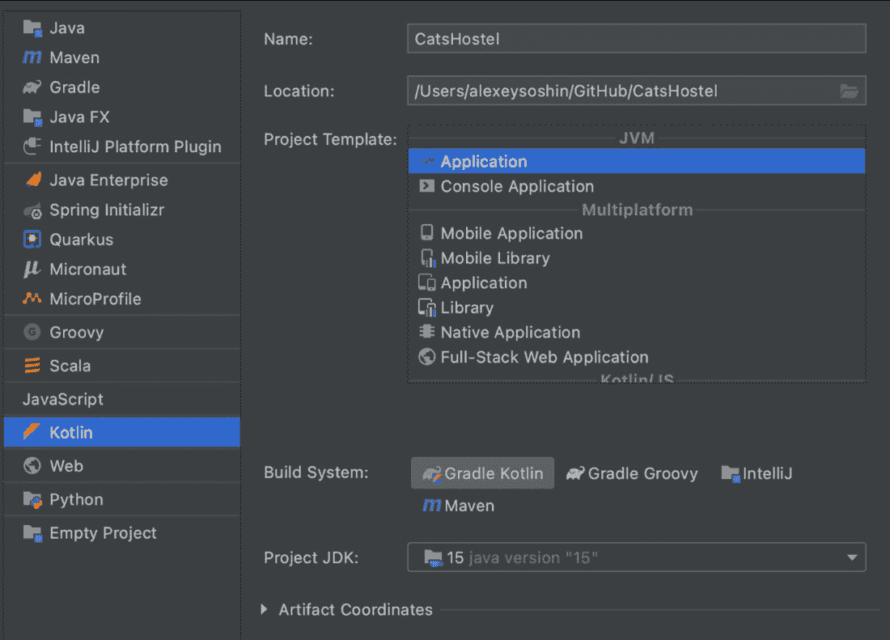
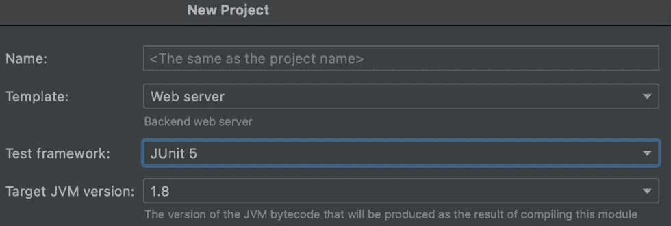
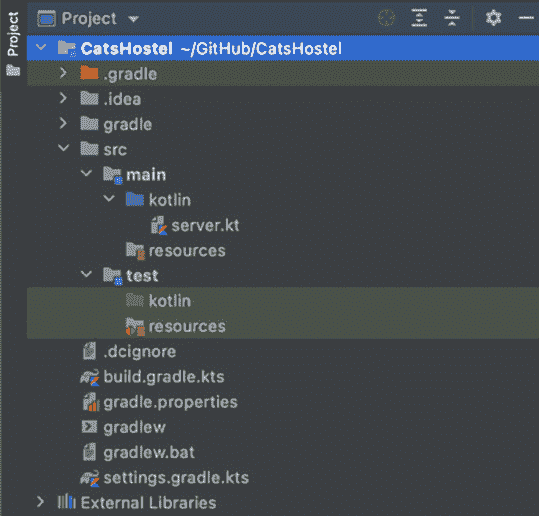
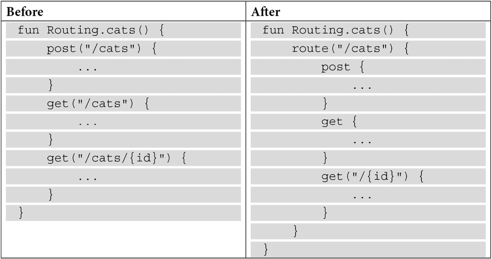

# 第十章：*第十章*：使用 Ktor 的并发微服务

在上一章中，我们探讨了如何编写符合 Kotlin 习惯的代码，这些代码将易于阅读和维护，同时性能良好。

本章中，我们将通过构建一个使用 **Ktor 框架**的微服务来运用我们迄今为止学到的技能。我们还想让这个微服务是反应式的，并且尽可能接近现实生活。为此，我们将使用 Ktor 框架，其优点将在本章的第一节中列出。

本章中，我们将涵盖以下主题：

+   开始使用 Ktor

+   路由请求

+   测试服务

+   应用程序模块化

+   连接到数据库

+   创建新实体

+   使测试保持一致

+   获取实体

+   在 Ktor 中组织路由

+   在 Ktor 中实现并发

到本章结束时，您将拥有一个用 Kotlin 编写的微服务，该服务经过良好测试，可以从 PostgreSQL 数据库中读取数据并将其存储在其中。

# 技术要求

这是您开始所需的：

+   **JDK 11** 或更高版本

+   IntelliJ IDEA

+   **Gradle 6.8** 或更高版本

+   **PostgreSQL 14** 或更高版本

本章将假设您已经安装了 `PostgreSQL`，并且您具备使用它的基本知识。如果您没有，请参阅官方文档：[`www.postgresql.org/docs/14/tutorial-install.html`](https://www.postgresql.org/docs/14/tutorial-install.html)。

您可以在此处找到本章的源代码：[`github.com/PacktPublishing/Kotlin-Design-Patterns-and-Best-Practices/tree/main/Chapter10`](https://github.com/PacktPublishing/Kotlin-Design-Patterns-and-Best-Practices/tree/main/Chapter10)。

# 开始使用 Ktor

你可能已经厌倦了创建待办事项或购物清单。

因此，在本章中，我们将微服务用于 `猫舍`。该微服务应该能够执行以下操作：

+   提供一个端点，我们可以 ping 它来检查服务是否正在运行

+   列出目前在该庇护所中的猫

+   提供一种添加新猫的方法

本章中我们将使用的微服务框架称为 **Ktor**。它是由 Kotlin 编程语言的创建者开发和维护的并发框架。

让我们先创建一个新的 Kotlin Gradle 项目：

1.  从您的 IntelliJ IDEA 中选择 **文件** | **新建** | **项目**，然后在 **新建项目** 中选择 **Kotlin**，在 **构建系统** 中选择 **Gradle Kotlin**。

1.  给您的项目起一个描述性的名称 - 例如，我的项目名为 `CatsHostel` - 并选择 **项目 JDK**（在这种情况下，我们使用 **JDK 15**）:

    图 10.1 – 选择项目 JDK 类型

1.  在下一屏上，选择 **JUnit 5** 作为您的 **测试框架**，并将 **目标 JVM 版本** 设置为 **1.8**。然后，点击 **完成**：

    图 10.2 – 选择测试框架和目标 JVM 版本

1.  现在，你应该看到以下结构：



图 10.3 – 项目结构

接下来，让我们打开 `build.gradle.kts` 文件。此文件控制项目的构建方式、其依赖项以及项目将要使用的库。根据 IntelliJ IDEA 的版本，文件的内容可能略有不同，但总体结构保持不变。

`.kts` 扩展名意味着我们的 Kotlin 项目的配置文件是用 Kotlin 编写的，或者更准确地说，是在 `dependencies` 块中，它应该看起来像这样：

```java
dependencies {
```

```java
    implementation(...)
```

```java
    testImplementation("org.junit.jupiter:junit-jupiter-        api:5.6.0")
```

```java
    testRuntimeOnly("org.junit.jupiter:junit-jupiter-        engine:5.6.0")
```

```java
}
```

前面的代码提到了项目中将要使用到的所有库。`implementation()` 配置意味着库将始终被使用。`testImplementation()` 配置意味着库仅在测试期间被使用。

现在，让我们看看以下示例中是如何定义库的：

```java
"org.junit.jupiter:junit-jupiter-api:5.6.0"
```

这是一个被分成三个部分的常规字符串，如下所示：

```java
"group:name:version"
```

`group` 和 `name` 字符串用于标识库；`version` 配置应该是自解释的。

现在，让我们修改 `dependencies` 块，如下所示：

```java
val ktorVersion = "1.6.0"
```

```java
dependencies {
```

```java
    implementation("io.ktor:ktor-server-
```

```java
        netty:$ktorVersion")
```

```java
    ...
```

```java
}
```

由于具有 `.kts` 扩展名的文件是 Kotlin 文件，我们可以在其中使用常规的 Kotlin 语法。在这种情况下，我们正在使用值和字符串插值来提取库的版本。

到目前为止，Ktor 的最新版本是 **1.6.4**，但当你阅读这本书时，它将大于这个版本。你可以在以下位置找到最新版本：[`ktor.io/`](https://ktor.io/)。

作为一般规则，所有 Ktor 库应该使用相同的版本，这时变量就变得有用。

小贴士：

如果你已经遵循了本节开头的步骤，你应该在你的项目中 `src/main/kotlin` 文件夹中有一个名为 `server.kt` 的文件。如果没有，现在就创建一个。

现在，让我们将以下内容添加到 `server.kt` 文件中：

```java
fun main() {
```

```java
    embeddedServer(Netty, port = 8080) {
```

```java
        routing {
```

```java
            get("/") {
```

```java
                call.respondText("OK")
```

```java
            }
```

```java
        }
```

```java
    }.start(wait = true)
```

```java
    println("open http://localhost:8080")
```

```java
}
```

这就是我们启动一个将响应 `OK` 的网络服务器所需编写的所有代码，当你打开浏览器中的 `http://localhost:8080` 时。

现在，让我们理解这里发生了什么：

+   要与请求交互并返回响应，我们可以使用 `call` 对象，也称为 **上下文**。此对象提供了所有方便的方法来解析请求并以不同格式返回响应，我们将在本章中看到可用于它的不同方法。

+   `embeddedServer()` 函数是 Builder 模式的一个实现，我们在 *第二章* 中讨论了这种模式，*使用创建型模式*。它允许我们配置服务器。大多数参数都有相同的默认值。我们仅为了方便将 `port` 覆盖为 `8080`。

+   我们指定 `wait` 参数为 `true`，这样我们的服务器将等待传入的请求。

+   `embeddedServer` 函数的唯一必需参数是服务器引擎。在我们的例子中，我们使用 `Netty`，这是一个非常著名的 JVM 库，但还有其他库。其中最有趣的是 `CIO`，它是 JetBrains 自己开发的。

现在，让我们了解什么是 `CIO` 和 `Netty`。它们都是 **工厂** 模式，在调用时创建我们服务器的实际实例。这是一个非常有趣的设计模式组合，在一个地方创建一个非常灵活和可扩展的架构。

要切换到使用 `CIO`，我们只需要添加一个新的依赖项：

```java
dependencies { 
```

```java
    ...
```

```java
    implementation("io.ktor:ktor-server-cio:$ktorVersion") 
```

```java
    ... 
```

```java
}
```

然后，我们需要将另一个服务器引擎 `CIO` 传递给 `embeddedServer` 函数：

```java
embeddedServer(CIO, port = 8080) { 
```

```java
    ...
```

```java
}.start(wait = true)
```

注意，当我们切换服务器引擎时，我们不需要更改代码中的其他任何内容。这是因为 `embeddedServer()` 使用桥接设计模式使组件可互换。

现在，我们的服务器已经启动，让我们调查我们如何为每个对服务器的请求定义不同的响应。

# 路由请求

现在，让我们看看 `routing` 块：

```java
routing { 
```

```java
    get("/") { 
```

```java
        call.respondText("OK") 
```

```java
    } 
```

```java
}
```

此块描述了我们的服务器将处理的所有 URL。在这种情况下，我们只处理根 URL。当请求该 URL 时，将向用户返回文本响应 `OK`。

以下代码返回文本响应。现在，让我们看看我们如何返回 JSON 响应：

```java
get("/status") {
```

```java
    call.respond(mapOf("status" to "OK"))
```

```java
}
```

我们将不再使用 `respondText()` 方法，而是使用 `respond()`，它接收一个对象而不是字符串。在我们的例子中，我们向 `respond()` 函数传递一个字符串映射。尽管如此，如果我们运行此代码，我们仍会得到一个异常。

这是因为默认情况下，对象不会被序列化为 JSON。多个库可以为我们完成这项工作。在这个例子中，我们将使用 `kotlinx-serialization` 库。让我们首先将其添加到我们的依赖项中：

```java
dependencies {
```

```java
    ...
```

```java
    implementation("org.jetbrains.kotlinx:kotlinx-        serialization-json-jvm:1.3.0")
```

```java
    ...
```

```java
}
```

接下来，我们需要在我们的 `routing` 块之前添加以下行：

```java
install(ContentNegotiation) {
```

```java
    json()
```

```java
} 
```

现在，如果我们再次运行我们的代码，它将在我们的浏览器上输出以下内容：

```java
> {"status":"OK"}
```

我们刚刚创建了一条返回作为 JSON 序列化对象的第一个路由。现在，我们可以通过在浏览器中打开 `http://localhost:8080/status` 来检查我们的应用程序是否工作。但这有点麻烦。在下一节中，我们将学习如何为 `/status` 端点编写测试。

# 测试服务

要编写我们的第一个测试，让我们在 `src/test/kotlin` 目录下创建一个名为 `ServerTest.kt` 的新文件。

现在，让我们添加一个新的依赖项：

```java
dependencies {
```

```java
    ...
```

```java
    testImplementation("io.ktor:ktor-server-
```

```java
        tests:$ktorVersion")
```

```java
}
```

接下来，让我们将以下内容添加到我们的 `ServerTest.kt` 文件中：

```java
internal class ServerTest {
```

```java
    @Test
```

```java
    fun testStatus() {
```

```java
        withTestApplication {
```

```java
            val response = handleRequest(HttpMethod.Get,                 "/status").response
```

```java
            assertEquals(HttpStatusCode.OK,                 response.status())
```

```java
            assertEquals("""{"status": "OK"}""",                 response.content)
```

```java
        }
```

```java
    }
```

```java
}
```

Kotlin 中的测试被分组到类中，每个测试都是类中的一个方法，该方法带有 `@Test` 注解。

在 `test` 方法内部，我们启动一个测试服务器，向 `/status` 端点发出 `GET` 请求，并检查该端点是否以正确的状态码和 JSON 主体响应。

如果你现在运行这个测试，它将会失败，因为我们还没有启动我们的服务器。为此，我们需要对其进行一些重构，我们将在下一节中这样做。

# 应用程序模块化

到目前为止，我们的服务器是从`main()`函数启动的。这很简单设置，但这不允许我们测试我们的应用程序。

在 Ktor 中，代码通常组织成模块。让我们重写我们的`main`函数，如下所示：

```java
fun main() {
```

```java
    embeddedServer(
```

```java
        CIO,
```

```java
        port = 8080,
```

```java
        module = Application::mainModule
```

```java
    ).start(wait = true)
```

```java
}
```

在这里，我们不是在块中提供我们服务器的逻辑，而是指定了一个将包含我们服务器所有配置的模块。

此模块定义为`Application`对象上的扩展函数：

```java
fun Application.mainModule() {
```

```java
    install(ContentNegotiation) {
```

```java
        json()
```

```java
    }
```

```java
    routing {
```

```java
        get("/status") {
```

```java
            call.respond(mapOf("status" to "OK"))
```

```java
        }
```

```java
    }
```

```java
    println("open http://localhost:8080")
```

```java
}
```

如你所见，此函数的内容与之前传递给我们的`embeddedService`函数的块的内容相同。

现在，我们只需要回到我们的测试中，并指定我们想要测试哪个模块：

```java
@Test
```

```java
fun testStatus() {
```

```java
    withTestApplication(Application::mainModule) {
```

```java
        ...
```

```java
    }
```

```java
}
```

如果你现在运行这个测试，它应该会通过，因为我们的服务器已经在测试模式下正确启动。

到目前为止，我们只处理了服务的基础设施；我们没有触及其业务逻辑：*管理猫*。为此，我们需要一个数据库。在下一节中，我们将讨论 Ktor 如何使用 Exposed 库解决这个问题。

# 连接到数据库

为了存储和检索猫，我们需要连接到数据库。我们将为此目的使用 PostgreSQL，尽管使用其他 SQL 数据库不会有任何不同。

首先，我们需要一个新的库来连接到数据库。我们将使用由 JetBrains 开发的 Exposed 库。

让我们在`build.gradle.kts`文件中添加以下依赖项：

```java
dependencies {
```

```java
    implementation("org.jetbrains.exposed:exposed:0.17.14")
```

```java
    implementation("org.postgresql:postgresql:42.2.24")
```

```java
    ...
```

```java
}
```

一旦库就位，我们需要连接到它们。为此，让我们在`/src/main/kotlin`下创建一个名为`DB.kt`的新文件，并包含以下内容：

```java
object DB {
```

```java
    private val host=System.getenv("DB_HOST")?:"localhost"
```

```java
    private val port =         System.getenv("DB_PORT")?.toIntOrNull() ?: 5432
```

```java
    private val dbName = System.getenv("DB_NAME") ?:         "cats_db"
```

```java
    private val dbUser = System.getenv("DB_USER") ?:         "cats_admin"
```

```java
    private val dbPassword = System.getenv("DB_PASSWORD")         ?: "abcd1234"
```

```java
  fun connect() = Database.connect(      "jdbc:postgresql://$host:$port/$dbName",      driver = "org.postgresql.Driver",      user = dbUser,      password = dbPassword
```

```java
  )
```

```java
}
```

由于我们的应用程序需要一个数据库的确切实例，`DB`对象可以使用我们之前讨论的 Singleton 模式，即使用`object`关键字。

然后，对于我们需要连接到数据库的每个变量，我们将尝试从我们的环境中读取它们。如果`环境`变量未设置，我们将使用**Elvis**运算符来使用默认值。

提示：

创建数据库和用户超出了本书的范围，但你可以参考官方文档，在[`www.postgresql.org/docs/14/app-createuser.html`](https://www.postgresql.org/docs/14/app-createuser.html)和[`www.postgresql.org/docs/14/app-createdb.html`](https://www.postgresql.org/docs/14/app-createdb.html)。

或者，你可以在命令行中简单地运行以下两个命令：

```java
$ createuser cats_admin -W –d
```

```java
$ createdb cats_db -U cats_admin
```

第一个命令创建了一个名为`cats_admin`的数据库用户，并要求你为该用户指定一个密码。我们的应用程序将使用这个`cats_admin`用户与数据库交互。第二个命令创建了一个名为`cats_db`的数据库，属于`cats_admin`用户。现在我们的数据库已经创建，我们只需要创建一个表来存储我们的猫。

为了做到这一点，让我们在 `DB.kt` 文件中定义另一个 Singleton 对象，它将代表一个表：

```java
object CatsTable : IntIdTable() {
```

```java
    val name = varchar("name", 20).uniqueIndex()
```

```java
    val age = integer("age").default(0)
```

```java
}
```

让我们理解一下前面的定义意味着什么：

+   `IntIdTable` 表示我们想要创建一个以 `Int` 类型为主键的表。

+   在对象的体中，我们定义列。除了 `ID` 列之外，我们还将有一个 `name` 列，它是 `varchar` 类型，换句话说，是一个字符串，最多 `20` 个字符。

+   猫的 `name` 列也是唯一的，这意味着没有两只猫可以拥有相同的名字。

+   我们还有一个第三列，它是 `integer` 类型，或者用 Kotlin 的话说，是 `Int` 类型，默认值为 `0`。

我们还将有一个 `data` 类来表示单个猫：

```java
data class Cat(val id: Int,
```

```java
               val name: String,
```

```java
               val age: Int)
```

我们剩下要做的唯一一件事是将以下代码行添加到我们的 `mainModule()` 函数中：

```java
DB.connect()
```

```java
transaction {
```

```java
    SchemaUtils.create(CatsTable)
```

```java
}
```

每次我们的应用程序启动时，前面的代码将连接到数据库。然后，它将尝试创建一个存储我们实体的表。如果表已经存在，则不会发生任何操作。

现在我们已经建立了与数据库的连接，让我们看看我们如何使用这个连接在数据库中存储几只猫。

# 创建新实体

我们接下来的任务是向我们的虚拟收容所添加第一只猫。

遵循 REST 原则，它应该是一个 `POST` 请求，其中请求的体可能看起来像这样：

```java
{"name": "Meatloaf", "age": 4}
```

我们将首先编写一个新的测试：

```java
@Test
```

```java
fun `POST creates a new cat`() {
```

```java
    ...
```

```java
}
```

反引号是 Kotlin 中的一个有用特性，它允许我们在函数的名称中包含空格。这有助于我们创建描述性的测试名称。

接下来，让我们看看我们的测试体：

```java
withTestApplication(Application::mainModule) {
```

```java
    val response = handleRequest(HttpMethod.Post, "/cats") {
```

```java
        addHeader(
```

```java
          HttpHeaders.ContentType,
```

```java
          ContentType.Application.FormUrlEncoded.toString()
```

```java
        )
```

```java
        setBody(
```

```java
            listOf(
```

```java
                "name" to "Meatloaf",
```

```java
                "age" to 4.toString()
```

```java
            ).formUrlEncode()
```

```java
        )
```

```java
    }.response
```

```java
    assertEquals(HttpStatusCode.Created, response.status())
```

```java
}
```

我们在上一节中讨论了 `withTestApplication` 和 `handleRequest` 函数。这次，我们使用了一个 `POST` 请求。这类请求应该有正确的头信息，因此我们必须使用 `addHeader()` 函数设置这些头信息。我们还必须将体设置为之前讨论的内容。

最后，我们必须检查响应头是否设置为 `Created` HTTP 状态码。

如果我们现在运行这个测试，它将因为还没有实现 `post` `/cats` 端点而以 `404` HTTP 状态码失败。

让我们回到我们的 `routing` 块并添加一个新的端点：

```java
post("/cats") {
```

```java
    ...    
```

```java
    call.respond(HttpStatusCode.Created)
```

```java
}
```

要创建一个新的猫，我们需要读取 `POST` 请求的体。我们将为此使用 `receiveParameters()` 函数：

```java
val parameters = call.receiveParameters()
```

```java
val name = requireNotNull(parameters["name"])
```

```java
val age = parameters["age"]?.toInt() ?: 0
```

`receiveParameters` 函数返回一个不区分大小写的映射。首先，我们将尝试从这个映射中获取猫的 `name`，如果没有请求中的名字，我们将调用失败。这将由 Ktor 处理。

然后，如果我们没有收到 `age`，我们将使用 Elvis 操作符将其默认设置为 `0`。

现在，我们必须将这些值插入到数据库中：

```java
transaction {
```

```java
    CatsTable.insert { cat ->
```

```java
        cat[CatsTable.name] = name
```

```java
        cat[CatsTable.age] = age
```

```java
    }
```

```java
}
```

在这里，我们打开一个 `transaction` 块来对数据库进行更改。然后，我们使用 `insert()` 方法，该方法在每个表上都是可用的。在 `insert` lambda 中，`cat` 变量指的是我们将要填充的新行。我们将该行的名称设置为 `name` 参数的值，并为 `age` 做同样的操作。

如果你现在运行测试，它应该会通过。但如果你再次运行它，它将会失败。这是因为数据库中猫的名字是唯一的。此外，我们在测试运行之间没有清理数据库。所以，第一次运行创建了一个名为`Meatloaf`的猫，而第二次运行失败。这是因为这样的猫已经存在。

为了使我们的测试保持一致，我们需要一种方法在运行之间清理我们的数据库。

# 使测试保持一致

让我们回到我们的测试并添加以下代码片段：

```java
@BeforeEach
```

```java
fun setup() {
```

```java
    DB.connect()
```

```java
    transaction {
```

```java
        SchemaUtils.drop(CatsTable)
```

```java
    }
```

```java
}
```

在这里，我们在一个函数上使用了`@BeforeEach`注解。正如其名所示，这段代码将在每个测试之前运行。该函数将建立与数据库的连接并完全删除表。然后，我们的应用程序将重新创建该表。

现在，我们的测试应该能够一致地通过。在下一节中，我们将学习如何使用 Exposed 库从数据库中获取猫。

# 获取实体

遵循 REST 实践，获取所有猫的 URL 应该是`/cats`，而对于获取单个猫，应该是`/cats/123`，其中`123`是我们试图获取的猫的 ID。

让我们添加两个新的路由来实现这一点：

```java
get("/cats") {
```

```java
    ...
```

```java
}
```

```java
get("/cats/{id}") {
```

```java
    ...
```

```java
}
```

第一个路由与我们在本章早期引入的`/status`路由非常相似。但第二个路由略有不同：它使用 URL 中的查询参数。你可以通过它们名字周围的括号来识别查询参数。

为了读取查询参数，我们可以访问`parameters`映射：

```java
val id = requireNotNull(call.parameters["id"]).toInt()
```

如果 URL 上有 ID，我们需要尝试从数据库中获取一只猫：

```java
val cat = transaction {
```

```java
    CatsTable.select {
```

```java
        CatsTable.id.eq(id)
```

```java
    }.firstOrNull()
```

```java
}
```

在这里，我们开启一个事务并使用`select`语句获取一个 ID 等于我们之前提供的 ID 的猫。

如果返回了一个对象，我们会将其转换为 JSON。否则，我们会返回 HTTP 代码`404`，即`Not Found`：

```java
if (row == null) {
```

```java
    call.respond(HttpStatusCode.NotFound)
```

```java
} else {
```

```java
    call.respond(
```

```java
        Cat(
```

```java
            row[CatsTable.id].value,
```

```java
            row[CatsTable.name],
```

```java
            row[CatsTable.age]
```

```java
        )
```

```java
    )
```

```java
}
```

现在，让我们添加一个用于获取单个猫的测试：

```java
@Test
```

```java
fun `GET with ID fetches a single cat`() {
```

```java
    withTestApplication(Application::mainModule) {
```

```java
        val id = transaction {
```

```java
            CatsTable.insertAndGetId { cat ->
```

```java
                cat[name] = "Fluffy"
```

```java
            }
```

```java
        }
```

```java
         val response = handleRequest(HttpMethod.Get, 
```

```java
            "/cats/$id").response
```

```java
        assertEquals("""{"id":1,"name":
```

```java
            "Fluffy","age":0}""", response.content)
```

```java
    }
```

```java
}
```

在这个测试中，我们使用 Exposed 创建了一只猫。在这里，我们使用了一个新方法`insertAndGetId`。正如其名所示，它将返回新创建行的 ID。然后，我们尝试使用我们新创建的端点获取那只猫。

如果我们尝试运行这个测试，它将会因为以下异常而失败：

```java
> Serializer for class 'Cat' is not found.
```

默认情况下，Ktor 不知道如何将我们的自定义数据类转换为 JSON。为了解决这个问题，我们需要在我们的`build.gradle.kts`文件中添加一个新的插件：

```java
plugins {
```

```java
    kotlin("jvm") version "1.5.10"
```

```java
    application
```

```java
    kotlin("plugin.serialization") version "1.5.10"
```

```java
}
```

此插件将为任何带有`@Serializable`注解的类在编译时创建序列化器。为了使测试通过，我们现在需要将此注解添加到我们的`Cat`类中：

```java
@Serializable
```

```java
data class Cat(
```

```java
    val id: Int,
```

```java
    val name: String,
```

```java
    val age: Int
```

```java
)
```

就这样；现在，我们通过 ID 获取猫的测试应该会通过。

最后，我们希望能够从数据库中获取所有猫。为了做到这一点，我们必须稍微改变我们的测试设置：

```java
@TestInstance(TestInstance.Lifecycle.PER_CLASS)
```

```java
class ServerTest {
```

```java
    @BeforeAll
```

```java
    fun setup() {
```

```java
        DB.connect()
```

```java
        transaction {
```

```java
            SchemaUtils.create(CatsTable)
```

```java
        }
```

```java
    }
```

```java
    @AfterAll
```

```java
    fun cleanup() {
```

```java
        DB.connect()
```

```java
        transaction {
```

```java
            SchemaUtils.drop(CatsTable)
```

```java
        }
```

```java
    }
```

```java
    ...
```

```java
}
```

在这里，我们改变了测试的设置，以便在所有测试执行完毕后删除表。因此，我们使用`@AfterAll`注解，它在所有测试执行完毕后执行函数，而不是在每次测试之前执行的`@BeforeEach`注解。

为了使这个注释生效，我们还需要在我们的类中添加`@TestInstance`注解。它的默认值是`PER_METHOD`，但由于我们希望一次性执行多个测试并在之后进行清理，我们需要将测试类的生命周期设置为`PER_CLASS`。

接下来，让我们将我们的测试封装到一个嵌套类中，如下所示：

```java
@Nested
```

```java
inner class `With cat in DB` {
```

```java
    @Test
```

```java
    fun `GET with ID fetches a single cat`() {
```

```java
        ...
```

```java
    }
```

```java
}
```

嵌套测试类是封装特定测试情况的好方法。在我们的例子中，我们希望在数据库中已经存在猫的情况下运行两个测试。

现在，让我们将以下设置代码添加到我们的嵌套测试中：

```java
lateinit var id: EntityID<Int>
```

```java
@BeforeEach
```

```java
fun setup() {
```

```java
    DB.connect()
```

```java
    id = transaction {
```

```java
        CatsTable.insertAndGetId { cat ->
```

```java
            cat[name] = "Fluffy"
```

```java
        }
```

```java
    }
```

```java
}
```

```java
@AfterEach
```

```java
fun teardown() {
```

```java
    DB.connect()
```

```java
    transaction {
```

```java
        CatsTable.deleteAll()
```

```java
    }
```

```java
}
```

在我们执行这个嵌套类中的每个测试之前，我们将在数据库中创建一只猫，并在每个测试之后，我们将从我们的数据库中删除所有猫。由于我们希望跟踪我们创建的猫的 ID，我们将它存储在一个变量中。

现在，我们的用于检索单个实体的测试类看起来像这样：

```java
@Test
```

```java
fun `GET with ID fetches a single cat`() {
```

```java
    withTestApplication(Application::mainModule) {
```

```java
        val response = handleRequest(HttpMethod.Get,             "/cats/$id").response         assertEquals("""{"id":$id,"name":"Fluffy",            "age":0}""", response.content)
```

```java
    }
```

```java
}
```

注意我们如何将猫的 ID 插入到我们期望的响应中，因为每次测试执行时它都会变化。

从数据库中检索所有猫的测试看起来几乎一样：

```java
@Test
```

```java
fun `GET without ID fetches all cats`() {
```

```java
    withTestApplication(Application::mainModule) {
```

```java
        val response = handleRequest(HttpMethod.Get,             "/cats").response         assertEquals("""[{"id":$id,"name":"Fluffy",            "age":0}]""", response.content)
```

```java
    }
```

```java
}
```

我们只是没有指定 ID，并且响应被包装成一个 JSON 数组，正如你通过方括号看到的。

现在，我们只需要实现这个新路由：

```java
get("/cats") {
```

```java
    val cats = transaction {
```

```java
        CatsTable.selectAll().map { row ->
```

```java
            Cat(
```

```java
                row[CatsTable.id].value,
```

```java
                row[CatsTable.name],
```

```java
                row[CatsTable.age]
```

```java
            )
```

```java
        }
```

```java
    }
```

```java
    call.respond(cats)
```

```java
}
```

如果你遵循了从数据库中检索单个实体（从本节开头）的示例，那么这个示例对你来说不会有很大不同。我们使用`selectAll()`函数从表中检索所有行。然后，我们将每一行映射到我们的`data`类。我们剩下要解决的问题是我们代码相当杂乱，并且位于一个单独的文件中。如果我们能将所有猫的路由拆分到一个单独的文件中会更好。我们将在下一节中这样做。

# 在 Ktor 中组织路由

在本节中，我们将看到 Ktor 中结构属于同一域的多个路由的惯用方法。

我们当前的`routing`块看起来像这样：

```java
routing {
```

```java
    get("/status") {
```

```java
        ...
```

```java
    }
```

```java
    post("/cats") {
```

```java
        ...    
```

```java
    }
```

```java
    get("/cats") {
```

```java
        …
```

```java
    }
```

```java
    get("/cats/{id}") {
```

```java
        ...    
```

```java
    }
```

```java
}
```

如果我们能将所有与猫相关的路由提取到一个单独的文件中会更好。让我们首先用函数替换所有猫的路由：

```java
routing { 
```

```java
    get("/status") { 
```

```java
        ... 
```

```java
    } 
```

```java
    cats() 
```

```java
}
```

如果你使用 IntelliJ IDEA，它甚至会建议你在`Routing`类上生成一个扩展函数：

```java
fun Routing.cats() {
```

```java
    ...
```

```java
}
```

现在，我们可以将所有我们的猫路由移动到这个函数中：

```java
fun Routing.cats() {
```

```java
    post("/cats") {
```

```java
        ...
```

```java
    }
```

```java
    get("/cats") {
```

```java
        ...
```

```java
    }
```

```java
    get("/cats/{id}") {
```

```java
        ...
```

```java
    }
```

```java
}
```

现在，你可以看到 `/cats` URL 被重复多次。我们可以使用`route()`块来提升它：



表 10.1 - 使用 route() 块后的更简洁代码

注意到我们的代码现在变得多么简洁。

现在，我们还有一个最后的重要主题需要讨论。在本章的开头，我们提到 Ktor 是一个高度并发的框架。在*第六章*“线程和协程”中，我们提到 Kotlin 中的并发主要通过使用协程来实现。但我们在本章中只启动了一个协程。我们将在下一节中探讨这个问题。

# 在 Ktor 中实现并发

回顾本章中我们编写的代码，你可能会有一种印象，认为 Ktor 的代码根本不是并发的。然而，这离事实相差甚远。

本章中我们使用的所有 Ktor 函数都是基于协程和**挂起函数**的概念。

对于每一个进入的请求，Ktor 将启动一个新的协程来处理它，这得益于其核心基于协程的 CIO 服务器引擎。在 Ktor 中，拥有一个既高效又不会干扰的并发模型是一个非常重要的原则。

此外，我们用来指定所有端点的 `routing` 块可以访问 `CoroutineScope`，这意味着我们可以在这些块中调用挂起函数。

挂起函数的一个例子是 `call.respond()`，我们在这章中一直在使用。挂起函数为我们提供了进行上下文切换和执行其他代码并发的机会。这意味着相同数量的资源可以服务比其他情况下多得多的请求。我们在这里停下来，总结一下我们关于使用 Ktor 开发应用程序所学到的东西。

# 摘要

在本章中，我们使用 Kotlin 构建了一个经过良好测试的服务，该服务使用 Ktor 框架将实体存储在数据库中。我们还讨论了我们在本书开头遇到的多个设计模式，如工厂、单例和桥接模式，如何在 Ktor 框架中用于为我们提供灵活的代码结构。

现在，你应该能够使用 Exposed 框架与数据库进行交互。我们学习了如何声明、创建和删除表，如何插入新实体，以及如何检索和删除它们。

在下一章中，我们将探讨开发 Web 应用的另一种方法，但这次使用的是名为 **Vert.x** 的响应式框架。这将使我们能够比较开发 Web 应用时的并发和响应式方法，并讨论每种方法的权衡。

# 问题

1.  Ktor 应用是如何构建的，它们有哪些好处？

1.  Ktor 中的插件是什么，它们有什么用途？

1.  Exposed 库解决的主要问题是什么？
