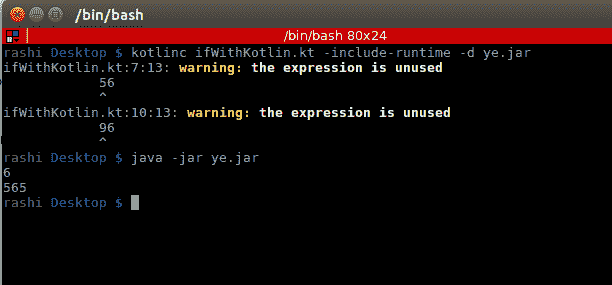

# 第二章：控制流

本章将涵盖以下内容：

+   使用 `if` 关键字将结果分配给表达式

+   使用 `when` 表达式与范围

+   使用 `when` 与自定义对象

+   将 `try`–`catch` 作为表达式使用

+   如何使用 `also` 函数在 Kotlin 中编写交换函数

+   如何在 Kotlin 中抛出自定义异常

+   如何在 Kotlin 中创建多条件循环

# 简介

控制流是每种编程语言的基本构建块。在 Kotlin 中有什么不同之处在于，您可以使用其中的一些控制流作为表达式，例如 `try`–`catch`、`if`–`else`、`when` 等。在本章中，我们将了解 Kotlin 提供的一些控制流，并学习如何使用它们。此外，我们还将了解它们如何比 Java 控制流提供更多的功能。所以，让我们开始吧！

# 使用 `if` 关键字将结果分配给表达式

在 Kotlin 中，`if` 是特殊的，因为它返回值。这就是为什么我们可以使用 `if` 语句来分配值。这消除了 Kotlin 中三元运算符的需要。让我们看看我们如何使用 `if` 语句来分配值。

# 准备工作

您需要安装一个首选的开发环境，该环境可以编译和运行 Kotlin。您也可以使用命令行来完成此目的，为此您需要安装 Kotlin 编译器和 JDK。在这个菜谱中，我使用命令行来编译和运行我的 Kotlin 代码。

# 如何做...

创建一个文件，并将其命名为 `ifWithKotlin.kt`。您可以将其命名为任何名称；它不必与类名相同，因为它是在 Java 中。现在，为了开始，您应该始终声明 `main` 方法，因为 Java 虚拟机通过调用指定类的 `main` 方法来启动执行。

`main` 方法如下：

```java
fun main(args: Array<String>) { }
```

1.  让我们尝试一个基本的 `if` 语句，以了解它是如何工作的：

```java
fun main(args: Array<String>) {
     var x:Int
     if(10>20){
         x = 5
     }
     else{
         x = 10
     }
     println("$x")
 }
```

在这个代码块中，我们在 `if` 和 `else` 块中为 `x` 分配一个值，然后打印它。

1.  现在，让我们以 Kotlin 的方式尝试同样的事情：

```java
fun main(args: Array<String>) {
      var x:Int = if(10>20)  5  else  10
    println("$x")
 }
```

在这个代码块中，我们将 `if`–`else` 块返回的值分配给 `x`。注意我们如何将 `if` 语句用作表达式右侧的表达式的一部分。

1.  让我们看看我们还能做什么。在以下示例中，我们将尝试使用 `if` 语句从表达式中返回一些内容：

```java
fun main(args: Array<String>) {
     var x:Int
    x = if(10>20) {
             doSomething()
             25
         }
         else if (12<13) {
             26
         }
         else{
             27
         }
         println("$x")
}
fun doSomething() {
     var a = 6
     println("$a")
 }
```

注意我们如何使用了整个 `if`–`else` 块。在这种情况下，`if` 块返回块中的最后一个语句。

1.  最后，让我们尝试一个更复杂的例子，使用嵌套的`if`–`else`。这将帮助我们理解在嵌套的`if`–`else`结构中值的返回方式：

```java
fun main(args: Array<String>) {
    var x:Int
    x = if(10<20) {
        if(4 == 3){
            56
        }
        else{
            96
        }
    }
    else if (12>13) {
        26
    }
    else{
        27
    }
    println("$x")
}

//Output: 96
```

因此，如果我们嵌套一个`if`–`else`块，并且该`if`–`else`块的最后一个语句又是另一个`if`–`else`语句，那么嵌套的`if`–`else`返回的值将由外层的`if`–`else`返回。正如你所看到的，`96`是由`if(10<20)`块内部的`else`块返回的。

1.  如果`if`–`else`块不是最后一个语句，会发生什么，就像这个例子一样：

```java
 fun main(args: Array<String>) {
 var x:Int
 x = if(10<20) {

         if(4 == 3){
                 56
         }
         else{
                 96
         }
         565
     }
     else if (12>13) {
        26
     }
     else{
         27
     }
     println("$x")
}
```

很明显，嵌套的`if-else`返回的值没有被使用，Kotlin 编译器也警告了我们这一点。原因在于`if-else`块不是父`if-else`块的最后一个语句，这就是为什么返回的值没有被使用的原因。



尝试调整值和逻辑，看看您还能用`if-else`做些什么。

总是要记住的关键点是`if-else`块的最后一个语句会被返回，这就是为什么它可以用来给任何变量赋值的原因。

# 还有更多...

我们在打印语句中使用了字符串模板。注意我们是如何在变量名前使用`$`符号来访问变量的：

```java
println("$a is a number something”)
```

我们还可以在要评估并其结果连接到字符串的字符串中放入一段代码。在这种情况下，`$`后面跟着`{}`，我们在其中放入我们的代码：

```java
println("some variable whose value: ${if(a < 100) 25 else 29}")
```

# 使用`when`表达式与范围

在 Kotlin 中，`when`就像一个超级强大的`switch`控制语句。然而，这还不是它的全部。您可以用`when`语句构建很多令人惊叹的逻辑，其中一个例子就是使用范围与`when`语句。我们将在本菜谱中查看这一点。

# 准备工作

您需要安装一个首选的开发环境，该环境可以编译和运行 Kotlin。您也可以使用命令行来完成此目的，为此您需要安装 Kotlin 编译器和 JDK。我在这个菜谱中使用命令行来编译和运行我的 Kotlin 代码。

# 如何做到这一点...

首先，让我们创建一个文件，命名为`whenWithRanges.kt`，并按照以下步骤操作：

1.  让我们尝试一个基本的`when`语句来了解它是如何工作的：

```java
fun main(args: Array<String>) {
     val x = 12
     when(x){
         12 -> println("x is equal to 12")
         4 -> println("x is equal to 4")
         else -> println ("no conditions match!")
     }
 }
```

所以基本上，这个代码块的工作方式就像一个`switch`语句，它也可以使用`if`语句来实现。

1.  现在，让我们看看`x`是否位于`1`到`10`之间或之外：

```java
fun main(args: Array<String>) {
     val x = 12
     when(x){
         in (1..10) -> println("x lies between 1 to 10")
         !in (1..10) -> println("x does not lie between 1 to 10")
     }
 }
```

1.  让我们看看我们还能做什么。在下面的例子中，我们将处理可以在`when`语句内部使用的不同类型的条件：

```java
fun main(args: Array<String>) {
     val x = 10
     when(x){
         magicNum(x) -> println("x is a magic number")
         in (1..10) -> {
             println("lies between 1 to 10, value: ${if(x < 20) x else 0}")
         }
         20,21 -> println("$x is special and has direct exit access")
         else -> println("$x needs to be executed")
     }
}
fun magicNum(a: Int): Int {
 return if(a in (15..25)) a else 0
 }
```

1.  最后，让我们尝试一个更复杂的使用数据类的例子。在这个例子中，我们将看到如何使用对象与`when`结合：

```java
fun main(args: Array<String>) {
     val x = ob(2, true, 500)
     when(x.value){
         magicNum(x.value) -> println("$x is a magic number and         ${if(x.valid) "valid" else "invalid"}")
         in (1..10) -> {
             println("lies between 1 to 10, value: ${if(x.value <           x.max) x.value else x.max}")
         }
         20,21 -> println("$x is special and has direct exit access")
         else -> println("$x needs to be executed")
     }
 }
 data class ob(val value: Int, val valid: Boolean, val max: Int)
 fun magicNum(a: Int): Int {
 return if(a in (15..25)) a else 0
 }
```

这是编译和运行程序后的样子：


尝试调整值和逻辑，看看您还能用 Kotlin 中这样一小段代码的`when`做些什么。

# 它是如何工作的...

在前面的例子中，第一个例子是最基本的`when`语句；我们直接比较*x*的值与`12`和`4`，如果没有条件匹配，我们只是简单地执行`else`语句。这就像一个`if else if else`语句。

在第二个例子中，我们在 `when` 块的第一个语句中检查 `x` 是否位于 `1` 到 `10` 之间，在第二个语句中，我们检查 `x` 是否不位于 `1` 到 `10` 之间。这就是我们在 `when` 中处理范围的方式。基本上，在 `when` 中，我们可以使用 `in` 关键字检查 `x` 是否位于一个范围内或存在于一个集合中。语法如下：

```java
when(x) {
    In collection_or_range -> // do something
}
```

在第三个例子中，我们使用一个函数来检查 `x` 是否等于表达式 `magicNum(x)` 的值。因此，我们也可以使用表达式和函数来代替常量和范围来比较 `x`。

在第四个例子中，我们使用数据类而不是原始数据类型来探索 `when` 语句的强大功能。注意我们如何在 `when` 内部访问 `x` 的所有属性，并且还可以与之交互。

# 更多...

我们已经看到了如何在打印语句中使用带有表达式的字符串模板。记得我们是如何能够使用变量名前的 `$` 符号来访问变量的，对吧：

```java
println("$x is a magic number”)
```

我们还可以将一段代码放入一个字符串中，然后该字符串将被评估，其结果将连接到字符串中。在这种情况下，`$` 后面跟着 `{}`，我们在其中放入我们的代码：

```java
println("lies between 1 to 10, value: ${if(x.value < x.max) x.value else x.max}")
```

# 使用 `when` 与自定义对象

在 Kotlin 中，`when` 已经非常强大了，但你是否知道你还可以在 `when` 中使用自定义对象？太棒了，对吧？让我们来实施它。

# 准备工作

您需要安装一个首选的开发环境，该环境可以编译和运行 Kotlin。您也可以使用命令行来完成此目的，为此您需要安装 Kotlin 编译器和 JDK。我正在使用命令行来编译和运行我的 Kotlin 代码来完成这个菜谱。

# 如何实现...

创建一个文件，并将其命名为 `whenWithObject.kt`，然后，让我们尝试使用自定义对象来使用 `when`。在这个例子中，我们将创建一个具有一些属性的对象，并尝试在 `when` 语句中匹配它：

```java
fun main(args: Array<String>) {
     val x = ob(2, true, 500)
     when(x){
         ob(2, true, 500) -> println("equals correct object")
         ob(12, false, 800) -> {
             println("equals wrong object")
         }
         else -> println("does not match any object")
     }
 }
data class ob(val value: Int, val valid: Boolean, val max: Int)
```

以下是前面代码块的结果：


如果您尝试在 `when` 中比较不同的对象类型，它将抛出一个错误 `error: incompatible types`，因为我们正在尝试比较不同类型的对象。

# 它是如何工作的...

在 Kotlin 中，`when` 在后台基本上是通过相等性来工作的，因此只要它们的类型相同，我们就可以比较对象。

# 使用 try–catch 作为表达式

与 Java 相比，Kotlin 中的异常既有相似之处也有不同之处。在 Kotlin 中，`Throwable` 是所有异常的超类，每个异常都有一个堆栈跟踪、消息和一个可选的原因。

`try`–`catch` 的结构也与 Java 中使用的结构相似。在 Kotlin 中，这是一个 `try`–`catch` 语句的外观：

```java
try {
 // some code to execute
 }
 catch (e: SomeException) {
 // exception handler
 }
 finally {
 // optional finally block 
 }
```

至少需要一个 `catch` 块，而 `finally` 块是可选的，因此可以省略。

在 Kotlin 中，`try`–`catch` 是特殊的，因为它允许它作为一个表达式使用。在这篇文章中，我们将看到我们如何使用 `try`–`catch` 作为表达式。

# 准备工作

你需要安装一个首选的开发环境，用于编译和运行 Kotlin。你也可以使用命令行来完成这个任务，你需要安装 Kotlin 编译器和 JDK。我使用 IntelliJ IDE 来编译和运行我的 Kotlin 代码来完成这个菜谱。

# 如何做...

让我们编写一个简单的程序，它接受一个数字作为输入并将其值赋给一个变量。如果输入的值不是一个数字，我们捕获`NumberFormatException`异常并将`-1`赋给该变量：

```java
fun main(args: Array<String>) {
 val str="23"
 val a: Int? = try { str.toInt() } catch (e: NumberFormatException) { -1 }
 println(a)
 }
```

这是输出结果：

```java
Output: 23
```

现在，让我们尝试一些疯狂的事情，故意尝试抛出异常：

```java
fun main(args: Array<String>) {
 val str="abc"
 val a: Int? = try { str.toInt() } catch (e: NumberFormatException) { -1 }
 println(a)
 }
```

这是输出结果：

```java
Output: -1
```

使用`try`–`catch`在边缘情况下会非常有帮助，因为它们可以用作表达式。

# 它是如何工作的...

我们可以使用`try`–`catch`作为表达式的原因是，在 Kotlin 中`try`和`throw`都是表达式，因此可以被赋值给变量。

当你使用`try`–`catch`作为表达式时，`try`或`catch`块的最后一行会被返回。这就是为什么在第一个例子中我们得到了返回值`23`，而在第二个例子中我们得到了`-1`。

这里，需要注意的是，同样的情况并不适用于`finally`块——也就是说，编写`finally`块不会影响结果：

```java
fun main(args: Array<String>) {
     val str="abc"
     val a:Int = try {
                    str.toInt()
                 } catch (e: NumberFormatException) {
                      -1
                 } finally {
                      -2
                 }
      println(a)
 }
```

```java
Output: -1
```

如您所见，编写`finally`块并不会改变任何东西。

# 还有更多...

在 Kotlin 中，所有的异常都是未检查的，这意味着我们根本不需要使用`try`–`catch`。这与 Java 非常不同，在 Java 中，如果一个方法抛出异常，我们需要用`try`–`catch`包围它。

这里是一个 Kotlin 中的 IO 操作的示例：

```java
fun fileToString(file: File) : String {
 //readAllBytes throws IOException, but we can omit catching it
 fileContent = Files.readAllBytes(file)
 return String(fileContent)
 }
```

如您所见，如果我们不想使用`try`–`catch`，我们不需要这样做。在 Java 中，如果我们不处理这个异常，我们无法继续进行。

# 如何在 Kotlin 中使用`also`函数编写交换函数

交换两个数字是你在编程中做的最常见的事情之一。大多数方法在本质上都很相似：要么你使用一个第三方变量，要么使用指针。

在 Java 中，我们没有指针，所以我们主要依赖于第三方变量。

你当然可以使用这里提到的方法，这只是 Java 代码的 Kotlin 版本：

```java
var a = 1
var b = 2
run { val temp = a; a = b; b = temp }
println(a) // print 2
println(b) // print 1
```

然而，在 Kotlin 中，有一个非常快速且直观的方式来完成它。让我们看看如何做！

# 准备工作

你需要安装一个首选的开发环境，用于编译和运行 Kotlin。你也可以使用命令行来完成这个任务，你需要安装 Kotlin 编译器和 JDK。我使用 IntelliJ IDE 来编译和运行我的 Kotlin 代码来完成这个菜谱。

# 如何做...

在 Kotlin 中，我们有一个特殊的功能，`also`，我们可以用它来交换两个数字。以下是相应的代码：

```java
var a = 1
var b = 2
a = b.also { b = a }
println(a) // print 2
println(b) // print 1
```

我们能够在不使用任何第三方变量的情况下实现相同的功能。

# 它是如何工作的...

为了理解前面的示例，我们需要了解 Kotlin 中的 `also` 函数。`also` 函数接受接收者，执行一些操作，并返回接收者。简单来说，它传递一个对象并返回相同的对象。

在对象上应用 `also` 函数就像对那个对象说“也这样做”一样。

因此，我们在 `b` 上调用了 `also` 函数，执行了一个操作（将 `a` 的值赋给 `b`），然后返回了作为参数得到的相同接收者：

```java
var a = 1
 var b = 2
a = b.also {
       b = a  // p
       println("it=$it : b=$b : a=$a") // prints it=2:b=1:a=1
     }
println(a) // print 2
println(b) // print 1
```

# 还有更多...

`apply` 函数与 `also` 函数非常相似，但它们之间有一个细微的差别。为了理解这一点，让我们首先看看它们的实现：

+   `also` 函数：

```java
public inline fun <T> T.also(block: (T) -> Unit): T { block(this); return this }
```

+   `apply` 函数：

```java
public inline fun <T> T.apply(block: T.() -> Unit): T { block(); return this }
```

在 `also` 中，块被定义为 `(T) -> Unit`，但在 `apply()` 中被定义为 `T.() -> Unit`，这意味着在 `apply` 块内部有一个隐式的 `this`。然而，要在 `also` 中引用它，我们需要 `it`。

所以，使用 `also` 的代码将看起来像这样：

```java
val result = Dog(12).also { it.age = 13 }
```

使用 `apply` 的代码将看起来像这样：

```java
val result2 =Dog(12).apply {age = 13 }
```

在这两种情况下，结果对象的时代将相同，即 `13`。

# 如何在 Kotlin 中抛出自定义异常

有时，您可能想创建自己的异常。如果您创建自己的异常，它被称为**自定义异常**或**用户定义异常**。

这些用于根据特定需求定制异常，使用这些，您可以拥有自己的异常和消息。在这个菜谱中，我们将看到如何在 Kotlin 中创建和抛出自定义异常。

# 准备工作

您需要安装一个首选的开发环境，该环境可以编译和运行 Kotlin。您也可以使用命令行来完成此目的，为此您需要安装 Kotlin 编译器和 JDK。我使用 IntelliJ IDE 来编译和运行我的 Kotlin 代码，以完成这个菜谱。

# 如何做到这一点...

所有的异常都有 `Exception` 作为它们的超类，因此我们需要扩展那个类。

这就是我们的自定义异常的样子：

```java
class CustomException(message:String): Exception(message)
```

由于 `Exception` 超类有一个可以接受消息的构造函数，我们通过 `CustomException` 的构造函数的帮助传递了它。

现在，如果您必须 `throw` 一个 `Exception`，您只需做以下操作：

```java
throw CustomException("Threw custom exception")
```

输出将类似于这样：


# 它是如何工作的...

让我们看看 `Exception` 类的实现：

```java
public class Exception extends Throwable {
 static final long serialVersionUID = -3387516993124229948L;
public Exception() {
 }
public Exception(String var1) {
     super(var1);
 }.....
```

如您所见，我们有一个接受 `String` 参数的第二个构造函数。在我们的 `CustomException` 类中，我们通过将其消息传递给超类构造函数来提供它。此外，您还可以使用空构造函数创建自定义异常，因为 `Exception` 也有空构造函数。

# 如何在 Kotlin 中创建多条件循环

条件循环是任何编程语言都有的常见特性。如果你在循环中应用多个条件，那么它被称为**多条件循环**。这里以 Java 为例，展示了多条件循环的一个简单示例：

```java
int[] data = {5,6,7,1,3,4,5,7,12,13};
 for(int i=0;i<10&&i<data[i];i++){
     System.out.println(data[i]);
 }
```

在执行之前，前面的代码将打印出`5`、`6`和`7`。让我们看看如何在 Kotlin 中使用多条件循环。我们将探讨 Kotlin 中相同问题的函数式方法。

# 准备工作

您需要安装一个首选的开发环境，该环境可以编译和运行 Kotlin。您也可以使用命令行来完成此目的，为此您需要安装 Kotlin 编译器和 JDK。我使用 IntelliJ IDE 来编译和运行我的 Kotlin 代码，以完成此菜谱。

# 如何操作...

上述多条件循环可以用 Kotlin 这样写：

```java
(0..9).asSequence().takeWhile {
     it<numbers[it]
 }.forEach 
    println("$it - ${data[it]}")
 }
```

它很整洁，干净，绝对不是一种视觉上的负担。

# 它是如何工作的...

我们使用了`takeWhile`，它返回一个包含满足给定谓词的第一个元素的序列（在这种情况下，`i<data[i]`）。

虽然`takeWhile`返回满足给定谓词的第一个元素，但您可能会想它将首先评估整个范围，然后传递给`forEach`。如果不是我们使用了`.asSequence()`，这种情况就会发生。我们将范围转换为`Sequence<T>`，因此它是惰性评估的。简而言之，它不会使用`.takeWhile { ... }`处理整个集合，而是在`.forEach { ... }`准备处理下一个项目时逐个检查它们。

让我们通过一个示例来尝试理解这一点。首先，我们将对`Iterable<T>`进行贪婪评估。

这是贪婪版本，它会在移动到下一个函数之前先评估第一个函数：

```java
(0..9).takeWhile {
     println("Inside takeWhile")
     it<numbers[it]
 }.forEach {
     println("Inside forEach")
 }
```

这是输出：

```java
Inside takeWhile
 Inside takeWhile
 Inside takeWhile
 Inside takeWhile
 Inside forEach
 Inside forEach
 Inside forEach
```

如您所见，范围首先通过`takeWhile`（返回 0, 1, 2）进行处理，然后发送到`forEach`进行处理。

现在，让我们看看惰性版本：

```java
(0..9).asSequence().takeWhile {
     println("Inside takeWhile")
     it<numbers[it]
 }.forEach {
     println("Inside forEach")
 }
```

这是输出：

```java
Inside takeWhile
 Inside forEach
 Inside takeWhile
 Inside forEach
 Inside takeWhile
 Inside forEach
 Inside takeWhile
```

如您在先前的示例中所见，`takeWhile`仅在`forEach`用于处理项目时才会被评估。这是`Sequence<T>`的本质，它在可能的情况下执行惰性操作。
