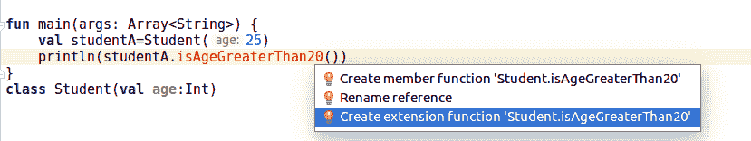
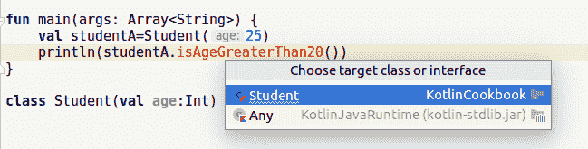
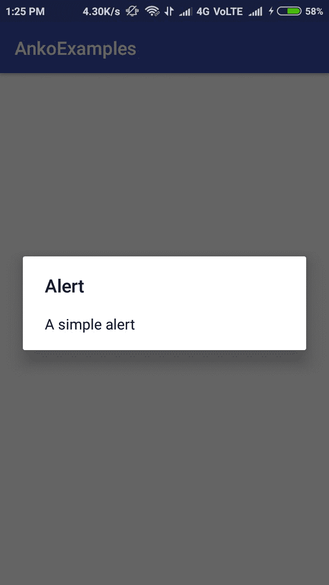
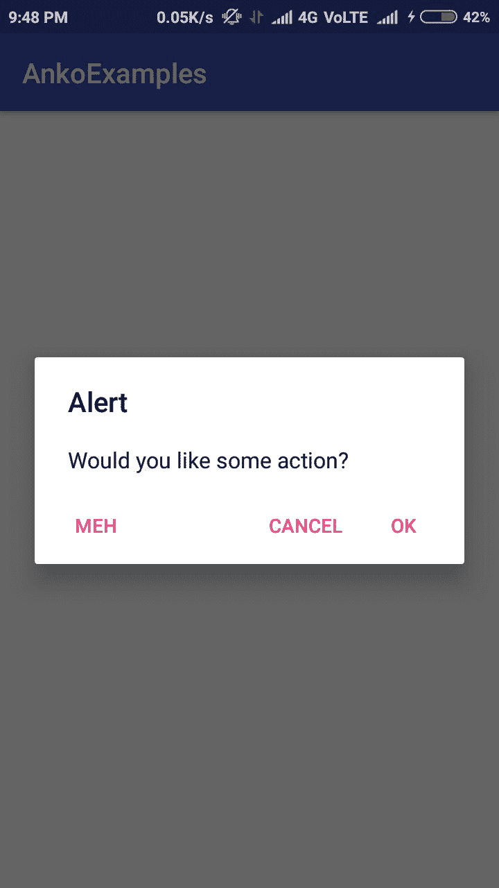
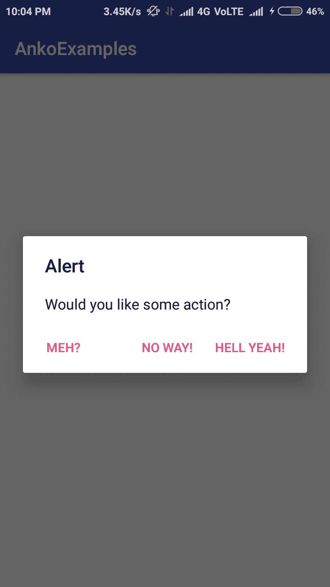
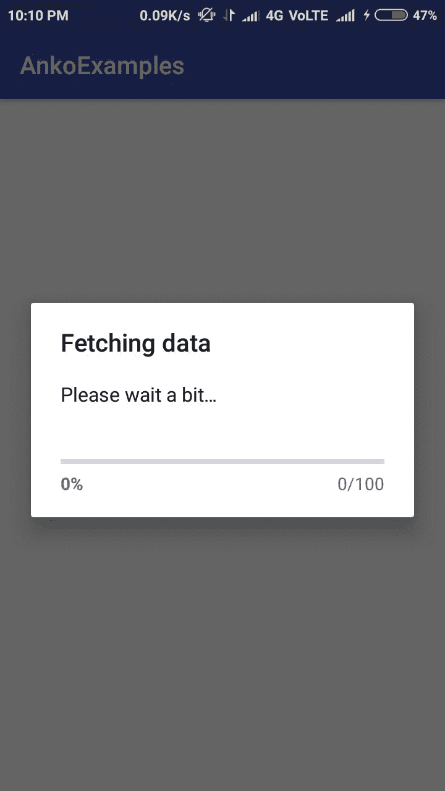
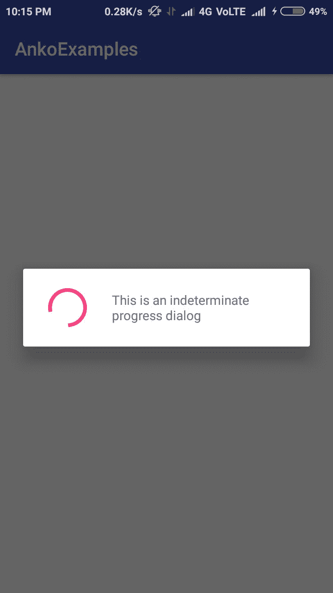
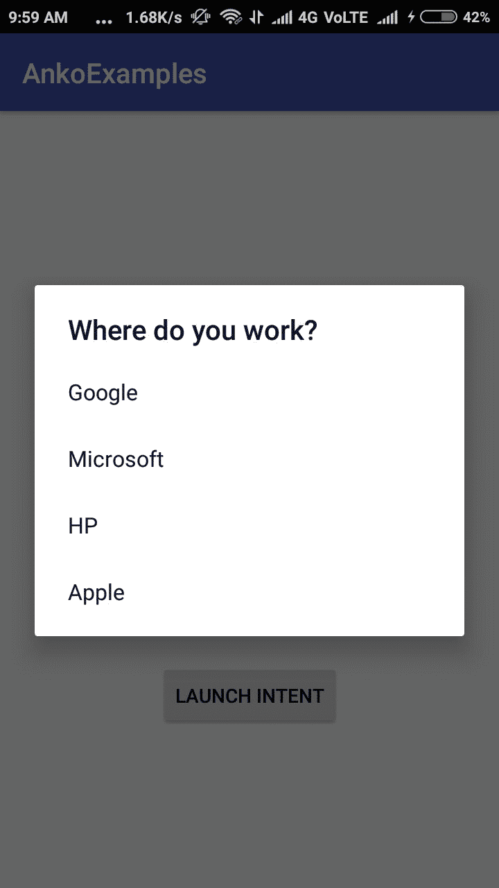
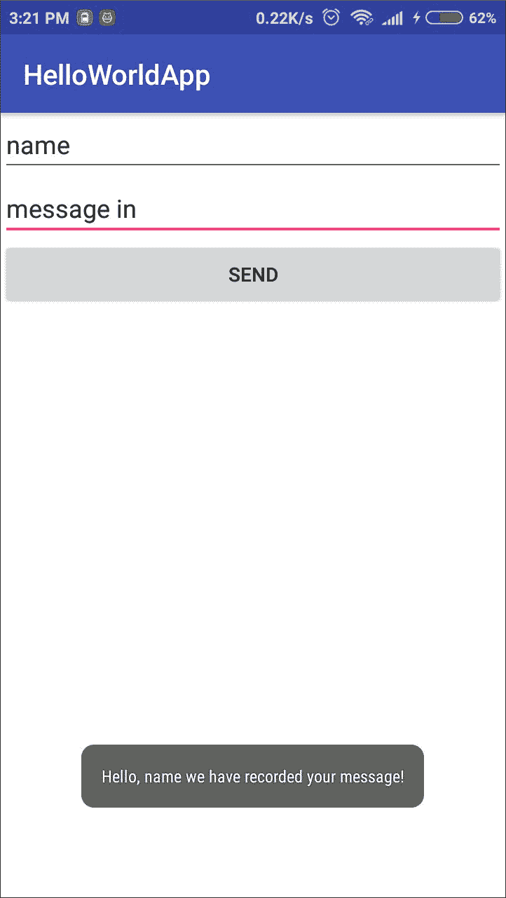

# 第八章：Anko Commons 和扩展函数

本章将涵盖以下内容：

+   使用 Gradle 设置 Anko

+   使用扩展函数扩展 Android 框架

+   将扩展用作属性

+   使用 Anko 的意图

+   使用 Anko 制作电话意图

+   使用 Anko 发送文本意图

+   使用 Anko 浏览网页

+   使用 Anko 的意图分享一些文本

+   使用 Anko 发送电子邮件

+   使用 Anko 创建 Android 对话框

+   使用文本项列表显示一个警告对话框

+   在视图中使用 Anko

+   使用 Anko 进行日志记录

+   使用 Anko 处理尺寸

+   Android 中的版本检查

# 简介

**Anko** 是一个 Kotlin 库，它被开发出来以改善 Android 开发体验。Kotlin 本身就使 Android 开发变得容易，而 Anko 则是它的点睛之笔。Anko 几乎为所有常见的 Android 功能提供了辅助工具，大大减少了你需要编写的代码量，并使 Android 开发变得有趣。

Anko 由几个部分组成：

+   **Anko Commons**：它包含了一系列辅助方法，用于处理意图、对话框、日志记录等，显著减少了代码量。

+   **Anko Layouts**：使用这个库，你不必坚持传统的 XML 来创建视觉界面。Anko 布局是一种快速且类型安全的编写动态 Android 布局的方法。

+   **Anko SQLite**：这是一个 Android SQLite 的查询 DSL 和解析器集合，使得与底层 SQLite 数据库的工作变得非常简单。

+   **Anko Coroutines**：协程是进行异步编程的绝佳方式。Anko 协程提供了基于 `kotlinx.coroutines`（[`github.com/Kotlin/kotlinx.coroutines`](https://github.com/Kotlin/kotlinx.coroutines)）库的实用工具。

在本章中，我们将学习如何使用 Anko 进行 Android 开发。那么，让我们开始吧！

# 使用 Gradle 设置 Anko

我们将首先在我们的项目中设置 Anko 库。我们将使用 Gradle 来处理项目的依赖关系。

# 准备工作

我将使用 Android Studio 来编写代码。你还可以在[`gitlab.com/aanandshekharroy/Anko-examples`](https://gitlab.com/aanandshekharroy/Anko-examples)存储库的 1-setting-up-anko-with-gradle 分支中找到源代码。

# 如何做到这一点…

按照以下步骤使用 Gradle 构建系统将 Anko 添加到你的项目中：

1.  使用 Gradle 设置 Anko 的最简单方法是，在你的 `build.gradle` 文件中添加以下行：

```java
    compile "org.jetbrains.anko:anko:$anko_version"
```

1.  你可以将 `$anko_version` 替换为 Anko 的最新版本，当本书编写时，这个版本是 0.10.1。

1.  前面的编译语句将一次性将所有可用的功能（包括 Commons、Layouts、SQLite）添加到你的项目中。如果你不想这样做，并且希望按需单独添加它们，以下是一些编译语句：

+   `anko-commons`：这个库包含了许多 Android SDK 的辅助工具，用于处理意图、对话框、Toast、日志记录以及资源和尺寸：

```java
    compile "org.jetbrains.anko:anko-commons:$anko_version"
```

+   **Anko Layouts**：Anko Layouts 是一个用于编写动态 Android 布局的 DSL：

```java
compile "org.jetbrains.anko:anko-sdk25:$anko_version" // sdk15,19,21,23 are also available
compile "org.jetbrains.anko:anko-appcompat-v7:$anko_version"
```

+   `anko-sqlite`：这为使用 SQLite 数据库提供了辅助工具：

```java
compile "org.jetbrains.anko:anko-sqlite:$anko_version"

```

+   `anko-coroutines`：这个库使得使用 Kotlin 协程变得更加容易：

```java
compile "org.jetbrains.anko:anko-coroutines:$anko_version"

```

# 使用扩展函数扩展 Android 框架

这个菜谱的标题可能对你来说非常令人困惑，因为你可能会想“我怎么能扩展如此复杂的 Android 框架？而且更重要的是，为什么我要？”我们将在这个菜谱中处理所有关于扩展函数的“是什么、为什么和怎么做”。扩展函数是 Kotlin 最伟大的功能之一。所以，让我们深入探讨。

# 准备中

我将使用 Android Studio 进行编码。我们将为 Android SDK 类创建扩展函数。

# 如何做到这一点…

首先，让我们看一个非常简单的例子：

1.  我们将创建一个非常简单的类`Student`，并为它创建一个扩展函数：

```java
class Student(val age:Int)
```

1.  现在，我们想要创建一个`isAgeGreaterThan20`函数，如果年龄大于 20 则返回`true`，否则返回`false`。现在假设有一个限制，我们不能触摸`Student`类，你会怎么做？

1.  在这些场景中，当你想要扩展类的功能时，扩展函数就派上用场了。如果你尝试调用该方法，你会看到一个错误，如下所示：



1.  然后，你需要选择`创建扩展函数 ...`选项来为它创建一个扩展函数。当你选择该选项时，你将再次被给出两个选项，询问你想要创建扩展函数的对象。



1.  由于我们要为`Student`类创建函数，我们将从下拉菜单中选择`Student`选项。选择它后，IDE 将自动生成方法体。我已经将返回类型修改为返回布尔值：

```java
private fun Student.isAgeGreaterThan20(): Boolean {

}
```

1.  然后，我们可以在方法块内执行操作。我们的方法看起来是这样的：

```java
private fun Student.isAgeGreaterThan20(): Boolean {
    return this.age>20
}
```

1.  注意，由于我们是在学生对象上调用该方法，我们可以使用`this`关键字来访问它，尽管在这种情况下你可以省略`this`关键字，因为我们在这个方法中不处理相同类型的其他对象。

1.  现在，我们可以像调用普通方法一样调用它：

```java
fun main(args: Array<String>) {
    val studentA=Student(25)
    println(studentA.isAgeGreaterThan20())
}
>
//Output: true
```

1.  现在，让我们看看一个与 Android 相关的示例。如果你使用过任何第三方库，如`Picasso`或`Glide`，你可能记得像这样在`ImageView`中设置图片：

```java
Picasso.with(context).from(url).into(imageView);
```

1.  你可以创建一个名为`loadImage`的`ImageView`扩展函数，然后在你的应用程序中调用该函数。当然，`loadImage`不是`ImageView`类提供的函数，所以你需要创建一个扩展函数来达到这个目的。我们将在这个`imageView`对象上调用该方法，并传递一个`url`：

```java
imageView.loadImage(url)
private fun ImageView.loadImage(url: String) {
    Picasso.with(this.context).load(url).into(this)
}
```

1.  注意，在`loadImage`函数中，我们正在将`this`引用到调用该函数的`ImageView`对象上。

# 它是如何工作的…

**扩展函数**是静态解析的，这意味着它们是普通的静态方法，并且与它们扩展的类（这就是为什么我们能够扩展我们无法修改的类）没有关联，除了接受这个类的实例作为参数。

如果你反编译 Kotlin 的字节码，你会看到代码被转换为 Java：

```java
private static final boolean isAgeGreaterThan20(@NotNull Student $receiver) {
   return $receiver.getAge() > 20;
}
```

如你所见，它只是一个静态方法，并接受类作为参数。

# 还有更多...

由于扩展函数非常有用，你可能想大量使用它们。然而，权力越大，责任越大。由于它们是静态解析的，你不应该在所有地方都使用它们，因为静态函数很难测试。不负责任地使用它们意味着你的代码将更难以测试，因此更难以维护。

# 将扩展用作属性

在上一个菜谱中，我们学习了扩展函数。在这个菜谱中，我们将学习扩展属性。如果你需要从类中获取一个或多个属性，你可以使用扩展属性来添加它们。在这个菜谱中，我们将学习如何使用扩展属性。

# 准备工作

我将使用 Android Studio 进行编码。确保你有配置了 Kotlin 的最新版本的 Android Studio。

# 如何做到这一点...

让我们看看扩展属性的例子：

1.  我们将使用共享首选项的例子。你可能习惯于这样做来获取共享首选项：

```java
PreferenceManager.getDefaultSharedPreferences(this)
```

1.  你可以在`Context`类上创建一个名为偏好的扩展属性，并按以下方式访问它：

```java
val Context.preferences: SharedPreferences
       get() = PreferenceManager
       .getDefaultSharedPreferences(this)
context.preferences.getInt("...")
```

# 它是如何工作的...

扩展函数没有修改类，扩展属性也是如此；它们不会向类本身添加属性，因此我们在这种情况下没有后端字段。由于我们没有后端字段，我们无法初始化它。处理它们的唯一方法是通过自定义获取器和设置器。

# 还有更多...

与扩展属性类似，我们可以有伴随对象扩展，这意味着我们可以向类的伴随对象添加方法，帮助我们以静态方式访问它。让我们看一个例子。假设我们有一个`Student`类：

```java
class Student(val age:Int){
    companion object{

    }
}
```

现在让我们给伴随对象添加一个扩展方法：

```java
fun Student.Companion.sayHi(){
    println("Hi")
}
```

现在，你可以在不创建类实例的情况下访问它：

```java
Student.sayHi()
```

# 使用 Anko 与意图一起使用

**意图**是 Android 应用中最常用的组件之一。它们可以被看作是用于在不同 Android 组件之间传递消息的信使。例如，当你需要启动一个活动时，你会发送一个意图；当你需要启动一个服务时，你会发送一个意图。要在 Android 中启动一个活动，你首先需要创建一个意图，然后将其传递给`startActivity`方法。在下面的例子中，我们将尝试使用一些数据和标志启动一个活动：

```java
val intent = Intent(this, SomeActivity::class.java)
intent.putExtra("data", 5)
intent.setFlag(Intent.FLAG_ACTIVITY_SINGLE_TOP)
startActivity(intent)
```

此外，你可以假设所有你带有意图传递的数据都占用额外的行。

Anko 有一种更好的方法来实现类似的结果。在本食谱中，我们将学习如何使用 Anko 库实现这一点（启动意图）。

# 准备工作

我将使用 Android Studio 进行编码目的。您需要在您的 `build.gradle` 文件中在 app 级别包含 Anko 库。只需添加这些行，然后您就可以开始了：

```java
compile "org.jetbrains.anko:anko-commons:$anko_version"
```

# 如何操作…

在 Anko 中创建意图非常简单。让我们检查以下步骤：

1.  我们前面编写的代码所实现的功能，使用 Anko 只需几行代码就可以实现：

```java
startActivity(intentFor<SomeActivity>("data" to 5).singleTop())
```

1.  如果您不想添加标志，这要简单得多：

```java
startActivity<SomeActivity>("data" to 5)
```

1.  添加额外数据不需要额外的行：

```java
startActivity<SomeActivity>("data" to 5, "another_data" to 10)
```

# 它是如何工作的…

让我们看看前面方法的源代码实现：

```java
inline fun <reified T: Any> Context.intentFor(vararg params: Pair<String, Any?>)
```

`intentFor` 方法接受 `vararg` 作为参数，因此我们可以向其提供多个数据。此方法调用 `createIntent`，它实际上创建了一个包含提供数据的意图，其外观如下：

```java
fun <T> createIntent(ctx: Context, clazz: Class<out T>, params: Array<out Pair<String, Any?>>): Intent {
    val intent = Intent(ctx, clazz)
    if (params.isNotEmpty()) fillIntentArguments(intent, params)
    return intent
}
private fun fillIntentArguments(intent: Intent, params: Array<out Pair<String, Any?>>) {
    params.forEach {
        val value = it.second
        when (value) {
            null -> intent.putExtra(it.first, null as Serializable?)
            is Int -> intent.putExtra(it.first, value)
            is Long -> intent.putExtra(it.first, value)
            is CharSequence -> intent.putExtra(it.first, value)
            is String -> intent.putExtra(it.first, value)
            is Float -> intent.putExtra(it.first, value)
            is Double -> intent.putExtra(it.first, value)
            is Char -> intent.putExtra(it.first, value)
            is Short -> intent.putExtra(it.first, value)
            is Boolean -> intent.putExtra(it.first, value)
            is Serializable -> intent.putExtra(it.first, value)
            is Bundle -> intent.putExtra(it.first, value)
            is Parcelable -> intent.putExtra(it.first, value)
            is Array<*> -> when {
                value.isArrayOf<CharSequence>() -> intent.putExtra(it.first, value)
                value.isArrayOf<String>() -> intent.putExtra(it.first, value)
                value.isArrayOf<Parcelable>() -> intent.putExtra(it.first, value)
                else -> throw AnkoException("Intent extra ${it.first} has wrong type ${value.javaClass.name}")
            }
            is IntArray -> intent.putExtra(it.first, value)
            is LongArray -> intent.putExtra(it.first, value)
            is FloatArray -> intent.putExtra(it.first, value)
            is DoubleArray -> intent.putExtra(it.first, value)
            is CharArray -> intent.putExtra(it.first, value)
            is ShortArray -> intent.putExtra(it.first, value)
            is BooleanArray -> intent.putExtra(it.first, value)
            else -> throw AnkoException("Intent extra ${it.first} has wrong type ${value.javaClass.name}")
        }
        return@forEach
    }
}
```

如您所见，它以传统的方式内部创建意图，并调用 `fillIntentArguments`，该函数将数据填充到意图中。

# 使用 Anko 创建拨打电话的意图

在上一个食谱中，我们学习了如何使用 Anko 库创建意图。在随后的食谱中，我们将看到如何使用 Anko 中的意图执行常见操作，如发送消息、拨打电话、发送邮件等。

# 准备工作

我将使用 Android Studio 进行编码。您需要在您的 `build.gradle` 文件中包含 Anko 库。只需将以下行添加到您的 `build.gradle` 文件中，然后您就可以开始了：

```java
compile "org.jetbrains.anko:anko-commons:$anko_version"
```

您也可以克隆 [gitlab.com/aanandshekharroy/Anko-examples](https://gitlab.com/aanandshekharroy/Anko-examples) 仓库并切换到 3-intent-actions 分支以获取源代码。

# 如何操作…

让我们按照给定的步骤使用意图拨打电话：

1.  Anko 提供了围绕使用意图可以执行的最常见操作的包装器；其中之一是拨打电话。为此，Anko 提供了 `makeCall` 函数，该函数接受您想要拨打的电话号码：

```java
makeCall("+9195XXXXXXXX")
```

1.  `makeCall` 函数在操作成功时返回 true，如果操作未成功则返回 false。需要注意的是，您需要在您的清单文件中添加 `CALL_PHONE` 权限：

```java
<uses-permission android:name="android.permission.CALL_PHONE"/>
```

# 它是如何工作的…

让我们看看 `makeCall 函数` 的源代码：

```java
fun Context.makeCall(number: String): Boolean {
    try {
        val intent = Intent(Intent.ACTION_CALL, Uri.parse("tel:$number"))
        startActivity(intent)
        return true
    } catch (e: Exception) {
        e.printStackTrace()
        return false
    }
}
```

在包装器下面，它正在以 Android SDK 以前使用的老方法进行操作，即使用一个动作 `Intent.ACTION_CALL` 的隐式意图。

# 使用 Anko 发送文本意图

Anko 提供了围绕意图操作的包装器，这使得调用操作变得非常简单。其中之一就是发送短信。在本食谱中，我们将看到如何启动一个向电话号码发送消息的意图。

# 准备工作

我将使用 Android Studio 进行编码。您需要在您的 `build.gradle` 文件中包含 Anko 库。只需添加给定的行，然后您就可以开始了：

```java
compile "org.jetbrains.anko:anko-commons:$anko_version"
```

您也可以克隆 [gitlab.com/aanandshekharroy/Anko-examples](https://gitlab.com/aanandshekharroy/Anko-examples) 仓库并切换到 3-intent-actions 分支以获取源代码。

# 如何做…

让我们按照以下步骤使用意图发送短信：

1.  Anko 提供了 `sendSMS` 方法，它接受两个参数——其中一个参数是电话号码，另一个是消息：

```java
sendSMS("+9195XXXXXX","Hi")
```

1.  调用此方法将启动消息应用，或者如果您有多个此类应用，它将询问您要启动哪个消息应用，并将预先填充消息正文。调用此函数需要您添加以下权限，否则它将抛出安全异常：

```java
<uses-permission android:name="android.permission.SEND_SMS"/>
```

# 它是如何工作的…

要了解其工作原理，让我们深入了解其实现：

```java
fun Context.sendSMS(number: String, text: String = ""): Boolean {
    try {
        val intent = Intent(Intent.ACTION_VIEW, Uri.parse("sms:$number"))
        intent.putExtra("sms_body", text)
        startActivity(intent)
        return true
    } catch (e: Exception) {
        e.printStackTrace()
        return false
    }
}
```

如您所见，它使用隐式意图在您的设备上启动消息应用。由于此函数需要一个上下文，如果您从片段中调用它，您需要将其作为 `activity.sendSMS(..)` 调用。

# 使用 Anko 浏览网络浏览器

在这个菜谱中，我们将讨论 Anko 包装器，它将帮助我们使用网络浏览器浏览网站。那么，让我们开始吧。

# 准备工作

我将使用 Android Studio 进行编码。您需要在您的 `build.gradle` 文件中包含 Anko 库。只需添加以下代码行，您就可以开始了：

```java
compile "org.jetbrains.anko:anko-commons:$anko_version"
```

您也可以克隆 [gitlab.com/aanandshekharroy/Anko-examples](https://gitlab.com/aanandshekharroy/Anko-examples) 仓库并切换到 `3-intent-actions` 分支以获取源代码。

# 如何做…

现在，让我们看看如何使用意图启动浏览器。

Anko 提供了一个 `browse` 函数，它接受网页地址并在您的设备上启动浏览器。如果您有多个浏览器，它将显示一些选项供您选择。以下是一个示例：

```java
browse("http://www.google.com")
```

您放入参数中的网页地址需要以 `http://` 或 `https://` 作为前缀，否则它将抛出 `ActivityNotFound` 异常。

# 它是如何工作的…

Anko 提供的 `browse` 函数只是一个语法糖，其下是我们之前使用的相同代码：

```java
fun Context.browse(url: String, newTask: Boolean = false): Boolean {
    try {
        val intent = Intent(Intent.ACTION_VIEW)
        intent.data = Uri.parse(url)
        if (newTask) {
            intent.addFlags(Intent.FLAG_ACTIVITY_NEW_TASK)
        }
        startActivity(intent)
        return true
    } catch (e: ActivityNotFoundException) {
        e.printStackTrace()
        return false
    }
}
```

调用此方法返回 true 或 false，这取决于操作是否成功。

# 使用 Anko 的意图共享一些文本

在这个菜谱中，我们将探讨如何使用 Anko 包装器来共享文本。共享文本是一个非常常见的事情，Anko 为此提供了一个非常容易使用的包装器。那么，让我们开始吧！

# 准备工作

我将使用 Android Studio 进行编码目的。您需要在您的 `build.gradle` 文件中包含 Anko 库。只需添加给定的代码行，您就可以开始了：

```java
compile "org.jetbrains.anko:anko-commons:$anko_version"
```

您也可以克隆 [gitlab.com/aanandshekharroy/Anko-examples](https://gitlab.com/aanandshekharroy/Anko-examples) 仓库并切换到 `3-intent-actions` 分支以获取源代码。

# 如何做…

在以下步骤中，我们将看到如何使用意图共享文本：

1.  Anko 提供了一个 `share` 方法，该方法接受一个字符串参数，即要分享的文本和一个可选的参数 subject。主题参数在通过电子邮件应用分享文本时特别有用。毕竟，谁会给 WhatsApp 消息加上主题呢？让我们看看它的实现：

```java
share("Hey","Some subject")
```

1.  没有主题——这不会填写邮件的主题行：

```java
share("Hey")
```

简单到这种程度！

# 它是如何工作的…

如果你查看实现，你会发现 Anko 只提供了语法糖，这大大减少了你的代码行数，以实现类似的功能：

```java
fun Context.share(text: String, subject: String = ""): Boolean {
    try {
        val intent = Intent(android.content.Intent.ACTION_SEND)
        intent.type = "text/plain"
        intent.putExtra(android.content.Intent.EXTRA_SUBJECT, subject)
        intent.putExtra(android.content.Intent.EXTRA_TEXT, text)
        startActivity(Intent.createChooser(intent, null))
        return true
    } catch (e: ActivityNotFoundException) {
        e.printStackTrace()
        return false
    }
}
```

正如你所见，库已经处理了可能出现的所有问题，并只提供了一个辅助函数来使事情更快、更有趣。

# 使用 Anko 发送电子邮件

在这个菜谱中，我们将看到如何使用 Anko 的包装器发送电子邮件。发送电子邮件非常有用，因为几乎所有的应用都提供了一个联系方式。所以，让我们开始吧！

# 准备工作

我将使用 Android Studio 进行编码。你需要在你的 `build.gradle` 文件中包含 Anko 库。只需添加以下行即可：

```java
compile "org.jetbrains.anko:anko-commons:$anko_version"
```

你也可以在 [gitlab.com/aanandshekharroy/Anko-examples](https://gitlab.com/aanandshekharroy/Anko-examples) 仓库中克隆，切换到 `3-intent-actions` 分支以获取源代码。

# 如何操作…

我们将使用 Anko 库提供的 `email` 函数，该函数接受三个参数，其中只有一个参数是必需的：

```java
email("support@XXXXXX.com","Subject","Text")
```

如果你不想在电子邮件中预填充文本，你可以移除主题和文本。

# 它是如何工作的…

让我们看看它的实现：

```java
fun Context.email(email: String, subject: String = "", text: String = ""): Boolean {
    val intent = Intent(Intent.ACTION_SENDTO)
    intent.data = Uri.parse("mailto:")
    intent.putExtra(Intent.EXTRA_EMAIL, arrayOf(email))
    if (subject.isNotEmpty())
        intent.putExtra(Intent.EXTRA_SUBJECT, subject)
    if (text.isNotEmpty())
        intent.putExtra(Intent.EXTRA_TEXT, text)
    if (intent.resolveActivity(packageManager) != null) {
        startActivity(intent)
        return true
    }
    return false

}
```

正如你所见，它会检查额外的数据，例如主题和消息正文，然后启动电子邮件应用。Anko 提供的电子邮件函数只是一个方便的方法，它可以减少你的代码行数，并使你的代码看起来更美观。

# 使用 Anko 创建 Android 对话框

Anko 库的一个真正出色的功能是它可以帮助你轻松且代码量更少地创建警报对话框。

在这个菜谱中，我们将看到如何在 Anko 中创建警报对话框。

# 准备工作

我将使用 Android Studio 来编写代码。你还需要通过在你的 `build.gradle` 文件中添加以下行来包含 Anko 库：

```java
 compile "org.jetbrains.anko:anko:$anko_version"

```

你可以在 [`gitlab.com/aanandshekharroy/Anko-examples/`](https://gitlab.com/aanandshekharroy/Anko-examples/) 仓库的 `2-creating-dialogs-using-anko` 分支中找到源代码。

# 如何操作…

让我们按照提到的步骤在 Kotlin 中创建一个对话框：

1.  在第一个示例中，我们将尝试创建一个简单的警报框。要创建它，你只需要遵循以下语法：

```java
alert("A simple alert","Alert") {

        }.show()
```

1.  如果你尝试运行它，你会看到类似这样的内容：



1.  有一些情况下，你希望用户执行某些操作，因此 Anko 为此提供了方法。查看以下示例：

```java
alert("Would you like some action?","Alert") {
    yesButton {
         toast("Clicked on Yes")
    }
    noButton {
         toast("Clicked on No")
    }
    neutralPressed("Meh"){
         toast("Not interest")
    }
}.show()
```

1.  如上图所示，它填充了警报对话框：



1.  你还可以通过将它们替换为 `positiveButton` 和 `negativeButton` 来自定义 `yesButton` 和 `noButton` 的文本。以下是一个示例：

```java
alert("Would you like some action?","Alert") {
    positiveButton("Hell Yeah!") {
        toast("Clicked on Yes")
    }
    negativeButton("No way!") {
        toast("Clicked on No")
    }
    neutralPressed("Meh?"){
        toast("Not interest")
    }
}.show()
```

如果你运行前面的代码，你将在设备上看到一个对话框出现，如下所示：



1.  在 Android 开发中常用的一种对话框类型是进度对话框。你可以使用 Anko 创建一个像这样的进度对话框：



1.  这种进度对话框非常适合显示用户已完成的进度。它还提供了诸如 `incrementProgressBy` 这样的功能，通过它可以增加进度条。要创建这样的进度对话框，你需要像以下示例那样使用它：

```java
val dialog = progressDialog(message = "Please wait a bit…", title = "Fetching data")
dialog.show()
```

1.  也许你想要一个不确定的进度条，看起来像这样：



要创建一个不确定的进度对话框，就像前面的截图所示，只需将以下行添加到之前的代码中：

```java
indeterminateProgressDialog("This is an indeterminate progress dialog").show()
```

# 显示包含文本项的警告对话框

在之前的菜谱中，我们看到了如何创建不同类型的对话框。在本菜谱中，我们将看到如何创建一个包含文本项的警告对话框，其外观如图所示：



# 准备工作

我将使用 Android Studio 编写代码。你还需要通过在 `build.gradle` 文件中添加以下行来包含 Anko 库：

```java
 compile "org.jetbrains.anko:anko:$anko_version"
```

# 如何实现...

让我们按照给定的步骤创建一个包含项目列表的警告对话框。

Anko 提供了用于创建包含项目列表的对话框的选择器。选择器非常易于使用。你只需要提供警告对话框的标题、列表以及当选项被选中时将执行的 lambda 表达式。以下是其实施示例：

```java
val companies = listOf("Google", "Microsoft", "HP", "Apple")
selector("Where do you work?", companies, { dialogInterface, i ->
    toast("So you work at ${companies[i]}, right?")
})
```

就这些了！这真的很简单和简洁。所以，在前面的示例中，如果你点击列表项，你将看到一个消息提示，上面写着“所以你在谷歌工作，对吧？”

# 工作原理...

Anko 隐藏了所有复杂性，并为你提供了一个易于使用的函数来实现复杂的事情。让我们来看看选择器函数的实现：

```java
fun Context.selector(
        title: CharSequence? = null,
        items: List<CharSequence>,
        onClick: (DialogInterface, Int) -> Unit
) {
    with(AndroidAlertBuilder(this)) {
        if (title != null) {
            this.title = title
        }
        items(items, onClick)
        show()
    }
}
```

如你所见，在表面之下，它和以前的方法一样，但 Anko 提供了语法糖，这有助于我们用更少的代码实现相同的事情。

# 在视图中使用 Anko

Anko 使处理视图和创建布局变得极其快速和简单。使用 Anko，我们可以编写易于阅读和编写的干净代码。在本菜谱中，我们将学习 Anko 在处理 Android 中的视图时如何使用。

# 准备工作

我将使用 Android Studio 3 来编写代码。你可以通过在 Android Studio 3+中创建一个新的项目并添加一个空白活动来开始，因为我们不会使用其他菜谱中的任何代码。你还需要对 Android 开发有一个中级理解。确保你已经通过在你的 app 级别的`build.gradle`文件中添加以下行并将项目同步来添加 Anko 依赖项：

```java
 compile "org.jetbrains.anko:anko:$anko_version"
```

这里，`$anko_version`是 Anko 的最新版本。

# 如何做到这一点……

Anko 使一些常见的 Android 开发任务变得极其简单，例如 toast、snackbar 和对话框。通常，显示这些视图需要大量的代码。让我们看看 Anko 是如何仅用几行简单的代码就能做到的：

**警告对话框**：一个出现在你视图顶部的弹出窗口，通常用于警告：

+   要显示一个警告，我们使用以下语法（DSL 语法）：

```java
alert("Hi, I'm Moss", "This, Jen, is the internet") {
    yesButton { toast("Oh…") }
    noButton {toast("Well...") }
}.show()
```

+   假设我们使用`Appcompat`对话框工厂中的对话框：

```java
alert(Appcompat, "Hello, Jen.").show()
```

+   我们还可以显示进度对话框和不定进度对话框：

```java
val dialog = progressDialog(message = "Please stand by", title = "Fetching data")

indeterminateProgressDialog("You just have to wait indefinitely Jen.").show()
```

**Toast**：它们可以用来显示短时间的信息：

+   根据具体情况，我们可以使用以下语法之一来显示 toast：

```java
toast("Hi! I'm Roy")
toast(R.string.meet_roy)
longToast("We have been together for a long time.")
```

**Snackbar**：Snackbar 与 Toast 消息类似，但它们提供了与它们交互的操作：

+   根据你是否使用字符串或字符串资源以及 snackbar 的超时时间长度以及是否需要操作按钮，有不同方式来显示 snackbar。为了显示 snackbar，你需要一个指向你希望显示 snackbar 的父视图的引用。在 XML 的情况下，你可以通过 Anko 找到一个方法来通过 ID 获取视图，在 DSL 的情况下，你可以直接使用存储父视图的变量。以下是我们可以使用的一些语法：

```java
snackbar(rootView, "Hi! I'm Jen")
snackbar(rootView, R.string.go_away_jen)
longSnackbar(rootView, "I'm going to be here for a long time")
snackbar(rootView, "What do you want?", "Click me") { doSomething() }
```

Anko 使定义布局和处理已创建的布局（在 XML 中）变得更加容易。

**在 DSL 中创建布局**：

+   在 DSL 中创建布局非常简单，我们可以直接将其放在活动的`onCreate()`方法中，如下面的代码所示：

```java
lateinit var rootView: View
lateinit var btn: Button
lateinit var editText1: EditText
lateinit var editText2: EditText

override fun onCreate(savedInstanceState: Bundle?) {
    super.onCreate(savedInstanceState)
    rootView = verticalLayout {
        padding = dip(20)

        editText1 = editText { 
            hint = "What's your name?"
        }

        editText2 = editText {
            hint = "What's your message?"
        }

        btn = button("Click me") {
            onClick {
                toast( "Hey! Here is a toast for you.")
            }
        }

    }
}
```

+   或者，我们也可以将其放在一个实现`AnkoComponent`接口的外部类中：

```java
class MainActivity : AppCompatActivity() {

    override fun onCreate(savedInstanceState: Bundle?) {
        super.onCreate(savedInstanceState)
        MainActivityUI().setContentView(this)
    }

    class MainActivityUI : AnkoComponent<MainActivity> {
        override fun createView(ui: AnkoContext<MainActivity>) = with(ui) {
            verticalLayout {
                padding = dip(20)

                editText {
                    hint = "What's your name?"
                }

                editText {
                    hint = "What's your message?"
                }

                button("Click me") {
                    onClick {
                        toast( "Hey! Here is a toast for you.")
                    }
                }

            }
        }
    }
}
```

+   此外，这就是我们的布局看起来：


**处理已存在的 XML 布局的视图**：

+   假设我们有一个来自我们旧项目的以下 XML 布局：

```java
<?xml version="1.0" encoding="utf-8"?>
<android.support.design.widget.CoordinatorLayout
    xmlns:android="http://schemas.android.com/apk/res/android"
    xmlns:app="http://schemas.android.com/apk/res-auto"
    xmlns:tools="http://schemas.android.com/tools"
    android:layout_width="match_parent"
    android:layout_height="match_parent"
    tools:context="android.my_company.com.helloworldapp.HelloWorldActivity">

    <android.support.design.widget.AppBarLayout
        android:layout_width="match_parent"
        android:layout_height="wrap_content"
        android:theme="@style/AppTheme.AppBarOverlay">

        <android.support.v7.widget.Toolbar
            android:id="@+id/toolbar"
            android:layout_width="match_parent"
            android:layout_height="?attr/actionBarSize"
            android:background="?attr/colorPrimary"
            app:popupTheme="@style/AppTheme.PopupOverlay" />

    </android.support.design.widget.AppBarLayout>

    <LinearLayout
        xmlns:android="http://schemas.android.com/apk/res/android"
        xmlns:app="http://schemas.android.com/apk/res-auto"
        xmlns:tools="http://schemas.android.com/tools"
        android:layout_width="match_parent"
        android:layout_height="match_parent"
        android:orientation="vertical"
        android:background="@color/white"
        app:layout_behavior="@string/appbar_scrolling_view_behavior">

        <EditText
            android:id="@+id/name"
            android:layout_width="match_parent"
            android:layout_height="wrap_content"
            android:hint="What is your name?"/>

        <EditText
            android:id="@+id/message"
            android:layout_width="match_parent"
            android:layout_height="wrap_content"
            android:hint="Your message"/>

        <Button
            android:id="@+id/btn_send"
            android:layout_width="match_parent"
            android:layout_height="wrap_content"
            android:text="Send"/>

    </LinearLayout>

</android.support.design.widget.CoordinatorLayout>
```

+   我们可以使用 Anko 从这个 XML 布局中访问视图，也可以设置/获取这些视图的属性。查看以下代码：

```java
override fun onCreate(savedInstanceState: Bundle?) {
    super.onCreate(savedInstanceState)
    setContentView(R.layout.activity_hello_world)

    var toolbar = find<Toolbar>(R.id.toolbar)
    setSupportActionBar(toolbar)

    var name = find<EditText>(R.id.name)
    var msg = find<EditText>(R.id.message)
    var buttonSend = find<Button>(R.id.btn_send)

    buttonSend.onClick {
        toast("Hello, ${name.text} we have recorded your message!")
    }
}
```

这就是我们的布局看起来：



# 使用 Anko 进行日志记录

日志记录是调试应用程序的绝佳方式。你可能已经使用过 `android.util.Log`，这不是一个很方便的记录消息的方式，因为它要求你为每条消息提供 `Log` 标签，并且还需要你定义标签，这通常每次都是类名。Anko 提供了 anko-logger，它包含在 anko-commons 中。这是一个非常方便的记录消息的方式，因为它不需要你一定覆盖日志标签。在本食谱中，我们将学习如何做到这一点。

# 准备工作

我将使用 Android Studio 来编写代码。你需要在你的 `build.gradle` 文件中添加 `anko-commons`。Anko 日志记录器包含在 `anko-commons` 库中：

```java
dependencies {
    compile "org.jetbrains.anko:anko-commons:$anko_version"
}
```

# 如何做到这一点…

按照以下步骤学习如何使用 Anko 库进行日志记录：

1.  在 Anko 中进行日志记录非常简单。你只需要实现 `AnkoLogger`，如下所示：

```java
class MainActivity : AppCompatActivity(),AnkoLogger {
```

1.  然后，你可以按照以下方式记录消息：

```java
info(“info message”)
```

1.  以下是对各种日志级别及其与 `android.Log.util` 的比较：

| **android.util.Log** | **AnkoLogger** |
| --- | --- |
| `v()` | `verbose()` |
| `d()` | `debug()` |
| `i()` | `info()` |
| `w()` | `warn()` |
| `e()` | `error()` |
| `wtf()` | `wtf()` |

1.  默认的标签名称是类名。如果你想覆盖 `log` 标签，你需要覆盖 `loggertag` 属性：

```java
class MainActivity : AppCompatActivity(),AnkoLogger {
  override val loggerTag="CustomTag"
```

1.  你还可以将记录器用作普通对象。以下是从文档中提供的示例，它使用记录器作为普通对象：

```java
class SomeActivity : Activity() {
   private val log = AnkoLogger<SomeActivity>(this)
   private val logWithASpecificTag = AnkoLogger("my_tag")

   private fun someMethod() {
       log.warning("Big brother is watching you!")
   }
}
```

1.  每个方法都有两个版本：普通和懒加载（内联）：

```java
info(“info message”)
info{“info message”}
```

1.  如果 `Log.isLoggable(tag, Log.INFO)` 为真，则执行懒加载版本。

# 使用 Anko 处理维度

在 XML 中，我们使用 `dp` 或 `dip` 作为布局和视图的**密度无关像素**，使用 `sp` 作为文本的**缩放无关像素**。`dp` 是一个虚拟像素，用于以密度无关的方式定义布局大小；`sp` 与 `dp` 类似，但它还会根据用户的字体偏好进行缩放。在本食谱中，我们将了解如何在 DSL 布局中定义视图和文本的 `dp` 和 `sp` 维度。

# 准备工作

我将使用 Android Studio 3 来编写代码。你可以在 Android Studio 3+ 中创建一个新的项目，并添加一个空白活动来开始，因为我们不会使用其他食谱中的任何代码。你还需要对 Android 开发有一个中级理解。确保你已经通过在你的 app-level `build.gradle` 文件中添加以下行并将项目同步来添加 Anko 依赖项：

```java
 compile "org.jetbrains.anko:anko:$anko_version"
```

在这里，`$anko_version` 是 Anko 的最新版本。

# 如何做到这一点…

在给定的步骤中，我们将学习如何使用 Anko 库来处理维度：

1.  让我们创建一个包含 120 `dip` 宽度和 `wrapContent` 高度的按钮以及一个 24 `sp` 文字大小的文本视图的布局。我建议你自己尝试，使用以下语法：

```java
dip(dipValue)
sp(spValue)
```

1.  以下是通过使用 `dip()` 和 `sp()` 方法创建布局的一种方式。`sp` 通常用于文本，但为了演示，我在下一个示例中使用了它来设置视图的高度。Anko 默认将 `textSize` 属性的值转换为 `sp`，而您必须提供浮点数：

```java
verticalLayout {
    padding = dip(20)

    textView {
        text = "A big text view"
        textSize = 24f
    }

    button("Click me") {
        onClick {
            toast( "Hey! Here is a toast for you.")
        }
    }.lparams(dip(280), sp(80))

}
```

1.  以下是我们布局的外观：


1.  Anko 还提供了方便我们的额外方法，即 `px2dip(pixels)` 和 `px2sp(pixels)`，分别用于将像素转换为 `dip` 和 `sp`。我记得在 Anko 存在之前手动编写这些代码，所以它们在许多时候都很有用。

# Android 版本检查

Android 版本发布非常频繁。随着每个最新版本的 Android，您都会获得新的功能和改进。尽管谷歌非常努力地提供向后兼容性，但他们并不总是能够做到。例如，Material 设计组件没有向后兼容性；您需要针对 API 级别大于 21 才能使用它们。这要求开发者事先检查该 API 级别是否支持该组件，以确保您的应用程序在所有级别上都能平稳运行。我们通常这样做：

```java
if(Build.VERSION.SDK_INT>Build.VERSION_CODES.JELLY_BEAN){

}
```

Anko 提供了辅助函数，帮助我们以更简单的语法实现类似的功能。在本教程中，我们将看到如何使用它。

# 准备工作

我将使用 Android Studio 来编写代码。您还需要通过在 `build.gradle` 文件中添加以下行来包含 Anko 库：

```java
 compile "org.jetbrains.anko:anko:$anko_version"
```

# 如何实现...

在 Anko 中添加版本检查非常简单，Anko 为此提供了两个主要函数：

+   `doIfSdk`：这个函数接受版本代码作为参数，以及一个函数。如果设备的 API 级别等于提供的版本代码，则执行该函数。以下是这个函数的一个示例：

```java
doIfSdk(Build.VERSION_CODES.LOLLIPOP){
    // Do something specific to version 21
}
```

+   `doFromSdk`：这个函数也接受版本代码作为参数，以及一个函数，如果设备的 SDK 级别大于或等于提供的版本代码，则执行该函数。以下是这个函数的一个示例：

```java
doFromSdk(Build.VERSION_CODES.LOLLIPOP){
    // Execute this method on API >=21
}
```

# 它是如何工作的...

让我们看看前面两个辅助方法的实现：

+   对于 `doIfSdk`:

```java
inline fun doIfSdk(version: Int, f: () -> Unit) {
    if (Build.VERSION.SDK_INT == version) f()
}
```

+   对于 `doFromSdk`:

```java
inline fun doFromSdk(version: Int, f: () -> Unit) {
    if (Build.VERSION.SDK_INT >= version) f()
}
```

如您所见，它只是隐藏在背后的旧 Android SDK 代码。`doFromSdk` 和 `doIfSdk` 只是其上层的语法糖。
