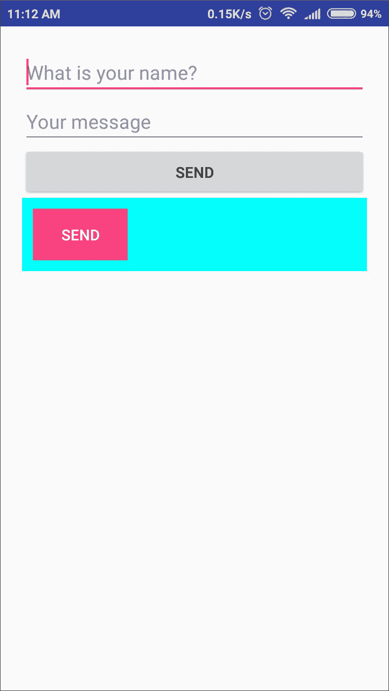

# 第九章：Anko 布局

本章将涵盖以下菜谱：

+   在 Gradle 中为 Anko 布局设置 Anko 库

+   以编程方式创建用户界面

+   使用旧版 XML 布局代码

+   使用提供的 AnkoComponent 接口

+   在 Anko 中为 Android 视图设置主题

+   为 Anko 视图设置布局参数

+   向 Anko 视图添加监听器

+   将 XML 布局插入到 DSL 中

+   将 XML 文件转换为 DSL

+   显示 Snackbar

+   显示 Toast

+   使用合成属性访问视图

+   使用扩展函数访问视图组中的视图

# 简介

Anko 是一个 Kotlin 库，它使 Android 开发变得更快、更简单。它还使代码更简洁。我们大多数人习惯于为 Android 的 UI 编写 XML 布局，这是冗余的，既不类型安全也不为空安全。它还会消耗设备上的 CPU 时间和电池来解析 XML。一些程序化编写布局的人知道代码会变得多么庞大，而且维护起来也非常困难。

使用 Anko，我们可以使用 DSL 来定义布局。使用 DSL 的优点是它们易于阅读和编写，并且没有运行时开销。如果您熟悉 Android 开发和 XML 布局，本章将帮助您快速开始使用 Anko 布局。

# 在 Gradle 中为 Anko 布局设置 Anko 库

要开始使用任何库，首先要做的事情是将它的依赖项添加到我们的项目中，以便能够在我们的项目中使用它的方法和功能。在本菜谱中，我们将探讨如何使用 gradle 将 Anko 布局的依赖项添加到我们的项目中。

# 准备工作

我将使用 Android Studio 3 来编写代码，因为它是目前最新的。您可以通过在 Android Studio 3+ 中创建一个新的 Kotlin 项目并添加一个空白活动来开始，因为我们不会使用其他菜谱中的任何代码。您还需要对 Android 开发有一个中级理解。

# 如何操作...

在以下步骤中，我们将向我们的项目中添加 Anko：

1.  我们可以通过在 `build.gradle` 依赖项中添加以下行一次添加所有 Anko 功能和组件：

```java
// Anko
compile "org.jetbrains.anko:anko:$anko_version"
```

在这里，`$anko_version` 是 Anko 的最新版本。您可以用 Anko 当前最新版本替换它。

1.  之后，同步您的 `build.gradle` 文件。现在，Anko 依赖项已经添加到您的项目中。让我们通过简单地使用 Anko 公共库来创建并显示一个警报对话框来检查这一点。通过在您的 XML 布局中定义它并在上面添加 `onClickListener` 来在您的活动中创建一个按钮，点击它应该运行以下代码：

```java
alert("This is my message from alert dialog", "An Alert!") {
    yesButton { toast("Thanks for clicking ok") }
    noButton {
        toast("Got it!") }
}.show()
```

1.  如果点击按钮后出现一个警报，显示我们已经成功将 Anko 库添加到我们的项目中，这就是警报对话框的样式：


1.  然而，大多数时候我们只需要在我们的项目中添加 Anko 的单个功能。例如，本例中的 Anko 布局。所以让我们尝试只添加 Anko 布局库到我们的项目中。从 `build.gradle` 和您的 `Activity` 中移除之前的代码，然后重新开始。

1.  现在将以下行添加到您的项目 app 级 `build.gradle` 依赖项中：

```java
// Anko Layouts
compile "org.jetbrains.anko:anko-sdk25:$anko_version"
compile "org.jetbrains.anko:anko-appcompat-v7:$anko_version"
```

1.  同步您的 `build.gradle` 文件，如果没有错误，您现在可以在项目中使用 Anko 布局。在此阶段，我们还应该添加 Anko 协程的依赖项，因为我们显然需要在布局上添加监听器。您可以通过将以下行添加到您的 `build.gradle` 文件中来添加这些依赖项：

```java
// Coroutine listeners for Anko Layouts
compile "org.jetbrains.anko:anko-sdk25-coroutines:$anko_version"
compile "org.jetbrains.anko:anko-appcompat-v7-coroutines:$anko_version"

```

1.  完成！现在，让我们检查一切是否运行得完美。为此，让我们向我们的主活动添加一个基本的 DSL 布局。查看以下目标活动 `onCreate()` 方法的代码：

```java
override fun onCreate(savedInstanceState: Bundle?) {
    super.onCreate(savedInstanceState)
    verticalLayout {
        button("Hello World button!") {
            onClick { toast("Hello, World!") }
        }
    }
}
```

1.  现在在您的手机上运行应用程序；如果布局工作正确，即屏幕上有一个带有文本 HELLO WORLD BUTTON! 的按钮，那么我们已经成功地将 Anko 布局依赖项添加到我们的项目中。这就是我们的布局看起来像这样：


1.  此外，当点击按钮时，我们会得到如下 toast 信息：


# 它是如何工作的...

通过在我们的 `build.gradle` 文件中添加项目依赖项，惊人的 Gradle 会负责处理我们的项目所需的库和依赖项。Gradle 会在我们机器上或远程仓库中定位依赖项，并且任何传递依赖项都会自动包含。Gradle 使得添加项目依赖项变得极其简单和快速，我们可以将大部分时间投入到创建我们惊人的软件中，而不是维护和解决在大型项目中变得极其困难的依赖项。

# 还有更多...

如果您不使用 Gradle 并且不想在项目中使用它，您可以直接从 **jcenter 仓库**（[`jcenter.bintray.com/org/jetbrains/anko/`](https://jcenter.bintray.com/org/jetbrains/anko/)）添加 Anko 库 JAR 作为库依赖项。

# 以编程方式创建用户界面

使用 XML 编写 UI 既不安全也不安全，它还会消耗 CPU 和电池。以编程方式编写 UI（尤其是在 Java 中）对于大型和复杂的 UI 来说变得庞大且难以管理。这就是 Anko 布局出现的时候。我们可以使用 Anko 布局轻松地使用 DSL 创建布局，并且它也没有运行时开销。在本菜谱中，我们将了解如何使用 DSL 创建布局。

# 准备工作

我将使用 Android Studio 3 来编写代码。您可以通过在 Android Studio 3+ 中创建一个新的 Kotlin 项目并添加一个空白活动来开始，因为我们不会使用其他菜谱中的任何代码。您还需要对 Android 开发有一个中级理解。请确保您已经将 Anko 布局依赖项添加到您的项目中（在本章中遵循菜谱 *在 gradle 中设置 Anko 库用于 Anko 布局*）。

# 如何做到这一点...

让我们从使用 Anko 为我们的目标活动（您想要创建布局的活动）创建布局的简单示例开始：

1.  这是您需要在目标活动中放置的 `onCreate()` 方法的代码：

```java
override fun onCreate(savedInstanceState: Bundle?) {
    super.onCreate(savedInstanceState)
    verticalLayout {
        padding = dip(20)
        val name = editText {
            hint = "What is your name?"
        }
        val message = editText {
            hint = "Your message"
        }
        button("Send") {
            onClick { toast("Hello, ${name.text} we have recorded your message!") }
        }
    }
}
```

1.  在前面的代码中，我们想要创建一个基本的“联系我们”表单。为此，我们创建了一个带有 20 dip 填充的垂直线性布局，并在垂直线性布局内部添加了两个用于姓名和消息的编辑文本。点击按钮时，我们获取数据并通过 toast 向用户显示消息已记录的确认。这是屏幕部分的外观：


1.  Anko 布局 DSL 是一种在更少的代码行中构建 UI 的绝佳方式。它易于阅读和编写，且简洁。它没有 XML 布局中存在的运行时开销。Anko 布局也支持 XML，您可以使用自定义组件，也可以为监听器使用协程。您还可以在 Android Studio 中使用`AnkoComponent`接口预览 DSL 布局，我们将在本章后面学习。

1.  让我们尝试另一个例子，在这个例子中，我们将前面的布局放入一个带有工具栏的协调器布局中。为了能够使用协调器布局，我们需要添加 Anko 设计支持库的依赖项。将以下行添加到您的`build.gradle`文件中，并同步您的项目：

```java
// Anko layouts design support
compile "org.jetbrains.anko:anko-design:$anko_version"
```

1.  目前市面上有很多 Anko 为各种 Android 支持库提供的工具。以下是一个列表：

```java
// Appcompat-v7 (only Anko Commons)
 compile "org.jetbrains.anko:anko-appcompat-v7-commons:$anko_version"
// Appcompat-v7 (Anko Layouts)
 compile "org.jetbrains.anko:anko-appcompat-v7:$anko_version"
 compile "org.jetbrains.anko:anko-coroutines:$anko_version"
// CardView-v7
 compile "org.jetbrains.anko:anko-cardview-v7:$anko_version"
// Design
 compile "org.jetbrains.anko:anko-design:$anko_version"
 compile "org.jetbrains.anko:anko-design-coroutines:$anko_version"
// GridLayout-v7
 compile "org.jetbrains.anko:anko-gridlayout-v7:$anko_version"
// Percent
 compile "org.jetbrains.anko:anko-percent:$anko_version"
// RecyclerView-v7
 compile "org.jetbrains.anko:anko-recyclerview-v7:$anko_version"
 compile "org.jetbrains.anko:anko-recyclerview-v7-coroutines:$anko_version"
// Support-v4 (only Anko Commons)
 compile "org.jetbrains.anko:anko-support-v4-commons:$anko_version"
// Support-v4 (Anko Layouts)
 compile "org.jetbrains.anko:anko-support-v4:$anko_version"
```

1.  现在我们需要的是一个能够适应父元素整个宽度和高度的`coordinator layout`，在其内部，我们需要一个带有工具栏的应用栏，在应用栏下方我们需要之前提到的垂直布局。我建议你在查看我的方法之前先自己尝试编写这段代码，方法如下：

```java
coordinatorLayout {
    fitsSystemWindows = true
    lparams {
        width = matchParent
        height = matchParent
    }
    appBarLayout {
        toolbar {
            setTitleTextColor(Color.WHITE)
            id = R.id.toolbar
            title = resources.getString(R.string.main_activity)
         }.lparams {
             width = matchParent
             height = wrapContent
         }
    }.lparams { width = matchParent }
    verticalLayout {
        verticalLayout {
            background = context.getDrawable(R.color.colorLightGrey)
            gravity = Gravity.CENTER
            textView("logo"){
                textColor = context.getColor(R.color.colorAccent)
                textSize = 24f
            }.lparams(width = wrapContent, height = wrapContent) {
                horizontalMargin = dip(5)
                topMargin = dip(10)
            }
        }.lparams(width = matchParent, height = dip(200)) {
              horizontalMargin = dip(5)
              topMargin = dip(10)
          }
        padding = dip(20)
        val name = themedEditText(theme = R.style.newInput) {
            id = R.id.name
            hint = "What is your name?"
        }
        val message = editText {
            id = R.id.message
            hint = "Your message"
        }
        themedButton("Send", theme = R.style.newButton)                             {
            id = R.id.btn_send
        }
    }.lparams {
          width = matchParent
          height = matchParent
          behavior = AppBarLayout.ScrollingViewBehavior()
      }
 }
```

1.  在前面的函数中使用的`lparams`是用于向视图添加布局参数的扩展函数。这就是在我们的应用中布局的外观：


使用 DSL 创建布局与 XML 本身有些相似，这是故意的，因为开发者之前有 XML 的经验，这也让我们能够在动态添加视图的同时即时计算事物。

# 它是如何工作的...

XML 解析是在编译时完成的（除了少数几件事情）。它引入了 CPU 和电池开销。对于非常复杂的布局，它还引入了应用中的延迟，有时甚至严重影响了用户体验。

在 Anko 布局中，DSL 在运行时构建布局，因此我们可以包含任何内容。它还避免了运行时开销，我们可以避免空指针异常。此外，我们不需要进行类型转换，也可以避免`findViewById`调用。

# 使用 XML 布局的旧代码

Anko 布局的最好之处在于其灵活性，能够与我们的 XML 布局一起工作。Anko 还通过提供视图属性使事情变得简单。在本食谱中，我们将看到如何使用 XML 布局，同时仍然能够使用 Anko 布局来改进事物。

# 准备工作

我将使用 Android Studio 3 来编写代码。您可以通过在 Android Studio 3+中创建一个新的 Kotlin 项目并添加一个空白活动来开始，因为我们不会使用其他菜谱中的任何代码。您还需要对 Android 开发有中级理解。请确保您已经将 Anko 布局依赖项添加到项目中（遵循本章中的菜谱*在 gradle 中设置 Anko 库以用于 Anko 布局*）。

# 如何做到这一点...

在以下步骤中，我们将学习如何使用 XML 布局和 Anko 布局一起工作：

1.  让我们从先有一个旧的 XML 文件开始工作。将以下代码添加到您将要添加为目标活动内容视图的 XML 布局中：

```java
<?xml version="1.0" encoding="utf-8"?>
<LinearLayout        xmlns:android="http://schemas.android.com/apk/res/android"
    xmlns:app="http://schemas.android.com/apk/res-auto"
    xmlns:tools="http://schemas.android.com/tools"
    android:layout_width="match_parent"
    android:layout_height="match_parent"
    app:layout_behavior="@string/appbar_scrolling_view_behavior"
    tools:context="android.my_company.com.helloworldapp.MainActivity"
    tools:showIn="@layout/activity_main"
    android:orientation="vertical"
    android:padding="20dp">

    <EditText
        android:id="@+id/name"
        android:layout_width="match_parent"
        android:layout_height="wrap_content"
        android:hint="What is your name?"/>

    <EditText
        android:id="@+id/message"
        android:layout_width="match_parent"
        android:layout_height="wrap_content"
        android:hint="Your message"/>

    <Button
        android:id="@+id/btn_send"
        android:layout_width="match_parent"
        android:layout_height="wrap_content"
        android:text="Send"/>

</LinearLayout>
```

1.  传统上，我们在活动中使用`findViewById()`和`onClickListener()`来操作布局元素的属性并处理事件。然而，使用 Anko 布局，这变得和以下一样简单：

```java
override fun onCreate(savedInstanceState: Bundle?) {
    super.onCreate(savedInstanceState)
    setContentView(R.layout.activity_main)
    setSupportActionBar(toolbar)

    var name = find<EditText>(R.id.name)
    var msg = find<EditText>(R.id.message)
    var buttonSend = find<Button>(R.id.btn_send)

    buttonSend.onClick {
        toast("Hello, ${name.text} we have recorded your message!")
    }
}
```

1.  上文是目标活动的`onCreate()`方法。请注意，`find()`方法比`findViewById()`简单得多。

1.  我们可以获取和设置视图属性，还可以将监听器附加到视图事件。另一件事是，Kotlin 的 Android 扩展函数还允许我们处理视图而不使用`find`方法。查看以下代码，它使使用合成扩展属性获取和设置视图属性变得超级简单：

```java
override fun onCreate(savedInstanceState: Bundle?) {
    super.onCreate(savedInstanceState)
    setContentView(R.layout.activity_main)
    setSupportActionBar(toolbar)
    var nameText = name.text
    var msg = message.text
    btn_send.onClick {
        toast("Hello, $nameText we have recorded your message!")
    }
}
```

1.  在这里，`name`、`message`和`btn_send`分别是 XML 布局中视图的 ID。

# 它是如何工作的...

Anko 为我们提供了这些扩展函数和属性，使得访问视图变得更加容易。其中一些函数和属性被预先安排成类型安全的构建器，这些构建器是通过 Android JAR 文件生成的。

# 还有更多...

值得理解 Kotlin 的合成属性是如何工作的。Kotlin 生成一些额外的代码，帮助我们像使用属性一样使用视图，变量命名类似于视图的 ID。基本上，它是在我们第一次尝试将视图作为属性访问时运行`findViewById()`，并将其存储在缓存中，以便所有对同一视图的连续调用都调用`findCachedViewById()`，从而使访问变得更快。

# 使用提供的 AnkoComponent 接口

我们可以直接在`onCreate()`方法中定义活动布局 DSL，但有时将 UI 分离到另一个类会更方便。在这个菜谱中，我们将看到如何使用`AnkoComponent`接口来实现这一点。

# 准备工作

我将使用 Android Studio 3 来编写代码。您可以通过在 Android Studio 3+中创建一个新的 Kotlin 项目并添加一个空白活动来开始，因为我们不会使用其他菜谱中的任何代码。您还需要对 Android 开发有中级理解。请确保您已经将 Anko 布局依赖项添加到项目中（遵循本章中的菜谱*在 gradle 中设置 Anko 库以用于 Anko 布局*）。

# 如何做到这一点...

在给定的步骤中，我们将学习如何使用 AnkoComponent 接口进行工作：

1.  让我们先在实现`AnkoComponent`接口的不同类中添加我们的 UI。如下所示：

```java
class MainActivityUI : AnkoComponent<MainActivity> {
    override fun createView(ui: AnkoContext<MainActivity>) = with(ui) {
    verticalLayout {
        padding = dip(20)
        val name = editText {
            id = R.id.name
            hint = "What is your name?"
        }

        val message = editText {
            id = R.id.message
            hint = "Your message"
        }

        button("Send") {
            id = R.id.btn_send
        }
    }
}
```

1.  注意，前面的类实现了`AnkoComponent`接口。我们需要重写`createView()`方法并从中返回 DSL 布局。现在，让我们看看如何获取这个布局并将其设置到我们的活动中。检查我们活动中的修改后的`onCreate()`方法：

```java
override fun onCreate(savedInstanceState: Bundle?) {
    super.onCreate(savedInstanceState)
    MainActivityUI().setContentView(this)
}
```

1.  现在，让我们尝试在我们的活动中访问这些视图，如果我们已经正确设置了布局，我们应该能够做到这一点。我们将像访问 XML 布局中的视图一样访问它们：

```java
override fun onCreate(savedInstanceState: Bundle?) {
    super.onCreate(savedInstanceState)
    MainActivityUI().setContentView(this)
    btn_send.onClick { toast("Hello, ${name.text} we have recorded your message!") }
}
```

1.  下一张图片将展示屏幕的显示效果：


1.  此外，在输入详细信息并点击按钮后，我们会看到如下所示的 toast：


# 它是如何工作的...

`verticalLayout`（这是一个垂直线性布局）块是 Anko 提供的扩展函数，它创建一个新的视图实例并将其添加到父级。对于 Android 框架中的每个视图都有这样的扩展函数。例如，我们在前面的例子中也使用了按钮和编辑文本。我们也可以将其用作`button()`，它接受一个字符串参数作为按钮上的文本，或者`button{}`如果我们想设置该视图的任何属性。

# 更多内容...

如果我们在另一个类中使用`AnkoComponent`接口来创建我们的 DSL，我们也可以使用 Anko 支持插件预览我们的布局 DSL。

为了这样做，首先从 Android Studio 设置中的插件中添加 Anko 支持插件。之后，将光标放在`MainActivityUI`声明内部，通过点击视图|工具窗口|Anko 布局预览打开 Anko 布局预览工具窗口，然后按刷新。

如果布局预览没有正确渲染，请重新构建项目。这是窗口的显示方式：


# 在 Anko 中为 Android 视图设置主题

如果我们无法为视图设置样式，我们的 Android 应用将不会那么美观。Anko 布局让我们能够将自定义主题应用到我们的视图上。在本菜谱中，我们将学习如何在 Anko 中创建主题视图。

# 准备中

我将使用 Android Studio 3 来编写代码。您可以通过在 Android Studio 3+中创建一个新的 Kotlin 项目并包含一个空白活动来开始，因为我们不会使用其他菜谱中的任何代码。您还需要对 Android 开发有一个中级理解。请确保您已经将 Anko 布局依赖项添加到项目中（遵循本章中的菜谱*在 gradle 中设置 Anko 库的 Anko 布局*）。

# 如何操作...

在给定的步骤中，我们将学习如何使用 Anko 为 Android 视图设置主题：

1.  让我们先为按钮创建一个样式。自定义样式是在`res/values/`目录中的`styles.xml`文件内创建的。让我们创建一个按钮样式，命名为`newButton`。在`styles.xml`中添加以下代码：

```java
<style name="newButton" parent="android:Widget.Holo.Light.Button">
    <item name="android:colorButtonNormal">@color/colorAccent</item>
    <item name="android:textColor">@color/white</item>
</style>
```

1.  现在，让我们使用这个样式在我们的目标活动中创建一个主题按钮。让我们使用`AnkoComponent`接口将我们的 UI 保持在另一个类中。以下是如何在 DSL 布局中创建一个具有自定义主题的按钮的示例（注意代码中的粗体部分）：

```java
class MainActivityUI : AnkoComponent<MainActivity> {
    override fun createView(ui: AnkoContext<MainActivity>) = with(ui) {
        verticalLayout {
            padding = dip(20)
            val name = editText {
                id = R.id.name
                hint = "What is your name?"
            }

            val message = editText {
                id = R.id.message
                hint = "Your message"
            }

            themedButton("Send", theme = R.style.newButton)                                       {
                id = R.id.btn_send }
        }
    }

}
```

1.  此外，为了设置我们活动的布局，我们在`onCreate()`方法中添加了`LayoutActivity().setContentView(this)`这一行，如下所示（注意代码中的粗体部分）：

```java
override fun onCreate(savedInstanceState: Bundle?) {
        super.onCreate(savedInstanceState)
 MainActivityUI().setContentView(this)
        btn_send.onClick { toast("Hello, ${name.text} we have recorded your message!") }
    }
```

1.  以下是我们应用屏幕顶部的样子，主题按钮的背景颜色与我们在`res/values/`目录下的`colors.xml`文件中定义的强调颜色一致。文字颜色为白色，正如我们在自定义样式中设置的那样：


1.  这就是我们设置视图主题的方式，通过在视图名称之前附加主题关键字并将其转换为驼峰式来设置。我们将主题作为参数传递给函数。

主题视图也是 Anko 布局提供的 Kotlin 扩展函数。

# 为 Anko 视图设置布局参数

没有布局参数，我们几乎无法对布局做任何事情。在这个菜谱中，我们将看到如何在我们布局 DSL 中的视图中使用布局参数。

# 准备工作

我将使用 Android Studio 3 来编写代码。您可以通过在 Android Studio 3+中创建一个新的 Kotlin 项目并添加一个空白活动来开始，因为我们不会使用其他菜谱中的任何代码。您还需要对 Android 开发有中级理解。请确保您已经将 Anko 布局依赖项添加到项目中（遵循本章中的菜谱*在 gradle 中设置 Anko 库以用于 Anko 布局*）。

# 如何做到这一点...

在以下步骤中，我们将学习如何为 Anko 视图设置布局参数：

1.  让我们从创建一个继承自`AnkoComponent`接口的外部类中的视图开始。为了向视图添加布局参数（我们使用 Anko 提供的扩展函数添加），我们使用`lparams()`扩展函数，它在 DSL 视图块的末尾添加，类似于这样：

```java
val message = editText {
    id = R.id.message
    hint = "Your message"
}.lparams(){
 // We specify our layout parameters here
}
```

1.  让我们尝试一个简单的垂直布局示例；查看以下代码块（注意代码中的粗体部分）：

```java
verticalLayout {
    verticalLayout {
        background = context.getDrawable(R.color.colorLightGrey)
        gravity = Gravity.CENTER
        textView("logo"){
            textColor = context.getColor(R.color.colorAccent)
            textSize = 24f
        }.lparams(width = wrapContent, height = wrapContent) {
            horizontalMargin = dip(5)
 topMargin = dip(10)
        }

    }.lparams(width = matchParent, height = dip(200)) {
        horizontalMargin = dip(5)
 topMargin = dip(10)
    }
    padding = dip(20)
    val name = themedEditText(theme = R.style.newInput) {
        id = R.id.name
        hint = "What is your name?"
    }

    val message = editText {
        id = R.id.message
        hint = "Your message"
    }

    themedButton("Send", theme = R.style.newButton) {
        id = R.id.btn_send
    }
}
```

1.  `themedEditText`和`themedButton`扩展函数是由 Anko 提供的，用于创建具有主题的编辑文本和按钮。如果您不想使用主题视图，只需调用`editText()`和`button()`而不传递主题参数即可。


1.  让我们通过另一个示例来了解，在这个示例中我们有一个包含页面标题的工具栏。查看下一个示例，它使用协调布局、应用栏布局和工具栏。给定的代码生成与代码后面的截图一致的布局：

```java
coordinatorLayout {
    fitsSystemWindows = true
    lparams {
 width = matchParent
 height = matchParent
 }
    appBarLayout {
        toolbar {
            setTitleTextColor(Color.WHITE)
            id = R.id.toolbar
            title = resources.getString(R.string.main_activity)
         }.lparams {
 width = matchParent
 height = wrapContent
 }
    }.lparams { width = matchParent }
    verticalLayout {
        verticalLayout {
            background = context.getDrawable(R.color.colorLightGrey)
            gravity = Gravity.CENTER
            textView("logo"){
                textColor = context.getColor(R.color.colorAccent)
                textSize = 24f
            }.lparams(width = wrapContent, height = wrapContent) {
 horizontalMargin = dip(5)
 topMargin = dip(10)
 }
        }.lparams(width = matchParent, height = dip(200)) {
 horizontalMargin = dip(5)
 topMargin = dip(10)
 }
        padding = dip(20)
        val name = themedEditText(theme = R.style.newInput) {
            id = R.id.name
            hint = "What is your name?"
        }
        val message = editText {
            id = R.id.message
            hint = "Your message"
        }
        themedButton("Send", theme = R.style.newButton)                                                 {
            id = R.id.btn_send
        }
    }.lparams {
 width = matchParent
 height = matchParent
 behavior = AppBarLayout.ScrollingViewBehavior()
 }
 }    
```

以下是我们应用中的布局外观：


# 它是如何工作的...

`lparams` 也是一个添加到视图的 Anko 扩展函数，我们可以将布局参数定义为属性。如果您在使用 `lparams()` 时省略宽度或高度，它们的值将自动默认为 `wrapContent`，就像在 XML 中一样。传递的参数是命名参数。一些属性包括 `horizontalMargin`、`verticalMargin` 和 `margin`。对于不同的布局，我们有不同的布局参数，就像在 XML 中一样。例如，对于相对布局，我们有 `alignParentBottom()`、`alignParentTop()`、`alignParentStart()`、`leftOf(viewIdOfReferenceView)`、`topOf(viewIdOfReferenceView)` 等等。

查看以下示例，它具有作为根布局的相对布局：

```java
class MainActivityUI : AnkoComponent<MainActivity> {
    override fun createView(ui: AnkoContext<MainActivity>) =     with(ui) {
        relativeLayout {
            button("Ok") {
                id = R.id.ok
            }.lparams { leftOf() } 
            button("Cancel").lparams { leftOf(R.id.ok) }
            lparams(matchParent, matchParent)
        }
    }
}
```

这就是前面布局的外观：


# 向 Anko 视图添加监听器

我们在 Android 中的视图中具有事件监听器。让我们了解 Anko 如何通过为我们提供监听器辅助工具来简化这一过程。

# 准备工作

我将使用 Android Studio 3 来编写代码。您可以通过在 Android Studio 3+ 中创建一个新的 Kotlin 项目并添加一个空白活动来开始，因为我们不会使用其他菜谱中的任何代码。您还需要对 Android 开发有一个中级理解。请确保您已将 Anko 布局依赖项添加到项目中（遵循本章中的菜谱 *在 gradle 中设置 Anko 库以用于 Anko 布局*）。

# 如何操作…

在以下步骤中，我们将学习如何向 Anko 视图添加事件监听器：

1.  让我们从监听按钮上的点击事件的一个简单示例开始。以下是给具有 `btn_send` ID 的按钮附加 `onClick` 监听器的代码：

```java
btn_send.onClick { toast("Hello there we have recorded your message!") }

```

1.  前面的代码与以下代码相同：

```java
var btn = find<EditText>(R.id.btn_send)
btn.setOnClickListener(object : OnClickListener {
    override fun onClick(v: View) {
      toast("Hello there we have recorded your message!")
    }
})
```

1.  现在，让我们创建一个包含按钮和评分栏的布局。我们将在按钮上附加一个 `onLongPress` 监听器，并在评分栏上附加一个 `onRatingBarChange` 监听器。查看以下代码：

```java
verticalLayout {
    padding = dip(20)
    val name = editText {
        id = R.id.name
        hint = "What is your name?"
    }

    val message = editText {
        id = R.id.message
        hint = "Your message"
    }

    button("Send") {
        id = R.id.btn_send
        onLongClick {
 toast("Hello there we have recorded your message!")
 }
    }

    var rating = ratingBar {
        id = R.id.rating_bar
        onRatingBarChange { ratingBar, rating, fromUser ->
 toast(rating.toString())
 }
    }.lparams(wrapContent, wrapContent)
}
```

重点关注前面代码中的粗体文本。我们可以通过直接将它们放在定义的视图内部来附加监听器。这就是我们的布局外观：


1.  在前面屏幕上长按具有文本“发送”的按钮时，我们会看到预期的 toast。查看以下屏幕：


1.  类似地，如果我们从评分栏中选择一个评分，我们会得到一个显示我们选择的评分的 toast。

  

1.  我们也可以将监听器与布局分开，如下面的代码所示。但是，我们需要设置监听器的视图的 ID 才能使此操作生效：

```java
override fun onCreate(savedInstanceState: Bundle?) {
    super.onCreate(savedInstanceState)
    MainActivityUI().setContentView(this)
    btn_send.onLongClick {
        toast("Hello there we have recorded your message!")
    }
}
```

# 它是如何工作的…

Anko 提供事件监听器作为扩展函数，以帮助简化添加事件监听器的过程。我们还可以将这些监听器辅助工具传递给协程，并部分定义具有许多方法的监听器，即我们可以分别定义每个监听器方法，然后 Anko 如果它们在同一个视图中，则将它们合并。

# 还有更多...

协程用于编写异步非阻塞代码。你也可以说协程是由用户管理的线程。

# 将 XML 布局插入到 DSL 中

有时可能会出现这样的情况，我们可能需要在 DSL 布局中包含一个 XML 布局。Anko 提供了一个解决方案。在这个菜谱中，我们将了解如何将 XML 布局包含到 DSL 中。

# 准备工作

我将使用 Android Studio 3 来编写代码。你可以在 Android Studio 3+ 中创建一个新的 Kotlin 项目，并包含一个空白活动来开始，因为我们不会使用其他菜谱中的任何代码。你还需要对 Android 开发有一个中级理解。确保你已经将 Anko 布局依赖项添加到你的项目中（遵循本章中的菜谱 *在 gradle 中设置 Anko 库以用于 Anko 布局*）。

# 如何操作...

在以下步骤中，我们将学习如何将 XML 布局插入到 DSL 布局中：

1.  要在 DSL 中包含 XML 布局，我们使用 `include()` 方法。我们可以通过简单地添加 `{}` 并在其中定义我们的视图属性来向使用 `include()` 方法创建的视图添加视图属性。我们也可以向视图添加布局参数，就像我们在 DSL 视图中做的那样。查看以下语法：

```java
include<View>(R.layout.layoutName) {
    id = R.id.someId
    hint = "Some hint"
    text = "Some text"
}.lparams() {}
```

1.  让我们在 XML 中创建一个布局，然后将其包含在我们的 DSL 布局中。让我们在线性布局中创建一个按钮，并将其保存到名为 `test.xml` 的文件中。查看以下我们将保存到 `text.xml` 中的布局代码：

```java
<?xml version="1.0" encoding="utf-8"?>
<LinearLayout 
    android:orientation="vertical"
    android:layout_width="wrap_content"
    android:layout_height="wrap_content"
    android:padding="10dp">

    <Button
        android:id="@+id/btn_test"
        android:layout_width="wrap_content"
        android:layout_height="wrap_content"
        android:text="Send"
        android:background="@color/colorAccent"
        android:textColor="@color/white"/>
</LinearLayout>
```

1.  以下是我们 `test.xml` XML 布局的示例，它周围有 `10dp` 的空间：


1.  现在，你需要尝试将你刚刚创建的布局包含在你的 DSL 布局中。你可以在活动的 `onCreate()` 方法中或在一个实现 `AnkoComponent` 接口的外部类中添加 DSL 布局。查看以下 DSL 布局的代码（注意给定代码中的粗体文本）：

```java
verticalLayout {
    padding = dip(20)
    val name = editText {
        id = R.id.name
        hint = "What is your name?"
    }

    val message = editText {
        id = R.id.message
        hint = "Your message"
    }

    button("Send") {
        id = R.id.btn_send
        onClick {
            toast("Hello there we have recorded your message!")
        }
    }

    include<View>(R.layout.test) {
 backgroundColor = Color.CYAN
 }.lparams(width = matchParent) { }
}
```

这是我们将 `test.xml` 包含到我们的 DSL 中后的布局外观：



1.  我们可以通过使用 Kotlin 的合成属性、Anko 的 `find()` 方法或 `findViewById()` 来附加监听器并获取/设置包含视图的属性。上述每种方法都需要视图有一个 ID。查看以下代码，为具有 `btn_test` ID 的 `test.xml` 中的按钮附加点击监听器：

```java
override fun onCreate(savedInstanceState: Bundle?) {
        super.onCreate(savedInstanceState)
        MainActivityUI().setContentView(this)
        btn_test.onClick {
 toast("test click")
 }
    }
```

1.  我已经通过导入 `test.xml` 的合成属性导入了所有视图，如下所示：

```java
import kotlinx.android.synthetic.main.test.*
```

# 将 XML 文件转换为 DSL

如果你已经是 Anko 的粉丝，并且想要将旧项目中的 XML 转换为 DSL 而不手动操作，那么这个菜谱将帮助你学习如何进行这项操作。

# 准备工作

我将使用 Android Studio 3 来编写代码。你可以通过在 Android Studio 3+ 中创建一个新的 Kotlin 项目并添加一个空白活动来开始，因为我们不会使用其他菜谱中的任何代码。你还需要对 Android 开发有一个中级理解。确保你已经将 Anko 布局依赖项添加到你的项目中（遵循本章中的菜谱 *在 gradle 中设置 Anko 库以用于 Anko 布局*）。

# 如何操作…

让我们从创建一个空白活动并开始工作于 XML 布局开始，以便有一个可以转换为 DSL 的东西。我将以下 XML 布局转换为 DSL：

```java
<?xml version="1.0" encoding="utf-8"?>
<android.support.design.widget.CoordinatorLayout 

    android:layout_width="match_parent"
    android:layout_height="match_parent"
    tools:context="android.my_company.com.helloworldapp.Main2Activity">

    <android.support.design.widget.AppBarLayout
        android:layout_width="match_parent"
        android:layout_height="wrap_content"
        android:theme="@style/AppTheme.AppBarOverlay">

        <android.support.v7.widget.Toolbar
            android:id="@+id/toolbar"
            android:layout_width="match_parent"
            android:layout_height="?attr/actionBarSize"
            android:background="?attr/colorPrimary"
            app:popupTheme="@style/AppTheme.PopupOverlay" />

    </android.support.design.widget.AppBarLayout>

    <LinearLayout
        android:layout_width="match_parent"
        android:layout_height="match_parent"
        android:orientation="vertical"
        android:gravity="center">

        <TextView
            android:id="@+id/text1"
            android:text="@string/hello_calendar"
            android:layout_width="wrap_content"
            android:layout_height="wrap_content"
            android:layout_margin="@dimen/dp10"
            style="@style/TextAppearance.AppCompat.Title"/>

        <CalendarView
            android:id="@+id/calendarView"
            android:layout_width="match_parent"
            android:layout_height="180dp"
            android:layout_margin="@dimen/dp10"/>

        <Button
            android:id="@+id/btn_done"
            android:background="@color/colorAccent"
            android:text="@string/done"
            android:layout_width="wrap_content"
            android:layout_height="wrap_content"
            android:layout_margin="@dimen/dp10"/>
    </LinearLayout>

    <android.support.design.widget.FloatingActionButton
        android:id="@+id/fab"
        android:layout_width="wrap_content"
        android:layout_height="wrap_content"
        android:layout_gravity="bottom|end"
        android:layout_margin="@dimen/fab_margin"
        app:srcCompat="@android:drawable/ic_dialog_email" />

</android.support.design.widget.CoordinatorLayout>
```

# 显示 Snackbar

Snackbars 是向用户显示反馈和消息的绝佳方式。Snackbars 在移动设备的底部或在大设备上的左下角显示消息。它们还可以有一个操作按钮。它们在超时后、用户交互后或用户在 snackbar 上滑动后自动消失。


在这个菜谱中，我们将学习如何使用 Anko 布局轻松地显示 Snackbar。使用传统方式显示 Snackbar 有点长；Anko 使其变得简单，可以快速显示 snackbars。让我们看看如何操作。

# 准备工作

我将使用 Android Studio 3 来编写代码。你可以通过在 Android Studio 3+ 中创建一个新的 Kotlin 项目并添加一个空白活动来开始，因为我们不会使用其他菜谱中的任何代码。你还需要对 Android 开发有一个中级理解。确保你已经将 Anko 布局依赖项添加到你的项目中（遵循本章中的菜谱 *在 gradle 中设置 Anko 库以用于 Anko 布局*）。

# 如何操作…

在以下步骤中，我们将学习如何使用 Anko 库显示 snackbar：

1.  让我们创建几个按钮，每个按钮对应不同的 snackbars。我们将在每个按钮的 `onClick` 监听器内部创建一个 snackbar。以下是某些 snackbars 的语法。我建议你在查看解决方案之前先自己尝试编写代码：

```java
snackbar(parentView, "feedback message")
snackbar(parentView, R.string.message_string)
longSnackbar(parentView, "longer message")
snackbar(parentView, "message for action snackbbar", "Action name") { doSomething() }
```

1.  查看一个可能的解决方案：

```java
verticalLayout {
    id = R.id.rootView
    padding = dip(20)
    button("Simple Snackbar") {
        id = R.id.btn_snack1
        onClick {
            snackbar(rootView, "Hey! I'm a simple snackbar.")
        }
    }

    button("Simple Snackbar using resources") {
        id = R.id.btn_snack2
        onClick {
            snackbar(rootView, R.string.snack_message)
        }
    }

    button("Long Snackbar") {
        id = R.id.btn_snack3
        onClick {
            longSnackbar(rootView, R.string.snack_message)
        }
    }

    button("Action Snackbar") {
        id = R.id.btn_snack3
        onClick {
            longSnackbar(rootView, "Simple action snackbar rocks.",             "Action")
            {
                toast("Let us do some stuff!")
            }
        }
    }
}
```

这就是布局的外观：


以下截图显示了没有操作按钮的 snackbar：


这是带有操作按钮的一个：


# 显示 Toasts

Toasts 用于在 Android 中以弹出窗口的形式显示反馈或消息。Toast 在超时后自动消失。在 Anko 中显示 Toasts 非常简单。让我们看看如何操作。

# 开始

我将使用 Android Studio 3 来编写代码。你可以通过在 Android Studio 3+ 中创建一个新的 Kotlin 项目并添加一个空白活动来开始，因为我们不会使用其他菜谱中的任何代码。你还需要对 Android 开发有一个中级理解。确保你已经将 Anko 布局依赖项添加到你的项目中（遵循本章中的菜谱 *在 gradle 中设置 Anko 库以用于 Anko 布局*）。

# 如何操作…

让我们在布局中创建一些按钮，点击它们将显示一个托盘：

+   这是使用 Anko 的托盘语法：

```java
toast("a toast message")
toast(R.string.message_string)
longToast("a long duration toast message")
```

我建议你在继续到解决方案之前，先尝试自己在一个按钮点击时显示托盘。让我们使用前面的语法创建一个包含三个按钮的布局，点击这些按钮将显示托盘。

以下是在三个按钮中创建布局的一种方法，我们在按钮的 `onClick` 监听器中放置了显示托盘的代码。你也可以将布局放在一个实现 `AnkoComponent` 接口的外部类中：

```java
override fun onCreate(savedInstanceState: Bundle?) {
        super.onCreate(savedInstanceState)
        verticalLayout {
            id = R.id.rootView
            padding = dip(20)

            button("Show toast") {
                id = R.id.btn_snack1
                onClick {
                    toast( "Hey! Here is a toast for you.")
                }
            }

            button("Show toast using resource") {
                id = R.id.btn_snack2
                onClick {
                    toast(R.string.toast_message)
                }
            }

            button("Show long toast") {
                id = R.id.btn_snack3
                onClick {
                    longToast(R.string.toast_message)
                }
            }
        }
    }
```

以下是我们布局的外观，以及点击按钮时托盘的显示方式：

   

# 使用合成属性访问视图

因此，我们知道 Anko 如何使处理视图和布局变得简单，但 Kotlin 使得访问视图以及获取/设置视图属性变得非常有趣。如果你尝试过使用 `findViewById()`，你已经知道这是一段多么容易出错的笨拙代码。现在有很多库提供了解决方案，但 Kotlin 为此问题提供了一个内置插件。让我们了解如何使用它。

# 准备中

我将使用 Android Studio 3 来编写代码。你可以在 Android Studio 3+ 中创建一个新的 Kotlin 项目，并添加一个空白活动来开始，因为我们不会使用其他菜谱中的任何代码。你还需要对 Android 开发有一个中级理解。确保你已经将 Anko 布局依赖项添加到你的项目中（遵循本章中的菜谱 *在 gradle 中设置 Anko 库用于 Anko 布局*）。

# 如何实现...

在以下步骤中，我们将学习如何使用合成属性访问视图：

1.  让我们从 XML 布局和一个使用此 XML 布局的 Activity 开始。从创建一个空白 Activity 开始，并创建你希望工作的 XML 布局。我正在使用以下布局文件：

```java
<?xml version="1.0" encoding="utf-8"?>
<android.support.design.widget.CoordinatorLayout

    android:layout_width="match_parent"
    android:layout_height="match_parent"
    tools:context="android.my_company.com.helloworldapp.HelloWorldActivity">

    <android.support.design.widget.AppBarLayout
        android:layout_width="match_parent"
        android:layout_height="wrap_content"
        android:theme="@style/AppTheme.AppBarOverlay">

        <android.support.v7.widget.Toolbar
            android:id="@+id/toolbar"
            android:layout_width="match_parent"
            android:layout_height="?attr/actionBarSize"
            android:background="?attr/colorPrimary"
            app:popupTheme="@style/AppTheme.PopupOverlay" />

    </android.support.design.widget.AppBarLayout>

    <LinearLayout

        android:layout_width="match_parent"
        android:layout_height="match_parent"
        android:orientation="vertical"
        android:background="@color/white"
        app:layout_behavior="@string/appbar_scrolling_view_behavior">

        <EditText
            android:id="@+id/name"
            android:layout_width="match_parent"
            android:layout_height="wrap_content"
            android:hint="What is your name?"/>

        <EditText
            android:id="@+id/message"
            android:layout_width="match_parent"
            android:layout_height="wrap_content"
            android:hint="Your message"/>

        <Button
            android:id="@+id/btn_send"
            android:layout_width="match_parent"
            android:layout_height="wrap_content"
            android:text="Send"/>

    </LinearLayout>

</android.support.design.widget.CoordinatorLayout>
```

1.  要使用视图的合成属性，我们需要在活动中导入它们，如下所示：

```java
import kotlinx.android.synthetic.main.xml_layout_name.*
```

1.  以下是我们如何直接使用视图 ID 提供对视图的引用并获取/设置视图属性的方法：

```java
override fun onCreate(savedInstanceState: Bundle?) {
    super.onCreate(savedInstanceState)
    setContentView(R.layout.activity_main2)
    setSupportActionBar(toolbar)

    btn_send.onClick {
        toast("Hey there ${name.text}. We have recorded your message.")
    }
}
```

这就是我们的布局外观和工作方式：


# 使用扩展函数访问视图组的视图

我们可以使用扩展函数向一个我们可能甚至无法访问的类添加新行为。我们还可以向视图组添加扩展函数。其中一个这样的视图组是回收视图。让我们看看我们如何使用扩展函数访问回收视图的视图。

# 准备中

我将使用 Android Studio 3 来编写代码。你可以在 Android Studio 3+ 中创建一个新的 Kotlin 项目，并添加一个空白活动来开始，因为我们不会使用其他菜谱中的任何代码。你还需要对 Android 开发有一个中级理解。

# 如何实现...

Kotlin 有一些我们可以用于类的运算符。我们将重载这些运算符之一以获取视图组的视图：

1.  我们可以通过重载`get`运算符来访问视图组的视图，如下所示：

```java
operator fun ViewGroup.get(position: Int): View
{
    return getChildAt(position)
}
```

1.  现在，为了从视图组获取视图，我们可以使用以下任一方法：

```java
val view = viewContainer.get(2)
// where 2 is the position for the view we want to access
```

1.  或者，使用以下方法，因为我们使用了运算符重载，`el.get(index)`与类似数组的`el[index]`操作匹配：

```java
val view = viewContainer[2]
// where 2 is the position for the view we want to access
```

# 它是如何工作的...

扩展函数提供了在不修改类、继承它或使用任何设计模式的情况下向类添加新功能的能力。扩展函数是静态解析的，与它们扩展的类没有关联。

通过运算符重载，Kotlin 为我们提供了提供预定义运算集实现的能力。要重载运算符，我们可以使用成员函数或扩展函数，正如我们在前面的例子中所使用的。
