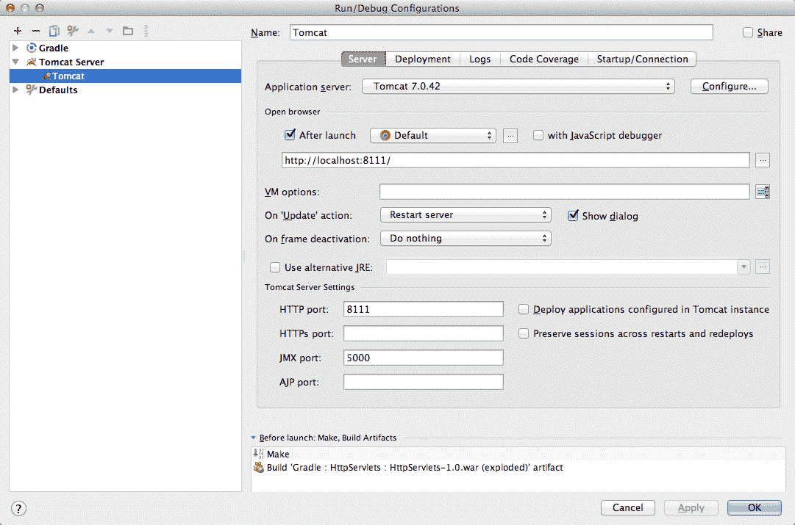
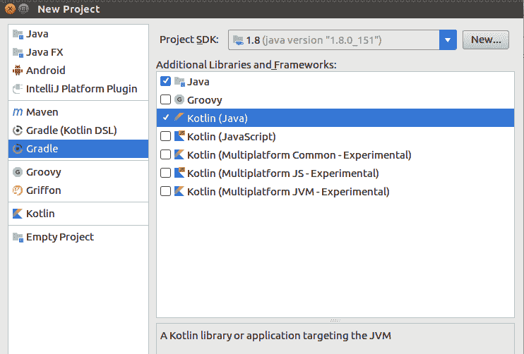
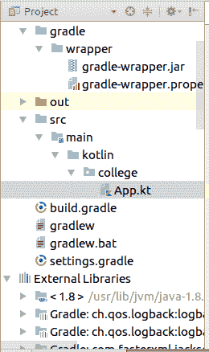
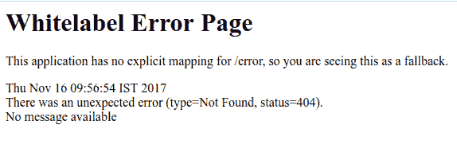
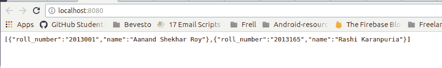
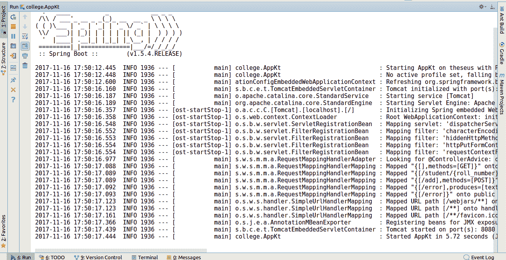

# 第十四章：使用 Kotlin 的 Web 服务

本章将涵盖以下食谱：

+   如何在 Tomcat 上运行应用程序

+   设置构建 RESTful 服务的依赖项

+   如何创建 REST 控制器

+   为 Spring boot 创建应用程序类

# 简介

Kotlin 已经占据了 Java 世界。它已经成为 Android 生态系统中的热门，该生态系统曾由 Java 主导，并且到处都受到热烈欢迎。Kotlin 不仅限于 Android 开发，还可以用于开发服务器端、客户端 Web 应用程序。在本章中，我们将解决的一个`use`案例是使用 Kotlin 创建 Web 服务。Kotlin 与 JVM 100%兼容，因此你可以使用任何现有的框架，如 Spring Boot、Vert.x 或 JSF 来编写 Java 应用程序。

# 如何在 Tomcat 上运行应用程序

在本食谱中，我们将学习如何在 IntelliJ IDEA 中安装、配置和运行 Tomcat 上的应用程序。

**Apache Tomcat**，通常被称为 Tomcat 服务器，是由 Apache 软件基金会（ASF）开发的开源 Java Servlet 容器。Tomcat 实现了多个 Java EE 规范，包括 Java Servlet、JavaServer Pages（JSP）、Java EL 和 WebSocket，并提供了一个 Java 代码可以运行的“纯 Java”HTTP Web 服务器环境。

来源：维基百科

# 如何做到这一点…

现在，让我们按照给定的步骤在 Tomcat 上运行应用程序：

1.  首先，你需要从[`tomcat.apache.org/download-80.cgi`](http://tomcat.apache.org/download-80.cgi)下载 Tomcat。

1.  下载的文件将是一个压缩文件，你可以使用以下方法提取它：

```java
tar xvzf apache-tomcat-8.0.9.tar.gz
```

1.  接下来，你需要将其从下载文件夹移动到正确的位置，在：

```java
mv apache-tomcat-8.0.9 /opt/tomcat
```

1.  你还需要检查你的系统上是否已设置 JDK。你可以通过输入以下命令来完成：

```java
java -version
```

1.  如果你看到“The program 'java' can be found in the following packages:”，这意味着你需要安装 JDK。你可以使用以下方法完成：

```java
sudo apt-get install openjdk-7-jdk
```

1.  然后，将以下行添加到`.bashrc`文件的末尾：

```java
export JAVA_HOME=/usr/lib/jvm/java-7-openjdk-amd64
export CATALINA_HOME=/opt/tomcat
```

1.  简单保存并退出`.bashrc`，然后通过运行以下命令使更改生效：

```java
. ~/.bashrc
```

1.  Tomcat 和 Java 现在应该已安装并配置在您的服务器上。要激活 Tomcat，请运行以下脚本：

```java
$CATALINA_HOME/bin/startup.sh
```

你应该得到以下类似的结果：

```java
Using CATALINA_BASE: /opt/tomcat
Using CATALINA_HOME: /opt/tomcat
Using CATALINA_TMPDIR: /opt/tomcat/temp
Using JRE_HOME: /usr/lib/jvm/java-7-openjdk-amd64/
Using CLASSPATH: /opt/tomcat/bin/bootstrap.jar:/opt/tomcat/bin/tomcat-juli.jar
Tomcat started.
```

1.  打开`http://127.0.0.1:8080`以检查它是否正常工作。

1.  现在，你需要 IntelliJ IDEA 的终极版才能在 IntelliJ 中使用 Tomcat；社区版不提供对 Java EE 应用程序的支持。

1.  为了运行应用程序，我们需要相应的 WAR 文件进行部署，你只需在终端中添加以下行即可完成：

```java
gradle war
```

1.  你需要转到“运行”|“编辑配置”并添加 Tomcat：



1.  现在，如果你转到你的 localhost 服务器，你可以在那里看到托管的应用程序。

关于 Windows 上 Tomcat 安装的说明，请参阅[`www.ntu.edu.sg/home/ehchua/programming/howto/Tomcat_HowTo.html`](https://www.ntu.edu.sg/home/ehchua/programming/howto/Tomcat_HowTo.html)。

# 为构建 RESTful 服务设置依赖项

在这个菜谱中，我们将为开发 RESTful 服务打下基础。我们将了解如何设置依赖关系并运行我们的第一个 SpringBoot Web 应用程序。SpringBoot 为 Kotlin 提供了极大的支持，这使得使用 Kotlin 变得容易。所以，让我们开始吧。

# 准备工作

我们将使用 IntelliJ IDEA 和 Gradle 构建系统。如果你没有这些，你可以从[`www.jetbrains.com/idea/`](https://www.jetbrains.com/idea/)获取。

# 如何操作...

让我们按照给定的步骤来设置构建 RESTful 服务的依赖项：

1.  首先，我们将在 IntelliJ IDE 中创建一个新的项目。我们将使用 Gradle 构建系统来维护依赖项，因此创建一个`Gradle`项目：



1.  当你创建了项目后，只需将以下行添加到你的`build.gradle`文件中。这些代码行包含我们将需要来开发 Web 应用程序的 Spring-boot 依赖项：

```java
buildscript {
    ext.kotlin_version = '1.1.60' // Required for Kotlin integration
    ext.spring_boot_version = '1.5.4.RELEASE'
    repositories {
        jcenter()
    }
    dependencies {
        classpath "org.jetbrains.kotlin:kotlin-gradle-plugin:$kotlin_version" // Required for Kotlin integration
        classpath "org.jetbrains.kotlin:kotlin-allopen:$kotlin_version" // See https://kotlinlang.org/docs/reference/compiler-plugins.html#kotlin-spring-compiler-plugin
        classpath "org.springframework.boot:spring-boot-gradle-plugin:$spring_boot_version"
    }
}

apply plugin: 'kotlin' // Required for Kotlin integration
apply plugin: "kotlin-spring" // See https://kotlinlang.org/docs/reference/compiler-plugins.html#kotlin-spring-compiler-plugin
apply plugin: 'org.springframework.boot'

jar {
    baseName = 'gs-rest-service'
    version = '0.1.0'
}
sourceSets {
    main.java.srcDirs += 'src/main/kotlin'
}

repositories {
    jcenter()
}

dependencies {
    compile "org.jetbrains.kotlin:kotlin-stdlib:$kotlin_version" // Required for Kotlin integration
    compile 'org.springframework.boot:spring-boot-starter-web'
    testCompile('org.springframework.boot:spring-boot-starter-test')
}
```

1.  现在让我们在以下目录结构中创建一个`App.kt`文件：



重要的是要保持`App.kt`文件在一个包中（我们使用了`college`包）。否则，你将得到一个错误，如下所示：

```java
** WARNING ** : Your ApplicationContext is unlikely to start due to a `@ComponentScan` of the default package.
```

出现这个错误的原因是，如果你没有包含包声明，它将认为它是一个“默认包”，这是不推荐的，应该避免。

1.  现在，让我们尝试运行`App.kt`类。我们将放置以下代码来测试它是否正在运行：

```java
@SpringBootApplication
open class App {
}

fun main(args: Array<String>) {
    SpringApplication.run(App::class.*java*, *args)
}
```

1.  现在运行项目；如果一切顺利，你将在最后看到以下行：

```java
Started AppKt in 5.875 seconds (JVM running for 6.445)
```

1.  我们现在已经在我们的嵌入式 Tomcat 服务器上运行了我们的应用程序。如果你访问`http://localhost:8080`，你将看到一个如下所示的错误：



1.  前面的错误是`404 错误`，原因是我们没有告诉应用程序当用户在`/`路径上时应该做什么。

# 如何创建 REST 控制器

在之前的菜谱中，我们学习了如何为创建 RESTful 服务设置依赖项。最后，我们在`http://localhost:8080`端点上启动了我们的后端，但得到了`404 错误`，因为我们的应用程序没有配置为处理该路径（`/`）的请求。我们将从这个点开始，学习如何创建 REST 控制器。让我们开始吧！

# 准备工作

我们将使用 IntelliJ IDE 进行编码。关于环境的设置，请参考之前的菜谱。你还可以在[`gitlab.com/aanandshekharroy/kotlin-webservices`](https://gitlab.com/aanandshekharroy/kotlin-webservices)的仓库中找到源代码。

# 如何操作...

在这个菜谱中，我们将创建一个 REST 控制器，它会为我们提供关于大学学生信息。我们将使用一个内存数据库，用列表来简化事物：

1.  让我们首先创建一个具有姓名和学号属性的`Student`类：

```java
package college

class Student() {
    lateinit var roll_number: String
    lateinit var name: String
    constructor(
            roll_number: String,
            name: String): this() {
        this.roll_number = roll_number
        this.name = name
    }
}
```

1.  接下来，我们将创建`StudentDatabase`端点，它将作为应用程序的数据库：

```java
@Component
class StudentDatabase {
    private val students = mutableListOf<Student>()
}
```

注意，我们已经用`@Component`注解了`StudentDatabase`类，这意味着它的生命周期将由 Spring 控制（因为我们希望它充当我们应用程序的数据库）。

1.  我们还需要一个`@PostConstruct`注解，因为这是一个内存数据库，当应用程序关闭时会被销毁。因此，我们希望在应用程序启动时有一个填充的数据库。所以我们将创建一个`init`方法，在启动时将一些项目添加到“数据库”中：

```java
@PostConstruct
private fun init() {
    students.add(Student("2013001","Aanand Shekhar Roy"))
    students.add(Student("2013165","Rashi Karanpuria"))
}
```

1.  现在，我们将创建一些其他方法，帮助我们处理数据库：

    +   `getStudent`：获取我们数据库中现有学生的列表：

```java
fun getStudents()=students
```

1.  +   `addStudent`：这个方法将学生添加到我们的数据库中：

```java
fun addStudent(student: Student): Boolean {
    students.add(student)
    return true
}
```

1.  现在，让我们将这个数据库投入使用。我们将创建一个 REST 控制器来处理请求。我们将创建一个`StudentController`并使用`@RestController`注解。使用`@RestController`很简单，这是创建 MVC RESTful Web 服务的首选方法。

1.  一旦创建，我们需要通过 Spring 依赖注入提供我们的数据库，为此我们需要`@Autowired`注解。以下是我们的`StudentController`的样子：

```java
@RestController
class StudentController {
    @Autowired
    private lateinit var database: StudentDatabase
}
```

1.  现在我们将设置响应到`/`路径。我们将显示数据库中的学生列表。为此，我们将简单地创建一个列出学生的方法。我们需要用`@RequestMapping`注解它，并提供路径和请求方法（GET、POST 等）等参数：

```java
@RequestMapping("", method = arrayOf(RequestMethod.GET))
fun students() = database.getStudents()
```

1.  这就是我们现在控制器的样子。它是一个简单的 REST 控制器：

```java
package college

import org.springframework.beans.factory.annotation.Autowired
import org.springframework.web.bind.annotation.RequestMapping
import org.springframework.web.bind.annotation.RequestMethod
import org.springframework.web.bind.annotation.RestController

@RestController
class StudentController {
    @Autowired
    private lateinit var database: StudentDatabase
    @RequestMapping("", method = arrayOf(RequestMethod.GET))
    fun students() = database.getStudents()
}
```

1.  现在当你重启服务器并访问`http://localhost:8080`时，我们将看到以下响应：



如您所见，Spring 足够智能，能够以 JSON 格式提供响应，这使得设计 API 变得容易。

1.  现在，让我们尝试创建另一个端点，它将根据学号获取学生的详细信息：

```java
@GetMapping("/student/{roll_number}")
fun studentWithRollNumber( @PathVariable("roll_number")  roll_number:String) =
    database.getStudentWithRollNumber(roll_number)
```

1.  现在，如果你尝试访问`http://localhost:8080/student/2013001`端点，你将看到以下输出：

```java
{"roll_number":"2013001","name":"Aanand Shekhar Roy"}
```

1.  接下来，我们将尝试将学生添加到数据库中。我们将通过`POST`方法来完成：

```java
@RequestMapping("/add", method = arrayOf(RequestMethod.POST))
fun addStudent(@RequestBody student: Student) =
        if (database.addStudent(student)) student
        else throw Exception("Something went wrong")
```

# 还有更多……

到目前为止，我们的服务器一直依赖于 IDE。我们肯定希望让它独立于 IDE。多亏了 Gradle，只需以下步骤就可以轻松创建一个可运行的 JAR：

```java
./gradlew clean bootRepackage
```

上述命令是平台无关的，并使用 Gradle 构建系统构建应用程序。现在，你只需输入提到的命令来运行它：

```java
java -jar build/libs/gs-rest-service-0.1.0.jar 
```

你可以像之前一样看到以下输出：

```java
Started AppKt in 4.858 seconds (JVM running for 5.548)
```

这意味着你的服务器正在成功运行。

# 创建 Spring Boot 的应用程序类

`SpringApplication`类用于引导我们的应用程序。我们在之前的菜谱中使用了它；我们将在这个菜谱中看到如何为 Spring Boot 创建`Application`类。

# 准备工作

我们将使用 IntelliJ IDE 进行编码。为了设置环境，请阅读之前的菜谱，特别是*设置构建 RESTful 服务的依赖项*菜谱。

# 如何做到这一点...

如果你之前使用过 Spring Boot，你一定熟悉在主类中使用`@Configuration`、`@EnableAutoConfiguration`和`@ComponentScan`。这些被使用得如此频繁，以至于 Spring Boot 提供了一个方便的`@SpringBootApplication`替代方案。Spring Boot 会查找`public static main`方法，我们将使用`Application`类外部的顶级函数。

如果你注意到了，在设置依赖项时，我们使用了`kotlin-spring`插件，因此我们不需要将`Application`类设置为公开。

这里是一个 Spring Boot 应用程序的示例：

```java
package college

import org.springframework.boot.SpringApplication
import org.springframework.boot.autoconfigure.SpringBootApplication

@SpringBootApplication
class Application
fun main(args: Array<String>) {
    SpringApplication.run(Application::class.java, *args)
}

```

Spring Boot 应用程序执行静态的`run()`方法，它接受两个参数，并在 Spring 应用程序启动时启动一个自动配置的 Tomcat 网络服务器。

当一切设置完毕后，你可以通过执行以下命令来启动应用程序：

```java
./gradlew bootRun
```

如果一切顺利，你将在控制台看到以下输出：

>

这与最后一条消息一起——在 xxx 秒内启动了 AppKt。这意味着你的应用程序已经启动并运行。

为了将其作为一个独立的服务器运行，你需要创建一个 JAR 文件，然后你可以按照以下方式执行：

```java
./gradlew clean bootRepackage
```

现在，要运行它，你只需输入以下命令：

```java
java -jar build/libs/gs-rest-service-0.1.0.jar 
```
