# 第六章：构建 Messanger Android 应用程序 – 第二部分

在上一章中，我们全力以赴地开发了 Messanger Android 应用程序。通过这样做，我们深入研究了 Kotlin 和 Android 应用程序开发。我们探讨了**模型-视图-表示者**（**MVP**）模式以及如何使用它来构建强大且功能齐全的 Android 应用程序。除此之外，我们还介绍了响应式编程的基础，并学习了如何在我们的应用程序中使用 RxJava 和 RxAndroid。我们还了解了一些我们可以用来与远程服务器通信的方法。我们学习了 OkHttp 和 Retrofit，然后更进一步，通过实现一个功能齐全的 Retrofit 服务来促进与我们第四章中制作的 Messanger API 的通信，该章标题为*使用 Spring Boot 2.0 设计和实现 Messanger 后端*。将所有这些与 Android 和 Kotlin 相关的知识结合起来，我们为 Messanger 应用程序创建了登录和注册用户界面。

在本章中，我们将完成 Messanger 应用程序的开发。在这个过程中，我们将涵盖以下主题：

+   使用应用程序设置

+   使用 ChatKit

+   Android 应用程序测试

+   执行后台任务

让我们继续开发我们的 Messanger 应用程序，通过实现主 UI。

# 创建主 UI

与我们在实现登录 UI 和注册 UI 时所做的类似，我们将为主 UI 创建一个模型、视图和表示者。我们不会像在实现前两个 UI 视图的过程中那样过多地关注解释。相反，我们只会解释新的概念。

不再拖延，让我们创建一个`MainView`。

# 创建主视图

在我们开始创建主视图之前，我们必须清楚地了解我们想要实现的用户界面。一个好的开始是清楚地写出描述我们想要`MainView`如何工作的句子。让我们继续这样做：

+   主视图应在启动时显示当前登录用户的活跃对话

+   主视图应允许登录用户创建新的对话

+   主视图应能够显示当前登录用户的联系人（在本应用程序中，这是 Messanger 平台上所有注册用户的列表）

+   用户必须能够直接从`MainView`访问设置屏幕

+   用户应能够直接从`MainView`中注销

好的，太棒了！我们有了描述`MainView`可以做什么的简短语句列表。有了这个列表，我们可以继续创建`MainView`（从编程的角度来说）。我们不会立即这样做。让我们为`MainView`创建一些视觉草图，以更清楚地了解它的外观：

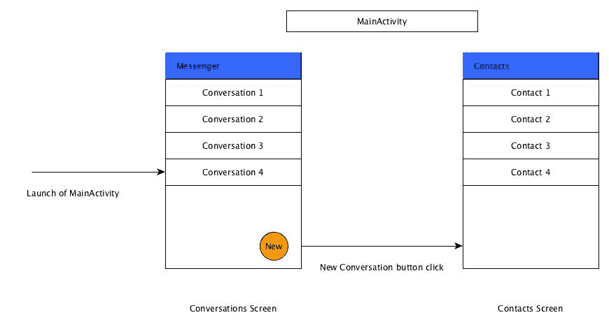

如前图所示，`MainActivity`可以向用户渲染两个完全不同的视图。第一个视图是对话屏幕，第二个是联系人屏幕。实现这一点的完美方式是在`MainActivity`中使用两个使用片段。在这种情况下，我们将需要两个不同的片段。这些是对话片段和联系人片段。

既然我们已经清楚地知道了`MainView`将要包含的内容，我们需要实现一个合适的接口来声明`MainView`的行为。以下就是`MainView`接口：

```
package com.example.messenger.ui.main
import com.example.messenger.ui.base.BaseView

interface MainView : BaseView {
  fun showConversationsLoadError()
  fun showContactsLoadError()
  fun showConversationsScreen()
  fun showContactsScreen()
  fun getContactsFragment(): MainActivity.ContactsFragment
  fun getConversationsFragment(): MainActivity.ConversationsFragment
  fun showNoConversations()
  fun navigateToLogin()
  fun navigateToSettings()
}
```

干得好！我们将把`MainActivity`对`MainView`的实现保存起来，稍后进行。现在，我们将专注于`MainInteractor`。

# 创建`MainInteractor`

我们希望用户能够在消息传递平台上查看其他用户（联系人）及其在主屏幕上的活跃对话。此外，我们希望用户能够直接从主屏幕注销平台。由于这些需求，`MainInteractor`必须能够加载联系人、加载对话以及让用户从平台上注销。以下就是`MainInteractor`接口。请确保将其以及所有其他`Main_`文件放入`com.example.messenger.ui.main`包中：

```
package com.example.messenger.ui.main

import com.example.messenger.data.vo.ConversationListVO
import com.example.messenger.data.vo.UserListVO

interface MainInteractor {

  interface OnConversationsLoadFinishedListener {
    fun onConversationsLoadSuccess(
    conversationsListVo: ConversationListVO)

      fun onConversationsLoadError()
  }

  interface OnContactsLoadFinishedListener {
    fun onContactsLoadSuccess(userListVO: UserListVO)
    fun onContactsLoadError()
  }

  interface OnLogoutFinishedListener {
    fun onLogoutSuccess()
  }

  fun loadContacts(
  listener: MainInteractor.OnContactsLoadFinishedListener)

  fun loadConversations(
  listener: MainInteractor.OnConversationsLoadFinishedListener)

  fun logout(listener: MainInteractor.OnLogoutFinishedListener)
}
```

我们将`OnConversationsLoadFinishedListener`、`OnContactsLoadFinishedListener`和`OnLogoutFinishedListener`接口添加到`MainInteractor`接口中。这些接口都将由`MainPresenter`实现。这些回调对于执行适当的操作是必要的，无论对话加载、联系人加载或用户注销过程的成功或失败。

下面是实现了`loadContacts()`方法的`MainInteractorImpl`类：

```
package com.example.messenger.ui.main

import android.content.Context
import android.util.Log
import com.example.messenger.data.local.AppPreferences
import com.example.messenger.data.remote.repository.ConversationRepository
import com.example.messenger.data.remote.repository.ConversationRepositoryImpl
import com.example.messenger.data.remote.repository.UserRepository
import com.example.messenger.data.remote.repository.UserRepositoryImpl
import io.reactivex.android.schedulers.AndroidSchedulers
import io.reactivex.schedulers.Schedulers

class MainInteractorImpl(val context: Context) : MainInteractor {

  private val userRepository: UserRepository = 
  UserRepositoryImpl(context)
  private val conversationRepository: ConversationRepository = 
  ConversationRepositoryImpl(context)

  override fun loadContacts(listener: 
  MainInteractor.OnContactsLoadFinishedListener) {

```

让我们加载在消息传递 API 平台上注册的所有用户。这些用户是当前登录用户可以与之通信的联系人：

```
    userRepository.all()
    .subscribeOn(Schedulers.io())
    .observeOn(AndroidSchedulers.mainThread())
    .subscribe({ res ->      
```

现在，联系人已成功加载。`onContactsLoadSuccess()`方法被调用，并将 API 响应数据作为参数传递：

```
    listener.onContactsLoadSuccess(res) },
    { error ->      
```

如果联系人加载失败，因此调用`onContactsLoadError()`：

```
      listener.onContactsLoadError()
    error.printStackTrace()})
  }
}
```

`loadContacts()`方法使用`UserRepository`来加载消息传递平台上所有可用的用户列表。如果用户成功检索，则调用监听器的`onContactsLoadSuccess()`方法，并将加载的用户列表作为参数传递。否则，调用`onContactsLoadError()`方法，并将错误打印到标准系统输出。

我们还没有完成`MainInteractorImpl`。我们还需要添加`loadConversations()`和`logout()`这两个函数。这两个必需的函数在下面的代码片段中给出。将它们添加到`MainInteractorImpl`中。

```
  override fun loadConversations(
  listener: MainInteractor.OnConversationsLoadFinishedListener) {
```

它使用对话存储库实例检索当前登录用户的全部对话：

```
    conversationRepository.all()
    .subscribeOn(Schedulers.io())
    .observeOn(AndroidSchedulers.mainThread())
    .subscribe({ res -> listener.onConversationsLoadSuccess(res) },
    { error ->
      listener.onConversationsLoadError()
    error.printStackTrace()})
  }

  override fun logout(
  listener: MainInteractor.OnLogoutFinishedListener) {    
```

当注销时，从共享首选项文件中清除用户数据，并调用监听器的`onLogoutSuccess()`回调：

```
  val preferences: AppPreferences = AppPreferences.create(context)
  preferences.clear()
  listener.onLogoutSuccess()
}
```

`loadConversations()` 与 `loadContacts()` 的工作方式类似。区别在于使用 `ConversationRepository` 来检索用户当前拥有的活动对话，而不是联系人列表。`logout()` 简单地清除应用程序使用的首选项文件，以删除当前登录用户的数据，之后调用提供的 `OnLogoutFinishedListener` 的 `onLogoutSuccess()` 方法。

这就是 `MainInteractorImpl` 类的全部内容。接下来，我们将实施 `MainPresenter`。

# 创建 MainPresenter

和往常一样，我们必须做的第一件事是创建一个定义了将被实现类实现的函数的表示者接口。以下是 `MainPresenter` 接口：

```
package com.example.messenger.ui.main

interface MainPresenter {
  fun loadConversations()
  fun loadContacts()
  fun executeLogout()
}
```

`loadConversations()`、`loadContacts()` 和 `executeLogout()` 函数将由 `MainView` 调用，并且必须由 `MainPresenterImpl` 类实现。以下是我们定义属性和 `onConversationsLoadSuccess()` 以及 `onConversationsLoadError()` 方法的 `MainPresenterImpl` 类：

```
package com.iyanuadelekan.messenger.ui.main

import com.iyanuadelekan.messenger.data.vo.ConversationListVO
import com.iyanuadelekan.messenger.data.vo.UserListVO

class MainPresenterImpl(val view: MainView) : MainPresenter, 
        MainInteractor.OnConversationsLoadFinishedListener,
        MainInteractor.OnContactsLoadFinishedListener,
        MainInteractor.OnLogoutFinishedListener {

  private val interactor: MainInteractor = MainInteractorImpl
                                           (view.getContext())

  override fun onConversationsLoadSuccess(conversationsListVo:
                                          ConversationListVO) {
```

让我们检查当前登录用户是否有活动对话：

```
    if (!conversationsListVo.conversations.isEmpty()) {
      val conversationsFragment = view.getConversationsFragment()
      val conversations = conversationsFragment.conversations
      val adapter = conversationsFragment.conversationsAdapter

      conversations.clear()
      adapter.notifyDataSetChanged()  
```

在从 API 获取对话后，我们将每个对话添加到 `ConversationFragment` 的对话列表中，并在每次添加项目后通知对话适配器：

```
      conversationsListVo.conversations.forEach { contact ->
        conversations.add(contact)
        adapter.notifyItemInserted(conversations.size - 1)
      }
    } else {
      view.showNoConversations()
    }
  }

  override fun onConversationsLoadError() {
    view.showConversationsLoadError()
  }
}
```

此外，将以下 `onContactsLoadSuccess()`、`onContactsLoadError()`、`onLogoutSuccess()`、`loadConversations()`、`loadContacts()` 和 `executeLogout()` 函数添加到 `MainPresenterImpl`：

```
  override fun onContactsLoadSuccess(userListVO: UserListVO) {
    val contactsFragment = view.getContactsFragment()
    val contacts = contactsFragment.contacts
    val adapter = contactsFragment.contactsAdapter
```

让我们清除联系人列表中先前加载的联系人并通知适配器数据集更改：

```
contacts.clear()
adapter.notifyDataSetChanged()
```

现在，让我们将 API 检索到的每个联系人添加到 `ContactsFragment` 的联系人列表中，并在每次添加项目后通知联系人适配器：

```
    userListVO.users.forEach { contact ->
      contacts.add(contact)
      contactsFragment.contactsAdapter.notifyItemInserted(contacts.size-1)
    }
  }

  override fun onContactsLoadError() {
    view.showContactsLoadError()
  }

  override fun onLogoutSuccess() {
    view.navigateToLogin()
  }

  override fun loadConversations() {
    interactor.loadConversations(this)
  }

  override fun loadContacts() {
    interactor.loadContacts(this)
  }

  override fun executeLogout() {
    interactor.logout(this)
  }
```

我们已经成功创建了 `MainInteractor` 和 `MainPresenter`。在这个时候，我们应该完成对 `MainView` 及其布局的工作。

# 总结 MainView

首先，我们必须处理 `activity_main.xml` 布局文件。修改文件以包含以下代码：

```
<?xml version="1.0" encoding="utf-8"?>
<android.support.design.widget.CoordinatorLayout
  xmlns:android="http://schemas.android.com/apk/res/android"
  xmlns:tools="http://schemas.android.com/tools"
  android:layout_width="match_parent"
  android:layout_height="match_parent"
  tools:context=".ui.main.MainActivity">
  <LinearLayout
    android:id="@+id/ll_container"
    android:layout_width="match_parent"
    android:layout_height="match_parent"
    android:orientation="vertical"/>
</android.support.design.widget.CoordinatorLayout>

```

在布局文件的根视图中，我们有一个单独的 `LinearLayout`。这个 `ViewGroup` 将作为对话和联系人片段的容器。说到对话和联系人片段，我们必须为它们创建适当的布局。在项目的布局 `resource` 目录中创建一个名为 `fragment_conversations.xml` 的布局文件，内容如下：

```
<?xml version="1.0" encoding="utf-8"?>
<android.support.design.widget.CoordinatorLayout 
xmlns:android="http://schemas.android.com/apk/res/android"
  android:layout_width="match_parent"
  android:layout_height="match_parent"
xmlns:app="http://schemas.android.com/apk/res-auto">
<android.support.v7.widget.RecyclerView
  android:id="@+id/rv_conversations"
  android:layout_width="match_parent"
android:layout_height="match_parent"/>
<android.support.design.widget.FloatingActionButton
  android:id="@+id/fab_contacts"
  android:layout_width="wrap_content"
  android:layout_height="wrap_content"
  android:layout_margin="@dimen/default_margin"
  android:src="img/ic_menu_edit"
  app:layout_anchor="@id/rv_conversations"
  app:layout_anchorGravity="bottom|right|end"/>
</android.support.design.widget.CoordinatorLayout>
```

我们在 `CoordinatorLayout` 根视图中使用了两个子视图。第一个是一个 `RecyclerView`，第二个是一个 `FloatingActionButton`。`RecyclerView` 是一个 Android 小部件，用作显示大量可滚动数据集的容器，通过保持有限数量的视图来有效地滚动。我们能够使用 `RecyclerView` 小部件，因为我们将其依赖项添加到了项目模块级别的 `build.gradle` 脚本中，如下所示：

```
implementation 'com.android.support:recyclerview-v7:26.1.0'
```

由于我们正在使用`RecyclerView`小部件，我们需要为每个`RecyclerView`小部件创建适当的视图持有者布局。在布局资源目录中创建一个`vh_contacts.xml`文件和一个`vh_conversations.xml`文件。

以下为`vh_contacts.xml`布局：

```
<?xml version="1.0" encoding="utf-8"?>
<LinearLayout xmlns:android="http://schemas.android.com/apk/res/android"
  android:orientation="vertical" android:layout_width="match_parent"
  android:id="@+id/ll_container"
  android:layout_height="wrap_content">
  <LinearLayout
    android:layout_width="match_parent"
    android:layout_height="wrap_content"
    android:orientation="vertical"
    android:padding="@dimen/default_padding">
    <LinearLayout
      android:layout_width="match_parent"
      android:layout_height="wrap_content"
      android:orientation="horizontal">
      <TextView
        android:id="@+id/tv_username"
        android:layout_width="wrap_content"
        android:layout_height="wrap_content"
        android:textSize="18sp"
        android:textStyle="bold"/>
      <LinearLayout
        android:layout_width="0dp"
        android:layout_height="wrap_content"
        android:layout_weight="1"
        android:gravity="end">
        <TextView
          android:id="@+id/tv_phone"
          android:layout_width="wrap_content"
          android:layout_height="wrap_content"
          android:layout_marginLeft="@dimen/default_margin"

          android:layout_marginStart="@dimen/default_margin"/>
      </LinearLayout>
    </LinearLayout>
    <TextView
      android:id="@+id/tv_status"
      android:layout_width="wrap_content"
      android:layout_height="wrap_content"/>
  </LinearLayout>
  <View
    android:layout_width="match_parent"
    android:layout_height="1dp"
    android:background="#e8e8e8"/>
</LinearLayout>
```

`vh_conversations.xml`布局应该包含以下代码：

```
<?xml version="1.0" encoding="utf-8"?>
<LinearLayout xmlns:android="http://schemas.android.com/apk/res/android"
  android:orientation="vertical" android:layout_width="match_parent"
  android:id="@+id/ll_container"
  android:layout_height="wrap_content">
  <LinearLayout
    android:layout_width="match_parent"
    android:layout_height="wrap_content"
    android:orientation="vertical"
    android:padding="@dimen/default_padding">
    <TextView
       android:id="@+id/tv_username"
       android:layout_width="wrap_content"
       android:layout_height="wrap_content"
       android:textStyle="bold"
       android:textSize="18sp"/>
    <TextView
      android:id="@+id/tv_preview"
      android:layout_width="wrap_content"
      android:layout_height="wrap_content"/>
  </LinearLayout>
  <View
    android:layout_width="match_parent"
    android:layout_height="1dp"
    android:background="#e8e8e8"/>
</LinearLayout>
```

如 Android 开发者参考中所述，*浮动操作按钮用于特殊类型的推荐操作。它们通过一个圆形图标浮在 UI 上方而区分开来，并且具有与变形、启动和转移锚点相关的特殊运动行为*。我们可以利用`FloatingActionButton`小部件，因为我们已经将 Android 支持设计库依赖项添加到项目的`build.gradle`脚本中：

```
implementation 'com.android.support:design:26.1.0'
```

在布局资源目录中创建一个包含以下 XML 的`fragment_contacts.xml`布局文件：

```
<?xml version="1.0" encoding="utf-8"?>
<LinearLayout xmlns:android="http://schemas.android.com/apk/res/android"
  android:orientation="vertical" android:layout_width="match_parent"
  android:layout_height="match_parent">
  <android.support.v7.widget.RecyclerView
    android:id="@+id/rv_contacts"
    android:layout_width="match_parent"
    android:layout_height="match_parent"/>
</LinearLayout>
```

现在是时候完成`MainActivity`类了。为了完成`MainActivity`，我们需要完成很多事情。首先，我们必须声明必要的类属性。接下来，我们需要为以下方法提供实现：`bindViews()`、`showConversationsLoadError()`、`showContactsLoadError()`、`showConversationsScreen()`、`showContactsScreen()`、`getContext()`、`getContactsFragment()`、`getConversationsFragment()`、`navigateToLogin()`和`navigateToSettings()`。最后，我们将创建`ConversationsFragment`和`ContactsFragment`类。

有很多事情要做。我们首先将`ConversationsFragment`和`ContactsFragment`添加到`MainActivity`中。以下为`ConversationsFragment`。将其添加到`MainActivity`中。

```
//ConversationsFragment class extending the Fragment class
  class ConversationsFragment : Fragment(), View.OnClickListener {

    private lateinit var activity: MainActivity
    private lateinit var rvConversations: RecyclerView
    private lateinit var fabContacts: FloatingActionButton
    var conversations: ArrayList<ConversationVO> = ArrayList()
    lateinit var conversationsAdapter: ConversationsAdapter
```

当`ConversationsFragment`的用户界面第一次绘制时，将调用以下方法：

```
    override fun onCreateView(inflater: LayoutInflater, container: 
    ViewGroup, savedInstanceState: Bundle?): View? {
      // fragment layout inflation
      val baseLayout = 
      inflater.inflate(R.layout.fragment_conversations, 
      container, false)

      // Layout view bindings
      rvConversations = baseLayout.findViewById(R.id.rv_conversations)
      fabContacts = baseLayout.findViewById(R.id.fab_contacts)

      conversationsAdapter  = ConversationsAdapter(
      getActivity(), conversations)

      // Setting the adapter of conversations recycler view to 
      // created conversations adapter
      rvConversations.adapter = conversationsAdapter      
```

设置对话回收视图的布局管理器，让我们看看如何查看线性布局管理器：

```
      rvConversations.layoutManager = 
      LinearLayoutManager(getActivity().baseContext)
      fabContacts.setOnClickListener(this)
      return baseLayout
    }

    override fun onClick(view: View) {
      if (view.id == R.id.fab_contacts) {
        this.activity.showContactsScreen()
      }
    }

    fun setActivity(activity: MainActivity) {
      this.activity = activity
    }
  }
```

`ConversationsFragment`拥有一个`RecyclerView`布局元素。回收视图需要适配器来提供数据集与在`RecyclerView`中显示的视图之间的绑定。简单来说，`RecyclerView`使用`Adapter`为它渲染到显示的视图提供数据。以下为`ConversationsAdapter`，作为`ConversationsFragment`的嵌套类（内部类）添加：

```
    class ConversationsAdapter(private val context: 
    Context, private val dataSet: List<ConversationVO>) :
    RecyclerView.Adapter<ConversationsAdapter.ViewHolder>(), 
    ChatView.ChatAdapter {

      val preferences: AppPreferences = 
      AppPreferences.create(context)

      override fun onBindViewHolder(holder: ViewHolder, position: 
      Int) {
        val item = dataSet[position] // get item at current position
        val itemLayout = holder.itemLayout // bind view holder layout 
        // to local variable

        itemLayout.findViewById<TextView>(R.id.tv_username).text = 
        item.secondPartyUsername
        itemLayout.findViewById<TextView>(R.id.tv_preview).text = 
        item.messages[item.messages.size - 1].body 
```

现在，让我们设置`itemLayout`的`View.OnClickListener`：

```
        itemLayout.setOnClickListener {
          val message = item.messages[0]
          val recipientId: Long

          recipientId = if (message.senderId == 
          preferences.userDetails.id) {
            message.recipientId
          } else {
            message.senderId
          }

          navigateToChat(item.secondPartyUsername, 
          recipientId, item.conversationId)
        }
      }

      override fun onCreateViewHolder(parent: ViewGroup, 
      viewType: Int): ViewHolder {       
```

现在，让我们创建`ViewHolder`布局：

```
        val itemLayout = LayoutInflater.from(parent.context)
        .inflate(R.layout.vh_conversations, null, false)
        .findViewById<LinearLayout>(R.id.ll_container)

        return ViewHolder(itemLayout)
      }

      override fun getItemCount(): Int {
        return dataSet.size
      }

      override fun navigateToChat(recipientName: String, 
      recipientId: Long, conversationId: Long?) {
        val intent = Intent(context, ChatActivity::class.java)
        intent.putExtra("CONVERSATION_ID", conversationId)
        intent.putExtra("RECIPIENT_ID", recipientId)
        intent.putExtra("RECIPIENT_NAME", recipientName)

        context.startActivity(intent)
      }

      class ViewHolder(val itemLayout: LinearLayout) : 
      RecyclerView.ViewHolder(itemLayout)
    }
```

当创建一个回收视图 `Adapter` 时，你必须为以下一些重要方法提供自定义实现。这些方法是：`onCreateViewHolder()`, `onBindViewHolder()` 和 `getItemCount()`。`onCreateViewHolder()` 在回收视图需要一个新的视图持有者实例时被调用。`onBindViewHolder()` 由回收视图调用，以便在数据集中显示指定位置的数据。`getItemCount()` 被调用以获取数据集中的项目数。`ViewHolder` 描述了正在使用的项目视图以及关于其在 `RecyclerView` 中位置的元数据。

内部类是嵌套在另一个类中的类。

在理解了 `ConversationsFragment` 中发生的事情后，让我们继续实现 `ContactsFragment`。首先，将以下 `ContactsFragment` 类添加到 `MainActivity` 中：

```
  class ContactsFragment : Fragment() {

    private lateinit var activity: MainActivity
    private lateinit var rvContacts: RecyclerView
    var contacts: ArrayList<UserVO> = ArrayList()
    lateinit var contactsAdapter: ContactsAdapter

    override fun onCreateView(inflater: LayoutInflater, 
    container: ViewGroup, savedInstanceState: Bundle?): View? {
      val baseLayout = inflater.inflate(R.layout.fragment_contacts, 
      container, false)
      rvContacts = baseLayout.findViewById(R.id.rv_contacts)
      contactsAdapter = ContactsAdapter(getActivity(), contacts)

      rvContacts.adapter = contactsAdapter
      rvContacts.layoutManager = 
      LinearLayoutManager(getActivity().baseContext)

      return baseLayout
    }

    fun setActivity(activity: MainActivity) {
      this.activity = activity
    }
  }
```

如你很可能注意到的，与 `ConversationsFragment` 类似，`ContactsFragment` 使用 `RecyclerView` 将联系人视图元素渲染到应用程序用户界面。这个 `RecyclerView` 的相应适配器类是 `ContactsAdapter`。它包含在以下代码片段中。将其作为 `ContactsFragment` 的内部类添加。

```
class ContactsAdapter(private val context: Context, 
                      private val dataSet: List<UserVO>) :
                      RecyclerView.Adapter<ContactsAdapter.ViewHolder>(), 
                      ChatView.ChatAdapter {

  override fun onCreateViewHolder(parent: ViewGroup, 
                                  viewType: Int): ViewHolder {
    val itemLayout = LayoutInflater.from(parent.context)
                      .inflate(R.layout.vh_contacts, parent, false)
    val llContainer = itemLayout.findViewById<LinearLayout>
                      (R.id.ll_container)

    return ViewHolder(llContainer)
  }

  override fun onBindViewHolder(holder: ViewHolder, position: Int) {
    val item = dataSet[position]
    val itemLayout = holder.itemLayout

    itemLayout.findViewById<TextView>(R.id.tv_username).text = item.username
    itemLayout.findViewById<TextView>(R.id.tv_phone).text = item.phoneNumber
    itemLayout.findViewById<TextView>(R.id.tv_status).text = item.status

    itemLayout.setOnClickListener {
      navigateToChat(item.username, item.id)
    }
  }

  override fun getItemCount(): Int {
    return dataSet.size
  }

  override fun navigateToChat(recipientName: String, 
                              recipientId: Long, conversationId: Long?) {
    val intent = Intent(context, ChatActivity::class.java)
    intent.putExtra("RECIPIENT_ID", recipientId)
    intent.putExtra("RECIPIENT_NAME", recipientName)

    context.startActivity(intent)
  }

  class ViewHolder(val itemLayout: LinearLayout) : 
    RecyclerView.ViewHolder(itemLayout)
  }
```

到目前为止一切顺利。在创建了必要的片段后，我们可以开始处理 `MainActivity` 的属性和方法。将以下属性定义添加到 `MainActivity` 类的顶部：

```
  private lateinit var llContainer: LinearLayout
  private lateinit var presenter: MainPresenter

  // Creation of fragment instances
  private val contactsFragment = ContactsFragment()
  private val conversationsFragment = ConversationsFragment()
```

接下来，修改 `onCreate()` 以反映以下更改：

```
override fun onCreate(savedInstanceState: Bundle?) {
  super.onCreate(savedInstanceState)
  setContentView(R.layout.activity_main)
  presenter = MainPresenterImpl(this)

  conversationsFragment.setActivity(this)
  contactsFragment.setActivity(this)

  bindViews()
  showConversationsScreen()
}
```

现在将 `bindViews()`, `showConversationsLoadError()`, `showContactsLoadError()`, 和 `showConversationsScreen()` 以及 `showContactsScreen()` 方法添加到 `MainActivity` 中：

```
  override fun bindViews() {
    llContainer = findViewById(R.id.ll_container)
  }

  override fun onCreateOptionsMenu(menu: Menu?): Boolean {
    menuInflater.inflate(R.menu.main, menu)
    return super.onCreateOptionsMenu(menu)
  }

  override fun showConversationsLoadError() {
    Toast.makeText(this, "Unable to load conversations. 
    Try again later.",
    Toast.LENGTH_LONG).show()
  }

  override fun showContactsLoadError() {
    Toast.makeText(this, "Unable to load contacts. Try again later.",
    Toast.LENGTH_LONG).show()
  }
```

让我们开始一个新的片段事务，并将活动片段容器中现有的任何片段替换为 `ConversationsFragment`：

```
override fun showConversationsScreen() {   
  val fragmentTransaction = fragmentManager.beginTransaction()
  fragmentTransaction.replace(R.id.ll_container,  conversationsFragment)
  fragmentTransaction.commit()

  // Begin conversation loading process
  presenter.loadConversations()

  supportActionBar?.title = "Messenger"
  supportActionBar?.setDisplayHomeAsUpEnabled(false)
}

override fun showContactsScreen() {
  val fragmentTransaction = fragmentManager.beginTransaction()
  fragmentTransaction.replace(R.id.ll_container, contactsFragment)
  fragmentTransaction.commit()
  presenter.loadContacts()

  supportActionBar?.title = "Contacts"
  supportActionBar?.setDisplayHomeAsUpEnabled(true)
}
```

最后，将以下函数 `showNoConversations()`, `onOptionsItemSelected()`, `getContext()`, `getContactsFragment()`, `getConversationsFragment()`, `navigateToLogin()` 和 `navigateToSettings()` 添加到 `MainActivity` 中：

```
  override fun showNoConversations() {
    Toast.makeText(this, "You have no active conversations.", 
    Toast.LENGTH_LONG).show()
  }

  override fun onOptionsItemSelected(item: MenuItem?): Boolean {
    when (item?.itemId) {
      android.R.id.home -> showConversationsScreen()
      R.id.action_settings -> navigateToSettings()
      R.id.action_logout -> presenter.executeLogout()
    }

    return super.onOptionsItemSelected(item)
  }

  override fun getContext(): Context {
    return this
  }

  override fun getContactsFragment(): ContactsFragment {
    return contactsFragment
  }

  override fun getConversationsFragment(): ConversationsFragment {
    return conversationsFragment
  }

  override fun navigateToLogin() {
    startActivity(Intent(this, LoginActivity::class.java))
    finish()
  }

  override fun navigateToSettings() {
    startActivity(Intent(this, SettingsActivity::class.java))
  }
```

在前面的代码片段中放置了一些注释，这些注释被大量注释以帮助你更好地理解所做的工作。确保你仔细阅读注释，以完全理解我们所做的。

# 创建 MainActivity 菜单

在 `MainActivity` 的 `onCreateOptionsMenu(Menu)` 函数中，我们填充了一个我们尚未实现的菜单。在应用程序资源目录下的 `menu` 包中添加一个 `main.xml` 文件。`main.xml` 应包含以下内容：

```
<?xml version="1.0" encoding="utf-8"?>
<menu xmlns:android="http://schemas.android.com/apk/res/android"
xmlns:app="http://schemas.android.com/apk/res-auto">
<item
  android:id="@+id/action_settings"
  android:orderInCategory="100"
  android:title="@string/action_settings"
  app:showAsAction="never" />
<item
  android:id="@+id/action_logout"
  android:orderInCategory="100"
  android:title="@string/action_logout"
  app:showAsAction="never" />
</menu>
```

太棒了！我们离完成这个项目又近了一步。现在是时候我们来处理聊天用户界面了。`showConversationLoadError()` 和 `showMessageSendError()` 是函数，它们是接口（实际聊天发生的地方）的一部分。

# 创建聊天用户界面

我们即将创建的聊天 UI 必须显示活跃对话的消息线程，并允许用户向他们正在聊天的人发送新消息。我们将从创建将被渲染给用户的视图布局开始这一部分。

# 创建聊天布局

我们将使用一个名为 ChatKit 的开源库来创建聊天视图的布局。ChatKit 是一个 Android 库，它为 Android 项目提供了灵活的组件，用于实现聊天用户界面，以及用于聊天用户界面数据管理和定制的实用工具。

我们在 `build.gradle` 脚本中添加以下行将 ChatKit 添加到 Messenger 项目中：

```
implementation 'com.github.stfalcon:chatkit:0.2.2'
```

如前所述，ChatKit 提供了许多有用的用户界面小部件来创建聊天 UI。其中两个小部件是 `MessagesList` 和 `MessageInput`。`MessagesList` 是用于显示和管理对话线程中消息的小部件。`MessageInput` 是用于输入文本消息的小部件。除了支持多种样式选项外，`MessageInput` 还支持简单的输入验证过程。

让我们看看如何在布局文件中使用 `MessagesList` 和 `MessageInput`。在 `com.example.messenger.ui` 中创建一个新的 `chat` 包，并向其中添加一个名为 `ChatActivity` 的新空活动。打开 `ChatActivity` 的活动布局文件（`activity_chat.xml`），并向其中添加以下 XML：

```
<?xml version="1.0" encoding="utf-8"?>
<RelativeLayout xmlns:android="http://schemas.android.com/apk/res/android"
  xmlns:app="http://schemas.android.com/apk/res-auto"
  xmlns:tools="http://schemas.android.com/tools"
  android:layout_width="match_parent"
  android:layout_height="match_parent"
  tools:context="com.example.messenger.ui.chat.ChatActivity">
  <com.stfalcon.chatkit.messages.MessagesList
    android:id="@+id/messages_list"
    android:layout_width="match_parent"
    android:layout_height="match_parent"
    android:layout_above="@+id/message_input"/>
  <com.stfalcon.chatkit.messages.MessageInput
    android:id="@+id/message_input"
    android:layout_width="match_parent"
    android:layout_height="wrap_content"
    android:layout_alignParentBottom="true"
    app:inputHint="@string/hint_enter_a_message" />
</RelativeLayout>

```

如前述 XML 所示，我们使用了 ChatKit 的 `MessagesList` 和 `MessageInput` UI 小部件，就像我们使用任何其他 Android 小部件一样。`MessagesList` 和 `MessageInput` 都位于 `com.stfalcon.chatkit.messages` 包中。打开布局设计窗口，查看布局的视觉效果。

接下来在我们的议程上是创建一个 `ChatView` 类：

```
package com.example.messenger.ui.chat

import com.example.messenger.ui.base.BaseView
import com.example.messenger.utils.message.Message
import com.stfalcon.chatkit.messages.MessagesListAdapter

interface ChatView : BaseView {

  interface ChatAdapter {
    fun navigateToChat(recipientName: String, recipientId: Long, 
    conversationId: Long? = null)
  }

  fun showConversationLoadError()

  fun showMessageSendError()

  fun getMessageListAdapter(): MessagesListAdapter<Message>
}
```

在 `ChatView` 中，我们定义了一个 `ChatAdapter` 接口，声明了一个 `navigateToChat(String, Long, Long)` 函数。这个接口应该由能够将用户引导到 `ChatView` 的适配器实现。我们之前创建的 `ConversationsAdapter` 和 `ContactsAdapter` 都实现了这个接口。

`showConversationLoadError()` 和 `showMessageSendError()` 是两个函数，当实现时，必须在加载对话和消息失败时分别显示适当的错误消息。

ChatKit 的 `MessagesList` UI 小部件必须拥有一个 `MessagesListAdapter` 来管理其消息数据集。`getMessageListAdapter()` 是一个函数，当由 `ChatView` 实现，将返回 UI 的 `MessagesList` 的 `MessagesListAdapter`。

# 准备聊天 UI 模型

为了能够向 `MessageList` 的 `MessagesListAdapter` 添加消息，我们必须在一个合适的模型中实现 ChatKit 的 `IMessage` 接口。我们将在下面实现这个模型。创建一个 `com.example.messenger.utils.message` 包，并在其中添加以下 `Message` 类：

```
package com.example.messenger.utils.message

import com.stfalcon.chatkit.commons.models.IMessage
import com.stfalcon.chatkit.commons.models.IUser
import java.util.*

data class Message(private val authorId: Long, private val body: String,
private val createdAt: Date) : IMessage {

  override fun getId(): String {
    return authorId.toString()
  }

  override fun getCreatedAt(): Date {
    return createdAt
  }

  override fun getUser(): IUser {
    return Author(authorId, "")
  }

  override fun getText(): String {
    return body
  }

}
```

此外，我们还需要创建一个实现 ChatKit 的 `IUser` 接口的 `Author` 类。这个类的实现如下：

```
package com.example.messenger.utils.message

import com.stfalcon.chatkit.commons.models.IUser

data class Author(val id: Long, val username: String) : IUser {

  override fun getAvatar(): String? {
    return null
  }

  override fun getName(): String {
    return username
  }

  override fun getId(): String {
    return id.toString()
  }

}
```

`Author` 类用于表示消息作者的详细信息，例如作者的名字、他们的 ID 和一个头像（如果有的话）。

目前我们对视图和布局的工作已经足够。让我们继续实现 `ChatInteractor` 和 `ChatPresenter`。

# 创建 ChatInteractor 和 ChatPresenter

到现在为止，我们已经理解了演示者和交互者应该做什么，所以让我们直接创建代码。以下就是 `ChatInteractor` 接口。这个和所有其他 `Chat_` 文件都属于 `com.example.messenger.ui.chat` 包：

```
package com.example.messenger.ui.chat

import com.example.messenger.data.vo.ConversationVO

interface ChatInteractor {

  interface OnMessageSendFinishedListener {
    fun onSendSuccess()

    fun onSendError()
  }

  interface onMessageLoadFinishedListener {
    fun onLoadSuccess(conversationVO: ConversationVO)
    fun onLoadError()
  }

  fun sendMessage(recipientId: Long, message: String, listener: 
  OnMessageSendFinishedListener)

  fun loadMessages(conversationId: Long, listener: 
  onMessageLoadFinishedListener)
}
```

以下是为 `ChatInteractor` 接口对应的 `ChatInteractorImpl` 类：

```
package com.example.messenger.ui.chat

import android.content.Context
import com.example.messenger.data.local.AppPreferences
import com.example.messenger.data.remote.repository.ConversationRepository
import com.example.messenger.data.remote.repository.ConversationRepositoryImpl
import com.example.messenger.data.remote.request.MessageRequestObject
import com.example.messenger.service.MessengerApiService
import io.reactivex.android.schedulers.AndroidSchedulers
import io.reactivex.schedulers.Schedulers

class ChatInteractorImpl(context: Context) : ChatInteractor {

  private val preferences: AppPreferences = AppPreferences.create(context)
  private val service: MessengerApiService = MessengerApiService
                                             .getInstance()
  private val conversationsRepository: ConversationRepository = 
                           ConversationRepositoryImpl(context)
```

以下方法将被调用来加载对话线程的消息：

```

  override fun loadMessages(conversationId: Long, listener: 
  ChatInteractor.onMessageLoadFinishedListener) {
    conversationsRepository.findConversationById(conversationId)
    .subscribeOn(Schedulers.io())
    .observeOn(AndroidSchedulers.mainThread())
    .subscribe({ res -> listener.onLoadSuccess(res)},
    { error ->
      listener.onLoadError()
      error.printStackTrace()})
  }

```

以下方法将被调用来向用户发送消息：

```

  override fun sendMessage(recipientId: Long, message: String,
  listener: ChatInteractor.OnMessageSendFinishedListener) {
  service.createMessage(MessageRequestObject(
  recipientId, message), preferences.accessToken as String)
  .subscribeOn(Schedulers.io())
  .observeOn(AndroidSchedulers.mainThread())
  .subscribe({ _ -> listener.onSendSuccess()},
  { error ->
    listener.onSendError()
    error.printStackTrace()})
  }
}
```

现在，让我们处理 `ChatPresenter` 和 `ChatPresenterImpl` 的代码。对于 `ChatPresenter`，我们需要创建一个接口，强制声明两个函数：`sendMessage(Long, String)` 和 `loadMessages(Long)`。以下就是 `ChatPresenter` 接口：

```
package com.example.messenger.ui.chat

interface ChatPresenter {

  fun sendMessage(recipientId: Long, message: String)

  fun loadMessages(conversationId: Long)
}
```

`ChatPresenter` 接口的实现类如下所示：

```
package com.iyanuadelekan.messenger.ui.chat

import android.widget.Toast
import com.iyanuadelekan.messenger.data.vo.ConversationVO
import com.iyanuadelekan.messenger.utils.message.Message
import java.text.SimpleDateFormat

class ChatPresenterImpl(val view: ChatView) : ChatPresenter,
        ChatInteractor.OnMessageSendFinishedListener,
        ChatInteractor.onMessageLoadFinishedListener {

  private val interactor: ChatInteractor = ChatInteractorImpl
                                           (view.getContext())

  override fun onLoadSuccess(conversationVO: ConversationVO) {
    val adapter = view.getMessageListAdapter() 

    // create date formatter to format createdAt dates 
    // received from Messenger API
    val dateFormatter = SimpleDateFormat("yyyy-MM-dd HH:mm:ss")

```

让我们遍历从 API 加载的对话消息，并为当前迭代的每条消息创建一个新的 `IMessage` 对象，然后将 `IMessage` 添加到 `MessagesListAdapter` 的开头：

```

    conversationVO.messages.forEach { message ->
      adapter.addToStart(Message(message.senderId, message.body,
             dateFormatter.parse(message.createdAt.split(".")[0])), true)
    }
  }

  override fun onLoadError() {
    view.showConversationLoadError()
  }

  override fun onSendSuccess() {
    Toast.makeText(view.getContext(), "Message sent", Toast.LENGTH_LONG).show()
  }

  override fun onSendError() {
    view.showMessageSendError()
  }

  override fun sendMessage(recipientId: Long, message: String) {
    interactor.sendMessage(recipientId, message,this)
  }

  override fun loadMessages(conversationId: Long) {
    interactor.loadMessages(conversationId, this)
  }
}
```

按照我们迄今为止的做法，在前面代码片段中留下了说明性注释，以帮助您理解。

最后，但同样重要的是，我们将着手处理 `ChatActivity`。首先，我们需要为我们的活动声明所需的属性，并处理其 `onCreate()` 生命周期方法。

修改 `ChatActivity` 以包含以下代码：

```
package com.example.messenger.ui.chat

import android.content.Context
import android.content.Intent
import android.support.v7.app.AppCompatActivity
import android.os.Bundle
import android.view.MenuItem
import android.widget.Toast
import com.example.messenger.R
import com.example.messenger.data.local.AppPreferences
import com.example.messenger.ui.main.MainActivity
import com.example.messenger.utils.message.Message
import com.stfalcon.chatkit.messages.MessageInput
import com.stfalcon.chatkit.messages.MessagesList
import com.stfalcon.chatkit.messages.MessagesListAdapter
import java.util.*

class ChatActivity : AppCompatActivity(), ChatView, MessageInput.InputListener {

  private var recipientId: Long = -1
  private lateinit var messageList: MessagesList
  private lateinit var messageInput: MessageInput
  private lateinit var preferences: AppPreferences
  private lateinit var presenter: ChatPresenter
  private lateinit var messageListAdapter: MessagesListAdapter<Message>

  override fun onCreate(savedInstanceState: Bundle?) {
    super.onCreate(savedInstanceState)
    setContentView(R.layout.activity_chat)
    supportActionBar?.setDisplayHomeAsUpEnabled(true)
    supportActionBar?.title = intent.getStringExtra("RECIPIENT_NAME")

    preferences = AppPreferences.create(this)
    messageListAdapter = MessagesListAdapter(
    preferences.userDetails.id.toString(), null)
    presenter = ChatPresenterImpl(this)
    bindViews()

```

让我们解析启动 `ChatActivity` 的意图中的额外数据包。如果通过键 `CONVERSATION_ID` 和 `RECIPIENT_ID` 识别的任何额外数据不存在，则返回 -1 作为默认值：

```
val conversationId = intent.getLongExtra("CONVERSATION_ID", -1)
recipientId = intent.getLongExtra("RECIPIENT_ID", -1)

```

如果 `conversationId` 不等于 -1，则 `conversationId` 是有效的，因此加载会话中的消息：

```
if (conversationId != -1L) {
      presenter.loadMessages(conversationId)
    }
  }
}
```

在上面的代码中，我们创建了 `recipientId`、`messageList`、`messageInput`、`preferences`、`presenter` 和 `messageListAdapter` 属性，它们分别属于 `Long`、`MessageList`、`MessageInput`、`AppPreferences`、`ChatPresenter` 和 `MessageListAdapter` 类型。`messageList` 是一个视图，它为 `messageListAdapter` 提供的消息渲染不同的视图。`onCreate()` 中包含的所有逻辑都与初始化活动中的视图有关。`onCreate()` 中的代码已被注释，以便您全面了解正在发生的事情。在继续之前，耐心地逐行阅读注释。`ChatActivity` 实现 `MessageInput.InputListener` 接口。实现此接口的类必须提供一个适当的 `onSubmit()` 方法。让我们继续并添加以下方法到 `ChatActivity`。

当用户使用 `MessageInput` 小部件提交消息时，从 `MessageInput.InputListener` 重载的函数：

```
  override fun onSubmit(input: CharSequence?): Boolean {
    // create a new Message object and add it to the 
    // start of the MessagesListAdapter
    messageListAdapter.addToStart(Message(
    preferences.userDetails.id, input.toString(), Date()), true)

    // start message sending procedure with the ChatPresenter
    presenter.sendMessage(recipientId, input.toString())

    return true
  }
```

`onSubmit()` 方法接收由 `MessageInput` 提交的消息的 `CharSequence`，并为它创建一个适当的 Message 实例。然后通过调用 `messageListAdapter.addToStart()` 并将 Message 实例作为参数传递，将此实例添加到 `MessageList` 的开头。在将创建的 `Message` 添加到 `MessageList` 后，使用 `ChatPresenter` 实例初始化向服务器发送的过程。

现在我们来处理其他必须做的重载方法。将以下显示的 `showConversationLoadError()`、`showMessageSendError()`、`getContext()` 和 `getMessageListAdapter()` 方法添加到 `ChatActivity` 中：

```
  override fun showConversationLoadError() {
    Toast.makeText(this, "Unable to load thread. 
    Please try again later.",
      Toast.LENGTH_LONG).show()
  }

  override fun showMessageSendError() {
    Toast.makeText(this, "Unable to send message. 
    Please try again later.",
      Toast.LENGTH_LONG).show()
  }

  override fun getContext(): Context {
    return this
  }

  override fun getMessageListAdapter(): MessagesListAdapter<Message> {
    return messageListAdapter
  }
```

最后，重载 `bindViews()`、`onOptionsItemSelected()` 和 `onBackPressed()` 如下：

```
  override fun bindViews() {
    messageList = findViewById(R.id.messages_list)
    messageInput = findViewById(R.id.message_input)

    messageList.setAdapter(messageListAdapter)
    messageInput.setInputListener(this)
  }

  override fun onOptionsItemSelected(item: MenuItem?): Boolean {
    if (item?.itemId == android.R.id.home) {
      onBackPressed()
    }
    return super.onOptionsItemSelected(item)
  }

  override fun onBackPressed() {
    super.onBackPressed()
    finish()
  }
```

到目前为止，一切顺利！您已成功创建了大多数的 Messenger 应用程序。请给自己鼓掌。在我们完成本章之前，我们唯一要做的就是创建一个设置活动，用户可以通过它更新他们的个人资料状态。在继续下一节之前，请尽情享受一杯应得的咖啡休息时间。

# 创建应用程序的设置活动

现在是时候开发一个简单的应用程序设置活动，用户可以通过它更新他们的个人资料状态。在 `com.example.messenger.ui` 中创建一个新的包，命名为 `settings`。在此包内创建一个新的设置活动。将活动命名为 `SettingsActivity`。要创建设置活动，右键单击 `settings` 包，然后选择 New | Activity | Settings Activity。输入新设置活动的必要细节，如活动名称和活动标题，然后点击完成。

在创建新的 `SettingsActivity` 的过程中，Android Studio 将向您的项目添加许多其他文件。除此之外，还会向您的项目添加一个新的 `.xml` 资源目录（`app` | `res` | `xml`）。此目录应包含以下文件：

+   `pref_data_sync.xml`

+   `pref_general.xml`

+   `pref_headers.xml`

+   `pref_notification.xml`

您可以选择删除 `pref_notification.xml` 和 `pref_data_sync.xml` 文件。我们在这个项目中不会使用它们。让我们看一下 `pref_general.xml`：

```
<PreferenceScreen xmlns:android="http://schemas.android.com/apk/res/android">
  <SwitchPreference
  android:defaultValue="true"
  android:key="example_switch"
  android:summary=
  "@string/pref_description_social_recommendations"
  android:title="@string/pref_title_social_recommendations" />

  <!-- NOTE: EditTextPreference accepts EditText attributes. -->
  <!-- NOTE: EditTextPreference's summary should be set to 
  its value by the activity code. -->
  <EditTextPreference
    android:capitalize="words"
    android:defaultValue="@string/pref_default_display_name"
    android:inputType="textCapWords"
    android:key="example_text"
    android:maxLines="1"
    android:selectAllOnFocus="true"
    android:singleLine="true"
    android:title="@string/pref_title_display_name" />

  <!-- NOTE: Hide buttons to simplify the UI. 
  Users can touch outside the dialog to
  dismiss it. -->
  <!-- NOTE: ListPreference's summary should be set to 
  its value by the activity code. -->
  <ListPreference
    android:defaultValue="-1"
    android:entries="@array/pref_example_list_titles"
    android:entryValues="@array/pref_example_list_values"
    android:key="example_list"
    android:negativeButtonText="@null"
    android:positiveButtonText="@null"
    android:title="@string/pref_title_add_friends_to_messages" />

</PreferenceScreen>

```

此 `xml` 布局文件的根本视图是一个 `PreferenceScreen`。一个 `PreferenceScreen` 是 `Preference` 层级的根。一个 `PreferenceScreen` 本身就是一个顶级 `Preference`。现在我们已经多次使用了 `Preference` 这个词。让我们定义一下什么是 `Preference`。它是一个基本 `Preference` 用户界面构建块的表示，由 `PreferenceActivity` 以列表的形式显示。

`Preference` 类为在 `PreferenceActivity` 中显示的偏好项提供了一个适当的视图，以及与其关联的 `SharedPreferences` 用于存储和检索偏好数据。前述代码片段中的 `SwitchPreference`、`EditTextPreference` 和 `ListPreference` 都是 `DialogPreference` 的子类，而 `DialogPreference` 又是 `Preference` 类的子类。`PreferenceActivity` 是活动需要的基础类，以便向用户显示偏好项的层级结构。

`pref_general.xml` 中的 `SwitchPreference`、`EditTextPreference` 和 `ListPreference` 视图是不需要的。现在从 XML 文件中移除它们。我们需要一个偏好项，使用户能够在我们的 Messenger 平台上更新他们的状态。这是一个非常具体的用例，因此毫不奇怪，没有提供这种能力的偏好小部件。不用担心！我们将实现一个自定义偏好项来完成这项工作。让我们称它为 `ProfileStatusPreference`。在 `settings` 包中创建一个新的 `ProfileStatusPreference` 类，包含以下代码：

```
package com.example.messenger.ui.settings

import android.content.Context
import android.preference.EditTextPreference
import android.text.TextUtils
import android.util.AttributeSet
import android.widget.Toast
import com.example.messenger.data.local.AppPreferences
import com.example.messenger.data.remote.request.StatusUpdateRequestObject
import com.example.messenger.service.MessengerApiService
import io.reactivex.android.schedulers.AndroidSchedulers
import io.reactivex.schedulers.Schedulers

class ProfileStatusPreference(context: Context, attributeSet: AttributeSet) : EditTextPreference(context, attributeSet) {

  private val service: MessengerApiService = MessengerApiService
                                             .getInstance()
  private val preferences: AppPreferences = AppPreferences
                                            .create(context)

  override fun onDialogClosed(positiveResult: Boolean) {
    if (positiveResult) {

```

以下代码片段将 `ProfileStatusPreference` 的 `EditText` 绑定到 `etStatus` 变量：

```
      val etStatus = editText

      if (TextUtils.isEmpty(etStatus.text)) {
        // Display error message when user tries 
        // to submit an empty status.
      Toast.makeText(context, "Status cannot be empty.", 
      Toast.LENGTH_LONG).show()

    } else {
      val requestObject = 
      StatusUpdateRequestObject(etStatus.text.toString())

```

让我们使用 `MessengerApiService` 更新用户的状态：

```

      service.updateUserStatus(requestObject,  
      preferences.accessToken as String)
      .subscribeOn(Schedulers.io())
      .observeOn(AndroidSchedulers.mainThread())
      .subscribe({ res ->

```

现在，如果状态更新成功，我们将存储更新的用户详细信息：

```

        preferences.storeUserDetails(res) },
        { error ->
          Toast.makeText(context, "Unable to update status at the " +
          "moment. Try again later.", Toast.LENGTH_LONG).show()
          error.printStackTrace()})
     }
   }

    super.onDialogClosed(positiveResult)
  }
}
```

`ProfileStatusPreference` 类扩展了 `EditTextPreference`。`EditTextPreference` 是一个允许在 `EditText` 中输入字符串的 `Preference`。`EditTextPreference` 是一个 `DialogPreference`，因此当 `Preference` 被点击时，它会向用户显示包含 `Preference` 视图的对话框。当 `DialogPreference` 的对话框关闭时，会调用其 `onDialogClosed(Boolean)` 方法。当对话框以积极的结果关闭时，将传递一个正的 `Boolean` 值参数 `true` 到 `onDialogClosed()`。当对话框以负的结果关闭时，例如当点击对话框的取消按钮时，将传递 `false` 到 `onDialogClosed()`。

`ProfileStatusPreference`覆盖了`EditTextPreference`的`onDialogClosed()`函数。如果对话框以积极的结果关闭，将检查`ProfileStatusPreference`的`EditText`函数中包含的状态的有效性。如果状态消息有效，则使用 API 更新状态，否则显示错误消息。

创建了`ProfileStatusPreference`后，返回到`pref_general.xml`并更新它以反映以下片段中的 XML：

```
<PreferenceScreen xmlns:android="http://schemas.android.com/apk/res/android">
  <com.example.messenger.ui.settings.ProfileStatusPreference
    android:key="profile_status"
    android:singleLine="true"
    android:inputType="text"
    android:maxLines="1"
    android:selectAllOnFocus="true"
    android:title="Profile status"
    android:defaultValue="Available"
    android:summary="Set profile status (visible to contacts)."/>
</PreferenceScreen>

```

如前述代码所示，我们在代码片段中使用了`ProfileStatusPreference`，就像使用 Android 应用程序框架中捆绑的任何其他首选项一样。

接下来，让我们看看其他方面，检查一下`pref_headers.xml`：

```
<preference-headers xmlns:android="http://schemas.android.com/apk/res/android">
  <!-- These settings headers are only used on tablets. -->
  <header
    android:fragment=
    "com.example.messenger.ui.settings.SettingsActivity
    $GeneralPreferenceFragment"
    android:icon="@drawable/ic_info_black_24dp"
    android:title="@string/pref_header_general" />
  <header
    android:fragment=
    "com.example.messenger.ui.settings.SettingsActivity
    $NotificationPreferenceFragment"
    android:icon="@drawable/ic_notifications_black_24dp"
    android:title="@string/pref_header_notifications" />
  <header
    android:fragment=
    "com.example.messenger.ui.settings.SettingsActivity
    $DataSyncPreferenceFragment"
    android:icon="@drawable/ic_sync_black_24dp"
    android:title="@string/pref_header_data_sync" />
</preference-headers>
```

首选项头部文件定义了`SettingsActivity`中各种首选项的头部。修改文件以包含以下代码：

```
<preference-headers xmlns:android="http://schemas.android.com/apk/res/android">
<header
  android:fragment=
  "com.example.messenger.ui.settings.SettingsActivity
  $GeneralPreferenceFragment"
  android:icon="@drawable/ic_info_black_24dp"
  android:title="@string/pref_header_account" />
</preference-headers>
```

完美完成！现在我们必须处理`SettingsActivity`。修改`SettingsActivity`的主体以包含以下代码块中显示的内容：

```
package com.example.messenger.ui.settings

import android.content.Intent
import android.os.Bundle
import android.preference.PreferenceActivity
import android.preference.PreferenceFragment
import android.view.MenuItem
import android.support.v4.app.NavUtils
import com.example.messenger.R

```

`PreferenceActivity`展示一组应用程序设置：

```

class SettingsActivity : AppCompatPreferenceActivity() {

  override fun onCreate(savedInstanceState: Bundle?) {
    super.onCreate(savedInstanceState)
    supportActionBar?.setDisplayHomeAsUpEnabled(true)
  }

  override fun onMenuItemSelected(featureId: Int, item: MenuItem): 
  Boolean {
    val id = item.itemId

    if (id == android.R.id.home) {
      if (!super.onMenuItemSelected(featureId, item)) {
        NavUtils.navigateUpFromSameTask(this)
      }
      return true
    }
    return super.onMenuItemSelected(featureId, item)
  }

```

当活动需要构建头部列表时，会调用以下函数`onBuildHeaders()`：

```

  override fun onBuildHeaders(target: List<PreferenceActivity.Header>) 
  {
    loadHeadersFromResource(R.xml.pref_headers, target)
  }  
```

以下方法阻止恶意应用程序和所有未知片段进行片段注入，应在此处拒绝：

```

  override fun isValidFragment(fragmentName: String): Boolean {
    return PreferenceFragment::class.java.name == fragmentName
    || GeneralPreferenceFragment::class.java.name == fragmentName
  }

```

以下片段显示了通用首选项：

```

  class GeneralPreferenceFragment : PreferenceFragment() {

    override fun onCreate(savedInstanceState: Bundle?) {
      super.onCreate(savedInstanceState)

      addPreferencesFromResource(R.xml.pref_general)
      setHasOptionsMenu(true)
    }

    override fun onOptionsItemSelected(item: MenuItem): Boolean {
      val id = item.itemId

      if (id == android.R.id.home) {
        startActivity(Intent(activity, SettingsActivity::class.java))
        return true
      }
      return super.onOptionsItemSelected(item)
    }
  }
}
```

`SettingsActivity`扩展了`AppCompatPreferenceActivity`——这是一个实现与`AppCompat`一起使用的必要调用的活动。`SettingsActivity`是一个`PreferenceActivity`，它代表一组应用程序设置。当活动需要构建头部列表时，会调用`SettingsActivity`的`onBuildHeaders()`函数。`isValidFragment()`防止恶意应用程序将片段注入到`SettingsActivity`中。当片段有效时，`isValidFragment()`返回 true，否则返回 false。

在`SettingsActivity`中，我们定义了一个`GeneralPreferenceFragment`类。`GeneralPreferenceFragment`扩展了`PreferenceFragment`。`PreferenceFragment`是一个在 Android 应用程序框架中定义的抽象类。`PreferenceFragment`以列表的形式显示`Preference`实例的层次结构。

`pref_general.xml`中的首选项通过在`onCreate()`方法中调用`addPreferencesFromResource(R.xml.pref_general)`添加到`GeneralPreferenceFragment`中。

在对`SettingsActivity`做出这些更改后，我很高兴地通知您，您已成功完成了信使应用程序设置的工作。

完成对`SettingsActivity`的处理后，我们现在可以运行信使应用程序了。请在设备（虚拟或物理）上构建并运行信使应用程序。一旦应用程序启动，您将被直接导向`LoginActivity`。

我们必须做的第一件事是在消息传递平台上注册一个新用户。我们可以在`SignUpActivity`上这样做。点击“还没有账户？注册！”按钮。你将被引导到`SignUpActivity`：

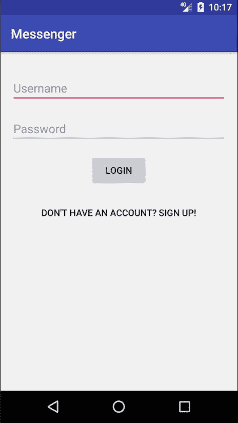

在此活动中创建一个新用户。输入用户名`popeye`，以及电话号码和密码，然后点击注册按钮。新用户将在 Messenger 平台上以用户名`popeye`注册。注册完成后，你将被引导到`MainActivity`，对话视图将立即渲染：

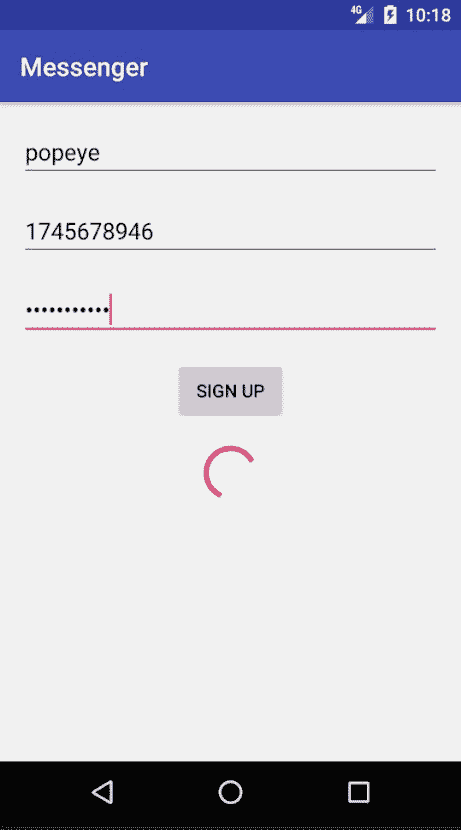

由于新注册的用户没有任何活跃的对话，将显示一个通知消息告知他们这一点。我们需要在消息传递平台上创建另一个用户来演示聊天功能。通过点击屏幕右上角的三个点并选择注销来注销 popeye 的账户：

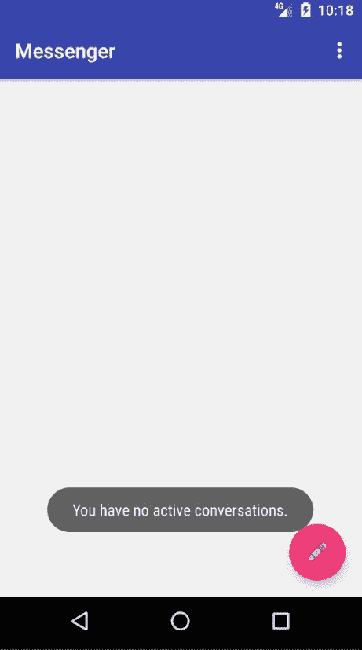

注销后，创建一个用户名为`dexter`的新消息传递账户。以`dexter`的身份登录后，点击对话视图右下角的新消息创建浮动动作按钮。联系人视图将显示给你：

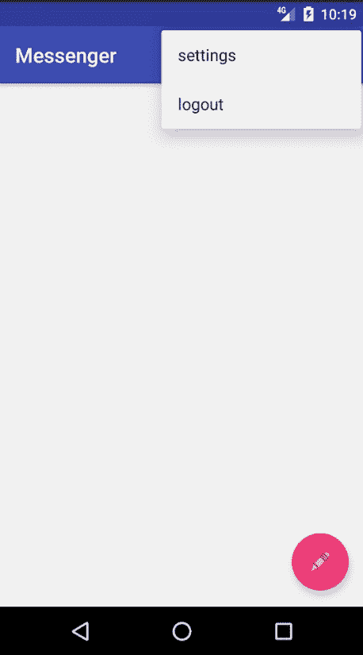

点击 popeye 联系人将打开`ChatActivity`。让我们给`popeye`发送一条消息。在屏幕底部的消息输入字段中输入“嘿，Popeye！”然后点击发送。消息将立即发送给`popeye`：

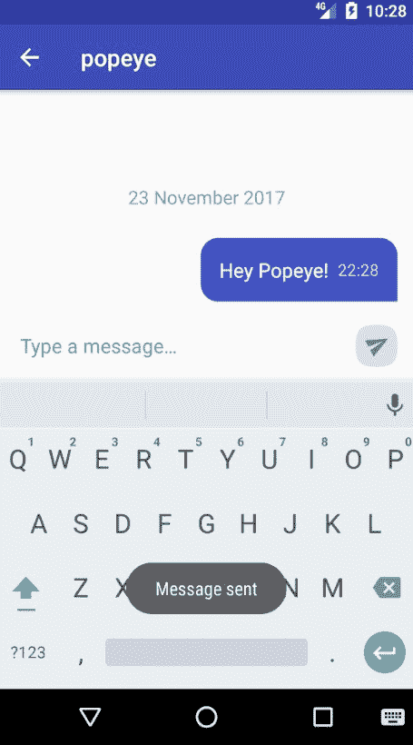

当你回到`MainActivity`的对话视图时，你会注意到现在有一个与`popeye`发起的对话项存在：

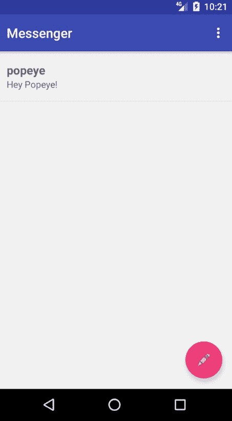

让我们检查消息是否实际上已经送达给`popeye`。从消息传递平台上注销，然后以`popeye`的身份登录。登录后，你将看到由`dexter`发起的新对话：

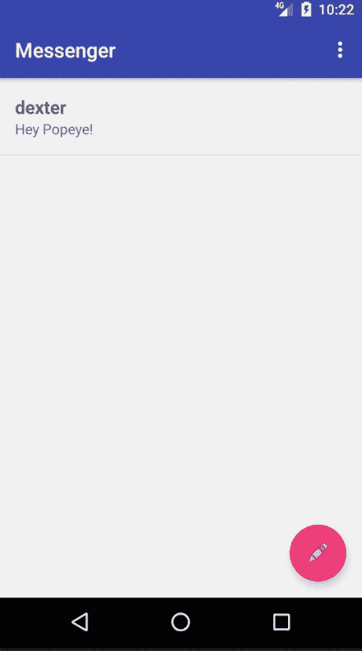

太棒了！它已经送达了。现在让我们回复`dexter`。打开对话并发送一条消息给`dexter`：

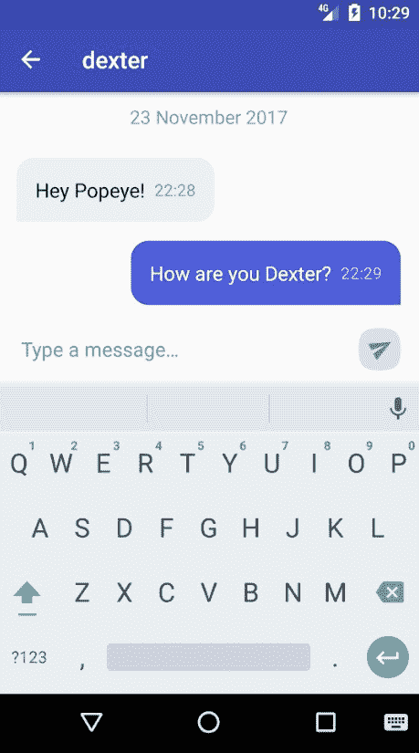

我们在先前的屏幕截图中发送了一条简单的“你好，Dexter？”。现在是时候更新 popeye 的个人资料状态了。返回主活动并访问设置活动（点击操作栏上的三个点并选择设置）。在启动的设置活动中，点击“账户”将显示通用偏好片段。点击“个人资料状态”偏好：

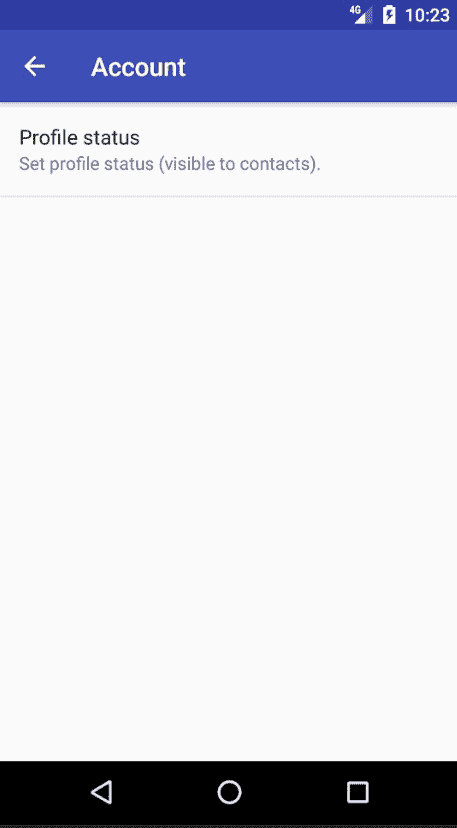

一个包含`EditText`的对话框会弹出，你可以输入一个新的个人资料状态。输入你选择的个人状态信息，然后点击确定：

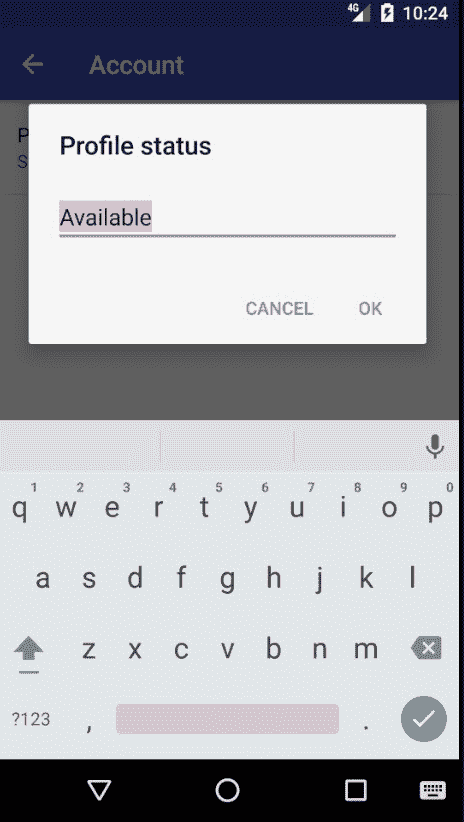

当前个人资料的状态将立即更新。

在这个阶段，我很高兴地通知您，您已经成功实现了整个消息应用。请随意修改和添加我们在本章中创建的代码——如果您这样做，您将学到更多。在我们结束本章之前，还有两个主题需要简要介绍。第一个是应用程序测试，第二个是执行后台任务。

# 安卓应用程序测试

应用程序测试是开发软件应用程序的过程，通过这个过程来确认其软件质量。许多因素会影响软件质量。这些因素包括应用程序可用性、功能、可靠性和一致性。测试安卓应用程序会带来许多优势，包括但不限于：

+   故障检测

+   提高软件稳定性

安卓应用程序测试的范畴非常广泛，因此超出了本书的范围。尽管如此，以下是一些您可以在空闲时间选择（并且很可能应该选择）探索的安卓测试资源：

+   Espresso ([`developer.android.com/training/testing/espresso/index.html`](https://developer.android.com/training/testing/espresso/index.html))

+   Roboelectric ([`robolectric.org`](http://robolectric.org))

+   Mockito ([`site.mockito.org`](http://site.mockito.org))

+   Calabash ([`github.com/calabash/calabash-android`](https://github.com/calabash/calabash-android))

# 执行后台操作

在开发消息应用的过程中，我们广泛使用了 RxAndroid 来执行异步操作。在许多情况下，当使用 RxAndroid 时，我们观察到安卓应用程序主线程上后台操作的结果。在某些情况下，您可能不想使用像 RxAndroid 这样的第三方库来完成这项工作。相反，您可能希望使用 Android 应用程序框架中捆绑的解决方案。Android 提供了多种选项来实现这一目标。其中一种选项是 AsyncTask。

# AsyncTask

`AsyncTask` 类允许在无需管理处理程序和线程的负担下，在应用程序 UI 线程上执行后台操作并发布操作结果。`AsyncTask` 最好用于需要运行短操作的情况。`AsyncTask` 的计算在后台线程上运行，其结果发布到 UI 线程。您可以在以下链接中了解更多关于 `AsyncTask` 的信息：[`developer.android.com/reference/android/os/AsyncTask.html`](https://developer.android.com/reference/android/os/AsyncTask.html)。

# IntentService

`IntentService` 是执行后台、独立于活动调度的预定操作的理想选择。正如 Android 开发者参考中所述，`IntentService` 是处理异步请求（以 Intent 的形式表达）的服务的基础类。客户端通过 `startService` (Intent) 调用发送请求；服务按需启动，并使用工作线程依次处理每个 Intent，当没有更多工作要做时，它会自行停止。您可以在以下链接中了解更多关于 `IntentService` 的信息：[`developer.android.com/reference/android/app/IntentService.html`](https://developer.android.com/reference/android/app/IntentService.html)。

# 摘要

在本章中，我们完成了 Messenger Android 应用程序的开发。在这个过程中，我们学习了如何利用 ChatKit——一个用于创建美观聊天用户界面的第三方库。除此之外，我们还进一步探索了 Android 应用程序框架为我们提供的实用工具。我们亲身体验了 Android 中设置活动的开发，这帮助我们了解了 `PreferenceScreen`、`PreferenceActivity`、`DialogPreference`、`Preference` 和 `PreferenceFragment`。最后，我们简要讨论了 Android 应用程序测试和执行后台操作。

在下一章中，我们将探讨 Android 应用程序框架为我们提供的各种存储选项。
