# 第八章：保护并部署 Android 应用程序

在过去的六章中，我们通过关注 Android 开发，探索了 Kotlin 在移动应用领域的应用。最后一章探讨了 Android 应用程序框架提供给应用程序开发的多种存储介质；我们探讨了内部存储、外部存储、网络存储和 SQLite；我们还创建了使用它们的程序。我们更进一步，介绍了使用 Room 和内容提供者来存储和检索 SQLite 数据库中的数据。

在本章中，我们将通过涵盖两个极其重要的主题来结束我们对 Android 的探索：

+   Android 应用程序安全

+   Android 应用程序部署

我们将从此章节开始，讨论 Android 应用程序的安全性。

# 保护 Android 应用程序

在构建软件时，安全性是一个重要的考虑因素。除了 Android 操作系统中实施的安全措施外，开发者还需要特别注意确保他们的应用程序符合设定的安全标准。在本节中，将为您分解一些重要的安全考虑和最佳实践，以便您理解。遵循这些最佳实践将使您的应用程序对可能安装在客户端设备上的恶意程序更加不易受攻击。

# 数据存储

在所有条件相同的情况下，应用程序保存到设备中的数据隐私是开发 Android 应用程序中最常见的安全担忧。可以遵循一些简单的规则来使您的应用程序数据更加安全。

# 使用内部存储

正如我们在上一章中看到的，内部存储是在设备上保存私有数据的好方法。每个 Android 应用程序都有一个相应的内部存储目录，可以在其中创建和写入私有文件。这些文件仅对创建应用程序是私有的，因此不能被客户端设备上的其他应用程序访问。一般来说，如果数据只能由您的应用程序访问，并且合理地可以存储在内部存储中，那么请这样做。请随时参考上一章以复习如何使用内部存储。

# 使用外部存储

外部存储文件不是应用程序的私有文件，因此可以很容易地被同一客户端设备上的其他应用程序访问。因此，在将数据存储在外部存储之前，您应该考虑对应用程序数据进行加密。有许多库和包可以在将数据保存到外部存储之前对其进行加密。Facebook 的 Conceal([`facebook.github.io/conceal/`](http://facebook.github.io/conceal/))库是外部存储数据加密的一个很好的选择。

此外，作为另一个经验法则，不要将敏感数据存储在外部存储中。这是因为外部存储文件可以被自由操作。还应对外部存储中检索到的输入进行验证。这种验证应基于外部存储中存储的数据不可信的性质。

# 使用内容提供者

如您在前一章中了解到的，内容提供者可以阻止或允许外部访问您的应用程序数据。在清单文件中注册内容提供者时，使用 `android:exported` 属性来指定是否允许外部访问内容提供者。如果您希望内容提供者被导出，则将 `android:exported` 设置为 `true`，否则将该属性设置为 `false`。

此外，内容提供者查询方法——例如，`query()`、`update()` 和 `delete()`——应使用以防止 SQL 注入（一种攻击者通过在输入字段中执行恶意 SQL 语句进行的代码注入技术）。

# 网络安全考虑事项

在通过 Android 应用程序执行网络事务时，应遵循一些最佳实践。这些最佳实践可以分为不同的类别。在本节中，我们将讨论**互联网协议**（**IP**）网络通信和电话网络通信的最佳实践。

# IP 网络通信

当通过 IP 与远程计算机通信时，确保您的应用程序尽可能使用 HTTPs（在服务器支持的地方）非常重要。这样做的一个主要原因是设备经常连接到不安全的网络，例如公共无线连接。HTTPs 确保无论连接到哪个网络，客户端和服务器之间的通信都是加密的。在 Java 中，可以使用 `HttpsURLConnection` 在网络上进行安全的数据传输。需要注意的是，通过不安全的网络连接接收到的数据不应被信任。

# 电话网络通信

在需要数据在服务器和客户端应用程序之间自由传输的情况下，**Firebase Cloud Messaging**（**FCM**）——连同 IP 网络通信——应该被用于替代其他方式，例如**短消息服务**（**SMS**）协议。FCM 是一个多平台消息解决方案，它促进了应用程序之间消息的无缝和可靠传输。

短信（SMS）不是传输数据消息的好选择，因为：

+   它没有被加密

+   它没有强认证

+   通过短信发送的消息容易受到欺骗

+   短信消息容易受到拦截

# 输入验证

为了避免可能出现的风险，验证用户输入非常重要。正如在*使用内容提供者*部分中解释的那样，这种风险之一是 SQL 注入。通过使用参数化查询和彻底清洗用于原始 SQL 查询的输入，可以防止恶意 SQL 脚本的注入。

此外，从外部存储检索的输入必须得到适当的验证，因为外部存储不是一个可信的数据源。

# 使用用户凭据

通过减少应用程序中用户凭据输入的要求，可以减轻钓鱼的风险。与其不断请求用户凭据，不如考虑使用授权令牌。消除在设备上存储用户名和密码的需求。相反，使用可刷新的授权令牌。

# 代码混淆

在发布 Android 应用程序之前，务必使用代码混淆工具，例如**ProGuard**，以防止个人通过各种手段（如反编译）无障碍地访问你的源代码。ProGuard 是预包装在 Android SDK 中的，因此不需要包含依赖项。如果你将构建类型指定为发布版本，它将自动包含在构建过程中。你可以在[`www.guardsquare.com/en/proguard`](https://www.guardsquare.com/en/proguard)上了解更多关于 ProGuard 的信息。

# 保护广播接收器

默认情况下，广播接收器组件是导出的，因此可以被同一设备上的其他应用程序调用。你可以通过对其应用安全权限来控制应用程序对你的应用程序的广播接收器的访问。可以在应用程序的清单文件中使用`<receiver>`元素为广播接收器设置权限。

# 动态加载代码

在需要应用程序动态加载代码的场景中，你必须确保加载的代码来自可信源。此外，你必须不惜一切代价降低篡改代码的风险。加载和执行被篡改的代码是一个巨大的安全威胁。当从远程服务器加载代码时，确保它通过安全、加密的网络传输。请记住，动态加载的代码与你的应用程序具有相同的权限（你在应用程序的清单文件中定义的权限）。

# 保护服务

与广播接收器不同，Android 系统默认不导出服务。默认导出服务仅在将 intent 过滤器添加到清单文件中服务的声明时发生。应使用`android:exported`属性来确保服务仅在需要时导出。当你想要服务导出时，将`android:exported`设置为`true`，否则设置为`false`。

# 启动和发布你的 Android 应用程序

到目前为止，我们已经深入了解了 Android 系统、Android 应用程序开发以及一些其他重要主题，例如 Android 应用程序安全。现在是时候讨论这本书关于 Android 生态系统的最后一个主题——发布和发布 Android 应用程序。

你可能想知道此时“发布”和“发布”这两个词的含义。发布是一个涉及将新产品介绍给公众（最终用户）的活动。发布 Android 应用程序就是使 Android 应用程序对用户可用。必须执行各种活动和流程以确保 Android 应用程序成功发布。总共有 15 个这样的活动。它们是：

+   理解 Android 开发者计划政策

+   准备你的 Android 开发者账户

+   本地化规划

+   规划同步发布

+   测试质量指南

+   构建发布就绪的 APK

+   规划你的应用程序的 Play Store 列表

+   将你的应用程序包上传到 alpha 或 beta 渠道

+   设备兼容性定义

+   预发布报告评估

+   定价和应用分发设置

+   选择分发选项

+   在应用内产品和服务订阅设置

+   确定你的应用程序的内容评级

+   发布你的应用程序

哇！这是一个很长的列表。如果你没有完全理解列表上的所有内容，请不要担心。让我们更详细地查看每个项目。

# 理解 Android 开发者计划政策

有一些开发者计划政策是为了确保 Play Store 始终是用户信任的软件来源而创建的。违反这些定义的政策会有后果。因此，在继续进行应用程序发布流程之前，重要的是要仔细阅读并完全理解这些开发者政策——它们的目的和后果。

# 准备你的 Android 开发者账户

你需要一个 Android 开发者账户才能在 Play Store 上发布你的应用程序。确保通过注册开发者账户并确认账户详情的准确性来设置一个账户。如果你需要在你的 Android 应用程序上销售产品，你需要设置一个商户账户。

# 本地化规划

有时，为了本地化，你可能需要多个应用程序副本，每个本地化到不同的语言。在这种情况下，你需要提前规划本地化，并遵循为 Android 开发者推荐的本地化清单。你可以在此查看此清单：[`developer.android.com/distribute/best-practices/launch/localization-checklist.html`](https://developer.android.com/distribute/best-practices/launch/localization-checklist.html)。

# 规划同步发布

您可能希望在不同平台上发布产品。这有几个优点，例如增加您产品的潜在市场规模、降低您产品的访问门槛以及最大化您应用程序的潜在安装数量。同时在不同平台上发布通常是个好主意。如果您希望对您的任何产品这样做，请确保您提前做好规划。在无法同时在不同平台上发布应用程序的情况下，确保您提供一种方式，让感兴趣的潜在用户可以提交他们的联系信息，以便您可以在他们的选择平台上发布产品后与他们取得联系。

# 符合质量指南的测试

质量指南提供了测试模板，您可以使用这些模板来确认您的应用程序符合 Android 用户期望的基本功能和非功能要求。确保在发布前运行您的应用程序通过这些质量指南。您可以通过以下链接访问这些应用程序质量指南：[`developer.android.com/develop/quality-guidelines/index.html`](https://developer.android.com/develop/quality-guidelines/index.html)。

# 构建准备发布的应用程序包（APK）

一个准备发布的 APK 是一个经过优化打包、然后使用发布密钥构建和签名的 Android 应用程序。构建一个准备发布的 APK 是发布 Android 应用程序的重要步骤。请特别注意此步骤。

# 规划您的应用程序的 Play Store 列表

此步骤涉及收集您产品 Play Store 列表所需的所有资源。这些资源包括但不限于您的应用程序日志、截图、描述、促销图形和视频（如有）。确保您在您的应用程序 Play Store 列表中包含指向您的应用程序隐私政策的链接。同样重要的是，将您应用程序的产品列表本地化到您的应用程序支持的所有语言。

# 将您的应用程序包上传到 alpha 或 beta 渠道

由于测试是检测软件缺陷和改进软件质量的一种高效且经过实战检验的方法，因此将您的应用程序包上传到 alpha 和 beta 渠道以方便对您的产品进行 alpha 和 beta 软件测试是个好主意。Alpha 测试和 beta 测试都是验收测试的类型。

# 设备兼容性定义

此步骤涉及声明您的应用程序开发时旨在其上运行的 Android 版本和屏幕尺寸。在此步骤中尽可能准确是非常重要的，因为定义不准确的 Android 版本和屏幕尺寸不可避免地会导致用户在使用您的应用程序时遇到问题。

# 预发布报告评估

预发布报告用于识别在自动测试你的应用程序在各种 Android 设备上后发现的任何问题。如果你选择加入，预发布报告将在你上传应用程序包到 alpha 或 beta 渠道时发送给你。

# 定价和应用分发设置

首先，确定你想要通过什么方式来盈利你的应用程序。确定这一点后，将你的应用程序设置为免费安装或付费下载。在你设置了应用程序的期望定价后，选择你希望分发应用程序的国家。

# 选择分发选项

这一步骤涉及选择你希望在哪些设备和平台上分发你的应用程序——例如，Android TV 和 Android Wear。完成此操作后，Google Play 团队将能够审查你的应用程序。如果你的应用程序在审查后获得批准，Google Play 将使其更容易被发现。

# 在应用内设置产品和订阅

如果你希望在应用内销售产品，你需要设置你的应用内产品和订阅。在这里，你将指定你可以销售到的国家，并处理各种与金钱相关的问题，例如税务考虑。在这一步骤中，你还将设置你的商户账户。

# 确定你的应用程序的内容评级

你必须为你在 Play Store 上发布的应用程序提供一个准确的评级。这一步骤是由 Android 开发者计划政策强制要求的，这是有充分理由的。它有助于你针对的适当年龄组发现你的应用程序。

# 发布你的应用程序

一旦你完成了这一步骤之前的所有必要步骤，你就可以准备将你的应用程序发布到 Play Store 的生产渠道。首先，你需要发布一个版本。发布允许你上传你的应用程序的 APK 文件，并将你的应用程序推出到特定的渠道。在发布流程结束时，你可以通过点击“确认发布”来发布你的应用程序。

因此，这就是我们发布新应用在 Play Store 上所需了解的所有内容。在大多数情况下，你不需要按线性方式遵循所有这些步骤，你只需要遵循步骤的一个子集——更具体地说，那些与你希望发布的应用类型相关的步骤。像往常一样，通过一个例子来理解一系列步骤是最好的方式。让我们继续发布我们在前一章中开发的应用程序。在接下来的部分，我们将发布 Messanger 应用程序到 Play Store。如果你更喜欢，你也可以选择发布我们之前开发的应用程序中的任何一个。

为了将 Messenger 应用发布到 Play 商店，我们首先需要创建一个 Google Play 开发者账户。我们将在接下来的段落中向您展示如何操作。首先，选择您最喜欢的网络浏览器，并导航到以下 URL：[`play.google.com/apps/publish/signup`](https://play.google.com/apps/publish/signup)。

一旦打开网页，您将需要使用您的 Google 账户登录。登录适当的 Google 账户后，您将需要接受开发者计划协议。此第二步如图所示：

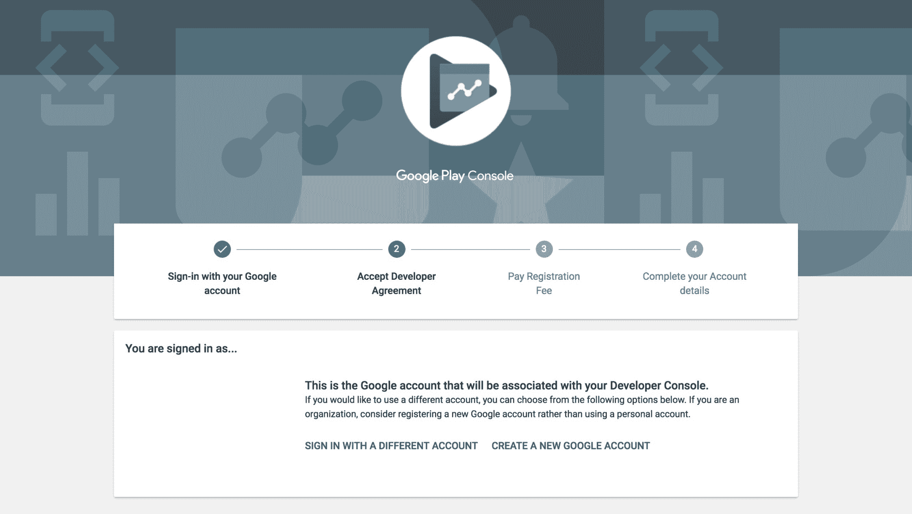

通过滚动到网页底部并勾选“我同意”以及“我愿意将我的账户注册与 Google Play 开发者分发协议关联”，接受 Google Play 开发者协议，如图所示：

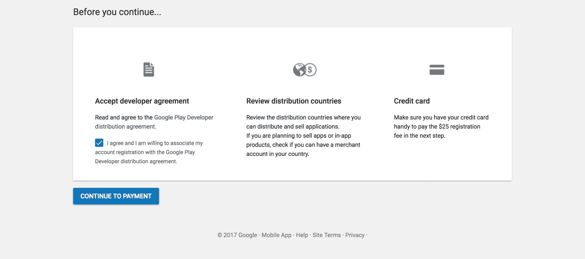

接受协议后，点击“继续到支付”以继续创建您的开发者账户。您需要支付一次性的 Google Play 开发者账户注册费 25 美元。您将经历一个无烦恼的支付流程。一旦支付成功，您将相应地收到提示：

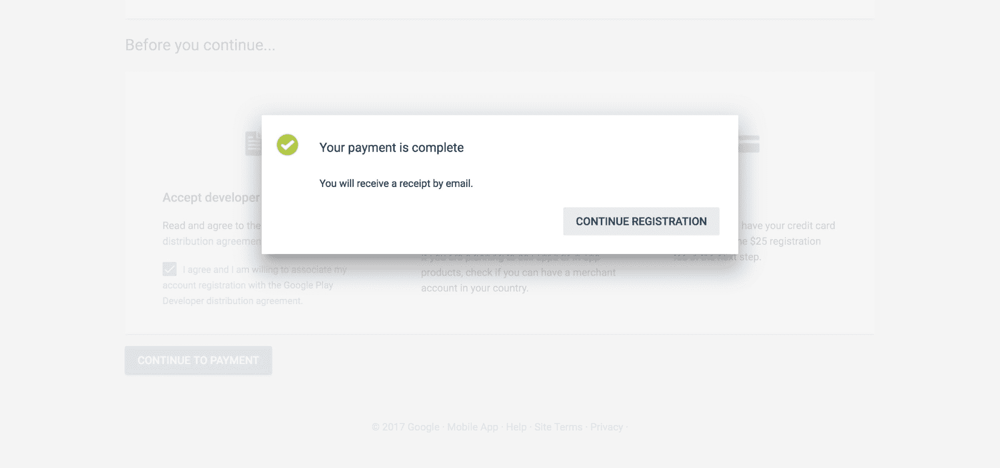

点击“继续注册”将带您进入注册流程的最后一步，您将需要完成账户详细信息，如下所示：

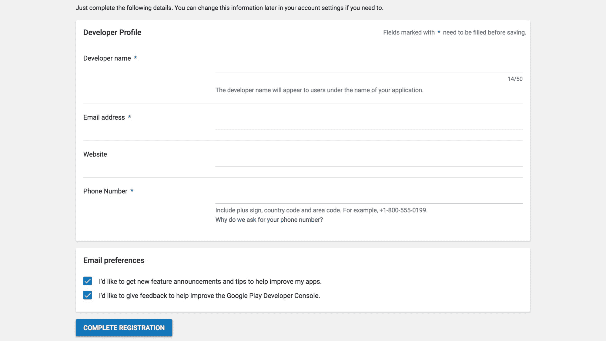

按照要求输入您的账户详细信息，然后点击“完成注册”以完成账户注册流程。

注册完成后，您将被引导到 Google Play 开发者控制台。从这里，您可以管理您的应用程序，使用 Google Play 游戏服务，管理您的订单，下载应用程序报告，查看警报，以及管理您的控制台设置：

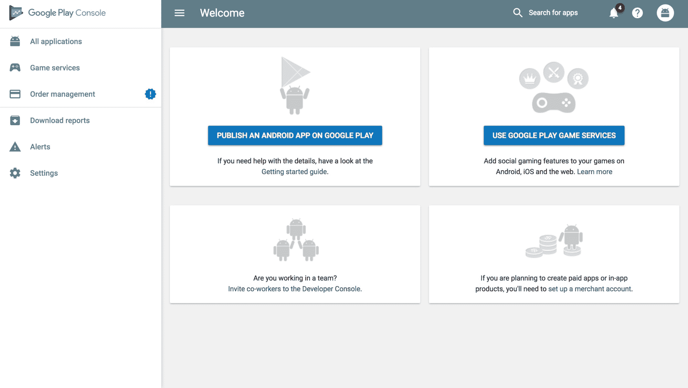

我们有兴趣发布一个 Android 应用程序。因此，在控制台仪表板上点击“在 Google Play 上发布 Android 应用”。当被要求选择默认语言并输入`Messenger`作为应用程序的标题时，然后点击“创建”。在开发者控制台中为您创建一个新的草稿应用程序：

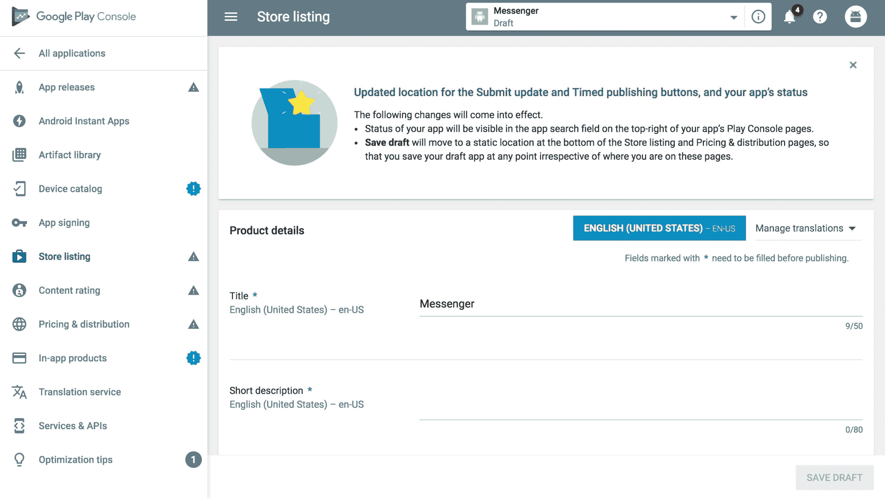

在继续我们的应用程序发布流程之前，我们必须为 Messenger 应用签署一个发布版 APK。

# 为发布签名的应用程序

在 Android Studio 中打开您的 Messenger 应用程序项目。虽然这不是签署应用的唯一方法，但本章将使用 Android Studio 来签署 Messenger 应用。首先，首先，在您的 Android Studio 终端运行以下命令以生成用于签名的私钥：

```
keytool -genkey -v -keystore my-release-key.jks -keyalg RSA -keysize 2048 -validity 10000 -alias my-alias
```

运行前面的命令会提示您输入 `keystore` 密码以及为您的密钥提供更多信息。然后，`keystore` 将作为一个名为 `my-release-key.jks` 的文件生成并保存在当前目录中。keystore 中的密钥有效期为 10,000 天。

现在我们已经生成了私钥，我们将配置 Gradle 以签署我们的 APK。打开模块级别的 `build.gradle` 文件，并在 `android {}` 块内添加一个 `signingConfigs {}` 块，其中包含 `storeFile`、`storePassword`、`keyAlias` 和 `keyPassword` 的条目。完成这些后，将此对象传递给应用发布构建类型的 `signingConfig` 属性。以下是一个示例片段：

```
android {
  compileSdkVersion 26 
  buildToolsVersion "26.0.2"
  defaultConfig {
     applicationId "com.example.messenger"
     minSdkVersion 16
     targetSdkVersion 26
     versionCode 1
     versionName "1.0"
     testInstrumentationRunner "android.support.test.runner.AndroidJUnitRunner"
     vectorDrawables.useSupportLibrary = true
  }

  signingConfigs {
    release {
      storeFile file("../my-release-key.jks")
      storePassword "password"
      keyAlias "my-alias"
      keyPassword "password"
    }
  }
  buildTypes {
    release {
      minifyEnabled false
      proguardFiles getDefaultProguardFile('proguard-android.txt'), 'proguard-rules.pro'
      signingConfig signingConfigs.release
    }
  }
}
```

在完成前面的操作后，您就可以签署您的 APK；在我们这样做之前，我们必须修改我们的当前包名。`com.example` 包名受到 Google Play 的限制，因此在我们尝试将应用程序发布到 Play Store 之前，我们必须更改我们的包名。不要担心：使用 Android Studio 改变应用程序根包的名称很容易。首先，确保您已将 Android Studio 设置为显示项目目录结构。这可以通过单击 IDE 窗口左上角的下拉菜单并选择项目：来实现。

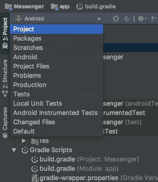

完成前面的操作后，通过在项目结构设置菜单中取消选择隐藏空中间包选项，在项目结构视图中取消隐藏所有空中间包，如图所示：

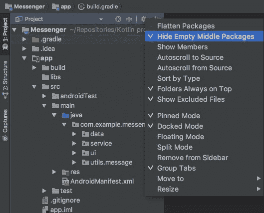

在取消选择前面的选项后，中间的空包将不再被隐藏，因此，`com.example.messenger` 将被拆分为三个可见的包：`com`、`example` 和 `messenger`。现在，让我们将 `example` 包重命名为其他名称。将 `example` 改为你姓名和姓氏的组合得到的名称。例如，如果你的名字和姓氏是 Kevin Fakande，包名将从 `example` 更改为 `kevinfakande`。可以通过右键单击包并选择重构 | 重命名... 来重命名包。在您的包被重命名后，检查您的清单和 `build.gradle` 文件，以确保对项目包的修改已反映出来。因此，无论你在 `build.gradle` 或清单文件中看到 `com.example.messenger` 字符串，都要将其修改为 `com.{full_name}.messenger`。

在做出前面的更改后，您就可以签署您的应用程序了。在您的 Android Studio 终端中输入以下命令：

```
./gradlew assembleRelease
```

执行前面的命令将在`<project_name>/<module_name>/build/outputs/apk/release`路径下创建一个已用您的私钥签名的发布 APK。APK 将被命名为`<module_name>-release.apk`。由于我们在这个项目中的模块名为`app`，因此在这种情况下，APK 将被命名为`app-release.apk`。已用私钥签名的 APK 已准备好分发。在签发了我们的 APK 后，我们已准备好完成消息应用的发布。

# 发布您的 Android 应用

在签署您的消息应用后，您可以继续完成所需的应用程序详细信息，以实现发布应用程序的目标。首先，您需要为应用程序创建一个合适的商店列表。在 Google Play 控制台中打开消息应用，并导航到商店列表页面（这可以通过在侧导航栏中选择“商店列表”来完成）。

在我们继续之前，您需要在商店列表页面上填写所有必要的信息。这些信息包括产品详情，如标题、简短描述、完整描述，以及图形资产和分类信息——包括应用程序类型、类别和内容评级、联系详情和隐私政策。以下截图显示了 Google Play 控制台商店列表页面：

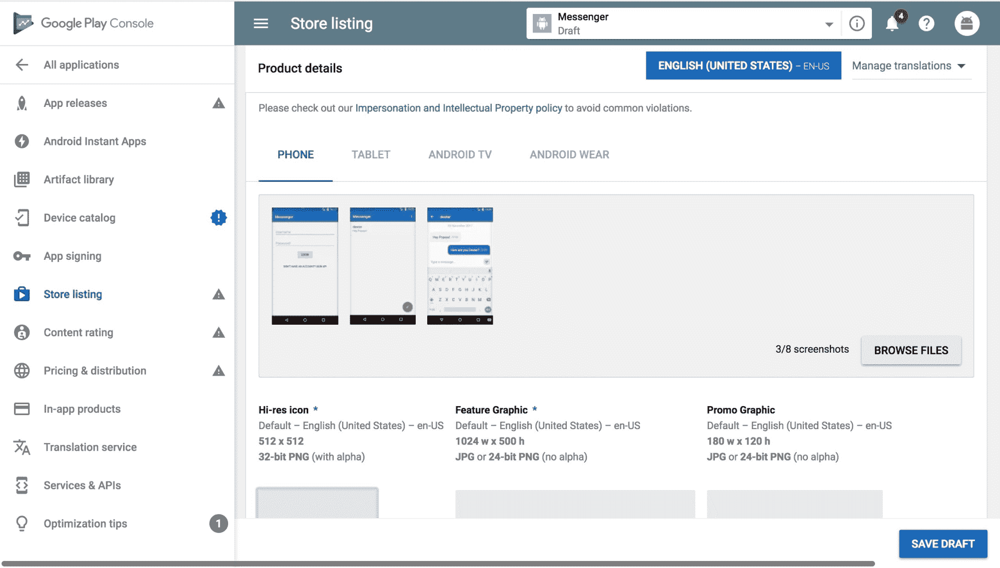

一旦填写了商店列表信息，接下来需要填写的是定价和分发信息。在左侧导航栏中选择“定价和分发”以打开其偏好选择页面。为了演示目的，我们将此应用的定价设置为免费。我们还选择了五个随机国家来分发此应用程序。这些国家包括尼日利亚、印度、美国、英国和澳大利亚：

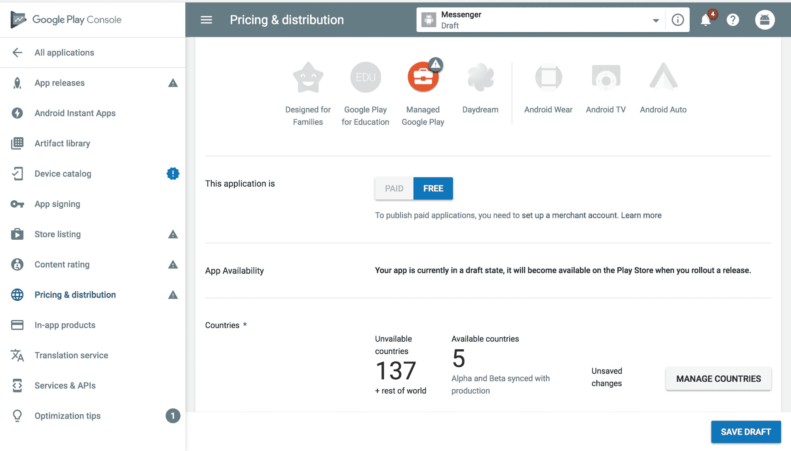

除了选择定价类型和产品分发的可用国家，您还需要提供额外的偏好信息。需要提供的信息包括设备类别信息、用户程序信息和同意信息。

现在是时候将我们的已签名 APK 添加到我们的 Google Play 控制台应用中。导航到“应用发布”|“管理测试版”|“编辑发布”。在向您展示的页面上，您可能会被问及是否希望加入 Google Play 应用签名：

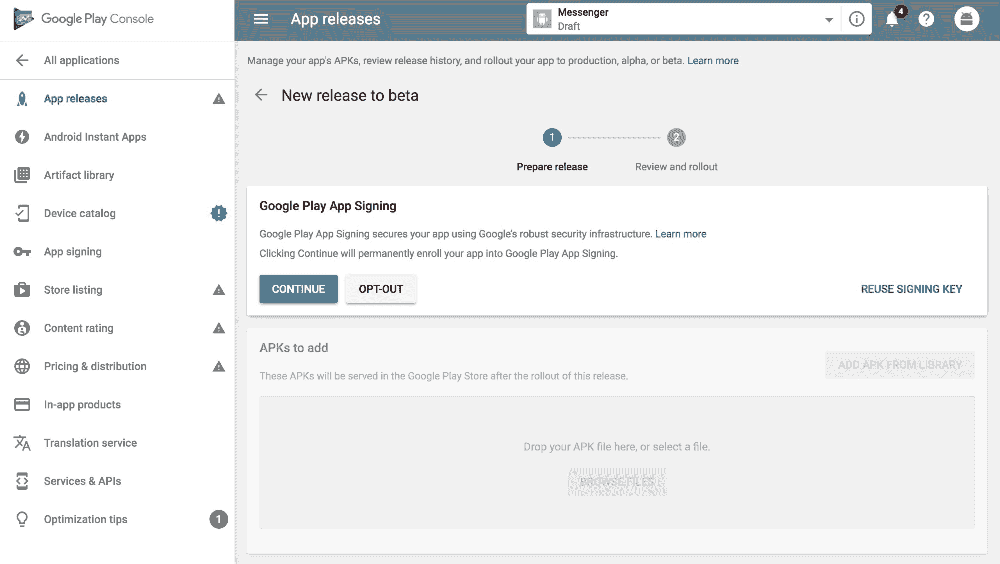

为了本例的目的，选择“退出”。一旦选择了“退出”，您将能够从您的计算机文件系统中选择您的 APK 文件进行上传。通过点击以下截图所示的“浏览文件”，选择您的 APK 进行上传：

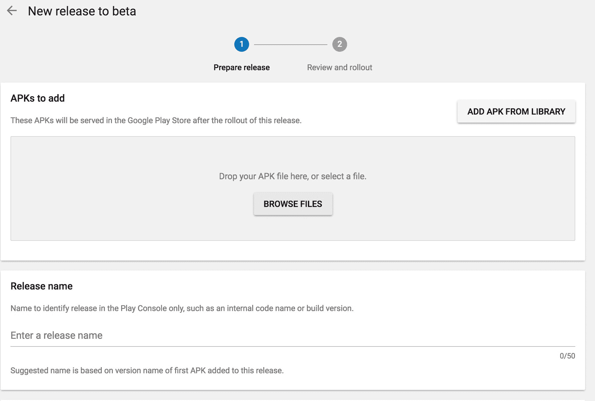

在选择合适的 APK 后，它将被上传到 Google Play 控制台。一旦上传完成，Play 控制台将自动为你的测试版发布建议一个发布名称。这个发布名称基于上传的 APK 的版本名称。如果你对建议不满意，可以修改发布名称。接下来，在提供的文本字段中添加一个合适的发布说明。一旦你对输入的数据满意，通过点击网页底部的“审查”按钮保存并继续。在审查了测试版发布后，如果你已经为你的应用添加了测试者，你可以推出它。推出测试版不是我们的重点，所以让我们回到我们的主要目标：发布 Messenger 应用。

上传了你的应用的 APK 后，你现在可以完成强制性的内容评级问卷。点击侧边栏上的“内容评级”导航项，并按照说明进行操作。一旦问卷完成，将为你的应用生成适当的评级：

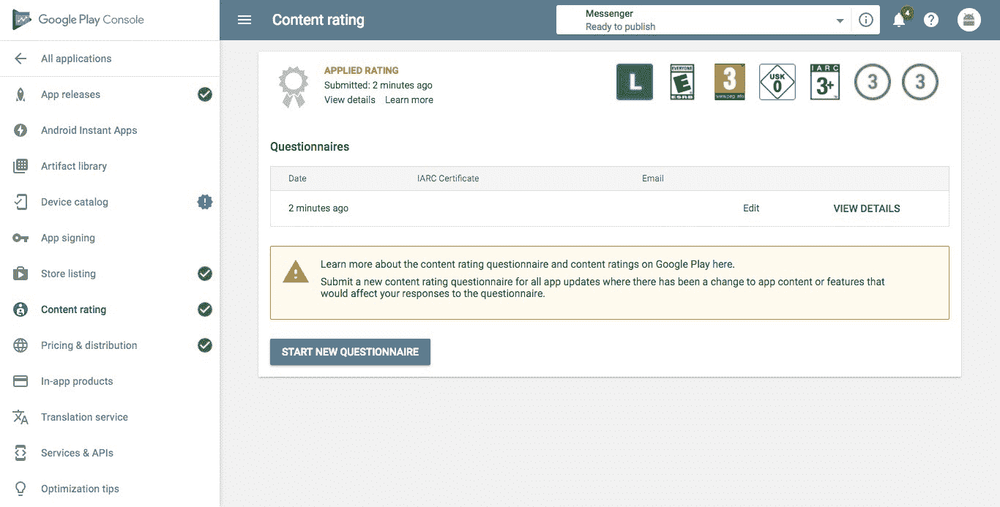

完成内容评级问卷后，应用即可准备发布到生产环境。发布到生产环境的应用将在 Google Play 商店对所有用户开放。在 Play 控制台中，导航到“应用发布”|“管理生产”|“创建发布”。当提示上传 APK 时，点击屏幕右侧的“从库添加 APK”按钮，并选择我们之前上传的 APK（版本名为 1.0）以及完成必要的发布详情，类似于创建测试版发布时的方式。准备好后，点击页面底部的“审查”按钮。接下来页面将显示一个简短的发布摘要：

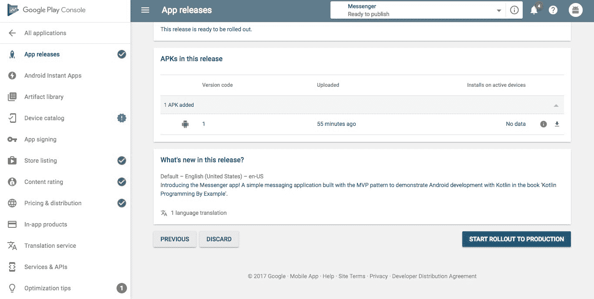

仔细阅读摘要中提供的信息。一旦确认对摘要中的信息满意，即可开始向生产环境推出。一旦开始推出到生产环境，系统将提示你确认理解你的应用将向 Play 商店的用户开放：

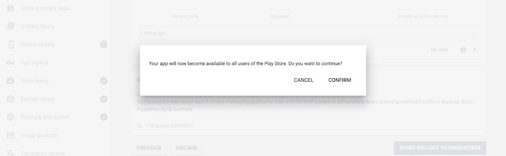

准备好让 Messenger 应用在 Play 商店上线时，点击“确认”。恭喜！你现在已经将你的第一个应用发布到了 Google Play 商店！

# 摘要

在本章中，我们通过学习如何确保和发布 Android 应用程序到 Google Play 商店，结束了对 Android 应用程序框架的探索。我们确定了 Android 应用程序的安全威胁，并全面解释了缓解这些威胁的方法，我们还指出了在为 Android 生态系统开发应用程序时应遵循的最佳实践。我们学习了如何与存储介质安全地工作并执行网络过程。除此之外，我们还学习了如何确保 Android 组件的安全，例如服务和广播接收器。

最后，我们深入研究了将应用程序发布到 Play 商店的过程。除了涵盖成功发布 Android 应用程序的所有必要步骤之外，我们还更进一步，将 Messenger 应用程序发布到了 Google Play 商店。

在下一章中，我们将开始探索 Kotlin 在网络应用程序开发中的应用，通过开发一个地点评论员应用程序来展开这一探索。
