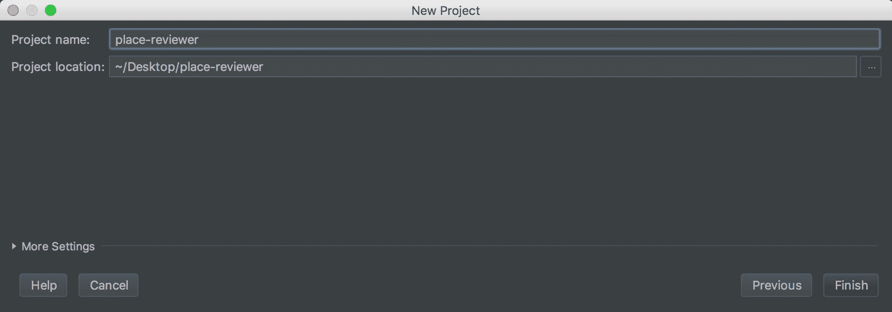
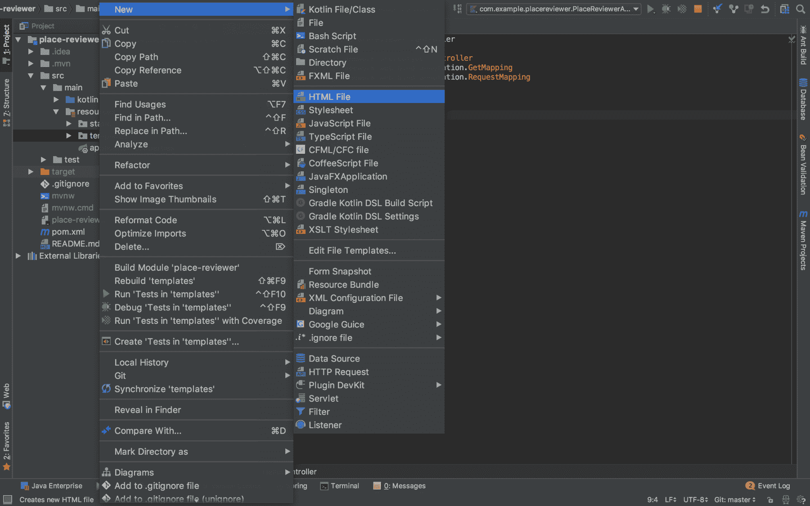
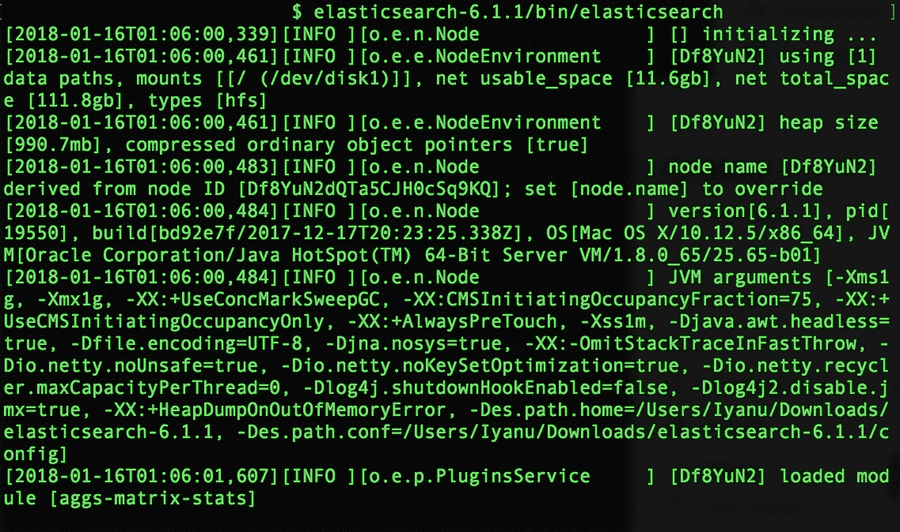
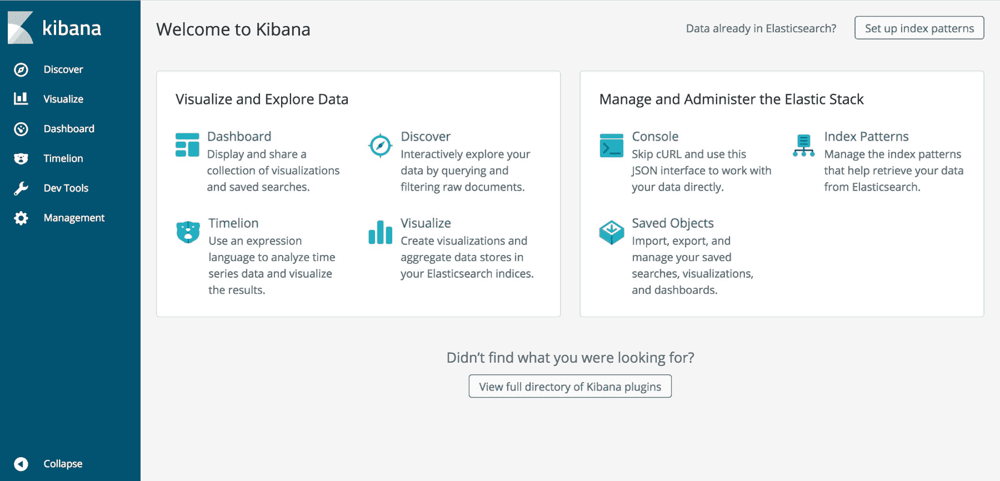
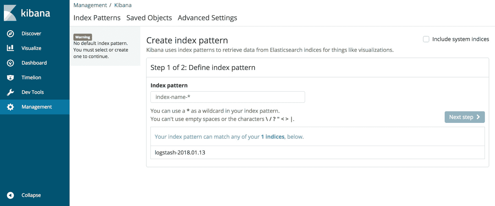
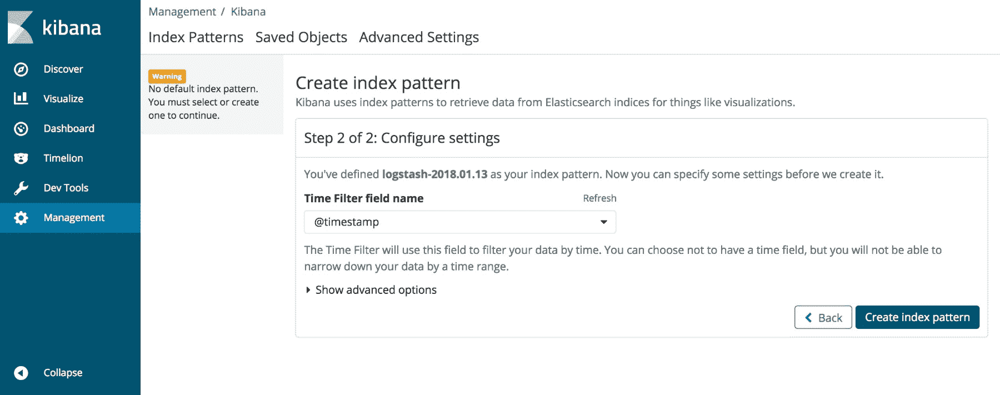

# 第九章：使用 Spring 创建地点评论者后端

在前四章中，我们专注于在 Android 平台应用程序开发中使用 Kotlin。我们刚刚结束的章节广泛地涵盖了确保和部署 Android 应用程序所涉及的各种活动。我们探讨了在处理数据存储以及通过网络通信时的最佳实践——与安全相关。此外，我们还讨论了处理用户输入和与用户凭证工作时必要的考虑因素。

此外，我们还探讨了确保某些 Android 应用程序组件（如服务和广播接收器）的各种方法。最后，我们采取了一种逐步的方法，以正确地将 Android 应用程序部署到 Google Play Store。在本章中，我们将深入探讨如何使用 Kotlin 开发基于 Web 的解决方案——特别是通过 Spring——通过开发地点评论者应用程序。本章将专注于地点评论者应用程序后端的发展，下一章将专注于其前端。在阅读本章的过程中，你将了解：

+   模型-视图-控制器设计模式

+   Logstash 及其在集中、转换和存储数据中的应用。

+   使用 Spring Security 保护网站

让我们直接深入了解我们需要学习的内容，首先看看模型-视图-控制器设计模式。

# MVC 设计模式

MVC 模式，也称为模型-视图-控制器模式，是一种主要用于现代应用程序中关注点分离的应用程序设计模式。更具体地说，它是一种用户界面设计模式，将应用程序主要分为三个不同的组件。这种将应用程序模块分离成不同部分的做法有多个原因。其中一个原因是将表示逻辑从核心业务逻辑中隔离出来。让我们看看 MVC 模式中的这三个应用程序组件。

# 模型

模型是负责 MVC 应用程序数据管理和逻辑的组件。由于模型是所有数据和业务逻辑的主要管理者，你可以将其视为 MVC 应用程序的动力源。

# 视图

这是应用程序中存在并由应用程序生成的数据的视觉表示。它是用户与应用程序交互的主要点。

# 控制器

控制器是视图和模型之间的中介角色。它负责检索输入——主要来自视图——并将适当转换的输入形式传递给模型。它还负责在需要时更新视图中的数据：


# 设计和实现地点评论者后端

由于我们之前已经有过设计系统流程的实践经验，在本章中，我们将减少对 Place Reviewer 系统设计过程中涉及的流程的关注。相反，我们将为系统制定一些快速的使用案例规范，确定实现我们系统数据库所需的基本实体，并直接进入系统开发。让我们继续并陈述 Place Reviewer 系统的使用案例。

# 使用案例识别

正如我们在本书早期所做的那样，我们将首先识别系统的参与者来开始我们的用例规范程序。在我们能够识别系统的参与者之前，我们必须彻底了解 Place Reviewer 网络应用程序能做什么。

如您可能已经推测出的那样，Place Reviewer 网络应用程序是一个基于互联网的应用程序，它为平台用户提供了无缝创建位置评价的便利。一旦用户注册，他/她就能利用该平台对世界上任何地点发表基于个人经验的评价性评论。用户将能够借助地图选择他/她想要评价的位置。

现在我们已经了解了 Place Reviewer 应用程序能做什么，我们可以继续并识别 Place Reviewer 系统中的参与者。如您此时所推测的，我们将要实施的 Place Reviewer 应用程序只有一个参与者——用户。用户的使用案例如下：

+   用户使用 Place Reviewer 应用程序来创建位置评价

+   用户使用 Place Reviewer 应用程序查看其他用户创建的评价

+   用户可以在交互式地图上查看其他用户评价的确切位置

+   用户可以在 Place Reviewer 平台上注册

+   用户可以从他的/她的 Place Reviewer 账户注销

到目前为止，我们已经取得了适当的进展。我们能够明确地说明 Place Reviewer 系统的作用，识别系统的参与者，并且清楚地陈述系统的使用案例，这些使用案例仅由唯一的参与者——用户——提出。让我们再进一步，确定系统需要处理的数据。

# 识别数据

由于我们之前的用例定义，我们可以轻松地识别 Place Reviewer 应用程序必须处理的数据类型——通过创建适当的模型。第一种类型的数据是用户数据，第二种类型是评价数据。用户数据，正如其名所示，是与平台上注册的用户相关的数据，而评价数据是平台上创建的每个评价所需的数据。

我们需要以下用户数据：用户的电子邮件地址、用户名、密码和账户状态。此外，我们还需要为平台上的每个用户提供一个唯一的标识符——用户 ID，以及用户注册的日期。至于评论所需的数据，我们需要评论标题、评论正文（评论内容）、被评论地点的地址、被评论地点的名称、被评论地点的位置信息（经纬度坐标），以及一个用于特定识别被评论地点的地点 ID。此外，还需要为创建的评论提供一个唯一的标识符，以及与评论创建时间相关的信息。

在这个关键时刻，你可能正在想：等等，为什么我们有关于一个地方（地点名称、地址、ID 以及经纬度）的信息，还要加上评论信息？我们为什么不把这些信息分开，将其视为我们将会提供的一种独立类型的数据呢？如果你这样想过，那么你是正确的，如果我们有一个数据库表，其中包含了我们希望在平台上可评论的所有地点的所有信息，那么这样的方法将是非常好的。遗憾的是，我们没有这样的表。

现在，你可能想知道：我们如何让用户评论那些我们没有信息的地方？答案是简单的。我们利用 Google 的 Places API。我们将在下一章中查看如何实现这一点，但现在，请紧随其后，因为我们开始实现 Place Reviewer 后端。

# 设置数据库

由于我们的系统需要存储信息，我们需要为应用程序设置一个数据库以持久化数据。由于我们在之前开发的应用程序中使用了 Postgres 作为主要的数据存储，我们将继续使用它作为我们的主要数据存储。我们已经介绍了如何在各种系统上设置 Postgres，因此我们在这里不再赘述。让我们继续创建我们的数据库。打开你的终端并运行以下命令：

```
createdb -h localhost —username=<username> place-reviewer 
```

一旦你运行了命令，系统上就会创建一个名为`place-reviewer`的数据库。你输入的用于替换`<username>`参数的用户名将是用来连接数据库的用户名。在为我们的应用程序设置了数据库之后，我们可以继续进行后端实现。我们将利用 Spring 框架来实现后端。

# 实现后端

通过指定我们应用程序的各种用例并设置数据库连接，我们已经确立了一个方向感。现在，让我们直接进入其实施阶段。打开 IntelliJ IDEA 并使用 Spring initializer 创建一个新项目。点击下一步后，IntelliJ 将检索 Spring initializer，之后你将需要提供一些应用程序的详细信息。在进入下一阶段设置之前，请执行以下操作：

1.  输入 `com.example` 作为组 ID。

1.  输入 `place-reviewer` 作为工件 ID。

1.  如果尚未选择，请选择 Maven 项目作为项目类型。

1.  保持打包选项和 Java 版本不变。

1.  选择 Kotlin 作为语言。这很重要，因为毕竟我们正在进一步学习 Kotlin 语言。

1.  将版本属性更改为 1.0.0。

1.  输入你选择的描述。我们的描述是 `一个用于创建位置评论的便捷网络应用程序`。

1.  输入 `com.example.placereviewer` 作为包名。

在填写完所需的项目信息后，通过点击下一步进入下一屏幕。在这个屏幕上，我们需要选择我们项目的依赖项。

Spring initializer 随带 Spring 插件，截至编写本文时，该插件仅在 IntelliJ IDEA Ultimate Edition 中可用，需要付费许可证。如果你已经安装了 IntelliJ IDEA Community Edition，你仍然可以开发这个应用程序。只需使用 Spring initializer 工具在 [`start.spring.io`](https://start.spring.io) 生成项目，并将其导入 IntelliJ IDEA。

选择 Spring Security、Session、Cache 和 Web 依赖项。此外，从模板引擎类别中选择 Thymeleaf。在 SQL 类别下，选择 PostgreSQL。此外，在屏幕顶部的 Spring Boot 版本选择下拉菜单中，选择 2.0.0 M7 作为版本。在选择必要的依赖项后，内容应类似于以下截图：


在确认你已选择适当的依赖项后，点击下一步继续到最后一个设置屏幕。在这里，你需要提供一个项目名称和项目位置。将项目名称填写为 `place-reviewer` 并选择你想要在计算机上保存项目位置：



完成这些操作后，选择完成并等待项目设置完成。你将被带到一个新的 IDE 窗口，其中包含初始项目文件。我们不需要对 Spring 项目的结构进行介绍，因为我们已经在之前的章节中与之合作过。在继续之前，将以下依赖项添加到项目的 `pom` 文件中：

```
<dependency>
  <groupId>org.springframework.boot</groupId>
  <artifactId>spring-boot-starter-data-jpa</artifactId>
</dependency>
<dependency>
  <groupId>org.webjars</groupId>
  <artifactId>bootstrap</artifactId>
  <version>4.0.0-beta.3</version>
</dependency>
<dependency>
  <groupId>org.webjars</groupId>
  <artifactId>jquery</artifactId>
  <version>3.2.1</version>
</dependency>
```

现在，让我们继续将我们的应用程序连接到我们的数据库。

# 将后端连接到 Postgres

要将 Place Reviewer 后端连接到我们为其创建的 PostgreSQL 数据库，我们必须修改项目的 `application.properties` 文件，使其包含建立与 PostgreSQL 数据库连接所需的必要属性。打开项目的 `application.properties` 文件，并添加以下属性：

```
spring.jpa.hibernate.ddl-auto=create-drop
spring.jpa.generate-ddl=true
spring.datasource.url=jdbc:postgresql://localhost:5432/place-reviewer
spring.datasource.driver.class-name=org.postgresql.Driver
spring.datasource.username=<username>
```

在前一个代码片段中 `<username>` 属性所在的位置插入一个合适的用户名。添加了适当的数据库连接属性后，Spring Boot 将能够在应用程序启动时连接到指定的数据库。为我们的项目设置了适当的数据库连接属性后，让我们为之前确定的 `User` 和 `Review` 实体创建模型。

# 创建模型

我们之前确定了两种必须在我们的系统中考虑的实体类型：`User` 实体和 `Review` 实体。是时候为这些实体创建适当的模型了。我们将首先关注的是用户实体。在 `com.example.placereviewer` 包内创建一个名为 `data` 的包。在新建的 `data` 包内添加一个名为 `model` 的包。现在，在新建的 `com.example.placereviewer.data.model` 包内添加一个名为 `User.kt` 的文件，并包含以下内容：

```
package com.example.placereviewer.data.model

import com.example.placereviewer.listener.UserListener
import org.springframework.format.annotation.DateTimeFormat
import java.time.Instant
import java.util.*
import javax.persistence.*
import javax.validation.constraints.Pattern
import javax.validation.constraints.Size

@Entity
@Table(name = "`user`")
@EntityListeners(UserListener::class)
data class User(
  @Column(unique = true)
  @Size(min = 2)
  @Pattern(regexp = "^[A-Z0-9._%+-]+@[A-Z0-9.-]+\\\\.[A-Z] {2,6}\$")
  var email: String = "",
    @Column(unique = true)
  var username: String = "",
    @Size(min = 60, max = 60)
  var password: String = "",
    @Column(name = "account_status")
  @Pattern(regexp = "\\A(activated|deactivated)\\z")
  var accountStatus: String = "activated",
    @Id
    @GeneratedValue(strategy = GenerationType.AUTO)
  var id: Long = 0,
    @DateTimeFormat
    @Column(name = "created_at")
  var createdAt: Date = Date.from(Instant.now())
) {
  @OneToMany(mappedBy = "reviewer", targetEntity =  Review::class)
  private var reviews: Collection<Review>? = null
}
```

由于我们之前在 Spring 中有创建实体的经验，我们不需要花太多时间解释前一个代码片段中的内容。在前面的代码片段中，我们定义了一个具有电子邮件、`username`、`password`、`accountStatus`、`Id` 和 `createdAt` 属性的 `User` 实体。此外，我们还指定了一个具有 `@EntityListener` 注解的实体监听器。我们尚未创建 `Review` 实体或 `UserListener`。由于我们仍然专注于 `User` 实体，让我们在关注 `Review` 实体之前先创建其实体监听器。向 `com.example.placereviewer` 添加一个新的 `listener` 包，并向其中添加一个包含以下代码的 `UserListener.kt` 文件：

```
package com.example.placereviewer.listener

import com.example.placereviewer.data.model.User
import org.springframework.security.crypto.bcrypt.BCryptPasswordEncoder
import javax.persistence.PrePersist
import javax.persistence.PreUpdate

class UserListener {

  @PrePersist
    @PreUpdate
    fun hashPassword(user: User) {
      user.password = BCryptPasswordEncoder().encode(user.password)
    }
}
```

`UserListener` 有一个单一的 `hashPassword` 函数，该函数在持久化之前和更新 `User` 实体之前被调用。该方法的唯一任务是编码用户的 `password` 属性为 bcrypt 等价物，然后在数据库中持久化之前保存它。

在创建了 `User` 实体的必要监听器之后，让我们将注意力转向 `Review` 实体的定义。在 `com.example.placereviewer.data.models` 目录下创建一个名为 `Review.kt` 的文件，并包含以下内容：

```
package com.example.placereviewer.data.model

import org.springframework.format.annotation.DateTimeFormat
import java.time.Instant
import java.util.*
import javax.persistence.*
import javax.validation.constraints.Size

@Entity
@Table(name = "`review`")
data class Review(
  @ManyToOne(optional = false)
  @JoinColumn(name = "user_id", referencedColumnName = "id")
  var reviewer: User? = null, 
    @Size(min = 5)
  var title: String = "",
    @Size(min = 10)
  var body: String = "",
    @Column(name = "place_address")
    @Size(min = 2)
  var placeAddress: String = "",
    @Column(name = "place_name")
  var placeName: String = "",
    @Column(name = "place_id")
  var placeId: String = "",
  var latitude: Double = 0.0,
  var longitude: Double = 0.0,
    @Id
    @GeneratedValue(strategy = GenerationType.AUTO)
  var id: Long = 0,
    @DateTimeFormat
    @Column(name = "created_at")
  var createdAt: Date = Date.from(Instant.now())
)
```

如前述代码片段所示，我们创建了一个具有以下属性的 `Review` 数据类：`reviewer`、`title`、`body`、`placeAddress`、`placeName`、`placeId`、`latitude`、`longitude`、`id` 和 `createdAt`。`reviewer` 属性的类型为 `User`。它引用了评论的创建者。每个评论都必须由用户创建。此外，许多评论都是由单个用户创建的。我们使用 `@ManyToOne` 注解来正确声明 `Review` 和 `User` 实体之间的关系。

# 创建数据仓库

由于我们现在已经设置了必要的实体，我们必须创建仓库，我们将使用这些仓库来访问与我们的实体相关的数据。在 `com.example.placereviewer` 包中创建一个 `repositories` 包。我们有两个实体，因此我们将创建两个仓库（一个用于访问每个实体的数据）。第一个仓库将是 `UserRepository`，第二个将是 `ReviewRepository`。在 `com.example.placereviewer.data.repository` 中创建一个 `UserRepository` 接口文件，内容如下：

```
package com.example.placereviewer.data.repository

import com.example.placereviewer.data.model.User
import org.springframework.data.repository.CrudRepository

interface UserRepository : CrudRepository<User, Long> {

  fun findByUsername(username: String): User?
}
```

`findByUsername(String)` 方法从数据库中检索一个 `User` 对象，该对象的用户名与函数传入的参数相匹配。以下为 `ReviewRepository` 接口：

```
package com.example.placereviewer.data.repository

import com.example.placereviewer.data.model.Review
import org.springframework.data.repository.CrudRepository

interface ReviewRepository : CrudRepository<Review, Long> {

  fun findByPlaceId(placeId: String)
}
```

在设置好我们的实体和仓库以查询这些实体之后，我们可以开始实施 Place Reviewer 应用程序的核心业务逻辑，以服务和实现服务的形式。

# Place Reviewer 业务逻辑实现

如前所述，在遵循 MVC 设计模式的应用程序中，有三个主要组件至关重要。这些组件是模型、视图和控制器。模型是负责数据管理和执行业务逻辑的组件。在我们的 Place Reviewer 应用程序中，我们将以可以在后端使用的服务形式实现我们的模型。在此阶段，我们需要创建两个基本服务。第一个用于管理与应用程序用户相关的数据，第二个用于管理评论数据。

首先，我们必须创建一个 `UserService` 接口，该接口定义了必须由有效的 `UserServiceImpl` 类实现的操作。我们之前在 Place Reviewer 应用程序的使用案例中提到，用户必须在平台上注册（因此创建账户）。因此，我们必须在我们的模型中考虑这个过程。在项目的根包中创建一个 `service` 包。现在，将 `UserService` 接口添加到其中：

```
package com.example.placereviewer.service

interface UserService {

  fun register(username: String, email: String, password: String): Boolean
}
```

我们声明了一个必须由有效 `UserService` 实现的方法。这个方法是 `register (String, String, String)` 方法。`register()` 接收三个字符串参数。第一个是要注册用户的用户名，第二个是用户的有效电子邮件地址，第三个是用户选择的密码。当使用适当的参数调用时，`register()` 尝试使用提供的凭据注册用户，如果用户成功注册，则返回 `true`；否则，返回 `false`。

以下是对前面提到的 `UserService` 的实现。将其添加到 `service` 包中：

```
package com.example.placereviewer.service

import com.example.placereviewer.data.model.User
import com.example.placereviewer.data.repository.UserRepository
import org.springframework.stereotype.Service

@Service
class UserServiceImpl(val userRepository: UserRepository) : UserService {

  override fun register(username: String, email: String, 
                        password: String): Boolean {
    val user = User(email, username, password)
    userRepository.save(user)

    return true
  }

}
```

我们 `UserServiceImpl` 类实现的 `register()` 函数的工作原理很简单。当传递有效的用户名、电子邮件和密码参数给它时，它创建一个新的用户对象——将其适当的参数传递给其构造函数。在创建用户对象之后，使用以下行将用户保存到数据库中：

```
userRepository.save(user)
```

`userRepository` 是我们之前创建的 `UserRepository` 的一个实例。这个实例通过 Spring 框架自动注入到 `UserServiceImpl` 的构造函数中。一旦用户被保存到数据库中，就返回布尔值 `true`。

接下来是实现一个评论服务接口。我们的评论服务必须便于创建评论和列出由平台用户创建的评论。由于这一要求，我们将强制在用户 `service` 接口中实现 `createReview()` 和 `listReview()` 方法。

将以下 `ReviewService` 接口添加到项目的 `service` 包中：

```
package com.example.placereviewer.service

import com.example.placereviewer.data.model.Review

interface ReviewService {

  fun createReview(reviewerUsername: String, reviewData: Review): Boolean

  fun listReviews(): Iterable<Review>
}
```

以下是我们刚刚创建的服务对应的 `ReviewServiceImpl` 类。将其以及本章后面我们将创建的所有服务添加到 `com.example.placereviewer.service`：

```
package com.example.placereviewer.service

import com.example.placereviewer.data.model.Review
import com.example.placereviewer.data.model.User
import com.example.placereviewer.data.repository.ReviewRepository
import com.example.placereviewer.data.repository.UserRepository
import org.springframework.stereotype.Service

@Service
class ReviewServiceImpl(val reviewRepository: ReviewRepository, val userRepository: UserRepository) : ReviewService {

  override fun listReviews(): Iterable<Review> {
    return reviewRepository.findAll()
  }

  override fun createReview(reviewerUsername: String, 
                            reviewData: Review): Boolean {
    val reviewer: User? = userRepository.findByUsername(reviewerUsername)

    if (reviewer != null) {
      reviewData.reviewer = reviewer
      reviewRepository.save(reviewData)
      return true
    }

    return false
  }
}
```

`listReviews()` 返回一个包含存储在应用程序数据库中所有评论数据的可迭代对象。另一方面，`createReview()` 接收一个字符串，其值是创建评论的用户的用户名，以及一个包含要创建的评论数据的 `Review` 实例。`createReview()` 首先通过调用 `UserRepository` 的 `findByUsername()` 方法检索指定用户名的用户。检索到的用户是评论的创建者——因此，是评论者。

如果 `UserRepository` 没有返回空对象，则表示用户存在，因此检索到的用户被分配给要保存的评论的 `reviewer` 属性。在此分配之后，评论被保存到数据库中，函数返回 `true` ——表示过程成功。如果没有找到提供用户名的用户，`createReview()` 将返回 `false`。

在以服务的形式创建了适当的模型之后，让我们着手确保我们的位置审查员应用程序的安全。这是一个重要的程序，因为我们不希望未经授权的个人能够访问我们的应用程序资源。

# 确保位置审查员后端

与我们在第四章设计并实现 Spring Boot 2.0 的消息传递后端中确保消息传递 API 的方式类似，我们将利用 Spring Security 来确保位置审查员后端的安全。尽管在这里我们使用了 Spring Security，但我们在确保应用程序安全的方式上略有不同。在第四章设计并实现 Spring Boot 2.0 的消息传递后端中，我们配置 Spring Security 明确依赖于 JSON Web 令牌来授权客户端应用程序。这次，我们将仅依靠 Spring Security 的力量。这样做，我们将不使用任何其他技术，例如 JSON Web 令牌。无需多言，让我们开始确保我们的后端安全。

首先，我们必须为我们的应用程序创建一个自定义的 Web 安全配置。这个自定义配置将实现 Spring 框架的 `WebSecurityConfigurerAdapter`。在 `com.example.placereviewer` 中创建一个 `config` 包，并添加以下 `WebSecurityConfig` 类：

```
package com.example.placereviewer.config

import com.example.placereviewer.service.AppUserDetailsService
import org.springframework.context.annotation.Bean
import org.springframework.context.annotation.Configuration
import org.springframework.http.HttpMethod
import org.springframework.security.authentication.AuthenticationManager
import org.springframework.security.config.BeanIds
import org.springframework.security.config.annotation
           .authentication.builders.AuthenticationManagerBuilder
import org.springframework.security.config.annotation
          .web.builders.HttpSecurity
import org.springframework.security.config.annotation
          .web.configuration.EnableWebSecurity
import org.springframework.security.config.annotation
          .web.configuration.WebSecurityConfigurerAdapter
import org.springframework.security.core.userdetails
          .UserDetailsService
import org.springframework.security.crypto.bcrypt
          .BCryptPasswordEncoder
import org.springframework.security.web
          .DefaultRedirectStrategy
import org.springframework.security.web.RedirectStrategy

@Configuration
@EnableWebSecurity
class WebSecurityConfig(val userDetailsService: AppUserDetailsService) : WebSecurityConfigurerAdapter() {

  private val redirectStrategy: RedirectStrategy = 
                                DefaultRedirectStrategy()

  @Throws(Exception::class)
  override fun configure(http: HttpSecurity) {
    http.authorizeRequests()
        .antMatchers(HttpMethod.GET,"/register").permitAll()
        .antMatchers(HttpMethod.POST,"/users/registrations").permitAll()
        .antMatchers(HttpMethod.GET,"/css/**").permitAll()
        .antMatchers(HttpMethod.GET,"/webjars/**").permitAll()
        .anyRequest().authenticated()
        .and()
        .formLogin()
        .loginPage("/login")
        .successHandler { request, response, _ ->
          redirectStrategy.sendRedirect(request, response, "/home")
        }
        .permitAll()
        .and()
        .logout()
        .permitAll()
  }

  @Throws(Exception::class)
  override fun configure(auth: AuthenticationManagerBuilder) {
    auth.userDetailsService<UserDetailsService>(userDetailsService)
        .passwordEncoder(BCryptPasswordEncoder())
  }

  @Bean(name = [BeanIds.AUTHENTICATION_MANAGER])
  override fun authenticationManagerBean(): AuthenticationManager {
    return super.authenticationManagerBean()
  }
}
```

正如我们在本书中之前解释的那样，`WebSecurityConfig` 的 `configure(HttpSecurity)` 方法负责配置哪些 HTTP URL 路径需要被保护，哪些不需要。通过 `configure(HttpSecurity)` 方法，我们已配置 Spring Security 允许所有到 `/users/registrations` 的 HTTP POST 请求以及路径匹配 `/register`、`/css` 和 `/webjars/**` 的 GET 请求。此外，我们还允许所有可以访问的登录页面的 HTTP 请求，该页面可通过路径 `/login` 访问。

我们向登录操作添加了一个成功处理器，该处理器使用我们为 `WebSecurityConfig` 类定义的 `redirectStrategy` 属性，在用户成功登录后将客户端重定向到 `/home` 路径。最后，我们允许所有退出请求到我们的后端。

`configure(AuthenticationManagerBuilder)` 设置正在使用的 `UserDetailsService` 并指定要使用的密码编码器。在这种情况下，我们使用了 `BcryptPasswordEncoder`。如您所注意到的，我们尚未在我们的项目中创建 `UserDetailsService` 的实现。现在让我们来做这件事。将 `AppUserDetailsService` 添加到 `com.example.placereviewer.service` 包中：

```
package com.example.placereviewer.service

import com.example.placereviewer.data.repository.UserRepository
import org.springframework.security.core.GrantedAuthority
import org.springframework.security.core.userdetails.User
import org.springframework.security.core.userdetails.UserDetails
import org.springframework.security.core.userdetails.UserDetailsService
import org.springframework.security.core.userdetails
          .UsernameNotFoundException
import org.springframework.stereotype.Service
import java.util.ArrayList

@Service
class AppUserDetailsService(private val userRepository: UserRepository) : UserDetailsService {

  @Throws(UsernameNotFoundException::class)
  override fun loadUserByUsername(username: String): UserDetails {
    val user = userRepository.findByUsername(username) ?:
        throw UsernameNotFoundException("A user with the username 
                                         $username doesn't exist")

    return User(user.username, user.password, 
                ArrayList<GrantedAuthority>())
  }
}
```

`loadUsername(String)` 尝试加载与函数传递的 username 匹配的用户的 `UserDetails`。如果找不到与提供的 username 匹配的用户，则抛出 `UsernameNotFoundException`。

完成所有这些后，您已成功为我们的后端设置了 Spring Security。做得好！

现在我们已经完成了对实体、存储库、服务、服务实现和 Spring Security 配置的工作，我们可以理想地开始实现应用程序的前端。然而，应用程序前端实现的任务将在下一章中讨论，因此让我们专注于其他事情。更具体地说，让我们探索使用 Spring MVC 向客户端应用程序提供网络内容的过程。

# 使用 Spring MVC 提供网络内容

在 Spring MVC 中，HTTP 请求由控制器处理。控制器是带有`@Controller`注解的类——类似于我们如何使用`@RestController`注解 rest 控制器。理解控制器工作方式的最佳方式是有一个示例来仔细研究。让我们创建一个简单的 Spring MVC 控制器，该控制器通过返回一个视图来处理发送到`/say/hello`路径的 HTTP GET 请求，该视图负责将 HTML 页面渲染给用户。

在`com.example.placereviewer`中创建一个`controller`包，并将以下类添加到其中：

```
package com.example.placereviewer.controller

import org.springframework.stereotype.Controller
import org.springframework.web.bind.annotation.GetMapping
import org.springframework.web.bind.annotation.RequestMapping

@Controller
@RequestMapping("/say")
class HelloController {

  @GetMapping("/hello")
  fun hello(): String {
    return "hello"
  }
}
```

如所示，创建控制器根本不是一项复杂任务。`HelloController`类上使用`@Controller`注解告诉 Spring 这个类是一个 Spring MVC 控制器，因此能够处理 HTTP 请求。此外，使用`@RequestMapping("/say")`注解`HelloController`指定控制器处理以`/say`为基本路径的 HTTP 请求。我们在控制器中定义了一个`hello()`动作。由于这个动作被`@GetMapping("/hello")`注解，它处理对`/say/hello`路径的 GET 请求。`hello()`函数返回的字符串是应该在向此路由发送请求时渲染给客户端的视图资源名称。

由于`hello()`函数要求返回一个名为`hello`的视图给客户端，我们的下一个任务是为我们的项目添加这样一个视图。视图通常被添加到 Spring 项目`resources`目录下的`templates`文件夹中。通过在`templates`上右键单击，然后选择“新建 | HTML 文件”来将`hello.html`文件添加到项目中：



你将被提示为要创建的 HTML 文件提供名称。输入`hello`作为名称并继续：


IntelliJ IDEA 将在所选目录中生成一个 HTML 文件。一旦完成，修改其内容以包含基本的 HTML，如下所示：

```
<!DOCTYPE html>
<html lang="en">
<head>
  <meta charset="UTF-8">
  <title>Hello</title>
</head>
<body>
Hello world!
</body>
</html>
```

现在我们已经准备好测试我们创建的控制器是否工作。如果我们向其路由路径发送 GET 请求，它返回一个包含消息`Hello World!`的 HTML 页面，我们就知道它工作正常。在我们忘记之前，我们必须将发送到`/say/hello`的 GET 请求添加为 Spring Security 允许的不需要认证的请求。这样做很简单；只需修改`WebSecurityConfig`中的`configure(HttpSecurity)`以允许对`/say/hello`的 GET 请求，如下面的代码片段所示：

```
@Throws(Exception::class)
override fun configure(http: HttpSecurity) {
    http.authorizeRequests()
        .antMatchers(HttpMethod.GET,"/say/hello").permitAll() // added line
        .antMatchers(HttpMethod.GET,"/register").permitAll()
        .antMatchers(HttpMethod.POST,"/users/registrations").permitAll()
        .antMatchers(HttpMethod.GET, "/css/**").permitAll()
        .antMatchers(HttpMethod.GET, "/webjars/**").permitAll()
        .anyRequest().authenticated()
        .and()
        .formLogin()
        .loginPage("/login")
        .successHandler { request, response, _ ->
          redirectStrategy.sendRedirect(request, response, "/home")
        }
        .permitAll()
        .and()
        .logout()
        .permitAll()
}
```

构建并运行 Spring 应用程序，然后打开您喜欢的网页浏览器并导航到以下 URL：`http://localhost:5000/say/hello`。


您将热情地收到一个 `Hello World!` 消息。

# 使用 ELK 管理 Spring 应用程序日志

当构建旨在部署的系统时，一个重要的事情要考虑的是服务器日志文件的管理方式。服务器日志是由服务器创建和维护的日志文件。日志文件通常包含服务器执行的活动列表。应该强烈考虑使用 ELK（Elasticsearch、Logstash 和 Kibana）堆栈来管理应用程序日志文件。在本节中，我们将学习如何使用 ELK 堆栈管理 Spring 应用程序日志文件。

# 使用 Spring 生成日志

在开始设置 ELK 堆栈以管理我们的 Spring 日志之前，我们必须配置 Spring 以生成日志文件。这可以通过 Spring 项目的 application.properties 文件轻松完成。让我们配置我们的 Place Reviewer 后端以生成日志。

打开项目的 `application.properties` 文件并添加以下代码行：

```
logging.file=application.log
```

这行代码配置 Spring 在 `application.log` 文件中生成和存储服务器日志。在项目启动时，此文件将在项目的根目录下生成并存储。我们所做的一切都是配置服务器日志所必需的。现在，让我们设置我们的日志堆栈。我们将首先安装 Elasticsearch。

# 安装 Elasticsearch

Elasticsearch 可以通过四个简单的步骤进行安装：

1.  从 [`www.elastic.co/downloads/elasticsearch`](https://www.elastic.co/downloads/elasticsearch) 下载打包在 ZIP 文件中的 Elasticsearch。

1.  下载后从 ZIP 文件中提取 Elasticsearch。

1.  从终端运行 Elasticsearch。因此，运行 `bin/elasticsearch` (`bin/elasticsearch.bat` 在 Windows 上)：


在您的终端中执行 `bin/elasticsearch` 后，Elasticsearch 将在您的系统上运行：



运行 Elasticsearch 后，您可以通过在终端运行以下命令来检查它是否正常工作：

```
curl -XGET http://localhost:9200
```

如果一切设置正确，您将得到以下类似的响应：

```
{
  "name" : "Df8YuN2",
  "cluster_name" : "elasticsearch",
  "cluster_uuid" : "Z8SYAKLNSZaMiGkYz7ihfg",
  "version" : {
    "number" : "6.1.1",
    "build_hash" : "bd92e7f",
    "build_date" : "2017-12-17T20:23:25.338Z",
    "build_snapshot" : false,
    "lucene_version" : "7.1.0",
    "minimum_wire_compatibility_version" : "5.6.0",
    "minimum_index_compatibility_version" : "5.0.0"
  },
  "tagline" : "You Know, for Search"
}
```

# 安装 Kibana

Kibana 的安装过程与 Elasticsearch 类似：

1.  从 [`www.elastic.co/downloads/kibana`](https://www.elastic.co/downloads/kibana) 下载适当的 Kibana 存档。

1.  从存档中提取 Kibana。

1.  使用 `bin/kibana` 运行它。

下载并运行 Kibana 后，通过您喜欢的浏览器访问 `http://localhost:5601/` 来检查它是否工作正常。如果一切正常，您将看到 Kibana 的网页界面：



# 安装 Logstash

要安装 Logstash：

1.  从 [`www.elastic.co/downloads/logstash`](https://www.elastic.co/downloads/logstash) 下载其 ZIP 包。

1.  解压包。

在 Logstash 的情况下，仅仅下载和运行是不够的。我们必须配置它以理解我们 Spring 日志文件的结构。我们通过创建一个 Logstash 配置文件来完成此操作。Logstash 配置文件包含三个关键部分。这些是输入、过滤和输出部分。每个部分都设置了在日志文件处理中扮演角色的插件。在合适的目录中创建一个`logstash.conf`文件，并将其添加以下代码：

```
input {
  file {
    type => "java"
    path => "/<path-to-project>/place-reviewer/application.log"
    codec => multiline {
      pattern => "^%{YEAR}-%{MONTHNUM}-%{MONTHDAY} %{TIME}.*"
      negate => "true"
      what => "previous"
    }
  }
}

filter {
  #Tag log lines containing tab character followed by 'at' as stacktrace.
  if [message] =~ "\tat" {
    grok {
      match => ["message", "^(\tat)"]
      add_tag => ["stacktrace"]
    }
  }
  #Grok Spring Boot's default log format
  grok {
    match => [ "message", 
               "(?<timestamp>%{YEAR}-%{MONTHNUM}-%{MONTHDAY} %{TIME})  
                %{LOGLEVEL:level} %{NUMBER:pid} --- \[(?<thread>
                [A-Za-z0-9-]+)\][A-Za-z0-9.]*\.(?<class>
                [A-Za-z0-9#_]+)\s*:\s+(?<logmessage>.*)",
               "message",
               "(?<timestamp>%{YEAR}-%{MONTHNUM}-%{MONTHDAY} %{TIME})  
                %{LOGLEVEL:level} %{NUMBER:pid} --- .+? 
                :\s+(?<logmessage>.*)"
             ]
  }

  #Parsing timestamps in timestamp field
  date {
    match => [ "timestamp" , "yyyy-MM-dd HH:mm:ss.SSS" ]
  }
}

output {
  # Print each event to stdout and enable rubydebug.
  stdout {
    codec => rubydebug
  }
  # Send parsed log events to Elasticsearch
  elasticsearch {
    hosts => ["127.0.0.1"]
  }
}
```

解释前面代码片段中所有插件的功能超出了本书的范围。已添加必要的注释以促进更好的理解。将输入部分文件插件中的`path`更改为 Place Reviewer 应用程序的`application.log`文件的绝对路径。

完成 Logstash 配置文件后，使用以下命令运行 Logstash：

```
/bin/logstash -f logstash.conf
```

如果配置正确，Logstash 应该开始存储日志事件。我们议程上的最后一件事是配置 Kibana 以读取存储的数据。

# 配置 Kibana

Kibana 可以轻松配置以读取存储到 Elasticsearch 索引中的日志。访问 Kibana 网页界面（`http://localhost:5601/`），通过点击左侧导航栏上的管理导航到设置管理页面。配置 Kibana 的第一步是创建索引模式。在管理屏幕上点击索引模式以管理 Kibana 识别的索引模式：


由于您之前没有在 Kibana 上创建索引模式，您将被提示创建：



在索引模式字段中输入 Kibana 识别的索引名称之一（显示在屏幕上）。输入索引模式后，继续下一步。您将在下一步中需要选择一个时间过滤器字段名称：



在下拉菜单中选择`@timestamp`作为时间过滤器字段名称。选择时间过滤器字段后，通过点击创建索引模式来完成索引模式的创建。您可以从设置管理页面通过选择索引模式在任何时候管理您创建的索引模式。检查您的保存模式：


如果您看到我们刚刚创建的模式，那么恭喜您；您已成功配置 Kibana！

# 摘要

在本章中，我们通过实现“地点评论者”应用程序的后端，进一步深入探索了 Kotlin 及其在基于 Web 平台开发中的实用性。此外，我们还学习了如何设置一个利用 Spring MVC 创建遵循模型-视图-控制器设计模式的现代应用程序的 Spring 框架项目。进一步地，我们学习了如何配置 Spring Security 以防止未经身份验证的访问 Spring Web 应用程序。最后，我们探讨了 ELK 堆栈，并了解了它如何被用于管理服务器日志。

在下一章中，我们将通过实现其前端来完成“地点评论者”应用程序的构建。在前端实现的过程中，我们将学习如何使用 Google 地点 API 构建丰富的 Web 应用程序，以及如何测试使用 Spring 框架构建的 Web 应用程序。
