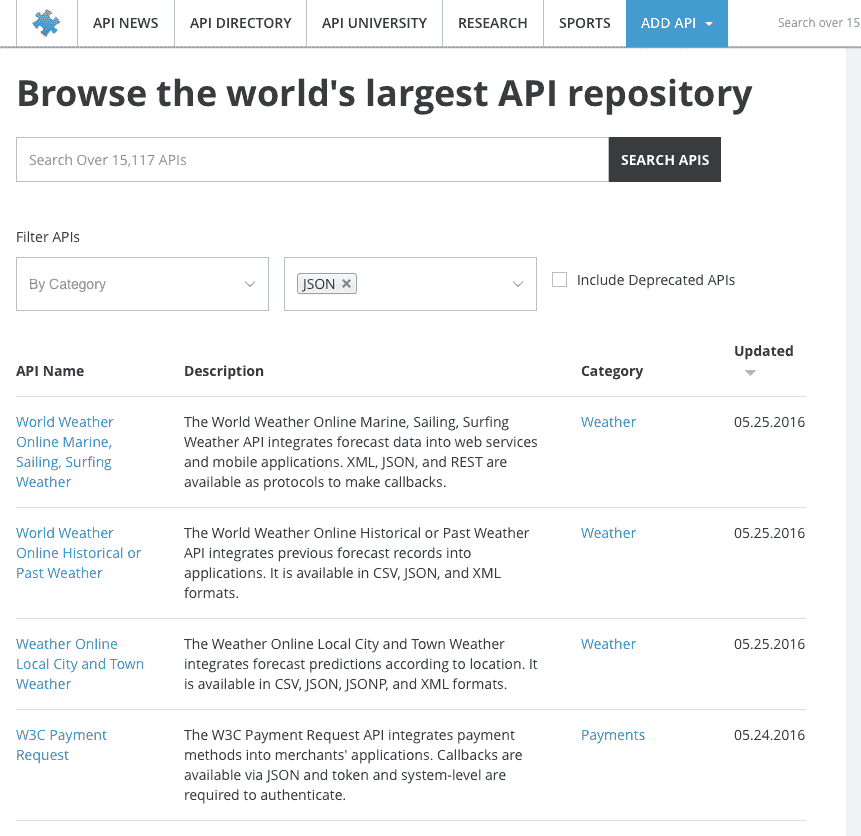
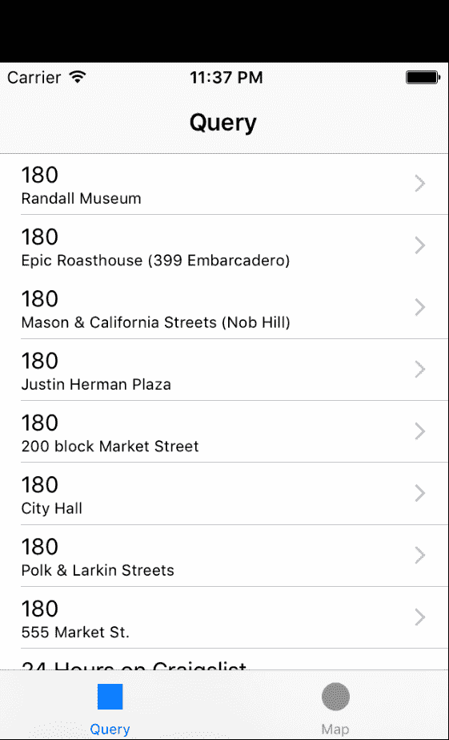
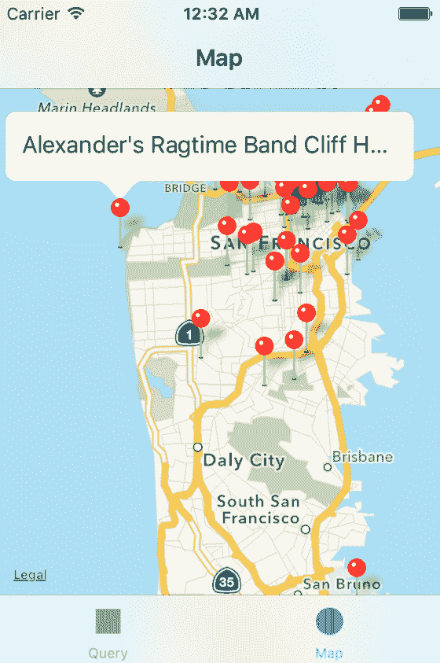
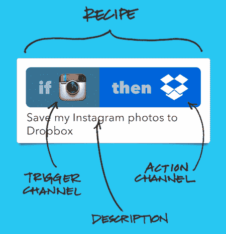
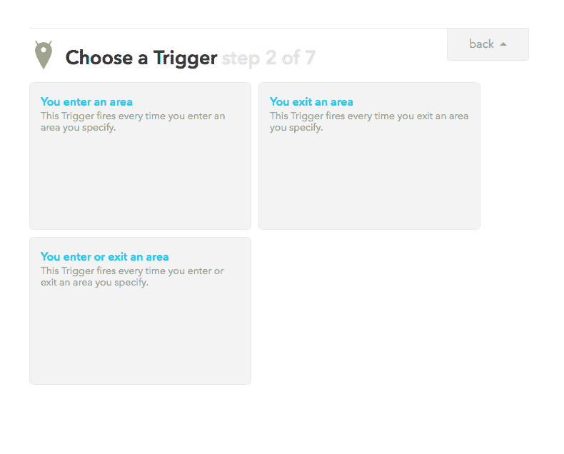
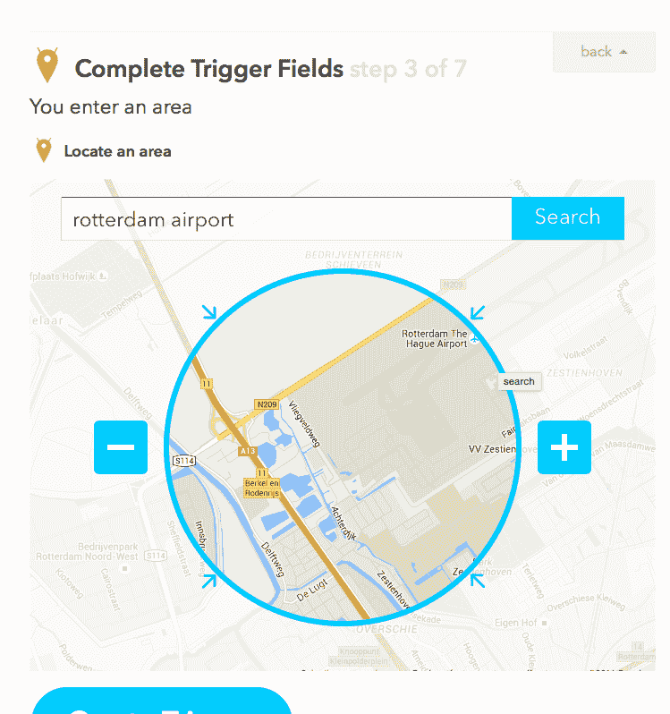
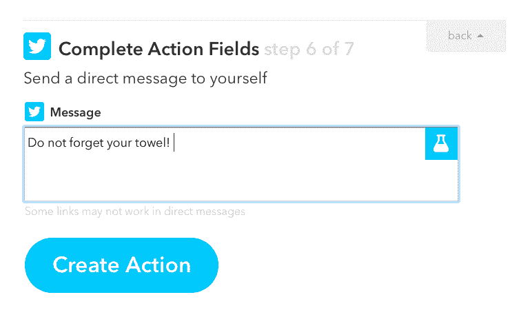

# 第十章：有相应的 API！

在本章中，我们将探讨通过构建一个混合应用来验证我们的假设我们能做些什么。这比仅仅创建一个简单的着陆页需要更多的努力，但比开发一个完整的应用程序所需的时间要少。通过结合应用程序或其他资源，你可以用最少的努力为你要解决的问题制定一个解决方案。这对于至少一个概念验证来说是一个有趣的方法。一旦你学到了你想要学习的课程，你总是可以设置一个更稳健的解决方案。另一方面，你的应用程序策略可能就是如此——结合资源，并将其作为你的产品或服务本身推出。这尤其适用于提供聚合信息的应用程序。或者，你也可以考虑需要与社交网络（如 Facebook、Twitter 或 YouTube）进行大量集成的应用程序。与完全自己建立用户基础相比，社交推荐总是更容易，因此将社交组件集成到你的应用程序中始终是一个明智的选择，但如果你用它创建了一个混合解决方案，那就更有趣了。

你可以结合各种应用程序和服务，但还有其他可能产生非常有趣的混合解决方案的东西。几乎关于任何事情都有数据，其中大部分数据已经通过各种 API 公开提供。你可以使用这些数据，将其与其他数据相结合，并以不同的方式可视化结果。例如，你可以在谷歌地图上显示结果，而不是在列表中显示。最受欢迎的混合应用正是这样做的。它们以不同的方式可视化现有数据。

在本章中，我们将涵盖以下主题：

+   调查混合应用如何帮助我们验证假设

+   查看一些流行的混合应用

+   调查可用的 API 和移动 SDK

+   通过构建移动混合解决方案来验证我们的假设

+   使用 IFTT 食谱来验证我们的假设

# 快速成功或失败

混合应用允许你快速成功或失败。如果你失败了，你可以在早期阶段重新表述你的假设。使用你获得的反馈，你可以构建一个更好的应用程序，并找出人们真正想要的应用程序需要什么。

事实上，通过使用第三方 API 或 SDK，你可以依赖比你的平台更大的平台，并且由于它是经过验证的技术，因此它更不容易出错。例如，如果你想集成除应用内购买之外的其他支付方式，你当然会使用支付提供商的现有解决方案。

你可以通过提供单一登录功能来利用社交网络，为你的应用程序。例如，你可以提供一个用户使用 Facebook 或登录账户注册或登录的方式。这降低了注册门槛，从而提高了注册转化率。用户需要采取的行动更少，你也能获取到额外的数据，如姓名和头像。注册后，这将为应用程序带来更加个性化的体验。我们将在第十一章 Onboarding and Registration 中详细阐述这个过程，关于新用户注册的过程。

# 混搭解决方案中有什么？

现在，让我们更深入地了解一下混搭。混搭究竟是什么，这种现象是如何产生的？一般来说，混搭会从一个或多个来源消费特定的数据，具有不同的展示方式，并提供额外的逻辑。

混搭通常是由消费可重用数据、特定的复杂功能、展示和一些新的逻辑组合而成的。它不一定需要所有这些元素。混搭可能是一个从多个来源收集和合并数据的解决方案。通过 API，任何人都可以消费各种类型的数据集。你应用程序的附加价值可能仅仅是聚合数据的结果。例如，想象一个应用程序，它显示了所有可用的职位，否则你可能需要访问 10 多个不同的网站。数据挖掘和其他技术可以帮助你进一步丰富数据。

混搭还可以利用 API 执行复杂功能（数据处理和支付处理），或者它们可以被用来外包非数字世界中的各种任务。这可能包括按需 3D 打印、商品交付或执行由人类完成的小任务。Amazon 的 Mechanical Turk API 就是这样一个很好的例子。通过这个 API，你可以将小任务分配给其他人。你可以想象写评论、验证或审查用户输入，或进行研究。有大量的 SaaS 解决方案可用，其中大多数都带有**应用程序编程接口**（**API**）。所有这些 API 可以结合起来创造新的东西。它们允许开发者更快地测试他们的假设。

# 发布一个 API

另一方面，如果你有一些可以分享的（丰富）数据，你也可以自己提供一个 API。如果这些数据可以被他人利用来构建新的东西，你可能想要将 API 视为一种可以收费的服务。如果你的 API 提供了真正的价值，那么你很可能从中获得利润。它可能有一个有趣且可持续的盈利模式。

由于可能很难以传统方式使你的应用盈利，考虑发布与你的应用或应用生态系统相关的 API 可能是一个有趣的想法。许多公司，如 SalesForce 或 Expedia，已经从 API 订阅中获得了大部分收入，所以这是一个值得探索的有趣途径。

# 乐高还是得宝？

如果你将混合体解决方案与从头开始创建的解决方案进行比较，那就像比较得宝与乐高。如果你使用第三方解决方案，那么你的应用开发将更快、更智能，可能也更便宜。小型且可重用的微服务可以轻松组装成更大、更复杂的应用。显然，玩乐高更有趣，但使用得宝可以更快地搭建一座塔。

你不必深入所有各种技术挑战，你可以专注于最重要的事情。实现将产生你解决方案**独特价值主张**（**UVP**）的功能。

有许多不同类型的混合体。想想看，有消费者混合体、商业混合体、数据混合体和逻辑混合体。你需要特定的数据吗？你想提供航班或假期吗？你需要支付解决方案吗？或者，你需要发送大量短信、调暗灯光，或者想要外包任务？猜猜看？为此有一个 API！

# API 与 SDK 的比较

API 是接口，通常作为 REST 服务提供。**软件开发套件**（**SDK**）专门用于在特定平台（如 iOS 或 Android）上实现 API。这将使集成过程更加顺畅。我们已经在第四章，“敏捷工作流程概述”中看到了一个例子，我们查看了一个使用 Firebase 的 Android 应用。在那个例子中，你可能注意到了 Firebase 的 Gradle 依赖项。这是一个对 Android SDK 的引用，它将负责与 Firebase API 的通信。API 本身允许你执行所有操作，但 SDK 将为你节省大量时间。

# 依赖项管理

API 和 SDK 的本质是它们将经常更新。因此，一个智能的依赖管理计划很重要。你不想每次 SDK 发布新版本时，都要更新模块或更新应用中的所有代码。

# Android

对于 Android，你应该使用外部 Gradle 依赖项，而不是将库模块添加到你的项目中。如果你使用 Android Studio，那么你就可以立即开始使用 Gradle。你将在项目中的应用文件夹中的`build.gradle`文件中找到你应用的依赖项列表。依赖项部分看起来可能如下所示：

```java
dependencies { 
... 
    compile 'com.android.support:recyclerview-v7:23.1.1' 
    compile 'com.android.support:cardview-v7:23.1.1' 
    compile 'com.squareup.retrofit:retrofit:2.0.0-beta3' 
    compile 'com.squareup.picasso:picasso:2.5.2' 
    compile 'com.squareup.retrofit:converter-gson:2.0.0-beta2' 
    compile 'com.squareup.okhttp:okhttp:2.4.0' 
    compile 'net.hockeyapp.android:HockeySDK:3.6.2' 
} 
```

如此例所示，Retrofit、HockeyApp 以及一些其他依赖项在此处被定义。你可能已经熟悉它们。例如，Retrofit 和 Gson 转换器是用于通过 HTTP 消费数据并将结果反序列化为对象的解决方案。虽然依赖项也可以指本地库，但强烈建议使用前面所示的方式使用依赖项。有关 Gradle 的更多信息，请访问[`gradle.org`](http://gradle.org)。

# iOS

对于 iOS（以及许多其他语言和 IDE），你也可以使用 Gradle。如果你在 Android 和 iOS 平台上工作，并且希望使用相同的工具通过构建服务器（如 TeamCity 或 Jenkins）构建你的应用程序，这将特别有趣和有价值。关于这一点，请参阅第十八章，*持续集成、交付和部署*，关于持续交付的更多信息。

另一个广为人知的解决方案，但仅适用于 iOS 开发，是 CocoaPods。它是一个用于 iOS 项目（Objective C 或 Swift）的依赖管理器。它通过创建一个工作区来管理第三方库，该工作区除了包含您自己的项目外，还将包含一个 CocoaPods 项目，我们的依赖将驻留其中。

`pod`文件包含依赖项列表，其外观如下：

```java
platform :ios, '8.0' 
use_frameworks! 
target 'example-project' do 
    pod 'ZXingObjC', '~>3.0' 
    pod 'JSONJoy-Swift', '~> 1.0.0' 
    pod 'SwiftHTTP', '~> 1.0.0' 
end 
```

如此例所示，`pod`文件在众多 pods 中，引用了`Zxing`库。这是一个创建和扫描条形码图像的完美解决方案。安装和配置`cocoapods`相当简单。你只需在你的终端应用程序中输入`gem install cocoapods`即可。接下来要做的事情是定义包含项目将使用的引用的`pod`文件。你需要执行`pod install`来实际获取依赖库。在终端应用程序中运行此命令将在`pod`文件中列出所有依赖项。我们将在构建 MVP 的段落中更详细地了解此过程：

```java
$ gem install cocoapods
$ pod install 
```

值得一提的是 Carthage。它是 CocoaPods 的替代方案，并且是第一个明确支持 Swift 的依赖管理器。CocoaPods 是用 Ruby 构建的，而 Carthage 是用 Swift 构建的。Carthage 似乎更加灵活，但使用起来也更复杂。

如需了解有关 CocoaPods 的更多信息，请访问[`cocoapods.org`](https://cocoapods.org)。如果你想知道更多关于 Carthage 以及 CocoaPods 和 Carthage 之间差异的信息，请查看[`github.com/Carthage/Carthage`](https://github.com/Carthage/Carthage)。

# 可用 API

可以通过（公开）API 收集关于许多不同主题和来自各种来源的数据。你可以在提供 SaaS 的许多公司的网站上找到它们，或者你可以检查提供几乎所有可用 API 的聚合列表的网站之一。

在[`www.programmableweb.com/`](https://www.programmableweb.com/)或[`mashable.com/`](http://mashable.com/)上，您将找到许多可以用于灵感的 API。您也会在那里找到许多混合解决方案。您会发现许多可以用于您的应用程序的 API。大多数 API 并非专门为移动应用程序设计，但只要数据可以以 JSON 或 XML 格式消费，这实际上并不是一个问题。在网站上，您可以搜索特定类别、特定数据类型，或者浏览最新的添加内容。正如您所看到的，跟踪天气总是一种有趣的数据来源，并且有许多应用程序使用这些数据。一个例子是应用程序 InstaWeather（见[`instaweather.me/`](http://instaweather.me/)）。在后面的段落中，我们将看到我们如何使用这些 API 来构建我们的 MVP：



您还可以在其他地方寻找 API 和混合解决方案的示例：

+   [`www.mashable.com`](http://www.mashable.com)

+   [`www.data.gov`](https://www.data.gov)

+   [`www.opendatanetwork.com`](http://www.opendatanetwork.com)

+   [`data.sfgov.org`](https://data.sfgov.org)

+   [`data.worldbank.org/developers`](http://data.worldbank.org/developers)

+   [`dev.socrata.com`](https://dev.socrata.com)

+   [`developer.nytimes.com`](http://developer.nytimes.com)

如果您知道一个没有 API 的数据源，那么您可以考虑一个替代方案，比如（网站）抓取。这是一种许多提供聚合内容（工作、房地产和保险）的网站所采用的方法。不过，网站抓取可能会很棘手。它可能会非常容易出错，但有时它是快速完成任务或获取特定数据的唯一方法。特别是对于您的第一次实验（MVP）来说，这是一个有趣的方法。

# 证明我们假设的 iOS 应用程序，MoviUber

到目前为止，我们已经讨论了理论。现在是时候构建我们的最小可行产品（MVP）了。这个 MVP 结合了来自各种来源的数据，以展示您如何能够快速创建一个有价值的应用程序。在本节中，我们将构建一个 iOS 应用程序，用于探索著名电影的地点。它将展示使用 API 和 SDK 来验证我们假设的概念。

# 假设

在没有首先定义我们的假设之前，我们无法开始。所有人都喜欢电影。有些人比其他人更喜欢。让我们假设电影狂热者喜欢去像旧金山这样的城市旅行，探索城市并参观著名电影拍摄过的地点。许多地点无法通过公共交通轻松到达。为了到达那里，他们必须使用 Uber。

因此，这个应用是关于在旧金山旅行并使用 Uber 参观电影热门地点的。它消耗数据，提供了对应数据的新的表示形式（也许是在地图上），并将现实生活中的服务，如 Uber，与之连接。也许我们甚至可以通过查找**互联网电影数据库**（**IMDB**）中的电影标题来稍微丰富一下数据。让我们把这个应用称为 MoviUber。对于这个应用，我们不会过多地阐述商业模式。我们只想弄清楚我们是否可以连接这些点。如果我们可以让这一切工作起来，那岂不是酷毙了？我们需要做什么才能让它发生？

# 通过客户访谈验证想法

我们首先需要知道创建这个混合解决方案是否有意义。也许你首先想给这个概念添加自己的特色，然后作为一个练习，尝试验证这个想法。看看你是否能找到一个既热爱电影又已经在使用 Uber 的人。

向他或她介绍这个概念，并询问他或她对它的看法。只问开放式问题。如果你问朋友，“你认为这会是一个极好的主意吗？”，你很可能会得到一个肯定的回答。虽然听起来很令人高兴，但这并不能帮助你验证这个想法。

不管怎样，如果他或她对这个概念非常热情，那么可能会有一些新的想法或功能出现，或者你可能得到一些关于为什么这个整个应用想法实际上是一个非常糟糕的计划的大洞察。你永远不知道。

由于本章专门讨论创建混合解决方案，我们将假设这个想法已经得到了充分的验证。这是一个绝妙的计划，我们通过客户访谈收集到了积极的反馈。让我们构建一个应用。

# 让我们构建一个应用

要开始，让我们定义我们的 MVP（最小可行产品）的组成部分。如下所示：

+   电影地点（当然），以列表形式展示，可以浏览所有电影和地点。

+   一个 Uber 按钮，用来叫车到那里。

+   IMDB 是一个可选的组成部分，但拥有它会很不错。我们可以用它来显示关于特定电影的额外信息。

+   如果用户想要从一个地点去另一个地点，地图将是一个很棒的功能，可以用来规划路线。

# 电影地点

使用由 Socrata 提供的旧金山数据 API，我们可以获取旧金山的电影地点。为了获得一些印象，你可以浏览这个位置的数据集：[`data.sfgov.org/Culture-and-Recreation/Film-Locations-in-San-Francisco/yitu-d5am`](https://data.sfgov.org/Culture-and-Recreation/Film-Locations-in-San-Francisco/yitu-d5am)。你想去莎朗·斯通去过的地方？你可以在这个数据集中查找。

但与其在这里下载数据集，不如通过 API 访问数据更方便。这里可以找到这样的东西：[`dev.socrata.com/foundry/data.sfgov.org/wwmu-gmzc`](https://dev.socrata.com/foundry/data.sfgov.org/wwmu-gmzc)。经过一番研究，发现甚至还有一个 SDK。这更好。Soda-Swift 是一个本地的 Swift 库，可以访问 Socrata 开放数据服务器。你可以在 GitHub 上找到它：[`github.com/socrata/soda-swift`](https://github.com/socrata/soda-swift)。

# Uber

Uber 为各种平台提供 API 和 SDK，包括 iOS Swift 库，可在 GitHub 上找到。查看[`github.com/uber/rides-ios-sdk`](https://github.com/uber/rides-ios-sdk) 。API 的描述在[`developer.uber.com/docs/tutorials-rides-api`](https://developer.uber.com/docs/tutorials-rides-api)。

# IMDB

目前似乎还没有 IMDb API，但有一个 OMDb API。这是一个免费的在线服务，用于获取电影信息。你可以在[`www.omdbapi.com`](http://www.omdbapi.com)找到它。

最后，对于我们将要使用的地图，我们将使用 Apple 地图。为此，你只需要 MapKit 框架。太棒了。我们接下来需要做什么？

对于这个，我们将下载 SDK。同时，我们还将从[`github.com/socrata/soda-swift`](https://github.com/socrata/soda-swift)下载 Socrata 示例应用。我们将使用这个示例应用来构建我们的最小可行产品（MVP）。我们将修改一些东西，比如数据令牌和数据集。要获取令牌，你首先需要在 Socrata 上有一个开发者账户。你可以在[`dev.socrata.com`](https://dev.socrata.com/foundry/data.sfgov.org/wwmu-gmzc)免费注册。接下来，你需要在他们的网站上创建一个应用。在 Xcode 中打开 Socrata-Swift 项目，然后从 SODASample 项目打开 QueryViewController。修改客户端的域名和令牌：

```java
let client = SODAClient(domain: "data.sfgov.org", token: "<your token>") 
```

在`refesh`方法中，你需要修改查询的数据集，并将排序字段改为`title`：

```java
func refresh (sender: AnyObject!) { 
...         
        let cngQuery = client.queryDataset("wwmu-gmzc")         
        cngQuery.orderAscending("title").get { res in 
            switch res { 
            case .Dataset (let data): 
                self.data = data 
... 
        } 
    } 
```

在`cellForRowAtIndexPath`函数中，将项目的字段改为`title`和`locations`，如下面的代码所示：

```java
  override func tableView(tableView: UITableView, cellForRowAtIndexPath indexPath: NSIndexPath) ->   
    UITableViewCell { 

        let c = tableView.dequeueReusableCellWithIdentifier(cellId) as UITableViewCell! 

        let item = data[indexPath.row] 
        let name = item["title"]! as! String         
        c.textLabel?.text = name 

        if (item["locations"] != nil){ 
            let street = item["locations"]! as! String 
            c.detailTextLabel?.text = street 
        }  
        return c 
    } 
```

现在，当你运行应用时，它将在第一个标签页上显示一个漂亮的电影和位置列表。为了在第二个标签页上的地图上显示它们，我们需要做一些额外的工作：



# 在地图上显示位置

要在地图上以标记点的方式显示位置，我们需要经度和纬度值，但不幸的是，我们只有（模糊的）地址描述。我们需要将地址转换为实际位置。为此，你需要打开 MapViewController，找到我们将要修改的`updateWithData`函数，我们将使用`CLGeocoder`来修改它。这个类非常擅长将地址转换为具有经纬度值的实际位置。

对于每个位置，我们将确定特定地址的经纬度值。一旦我们找到了这些或给定位置的 placemark，我们将为它创建一个标记点并将其添加到地图上。最后，我们将用户导航到地图上的旧金山，这样我们就可以实际看到标记点。

代码将看起来像这样：

```java
func updateWithData(data: [[String: AnyObject]]!, animated: Bool) {         
    self.data = data         
     if (!isViewLoaded()) { 
       return 
     } 

     if mapView.annotations.count > 0 { 
       let ex = mapView.annotations 
       mapView.removeAnnotations(ex) 
     } 

     var anns : [MKAnnotation] = [] 
     for item in data { 
        var location = item["locations"]  as? String 
        if (location != nil){  
           location  = location! + " San Fransisco, CA" 
           print(location)  
           let geocoder:CLGeocoder = CLGeocoder(); 
           geocoder.geocodeAddressString(location!) { (placemarks:       
             [CLPlacemark]?, error: NSError?) -> Void in 

           print(placemarks?.count)  
           if placemarks?.count > 0 { 
           let topResult:CLPlacemark = placemarks![0]; 
           let placemark: MKPlacemark = MKPlacemark(placemark:  
             topResult); 

           let a = MKPointAnnotation() 
           a.coordinate = placemark.coordinate; 
           a.title = item["title"] as! NSString as String 
           a.title = a.title! + " " + (item["locations"] as!  
             NSString as String) 
           anns.append(a);  

           if (error == nil && a.coordinate.latitude != 0 &&       
             a.coordinate.longitude != 0){ 
                self.mapView.addAnnotation(a); 
           } 

    } 
  }                 
        let w = 1.0  
        let r = MKCoordinateRegionMakeWithDistance(       
          CLLocationCoordinate2D(latitude: 37.79666680533*w,  
          longitude: -122.39826411049*w), 40000, 40000) 
        self.mapView.setRegion(r, animated: false) 
    } 
} 
```

这就是地图将看起来像什么：



# Uber 集成

我们现在有一个带有标记点的地图。我们可以从 Uber 功能的集成开始。我们将保持简单，只在我们的应用中显示一个 Uber 行程请求按钮。

在[`developer.uber.com`](https://developer.uber.com)创建一个新的应用。如果您还没有这样做，请先登录或注册 Uber：


为您的应用提供一个名称和描述，并保存更改。它将揭示您在应用中实现 Uber 功能所需的客户端 ID。您可以在 GitHub 上找到 Uber Swift SDK [`github.com/uber/rides-ios-sdk`](https://github.com/uber/rides-ios-sdk)，但您也可以使用 CocoaPods 将其包含到您的应用中，这是推荐的方式将 Uber 功能集成到您的应用中。

如果您之前没有这样做，请先安装 CocoaPods：

```java
$ gem install cocoapods
```

在控制台应用中，转到 Soda Swift 项目所在的文件夹。要创建一个新的`pod`文件，请输入以下内容：

```java
$ pod init  
```

打开为您创建和修改的`pod`文件，这样它就会将 UberRides 项目加载到我们的工作区中：

```java
    use_frameworks!
    target 'SODAKit' do
    end
    target 'SODATests' do
    end
    target 'SODASample' do
       pod 'UberRides'
    end

```

接下来，使用以下命令安装依赖项：

```java
$ pod install
```

通过右键单击文件并选择“以源代码方式打开”来修改`info.plist`内容。将以下键值对添加到字典中，并添加您在 Uber 开发者网站上可以找到的 Uber 客户端 ID：

```java
<key>UberClientID</key> 
    <string>your uber client id</string> 
    <key>UberCallbackURI</key> 
    <string></string> 
    <key>LSApplicationQueriesSchemes</key> 
    <array> 
        <string>uber</string> 
    </array> 
```

以一种方式修改`AppDelegate`文件，使其使用 Uber 的沙盒模式进行测试。每次测试应用时，在您的位置被接走可能有些不便。在`didFinishLaunchWithOptions`函数中导入`UberRides`并启用沙盒模式：

```java
import UIKit 
import UberRides 

@UIApplicationMain 
class AppDelegate: UIResponder, UIApplicationDelegate { 

  var window: UIWindow?  

  func application(application: UIApplication,    
   didFinishLaunchingWithOptions launchOptions: [NSObject:  
    AnyObject]?) -> Bool { 

     // If true, all requests will hit the sandbox     
     Configuration.setSandboxEnabled(true)         
     return true 
   } 
```

在 QueryViewController 中，在 UIKit 导入的下方添加对`MapKit`和`UberRides`的新导入：

```java
import MapKit 
import UberRides 
import CoreLocation 
```

我们需要稍微修改一下`didSelectRowAtIndexPath`函数。如果用户点击任何一行，将显示一个按钮，可以点击以启动行程。代码和 UI 都需要一些美化，但这超出了 MVP 的范围。为此，将检索选中项的经纬度值，这次是为了告诉 Uber 用户想去哪里（下车地点）。我们没有指定接车地点。默认情况下，Uber SDK 将使用用户的当前位置。这可能并不总是足够准确，但对于 MVP 来说已经足够了。

Uber Rides SDK 会检查`CLLocationManager`中的`locationServicesEnabled()`的值，它必须是 true 才能检索用户的当前位置：

```java
override func tableView(tableView: UITableView!,    
  didSelectRowAtIndexPath indexPath: NSIndexPath!) { 

  let item = data[indexPath.row] 
  var location = item["locations"]  as? String; 
  if (location != nil){ 

      location  = location! + " San Fransisco, CA" 
      let geocoder:CLGeocoder = CLGeocoder(); 

      geocoder.geocodeAddressString(location!) { (placemarks:     
       [CLPlacemark]?, error: NSError?) -> Void in 

        if placemarks?.count > 0 { 

          let topResult:CLPlacemark = placemarks![0]; 
          let placemark: MKPlacemark = MKPlacemark(placemark: 
           topResult); 

          if (error == nil && placemark.coordinate.latitude != 0 &&  
           placemark.coordinate.longitude != 0){ 

             let behavior = RideRequestViewRequestingBehavior(   
              presentingViewController: self) 

             let dropOffLocationlocation = CLLocation( 
              latitude: placemark.coordinate.latitude,  
              longitude: placemark.coordinate.longitude) 

             let parameters = RideParametersBuilder().  
               setDropoffLocation( dropOffLocationlocation).build() 

             let button = RideRequestButton(rideParameters:  
               parameters, requestingBehavior: behavior) 

             self.view.addSubview(button) 
           } 
        } 
     }         
} 
```

最后，所示的方法在视图中添加了一个 Uber 按钮。这包括用户当前所在的位置和他想去的位置的知识。这使得用户可以点击应用中的按钮来订购行程，并且它包含了 Uber 需要知道的所有知识。

# 丰富数据

最后，作为一个可选练习，如果您想丰富电影位置数据，您可以从 OMDb API 获取一些额外的电影信息和电影图片。由于我们知道电影的标题，我们可以在 API 上执行查询。格式良好的 JSON 响应告诉我们有关剧情、演员的信息，甚至还提供了 IMDb 图片的 URL。我们可以在应用中显示这些信息，以告知用户电影的内容。

要获取 API 密钥，请访问[`www.omdbapi.com`](http://www.omdbapi.com)并点击 API 密钥链接。如果您使用电子邮件地址注册，可以免费获得一个。您将收到一封包含您自己的 API 密钥和激活链接的电子邮件。激活后，您可以在请求中添加您的 API 密钥。[`www.omdbapi.com/?t=Basic+instinct&y=&plot=short&r=json&apikey=<api key>`](http://www.omdbapi.com/?t=Basic+instinct&y=&plot=short&r=json&apikey=%3Capi%20key%3E).

这个查询的响应看起来像这样：

```java
"Title":"Basic Instinct","Year":"1992","Rated":"R","Released":"20 Mar 1992","Runtime":"127 min","Genre":"Drama, Mystery, Thriller","Director":"Paul Verhoeven","Writer":"Joe Eszterhas","Actors":"Michael Douglas, Sharon Stone, George Dzundza, Jeanne Tripplehorn","Plot":"A violent, suspended police detective investigates a brutal murder, in which a seductive woman could be involved.","Language":"English","Country":"France, USA","Awards":"Nominated for 2 Oscars. Another 5 wins & 18 nominations.","Poster":"http://ia.media-imdb.com/images/M/MV5BMTcxMjY2NzcyMV5BMl5BanBnXkFtZTYwMjAxNTQ5._V1_SX300.jpg","Metascore":"41","imdbRating":"6.9","imdbVotes":"131,796","  
```

通过捆绑来自多个数据集的数据，通过以不同的方式显示它们（在移动设备上的列表和地图上），以及通过添加 Uber 功能使从一个地点到另一个地点的旅行更加方便，我们创建了一个真正酷炫的 iOS 混合应用。要查看这可能走向何方，包括 OMDb 数据集成，您可以下载并检查 Packt 的完整应用代码。

我们不得不进行一些编码来构建这个 MVP。你可能想知道是否有不通过编码就能证明事物的方法。确实有。我们这里不讨论用户访谈或分析指标。我们也可以使用**If This Then That**（**IFTT**）来构建 MVP。它允许我们自动化简单但往往有趣的任务。

# 看！没有代码。用 IFTT 证明你的假设

如 IFTT 之类的服务为 API 的可能性添加了一个逻辑组件。如果特定数据源（通道）发生某些事情，那么需要执行其他操作。这对于**物联网**（**IoT**）相关概念尤其有效，但您可以连接几乎任何您喜欢的服务。您可以亲自检查[`iftt.com/?reqp=1&reqr=`](http://iftt.com/?reqp=1&reqr=)。

使用 IFTT 需要很少或不需要编程，使其成为自动化小任务（所谓的食谱）的完美环境。它还可以在您实际构建事物之前帮助您验证您的假设。让我们试试。如果您还没有注册 IFTT，请在继续之前注册。我们想证明我们的假设，为了简单起见，这缩小到以下内容：


用户希望被提醒把毛巾放进包里。这在#towel day（5 月 25 日）尤其重要，但当他们去机场时也同样重要，因为 UFO 可以轻易降落。如果你想让他们接你，就挥舞你的毛巾。

嘿，你刚才读了什么？如果你认为这是一个蹩脚的例子，或者它对你来说没有意义，我建议你先读一读《银河系漫游指南》。你也可以在[`www.towelday.org`](http://www.towelday.org)上查看。无论如何，让我们来探讨 IFTT 是什么以及我们如何使用它来验证这个假设：



# 食谱、通道和触发器

创建一个新的食谱很简单。对于我们的 MVP，用户位置将是触发器。在这个例子中，我们将使用 IFTT 安卓应用程序。

我们选择 Android 位置作为通道，并选择“你进入一个区域”作为触发器：



接下来，你需要定义特定的位置，即最近的机场。在我的例子中，是鹿特丹机场：



无论何时用户进入这个区域，我们都希望得到通知。让我们使用 Twitter 作为通道发送关于这个事件的短信。每当这个事件发生时，我们都会从 Twitter 收到一条直接消息：



我们就完成了。如果你自己或其他人分享这个食谱，技术上它就可以工作。设置这样的事情来帮助验证你的假设真是太简单了。如果你已经完成了验证过程，你总是可以构建一个能够执行相同任务的真实应用程序。

你可以想到很多其他的食谱。例如，如果你有一个智能恒温器，你可以降低温度，因为你已经在机场了。或者，你可以看看这个食谱；例如，“当你降落时发送电子邮件”在`https://ifttt.com/recipes/134835-send-an-email-when-you-land`。无需额外努力，你的亲人就会知道你安全了。

# 摘要

在本章中，我们看到了 API 和混合如何帮助我们验证假设。只需付出最小的努力，我们就可以创建一个 MVP。在我们之前，我们只能使用 API 来消费和组合数据，但现在我们也可以使用它们来外包任务。你可以想象图像识别、3D 打印、配送或由人类执行的任务。

我们看到了什么是混合解决方案以及存在哪些类型的混合。我们创建了一个 iOS MVP 应用程序，展示了结合多个 API 的想法。

最后，我们探讨了 IFTT 提供的服务，这取决于你的需求，可能是验证假设最快的方法，然后是构建实际应用程序。在 IFTT 上有大量的食谱可供使用，或者你可以创建自己的食谱。我们还讨论了集成来自社交网络（如 Facebook 和 Twitter）的 API 和 SDK 的好处。

在即将到来的章节中，我们将更深入地探讨社交网络的整合以及这如何特别影响入职流程。你将在下一章关于入职和注册流程的内容中了解更多相关信息。
