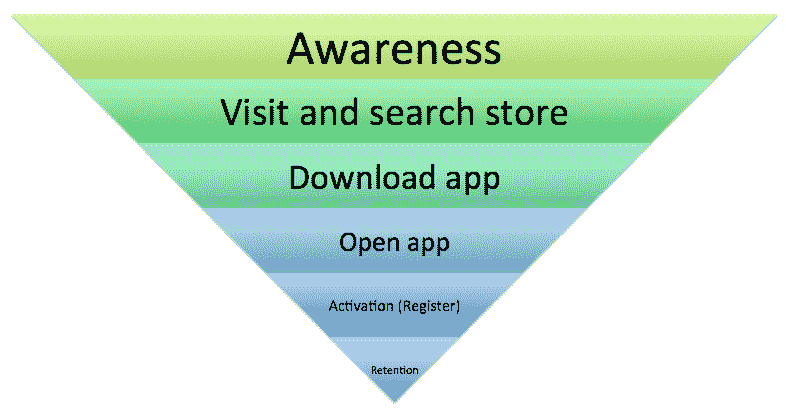
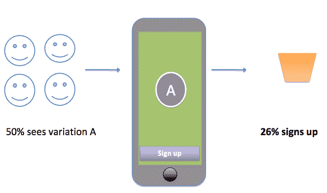
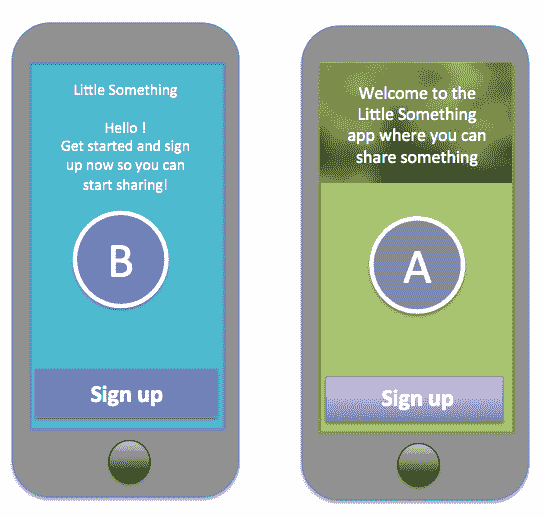
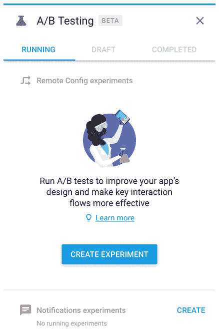
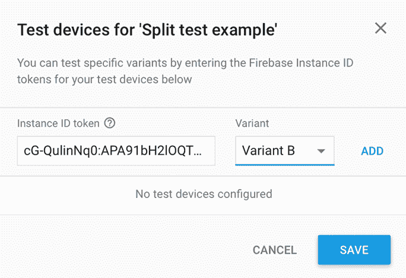

# 第十四章：对你的应用进行 A/B 测试

所有成功的应用开发者都会从他们从用户那里获得的反馈中学习。他们会进行调查，并确定是否需要改进、删除或添加功能，以更好地支持用户的操作流程。在本章中，我们将探讨如果我们不能亲自询问他们，我们可以使用哪些工具来获取用户的反馈。构建一个解决客户问题的应用需要多次测试和优化。分割测试（或 A/B 测试）是一个持续的过程，可以帮助你找到将导致最高转换率的操作流程。使用分割测试，例如，你可以找到最适合你应用的注册流程。在第十章“有 API 可以做到！”，我们看到了一些关于如何改进用户入门流程的好建议。现在你也可以进行一些实验，并衡量什么最适合你的应用。它还可以就其他主题提供反馈，例如用户留存、参与度或应用内购买。我们将看到为什么获取统计数据很重要，以及我们可以从中学习到什么。

作为实用主义者，我们将探讨我们可以用于此目的的工具。我们将快速了解 Firebase、远程配置和分析如何为我们工作。分割测试是一种你可以在任何时候使用的方法，即使你的应用已经在商店中。最后，我们将看到我们可以为分割测试我们的应用或 Play 商店列表做些什么。

具体来说，在本章中，我们将涵盖以下主题：

+   看看为什么统计数据很重要

+   学习什么是可操作的指标

+   了解分割测试是什么以及它如何帮助我们改进我们的应用

+   调查我们可以使用的测试工具

+   了解如何使用 Firebase 远程配置和 Firebase 分析

# 统计数据为什么重要？

没有统计学，你将几乎没有反馈。你将无法看到你本可以从用户及其行为中获得的所有洞察。不要在没有实现获取分析数据所需功能的情况下发布你的应用：


通常，统计学可以告诉我们以下信息：

+   用户获取性能

+   用户行为和转化

+   用户人口统计信息

+   按细分市场或队列的用户行为

+   财务洞察

因此，正确的统计数据可以告诉我们关于应用使用情况的一些信息。它回答了诸如：应用做得怎么样，"做得好"究竟意味着什么？这是关于下载量吗？活跃用户数？每日新增用户数？不仅要有统计数据，还要有可操作的指标。收集大量数据很容易。确定哪些数字真正重要则更困难。不要被数字淹没。确定你的业务目标，这样你就知道要衡量什么。拥有具体的数字很重要，这样你就可以通过做正确的事情立即采取行动。

# 关于可操作指标

在第十章“有 API 可以做到！”，我们已经预览了转换和指标的概念。收集关于你移动应用使用的统计数据很重要，因为这通常是获取用户反馈的唯一方式。如果我们想了解关于这种反馈的某些信息，重要的是要认识到你获得的统计数据的质量比数量更重要。虽然收集尽可能多的数据可能很有吸引力，但实际上情况正好相反。关注真正重要的事情。可操作指标是我们想要的。Ash Maurya 在他的书籍《Running Lean and Scaling Lean》中讨论了这一点。他声称用户增长比你的总用户群更重要，他在这一点上确实有道理。

获取和参与度是重要的指标类别。获取数量告诉你有关你的应用下载量、新用户数量和活跃用户数量的信息。参与度是关于你的用户多久打开一次你的应用（并且继续使用它），留存率和流失率（放弃你的应用的用户）。了解有多少下载了你的应用的用户会坚持使用你的应用是很感兴趣的？他们在一周或一个月后还会使用你的应用吗？其他重要的指标包括客户终身价值和关键漏斗行为，但让我们先从获取和参与度开始。

# 获取

在用户下载你的应用之前，他们需要意识到它的存在。你需要在社交媒体上、在你的网站上，或者以其他方式推广它。否则，人们怎么知道它的存在，你的应用真的很棒呢？每天获取新用户很重要，否则你的活跃用户数量会下降。不管你的应用有多酷，它对某些人来说可能不起作用。这不必成为一个问题。只要获取的数量高于流失率，你的应用就会增长。

# 参与

用户参与度指标都是关于你应用的粘性。人们花越来越多的时间在移动设备上，这对你的应用来说当然是个好事。但人们的注意力跨度也只有金鱼那么大，所以移动应用的平均流失率（不再使用你的应用的用户）通常更高。

你可能想知道用户在会话期间或特定时间段内花了多少时间在应用上。会话是任何类型的交互，直到用户的注意力被其他事情打断，比如 incoming phone call。为了提高你应用的留存率，你应该经常提醒用户关于应用，或者你应该提供让他们定期访问应用的好理由。电子邮件和推送通知可以用来再次吸引用户的注意力，从而保持应用意识。

保留率是指在一定时间后（比如 2 个月或更长时间）仍然活跃的用户数量。流失率是指在同一时间段后不再使用您应用的用户。为了增长，保留率需要高于流失率。要做到这一点，您的应用需要不断通过提供相关内容、激励措施和新或改进的功能来创造价值。简而言之，您需要不断地给用户留下返回应用的理由。

每日或每周活跃用户是最有价值的，因为它们将是后来最容易转化的。参与度越高，应用对用户的价值就越大。他们可以通过推荐成为您应用的使者，或者通过点击广告或在应用内购买（收入）来为应用变现。

# 转化率和海盗度量法

如我们在第十章“有 API 就能做到！”中所见，海盗度量法是关于您应用用户的转化。在这里，转化步骤从获取到收入展示如下：


对于我们的应用来说，特别是这些步骤：**意识提升**、**访问和搜索商店**、**下载应用**、**打开应用**、**激活（注册）**，最后是**保留**。为了简化，目前这里不显示广告收入或应用内购买（收入）：



在每个步骤中，您都会失去一些用户。这是一个完全正常的现象，但您需要确保您不会在途中失去太多用户。比如说，有 1000 人通过在网站或 Twitter 上阅读有关您的应用的信息来了解其存在。其中 800 个点击链接查看应用在商店中的情况。

他们看到应用图标、一些截图、描述以及其他用户的反馈。大约 300 个用户想，“嗯，这不是我想要的。”因此，只有 500 个用户会下载应用。其中 100 个在下载过程中忘记了它（在回家的路上，其他事情吸引了他们的注意力：电话？WhatsApp 消息？）。最终，400 个用户会打开应用。他们看到一个带有明确行动号召的引导故事。应用要求他们使用 Facebook 或 Twitter 注册。可能 200 个会这样做。其余的用户打算稍后这样做（但他们可能也会忘记）。200 个用户开始探索应用，如果他们不经常被提醒应用，并且应用没有给他们足够的理由返回，他们将在几天内忘记它。一周后只有 50 个用户仍在使用应用，一个月后只有 25 个仍然活跃。

这是一个负面场景吗？根本不是。这对许多应用来说是一个非常现实的情况。如果你想区分一个失败的应用和一个成功的应用，那么你需要考虑这一点。此外，我们还没有讨论货币化部分。在第十七章货币化和定价策略中，我们将专门探讨这一部分。

幸运的是，我们有工具来提高转化率。了解确切的转化百分比非常重要。如果，在所有下载了应用的用户中，只有一小部分注册，那么你就知道你需要做些工作了。在你的用户注册过程中可能有一些阻止人们注册的因素。在那种特定情况下，你需要找出是否注册门槛太高，以及你可以做些什么来改变这一点。另一个例子是应用内购买的转化率。如果你注意到他们访问了可以购买此类产品的应用部分，但从未转化为客户（实际上购买了一些东西），这也是一个有趣的模式。那里可能需要改变一些东西。也许产品的附加价值不明确，或者定价水平可能太高。

# 了解你的受众

但是你需要改变什么？如果你只有少数几个测试用户，你可以直接给他们发短信询问。还有一些工具可以包括某种调查，但大多数人认为它们很烦人。如果你提供一些具体的激励措施（例如免费购买），可能会有所帮助。这些可以是数字激励措施，比如众所周知的徽章（游戏化）或现实生活中的激励措施。如果你对后者感兴趣，可以查看[`www.kiip.me/developers`](http://www.kiip.me/developers)上的 Kiip，那里有一些例子。他们有一个很棒的 SDK，你可以添加到你的应用中。例如，它允许你向完成其个人资料的用户提供一杯免费的咖啡。

如果你想知道你的应用用户是谁，你需要了解他们的一些额外信息，比如他们的位置以及他们对你应用的期望。了解他们的年龄、性别、他们使用的设备类型，以及他们在何时何地使用你的应用，也是非常有趣的。深入了解你的受众对于能够创建一个完全满足用户期望的应用至关重要。最终，这也将导致你应用更好的货币化。事实上，这就是为什么 Facebook 广告的转化率比 Google 广告要好的原因。Facebook 对其受众和每个个体的了解要多得多，因此广告可以更具体地定位，从而使广告的点击通过率（**CTR**）更高。我们将在第十四章增长用户粘性和提高留存率中了解更多关于用户粘性和留存率的内容。首先，让我们看看我们需要做什么来更多地了解我们应用的受众：


# 分割测试可以帮助我们改进我们的应用

A/B 测试，也称为分割测试，在最基本的形式上，归结为向不同类型的人随机展示两种不同的实现。一小部分人，比如 5%，会看到新功能 A，这可能像是一个新功能或新视图，而另外 5%会看到功能 B。其余的用户目前还看不到新功能。将证明最受欢迎的功能（根据转化率或其他目标）将完全实施并向应用的全部受众提供。

如果你想要找出什么最适合注册用户，你可以设置一个像这样的分割测试：



因此，测试受众中的 50%会看到变体 A，显示一个写着“注册”的按钮，这将导致 26%的访问用户注册。其余的 74%可能会想“嗯，这不是为我准备的”，或者决定稍后注册：他们可能很快就会忘记这件事。那么测试受众中的另外 50%会发生什么呢？他们会看到变体 B。它显示一个“开始！”按钮。如果我们看看这个变体，我们会看到 63%的受众决定注册：


理论上，这证明了变体 B 应该是应该实施的一个，因为它导致了最高的转化率。但现实情况有所不同。如果我们对我们的受众知之甚少，上述结论可能是正确的，但如果我们对受众了解得更多，我们可能不会仅仅根据表面价值接受结果，并可能考虑其他问题。看到变体 A 的受众与看到变体 B 的受众是否可以比较？可能存在特定的客户群体，他们可能更偏好某个功能而不是另一个。

如果我们只是进行随机测试，我们将永远无法得知结果。如前所述，只有当我们知道我们的受众和他们想要什么时，我们才能提高我们应用货币化的成功率。第一步是了解我们的受众（通过收集用户数据），第二步是在进行 A/B 测试时考虑这些知识。如果我们能够选择我们的目标受众并看到对他们最有效的方法会怎样？有一些工具可以帮助我们进行更复杂的分割测试。我们将在下一节中探讨它们。

# 保持变体之间的差异微妙

在我们的例子中，A 和 B 之间的差异非常微妙，这是有原因的。如果两个变体之间的差异太大，你将不知道你在测试什么：



上述内容是一个很好的例子，说明了不应该做什么。如果你的用户引导拆分测试显示变体 A 导致 61% 的转换率，而变体 B 导致 66% 的转换率，那么结果证明了什么？不仅转换率之间的差异并不令人信服，而且也不清楚是什么导致了略微更好的转换。是背景颜色起了作用吗？还是文本（行动号召）？或者可能是注册按钮的颜色？我们永远不知道。这个测试有太多的参数。

考虑测试的目标是什么。你的假设是什么，你将如何通过拆分测试来证明它？一次测试一个元素，这样你知道是什么变化导致了转换率的提高。运行多个拆分测试，因为通常一个测试不会提供足够的信息来完全理解什么最有效。记住，重要的是你的用户会做什么，而不是你认为他们会做什么。你最好尽早找出这一点。

你还应该考虑可能影响你的测试的事件。在假期或特定事件期间进行测试可能会有不同的结果。此外，不同星期的不同日子转换率可能不同。出于这些原因，始终确保你至少运行了为期几周的测试。

# 拆分测试和获取可操作指标的工具

从技术角度来看，进行网页拆分测试实验相对容易。另一方面，移动优化实验则更难完成。Play Store 或 App Store 是造成这种情况的最重要原因。浏览器总是连接的，但应用程序存在于一个不一定总是连接的设备上。

尽管移动应用程序拆分测试还没有像网站 A/B 测试那样成熟，但有许多工具可以帮助你测试用户。一旦你决定了你想测量的指标，你可以选择最方便的工具：


在众多工具中，你可以使用以下一些：

+   **Firebase**：它提供了许多选项，例如远程配置和分析。如果你结合这两个功能，Firebase 是拆分测试你应用程序的好选择。远程配置允许即时更新应用程序的外观。也许你已经在使用 Firebase 进行数据存储、实时数据共享或用于用户引导。

+   **Taplytics**：这是一个拆分测试工具，你可以用它来做出不需要在 Play Store 或 App Store 中更新的更改。即使不更改代码，你也可以进行多次快速测试迭代，这使得它成为移动拆分测试目的中最合适的解决方案之一。

+   **Fabric**: Fabric SDK 附带了许多实用的工具，关于用户入门。这是一个使安装和维护 SDK 变得容易的平台，例如，包括 Optimizely。除了 Fabric 账户外，您还需要设置 Optimizely 账户。Optimizely 可以帮助轻松地将拆分测试集成到应用程序中。它是一个知名的测试工具，适用于 iOS 和 Android。正如 Firebase 和 Taplytics 的情况一样，运行 A/B 测试不需要 App Store 或 Play Store 更新。

其他有趣的工具包括 SplitForce、Flurry Analytics、Amazing A/B testing、Arise、Switchboard、Leanplum 和 Apptimize。它们都支持 iOS 和 Android。大多数都支持客户细分。此功能允许您为特定类型的受众运行测试。根据您的目标，您需要选择最适合您需求的工具。例如，我们将具体查看 Firebase 远程配置和 Firebase 分析，以了解这是如何工作的。

# 使用 Firebase 进行拆分测试

您可以使用 Firebase 对您的 Android 或 iOS 应用程序进行拆分测试。有关如何为 Firebase 和远程配置设置教程的具体信息，请参阅[`firebase.google.com/docs/remote-config/`](https://firebase.google.com/docs/remote-config/)。

对于这个例子，我们将查看 Android 实现。从[`github.com/mikerworks/packt-lean-firebase-split-testing`](https://github.com/mikerworks/packt-lean-firebase-split-testing)下载示例项目。您在那里找到的 Android Kotlin 应用程序旨在演示您如何为应用程序的用户入门流程运行拆分测试。它使用 Firebase 远程配置和 Firebase 分析。

项目已使用 Android Studio 工具菜单中的 Firebase 选项设置。Firebase 助手可以帮助您为`Analytics`和`Remote Config`配置项目：


对于示例项目，它已经设置好了。在`app`文件夹内的`build.gradle`文件中，您将找到以下 Firebase 依赖项：

```java
dependencies {
 ...
   implementation "org.jetbrains.kotlin:kotlin-stdlib-jre7:$kotlin_version"
   implementation 'com.android.support:appcompat-v7:25.4.0'
   implementation 'com.android.support.constraint:constraint-layout:1.0.2'
   implementation 'com.google.firebase:firebase-config:11.6.0'
}
apply plugin: 'com.google.gms.google-services'
```

项目中的`google-services.json`文件应替换为您自己的文件。一旦您配置了应用程序，您就可以从 Firebase 下载它。（在项目概览中选择设置。）您可以使用 Firebase 助手来完成此操作，或者您可以直接访问 Firebase 的开发者控制台[`console.firebase.google.com`](https://console.firebase.google.com)：


如果您还没有 Firebase 账户，您需要先创建一个。在控制台中，您可以添加和配置您的项目：


在项目概览中，您可以进入增长部分并选择远程配置选项。如果您在右侧选择 A/B 测试，您可以确定您想要拆分测试的变体：



假设我们的示例项目是一个已经发布的应用程序。现在，让我们假设我们想要测试一个新的用户引导体验。通过点击“创建实验”按钮，我们可以测试哪种方式效果最佳。我们想要找出哪种变体能够带来最高的注册转化率。

有两个变体：变体 A 和变体 B。对照组将看到原始的应用程序；他们不会看到任何变化：


您可以为实验定义一个或多个参数。每个变体都有自己对这些参数的值。我们可以测试的事情，例如：注册按钮的背景颜色（蓝色或绿色）、注册文本或背景图片（草莓或橙子）。正如您所看到的，您可以设置多个参数，但最佳实践是限制它们为两个或三个。

您可以为您的拆分测试定义一个用户细分。在这个例子中，我们将仅针对 5%的用户基础以保持简单。还有更复杂的细分选项也可用。例如，您可以针对特定国家或 18 至 36 岁的用户。如果您收集了关于用户的大量信息，您可以创建非常具体的细分。


应用程序可以读取您在这里定义的任何值。默认值可以在项目中的`remote_config_defaults.xml`文件（在`res/xml`文件夹中）找到。我们需要它们以确保在无法检索远程配置值（例如没有互联网连接）的情况下，应用程序可以正常工作。

在 MainActivity 应用程序中，您可以查看如何操作。在这里初始化了 Firebase 远程配置和分析。为调试变体启用了开发者模式。这将确保没有数据缓存，这允许我们首先测试变体。

我们还告诉`firebaseRemoteConfig`实例，它应该使用`remote_config_defaults.xml`文件中的变量作为后备选项：

```java
val firebaseRemoteConfig = FirebaseRemoteConfig.getInstance()
var firebaseAnalytics: FirebaseAnalytics? = null
override fun onCreate(savedInstanceState: Bundle?) {
 ...
   val configSettings = FirebaseRemoteConfigSettings.Builder()
           .setDeveloperModeEnabled(BuildConfig.DEBUG)
           .build()
   firebaseAnalytics = FirebaseAnalytics.getInstance(this)
   firebaseRemoteConfig.setConfigSettings(configSettings)
   firebaseRemoteConfig.setDefaults(R.xml.remote_config_defaults)
   val token = FirebaseInstanceId.getInstance().getToken()
   Log.i(javaClass.simpleName, "token = ${token}")
   val cacheExpiration = 1L
   Log.i(javaClass.simpleName,"fetch")
firebaseRemoteConfig.fetch(cacheExpiration).addOnCompleteListener(this)
}
```

最后，我们记录设备令牌。稍后，我们需要这个令牌来测试测试设备上的特定变体。在这个代码片段的末尾，我们获取数据并监听结果。

如果所有参数和值都已检索，我们告诉`firebaseRemoteConfig`对象应用这些值。对`applyRemoteConfiguration`方法的调用确保 UI 将更新：

```java
override fun onComplete(task: Task<Void>) {
   if (task.*isSuccessful*){
       Log.i(*javaClass*.*simpleName*, "complete success")
       firebaseRemoteConfig.activateFetched()
   }
   else{
       Log.i(*javaClass*.*simpleName*, "complete no success")
   }
   applyRemoteConfiguration()
}
```

在这里，我们设置了适用于当前变体的所有颜色和文本：

```java
private fun applyRemoteConfiguration(){
   val variant = firebaseRemoteConfig.getString("experiment_variant")
   Log.i(javaClass.simpleName, "experiment = ${variant}")
   firebaseAnalytics?.setUserProperty("Experiment", variant)
   val onboardingColor = firebaseRemoteConfig.getString("onboarding_color")
   Log.i(javaClass.simpleName, "onboarding color= ${onboardingColor}")
   if (onboardingColor=="blue") {
findViewById(R.id.sign_up_button).setBackgroundColor(Color.parseColor("#0000ff"))
   }
   else{
       findViewById(R.id.sign_up_button).setBackgroundColor(Color.parseColor("#00ff00"))
   }
   val onboardingText = firebaseRemoteConfig.getString("onboarding_text")
   Log.i(javaClass.simpleName, "onboarding text= ${onboardingText}")
   (findViewById(R.id.sign_up_text) as TextView).text = onboardingText
   val onboardingBackground = firebaseRemoteConfig.getString("onboarding_background")
   Log.i(javaClass.simpleName, "onboarding bg= ${onboardingBackground}")
   if (onboardingBackground=="strawberry") {
       (findViewById(R.id.image).setBackgroundResource(R.drawable.strawberry))
   }
   else{
       (findViewById(R.id.image).setBackgroundResource(R.drawable.oranges))
   }
}
```

这将导致在用户引导流程中显示变体 A 或变体 B。由于我们想要测量这两个变体之间的转化率差异，我们为`fireBaseAnalytics`对象设置一个用户属性，并且如果用户点击注册按钮，我们将事件记录如下：

```java
private fun onSignup(){
   logEvent("signUp")
   Log.i(javaClass.simpleName, "sign up button clicked")
}
private fun logEvent(eventName: String){
   firebaseAnalytics?.logEvent(eventName, Bundle())
}
```

采用这种方法，我们可以测量注册按钮的点击次数，并且可以在 Firebase 分析仪表板控制台中查看每个变体的结果。

首先，我们需要测试两个变体。如果你第一次运行应用且一切顺利，你将在日志输出中找到类似以下内容（过滤条件：token）：

```java
11-10 11:22:09.856 27547-27547/com.packt.splittestdemo I/MainActivity: token = cG-QulinNq0:APA91bH2lOQThh57qNseb3PDoBRDy-mPXvE_vezn1nNFBiDrWd0a…
```

复制 token 值，然后回到 Firebase 控制台。在那里你可以设置一个测试设备。将 token 粘贴到“实例 ID token”字段，并选择变体 A 或变体 B：



如果你选择变体 A 并现在运行应用，它将看起来像左侧显示的截图。它有一个充满草莓的背景，并且有一个蓝色的“注册”按钮。然而，如果你在 Firebase 控制台中选择变体 B 并再次运行应用，背景会突然显示橙子，并且有一个绿色的“注册”按钮。变体 B 显示在右侧：


这个带有蓝色“行动号召”按钮和草莓背景的引导屏幕会是赢家吗？或者我们会看到使用绿色按钮和橙子背景的引导视图获得最高的转化率（注册）吗？只有时间才能告诉我们结果会怎样。

如果我们运行这个拆分测试几周，我们将知道哪两个结果提供了最高的转化率。获胜的变体将是我们将为所有用户推出的变体。

这只是一个简短的例子。还有许多其他可供探索的选项，这些选项在本章中并未涵盖，因为本章只是对拆分测试（split testing）的介绍。然而，你现在应该已经对可能性有了概念。

要了解更多关于 Firebase 拆分测试（split testing）的具体信息，请查看：

[`developer.android.com/distribute/best-practices/develop/in-app-a-b-testing.html`](https://developer.android.com/distribute/best-practices/develop/in-app-a-b-testing.html) 或 [`techcrunch.com/2017/10/31/google-firebase-gets-predictions-crashlytics-integration-and-a-new-ab-testing-service/`](https://techcrunch.com/2017/10/31/google-firebase-gets-predictions-crashlytics-integration-and-a-new-ab-testing-service/) 或 [`firebase.google.com/docs/remote-config/use-config-ios`](https://firebase.google.com/docs/remote-config/use-config-ios)。

# 摘要

在本章中，我们了解了为什么统计数据很重要以及哪些统计数据很重要。我们学习了拆分测试以及应该做什么和不应该做什么。我们对可用于拆分测试的工具以及我们为设置自己应用的拆分测试需要做什么有了些了解。我们还了解了一些关于指标的知识以及获取和保留的重要性。

在下一章中，我们将学习更多关于保留（retention）的知识以及如何进一步改进它。我们将提升我们的应用的用户粘性（traction），并探讨一些实现这一目标的实际方法。让我们开始吧。
