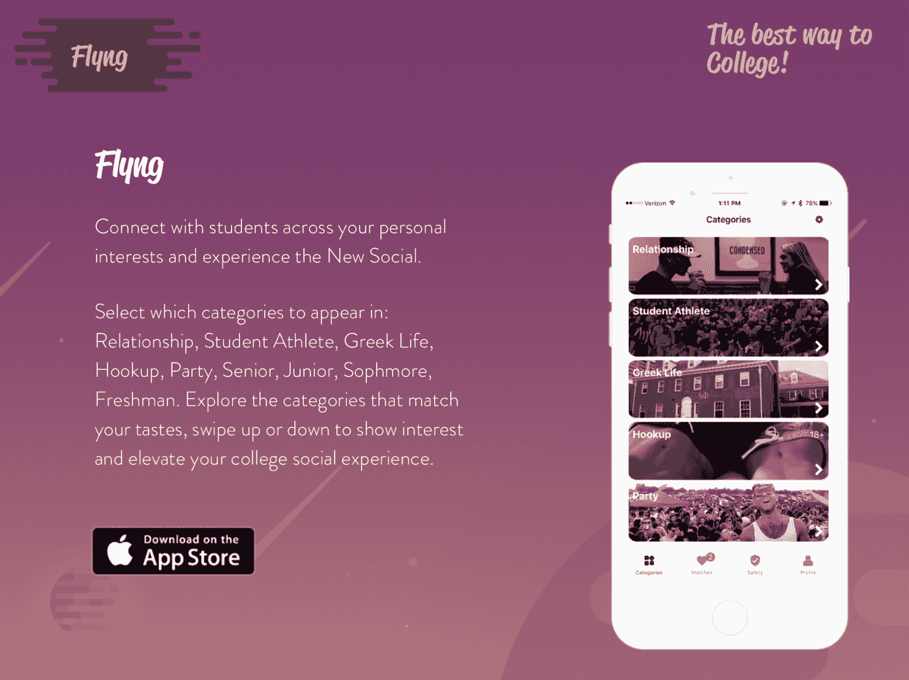
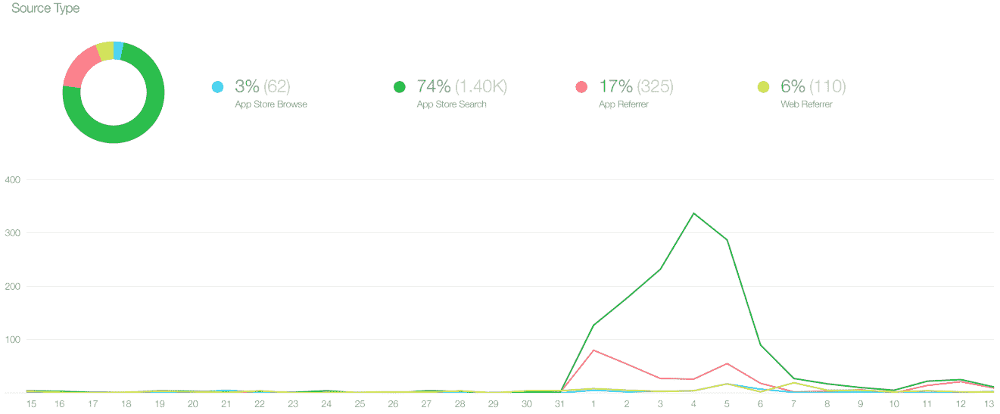
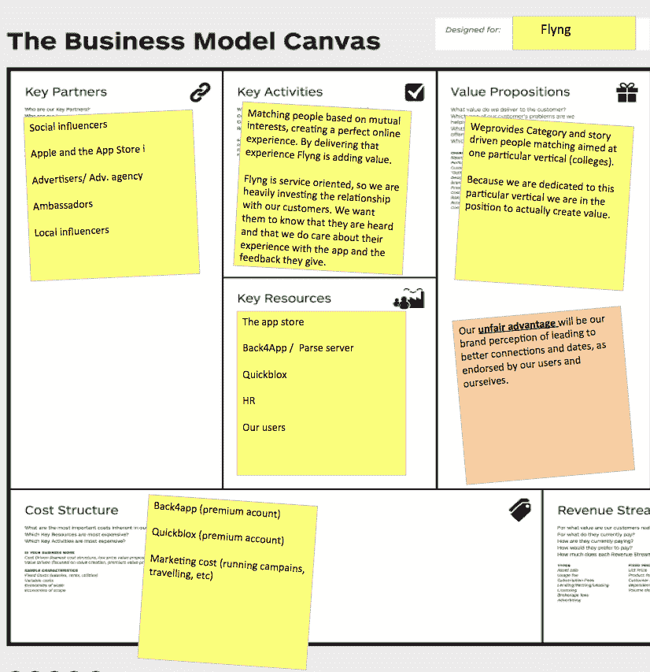
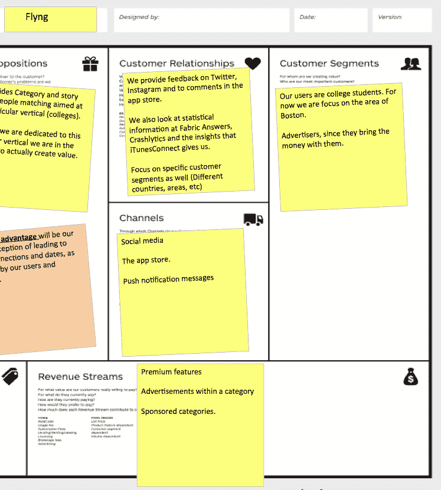
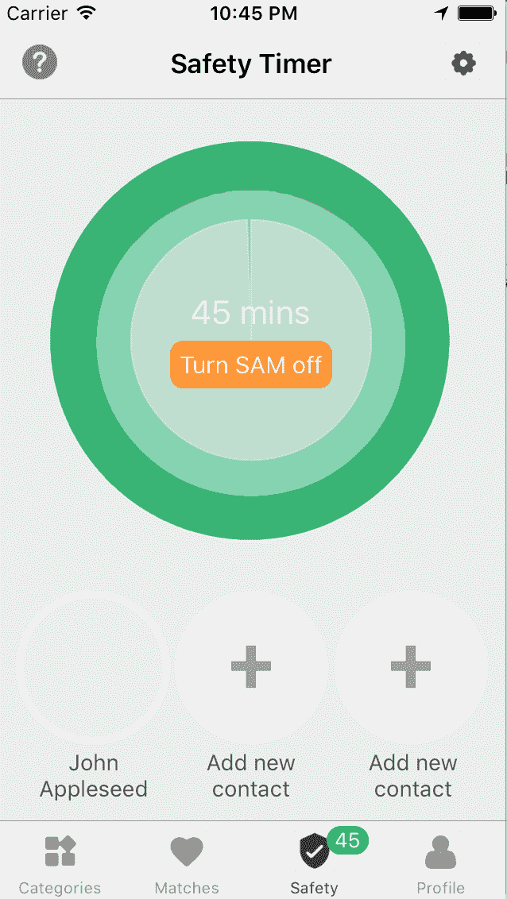
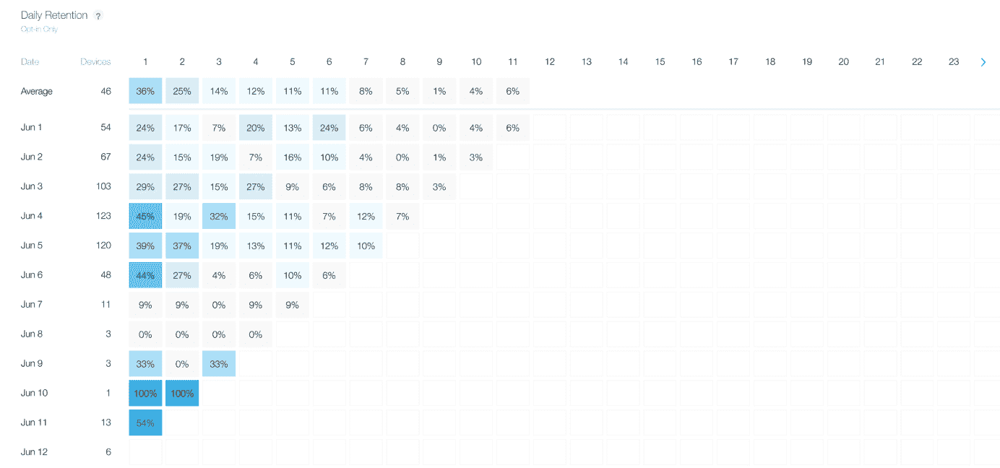
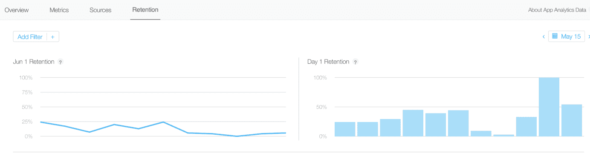
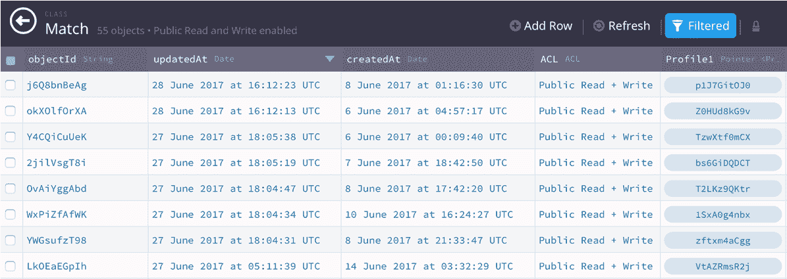
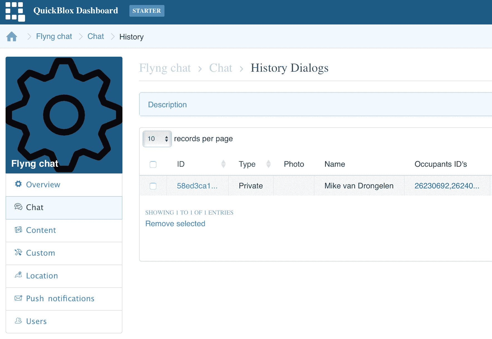
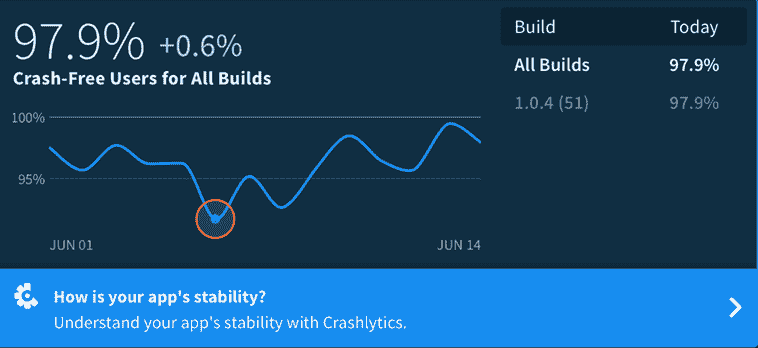

# 第二十章：Flyng 案例研究

Flyng 是一个 iOS 应用程序，它关于约会，但以一种（略微）不同的方式。让我们看看 Flyng 的商业和技术挑战是什么。到目前为止，这本书已经充满了大量的理论。现在，你已经知道了精益创业方法论是什么，以及更具体地说，你可以如何将这种方法应用于移动应用程序开发。

我们看到了许多 iOS、Android 和 Web 应用程序的样本，我们学习了如何在我们早期阶段从用户那里学习，以及如何快速收集反馈，所有这些都无需太多的（技术）努力。

提供各种服务的各种供应商帮助我们做到了这一点。想想看，一个移动后端即服务（MBaaS），比如 Back4App 和 QuickBlox，用户注册工具，比如社交登录和电话号码登录（数字），以及分析服务。

精益创业方法论既不是一种宗教，也不是一个终极目标。绝不！它只是创建具有实际意义和持久性的应用程序的一个好工具。不要浪费你最宝贵的资源（时间！）相反，使用精益方法尽早获取反馈。看看你能否尽早证明你的假设。如果你是对的，就继续前进。如果你的假设被证明是错误的，那么就学习并适应。最好是尽早失败，并构建一个真正有价值且人们真正想要使用的解决方案（一个不同的功能，一个更好的功能，或者另一个应用程序）。

在本书的早期，我承诺给你一些真实世界的例子，现在就是其中一个。这是 Flyng 的案例，这是一个新的社交应用程序，我和我的队友们一起在开发。稍后我会向你介绍他们。

在本章中，我们将涵盖以下主题：

+   调查 Flyng 解决什么问题

+   描述 Flyng MVP 是如何构建的

+   看看我们的 Flyng 假设是什么

+   审查如何衡量用户反馈

+   讨论如何构建 Flyng 的用户基础（鸡生蛋还是蛋生鸡）

Flyng 案例研究总结了你在本书中读到的大部分内容，并涵盖了我们所做的好事和坏事。因此，这个案例研究也成为了团队自身的回顾会议。

在构建我们的 Flyng 最小可行产品（MVP）的过程中，我们已经取得了一些伟大的成就。不出所料，我们也发现了一些需要改进的地方。自从我们开始这个项目以来，我们就一直在使用精益创业方法论，但尽管如此，还有一些事情我们可以做得更好。

正如你将在本章后面读到的那样，我们包含的一个特定功能是基于一个我们没有足够早验证的假设。这个特定的功能几乎没有被使用，但至少在我们发布了许多应用程序版本之前，我们发现了这个问题。除此之外，Flyng 已经取得了成功，并且其用户基础每天都在增长。

# 这听起来很棒，但 Flyng 是什么？

Flyng 是一个允许你与你个人兴趣相关的学生建立联系的应用。与 Tinder 不同，它不仅仅关于约会。你可以探索诸如冒险、邂逅、关系或派对等类别。除了其他搜索标准外，它还允许你在浏览时指定你确切喜欢的内容。正是这个功能吸引了最多的 Flyng 用户：



该应用还附带其他有趣的功能，例如安全计时器（但这只是一个假设），以及未来的一些有趣游戏。

# 团队

任何成功应用最重要的成分是团队。它是成功初创企业的关键成分，也是几乎所有风险投资家都感兴趣的事情。当然，Flyng 拥有一个出色的团队。Flyng 团队成员包括：Daniel Guthrie，Mitchell Trulli，以及，并非巧合的是，我（Mike）。

# Mitchell Trulli

Mitchell Trulli 负责影响者营销和品牌建设，战略伙伴关系，融资和提案。他拥有金融学 MBA 学位（来自奎尼皮亚克大学），梦想在成功创办一家初创企业后进入风险投资领域。他喜欢旅行和交易，以及夏天在科德角度过。

# Daniel Guthrie

Daniel 负责监控增长和数据分析，社交媒体策略，品牌建设，以及运营大使计划。

Danny 和 Mitchell 对初创企业和在科技领域的工作项目充满热情。此外，他们也非常关注大学市场，并学习适应其营销策略。

# Mike van Drongelen

Mike 是该应用及其后端的开发者。目前，该应用仅在 iOS 上可用，但 Android 应用很快就会推出。他对用户体验和与应用相关的所有其他事情都感兴趣。Mike 同样也是一个初创企业爱好者，但既然你在读这本书，我想你早已非常了解这一点。

# 其他贡献者

团队比核心团队更大。有许多其他贡献者和大使！以 Kevin Dalvi 为例。他帮助 Flyng 团队进行用户体验和出色的图形设计。

我们还想要感谢所有我们的测试用户，以及最后但同样重要的是，Flyng 的用户。他们让 Flyng 发展成为现在的样子。如果没有这些人的努力，Flyng 就不会存在。

# 最小可行产品（MVP）

在 Mitchell 告诉我他的想法后，我非常兴奋，我们很快决定创建我们的第一个最小可行产品（MVP）。从我个人动机的角度来看，我可以告诉你，我一直想创建一个类似 Tinder 风格的应用，而且这个解决方案旨在针对大学，所以我特别感兴趣于这个概念。

让我详细解释一下最后一部分。我的另一个初创企业冒险，Teamspot，是一个在线学习解决方案。这是一个让公司能够在各种学校水平上与学生们相遇的平台，反之亦然。它简化了整个实习的设置和监控过程。

我一直有一个愿景，那就是学习应该是有趣的，而且它远不止是知道和分析事实。它还应该包括社交、协作以及所有创造美好体验的其他方面。如果你剥夺了乐趣，那么学习方面也会停止。而且如果你是初创公司的一员，你应该始终学习和享受乐趣，至少每天一次（甚至可能两次）。

正因如此，我对飞鹰感兴趣。此外，我认为这是一个以精益方式构建应用程序的绝佳机会，这样我就可以将其作为本书的案例研究。这就是你现在读到它的原因。

# 分布式团队

当米切尔和丹尼尔在美国时，我在荷兰。这并不一定是问题。有一些出色的协作工具可用，而且我们身处不同的时区只需要更多的计划。我的合著者亚当·丹尼斯也在另一个时区。这也很好。

米切尔这样评价我们的分布式团队：

"我们的团队每天使用 Slack 进行沟通；此外，我们预计每周或每两周进行一次 Skype 通话。利用我们拥有的技术，国际工作变得相当容易；此外，迈克对我们的工作时间相当灵活。"

除了 Slack，你还可以使用 BaseCamp 进行团队沟通。这两种解决方案都对分布式和本地团队都适用。

# 飞鹰的独特卖点

你可能会想知道：“为什么还需要另一个社交/约会应用？飞鹰有什么不同之处？”

当我问米切尔时，他告诉我：

"Tinder 曾被誉为 2017 年第二季度最赚钱的应用。我们认为在线约会市场仍然非常年轻，并且仍在增长。"

为了利用 Tinder（可滑动个人资料）的独特属性，并将其与我们独特的分类方式相结合，我们能够创新这个领域，吸引用户使用我们的应用程序，而不是标准的 Tinder 或 Bumble。

我认为，监控匹配对象以及他们匹配到的类别是我们应用程序最重要的部分。我们的用户将特别挑剔，并期望整个应用程序都围绕这些类别展开。

我还问他为什么飞鹰特别针对大学。米切尔回答说：

*"很多人不明白为什么我们针对大学市场，因为它被誉为最难进入的空间之一。我们相信我们对约会应用的独特视角将使我们脱颖而出。此外，我们的过去项目专注于大学市场，我们广泛地了解了如何向他们推广和营销。"*

理论上讲，每个企业都有一个（营销）问题和（技术）解决方案组件。我问米切尔，飞鹰想要解决什么问题？

Flyng 解决了人们在当地无法遇到他们想要遇到的人的问题。Flyng 允许他们遇到正在派对、年轻或年长，或者与他们处于相同社交组织的人。这将大大增加他们不打电话而是在现场互动的时间。我们的目标是建立人与人之间的个人联系。

其他社交应用，如 Facebook 和 Snapchat，缺乏有效的发现平台；它们是你在亲自见面后与人沟通的地方。Tinder 和 Flyng 允许你在网上遇到人，这样你就可以在现实生活中与他们互动。

未来，我们计划增加点赞照片、临时分类、基于位置的分类和其他将增加用户参与度和保留度的功能。

我们目前正在努力达到的一个重大里程碑是 40K 月活跃用户（MAU）。一旦我们达到这个水平，凯文将带领米切尔和丹尼尔进行一次旅行，并向我们网络中位于硅谷地区的风险投资家进行路演。

# 增长用户基础

4 万个月活跃用户听起来并不复杂，但就像每个初创公司一样，Flyng 是从 0 个用户开始的。那么我们是如何让我们的用户基础增长的？

米切尔概述了我们做得相当不错的地方：我们在推出之前就开始了营销。我们希望在 Flyng 推出之前，人们就期待并兴奋地下载这款应用。

这为我们第一天带来了 200-500 个新用户，为我们深入的市场营销策略提供了一个基础。目前，我们使用社交媒体和社交媒体影响者来扩大 Flyng 的用户基础。通过增长黑客策略和与志同道合的组织的合作，我们能够增加下载量并保留用户。

我们最大的挑战是在特定地区增长用户基础。我们的社交增长策略分散，没有像人们希望的那样在特定地理位置上高度关注下载。

约会和配对应用总是在寻找男性和女性之间的良好平衡。最理想的情况是 50/50 平衡，但许多初创公司看到早期采用者往往是男性，这可能是某种原因。对于 Flyng 来说，这似乎也很重要。

米切尔说：我们假设男孩会追求女孩。为了利用这一点，我们主要针对女性进行营销，展示我们的分类将允许她们筛选掉她们不想与之联系的男人，这是其他应用所不允许的。

# 商业模式

一个令人印象深刻的用户基础可能非常有说服力，但如果我们想让 Flyng 成为一个可持续的业务，我们最好也考虑一下商业模式。

一个空白的商业模式画布正盯着我们。Flyng 的商业模式画布会是什么样子呢？让我们快速迭代画布的所有元素。

# 客户群体

我们的用户是大学生。目前我们专注于波士顿地区。稍后，我们将扩大到美国，然后最终扩大到全球。

我们的用户并不一定是我们的客户。如果我们知道我们的收入来源，那么我们的客户也可能是广告商，因为他们带来了资金。另一方面，用户通过在应用上花费大量时间为其增加了价值，这是广告商所喜欢的。嗯，有点棘手。目前，让我们将它们两者都添加到画布上。

# 价值主张

Flyng 提供了什么价值？简而言之，它提供基于类别和故事驱动的针对特定垂直领域（大学）的人与人匹配。关注这一点非常重要。因为我们专注于这个特定的垂直领域，所以我们实际上能够创造价值。通过针对这个特定的利基市场，我们了解用户的需求。我相信你会同意这是一个好的策略，假设你知道 Facebook 的历史。他们不是一开始就关注所有人，而是从关注大学生开始。你的应用可能处于一个完全不同的领域，但从一个相对较小的受众群体或解决一个利基问题开始总是一个好的起点。

# 客户关系

在线产品，无论是应用还是网站，都会使与客户的联系更加匿名。尽管如此，仍然有方法与他们建立联系，例如通过在 Twitter、Instagram 和 App Store 评论中提供反馈。让用户知道他们的声音被听到是很重要的。

我们还查看 Fabric Answers、Crashlytics 和 iTunesConnect 给我们提供的洞察力。

现在来看特定的客户群体还为时尚早，但当我们扩大规模时，这样做肯定是有意义的。例如，美国的用户和亚洲的用户可能会表现出不同的行为和/或有不同的需求。

# 渠道

我们（销售）渠道，如前所述，是社交媒体和 App Store。此外，我们使用推送通知消息来通知用户关于应用改进等内容。如果我们的用户基础足够大，我预计我们将针对特定群体来推广特定功能。

# 收入来源

收入从何而来？当然，收购是一个不错的选择，但现在让我们保持现实。那么，我们的钱将从哪里来？我认为高级功能是一个好主意，但根据米切尔的说法，另一个选择可能是：

在某个类别内的广告，例如在派对类别或赞助类别中放置的啤酒公司的广告。例如，派对类别可能由啤酒公司赞助。其他类别也可能有赞助商。

在应用业务中，达到盈亏平衡点并不困难。正如我们稍后将会看到的，我们的成本将会很低。至于 Flyng 是否会成为一个可持续的业务，这完全是另一个问题。我们将看到未来会带来什么。目前这还不是我们的主要目标。扩大用户基础是我们现在需要做的最重要的事情。

我们在第十七章，*货币化和定价策略*中看到了这一点。

# 关键资源

毫无疑问，我们的关键资源是 App Store 以及我们使用的服务，例如 Back4App 托管 Parse Server。我们最宝贵的资源是人力资源：我们的团队和我们的用户。

# 关键活动

Flyng 的关键活动基本上就是根据共同兴趣匹配人们，并创造一个完美的在线体验。

通过提供这种体验，Flyng 正在增加价值。该应用程序娱乐用户，将人们聚集在一起，在现实生活中享受他们最喜欢做的事情，无论是约会、拥有相同的爱好，还是对相同的体育兴趣。

Flyng 以服务为导向，因此我们在与客户的客户关系上投入了大量资金。我们希望他们知道他们的声音被听到，我们关心他们的体验和反馈。我们使用统计数据来衡量重要的 KPI，如用户转化率、留存率和流失率。

# 合作伙伴

Flyng 需要像任何其他业务一样拥有合作伙伴。如果我们想让应用程序受到关注，我们需要别人的帮助。社交媒体影响者（如拥有众多粉丝的 Twitter 用户）是我们的合作伙伴。苹果和 App Store 是其中之一。我们的未来广告商和/或购买广告或赞助类别的组织也是我们的合作伙伴。

这就引出了问题：“我们的大使是谁，或者谁可能成为我们的大使？”

这是米切尔给出的答案：为基于约会的社交应用找到品牌大使很困难。一个想法是为每个城市提供一个代码，类似于 Flyng.us/boston，并将报酬分配给当地的影响者。另一个想法是为每个城市创建一个定制代码。

# 成本结构

我们的应用程序涉及哪些成本？如果不算上我们在 Flyng 上投入的时间，那么只有托管（Back4App）和营销是支出。

平台上的互动越多，对后端的每秒调用次数就越多。托管 Parse Server 的一方，在我们的案例中是 Back4App，提供了一系列计划。每个计划都包含每月的最大请求次数和每秒的最大请求次数。因此，应用程序的用户越多，更重要的是，并发用户越多，我们为托管支付的费用就越多：



我们的营销成本取决于平台和广告的频率。通过仔细测量我们的转化率，我们可以了解我们的支出和新用户数量之间的相关性。

当我们开始运行活动时，我们注意到新用户数量有显著增加。我们还了解到这种效果只持续了很短的时间。前面的图表很好地说明了这一点。

# 不公平的优势

这个元素出现在样本商业模式画布中，但它包含了一些变体。这可能是 BMC 中最困难的部分。我问米切尔：Flyng 的不公平优势是什么？换句话说：什么阻止了另一个应用构建者复制并推出 Flyng 的概念？

米切尔回答说：由于这个领域已经拥挤着各种主要市场参与者（如 Tinder 和 Bumble）以及大量的小型玩家，对于 Flyng 来说，最重要的是我们与这个领域内的社区/消费者的关系和联系。我们的不公平优势将是我们品牌感知，它能带来更好的联系和约会，这一点得到了用户和我们自己的认可。

太棒了！我们现在已经收集了我们需要的所有信息。如果我们填写 Flyng 的 BMC，它看起来会是这样：



由于书籍的空间有限，以下是画布的正确部分：



# 获取反馈

因此，我们需要我们商业模式的证据。我们使用什么工具来衡量牵引力、留存率和其他反馈？反馈使我们能够改进应用的功能，并证明我们的假设是对的还是错的。

我们第一次 MVP 的反馈直接来自与用户的互动。

如果用户数量迅速增长，我们需要一些其他工具来获取适当的反馈。

我们从以下来源收集反馈：

+   iTunesConnect 分析数据

+   应用商店评论

+   Fabric 回答，分析数据

+   Fabric 崩溃分析，用于衡量，嗯，崩溃

+   Back4App 数据和统计

+   来自我们测试用户的反馈

这份反馈附带的信息让我们对哪些功能被使用得最多有了很多了解。最重要的是，我们注意到基于类别的浏览技术是我们用户最欣赏的。

# 未经验证的假设

当我们开始构建 Flyng 时，我们有一些假设，我们的 MVP 证明是正确的。我们有什么完全错误的假设？

米切尔说：通过我们的 MVP 发布，我们能够看到几乎没有任何用户使用我们的安全功能 SAM。遗憾的是，这将会促使我们在未来取消它，也许将其独立成一个项目。



# 一个僵尸功能

SAM 非常易于使用，或者，嗯，这就是我们以为的。你自己决定吧！

假设你在 Flyng 上遇到了新人。为了安全起见，在你出去约会之前，你使用 SAM 从你的联系簿中选择 1 到 3 个联系人来提醒如果发生任何问题。你开始计时，每 45 分钟你需要检查一次，只是让 Flyng 知道你还安全。当通知出现在你的手机上时，你只需轻触它。如果你没有回应或没有及时回应，你的联系人将通过短信被通知。

只有少数人真正使用 SAM 功能。显然，大学里没有令人毛骨悚然的人（这是另一个假设）。无论如何，我们认为这是一个伟大的概念，但如果没有人使用它，那么我们的用户可能不需要它，或者至少他们不需要在 Flyng 中使用它。

这里唯一的僵尸是一个伟大的想法，它有风险成为活死人的成员：


事实上，反馈和统计数据告诉我们，它几乎没有被使用。我们仍然需要研究人们是否认为这个选项没有用，找不到它，或者认为它对于假设的问题来说太难了。所有这些都需要进一步调查。

目前，我们可以声明，人们想要在约会时有守护者的假设似乎是错误的。就像米切尔说的那样，可能需要将其删除并发展成自己的应用。当然，这个想法假设这个功能试图解决的问题实际上在 Flyng 之外的环境中确实存在。

如果不是呢？那么，这是一个典型的例子，这种浪费本可以通过早期验证来避免。那么，一个更早的 MVP 可能是什么样的呢？也许我们应该尝试通过在线或现实世界的调查来了解女孩（和男孩？）目前在使用约会时面临的问题。

# 反馈和可操作指标

我们使用的监控工具为我们提供了对我们应用有价值的分析洞察。这些洞察力的挑战是如何将它们转化为可操作的指标。

有一些数字是很好的，但你如何解释它们，使它们成为可操作的指标？哪些 KPI 真正重要？牵引力是一个经常使用的词，但你如何衡量它？如果你认为牵引力是一个定义人们实际使用你应用的程度的数字，那么用户数量是一个有用的数字。或者，是活跃用户数量？活跃用户的定义是什么？或者，新用户数量在这里是重要的数字吗？

要回答这些问题，你必须使事物可衡量，并保持精确。你需要有明确的目标。

假设到年底我们希望拥有 10 万新用户。这是一个明确的目标，只要它是相对现实的，就是一个好的目标。最终，真正的牵引力是通过实际收入来证明的，但在 Flyng 的情况下，这将是以后的事情。

使用相同的工具，我们还可以衡量留存率。有多少用户在一周后、一个月后或一年后仍在使用该应用？



如果留存率低，我们需要做什么来让用户留在应用中？我问米切尔，我们是否可以说目前可用的分析是可操作的指标。我还想知道我们是否需要额外的资源或工具来衡量我们的用户。

米切尔说：“我们目前拥有的分析数据很好地代表了我们所证明的早期市场验证。我们的营销努力一直不稳定；到目前为止，我们连续的广告支出天数最多只有 7 天。

我们经常监控从社交媒体、私信、帖子评论和其他用户互动中获得的反馈，以了解我们的用户应用是否崩溃，他们希望看到哪些功能，等等。

我们收到的最有趣的反馈来自实际使用过该应用并遇到与他们互动的人的用户。他们告诉我们，类别允许他们以不同的方式规划和互动。例如，在派对类别中相遇的人能够在派对上建立联系。”

听到我们最好的反馈来自与用户的直接互动，这很有趣。这不应该是一个真正的惊喜，但重要的是要知道，直接反馈比单纯的分析数据更宝贵：



# 分割测试

Flyng 的哪些功能可能是分割测试的完美候选人？

米切尔说：测试不同类型的类别对于分割测试来说是非常理想的。例如，为了测试由创建与夏日相关的海滩日类别所引起的接受度和互动，我们可以在我们认为对我们的研究测试具有战略意义的海滨地区创建它。

是的，我认为进行一些 A/B 实验是值得的，不仅是为了应用，也是为了应用商店的列表。由于最近推出了**应用商店优化**（**ASO**）技术，包括应用商店分割测试，我很想尝试看看它们是如何工作的，以及它们是否可以帮助我们改进我们的应用。

# 视野

没有愿景就没有目标，所以我很好奇团队对 Flyng 的雄心壮志。我问米切尔：你认为 Flyng 一年后和三年后的未来会是什么样子？Flyng 会是一个可持续的业务吗？它会赚很多钱吗？它会吸引投资者吗？它是否以其他方式对商业或社会做出贡献？

Flyng 的动态使其成为一个很好的盈利产品。类别卡片可以通过多种方式赞助。首先，一个原始类别可以由一家公司代言。例如，学生运动员类别可以由我们网络中的公司[`www.thetailgateseason.com`](http://www.thetailgateseason.com)赞助。出现在页面顶部附近的公司将收取溢价，而较低位置的公司将具有最佳价值。

也可能有有限的赞助类别。这些类别可以是互动的，以进一步拥抱通过其类别线了解其他个人资料的价值。例如，假设 Marvel 正在寻找宣传一部新的复仇者联盟电影。我们可以运行一个赞助的、有限时间的类别，类似于投票。用户可以选择他们最喜欢的超级英雄，并可以与类似粉丝建立联系。如果实施得当并投入时间，这些广告不会被视为侵扰性，并且会增强用户体验。

在我们的社交聚会应用程序中拥有类别的好处之一是使用它们来区分广告放置的位置。在我们的领域中的传统应用程序中，只有一个巨大的类别。如果 Bud Light 只想向对派对感兴趣并积极参与的人进行广告宣传，这些应用程序就无法满足 Bud Light 的需求。在 Flyng 的派对类别中，我们可以向可能对其产品感兴趣的用户展示广告。广告将具有相关性，这将使用户和 Bud Light 都感到高兴。

# 技术考虑

由于这本书主要是一本关于精益创业方法的实用指南，我们将探讨 Flyng 技术的亮点。我们无法透露太多，但足以让你有个大致的了解。

该应用程序是为 iOS 平台构建的，但也计划推出 Android 版本。采用 iOS 首先策略的主要原因是因为主要受众是波士顿地区的大学。如果我们开始在欧洲推出，我们可能首先采用 Android 策略。

该应用程序是用 Swift 3.0 构建的，并将未来迁移到 Swift 4。它从位于 Back4App 的 Parse Server 获取数据。此外，它还使用 QuickBlox 进行聊天技术。代码已经以这种方式结构化，使得在一种 mBaaS 和另一种之间切换相对容易。

我们的技术堆栈包括以下内容：

+   Xcode

+   Swift 4.0

+   Back4App、Parse server、PLQ 和 Cloud code

+   Amazon

+   QuickBlox

+   Twillio

+   APNs、徽章、匹配消息和消息

# Back4App 上托管的 Parse server

我们在使用 Parse Server 作为后端解决方案时不得不处理一些限制，但另一方面，它也使我们能够快速开发应用程序。这样我们就可以特别关注前端（应用程序）。

这里是一个位于 Back4App 的匹配集合过滤器的示例：



该应用程序已经设置好，以便可以轻松切换到另一个 Parse Server 或甚至是一个定制的后端 API。

# 实时数据

除了个人资料和媒体数据外，我们还需要为应用程序的聊天功能提供实时数据。

我们曾经使用 parse live queries 进行聊天技术，但我们发现 QuickBlox 是这类事情更值得信赖的服务。对于两个不同的后端解决方案，为单个用户进行身份验证有点困难，但最终完成起来并不真的那么难。

这是 QuickBlox 控制台的示例。该服务支持许多其他功能，但我们只是用它来实现聊天功能：



# 其他依赖项

我们使用 Twillio 发送用于 SAM 功能的短信。对于入职或特定于登录/注册的过程，我们要求用户使用他们的 Facebook 账户注册。

如果没有 Facebook 账户，Flyng 的入职过程会很困难。你无法在用 Facebook 账户登录之前继续。根据我们在第十一章[774e65d5-5ac0-4ade-9f9e-cffb2a911441.xhtml]“入职和注册”中讨论的内容，这意味着我们在入职方面有一点点高的门槛要克服。

在不了解任何关于应用的情况下，你需要注册，如果你没有 Facebook 账户，你就无法继续。虽然我不想为所有应用推荐这种策略，但对于像 Flyng 这样的约会应用来说，它效果很好。对于这类应用，避免虚假用户和避免不完整数据非常重要。从 Facebook 获取的数据帮助我们个性化应用，在注册后立即显示你的名字和头像。

我们可能还需要提供其他社交登录选项。由于该应用的目标是年轻人，我们可能还需要提供使用 Twitter、Snapchat 或 Instagram 账户注册的方式。

了解我们还做了什么来避免虚假资料也很有趣，那就是使用面部识别技术。使用 iOS SDK，验证一个或多个面部是否出现在上传的图片上相当容易。经过测试，我们发现它还能区分面部与卡通、动物图片和绘画。至少，它可以防止我们拥有显示不相关图像的资料头像，比如壁纸、日落，甚至更糟糕的。

如你所见，我们使用 CocoaPods 添加了一些第三方依赖项，例如 Parse 和 QuickBlox SDK。如你所见，我还使用了 Facebook 和 Crashlytics 作为参考：

```java
target 'flyng' do 
  use_frameworks! 
  pod 'Fabric' 
  pod 'Crashlytics'   
  pod 'Cartography'   
  pod 'Parse' 
  pod 'ParseFacebookUtilsV4' 
  pod 'ParseLiveQuery'  
  pod 'JSQMessagesViewController' 
  pod 'QuickBlox' 

```

# 查询

数据消耗依赖于几个直接查询，但对于更复杂的需求，已经使用了云代码解决方案。这些云代码解决方案是基于 JavaScript 的，并且与 Parse 服务器提供的 REST API 功能密切相关。

为了简化，它托管在 Back4App 上，但几乎没有阻止我们未来托管一个或多个 Parse 服务器。当然，在这种情况下，我们需要处理推送通知、平衡和扩展以及其他事情，但你应该明白这一点。如果需要立即扩展，它允许我们实现可扩展性。

当你查看应用的 Swift 代码时，你会注意到为客户端定义了许多方法。它们作为协议提供，这使得我们可以在不费太多力气的情况下切换到另一个后端解决方案。

只为了给你一个概念，这里展示了其中一些可用的方法：

```java
import UIKit 
protocol RepositoryProtocol { 
    func authenticate (handler: RepositoryResultDelegate, request: AuthenticateRequest) 
    ... 
    func getProfile (handler: RepositoryResultDelegate, request: GetMyProfileRequest) 
    func getCategories (handler: RepositoryResultDelegate, request: GetCategoriesRequest) 
    func getCandidates (handler: RepositoryResultDelegate, request: GetCandidatesRequest) 
    func getMatchList (handler:RepositoryResultDelegate , request: GetMatchListRequest) 
    func pushMessage (handler: RepositoryResultDelegate, request: PushRequest)  
    ... 
} 
```

# 复杂操作

初看之下，似乎很容易判断两个人之间是否有匹配。但对于一个应用来说，这是一个复杂的操作。想象一下，你喜欢一个特定的个人资料。首先，我们需要将这个事实添加到你的浏览历史中，因为你不希望看到你已经看过的个人资料。我们还会跟踪你喜欢的人。稍后，当他们也喜欢你时，这就会导致匹配。我们希望为我们的用户提供尽可能多的匹配，因此我们需要确保你首先看到那些确实喜欢过你的人的个人资料。

如果你喜欢某人，我们需要运行一个查询来告知我们你是否之前也喜欢过这个人。如果是的话，就会添加一个匹配条目，并且我们需要通知你和你的匹配对象。让我们发送一个推送通知来告知你的伴侣，并将我们刚刚创建的匹配结果返回给你以通知你。太好了，有新情况发生了。徽章，出现在应用图标上（在匹配标签页），需要增加。然而，在我们这样做之前，我们需要弄清楚你和你的伴侣各自有多少新的匹配（和消息）。简而言之，这个操作是云代码解决方案的完美候选。

存在于 Parse Server 上的函数将为我们做大量工作。这是有道理的，因为服务器有更多的计算能力，这样我们也能避免从设备向服务器发送太多数据，反之亦然。这就是我们如何保持可扩展性的方式。

从应用的角度来看，这只是一个提供正确数据和消费服务器上云函数产生的结果的问题。例如，以下是调用云函数的方式：

```java
 func getCandidates (handler: RepositoryResultDelegate, request: GetCandidatesRequest){  
  let params =   
  [ 
            "myId": request.profileId, 
            "fromAge": myProfile.CriteriaAgeFrom, 
            "toAge" : myProfile.CriteriaAgeTo, 
            "gender" : myProfile.CriteriaGender, 
            "maxDistance" : myProfile.CriteriaMaxDistance, 
            "category": request.categoryId, 
            "skip": request.skip, 
            "limit" : request.limit 
     ] 
     PFCloud.callFunctionInBackground("getCandidates", withParameters:    
  params as [NSObject : AnyObject], block: { (object, error) in 
    ... 
```

# 推送通知

在第十五章“增长吸引力和提高留存率”中，你可以找到更多关于显示推送通知所需实现的信息。对于这个案例研究，了解以下情况很有趣：像 Back4App（还有 Sashido 和其他几个）这样的服务不仅允许你托管 Parse Server，还处理为应用设置推送通知的麻烦。

对于我们的应用，我们使用远程推送通知来显示消息并更新徽章图标。每当有新的匹配或新的消息时，我们都会通知用户。如果这种情况经常发生，留存率就会自然增长。此外，我们还使用本地（计划中的）通知来实现 SAM 安全功能。

# 崩溃报告

我们在发布每个候选版本之前都会进行测试，但即便如此，在野外使用时仍然可能发生崩溃。如果发生这种情况，Crashlytics 就会提供帮助。它易于实现，并且能为你提供大量关于崩溃的洞察（包括堆栈跟踪）：

```java
func application(application: UIApplication,           
     didFinishLaunchingWithOptions launchOptions: [NSObject: AnyObject]?) -> Bool {         
        ...         
        Fabric.with([Answers.self, Crashlytics.self]) 
```

在以下示例中，您可以看到崩溃次数是如何自由地下降到一个不可接受的水平。我们定位了问题并发布了新版本。这导致无崩溃用户数量上升，几乎达到 99%甚至更高。几乎不可能让每个人都满意。您的应用程序及其运行的操作系统可能会产生巨大影响。对于 iOS，只有有限数量的不同设备，并且高比例的无崩溃用户当然应该是可能的。此外，大多数设备都将使用 iOS 的最新版本。

注意，这对于 Android 应用程序可能不同。您可以预期您的 Android 应用程序的无崩溃用户比例较低。这是因为有许多不同的设备、版本和操作系统。例如，有带有一个/两个/没有摄像头的设备。有三星或华为版本的 Android 版本，每个版本都略有不同。而且，您需要支持从 Android 版本 4 到版本 8 的情况并不少见。测试每个变体几乎是不可能的。您别无选择，只能专注于前 10 款最受欢迎的设备，并希望它们也能在其他设备上运行良好：



我们还使用 Fabric 来衡量应用程序的使用情况，例如测量在一定时间内注册了多少人：

```java
AnalyticsUtil.logEvent(AnalyticsUtil.eventSignupFacebook) 

static func logEvent(event: String){ 
   ... 
   Answers.logCustomEventWithName(event, customAttributes: nil) 
} 
```

# 发布

我们发布了几次版本，许多用户给应用程序评了 5 星。当然，我们也收到了一些负面评论。我们最感兴趣的是这些用户。当你这么想的时候，负面评论者是有价值的，因为他们遇到问题时，他们足够关心应用程序，以至于会向我们报告问题。这里的挑战是将这位愤怒/不满意的客户转变为大使。我们总是可以通过确保我们倾听用户并解决他们遇到的问题来开始这次对话。应用程序中真的有 bug 吗？应用程序中有什么解释不清或不明确的地方？让我们联系用户进行对话，找出答案！


# 摘要

在本章中，我们提供了一个广泛的案例研究，展示了书中讨论的大部分内容。我们了解了飞行的应用程序，包括我们做得好和不好的地方。我们看到了最初的假设是什么，以及我们如何收集反馈。尽早证明您的假设很重要。正确验证它们也很重要。如果不这样做，可能会导致时间的浪费。这正是我们看到的 SAM 功能发生的情况。也许它只需要一个小转变就能成功，这需要一些新的实验。所有这些也许都可以应用到您的应用程序上。

截至目前，飞龙（Flyng）仍在不断发展。这场冒险仍在进行中，我们每天都在构建、测量和获取反馈。有时这会很艰难；但鉴于团队的积极精神，我们将继续前进。我不知道这次冒险将走向何方，但有一点我可以肯定。无论成功与否，我们都从大量的反馈、奉献，以及，嗯，可能还有一点运气中学习到了很多。

你也可以做到这一点！保持专注。不要经常拖延。每天学习。尽早失败。持续努力。现在，一切取决于你！祝你好运！
