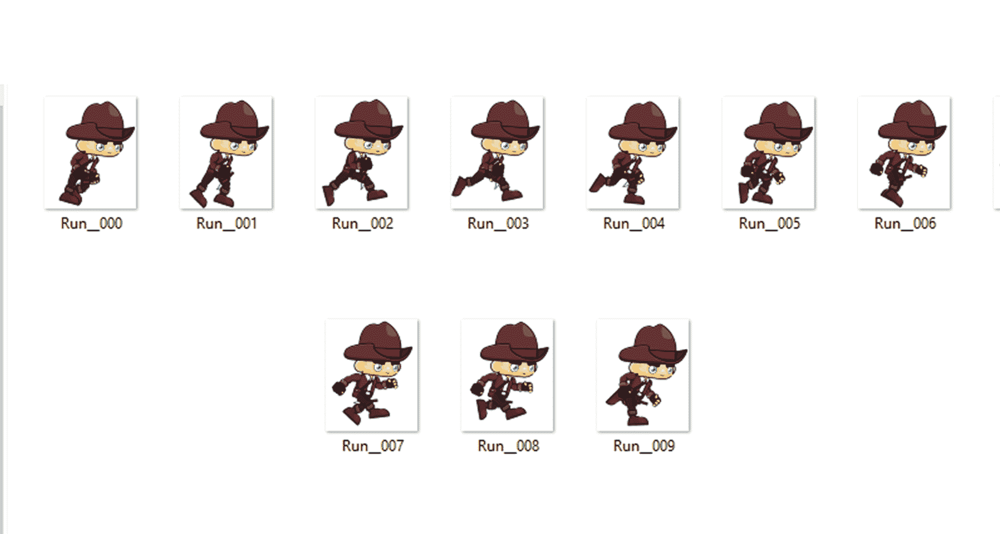
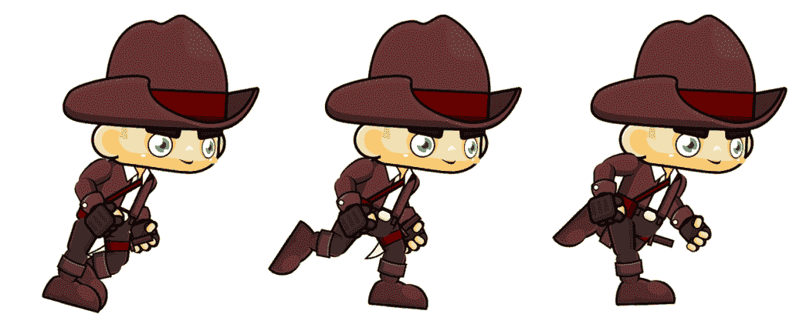
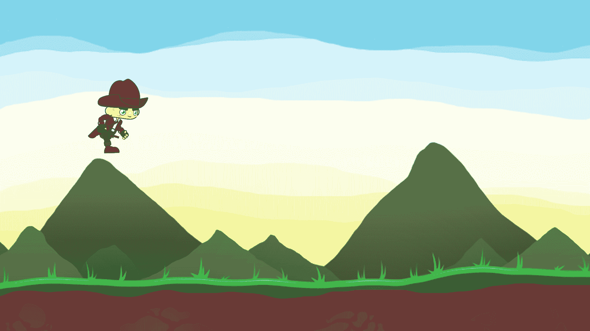

# 第五章：为你的游戏添加动画

我们已经学习了如何在屏幕上创建精灵以及使我们的背景图像连续滚动。精灵基本上只是图像，用于游戏资源。现在，是时候给它添加一些更多的风味，使其变得有趣。在本章中，我们将使我们的玩家角色出现在屏幕上，位于我们的背景之上，并添加一个使玩家跑步的动画。在本章中，你将学习以下内容：

+   基于精灵图集创建精灵动画

+   运行基本动画

+   创建一个抽象类作为我们未来游戏对象的基础

到本章结束时，你将在屏幕上看到一个正在运行的字符。那么，让我们开始吧！

# 添加动画让你的游戏更加精彩

为了开始本章，我们需要一组图像，我们称之为精灵。我们在上一章中看到了如何使用 `image_1` 和 `image_2` 作为例子，但我们将在此基础上进行扩展，使其更有趣。我们将尝试在精灵图集中制作我们玩家角色的正确运行周期。为了更好地理解这一点，让我们看看以下图像：



我们的运行周期动画精灵

在前面的图像中，你可以观察到我们有一组以文本 `Run` 开头，后面跟着一组代表帧数的数字的图像。所以，基本上，我们将从帧 `Run_000` 循环到 `Run_009`，这将给我们一个连续的运行效果。然而，为了简化，我们将把这些帧合并成一张单独的图像，并从中读取像素数据。此外，为了保持简单，我们只会制作三个帧的运行周期动画。如果你想的话，你可以添加更多帧以获得更好的动画质量。因此，我们将使用以下精灵图集：



这就是实际的精灵图集的样子；我们将把这个精灵图集命名为 player_run.png

我们将处理像素以运行我们的动画，因此了解这张图像的尺寸对我们来说至关重要。简单来说，我们需要知道这张图像的宽度和高度（以像素为单位）。我们图像的一帧的尺寸是 200 x 82 像素，其中 200 代表图像的宽度，82 代表图像的高度。在我们的精灵图集中有三个这样的精灵。因此，我们只需将宽度乘以我们的精灵图集中的图像数量，在这个例子中是三个。所以，我们图像的总宽度是 600 像素。正如你所见，我们使用的是具有风景方向的图像，这意味着我们的图像宽度大于高度，所以我们的高度维度保持不变。所以，基本上，为了运行我们的动画，我们只需要水平扫描我们的帧。我们的精灵图集最终分辨率是 200 x 82。

你的图像分辨率可能与本书中的不同，所以在继续编写代码之前，请确保正确地计算出这些数字。

因此，让我们深入到动画我们的玩家角色的艺术中；然而，在我们这样做之前，我们还需要在屏幕上创建我们的玩家角色。以下是我们的当前任务列表：

1.  在屏幕上创建一个玩家。

1.  让运行动画播放。

完成这两个目标后，我们将获取触摸输入以便让我们的玩家跳跃。

# 创建我们的玩家角色

在上一章中，我们看到了如何创建我们的背景图像。理论上，创建我们的玩家角色与上一章几乎相同，但由于我们将在本章的后续部分处理动画，我们需要对我们的代码进行一些修改。让我们首先开始做这件事。

现在，作为一个程序员，你必须记住，做一件特定的事情有无数种方法；因此，为了更清晰地展示，我们将稍微修改我们的背景图像代码。打开你的`BackgroundImage.java`文件，并删除`setVector`方法。现在，你将看到我们的`GameView.java`文件中会有一个错误，因为我们的`setVector`方法不存在；让我们修复它。创建一个静态最终变量，它可以从任何类中访问。然后，我们将将其设置为速度变量。然后，在我们的`BackgroundImage.java`文件的构造函数中，我们将设置位移变量为这个速度。以下是我们将如何修改我们的代码块。代码更改用粗体标出。

以下是为`BackgroundImage.java`编写的代码：

```java
package nikhil.nikmlnkr.game;

import android.graphics.Bitmap;
import android.graphics.Canvas;

public class BackgroundImage {

    private int xc, yc, dxc;
    private Bitmap backgroundImage;

    public BackgroundImage(Bitmap res){
        backgroundImage = res;
 dxc = GameView.MOVINGSPEED;
    }

    public void update(){
        xc += dxc;
        if(xc < -GameView.WIDTH){
            xc=0;
        }
    }

    public void draw(Canvas canvas){
        canvas.drawBitmap(backgroundImage, xc, yc,null);
        if(xc < 0){
            canvas.drawBitmap(backgroundImage, xc + GameView.WIDTH, yc, null);
        }
    }
}

```

接下来，让我们看看`GameView.java`的代码：

```java
package nikhil.nikmlnkr.game;

import android.content.Context;
import android.graphics.BitmapFactory;
import android.graphics.Canvas;
import android.view.MotionEvent;
import android.view.SurfaceHolder;
import android.view.SurfaceView;

public class GameView extends SurfaceView implements SurfaceHolder.Callback {
    public static final int WIDTH = 1920;
    public static final int HEIGHT = 1080;
 public static final int MOVINGSPEED = -5;    private MainGameThread mainThread;
    private BackgroundImage bgImg;

    public GameView(Context context){
    super(context);

        //set callback to the surfaceholder to track events
        getHolder().addCallback(this);

        mainThread = new MainGameThread(getHolder(), this);

        //make gamePanel focusable so it can handle events
        setFocusable(true);
    }

    @Override
    public void surfaceChanged(SurfaceHolder holder, int format,
    int width, int height){}

    @Override
    public void surfaceDestroyed(SurfaceHolder holder){
        boolean retry = true;
        while(retry){
            try{
                mainThread.setRunning(false);
                mainThread.join();
            }catch(InterruptedException e){e.printStackTrace();
            }
            retry = false;
        }
    }

    @Override
    public void surfaceCreated(SurfaceHolder holder){

        bgImg = new BackgroundImage(BitmapFactory.decodeResource
        (getResources(), R.drawable.background_image));

        //we can safely start the game loop
        mainThread.setRunning(true);
        mainThread.start();
    }

    @Override
    public boolean onTouchEvent(MotionEvent event){
        return super.onTouchEvent(event);
    }

    public void update(){
        bgImg.update();
    }

    @Override
    public void draw(Canvas canvas){
        final float scaleFactorX = getWidth()/WIDTH;
        final float scaleFactorY = getHeight()/HEIGHT;
        if(canvas != null) {
            final int savedState = canvas.save();
            canvas.scale(scaleFactorX, scaleFactorY);
            bgImg.draw(canvas);
            canvas.restoreToCount(savedState);
        }
    }
}

```

现在，我们在这里实际上并没有做任何事情。我们只是用不同的变量修改了一个逻辑。以类似的方式，你也可以应用你自己的逻辑来想出不同的方法来做一件特定的事情。现在，让我们真正地让我们的玩家角色出现在屏幕上。

尝试使用你自己的逻辑调整代码，并保持输出与挑战相同，以测试你的技能。

我们现在将为我们的未来游戏对象创建一个抽象类，例如我们的玩家角色、导弹以及其他所有东西。我们这样做是因为有一些数据集，几乎是我们将在未来为我们的游戏创建的每个对象中都需要。因此，为了重用和持久性，我们将创建这个类。我们将称之为`GameObj.java`。按照我们之前章节中学到的步骤创建你的新类，并在其中编写以下代码：

```java
package nikhil.nikmlnkr.game;

import android.graphics.Rect;

/**
 * Created by Nikhil on 13-01-2017.
 */

public abstract class GameObj {
    protected int xc, yc, dxc, dyc; 
    //Our x and y coordinates along with their displacement variables
    protected int width, height;
    //width and height of our objects

    public int getXC() {
        return xc;
    }

    public int getYC() {
        return yc;
    }

    public void setXC(int xc) {
        this.xc = xc;
    }

    public void setYC(int yc) {
        this.yc = yc;
    }

    public int getWidth() {
        return width;
    }

    public int getHeight() {
        return height;
    }

    public Rect getRectangle() {
        return new Rect(xc, yc, xc + width, yc + height);
    }
}

```

因此，我们现在有了我们的抽象类`GameObj.java`文件，其中包含了它们的变量和获取设置方法。注意这里我们还有一个`getRectangle()`方法。这个方法将在下一章中使用，当我们处理碰撞时。理论上，为了检测任何对象的碰撞，我们需要获取它的矩形边界。无论如何，让我们继续前进，现在让我们利用这个新创建的抽象类来创建我们的`Player`类。

创建一个新的类，并将其命名为`PlayerCharacter.java`，然后在其中编写以下代码：

```java
package nikhil.nikmlnkr.game;

import android.graphics.Bitmap;
import android.graphics.Canvas;

/**
 * Created by Nikhil on 13-01-2017.
 */

public class PlayerCharacter extends GameObj{
private Bitmap spriteSheet;
private int score;
private double dya;
private boolean up, playing;
private AnimationClass ac = new AnimationClass();
private long startTime;

    public PlayerCharacter(Bitmap res, int w, int h, int noOfFrames) {
        xc = 100;
        yc = GameView.HEIGHT/2;
        dyc = 0;
        score = 0;
        height = h;
        width = w;

        Bitmap[] img = new Bitmap[noOfFrames];
        spriteSheet = res;

        for(int i=0; i < img.length;i++){
                img[i] = Bitmap.createBitmap(spriteSheet, i*width, 0, width, height);
        }
        ac.setFrames(img);
        ac.setDelay(10);
        startTime = System.nanoTime();
    }

    public void setUp(boolean b){
        up = b;
    }

    public void update() {
        long elapsed = (System.nanoTime()-startTime)/1000000;
        if(elapsed > 100) {
            score++;
            startTime = System.nanoTime();
        }
        ac.update();
    }

    public void draw(Canvas canvas) {
        canvas.drawBitmap(ac.getImage(), xc, yc, null);
    }

    public int getScore() {
        return score;
    }

    public boolean getPlaying(){
        return playing;
    }

    public void setPlaying(boolean b) {
        playing = b;
    }

    public void resetDYA() {
         dya = 0;
    }

    public void resetScore () {
        score = 0;
    }
}

```

让我们现在更详细地了解我们在 `PlayerCharacter` 代码中做了些什么：

+   我们创建了一个类，并将其扩展到我们的抽象类 `GameObj`，以获取我们 `PlayerCharacter` 所需的所有默认变量

+   我们为我们的 `PlayerCharacter` 创建了默认构造函数，其中我们传递了所需的数据来在屏幕上绘制 `PlayerCharacter`，就像图像组件一样，通过 `res` 变量传递，以及我们的图像的宽度和高度，以及我们动画中需要的帧数

+   在我们的构造函数中，我们创建了一个 `for` 循环，它会遍历我们的精灵图，并给我们动画效果，之后会有一个 10 毫秒的延迟来播放我们的动画

+   然后，我们创建了我们的 `setUp()` 函数，该函数将处理玩家的跳跃功能

+   在我们的 `update()` 函数中，我们创建了一个事件循环，它将分数分配给玩家，并保持玩家在上限和下限之间

+   此后，我们创建了 `draw()` 方法，该方法从我们的 `ac` 变量获取动画，并将其绘制到我们的画布上

+   然后是其他变量的简单获取和设置方法

我们的角色玩家已经准备好了；然而，我们仍然需要编写我们的 `AnimationClass`。正如你可以清楚地观察到的，你必须在 `AnimationClass` 行上得到一个错误。所以，让我们继续创建我们的 `AnimationClass.java` 文件，并在其中写入以下代码：

```java
package nikhil.nikmlnkr.game;

import android.graphics.Bitmap;

/**
 * Created by Nikhil on 13-01-2017.
 */

public class AnimationClass {
    private Bitmap[] frames;
    private int currentFrame;
    private long startTime, delay;
    private boolean playedOnce;

    public void setFrames(Bitmap[] frames){
        this.frames = frames;
        currentFrame = 0;
        startTime = System.nanoTime();
    }

    public void setDelay(long d){
        delay = d;
    }

    public void setFrame(int i) {
        currentFrame = i;
    }

    public void update() {
        long elapsed = (System.nanoTime()-startTime)/1000000;

        if(elapsed > delay) {
            currentFrame++;
            startTime = System.nanoTime();
        }

        if(currentFrame == frames.length) {
            currentFrame = 0;
            playedOnce = true;
        }
    }

    public Bitmap getImage(){
        return frames[currentFrame];
    }

    public int getFrame(){
        return currentFrame;
    }

    public boolean playedOnce() {
        return playedOnce;
    }
}

```

这个 `AnimationClass.java` 文件对于运行我们角色的动画非常重要。我们的 `AnimationClass` 有三个主要功能，即 `setFrames()`、`update()` 和 `getImage()`。让我们看看在这个类中我们做了些什么：

+   我们创建了访问我们帧所需的变量

+   我们创建了控制动画帧开始时间和延迟的变量

+   我们创建了一个布尔值，用于触发动画

+   接下来，我们创建了一个 `setFrames()` 函数，用于设置帧并将当前帧在开始时设置为 `0`

+   之后，我们创建了一个 `setDelay()` 函数，以便告诉动画在短间隔内运行

+   我们随后创建了一个 `setFrame()` 函数来设置正在运行的动画中的当前帧

+   在我们的 `update()` 函数中，我们开始使用一些简单的数学计算来计算延迟（以毫秒为单位），并在某些间隔内切换图像的帧

+   我们添加了一个条件，如果我们的最后一帧已经过去，那么我们将当前帧重置为 0，以给出连续循环的效果

+   在我们的 `getImage()` 函数中，我们简单地返回当前正在屏幕上绘制的图像的值

+   `getFrame()` 函数返回当前正在显示的帧的整数值

+   使用最后一个函数 `playedOnce()` 作为我们未来游戏玩法的一个占位符

`setFrames()` 和 `setFrame()` 是两个不同的函数。`setFrames()` 用于从 0 初始化我们的帧，而 `setFrame()` 用于在运行时单独设置帧。

现在，在继续下一部分之前，确保你已经在你的 drawable 文件夹中有你想要用于玩家角色的图像。一旦你有了它，现在就是继续下一步并实例化屏幕上的玩家的时候了。这个过程与我们的背景图像相同。将你的 `GameView.java` 文件代码修改如下；与前一段代码相比，更改已被加粗显示：

```java
package nikhil.nikmlnkr.game;

import android.content.Context;
import android.graphics.BitmapFactory;
import android.graphics.Canvas;
import android.view.MotionEvent;
import android.view.SurfaceHolder;
import android.view.SurfaceView;

public class GameView extends SurfaceView implements SurfaceHolder.Callback {
    public static final int WIDTH = 1920;
    public static final int HEIGHT = 1080;
    public static final int MOVINGSPEED = -5;
    private MainGameThread mainThread;
    private BackgroundImage bgImg;
 private PlayerCharacter playerCharacter;

    public GameView(Context context) {
        super(context);

        //set callback to the surfaceholder to track events
        getHolder().addCallback(this);

        mainThread = new MainGameThread(getHolder(), this);

        //make gamePanel focusable so it can handle events
        setFocusable(true);
    }

    @Override
    public void surfaceChanged
    (SurfaceHolder holder, int format, int width, int height){}

    @Override
    public void surfaceDestroyed(SurfaceHolder holder){
    boolean retry = true;
    while(retry)
        {
            try{mainThread.setRunning(false);
                mainThread.join();

        }catch(InterruptedException e){e.printStackTrace();}
            retry = false;
        }

    }

    @Override
    public void surfaceCreated(SurfaceHolder holder){

    bgImg = new
BackgroundImage(BitmapFactory.decodeResource
        (getResources(), 
        R.drawable.background_image));
 Drawable d = getResources().getDrawable
        (R.drawable.player_run);
 int w = d.getIntrinsicWidth();
 int h = d.getIntrinsicHeight();
 playerCharacter = new PlayerCharacter
        (BitmapFactory.decodeResource
        (getResources(),R.drawable.player_run),w/3,h,3);
        //we can safely start the game loop
        mainThread.setRunning(true);
        mainThread.start();

    }
    @Override
    public boolean onTouchEvent(MotionEvent event){
        return super.onTouchEvent(event);
    }

    public void update(){
        bgImg.update();
 playerCharacter.update();
    }
    @Override
    public void draw(Canvas canvas){
        final float scaleFactorX = getWidth()/WIDTH;
        final float scaleFactorY = getHeight()/HEIGHT;
        if(canvas!=null) {
            final int savedState = canvas.save();
            canvas.scale(scaleFactorX, scaleFactorY);
            bgImg.draw(canvas);
 playerCharacter.draw(canvas);
            canvas.restoreToCount(savedState);
        }
    }

}

```

让我们分析一下我们在这里做了什么：

1.  我们使用变量 `playerCharacter` 为我们的 `PlayerCharacter` 创建了一个引用变量。

1.  然后，在我们的 `surfaceCreated()` 方法中，我们向 `playerCharacter` 类构造函数传递了它所需的所有值。我们将 `player_run` 图像传递到这段代码中，以便它获取我们的玩家精灵表。在 `PlayerCharacter(BitmapFactory.decodeResource(getResources(),R.drawable.player_run),w/3,h,3);` 构造函数的参数中，'w' 对应图像的宽度，'h' 对应图像的高度。这里的参数 3 将取决于你的精灵帧数。如果你有六个帧在你的精灵中，那么参数将是 `(w/6,h,6)`。

1.  之后，在我们的 `update()` 方法中，该方法位于 `bgImg.update()` 之后，我们调用了 `playerCharacter.update()` 方法，该方法调用我们的 `PlayerCharacter` 的更新函数，从而从 `AnimationClass.java` 文件中播放动画。

1.  最后，我们使用 `playerCharacter.draw(canvas);` 代码在画布上绘制了我们的玩家角色。

完成这些步骤后，在模拟器或你的 Android 手机设备上构建并运行你的游戏；你将得到以下输出：



哈哈！我们的玩家角色现在在屏幕上奔跑（字面意思）

如果你一切操作正确，那么你的玩家角色将立即在屏幕上开始奔跑，而你的背景将持续滚动；几乎我们的一半游戏工作已经完成。

由于我们创建了 `GameObj` 类，我们将大量依赖它来创建我们的进一步游戏对象，例如导弹、粒子效果等。

恭喜！你刚刚创建了你第一个动画！

# 摘要

在本章中，你学习了如何有效地从你的精灵表中创建动画，以及创建一个抽象类来为你的未来游戏对象打下基础。在下一章中，我们将学习如何通过基于触摸输入来控制动画，使我们的游戏更加有趣。我们将学习碰撞检测，并创建一个从屏幕最右侧生成的导弹 AI，我们的目标将是躲避导弹。

我们将学习不同的碰撞技术以及创建交互式对象，在收集它们时我们也会添加分数，而不仅仅是随着时间的推移增加分数。
