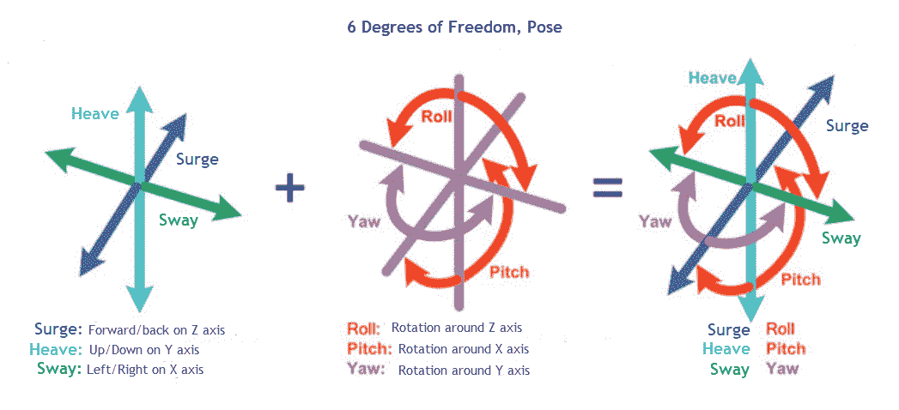
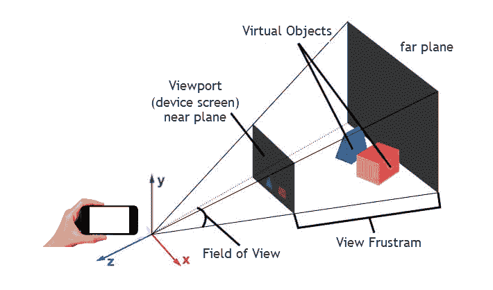
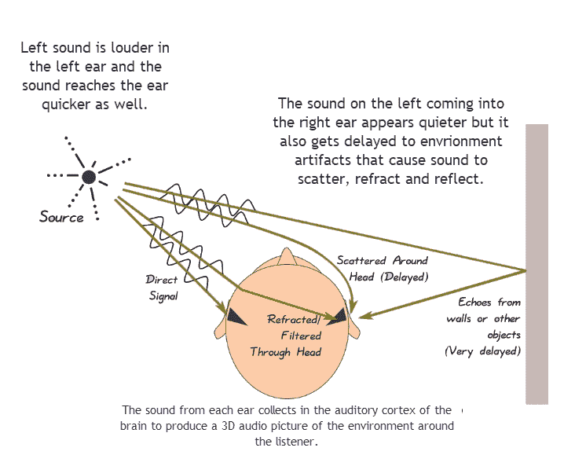
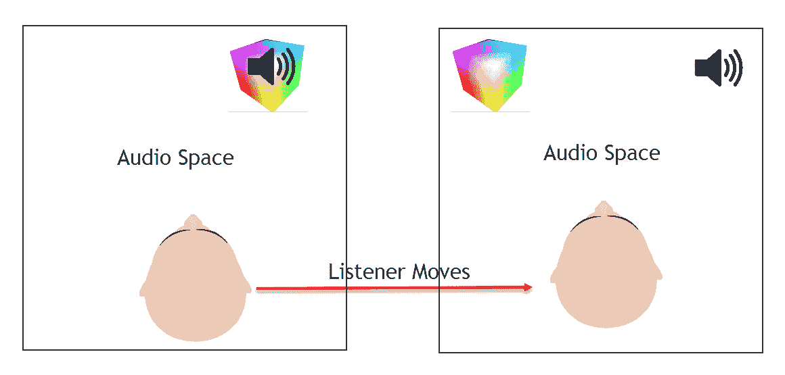
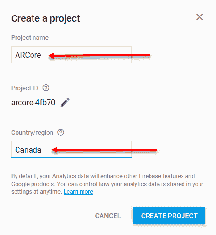
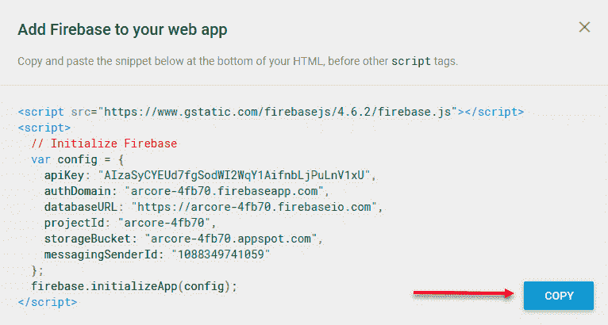
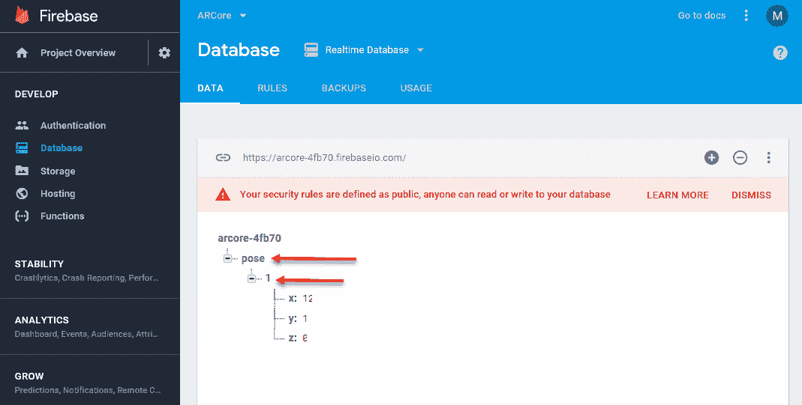

# 第五章：实际世界运动跟踪

现在我们已经设置并准备好了所有有趣的东西，我们可以开始构建一些实际的 AR 应用。为了做到这一点，我们将从样本中挑选和选择我们需要的各种组件。样本是很好的例子，但大部分只是样板代码。这意味着我们没有理由重写已经运行良好的代码部分。相反，我们将专注于添加新的代码来解决 AR 问题。在本章中，我们将深入了解 ARCore 运动跟踪的工作原理。我们将学习 ARCore 运动跟踪的当前局限性，并开发一种克服这些局限性的技术。以下是本章我们将涵盖的主要主题：

+   深度运动跟踪

+   3D 声音

+   Resonance Audio

+   使用 Firebase 的跟踪服务

+   可视化跟踪运动

为了成功完成本章的练习，读者需要完成到第四章，*ARCore on the Web*的设置。回顾该章节的一些练习可能会有所帮助。

# 深度运动跟踪

ARCore 使用称为**视觉惯性里程计**（**VIO**）的算法来实现运动跟踪。VIO 结合了从设备摄像头识别图像特征与内部运动传感器，以跟踪设备相对于起始点的方向和位置。通过跟踪方向和位置，我们能够理解设备在 6 个自由度中的位置，或者我们经常所说的设备/物体的**姿态**。让我们看看以下图中姿态的样子：



6 自由度，姿态

我们在识别物体在 3D 空间中的位置和方向时，会频繁使用术语“姿态”。如果你还记得第四章，*ARCore on the Web*，姿态也可以用一种称为矩阵的数学符号来表示。我们还可以提到一种特殊形式的复数数学中的旋转，称为**四元数**。四元数允许我们以简单形式定义 3D 旋转的所有方面。再次强调，我们不会担心这里的特定数学；我们只是提及它的用法。

如果我们能通过修改后的 ARCore 样本看到它是如何工作的，可能会更有帮助。在文本编辑器中打开`Android/three.ar.js/examples`文件夹中的`spawn-at-surface.html`示例，并按照给定的步骤进行操作：

1.  滚动或搜索`update`函数。

1.  定位以下代码行：

```java
camera.updateProjectionMatrix();
```

1.  在高亮显示的行之后添加以下代码行：

```java
var pos = camera.position;
var rot = camera.rotation;
console.log("Device position (X:" + pos.x + ",Y:" + pos.y + ",Z:" + pos.z + ")");
console.log("Device orientation (pitch:" + rot._x + ",yaw:" + rot._y + ",roll:" + rot._z + ")");
```

1.  保存文件。我们添加的代码只是将摄像头的位置和方向（旋转）提取到一些辅助变量中：`pos`和`rot`。然后，使用`console.log`函数将这些值输出到控制台。碰巧的是，摄像头也代表了设备的视图。

1.  打开命令提示符或 shell 窗口。

1.  在你的`android`文件夹中通过输入以下命令启动`http-server`：

```java
cd /android
http-server -d -p 9999
```

1.  启动 Chrome 调试工具并远程连接到你的设备。

1.  使用设备上的 WebARCore 浏览器应用打开`spawn-at-surface.html`文件。

1.  切换回 Chrome 工具并点击检查。

1.  等待新窗口打开并点击控制台。在运行 AR 应用（`spawn-at-surface.html`）的同时移动你的设备，你应该会看到控制台标签更新，显示有关设备位置和方向的消息。以下是如何显示的示例：


显示设备位置和方向跟踪的输出控制台

我们在这个例子中添加的代码跟踪摄像机，它恰好代表了 AR 应用中通过设备投影的视图。我们称摄像机为 3D 场景的视图。一个 3D 场景可以有多台摄像机，但在 AR 中，我们通常只使用一台。以下是我们如何定义 3D 中的摄像机或视图投影的示意图：



3D 摄像机的视图视锥体

摄像机的主要任务是投影或展平 3D 虚拟对象到 2D 图像中，然后该图像在设备上显示。如果你在`spawn-at-surface.html`文件的中间附近滚动，你会看到以下代码，它为场景创建摄像机：

```java
camera = new THREE.ARPerspectiveCamera(
    vrDisplay,
    60,
    window.innerWidth / window.innerHeight,
    vrDisplay.depthNear,
    vrDisplay.depthFar
  );  
```

在这里，`vrDisplay`是设备的实际摄像机，`60`代表视野，`window.innerWidth / window.innerHeight`代表**宽高比**，`vrDisplay.depthNear`和`vrDisplay.depthFar`代表近平面和远平面的深度距离。近、远平面以及视野共同构成了视图视锥体。视锥体内的所有对象都将被渲染。你可以自由尝试更改这些参数，看看它们在运行应用时对场景视图有什么影响。

在这个设置中，我们使用 60 度的视野来给场景中的对象提供更自然的视角。你可以自由地尝试更大的和更小的角度，看看这对场景对象有什么视觉效果。

现在我们对如何在场景周围跟踪我们的设备有了更好的理解，我们将扩展我们的例子。在下一节中，我们将介绍 3D 空间声音。

# 3D 声音

3D 声音是我们向听众施加的另一种错觉，以进一步欺骗他们相信我们的虚拟生成世界是真实的。实际上，3D 声音多年来在电影、电视和当然，视频游戏中被广泛使用，以欺骗听众获得更沉浸式的体验。例如，在电影中，听众是静止的，因此可以通过设置多个扬声器来模仿 3D 声音。然而，在 AR 或 VR 移动应用中，声音需要来自单个（单声道）或双声道（立体声，耳机）源。幸运的是，许多聪明的人通过使用称为**双耳声音**的技术来了解我们人类耳朵的听觉方式，从而在 3D 中绘制声音。下一张图将更详细地介绍双耳音频的工作原理：



3D 声音可视化

自那以后，我们不仅弄清楚了如何录制双耳音频，还弄清楚了如何回放它，从而让我们能够播放让大脑误以为声音来源与现实不同的声音。然而，目前的大多数技术都假设用户是静止的，但在 AR 应用中，当然并非如此。在 AR 应用中，我们的用户（听众）在我们的虚拟世界中移动，这意味着听众周围的 3D 声音也需要调整。幸运的是，谷歌再次伸出援手，为 AR 和 VR 开发了一个 3D 声音 API，称为**Resonance Audio**。我们将在下一节中更深入地探讨 Resonance Audio 及其使用方法。

# Resonance Audio

谷歌开发了 Resonance Audio 作为开发者工具，用于在他们的 AR 和 VR 应用中包含 3D 空间音频。我们将使用这个工具在我们的演示应用中添加 3D 声音。让我们开始吧，首先在您喜欢的文本编辑器中打开`spawn-at-surface.html`文件，然后按照给定的步骤进行：

1.  定位到 JavaScript 的开始部分，并在变量声明中添加以下行：

```java
var cube***;** * //after this line
var audioContext;
var resonanceAudioScene;
var audioElement;
var audioElementSource;
var audio;
```

1.  现在，向下滚动到`update`函数之前，开始一个新的函数，称为`initAudio`，如下所示：

```java
function initAudio(){

}

function update(){ //before this function
```

1.  接下来，我们需要初始化一个`AudioContext`，它代表设备的立体声音。在`initAudio`函数中，输入以下内容：

```java
audioContext = new AudioContext();
```

1.  然后，我们在`Resonance`中设置音频场景，并通过添加以下内容将双耳音频输出到设备的立体声音频输出：

```java
resonanceAudioScene = new ResonanceAudio(audioContext); 
resonanceAudioScene.output.connect(audioContext.destination);
```

1.  之后，我们通过添加以下代码为用户周围的虚拟空间定义一些属性：

```java
let roomDimensions = {   width: 10, height: 100, depth: 10 };
let roomMaterials = {
   // Room wall materials
   left: 'brick-bare',
   right: 'curtain-heavy',
   front: 'marble',
   back: 'glass-thin',
   // Room floor
   down: 'grass',
   // Room ceiling
   up: 'transparent' };
```

1.  如您所见，这里有很多灵活性来定义任何您想要的`room`。在这个例子中，我们描述了一个房间，但那个房间也可以描述为一个户外空间。底部有一个关于**向上**方向的例子，其中使用了**透明**选项。透明意味着声音会穿过虚拟墙的那个方向，您可以通过将所有方向设置为透明来表示户外。

1.  现在，我们通过写入以下内容将`room`添加到音频场景中：

```java
resonanceAudioScene.setRoomProperties(roomDimensions,       
                                      roomMaterials);
```

1.  现在，`room`已经完成，让我们通过输入以下内容添加音频源：

```java
audioElement = document.createElement('audio');
audioElement.src = 'cube-sound.wav'; 

audioElementSource = audioContext.createMediaElementSource(audioElement);
audio = resonanceAudioScene.createSource();
audioElementSource.connect(audio.input);
```

1.  `audioElement`是与 HTML `audio`标签的连接。本质上，我们在这里所做的就是用通过共振路由的音频替换 HTML 的默认音频，为我们提供空间声音。

1.  最后，当我们生成盒子并播放声音时，我们需要添加我们的`audio`对象。在`onClick`函数中`THREE.ARUtils.placeObjectAtHit`函数调用之后输入给定的代码：

```java
audio.setPosition(cube.position.x,cube.position.y,cube.position.z);

audioElement.play();
```

在我们运行示例之前，我们需要下载`cube-sound.wav`文件并将其放入我们的示例文件夹中。打开你下载本书源代码的文件夹，并将文件从`Chapter_5/Resources/cube-sound.wav`复制到你的`Android/three.ar.js/examples`文件夹中。

双耳立体声之所以得名，是因为我们用两只耳朵听声音。为了从本章的音频示例中获得最大收益，请确保你戴上立体声耳机。你将能够用你设备的单声道扬声器听到一些差异，但没有耳机就不会一样。

现在你准备好运行应用程序时，保存`spawn-at-surface.html`页面，启动你的设备，关闭并重新打开 WebARCore 应用程序。在应用程序中玩耍，并通过轻触表面生成一个盒子。现在当盒子生成时，你会听到立方体声音。在场景中四处移动，看看声音是如何移动的。

不是你预期的结果？没错，声音仍然随着用户移动。那么问题是什么？问题是我们的音频场景和 3D 对象场景在两个不同的虚拟空间或维度中。以下是一个希望进一步解释这一点的图表：



音频和虚拟 3D 对象空间中的差异

我们遇到的问题是我们的音频空间随着用户移动。我们想要做的是将音频空间与我们的相机相同的参考系对齐，然后移动听众。现在，这听起来可能像是一项大量工作，如果不是因为 ARCore，那么很可能就是这样。所以，幸运的是，我们可以在之前放入的那几个控制台行之后添加一行代码来实现这一点，就像这样：

1.  找到我们在上一节中添加的两个`console.log`行，并像这样注释掉：

如果你省略了前面的部分，你需要回去完成它。本节中使用的代码需要它*。

```java
//console.log("Device position (X:" + pos.x + ",Y:" + pos.y + ",Z:" + pos.z + ")");
//console.log("Device orientation (pitch:" + rot._x + ",yaw:" + rot._y + ",roll:" + rot._z + ")");
```

1.  添加我们新的代码行：

```java
audio.setPosition(pos.x-cube.position.x,pos.y-cube.position.y,pos.z-cube.position.z);
```

1.  这行代码所做的只是调整音频位置相对于用户（相机）。它是通过减去位置向量的`X`、`Y`和`Z`值来实现的。我们也可以同样容易地减去向量。

1.  再次运行示例。生成一些盒子并四处移动。

注意，当你放置一个盒子并四处移动时，声音会改变，正如你所期望的那样。这是由于我们能够跟踪用户在相对于虚拟声音的 3D 空间中的位置。在下一节中，我们将探讨通过设置跟踪服务来扩展我们跟踪用户的能力。

# 使用 Firebase 的跟踪服务

现在，能够跟踪用户的动作固然很好，但如果我们想要跨应用或同时跟踪多个用户呢？这将需要我们编写服务器，设置数据库，创建模式等等，这当然不是一件容易的事情，也不能在仅仅一章中轻易解释。然而，如果有一个更简单的方法呢？好吧，确实有，而且，又是 Google 带着 Firebase 来帮助我们。

Firebase 是一个使用简单且跨平台的优秀应用工具和存储服务集合。我们将使用 Firebase 数据库，一个实时数据库服务，来跟踪用户的位置。打开一个网络浏览器并按照以下步骤操作：

1.  浏览到 [firebase.google.com](https://firebase.google.com/)。

1.  点击 GET STARTED 按钮。

1.  使用你的 Google（Gmail）账户登录。如果你没有，是的，你需要创建一个账户才能继续。

1.  点击 Add project 按钮。

1.  将你的项目命名为`ARCore`并选择你自己的国家/地区，如以下摘录所示：



设置 ARCore 项目

1.  点击 CREATE PROJECT。这将创建你的项目并打开 Firebase 控制台。

1.  点击 Add Firebase to your web app，它可以在项目概览页面的顶部找到。这将打开一个类似于以下对话框：



复制你项目的设置代码

1.  点击 COPY。这应该会将两个脚本标签及其内容复制到你的剪贴板中。

如果你看到的密钥和 URL 不同，不用担心；它们应该是不同的。

1.  在你喜欢的文本编辑器中打开`spawn-at-surface.html`文件。滚动到最后一行`<script>`标签之前，即带有大块代码的那一行。粘贴你之前复制的代码（*Ctrl* + *V* 和*command* + *V* 在 Mac 上）。

# 设置数据库

这样，我们就已经设置了 ARCore Firebase 项目。现在我们想要创建我们的实时数据库并为我们设置连接。返回 Firebase 控制台并按照以下步骤设置数据库：

1.  关闭我们之前留下的配置对话框。

1.  点击左侧菜单中的 Database。

1.  点击 GET STARTED。这将创建一个带有默认安全设置开启的 Firebase 实时数据库。在这个阶段，我们实际上不需要身份验证，所以让我们将其关闭。

1.  点击 RULES 标签页。默认的安全规则是用 JSON 定义的。我们想要更改它，以便我们的数据库具有公开访问权限。将 JSON 替换为以下内容：

```java
{  "rules": {    ".read": true,    ".write": true  }}
```

1.  点击 PUBLISH。你现在应该会看到一个以下安全警告：


打开公共访问后的安全警告

1.  点击 DATA 标签页。保持这个标签页和浏览器窗口打开。

关闭安全设置适用于开发原型。然而，一旦您超出原型，您需要重新启用安全设置。未能这样做可能会给您带来各种痛苦和您可能无法想象的事情。

# 测试连接时间

信不信由你，我们的实时数据库服务正在运行；现在我们只想通过从我们的 AR Web 应用向数据库写入单个值来测试我们的连接。在文本编辑器中打开`spawn-at-surface.html`，并按照以下步骤操作：

1.  滚动到我们之前添加的 Firebase 脚本。在最后一行之后添加以下代码：

```java
var database = firebase.database();
```

1.  上一行代码创建了对数据库的引用。现在，让我们使用以下代码设置一些数据：

```java
firebase.database().ref('pose/' + 1).set({x: 12,y: 1,z: 0});
```

1.  保存文件。

您可以在本书下载的源代码中的`Chapter_5/Examples`部分找到`spawn-at-surface.html`页面的各种版本。

1.  使用 [**http://localhost:9999/three.ar.js/examples/spawn-at-surface.html**](http://localhost:9999/three.ar.js/examples/spawn-at-surface.html) URL 在您的桌面浏览器上运行页面。在这个阶段，我们只是在页面开始时设置一个数据点作为测试，因此我们不需要 AR。当然，确保在运行任何测试之前启动`http-server`。

1.  页面加载后，您将看到 ARCore 警告信息，但不必担心，这只是一个对实时数据库服务的测试。

1.  返回我们之前留下的 Firebase 控制台 ****([`console.firebase.google.com/u/0/?pli=1`](https://console.firebase.google.com/u/0/?pli=1)**)****** 窗口。确保您正在查看数据库页面和 DATA 选项卡，如下所示：



检查在 Firebase 数据库上设置的数据

1.  展开姿态及其子对象，如前文摘录所示。如果一切正常，您应该看到我们为模拟姿态（位置）设置的值。

我们现在有一个服务在位，能够跟踪我们想要跟踪的任何数据。Firebase 允许我们在实时中对我们的数据和模式进行建模，这在原型设计中非常有用。它还有额外的优势，即免费、公开，并且可以从我们稍后将要工作的其他平台访问。在下一节中，我们将通过实时跟踪用户来使用我们的跟踪服务。

# 可视化跟踪运动

现在我们已经了解了如何跟踪运动并且有一个服务在位，让我们看看我们如何使用这个服务并在我们的 AR 应用中可视化跟踪数据。在文本编辑器中打开`spawn-at-surface.html`页面，并按照以下步骤操作：

1.  找到我们上次练习中添加的最后一行代码并将其删除：

```java
firebase.database().ref('pose/' + 1).set({x: 12,y: 1,z : 0}); //delete me
```

1.  将该行替换为以下代码：

```java
var idx = 1;
setInterval(function(){
 idx = idx + 1;
 if(camera){
  camera.updateProjectionMatrix();
  var pos = camera.position;
  var rot = camera.rotation;
  firebase.database().ref('pose/' + idx).set({x: pos.x,y: pos.y,z : pos.z, roll: rot._z, pitch: rot._x, yaw: rot._y });
 }  }, 1000);
```

1.  前一个代码片段中的第一行是设置索引或计数变量。然后，我们使用`setInterval`函数设置一个每秒（1000 毫秒）调用匿名函数的重复计时器。我们这样做是为了确保我们每秒只追踪一次移动。我们当然可以在像多人游戏那样的每一帧追踪移动，但现阶段，一秒就足够了。其余的代码，你已经在之前的练习中见过。

1.  保存文件。

1.  在你的浏览器设备上运行示例。现在，用设备移动。

1.  前往 Firebase 控制台。你现在应该会看到一个数据流被输入到数据库中。你可以自由地扩展数据点，并查看捕获的值。

太好了，我们现在可以看到我们的数据正在被收集。当然，除非我们能将其在 2D 或 3D 中可视化，否则对我们人类来说，要轻松理解这些数据是有点困难的，这意味着我们有几种选择。我们可以构建一个单独的网页来跟踪地图上的用户。但这听起来更像是一个标准的网络练习，所以我们把它留给有此兴趣的读者。相反，我们将使用发送到我们数据库的相同数据来绘制用户旅行的 3D 路径。再次打开那个文本编辑器并加载`spawn-at-camera.html`以继续：

1.  定位到我们在上一个练习中添加的`setInterval`函数调用。我们需要更改一些代码来创建从点到线的线条。

1.  在识别的行之后输入以下代码：

```java
firebase.database().ref('pose/' + ... //after this lineif(lastPos){   
  var material = new THREE.LineBasicMaterial({ color: 0x0000ff   });
  var geometry = new THREE.Geometry();
  geometry.vertices.push(
     new THREE.Vector3( pos.x, pos.y, pos.z ),
   new THREE.Vector3( lastPos.x, lastPos.y, lastPos.z )
  );
  var line = new THREE.Line( geometry, material );
  scene.add( line );
}
lastPos = { x: pos.x, y: pos.y, z: pos.z};
```

1.  此代码首先检查`lastPos`是否已定义。在`setInterval`计时器循环的第一次运行中，`lastPos`将是未定义的；它随后在`if`语句之后被设置。然后，在`lastPos`被定义后，我们通过调用`THREE.LineBasicMaterial`并传入十六进制颜色值来创建一个基本的`material`线条。接下来，我们使用当前的`pos`和`lastPos`变量以及`material`创建我们的`geometry`，即一条线。我们这样做是通过首先使用每个位置`x`、`y`和`z`的值构造一个`Vector3`对象。最后，我们通过调用`scene.add(line)`将`line`添加到场景中。

向量不过是有序数字的集合，其中每个数字代表一个维度。向量有许多有趣的数学特性，了解这些特性是有用的。然而，现在，我们可以将`Vector3`视为在`x`、`y`和`z`坐标上表示 3D 空间中的一个点。我们使用术语顶点来指代线、表面或网格上的向量或点。

1.  保存文件，并在你的设备上的 WebARCore 浏览器中运行它。现在当你移动时，你会看到一条蓝色线条的轨迹跟随你，如下面的图片所示：


示例显示追踪路径为蓝色线条

随意继续使用这个应用。当开发一个简单的单页网页应用时，开发周期（构建、部署和运行）非常快，这为你提供了很多快速更改、运行并轻松调试的机会。

# 练习

在每一章的结尾或接近结尾的地方，将有一个练习部分来测试你的知识，并让你在 ARCore 上获得更多经验。请独立完成以下练习：

1.  将追踪线的颜色从蓝色改为红色，或另一种颜色。

1.  将直线段替换为`SplineCurve`。提示——你需要跟踪多个之前的位置。

1.  让立方体和/或音频沿着追踪路径跟随用户。提示——你可以使用另一个`setInterval`定时器函数，每 1.1 秒（1100 毫秒）沿着路径移动盒子。

# 摘要

有了这些，我们完成了对 ARCore 运动追踪的探讨。正如我们所学的，ARCore 通过使用与设备运动传感器相关的特征识别来给我们提供跟踪位置和旋转或设备姿态的能力。然后我们学习了为什么在构建带有 3D 声音的 AR 应用时跟踪用户的位置很重要。这教会了我们我们的音频和虚拟（3D）场景之间的区别以及如何进行转换。然后我们通过设置 Firebase 实时数据库并连接到我们的 AR 应用来扩展跟踪用户的能力。通过这样做，我们现在可以全球范围内跟踪单个用户或多个用户。当然，我们没有足够的时间在这里进一步构建。现在，我们通过在设备在区域内移动时绘制用户的旅行路径来完成应用。

在下一章中，我们将回到使用 Android（Java）的工作，学习更多关于环境理解和各种相关 3D 概念，这是基础 AR 主题列表中的下一个主题。
