# 第九章：建筑设计的灯光融合

这是两个章节中的第一个，我们将构建现实世界的 AR 应用，您可以从中学习并向朋友和家人展示。与前面的章节不同，这次我们将从零开始构建我们的 AR 应用。这样，我们可以学习将 ARCore 集成到 Unity 项目中所需的具体细节。在本章中，我们将有很多内容要介绍，所以让我们开始吧。以下是我们将涵盖的主要主题的快速总结：

+   设置项目

+   放置内容

+   构建 UI

+   与虚拟交互

+   灯光和阴影

我们应用的前提是一个用于建筑和设计的 AR 工具。目前，设计应用在 AR 领域非常受欢迎，并且非常适合 ARCore 提供的工具集。

能够在或超过真实世界物体中虚拟放置对象，并立即看到它的样子，这对设计师和建筑师来说有巨大的好处。现在，使用 AR 应用的设计师可以立即用他们的愿景改变空间。想象一下，再也不用移动沙发 15 次才能把它放得恰到好处。

# 设置项目

我们将使用示例项目作为创建新项目的模板。在撰写本文时，使用 beta 版本进行 ARCore 资产导入仍然需要相当的项目设置。理想情况下，我们希望从头开始创建项目，但我们将做下一件最好的事情。下一件最好的事情是将项目从 GitHub 克隆到我们选择的新的文件夹中。你可以通过打开命令提示符并按照以下步骤开始：

1.  在您的根文件夹或工作文件夹中创建一个新的文件夹，并执行以下命令来下载 ARCore 模板：

```java
mkdir ARCore
cd ARCore
git clone https://github.com/google-ar/arcore-unity-sdk.git ARCoreDesign
```

1.  这将创建一个新的文件夹。切换到它，并从 GitHub 下载项目模板。

1.  打开 Unity 到项目对话框，并点击**打开**。

1.  使用文件夹对话框找到并选择我们刚刚将代码下载到的`ARCoreDesign`文件夹，如下所示：


打开 ARCoreDesign 项目

1.  等待 Unity 加载。确保注意编辑器状态栏底部的任何编译器错误。如果您看到它们，这意味着您可能有一个版本冲突，或者某些东西已经改变。检查您的版本，并根据需要尝试升级或降级。

1.  我们首先要做的是组织我们的文件夹结构。在项目窗口中，通过右键单击（*Ctrl* + 点击 Mac）`Assets`文件夹，并从上下文菜单中选择创建 | 文件夹来创建一个名为`ARCore_Design`的新文件夹。

1.  在新文件夹下方，添加`Scripts`、`Prefabs`、`Scenes`、`Materials`和`Models`文件夹，如图所示：


设置文件夹结构

我们刚才用于设置项目的技术，当您处理其他您想要自己定制的样本项目时非常有用。Unity 通过文件夹来管理项目，名称与文件夹名称相对应。我们不会担心设置源代码控制，因为您可以根据自己的需要自行完成。

如果您正在设置这个项目不是为了学习，那么您现在应该考虑一个源代码解决方案。Dropbox 或其他文件共享解决方案在紧急情况下可以工作，但这不是适合多个开发者的解决方案。有很多免费且相对简单的解决方案与 Unity 一起工作，所以花些时间选择一个适合您的方案。

# 构建场景

为了节省我们一些时间，我们将加载 `HelloAR` 场景并将其修改以满足我们的需求。按照以下步骤操作：

1.  通过双击它来打开 `Assets/GoogleARCore/HelloARExample/Scenes` 文件夹中的 `HelloAR` 场景。

1.  从菜单中选择文件 | 保存场景为，将场景保存在新的 `Assets/ARCore_Design/Scenes` 文件夹中，并将其命名为 `Main`。

除了我们之前使用的样本之外，从现在开始，如果我们需要修改一个文件，我们将将其复制到一个新的适当文件夹中，并重命名它。在修改外部资产时，这是一个很好的实践。这样，当你用新版本更新资产时，你的更改不会被覆盖。

1.  从菜单中选择 **编辑** | **项目设置** | **播放器**。

1.  在检查器窗口中，点击 Android 选项卡，并将包名修改为 `com.Packt.ARCoreDesign`，如以下屏幕截图所示：

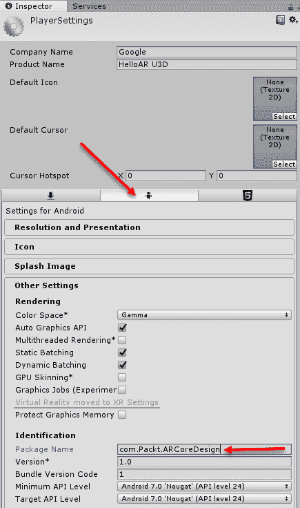

在播放器设置中编辑包名

1.  从菜单中选择文件 | 构建设置。

1.  点击 `HelloAR` 场景上的复选框以将其关闭。然后，点击 **添加打开的场景** 以将新的 `Main` 场景添加到构建中。确保平台选项为 Android，并确认一切设置正确，如以下摘录所示：


设置构建设置

1.  连接您的设备，然后点击 **构建并运行**。您将提示保存 APK。输入您用于包的相同名称（`com.Packt.ARCoreDesign`）并点击 **保存**。这将启动构建。第一次构建可能需要一些时间，所以拿一杯饮料或稍作休息。

1.  在您的设备上运行应用程序，并确认一切按预期运行。如果出现任何问题，请参考第十一章，*性能提示和故障排除*，以获取帮助。

在您完成本章的练习时，尽可能经常构建。构建可以快速告诉您是否有任何重大问题。

# 修改基础场景

我们接下来要做的就是修改基础场景以满足我们的需求。打开 Unity 并按照以下步骤操作：

1.  在层次结构窗口中选择并拖动 PointCloud 对象，并将其拖放到项目窗口中的`Assets/ARCoreDesign/Prefabs`文件夹中，如下所示：


使用 PointCloud 对象创建预制件

1.  这将创建 PointCloud 对象的预制件。将预制件想象成一个模板或几乎就像一个类。任何时候我们想要重复使用 PointCloud 对象，我们都可以将其拖入场景或实例化它。

1.  在层次结构窗口中选择 PointCloud 对象，并按 Delete 键。找到它，并点击它。这将删除该对象；我们现在不需要它。

1.  在层次结构窗口中将`ExampleController`对象重命名为`SceneController`。

1.  在`Assets/ARCoreDesign/Scripts`文件夹中选择，从菜单中选择 Assets | Create | C# Script。将脚本命名为`SceneController`。然后双击它以在最喜欢的代码编辑器中打开脚本。

1.  现在，回到 Unity。在项目搜索面板中输入`helloarcontroller`以过滤窗口到脚本。双击脚本以在代码编辑器中打开它。

1.  将整个`HelloARController.cs`脚本复制并粘贴到`SceneController.cs`文件的内容上；是的，全部。我们实际上是在制作一个副本。重命名你的类并更改命名空间，如下所示：

```java
namespace Packt.ARCoreDesign
{
...  //code omitted
public class SceneController : MonoBehaviour  //rename me
***...*** //code omitted
}  // don't forget the closing brace at the end
```

1.  我们用`namespace`包装所有新的代码文件，以避免命名冲突。如果你使用了大量资产，Unity 中命名冲突发生的频率更高。一般来说，如果你是 Unity 的新手，你将使用很多第三方资产。

1.  确保以下所有新的`using`语句都已识别，如下所示：

```java
 using System.Collections.Generic;
 using GoogleARCore;
 using UnityEngine;
 using UnityEngine.Rendering; 
 using GoogleARCore.HelloAR;

#if UNITY_EDITOR
    using Input = GoogleARCore.InstantPreviewInput; 
#endif
```

1.  保存文件并返回 Unity。务必注意查看任何编译错误。

1.  在层次结构窗口中选择`SceneController`对象，并在检查器窗口中点击添加组件按钮。

1.  在搜索面板中输入`scene`，然后选择以下摘录中的场景控制器脚本：


添加场景控制器脚本作为组件

1.  点击靶心图标以设置场景控制器的属性。确保它们与 Hello AR 控制器（脚本）匹配。当所有属性匹配时，点击 Hello AR 控制器（脚本）旁边的**齿轮**图标，并在上下文菜单中选择移除组件。你现在应该只剩下具有相同属性设置的场景控制器（场景）组件。

1.  在你的设备上连接、构建并运行应用。如果你遇到任何问题，检查编译错误并确保你正确设置了组件。

当然，我们可以为所有主要脚本创建副本，但暂时这样就可以了。显然，我们还有很多工作要做，但这是一个良好的开始。确保保存`场景`和你的项目。在下一节中，我们将查看允许用户放置的内容，并选择放置的位置。

# 环境和放置内容

我们已经介绍了如何与环境交互以放置内容的基本知识。我们现在想做的交换和添加新内容（对不起，安迪）。毕竟，我们设计应用程序的整个前提是在 AR 中可视化新家具或其他物品在空间中的样子。让我们通过打开您最喜欢的网络浏览器并跟随操作来开始吧：

1.  浏览到[turbosquid.com](https://www.turbosquid.com/)。**TurboSquid**是一个优秀的 3D 模型资源网站，提供免费和付费模型。

对于 AR / VR 和混合应用程序，您通常希望模型细节较少。例如，Android 等移动设备无法很好地渲染精细的模型。在购买任何模型之前，请确保您了解设备的渲染限制。

1.  在网站上搜索`ligne roset`。

当然，您可以使用任何喜欢的 FBX 模型，但第一次尝试使用建议的模型。如果您不确定自己在做什么，与 3D 模型一起工作可能会很令人沮丧。

1.  将搜索过滤为免费模型，并选择 Ligne Roset Citta 沙发和扶手椅，如下所示：

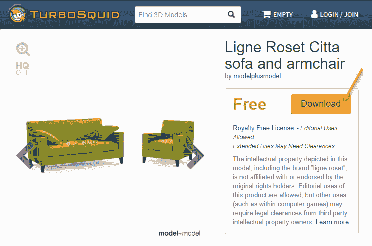

从 TurboSquid 下载模型

1.  点击下载按钮。您可能需要先创建账户并登录。

1.  点击标记为`Ligne_Roset_Citta_FBX.zip`的链接。这将下载 zip 文件。

1.  将文件解压到新文件夹中，然后打开该文件夹。选择并拖动`mpm_vol.07_p24.FBX`文件到 Unity 中，并将其拖放到`Assets/ARCore/Models`文件夹中，如下所示：


将模型拖入模型文件夹

1.  选择模型，然后在检查器窗口中确认 Model | 比例因子设置正确，如下所示：

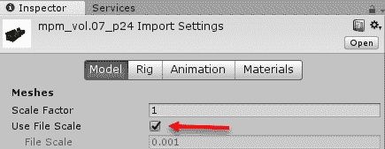

在导入模型后检查模型比例

1.  在本例中，模型使用的是文件比例，设置为`0.001`。您可能需要根据模型使用的比例进行调整。目前，这个比例是合适的。

1.  我们提供的模型包含`chair`和`sofa`。幸运的是，我们可以相对容易地将它们分开。将模型拖放到层次结构窗口的开放区域。您应该会看到`chair`和`sofa`被添加到场景中。

1.  再次在层次结构窗口的空白区域单击以禁用模型选择。

1.  从菜单中选择 GameObject | 创建空对象；将对象重命名为`sofa`。再次执行此操作以创建另一个新对象，并将其命名为`armchair`。确保`armchair`和`sofa`游戏对象设置在原点姿态，位置为(`0`, `0`, `0`)，旋转为(`0`, `0`, `0`)。如有需要，选择对象并检查检查器窗口。

1.  展开 mpm_vol.07_p24 模型，将子对象`armchair`拖动到新的`armchair`游戏对象上。为沙发部件重复此过程，您的层次结构窗口应类似于以下内容：

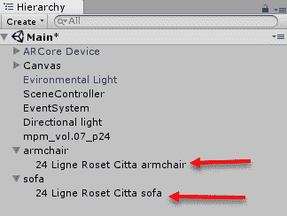

创建两个新模型

1.  我们刚才所做的就是创建新的锚点，然后分解我们的模型。锚点允许我们根据固定的锚点调整模型。在建模软件使用不同参考的情况下，您通常需要这样做。我们的模型就是这样。选择 24 Ligne Roset Citta 扶手椅子对象，并检查检查器窗口。

1.  将“扶手椅”变换的位置更改为（`0`，`0.25`，`0`），如图所示：

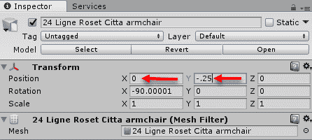

设置扶手椅的位置变换

1.  确保位置设置为 X=`0`和 Y=`-.25`，并保持旋转不变。我们正在将“扶手椅”的位置从原位置向下偏移一点。这是因为 ARCore 目前倾向于跟踪过高的平面；希望到发布时这个问题能够得到解决。无论如何，你可以在以后任何时候以任何方式调整“椅子”的位置偏移。

1.  从“层次”窗口拖动“扶手椅”对象并将其放入`Assets/ARCoreDesign/Prefabs`文件夹。同样，对“沙发”对象重复此过程。这将创建“扶手椅”和“沙发”的预制件。

1.  从“层次”窗口删除“扶手椅”、“沙发”和原始 mpm_vol.07_p24 对象。

1.  在“层次”窗口中选择`SceneController`对象，然后在检查器窗口中，将 Andy Android Prefab 设置为“扶手椅”预制件，如下所示：

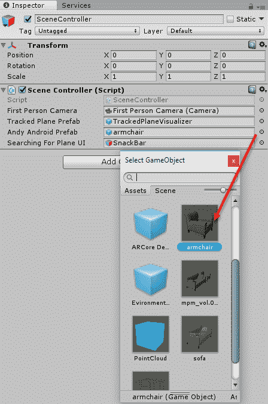

设置 SceneController 的预制件槽

1.  保存项目，连接，并在您的设备上运行应用程序。让一些表面出现，然后放置一把或两把椅子。您可以随时返回并交换沙发。请注意，您可能还需要调整“沙发”模型的定位。

好的，现在我们可以放置一些家具了，但您很快就会意识到，现在平面更碍事了。让我们看看在下一节中如何通过添加一些 UI 来开启和关闭平面。

# 构建 UI

在这个阶段，我们希望用户能够清除场景并关闭平面。平面有助于识别我们可以放置对象的表面，但它们实际上会分散用户的注意力。我们将通过构建一个非常简单的 UI 并添加几个按钮来实现这一点。幸运的是，Unity 有一个非常强大的 UI 系统，称为**uGUI**，它将允许我们快速完成这项工作。打开 Unity 编辑器的`Main`场景并按照以下步骤操作：

1.  点击“层次”窗口的空白区域以确保您的选择已清除。我们这样做是为了避免错误地将对象附加到其他对象上。

1.  从菜单中选择 GameObject | **UI** | **Canvas**。将新对象命名为`UI`，并确保此对象的属性与以下摘录中的检查器窗口相匹配：

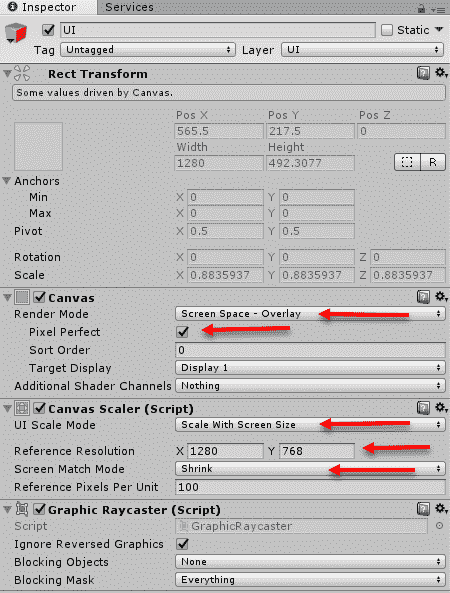

设置新 UI 画布的属性

1.  我们在这个画布上使用的设置允许我们的子`UI`对象根据特定分辨率自动与屏幕大小缩放。如果我们不这样做，我们的`UI`控件在每台设备上的缩放方式都会不同。这使我们能够保持一致的外观，这是一个好事。

1.  选择 UI 画布，从菜单中选择 GameObject | UI | Panel 以向画布添加一个新的子面板。

1.  选择新的面板对象。在检查器窗口中，点击“添加组件”，然后搜索并添加一个网格布局组组件。然后，设置此组件的属性以匹配以下屏幕摘录：


设置组布局网格（脚本）属性

1.  网格布局组是一个用于自动布局对象的实用工具。布局将自动调整大小并调整其子网格组件。

1.  在仍然选择面板的情况下，将图像组件的颜色属性更改为透明。通过点击颜色属性旁边的颜色选择区域，并将颜色设置为`#FFFFFF00`或`Alpha 0`来完成此操作。

1.  在层次窗口中选择面板对象，从菜单中选择 GameObject | UI | Button。将按钮重命名为“清除”。

1.  展开清除按钮并选择子对象。将文本组件的**文本**属性更改为清除。

1.  重复第六步和第七步，为一个新的按钮“平面”操作。完成之后，你的层次窗口和游戏窗口应该类似于以下摘录：

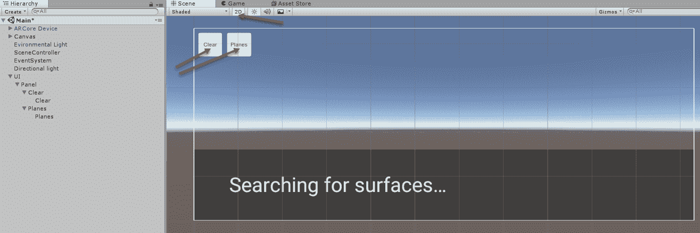

2D 视图中的完成按钮和面板

1.  通过点击场景窗口顶部的 2D 按钮，你可以以 2D 视图查看你的场景。这对于预览你正在构建的 UI 元素非常有用。之后，你可以使用鼠标和键盘自行调整视图。

1.  连接、构建和运行。按钮目前还不能工作，但改变方向看看按钮如何缩放。

随意设计这些按钮，因为毕竟这也是你的应用。你也可以添加一个滑动菜单。关于 Unity uGUI 开发，有许多优秀的资源和好书可以指导你如何扩展 UI 以符合你的外观和感觉。

# 编写按钮脚本

显然下一步是让这些按钮工作。当然，我们需要添加一些脚本，如下所示：

1.  在代码编辑器中打开我们之前创建的`SceneController`脚本。在`Update`方法之前，插入以下代码段：

```java
private List<GameObject> m_sceneObjects = new List<GameObject>();
private List<GameObject> m_scenePlanes = new List<GameObject>();
private bool m_planeOnState;
public void ClearScene()
{
  foreach(var obj in m_sceneObjects)
  {
    Destroy(obj);
  }
  m_sceneObjects.Clear();
}
public void Planes()
{
  m_planeOnState = !m_planeOnState;
  //turn plane visibility on or off
  foreach(var plane in m_scenePlanes)
  {
    plane.SetActive(m_planeOnState);
  }
}
```

1.  在此代码中，我们首先创建一些列表来存储场景中的物体（`m_sceneObjects`）和平面（`m_scenePlanes`），并添加一个新的布尔值来跟踪平面的状态`m_planeOnState`（可见或不可见）。接下来，我们添加两个新的方法（`ClearScene`和`Planes`）。`ClearScene`使用`foreach`遍历`m_sceneObjects`，并使用`Destroy`方法从场景中删除对象。`Destroy`是用于从场景中删除和清理游戏对象的方法。`Planes`方法翻转`m_planeOnState`的状态，然后遍历平面并使用`SetActive`设置它们的状态。如果一个对象是活动的，这意味着它在场景中是可见的并且正在更新。一个非活动的对象是被禁用的，并且不会渲染。

在这个例子中，我们保持与相同的命名约定一致，以匹配代码风格。如果你不习惯使用`m_`来表示私有成员变量，请不要使用它。你可能还想要重构此代码，并将`andyObject`等名称替换为更合适的名称。Visual Studio 有一套出色的重构工具，可以轻松完成此类任务。

1.  在`Update`方法中向下滚动，并在指定的行之后添加一行：

```java
var andyObject = Instantiate... //after me
m_sceneObjects.Add(andyObject);
```

1.  这行代码只是将`andyObject`（现在命名不佳）添加到我们的场景对象列表中。`andyObject`首先使用`Instantiate`方法实例化。将`Instantiate`视为`Destroy`的相反操作。

1.  向上滚动并添加到指定的行之后的一行：

```java
GameObject planeObject = Instantiate... //after mem_scenePlanes.Add(planeObject);
```

1.  这里也是一样，我们正在将新实例化的`planeObject`添加到场景平面的列表中。

1.  保存文件并返回 Unity。我们现在需要连接按钮。像往常一样，等待编译器完成以确保你没有创建语法错误。

1.  选择清除按钮，并在**检查器**窗口中滚动到**按钮**组件。点击底部的+按钮添加一个新的事件处理程序，然后设置处理程序的属性如下：

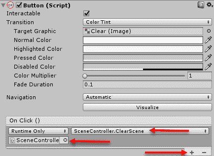

添加按钮事件处理程序

1.  为平面按钮重复此过程。这次，连接`Planes`方法。

1.  连接、构建并运行。尝试放置一个对象，然后使用按钮清除它。

现在，你应该能够打开和关闭平面的可见性，并清除你创建的任何对象。在下一节中，我们将扩展我们的 UI，以便用户可以与对象交互。

# 与虚拟交互

我们希望用户能够根据需要放置、移动或调整他们的对象姿态。如果你还记得，姿态代表了一个物体在 3D 空间中可以表示的六个自由度。在我们开始设置物体之前，我们需要能够选择一个物体。选择物体后，我们希望能够勾勒出它，以便向用户标识为已选择。由于勾勒物体听起来像是一个基本的第一步，让我们先解决这个问题。按照以下步骤创建物体勾勒：

1.  返回 Unity。在`Assets/ARCoreDesign/Materials`文件夹中创建一个新的文件夹，并将其命名为`Shaders`。

1.  在项目窗口中，在新的文件夹内右键单击（*Ctrl* + 点击 Mac），从上下文菜单中选择创建 | 着色器 | 标准表面着色器。将新着色器的名称命名为`ARMobileSpecularOutline`。

1.  双击`ARMobileSpecularOutline`着色器，在您的代码编辑器中打开它。

1.  删除文件的内容。我们将用之前使用的 ARCore 移动高光着色器来替换它。

1.  在您的文本编辑器中打开`MobileSpecularWithLightEstimation.shader`文件，并将整个内容复制到剪贴板。该文件位于`Assets/GoogleARCore/HelloARExample/Materials/Shaders`文件夹中。

1.  将剪贴板的内容粘贴到我们刚刚创建的`ARMobileSpecularOutline.shader`文件中。再次，我们正在复制示例源并将其转换为我们的代码。

虽然这个着色器是我们光估计着色器的副本，并将使用光估计，但我们希望尽可能保持变量名称简洁。通常，我们将光估计添加到着色器的名称中。然而，在这个例子中，我们将使用 AR 前缀来提醒我们这个着色器使用光估计，并且针对 AR 进行了优化。

1.  将着色器的名称（顶部行）更改为以下内容：

```java
Shader "ARCoreDesgin/ARMobileSpecularOutline"
```

1.  接下来，我们需要在文件顶部进行几个编辑。将属性部分更改为以下内容，并添加未高亮的新的行：

```java
Properties
{
  _Albedo ("Albedo", Color) = (1, 1, 1, 1)
  ***_***Shininess ("Shininess", Range (0.03, 1)) = 0.078125
 _MainTex ("Base (RGB) Gloss (A)", 2D) = "white" {}
 [NoScaleOffset] _BumpMap ("Normalmap", 2D) = "bump" {}
  _Outline ("_Outline", Range(0,0.1)) = 0
  _OutlineColor ("Color", Color) = (1, 1, 1, 1)
}
```

1.  这添加了三个新的属性：`_Albedo`、**`_Outline`**和**`_OutlineColor`**。我们添加`_Albedo`是为了在我们的材质上设置颜色而不使用纹理。`_Outline`定义了轮廓的大小，而`_OutlineColor`则指的是颜色。

1.  在标识的行之后，注入以下代码块：

```java
Tags { "RenderType"="Opaque" }
LOD 250 //after me
Pass {
  Tags { "RenderType"="Opaque" }
  Cull Front

  CGPROGRAM

  #pragma vertex vert
  #pragma fragment frag
  #include "UnityCG.cginc"

  struct v2f {
    float4 pos : SV_POSITION;
  };
  float _Outline;
  float4 _OutlineColor;

  float4 vert(appdata_base v) : SV_POSITION {
    v2f o;
    o.pos = UnityObjectToClipPos(v.vertex);
    float3 normal = mul((float3x3) UNITY_MATRIX_MV, v.normal);
    normal.x *= UNITY_MATRIX_P[0][0];
    normal.y *= UNITY_MATRIX_P[1][1];
    o.pos.xy += normal.xy * _Outline;
      return o.pos;
    }

    half4 frag(v2f i) : COLOR {
      return _OutlineColor;
    }

    ENDCG
  }
```

1.  这段代码块是创建轮廓的部分，它通过第二次渲染来实现这一点。它使用`Pass`关键字来完成这项工作。在`Pass`内部，我们可以看到更多标签的定义，以及一个使用`CGPROGRAM`开始的着色器程序的新开始。第二个块是一个**`vertex`**/`fragment`着色器，如果你查看`vert`函数，可以看到轮廓是如何计算的。它是通过将模型的顶点`normal`投影到一个由`_Outline`确定的距离来做到这一点的。然后，在`frag`函数中，我们只返回轮廓颜色。再次强调，如果这看起来令人生畏，那么它确实是。

1.  我们需要做的最后一件事是将新的`_Albedo`属性添加到我们的表面着色器中，并添加代码来使用它。向下滚动，并在标识的行之后添加以下行：

```java
fixed _GlobalLightEstimation;  //after me
float4 _Albedo;
```

1.  向下滚动到`surf`函数并修改以下行：

```java
from o.Albedo = tex.rgb;

to o.Albedo = tex.rgb * _Albedo;
```

1.  所有这些操作都是为了将`Albedo`颜色应用到纹理上。如果没有纹理，则使用`1.0`的值，这意味着只显示`Albedo`颜色。我们需要添加这部分代码，因为我们的导入模型没有纹理，我们不想不得不使用纹理。

1.  保存文件并返回 Unity。确保您没有看到任何编译错误。

这样就完成了轮廓着色器的构建，但当然，我们还想测试它的工作效果。让我们创建一个新的材质并将其设置在我们的模型上，看看效果如何：

1.  在`Assets/ARCoreDesign/Materials`文件夹中创建一个名为`ARMobileSpecularOutline_Green`的新材质。

1.  将新材质的着色器更改为使用新创建的着色器**ARCoreDesign** | **ARMobileSpecularOutline**。

1.  将`Albedo`颜色设置为一种愉快的绿色，例如`#09D488FF`。将光泽度设置为大约`0.5`左右，您自己决定。

实际的布料材质颜色是`#8F8E2A`；如果您不想有如此明显的差异，请使用该颜色。

1.  将`_Outline`设置为`0.02`，这仍然相当厚，但很明显。现在使用这个值，以后您可以更改它。

1.  在`Assets/ARCoreDesign/Prefabs`文件夹中选择`sofa`预制件，并将其**fabric**材质替换为新的**ARMobileSpecularOutline_Green**，如图所示：

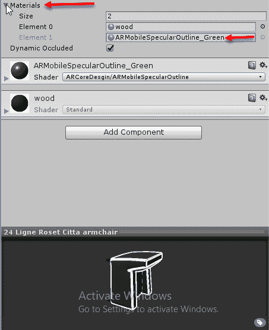

将沙发预制件更改为使用新材质

1.  保存您的项目。连接、构建然后运行。放置一个`chair`并看看效果。

我们已经有了轮廓着色器，但现在我们需要在用户选择对象时以编程方式打开轮廓。

# 构建对象轮廓

我们将构建一个`ObjectOutliner`类来为我们处理轮廓。跟随我们的步骤，构建以下部分以在用户选择对象时打开和关闭轮廓：

1.  在`Assets/ARCoreDesign/Scripts`文件夹中创建一个名为`ObjectOutliner`的新 C#脚本。

1.  用以下内容替换所有预生成的脚本：

```java
namespace Packt.ARCoreDesign
{
    using System.Collections;
    using System.Collections.Generic;
    using UnityEngine;

    public class ObjectOutliner : MonoBehaviour
    {
        public int MaterialSlot;
        public Material DefaultMaterial;
        public Material OutlineMaterial;
        public bool outlineOn; 
        public void Outline()
        {
            outlineOn = !outlineOn;
            var renderer = GetComponent<MeshRenderer>();
            Material[] mats = renderer.materials;
            if (outlineOn)
            {
                mats[MaterialSlot] = OutlineMaterial;
            }
            else
            {
                mats[MaterialSlot] = DefaultMaterial;
            }
            renderer.materials = mats;
        }
    }
}
```

1.  这个类基本上每次调用`Outline`时都会交换对象的材质与其轮廓或默认材质。

1.  接下来，在您的代码编辑器中打开`SceneController.cs`脚本。我们必须在`Update`方法中用我们自己的`Physics Raycast`包装`Session Raycast`调用。按照以下方式在突出显示的代码部分周围添加以下代码：

```java
RaycastHit rayHit;
if (Physics.Raycast(FirstPersonCamera.ScreenPointToRay(touch.position), out rayHit, 2))
  {
    var outliner = rayHit.collider.gameObject.GetComponent<ObjectOutliner>();
    if (outliner != null)
    {                    
      outliner.Outline();
    }
  }
  else
  {
    // Raycast against the location the player touched to search for planes. 
 TrackableHit hit;
 TrackableHitFlags raycastFilter = TrackableHitFlags.PlaneWithinPolygon |
 TrackableHitFlags.FeaturePointWithSurfaceNormal;

 if (Frame.Raycast(touch.position.x, touch.position.y, raycastFilter, out hit))
 {
 var andyObject = Instantiate(AndyAndroidPrefab, hit.Pose.position, hit.Pose.rotation);
 m_sceneObjects.Add(andyObject);
 // Create an anchor to allow ARCore to track the hitpoint as understanding of the physical
 // world evolves.
 var anchor = hit.Trackable.CreateAnchor(hit.Pose);

 // Andy should look at the camera but still be flush with the plane.
 if ((hit.Flags & TrackableHitFlags.PlaneWithinPolygon) != TrackableHitFlags.None)
 {
 // Get the camera position and match the y-component with the hit position.
 Vector3 cameraPositionSameY = FirstPersonCamera.transform.position;
 cameraPositionSameY.y = hit.Pose.position.y;

 // Have Andy look toward the camera respecting his "up" perspective, which may be from ceiling.
 andyObject.transform.LookAt(cameraPositionSameY, andyObject.transform.up);
 }

 // Make Andy model a child of the anchor.
 andyObject.transform.parent = anchor.transform;
 }/end of Frame.Raycast
  }
```

1.  这段代码使用了`Physics`对象的`Raycast`方法。`Physics`是封装 Unity 物理引擎的对象。`Raycast`是我们使用的方法，就像我们之前看到的`Frame.Raycast`一样，用来发射射线并检查是否有碰撞。通常，在运行射线投射操作之前，您会过滤出要测试的对象，因为这非常昂贵。您可以通过`Session`在`raycastFilter`的设置中看到这是如何完成的，其中过滤器设置为测试平面，但您也可以设置这个点。这将允许您轻松地应用墙纸等。在我们的案例中，因为我们使用`Physics`进行`Raycast`，我们可以确保您只能得到物理对象。ARCore 平面没有附加物理对象。

1.  保存文件并返回 Unity。

1.  在`Assets/ARCoreDesign/Prefabs`文件夹中找到`armchair`预制件并将其展开以查看内部模型。

1.  选择扶手椅模型，然后在检查器窗口中单击添加组件。将盒式碰撞器添加到对象中；盒式碰撞器将自动调整其大小以包围模型。`Physics`引擎仅测试碰撞器与对象的碰撞，而不是对象本身。这就是为什么我们不必担心我们的 ARCore 平面和点。如果您添加其他模型并希望它们可选中，那么始终使用最适合您形状的最简单碰撞器。简单意味着多边形更少。例如，当盒式碰撞器可以做到时，不要使用球体碰撞器。

1.  再次单击添加组件按钮，这次将我们的新对象大纲脚本添加到对象中，并将其属性设置为以下摘录中所示：

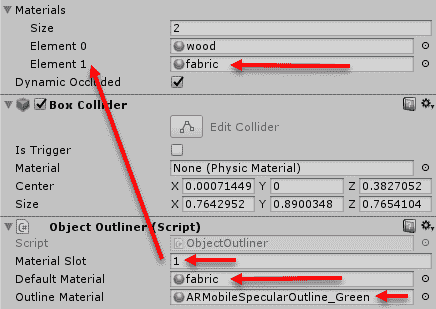

设置对象大纲属性

1.  默认材质代表模型的基色。然后，我们将轮廓材质设置为之前创建的轮廓材质。最后，我们设置要替换的槽位。我们想要替换的元素是元素 1，所以我们在材质槽位属性中输入`1`。

1.  保存项目，构建并运行。放置一把椅子，然后选择它。

现在，您可以放置一把椅子，选择它，然后取消选择。如果您发现选择对象很困难，请确保检查碰撞器是否足够大以包围该对象。在我们的例子中，自动创建的扶手椅碰撞器略有偏差；也许我们可以通过其中一个练习问题来解决这个问题。

# 放置椅子

最后一步是允许用户在选择椅子后移动它。幸运的是，我们可以在代码中完成所有这些操作。打开您的代码编辑器到`SceneController.cs`文件，并按照以下步骤进行：

1.  在指定的行之后，在类顶部添加一个新的`public`变量：

```java
public GameObject m_andyAndroidPrefab; //after me
public float MoveSpeed = .1f;
```

1.  这个新的`float MoveSpeed`设置了用户移动对象的速度。您也可以将其视为移动灵敏度。我们在这里将其设置为默认值`.1f`，但您可以在测试时在检查器中自由更改它。

1.  定位以下突出显示的代码部分，并将其替换为以下内容：

```java
if (Input.touchCount < 1 || (touch = Input.GetTouch(0)).phase != TouchPhase.Began)
{
 return;
} //replace me with

if (Input.touchCount < 1) return;
touch = Input.GetTouch(0);
if (touch.phase == TouchPhase.Began) //handle a single touch
{   //starting single touch
```

1.  之前的代码确保只测试起始触摸。现在，我们想要检查触摸开始时以及用户移动手指时。由于我们之前的`Physics`射线投射代码包装了`Session`射线投射代码，我们现在需要再次用测试第一次触摸和移动事件的代码包装它，这正是我们的第二个`if`语句所做的事情。

1.  滚动到指定的行，并在`Update`方法末尾之前添加以下代码：

```java
    // Make Andy model a child of the anchor.
    andyObject.transform.parent = anchor.transform;
 }
} //after me
}  //be sure to add the brace
else if (touch.phase == TouchPhase.Moved)
{
  var change = FirstPersonCamera.transform.forward * touch.deltaPosition.y;
  change += FirstPersonCamera.transform.right * touch.deltaPosition.x;
  change *= Time.deltaTime * MoveSpeed;

  foreach (var obj in m_sceneObjects)
  {
    var outliner = obj.GetComponentInChildren<ObjectOutliner>();
    if (outliner != null && outliner.outlineOn)
    {
      obj.transform.position += change;
    }
  }
}
```

1.  我们在这里添加的代码处理用户移动手指的情况。然后我们计算相对于相机位置的 `change` 向量。通过在 2D 中沿 *y* 轴的增量位置变换相机相对于的 `forward` 或 *z* 轴，这大致意味着当用户在屏幕上上下移动手指时，对象将在相对于相机的 `forward` 轴上移动进退。然后，我们将相对于相机的 `right` 或 *x* 轴向量添加到 `change` 向量中，并修改用户在 2D 中沿 x 轴的增量。因此，当用户在屏幕上左右移动手指时，模型将相对于相机沿 `right` 轴左右移动。

1.  向上滚动并更改 `**if**` 语句，添加以 `**&&**` 开头的新突出显示代码：

```java
if (outliner != null && outliner.outlineOn == false)
{
  outliner.Outline();
}
```

1.  这个更改只是确保如果对象被突出显示并再次选中，不会调用 `Outline` 方法。我们不再想要切换选择，但为了方便使用，我们将保持 `Outline` 方法不变。接下来，我们想要处理用户触摸到对象之外的情况。在这种情况下，我们想要禁用所有突出显示的对象。

    如果在任何时候你失去了方向或感到沮丧，请查看作为代码一部分提供的完成项目。

1.  向下滚动到指定的代码，并插入以下新代码以清除选中对象上的轮廓：

```java
else
{  //after me
  //touched outside, reset all outlined objects
  foreach (var obj in m_sceneObjects)
  {
    var outliner = obj.GetComponentInChildren<ObjectOutliner>();
    if (outliner != null && outliner.outlineOn)
    {
      outliner.Outline();
    }
  }

TrackableHit hit;  //before me
```

1.  这段代码遍历游戏 `m_scene_Objects`，找到 `ObjectOutliner` 组件，然后使用它来测试轮廓是否开启。如果轮廓开启，它将通过调用 `Outline` 来将其关闭，现在可能这个名字起得不太合适。

1.  连接、构建并运行。等待表面跟踪完成，然后放置一个 `chair`。触摸以选择，然后使用手指移动 `chair`。你还可以调整相对于 `chair` 的位置，并观察对象如何实时响应。

1.  同时按下音量下键和电源按钮来截取屏幕截图。将你的图片与以下图片进行比较：

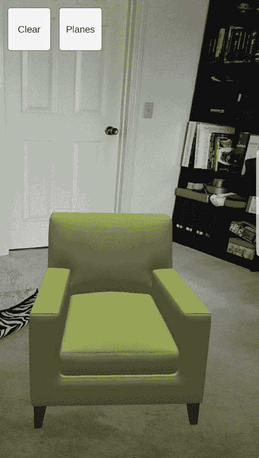

放置并移动的虚拟扶手椅

还不错，但我们可能做得更好。在下一节中，我们将回到光照，并处理对象的光照和阴影。

# 光照和阴影

光照是我们场景中的基本元素，但正如我们已经看到的，要正确设置它需要一些工作。在本节中，我们将重新审视光照，并解决添加阴影的问题。给我们的对象添加阴影将使它们看起来真的在那里。我们将从添加阴影开始，所以打开 Unity 并跟随操作：

1.  在 `Assets/ARCoreDesign/Materials/Shaders` 文件夹中创建一个新的着色器，名为 `UnlitShadowReceiver`。

1.  双击新的着色器，在代码编辑器中打开它。

1.  选择所有自动生成的代码并将其删除。然后，添加以下代码：

```java
Shader "ARCoreDesign/UnlitShadowReceiver" 
{
 Properties
 { 
  _Color("Main Color", Color) = (1,1,1,1) 
  _MainTex("Base (RGB)", 2D) = "white" {} 
  _Cutoff("Cutout", Range(0,1)) = 0.5 
 }
 SubShader
 { 
  Pass
  { 
   Alphatest Greater[_Cutoff] SetTexture[_MainTex] 
  } 

  Pass
  { 
   Blend DstColor Zero Tags{ "LightMode" = "ForwardBase" }

   CGPROGRAM
   #pragma vertex vert
   #pragma fragment frag
   #include "UnityCG.cginc"
   #pragma multi_compile_fwdbase
   #include "AutoLight.cginc"

   struct v2f 
   {
    float4 pos : SV_POSITION; LIGHTING_COORDS(0,1)
   };
   v2f vert(appdata_base v) 
   {
    v2f o; 
    o.pos = UnityObjectToClipPos(v.vertex);
    TRANSFER_VERTEX_TO_FRAGMENT(o);
    return o; 
   }
   fixed4 frag(v2f i) : COLOR 
   {
    float attenuation = LIGHT_ATTENUATION(i);
    return attenuation;
   } 
  ENDCG
  }
 }
 Fallback "Transparent/Cutout/VertexLit" 
}
```

1.  这个着色器是一个透明阴影接收器的例子。着色器分为两个阶段。在第一阶段，我们基于截止 alpha 值清除纹理。这允许我们将对象变为透明，同时仍然接收阴影。在第二阶段，使用顶点和片段着色器绘制阴影。请随意花时间进一步研究这个着色器。

随着 ARCore 的成熟，可能会提供更多版本的透明阴影接收器。计划在将来搜索其他选项或改进这种着色器形式的其他方法。

1.  保存文件并返回 Unity。

1.  在`Assets/ARCoreDesign/Materials`文件夹中创建一个新的材质，并将其命名为`UnlitShadowReceiver`。设置材质的属性，如下面的摘录所示：

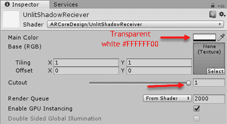

在 UnlitShadowReceiver 材质上设置属性

1.  在**项目**窗口中，从`Assets/ARCoreDesign/Materials`文件夹中选择并拖动`armchair`预制件到**层次结构**窗口的空白区域。我们想要稍微调整预制件，这是最简单的方法。

1.  从菜单中选择**GameObject** | **3D** | **Plane**。展开`armchair`对象，并将平面拖动到 24 Ligne Roset Citta 扶手椅子对象上。

1.  选择平面，并将位置重置为(`0`, `0`, `0`)，比例设置为(`0.1`, `1`, `0.1`)在 Transform.Set。将材质设置为新的 UnlitShadowReceiver，如图所示：

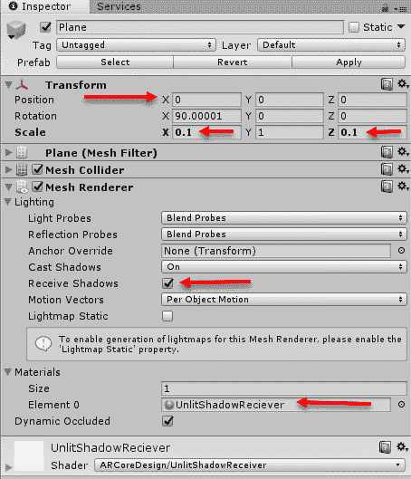

将平面材质设置为 UnlitShadowReceiver

1.  在**层次结构**窗口中选择扶手椅对象，然后在**检查器**窗口中，点击 Prefab 属性旁边的应用按钮以保存预制件。现在将预制件留在场景中，但稍后我们将想要删除它。

我们刚刚创建了一个透明的阴影接收器着色器，并将其设置在我们添加到预制件中的平面上。我们需要这样做，以便我们的对象`armchair`能够正确地在我们新的透明接收器上投射阴影。接下来，我们需要打开阴影，因为 ARCore 示例默认禁用了阴影。

# 打开阴影

按照以下步骤重新打开阴影：

1.  在层次结构窗口中选择方向光，并设置灯光属性，如图所示：

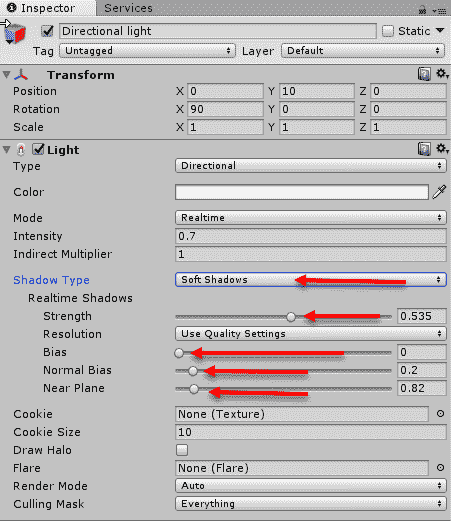

打开方向光的阴影

1.  一旦你更改了阴影类型，你应该立即在场景窗口中看到变化，扶手椅现在在下面显示阴影。如果你还没有看到阴影，不要慌张，我们可能只需要调整质量设置。

ARCore 示例使用 Blob 纹理为 Andy 模型添加阴影。通过更新以使用着色器，我们现在可以自动支持任何你想要添加的对象。只需记住调整平面以适应对象。如果你想添加一幅画或其他挂在墙上的物品，你需要将平面设置为垂直，并与对象对齐。

1.  从菜单中选择编辑 | 项目设置 | 质量。通过点击 Android 级别下的箭头图标，将 Android 构建设置为默认使用最高质量设置。这在上面的摘录中显示：

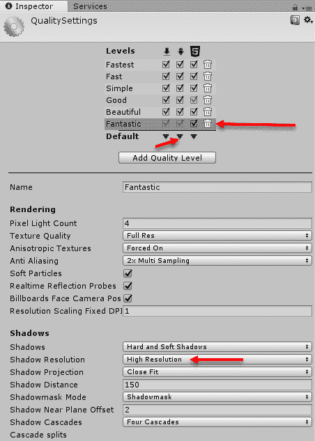

设置构建的质量设置

1.  确保再次将更改应用到预制件上。这只是为了确保在我们从场景中删除预制件之前，我们的更改已经保存。

1.  从场景中选取并删除`扶手椅`对象。

在这个示例中，我们使用了最高的质量设置。对于大多数情况，ARCore 应用将在相对较新的设备上运行，这意味着我们可以尝试推动极限。如果你发现质量设置会导致设备崩溃或无法正确渲染，那么尝试在构建中降低一个级别的质量。你可能无论如何都想要这样做，以改善你的应用性能。

1.  连接、构建和运行。放置一把椅子，看看差异，如图所示：

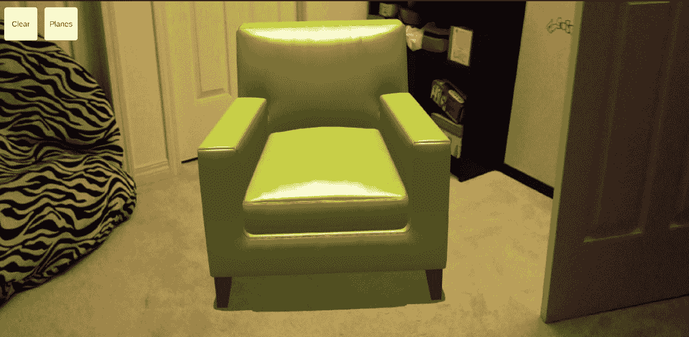

带有光照和阴影的完整应用的示例

在本章中，我们将到此为止。请随意增强应用，并花时间独立完成一些可选练习。如果阴影没有正确显示，请返回并编辑灯光和质量的阴影设置。

# 练习

*独立回答以下问题*：

1.  将应用中的模型更改为`沙发`或另一个对象。

1.  将我们对`环境光照`脚本所做的更改添加到应用中，以便跟踪光照方向。

1.  将其他对象添加到应用中，并允许用户选择放置哪个对象。

1.  允许用户放置垂直对象。提示——你现在需要渲染垂直平面，是的，ARCore 确实可以识别垂直平面。

1.  允许用户旋转模型。提示——你可能需要添加一些控制手柄。

# 摘要

这样，我们就完成了我们简单的设计应用示例。我们能够完成我们想要完成的所有主要技术项目。我们从使用 ARCore 示例作为模板设置一个新的 Unity 项目开始。这为我们节省了一些时间，否则这将变成一个非常长的章节。接下来，我们学习了如何从像[TurboSquid](https://www.turbosquid.com/)这样的网站导入新模型，以及如何将它们设置为预制件以供以后使用。然后，我们构建了一个简单的用户界面，使我们能够从视图中清除跟踪平面和清除任何模型。之后，我们添加了用户在 AR 场景中选择和移动对象的能力。这要求我们增强 ARCore 示例中的着色器，并对`SceneController`脚本进行了大量修改。最后，我们通过打开灯光并添加透明阴影接收器到我们的对象预制件来解决阴影问题。

ARCore 非常适合下一波 HoloLens 或低成本混合现实头戴式设备。在下一章中，我们将从 AR 中稍作休息，深入混合现实，我们将构建一个名为`HoloCore`的多玩家应用。
