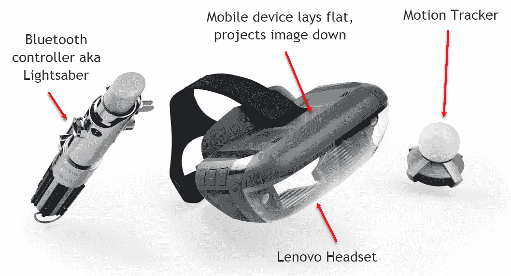

# 第十章：在混合现实中混合

**混合现实**（**MR**）是将**增强现实**和**虚拟现实**结合到同一体验或应用中的演变。MR 通常使用可穿戴设备在用户的现实世界之上叠加虚拟世界。这个概念最初是在微软推出 HoloLens 时开始受到关注的。HoloLens 是一种可穿戴眼镜设备，允许你通过手势将你的现实世界与虚拟内容叠加，这与我们在整本书中用 ARCore 所做的不太一样，只是可穿戴部分和，当然，价格标签不同。

微软目前正领导混合现实开发，他们的同名平台为整个 AR/VR 和现在的 MR 空间提供了很好的曝光。微软是一家大型的科技公司，就像许多大型科技巨头一样，已经决定重新定义混合现实的概念，使其也包括虚拟现实。

允许用户体验混合现实的可穿戴设备传统上相当昂贵，直到最近。通过众筹和其他举措，现在有很多价格低廉、不到 30 美元的美国可穿戴设备可以让你体验混合现实。这对于任何想要深入了解并学习如何开发混合现实应用的人来说是完美的。当然，并非所有混合现实平台都为移动设备设计，或者与 ARCore 兼容。幸运的是，一个名为**HoloKit**的开源项目发布了一个纸盒混合现实头戴设备，它设计用于与 ARCore 一起使用。

“我没有困惑，我只是混合得很好。”

- 罗伯特·弗罗斯特

在本章中，我们将构建一个结合 AR / MR ARCore 应用，它将作为一个技术和学习演示，展示 AR 和 MR 的强大功能。当然，我们还需要在 VR 方面稍微尝试一下，这应该会使事情变得有趣。以下是本章我们将重点关注的主要项目列表：

+   混合现实和 HoloKit

+   介绍 WRLD

+   设置 WRLD 以进行 MR

+   导航地图

+   地图绘制、GIS 和 GPS

+   接下来是什么

这是一个内容非常丰富的章节，有很多内容需要讲解。遗憾的是，由于版权问题，我们无法将其内容作为一个完整的包提供。然而，我们已经尽力将本章的每个部分都写成可以独立使用的样子，几乎就像一本烹饪书。这将允许你挑选和选择你想要和不需要使用的组件。

为了最好地体验本章的练习，建议你获得一个 HoloKit。你应该能够以大约 30 美元的价格获得这个设备。如果你感到好奇，甚至有计划可以自己制作。以下是一个链接，你可以在这里了解更多关于 HoloKit 的信息并订购自己的设备：[`holokit.io/`](https://holokit.io/)。

# 混合现实和 HoloKit

HoloKit 是由 Botau Hu 创建的，他是一位才华横溢的新技术创新者，必将在行业中取得巨大成功。这是一个*可穿戴*设备，可以将你的移动设备屏幕投射成 3D 全息投影。然后，这个全息投影叠加到用户的视野上，从而使用户能够体验一个更加沉浸的环境，这种环境通常处于 VR 的边缘。以下是一张完全组装的 HoloKit 的插图：


完全组装的 HoloKit

如从图中所示，该设备在构造上与谷歌 Cardboard 非常相似。Cardboard 是谷歌使 VR 大众化的方式，并且它成功了。如果你无法快速获得 HoloKit，你也可以使用修改后的谷歌 Cardboard。只需在纸板上为设备的摄像头切一个槽，并确保不要过多地移动。

你会首先注意到大多数混合现实耳机的一个特点就是用户可以看到他们的环境。这使用户仍然能够对周围的空间有意识，同时体验可能是一种几乎完全虚拟的经历。由于用户更加警觉，MR 设备通常被认为更安全，用户很少会经历运动病和/或跌倒。目前，由于这些问题，VR 设备被认为不适合 13 岁以下的人。

VR 运动病通常更多是应用程序性能不佳或分辨率低的结果。实际上，由延迟的应用程序或低分辨率引起的视觉伪影会对用户的头脑造成额外的压力。这种压力会以剧烈头痛或恶心等形式表现出来。在 VR 的早期，这是一个大问题，但现在技术已经足够成熟，大多数用户可以连续使用应用程序数小时。

**Mirage Solo**耳机是由*联想*为迪士尼的一款名为*绝地挑战*的游戏开发的。绝地挑战实际上更多的是一个混合现实概念的证明和展示，以及可能实现的内容。它很可能也会成为收藏品，因为它与新的星球大战系列相关联，并且恰好与即将到来的技术革命相吻合。这个项目唯一真正不幸的事情是联想从未发布开发者套件；希望他们将来能纠正这一点。

以下是一张联想 Mirage Solo 耳机的图片：



绝地挑战混合现实游戏

为了完成本章的练习，你不需要 HoloKit。HoloKit 允许你通过按按钮从 AR 切换到 MR/VR 模式。这意味着你仍然可以完成本章的所有练习。然而，这也意味着你将无法体验到 MR 的神奇体验。在下一节中，我们将设置 HoloKit 与 ARCore 一起工作，并准备好构建我们的技术演示。

# 设置 HoloKit

HoloKit 的伟大之处在于它自带完整的 Unity 模板项目。这使得我们使用 HoloKit 的过程变得非常轻松。打开命令提示符或 shell 窗口，执行以下操作：

1.  如果你还没有这样做，从根目录创建一个名为`ARCore`的新文件夹，并导航到它：

```java
mkdir ARCore
cd ARCore
```

1.  将 HoloKit 仓库克隆到其中：

```java
git clone -b android https://github.com/holokit/holokitsdk.git
```

1.  该命令克隆了特定的**Android**分支，我们将使用它。HoloKit 也支持**iOS**上的**ARKit**。

1.  打开一个新的 Unity 编辑器实例。在`ARCore`文件夹中创建并打开一个名为`HoloCore`的新项目。

1.  在项目窗口中，在 Assets 下创建一个名为`HoloCore`的新文件夹。在该新文件夹下，创建我们标准的五个新文件夹（`Scripts`、`Scenes`、`Materials`、`Models`和`Prefabs`）。

1.  使用文件资源管理器打开`ARCore/holokitsdk/Assets`文件夹。将`HoloKitSDK`文件夹复制并放置在`ARCore/HoloCore/Assets`文件夹中。完成后，返回到编辑器，你应该会看到资产正在导入和编译。导入完成后，确认你的项目窗口如下所示：


显示 HoloKitSDK 的项目窗口文件夹

1.  如果你被提示切换到 Android，通过点击 OK 选择这样做。

1.  从菜单中选择**编辑** | **项目设置** | **玩家**。这将打开玩家（即应用玩家）设置面板。选择 Android 选项卡，取消选择多线程渲染选项，并设置包名、API 级别和 ARCore 支持，如下所示：


设置 Android 的 Player 设置

1.  在`Assets/HoloKitSDK/Examples`文件夹中打开 HoloKit 示例场景`CubeOnTheFloor`。

1.  从菜单中选择文件 | 保存场景为，并将场景保存为**`Assets/HoloCore/Scenes`**文件夹中的 Main。

1.  打开构建设置并将当前场景添加到构建中。

1.  连接、构建和运行。你应该在右上角看到一个带有字母 C 的小按钮。按下该按钮即可从 AR 模式切换到 MR 模式。准备好后，将你的设备放入 HoloKit 头戴式设备中，享受你的第一个 MR 应用。

与 Google Cardboard 不同，HoloKit 需要让相机查看用户的环境以便跟踪。因此，你可能需要通过为设备摄像头切割更大的孔来修改头戴式设备。这是一张需要修改以适应三星 Galaxy S8 的 HoloKit 图片：


修改了 HoloKit 以允许相机可见地跟踪

如果你还有其他你想破解的设备，比如 Cardboard，那么只需确保你切割出一个空间，以便相机不会被遮挡。一些与移动设备兼容的其他混合现实头戴式设备已经有了相机扩展。这些相机扩展可能支持鱼眼镜头，这允许设备看到更宽的区域。这效果相当不错，因为它本质上将相机转换成了一个具有广角镜头的传感器。

# 它是如何工作的？

在我们走得太远之前，让我们打开 HoloKit 项目，看看它是如何或做什么的。打开 Unity 编辑器并完成以下操作：

1.  在层次结构窗口中找到 HoloKitCameraRig，然后选择并展开它。展开子对象的子对象，等等，直到你可以看到左眼和右眼对象，如下面的截图所示：


在层次结构窗口中查看场景的 3 个相机视图

1.  当应用处于 AR 模式时，VideoSeeThroughCamera 是主要使用的相机。当应用处于 MR 模式时，左右眼相机被用来创建立体 3D 视觉。仔细观察眼相机，你会注意到它们在*x*轴上的位置略有调整。对于右相机，调整量为 0.032，对于左相机则是-0.032。这就是我们如何通过为每只眼睛使用偏移相机来生成 3D 立体投影。

1.  其他组件如下：

    +   HoloKitAmbientLight：它只是一个带有`ARCore Environmental Light`脚本的普通方向性光源。

    +   HoloKitPlaneGenerator：它是`HelloARController`脚本的基础对象，我们之前已经见过很多次了。

    +   HoloKitPlacementRoot：它是场景中虚拟对象的主要锚点。

    +   HoloKitCameraRig：它是控制应用视图的东西。

    +   HoloKitGazeManager：它是新的，允许用户通过定位他们的注视点或视图在目标上选择对象。你现在可以用当前场景和球来尝试这个功能。将你的注视点固定在球上，看看会发生什么。

    +   HoloKitPointCloud：它与其在 ARCore 中的对应物具有相同的功能。

1.  继续浏览并检查场景中其余对象的其余部分。

1.  连接、构建并再次运行场景。这次，注意细节，看看你是否能让注视点工作。

希望这相对容易。现在，有了 HoloKit 的设置，我们为我们的 AR 和 MR 应用组合建立了框架。我们应该扩展我们的技术演示将做什么。我们的技术演示的前提将是一个允许用户在传统地图界面和 AR 或 MR 界面之间移动的应用。HoloCore 这个名字是对用户能够钻入地图并在 AR 或 MR 中渲染 3D 视图的能力的一种戏谑。这也很好地与 ARCore 的名字相呼应。在下一节中，我们将看看如何将世界 3D 地图添加到我们的应用中。

# 介绍 WRLD

混合现实应用程序，因为它们为用户提供空间感知，非常适合查看大型物体或区域，如地图。与虚拟现实不同，混合现实提供了更直观和自然的界面进行移动，因为用户也可以物理移动他们的位置。所以，还有什么比使用它来查看世界的 3D 地图来完全探索混合现实更好的方法呢。幸运的是，有一个相对较新的名为 **WRLD** 的平台，它已经开始在 AR / VR 和 MR 领域产生重大影响，因为它提供了一个优秀且简单的解决方案来渲染相当好的 3D 地图。

WRLD 是一个优秀的通用 3D 映射和可视化平台。它目前不支持更强大的后端 GIS 服务，但肯定可以。对于那些可以访问 Esri CityEngine 的专业 GIS 开发者，也有一些将 CE 模型引入 Unity 的优秀工作流程。这意味着你还可以在混合现实中实验 CE 模型。

WRLD 作为 Unity 资产直接在资产商店中提供，因此安装非常简单。然而，在我们安装之前，我们需要访问 WRLD 网站，并获取一个开发者账户。WRLD 是一项按使用量收费的商业服务。幸运的是，他们为有限的时间提供免费的开发者访问权限，这对于我们的技术演示来说非常完美。打开浏览器并完成以下操作：

1.  浏览到 [wrld3d.com](https://www.wrld3d.com/) 并注册账户。确保通过电子邮件验证账户。

1.  返回网站并登录。

1.  在页面顶部找到并点击“开发者”链接。这将带你去到开发者页面。

1.  点击页面顶部的“大访问 API 密钥”按钮。

1.  为你的密钥输入名称 `HoloCore`，然后点击“创建 API 密钥”以创建密钥，如图所示：


创建 WRLD API 密钥

1.  点击“复制 API 密钥”以将密钥复制到剪贴板。我们很快就会用到它。

1.  返回 Unity 编辑器，从菜单中选择 Window | Asset Store。这将打开编辑器内的浏览器页面。

1.  在搜索框中输入 `WRLD` 并点击搜索按钮。这将打开 `WRLD` 的资产页面，提供下载资产。点击下载按钮，如图所示：


从资产商店下载 WRLD 资产

1.  这将下载包。下载完成后，你将看到一个资产导入对话框。只需点击“导入”即可导入所有内容。这可能需要一些时间，所以请伸展一下腿脚，拿些点心。

在某些情况下，你可能想要更小心地选择将哪些内容带入你的项目中。例如，如果你正在构建一个非技术演示或概念验证，你可能会从项目中移除任何示例场景或其他多余内容。我们将在第十一章性能提示和故障排除中更多地讨论保持项目精简。

1.  你可能会收到一个警告，提示你的版本与 Unity 的版本不匹配。接受警告并继续。

1.  在你导入`WRLD`后，被提示获取密钥时，只需点击“稍后”。毕竟，我们已经有了一个密钥。

1.  接下来，你可能会被提示通过以下对话框增加阴影距离：


跳过阴影设置对话框

1.  点击跳过按钮。我们稍后需要手动调整光照、材质和阴影。

这将`WRLD`资产导入到我们的项目中。在下一节中，我们将介绍如何设置并运行`WRLD`以用于我们的 MR 应用。

# 为 WRLD 设置 MR 环境

导入资产后，我们现在可以开始设置`WRLD`以在 MR 中工作。设置需要一些定制，所以回到 Unity 并完成以下步骤：

1.  从菜单中选择**Assets** | **Setup WRLD Resources For** | **Android**。这将确保资产针对 Android 进行了优化。我们还会在稍后的部分讨论如何通过更新或创建自己的着色器来手动优化材质。

1.  确保主场景已加载，然后选择并展开**HoloKitPlacementRoot**。禁用 DebugCube 和 GazeTargetExample 子对象。如果你忘记了如何操作，请检查检查器窗口。

1.  创建一个名为`WRLD`的新子`GameObject`，属于 HoloKitPlacementRoot。转到检查器窗口，并使用添加组件来添加`Wrld Map`组件到对象。

1.  设置`Wrld Map`组件的属性，如图所示：


设置 Wrld Map 组件的属性

1.  选择并拖动新的`WRLD`对象到你的`Assets/HoloCore/Prefabs`文件夹中，以创建一个我们可以稍后使用的预制件。

1.  从层次结构窗口中选择 HoloKitCameraRig，并将变换的 Y 位置设置为`300`。由于我们的地图在`0`，`0`，`0`，我们希望观察者从大约 300 米或约 1000 英尺的高度向下看。然后展开对象，直到你看到所有的子对象。

1.  选择每个相机，VideoSeeThroughCamera，左眼和右眼，然后在检查器窗口中，将远裁剪平面设置为`5000`，如图所示：


设置远平面裁剪距离

1.  调整远裁剪平面实际上将我们的视图扩展到包括距离`5000`的所有对象。之前，这个值设置为`1000`。你可能还想将近裁剪平面增加到更大的值；`1`到`10`效果很好。如果你注意到地图上略有闪烁，这很可能是由于裁剪平面设置得太近造成的。

1.  连接、构建和运行。通过点击 C 按钮并将设备插入 HoloKit 来设置应用在 MR 中运行。享受在混合现实中查看地图的体验。

WRLD 在 Unity 和其他平台上使用其 API 有几个优秀的示例。我们构建这个示例是为了展示现实混合，而不是重新创建他们的示例。因此，我们省略了将地图放置在表面上的操作，但这是因为 WRLD 已经有一个很好的 ARKit 示例，并且很可能会在未来提供。

你刚才所体验的相当有趣，尤其是考虑到这个示例在设置上所花费的精力如此之小，除了有一些东西缺失。当然，我们希望能够移动并放大缩小我们的地图，因此我们将在下一节中介绍移动和导航。

# 导航地图

在传统的 AR 应用中，你很少移动用户或玩家。用户或玩家自己移动，AR 应用则围绕这一点工作。我们在本书中花了很多时间来理解 ARCore 如何跟踪用户并理解他们的环境，这在处理像 Andy 这样的小物体时效果相当不错。但是，如果我们想要渲染大量的虚拟物体或者嵌入新的环境，那么我们需要一种让用户也能导航这些物体的方式。因此，在本节中，我们将探讨实现从标准触摸界面到 AR 和 MR 版本的混合导航方法。如果你没有 HoloKit 或者对尝试 MR 不感兴趣，那么你可以只专注于使用 AR。

在向我们的应用添加导航之前，我们可能应该看看 WRLD 默认是如何处理导航的。打开 Unity 编辑器并跟随操作：

1.  保存你的当前场景。

1.  创建一个新的场景。将其命名为`Navigation`并在`Assets/HoloCore/Scenes`文件夹中保存场景。

1.  从`Assets/HoloCore/Prefabs`文件夹中，拖动我们之前创建的`WRLD`预制体并将其放入场景中。设置`Wrld Map`上的属性，如图所示：


设置 WRLD 预制体的属性

1.  这基本上是你将用于在非 AR 界面中将地图渲染到设备上的默认设置。

1.  打开构建设置对话框并将你的新场景添加到构建中。取消选中主场景，但不要删除它；我们稍后会再次启用它。

1.  连接、构建和运行。你现在会看到地图成为你视图中的主要元素。你可以使用触摸手势来移动、平移和缩放地图。

如您通过操作应用所见，使用触摸界面进行地图导航非常流畅。我们将使用这个场景作为我们的起始场景，并使用我们的主场景让用户切换到 AR 或 MR 模式以查看更详细的项目。为此，我们将使用我们刚刚创建的场景作为起始场景，并使用我们的主场景让用户切换到 AR 或 MR。

能够在常规触摸驱动的 UI、AR 或 MR 等界面类型之间切换始终是可行的。当然，一个很好的例子是来自 Niantic Labs 的流行游戏 *Pokémon Go*。这也恰好使用地图，并允许用户切换到 AR 来捕捉宝可梦。如果你对 Pokémon Go 是如何构建的感到好奇，可以查看由 *Micheal Lanham* 编写的书籍 *Augmented Reality Game Development*，该书也来自 *Packt*。

# 从 AR 切换到 MR

能够切换场景并保持状态是一个常见的任务，但在 Unity 中似乎需要做一点工作。打开 Unity 编辑器到 `Navigation` 场景并完成以下操作：

1.  打开 `Assets/HoloCore/Scripts` 文件夹，创建一个新的脚本，命名为 `Singleton`。转到书籍下载的源代码文件夹 `Code/Chapter_10`，复制 `Singleton.cs` 文件的全部内容，并将其粘贴到你的新脚本中。`Singleton` 是 Unity 中创建只希望有一个对象且永远不希望该对象被销毁的常见模式。如果你对 `Singleton` 比较陌生，最好花些时间复习这个类。

1.  在同一文件夹中创建一个新的脚本，命名为 `SceneController` 并替换生成的代码为以下内容：

```java
using System;
using UnityEngine;
using UnityEngine.SceneManagement;
using Wrld;
using Wrld.Space;
namespace Packt.HoloCore
{
  public class SceneController : Singleton<SceneController>
  { 
    protected SceneController() { }
  }
}
```

1.  `SceneController` 是一个具有 `SceneController` 的 `Singleton`。这种循环引用可能有点令人困惑，所以最好将其视为一个 `SceneController`，它是一个 `Singleton`，持有 `SceneController` 类型。在类内部，我们需要定义一个 `protected` 默认构造函数，以便通过 `Instance` 强制访问。我们很快就会看看如何使用 `Instance`。

1.  在构造函数之后输入以下内容：

```java
public LatLongAltitude position;
```

1.  接下来，我们将添加一个单独的属性来保存相机最后固定的位置。这样，当我们切换场景时，我们只需将 `position` 属性传递回场景，以便它可以确定设置的位置。`LatLongAltitude` 是一种空间数据类型，它保存了相机的纬度、经度和高度。

1.  添加以下新的方法，`LoadScene`，并使用以下代码：

```java
public void LoadScene(string scene, Camera mapCamera)
{
   if (Api.Instance.CameraApi.HasControlledCamera)
   {
     mapCamera = Api.Instance.CameraApi.GetControlledCamera(); 
   }
   if(mapCamera == null) throw new ArgumentNullException("Camera", "Camera must be set, if map is not controlled.");

  position = Api.Instance.CameraApi.ScreenToGeographicPoint(new Vector3(mapCamera.pixelHeight/2, mapCamera.pixelWidth/2, mapCamera.nearClipPlane), mapCamera);

  SceneManager.LoadScene(scene, LoadSceneMode.Single);
}
```

1.  `LoadScene`，这是所有工作发生的地方。我们将在`SceneController`上调用`LoadScene`，传入我们想要在当前`map`或 WRLD 相机中加载的`scene`名称。在方法内部，我们首先测试当前`map`是否正在被控制；如果是，我们只需忽略相机并使用被控制的相机。接下来，我们测试`mapCamera`是否为 null；如果是，我们希望带错误退出。否则，我们使用`ScreenToGeographicPoint`提取当前位置。此方法提取相机的主屏幕焦点，我们假设它位于屏幕宽度和高度的一半像素处；`mapCamera.nearClipPlane`设置视图锥体或相机的正面，如果您还记得我们之前的讨论，这等于相机相对于地面高度，或者在这个例子中是地图。在方法结束时，我们使用`SceneManager`，这是 Unity 加载场景的辅助类。我们使用`LoadSceneMode.Single`选项调用`LoadScene`。

这就完成了我们的`SceneController`。现在，作为`Singleton`的好处是，我们永远不需要物理添加组件，因为它现在始终被认为是可用的。WRLD 的大部分 Unity API 也是基于这个模式。我们仍然需要添加一些可以从我们的场景激活的额外代码。

# 构建场景切换器

让我们添加另一个脚本/组件，它将仅激活我们的`SceneController`。打开编辑器并完成以下操作：

1.  创建一个新的 C#脚本，命名为`SceneSwitcher`，并用以下代码替换所有预生成的代码：

```java
using UnityEngine;
namespace Packt.HoloCore
{
  public class SceneSwitcher : MonoBehaviour {

  }
}
```

1.  在类内部创建以下属性：

```java
public Camera mapCamera;
```

1.  这是`mapCamera`的占位符，即用于渲染`Wrld 地图`的相机。当地图不是由相机控制时，我们需要这个，这种情况发生在用户处于 AR / MR 时。

1.  然后，创建以下方法：

```java
public void SwitchScenes(string sceneName)
{
   SceneController.Instance.LoadScene(sceneName, mapCamera);
}
```

1.  此方法将负责在`SceneController`上使用`LoadScene`。注意类和方法调用之间使用`Instance`。请记住，我们的`SceneController`是一个`Singleton`，它是一个对象而不是静态类。因此，我们需要一个实例，这由`Singleton`中的辅助属性`Instance`提供，因此当在`SceneController`上调用方法时，我们总是通过`Instance`调用它。

1.  如果您还没有这样做，请保存所有文件，并返回 Unity。确保您没有编译错误。

# 创建场景切换器预制件

代码完成后，现在是我们构建`SceneSwitcher`预制件的时候了。打开编辑器到`Navigation`场景并完成以下操作：

1.  从菜单中选择 GameObject | UI | Canvas。将`SceneSwitcher`组件（脚本）添加到画布中，并将其重命名为`SceneSwitcher`。将`Scene Switcher`上的地图相机属性设置为使用主相机。

1.  在“Hierarchy”窗口中选择**SceneSwitcher**对象，然后从菜单中选择 GameObject | UI | Panel。设置面板的属性，如下面的摘录所示：


在面板上设置属性

1.  通过点击按钮设置锚点，然后当“Anchor Presets”菜单打开时，同时按下旋转和位置键（Windows 上的*Shift* + *Alt*）并点击左上角。这将使面板锚定到左上角。您还需要添加一个网格布局组组件并设置指定的属性。

1.  选择面板，从菜单中选择 GameObject | UI | Button。将按钮重命名为 Switch 并设置按钮文本为 Switch。

1.  为 Switch 按钮设置 OnClick 处理程序，如下所示：


添加按钮的 OnClick 处理程序

1.  我们将参数设置为字符串类型的“Main”。Main 是我们想要切换到的场景名称，当用户点击按钮时，将切换到该场景。

1.  从“Hierarchy”窗口拖动`SceneSwitcher`对象到“Project”窗口的`Assets/HoloCore/Prefabs`文件夹中。这将为我们创建一个新的预制件，以便在主场景中使用。

1.  双击`Assets/HoloCore/Scenes`文件夹中的“Main”场景。当提示保存`Navigation`场景更改时，当然要保存。

1.  从`Assets/HoloCore/Prefabs`文件夹拖动`SceneSwitcher`预制件并将其拖放到“Hierarchy”窗口的空白区域。

1.  在`SceneSwitcher`组件（在`SceneSwitcher`对象上）上设置地图相机属性为 VideoSeeThroughCamera。

1.  展开 SceneSwitcher 对象并找到 Switch 按钮。将 OnClick 事件处理程序更改为传递`Navigation`，这是我们想要从主场景加载的场景。请记住，场景名称必须完全匹配，所以要注意大小写。

1.  保存场景。

# 修改 Wrld 地图脚本

我们几乎完成了；我们最后需要做的是让`Wrld Map`脚本从我们的单例`SceneController`中获取最后一个摄像机的位置。这意味着我们不幸地必须修改`Wrld Map`脚本的源代码。通常，我们想要避免修改第三方 API，除非我们有源代码，并且它真的是我们唯一的选项。打开位于`Assets/Wrld/API`文件夹中的`WrldMap`脚本，并按照以下步骤操作：

1.  在指定的行之间插入以下内容：

```java
using Wrld.Scripts.Utilities; //after me
using Packt.HoloCore;
#if UNITY_EDITOR //before me
```

1.  滚动到`SetupApi`方法并在指定的行之间插入以下代码：

```java
config.Collisions.BuildingCollision = m_buildingCollisions; //after meconfig.DistanceToInterest = SceneController.Instance.position.GetAltitude();
config.LatitudeDegrees = SceneController.Instance.position.GetLatitude();
config.LongitudeDegrees = SceneController.Instance.position.GetLongitude();
Transform rootTransform = null; //before me
```

1.  所有这些做的只是将地图设置到相机最后指向的位置。你可以看到我们在这里使用`SceneController`单例来访问相机最后已知的位置。你可以在`SetupApi`方法中看到定义和设置配置对象的地方。希望在未来，`Wrld`允许将此配置传递到脚本中。如果那样可能，我们就可以在传递给`WrldMap`脚本之前修改该配置，从而消除我们在这个类中添加自己代码的需要。

1.  保存文件并返回 Unity。检查是否有任何错误。

1.  打开构建设置对话框，确保两个场景都已添加、激活，并且顺序如以下摘录所示：


在构建设置对话框中设置场景和场景顺序

1.  连接、构建并运行应用。由于我们从`0`开始，即纬度和经度空间坐标的`0`，地图将从非洲海岸开始，这是`0`，`0`。使用捏合触摸手势放大，直到你看到全球视图。使用触摸滑动手势将地图平移到北美洲，目前是查看`WRLD`数据的最佳位置。选择一个熟悉的地方并放大，直到你开始看到 3D 对象。然后，按一下切换按钮以切换界面到 MR 和 AR。你可以再次按切换按钮返回主视图。以下是一张显示增强现实模式和另一个用户使用 HoloKit 头戴式设备混合现实模式的图片：


应用运行时的增强现实视图

1.  我们现在有一个应用，允许用户在地图上导航，然后切换到 AR 或 MR 模式查看感兴趣的区域。这工作得很好，但如果用户从当前位置开始会更好。为了做到这一点，我们需要对地图、GIS 和 GPS 有更多的了解，我们将在下一节中介绍。

# 地图、GIS 和 GPS

如我们已学到的，Unity 使用一个带有**笛卡尔**坐标参考系统（x、y 和 z）的点在 3D 空间中跟踪其对象。当我们在一个世界地图上绘制一个点时，情况并无不同；我们需要参考这个点，但现在我们需要使用球面或**地理**参考系统来表示地球上的一个位置，因为我们都知道地球是球形的。然而，在地理系统和笛卡尔系统之间转换是昂贵的。因此，许多地图应用使用一个称为**地球中心**、**地球固定**（**ECEF**）的中间参考系统，它在一个地球固定的笛卡尔坐标参考系统上表示地图数据。以下是一个显示笛卡尔、地理和 ECEF 坐标参考系统之间差异的图表：


坐标参考系统比较

现在，你可能已经注意到 WRLD 默认支持 ECEF。正如我们提到的，由于 ECEF 已经在笛卡尔坐标系中，转换要容易得多，也快得多。然而，对我们来说，我们只想将相机定位在用户的地理坐标参考上，这可以通过使用 GPS 从用户的设备中轻松获得。

访问用户设备上的 GPS 需要一些工作，但幸运的是，我们可以在一个地方完成所有这些操作。让我们打开`SceneController`脚本并做出以下修改：

1.  在类顶部添加两个新属性：

```java
public bool isLoaded;
public string status;
```

1.  在构造函数下方创建一个新方法：

```java
void Awake()
{
  StartCoroutine(GetLocationPoint());
}
```

1.  `Awake`方法是一个特殊的 Unity 方法，当`GameObject`首次初始化时运行。在方法内部，我们调用`StartCoroutine`。`StartCoroutine`是 Unity 中的另一个特殊方法，允许你创建`coroutine`。`Coroutines`是一种中断或打断你的代码流，做其他事情，然后返回以完成原始任务的方式。在调用中，我们传递一个方法调用`GetLocationPoint()`，将此方法设置为`coroutine`。

1.  添加以下方法来创建`coroutine`：

```java
IEnumerator GetLocationPoint()
{
}
```

1.  协程必须返回`IEnumerator`。通过添加返回类型，该方法现在可以使用返回`YieldInstruction`的`yield`或中断其执行的`yield return`语句。我们很快就会看到如何做到这一点。

1.  在`GetLocationPoint`内部添加以下行：

```java
AndroidPermissionsManager.RequestPermission(new string[] { "android.permission.ACCESS_FINE_LOCATION" });
```

1.  这行代码提示用户获取对`location`服务的访问权限，也称为 GPS。我们这样做是为了明确识别用户的`location`，前提是他们的设备 GPS 没有被阻止或者用户已经禁用了`location`服务。

Google 通过将无线端点 MAC 地址映射到地理坐标的方式本质上开发了他们自己的`location`服务。Google 通过本质上使用其自动驾驶街景汽车进行 war driving 来实现这一点。当这些汽车自动驾驶时，它们也在抓取在映射到 GPS`location`时可以检测到的每个无线设备的 MAC 地址。结果证明，这个服务实际上在提供`location`方面可以更准确，尤其是在 GPS 视线难以到达的更密集的都市地区。

1.  然后，添加以下内容：

```java
if (Input.location.isEnabledByUser == false)
{
  isLoaded = true;
  yield return SetStatus("Location not authorized, starting at 0,0", 1.0f);
  yield break;
}
```

1.  这段代码检查用户是否启用了 GPS；如果没有，我们无法做任何事情。我们将`isLoaded`设置为`true`，这将作为一个标志，让外部方法知道我们找到了或没有找到`location`。然后，我们`yield return`调用`SetStatus`的结果。记住，因为我们处于`coroutine`中，`yield return`意味着我们想要在此处中断代码执行。

1.  在`GetLocationPoint`方法下方向下滚动并添加以下新方法：

```java
public YieldInstruction SetStatus(string status, float time)
{
  this.status = status;
  return new WaitForSeconds(time);
}
```

1.  在方法内部，我们正在设置我们的`status`文本，这将是我们想要显示给用户的消息。然后，我们返回一个新的`WaitForSeconds(time)`，其中`time`代表要等待的秒数。有许多不同的`YieldInstruction`形式可以用来中断你的代码。这里的`YieldInstruction`只是等待设定数量的秒数，然后返回继续执行代码的当前位置。请注意，在`yield`过期后，无论出于什么原因，代码将从确切的位置继续执行。

1.  返回到`GetLocationPoint`中我们离开的地方。在`yield return SetStatus`调用之后，我们正在执行`yield break`。这一行会中断`coroutine`并退出方法，这在普通方法中相当于返回。

1.  现在我们已经理解了`coroutines`，让我们进入下一部分的代码：

```java
yield return SetStatus("-----STARTING LOCATION SERVICE-----", 1);
Input.location.Start();

// Wait until service initializes
int maxWait = 30;
while (Input.location.status == LocationServiceStatus.Initializing && maxWait > 0)
{
  yield return new WaitForSeconds(1);
  maxWait--;
}
```

1.  首先，我们设置一个`status`消息并让用户知道我们正在启动服务，然后我们这样做。之后，我们不断地循环，每秒使用`yield return new WaitForSeconds(1)`中断一次，每次迭代调整我们的计数器`maxWait`。我们需要等待`location`服务初始化；有时这可能需要一段时间。

1.  输入以下代码以处理当我们的计数器已过期（`maxWait<1`）的情况：

```java
// Service didn't initialize in 20 seconds
 if (maxWait < 1)
 {
   yield return SetStatus("ERROR - Location service timed out, setting to 0,0,0", 10.0f);
   isLoaded = true;
   yield break;
 }
```

1.  在`if`块内部，我们设置`status`和`loaded`标志。然后，我们使用`yield break`从`coroutine`返回。

1.  接下来，我们想要处理服务失败或启动的情况，如下所示：

```java
if (Input.location.status == LocationServiceStatus.Failed)
{
  yield return SetStatus("ERROR - Unable to determine device location.", 10.0f);
  isLoaded = true;
  yield break;
}
else
{
  //set the position
  yield return SetStatus("-----SETTING LOCATION----", 10.0f);
  position = new LatLongAltitude(Input.location.lastData.latitude, Input.location.lastData.longitude, Input.location.lastData.altitude);
  isLoaded = true; 
}
```

1.  此代码处理服务失败或成功。在失败路径中，我们设置一个错误消息并退出。否则，我们设置一个`status`并等待`10`秒。我们这样做是为了让用户能够阅读消息。然后，我们根据设备提供的地理坐标设置位置。

1.  最后，我们使用以下代码停止服务：

```java
 Input.location.Stop();
```

1.  我们停止服务是因为我们不需要不断地获取`location`更新。

    如果你想要保持服务开启并使用它来跟踪用户的`location`，例如像《精灵宝可梦 GO》这样的应用，那么只需确保在对象被销毁时停止服务。你可以在名为`OnDisable()`的方法中这样做，这是另一个特殊的 Unity 方法，用于清理对象。

1.  在这一点上，我们还想更新并重载`LoadScene`方法，如下所示：

```java
public void LoadScene(string scene)
{
  SceneManager.LoadScene(scene, LoadSceneMode.Single);
}

public void LoadScene(string scene, Camera mapCamera)
{ 
  if (Api.Instance.CameraApi.HasControlledCamera)
  {
    mapCamera = Api.Instance.CameraApi.GetControlledCamera();
  }
  else if (mapCamera == null) throw new ArgumentNullException("Camera", "Camera must be set, if map is not controlled.");
  position = Api.Instance.CameraApi.ScreenToGeographicPoint(new Vector3(mapCamera.pixelHeight / 2, mapCamera.pixelWidth / 2, mapCamera.nearClipPlane), mapCamera);

  Debug.LogFormat("cam position set {0}:{1}:{2}", position.GetLatitude(), position.GetLongitude(), position.GetAltitude());
  SceneManager.LoadScene(scene, LoadSceneMode.Single);
}
```

1.  我们对方法进行了重载，以便在切换场景时允许两种不同的行为。我们添加的新方法不会担心设置摄像机的`position`。我们还添加了一些日志记录，这样我们可以在运行应用时通过查看 Android 调试工具来查看正在设置的值。

1.  完成后保存文件。

我们刚刚设置的代码最初是从 Unity 示例中派生出来的，但已经修改过以供你重用。由于访问`location`服务可能需要一段时间，我们将添加一个新的场景来处理`location`服务的启动。这将是一个可以在以后让它更美观的启动画面。

# 制作 Splash 场景

我们正在构建的`Splash`场景目前非常基础，只有一些状态消息。当然，您可以稍后对其进行样式化并添加您喜欢的任何图像。打开编辑器并完成以下操作：

1.  创建一个名为`Splash`的新场景，并将其保存到`Assets/HoloCore/Scenes`文件夹中。

1.  从菜单中选择 GameObject | UI | Panel。这将添加一个新的 Canvas，其中包含一个子面板和 EventSystem。将面板的背景颜色设置为深灰色。

1.  选择面板，从菜单中选择 GameObject | UI | Text。将对象的名称更改为`Status`，并在检查器窗口中设置其属性，如下所示：


设置状态文本属性

1.  这是我们将向用户显示那些状态消息的地方，这意味着我们需要一个可以更新`状态`消息并知道服务何时加载以及应用何时可以开始的脚本。

1.  在`Assets/HoloCore/Scripts`文件夹中创建一个新的 C#脚本名为`SceneLoader`，并用以下代码替换预生成的代码：

```java
using UnityEngine;
using UnityEngine.UI;

namespace Packt.HoloCore
{
  public class SceneLoader : MonoBehaviour
  {
    public string sceneName;
    public Text statusText;

    void Update()
    {
      if (SceneController.Instance.isLoaded)
      {
        SceneController.Instance.LoadScene(sceneName);
      }
      else
      {
        statusText.text = SceneController.Instance.status;
      }
    }
  }
}
```

1.  这个简单的类是我们用来跟踪我们的`SceneController`的状态的。所有的动作都在`Update`方法中发生。我们首先通过测试`isLoaded`来检查`SceneController`是否已加载。如果场景未加载，我们在`statusText.text`对象中显示`状态`文本。记住，`Update`方法在每个渲染帧中运行，所以我们每秒测试这个条件几次。保存脚本，然后，我们需要将其添加为场景的组件。

1.  返回 Unity 编辑器并等待新类编译。

1.  创建一个名为`ScreenLoader`的新对象，并将新的`ScreenLoader`脚本添加到其中。然后，将`SceneLoader`的属性设置如下所示：


设置 SceneLoader 组件属性

1.  将状态文本属性设置为`Status`对象。您可以使用瞄准器图标从场景中选择对象，或者只需从层次结构窗口中拖动对象并将其放入槽中。

1.  保存场景。

1.  打开构建设置，将`Splash`场景添加到构建中，并确保它是第一个场景，如下所示：


将 Splash 场景添加到构建中

1.  继续连接、构建和运行。现在，您将被带到由`Location`服务识别的`位置`，即，如果您允许服务连接的话。

# 解决高度问题

如果您居住在海平面以上 500 米的地方，您可能会遇到一个问题。这个问题发生是因为我们的 AR 相机固定在 500 米的高度。问题是我们的 AR 相机在固定高度；我们现在需要根据相机的高度进行调整。重新打开编辑器并完成以下操作：

1.  创建一个新的 C#脚本，并用以下代码替换代码：

```java
using System.Collections;
using System.Collections.Generic;
using UnityEngine;

namespace Packt.HoloCore
{
  public class SceneCameraMover : MonoBehaviour
  {
    void Awake()
    {
      var altitude = SceneController.Instance.position.GetAltitude();
      transform.position = new Vector3(0f, (float)altitude, 0f);
    }
  }
}
```

1.  这个脚本创建了一个名为`SceneCameraMover`的新类。`SceneCameraMover`的职责是在视图切换到 AR / MR 时将 AR 摄像头移动到位。

1.  保存脚本并返回 Unity。

1.  从`Assets/HoloCore/Scenes`文件夹中打开主场景。

1.  展开 HoloKitCameraRig 并选择 VideoSeeThroughCamera。然后，使用添加组件并搜索 SceneCameraMover 来将脚本添加到组件中。

1.  将 HoloKitCameraRig 的变换设置为`0`，`0`，`0`。现在我们将让脚本将摄像头移动到所需的位子。

1.  保存场景和项目。

1.  连接、构建和运行。前往海拔较高的地区，比如山区，并切换到 AR / MR 视图。现在摄像头应该根据你观看场景的海拔高度正确定位。

确保你探索世界各地其他感兴趣的区域。在下一节中，我们将完成本章和我们对 AR 和 ARCore 的讨论，并讨论下一步行动，看看你可以在哪里构建你自己的令人难以置信的科技演示或商业应用。

WRLD 的在线示例演示建议在 ARCore 或 ARKit 应用中使用备用流式传输摄像头进行 AR 视觉效果。然而，我们发现添加备用摄像头，加上 HoloKit 已经有的两个额外摄像头，使得应用比之前更加不稳定。如果你不打算使用 MR 或 HoloKit，你可能想尝试备用流式传输摄像头。

# 接下来是什么？

我们开发的科技演示是跨用户体验集成技术可能性的绝佳例子。这已经得到了广泛的应用，一个流行的例子就是《精灵宝可梦 GO》。事实上，你可以说《精灵宝可梦 GO》将 AR 带入了我们的词汇。那么，你接下来会用 ARCore 开发什么下一个大型的 AR 应用？你还在尝试想出一些想法或可能性吗？以下是一些应用想法或正在大力投资 AR 的行业列表：

+   **娱乐（游戏）**：游戏和娱乐是你能进入的最具竞争性的领域。为这个领域开发应用需要辛勤工作和一点运气。这个领域已经取得了一些巨大的成功，但这是在一些艰苦的工作和相当大的支持之后。

+   **医疗保健（紧急服务）**：医疗保健行业正全力投入 AR / MR 和 VR 世界。由于这个行业资金雄厚，现在在这些技术领域处于领先地位。如果你想进入尖端现实开发领域，这就是你应该所在的空间。进入这个领域可能更具挑战性，因为这个行业传统上更加孤立，但现在随着增长爆炸，有很多机会。

+   **市场营销（零售）**：随着增强现实变得更加主流和易于获取，我们将遇到在这个领域开发的新应用。已经有一些伟大的创新概念被用来促进销售，并且效果显著，但增强现实在这个领域最近已经变成了一种新奇事物。然而，如果你和市场营销领域的人交谈，他们会同意总有一天大部分广告将通过增强现实提供。在此之前，也许你可以想想下一个伟大的应用，它将卖出汉堡。

+   **教育（知识转移）**：这是一个非常大的行业，进入可能很困难，尤其是如果你计划将你的应用放入教室。或者，你可以构建一个教育应用，也许教你如何烹饪，但通过应用商店提供。无论如何，这是一个可能很难进入但非常有益的行业，尤其是如果你喜欢教学或学习。

+   **军事**：除非你有军事背景或其他既定资历，否则进入这个领域非常困难。这很可能意味着你需要有强大的教育背景。如果你能进入这个领域，这确实是一个有趣的选择，但绝对不是适合每个人。如果你选择了这个方向，你肯定会从事最前沿的应用或工具的开发工作。

+   **旅游与旅游业（历史）**：这个领域与教育有所交叉，因为可能适用一些相同的原则。也许是通过增强现实向某人展示该地区的历史战役。对于所有技能水平的开发者来说，在这个领域构建增强现实/混合现实应用有很多机会。

+   **设计（所有）**：这个领域可以与零售应用紧密相连。也许是在某人身上叠加一套服装，或者尝试确定一把椅子是否适合房间。我们把这个领域放在列表的后面，因为我们的专家调查也把这一项列得较低。然而，正如我们所展示的，ARCore 有很多优秀的设计应用。

+   **工业（制造业）**：增强现实的应用可以帮助人类用户，同时也为未来系统或其它流程的自动化提供更好的基础。这意味着我们现在为人类构建的增强现实系统也将帮助我们使未来的制造机器人变得更智能。

+   **汽车**：我们已经看到增强现实系统在汽车中的应用有几年了。从抬头显示到 GPS 设备，这个行业已经接受了增强现实，尽管为这个行业开发嵌入式增强现实应用可能并不合理。大多数用户，即驾驶员，可能会更愿意使用他们设备上的增强现实。也许对于汽车行业来说，在车辆中提供一个带有增强现实界面的移动设备底座更有意义？

+   **音乐**：这更多的是针对音乐家而不是听众。这是一套帮助音乐家创作和工作的 AR 工具。可能并不适合所有人，也许将来 ARCore 会嵌入语音识别或其他音频识别技术。

无论你计划构建什么作为你的下一个应用程序，我们都衷心祝愿你一切顺利，并热切地想了解任何伟大的应用程序。请务必与作者联系，分享你的伟大应用程序概念。

# 练习

**请独立完成以下练习：**

1.  返回到 `HoloCore` 示例，并使用一个方块或球体追踪用户的位置。提示——本示例的第一部分包含在代码下载中。

1.  追踪用户在地图上的移动位置。提示——你现在需要根据最新的 GPS 读数更新用户的位置。

1.  追踪你周围多个用户的位置。提示——你可以使用 Firebase 实时数据库来追踪用户的地理位置坐标。

# 摘要

对于本章，我们稍微偏离了 AR，探索了混合增强和混合现实。我们发现，我们可以通过一个简单的设备 HoloKit 或其他廉价的头盔轻松体验混合现实应用程序。ARCore 很好地追踪用户，非常适合添加 MR 体验。谁知道呢，在未来的某一天，当每个人都戴着 MR 眼镜时，我们甚至能区分 AR 和 MR 的不同吗？然后我们设置了 HoloKit 模板应用程序，开始构建一个快速的 MR 演示。之后，我们通过添加 WRLD 扩展了我们的演示。正如我们所学的，WRLD 是一个有趣且易于使用的 API，可以快速为我们提供一些大型的、令人印象深刻的 3D 场景，这些场景代表了用户所在区域。从那里，我们为所有用户开发了一系列场景，将地图触摸界面从地图的全混合现实视角移动，在那里我们能够从他们的设备 GPS 中获取用户的地理坐标，并将它们放置在 WRLD 中的相同位置。最后，我们展望未来，并关注你可以专注于应用程序开发的行业。

我们将在下一章中完成我们的旅程，讨论性能和故障排除，这两者都将有助于你在提升技能成为更好的 AR 开发者时有所帮助。
