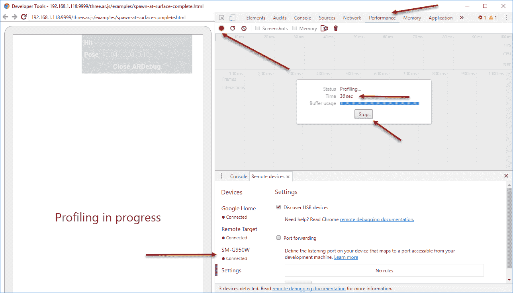
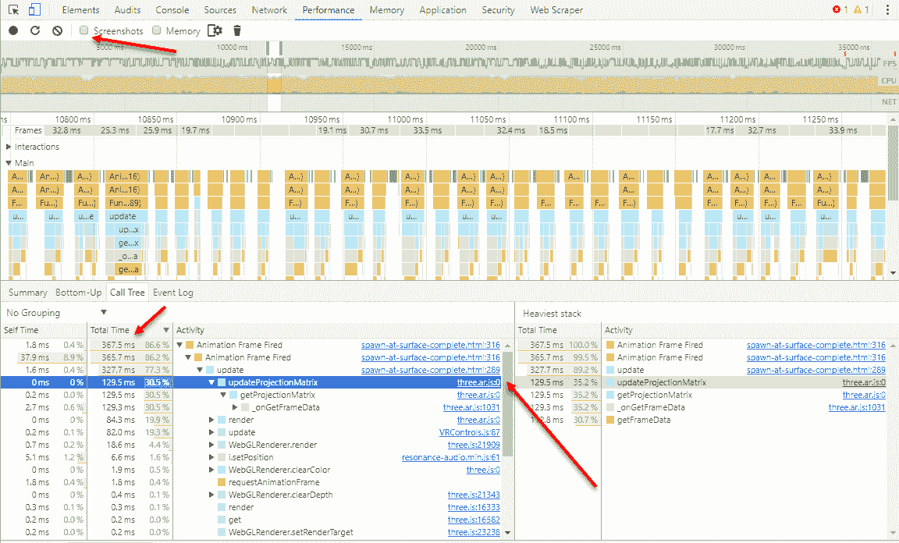
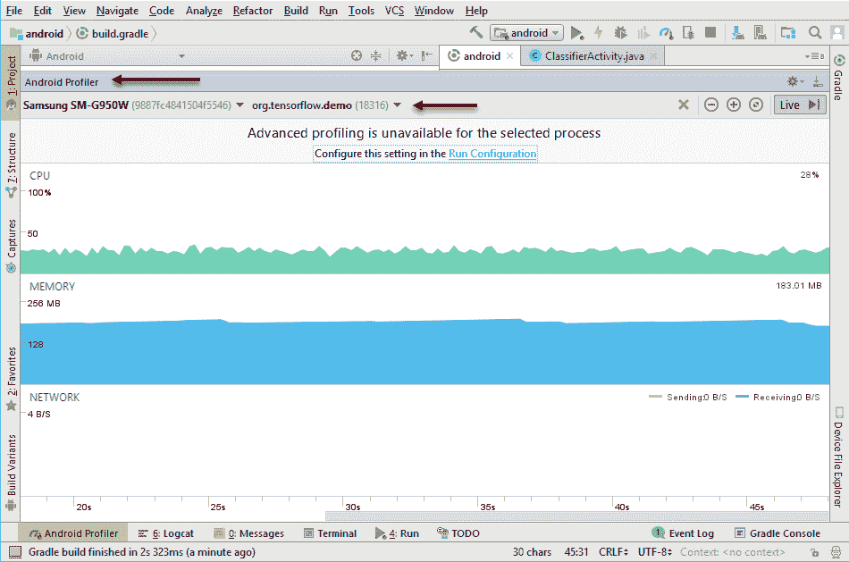
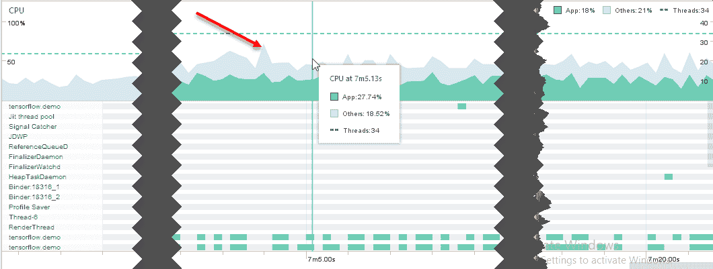
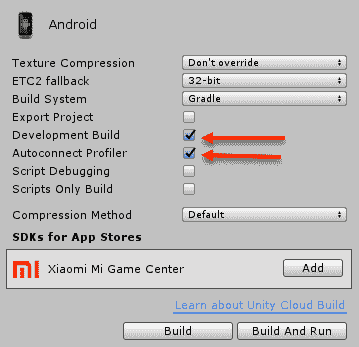
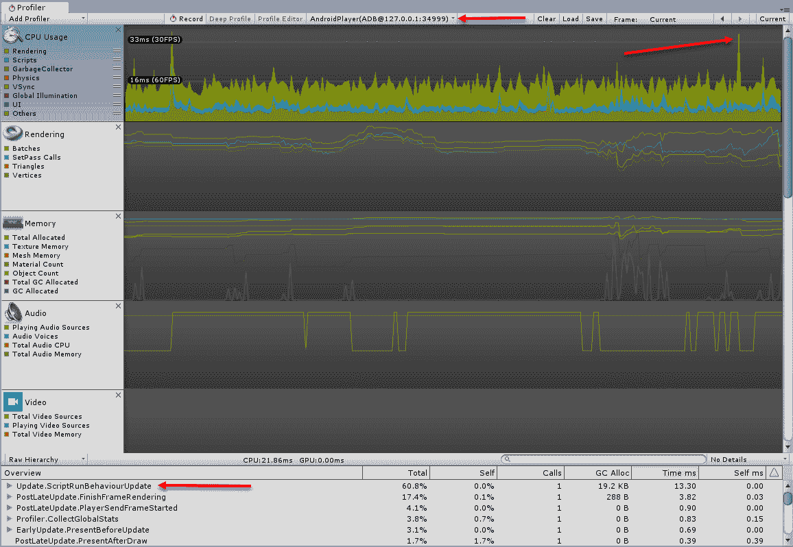
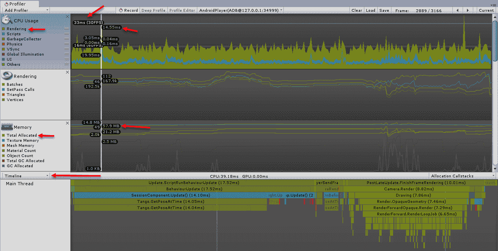
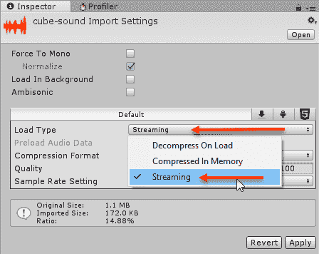
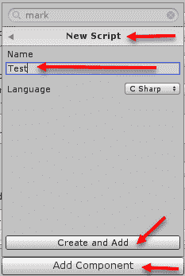
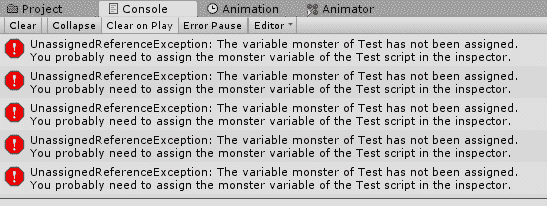

# 第十一章：性能技巧和故障排除

这将是探索**ARCore**和增强现实之旅的结束。在本章中，我们将探讨 AR 和移动应用程序的一般性能技巧。然后，我们将介绍一些故障排除解决方案，以备你遇到任何问题时使用。我们将讨论你可能会遇到的具体问题，以及如果你遇到问题时应遵循的更一般模式。以下是本章我们将涵盖的主要主题摘要：

+   诊断性能

    +   Chrome DevTools

    +   Android Profiler

    +   Unity 编辑器

+   提高性能的技巧

+   一般故障排除

+   故障排除技巧

如你很可能在本书中多次注意到的，AR 应用程序需要高水平的性能才能提供引人入胜的用户体验。在下一节中，我们将探讨我们如何使用每个平台来诊断性能。

# 诊断性能

在本节中，我们将查看你需要采取的具体步骤来诊断我们每个开发平台（Web、Android 和 Unity）的性能。在处理新或不熟悉的技术时，很容易失去对性能的跟踪。因此，你通常希望将某种形式的性能评估作为开发过程的一部分，甚至可能为当你的应用程序以低于标准的性能或帧率渲染时实施一些最低帧率警告。然而，在我们开始设计性能测试之前，我们想要了解如何在每个平台上跟踪性能，从下一节开始，我们将使用**Chrome DevTools**来跟踪 Web 平台。

# Chrome DevTools

当你使用 ARCore 开发 Web 项目时，你将享受到使用 Chrome 进行调试的便利。实际上，如果你进行比较，由于 Chrome DevTools 的功能，Web 项目性能工具在我们的平台列表中排名第二。让我们打开来自第五章，“现实世界运动跟踪”的`spawn-at-surface.html` Web 示例，并执行以下步骤：

1.  在`Android`文件夹中启动`http-server`，端口为`9999`，就像我们之前做的那样。

1.  选择一个与你的本地网络匹配的**端点**，并为其编写或复制以便稍后使用。记住，你的设备和开发机器需要处于同一网络中才能使这生效。

1.  在你的设备上启动 WebARCore 应用程序，并导航到你的选定端点。这通常看起来像`http://192.168.*.*:9999`，其中`*.*`将被你的开发机器的特定 IP 地址替换。

1.  使用 WebARCore，导航到**`http://[YOUR IP]:9999/three.ar.js/examples/spawn-at-surface.html`**。

1.  将你的设备连接到你的开发机器，无论是通过远程连接还是通过 USB 线缆。

1.  返回你的机器并启动 Chrome。使用*Ctrl* + *Shift* + *I*（在 Mac 上为*command* + *option* + *I*）打开开发者工具。

1.  点击远程设备选项卡并选择你的设备。然后，点击检查按钮以打开另一个包含设备上运行的应用 `WebView` 的 Chrome 窗口。

1.  点击性能选项卡，然后选择记录按钮以开始性能分析，如下截图所示：



使用 DevTools 开始性能分析

1.  让应用在你的设备上运行，同时性能分析器运行大约 30 秒，然后点击停止。停止捕获数据后，配置会话将在时间轴窗口中展开。

如果你发现性能分析会话不断崩溃，请通过取消勾选窗口顶部的复选框来禁用截图功能。

1.  在摘要窗口顶部点击调用树选项卡，如下所示：



性能分析会话时间轴

1.  调用树选项卡是你可以快速识别可能导致性能问题的函数调用或代码段的地方。在我们的例子中，我们深入到了 `update` 函数，并可以看到在这个函数内部花费的大部分时间是用 `updateProjectionMatrix` 调用来构建投影矩阵。由于这个调用位于 `three.ar.js` 库中，这不是我们关心的东西。

1.  随意继续测试和性能分析。尝试设置几个 Andy 模型并看看这对性能有什么影响。

在任何性能分析中，你希望快速识别的是峰值或数据波峰出现的区域。确定这些峰值发生的原因将帮助你理解哪些活动可能影响性能。例如，放置一个 Andy 将由于将模型实例化到场景中而引起峰值。你还需要密切关注应用如何从峰值中恢复。例如，应用是完全恢复，还是只部分恢复？

如果你正在你的 Web 应用中进行数据传输或执行 **AJAX** 调用，那么你还需要监控网络性能。网络选项卡具有与性能选项卡类似的工具界面。

在识别到峰值后，你将希望扩展你的视图以覆盖整个会话。然后，你可以展开调用树并识别最耗时的方法。如果你的应用在单个函数中花费了 80% 的时间，那么你需要非常小心该函数中进行的操作。找到并优化昂贵的函数通常可以让你在应用性能上获得快速提升。虽然工具不同，但相同的原理适用于我们所有的开发平台。

我们只是刚刚开始探索 DevTools 的可能性。如果你进行任何数量的 Web 开发，你将很快熟悉这些工具。在下一节中，我们将介绍 Android 性能分析工具。

# Android 性能分析器

Android Studio 拥有出色的性能分析工具；毕竟，它提供了与你的移动 Android 设备最接近的金属到金属接口。然而，它的使用并不像 DevTools 那样简单，因此在与其他性能分析工具的比较中排名第三。我们将使用我们合作过的其中一个 Android 示例项目。打开 Android Studio，并选择 `java_arcore_hello_ar` 或 `android (TensorFlow 示例)` 示例项目之一，并执行以下步骤：

1.  连接你的设备并将应用程序构建到设备上。等待应用程序在设备上开始运行。

1.  从菜单中选择视图 | 工具窗口 | Android Profiler。这将打开一个性能分析工具窗口，如下面的截图所示：



Android 性能分析器捕获实时会话

1.  当应用程序运行时，观察内存和 CPU 使用情况。你可以点击图表中的任何一点来扩展视图，查看调用堆栈和代码执行的多种其他视图，如下面的截图所示：



检查实时性能分析会话

1.  你也可以通过在性能分析窗口顶部按下记录按钮来记录会话以供后续检查。

在这一点上，你可以使用 Android Profiler 寻找性能峰值或各种函数调用的总体性能，就像你在 Chrome 中做的那样。Android 工具的学习和使用可能比较困难，但如果你在进行任何严肃的 Android/Java 开发，它们是值得努力的。在下一节中，我们将探讨使用 Unity 的最后一种性能分析方式。

# Unity 性能分析器

Unity 是一个功能强大的工具，拥有一个非常强大的性能分析工具，使用起来非常愉快，不仅可以用于性能分析，还可以深入了解 Unity 的内部工作原理。打开 Unity 编辑器中的一个我们合作过的示例项目。对于这个例子，我们将使用来自第十章 混合现实中的混合的 `HoloCore`，但如果你更喜欢其他应用程序，请随意使用。在打开编辑器后，执行以下步骤：

1.  从菜单中选择窗口 | 性能分析器。窗口将未停靠打开。通过标签拖动窗口，并将其拖到游戏窗口标签旁边以停靠。通常，我们会将性能分析器停靠在检查器旁边，以便你在编辑器中运行游戏时可以观察性能分析。由于我们无法在编辑器中运行 ARCore 应用程序，因此现在我们将通过将其停靠在游戏窗口旁边为性能分析器腾出更多空间。

1.  打开构建设置对话框，检查是否启用了开发构建和自动连接性能分析器设置，如下面的截图所示：



设置开发构建设置

1.  使用 USB 连接你的设备，构建并运行。让应用程序在设备上继续运行。

1.  返回编辑器并打开活动播放器下拉菜单，选择 AndroidPlayer(ADB@127.0.0.1:someport)，如图所示：



Unity Profiler 从 Android 设备捕获会话

1.  点击前一个屏幕截图所示的一个峰值。当 CPU 面板被选中时，将注意力集中在底部的详细面板上。

1.  使用下拉菜单选择时间线，如下所示：



检查性能分析会话的详细信息

1.  这里有很多有用的信息，一开始可能会让人感到不知所措。幸运的是，Unity 界面是自文档化的，你可以快速了解什么是好的或坏的。我们将在稍后更详细地介绍需要注意哪些区域，但现在，请注意渲染时间和总分配内存。对于渲染时间，你通常会看到以毫秒（ms）或每秒毫秒（milliseconds）为单位的时间，以及每秒帧数（FPS）或每秒帧数。一个好的规则是确保你的帧率保持在 30 FPS 以上。当为移动应用构建时，内存同样可能至关重要。

1.  当你在进行性能分析时，如果你使用的是`HoloCore`，例如，通过改变现实模式来对应用施加压力。然后，继续深入到各个详细面板，并观察应用会话中不同点的值如何变化。

Unity 工具提供了用于性能分析应用的最强大和直观的界面。虽然我们几乎只是触及了我们查看的所有工具的威力，但你将注意到它们都具有强烈的相似性。当然，这不是偶然的，在你学会在一个平台上对应用进行性能分析的所有细节之后，其中许多技能将会迁移。在下一节中，我们将查看一系列关于提高应用性能的技巧。

# 管理更好性能的技巧

现在我们已经掌握了如何对应用进行性能分析，让我们来看看将影响性能的主要项目。这些项目的顺序按一般重要性排序，但你的应用的具体需求可能会改变这些优先级。下次你需要或想要对应用进行性能分析时，请随时参考以下清单：

+   **渲染（包括负责渲染帧的所有 CPU 和内存资源）**：

    +   **渲染循环（CPU 性能）**：检查`render`函数的执行时间，并留意任何昂贵的调用。确保最小化任何对象实例化、日志记录或内部循环。记住，渲染函数，通常称为`Update`，每秒将被调用 30 次或更多。我们查看的所有工具都将让您执行这项至关重要的任务。

    +   **帧率（渲染时间）**：除了优化代码之外，帧率通常由我们渲染的复杂性和对象数量决定。因此，你可能想要尽可能优化着色器，但很多时候，通过减少三角形的数量或模型的复杂性，你可以获得很大的性能提升。在移动应用中，这意味着寻找低多边形简单模型作为资源。另一个有用的选项是为你的模型构建各种**细节级别**（**LOD**），并使用适合相应细节级别的适当版本。Unity 提供了一套免费和付费的 LOD 优化资源，可以简化这项任务。

    +   **光照**和**材质**：不仅模型的复杂性会影响性能，你用来渲染模型的纹理或材质（着色器）以及灯光也会影响。确保你限制纹理的大小，或者确保所有着色器都有回退或简化版本。你还可以尽可能简化光照。

    +   **内存（图形）**：一般来说，你的应用使用的内存越多，渲染一帧的成本就越高。当然，也有例外，但监控内存可以定位潜在的问题或甚至内存泄漏。高内存消耗通常指向可能需要优化的模型、纹理或其他资源。

+   **加载（在场景中添加、替换或更新新内容的过程）**：

    +   **对象实例化**：具有多个详细纹理的大型复杂网格将需要额外的加载时间。你通常会想要缓存或预加载对象，以减少加载过程中的中断。在我们的大多数示例中，这并不是一个问题，但一个很好的例子是在第十章，*在混合现实中的混合*，我们使用了 3D 地图。

    +   **流式传输**：流式传输是一种将媒体资源（如音频或视频）加载到播放所需内容的绝佳方式。在 Unity 中，将资源设置为流而不是完全加载相对简单，可以在资源定义时完成，如下面的截图所示：



在音频资源上启用流式传输

+   +   **垃圾回收**：在我们所有的平台上，当应用运行时，都会通过某种形式的垃圾回收来管理对象的生命周期。将创建和销毁的对象数量保持在最低限度可以减轻垃圾回收的压力。如果垃圾回收很快填满，这通常会触发一个昂贵的回收操作，这可能会冻结你的应用。你可以通过创建对象池来减少对象的实例化和回收。对象池就是你在内存中保留一批对象，根据需要从场景中添加和移除对象。

+   **交互（包括用户或环境的任何活动，无论是物理的还是人工的）**：

    +   **环境检测**：这是一个更具体于 AR 应用程序的要求，对于 ARCore 来说是至关重要的。如果你计划增强点云或平面的检测，请确保尽可能优化此代码。

    +   **对象交互（物理）**：限制你需要测试的用于射线投射或碰撞的对象数量。你可以通过标记你的对象然后过滤标签来实现这一点。在 Unity 中，这个功能是内置的，但对于其他平台来说实现起来相当简单。

    +   **AI（机器学习）**：如果你的应用程序需要为**非玩家角色**（NPC）或其他代理执行任何 AI，那么你可能想限制任何昂贵的 AI 或学习调用。例如，你可能会想将 AI 限制在每第五或第十帧运行，而不是每帧都运行。通常，这还有额外的优势，即使 AI 更真实或更智能，因为它似乎在采取行动之前会短暂地思考。

在寻找可能存在的性能问题时，前面的列表是一个很好的起点，并且它应该很好地作为你需要分析的平台指南。在下一节中，我们将介绍一些通用的故障排除技巧，这些技巧可以在开发过程中应用于每个平台。

# 一般故障排除

我们学习了每个平台的调试过程的基础，但我们从未介绍过任何调试或故障排除的技术。就像分析一样，有一个基本的指南或列表可以遵循，以使你在故障排除时更加高效。使用以下步骤列表来帮助你解决下一个问题：

1.  **控制台**：首先需要查看的是控制台报告的任何错误。我们所有的平台都提供了控制台，你应该熟悉在你的选择平台上如何访问它。错误有意义吗？你能否确定导致问题的代码部分或项目？

1.  **Google**: 如果你看到一条晦涩的控制台消息，并且不确定它是什么意思，那么就去谷歌搜索。你不需要搜索整个消息，只需提取短语中的五到六个关键词并使用这些关键词。你可能还需要添加一些词来覆盖你的平台；例如，Java、Android 或 Unity C#。

1.  **日志记录**：通过在代码的关键区域注入日志语句来对你的代码进行工具化。如果你的代码没有向控制台报告错误，请添加日志以便你知道代码的流向。这可以帮助你确定关键代码部分是否被运行。

1.  **复现**：隔离问题并尝试在一个新的项目或测试应用中复现它。如果你无法隔离代码，你可能有一个更大的问题，你可能需要重构。通常，除非问题需要解决方案或更严重，否则复现项目可以巩固你对问题的理解。复现问题不仅可以帮助你解决问题，还可以帮助你重构和清理代码。

1.  **发布它**：如果你在复制问题后仍然没有找到解决方案，那么请寻找合适的论坛并发布你的问题。确保你在发布问题时提供复制的样本。这通常会是人们首先要求你的东西，特别是如果问题很复杂。此外，展示你已经花费时间复制问题会使你的帖子更具可信度，并避免回答简单问题所浪费的时间。

1.  **绕过它**：如果你无法解决你的问题，那么就绕过它。有时，解决问题是不可能的，或者成本太高，耗时太长。那么，你需要想出另一种方法来构建功能或修改它。这通常需要回到设计师或愿景者那里，如果你的项目有这样的人的话，并咨询他们可能的解决方案。

当你遇到问题时，上述列表又是一个好的起点。如果你已经开发软件一段时间了，你可能会有自己的流程，但上述列表可能与你的大致相同。

# 故障排除代码

对于那些在代码故障排除方面经验较少的你们，请遵循以下简单练习：

1.  打开 Unity 编辑器到一个新的空白项目和起始场景。

1.  在场景中创建一个立方体对象。

1.  选择立方体，在检查器窗口中，点击“添加组件”。选择“新脚本”，将名称设置为`Test`，然后点击“创建并添加”将脚本添加到对象中，如下所示：



使用“添加组件”创建一个新的脚本。

1.  这将在根`Assets`文件夹中创建一个脚本。这不是放置脚本的最佳位置，但这种方法对于创建快速测试脚本很有用。

尽量避免在你的主要开发项目中编写复制/测试或概念验证代码。尽量保持你的主要项目尽可能干净。如果你正在构建任何商业产品，你肯定会想通过额外的努力验证你的项目中的每个资产或资源，至少是你负责的那些。定期检查你的参考和资产是一个有用的团队练习，可能每月一次，如果你正在做出多次更改，可能更频繁。

1.  在你选择的编辑器中打开`Test`脚本，并添加以下突出显示的代码行：

```java
using UnityEngine;
public class Test : MonoBehaviour {
  public GameObject monster;  //add me
  // Use this for initialization
  void Start () {

  }

  // Update is called once per frame
  void Update () {
    if(monster.transform.position.x > 5)  //and add this section
 {
 Destroy(this);
 }
  }
}
```

1.  此脚本简单地跟踪一个名为`monster`的`GameObject`，并确定其`x`位置是否超过`5`。当它超过时，脚本使用`Destroy(this)`销毁其父对象。

1.  保存文件并返回 Unity。

1.  在场景中添加另一个立方体并将其重命名为`Monster`。

1.  在编辑器的顶部按下播放按钮以开始场景。

1.  点击控制台窗口将其带到最前面。观察错误流，如下截图所示：



显示错误流的控制台窗口

1.  因此，我们看到的通用错误信息是 UnassignedReferenceException。快速谷歌搜索这个文本，看看结果中有什么。这给你带来了比控制台上的消息更多的洞察力吗？

很可能你已经解决了这个问题，但让我们继续假设我们仍然困惑。比如说，谷歌的结果不太有帮助。继续跟随我们的故障排除（调试）过程：

1.  我们下一步是记录日志。在`Update`方法中添加以下代码行：

```java
Debug.LogFormat("Monster is at position ({0})", monster.transform.position);
```

1.  这行代码将调试信息输出到控制台。

1.  当然，再次运行代码将重现相同的问题，这也意味着你只是复制了问题，并在一行代码中覆盖了下一步。

虽然日志记录是好的，但它也可能不好，对性能和试图破解你的游戏的人来说都是如此。你通常可以控制为每个环境输出你想要的日志级别。然而，作为一般规则，除非信息是必需的或有用的，否则尽量避免过多的日志记录。

在我们的示例中，此时应该很明显知道问题是什么，但当然，情况并不总是如此。当你已经尝试了所有其他途径时，如果问题仍未解决，那么你可以将问题发布到适当的论坛。如果长时间没有回复，那么你可能需要继续前进并绕过这个问题。奇怪的是，在编写绕过问题的解决方案一半时意识到错误的情况并不少见。这种情况会发生，最好的建议就是继续前进。失败是学习的好方法，你失败得越多，你学到的就越多。

在加拿大，你通过去停车场旋转并失去控制来学习如何在冰雪中驾驶。虽然这确实可以带来很多乐趣，但它教会了驾驶员如何在可控的恶劣天气条件下失去控制。这不仅给了驾驶员更多的信心，还加强了在高速度下车辆失去牵引力时的控制方法。然后，当驾驶员真的失去控制时，他们可以尝试避免或最小化损害。对你的代码进行单元测试并不像学习如何在冰雪中驾驶。它测试了代码的极限，这样你就可以确信如果某件事成功或失败会发生什么。

大多数开发者都难以理解在游戏或图形项目中添加单元测试代码的概念。实际上，由于缺乏工具或知识，这种做法是被劝阻的。单元测试或严格测试你的代码永远不会是浪费时间，而且为你的平台使用测试框架将大大简化这项任务。现在，无论你决定是否为你的代码编写单元测试，这完全取决于你，但你应该学习如何进行单元测试。仅仅学习如何测试你的代码就会让你眼界大开，看到一片新的可能性世界。

你编写的代码越多，开发的游戏或其他应用程序越多，你在故障排除错误方面就会变得越好。实践经验是无法替代的。在下一节中，我们将探讨您在阅读本书过程中可能遇到的更多具体故障排除项目。

# 练习

独立完成以下练习：

1.  修改检查怪物位置的`if`语句，以便代码完全避免错误。

1.  你能修复代码中的未分配引用问题吗？提示——查看`GameObject.Find`方法。

1.  编写一个使用键盘或鼠标作为输入来移动其块的怪物脚本。

# 故障排除技巧

在使用任何新技术时，可能会出现很多问题，这不仅是因为你对它的不熟悉，还可能是因为这项技术可能没有准备好做它声称能做的事情。以下是在阅读本书时可能会遇到的一些常见问题的表格：

| **平台** | **问题** | **解决方案** |
| --- | --- | --- |
| Web | 无法加载页面或找到服务器 | 检查您是否正在使用适合您机器的正确端点。如果您有几个选择，尝试不同的选项。确认您的系统没有运行可能阻止通信的防火墙。尝试暂时禁用防火墙并再次尝试。如果这解决了问题，那么在防火墙中为端口`9999`或您使用的任何端口创建一个例外。 |
| Web | ARCore 在页面上显示错误消息 | 确保 ARCore 服务已安装，并且您正在使用适用于您平台的 WebARCore 启用浏览器。 |
| Web | 缺少引用 | 确保您检查的内容或脚本加载路径是否正确。您可以在 Chrome 中通过检查“源”标签轻松完成此操作。 |
| Android | 无法构建或缺少引用 | Android Studio 非常有帮助，但它有时需要加载大量的引用。在这种情况下，您只需要有耐心，加载项目所需的所有内容。如果您是从头开始构建项目，您需要参考关于 Android 项目设置的优质教程来正确完成。如果您发现您仍然缺少引用，那么请创建一个新的项目并再次尝试。 |
| Android/Unity | 无法连接到设备 | 这种情况很少发生，但偶尔也会发生。请拔掉并重新插入您的设备，或在控制台或 shell 窗口中运行`adb devices`。如果您正在远程连接，您可能需要通过重新连接 USB 并重置连接来重新配置设备。 |
| Unity | 在进入播放模式之前必须修复所有编译错误 | 检查控制台是否有任何红色错误消息。双击任何消息将跳转到代码中的语法错误。尽力解决或删除语法错误。 |
| Unity | 无法构建 | 检查是否有任何编译错误，并确保您的场景已通过构建设置对话框添加到构建中。 |
| Unity | 构建停滞 | 如果你连接到设备并且电缆暂时断开，这可能会导致构建锁定或停止。通常，只需点击“取消”即可退出构建过程，然后你可以重新开始。偶尔，非常罕见的情况下，你可能需要重新启动 Unity。 |

上述表格应该能帮助你解决你在阅读本书过程中可能遇到的更多常见问题。如果你遇到的问题不在列表中，当然可以咨询 Google 或其他你喜欢的搜索引擎。你经常会发现，仅仅重新构建项目就能教会你哪里出了错。

# 摘要

这本书的最后一章，我们花了很多时间学习性能和故障排除。我们首先介绍了你可以在每个平台上使用的各种性能分析工具。然后，我们介绍了一系列非常基本的提高应用程序性能的技巧，涵盖了从帧率到资产大小的一切。这使我们能够介绍解决基本问题的技巧，以及更具体地说，是编码问题。最后，我们提供了一个有用的故障排除技巧表，如果你遇到更具体的问题，可以参考这个表。

现在你已经完成了这本书，你刚刚开始踏上探索增强现实（AR）和混合现实（MR）的旅程。Packt 出版社在 AR、网络开发、Android 开发和当然还有 Unity 方面有更多优秀的书籍。我们也鼓励读者们寻找你们当地的 AR/VR 聚会，如果没有的话，也可以自己创建一个。看到别人在 AR 或甚至 VR 开发中所做的事情可以激发新的想法和最佳实践。我们所有人，实际上都刚刚开始了一段激动人心的旅程，进入一个将彻底改变我们未来生活的全新计算界面。随着可穿戴主流商用眼镜的持续发展，你也将准备好迎接 AR 领域更多的变化。
