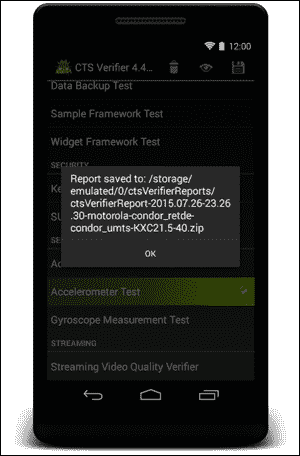

# 第一章：理解架构

在本章中，用户将了解 Android 的硬件和软件架构。我们将概述*Android 兼容性定义文档*，以便正确理解我们为了创建一个完全合规和认证的设备需要什么。

用户将了解**Android 应用框架**（**AAF**）、两个不同的 Android 运行时系统——Dalvik 和 ART，以及 Google 提供的系统库集合。

用户将有一个第一次上手的机会，设置和运行 Android 兼容性测试套件。我们将一起测试一个现有的认证设备，并迈出创建认证设备道路的第一步。

## Android 系统概述

就像每个其他操作系统一样，Android 有一个基于层的结构。下一张图展示了整个系统架构的正确抽象概述：


我们可以将系统分为以下主要层：

+   Linux 内核

+   硬件抽象层

+   核心库和运行环境

+   应用框架

+   Binder IPC

+   应用程序

软件层最接近硬件架构的是*Linux 内核*。这一层负责与硬件组件通信，并为上层提供了一个易于使用的接口。

在架构路径上继续前进，我们有 Android 运行时和核心库。这一层为应用框架提供了基本工具。应用框架是一组**现成可用**的组件，系统通过 Android SDK 将这些组件提供给应用层。顶层包含我们每天使用的所有应用——游戏、生产力应用、多媒体等。

### Linux 内核

Android 基于 Linux 内核，但它不是一个经典的基于 Linux 的桌面系统：它不是 Ubuntu。然而，Android 架构设计师和开发者依赖于 Linux 内核，因为它开源，全球范围内经过广泛测试，并且可以轻松定制以适应 Android 特定的硬件需求，适用于任何类型的设备。

从一个非常实际的角度来看，选择基于开源核心来构建系统强化了 Android 的开放系统哲学，由其社区支持，并得到企业公司的信任，这得益于其透明度。此外，这种方法节省了大量开发时间——他们不必从头开始，可以专注于架构的其他部分，利用一个流行且文档齐全的核心。

原味 Linux 内核需要一些调整才能正确满足所有 Android 的要求。谷歌的大部分贡献集中在以下方面：

+   修复错误

+   启用新硬件

+   提高电源管理

+   改进错误报告

+   提高性能

+   提高安全性

从硬件的角度来看，Android 团队在 Linux 内核中添加了许多新功能。发布了大量修复和黑客工具来改进蓝牙支持和管理，添加了许多**通用输入/输出**（**GPIO**）驱动程序，增强了 ARM 兼容性，因为 ARM 是 Android 支持的主要架构，同时 MMC 管理也收到了许多贡献。新增加了 ADB 设备驱动程序，帮助开发者通过 USB 与外部设备通信。

从内存的角度来看，Android 团队引入了 PMEM，即进程内存分配器。这使得能够在用户空间和内核空间之间管理大型的物理连续内存区域。在特定的低资源硬件领域工作，Android 团队发布了 Ashmem，Android 共享内存，它针对低内存设备，并提供了一个易于使用的基于文件的 API 来管理共享内存，尤其是在内存压力下。

从电源管理的角度来看，Android 团队引入了一个改进的挂起系统、唤醒锁和 Android 闹钟定时器，这是内核实现以支持 Android 闹钟管理器。

其他有趣的贡献包括对 Android logcat 命令的内核支持，该命令提供了系统消息、应用调试消息和异常的日志，以及 Android Binder，这是一个 Android 特定的进程间通信系统，也用于远程方法调用。

### 硬件抽象层 – HAL

为了克服日益增长的硬件碎片化，Android 工程师创建了一个抽象层，允许系统仅通过了解特定的互通信接口与硬件交互。系统完全忽略了硬件和驱动程序的低级实现。这种方法强制执行了“针对接口”而不是“针对实现”开发软件的理念。采用这种方法，Android 系统不知道也不需要知道如何访问或管理硬件。

作为硬件和系统之间的中间层，Android HAL 通常使用本地技术——C/C++和共享库来开发。谷歌没有关于我们如何实现我们的 HAL 和设备驱动程序的约束：我们有权根据我们的场景设计它。只有一个简单的规则：

> *我们的实现必须提供系统所期望的相同接口。*

### 库和应用程序框架

在架构层次结构中向上，我们发现两个最重要的软件层。Android 应用程序框架和 Android 系统库是裸硬件（由 Linux 内核管理）和我们在智能手机上拥有的所有那些花哨、闪亮的应用程序之间的中间件。

#### 库

Android 系统库是一组专门为 Android 创建的库，用于允许并帮助系统组件和应用程序开发。其中最重要的是：

+   **SQLite**：SQLite 是进入 SQL 世界的大门。它是一个针对嵌入式系统的微小 SQL 实现，它提供了一种标准方式来访问内容提供者发布的数据或用户创建的 SQL 数据库。

+   **SSL**：SSL 为网络通信提供标准的安全环境。

+   **OpenGL**: OpenGL 库是 Java（以及 C/C++ JNI）世界与 OpenGL/ES 3D 图形渲染 API 之间的桥梁。

+   **SGL**：SGL 提供了一种访问 2D 渲染引擎的方法。

+   **媒体框架**：媒体框架为渲染、录制和回放最常见的媒体格式提供编解码器。

+   **WebKit**: WebKit 是流行的 HTML 渲染引擎。

+   **libc**：libc 库是 BSD 派生的标准 C 库实现，专门针对嵌入式基于 Linux 的设备进行优化以获得最佳性能。

+   **Surface manager**：Surface manager 管理对显示子系统的访问。

### 应用程序框架

这是 Android 软件生态系统的核心。它提供了一系列管理器，这些管理器简化了 Android 开发者和 Android 系统本身的常见任务。应用程序框架最重要的组件包括：

+   **活动管理器**：提供*导航回退栈*并管理 Android 活动生命周期。

+   **资源管理器**：提供对应用中包含的非代码资源的访问：图形、本地化字符串、样式和颜色。

+   **位置管理器**：负责提供最准确的位置信息，使用由 GPS 传感器收集的数据、附近的基站和 Wi-Fi 网络。

+   **通知管理器**：根据谷歌设计指南，允许应用在状态栏中显示通知警报，以提供一致且熟悉的用户体验。

+   **内容提供者**：提供了一种在不同应用之间共享数据的方法，例如访问联系人数据或在两个应用之间共享公共数据集。

+   **视图和控件**：这些构成了 Android 体验的 UI 核心。按钮、文本字段和布局是每个 Android 系统组件和用户应用的构建块。

在 Android 上实现一切都是使用官方的 Android SDK，它提供了一种一致且文档化的方式来使用所有这些系统管理器、视图和逻辑组件，让您能够创建下一个 Google Play Store 的大热门。

### Binder IPC

从应用程序框架的角度来看，Binder 进程间通信（IPC）是一个隐藏层。它负责在高级 Android API（可通过 Android SDK 访问）和实际 Android 系统之间创建一个透明的通信通道。

### 应用程序层

所有由第三方实体（如智能手机制造商或 Android 程序员）创建的应用都将安装在应用程序层。

通常，这依赖于手机固态存储的读写区域，但对于制造商提供的软件，通常，它使用只读存储区域以确保这些应用无论发生什么情况都能始终安装。例如，Google Maps、YouTube、Samsung TouchWiz Nature 和 HTC Sense 都属于这一类应用：它们与设备的操作系统一起发货，安装在设备的只读存储区域，并且作为系统核心组件，它们旨在不可卸载。

正如我们将看到的，这并不完全正确——一旦你掌握了适当的技能集，你将能够操纵整个系统。在接下来的章节中，你将获得这些技能，并学习如何大幅度修改现有的 Android 版本，并在必要时删除这些应用。

## Android 兼容性

市场上每一款成功的 Android 设备在上市前都经过了认证。制造商根据精确的指南、规则和限制设计了、开发和测试了他们的设备。

为了使任务尽可能简单，谷歌创建了 Android 兼容性计划，该计划定义了帮助 OEM 创建能够正确支持操作系统、SDK 和开发者期望的详细信息和工具：

> *"在多种 Android 设备上运行 Android 应用。"*

作为制造商，创建和分发一个经过认证的设备具有至关重要的意义。我们的目标是创建一个独特但同时又熟悉的用户体验：我们必须酷，但不能奇怪！用户希望自定义他们的 Android 设备，并且他们想要确保他们最喜欢的应用能够顺畅运行，没有任何问题。开发者希望确保他们不会浪费时间在每一款不同的智能手机、平板电脑或电视上修复错误——他们希望有一个他们可以依赖的共同生态系统。

一个定义良好且得到良好支持的生态系统带来了更多经过认证的设备，这些设备带来了更多开发者，进而带来了更多快乐的用户。以下图表显示了 Android 生态系统如何通过不断创建设计精良、生产精良、经过认证的设备而得以生存：


### Android 兼容性定义文档

**Android 兼容性定义文档**（**CDD**）是谷歌指定要考虑的指南、规则和约束的方式，以使设备兼容 Android。每个设备设计师和制造商都必须参考 CDD，以便能够轻松地将 Android 移植到自己的硬件平台上。

对于 Android 平台的每个版本，谷歌都提供了一份详细的 CDD。CDD 代表了 Android 兼容性的*政策*方面，其作用是编纂和阐明所有要求，消除任何歧义。主要目标是提供规则，让制造商能够创建与 Android SDK 和 Android 应用兼容的复杂硬件设备。

设计和开发一款新设备并非易事。即使是细节也至关重要。想想 OpenGL 支持。我们无法保证图形体验对用户来说会很好。唯一可能的是按照指南工作，然后“测试，测试，再测试”。这就是为什么尽可能提供尽可能多的细节和指南是帮助制造商实现目标唯一途径。

然而，CDD 并不试图全面——它不可能做到。它只是作为指导，尽可能容易地接近最终目标——一个兼容的设备。进一步的帮助来自源代码本身和 Android SDK API，它可以被视为兼容性测试平台。将 CDD 视为符合最小约束集的概述：它是旅程的第一步。

#### 设备类型

在最初，Android 是为了在数码相机上运行而诞生的。幸运的是，从那时起发生了许多事情：智能手机入侵了我们的世界！然后我们有平板电脑和 MP3 播放器。如今，我们有电视、手表、媒体中心、眼镜，甚至汽车，都在运行 Android 和 Android 应用。市场上的每款设备都可能根据其功能被归入一个特定的类别。CDD 提供了一些关于您的设备将被放置在哪个类别的指导：

+   每个具有内置触摸屏、允许移动的电源和可以手持的设备都可以被认为是**Android 手机**。

+   **Android 电视设备**是一种为媒体内容设计的设备：视频、音乐、电视、游戏，用户距离大约三米或十英尺。这类设备必须具备内置屏幕或输出视频接口——HDMI、VGA、DVI 或无线显示端口。

+   一种设计用于佩戴在手腕上的设备，具有对角线长度在 2.79 厘米到 6.35 厘米之间的触摸屏显示器，被认为是**Android 手表**。

+   拥有一辆基于 Android 的信息娱乐系统汽车，为我们提供了**Android Automotive 实现**。

#### 软件兼容性

从软件执行的角度来看，基本要求是能够执行 Android Dalvik 字节码。我们的设备必须支持**Android 应用程序编程接口**，并且必须提供任何由 Android SDK 公开或用`@SystemAp`注解标注的 API 的任何文档化行为的完整实现。

硬件兼容性是一项棘手的工作，因为即使我们的设备缺少某些特定硬件，例如 GPS 或加速度计，我们的实现也必须包含与 GPS 相关的代码，并且应该能够以合理的方式处理不适当的请求，以避免崩溃或不良行为。

软件兼容性的主要参与者之一是我们设备支持意图的能力。每个正确实现 Android API 的设备都必须支持 Android 松耦合意图系统。意图允许 Android 应用程序轻松请求其他 Android 组件的功能，并避免从头开始实现一切的努力。Android 系统有一套实现意图模式的内核应用程序：

+   桌面时钟

+   浏览器

+   日历

+   联系人

+   相册

+   全局搜索

+   启动器

+   音乐

+   设置

作为供应商，我们可以集成默认的 Android 组件或根据公共 API 实现自己的组件。这些组件将具有特殊系统权限，作为系统应用，并将是匹配意图过滤器首选的第一个选择。

例如，当开发者请求打开一个网页时，系统将建议“我们的浏览器组件”作为执行此任务的首选应用程序。当然，作为一个好公民，我们必须提供一个适当的设置菜单，使用户能够覆盖我们的默认选择，并让最终用户为任务选择不同的应用程序。

## 超越 Java

Android 应用程序开发主要基于 Java 编程。SDK 基于 Java，运行时系统完全符合 Java6，部分符合 Java7，而谷歌已经在尝试 Java8。如果开发者已经熟悉 Java 编程语言，他们很容易接近这个平台。然而，Android 为那些处理重型、性能导向场景的开发者提供了更多：Android 原生 API。

### 原生 API

原生 API 为开发者提供了从 Android Java 应用程序调用原生*C*和部分*C++*代码的机会。原生代码被编译成标准的 ELF `.so` 文件，并存储在应用程序 APK 文件中。作为原生代码，它必须为我们将要支持的每个架构进行编译，因为与字节码不同，它不能编译一次并在每个架构上运行。

作为集成者，我们必须接受一个或多个**Android 应用程序二进制接口**（**ABIs**）并力求与 Android NDK 完全兼容。当然，谷歌提供了指南和约束，以便轻松达到这一目标。这些是确保兼容性的基本规则：

+   我们的实现必须包括对在托管环境中运行代码的支持，即 Java 代码，以使用标准的**Java 原生接口**（**JNI**）语义调用原生代码

+   如果我们的实现支持 64 位 ABI，我们也必须支持其相关的 32 位版本，因为我们必须为非 64 位潜在设备提供兼容性

+   谷歌建议我们使用 Android 开源项目中可用的源代码和头文件来构建我们的实现——只是不要重新发明轮子

从库的角度来看，我们的实现必须与以下所有库源代码兼容（即，头文件兼容）和二进制兼容（对于 ABI）：

+   libc (C 库)

+   libm (数学库)

+   liblog (Android 日志)

+   libz (Zlib 压缩)

+   libdl (动态链接器)

+   libGLESv1_CM.so (OpenGL ES 1.x)

+   libGLESv2.so (OpenGL ES 2.0)

+   libGLESv3.so (OpenGL ES 3.x)

+   libEGL.so (原生 OpenGL 表面管理)

+   libjnigraphics.so, libOpenSLES.so (OpenSL ES 1.0.1 音频支持)

+   libOpenMAXAL.so (OpenMAX AL 1.0.1 支持)

+   libandroid.so (原生 Android 活动支持)

+   libmediandk.so (原生媒体 API 支持)

这些库还提供了对 C++ JNI 接口的最小支持，以及 OpenGL 的支持。

我们的系统必须包含这些库的每个实现，才能与 Android NDK 兼容。这是一个动态列表，我们不能将其视为一个确定的库集合：Android 的未来版本可能会添加新的库，并增加开发可能性和场景。这就是为什么原生代码兼容性具有挑战性。因此，谷歌强烈建议使用 Android 开源项目中列出的库的实现，利用 Android 的开放源代码哲学，并享受良好支持和测试过的源代码。

### 维护 32 位支持

现在，所有主要制造商都在转向 64 位架构，新的 ARMv8 架构废弃了许多旧的 CPU 操作。不幸的是，市场上仍然充满了 32 位兼容的软件，甚至在 64 位架构上，我们也必须支持这些废弃的操作，以避免吓跑开发者并失去宝贵的市场份额。幸运的是，我们可以选择通过真实硬件支持或软件仿真来提供它们，这将以性能为代价。

支持 32 位架构可能非常棘手。我们可以考虑一个简单的场景，例如，访问`/proc/cpuinfo`文件。Android NDK 的旧版本使用`/proc/cpuinfo`来发现 CPU 特性。为了与使用 32 位 NDK 构建的应用程序兼容，我们必须在 32 位 ARM 应用程序读取时，在`/proc/cpuinfo`中特别包含以下内容：

+   **特性**：此列表之后是设备支持的任何可选 ARMv7 CPU 特性的列表

+   **CPU 架构**：此列表之后是一个整数，描述设备支持的最高 ARM 架构（例如，ARMv8 设备的 8）

困难的部分是，这些要求仅在 32 位 ARM 应用程序读取`/proc/cpuinfo`时适用。当由 64 位 ARM 或非 ARM 应用程序读取时，文件不得被修改。

## 从 Dalvik 到 ART 运行时

原始的 Android 运行时实现是 Dalvik。Dalvik 是一个虚拟机，专门为 Android 创建，由于需要针对低内存设备，它是系统的一个基本组成部分，直到 Android KitKat。

正如我们之前所说，Android 应用程序大多是用 Java 编写的。当 Dalvik 是正在使用的运行时系统时，Java 代码被编译成字节码。然后这些字节码被转换成 Dalvik 字节码，并最终存储在`.dex`（Dalvik 可执行文件）中。在此过程之后，Dalvik 能够运行 Android 应用程序。

尽管 Dalvik 是为慢速设备、低内存设计的，其性能从未令人惊叹，甚至在 Android 2.2 Froyo 中引入**即时编译**时也是如此。Dalvik JIT 本应给 Android 应用程序带来巨大的性能提升，从某些角度来看，它确实做到了，但有一些限制，例如臭名昭著的*最大方法数*，以及来自替代解决方案的压力迫使谷歌寻求新的运行时：


### Android 运行时

当 Android 4.4 *KitKat*发布时，用户可以在**设置**菜单中选择一个新的实验性运行时环境：ART。Android RunTime 或简称 ART，是当前默认的运行时解决方案，自 Android 5 *Lollipop*以来取代了 Dalvik。前面的图表显示了 Dalvik 和 ART 架构的比较。

Dalvik 的 JIT（即时）执行背后的想法是在应用程序执行时分析应用程序，并动态地将字节码中最常用的部分编译成本地机器代码。这些最常用部分的本地执行称为**跟踪**，这将大大加快应用程序的执行速度，尽管大部分代码仍然需要解释。

#### 一种新的旧方法 – AOT 编译

Art 重新引入了 AOT（提前时间）编译的概念。它的工作方式与大多数编译器类似，也就是说，它将整个应用程序代码编译成本地机器代码，完全不解释字节码。这需要一些时间，但用户下载应用程序时只编译一次，所以考虑到每次应用程序启动时所需的 JIT 分析和优化所需的时间和资源量，这是一个可接受的权衡。此外，由于整个应用程序现在都已编译，整体上更快，功耗降低，这提高了设备的自主性。

ART 自 Android 5 以来成为默认运行时，但 Android 需要确保与市场上所有已安装的应用程序以及运行先前版本 Android 且不会收到任何操作系统更新的所有设备保持兼容性。

由于向后兼容性的原因，ART 和 Dalvik 的输入字节码是相同的。应用程序 APK 文件仍然包含标准的`.dex`文件，但用标准的 Unix ELF 文件（可执行和链接格式）替换了`.odex`文件（优化后的 Dalvik 可执行文件）。在安装过程中，ART 使用`dex2oat`实用程序将字节码编译成存储在 ELF 文件中的本地代码。如前所述，此步骤只执行一次，并且比 Dalvik 的 JIT 编译需要更少的资源和开销。缺点是 APK 文件更大，因为它们实际上包含了双倍的代码（未编译的字节码和编译后的可执行文件）。在此编译之后，系统将仅运行 ELF 可执行文件。

最终结果是应用程序运行更快，但智能手机内存中的空闲空间会少一些。

#### 垃圾回收和其他改进

AOT 编译不是 ART 带来的唯一改进。其中一个最重要的特性是改进的垃圾回收。**垃圾回收**（**GC**）是一种自动内存管理形式，与旧的想法完全不同，旧的想法是开发者在需要时分配内存，在不再需要时释放内存。

整个理念基于**垃圾回收器**的概念，这是一个尝试回收程序中不再使用的对象占用的内存的实体。它是 Java 世界中的一个知名工具，Android 一直受其缺点的影响——GC 非常慢且会阻塞。

Android 2.3 引入了并发垃圾回收器——当垃圾回收发生时，GC 不再阻塞应用程序，但发生时总会导致整体速度放缓。最后，ART 引入了一些更多的性能改进：

+   只需一次暂停进行垃圾回收，而不是 Dalvik 的两次暂停

+   GC 处理现在是并行化的，减少了 GC 暂停的持续时间

+   新的 Rosalloc 内存分配器使用线程局部区域分配来处理较小的对象，并为较大的对象使用单独的锁，而不是单个全局锁

+   只有当手机锁定时才运行完整的垃圾回收，这样用户就不会注意到 GC 何时运行

+   有一种压缩 GC 可以减少内存碎片，从而减少因为需要更大的连续内存块而杀死其他应用程序的需求

从开发和调试的角度来看，ART 引入了对采样分析器的支持，对更多调试功能的支持，以及在异常和崩溃报告中改进的诊断细节。

#### 等待 Android Nougat

即将推出的 Android 版本将为当前的 ART 运行时带来一些增强。谷歌将引入所谓的基于配置文件的 JIT/AOT 编译。JIT 代表即时编译，类似于旧的 Dalvik 方法：一个具有代码分析能力的编译器。这个 JIT 编译器将与 ART 合作，并会提供持续的性能改进，因为它将不断分析代码和资源使用情况。

为了在安装阶段提高性能，ART 不会预先编译整个应用程序。相反，得益于分析方法，它将检测应用程序中的热点方法，并且只会预先编译这些方法，而将应用程序未使用的部分保持未编译状态。这个预编译过程在设备空闲且充电时智能执行，以最小化对用户体验的负面影响，并允许用户瞬间安装应用程序，这在 Android 6 中可能需要几秒钟才能安装。

整个新的方法旨在提高低端设备上的应用程序和系统性能，减少 RAM 内存占用，降低电池消耗，并提高运行时性能，以在广泛的设备上提供令人满意的 Android 体验。

## 符合兼容性测试套件

我们了解 CDD，并尽最大努力创建了一个兼容的设备。许多方面可能仍然存在故障，我们当然希望消除它们。为了确保一切按预期工作，我们的 Android 实现必须使用 Android 兼容性测试套件进行测试。Android CTS 将伴随我们走过认证设备之旅。我们将不断使用它来关注哪些正在工作，哪些尚未工作。

每个新的 Android 平台版本都附带一个新的**兼容性测试套件**（**CTS**）。这个自动化测试套件有两个主要组件：

+   Tradefed，它管理桌面上的文本执行。

+   在**测试设备**（**DUT**）上执行的测试用例。这些案例是使用 Java 编写的常规 JUnit 测试，打包成 Android `.apk` 文件，以便在目标设备上执行。

此外，还有 CTS 验证器，这是一个用于手动测试的工具，它包括在设备上执行并收集测试结果的验证器应用程序；以及在其他桌面机器上执行的其它可执行文件或脚本，以便为验证器应用程序中的某些测试用例提供更多数据或控制。

以下图表展示了 CTS 工作流程：


您计算机上的测试套件将在设备上安装测试并启动它。设备将测试特定的功能子集，并将结果返回到您计算机上的测试套件。测试套件将存储这些结果，安装下一个测试，并再次开始循环，直到每个测试都执行完毕。

目前，CTS 提供两种主要的测试用例类型：

+   单元测试

+   功能测试

单元测试测试 Android 平台中代码的最小逻辑单元，例如，一个单独的类，如`java.util.HashMap`。

功能测试用于测试特定的功能，这可能包括多个 API 方法调用。

Google 计划在测试用例的未来版本中提供更多测试。一些想法包括：

+   **鲁棒性测试**：这项测试是在压力条件下测试系统的耐用性

+   **性能测试**：这项测试是测试系统的性能，例如每秒帧数

以下表格显示了兼容性测试套件覆盖的区域：


### CTS 设置

我们的旅程将非常实用和动手，这就是为什么在本节中我们将设置 Android 兼容性测试套件来测试现有设备。在不知道我们将支持什么以及要测试什么之前，我们不能开始我们的 Android 实现工作。为了能够运行 Android CTS，我们需要：

+   运行 Linux 或 OS X 的计算机

+   *Android SDK*：[`developer.android.com/sdk/installing/index.html`](http://developer.android.com/sdk/installing/index.html)

+   *Java SDK 6 或 7*：[`www.oracle.com/technetwork/java/javase/downloads/index.html`](http://www.oracle.com/technetwork/java/javase/downloads/index.html)

+   *Android CTS*：[`source.android.com/compatibility/downloads.html`](http://source.android.com/compatibility/downloads.html)

+   *Android CTS 媒体*：[`dl.google.com/dl/android/cts/android-cts-media-1.1.zip`](https://dl.google.com/dl/android/cts/android-cts-media-1.1.zip)

需要下载的文件有很多。同时，我们将设置我们的设备。

### 设备设置

我们正在测试一个现有的设备，一部智能手机，所以我们已经满足了诸如拥有屏幕等需求，我们可以转向设备软件配置。

测试应在**干净**的设备上执行，因此我们应该运行**出厂重置**来擦除智能手机上的所有数据。如果您不是使用开发设备，请确保备份了您的数据。在 Android 4.4 KitKat 上，您可以通过导航到**设置** | **备份与重置** | **出厂数据重置**来访问特定菜单。

这将需要一些时间——设备将关闭，擦除过程将开始。该程序将移除不属于您设备上提供的原始 Android 系统中的每个字节，恢复所有设置，并将设备恢复到原始设置。

当设备重启时，我们需要通过导航到**设置** | **语言和输入** | **语言**来选择`英语（美国）`语言。

现在我们需要打开**位置**：我们需要 Wi-Fi 和 GPS，我们需要提供一些互联网连接。我们需要通过导航到**设置** | **安全** | **屏幕锁定 = '无'**来禁用任何**屏幕锁定**。

我们需要从**开发者选项**菜单中设置一些设置。在全新安装的纯净 Android 系统中，此菜单是隐藏的。我们可以通过以下步骤启用：

1.  导航到**设置** | **关于手机**。

1.  滚动到页面底部。

1.  持续点击构建号项。

1.  您现在是一名开发者！

#### 注意

如果您使用的是 HTC、三星或索尼设备及其定制的 Android 版本，之前的步骤可能略有不同。我们将将其留作练习，以找到适合您非标准 Android 版本的正确导航路径。

一旦 **开发者选项** 菜单被启用，导航回 **设置** 屏幕。在 **开发者选项** 菜单中，我们需要启用以下选项：

+   USB 调试

+   保持清醒

+   允许模拟位置

在运行任何测试之前，确保设备在一个稳定的支撑物上，以避免触发加速度计和陀螺仪。相机应该指向一个可聚焦的对象。测试期间不要按任何按钮或键——这可能会使测试结果无效。

### 媒体文件设置

正确运行所有测试，我们需要在设备上准备一些多媒体文件——Android CTS 媒体文件。首先，让我们将设备连接到 USB。如果这是您第一次将此设备连接到这台主机 PC，设备将显示一个对话框以授权连接——允许连接：

任何 Android 设备都可以使用 Android `ADB` 与主机 PC 通信。这个关键工具将在下一章中详细介绍，所以现在我们可以根据您的平台从 [`developer.android.com/studio/index.html#downloads`](https://developer.android.com/studio/index.html#downloads) 开始下载最新的 Android SDK。下载完成后，解压缩文件，您将获得一个包含 `platform-tools` 文件夹的 `android-sdk` 文件夹，其中包含可执行的 adb。

现在回到我们的媒体文件设置：

1.  打开终端。

1.  导航到下载的文件，例如：

    ```java
    $ cd ~/Downloads

    ```

1.  解压文件：

    ```java
    $ unzip android-cts-media-1.1.zip

    ```

1.  使用以下命令进入全新的 `android-cts-media` 文件夹：

    ```java
    $ cd android-cts-media

    ```

1.  此文件夹包含一个我们必须使其可执行文件：

    ```java
    $ chmod u+x copy_media.sh

    ```

1.  现在我们准备将所有需要的媒体文件复制到设备上：

    ```java
    $ ./copy_media.sh all

    ```

下一个截图显示了整个过程的输出：


### 运行！

现在一切就绪，我们可以使用 `cts-tradefed` 运行一些测试计划。移动到 Android CTS 文件夹，并运行以下命令以进入 `cts` 控制台：

```java
$ ./tools/cts-tradefed

```


之前的截图显示了 `cts-tradefed` 如何自动识别我们连接的设备并准备测试。

CTS 控制台提供了一些有用的命令：

+   `list plans`：这将列出存储库中所有可用的测试计划

+   `list packages`：这将列出存储库中所有可用的测试包

+   `run`：这将允许我们运行所有想要的测试

通常，以下测试计划可用：

+   所有兼容性所需的 CTS 测试

+   签名测试检查所有公共 API 的签名验证

+   Android API 的 Android 测试

+   Java 核心库的 Java 测试

+   ART 或 Dalvik 的虚拟机测试

+   对您的实现进行性能测试

作为我们对 CTS 的第一次尝试，我们将运行 *CTS* 计划：

```java
cts-tf > run cts --plan CTS --disable-reboot

```

测试将立即开始，控制台将在一瞬间充满日志消息，如下面的截图所示：


现在，拿一些咖啡或泡一些好茶：这需要一段时间。`cts-tradefed` 将测试所有可以通过自动测试进行测试的内容。幸运的是，有很多内容可以通过这种方式进行测试。

### 分析测试结果

时间已经过去，茶已经喝完，测试结束了。在四核智能手机上，例如摩托罗拉 Moto G 或 Nexus 4，这可能需要长达 10 小时。最终，我们得到了一些可以检查的不错的结果。根据我们正在工作的文件夹路径，我们将在 `cts` 文件夹中有一个 `.zip` 文件的结果：

```java
$ unzip ~/bin/android-cts/repository/results/START_TIME.zip

```

解压文件后，我们会找到一个 `testResult.xml` 文件。使用最新的网络浏览器（Firefox 在这里运行良好）打开此文件将显示许多有意义的表格，包含各种测试和结果。下一个截图显示了初始测试摘要。我们有关于测试持续时间、执行了多少测试、多少测试通过以及多少测试失败的信息：


如您所见，即使是测试目前市场上认证的手机，也会产生一些失败的测试。这让您对制造完美安卓设备的复杂性有了概念。

下一个截图显示了按包分组的测试摘要，指定了一个接一个的测试结果。为了简洁，我们只显示了一部分结果：


之前的测试摘要截图显示有 29 个测试失败。如果我们深入研究测试结果文件，我们会看到还有详细的报告可用。这些进一步的信息对于精确地定位失败的测试，如以下截图所示，并调查问题非常有用：


测试结果文件试图表现得礼貌一些，为了简洁，没有显示失败测试的完整堆栈跟踪。要达到失败的堆栈跟踪，我们必须检查 `testResult.xml` 的源代码。对于每个执行的测试，都有一个相应的 `<Test>` 标签。对于失败的测试，我们也会有 `<StackTrace>` 标签。这就是我们要找的！

最后一点需要注意的是，`testResult.xml` 包含了一个包含所有已检索到的设备信息的巨大部分。这是一大批数据，为了简洁，我们在这里没有报告，甚至没有作为例子。

## 深入使用 CTS Verifier

我们已经知道，有很多 API 和函数我们可以使用 `cts-tradefed` 自动测试，但那些在自动化环境中无法测试的其他 API 和函数怎么办？

当设备上无法手动输入的情况下，API 或函数无法测试时，CTS Verifier 就会出现。这些场景包括音频质量、触摸屏有效性、加速度计精度和反应性、相机质量，以及专门为人类交互而设计的功能，这些功能在没有人类交互的情况下无法测试。

### 设置

运行 CTS Verifier 所需的只是 Android 认证设备和相应的 CTS Verifier APK 文件。由于我们正在测试 Android 4.4 设备，我们需要注意下载正确的 CTS Verifier 版本。您可以从这里下载适合您 Android 版本和设备架构的 APK：[`source.android.com/compatibility/downloads.html`](http://source.android.com/compatibility/downloads.html)。

您只需解压下载的文件，您将找到一个文件夹层次结构和两个 `.apk` 文件。您可以使用 ADB 安装 `CtsVerifier.apk`：

```java
$ adb install –r CtsVerifier.apk

```

下一个屏幕截图显示了正确安装的 CTS Verified 应用程序和初始屏幕：


### 手动测试

如我们所知，CTS Verifier 包含需要手动输入来执行、评估、通过或失败的测试。每个测试都有自己的“信息”屏幕，帮助测试人员执行测试。例如，我们将运行“加速度计测试”，在“传感器”部分。

启动测试，我们欢迎信息屏幕，如图所示的下一个屏幕截图：


“信息”按钮解释了如何执行测试以及要评估的内容。随着我们进入测试阶段，我们可以评估加速度计是否按预期工作。以下屏幕截图显示了测试的三个不同时刻：

+   智能手机放在桌子上

+   智能手机手持，竖屏模式

+   智能手机手持，横屏模式

如“信息”按钮中所述，箭头始终指向与重力相同的方向：传感器工作正常。我们可以认为我们已经通过了测试，并点击“通过”按钮。

我们已经通过了第一次测试。CTS Verifier 提供了数十项测试，我们将逐一运行、验证并通过它们，在通往我们第一个 Android 认证设备的漫长旅程中。

### 获取结果

当每个测试都执行完毕后，我们可以使用初始屏幕右上角的“保存”图标来保存结果，如图所示的前一个屏幕截图。结果将保存在设备上，并将显示精确路径的对话框，如图所示的下一个屏幕截图：



现在，让我们打开一个终端，并将所有结果从手机复制到我们的电脑上：

```java
$ adb pull /mnt/sdcard/ctsVerifierReports/ .
$ unzip *.zip

```

到目前为止，我们有一个包含我们手动执行的所有测试信息的 `ctsVerifierReport-[…].xml` 文件。

恭喜！您已完全测试了一款 Android 设备。我们旅程的第 0 步已完成。

## 摘要

在本章中，我们学习了创建认证 Android 设备所需的内容。我们看到了 Android 兼容性定义文档，并学习了如何设计一个与 Android 架构相匹配的系统。我们还对两个不同的运行时系统：Dalvik 和 ART 及其主要区别有了概述。

我们对 Android 设备测试进行了全面的学习，我们学习了如何在已认证的设备上运行 CTS 自动化测试和 CTS 手动测试。

下一章将非常**实用**。我们将学习如何检索 Android 源代码，并了解代码的结构和组织。
