# 第五章\. 自定义内核和引导序列

在上一章中，我们创建并部署了我们自己的第一个自定义 Android 版本。我们为商业智能手机 Google Nexus 6 创建了一个版本，并为开发板 Udoo Quad 创建了一个更硬核的版本。我们学习了更多开发工具，如 ADB 和 Fastboot。我们专注于调试工具，掌握串行连接和引导序列。

在本章中，我们将深入系统——从内核定制到引导序列。您将学习如何获取谷歌设备的正确源代码，如何设置构建环境，如何构建您的第一个自定义 Linux 内核版本，并将其部署到您的设备上。您将了解：

+   工具链概述

+   如何配置主机系统以编译自己的 Linux 内核

+   如何配置 Linux 内核

+   Linux 内核概述

+   Android 引导序列

+   `Init`进程

## Linux 内核概述

在 Linux 内核及其构建中。选择 Linux 内核的一个原因是其无可置疑的灵活性和无限的可能性，可以将其调整到任何特定场景和需求。正是这些特性使 Linux 成为嵌入式行业中最受欢迎的内核。

Linux 内核附带 GPL 许可证。这个特定的许可证允许谷歌从 Android 的早期阶段开始为项目做出贡献。谷歌提供了错误修复和新功能，帮助 Linux 克服了 2.6 版本的几个障碍和限制。最初，Linux 2.6.32 是 Android 设备市场中最受欢迎的版本。如今，我们看到越来越多的设备配备了新的 3.x 版本。

下面的截图显示了官方谷歌摩托罗拉 Nexus 6 的当前构建，内核版本为 3.10.40：

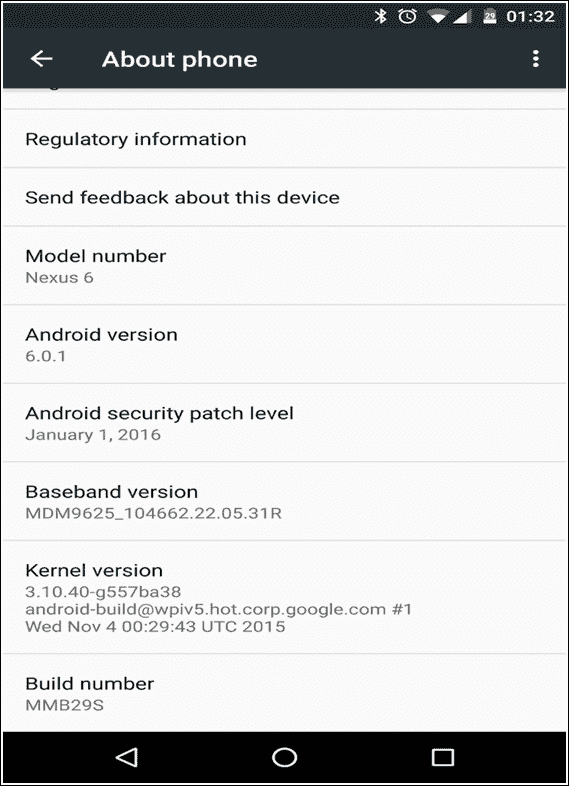

在前几章中，我们创建并部署了我们自己的 Android 版本，该版本配备了 Linux 内核的二进制版本。使用已经编译好的内核版本是标准做法：正如我们所见，AOSP 提供了这种类型的体验。

作为高级用户，我们可以更进一步，为我们的自定义 Android 系统构建一个自定义内核。Nexus 系列提供了进入这个世界的便捷途径，因为我们可以轻松地获取构建自定义版本所需的内核源代码。我们还可以将我们的自定义 Linux 内核装备到我们的自定义 Android 系统中，我们将拥有一个完全定制的 ROM，适用于我们的特定需求。

在这本书中，我们故意使用 Nexus 设备——谷歌是少数几家正式提供内核源代码的公司之一。即使每个生产和销售 Android 设备的公司都受到法律强制要求发布内核源代码，但其中很少有人真正这样做，尽管有 GPL 许可证规则。

### 获取内核

谷歌为 Nexus 系列中每个设备的每个 Android 版本提供了内核源代码和二进制版本。

以下表格显示了二进制版本和源代码的位置，按设备代码名称排序：

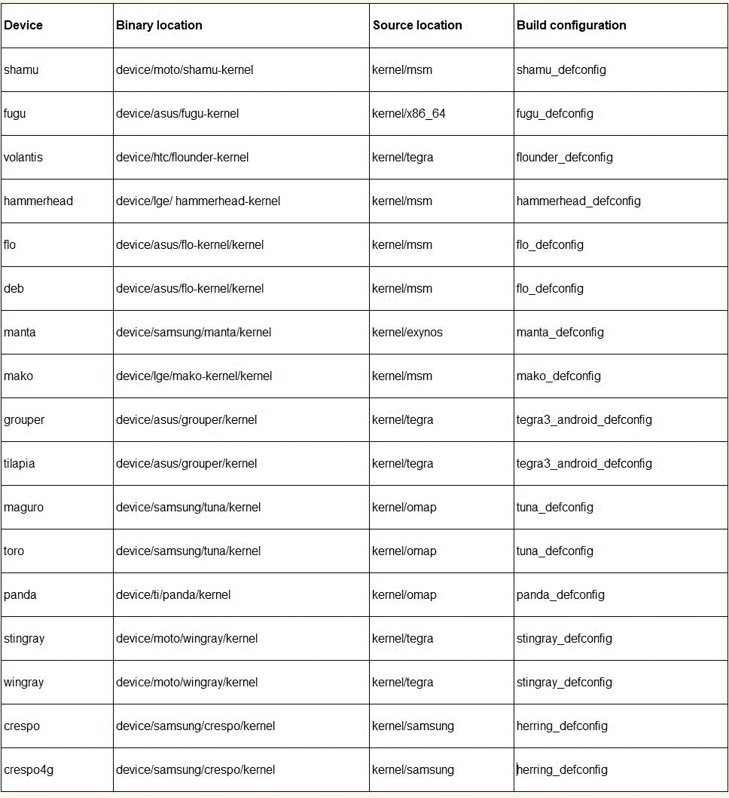

正如第四章“转向现实硬件”中所述，我们将使用摩托罗拉 Nexus 6，代码名称`Shamu`。

内核的二进制版本和内核源代码都存储在 git 存储库中。我们只需要编写正确的 URL 并克隆相应的存储库。

#### 获取内核的二进制版本

在本节中，我们将获取内核作为二进制、预构建文件。我们需要的只是之前显示每个设备型号、其代码名称及其二进制位置的表格，我们可以使用这些信息来组成下载 URL。我们针对的是谷歌 Nexus 6，代码名称`shamu`，二进制位置：

```java
device/moto/shamu-kernel
```

因此，要获取摩托罗拉 Nexus 6 内核的二进制版本，我们需要以下命令：

```java
$ git clone https://android.googlesource.com/device/moto/shamu-kernel

```

上一条命令将克隆存储库并将其放置在`shamu-kernel`文件夹中。这个文件夹包含一个名为`zImage-dtb`的文件——这个文件是实际可以集成到我们的 ROM 并刷入我们设备的内核镜像。

获取内核镜像后，我们可以使用以下命令获取内核版本：

```java
$ $ dd if=kernel bs=1 skip=$(LC_ALL=C grep -a -b -o $'\x1f\x8b\x08\x00\x00\x00\x00\x00' kernel | cut -d ':' -f 1) | zgrep -a 'Linux version'

```

输出：

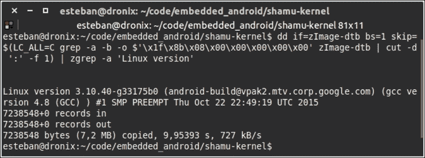

上一张截图显示了命令输出：我们的内核镜像版本是 3.10.40，它是在 10 月 22 日 22:49 使用 GCC 版本 4.8 编译的。

#### 获取内核源代码

对于二进制版本，上一张表格对于下载内核源代码也是关键的。针对谷歌 Nexus 6，我们使用设备代码名称`shamu`的源位置字符串创建下载 URL：

```java
kernel/msm.git

```

一旦我们有了确切的 URL，我们就可以使用以下命令克隆 GIT 存储库：

```java
$ git clone https://android.googlesource.com/kernel/msm.git

```

Git 将创建一个`msm`文件夹。文件夹会奇怪地空着——这是因为文件夹默认跟踪`master`分支。为了获取我们的 Nexus 6 的内核，我们需要切换到正确的分支。

可用的分支有很多，我们可以使用以下命令查看列表：

```java
$ git branch -a

```

列表将显示每个分支，针对特定 Nexus 设备的特定 Android 版本。以下截图显示了这些存储库的子集：

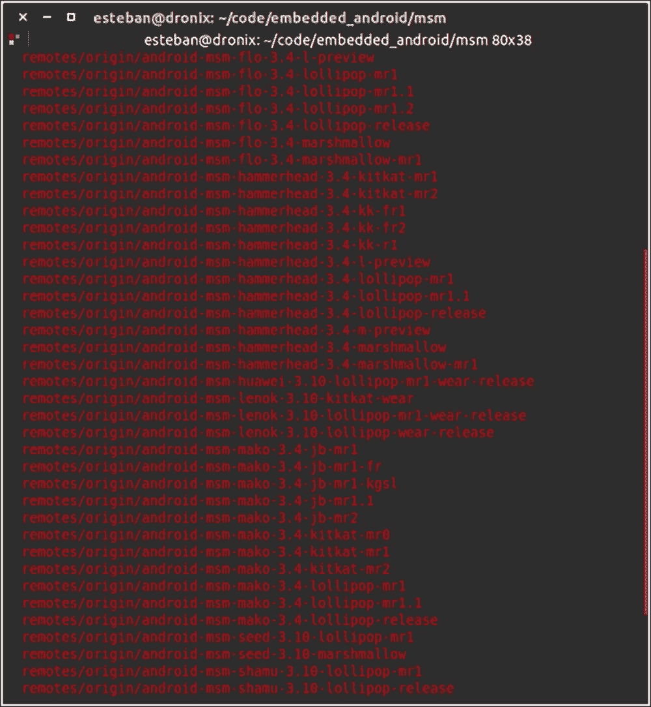

现在你已经知道了分支名称，对于你的设备和你的 Android 版本，你只需要检出正确的分支：

```java
$ git checkout android-msm-shamu-3.10-lollipop-release

```

以下截图显示了预期的命令输出：

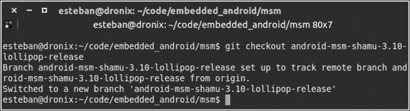

## 设置工具链

工具链是所有用于有效地将特定软件编译成二进制版本所需工具的集合，使用户能够运行它。在我们的特定领域，工具链允许我们创建一个系统镜像，该镜像可以用于烧录到我们的 Android 设备上。有趣的是，工具链允许我们为与当前架构不同的架构创建系统镜像：我们很可能是使用 x86 系统，但我们想创建一个针对 ARM（高级精简指令集机器）设备的系统镜像。针对与宿主系统架构不同的架构编译软件被称为**交叉编译**。

互联网为这项任务提供了一些方便的解决方案——我们可以使用与 AOSP（Android 开源项目）一起提供的标准工具链，或者我们可以使用一个替代的、非常流行的工具链，即 Linaro 工具链。这两个工具链都能完成工作——为 ARM 架构编译每一个 C/C++文件。

如同往常，工具链既可用预编译的二进制文件提供，也可作为源代码提供，以便编译。对于我们的旅程，我们将使用由 Google 提供的官方工具链，但当你需要更深入地探索这个领域时，你可以尝试下载来自[www.linaro.org/download](http://www.linaro.org/download)的 Linaro 工具链的二进制版本。Linaro 工具链被认为是市场上最优化和性能最好的工具链，但我们的目标不是比较工具链或固执地使用最好的或最受欢迎的一个。我们的目标是创建尽可能平滑的体验，从整个构建自定义 Android 系统方程中移除不必要的变量。

### 获取工具链

我们将使用由 Google 提供的官方工具链。我们可以通过 Android 源代码或单独下载来获取它。如果您手头有信任的 Android 源代码文件夹，您可以在以下文件夹中找到工具链：

```java
AOSP/prebuilts/gcc/linux-x86/arm/arm-eabi-4.8/

```

这个文件夹包含构建自定义内核所需的所有内容——编译器、链接器以及一些其他工具，如调试器。

如果由于某些不幸的原因，您缺少 Android 源代码文件夹，您可以使用以下 git 命令下载工具链：

```java
$ git clone https://android.googlesource.com/platform/prebuilts/gcc/linux-x86/arm/arm-eabi-4.8

```

## 准备宿主系统

要成功编译我们的自定义内核，我们需要一个配置正确的宿主系统。要求与我们在上一章中构建整个 Android 系统时满足的要求相似：

+   Ubuntu

+   Linux 内核源代码

+   工具链

+   Fastboot

Ubuntu 需要一点爱来完成任务：我们需要安装`ncurses-dev`包：

```java
$ sudo apt-get install ncurses-dev

```

一旦安装了所有必需的工具，我们就可以开始配置所需的环境变量。这些变量在交叉编译过程中使用，并且可以通过控制台进行设置。启动您信任的终端并运行以下命令：

```java
$ export PATH=<toolchain-path>/arm-eabi-4.8/bin:$PATH
$ export ARCH=arm
$ export SUBARCH=arm
$ export CROSS_COMPILE=arm-eabi-

```

## 配置内核

在能够编译内核之前，我们需要正确配置它。Android 仓库中的每个设备都有一个特定的分支，带有特定的内核和特定的配置要应用。

第 2 页的表格中有一列包含我们需要的精确信息——`构建配置`。这些信息代表了我们正确配置内核构建系统所需的参数。让我们为我们的 Google Nexus 6 配置一切。在你的终端中，运行以下命令：

```java
$ make shamu_defconfig

```

此命令将创建一个针对你的设备的特定内核配置。以下截图显示了命令的运行情况和最终的成功消息：

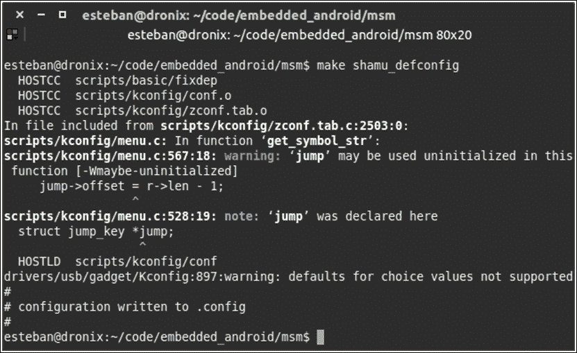

一旦`.config`文件就位，你就可以使用默认配置来构建内核。作为高级用户，我们想要更多，这就是为什么我们将完全控制系统，深入内核配置。编辑配置可以启用缺失的功能或禁用不需要的硬件支持，以创建完美的自定义内核，满足你的需求。

幸运的是，为了改变内核配置，我们不需要手动编辑`.config`文件。Linux 内核提供了一个图形工具，它将允许你导航整个配置文件结构，获取关于单个可配置项的文档，并毫不费力地准备一个自定义配置文件。

要访问配置菜单，打开你的终端，导航到`kernel`文件夹并运行以下命令：

```java
$ make menuconfig

```

以下截图显示了官方 Linux 内核配置工具——没有花哨的功能，但非常有效：

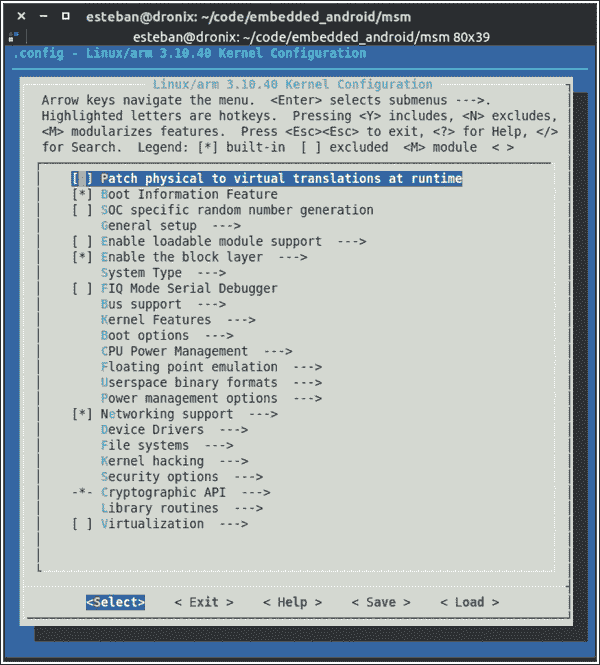

在截图的上半部分，你可以看到我们将要定制的内核版本以及如何导航所有这些菜单项的快速文档：你使用*箭头键*导航，使用*Enter 键*进入子菜单，使用*Y*/*N*或*空格键*选择或取消选择一个项。

权力越大，责任越大，所以启用和禁用功能时要小心——检查`menuconfig`中的文档，检查互联网，最重要的是，要有信心。错误的配置可能会在引导过程中导致系统冻结，这将迫使你学习，创建不同的配置并再次尝试。

作为现实世界的例子，我们将启用 FTDI 支持。Future Technology Devices International 或 FTDI 是一家全球知名的半导体公司，以其 RS-232/TTL 到 USB 设备而闻名。这些设备在通过标准 USB 连接与嵌入式设备通信时非常有用。要启用 FTDI 支持，你需要按照以下步骤导航到正确的菜单：

```java
Device Drivers|USB support|USB Serial Converter support

```

一旦你到达这个部分，你需要启用以下项：

```java
USB FTDI Single Port Serial Driver

```

以下截图显示了正确选择的项，并给你一个我们可能支持多少设备的想法（此屏幕只显示 USB 串行转换器支持）：

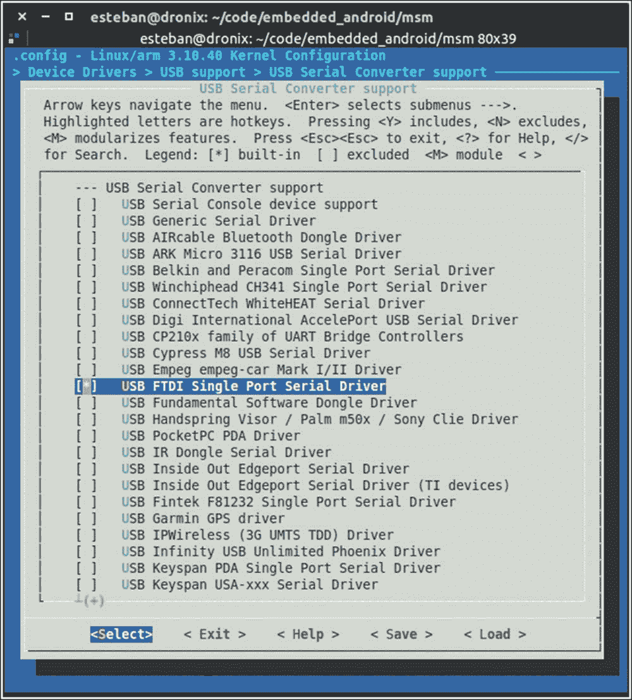

一旦一切就绪，只需选择**退出**并保存配置，如图所示：

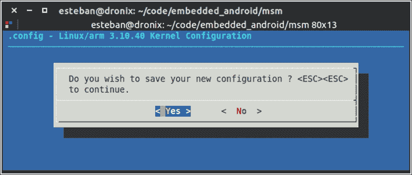

使用完全相同的方法，您可以添加您想要的每一个新功能。一个重要的注意事项，我们添加了 FTDI 包，将其合并到内核映像中。Linux 内核给您提供了将功能作为模块提供的可能性。模块是一个外部文件，具有`.ko`扩展名，可以在运行时注入和加载到内核中。内核模块在您在纯 Linux 系统上工作时是一个伟大且方便的功能，但在 Android 上它们非常不实用。希望有一个模块化内核，您应该自己编写整个模块加载系统，这会给系统增加不必要的复杂性。我们选择将 FTDI 功能包含在内核映像中，从尺寸角度来看可能会受到惩罚，但可以免除对模块本身的手动管理。这就是为什么常见的策略是将我们想要的每一个新功能直接集成到内核核心中。

## 编译内核

一旦您有一个正确配置的环境和一个全新的配置文件，您只需要一个命令就可以开始构建过程。在您的终端模拟器中，在内核源文件夹中，启动：

```java
$ make

```

`make`命令将完成必要的配置并启动编译和汇编过程。这个过程所需的时间很大程度上取决于您系统的性能：可能是一分钟或一个小时。作为一个参考，i5 2.40 GHz CPU，8 GB RAM 的系统完成一个干净的构建需要 5-10 分钟。这比编译整个 AOSP 镜像要快得多，正如您所看到的，这是因为代码库的复杂性和大小不同。

## 与非谷歌设备一起工作

到目前为止，我们一直使用谷歌设备，享受谷歌开源的心态。作为高级用户，我们经常处理来自谷歌或甚至不是智能手机的设备。作为一个现实世界的例子，我们将再次使用 UDOO 板：一款支持 Ubuntu 或 Android 的单板计算机。目前，UDOO 最流行的版本是 UDOO Quad，这也是我们针对的版本。

对于其他所有设备，标准方法是将制造商的网站视为获取内核源代码和任何有用文档的过程的信任来源：最重要的是，如何正确地将新内核刷入系统。当使用自定义内核时，程序相当规范。您需要源代码、工具链、几个配置步骤，也许还需要在您的宿主系统上安装一些特定的软件包。当涉及到刷写内核时，每个设备都可能有不同的程序。这取决于系统的设计方式和制造团队提供的工具。Google 提供了 `fastboot` 来将我们的镜像刷入我们的设备。其他制造商通常提供类似或可以轻松完成类似任务的工具。

UDOO 开发团队努力使 UDOO 板完全兼容 `fastboot`——而不是强迫您适应他们的工具，他们调整了他们的设备以与您已经熟悉的工具一起工作。他们调整了板上的引导加载程序，现在您可以使用 `fastboot` 来刷写 `boot.img`，就像您在刷写标准的 Google Android 设备一样。

要获取内核，我们只需要克隆一个 git 仓库。使用您信任的终端，运行以下命令：

```java
$ git clone http://github.com/UDOOBoard/Kernel_Unico kernel

```

一旦我们有了内核，我们需要在 Ubuntu 系统中安装一些软件包，以便能够与之一起工作。使用以下命令，所有内容都将被安装并就绪：

```java
$ sudo apt-get install build-essential ncurses-dev u-boot-tools

```

是时候选择工具链了！UDOO 给您提供了一些选择——您可以使用与 Nexus 6 相同的工具链，或者使用 UDOO 团队提供的工具链。如果您决定使用 UDOO 官方工具链，您可以使用几个终端命令下载它。请确保您已经安装了 `curl`。如果没有，只需使用以下命令安装它：

```java
$ sudo apt-get install curl

```

一旦您安装了 `curl`，您可以使用以下命令下载工具链：

```java
$ curl http://download.udoo.org/files/crosscompiler/arm-fsl-linux-gnueabi.tar.gz | tar -xzf

```

现在，您已经准备好启动构建过程：

```java
$ cd kernel
$ make ARCH=arm UDOO_defconfig

```

以下是输出结果：

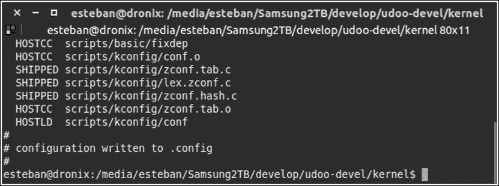

上一张截图显示了配置过程的输出。当默认的 `.config` 文件准备就绪时，您可以使用以下命令启动构建过程：

```java
$ make –j4 CROSS_COMPILE ../arm-fsl-linux-gnueabi/bin/arm-fsl-linux-gnueabi- ARCH=arm uImage modules

```

当构建过程完成后，您可以在 `arch` 文件夹中找到内核镜像：

```java
$ arch/arm/boot/uImage

```

对于 Nexus 6，我们可以使用 `menuconfig` 来自定义 UDOO 内核。从内核源代码文件夹中，运行以下命令：

```java
$ make ARCH=arm menuconfig

```

以下截图显示了 UDOO 内核配置菜单。它与 Nexus 6 配置菜单非常相似。我们有相同的按键组合来导航、选择和取消选择功能等：

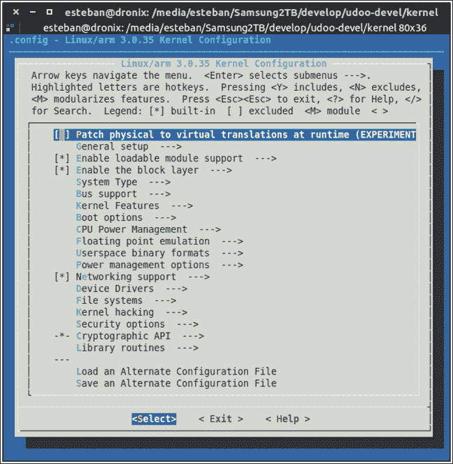

在使用 UDOO 时，与 Nexus 6 一样，我们在移除内核组件时也要小心——其中一些只是为了支持特定硬件而存在，而另一些则是系统启动的*关键*。像往常一样，您可以自由实验，但请注意不要冒险！

与智能手机相比，这种类型的开发设备使内核调试变得稍微容易一些。UDOO，就像许多其他嵌入式开发板一样，提供了一个串行连接，使您能够监控整个启动序列。如果您正在为某些硬件开发驱动程序并将其集成到内核中，或者您只是想玩一些自定义内核配置，这将非常有用。每个内核和启动相关的消息都将打印到串行控制台，以便捕获和分析。

下一个截图显示了我们的 UDOO Quad 板的启动序列：

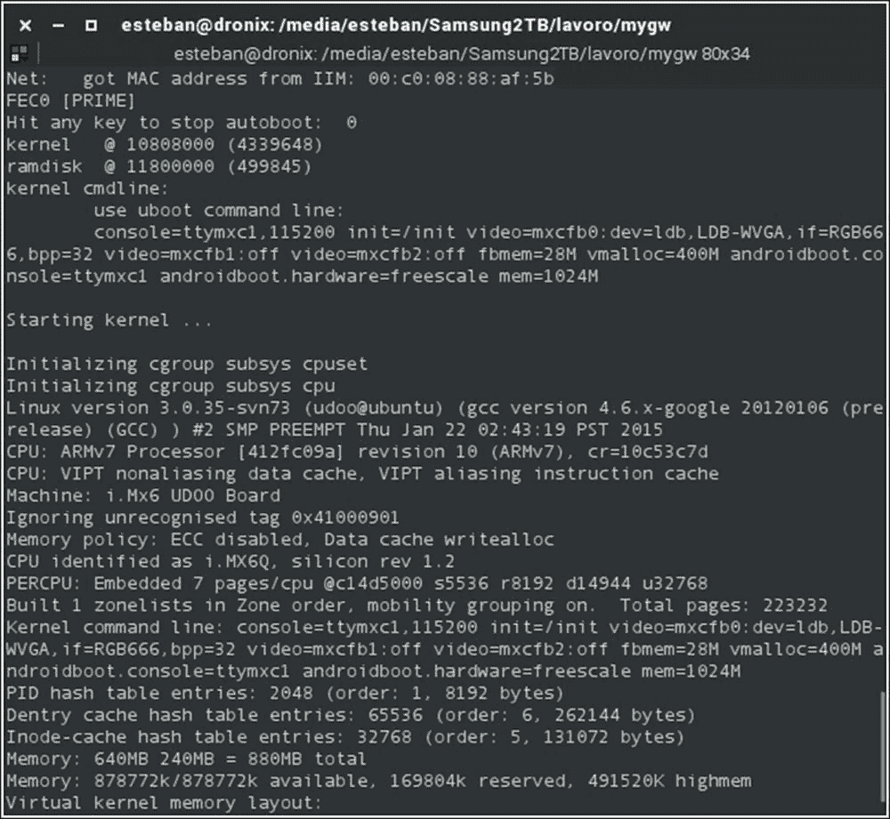

如您所见，从板子开机到 Android 系统提示，有大量的调试信息。

## 驾驶员管理

自从 2.6.x 版本以来，Linux 给开发者提供了将内核的部分编译为分离的模块的机会，这些模块可以注入到核心中，以便在运行时添加更多功能。这种方法提供了灵活性和自由度：无需重新启动系统即可享受新功能，如果您只需要更新特定模块，则无需重新构建整个内核。这种方法在 PC 世界中广泛使用，包括路由器、智能电视，甚至是我们熟悉的 UDOO 板。

编写一个新的内核模块并非易事，这远非本书的目的：关于这个主题有很多书籍，而大部分技能都来自经验。在这些页面中，您将了解整体情况、关键点和可能性。

不幸的是，Android 并不使用这种模块化方法：每个必需的功能都构建在一个单一的二进制内核文件中，出于实用性和简单性的原因。在过去的几年里，有一种趋势是将 Wi-Fi 功能所需的逻辑也集成到内核中，这在之前是从分离的模块在启动序列中加载的。

正如我们在上一页的 FTDI 示例中看到的那样，将新驱动程序添加到我们的 Android 内核中最实用的方法是使用 `menuconfig` 并将功能作为内核的核心部分构建。

在下一章中，我们将更深入地探讨这个主题，并为我们的内核添加一些默认配置中不存在的功能。

## 修改 CPU 频率

超频 CPU 是高级用户中最受欢迎的话题之一。从您的设备中获取最大性能的想法令人兴奋。论坛和博客充满了关于超频的讨论，在本节中，我们将概述并澄清您在旅程中可能会遇到的几个棘手方面。

每个 CPU 都是设计用来与特定的时钟频率或特定频率范围内工作的。任何现代 CPU 都有可能在需要时调整其时钟频率以最大化性能，在不需要性能时降低功耗，从而在我们的心爱移动设备上节省宝贵的电池。因此，超频表示通过软件改变这个工作时钟频率的可能性，将其提高到高于 CPU 设计频率的水平。

与我们经常在无良论坛帖子或博客上读到的内容相反，CPU 超频可能是一个非常危险的操作：我们正在迫使 CPU 以正式尚未测试过的时钟频率工作。这可能会对我们产生反效果，导致设备自动重启以保护自身，或者在最坏的情况下，我们甚至可能损坏 CPU。

管理 CPU 时钟频率的另一个有趣方面是所谓的降频。利用 CPU 时钟频率调整功能，我们可以根据 CPU 负载和其他方面设计并实施调整策略，以最大化效率。例如，当设备空闲或处于睡眠模式时，我们可以降低频率；当设备处于重负载时，我们可以将时钟频率推至最大，以在每个场景中享受最大的效果。进一步推进 CPU 管理，许多智能手机 CPU 都采用多核架构：如果当前场景不需要，你可以完全关闭一个核心。

降低 CPU 频率的关键概念是在制造商提供的最低频率以下添加一个新的频率。通过软件，我们可以强制设备运行在这个频率上并节省电池。这个过程并非没有风险。我们可能会创建出设备 CPU 频率如此之低，以至于会导致设备无响应或甚至冻结的情况。至于超频，这些是未知的领域，只有谨慎、经验和运气才能让你得到满意的结果。

### 总体概述

Linux 内核使用称为**控制器**的特定策略来管理 CPU 频率调整。Linux 内核中已经预建了一些控制器，可以通过`menuconfig`访问，但你也可以添加定制的控制器，以满足你的特定需求。

以下截图显示了 Google Nexus 6 的`menuconfig`部分，用于 CPU 频率调整配置：

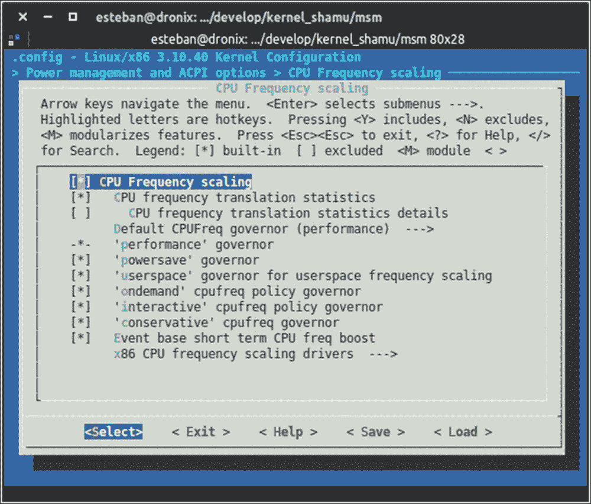

如您所见，有六个预构建的控制器。命名约定非常有用，使得名称具有自解释性：例如，`performance`控制器旨在始终保持 CPU 在最高频率，以在任何时候实现最高性能，牺牲电池寿命。

在 Android 上最受欢迎的控制器无疑是`ondemand`和`interactive`控制器：这些在许多基于 Android 的设备内核中相当常见。我们的参考设备 Google Nexus 6 使用`interactive`作为默认控制器。

如你所预期，出于安全原因，谷歌禁止直接管理 CPU 频率。在 Android 上没有快速选择特定频率或特定管理器的方法。然而，高级用户可以通过一点努力来满足他们的好奇心或需求。在下一章中，你将了解更多关于 CPU 管理的内容，但现在，让我们定制你的引导镜像。

## 定制引导镜像

到目前为止，你已经学习了如何获取内核源代码，如何设置系统，如何配置内核，以及如何创建你的第一个自定义内核镜像。下一步是给你的设备配备你的新内核。为了实现这一点，我们将分析每个 Android 设备使用的 `boot.img` 文件的内部结构。

### 创建引导镜像

一个自定义固件包含四个 `.img` 文件，这些文件是创建工作 Android 系统所必需的。其中两个（`system.img` 和 `data.img`）是兼容 Linux 文件系统的压缩镜像。

剩下的两个文件（`boot.img` 和 `recovery.img`）不包含标准文件系统。相反，它们是针对 Android 的自定义镜像文件。这些镜像包含一个 2KB 的头部扇区，内核核心，使用 `gzip` 压缩，ramdisk 以及可选的第二状态加载器。

Android 在 AOSP 源文件夹中 `mkbootimg` 包含的 `boot.img.h` 文件中提供了关于镜像文件内部结构的更多信息。

以下截图显示了该文件内容的一个片段：

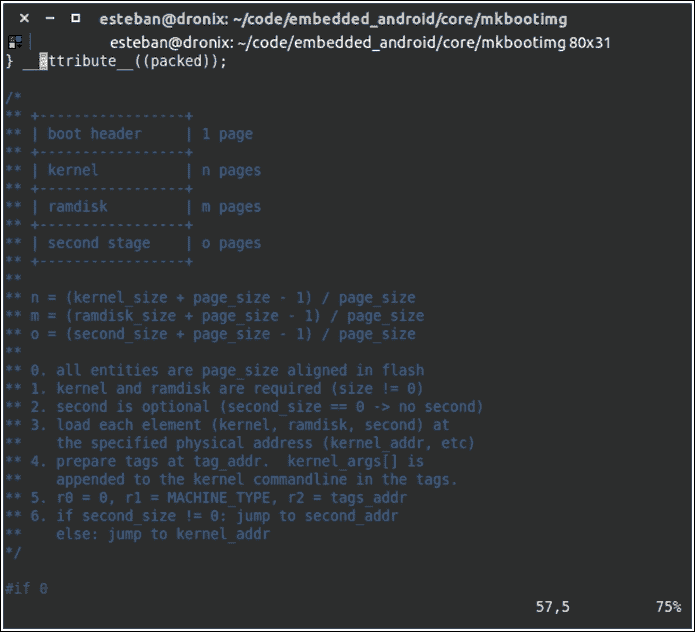

如你所见，该图像包含 `boot.img` 结构的图形表示。这种 ASCII 艺术包含对大小和页面的更深入解释。

要创建一个有效的 `boot.img` 文件，你需要你刚刚构建的内核镜像和一个 ramdisk。ramdisk 是一个在引导时挂载到系统 RAM 中的小型文件系统。ramdisk 提供了一组对引导序列至关重要的文件，对于成功的引导序列是必需的。例如，它包含负责启动引导序列中所需所有服务的 `init` 文件。

生成引导镜像主要有两种方法：

+   我们可以使用 `mkbootimg` 工具

+   我们可以使用 Android 构建系统

使用 `mkbootimg` 给你提供了很多自由度，但同时也带来了很多复杂性。你需要大量的命令行参数来正确配置生成系统并创建一个有效的镜像。另一方面，Android 构建系统已经包含了整个配置参数集，已经设置好并准备好使用，我们无需做任何努力就可以创建一个有效的镜像。仅为了给你一个关于 `mkbootimg` 复杂性的大致概念，以下截图显示了所需的参数概览：

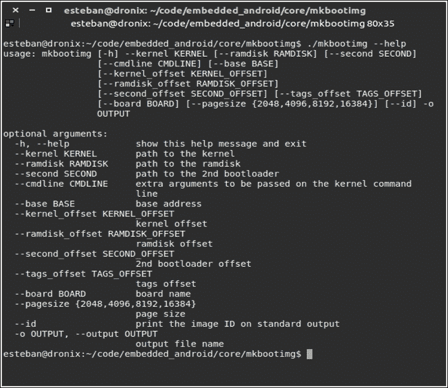

玩弄如此强大的东西很有吸引力，但正如你所看到的，传递给 `mkbootimg` 的可能错误参数数量很大。作为务实的开发者，目前处理 `mkbootimg` 的风险不值得。我们想要完成任务，所以我们将使用 Android 构建系统轻松生成一个有效的引导镜像。

在前面的章节中，你使用 Android 源代码和正确配置的构建系统创建了一个整个系统的自定义版本。我们将利用我们已经完成的所有工作来完成这一新步骤。你所需要做的只是导出一个新的环境变量，指向你几页前创建的内核镜像。使用你信任的终端模拟器，启动：

```java
$ export TARGET_PREBUILT_KERNEL=<kernel_src>/arch/arm/boot/zImage-dtb

```

一旦你设置了并导出了 `TARGET_PREBUILT_KERNEL` 环境变量，你可以启动：

```java
$ make bootimage

```

一个全新的、完全定制的引导镜像将由 Android 构建系统创建，并将放置在以下文件夹中：

```java
$ target/product/<device-name>/boot.img

```

只需几条命令，我们就有了全新的 `boot.img` 文件，准备好刷入。使用 Android 构建系统生成引导镜像是所有 Nexus 设备以及那些设计得尽可能接近官方 Google 设备的设备的首选方式。

对于所有符合这一理念的市场上的设备，事情开始变得棘手，但并非不可能。一些制造商利用 Apache v2 许可证，不提供完整的 Android 源代码。你可能会发现自己只有内核源代码，而无法利用 Android 构建系统创建你的引导镜像，甚至无法理解 `boot.img` 实际的结构。

在这些情况下，一个可能的方法是从一个工作设备中提取 `boot.img`，提取内容，用你的自定义版本替换默认内核，然后使用 `mkbootimg` 重新创建 `boot.img`：说起来容易做起来难。

目前，我们想要关注主要场景，处理一个不与我们抗争的系统。在接下来的章节中，你将学习如何反击并完全控制系统。

### 升级新的引导镜像

一旦你有了全新的、定制的引导镜像，其中包含你的自定义内核镜像，你只需要将其刷入你的设备。我们正在处理 Google 设备或至少是兼容 Google 的设备，因此你将能够使用 `fastboot` 将你的 `boot.img` 文件刷入你的设备。

要能够将镜像刷入设备，你需要将设备置于 `fastboot mode`，也称为 `bootloader mode`。每个设备都有进入此模式的方法，因此，根据你使用的设备，你可以查看第四章 *迈向现实硬件* 中的表格，其中包含了到达 fastboot 模式的所有步骤。

一旦您的设备进入快启模式，您可以通过 USB 将其连接到主机计算机。启动一个终端模拟器并运行升级引导分区的命令：

```java
$ sudo fastboot flash boot boot.img

```

几秒钟后，`fastboot`将用您的`boot.img`文件的内容替换设备引导分区的内容。当烧录过程成功完成后，您可以使用以下命令重启您的设备：

```java
$ sudo fastboot reboot

```

设备将使用您的新内核重启，多亏了您在前几页添加的新 USB TTL 支持，您将能够使用终端模拟器监控整个引导序列。

## Android 引导序列

为了全面理解所有 Android 内部结构，我们将学习整个引导序列是如何工作的：从开机到实际的 Android 系统引导。Android 的引导序列与基于 Linux 的任何其他嵌入式系统类似：在非常抽象的方式下，在开机后，系统初始化硬件，加载内核，并最终加载 Android 框架。任何基于 Linux 的系统在其引导序列中都会经历一个类似的过程：您的 Ubuntu 计算机甚至您的家庭 DSL 路由器。

在接下来的几节中，我们将深入探讨这些步骤，以全面理解我们如此喜爱的操作系统。

### 内部 ROM – BIOS

当您按下设备上的电源按钮时，系统会加载存储在 ROM 内存中的一小部分代码。您可以将这想象成您 PC 上所拥有的 BIOS 软件的等效物。该软件负责设置 CPU 时钟的所有参数并运行 RAM 内存检查。之后，系统将引导加载程序加载到内存中并启动它。

### 引导加载程序概述

到目前为止，引导加载程序已经加载到 RAM 内存并启动。引导加载程序负责将系统内核加载到 RAM 内存中并启动它，以继续引导序列。

对于 Android 设备来说，最流行的引导加载程序软件是 U-Boot，即通用引导加载程序。U-Boot 在各种嵌入式系统中得到广泛应用：如 DSL 路由器、智能电视、信息娱乐系统等。U-boot 是开源软件，它可以根据任何设备进行定制，这种灵活性无疑是其受欢迎的原因之一。

U-boot 的主要任务是读取引导分区中的内核镜像，将其加载到 RAM 内存中，并运行它。从这一刻起，内核负责完成引导序列。

您可以将 Android 系统中的 U-boot 想象成 Ubuntu 系统中的 GRUB：它读取内核镜像，解压缩它，将其加载到 RAM 内存中，并执行它。以下图表为您展示了嵌入式 Linux 系统、Android 系统和 Linux PC 上的整个引导序列的图形表示：

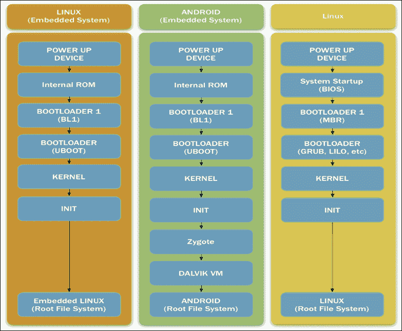

### 内核

引导加载程序加载内核后，内核的第一个任务是初始化硬件。当所有必要的硬件都正确设置后，内核从`boot.img`挂载 ramdisk 并启动`init`。

### 初始化进程

在标准的 Linux 系统中，`init` 进程负责启动引导系统所需的所有核心服务。最终目标是完成引导序列并启动图形界面或命令行，以便用户可以使用系统。整个过程基于一系列特定的系统脚本，以严格的顺序执行，以确保系统完整性和正确的配置。

Android 遵循相同的理念，但行为不同。在标准的 Android 系统中，`ramdisk`（包含在 `boot.img` 中）提供了 `init` 脚本和引导所需的所有脚本。

Android 初始化进程由两个主要文件组成：

+   init.rc

+   init.${ro.hardware}.rc

`init.rc` 文件是系统的第一个初始化脚本。它负责初始化所有 Android 系统共有的方面。第二个文件非常特定于硬件。正如你所猜到的，`${ro.hardware}` 是引导序列发生时特定硬件的占位符。例如，在模拟器引导配置中，`${ro.hardware}` 被替换为 `goldfinsh`。

在标准的 Linux 系统中，初始化序列执行一组 bash 脚本。这些 bash 脚本启动一组系统服务。Bash 脚本在许多 Linux 系统中是一个常见的解决方案，因为它非常标准化且相当流行。

Android 系统使用不同的语言来处理初始化序列：Android 初始化语言。

### Android 初始化语言

Android 团队选择不使用 Bash 来编写 Android 初始化脚本，而是创建了自己的语言来执行配置和服务启动。

Android 初始化语言基于五个语句类别：

+   动作

+   命令

+   服务

+   选项

+   导入

每个语句都是面向行的，并且基于特定的标记，由空白字符分隔。注释行以 `#` 符号开头。

#### 动作

动作是一系列与特定触发器绑定的命令，用于在特定时刻执行特定动作。当发生期望的事件时，动作被放入执行队列，准备执行。

这个片段展示了动作语句的一个示例：

```java
on <trigger> [&& <trigger>]*
  <command>
  <command>
  <command>
```

动作具有独特的名称。如果在同一文件中创建了具有相同名称的第二个动作，则其命令集将添加到第一个动作的命令集中，作为一个单独的动作进行设置和执行。

#### 服务

服务是初始化序列在引导过程中执行的程序。如果需要这些服务保持运行状态，则可以对其进行监控和重启。以下片段展示了服务语句的一个示例：

```java
service <name> <pathname> [ <argument> ]*
  <option>
  <option>
  ...
```

服务具有独特的名称。如果在同一文件中存在一个非唯一名称的服务，则只有第一个被视为有效；第二个将被忽略，并且开发者会收到错误消息。

#### 选项

选项语句与服务相关联。它们旨在影响 init 如何以及何时管理特定服务。

Android 提供了相当多的可能选项语句：

+   `critical`: 这指定了一个设备关键服务。服务将被持续监控，如果它在四分钟内死亡超过四次，设备将在恢复模式下重启。

+   `disabled:` 此服务将处于默认停止状态。init 不会启动它。禁用的服务只能通过手动启动，指定其名称。

+   `setenv <name> <value>`: 使用`name`和`value`设置环境变量。

+   `socket <name> <type> <perm> [ <user> [ <group> [ <seclabel> ] ] ]`: 此命令创建一个 Unix 套接字，指定`name`（`/dev/socket/<name>`），并为指定的服务提供文件描述符。`<type>`指定套接字类型：`dgram`、`stream`或`seqpacket`。默认的`user`和`group`是 0。`seclabel`指定创建套接字的 SELinx 安全上下文。

+   `user <username>`: 在服务执行之前更改用户名。默认用户名是`root`。

+   `group <groupname> [ <groupname> ]*`: 在服务执行之前更改组名。

+   `seclabel <seclabel>`: 在启动服务之前更改 SELinux 级别。

+   `oneshot`: 这将禁用服务监控，当服务终止时，它不会被重启。

+   `class <name>`: 这指定了一个服务类。可以同时启动或停止服务类。未指定`class`值的服务的将关联到默认类。

+   `onrestart`: 当服务重启时执行一个命令。

+   `writepid <file...>`: 当服务分叉时，此选项将进程 ID（PID）写入指定的文件。

#### 触发器

触发器指定了一个必须满足的条件，以便执行特定的动作。它们可以是事件触发器或属性触发器。事件触发器可以通过触发命令或`QueueEventTrigger()`函数来触发。示例事件触发器有`boot`和`late-init`。属性触发器可以在观察到的属性值改变时触发。每个动作可以有多个属性触发器，但只有一个事件触发器；以下代码为例：

```java
on boot && property:a=b
```

当`boot`事件被触发且属性`a`等于`b`时，此动作将被执行。

#### 命令

命令语句指定了在引导序列中可以执行的命令，将其放置在`init.rc`文件中。大多数这些命令是常见的 Linux 系统命令。列表相当广泛。让我们详细看看它们：

+   `bootchart_init`: 如果配置正确，这将启动 bootchart。Bootchart 是一个性能监控器，可以提供有关设备引导性能的见解。

+   `chmod <octal-mode-permissions> <filename>`: 这更改文件权限。

+   `chown <owner> <group> <filename>`: 更改指定文件的拥有者和组。

+   `class_start <serviceclass>`: 这通过类名启动指定的服务。

+   `class_stop <serviceclass>`: 停止并禁用由其类名指定的服务。

+   `class_reset <serviceclass>`: 停止由其类名指定的服务。它不会禁用服务。

+   `copy <src> <dst>`: 将源文件复制到新的目标文件。

+   `domainname <name>`: 设置域名。

+   `enable <servicename>`: 通过名称启动一个服务。如果该服务已经排队等待启动，则立即启动该服务。

+   `exec [<seclabel>[<user>[<group> ]* ]] -- <command> [ <argument> ]*`: 分叉并执行指定的命令。执行是阻塞的：在此期间不能执行其他命令。

+   `export <name> <value>`: 设置并导出一个环境变量。

+   `hostname <name>`: 设置主机名。

+   `ifup <interface>`: 启用指定的网络接口。

+   `insmod <path>`: 加载指定的内核模块。

+   `load_all_props`: 加载所有系统属性。

+   `load_persist_props`: 在成功解密`/data`分区后，加载持久属性。

+   `loglevel <level>`: 设置内核日志级别。

+   `mkdir <path> [mode] [owner] [group]`: 创建具有指定名称、权限、所有者和组的文件夹。默认权限为 755，所有者和组为 root。

+   `mount_all <fstab>`: 将`fstab`文件中的所有分区挂载。

+   `mount <type> <device> <dir> [ <flag> ]* [<options>]`: 在特定文件夹中挂载特定设备。一些挂载标志可用：`rw`、`ro`、`remount`、`noatime`以及所有常见的 Linux 挂载标志。

+   `powerctl`: 用于响应`sys.powerctl`系统参数的变化，对于重启路由的实现至关重要。

+   `restart <service>`: 重新启动指定的服务。

+   `rm <filename>`: 删除指定的文件。

+   `rmdir <foldername>`: 删除指定的文件夹。

+   `setpropr <name> <value>`: 使用指定的值设置具有指定名称的系统属性。

+   `start <service>`: 启动一个服务。

+   `stop <service>`: 停止一个服务。

+   `swapon_all <fstab>`: 启用`fstab`文件中指定的交换分区。

+   `symlink <target> <path>`: 从目标文件到目标路径创建一个符号链接。

+   `sysclktz <mins_west_of_gtm>`: 设置系统时钟。

+   `trigger <event>`: 以编程方式触发指定的事件。

+   `wait <filename > [ <timeout> ]`: 监视路径以等待文件出现。可以指定超时时间。如果没有指定，默认超时值为 5 秒。

+   `write <filename> <content>`: 将指定的内容写入指定的文件。如果文件不存在，则创建文件。如果文件已存在，则不会追加内容，但会覆盖整个文件。

#### 导入

导入指定了当前文件中需要的所有外部文件并将它们导入：

```java
import <path>
```

之前的代码片段是一个示例，说明了当前的 init 脚本如何扩展，导入外部 init 脚本。`path` 可以是一个单个文件，甚至是一个文件夹。如果 `path` 是一个文件夹，那么该文件夹第一级中的所有文件都将被导入。该命令不会递归地作用于文件夹：嵌套文件夹必须逐个通过程序导入。

## 摘要

在本章中，你学习了如何获取适用于你的设备的 Linux 内核，如何设置你的主机 PC 以正确构建自定义内核，如何向内核添加新功能，构建它，打包它，并将其闪存到你的设备上。

你学习了 Android 启动序列的工作原理以及如何操作 init 脚本来自定义启动序列。

在下一章中，你将学习如何制作你的第一个自定义 ROM，如何给你的设备 root 权限，以及如何替换恢复分区。
