# 第六章. “制作”你的第一个 ROM

在第五章“定制内核和引导序列”中，我们进行了一次令人惊叹的 Linux 内核之旅——现在你知道了如何为你的设备获取正确的版本以及如何构建它。我们定制和构建你自己的内核版本，针对你的设备——我们添加了新的硬件驱动程序，并移除了那些不必要的。你最终了解了引导序列。

在本章中，我们将进入*修改*的世界，并将继续前进，制作你的第一个定制 ROM。你将学习如何设置系统和如何创建一个定制 ROM。我们将概述最受欢迎的 ROM，以及你需要用到的所有工具以及如何使用它们。

本章将涵盖以下主题：

+   Android 修改的历史（Cyanogenmod）

+   定制恢复

+   根权限

+   厨房和其他工具

## 定制 ROM 的历史

首先要明确——什么是“定制 ROM”？

大多数 Android 设备都配备了所谓的*NAND 存储器*。NAND 存储器是一种特殊的闪存。闪存基于晶体管，而不是像旧硬盘那样的旋转磁盘。这种类型的内存完全由电管理——它可以写入、擦除，并且可以无限期地存储数据（非易失性）。了解这一点后，我们可能会认为在 Android 上可以写入任何东西。好吧，并不完全是这样！

缩写 ROM 代表只读存储器。这种类型的内存常用于嵌入式系统，用于安全地存储所有属于核心系统的文件。为了确保尽可能高的系统完整性，开发者必须确保核心系统在设备重启和可能的故障中保持完整。这就是为什么核心系统存储在只能写入一次的内存中——确切地说，就是只读存储器。随着时间的推移，Android 黑客社区采用了这个缩写并进行了转变。如今，当我们说定制 ROM 时，我们只是在说“这是我针对这个特定设备的自定义 Android 系统”，这就是我们在以下页面中将使用的含义。

对于 Linux 内核来说，Android 是目前开发中最为流行的开源项目之一。免费使用且可定制，被数百万用户使用，Android 是数百个定制操作系统的基本元素——其中大多数是实验性的，一些是为特定场景修复特定错误的定制版本，还有一些是原始系统的优化版本。

在最初，修改社区非常分散——许多孤独的狼，在他们的黑暗房间里进行黑客攻击。随着时间的推移，他们中的大多数人都汇聚到了更社交的环境中，在论坛和社区中结合他们的努力，组建了修改团队，为用户提供更好、更可靠的 ROM。

在第五章“自定义内核和引导序列”中，我们看到了如何使用源代码创建一个自定义版本的 Android。我们能够彻底改变原始系统以创建我们的版本，完美地满足我们的需求，那么关于修改的所有这些炒作是什么？为什么我们不能直接获取源代码并自定义我们的系统？事实是，不幸的是，谷歌就像大海捞针。大多数其他制造商在开源游戏中玩得略有不同，由于缺乏提供的源代码，因此不可能从头开始重建系统。

幸运的是，我们可以通过遵循*不同的路径*来实现 Android 定制——直接进入系统内存分区，反编译组件，并进行定制，或者所谓的**表面修改**。

在 Linux 内核领域，游戏规则完全不同。正如你可能记得的，Android 和 Linux 内核有不同的许可证——Android 在 Apache 许可证 v2 下分发，而 Linux 内核在 GPL 许可证下分发。GPL 许可证对修改和再分发的限制更严格，制造商很难保持内核的*机密性*。这就是为什么 Linux 内核总是可用，修改者可以添加、删除和改进他们想要的任何方面——新的驱动程序、改进的电源管理、改进的 CPU 管理，等等。

当你审视整个自定义 ROM 概念时，你会发现你似乎每天都在看到自定义 ROM——制造商的 ROM。如果我们认为*真正纯净*的 Android 系统是 Nexus 设备上搭载的系统，我们就会意识到制造商是*第一个修改者*，将原始系统变成了经常完全不同的东西。想想三星或 HTC 的定制 UI。这些都是对 UI 的巨大修改。想想那些带有 AM/FM 收音机的设备——再次，严重的定制。一些制造商在过去的几年中进行了如此多的定制，以至于他们的设备最终甚至与 Google Play 商店不兼容。

在接下来的几页中，我们将概述最受欢迎的自定义 ROM，以了解为什么它们如此受到高级用户的喜爱。

### Cyanogenmod

毫无疑问，Cyanogenmod 是最受欢迎的 Android 定制 ROM 之一。它是其中最古老的之一，它带来了在官方 Android 系统中找不到的功能和性能：


从一开始，就在 Android 开源代码的第一个公开发布之后，Cyanogen 团队就开始将最新的 Android 版本回溯到旧设备上。他们基本上克服了制造商的*商业决策*，即让旧设备保留旧的 Android 版本，并努力让所谓的*旧设备*重获新生。

在这些年中，Cyanogenmod 团队添加和调整了大量的功能，这种方法吸引了成千上万的用户。这些改进如此之好，以至于官方的 Google Android 团队经常将它们合并到官方的 Android 源代码库中，体现了真正的开源精神。

如前所述，Cyanogenmod 团队并非从零开始这个项目。他们使用了 Android 开源项目并对其进行了增强。与其他许多定制者采用不同的方法，他们决定整个项目必须以开源代码的形式提供，让每个人都能享受所有功能，从源代码中学习，并为项目本身做出贡献。多年来，社区显著增长，大量的博客文章、教程和实用指南涌入网络空间，使 Cyanogenmod 成为目前最受欢迎的自定义 ROM 之一。

这是 Cyanogenmod 目前提供的最受欢迎的功能列表：

+   **主题支持**：整个系统 UI 可以使用用户创建的主题进行自定义，这些主题可以在系统运行时应用

+   **FLAC 支持**：无损音频编解码器（Free Lossless Audio Codec）是系统上可用的许多音频编解码器之一

+   **更大的 APN（接入点网络）列表**：随着时间的推移，添加了大量的不同 APN，使得在众多设备上快速设置互联网连接变得容易

+   **OpenVPN 客户端**：流行的 VPN 软件可用并准备好使用

+   **丰富的关机菜单**：关机菜单包含新的操作，如重启、恢复模式重启等

其他一些功能包括：

+   支持 Wi-Fi、蓝牙和 USB 共享网络连接

+   CPU 超频管理和系统级性能增强

+   软按钮的高级管理

+   系统通知菜单中的新切换按钮，如 GPS、蓝牙和 Wi-Fi

+   高级应用程序权限管理，为系统提供细致的安全保障

+   系统级图形增强

+   与任何其他从官方 Google 纯 Android 系统派生的 Android 系统相比，团队表示性能和可靠性有所提高

2013 年 4 月，Cyanogenmod 从社区项目转变为一家真正的公司。尽管如此，开源的本质仍然是公司的主要核心价值观之一。到目前为止，它有 17 名全职员工在项目上工作。在过去三年中，他们从第三方合作伙伴那里收到了一些捐赠，如 Benchmark Capital 和 Redpoint Ventures，推动了更简单的 Cyanogenmod 安装过程的开发。

2014 年，Cyanogenmod 宣布与智能手机制造商 OnePlus 建立合作伙伴关系，将预装 Cyanogenmod 的设备进行分发。根据他们的分析，Cyanogenmod 目前被 5000 万台设备使用。

#### 构建 Cyanogenmod

受 Google AOSP 的启发，Cyanogenmod 提供了一个官方网站，您可以从该网站下载项目源代码并访问支持论坛：[www.cyanogenmod.org](http://www.cyanogenmod.org)。

网站还提供了一个支持的所有设备的完整列表。与仅正式支持 Nexus 设备的 Google AOSP 不同，Cyanogenmod 适用于数十种不同的设备。

Cyanogenmod 构建系统与你在前几章中已经掌握的完全相同。了解这一点后，我们将它留作练习，下载并构建你自己的 Cyanogenmod 版本，以完全理解 Android AOSP 可以定制和改进到何种程度。

#### 安装预构建版本

作为开源项目，你可以从源代码构建 Cyanogen。如果你想找到一个更快的解决方案，Cyanogenmod 为众多设备提供了预构建的系统安装版本。只需检查网站，寻找你的设备——很可能它就在支持设备列表中。

一旦你发现你的设备受到支持，你可以选择许多版本中的一个。发布周期与 Google 的非常不同。整个 Cyanogenmod 世界中最*冒险*的特性之一是**夜间构建**——每晚，一个自动系统都会使用源代码仓库的最新贡献启动一个新的构建。这些版本很复杂，必须被视为不稳定，但将包含开发团队每天添加到系统中的所有新功能——*仅限勇敢者！*

除了不同的发布周期外，Cyanogenmod 还使用不同的版本命名约定。团队使用标签来指定 ROM 的不同版本：

+   **夜间版**：如前所述。

+   **实验版**：这是目前正在测试的版本。

+   **M 快照，或里程碑快照**：这比夜间版更稳定，但仍被视为不稳定。

+   **发布候选版**：这是达到*稳定*状态前的最后一步。这是第一个建议在日常设备上使用的版本。

+   **稳定版**：这是最终状态，面向所有用户。

### Android Open Kang Project

Android Open Kang Project，简称 AOKP，是一个于 2011 年诞生的开源项目，旨在为智能手机和平板电脑提供官方 Google Android 的替代品：


如你所想，Kang 团队并没有从头开始创建系统。他们像 Cyanogenmod 一样，以 Google 的 Android 开源项目作为起点。这个特定的 Android 版本针对高端智能手机和平板电脑，并改进了一些方面，使系统更高效和可定制。以下是它的主要优点，这也是越来越多的用户决定切换到 AOKP 的原因。

用户喜爱的一个方面是 AOKP 团队专注于使系统尽可能轻量。他们移除了所有不必要的应用，基本上只留下了官方的 Google 应用，以创建尽可能小的系统。

如今，大多数智能手机和平板电脑都包含大量的*美学*

这些功能可能会减慢系统速度，并且对视觉影响较大。这类应用程序被称为**冗余软件**，通常是预装的系统应用程序，无法从系统中移除。AOKP 将消除这些无用应用程序作为其主要目标之一。

Kang 团队非常努力地工作，以确保用户系统的最大定制化水平。AOKP 提供了一个**ROM 控制**菜单来定制系统的许多方面，从 UI 定制到行为定制。在手势管理领域投入了大量精力，其中最酷的功能之一是可以通过手势启动任何所需的程序，而不是点击图标。

与 Cyanogenmod 一样，AOKP 也在他们的网站上提供了大量的文档和下载，网址为[`aokp.co`](http://aokp.co)。同样，你可以查看源代码自行编译，或者尝试已经编译好的版本。

这里是一个快速列表，列出了你可以在 AOKP 中找到的亮点：

+   **振动模式**：每个联系人都可以关联到特定的振动模式。

+   **导航环**：Android 锁屏可以通过用户选择的程序进行定制，以便在设备锁定的情况下快速访问。

+   **LED 控制**：可以根据颜色、闪烁和持续时间来定制系统 LED 的行为，以创建适用于自定义场景的通知。

+   **自定义开关**：通知区域可以通过不同的切换按钮进行定制，以创建适合你需求的完美设置。

下面的图片显示了实际系统中的两个截图：

+   第一部分展示了如何自定义**导航环**

+   第二部分展示了如何自定义**振动**模式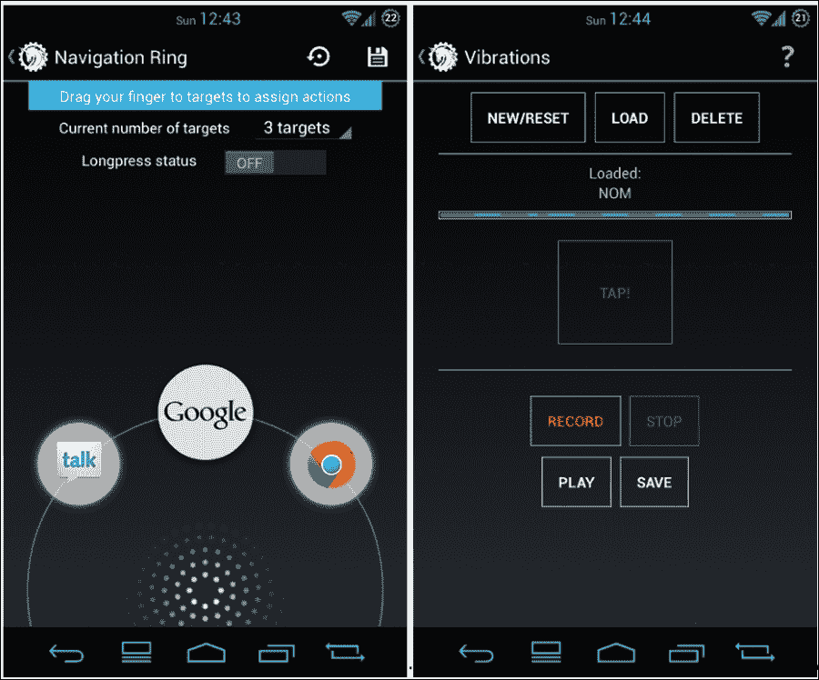

#### 安装 AOKP

AOKP 的版本与 Google 和 Cyanogenmod 不同。AOKP 只提供两个版本：

+   夜间版本

+   里程碑

夜间版本相当于 Cyanogenmod 的夜间构建。实际上，这只是 AOKP 构建系统每天自动生成的一个构建。这应该被视为高度不稳定，仅用于测试目的。

相比之下，里程碑是稳定的构建版本，旨在用于稳定的日常使用。

为了保持社区的参与度，Kang 团队创建了**AOKP PUSH**应用程序，该应用程序可以保持手机更新到新构建，并且还包括安装系统更新的功能。最后值得一提的是，与 Cyanogenmod 一样，AOKP 是完全免费且开放接受贡献的。

### 小型 ROM

在前面的章节中，我们看到了目前市场上最流行的两种定制 ROM 的概述，这些 ROM 适用于 Android 智能手机和平板电脑。正如你可以想象的那样，这仅仅是冰山一角——多年来，已经开发并发布了数十种不同的定制 ROM。其中许多针对特定场景，以解决特定问题或满足用户的具体需求，以他们自己的方式改进 Android 系统。大多数不是从头开始构建的，而是基于已经可用的系统，这些系统经过定制和重新分发。

大多数可用的定制 ROM 针对特定设备，以解决特定设备的问题并提高可用性和性能。**DroniX**（由本书作者创建的项目，针对特定设备，华为 Ideos U8150，当时一款非常流行的低端设备。开发团队专注于性能，从 Ideos CPU 中榨取了每一个可用的兆赫兹。由于有内核源代码可用，我们能够提高 CPU 频率和控制器。更好的电源管理意味着更好的电池管理，性能提升并增加了电池寿命。

总是小心尝试定制 ROM。其中一些可能非常**极端**，可能对您的设备造成危险。这是不幸的，但这是一个真实的情况。没有魔法可以**烹饪**定制 ROM，而且有很多事情可能会出错。例如，极端超频是危险的，明智的用户应该不相信试图销售这些功能的 ROM。在 Android 上进行实验可能很有趣、令人满意和具有挑战性，但必须具备知识和智慧。

我们无法列出野外所有可用的定制 ROM。我们能做的是指明正确的方向：[`www.xda-developers.com/`](http://www.xda-developers.com/)。这可能是获取最新消息和最新疯狂事物的最著名论坛。

### OEM 定制概述

即使它们通常不被认为是定制 ROM，制造商分发的所有 Android 变体都可以被认为是进行了大量定制。我们每天都在见证这些——每次你看到三星设备时，你就知道它不是纯 Android。

从系统启动器到设置菜单，这些系统的每一个组件都被 OEM 大量定制，与官方谷歌版本相去甚远。在某些情况下，系统差异如此之大，以至于普通用户甚至不知道他正在使用相同的 Android 5 系统，例如。

这是一个最受欢迎的 OEM 定制列表，以展示系统如何被修改，以及不同的制造商如何使相同的 Android 版本在设备上看起来如此不同。

#### 三星 – TouchWiz

TouchWiz 是一个针对触摸界面的图形界面，由三星及其技术合作伙伴开发。通常，它被错误地定义为“定制操作系统”，但从技术角度来说，它只是对 Android UI 的重度定制。

TouchWiz 的第一个版本于 2010 年发布，针对 Android 2.1 和三星为其智能手机和平板电脑创建的操作系统 BADA。当前版本是 TouchWiz 5，我们可以在多年中找到许多改进。最初，TouchWiz 只是一个**不同的 UI**。今天，它是一系列定制系统应用、自定义 UI 小部件以及许多新的设置和功能，如声音配置文件、电源管理、开关等。以下截图展示了主屏幕和应用程序抽屉：

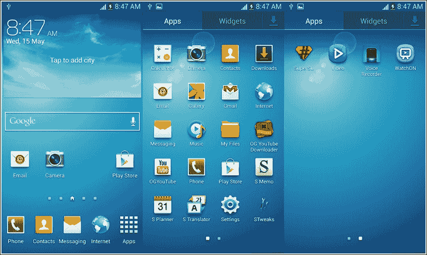

#### 华为 EMUI

在三星工作的启发下，华为也为其设备提供了自己的 Android UI 版本。与三星一样，他们从定制 UI 开始，并添加了许多功能，如主题定制——图标、颜色、字体和锁屏。通知区域也进行了定制和改进。

最有用的新功能之一无疑是高级电源管理。它提供了三种可能的设置：超长续航、智能和普通。超长续航是**极端**的设置——一键操作，你可以关闭除了最基本的传感器之外的所有传感器，旨在实现尽可能长的电池寿命。智能尝试尽可能自动管理电力使用。普通模式则专注于性能——电池寿命不会很长，但设备将以全速运行。

下图展示了华为 EMUI 的主屏幕：

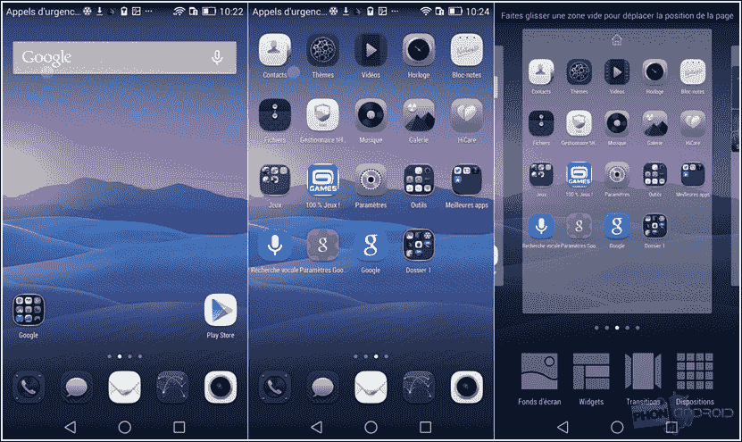

#### HTC Sense

2009 年，HTC 发布了其智能手机定制的第一个 UI 版本。它针对 Android 和 Windows Mobile，提供共享的图形用户界面，以避免用户混淆。

在 HTC 中最受欢迎的功能是一大堆主屏幕小部件，但还有其他同样有趣的功能，例如用于设备被盗时使用的追踪系统。该系统允许用户远程操作设备以定位它或擦除内存，或者简单地锁定它。甚至可以在锁屏上显示自定义消息，包括地址或奖励以重新获得设备。

下图展示了 HTC Sense 7 的主屏幕：

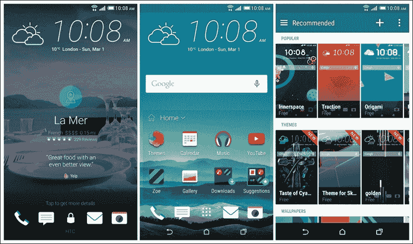

#### LG Optimus UI

LG，和其他厂商一样，提供定制的用户界面——用户可以选择系统图标、颜色和一些自定义设置。一个有趣的功能是**语音命令**拍照以及从连拍中选择最佳照片的能力。

下图展示了主屏幕和自定义通知区域：

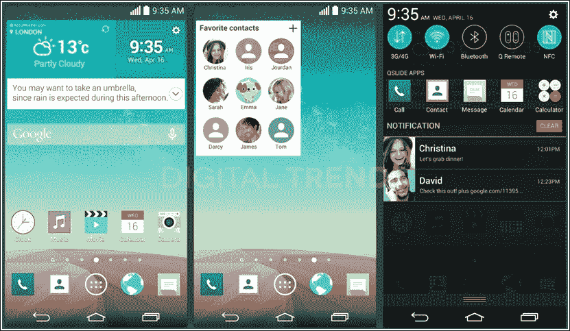

#### 小米 MIUI

这绝对是最重量级的定制系统，它有一个之前版本所没有的特定功能——它是开源的！小米从 Android 2.3.7 和 Cyanogenmod 7 开始着手开发 MIUI——这两个是系统的核心。多年来，他们创建了一个定制的 ROM，它不仅仅是一个定制的用户界面，还添加了越来越多的功能。

2011 年，小米进入市场，从系统定制者转变为设备制造商，推出了高端、低成本的设备，并配备了其 MIUI 系统。

下图展示了 MIUI 主屏幕和应用程序商店：


很不幸，这已经成为一种流行趋势——一种简单的方法用于品牌建设和确保客户忠诚度，但这并不总是推荐的做法。

有些制造商更喜欢在设备上预装纯净的 Android 系统——例如摩托罗拉。摩托罗拉的品牌策略是仅添加几款 *由摩托罗拉提供* 的应用程序。这些通常是实用程序应用程序，旨在丰富用户体验同时保持系统简洁。

摩托罗拉的策略还有一个很大的优点——与谷歌原始系统非常接近的系统意味着更新更快。每次谷歌发布一个新的 Android 版本，摩托罗拉设备在几天内也会收到系统更新。这对大多数其他制造商来说非常不寻常，某种程度上注定要停留在旧的 Android 版本上，因为更新这样一个高度定制的系统需要大量的工作。

## Android 恢复的概述

整个 Android 架构中最重要的部分之一是 `Recovery` 分区。在嵌入式系统中，`Recovery` 分区非常常见，我们已经在之前的章节中对其进行了概述。正如我们所知，所谓的 `Recovery` 是一个最小运行时系统，完全与主 Android 系统解耦，并且完全自给自足。其主要目标是保证系统完整性，并提供必要的工具来解决常见的轻微问题，并恢复一个正常工作的系统。

使用 Android 纯净 `Recovery`，我们可以：

+   更新 Android 系统

+   擦除数据分区和缓存分区

如果我们想要将设备恢复到出厂默认设置，例如为了拥有一个干净的系统来开始实验特定的事情，或者如果我们只是想出售它，擦除数据和缓存分区是一种常见的做法。

### 深入 Android 恢复

Android `Recovery` 系统是完全独立的。这意味着无论主 Android 系统发生什么，`recovery` 总是能够恢复一个正常工作的系统。

为了达到这种级别的弹性，`recovery` 包含了自己的 Linux 内核和自己的 `rootfs`。以下截图显示了 `recovery` 实际上位于 Android 系统附近，但完全独立：

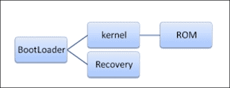

之前的截图显示了如何通过`BootLoader`访问`recovery`。`BootLoader`无法决定当前的引导序列将以运行`recovery`还是运行 Android 系统结束。

关闭设备时，可以通过按键组合进入恢复模式。以我们的参考设备 Google Nexus 6 为例，您可以采取以下步骤：

1.  同时按下*音量下*、*音量上*和*电源按钮*。

1.  当`Fastboot Mode`菜单出现时，释放所有按钮。

1.  使用*音量*按钮，直到屏幕上方的部分显示`Recovery Mode`文本。

1.  按*电源*键选择`Recovery Mode`——之后您将看到一个倒置的 Android 图标。

1.  按住*电源按钮*，然后按一次*音量上*按钮。

一旦进入恢复主屏幕，您可以使用*音量*按钮进行导航，并使用*电源*按钮确认您的选择。

您在恢复菜单中找到的选项可能会有所不同，但 Android 原生的`recovery`肯定会提供以下选项：

+   **立即重启系统**：此选项将重启系统。

+   **从 ADB 应用更新**：Android 调试桥接可以从主机计算机上传官方 Google 系统更新。由于恢复中实施的安全措施以保证系统完整性，只能上传和通过这种方式应用经过认证的更新。

+   **擦除缓存分区**：此选项将擦除*缓存*分区。此分区通常包含系统的临时数据和应用程序缓存数据。删除此文件将释放相当多的磁盘空间，而不会丢失用户数据或应用。

+   **擦除数据/恢复出厂设置**：此选项将擦除易失性内存并恢复原始出厂系统。所有严格与系统无关的内容都将被删除：视频、音乐、文档、用户应用等。缓存分区也将被清除。

以下截图显示了原装 Android `recovery`：

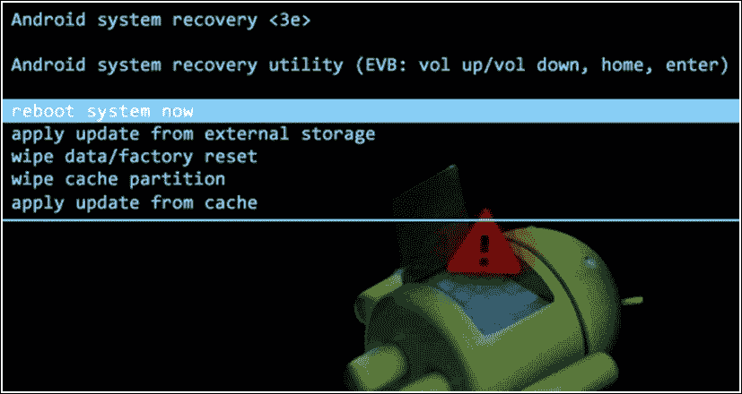

### 安装替代恢复

就像整个 Android 系统一样，`recovery`源代码也是可供研究和修改的，而且多年来，Android 社区已经开发了可以替代 Android 原装`recovery`的替代方案。

所有这些替代方案旨在改进和添加更多功能到原装恢复。最常见的特点是：

+   **保存和恢复系统备份的能力**：NANDroid 对于实验自定义系统和冒险配置极为有用

+   **安装自定义 ROM 的能力**：从自定义 ROM 开发者的角度来看，这可能是添加功能中最重要的一个

+   **增强的 UI 和 UXD**：这些自定义恢复中的一些提供了对触摸屏的支持，而不是默认的*音量*/*电源*按钮导航

最受欢迎的`恢复`替代方案有：

+   Clockworkmod

+   4EXT

+   Amon Ra Recovery

+   Team Win Recovery Project (TWRP)

它们中的每一个在某种程度上都是不同的——外观、高级功能等，但它们都为高级用户提供了安装定制 ROM 的明确方式。

#### Clockworkmod

这无疑是游戏中最受欢迎的定制恢复之一。它通常被称为`CWM`，由 Koushik *"Koush"* Dutta 开发。他从古老的 Android 2.1 恢复源代码开始，从那时起，他一直在不断添加功能。

其中一个主要功能是 NANDroid 备份，它允许用户安全地保存和恢复整个系统结构。另一个有趣的功能是能够通过 ADB 从计算机连接到恢复 shell。一个至关重要的功能是使用非官方更新包更新系统的能力。与原装恢复不同，Clockworkmod 忽略了所有签名证书，因为它知道只有高级用户才会尝试刷写定制的更新包。

可以通过 Google Play Store 分发的特定应用轻松安装 Clockworkmod 恢复，或者像我们将要看到的那样手动安装。

要在您信任的 Nexus 设备上手动安装它，您可以使用`fastboot`。按照以下步骤安装 Clockworkmod 恢复：

1.  首先要做的事情是下载它。Clockworkmod 网站列出了所有支持的设备和特定的下载文件：[`www.clockworkmod.com/rommanager`](https://www.clockworkmod.com/rommanager)。

1.  一旦您有了文件，解压它，您将得到一个`.img`文件。

1.  现在，将您的设备置于`fastboot`模式，正如我们在前面的章节中看到的，打开一个终端，并使用以下命令将`.img`文件刷入恢复分区：

    ```java
    $~: sudo fastboot flash recovery recovery.img

    ```

1.  一旦安装了全新的恢复，您可以使用以下命令直接重启设备到恢复模式：

    ```java
    $~: sudo fastboot reboot recovery

    ```

从现在开始，我们可以安装定制 ROM 或执行完整系统备份。

由于该项目是开源的，您也可以从头开始重新编译 Clockworkmod 源代码。您还可以在之前段落中讨论过的定制 Cyanogenmod ROM 中找到自定义恢复源代码。从源代码构建 Cyanogenmod 遵循您已经遵循的构建官方 Android 的相同步骤：构建系统和构建设置是相同的。应用与纯 Android 相同的知识，您可以轻松创建 Cyanogenmod 系统镜像和 Clockworkmod 定制恢复。

下面是 Clockworkmod 用户界面的截图：

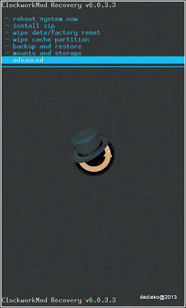

#### TWRP – Team Win Recovery Project

Clockworkmod 恢复的一个替代方案是 TWRP，代表 Team Win Recovery Project。这个恢复模式最重要的功能之一是支持触摸屏。

以这种方式，您可以直接通过屏幕与恢复模式进行交互，就像您通常使用 Android 一样，这非常方便，尤其是如果我们将其与其他所有恢复模式中使用的音量键进行比较。图形界面相当可用，有大按钮显示所有各种选项（它们与 Clockwork 模式中的按钮非常相似）。使用 TWRP，您可以安装非官方的 ROM，也可以执行完整的系统备份。

该项目始于 2011 年 7 月 30 日，是一个开源项目——在这里，您可以为您的设备下载二进制文件，或者从源代码重新编译。

您可以在官方网站上找到更多信息：[`teamw.in/`](http://teamw.in/)。

这里是 TWRP 的一些截图：

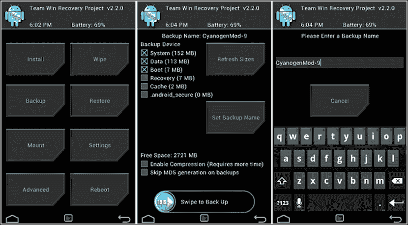

#### 使用 ADB 连接到恢复 shell

自定义恢复可以使用它们的标准 UI 操作，就像我们看到的，以及使用 ADB 连接。这个功能在标准恢复模式中不可用，在我们的实验中将会非常有用。

一旦安装了自定义恢复模式，启动终端并运行以下命令：

```java
~$: adb devices

```

ADB 将列出所有可用的设备，如下面的截图所示：

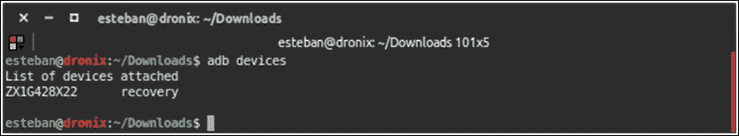

知道只有一个设备，我们可以简单地使用以下命令来连接到恢复 shell：

```java
~$: adb shell

```

您将看到一个`#`符号，这表明您作为*root*用户拥有管理员权限。作为*root*用户，您有机会执行高级任务，例如以*读/写模式*挂载`system/`目录，并添加或删除任何您想要的文件，而无需启动整个 Android 系统。

## 设备权限

正如我们在前面的章节中看到的，Android 基于 Linux，因此它也继承了与用户权限相关的部分。与标准的 Linux 系统一样，Android 也通过组和用户来管理一切。在默认配置中，无法获得管理员（root）访问权限，以防止对系统进行篡改。此外，拥有对整个操作系统的访问权限，很容易意外或故意地损坏系统本身（例如，使用病毒窃取用户数据）。

每个 Android 应用在系统上安装时，都会生成一个新的用户和组，并且应用间的通信根据 Android SDK 的约束和协议进行。然而，有时拥有对设备的完全控制权是有用的，例如，当安装管理 CPU 频率和 CPU 管理器的应用时。

现在我们来看看如何获得 root 访问权限以及 root 设备的影响。

### Root 访问

Root 访问权限允许安装了 Android OS 的智能手机、平板电脑和其他设备的用户获得对整个 Android 操作系统的特权访问，也称为 root 访问权限。正如我们之前提到的，Android 使用 Linux 内核，因此获得 root 访问权限与获得常规 Linux 或类 Unix 操作系统（如 FreeBSD 或 Mac OS X）的管理员（超级用户）访问非常相似。

通常，获得 root 访问权限的原因是为了克服硬件制造商对设备施加的限制。作为 root 用户，你有能力修改或替换系统应用并更改设置。此外，你可以使用需要 root 权限的应用程序，这使你能够执行普通 Android 用户无法访问的操作。对设备进行 root 操作，即获得 root 访问权限，如果你想要完全删除设备操作系统并替换为另一个，可能更近期的版本，这也有帮助。

在接下来的段落中，我们将看到如何获得 root 访问权限，这是安装自定义 ROM 的关键前提条件。

#### SuperSu

要在 Android 应用程序中使用 root 权限，一位名叫 Chainfir Jorrit Jongma 的独立开发者开发了一个库，它允许你在应用程序中使用这些权限，因此可以执行 root 级别的操作。所有这些都是开源的，你可以在开发者的官方网站上探索有关 API 的文档：[`su.chainfire.eu`](https://su.chainfire.eu)。

如果你想查看库源代码，你可以在以下位置找到它（并贡献）：[`github.com/Chainfire/libsuperuser`](https://github.com/Chainfire/libsuperuser)。

#### 获得 root 访问权限

现在是时候看看如何在我们的设备上实际获得 root 权限了。不幸的是，这并不简单，获得设备 root 权限的方法有很多种。每种设备都有其独特之处，因此需要执行不同的步骤来获得 root 权限。一般来说，我们可以这样说，如果有可能安装恢复模式，那么也有可能安装成为 root 所需的所有必要软件。我们只需要将正确的文件复制到默认情况下以只读方式挂载的系统分区，这样我们就可以通过创建一个临时的系统分区使用源文件来访问它，或者——在我们没有 Android 源代码的情况下——通过使用我们之前描述的某个自定义恢复模式将分区挂载为读写模式。

到目前为止，我们还没有讨论过修改设备上现有软件的法律问题。一般来说，将自定义 ROM 安装到我们的设备上并不违法，但可能会使设备保修失效。至于 Nexus 设备，没有任何问题；它们是为了软件开发目的而销售的，因此产品保修不是与软件相关，而是与硬件相关。

## Chef 工具包

本书的主要目标之一是帮助您实现自己版本的 ROM 定制。在修改者的词典中，为了制作自己的 ROM 定制而修改 Android 版本的行为通常用动词“*to cook*”和名词“*kitchen*”来描述。

“制作自己的 ROM”意味着修改设备上安装的原始 Android 版本，目的是创建一个新的版本。

因此，所有可能帮助简化 ROM 定制开发的工具都被称为“**Chef toolkit**”。

如前几章所述，从源代码创建自己的 ROM 版本确实是可能的，但并非总是如此，因为一些设备制造商没有发布他们的源代码。在所有这些情况下，我们需要在系统分区上操作，通常直接在构建内部核心的二进制文件上操作，包括应用程序框架和文件系统实用工具。

在接下来的段落中，我们将学习如何从二进制镜像开始制作 ROM，从环境分析开始，了解将帮助我们完成第一个 ROM 定制的开发工具。

### 准备环境

在我们开始开发 ROM 之前，我们肯定需要在电脑上准备一个合适的环境。Android 基本上可以与所有最新的操作系统一起使用，从 Windows 到 Linux，再到 OS X。

我们总是提到 Ubuntu，就像我们在前几章中处理从源代码编译 Android 时做的那样。因此，您只需要一台装有最新版 Ubuntu 的电脑即可开始。除此之外，我们还建议安装一个好的开发者文本编辑器——它可以是命令行的 VIM，或者图形编辑器，如 ATOM、SublimeText 等。我们将主要在控制台工作，使用不同的脚本和工具来完成我们的第一个定制 ROM。

### Android kitchen

烹饪大师最重要的工具无疑是“`Kitchen`”。虽然我们借鉴了烹饪世界的类比，但实际上我们关注的是我们第一个 Android 定制的准备工作——第一步是获取系统二进制镜像。

我们将通常使用的工具集称为“`Android Kitchen`”，例如在 shell 中使用的脚本，这些工具帮助开发者执行自动化任务，如解压缩和编辑构建 ROM 的系统镜像，反编译 APK 包，有时向 ROM 添加 root 权限等。

当然，网上存在许多不同的厨房，每个都有其独特的特点。我们将研究其中的一些，并尝试执行简单的操作，以便将我们的第一个定制 ROM 准备好，以便将其刷入我们的设备。

最受欢迎的`Android 厨房`之一是**dsixda**。该项目正式“退役”，但它已被许多用户分叉，并且开发仍在继续。它是开源的，你可以从[`github.com/dsixda/Android-Kitchen`](https://github.com/dsixda/Android-Kitchen)下载它或分叉它并为项目做出贡献。

dsixda 的`厨房`基于一系列`Bash`脚本和工具，提供了一种简单的方法来执行最常见的*烹饪*操作：

+   添加 Busybox

+   添加 root 权限

+   自定义启动屏幕

这些只是其控制台菜单中可用的可能操作中的一些。这个厨房与 Windows、Linux 和 OS X 兼容。我们将使用我们信任的 Ubuntu。一旦你下载了厨房([`github.com/dsixda/Android-Kitchen/archive/0.224.zip`](https://github.com/dsixda/Android-Kitchen/archive/0.224.zip))，将其解压缩到一个文件夹中，进入该文件夹，并运行以下命令：

```java
$: ./menu

```

此命令将启动主菜单，如下面的截图所示：

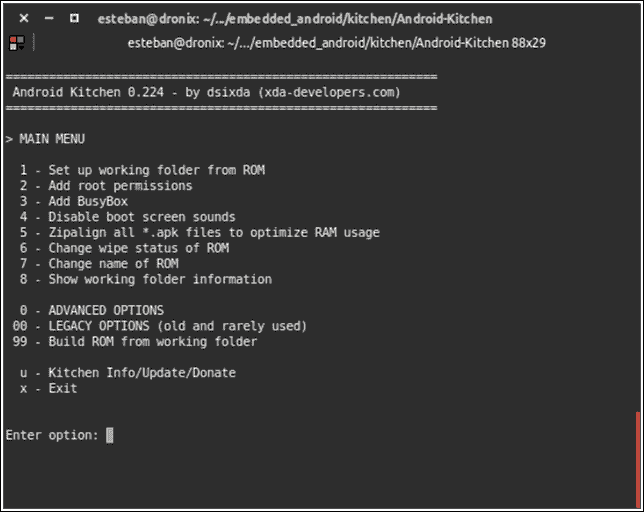

dsixda 厨房操作两个特定的分区——系统和 boot，分别压缩在`system.img`和`boot.img`文件中。在以下章节中，我们将深入了解提取这些分区并对其进行自定义。

### 其他开发者的工具

当然，对于开发者来说，许多其他不同的工具可能会很有用，这完全取决于个人的具体需求。一个**十六进制编辑器**对于二进制图像的分析肯定非常有用，而简单的图形编辑软件在修改图标或其他图形方面以及为编译 Linux 内核和可能添加到 ROM 的 Android 应用程序准备整个环境时也会有所帮助。

我们通常准备环境，就像我们需要从源代码编译 Android 和 Linux 内核一样，这样我们肯定有所有必要的工具来构建我们的自定义 ROM。

#### 使用 APKTool 操作 DEX 文件

在与 Android 系统一起工作时，需要操作 DEX 文件是很常见的。DEX 代表**Dalvik 可执行文件**，这些文件由 Android 虚拟机使用。为了轻松操作这些文件，你可以使用 Ryszard Wiśniewski 和 Connor Tumbleson 的 APKTool。这些工具是开源的，你可以在[`ibotpeaches.github.io/Apktool/`](http://ibotpeaches.github.io/Apktool/)下载它们。

APKTool 是用 Java 编写的，因此你需要一个 JVM 来使用它。一旦你有了 APKTool 的`jar`文件，打开一个终端并运行以下命令：

```java
$: java –jar apktool_2.0.3.jar

```

如果需要，将版本替换为你的版本。以下截图显示了工具的初始帮助菜单：

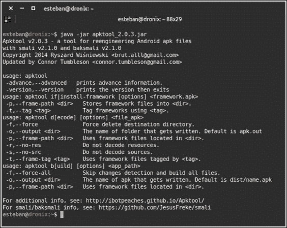

APKTool 基于另外两个工具——`smali`和`baksmali`，用于文件的汇编和反汇编。它需要一个初始设置来正常工作：`framework-res.apk`位置。你必须指定 APKTool 必须查找以获取此文件的位置。`framework-res.apk`是 Android 系统的一部分，可以从正在运行的 Android 设备中提取，使用我们信任的 ADB：

```java
~$ adb pull /system/framework/framework-res.apk .

```

之前的命令将 APK 从 Android 设备复制到当前文件夹。一旦我们有了文件，我们就可以告诉 APKTool 在哪里找到它：

```java
~$ apktool if {path to framework-res.apk}

```

现在一切配置就绪，我们可以尝试使用以下命令反编译和定制一个 APK：

```java
~$ apktool d myapk.apk path_destination_decompilation

```

APK 内容将被放置在我们指定的目标文件夹中，我们可以编辑我们想要的任何文件。在我们所有的修改完成后，我们可以使用以下命令将文件夹*重新压缩*成一个 APK 文件：

```java
~$ apktool b path_decompiled_files new_apk_mod.apk

```

一旦新的 APK 准备好，我们可以使用文件传输应用或使用我们在前几章中看到的`ADB push`将其复制到设备上。

## 烹饪我们的第一个 ROM

到目前为止，我们已经看到了从二进制系统镜像创建自定义 ROM 所需工具套件的概述。其中最重要的是“厨房”，它需要`system.img`和`boot.img`分区文件来正确地完成其工作。

如果你针对的是谷歌设备，这是一个简单的游戏。谷歌为其设备提供系统源代码，因此我们可以始终从源代码构建`.img`文件，就像我们在前几章中学到的那样。我们还可以从谷歌为 Android 系统每个新版本提供的官方系统安装包中获取`.img`文件。

如果你针对的不是 Nexus 设备，事情就会变得更加冒险。大多数情况下，你不会有系统源代码；通常甚至没有可下载的系统镜像。正如你将在下一节中看到的那样，总有办法获取拼图中最后一块，以创建我们的自定义 ROM。

### 收集原料

列表相当简短。你所需要的只是：

+   内核源代码，如果你想在核心级别定制系统

+   `system.img`

+   `boot.img`

这两个`.img`文件可能由制造商提供，就像谷歌那样，或者可以从运行中的设备系统内存中手动转储。第一种情况是*幸运的*；第二种情况更高级，需要一点创造力。这是我们将要深入探讨的情况，因为，如果你足够幸运，有制造商的系统恢复文件，你只需要将其解压缩到一个文件夹中，你就可以得到你想要的`.img`文件。

#### 转储系统分区

要创建系统内存的转储，你需要以 root 权限访问系统。正如我们已经知道的，有几种方法可以获得 root 权限——设备特定的 rooting、安装自定义恢复等。选择你喜欢的技术。

一旦你有了 root 权限，打开一个终端，使用以下命令连接到你的设备 shell：

```java
~$: adb shell

```

系统将以 `#` 符号欢迎我们。我们现在可以继续分区转储。要获取分区结构的概览，你可以使用以下命令：

```java
~ # cat /proc/partitions

```

下面的截图显示了标准 Google Nexus 6 设备的输出：

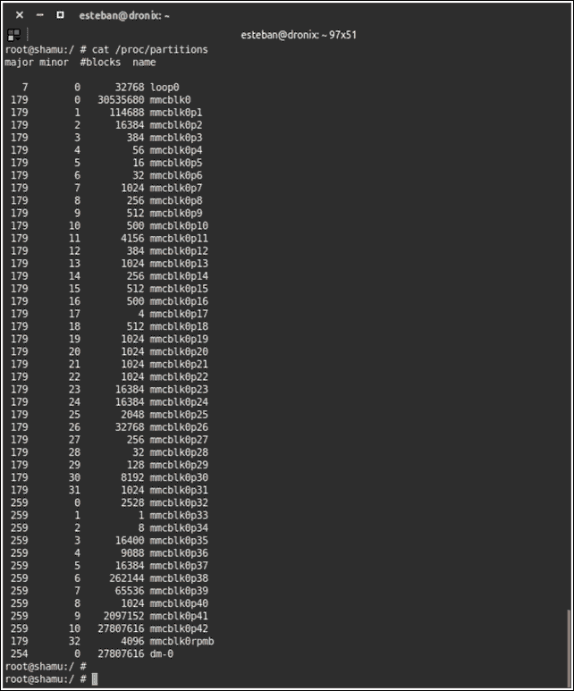

分区的数量几乎令人难以置信，但我们只需要关注系统分区和引导分区。我们知道我们感兴趣的分区就在所有列出的分区中。现在，我们必须找出这些分区中哪个实际上是 `system/`，哪个是 `boot/`。

使用以下命令显示物理分区与其在 Android 架构中角色的关系：

```java
~ # ls /dev/block/platform/msm_sdcc.1/by-name

```

之前的命令将显示类似以下内容：

```java
~ # . . .
~ # … recovery -> /dev/block/mmcblk0p35
~ # … system   -> /dev/block/mmcblk0p41
~ # … boot     -> /dev/block/mmcblk0p37
~ # … userdata -> /dev/block/mmcblk0p42
~ # . . .

```

如你所见，它显示了每个相关的分区及其角色。我们可以很容易地确定物理 `mccblk0p41` 将成为我们的 `system.img`，而 `mmcblk0p37` 将成为我们的 `boot.img` 文件。

我们将利用 `/sdcard` 分区来存储转储，并使用 `dd` 工具创建转储：

```java
~ # dd if=/dev/block/mmcblk0p41 of=/sdcard/system.img

```

使用之前的命令，你正在将整个系统分区复制到 SD 卡上的一个单独的文件中。这个过程可能需要一些时间——请耐心等待。一旦你有了 `system.img` 文件，你就可以继续创建 `boot.img` 文件，使用以下命令：

```java
~ # dd if=/dev/block/mmcblk0p37 of=/sdcard/boot.img

```

你现在有了创建自定义 ROM 的两个最重要的文件。让我们开始定制它们。

### 修改 Android 系统二进制镜像

按照以下步骤修改 Android 系统二进制镜像：

1.  让我们从 `system.img` 开始。首先，你需要将它复制到你的主机计算机上：

    ```java
    ~$ adb pull /sdcard/system.img .

    ```

1.  然后，你需要创建一个挂载点来挂载镜像到其中：

    ```java
    ~$ mkdir system_mount_point

    ```

1.  现在，你可以将其挂载为一个常见的镜像文件：

    ```java
    ~$ mount –o loop system.img system_mount_point

    ```

#### 注意

在旧设备上，`system.img` 使用的文件系统是 `yaffs`。多年来，Android 系统迁移到了 `ext4` 文件系统，这在许多 Linux 系统中也非常常见。你很可能会现在使用 `ext4` 文件系统。

使用 `cd` 进入挂载点，并用 `ls` 列出文件，你将看到一个类似于下一张图片中的文件夹结构：

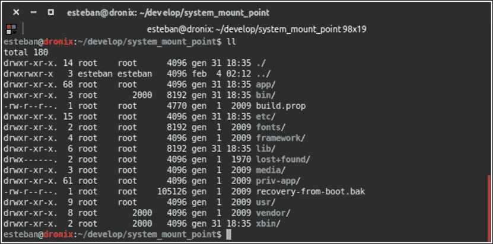

现在，你可以导航文件夹树并研究结构，移除或添加你想要的文件。一个值得研究的有意思的文件是 `build.prop`。这个文件包含有关系统和其配置的详细信息。它是一个非常硬件特定的文件，由于定制 Android 系统的无限可能性，但大多数变体都共享一些共同细节，例如内存堆大小、显示密度、设备代码名称、制造商名称、Android 框架 SDK 版本、Android 系统版本等等。甚至还有关于系统构建时间和通知及电话的默认铃声的信息。有许多小定制可以让你玩耍和实验。对于更重的修改，请继续阅读并准备好下一章即将到来的内容。

### 修改 Android 二进制引导镜像

如您从前面的章节中学到的，引导镜像与系统镜像略有不同。首先，它不包含我们可以在主机系统上挂载的文件系统：引导镜像必须被*解压缩*。

要解压缩引导镜像，您将使用上一页中`Android Kitchen`的特定菜单项。引导镜像是自定义 ROM 的关键组件：那里是内核所在，也是`init`脚本所在。这是放置必须在 Android 系统启动前应用的系统定制化的完美位置，例如 CPU 管理器的设置。

要开始与引导镜像工作，只需将文件复制到`Kitchen`文件夹中，打开菜单，并从菜单中选择您想要的选项：

+   修改 ROM 名称可以是完美的第一步

+   添加 root 权限

+   对 APK 文件进行`zipalign`以加快读取和加载速度

+   使用`deodexk`对 APK 文件进行解密，以便于文件操作，但代价是加载速度较慢

一旦您对修改满意，使用`kitchen`生成更新文件。这是一个`.zip`文件，可以通过自定义恢复刷写到设备上，代表您的第一个自定义 ROM——恭喜！

## 刷写我们的自定义 ROM

您已经有了`.zip`文件和您定制的系统分区，并且您非常兴奋地将它们刷写到您的设备上。

要刷写系统分区，我们可以使用`fastboot`。首先，您必须使用以下命令卸载分区本身：

```java
~$ umount system_mount_point

```

在我们开始对系统分区进行实验之前，总是明智的做法是进行系统备份：

*"做好准备。你永远不知道。"*

现在，您可以将设备置于 Fastboot 模式，根据您设备的特定序列。以我们的参考设备 Google Nexus 6 为例，序列如下：

1.  关机

1.  同时按下*音量增加*、*音量减少*和*电源*按钮

1.  当出现`Fastboot`菜单时释放

设备现在已准备好接收新的系统分区。使用以下命令进行刷写：

```java
~ $ fastboot flash system system.img

```

您全新的系统分区已就位！如果您的修改非常极端且具有冒险性，您可能会遇到*引导循环*——系统持续重启且永远不会结束引导序列。制造商分发的库存系统镜像或您自己的备份在这种情况下非常有用。

#### 注意

如果您正在使用三星设备并且您拥有 Windows 系统，您可以查看`Samsung Odin`，这是一个用于刷写 ROM 和获取设备 root 权限的图形界面工具。

最后一步是刷写您使用`kitchen`生成的`.zip`文件。该文件根据特定的文件结构生成，并准备好传递到您的自定义`recovery`。`recovery`将其视为“系统更新”，即使它是一个全新的、定制的系统。

首先，以恢复模式重启您的系统。您可以通过按键序列或使用 ADB，使用以下命令来完成：

```java
$: adb reboot recovery

```

一旦设备进入恢复模式，使用音量按钮进行导航，并选择**从 ADB 应用更新**。这将使设备进入等待模式。返回您的终端，并导航到使用`kitchen`生成的`.zip`文件。最后，将文件加载到设备上：

```java
$: adb sideload filename.zip

```

恭喜！您的第一个定制 ROM 已经在您的设备上*激活*了。现在，返回去进一步定制它吧！

## 摘要

本章向我们介绍了什么是定制 ROM。我们从对目前存在的、最相关的项目的描述开始，并深入探讨了细节。我们还审视了一些非常重要的组件，例如*Android Recovery*，包括原生的和经过修改的。最后，就像我们在前面的章节中所做的那样，我们采取了一种实用方法，学习如何为 Android 定制准备合适的环境。我们还研究了通常用于执行此任务的不同工具，最后，我们通过创建一个定制 ROM 的简单示例来应用我们刚刚学到的概念。在下一章中，我们将更深入地探讨 ROM 的每一个方面，使用实际示例来展示如何定制和提升 ROM 的性能。
