# 第七章. 定制你的个人安卓系统

在上一章中，你学习了最流行的自定义安卓系统。我们开始深入分析系统在修改过程中的各个部分，以有效地了解如何进行定制以及如何操作，掌握安卓修改工具集。

在本章中，我们将更进一步，深入到 ROM 的每一个细节，通过实际案例展示如何定制和提升 ROM 的性能。

本章的主要内容包括：

+   黑客安卓框架

+   将新的安卓应用程序添加到构建系统中

+   使用安卓源代码添加新的 Linux 原生应用程序，或编辑现有的二进制 ROM 镜像

+   优化系统以更好地支持自定义硬件，重点关注应用层和内核层。

## 接收空中更新 – OTA

每个安卓设备按设计都能在一段时间内接收更新。这些可以是系统更新——当新的安卓版本发布时，或者安全更新——当某些关键漏洞被修复且谷歌正在分发补丁时。一旦收到更新，每个设备都能按照所需程序解压缩并应用此更新。

这类更新被称为 OTA，或空中更新，因为它们可以通过安卓设备本身下载和应用，无需主机 PC 的支持。这些更新通常用于修复操作系统功能，在所谓的*只读*部分工作。没有任何用户应用会受到这些更新的影响——通过谷歌应用商店安装的应用完全安全。

当新的 OTA 可用时，安卓会异步通知你。大多数情况下，如果你连接到 Wi-Fi 网络且电池电量高于 50%，你将收到通知，以确保可能的快速下载和安全的更新过程。当有更新可用时，状态栏通知区域将出现新的系统通知。一旦点击通知，安卓将显示有关更新的详细信息，如下面的图片所示：

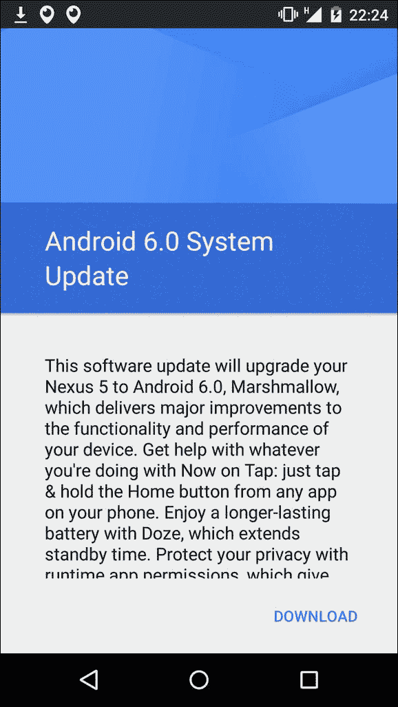

OTA 更新可以分为以下三类：

+   完整系统更新

+   增量系统更新

+   单个更新包

### 更新整个系统

如你所猜，这一系列的更新将整个系统提升到新版本。它们包含整个系统镜像，包括`system`、`boot`和`recovery`分区。

要安装这些更新，系统需要能够正确引导恢复系统，并简单地读取和应用更新文件。

即使是完整的系统更新，用户分区也不会受到影响，且不会删除任何应用或用户数据。

### 增量更新系统

这些更新比完整的系统更新要小一些，它们的目的是应用特定系统组件的补丁。由于针对特定版本的操作系统和特定版本的文件进行定制，因此这些更新不能随机应用于可用的设备。

为了强制执行此约束，在安装此类更新文件之前，系统会检查正确的文件版本以及更新所需的任何其他可能的要求。如果某些要求未得到满足，Android 会通过错误图标通知用户，并中止更新过程。

### 应用单个组件更新

OTA 更新包是一个标准的`.zip`文件，包含一个`META-INF/com/Google/Android/update-binary`文件。一旦 Android 验证了 ZIP 文件的签名，它就会在`/tmp`中解压缩文件并执行它。一些参数传递给命令行。这些是：

+   更新二进制 API 版本号

+   命令行文件描述符，用于与命令行通信，向 UI 发送进度更新

+   文件名

在`update-binary`文件所在的同一文件夹中，还有一个有趣的文件——`updater-binary`。此文件包含执行更新的操作序列。所有这些操作都使用 Google 为这项任务创建的定制**领域特定语言**（**DSL**）`Edify`来表示。正如开源世界中的惯例，Google 记录了有关此语言的所有信息，您可以在`/bootable/recovery/edify`中找到文档。

事实是，Recovery 可以执行所有名为`update-library`的静态链接二进制文件。利用这个机会，许多开发者更愿意使用他们更熟悉的语言来执行所有必要的操作以应用更新。

在接下来的几页中，我们将看到使用 Google 的 Edify 或自定义解决方案的两种可能场景的示例。

## 创建空中更新

Google 提供了大量的开发者工具来生成不同类型的 OTA。如果您想生成一个*完整更新 OTA*，需要以下两个步骤：

1.  生成包含完整更新文件的 ZIP 文件

1.  生成包含更新所需所有工具集的 OTA 包

要生成包含所选目标文件的`zip`文件，请导航到 AOSP 源代码的`root`文件夹并运行以下命令：

```java
. build/envsetup.sh && lunch aosp-shamu
mkdir dist_output
make dist DIST_DIR=dist_output

```

如果过程成功，我们应该在`dist_output`目录中有一个包含目标文件的`zip`文件。例如，让我们尝试使用以下命令列出文件夹内容：

```java
ls -l dist_output/*target_files*

```

现在我们应该看到一个`.zip`文件，其名称也将包含我们正在编译的目标名称。

到目前为止，您只需要生成包含更新所需所有文件的 OTA 包。在可用的工具中，有一个实用程序可以帮助我们通过以下命令完成此操作：

```java
./build/tools/releasetools/ota_from_target_files \
 dist_output/aosp_shamu-target_files-eng.esteban.zip ota_update.zip

```

如此所示，您将找到包含生成的 OTA 包和命令输出的屏幕：

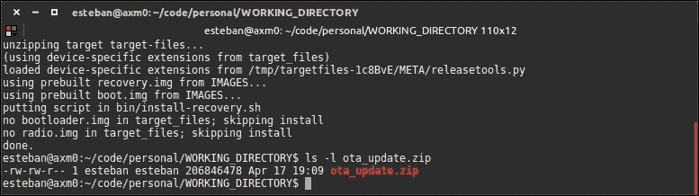

现在我们已经有了准备安装到 *开发设备* 上的 OTA 包，因为默认的 OTA 是用 *测试密钥* 签名的。如果你想为用户提供可安装的 OTA 包，你需要使用 OTA 生成工具提供的特定选项，用你自己的 *私有密钥* 签名 OTA。

为了生成 **增量 OTA**，过程几乎相同，只是你还需要指出包含上一个 OTA 版本的 ZIP 文件。命令可能如下所示：

```java
./build/tools/releasetools/ota_from_target_files \
 -i PREVIOUS-aosp-shamu-target_files.zip \ 
 dist_output/aosp-shamu-target_files.zip incremental_ota_update.zip

```

就像我们之前的例子一样，你会得到一个包含增量备份的 ZIP 文件。

最后，没有预定义的工具用于组成 `Update OTA` 包，因为这取决于我们决定通过更新脚本安装/更新什么，我们将在稍后详细研究。

### OTA 内部结构

如前节所预期，OTA 包在其文件夹树中包含一个二进制文件：

```java
META-INF/com/google/android/update-binary
```

这个二进制文件是由 Android 的构建系统生成的，位于 `bootable/recovery/updater` 文件夹中，并用于正确执行更新。

二进制文件包含内部例程和 `Edify` 脚本语言的解释器。这种语言支持一组特定命令，以便在不影响系统本身完整性的情况下正确执行系统更新。你可以在你刚刚生成的 OTA ZIP 文件中的一个找到 Edify 脚本的示例，在以下位置：

```java
META-INF/com/google/android/updater-script
```

这里展示了一个 Edify 脚本的示例截图：

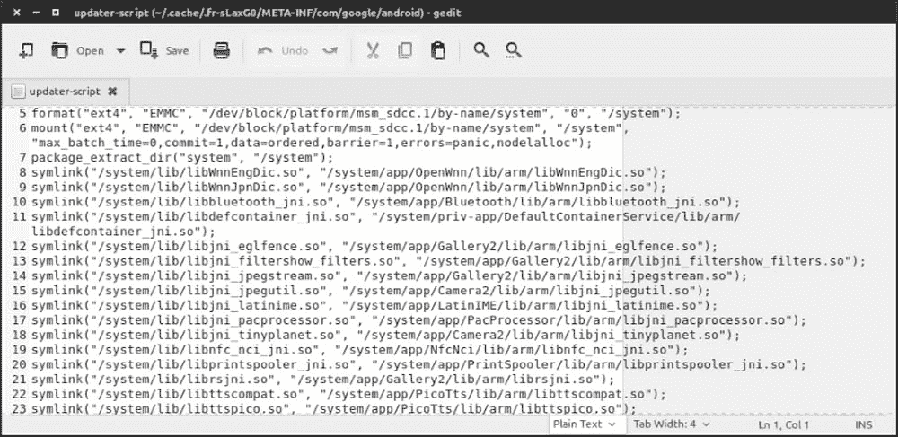

通常，我们不需要手动编写任何 Edify 代码，因为在标准场景中，有自动化工具可以生成包含所有必要文件的正确 OTA 包，但在调试时手动修改它们可能很有用，或者在我们从二进制文件构建自定义 ROM 并需要定制闪存上的安装时。

让我们看看下一节中的 Edify 语法。

#### Edify 语法

首先要知道的是，Edify 将每个表达式评估为所有字符串类型值。在布尔上下文中，空字符串被视为 `false`，而任何其他值都视为 `true`。为了总结，Edify 支持以下所有表达式类型：

```java
(expr )
 expr + expr  # string concatenation, not integer addition
 expr == expr
 expr != expr
 expr && expr
 expr || expr
 ! expr
 if expr then expr endif
 if expr then expr else expr endif
 function_name(expr, expr,...)
 expr; expr
```

包含以下类型字符的每个字符串，当然这些不是保留字，都被视为字符串字面量：

```java
a-z, A-Z, 0-9, _, :, /, .
```

对于保留字，我们指的是像 `if else` 和 `endif` 这样的词。

可以使用 *双引号* 来编写常量字符串，以便创建包含空格或其他字符的字符串，这些字符在之前的示例中没有列出，例如以下内容：

```java
\n, \t,
```

对于新行和制表符，也可以分别写成以下内容：

```java
\", \\ 
```

作为转义字符，我们在用 *双引号* 编写的字符串中使用 `"` 和 `\`。

运算符是简单的短路运算，也就是说，如果逻辑结果由表达式的左侧确定，则甚至不会考虑右侧。语法可以非常简洁，如下面的代码片段所示；两行是等价的：

```java
a1 && a2
if a1 then a2 endif
```

`;` 字符是一个序列点，意味着其左侧的内容先被考虑，而右侧的内容后被考虑。

让我们看看一个更丰富的例子：

```java
show_progress(0.750000, 0);
ui_print("Android Shamu");
mount("ext4", "EMMC", "/dev/block/…/system", "system");
unmount("/system");
```

解释器包含完成正确更新所需的所有函数。除非另有说明，否则函数在成功时通常返回 `true`，在出错时返回 `false`。

语言提供了控制流程和管理边缘情况的有用方法。例如，如果我们想触发错误以阻止安装，我们可以使用以下函数：

```java
abort();
assert();
```

如你所料，如果你想添加新功能，你可以通过修改源代码来实现，但在那之前，让我们看看一些已经可用且非常有用的函数：

+   `abort([msg])`: 此方法允许你中断当前运行的脚本。它还接受一个字符串参数 `msg`，可以显示给用户作为中断的进一步信息。

+   `assert(expr[, expr, ...])`: 此方法接受一个表达式列表作为参数，并逐个评估它们。如果其中任何表达式失败或返回 `false`，则整个脚本执行停止。系统还会显示一个“断言失败”消息和刚刚失败的断言文本。

+   `apply_patch(src_file, tgt_file, tgt_sha1, tgt_size, patch1_sha1, patch1_blob, [...])`: 此方法接受一个 `patch1_blob` 文件，并将其作为二进制补丁应用到源文件 `src_file` 上，以生成目标 `tgt_file`。

+   `delete_recursive([dirname, ...])`: 此函数接受一个文件夹名称列表作为参数，并删除它们，同时删除它们包含的每个单个文件。

+   `file_getprop(filename, key)`: 此方法可以被视为属性文件检查器。它接受一些参数，包括一个文件名和一个键，并像属性文件一样扫描文件，寻找提供的键。如果找到键，则返回其值。

+   `format(fs_type, partition_type, location, fs_size, mount_point)`: 此方法提供了一种强大的方式来格式化分区。

+   `ifelse(cond, e1[, e2])`: 此方法表示常见的 `if-then-else` 计算机科学语句。

+   `is_mounted(mount_point)`: 此方法有助于检测挂载的分区。

+   `mount(fs_type, partition_type, name, mount_point)`: 此方法在 `mount_point` 处挂载 `fs_type` 文件系统。

+   `rename(src_filename, tgt_filename)`: 此方法接受两个参数，用于将 `src_filename` 重命名为 `tgt_filename`。

+   `run_program(path[, arg, ...])`: 此方法执行路径处的二进制文件，传递 `args`，并返回程序的退出状态。

+   `sleep(secs)`: 此方法接受一个整数 `secs` 作为参数，并暂停执行 `secs` 秒。

+   `symlink(target[, source, ...])`: 此方法接受一个`target`文件和一个`sources`列表，并将所有来源创建为指向目标的*符号链接*。

+   `unmount(mount_point)`: 这是`mount`的对应方法。此方法用于卸载在`mount_point`上挂载的文件系统。

+   这只是所有可用命令的一个子集。如果你对整个列表感兴趣，可以查看官方 Google 文档[`source.android.com/devices/tech/ota/inside_packages.html`](http://source.android.com/devices/tech/ota/inside_packages.html)。

我们现在能够修改——或者从头开始创建——用于更新安装的*Edify*脚本。这种知识将证明在自定义 ROM 中非常有用，尤其是在源代码不可用的情况下，如果你想通过自定义恢复修改系统，在只读系统分区中安装特定文件。

### 自定义 ROM 的 OTA

如预期的那样，从 OTA 概念中，我们得到了一个方便的系统用于自定义 ROM 的安装。原因是大多数自定义 ROM 都是以*更新* ZIP 包的形式分发，用于提供给自定义恢复，然后由恢复程序负责在系统中安装这些包。通过分析 OTA 结构——正如我们在上一节所做的那样——我们可以直观地理解如何组织一个特定的包来安装修改版的 Android。实际上，通过一个临时的 Edify 脚本，可以格式化和重新安装任何系统分区的所有文件，以便分发你自己的修改版 Android。

这个任务留给读者作为练习，因为它可以用到目前为止获得的知识来完成。

## 高级 ROM 定制

在前面的章节中，你在自定义 ROM 的世界中迈出了第一步；我们已经发现了在线上已有的内容，并详细分析了最典型的方面。在本章中，我们将深入探讨，学习如何修改 Android 框架的最内部部分。

自定义 ROM 通常与那些添加最意想不到功能并在线分享一切的"*黑客*"联系在一起，但并不总是如此。

如前几章所述，许多设备制造商提出了他们自己的修改版 Android，这实际上就是 Android 自定义 ROM。

这是一个非常重要的方面，因为这本书既面向前面提到的"*黑客*"，也面向那些在日常工作中使用这些知识的人——一个"*黑客*"通常会处理二进制 ROM，而很少处理源代码，而专业人士肯定会有源代码，以及所有相关的工具，以便实现额外功能的发展。

在下一节中，我们将尝试以简单的方式解释两种不同的定制方法。这些是：从源代码和从二进制。

### 二进制 ROM 定制

从二进制文件开始修改 ROM，我们遗憾地只有很少的选择。由于我们没有源代码来生成不同的镜像，我们只能修改文件系统，添加实用工具和新应用程序，或者从框架二进制文件开始对颜色和图标进行美学上的更改。

我们可以使用上一章中看到的工具并应用所有必要的更改，然后，当我们完成时，我们可以使用正确的 Edify 脚本生成一个 `update.zip` 包，该包允许安装新功能。

此外，我们还可以添加新的应用程序，无论是 *Java* 还是 *C*，或者通过添加 `BASH` 环境来增强系统镜像，或者复制更新后的应用程序到 `/system` 分区，如 *Gmail* 或 *Maps*，这些可能会占用 `/data` 分区的空间。

即使在这种场景下可能性有限，从二进制镜像开始，我们也可以尝试一些优化和调整，正如我们将在接下来的章节中看到的。

### 从源代码定制 ROM

如果您有源代码，您几乎可以做什么，但如您所知，

> *"能力越大，责任越大"—本叔叔，蜘蛛侠。*

第一步是确定我们想要修改的部分及其仓库。让我们以 Android 的 `Settings` 菜单为例，我们将将其作为一个主示例来修改我们的 ROM。`Settings.apk` 的源代码在以下路径：

```java
packages/apps/Settings
```

一旦确定了源代码路径，也就是仓库，开始您定制的最佳方式是将仓库镜像到您的服务器上，然后您将对代码进行更改。

为了确保您的仓库是 Android 系统的一部分，您需要更新 `manifest.xml`，这样当您再次与 "*repo*" 同步时，您将克隆自己的 `Settings` 版本，而不是 Android 的。

之后，您需要创建另一个个人仓库，在那里您将保存您的清单，并修改以下行：

```java
<project path="packages/apps/Settings" name="platform/packages/apps/Settings" groups="pdk-fs" />
```

这里您可以看到代码将本地下载的位置：

```java
project path="packages/apps/Settings"
```

而在这里，它的远程位置：

```java
name="platform/packages/apps/Settings"
```

您会注意到远程位置没有链接，因为我们将使用默认的，如下所示定义在顶部：

```java
<remote name="aosp" fetch=".." />
<default revision="refs/tags/android-6.0.0_r6" remote="aosp" sync-j="4" />
```

如您所见，`fetch` 指的是父文件夹 "`..`" 而不是绝对路径。为了简化我们的工作，最好的做法是添加一个远程仓库，如下所示：

```java
<remote  name="my_repo-github" fetch="git://github.com/my_personal_repo/" />
```

以这种方式，我们已经定义了我们的远程仓库，我们只需要修复 `Settings` 行，如下所示：

```java
<project path="packages/apps/Settings" name="my_repo_Settings" remote="my_repo-github" />
```

现在我们已经准备好所有必要的配置来继续开发：我们有一个单独的仓库，我们可以在其中开发代码，但最重要的是，由于清单中的修改，我们不必触摸由 Google 管理的剩余系统部分，这样其他 Google 组件的更新就变得简单且顺畅。

### 将新包添加到 Android 的构建系统中

第一步是将包添加到 Android 的构建系统中，这样，当我们执行构建时，它将自动编译并添加到 ROM 中，就像其他应用程序发生的那样。我们可以在两个层面上工作：将系统应用程序作为编译的二进制应用程序添加，用*C*编写，或将系统应用程序作为*应用层*添加，该层在 Android Dalvik 虚拟机上运行，并以 APK 的形式分发。

为了创建 Android 应用程序，首先要做的是为编写代码准备环境并生成将被 Android 内部虚拟机执行的 APK 文件。我们将使用 Java、Android Studio 和 Android SDK 开发一个标准的 Android 应用程序。

#### 通过二进制添加包

在开发自定义 ROM 时，您可能需要添加二进制可执行文件或应用程序，您没有源代码。例如，您可能希望将特定应用程序作为特定任务的默认应用程序添加，这样当用户启动 ROM 时，该应用程序就已经安装到系统中。我们可以将`Facebook`应用程序作为此类示例。

要成功将新应用程序添加到您的系统镜像中，您只需获取`APK`文件并将其复制到正确的 ROM 目录中。您可以使用`update.zip`文件，添加正确的 Edify 脚本，这将安装新的 APK——我们将在稍后更详细地看到——或者，如前几章中已预料的，您可以通过 Android 的构建系统执行整个操作。

第一步是编写正确的`Android.mk`；让我们假设我们的 APK 文件位于以下路径：

```java
<aosp-root>/package/app/myapkfolder/

```

一旦您的 APK 已经就位，您需要创建一个`Android.mk`文件并添加以下片段：

```java
LOCAL_PATH := $(call my-dir)
include $(CLEAR_VARS)
LOCAL_MODULE_TAGS := optional
LOCAL_MODULE := < your app folder name >
LOCAL_SRC_FILES := < app apk filename >
LOCAL_MODULE_CLASS := APPS
LOCAL_MODULE_SUFFIX := $(COMMON_ANDROID_PACKAGE_SUFFIX)
include $(BUILD_PREBUILT)
```

分析代码片段，您将注意到几个占位符，您需要用实际值替换它们。之后，您需要在`commons.mk`文件中创建一个新的条目，该文件位于：

```java
build/target/product
```

添加新的 APK 安装相关行，如下所示：

```java
PRODUCT_PACKAGES += < what you have defined in LOCAL_MODULE >
```

到目前为止，您只需重新编译 AOSP，以在系统中找到新的 APK，它将与其他系统应用程序一起预装。

另一种非常常见且方便的方法是将预编译的应用程序添加到我们的 ROM 中，即通过 Android 更新系统的帮助。假设您已经安装了自定义恢复镜像——这将使所有操作都更容易——要向 Android 的`/system/xbin`目录添加新的二进制文件，您只需创建一个包含 Edify 脚本的`update.zip`文件以执行正确的操作。

在这里，您将看到一个 Edify 脚本，它在目标文件夹`/system/xbin`中执行预编译的应用程序安装。脚本包含在：

```java
META-INF/com/google/android/
```

脚本包含以下代码：

```java
ui_print("Edify Script for binary installation");
ui_print("Flashing a binary");
show_progress(0.700000, 0);
ui_print("mounting /system");
mount("ext4", "EMMC", "/dev/block/system", "/system");
ui_print("");
ui_print("Installing binary");
package_extract_dir("system", "/system");
ui_print("unmounting system");
unmount("/system");
ui_print("unmounted system");
ui_print("Operations completed!");
```

`update.zip`文件的内部结构将如下所示：

```java
update.zip
---> META-INF/com/google/android/update-script
---> META-INF/com/google/android/updater-script
---> system/xbin/mybinary
```

一旦创建好更新包，您只需通过设备上安装的恢复自定义应用来应用它。如您所注意到的，相同的做法，“*edify 脚本 + update.zip + 恢复*”被反复使用，这显示了 Android 更新系统的稳固和灵活，并且对于大量任务和场景非常有用；但我们还可以更进一步。

还有另一种程序，我们可以将其定义为“*脏*”，它允许更复杂的安装。您仍然会使用更新包的程序，但不是使用 Edify 语法，这在许多情况下可能不方便，并且对于高级场景来说并不那么强大，您将重新定义 `update-script` 二进制文件的内容。

如您所知，这个二进制文件默认包含执行 Edify 脚本的解释器，由系统启动。这种“*脏*”技术包括用执行所需操作的 shell 脚本替换这个二进制文件。使用这种替代方法，您有了非常强大的 shell 脚本语言，并且假设某些恢复自定义包括 Bash——作为 shell——因此它将作为解释器工作。

以下是在 Android 系统中使用 ad hoc `update.zip` 和操作安装的 shell 脚本进行 `busybox` 安装的示例：

```java
#!/sbin/sh

FD=$2

ui_print() {
  echo -n -e "ui_print $1\n" > /proc/self/fd/$FD
  echo -n -e "ui_print\n" > /proc/self/fd/$FD
}

set_perm() {
  chown $1:$2 $4
  chmod $3 $4
}

ui_print "- Mounting /system"
mount /system

ui_print "- Installing BusyBox"
unzip -o "$3" busybox -d /system/xbin

ui_print "- Setting right permissions -"
set_perm 0 2000 0755 /system/xbin/busybox

ui_print "- Symlinking BB applets"
for i in $(/system/xbin/busybox --list); do
  busybox ln -sf busybox "/system/xbin/$i"
done

ui_print "- Unmounting /system"
umount /system

ui_print "- BusyBox Installation complete -"
```

此脚本将替换我们的 `update-script` 并执行二进制安装。结果，更新包将具有以下结构：

```java
update.zip
---> META-INF/com/google/android/update-script
---> busybox
```

因此，我们可以执行最复杂的安装，并且这实际上是 Android ROM “modders”最常用的方法之一。

#### 通过源代码添加软件包

在系统源代码中。在本节中，我们将通过使用 Android Studio 创建一个`Hello World`应用程序来做一个真正的例子，我们将将其导入并与整个 Android 系统一起编译。

首先，我们需要使用 Android Studio 创建一个基础应用程序。

对于安装说明，请阅读以下链接：[`developer.android.com/sdk/index.html`](http://developer.android.com/sdk/index.html)。

当您的系统准备就绪时，启动 IDE 并创建一个新的项目：

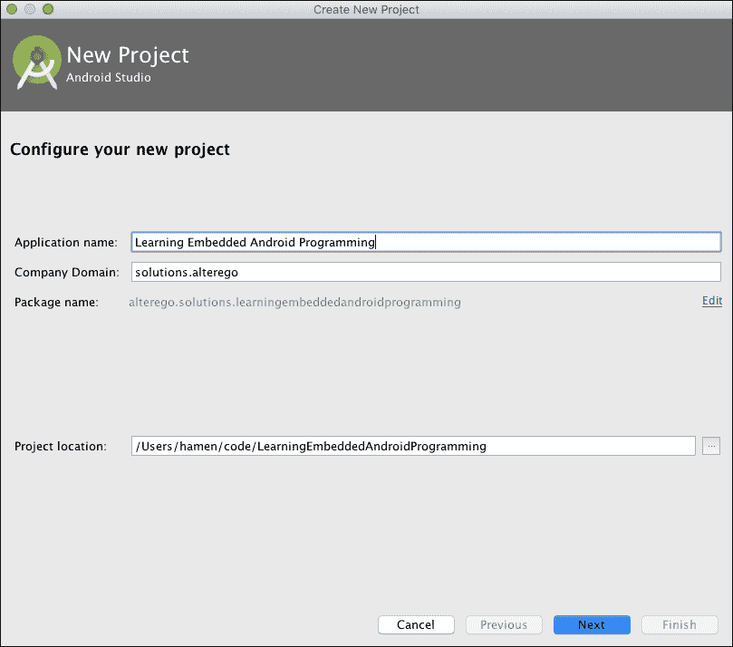

上一张图片显示了如何指定应用程序名称、域名和 Android 项目的路径文件夹。一旦输入所有数据，您就可以点击**下一步**并转到 API 级别选择，如这里所示：

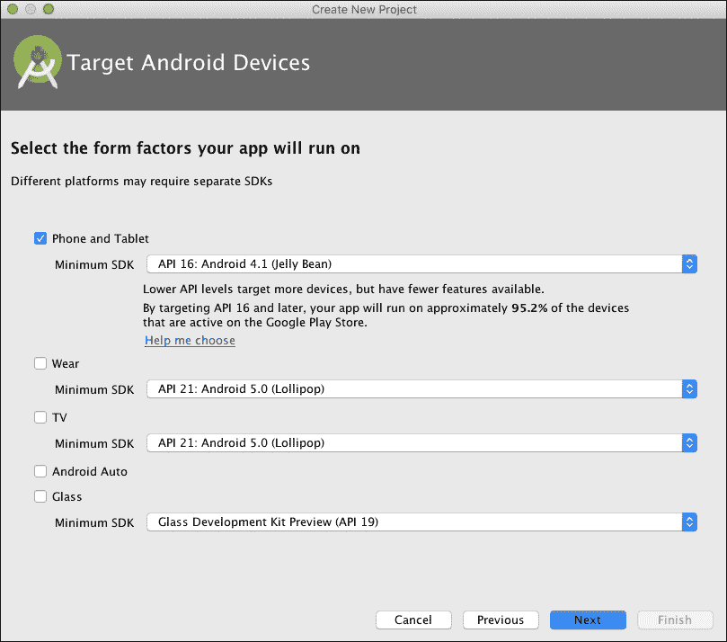

如前一张图片所示，默认情况下 Android Studio 将针对 API 16，以覆盖超过 95% 的市场。在这个场景中，这个值并不重要，因为此应用将仅安装在我们的定制 ROM 中，这可能是 Android 6。让我们转到下一个屏幕——活动选择器：


上一张图片展示了我们可以轻松添加到我们的应用中的众多可能的活动。在这个例子中，我们将只使用一个**空活动**，以保持事情简单：

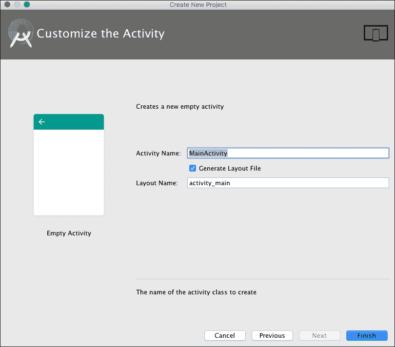

上一张图片显示了如何重命名我们全新的活动——`MainActivity`将完美地完成这项工作。只需点击**完成**，Android Studio 就会带你进入编辑器屏幕，以便向你的`Hello, World`应用添加一些代码：

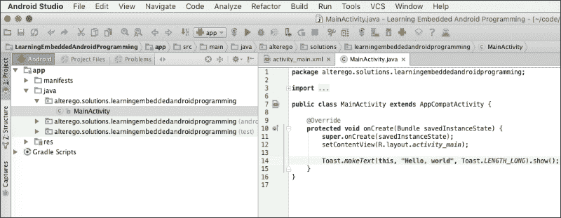

上一张图片显示了当我们的应用启动时如何显示`Toast`消息；没有太多花哨的东西，但足以让你了解如何通过适当的工具集和知识使事情变得简单。

当你的应用准备就绪时，只需点击**运行**按钮，开始构建你的 APK 文件。尽可能多地测试它，当你对结果满意时，将源代码复制到 AOSP 源代码文件夹：

```java
<aosp>/package/apps/Myapp
```

根据你目前的知识，你可以更新清单文件，将此应用添加到安卓构建系统中。

最后一步是`Android.mk`文件。对于这个`Hello, World`示例，只需创建一个新文件，如下所示：

```java
<aosp>/package/apps/Myapp/Android.mk
```

添加以下片段：

```java
  LOCAL_PATH := $(call my-dir)
  include $(CLEAR_VARS)

  # Build all java files in the java subdirectory
  LOCAL_SRC_FILES := $(call all-subdir-java-files)

  # Name of the APK to build
  LOCAL_PACKAGE_NAME := LocalPackage

  # Tell it to build an APK
  include $(BUILD_PACKAGE)
```

使用安卓的构建系统，你现在能够构建和打包你自己的安卓应用到你的定制 ROM 中。

## 破解安卓框架

这些定制与用户界面相关。由于涉及**个人品味**因素，UI 定制是一个棘手的话题：许多用户喜欢“*纯安卓*”界面，许多其他用户喜欢“*不同安卓*”界面的想法，远离主流的 UI 体验。

在本节中，我们给你自由选择，在纯安卓和定制安卓之间进行选择。你将学习如何进行小范围的定制，比如对状态栏或颜色进行定制，或者进行大范围的定制，比如向**设置**菜单添加新项目，以正确设置你定制 ROM 的定制功能。

### 定制引导序列 UI

¾¦+引导序列的图形外观无疑是您最想做的定制之一，通常是用户会要求并喜爱的。

在引导过程中，标准的安卓设备将显示：

+   启动画面

+   引导动画

启动画面是系统在开机后前几秒显示的静态图像。在谷歌 Nexus 设备上，启动画面看起来如下所示：


图片显示了谷歌品牌和一个锁。正如我们之前所学的，锁代表**引导加载程序**的状态——锁定或解锁。启动画面与引导的初始阶段相关联——通常，系统从开机到引导加载程序和 Linux 内核设置序列完成期间显示启动画面。

定制¾¦+启动画面并不容易，因为即使从理论上讲它只是一个图像，或者一系列图像，存储在 NAND 内存中，每个制造商都使用定制的方案来完成这个目标，并且他们非常不愿意记录我们如何恢复他们的工作。对他们来说非常容易的事情，拥有大量的工具和关于他们系统的知识，对我们来说却变成了几个小时的反向工程，结果和效果对整个系统的稳定性都是不可预测的。

将注意力转向启动动画，我们可以看到启动动画是一系列图像，大多数情况下是动画的，任何 Android 设备在启动序列中都会显示这些图像，紧随启动画面之后，直到 Android 系统完成启动。许多制造商定制这个动画来强化他们的品牌，你也会用你的**自己的品牌**来做同样的事情。从技术角度来看，当你看到启动动画时，内核已经加载，分区已经挂载，Android 开始启动。

与启动画面相比，这个图像序列更容易定制。这是因为即使大多数设备都有定制的启动动画，每一个都严格遵守非常严格的已知要求——这意味着我们为此有文档！

就像许多 Android 组件一样，启动动画以标准的`.zip`文件形式提供，并放置在`/system/media/`文件夹或`/data/local/`中。我们只需要抓取它，按照我们的喜好编辑它，然后放回——小菜一碟！

要检索文件，我们可以使用我们信任的`adb`。打开你的终端并运行以下命令：

```java
adb pull /system/media/bootanimation.zip .
```

当然，如果文件不存在，就尝试我们之前提到的第二个可能的位置。一旦你在你的主机计算机上有了这个文件，你就可以解压缩它，你将看到以下图像中显示的相同的文件夹结构：


所有那些`part*`文件夹包含创建动画的图像，而`desc.txt`文件包含正确执行动画的说明。

使用你喜欢的文本编辑器打开`desc.txt`文件，你将看到以下图像类似的内容：

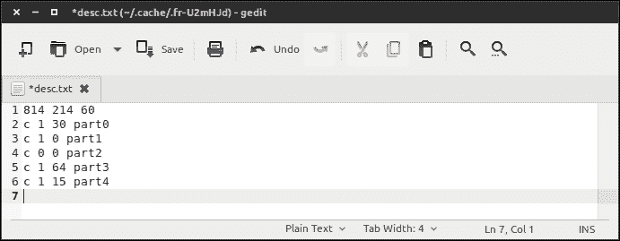

第一行指定了动画将显示的分辨率和帧率。行`2`到`6`指定了如何显示动画的不同部分。

第一个字母，"`c`"，代表“继续”，指示系统即使在启动序列完成后也要继续播放序列。

第一个数字指定了部分需要重复的次数。在示例中，只重复一次，或者无限时间（使用 0 作为值来表示无限循环）。第二个数字指定了在开始下一个部分之前将等待多少秒。行尾的最后标记指定了包含要显示的图像的文件夹。

现在你已经了解了`bootanimation.zip`文件的内部结构和如何设置序列，是时候发挥创意，替换所有那些无聊的图像，创建你自己的精彩动画了！

一旦你满意，就是时候创建一个新的`bootanimation.zip`文件了。打开你的终端并运行以下命令：

```java
zip -r -0 bootanimation.zip part0 part1 partX desc.txt

```

仔细地将`partx`替换为你动画序列中正确的文件夹序列。要尝试你全新的启动动画，只需使用`adb`将`zip`文件上传到`/data/local/`文件夹。你甚至可以创建一个自定义的`update.zip`并将其通过 Recovery 刷入你的设备。这取决于你。

#### 注意

FFMPEG 是一个方便的工具，可以从视频中提取图像以创建你的动画序列。打开终端并运行以下命令：

```java
ffmpeg -i "path_file" -r 1 -s 1024x768 -f image2 "path_images-=.jpg"

```

之前的命令指定了一些有趣的参数：`-r 1`用于每秒捕获一帧，`-s`用于指定最终图像的分辨率，`-f image2`用于实际捕获一帧并将其保存为图像。一如既往，你可以通过`-h`来获取更多文档信息。

### 定制安卓设置菜单

安卓的一个显著特点是模块化：大部分的系统功能实际上都是独立的安卓应用，分别开发和维护。例如，安卓的`设置`菜单本身就是一个安卓应用，称为`Settings.apk`，作为 AOSP 的一部分，可以根据我们的需求自由定制。在下一页，你将学习如何对`Settings.apk`进行操作以添加自定义菜单项。

打开你的终端模拟器，从包含安卓源代码的`WORKING_DIRECTORY`开始，导航到：

```java
WORKING_DIRECTORY/packages/apps/Settings
```

这个文件夹包含了原始`设置`菜单的源代码；这是你定制的起点。

这是一个关键示例，因为当你在一个自定义 ROM 上工作时，你正在改进系统，添加新功能或增强现有功能。你的新功能可能需要一定程度的设置，并将所有可能的配置选项放置在用户期望的位置，即`设置`菜单，这是良好用户体验的基本点。

以下图像显示了原始安卓`设置`菜单，这是我们定制的对象：

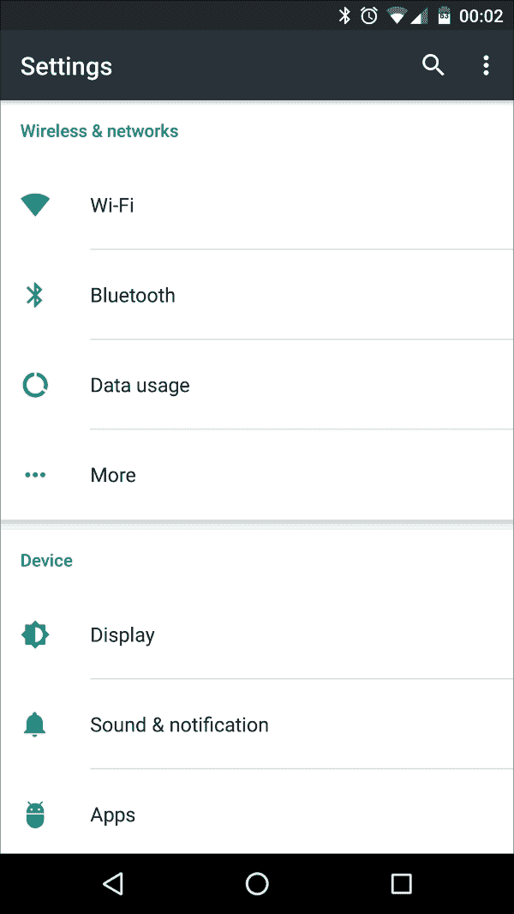

一旦你进入了`设置`菜单应用文件夹，`packages/apps/Settings`，你就可以开始编辑文件以添加你的新菜单项。让我们从添加一些字符串开始。使用你喜欢的编辑器——Android Studio、Atom、SublimeText 等——编辑`res/values/strings.xml`并添加以下行：

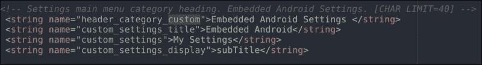

`strings.xml`文件包含了`设置`应用中使用的所有文本字符串列表；它是你定制的完美起点，并为你提供了关于命名约定和结构的想法。

一旦你对字符串文件满意，创建一个名为 `CustomSettings.java` 的新 `.java` 文件，并将其放置在 `src/com/android/settings` 文件夹中。这将包含我们需要的所有逻辑。以下图片显示了你可以创建的自定义 `PreferenceFragment` 的一个片段：

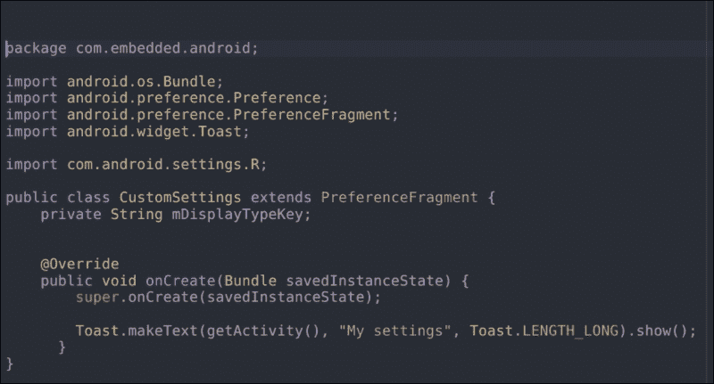

这个 `Fragment` 将加载你需要创建的特定布局文件。让我们称它为 `custom_settings.xml`，并按照下一张图片所示进行填充：

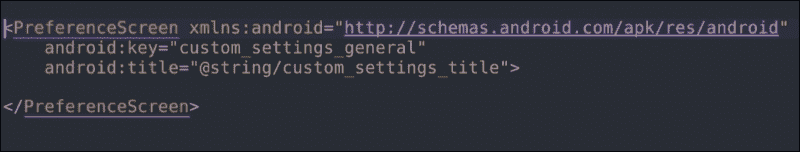

现在，你需要向 `AndroidManifest.xml` 文件中添加几行。导航到 `root` 文件夹并按照以下方式编辑 `AndroidManifest.xml` 文件：

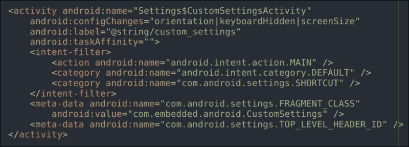

导航到主 `src/` 文件夹并打开 `Settings.java` 文件。这个文件包含了 `Settings` 菜单中可用的所有 `Activity`。在这里，你可以添加自己的 `Activity`，如下一张图片所示：

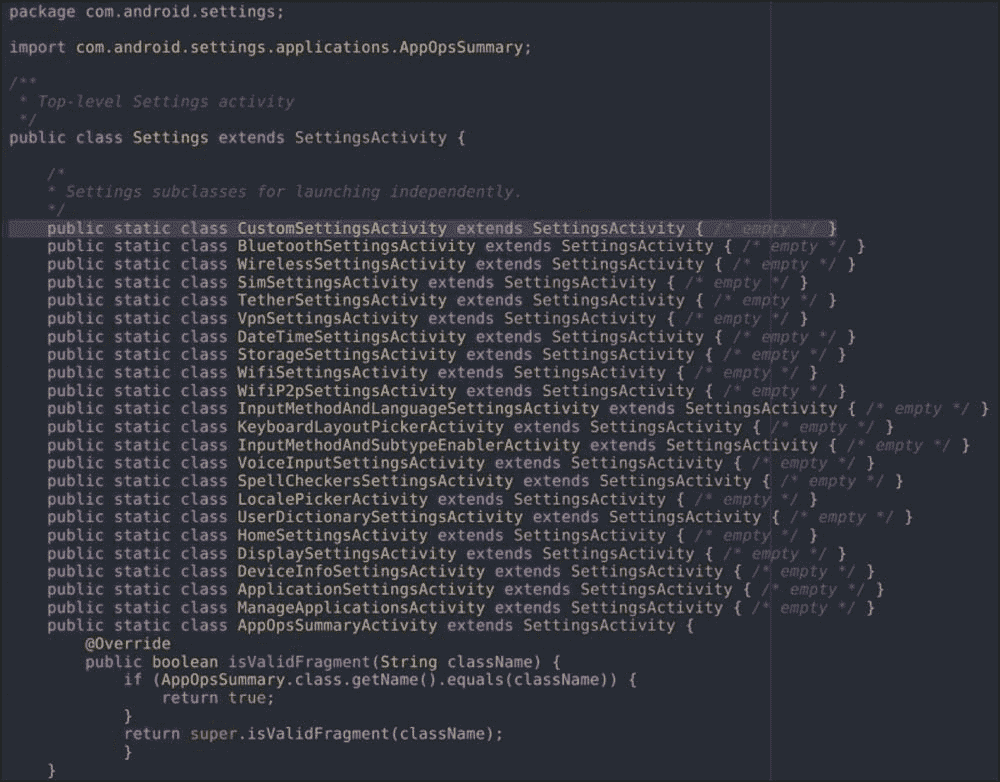

`src/` 目录下包含一个 `SettingsActivity.java` 文件。在这文件的开始部分，你会找到一个名为 `ENTRY_FRAGMENTS` 的 `String` 数组。这些都是可以被 `Settings` 菜单中的 `Activity` 文件加载的 `Fragment`。这个列表相当令人印象深刻，在 Android Marshmallow 系统中，它包含大约 70 个 `Fragment`；在你的 Android 版本中，它将包含一个额外的条目：你的。按照以下截图所示，将你的 `CustomSettings` 类添加到数组中：

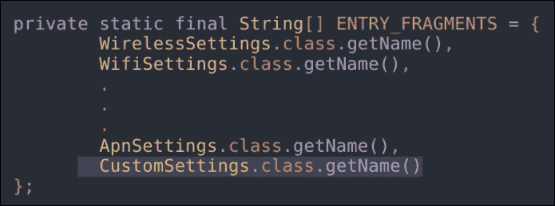

我们几乎完成了。接下来我们需要做的是使用以下命令编译新的包：

```java
:$ mm

```

一旦我们创建了新的包，我们就可以创建一个新的更新文件，并使用 Recovery 来刷写它。在下次启动时，我们将在 **设置** 屏幕中看到我们全新的菜单项，如下一张截图所示：

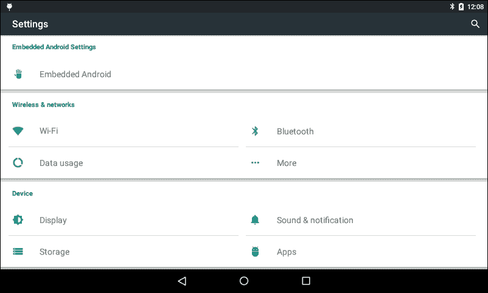

## 提升系统性能

你可以在网上找到的许多自定义 ROM 都带来了性能提升、电池寿命延长以及许多小调整。这些增强中的大多数都可以通过 `build.prop` 文件的手术式调整来实现。

### 自定义系统属性文件

Android 的 `build.prop` 文件包含在启动序列中应用于系统的各种系统设置的详细信息。在深入其定制之前，我们需要对其内部结构有一个概述。

打开终端并使用以下命令连接到你的设备：

```java
:$ adb shell

```

导航到 `/system` 文件夹并打开 `build.prop` 文件。内容将类似于以下片段：

```java
ro.product.model=Nexus 6
ro.product.brand=google
ro.product.name=shamu
ro.product.device=shamu
ro.product.board=shamu
[…]
```

如你所猜，这些说明中的部分是针对每个设备特定的，但其中一些相当常见。我们确实有设备型号名称、品牌、产品、设备和板子的代号等等。

这些常见值可以轻松编辑，以在我们的系统中获得有趣的行为变化。例如，你可能已经注意到了在接收到电话时，智能手机开始响铃前的那一小段，但可以感知到的延迟。通过仅编辑`build.prop`文件中的几行，就可以移除这个延迟。扫描文件并查找以下两行：

```java
ro.telephony.call_ring.delay=0
ring.delay=0
```

简单地将分配给它们的任何值替换为漂亮的`0`（零），然后你可以告别延迟。

你是否曾经想过为什么当手机显示锁屏或应用启动器时，你无法旋转屏幕？不再需要疑惑。查找这两行，并将现有的属性替换为新的属性：

```java
log.tag.launcher_force_rotate=VERBOSE
lockscreen.rot_override=true
```

你是否想要将设备旋转超过 180 度？通过以下行启用 270 度旋转：

```java
windowsmgr.support_rotation_270=true
```

我们可以通过单行编辑实现另一个 UI 技巧，即更改 LCD 密度值。搜索以下行：

```java
ro.sf.lcd_density=XXX
```

将`XXX`替换为你想要尝试的值。更改此值将产生系统图标的大小调整和屏幕空间的增加：你设置的值越小，你得到的空闲空间就越多。不幸的是，这里没有精确的科学方法，一点点的*试错*是不可避免的，所以尝试用几个值进行实验，直到找到你喜欢的设置。

每天 Android 设备都在变得更强大，但，在那些日子里，可用的 CPU 功率非常有限。为了保证令人满意的性能和用户体验，Android 使用了智能调整，如下所示：

```java
ro.media.enc.jpeg.quality=xxx
```

之前的值改变了 JPEG 文件的渲染质量。即使它在过去很有用，我们也可以认为在上一代智能手机上它是多余的，我们可以安全地将它设置为`100`并享受 100%原始质量的图片。

如果你的智能手机有物理导航按钮，你可以通过以下方式设置下一个属性来增加屏幕空间，移除屏幕底部的导航软键：

```java
qemu.hw.mainkeys=1
```

如果你的设备没有物理按键，你仍然可以移除软键并使用手势导航；在 Google Play Store 中查找手势应用，如*All in one Gestures*。继续“屏幕空间”主题，你可以通过以下属性移除系统通知栏中的`debug mode`图标：

```java
persist.adb.notify=0
```

这最后两个调整指的是网络设置。第一个如下：

```java
wifi.supplicant_scan_interval=300
```

这行配置了每次自动 Wi-Fi 扫描之间的秒数。Android 默认执行自动 Wi-Fi 扫描，寻找可连接的开放网络或仅为了提高导航系统的精度。你可以增加或减少这些扫描的频率，试图在导航的更高精度和更长的电池寿命之间找到完美的平衡。第二个网络调整给你提供了设置默认 DNS 服务器的机会：

```java
net.dns1=8.8.8.8
net.dns2=8.8.4.4
```

这在政府根据 IP 地址过滤互联网网站的国家中非常有用。使用前面片段中显示的 DNS IP，Google 的 DNS 服务器，你将能够绕过这种审查。

### 添加自定义初始化序列

Linux 的传统在 Android 架构的几个关键方面仍然很强。其中最有趣的一个是在初始化期间执行自定义脚本的可能性。如果你熟悉 Linux 系统，你了解 `/etc/init.d` 文件夹。这个系统文件夹包含了一组在系统启动时可以执行的脚本。为了在 Android 上实现相同的行为，我们可以使用 `busybox` 和它的 `run-parts` 工具。这个工具接受一个文件夹作为参数，并执行该文件夹中包含的每个脚本。例如，以下命令将执行 `/system/etc/init.d` 文件夹中包含的每个脚本：

```java
run-parts /system/etc/init.d
```

为了正确复制 Linux `init.d` 的行为，我们希望能够以严格的顺序执行脚本。你可以通过巧妙的文件命名来实现这一点。只需重命名你的脚本，并在前面加上一个数字，如下例所示：

```java
01settings
02optimizations
```

在前面的例子中，`01settings` 脚本将在 `02optimizations` 脚本之前执行，依此类推。现在你已经有了一组有序的脚本，并且知道如何逐个执行它们，你需要编辑我们在前几章中看到的 `install-recovery.sh` 文件，并添加以下行：

```java
run-parts /system/etc/init.d
```

## 高级 Linux 内核修改

当你想到定制 Android 系统的核心时，你立刻会想到定制 Linux 内核。它管理 CPU、传感器、无线电和显示，并且是每个系统定制的起点。正如我们之前看到的，修改内核并不是一件容易的事情，但有了正确的思维方式、知识和工具集，它可以是一次令人满意的体验。

每个嵌入式系统都有其自定义的可能性，当涉及到 Android 时，大部分努力都集中在以下方面的定制：

+   管理器

+   I/O 调度器

+   CPU 超频/降频

### 深入 CPU 频率管理

在工作中，以及如何根据不同的场景选择不同的管理器。在本节中，你将学习如何自定义现有的管理器以及如何将新的管理器添加到你的系统中。

#### 注意

一个 *管理器*，或 CPU 频率管理器，描述了 CPU 根据特定的环境因素如何表现。

一个典型的通用管理器会在系统负载低时减少活跃核心的数量和它们的工作频率，当系统需要高性能时，将 CPU 推向全功率和全速。

标准的 Linux 内核提供了以下管理器：

+   **按需**: 这是市场上大多数内核的默认调速器。它被认为是一个*平衡*的调速器，因为它可以保证系统具有反应性，在需要时快速增加 CPU 频率。事实是，由于如此渴望增加 CPU 频率，这个调速器并没有对实际所需的 CPU 功率进行任何实际评估。按需调速器不考虑实际系统负载；相反，当它被触发时，它会将 CPU 频率增加到最大值，如果不需要，它会缓慢降低。正如你所看到的，这不适合“省电”场景：每次系统认为需要更多电力时，它都会推到最高速度，而不进行更深入的分析。这种方法肯定会保证设备具有反应性，但肯定会迅速耗尽电池。

+   **省电**: 这无疑是节省电池寿命最有效的方法之一。这个调速器将 CPU 的最高频率设置为最低可能值。电池的续航时间肯定会“无限”，但设备将无法使用：一个 2 GHz 四核 CPU 可以轻松降低到 200 MHz，如果它始终保持在那里，那就毫无意义。

+   **性能**: 这个调速器与*省电*调速器的行为正好相反：它将 CPU 的最小频率设置为最大可能值以实现最佳性能。从电池的角度来看，这会迅速耗尽电池：一个始终以全功率运行的 2 GHz 四核 CPU 当然表现良好，但智能手机的续航时间不会很长。

+   **交互式**: 这是按需调速器的更智能版本。其目标是提供一种反应性 CPU 缩放，而不会陷入按需陷阱。按需调速器根据预设值更改 CPU 频率，而不进行任何具体分析。相反，交互式调速器会持续评估系统负载，并根据需要调整 CPU 频率，具有更线性的 CPU 缩放曲线：这绝对是一个优点。整个 CPU 缩放分析不是基于原始工作量，而是根据请求的时间进行。这种方法保证了系统流畅性和在多媒体场景中的更好性能，因为 CPU 不会在频率上上下跳动，而是在整个必要的时间内保持稳定，在需要时提供恒定的帧率。

+   **保守**: 这个调速器是按需调速器的平滑版本。与按需调速器不同，保守调速器不会每次都将 CPU 推到最高频率，而是会根据 CPU 负载逐步调整 CPU 频率。

+   **用户空间**: 这是最可定制的也是最“非自动”的调速器。它为用户提供手动选择所需频率的可能性。

### 添加自定义 CPU 频率调速器

如果你需要特定的 CPU 行为，或者你只是想更深入地了解内核定制，你可以创建自己的 CPU 调速器。

对于这个任务，您需要内核源代码并导航到：

```java
<root-source>/drivers/cpufreq
```

此文件夹包含我们在上一节中看到的每个调度器以及您将要添加或设备制造商已经添加的每个可能的自定义调度器。

让我们在该文件夹中创建一个新的调度器，例如创建一个`.c`文件：

```java
<root-source>/drivers/cpufreq/cpufreq_mygovernor.c
```

将文件放置好之后，您需要将其添加到以下提到的文件中：

```java
 <root-source>/drivers/cpufreq/Kconfig 
```

我们按照以下片段所示进行更改：

```java
config CPU_FREQ_GOV_MYGOVERNOR
 tristate "'mygovernor' cpufreq governor"
 depends on CPU_FREQ
 help
 'mygovernor' - my optimized governor!

config CPU_FREQ_DEFAULT_GOV_ MYGOVERNOR
 bool "mygovernor"
 select CPU_FREQ_GOV_MYGOVERNOR
 help
 Use the CPUFreq governor 'mygovernor' as default.
```

完成对`Kconfig`的编辑后，编辑`Makefile`并添加以下行：

```java
obj-$(CONFIG_CPU_FREQ_GOV_ MYGOVERNOR) += cpufreq_mygovernor.o
```

作为最后一步，编辑以下文件：

```java
<root-source>/include/linux/cpufreq.h
```

大约在第 400 行，有一个当前可用的调度器列表，如下所示：

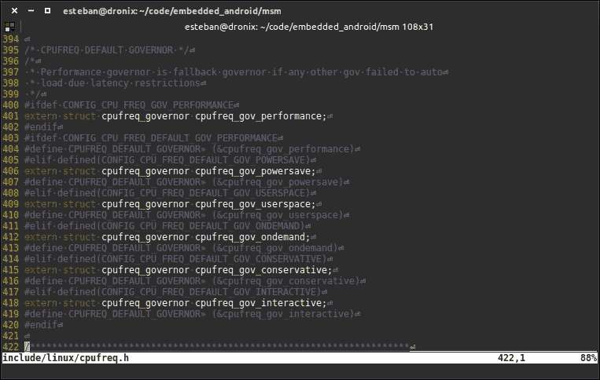

按照相同的模式，让我们添加您的新调度器引用，使用以下片段：

```java
#elif defined(CONFIG_CPU_FREQ_DEFAULT_GOV_MYGOVERNOR)
extern struct cpufreq_governor cpufreq_gov_mygovernor;
#define CPUFREQ_DEFAULT_GOVERNOR (&amp;cpufreq_gov_mygovernor)
```

任务完成：您的新调度器现在可用并准备好集成到您的下一个内核构建中。尝试运行`menuconfig`并导航到调度器屏幕；您将能够启用它并将其设置为默认调度器。

### 探索 I/O 调度器

I/O 调度器指定了 I/O 密集型操作必须如何执行以及在 CPU 核心之间如何平衡。Android 自带一组默认的 I/O 调度器：

+   **Noop**: 这几乎可以被认为是一个调度器。实际上，它对任务列表没有影响：它只是按顺序排队。

+   **SIO**: 这是第一个真正的调度器。即使它不进行任务重排序，它也能保证从任务入队到执行的最小延迟。

+   **CFQ**: 此调度器根据特定类别将任务排序到独立的队列中，并为每个队列分配一个执行时间窗口。窗口大小取决于分配给相关任务的优先级。

+   **BFQ**: 此调度器与 CFQ 调度器类似，但它使用磁盘带宽窗口而不是时间窗口来分组和调度任务。

+   **Anticipatory**: 此调度器使用预测技术来分组和调度任务，暂停执行一段时间并等待可能的新任务被添加到特定队列。

+   **ROW**: 此调度器基于“*读优先于写*”规则：每个读取任务都比写入任务具有更高的优先级。

+   **Deadline**: 此调度器保证入队任务的终止，试图避免“饥饿”场景。*饥饿*是计算机科学中的一个知名概念，适用于资源管理。想象一下，*N*个进程想要使用相同的共享资源。共享资源一次只能由一个进程使用，进程根据它们的优先级交替使用。如果一个低优先级进程请求资源，但由于其他高优先级进程正在使用它，资源永远不会变得可用，会发生什么？低优先级进程将永远等待资源，永远不会得到使用。在计算机科学的术语中，它将*饿死*。

每个可用的调度器都存储在以下文件夹中：

```java
<root-source>/block
```

创建 I/O 调度器可能具有挑战性，这超出了本书的目的。我们能做的是为你指明正确的方向，并激发你对这个主题的兴趣。

## 展望未来

在撰写这本书的过程中，我们很幸运地提前看到了即将到来的 Android N。新版本可能于 2016 年底作为稳定版发布，在几个月的公开*开发者预览*之后。

Android N 引入了一些有趣的功能，如下一张图片所示的多窗口模式：


在谷歌，他们非常注重用户反馈，并在三星测试了几个月后决定将此功能引入官方版本。我们大多数人都会从三星已经提供的 Android ROM 中认出多窗口模式。在 Android N 中，这项功能将面向所有人，适用于所有 Android 设备，并完全支持两种方向，即纵向和横向，甚至可以通过拖动“分隔线”来*调整*分割窗口的大小。

根据许多博客文章，Google Play Store 应用中最受欢迎的类别之一是来电显示过滤器。在 Android N 中，这个功能将作为系统功能提供，就像新的“移动数据节省”功能一样，旨在减少特定应用的背景数据消耗。

Android N 带来的新 UI 增强之一是可以在滚动下拉的`快速设置`菜单中添加和删除操作图标，如下一张图片所示：

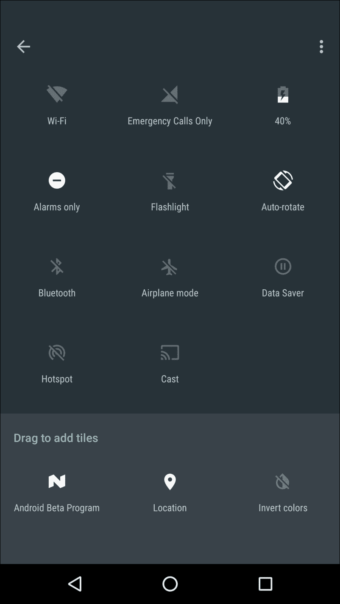

此外，下拉的`通知`菜单还带来了新的通知设计，它允许更丰富的交互，更快地访问常用操作，如下一张图片所示：


**设置**部分也得到了一些关注，新增了就地通知，如下一张图片所示，这让你有机会在不导航到特定位置的情况下禁用或启用设置：

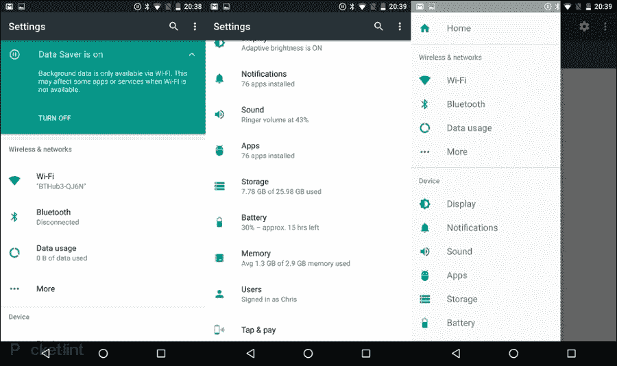

下一个图片还展示了新添加到`设置`部分的`导航抽屉`，以便更快地导航到更深的菜单层级：

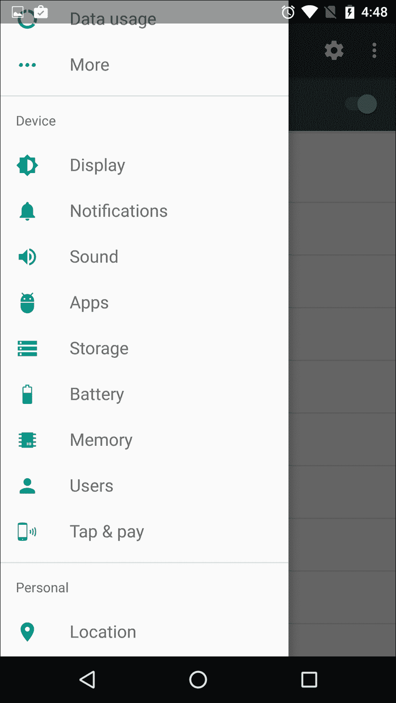

新版本中将提供大量的小修复，许多改进旨在提高性能和电池寿命，如最受欢迎的*移动中的省电模式*，它承诺将为 Android 设备带来变革。

## 摘要

在本章中，你学习了如何通过实际案例在不同的级别上有效地自定义 Android，你现在知道如何从源代码中程序性地创建一个自定义 ROM，准备一个带有每个部件就绪的自定义文件夹结构，以便由 Android 的构建系统组装。你还知道如果你有一个已经组装的系统镜像，如何处理自定义任务，以及如何自定义和重新组装二进制镜像。

下一章将带你**走出**纯智能手机体验，并展示 Android 如何有效地成为我们生活中的无处不在：物联网、Android Auto 和 Android Wear、智能家居和娱乐只是我们目前能找到的*绿色机器人*的几个场景。
