# 第二章：使用 Swift 构建基础

现在我们对 Xcode 进行了简要的游览，是时候开始学习 Swift 了。记住，如果你是编程新手，对你来说，事情将会非常不同，所以请慢慢来。在这里你将学习的重要技能将为你打下 iOS 开发的坚实基础。如果你有之前的编程经验，你仍然应该复习这一章，因为它可以增强你的编程技能，并作为你的复习材料。

2014 年 6 月 2 日，苹果公司改变了 iOS 开发的格局，因为这是 Swift 被宣布于世的那一天。随着这一宣布，每个人都站在了同一起跑线上，因为他们必须学习一门新的编程语言。Swift 为开发应用程序带来了一种更现代的方法，并吸引了大量不同年龄段的开发者想要构建 iOS 应用程序。但关于历史的讨论就到这里！让我们深入探讨，看看你将要学习什么。

本章将涵盖以下内容：

+   儿童游乐场

+   数据类型

+   变量和常量

+   调试和 print()

+   注释

# Playgrounds – 一个交互式编码环境

在我们开始构建后面章节中将要创建的应用程序之前，名为*Let's Eat*的应用程序，我们需要了解 Swift 的基础知识。实验 Swift 的一个简单方法就是使用**Playgrounds**。它是一个交互式编码环境，可以评估你的代码并显示结果。使用 Playgrounds 使我们能够在不创建项目的情况下使用 Swift。这对于原型设计应用程序的特定部分非常出色。所以，无论你是学习还是实验，Playgrounds 都是一个无价的工具。为了创建一个 Playground，我们需要启动 Xcode 并点击“使用 Playground 开始”：

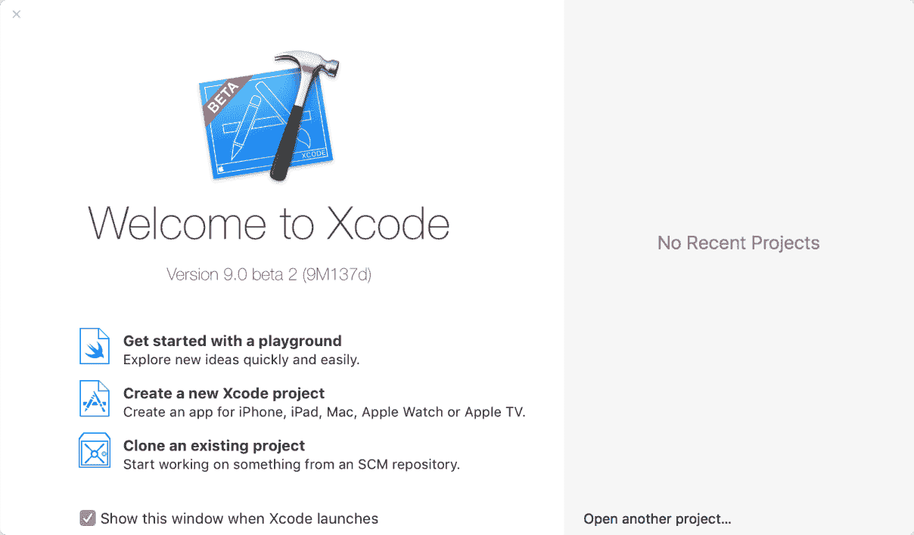

将会显示 Playground 模板屏幕。确保你选择 iOS，然后选择空白并点击下一步：

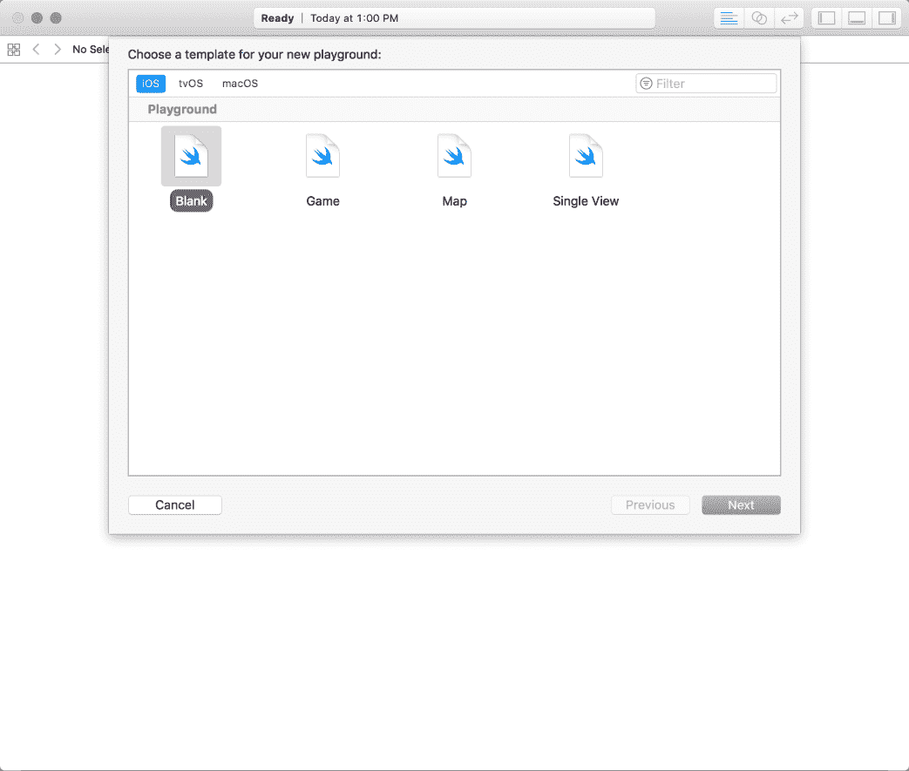

你将被要求给你的项目命名并指定保存文件的位置；将你的新`Playground iOS11-Programming-for-Beginners-Ch2`命名为你喜欢的任何位置。现在，随着项目的保存，我们可以探索 Playgrounds 了。

当你启动应用程序时，你会看到五个不同的区域：

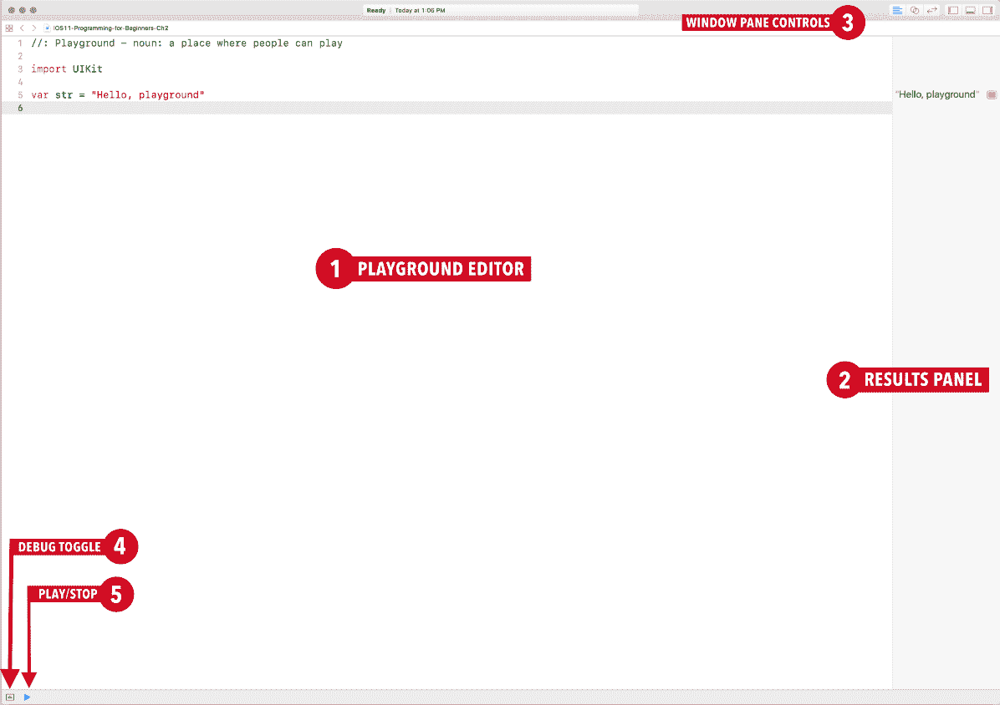

让我们逐一分析儿童游乐场的各个区域：

+   **Playground 编辑器**：这个区域是你将编写所有代码的地方。

+   **结果面板**：**结果面板**是 Playgrounds 中独有的功能，提供即时反馈。

+   **窗口面板控件**：**窗口面板控件**有两个图标组：

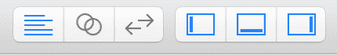

正如我们之前讨论的，第一组被称为**编辑模式**，第二组被称为**视图**。请参考前一章中这些图标的详细描述，以了解每个图标的用途。

+   **调试切换**：此按钮允许您隐藏和显示调试面板，并在调试面板上切换。

+   **播放/停止**：此按钮用于使 Playgrounds 执行代码或停止 Playgrounds 运行。通常，Playgrounds 会自动运行，但有时当你无法通过 Playgrounds 为你执行代码时，你需要手动切换此功能。

现在我们已经完成了设置，删除这个文件中的所有内容。你的 Playgrounds 应该有三个打开的面板：你的 Playgrounds 编辑器、结果面板和调试面板。让我们开始深入研究一些代码。

# 数据类型 – 一切开始的地方

Swift 提供了一系列内置的数据类型。其数据类型包括字符串、整数、浮点数和布尔值。这些数据类型在大多数编程语言中都可以找到。因此，如果你不是编程新手，你可以跳过这一部分，并从变量和常量——数据存储的地方部分开始。

让我们逐一介绍每种数据类型，对于那些刚开始编程或者想要复习的人来说。

# 字符串

我们将要讨论的第一个数据类型是字符串。字符串由一系列字符表示。字符串用于在应用程序中显示文本。当一个字符串被引号括起来时，它被称为字符串字面量。在编程中，我们不能直接将文本添加到 Playgrounds 中。因此，为了编写一个字符串，我们必须将我们的字符串放在引号内。

现在让我们将我们的名字用引号括起来添加到 Playgrounds 中：

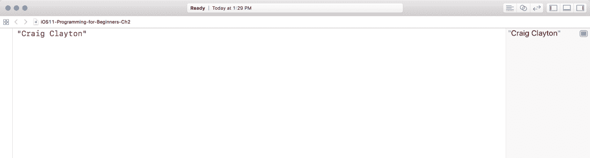

在 Playgrounds 中，你的值也会出现在你的结果面板中。所以，我们现在知道，为了创建一个字符串，我们需要使用引号。

# 整数数据类型

**整数**（**Ints**）是整数，例如 32 和`−100`。整数在需要进行计算（即加法、减法、乘法等）时很有用。让我们在 Playgrounds 中添加一些数字。在下一行，在你的名字下面输入 32，然后在下一行输入`−100`：

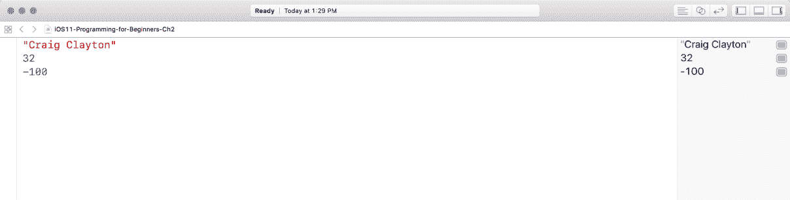

再次提醒，你会在自己的名字下看到结果面板中的`32`和`−100`。

# 浮点数

浮点数是带有小数部分的数字，例如`4.993`、`0.5`和`−234.99`。让我们也将这些值添加到 Playgrounds 中：

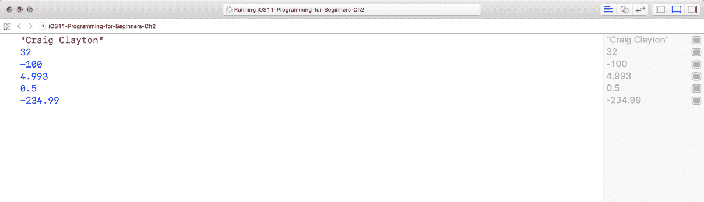

# 布尔值

**布尔值**（**bools**，简称布尔值），被称为逻辑值，因为它们可以是真或假。布尔值用于确定某些逻辑是真还是假。例如，用户是否登录？这个陈述要么是真的，是的，他们登录了，要么是假的，没有，他们没有登录。所以，在 Playgrounds 中，添加`true`和`false`：

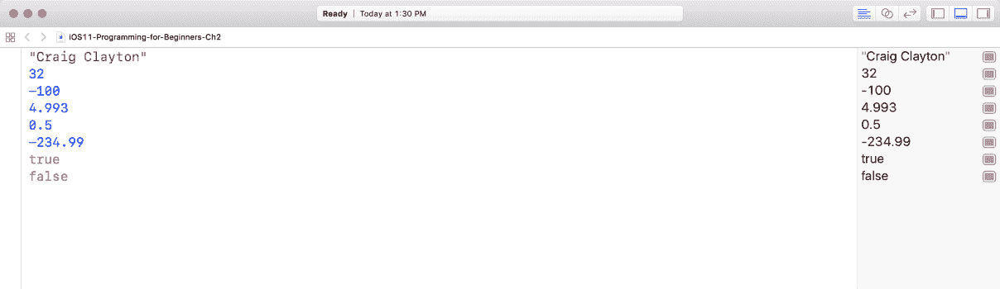

因此，我们现在已经涵盖了 Swift 中的所有基本数据类型。目前，我们无法使用这些数据类型。这就是变量和常数发挥作用的地方。

# 变量和常量 – 数据存储的地方

变量和常量就像是一个容器，用来存放某种数据。当你想要声明一个变量时，你必须使用 `var` 关键字。让我们声明我们之前做过的每个数据类型，但这次使用变量和常量。

# 使用字符串创建变量

首先，删除你在 Playgrounds 中已经输入的内容，现在让我们声明第一个变量，命名为 `fullName`，并将其设置为你的名字：

```
var fullName = "Craig Clayton"
```

之前的代码表明我们有一个名为 `fullName` 的变量，并且它包含了一个字符串值 `Craig Clayton`。你的结果面板将显示你的实际名字作为其数据：

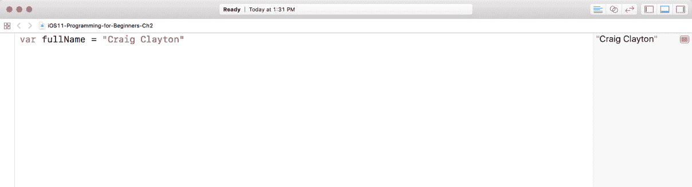

# 使用整数（Int）创建变量

现在，让我们创建一个名为 `age` 的整型变量，并将其设置为你的年龄（或你想要的任何年龄）通过添加以下内容：

```
var age = 40
```

我们现在知道 `age` 是一个整型。你应该在结果面板中看到你的名字和年龄，就像你之前做的那样：

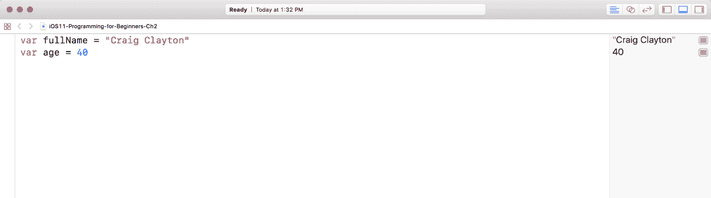

# 调试和 print() – 检测你的错误

我们可以使用调试面板（以下截图的底部）使用 `print()`。所以，让我们通过打印我们的名字和年龄来看看 `print()` 是如何工作的。我们可以通过添加以下内容来实现：

```
print(fullName)
print(age)
```

它应该显示在你的屏幕上如下：

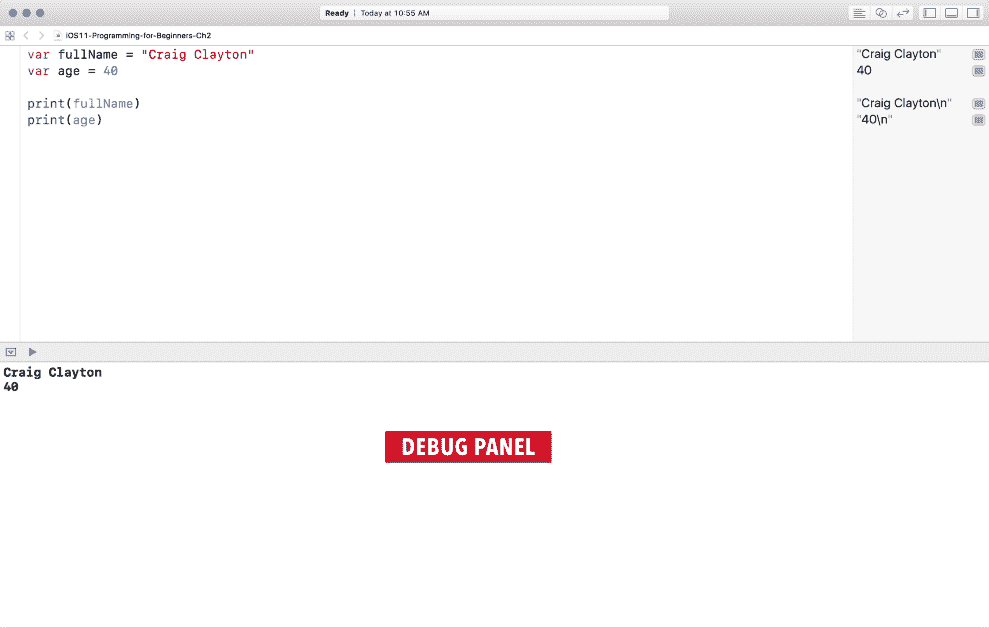

你现在应该在结果和调试面板中看到输出。使用 `print()` 允许我们在调试面板中看到内容，从而验证预期的结果。这是一个非常有用的调试工具。

# 添加浮点数

现在，让我们使用 Playgrounds 中的 `let` 常量来添加浮点数：

```
let gradeAvg = 2.9
let version = 1.1
```

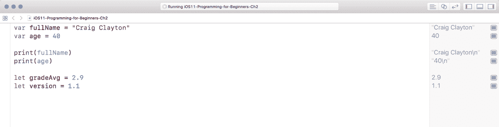

你会注意到几件事情有所不同。首先，我们使用了 `let` 关键字。使用 `let` 告诉我们的程序这是一个常量。常量是一旦设置后就不能更改的变量（与设置后可以更改的非常量变量相对）。

你可能还注意到，我们明确地将 `version` 设置为 `Float`。当处理浮点数时，它可以是 `Double` 或 `Float`。不深入技术细节的话，`Double` 比起 `Float` 来说更加精确。最好的解释方式是使用 π 作为例子。π 是一个数字，其数字会无限延续。好吧，我们无法使用一个无限延续的数字；然而，`Double` 和 `Float` 会处理这个数字的精确度。让我们看一下下面的图表，看看我所说的精确度是什么意思：

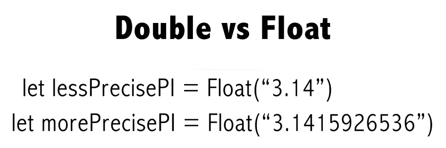

所以，在先前的例子中，你可以看到 `Float` 只会显示 `3.14`，而 `Double` 会给出一个更精确的数字。在 Swift 中，`Double` 是首选的。因此，如果你没有明确地将浮点数设置为 `Float`，Swift 会默认将其设置为 `Double`。要将 `version` 设置为 `Float`，你必须故意这样设置。

# 创建布尔值

现在是时候创建一个`Bool`并将其设置为常量了。输入以下代码：

```
let isConstant:Bool = true
```

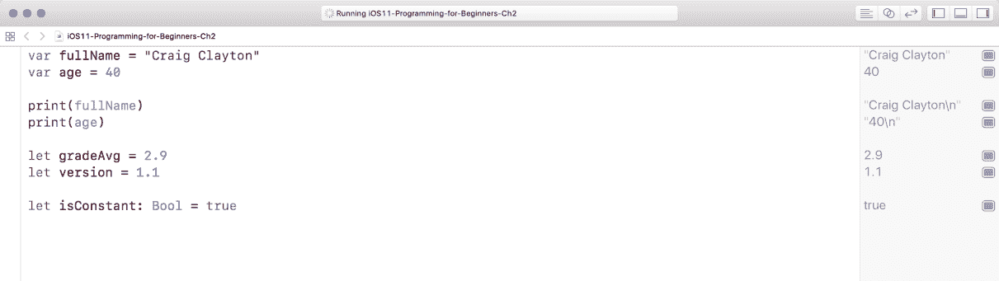

由于`isConstant`被设置，让我们通过添加以下内容将其设置为`false`：

```
isConstant = false
```

在你刚刚输入的同一行，你现在将看到一个红色的圆圈，里面有一个白色的点。红色的圆圈表示存在错误。里面的白色圆点表示 Xcode 可以为你修复错误（大多数时候）：

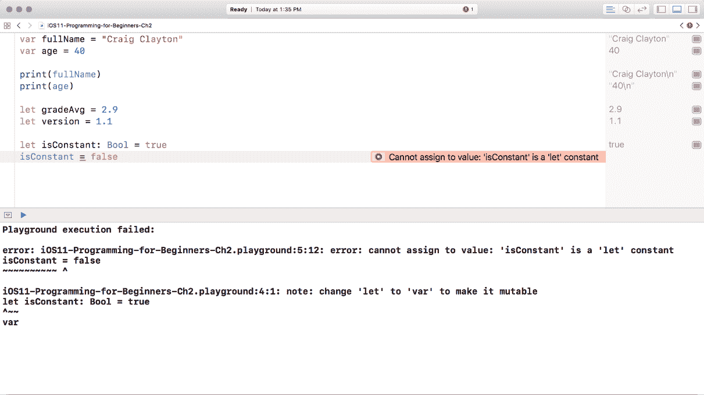

你也会在调试面板中注意到一个错误，这只是一个更详细的错误版本。这个错误告诉我们，当我们不能这样做时，我们正在尝试更改常量的值。

如果你点击这个圆圈，你会看到 Playgrounds 建议你将`var`更改为`let`，因为你不能给常量赋值：

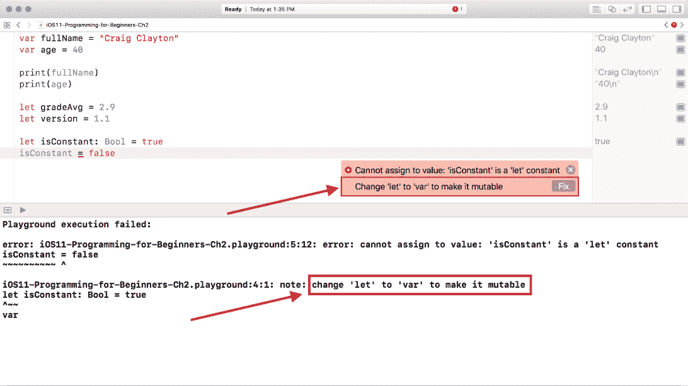

由于我们希望它保持为常量，让我们删除`isConstant = false`这一行。我们已经介绍了基本数据类型，但还有一些其他编程基础知识我们也应该讨论。

# 匈牙利命名法

通常，我在编写变量时喜欢使用匈牙利命名法，因为它可以作为变量数据类型的标识符。例如，我们之前写了`fullName`和`gradeAvg`。在这本书的整个过程中，你会发现我使用了匈牙利命名法。

# 为什么使用常量而不是变量？

你可能会问自己“*你为什么想要将某个东西设置为常量呢？”* 由于常量在运行你的应用后不能改变，它们可以防止你意外地更改不应该更改的值。常量的另一个非常好的用途是用于基本 URL，因为你不希望这些 URL 发生变化。当你获取数据时，你不想在应用运行过程中意外更改值。苹果建议你尽可能使用`let`。通常，我会使用`let`直到 Xcode 警告我`var`更可取。如果我从`let`更改为`var`，那么我正在验证这是否是我想要的行为。

# 注释 - 为自己留下笔记或提醒

注释是为自己创建笔记或提醒的好方法。当你注释代码时，这意味着它将在你的代码运行时不会被执行。有两种类型的注释被使用：`//` 或 `/* */`。`//` 通常用于单行注释，而 `/**/` 用于文本块。

你可以在你的代码中添加注释，比如一个待办事项或对某个操作简要的解释。

让我们看看这两个是什么样的：

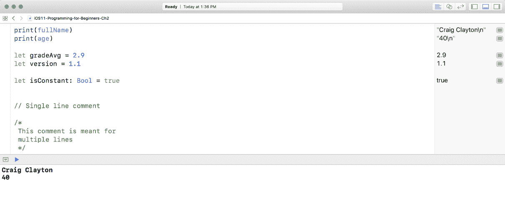

# 类型安全和类型推断

Swift 是一种类型安全的语言，这意味着你被鼓励清楚地说明你的代码将与之一起工作的值类型。类型推断意味着，在代码运行之前，它将能够快速检查以确保你没有将任何内容设置为不同的类型。如果你这样做，Xcode 将会给你一个错误。这有什么好处呢？假设你有一个在商店中的应用程序，你在一部分代码中将一个变量设置为 `String` 类型，但后来不小心在代码的另一部分中将同一个变量设置为 `Int` 类型。这个错误可能会导致你的应用程序出现一些不良行为，甚至可能导致它崩溃。找到这类错误就像在 haystack 中找针一样。因此，类型检查通过帮助你避免在处理不同类型时出错，从而帮助你编写更安全的代码。

我们现在已经了解了数据类型，知道字符串用于文本数据，`Int` 用于整数，`Bool` 用于布尔值，`Double` 和 `Float` 用于浮点数。让我们更深入地了解数据类型，看看我们如何不仅仅将它们赋值给变量。

# 字符串连接

字符串连接是将多个字符串字面量组合在一起形成一个表达式的结果。所以，让我们先输入两个字符串字面量来创建一个：

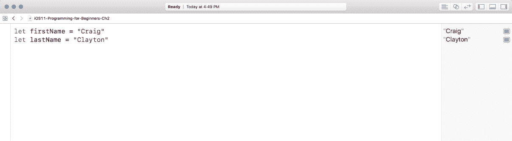

结合这两者，我们得到了字符串连接。我们可以通过使用 `+` 运算符来组合字符串。添加以下内容：

```
let full = firstName + lastName
```

当你在结果面板中查看时，你会注意到我们的名字和姓氏之间没有空格。

此外，如果我们只是将变量放在引号中，它们将回退为简单的字符串字面量，并且将不再是变量。

# 字符串插值

为了纠正这一点，我们可以将这些变量放在引号中，这被称为字符串插值，使用反斜杠和括号将字符串插值中的每个变量括起来。让我们更新我们的 `name` 变量，如下所示，你将在结果面板中看到名字中的空格：

```
let full = "\(firstName) \(lastName)"
```

添加这一行后，我们的代码应该看起来像这样：


现在我们知道了如何在引号中使用变量，我们也可以在 `print()` 中这样做。让我们将 `firstName` 和 `lastName` 放在 `print()` 中，如下所示：

```
print("\(firstName) \(lastName)")
```

`print` 语句非常适合检查你是否得到了想要的价值：

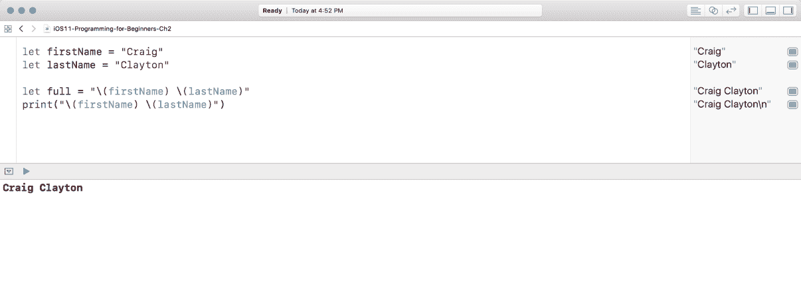

Bam! 现在，我们有了在 `print()` 中查看多个变量的方法，并且可以通过将多个字符串组合在一起来创建字符串插值。我们可以用 `Strings` 做更多的事情，我们将在本书的后面部分介绍它们。

# 对我们的整数进行操作

在我们的沙盒中，我们知道年龄是 `Int` 类型，但使用 `Int`，我们还可以使用数字、变量/常量、运算符和括号来编写算术表达式。让我们从加法、减法、乘法和除法开始。将以下内容添加到 Xcode 中：

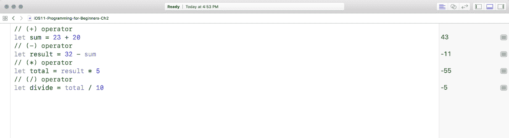

因此，在先前的例子中，我们将两个整数（`+` 操作符）相加，总数为 `43`。然后，我们从 `32` 中减去（`-` 操作符）总和以创建结果（在我们的例子中是 `-11`）。之后，我们将结果乘以（`*` 操作符）`5`（见结果面板中的 `-55`）。所有这些都是相当基本的数学；然而，你可能已经注意到了我们的除法方程（`/` 操作符）中的不同之处。当你除以两个整数时，结果将是一个整数。所以，`-55` 除以 `10` 等于 `-5.5`，我们的结果是 `-5`。为了得到正确的浮点值 `-5.5`，我们需要将除法值改为 `Double`。因此，让我们添加以下内容：

```
let divide2 = Double(total) / 10
```

在添加上述代码行之后，你的代码应该看起来像这样：

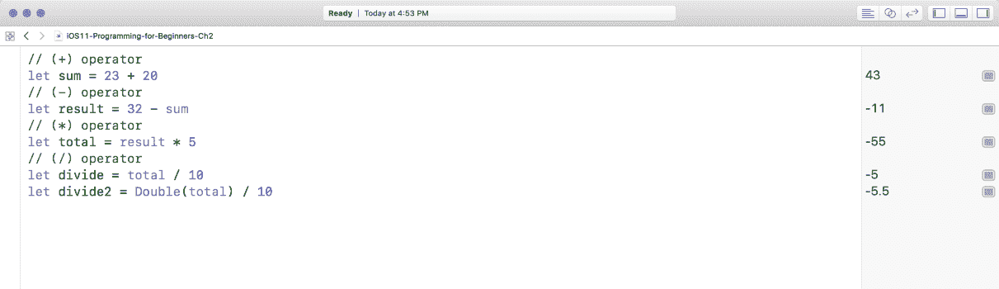

所有这些操作对你来说都很熟悉，但其中有一个你可能不太熟悉，那就是取余操作符。取余操作符返回一个数除以另一个数后的余数。

例如，`7` 除以 `3` 等于 `2.33`。当我们应用取余操作符时，我们得到 `1`。将以下内容添加到 Playgrounds 中：

```
let mod = 7 % 3
```

现在，你的代码应该看起来像这样：


# 增量和减量

有时会需要增加（增加）或减少（减少）一个值。你可以通过两种方式实现这一点。将以下内容添加到 Playgrounds 中：

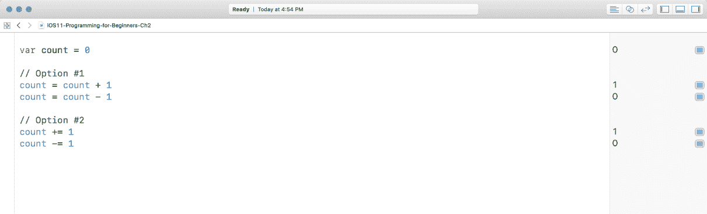

这两种选项做的是同一件事，但选项 `#2` 只是简写形式。首选的方式是使用选项 `#2`，即 `+=`（加法赋值操作符）和 `−=`（减法赋值操作符），但这完全取决于你的个人喜好。

# 比较操作符

我们还可以比较不同的数值变量。这些可能来自你的数学课程。让我们将这些输入到 Playgrounds 中：

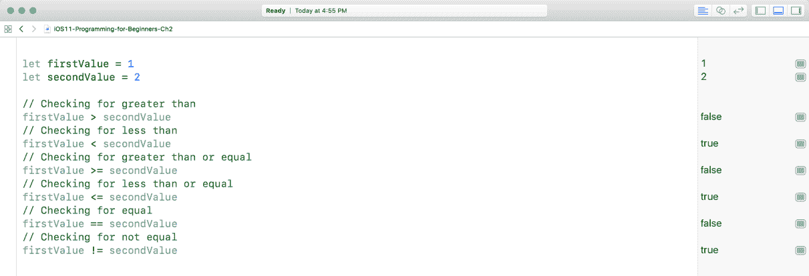

如你在结果面板中所见，这些比较条目根据你输入的值（这里为 `1` 和 `2`）返回真或假。

# 摘要

我们已经触及了基础，从这一点开始，如果你是编程新手，确保你理解我们涵盖的每个主题是个好主意。随着章节的推进，我们将涵盖更多内容，所以请慢慢来，确保你对本章的所有主题都感到舒适。
