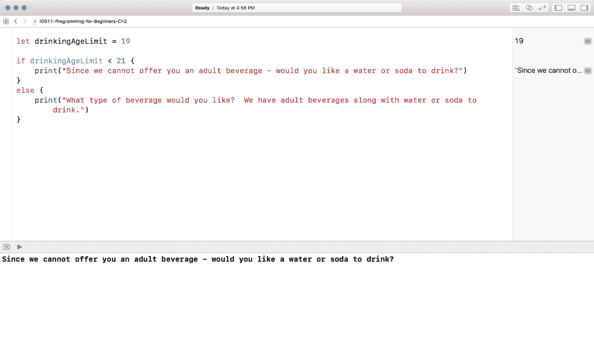

# 第三章：建立在 Swift Foundation 之上

在上一章中，我们学习了理解数据类型以及如何创建变量和常量的基础知识。现在我们已经对这些主题感到舒适，让我们看看添加更多构建块。本章将基于上一章所学的内容，并更接近于更好地理解 Swift。

本章将涵盖以下内容：

+   类型安全和类型推断

+   整数运算

+   `if`语句

+   可选和可选绑定

+   函数

数据类型是好的，但我们需要在我们的应用中添加一些逻辑。例如，我们希望能够在他们启动应用时控制是否应该看到登录屏幕，或者他们是否应该直接进入应用。你将大量使用逻辑，所以让我们看看`if`语句是什么以及如何使用它。

# 创建一个游乐场项目

如你之前所学的，启动 Xcode 并点击“使用游乐场开始”：


游乐场模板屏幕将出现。确保你选择 iOS，然后选择空白并点击下一步。你将被要求给你的项目命名并指定保存文件的位置；将你的新游乐场命名为`iOS11-Programming-for-Beginners-Ch3`。你可以将文件保存到任何你喜欢的位置。现在，随着项目的保存，我们可以探索一下游乐场。

# `if`语句——逻辑语句的乐趣

让我们使用`if`语句添加我们的第一个逻辑片段。`if`语句是一个简单的语句，用于确定一个语句是否为真。将以下内容输入到 Xcode 中：


在上一段代码的第一行，我们创建了一个名为`isPictureVisible`的常量，并将其设置为`true`。下一行开始我们的`if`语句，其读法如下：如果`isPictureVisible`为`true`，则打印`Picture is visible`。当我们编写`if`语句时，我们必须使用花括号来包含我们的逻辑。将开括号（`{`）放在`if`语句的同一行，并将闭括号（`}`）放在逻辑之后的下一行是一个好的实践。

当使用`bool`编写`if`语句时，你总是在检查`true`；然而，如果你想检查`false`，你会这样做：


`Bools`与`if`语句配合得很好，但我们也可以将它们与其他数据类型一起使用。让我们尝试一个带有`Int`的`if`语句。将以下内容写入 Playgrounds：


在前面的例子中，我们首先使用 `Int` 设置为 `19` 创建了另一个常量。下一行表示——如果 `drinkingAgeLimit` 小于 `21`，则打印 `Since we cannot offer you an adult beverage - would you like a water or soda to drink?` 当你在 `if` 语句中使用 `Int` 时，你将使用比较运算符 (`<`, `>`, `<=`, `>=`, `==`, 或 `!=`)。然而，我们的最后一个 `if` 语句感觉不完整，因为我们没有对超过 `21` 的人做任何事情。这就是你将利用 `if...else` 语句的地方。你将 `if...else` 语句输入的方式与 `if` 语句完全一样，但在最后，你添加单词 else。

你可以将 else 添加到我们迄今为止输入的两个 `if` 语句中，但现在，只需将其添加到我们最后的 `if` 语句的末尾：



在我们的 `if` 语句的末尾添加 else 后，它变成了 `if...else` 语句，现在读作——如果 `drinkingAgeLimit` 小于 `21`，则打印 `Since we cannot offer you an adult beverage - would you like a water or soda to drink?` 否则（或 `else`），打印 `What type of beverage would you like? We have adult beverages along with water or soda to drink`。

现在，我们的 `if...else` 语句可以处理两种条件。根据 `drinkingAgeLimit` 的值 `19`，我们可以在调试面板中看到：`Since we cannot offer you an adult beverage - would you like a water or soda to drink?` 如果我们将 `drinkingAgeLimit` 改为 `30`，我们的调试面板会说：`What type of beverage would you like? We have adult beverages along with water or soda to drink`。请将 `19` 改为 `30` 在游乐场中：


注意我们在调试面板中得到了我们想要的行为。

所以到目前为止，我们已经涵盖了使用 `bool` 和 `Int` 的 `if` 语句。让我们看看一个使用字符串的另一个例子。将以下代码段添加到游乐场中：


在编程中，我们使用等于号 (`=`) 来设置数据到变量。然而，为了比较两种数据类型，我们必须使用双等于号 (`==`)。因此，当我们编写比较两个字符串的 `if` 语句时，我们必须使用双等于号 (`==`) 而不是单等于号 (`=`) 来确定相等性。

`if...else` 语句只能让我们检查两个条件，无论它们是 `true` 还是 `not`。如果我们想添加更多条件，我们就不能简单地使用 `if...else` 语句。为了完成这个任务，我们会使用所谓的 `if...else...if...else`。这个语句让我们能够在 `if...else` 语句内部添加任意数量的 `else-if`。我们不会做得太过分，所以让我们只添加一个。将你的最后一个 `if...else` 语句更新为以下内容：


在这个`if...else...if...else`语句的例子中，我们正在检查`restaurantName`是否等于`La Bamba`，如果等于，打印`I've only been to La Bamba II!`，否则，如果`restaurantName`等于`This restaurant is excellent!`，则打印`Oh! I've never heard of that restaurant`。

使用`if`、`if...else`和`if...else if...else`语句可以帮助你为你的应用创建简单或复杂的逻辑。能够使用它们与`Strings`、`bools`、`Ints`和浮点数一起使用，这为你提供了更多的灵活性。

# 可选和可选绑定

可选值用于无法设置值的情况。将可选值想象成一个可以接受值或 nil 的容器。这使我们能够检查值是否为 nil。为了创建一个可选值，你必须给它一个数据类型，后面跟着一个问号(`?`)。在我们这样做之前，让我们创建一个不是可选的字符串。将以下内容添加到 Playgrounds 中：


现在，让我们在 Playgrounds 中添加一个可选值：


在这个例子中，我们创建了一个字符串可选值，如果你注意在结果面板中，它是 nil。但对我们来说`notAnOptional`，我们看到`This is not an optional`。现在，在下一行，让我们将`optional`设置为`This is an optional`：


在我们的结果面板中，我们看到`This is an optional`。现在，让我们打印`strNotAnOptional`和`strOptional`，正如你将看到这两个之间的区别：


注意，我们的`notAnOptional`变量看起来很好，但`optional`有一个可选的包裹(`""`)在`String`周围。这意味着，为了我们能够访问值，我们必须解包可选值。我们可以通过使用(`!`)强制解包可选值来做到这一点。让我们更新我们的`print`语句，并将其更改为以下内容：


我们只是强制解包了我们的可选值，但这种方法并不推荐。我们应该使用所谓的**可选绑定**，这是使用`if...let`语句安全访问值的方法。从`print`语句中移除(`!`)，而是编写以下可选绑定：


这个`if...let`语句表示，如果可选值不是 nil，则将其设置为`strValue`——但如果这个可选值是 nil，则忽略它并什么都不做。现在我们不必担心任何设置我们的值并导致我们的应用崩溃的事情。

# 为什么需要可选值？

因此，你现在可能想知道：为什么你必须这样做？相信我，当我第一次了解到可选值时，我也有同样的感觉。可选值实际上是为了你的保护而设计的。现在，只需理解，当你看到后面跟着问号的类型时，这个变量是一个可选值。随着我们在整本书中越来越多地使用可选值，这对你来说会变得更加清晰。

# 函数

现在，是时候进入编程的真正有趣部分，学习如何编写函数了。函数是包含你想要运行的代码的自包含代码块。在 Swift 3 中，苹果公司对如何编写函数做了一些改变。我们将在本章中编写的所有函数都将执行一个动作（想想动词）。让我们创建一个简单的函数，名为`greet()`：


这个例子是一个包含`print`语句的基本函数。在编程中，函数实际上只有在被调用时才会运行。我们通过调用函数的名字来调用一个函数。所以，让我们调用`greet`：

```
greet()
```

一旦我们将这个添加到代码中，屏幕上就会出现以下内容：


就这样！我们刚刚创建并调用了我们的第一个函数。然而，函数可以做更多的事情。我们可以向函数添加一个称为参数的东西。参数允许我们在括号内接受数据类型。这样做允许我们构建更多可重用的代码块。所以，让我们更新我们的`greet()`函数，使其接受一个名为`name`的参数：

```
func greet(name:String) {
print("Hello")
}
```

更新函数后，你会得到一个错误：


我们收到这个错误是因为我们更新了我们的函数，但没有更新调用它的那一行。让我们将调用`greet()`更新为以下内容：

```
greet(name: "Joshua")
```


这看起来不错；然而，调试面板显示我们没有在我们的问候语中使用名字。之前，你学习了如何创建字符串插值。所以，我们只需要在我们的`print`语句中添加我们的变量名，如下所示：

```
print("Hello \(name)")
```

这就是你的代码现在应该看起来像的样子：


函数可以接受多个参数，所以让我们创建另一个接受两个参数的`greet()`函数，即一个名字和一个姓氏：

```
func greet(first:String, last:String) {
print("Hello \(first) \(last)")
}
```

现在，你的代码及其输出应该看起来如下截图所示：


我们还需要更新调用`greet()`的地方，使其能够接受多个参数：

```
greet(first: "Craig", last: "Clayton")
```

现在，你的代码和输出屏幕应该看起来大致如下：


我们现在有一个接受多个参数的函数。

如果我们能够创建一个返回问候语的函数那就太好了。我们可以做到！每当我们要让函数返回某些东西时，我们需要使用一个名词来描述我们的函数将要做什么。我们刚刚创建了一个名为`greet()`的函数，它接受一个名字和一个姓氏，并创建一个全名。

现在，让我们创建另一个名为`greeting()`的函数，它将返回一个带有问候语的全名。让我们看看它是什么样子：

```
func greeting(with first:String, last:String) -> String {
return "Hello \(first) \(last)"
}
```

这就是你的代码和输出屏幕应该看起来像的样子：


这个函数几乎和上一个一样，但有一些新东西。首先`-> String`告诉函数我们想要返回一个字符串。在我们的函数内部，我们返回`"Hello \(first) \(last)"`。由于我们说在括号之后要返回一些内容，所以我们必须这样做。现在，让我们看看我们如何做到这一点。输入以下内容：

```
print(greeting(with:"Teena", last:"Harris"))
```

现在，这是你的代码和输出屏幕应该看起来像的：


如果你注意到，在调试面板中我们现在有了我们的全名，并在前面添加了`Hello`。当你开始构建函数时，你真的会看到其力量。

这些只是函数的基础。我们将在我们的*Let's Eat*应用程序中涵盖更多高级函数。初学者容易忘记的是，函数应该是小的。你的函数应该只做一件事。如果你的函数太长，那么你需要将其拆分成更小的部分。有时较长的函数是不可避免的，但你应该始终注意尽可能保持它们尽可能小。做得不错！

**让我们开始吧**

我们在本章中涵盖了大量的内容，现在是将我们所学的一切付诸实践的时候了。这里有两大挑战。如果你对它们感到舒适，那么你可以自己动手做。否则，回到本章，你可以跟随我一起看看如何完成每一个：

+   **挑战 1**：编写一个函数，该函数接受并返回一个自定义问候语（除了我们本章早些时候提到的`Hello`之外）以及你的名字和姓氏

+   **挑战 2**：编写一个函数，该函数将接受两个数字并将它们相加、相减、相乘或相除

# 概述

在本章中，我们学习了什么是类型安全，以及类型推断。我们还学习了整数运算以及如何通过`if`语句进行操作。最后，我们讨论了可选性的力量，并了解了函数是什么以及如何使用它们。

在下一章中，我们将通过深入研究 Swift 集合来继续学习一些更多的 Swift 基础知识。学好这些内容将真正帮助你进步，因为你会经常用到它们。
