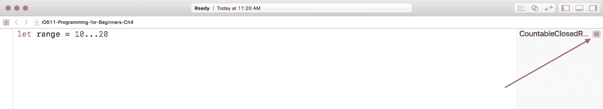

# 第四章：深入挖掘

当我刚开始编程时，我二十多岁。我比大多数人开始得都要晚，但我要说的是，掌握基础知识比我大多数人都要花更长的时间。我记得当我买了我的第一本编程书，我一遍又一遍地阅读和重读章节，直到概念对我有意义。我发现很多书都像我对计算机科学有专业背景一样和我说话。随着你在这本书中的进步，请慢慢来——如果你需要回顾，那也是可以的。没有人会介意你多花了一天来理解一个概念。更重要的是，你完全理解了这个概念。

我要给你的一条建议是不要复制粘贴代码。无论你在哪里找到代码，无论需要多长时间，亲自敲打出来对你都有好处。这样做真的帮助了我，因为我最终开始记住代码，它变得像第二本能一样自然。

在上一章中，我们介绍了 Swift 的基础知识，让你热身。现在，我们将深入挖掘，学习一些更多的编程概念。这些概念将建立在您已经学到的知识之上。在本章中，我们将涵盖：

+   范围

+   控制流程

让我们从创建一个新的游乐场项目开始。

# 创建一个游乐场项目

如您之前所学的，启动 Xcode 并点击**使用游乐场开始**：


游乐场模板屏幕将出现。请确保您选择 iOS，然后选择空白并点击下一步。您将被要求为项目命名并指定保存文件的位置；将您的新游乐场命名为`iOS11-Programming-for-Beginners-Ch4`。您可以将文件保存在任何您喜欢的地方。现在，随着项目的保存，我们可以探索一下游乐场。

接下来，删除文件中的所有内容，并使用切换按钮（*cmd* + *Shift* + *Y*）打开调试面板。你现在应该有一个带有结果面板在右侧和调试面板在底部的空白屏幕。

我们之前关注了基础知识，现在我们将在此基础上建立技能。范围就是这样一种我们应该学习的数据类型，它非常有用，并且可以出于各种原因派上用场。让我们看看范围是什么，然后开始理解**闭包范围**、**半开范围**和**单侧范围**之间的区别。

# 范围

范围是泛型数据类型，表示一系列数字。让我们看看以下图片来理解：


# 闭包范围

注意，在前面的图片中，我们有从**10**到**20**的数字。我们不需要逐一写出每个值，我们可以使用范围来用简短的形式表示所有这些数字。为了做到这一点，让我们从图片中移除除了**10**和**20**之外的所有数字：


现在我们已经删除了那些数字，我们需要一种方法来告诉 Swift 我们想要包含我们刚刚删除的所有数字。这就是范围运算符(...)发挥作用的地方。因此，在 Playgrounds 中，让我们创建一个名为 range 的常量，并将其设置为`10...20`：

```
let range = 10...20
```


我们刚刚输入的范围表示我们想要`10`到`20`之间的数字，以及`10`和`20`本身。这种范围被称为闭区间。

在 Playground 内部，在结果中你会看到一个显示结果图标：



如果你悬停在结果上，你也会看到快速查看：


选择显示结果图标，以便你可以看到结果：


接下来，我们还有所谓的半开区间。

# 半开区间

让我们再创建一个称为半开区间的常量，并将其设置为`10 < 20`。在 Playgrounds 中添加以下内容：

```
let halfClosedRange = 10..<20
```

你的代码现在应该看起来像这样：


半开区间与闭区间相同，区别在于端点值不会被包含。在这个例子中，这意味着 10 到 19 将被包含，而 20 将被排除。

在这一点上，你会注意到你的结果面板显示了`CountableClosedRange(10...20)`和`CountableRange(10..<20)`。我们无法看到范围内的所有数字。为了看到所有数字，我们需要使用循环。

# 控制流

在编程中，控制流是代码执行的顺序。当使用 Swift 时，我们可以使用各种控制语句。特别是循环对于当你想要多次重复任务时非常有用。让我们看看几种不同类型的循环。

# for...in 循环

最常见的控制语句之一是`for...in`循环。它允许你遍历序列中的每个元素。让我们看看`for...in`循环的样子：

```
for <value> in <sequence> { 
 // Code here 
} 
```

我们使用`for...in`循环的`for`关键字开始，它后面跟着`<value>`。这实际上是一个局部常量（只有`for...in`循环可以访问它），可以是任何你喜欢的名字。通常，你将想要给这个值一个有表达力的名字。接下来，我们有`in`，它后面跟着`<sequence>`。这是我们想要给出我们的数字序列的地方。让我们将以下内容写入 Playgrounds：


注意，在我们的调试面板中，我们看到了我们想要范围内的所有数字。

让我们对`halfClosedRange`变量做同样的事情，添加以下内容：


在我们的调试面板中，我们看到我们得到了 10 到 19 的数字。需要注意的是，这两个`for...in`循环有不同的变量。在第一个循环中，我们使用了 value，在第二个循环中，我们使用了 index。你可以将它们设置为任何你选择的名称。

此外，在前两个示例中，我们使用了常量，但实际上我们可以在循环中使用范围。添加以下内容：


现在，你可以在调试面板中看到从 0 到 3 的打印输出。

如果你想让数字以相反的顺序排列呢？让我们输入以下 `for...in` 循环：


现在，我们在调试面板中有了降序排列的数字。当我们把范围添加到 `for...in` 循环中时，我们必须将我们的范围放在括号内，这样 Swift 才能识别出我们 `reversed()` 前的点不是小数点。现在我们已经熟悉了循环，还有一个范围我们需要看看。

# 单侧范围

单侧范围操作符允许你使用尽可能远的一侧范围。如果你想使范围仅继续，这就是你会使用的。让我们看看单侧范围：


```
for name in names[...6] { 
    print("") 
} 

// Craig 
// Teena
// Jason 
// Joshua 
// Myah 
// Tiffany 
// Kim 
```


另一个有用的循环是 `while` 循环。让我们看看 `while` 循环是如何使用的。

# `while` 循环

`while` 循环在循环开始时执行布尔表达式，并运行一组语句，直到条件变为假。重要的是要注意 `while` 循环可以执行零次或多次。以下是 `while` 循环的基本语法：

```
while <condition> { 
 // statement 
} 
```

让我们在 Playgrounds 中编写一个 `while` 循环并看看它是如何工作的。添加以下内容：


因此，这个 `while` 循环从一个开始为零的变量开始。在 `while` 循环执行之前，它检查 `y` 是否小于 `50`，如果是，它将继续进入循环。使用我们之前提到的 `+=` 操作符，每次将 `y` 增加 `5`。我们的 `while` 循环将继续这样做，直到 `y` 不再小于 `50`。现在，让我们在创建的循环之后添加相同的 `while` 循环，看看会发生什么：

```
while y < 50 {
y += 5
print("y:\(y)")
}
```


你会注意到第二个 `while` 循环从未运行。这看起来可能并不重要，直到我们看看我们接下来要讨论的循环类型。

# `repeat...while` 循环

`repeat...while` 循环与 `while` 循环非常相似，因为它会继续执行一组语句，直到条件变为假。主要区别在于 `repeat...while` 循环不会在循环的末尾评估其布尔条件。以下是 `repeat...while` 循环的基本语法：

```
repeat {
// statement
} <condition>
```

让我们在 Playgrounds 中编写一个 `repeat...while` 循环并看看它是如何工作的。在 Playgrounds 中添加以下内容：


你会注意到我们的 `repeat...while` 循环首先执行，并将 `x` 增加 `5`，然后（与在 `while` 循环中检查条件之前相反），它检查 `x` 是否小于 `100`。这意味着我们的 `repeat...while` 循环将继续，直到条件达到 `100`。这里就变得有趣了。

让我们在刚刚创建的循环之后添加另一个 `repeat...while` 循环：


现在，你可以看到我们的 `repeat...while` 循环增加到了 `105` 而不是 `100`，就像之前的 `repeat...while` 循环一样。这是因为布尔表达式只有在增加 `5` 之后才会被评估。了解这种行为将帮助你选择适合你情况的正确循环。

# 摘要

到目前为止，我们已经探讨了三种循环：`for...in` 循环、`while` 循环和 `repeat-while` 循环。我们还将再次使用 `for...in` 循环，但首先我们需要谈谈集合。在下一章中，我们将专注于集合是什么以及如何在处理数据时使用它们。确保你完全理解循环，因为我们在下一章以及整本书中都会在此基础上构建。因此，你需要尽可能多地复习，以确保你对本章包含的主题感到熟练。
