# 第九章：在故事板中完成我们的应用程序结构

我们做的故事板工作越多，就越容易。我记得当我刚开始使用 Xcode 时，由于所有面板而感到有些不知所措，这真的花了我很长时间才适应。每次我与人交谈，想要进入 iOS 开发时，我总是告诉他们至少在前六个月每天投入 10-15 分钟。这听起来可能很多，但当你试图学习时，这真的会带来很大的不同。如果你离开一周再回来，就像是重新开始一样；至少，对我来说是这样的。当我最终开始有所领悟时，是因为我每天都在 Xcode 中，并且坚持不懈。

在上一章中，我们设置了探索和位置。在本章中，我们仍在构建结构，在接下来的几章中，我们将专注于设计。

本章我们将涵盖以下内容：

+   餐厅视图控制器

+   餐厅详情视图控制器

+   评论视图控制器

+   映射标签

# 添加我们的餐厅列表视图

我们餐厅列表的设置与上一章相同。如果你认为你已经掌握了这些，现在是一个挑战自己的好时机。如果你认为你还需要更多的练习，请继续阅读，让我们设置餐厅列表：

1.  选择 `Main.storyboard` 文件，确保你已缩小视图并可以看到所有场景（取决于你的屏幕分辨率）。在“实用工具”面板中，确保已选择对象库标签页。

1.  在过滤器字段中，你将输入 `viewcontroller`。将此视图控制器拖动并放置在探索视图控制器旁边。

1.  接下来，在过滤器字段中，你将输入 `collectionview`。

1.  点击并拖动集合视图，并将其拖放到刚刚添加到探索视图控制器旁边的新的视图控制器上。

1.  将其拖放到场景中后，选择图钉图标并输入以下值：

+   +   在“添加新约束”下所有值都设置为 `0`

    +   确保取消勾选“约束到边缘”

1.  点击添加 4 个约束。

现在我们已经为餐厅列表设置了集合视图组件。

# 连接我们的出口

现在，让我们将文件 `RestaurantViewController` 链接到故事板中的新 `UIViewController`：

1.  选择带有我们刚刚创建的集合视图的 `UIViewController`。

1.  现在，在“实用工具”面板中，选择“身份检查器”。在“自定义类”下，在“类”下拉菜单中选择 `RestaurantViewController` 并按 *Enter*。

1.  按 *Enter* 后，在“实用工具”面板中选择“连接检查器”。

1.  在“出口”下，点击 `collectionView` 圆圈，并从圆圈拖动到你的 `UIViewController` 内部刚刚添加的集合视图。

现在我们已经将集合视图连接好，我们需要连接数据源和代理。这允许我们将数据传递给集合视图，并知道我们的集合视图何时有某种交互。

1.  在你的场景中，选择你的集合视图。然后，在你的实用工具面板中，选择连接检查器。

1.  在你的大纲视图中，将 `dataSource` 属性拖动到餐厅视图控制器。

1.  在你的大纲视图中，将委托属性拖动到餐厅视图控制器。

最后，让我们设置单元格颜色，以确保一切设置正确。

# 设置我们的单元格

在 `Main.storyboard` 中，选择你的集合视图中的小方块。这是你的集合视图原型单元格。

1.  在实用工具面板中打开属性检查器。

1.  更新以下内容：

+   +   标识符：`restaurantCell`

    +   背景：演示灰色

1.  现在，按 CTL 键并从探索单元格拖动到餐厅视图控制器：

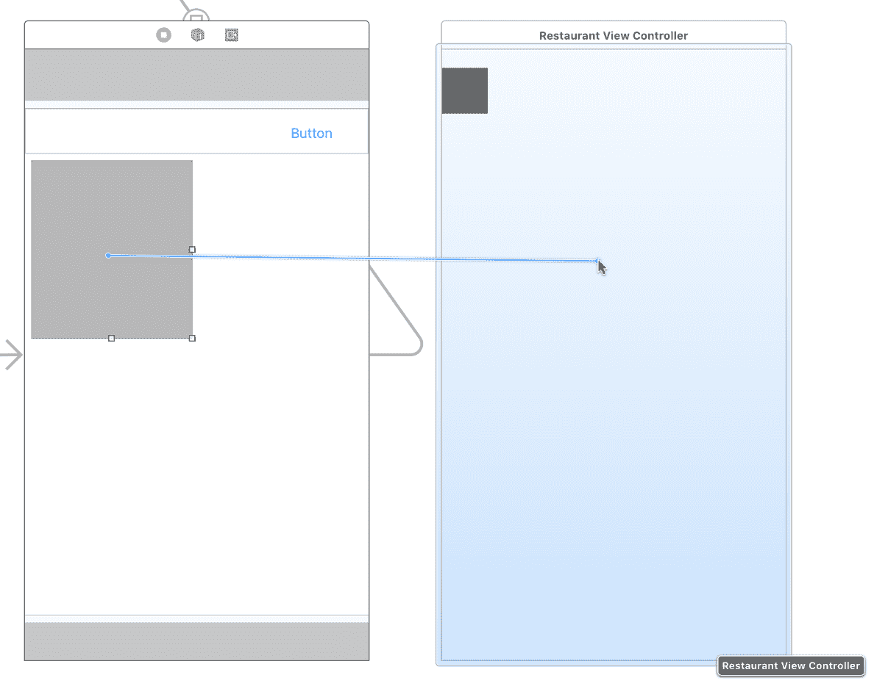

1.  当你松开鼠标时，将出现以下菜单，你应该选择显示：

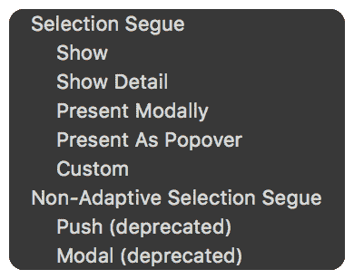

现在，通过点击播放按钮（或使用 *cmd* + *R*）来运行项目。你现在可以点击一个探索单元格，并看到以下内容：

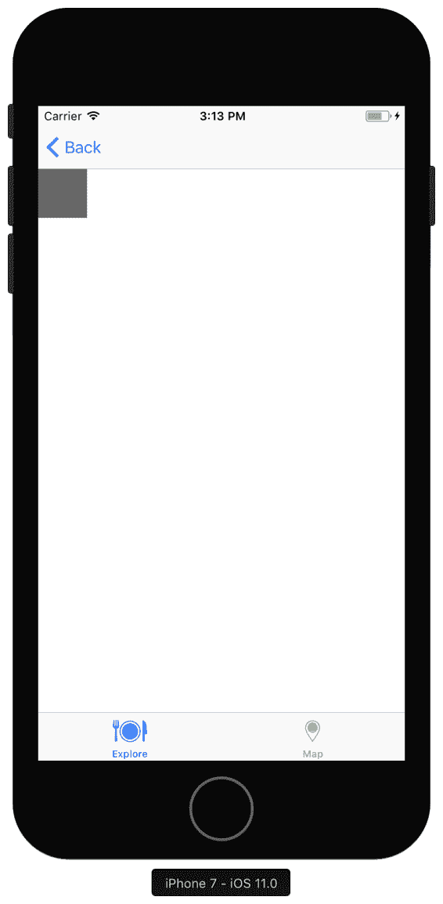

接下来，我们希望当用户点击餐厅时，他们能看到餐厅详情。我们将使用静态表格视图控制器来完成详情。使用静态表格视图，我们可以不写代码就创建内容。我们仍然需要连接我们的数据，但在接下来的章节中，你将看到静态表格视图是如何派上用场的。让我们设置餐厅详情：

1.  选择 `Main.storyboard` 文件，确保你已缩小视图，可以看到所有场景（取决于你的屏幕分辨率）。在实用工具面板中，确保已选择对象库标签页。

1.  在过滤器字段中，你将输入：`tableviewcontroller`（确保它是控制器——它将有一个黄色图标）。将此表格视图控制器拖动并放置在餐厅视图控制器旁边：

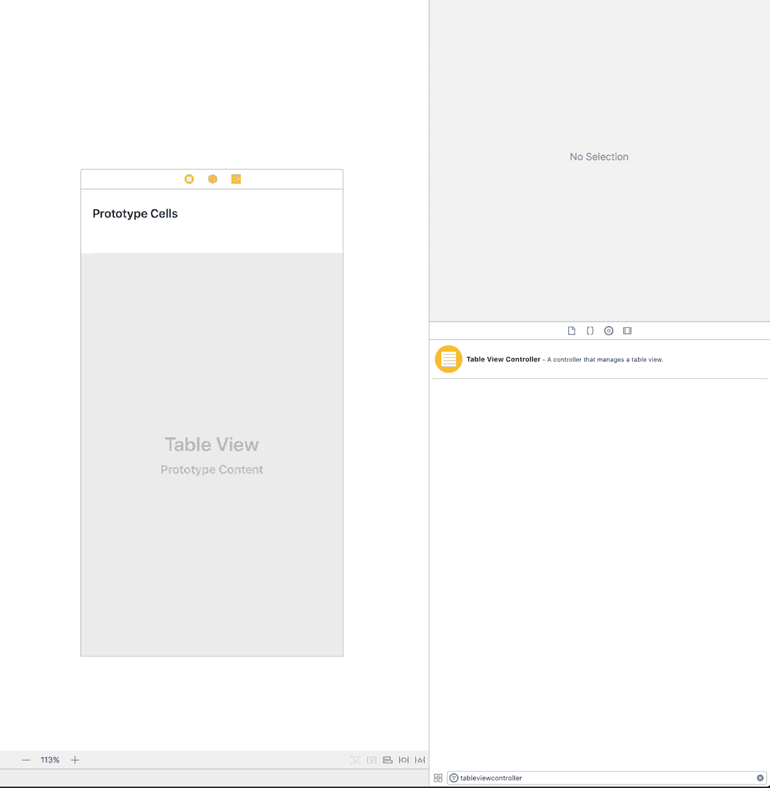

1.  现在，按 Ctrl 键并从餐厅单元格按钮拖动到餐厅详情表格视图控制器：

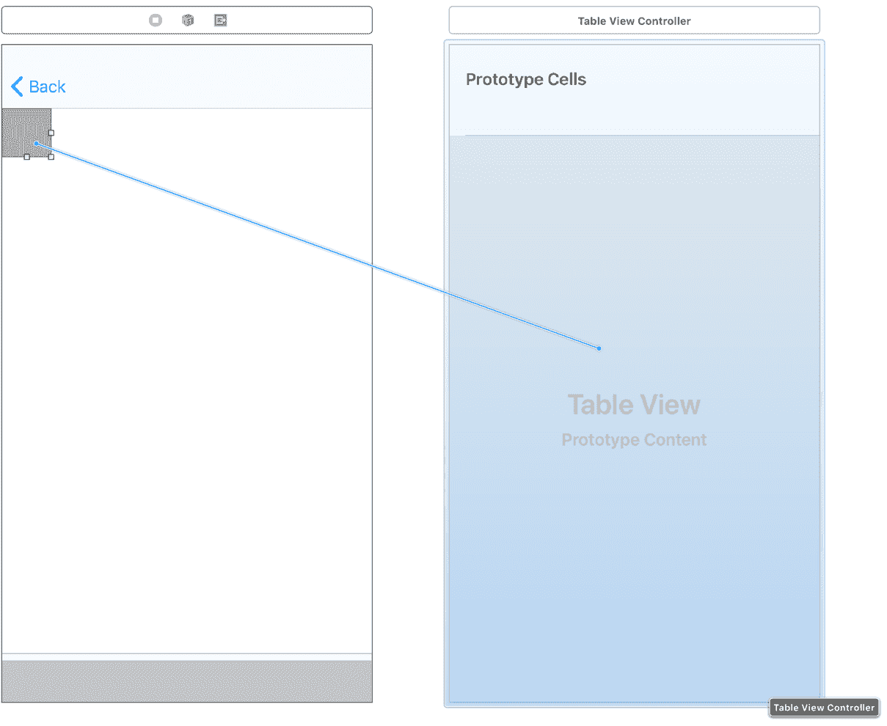

1.  当你松开鼠标时，将出现以下菜单，你应该选择显示。

1.  接下来，点击大纲中的表格视图：

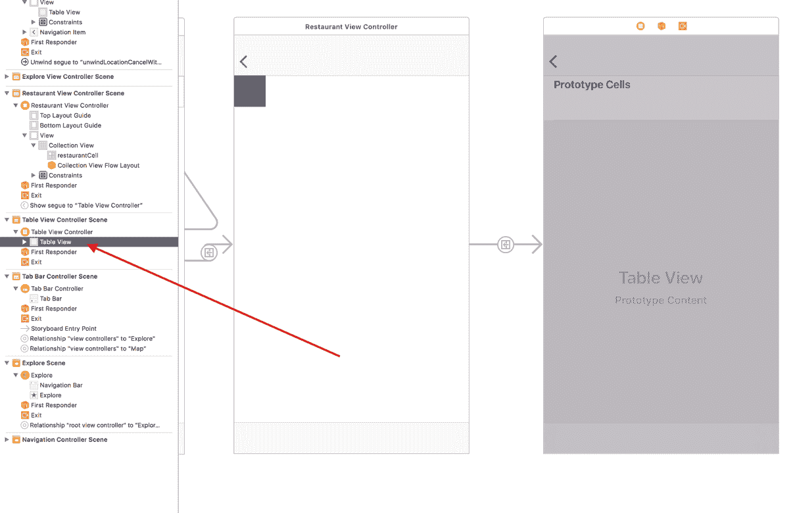

1.  确保在实用工具面板中打开了属性检查器，然后将表格视图内容从动态原型更改为静态单元格：

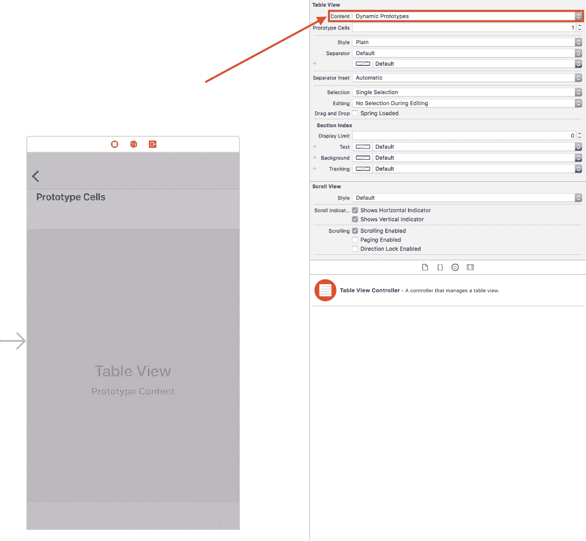

现在，通过点击播放按钮（或使用 *cmd* + *R*）来运行项目。你现在可以点击一个餐厅单元格，并看到以下内容：

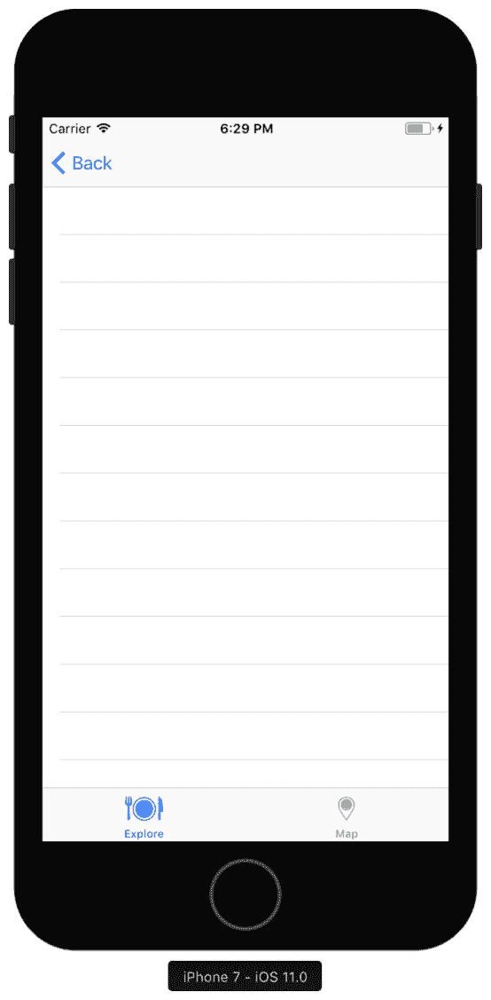

# 添加评论视图

我们现在已经设置了静态表格视图，我们需要另一个视图来查看餐厅评论。让我们添加它：

1.  在过滤器字段中，你需要输入：`button`。将此按钮拖动并放置在`tableview`单元格旁边：

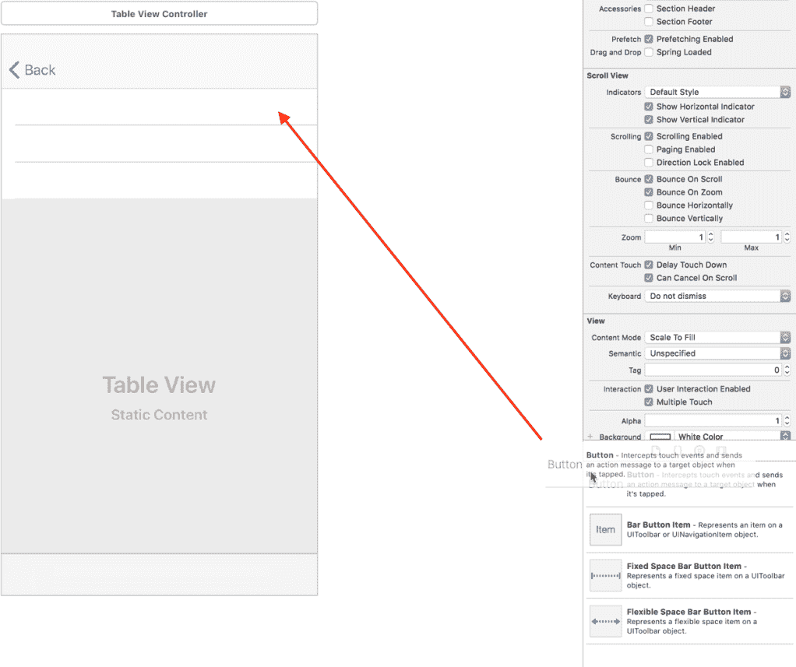

1.  接下来，选择`Main.storyboard`文件，确保你已缩小视图并可以看到所有场景（取决于你的屏幕分辨率）。在实用工具面板中，确保已选择对象库标签。

1.  在过滤器字段中，你需要输入`viewcontroller`。将此视图控制器拖动并放置在餐厅详情视图控制器旁边。

1.  接下来，在过滤器字段中，你需要输入`label`。

1.  点击并拖动标签并将其拖放到我们刚刚添加的新视图控制器旁边，即餐厅详情视图控制器旁边。

1.  在场景上放下它后，双击标签并添加文本——“评论”。

1.  接下来，选择位于 Pin 图标左侧的对齐图标，并检查出现的以下复选框：

+   +   在容器中水平排列

    +   在容器中垂直排列

1.  然后，点击“添加 2 个约束”。

完成后，你会看到以下内容：

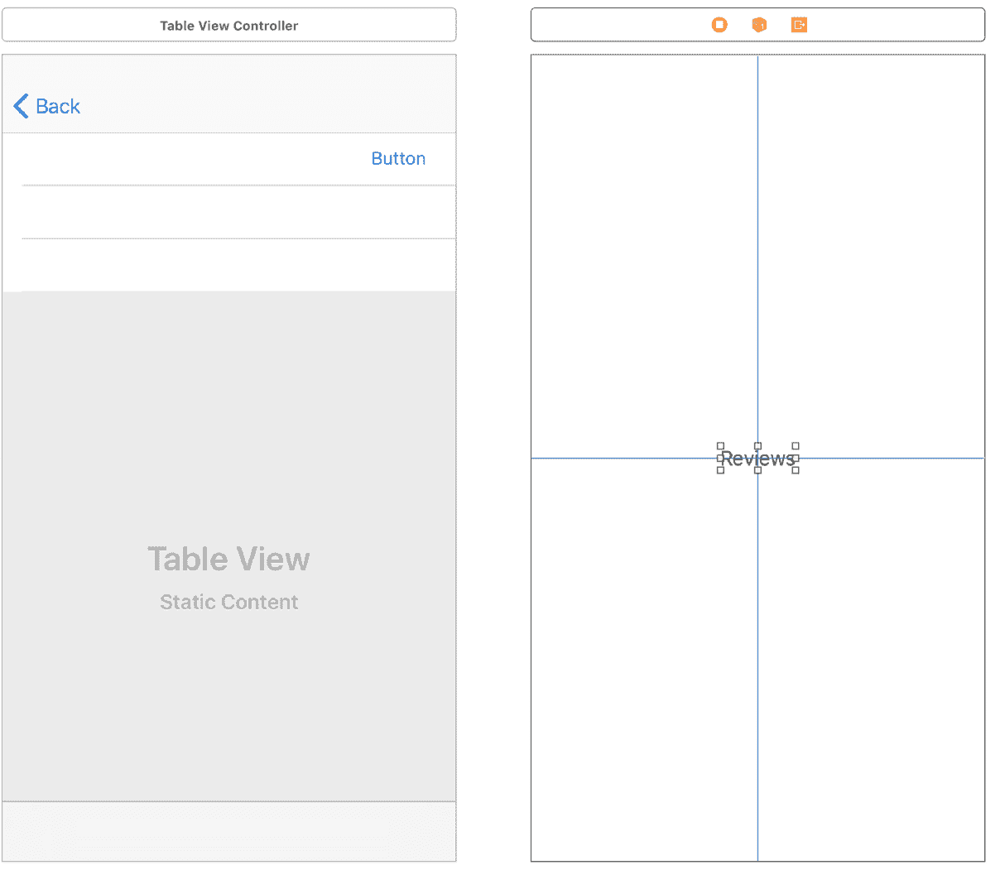

# 查看评论

现在，我们只需要添加一个 segue 来能够到达评论视图控制器：

1.  在过滤器字段中，你需要输入`button`。将此按钮拖动并放入静态表格视图中。目前，哪个单元格都无关紧要；当我们进行设计时，我们会更新这个。

1.  最后，使用 Ctrl 键从按钮拖动到我们刚刚添加的 Review 视图控制器：

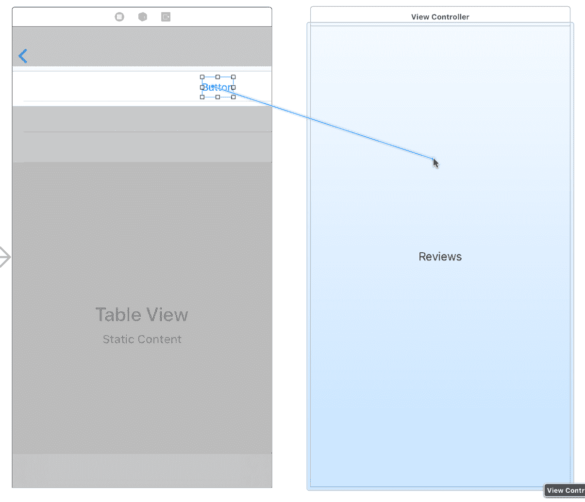

1.  释放鼠标时，你会看到一个菜单，你应该选择“显示”。

现在，通过点击播放按钮（或使用 *cmd* + *R*）来运行项目。现在你将能够点击餐厅详情中的按钮并看到以下内容：

# Map Kit 视图

我们最后需要做的是设置我们的地图标签页。选择`Main.storyboard`文件，并找到连接到地图标签的视图控制器：

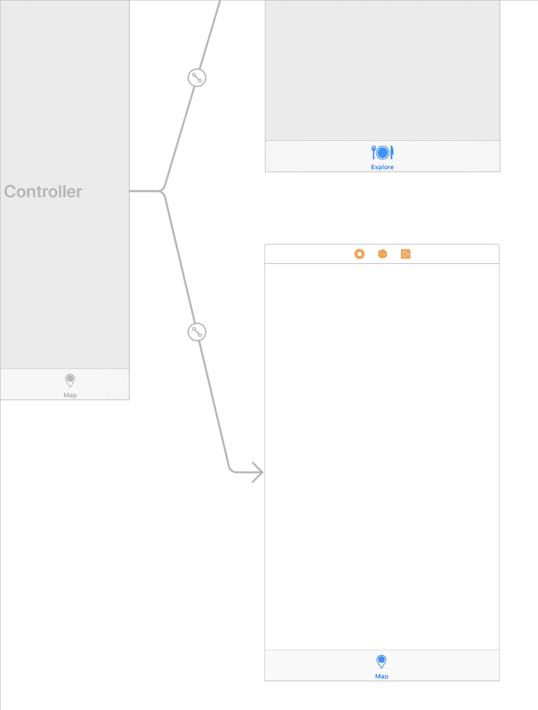

让我们开始吧：

1.  在选择视图控制器后，导航到编辑器 | 嵌入 | 导航控制器。

1.  在实用工具面板中，选择对象库标签，并在过滤器字段中输入`map`。

1.  将 Map Kit 视图拖放到地图视图控制器中：

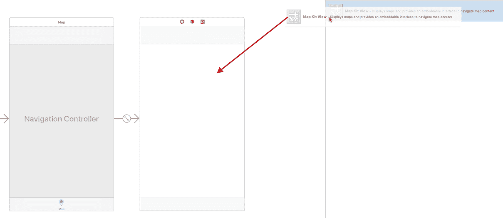

1.  接下来，选择 Pin 图标并输入以下值：

+   +   在“添加新约束”下的所有值都设置为`0`

    +   取消勾选“约束到边距”复选框

    +   点击“添加 4 个约束”

1.  完成后，你的视图控制器应该看起来像以下这样：

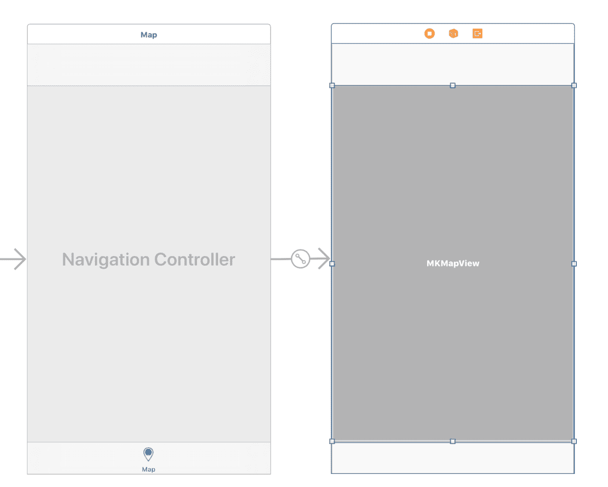

1.  通过点击播放按钮（或使用 *cmd* + *R*）并选择地图标签来运行项目：

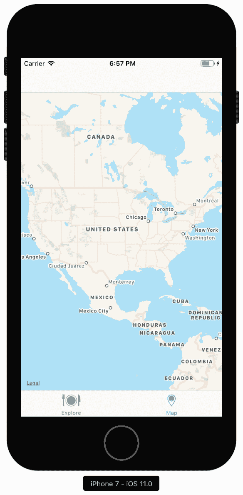

我们现在已经设置了两个标签页，但随着我们通过本书的进展，我们将在故事板中添加更多场景。你的`Main.storyboard`文件应该看起来像这样：

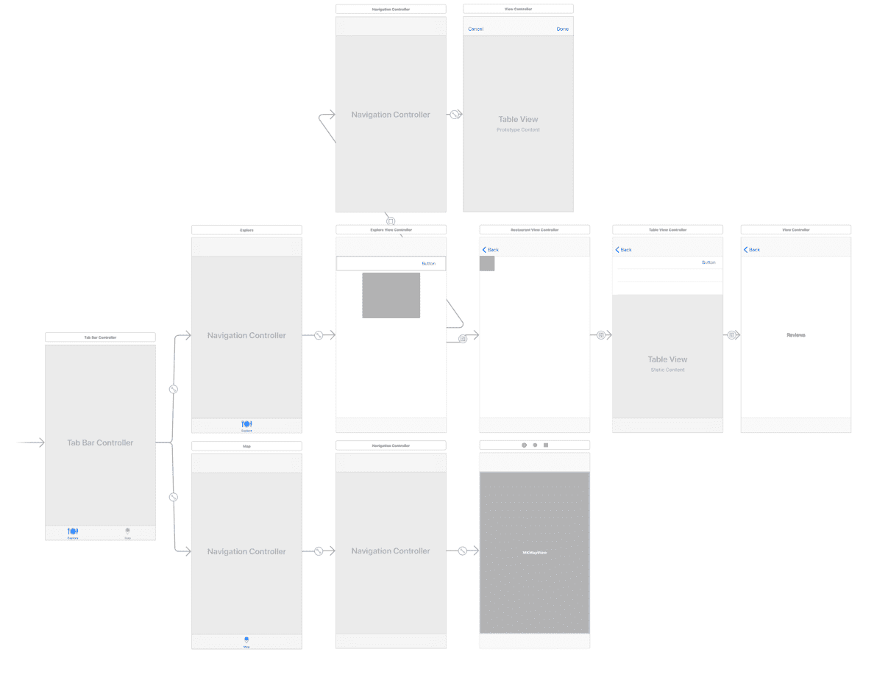

# 摘要

在本章中，我们已经完成了应用程序的结构。我们将探索单元格连接到了餐厅列表。然后，我们能够将一个餐厅连接到详情。接下来，我们在详情中添加了一个按钮，允许我们查看餐厅评论。最后，我们在地图标签中添加了一张地图。

到目前为止，一个不错的挑战是看看你是否能回到这个点。从我们在第六章末尾创建项目开始，即“开始 UI 设置”部分。看看你是否能在不看书的情况下，不遗漏任何内容地从这里回到那个点。这真的会对你有所帮助，这也是我喜欢在指导他人时做的事情。

在下一章中，我们将更深入地探讨设计和让我们的应用在视觉上看起来像设计。
