# 第十二章：设计照片滤镜和评论表单

我们已经用我们的设计推进了前四章。我们在这一章中总结了设计设置。在这一章中，我们将设置两个视图控制器。一个将负责我们的照片滤镜并添加照片到餐厅。我们的第二个视图控制器是用户创建餐厅评论的表单。最后，我们将探讨如何重构故事板。本章我们将涵盖以下内容：

+   创建我们的照片滤镜视图

+   创建我们的评论表单

+   重构故事板

# 设置我们的视图控制器

当我们设置我们的结构时，我们创建了一个带有`Review`标签的视图控制器。这样做只是为了查看结构，但我们已经移除了按钮点击到评论控制器。我们目前在餐厅详情页上有两个按钮：添加照片和添加评论。这两个按钮都需要连接到视图控制器。我们的添加照片按钮连接到一个视图控制器，在那里我们启动用户的相机，而添加评论按钮连接到一个静态的`tableview`。

让我们先处理添加照片按钮：

1.  打开`Main.storyboard`，找到标签为“Reviews”的视图控制器，并删除该标签。

1.  选择视图控制器，然后转到编辑器 | 嵌入 | 导航控制器。这个视图控制器现在将是我们的照片滤镜视图控制器。

1.  在餐厅详情视图中，找到包含添加照片标签和按钮的表格视图单元格。

1.  打开展开箭头，并使用*Ctrl*键拖动我们放在容器内的按钮到我们刚刚添加的导航控制器；在动作切换下，选择模态呈现。

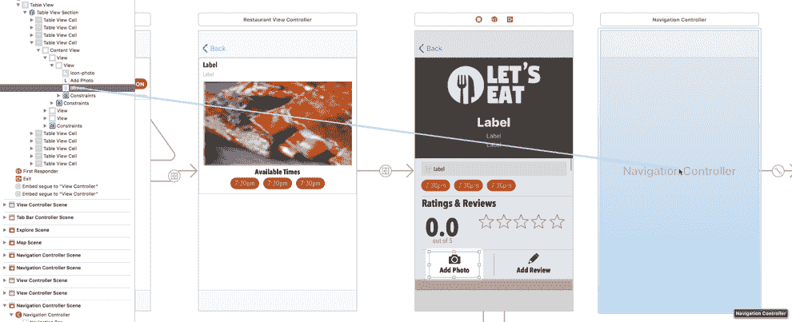

接下来，让我们设置这个视图控制器。在我们开始设置之前，让我们谈谈接下来需要做什么。在这个控制器中，我们希望用户能够拍照或从他们的*照片*应用中选择照片并添加。一旦他们选择了照片，我们希望他们能够将滤镜应用到照片上，并将其保存到设备上。这个视图需要两个主要的东西：一个滚动滤镜项的方式和一个显示所选照片和滤镜的图像。我们可以使用滚动视图来做这件事，但本书稍后我们将添加拖放到 iPad 的功能，所以集合视图是更简单的方法。现在你对方向有了更好的了解，让我们设置我们的 UI。

# 添加我们的照片滤镜视图

照片滤镜视图是我们展示所选图像和集合视图的地方，用户可以从其中选择不同的滤镜应用到图像上。让我们创建照片滤镜视图：

1.  选择照片滤镜视图控制器，然后在属性检查器中取消选中“在顶部栏下”和“在底部栏下”两个选项。我们不希望这个页面可以滚动，所以我们不需要它位于顶部和底部栏下。

1.  在`Main.storyboard`中，在实用工具面板中对象库的过滤器字段中输入`bar button`。

1.  拖出三个栏按钮项。一个将放在左上角，两个在右上角。当你完成时，你应该看到以下内容：

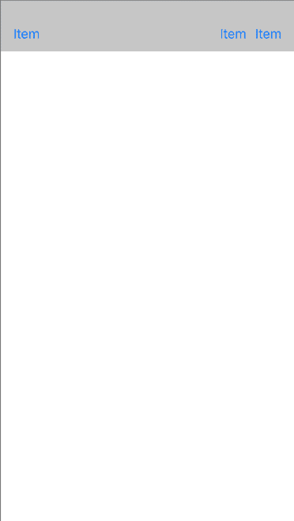

我们左侧的按钮是取消按钮。我们右侧的按钮是相机图标和保存按钮。你可以通过逐个选择并打开属性检查器来更新每一个。

当你完成时，你应该看到以下内容：

1.  接下来，在实用工具面板中的对象库的过滤器字段中输入`image`。

1.  然后，将一个图像视图拖入视图控制器。

1.  在大纲视图中选择集合视图，在实用工具面板中打开大小检查器，然后添加以下值：

+   +   X：`0`

    +   Y：`0`

    +   宽度：`375`

    +   高度：`400`

1.  现在，在实用工具面板中的对象库的过滤器字段中输入`collection`。

1.  然后，将一个集合视图拖入视图控制器。

1.  在大纲视图中选择集合视图，在实用工具面板中打开大小检查器，然后添加以下值：

+   +   X：`0`

    +   Y：`400`

    +   宽度：`375`

    +   高度：`203`

当你完成时，你的视图控制器应该看起来像我的：

接下来，让我们为我们的视图添加自动布局。

# 为照片滤镜视图添加自动布局

接下来，让我们将自动布局应用到照片滤镜视图：

1.  在大纲视图中，选择图像视图然后选择固定图标。输入以下值：

+   +   顶部：`0`

    +   左：`0`

    +   右：`0`

    +   限制到边距：未勾选

    +   高度：`400`（勾选）

1.  点击添加 4 个约束。

1.  接下来，选择集合视图并输入以下值：

+   +   左：`0`

    +   底部：`0`

    +   右：`0`

    +   底部：`0`

    +   限制到边距：未勾选

1.  点击添加 4 个约束。

我们现在处于照片滤镜视图控制器。接下来，我们需要为我们的集合视图创建我们的单元格。让我们接下来设置这个。

# 创建照片滤镜视图单元格

由于我们使用集合视图来滚动元素，因此我们还需要添加一个自定义单元格。

1.  在集合视图内部选择原型单元格：

1.  在属性检查器下，更新标识符为`filterCell`。

1.  接下来，选择集合视图，在实用工具面板中打开大小检查器，然后在单元格大小下设置以下值：

+   +   宽度：`116`

    +   高度：`` `203` ``

1.  在`Main.storyboard`中，在实用工具面板中的对象库的过滤器字段中输入`image`。

1.  将图像拖出单元格。

1.  在大纲视图中选择图像视图，在实用工具面板中打开大小检查器，然后添加以下值：

+   +   X：`0`

    +   Y：`0`

    +   宽度：`116`

    +   高度：`177`

1.  接下来，在实用工具面板中的对象库的过滤器字段中输入`label`。

1.  将标签拖入单元格。

1.  在大纲视图中选择标签，在实用工具面板中打开大小检查器，然后添加以下值：

+   +   X：`5`

    +   Y：`179`

    +   宽度：`106`

    +   高度：`21`

1.  现在，仍然选择标签，打开属性检查器；将字体设置为 Avenir Next Condensed Regular 17。

1.  设置文本对齐为居中。

我们已经完成了对单元格元素的添加；让我们添加我们的自动布局。

# 为我们的照片滤镜单元格添加自动布局

接下来，我们想要在我们的单元格中添加自动布局。

1.  在大纲视图中，选择图像视图，然后选择固定图标。输入以下值：

+   +   顶部：`0`

    +   左：`0`

    +   右：`0`

    +   限制到边距：未勾选

    +   高度：`177`（已勾选）

1.  点击添加 4 个约束。

1.  接下来，选择标签并输入以下值：

+   +   左：`5`

    +   右：`5`

    +   顶部：`2`

    +   高度：`21`

    +   限制到边距：未勾选

1.  点击添加 4 个约束。

我们的单元格设置已完成。我们还有一个视图控制器要做，那就是我们的添加评论部分。

# 创建评论

我们有一个用户可以用来写评论的表单。这个创建评论表单需要标题、名称、评分和评论。

要创建这个表单，我们使用静态表格视图，就像我们处理餐厅详情时一样。使用表格视图使我们更容易操作，因为静态表格视图包含许多内置功能，我们不需要编写代码。例如，当文本区域被点击时，键盘关闭和视图滚动都是静态表格视图内置的。

# 设置评论故事板

我们将创建一个表单，用户可以在其中输入他们的姓名、标题、评分和评论。我们需要一个静态表格视图来构建我们的表单，因此我们需要拖出一个导航控制器：

1.  在`Main.storyboard`中，在实用工具面板中对象库的过滤器字段中输入导航。

1.  拖出一个导航控制器。这将有一个表格视图控制器附加到它上，这正是我们想要的。

1.  在大纲中找到添加评论按钮。展开展开箭头，并使用 CTL 键从容器内放置的按钮拖动到我们刚刚添加的导航控制器；在动作转换下选择呈现模态。

当你完成时，你会看到以下内容：

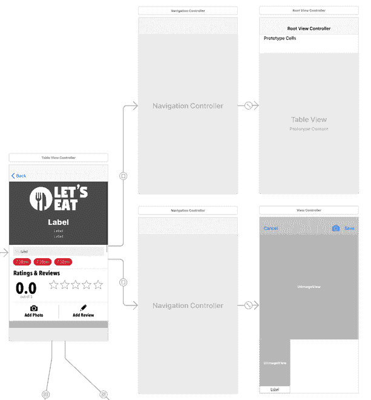

接下来，我们需要更新我们的表格视图。

# 创建评论表单

让我们现在设置这个静态表格视图：

1.  在大纲视图中，选择我们刚刚添加的表格视图，然后在实用工具面板中打开属性检查器。

1.  在表格视图下，将内容从动态原型更新到静态单元格。

1.  接下来，在大纲视图中选择表格视图部分。

1.  在属性检查器中的表格视图部分下，更新行数为`4`，然后按*Enter*键。

1.  现在，在实用工具面板中选择大小检查器，并在选择第一个表格视图单元格后，更新行高为`50`。然后，按*Enter*键。

1.  最后，选择最后一个单元格，并将行高更新为`190`。然后，按*Enter*键。

你现在应该有以下内容：

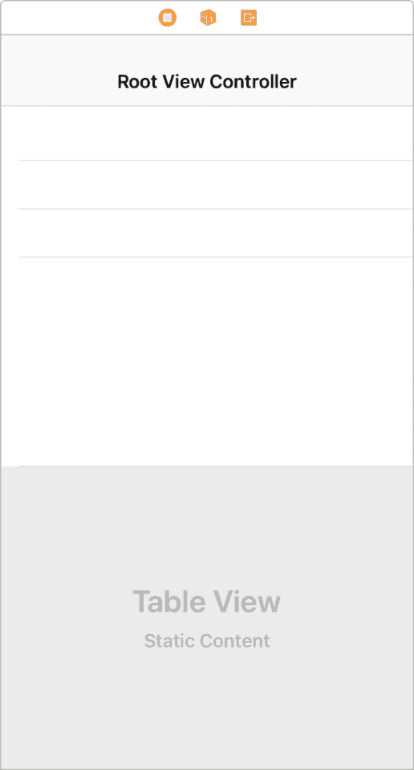

接下来，我们需要更新每个表格视图单元格的内部。

# 更新评论单元格

要知道每个单元格中需要什么，我们需要查看设计，然后使我们的故事板与设计相匹配。查看本章前面讨论的设计，在我们的第一个单元格中，我们需要一个图像和一个标签。在我们的第二个和第三个单元格中，我们需要一个文本字段，而在我们的最后一个单元格中，我们需要一个文本视图。当与静态单元格一起工作时，你可能注意到，有时你无法直接将 UI 元素拖入场景中的单元格。如果你遇到这个问题，只需将它们拖入“大纲”视图中的单元格即可。

# 更新我们的第一个单元格

让我们从更新我们的第一个单元格开始，并探讨涉及的因素：

1.  在“实用工具”面板的对象库中，在过滤器字段中输入“标签”，然后将一个标签拖入第一个单元格。

1.  然后，在过滤器中输入`image`并将图像拖入第一个单元格。

1.  接下来，在过滤器中输入“文本”，并将一个文本字段拖入第二个单元格，另一个文本字段拖入第三个单元格。

1.  最后，将一个文本视图拖入第四个单元格。

在此阶段，不要担心元素的定位，因为我们很快就会修复它们的定位。

我们现在拥有了构建此表单所需的所有元素，只需正确地放置它们。你应该已经熟悉了在单元格中定位元素（以及应用自动布局），因为我们已经在上一章中做了很多这样的操作。

# 定位 UI 元素

现在，让我们将所有元素放置到正确的位置：

1.  在“大纲”视图中，选择第二个单元格内的文本字段。

1.  在“实用工具”面板中选择“大小检查器”，并添加以下值：

+   +   X：`16`

    +   Y：`0`

    +   宽度：`350`

    +   高度：`44`

1.  打开“属性检查器”，在“文本字段”下，将占位符更新为`Title`。然后按*Enter*。还将字体设置为 Avenir Next Condensed Regular 17。

1.  在“大纲”视图中，选择第三个单元格内的文本字段。

1.  在“实用工具”面板中选择“大小检查器”，并添加以下值：

+   +   X：`16`

    +   Y：`0`

    +   宽度：`350`

    +   高度：`44`

1.  打开“属性检查器”，在“文本字段”下，将占位符更新为`Name`。然后按*Enter*。还将字体设置为 Avenir Next Condensed Regular 17。

1.  在第一个单元格中，将图像字段更新为`0star`，然后按*Enter*。

1.  接下来，在“大小检查器”中添加以下值：

+   +   X：`133`

    +   Y：`7`

    +   宽度：`108`

    +   高度：`17`

1.  将图像字段更新为`0star`，然后按*Enter*。

1.  选择第一个单元格中的标签，并在“大小检查器”中更新以下值：

+   +   X：`97`

    +   Y：`25`

    +   宽度：`181`

    +   高度：`21`

1.  打开“属性检查器”，在“文本”下，将标签更新为“Tap a Star to Rate”。然后按*Enter*。还将字体设置为 Avenir Next Condensed Regular 12。

1.  接下来，在最后一个单元格中，选择文本字段；然后在“大小检查器”中添加以下值：

+   +   X：`5`

    +   Y：`5`

    +   宽度：`365`

    +   高度：`179`

1.  最后，选择“属性检查器”；然后在“文本”下，将字体更改为 Avenir Next Condensed Regular 大小`14`。

你的单元格现在应该看起来如下：

您的单元格 UI 元素现在已正确定位，我们只需设置自动布局。

# 为创建评论添加自动布局

让我们现在为我们的表单添加自动布局：

1.  在第一个单元格中，选择图像视图，然后选择固定图标。输入以下值：

+   +   顶部：`7`

    +   宽度：`108`（已勾选）

    +   高度：`17`（已勾选）

1.  点击添加 3 个约束。

1.  接下来，选择对齐图标，然后勾选容器中的水平对齐。

1.  现在，选择图像视图下的标签，然后选择固定图标。输入以下值：

+   +   顶部：`1`

    +   宽度：`181`（已勾选）

    +   高度：`18`（已勾选）

1.  点击添加 3 个约束。

1.  接下来，选择对齐图标，然后勾选容器中的水平对齐。

1.  点击添加 1 个约束。

1.  接下来，在第二个单元格中选择文本字段，然后选择固定图标。输入以下值：

+   +   顶部：`0`

    +   右侧：`8`

    +   左侧：`16`

    +   高度：`44`（已勾选）

1.  点击添加 4 个约束。

1.  现在，选择第三个单元格中的文本字段，然后选择固定图标。输入以下值：

+   +   顶部：`0`

    +   右侧：`8`

    +   左侧：`16`

    +   高度：`44`（已勾选）

1.  点击添加 4 个约束。

1.  最后，选择第三个单元格中的文本视图，然后选择固定图标。输入以下值：

+   +   顶部：`5`

    +   右侧：`5`

    +   底部：`5`

    +   左侧：`5`

1.  点击添加 4 个约束。

我们现在已完成为表单添加自动布局。我们的`Main.storyboard`文件中有许多控制器：

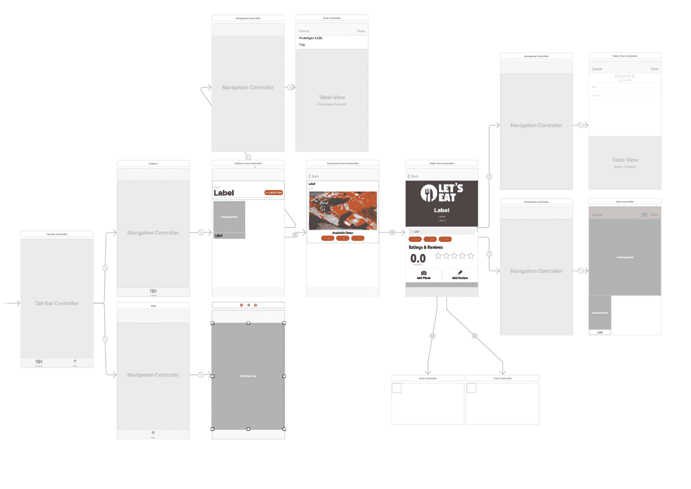

当与团队一起工作时，您不希望有一个控制所有 UI 的单个文件。您希望能够让不同的人在不同的应用部分上工作。为了能够有多个故事板，我们需要重构我们的故事板以使其更易于管理。即使您单独工作，为应用每个部分创建一个故事板也是良好的实践。让我们看看我们如何重构我们的故事板。

# 重构故事板

在编程中，重构这个术语意味着在不改变其行为的情况下改进现有的代码。我们可以将重构应用于故事板。我们将重构我们的故事板，以便我们的应用中的每个视图控制器都有自己的故事板文件。首先，我们将按标签（地图和探索）进行分离。

我们将使用所谓的场景引用，即在故事板之间添加引用。一个故事板中的场景引用可以指向不同故事板中的区域。这为我们提供了一种组织故事板的方法，而不是使用一个庞大的故事板来工作。打开您的`Main.storyboard`文件。

# 为地图标签创建新的故事板

1.  在`Main.storyboard`中，点击并拖动到所有包含在地图标签中的场景。

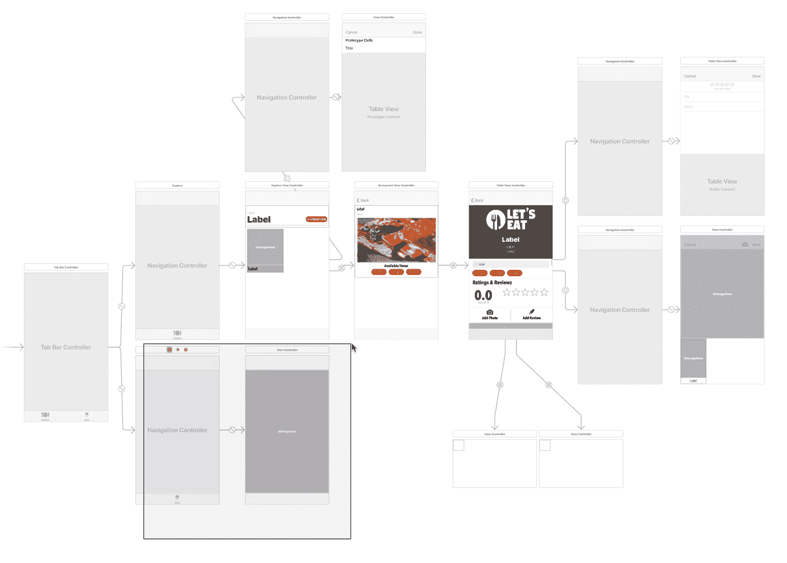

1.  在选择场景后，导航到编辑器 | 重构到故事板。

1.  当你被提示命名故事板时，将其命名为`Map.storyboard`，然后点击保存。

1.  保存后，你现在就在 `Map.storyboard` 文件内；如果你返回到 `Main.storyboard`，你应该能看到这个图标。

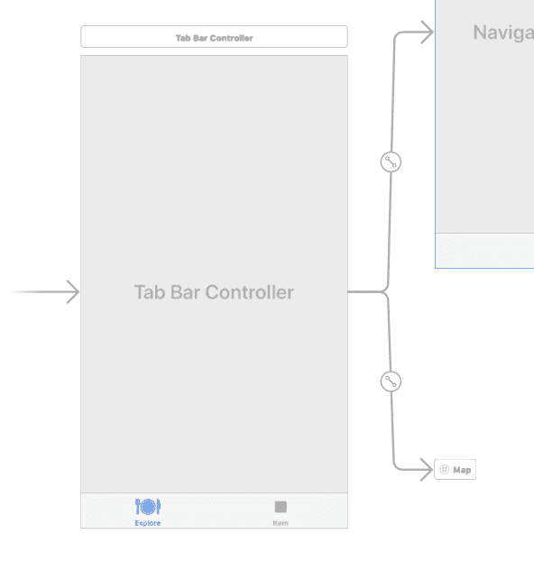

这个图标被称为**故事板引用**。你可以双击这些故事板引用，直接进入故事板。

# 为探索标签创建一个新的故事板

接下来，我们需要创建我们的探索标签。探索标签将包含多个故事板引用。让我们现在就创建这个引用：

1.  在 `Main.storyboard` 中，你将点击并拖动场景中剩余的所有场景。注意，当你点击时，确保你没有点击任何场景或视图控制器。你现在应该看到以下内容：

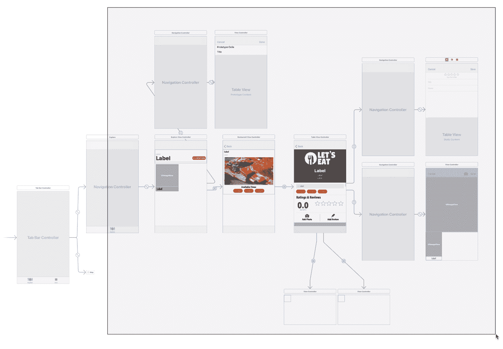

1.  选择场景后，导航到编辑器 | 重构为故事板。

1.  你将被提示命名故事板。将此命名为 `Explore.storyboard` 并然后点击保存。

现在，你将进入你新的 `Explore.storyboard` 文件。

我们可以在这里停止，但我感觉我们仍然有太多的故事板场景。当你单独工作时，这可能不是什么大问题，但当你在一个团队工作时，这会使事情变得更容易。

让我们从现在开始创建一个位置故事板引用：

1.  点击并拖动我们将要用于地点的两个控制器：

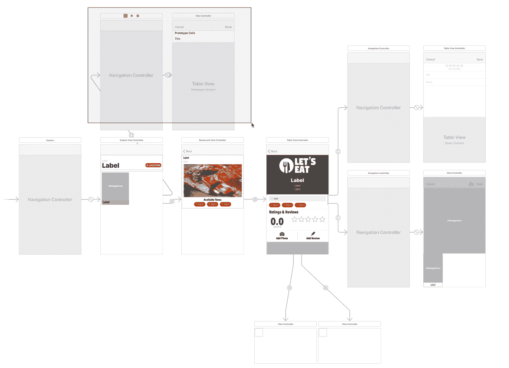

1.  选择场景后，导航到编辑器 | 重构为故事板。

1.  你将被提示命名故事板。将此命名为 `Locations.storyboard` 并然后点击保存。

现在，随着地点的设置，我们需要回到 `Explore.storyboard` 文件并执行以下操作：

1.  点击并拖动场景中剩余的所有场景。基本上你需要除了地点的故事板引用之外的所有内容。

1.  你现在应该看到以下内容：

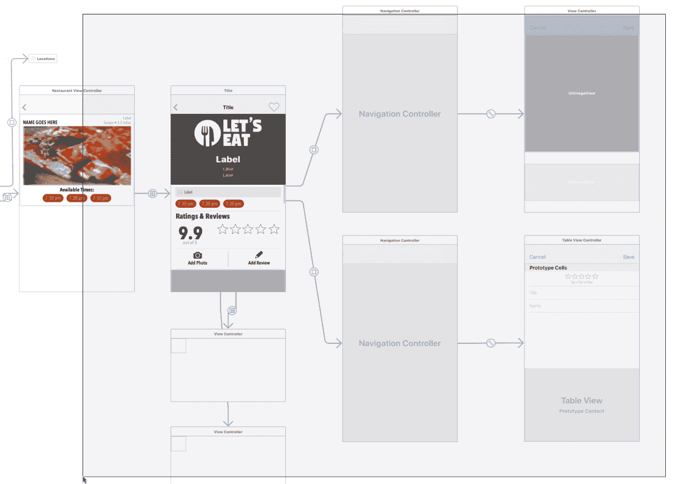

1.  选择场景后，导航到编辑器 | 重构为故事板。

1.  你将被提示命名故事板。将此命名为 `Restaurants.storyboard` 并然后点击保存。

现在，我们已经有了我们的餐厅列表的故事板，但我们还可以进行更多重构：

1.  在 `Restaurants.storyboard` 文件中，点击并拖动除了餐厅列表之外的所有场景。你现在应该看到以下内容：

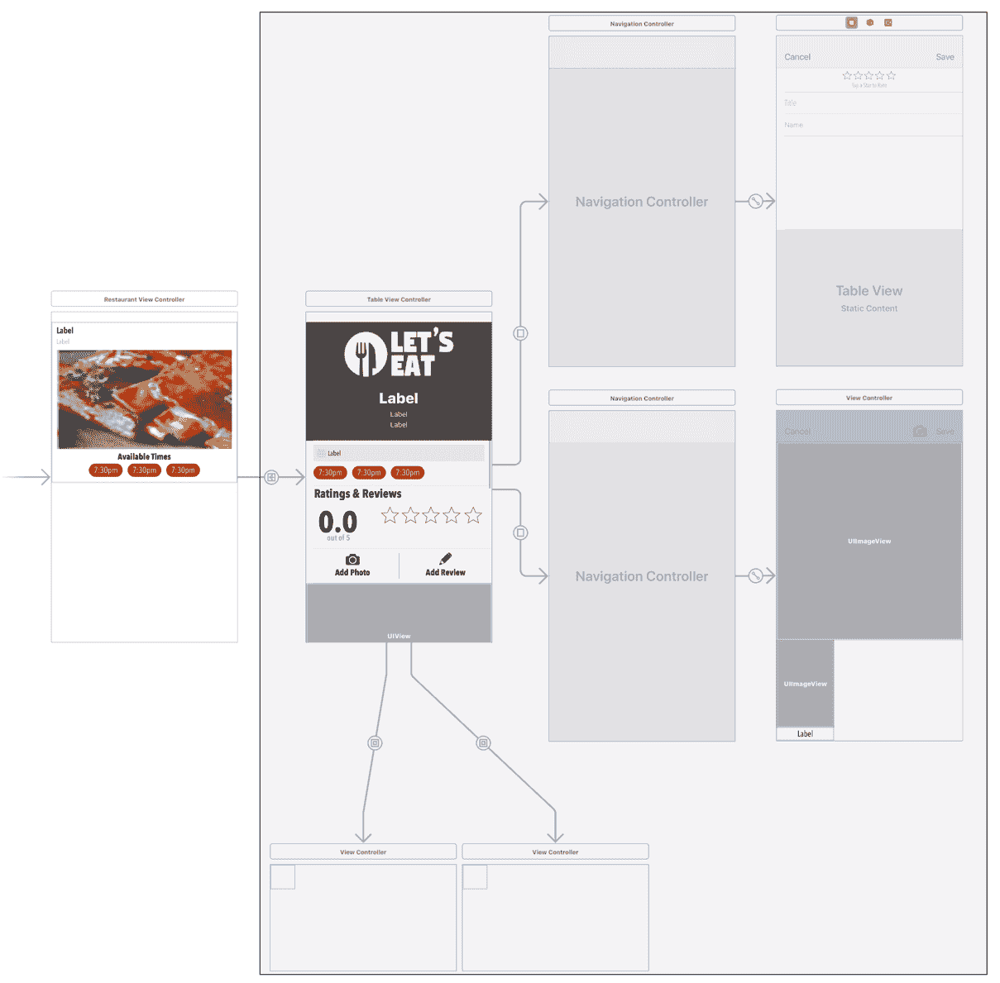

1.  选择场景后，导航到编辑器 | 重构为故事板。

1.  你将被提示命名故事板。将此命名为 `RestaurantDetail.storyboard` 并然后点击保存。

现在，让我们创建我们的照片滤镜故事板引用：

1.  在 `RestaurantDetail.storyboard` 文件中，点击并拖动我们用于照片滤镜的视图控制器和导航控制器。你现在应该看到以下内容：

1.  选择场景后，导航到**编辑器** | **重构为故事板**。

1.  你将被提示命名故事板。将其命名为 PhotoFilter.storyboard，然后点击**保存**。

我们还需要创建一个故事板引用。

1.  返回到`RestaurantDetail.storyboard`文件，点击并拖动我们用于评论表单的视图控制器和导航控制器。你现在应该看到以下内容：

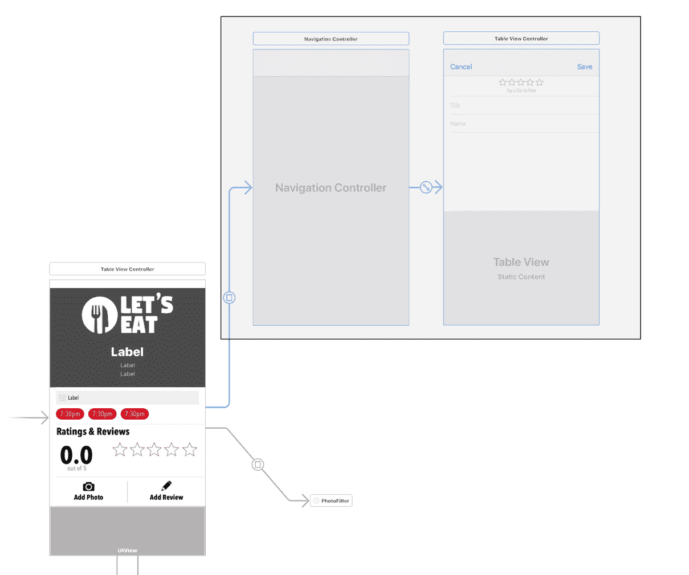

1.  在选择了场景后，导航到编辑器 | 重构到故事板。

1.  你将被提示命名故事板。将其命名为`ReviewForm.storyboard`，然后点击保存。

好的，我们终于完成了所有故事板的创建，现在你将在项目导航器中看到以下内容：

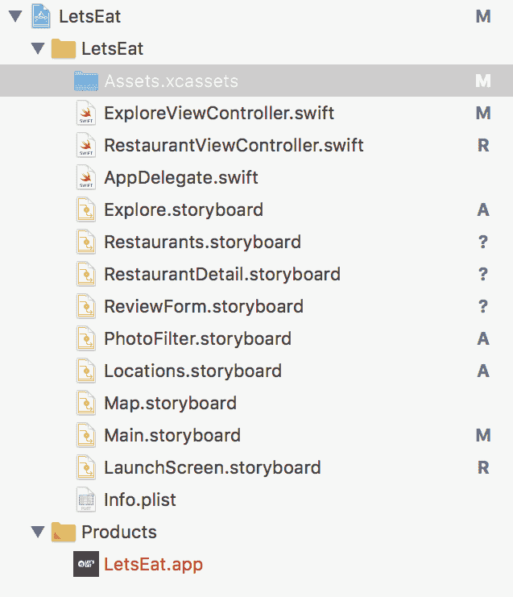

通过点击播放按钮（或使用*cmd* + *R*）来构建和运行项目，你会发现就导航应用而言，没有任何变化。

# 摘要

我们完成了故事板和设计设置。现在我们可以专注于代码部分，因为我们已经基本设置了 UI。你应该对我们的应用如何工作有一个很好的了解。如果你感到困难，那并没有什么问题。这些内容需要时间来掌握，就像我之前说的，如果你在遇到任何问题时感到困难，请返回。如果你在不舒服的情况下继续前进，那么事情会变得越来越难。我们将涵盖许多新主题，并且在你没有准备好时添加它们是不推荐的。

在下一章中，我们将学习什么是模型视图控制器以及如何与之协同工作。
