# 第十七章：与 API 一起工作

在构建 iOS 应用时，数据可能是最关键的部分。通常，你制作的应用需要从在线数据源获取数据，这种数据源被称为**应用程序编程接口**（**API**）。在前几章中，我们只使用 plist 来提供我们的数据。使用 plist 可以帮助我们理解如何与 API 一起工作，正如你很快就会看到的。在本章中，我们将使用一种以**JavaScript 对象表示法**（**JSON**）格式的 API。无论使用哪种后端服务创建 JSON，这种格式都是典型的。在本章中，我们将涵盖：

+   JSON 文件是什么以及数据源的不同组件

+   使用 segues 传递数据

+   什么是扩展以及如何使用它们来清理你的代码

对于我们的应用，我们需要一个类来处理我们的数据，但我们需要与我们的 Explore 视图控制器和 Map 视图控制器共享它。让我们首先了解我们的 API 管理器的职责。

# 创建 API 管理器

在本章中，我们将构建一个 API 管理器。这个管理器将负责与从在线获取数据有关的所有事情。在处理在线数据时，你通常会以特定的格式获取数据，然后你需要将其转换为应用程序可以读取的格式。

# 什么是 API？

RESTful API 是一个应用程序可以从其中接收数据的网络服务。通常，当你处理 API 时，例如 YELP，它们往往会经常更改。出于我们的目的，我们希望使用静态文件，这样我们就可以在不担心 API 变更的情况下工作。因此，我们将使用的大部分数据来自网站 [`opentable.herokuapp.com/`](http://opentable.herokuapp.com/)，该网站不是全天候管理且不经常更改。然而，该网站的 API 缺少我们需要的某些数据；因此，我已经更新了这些文件（这些文件在本章的项目文件中），以包含缺失的数据。

API 通常以 JSON 格式，与它们一起工作与处理 plists 类似。从一种格式到另一种格式的转换应该相当无缝。让我们熟悉 JSON 格式。

# 理解 JSON 文件

在编写任何代码之前，我们需要查看一个简单 JSON 文件的结构。让我们在`Navigator`面板中的`Misc`文件夹内创建一个新的组，命名为`JSON`。然后，通过点击出现的屏幕上的“完成”按钮，将本章项目文件中找到的所有 JSON 文件拖放到新的`JSON`文件夹中。最后，打开`Charleston.json`文件，让我们回顾它的第一部分，包括第一个餐厅列表：

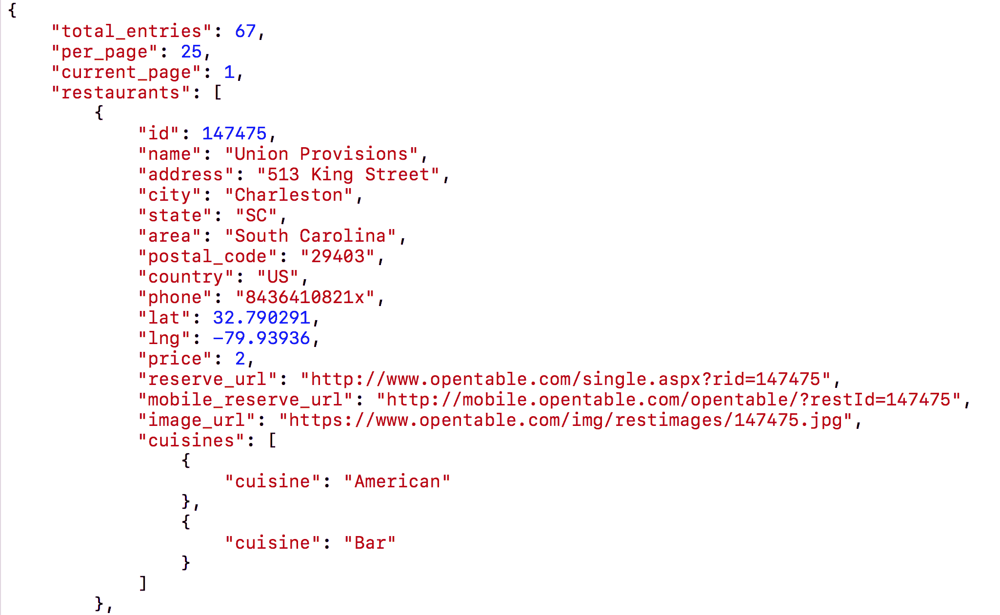

此文件内部有四个节点，分别是`total_entries`、`per_page`、`current_page`和`restaurants`。当你处理一个数据源时，它会将项目分成页面，这样你就不需要一次性加载所有数据。这个数据源告诉我们总共有 67 页，每页有 25 家餐厅，并且我们现在在第 1 页。由于我们只是要加载 25 家餐厅，所以这本书中我们不需要前三个节点。

与之相反，`restaurant`节点对于本书的目的至关重要。餐厅的节点是一个数据数组，可以通过节点中使用的括号（`[ ]`）识别出来。如果你查看餐厅节点的各个项目，你会注意到我们应用名称、地址、城市等所需的一切都被涵盖了。这种结构与我们在本书前面看到的 plists 中的结构相同。如果你查看菜系，你会注意到它被括号（`[ ]`）包裹着。同样，这也就是我们之前在 plist 数据中看到的样子。我们已经对 JSON 文件的外观有了一定的了解；让我们看看我们如何与之交互。

# 探索 API Manager 文件

我们刚刚创建了`API Manager`文件夹；现在，让我们创建`API Manager`文件：

1.  在导航面板的`Common`文件夹中的`Misc`文件夹上右键单击，并选择新建文件。

1.  在选择新文件模板的屏幕上，顶部选择 iOS。然后，选择 Swift 文件。点击下一步。

1.  将此文件命名为`RestaurantAPIManager`，然后点击创建。

我们首先需要定义我们的类定义；因此，将以下内容添加到`import`语句中：

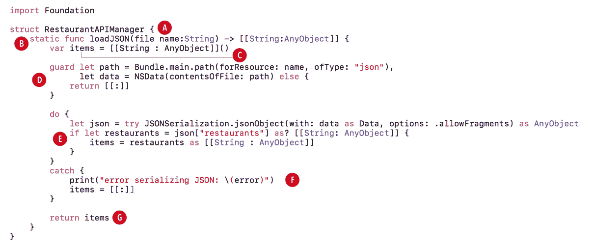

+   **第 A 部分**：在这里，我们定义了类。

```
struct RestaurantAPIManager {
```

+   **第 B 部分**：`loadJSON()`方法被称为类型方法，因为它前面有`static`关键字。类型方法使用点符号调用。静态函数不能被重写。

```
static func loadJSON(file name:String) -> [[String:AnyObject]] {
```

下一个项目符号列表解释了当我们想在`RestaurantAPIManager`文件中调用`loadJSON`方法时需要编写什么。

+   **第 C 部分**：调用此方法将返回一个字典对象数组。如果这听起来很熟悉，那是因为我们的 plist 数据返回相同的内容。

```
var items = [[String: AnyObject]]()
```

+   **第 D 部分**：在这一行，我们正在声明一个字典对象数组。

```
guard let path = Bundle.main.path(forResource: name, ofType: "json"), let data = NSData(contentsOfFile: path) else {
   return [[:]]
}
```

+   **第 E 部分**：由于我们不是从互联网上加载，我们需要确保调用正确的文件名。如果路径找到且数据没有问题，我们将使用这些数据。否则，我们将返回一个空数组，没有任何字典对象。

在这里，我们使用了`do...catch`。为了使用它，我们必须使用所谓的 try。我们首先尝试将 JSON 文件中的数据序列化或转换；如果这成功了，我们就可以访问文件中的信息。为了获取 JSON 文件中的餐厅项目（所有这些项目都位于餐厅节点中），我们使用了`json["restaurants"]`。

接下来，我们使用`as?`将其转换为字典对象数组。由于我们的数据类型是混合的，我们使用了`AnyObject`来接受混合数据类型的字典。最后，我们将数据设置为项目数组。我们现在有了与`Map`部分相同的结构，即字典对象数组。

```
do {
let json = try JSONSerialization.jsonObject(with: data as Data, options: .allowFragments) as AnyObject
if let restaurants = json["restaurants"] as? [[String: AnyObject]] {
      items = restaurants as [[String : AnyObject]]
  }
}
```

+   **第 F 部分**：这个`catch`只有在从文件序列化数据有问题时才会运行。如果有问题，我们将返回一个空数组，没有字典对象。这允许我们的应用继续运行而不会崩溃。

```
catch {
  print("error serializing JSON: \(error)")
  items = [[:]]
}
```

+   **第 G 部分**：最后，如果一切顺利，我们将返回字典项数组的返回。

```
return items
```

整个类都是构建的，以便我们可以传递任何我们想要的名称；如果找到文件，它将返回数据。

# 位置列表

让我们回顾一下我们的应用将如何工作。用户将选择一种菜系和位置。然后，将位置传递到探索视图。用户将从所选位置获取经过所选菜系筛选的餐厅。

如果这是在线的，我们会将位置传递给 API，API 会返回 JSON 数据。如您所见，我们正在做同样的事情。当你最终处理 API 时，处理在线数据的过渡将是无缝的。

# 选择位置

因此，如前所述，要获取数据，我们需要一个位置。要获取位置，我们需要从`LocationViewController`中获取它。当选择位置时，我们将显示一个勾选标记。每次设置新项目时，我们都需要更新这个勾选标记。最后，当点击完成按钮时，我们需要将这个位置传递给`ExploreViewController`。

让我们先更新`LocationViewController`。我们需要一个变量来跟踪所选位置。在`LocationViewController.swift`文件中的常量管理器下添加以下内容：

```
var selectedCity:String?
```

然后，我们需要为`UITableViewDelegate`创建一个新的扩展，如下所示。在我们的`UITableViewDataSource`扩展之后添加以下内容：

```
//MARK: UITableViewDelegate
extension LocationViewController: UITableViewDelegate {
}
```

正如我们在书中之前讨论的，代理提供行为。这里，我们希望当用户选择表格视图行时有一个行为，当用户取消选择行时也有一个行为。首先，让我们通过添加以下代码将选择行为添加到我们新的扩展中：

```
func tableView(_ tableView: UITableView, didSelectRowAt indexPath:IndexPath) {
   if let cell = tableView.cellForRow(at: indexPath) {
          cell.accessoryType = .checkmark
          selectedCity = manager.locationItem(at:indexPath)
          tableView.reloadData()
   }
}
```

在这里，我们将获取所选行的单元格并将其`accessoryType`设置为勾选标记。然后，我们将获取位置并将其设置为`selectedCity`变量。为了只在我们的表格视图单元格中看到勾选标记，我们需要移除披露箭头和灰色单元格选择。让我们通过以下方式更新它：

1.  打开`Explore.storyboard`。

1.  在位置视图控制器中选择表格视图的`locationCell`。

1.  在实用工具面板中选择属性检查器，并将选择字段从灰色更新为无。

1.  接下来，更新访问辅助字段，从披露指示器更改为无。

# 添加标题视图

我们的探索视图有一个标题，我们需要将数据传递给它。为此，我们需要为它创建一个标题类：

1.  右键单击探索文件夹并选择新建文件。

1.  在创建新文件模板的屏幕上，在顶部选择 iOS。然后选择 Cocoa Touch Class。点击下一步。

1.  在出现的选项屏幕中，添加以下内容：

新文件：

+   +   类：`ExploreHeaderView`

    +   子类：`UICollectionReusableView`

    +   同时创建 XIB：未选中

    +   语言：`Swift`

1.  点击下一步然后创建。

1.  将以下内容添加到该文件中：

```
import UIKit
class ExploreHeaderView: UICollectionReusableView {
    @IBOutlet weak var lblLocation:UILabel!
}
```

1.  接下来，打开 `Explore.storyboard` 文件，并在实用工具面板中的身份检查器下，将类更新为 `ExploreHeaderView`。

现在，让我们处理从位置到探索的传数据，并在我们的标题中显示选定的位置。

# 将选定的位置传回探索视图

现在，我们需要能够将选定的城市发送回我们的 `ExploreViewController`。因此，我们需要一个选定的城市，以及 `ExploreViewController` 中完成按钮的撤销操作。首先，让我们将选定的城市显示在我们的探索视图中：

1.  在我们的 `ExploreViewController.swift` 文件中的常量管理器下添加以下变量：

```
var selectedCity:String?
var headerView: ExploreHeaderView!
```

1.  接下来，打开 `Explore.storyboard` 并在大纲视图中选择探索标题视图。

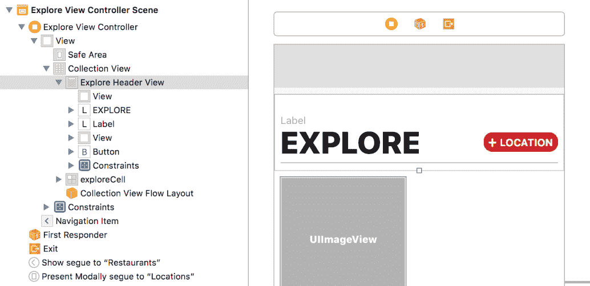

1.  然后，选择实用工具面板中的连接检查器，并从探索视图控制器头部场景中的空圆圈 `lblLocation` 下的输出拖动到标签：

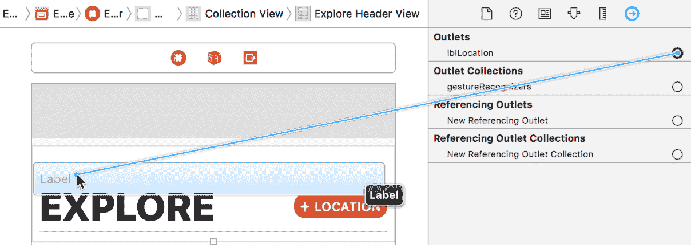

1.  当我们在这里时，让我们也更新这个标签，使其显示为“请选择一个位置”，以及其下方的标签显示为“探索”：

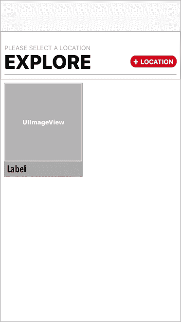

接下来，让我们在探索视图控制器中撤销完成按钮。

# 撤销完成按钮

在本书的早期，我们为取消按钮添加了撤销操作。现在我们需要使完成按钮也能关闭模态，同时我们还想在用户完成时捕获选定的位置。让我们添加以下代码：

1.  再次打开 `ExploreViewController.swift` 文件，并在 `unwindLocationCancel()` 函数下的 `private` 扩展中添加以下代码：

```
@IBAction func unwindLocationDone(segue:UIStoryboardSegue) {
    if let viewController = segue.source as? LocationViewController {
        selectedCity = viewController.selectedCity
        if let location = selectedCity {
            headerView.lblLocation.text = location
        }
    }
}
```

我们刚刚添加的代码正在检查 segue 的来源。如果其来源是 `LocationViewController` 的一个类，那么我们想要获取选定的城市并将 `ExploreViewController` 中的 `selectedCity` 变量设置为该城市。然后我们使用 `if...let` 语句确保 `selectedCity` 不是 `nil`；如果不是，则将标题中的标签设置为当前选定的城市。现在，我们需要连接这个 `IBAction`。

1.  在你的 `UICollectionViewDataSource` 扩展中，更新 `collectionView:viewForSupplementaryElementOfKind:atIndexPath:` 为以下内容：

```
func collectionView(_ collectionView: UICollectionView, viewForSupplementaryElementOfKind kind: String, at indexPath: IndexPath) -> UICollectionReusableView {
    let header = collectionView.dequeueReusableSupplementaryView(ofKind: kind, withReuseIdentifier: "header", for: indexPath)
    headerView = header as! LocationHeaderView
    return headerView
}
```

1.  接下来，打开 `Locations.storyboard`。

1.  现在，*Ctrl* + 拖动从位置视图控制器中的完成按钮到场景中的退出：

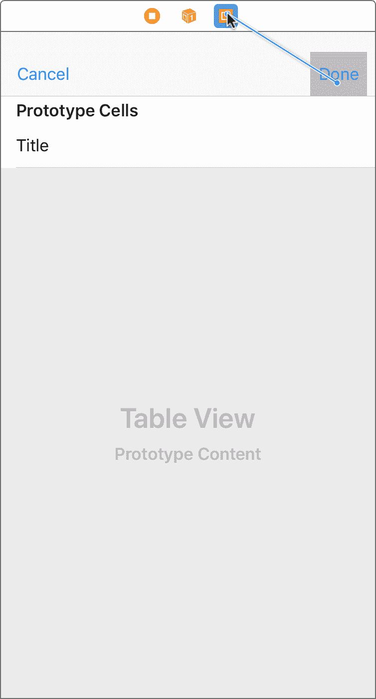

1.  当你松开鼠标时，在出现的菜单中选择 `unwindLocationDoneWithSegue:`：

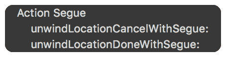

通过点击播放按钮（或使用 *cmd* + *R*）来构建和运行项目。现在你应该能够选择一个位置；当你点击“完成”时，Explore Header 视图应该显示你选定的位置：

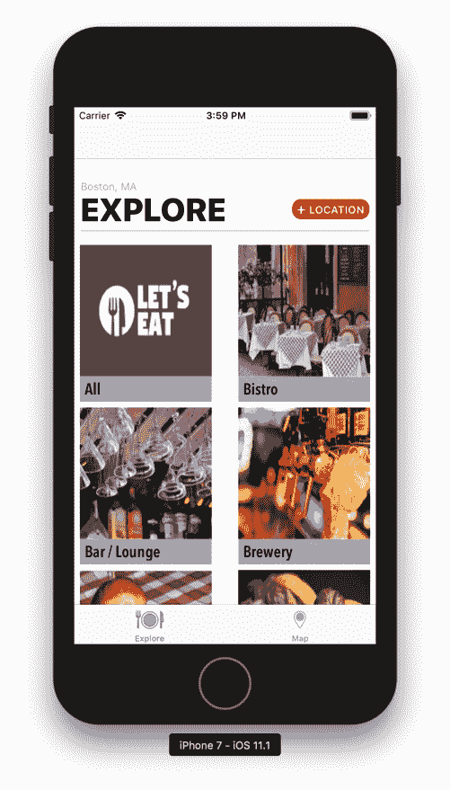

# 获取最后选定的位置

在“选择位置”下，我们有一些问题需要纠正。你会注意到，当你点击“选择位置”时，你可以选择多个位置。我们只想让用户能够选择一个位置。此外，如果你在位置视图中点击“完成”然后再次选择位置，你选定的位置旁边的勾选标记会消失。我们需要设置最后选定的位置，以便当你返回位置列表时能够保存。我们可以同时解决这些问题：

1.  打开 `Explore.storyboard`:

1.  选择与 `LocationViewController` 相连接的 segue。

1.  然后，在实用工具面板中选择属性检查器，并将 Storyboard Segue 下的 Identifier 设置为 locationList。然后，按 *Enter*：

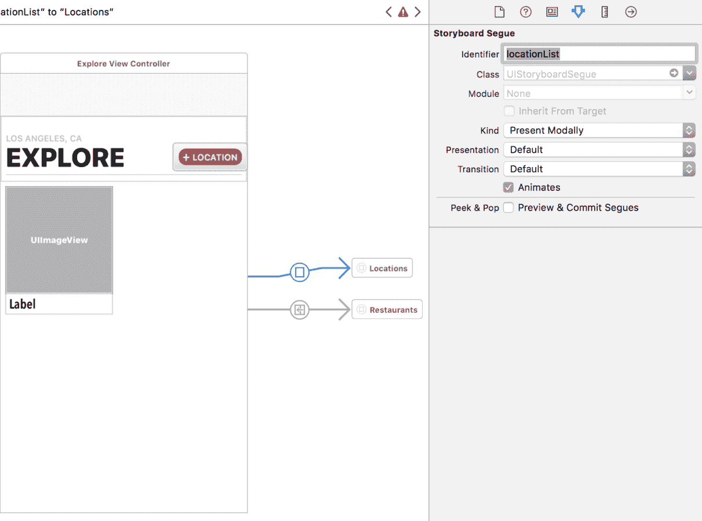

1.  现在，选择与 `RestaurantViewController` 相连接的 segue，并将 Identifier 设置为 `restaurantList`。然后，按 *Enter*：

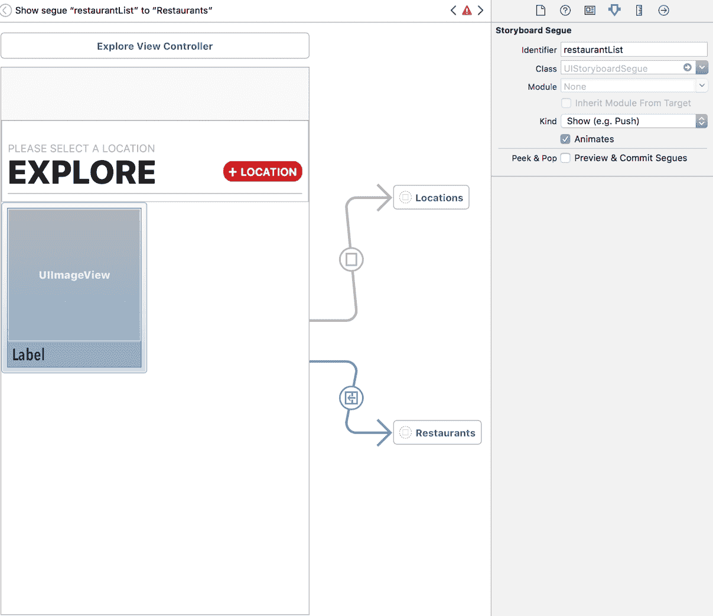

1.  接下来，我们需要设置这些标识符。我们将更新我们在上一章中创建的 segue 枚举。在 `Common` 文件夹下的 `Misc` 文件夹中的 `Segue.swift` 文件内添加以下代码：

```
case restaurantList
case locationList
```

1.  然后，打开 `LocationDataManager.swift` 文件，在最后一个大括号之前添加以下代码：

```
func findLocation(by name:String) -> (isFound:Bool, position:Int) {
                guard let index = arrLocations.index(of: name) else 
                { return (isFound:false, position:0) }
                return (isFound:true, position:index)
}
```

1.  此方法将允许我们找到位置，然后获取其在数组中的索引位置。我们将返回一个元组，这是 Swift 中的复合类型，意味着它可以包含多个值。元组允许你将不同的数据类型组合成一个。该方法将检查元组以确定是否找到了数据。如果找到了数据，我们将使用索引位置；如果没有，我们则不执行任何操作。

1.  接下来，我们需要检查是否已设置了一个先前位置。打开 `LocationViewController.swift` 文件，并在 `viewDidLoad()` 方法之后创建以下方法：

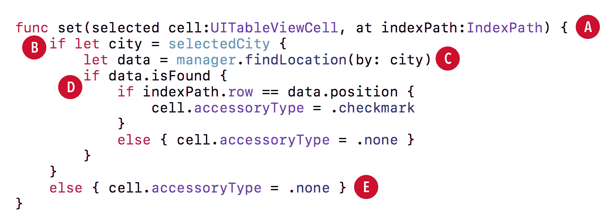

让我们分解这个方法：

+   **Part A**: 在此方法的参数中，我们接收一个单元格和一个索引路径：

```
set(cell:at)
if let city = selectedCity
```

+   **Part B**: 在这里，我们检查确保已设置了选定的城市。

```
let data = manager.findLocation(by: city)
```

+   **Part C**: 然后，我们调用在 `LocationDataManager` 中创建的方法，将选定的城市传递给管理器，并获取一个包含数据的元组。

```
if data.isFound {
   if indexPath.row == data.position {
          cell.accessoryType = .checkmark
   }
   else { cell.accessoryType = .none }
}
```

+   **Part D**: 接下来，我们检查元组中是否找到了数据；如果是，我们检查选定的行是否与数组中的位置相同。如果行和位置相同，我们将指示单元格将其 accessoryType 设置为勾选标记；否则，accessoryType 将设置为无。

```
else { cell.accessoryType = .none }
```

+   **部分 E**：最后，如果没有找到数据，我们将 `accessoryType` 设置为无。在设置单元格文本后，在 `cellForRowAt()` 中添加以下内容：

```
set(selected: cell, at: indexPath)
```

通过点击播放按钮（或使用 *cmd* + *R*）来构建和运行项目。你应该看到现在只能选择一个位置。然而，在你选择位置后，如果你在位置视图中点击完成，然后再次点击以显示位置，你最后选择的位置不会被保存。我们仍然需要解决这个问题，我们将在下一步解决。

# 将位置和菜系传递给餐厅列表

打开 `ExploreViewController.swift` 文件，并在 `private` 扩展中 `unwindLocationCancel()` 方法之上添加以下方法：

```
func showLocationList(segue:UIStoryboardSegue) {
   guard let navController = segue.destination as? UINavigationController,
          let viewController = navController.topViewController as? LocationViewController else {
                 return
   }
   guard let city = selectedCity else { return }
   viewController.selectedCity = city
} 
```

我们的 `showLocationList()` 方法会在我们的目标视图有导航控制器时被调用。然后，它检查 `topViewController` 是否为 `LocationViewController` 类。如果这两个语句中的任何一个为 `false`，我们就不做任何事情。如果两个都为 `true`，我们检查 `selectedCity`。如果它是 `nil`，那么我们也不做任何事情。如果 `selectedCity` 有位置，我们将 `LocationViewController` 中的 `selectedCity` 变量设置为 `ExploreViewController` 中的 `selectedCity`。这将保存我们在之前选择位置后返回位置列表时最后选择的位置。

我们还需要将选中的城市传递给 `RestaurantViewController`。因此，在 `RestaurantViewController.swift` 文件中 `@IBOutlet var collectionView` 之上添加以下变量：

```
var selectedRestaurant:RestaurantItem?
var selectedCity:LocationItem?
var selectedType:String? 
```

仍然在 `RestaurantViewController.swift` 文件中，在 `viewDidLoad()` 方法下添加以下代码：

```
override func viewDidAppear(_ animated: Bool) {
  super.viewDidAppear(animated)
  print("selected city \(selectedCity as Any)")
  print("selected type \(selectedType as Any)")
} 
```

`viewDidAppear()` 方法会在每次加载视图控制器时被调用，而 `viewDidLoad()` 方法只会在第一次调用。我们可以打印 `selectedCity` 变量来验证我们是否正确地传递了位置。

接下来，再次打开 `ExploreViewController.swift` 文件，并在 `showLocationList()` 方法内部添加以下内容：

```
func showRestaurantListing(segue:UIStoryboardSegue) {
   if let viewController = segue.destination as? RestaurantViewController, let city = selectedCity,
          let index = collectionView.indexPathsForSelectedItems?.first, let type = manager.explore(at: index).name {
          viewController.selectedType = type
          viewController.selectedCity = city
   }
} 
```

我们现在检查是否目标视图控制器是 `RestaurantViewController`，并确保 `selectedCity` 在 `ExploreViewController` 中已设置。接下来，我们获取集合视图的选中 `indexPath`。一旦我们有了它，我们就从 `ExploreDataManager` 的 `index` 位置获取项目。最后，我们从项目获取名称。如果我们获取所有这些项目，那么我们将 `selectedCity` 和 `selectedType` 变量传递给 `RestaurantViewController`。如果没有，我们将显示一个警告框，让用户知道他们需要先选择一个位置。让我们创建三个将显示此类警告的方法：

1.  首先，我们将创建实际的警告框。仍然在 `ExploreViewController` 中，在 `unwindLocationCancel()` 之前添加以下代码：

```
func showAlert() {
                let alertController = UIAlertController(title: "Location Needed", message:"Please select a location.", preferredStyle: .alert)
                let okAction = UIAlertAction(title: "OK", style: .default, handler: nil)
                alertController.addAction(okAction)
                present(alertController, animated: true, completion: nil)
} 
```

1.  然后，我们需要检查我们是否有位置；如果没有，我们想要确保用户不能访问餐厅列表。在 `ExploreViewController` 中，在 `viewDidLoad()` 方法之后添加以下方法：

```
override func shouldPerformSegue(withIdentifier identifier: String, sender: Any?) -> Bool {
    if identifier == Segue.restaurantList.rawValue {
        guard selectedCity != nil else {
            showAlert()
            return false
        }
        return true
    }
    return true
} 
```

在这里，我们检查 segue 是否等于 `restaurantList;`。如果是，我们检查 `selectedCity` 变量是否已设置。如果返回 `true`，则执行 segue，并将我们导向餐厅列表。如果返回 `false`，则显示我们的警报，让用户知道他们需要先选择一个位置。

1.  最后，我们需要根据用户在尝试查看餐厅列表之前是否选择了位置来显示位置列表或餐厅列表。在 `viewDidLoad()` 方法之后，在刚刚添加的 `shouldPerformSegue` 方法之前添加以下方法：

```
override func prepare(for segue: UIStoryboardSegue, sender: Any?){
    switch segue.identifier! {
        case Segue.locationList.rawValue:
            showLocationList(segue: segue)
        case Segue.restaurantList.rawValue:
            showRestaurantListing(segue: segue)
        default:
        print("Segue not added")
    }
}
```

`prepare()` 方法检查哪个标识符被调用。如果是位置列表，则调用 `showLocationList()` 方法；如果是餐厅列表，则调用 `showRestaurantListing()` 方法。

现在，通过点击播放按钮（或使用 *cmd* + *R*）构建和运行项目。如果你首先尝试选择菜系，你应该无法访问餐厅列表。相反，你应该收到一个警报，指出你需要先选择一个位置：

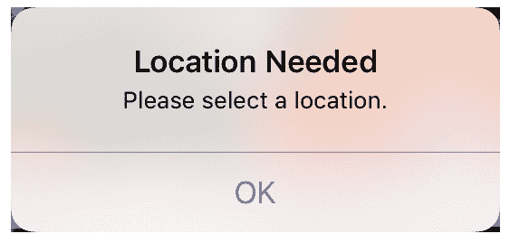

如果你选择一个位置，点击完成，然后再次点击位置列表，你应该看到你的位置仍然被选中。现在，如果你选择一种菜系，你应该被导向餐厅列表，并在调试面板中看到选中的位置。如果你看不到该面板，你可以通过切换或 *cmd* + *Shift* + *Y* 打开它。

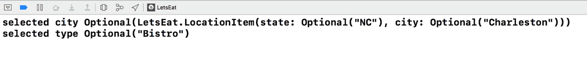

现在我们有了位置信息，我们需要检查我们的 `RestaurantAPIManager` 以获取数据。因此，让我们更新 `RestaurantViewController` 中的 `print` 语句，通过修改 `viewDidAppear()` 方法如下：

```
override func viewDidAppear(_ animated: Bool) {
   guard let location = selectedCity?.city, let type = selectedType else {
          return
   }

   print("type \(type)")
   print(RestaurantAPIManager.loadJSON(file: location))
}
```

你现在应该在调试面板中看到选中的类型，以及一个字典对象数组：

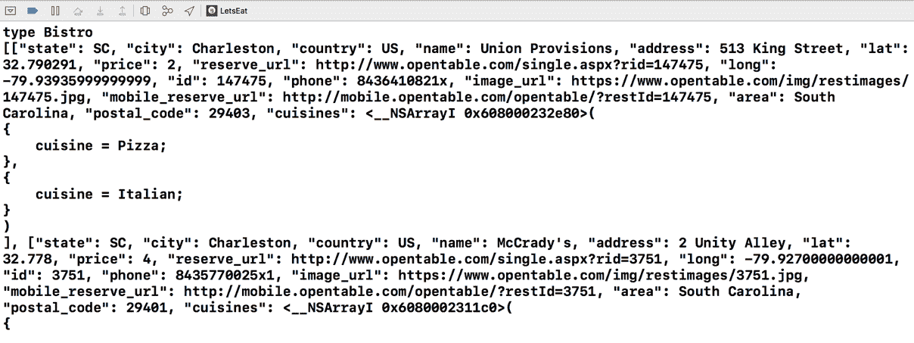

现在我们有了数据，让我们将数据设置到我们的 `RestaurantViewController` 中显示。为此，我们需要设置单元格以及餐厅数据管理器。餐厅数据管理器，而不是 `RestaurantViewController`，将是使用我们的 `RestaurantAPIManager` 的类。

# 创建我们的餐厅单元格类

现在，我们需要创建一个文件，以便我们可以连接到单元格：

1.  在导航器面板中的 `Restaurants` 文件夹中，右键单击 `View` 文件夹并选择新建文件。

1.  在创建新文件的选择模板屏幕上，选择顶部的 iOS，然后选择 Cocoa Touch Class。然后，点击下一步。

1.  在出现的选项屏幕中，添加以下内容：

新文件：

+   +   类：`RestaurantCell`

    +   子类：`UICollectionViewCell`

    +   还创建 XIB 文件：未选中

    +   语言：`` `Swift` ``

1.  点击下一步然后创建。你的文件应该看起来像以下这样：

```
import UIKit
class RestaurantCell: UICollectionViewCell {
} 
```

1.  在类声明中，添加以下内容：

```
@IBOutlet weak var lblTitle:UILabel!
@IBOutlet weak var lblCuisine:UILabel!
@IBOutlet weak var imgRestaurant: UIImageView! 
```

1.  保存文件。

现在我们已经设置了文件，让我们将我们的输出口连接起来。

# 设置餐厅列表单元格输出口

我们需要设置我们的 `restaurantCell` 输出口：

1.  打开 `Explore.storyboard` 并在大纲视图中再次选择我们的 `restaurantCell`。

1.  现在，在实用工具面板中，选择身份检查器。

1.  在自定义类下，在类下拉菜单中选择 RestaurantCell 并按 *Enter* 键以将单元格连接到类。

1.  现在请选择连接检查器。

1.  点击并从输出口下的空圆圈 `lblTitle` 拖动到 `restaurantCell` 顶部的标签：

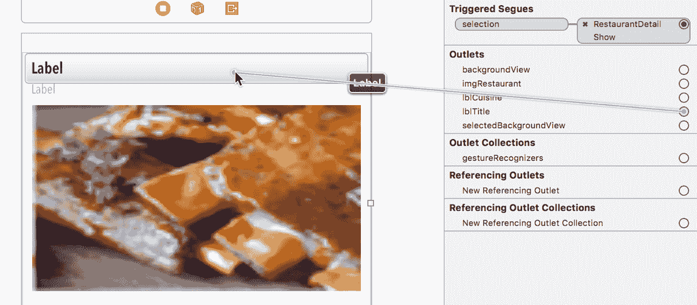

1.  点击并从输出口下的空圆圈 `lblCuisine` 拖动到 `restaurantCell` 中的另一个标签：

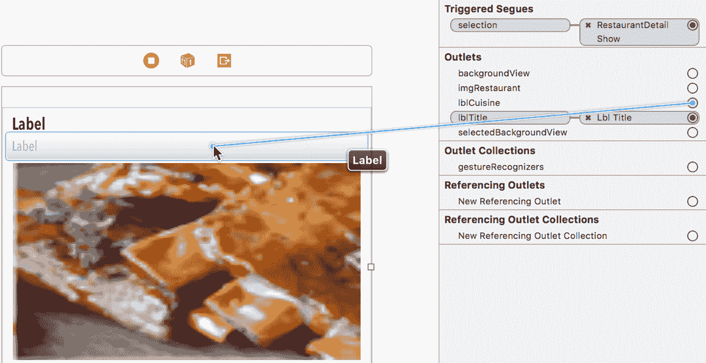

1.  点击并从输出口下的空圆圈 `imgRestaurant` 拖动到 `restaurantCell` 中的图片：

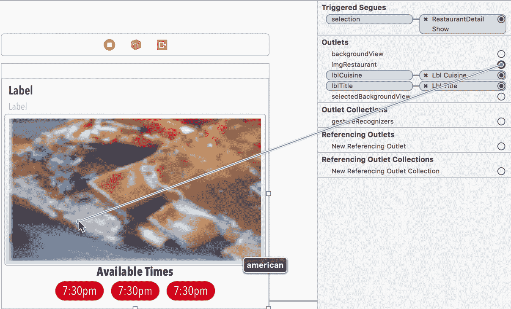

现在我们已经设置了 `restaurantListCell` 输出口，让我们将一些数据放入单元格中。我们之前创建了 `RestaurantItem.swift` 文件；我们将在餐厅列表中使用这个文件。

# 创建餐厅数据管理器

我们需要为我们的餐厅创建一个数据管理器，但在我们这样做之前，我们需要更新一些事情。在 Swift 4 中，我们有一个更自然的方式来解析 JSON，这被称为 **Decodable**。首先，我们需要更新我们的 `RestaurantItem`，但在我们深入了解这段代码之前，我们的 `RestaurantItem` 需要遵守 Decodable 协议。打开 `RestaurantItem`。打开 `RestaurantItem` 并更新如下：

```
class RestaurantItem: NSObject, MKAnnotation, Decodable {
  var name: String?
  var cuisines:[String] = []
  var latitude: Double?
  var longitude:Double?
  var address:String?
  var postalCode:String?
  var state:String?
  var imageURL:String?

  var title: String? {
    return name
  }

  var subtitle: String? {
    if cuisines.isEmpty { return "" }
    else if cuisines.count == 1 { return cuisines.first }
    else { return cuisines.joined(separator: ", ") }
  }

  var coordinate: CLLocationCoordinate2D {
    guard let lat = latitude, let long = longitude else {
      return CLLocationCoordinate2D() }
    return CLLocationCoordinate2D(latitude: lat, longitude: long )
  }
}
```

现在我们有一个返回 `RestaurantItems` 数组的 `Location` 对象，就像我们的 JSON 数据一样。

现在让我们创建 `RestaurantDataManager` 文件：

1.  右键单击 `Restaurants` 文件夹并选择新建文件。

1.  在选择新文件模板的屏幕内，顶部选择 iOS，然后选择 Swift 文件。然后，点击下一步：

1.  将此文件命名为 `RestaurantDataManager` 并点击创建。

我们需要首先定义我们的类定义，因此在新文件中的 `import` 语句下添加以下内容：

```
class RestaurantDataManager {
}
```

在类声明中添加以下变量：

```
private var items:[RestaurantItem] = []
```

在这里，我们保持我们的数组 `private`，因为没有必要在类外部访问这个。

现在，让我们添加以下三个方法：

```
func fetch(by location:String, withFilter:String="All",  completionHandler:() -> Swift.Void) {
   var restaurants:[RestaurantItem] = []
   for restaurant in RestaurantAPIManager.loadJSON(file: location) {
          restaurants.append(RestaurantItem(dict: restaurant))
   }

   if withFilter != "All" {
          items = restaurants.filter({ $0.cuisines.contains(withFilter) })
   }
   else { items = restaurants }
   completionHandler()
}
func numberOfItems() -> Int {
   return items.count
}

func restaurantItem(at index:IndexPath) -> RestaurantItem {
   return items[index.item]
}
```

这里第一个方法与我们之前在 `ExploreDataManager` 中看到的方法不同，而这里的最后两个方法与 `ExploreDataManager` 中的方法相同。

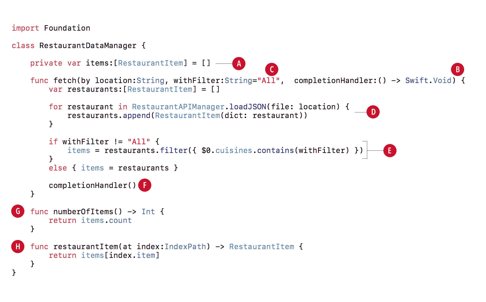

让我们分解这些方法，以便更好地理解我们在做什么：

+   **Part A**：在这个方法的参数中，我们传递了一个单元格和一个索引路径。

```
private var items:[RestaurantItem] = []
```

+   **Part B**：这个函数相当长；然而，我们只是在用位置作为过滤器获取餐厅。我们有一个闭包块，这将允许函数运行直到完成。

```
fetch(location:withFilter:completionHandler)
```

+   **部分 C**：在这个参数中，我们设置了一个默认值。如果我们不向这个参数传递任何内容，它将使用`All`；否则，它将使用我们给出的任何内容。

```
withFilter:String="All" 
```

当你编写代码时，Xcode 会提供它认为你可能想要的代码提示（选项）。当你输入这个方法时，Xcode 会给你两个提示，一个包含`withFilter`参数，另一个不包含：

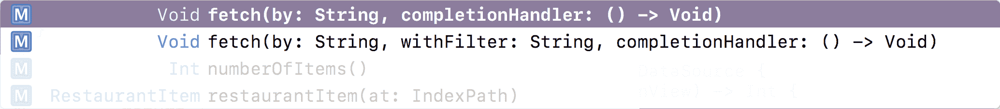

+   **部分 D**：在这里，我们从 JSON 文件中获取餐厅。

```
for restaurant in RestaurantAPIManager.loadJSON(file: location) {
   restaurants.append(RestaurantItem(dict: restaurant))
} 
```

+   **部分 E**：在这里，我们正在通过菜系过滤餐厅。由于我们的餐厅有多个菜系，我们必须检查每个菜系，这就是为什么我们使用 contains。

```
if withFilter != "All" {
   items = restaurants.filter({ $0.cuisines.contains(withFilter) })
}
else { items = restaurants }
```

+   **部分 F**：这是用来告诉我们的方法我们已经完成的。

```
completionHandler()
```

+   **部分 G**：这个方法告诉我们我们有多少个餐厅项目。

```
numberOfItems()
```

+   **部分 H**：这个方法允许我们获取位于索引位置的餐厅。

```
restaurantItem(at:)  
```

现在我们对餐厅数据管理器有了更深入的了解。我们已经编写了大量的代码，其中一些可能并不完全有意义，但只要你对基本概念有基本的理解，你就没问题。

现在我们需要获取显示在餐厅列表中的数据。在显示数据时，最常见的事情之一是如何处理没有数据时的 Table View 或 Collection View。我们正在执行的一些过滤可能不会返回任何结果，因此我们应该处理这两种情况。我们将在下一步中这样做。

# 处理无数据

想要创建一个可重用且具有可视表示的视图是很常见的，有两种常见的方法来做这件事；我们现在将采用第一种方法，而另一种方法将在本书的后面部分介绍。你可以创建一个带有**XIB**（发音为 zib 或 nib）的`UIView`。这是在 storyboards 之前创建元素的一种常见方法，至今仍然有效。现在让我们创建一个：

1.  右键点击`Misc`文件夹，选择新建组并命名为`No Data`。

1.  然后，右键点击`No Data`文件夹并创建一个新文件。

1.  在选择新文件模板的屏幕中，顶部选择 iOS。然后，选择 Cocoa Touch Class。点击下一步。

1.  在出现的选项屏幕中，添加以下内容：

新文件：

+   +   类：`NoDataView`

    +   子类：`UIView`

    +   语言：`Swift`

1.  点击下一步然后创建。

1.  接下来，再次右键点击`No Data`文件夹并创建一个新文件。

1.  在选择新文件模板的屏幕中，顶部选择**iOS**。然后，在用户界面下选择视图。点击下一步。

1.  将文件命名为`NoDataView`并点击创建。

1.  首先，打开`NoDataView.swift`文件，并将以下内容添加到该文件中：

```
class NoDataView: UIView {
    var view: UIView!
    @IBOutlet var lblTitle: UILabel!
    @IBOutlet var lblDesc: UILabel!

    override init(frame: CGRect) {
        super.init(frame: frame)
        setupView()
    }

    required init?(coder aDecoder: NSCoder) {
        super.init(coder: aDecoder)!
        setupView()
    }

    func loadViewFromNib() -> UIView {
        let nib = UINib(nibName: "NoDataView", bundle: Bundle.main)
        let view = nib.instantiate(withOwner: self, options: nil) [0] as! UIView
        return view
    }

    func setupView() {
        view = loadViewFromNib()
        view.frame = bounds
        view.autoresizingMask = [.flexibleWidth, .flexibleHeight]
        addSubview(view)
    }

    func set(title: String) {
        lblTitle.text = title
    }

    func set(desc: String) {
        lblDesc.text = desc
    }
}
```

我们需要两个`init`方法；只需简单地调用`setupView()`。`loadViewFromNib()`方法用于获取我们的 XIB 文件。我们的`setupView()`用于将 NIB 添加到`UIView()`。最后，我们有两个设置两个标签的方法。前四个方法是样板代码，每次你想使用 NIB（XIB）文件创建`UIView`时都会编写。接下来，让我们设置以下内容：

1.  打开`NoDataView.xib`。

1.  在大纲视图中选择文件所有者。然后，打开身份检查器并将类更新为`NoDataView`并按*Enter*。

1.  接下来，在对象库的过滤器字段中输入`label`。

1.  然后，将两个标签拖放到视图中。

1.  选择一个标签；然后，在属性检查器中更新以下值：

+   +   文本：将`标题放置于此`添加到文本下的空文本字段中

    +   颜色：`黑色`

    +   对齐：`居中`

    +   字体：`Avenir Next Condensed Bold 26`

1.  然后在大小检查器中更新以下值：

+   +   宽度：`355`

    +   高度：`36`

1.  选择一个标签；然后，在属性检查器中更新以下值：

+   +   文本：将`标题放置于此`添加到文本下的空文本字段中

    +   颜色：`黑色`

    +   对齐：`居中`

    +   字体：`Avenir Next Condensed Regular 17`

1.  然后在大小检查器中更新以下值：

+   +   宽度：`355`

    +   高度：`21`

1.  选择两个标签然后点击固定图标。输入高度值（应该被勾选）。

1.  现在同时选择两个标签，点击堆叠视图图标，或者你可以转到编辑器 | 嵌入 | 堆叠视图。

1.  在大纲视图中选择堆叠视图，然后选择固定图标。输入以下值：

+   +   右：`10`

    +   左：`` `10` ``

1.  然后，对齐图标。输入以下值：

+   +   在容器中水平放置：（应该被勾选）

    +   在容器中垂直放置：（应该被勾选）

1.  在大纲视图中选择文件所有者。

1.  然后，打开身份检查器并将`lblTitle`连接到显示`标题放置于此`的标签。

1.  将`lblDesc`连接到另一个标签。

当你完成时，你应该看到以下内容：

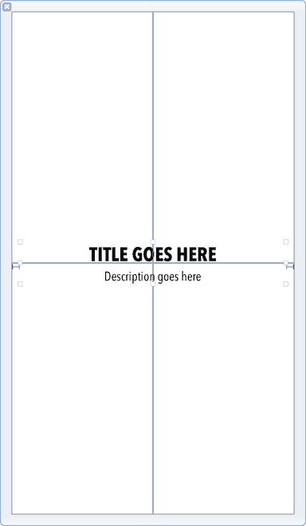

现在，让我们最终连接一切。打开`RestaurantViewController.swift`文件。

1.  在`selectedRestaurant`变量上方添加以下内容：

```
var manager = RestaurantDataManager()
```

1.  接下来，在`private`扩展内部添加以下方法：

```
func createData() {
    guard let location = selectedCity?.city, let filter = selectedType else { return }
    manager.fetch(by: location, with: filter) { _ in
        if manager.numberOfItems() > 0 {
            collectionView.backgroundView = nil
        }

        else {
            let view = NoDataView(frame: CGRect(x: 0, y: 0, width: collectionView.frame.width, height: collectionView.frame.height))
            view.set(title: "Restaurants")
            view.set(desc: "No restaurants found.")
            collectionView.backgroundView = view
        }

        collectionView.reloadData()
    }
}
```

此方法检查我们是否有选定的位置和过滤器。然后，我们运行我们之前创建的获取方法。如果有项目，我们确保我们的背景视图是`nil`。如果没有，我们将创建我们的`NoDataView`并设置它显示`没有餐厅找到`。最后，我们重新加载集合视图。

1.  接下来，让我们通过添加以下内容来更新`-collectionView:cellForItemAtIndexPath:`：

```
func collectionView(_ collectionView: UICollectionView, cellForItemAt indexPath: IndexPath) -> UICollectionViewCell {
    let cell = collectionView.dequeueReusableCell(withReuseIdentifier: "restaurantCell", for: indexPath) as! RestaurantCell
    let item = manager.restaurantItem(at: indexPath)
    if let name = item.name { cell.lblTitle.text = name }
    if let cuisine = item.subtitle { cell.lblCuisine.text = cuisine }
    if let image = item.imageURL {
        if let url = URL(string: image) {
            let data = try? Data(contentsOf: url)
            if let imageData = data {
                DispatchQueue.main.async {
                    cell.imgRestaurant.image = UIImage(data: imageData)
                }
            }
        }
    }
    return cell
}
```

在这里，我们只是将数据传递到我们的单元格中。我们显示标题、菜系和图片。

1.  最后，将`-collectionView:numberOfItemsInSection:`更新为以下内容：

```
func collectionView(_ collectionView: UICollectionView, numberOfItemsInSection section: Int) -> Int {
    return manager.numberOfItems()
}
```

1.  构建并运行项目，你现在应该看到以下内容，无论是带数据还是不带：

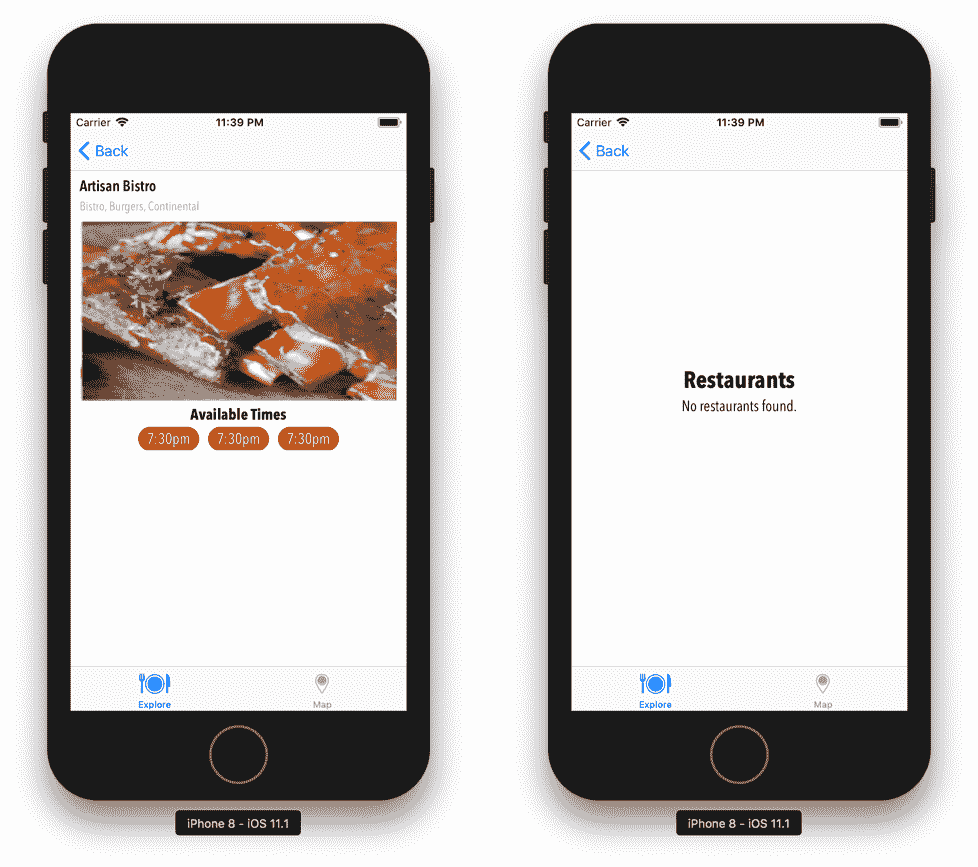

在我们结束之前，让我们再添加一个功能。当你选择一个位置时，让我们使用新的 iOS 11 大标题在这个视图中显示它。将以下内容添加到`createData()`下的私有扩展中：

```
func setupTitle() {
    navigationController?.setNavigationBarHidden(false, animated: false)
    if let city = selectedCity?.city, let state = selectedCity?.state {
        title = "\(city.uppercased()), \(state.uppercased())"
    }
    navigationController?.navigationBar.prefersLargeTitles = true
}
```

然后，在`viewDidAppear()`方法中调用`setupTitle()`之后，再次构建并运行项目，你现在应该能看到选定的城市。当你滚动时，大标题将出现在标题视图中：

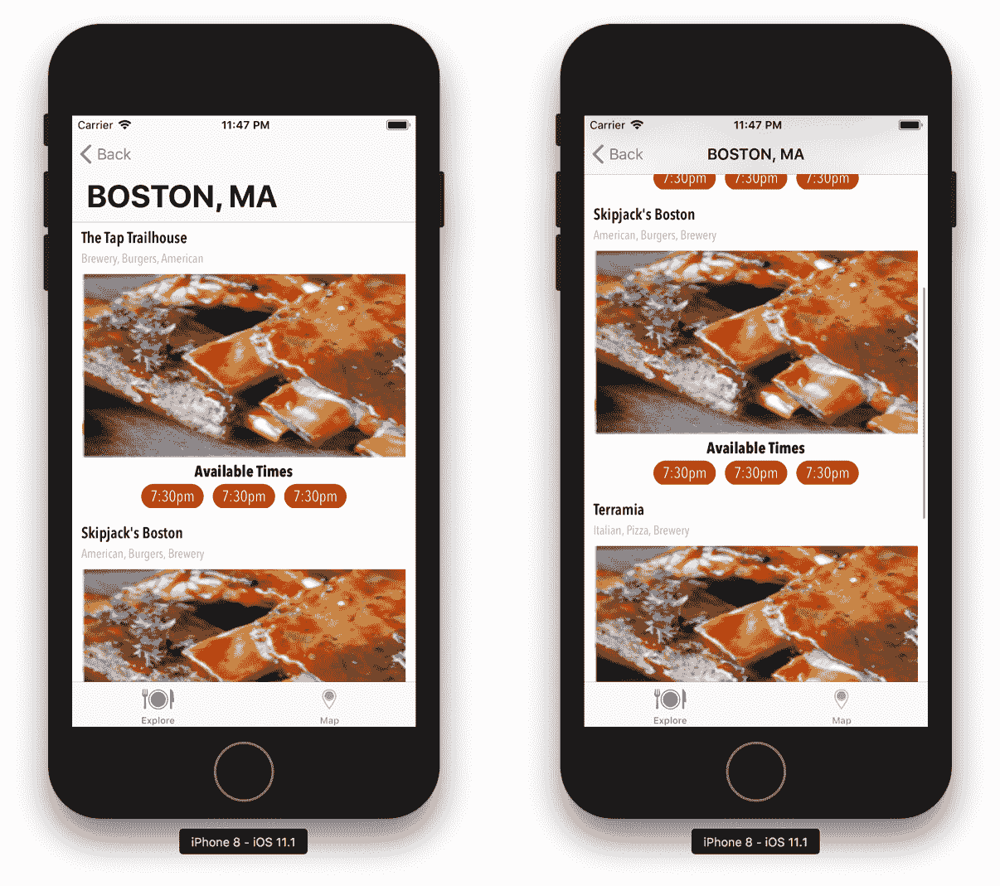

我们已经完成了这一章；做得好。我们做了很多，但你应该开始看到这个应用逐渐变得生动起来。

# 摘要

好吧，我们终于让数据在我们的应用中工作起来了。我们没有使用服务，但如果需要，添加它并不困难。使用本地 JSON 文件与使用 API 数据源相同。你应该对执行任一操作都感到自信。我喜欢做的一件事是，当我知道数据源的样子，但不想立即编写那部分代码时，我会创建静态的 JSON 文件来模拟数据源，并使用这些文件进行工作。这让我能够专注于将应用带到需要的状态，而不会因为 API 数据层而受阻。

在本章中，我们学习了什么是 JSON 以及如何使用该 JSON 数据源为我们的应用制作数据。我们还探讨了如何通过 segues 传递数据。最后，我们探讨了扩展以及它们在清理和组织代码方面的有用性。

在下一章中，我们将探讨如何显示更多数据。
