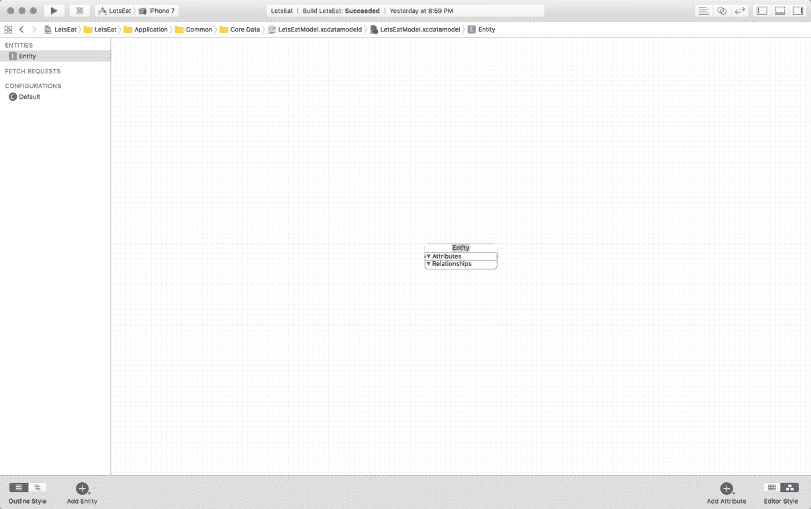

# 第二十一章：理解 Core Data

我们的应用程序进展顺利，我们即将完成它。在前一章中，我们创建了一个餐厅评论表单，即创建评论表单（Create Review form），它允许我们拍照或使用相册中的照片。我们可以对照片应用滤镜，甚至可以通过更新我们的 plist 文件快速添加更多滤镜。

在本章中，我们将完成创建评论表单（Create Review form）的工作。我们使表单完全工作，可以将表单中输入的数据保存到所谓的 Core Data 中。Core Data 是一个框架，它使用所谓的 **对象关系映射（Object-Relational Mapping，ORM**）来处理持久化数据。在本章中，我们将更深入地探讨 Core Data 是什么以及如何使用它。

在本章中，我们将涵盖以下主题：

+   什么是 Core Data？

+   `NSManagedObjectModel`、`NSManagedObjectContext` 和 `NSPersistentStoreCoordinator` 是什么？

+   创建我们的第一个 Core Data 模型

# 什么是 Core Data？

让我们从直接引用苹果公司的一句话开始：<q>"Core Data 是一个用于管理和持久化对象图（object graph）的框架。"</q> 苹果公司并没有将 Core Data 称作数据库，尽管在 iOS 中，它实际上是将数据保存到 SQLite 文件中。对于编程新手或来自不同编程语言背景的人来说，Core Data 非常难以解释。然而，在 iOS 10 中，Core Data 的使用已经大大简化了。对 Core Data 的功能和它的工作原理有一个一般性的理解，就足以满足我们在本书中的需求。

当使用 Core Data 框架时，你应该熟悉 **管理对象模型（managed object model**）、管理对象上下文以及 **持久化存储协调器（persistent store coordinator**）。让我们通过一个图表来更好地理解它们之间的交互：


+   `NSManagedObjectModel`：管理对象模型代表你的 Core Data 应用程序的数据模型。管理对象模型与你在应用中创建的所有数据模型（也称为实体）交互。该模型以任何数据模型中可能存在的关系而闻名。管理对象模型与你的数据模型以及持久化存储协调器交互。

    实体（Entities）只是代表你的数据的对象。在我们的应用中，由于我们将要保存餐厅的评论，我们需要创建一个评论实体。

+   `NSManagedObjectContext`：管理对象上下文（managed object context）管理从持久化存储协调器接收到的模型对象集合。管理对象上下文负责创建、读取、更新和删除模型。上下文是你与之交互最多的部分。

+   `NSPersistentStoreCoordinator`：持久化存储协调器有一个对托管对象模型和托管对象上下文的引用。持久化存储协调器与持久化对象存储进行通信。持久化存储协调器与对象图交互。这个图是您创建实体并在应用内设置关系的地点。

Core Data 不是一个容易的主题，所以你不需要担心更详细的细节。你越使用 Core Data，它就越容易理解。在本章中，专注于获得高级理解，其余的将会逐渐明了。

在 iOS 10 之前，您必须创建以下每个实例：托管对象模型、托管对象上下文和持久化存储协调器。现在，在 iOS 10 中，这些已经被合并为所谓的 `NSPersistentContainer`。我们稍后会介绍这个，但首先，我们需要创建我们的数据模型。

# 创建数据模型

数据模型是您创建应用模型对象及其属性的地方。对于我们的项目，我们只需要创建一个模型对象，称为 **Review**。现在让我们创建一个托管对象模型：

1.  在导航器面板中，右键点击 `Misc` 文件夹并创建一个新的组，命名为 `Core Data`。

1.  接下来，右键点击这个新的 `Core Data` 文件夹，然后点击新建文件。

1.  在选择新文件模板的屏幕上，顶部选择 iOS，然后向下滚动到 Core Data 部分，并选择数据模型。然后，点击下一步：


1.  将文件命名为 `LetsEatModel` 并点击创建。

1.  在出现的屏幕上点击添加实体：


然后，在新屏幕的右下角，将编辑样式更改为图形样式：


在图形样式下，双击图中中间的实体来更改我们的实体名称：



1.  将文本更新为 Review 并按 *Enter*。

1.  现在我们已经创建了第一个实体，让我们添加第一个属性。选择我们的 Review 实体，然后点击屏幕右下角的添加属性按钮。属性这个词位于屏幕中间的框中的属性部分：


1.  你可以看到 Xcode 给你了一个错误。错误的原因是我们创建了一个属性，但没有给它指定类型。现在让我们来做这个。

1.  选择属性这个词并打开你的工具面板。你只看到三个图标：文件检查器、快速帮助检查器和数据模型检查器。

1.  选择最后一个图标，即数据模型检查器，然后在属性部分，点击属性类型下拉菜单，将其从未定义更改为字符串。错误应该现在消失了。

1.  接下来，在数据模型检查器中的属性部分，将名称从属性更改为名称并按 *Enter*。

您的第一个属性现在应该看起来如下：


我们在图形样式下创建了第一个属性，现在需要设置其余的属性，我们在表格样式下进行此操作：

1.  将编辑器样式切换到表格样式，然后点击添加属性：

1.  将属性更新为日期类型并设置其数据类型为 Date。对于此属性，您在数据模型检查器中无需执行任何操作。

1.  接下来，在表格样式屏幕下的属性部分选择我们刚刚添加的两个属性旁边的+按钮。

1.  将此第三个属性更新为`customerReview`并设置其数据类型为 String。

1.  接下来，添加一个名为 rating 的第四个属性，其数据类型为 Float。

1.  现在，添加一个名为`restaurantID`的第五个属性，其数据类型为 Integer 32。

1.  当我们保存评论时，我们会将它们与它们的`restaurantID`一起保存。每次我们访问餐厅详情页面时，我们都会获取该特定餐厅的所有评论，然后显示它们。如果没有评论，则显示默认消息。

1.  最后，添加一个名为`uuid`的第六个属性，其数据类型为 String，并在数据模型检查器中的属性下取消选择可选复选框。此属性是每个评论的唯一 ID。

您的 Attributes 表现在应该看起来如下：


现在我们已经设置了属性，在开始编写代码之前，我们还需要做一些其他事情。

# 实体自动生成

我们可以让 Xcode 为我们的 Review 实体创建文件；然而，如果我们想添加更多属性，我们就必须生成更多代码。Core Data 为我们提供了自动生成代码的能力。为了利用此功能：

1.  在左侧面板的实体列表中，选择我们唯一的实体，即 Review。

1.  在您选择实体后，在实用工具面板中选择数据模型检查器。您应该注意到，当我们在属性上工作时，您的数据模型检查器面板已经发生了变化。


1.  现在，按 cmd + *B*构建项目。这将创建我们在 Core Data 中创建的 Review 类。您可能看不到文件，但它已经被创建。

我们现在需要创建另一个名为`RestaurantPhoto`的实体。

# 餐厅照片实体

使用与上一节相同的步骤，创建一个具有以下值的照片实体：


现在，按*cmd* + *B*构建项目；这将创建我们在 Core Data 中创建的`Photo`类。

我们不能直接在 Core Data 中存储图片，因为它们必须先转换为数据。因此，我们将用于评论的图片转换为二进制数据以便 Core Data 保存。然后，当我们从 Core Data 中提取评论时，我们将其转换回图片以显示。

为了学习，我们在 Core Data 中存储图像。我会尽量避免这样做，因为图像可能很大，你很快就会填满用户的存储空间。如果你使用的是信息流，你可以保存图像的 URL 路径而不是实际的图像。如果用户不在线，你只需在它的位置显示一个占位符即可。

# 审查条目

当我们需要从 Core Data 中检索项目时，我们得到这个新的`Review`类。我们不再传递`Review`类，而是创建一个通用的数据对象，我们可以用它来代替。

当我处理存储的数据时，我通常喜欢有两个模型对象：一个用于存储数据，另一个是通用的。在过去，传递 Core Data 对象引起了很多技术问题。这些问题在 iOS 10 中得到了解决；然而，出于过度谨慎，我通常从 Core Data 获取项目，然后将这些对象转换为结构体。

现在让我们创建这个文件：

1.  右键点击`Review Form`文件夹并选择新建文件。

1.  在“选择新文件模板”的屏幕上，顶部选择 iOS，然后选择 Swift File。然后点击下一步。

1.  将此文件命名为`ReviewItem`并点击创建。

1.  将你的文件更新为以下内容：

```
import UIKit
struct ReviewItem {
   var rating:Float?
   var name:String?
   var customerReview:String?
   var date:NSDate?
   var restaurantID:Int?
   var uuid = UUID().uuidString
   var displayDate:String {
          let formatter = DateFormatter()
          formatter.dateFormat = "MMMM dd, yyyy"
          return formatter.string(from: self.date as! Date)
   }
}

extension ReviewItem {
   init(data:Review) {
         self.date = data.date
         self.customerReview = data.customerReview
         self.name = data.name
         self.restaurantID = Int(data.restaurantID)
         self.rating = data.rating
         if let uuid = data.uuid { self.uuid = uuid }
   }
}
```

这个文件没有做任何特别的事情，只是使用一个变量来处理日期。

这个文件中的扩展允许我们将从 Core Data 中获取的`Review`映射到`ReviewItem`。我们的自定义`init()`方法允许我们只需将`Review`对象传递到`init`参数中。

我们需要为我们要保存的照片创建另一个条目。这个文件与`ReviewItem`具有相同的基本结构。现在让我们创建这个文件：

1.  右键点击`Controllers`创建一个名为`Photo Reviews`的新组。

1.  右键点击`Photo Filter`文件夹并选择新建文件。

1.  在“选择新文件模板”的屏幕上，顶部选择 iOS，然后选择 Swift File。然后点击下一步。

1.  将此文件命名为`RestaurantPhotoItem`并点击创建。

1.  将你的文件更新为以下内容：

```
struct RestaurantPhotoItem {
   var photo:UIImage?
   var date:NSDate?
   var restaurantID:Int?
   var uuid = UUID().uuidString
   var photoData:NSData {
         guard let image = photo else {
               return NSData()
         }
         return NSData(data: UIImagePNGRepresentation(image)!)
   }
}
extension RestaurantPhotoItem {
   init(data:RestaurantPhoto) {
         self.date = data.date
         self.restaurantID = Int(data.restaurantID)
         self.photo = UIImage(data:photo as Data, scale:1.0)
         if let uuid = data.uuid { self.uuid = uuid }
   }
}
```

这个文件的前一部分与我们为审查条目所做的是一样的，只是`photoData`变量。由于我们无法直接将图像存储到 Core Data 中，我们需要将其转换为二进制数据。`photoData`变量为我们处理了这个问题，并在我们保存项目时只需传递`photoData`到 Core Data 就更容易了。

现在我们有了`ReviewItem`和`RestaurantPhotoItem`，我们需要设置我们的管理器。

# Core Data 管理器

正如我们在整本书中所做的那样，我们将创建一个`Manager`类。这个类将负责从 Core Data 中获取和输出数据。让我们开始吧：

1.  在`Common`文件夹中的`Core Data`文件夹上右键点击并选择新建文件。

1.  在“选择新文件模板”的屏幕上，顶部选择 iOS，然后选择 Cocoa Touch Class。然后点击下一步。

1.  在出现的选项屏幕中，添加以下内容：

新文件：

+   +   类：`CoreDataManager`

    +   子类：`NSObject`

    +   也创建 XIB：未勾选

    +   语言：`Swift`

1.  点击下一步然后创建。

当文件打开时，在您的 `import UIKit` 下方添加以下内容：

```
import CoreData
```

这个导入使我们能够访问 Core Data 库。接下来，在类定义内部，添加以下内容：

```
let container:NSPersistentContainer
```

这个常量是一个 `NSPersistentContainer`，它为我们提供了 Core Data 栈中所需的一切。正如我们之前讨论的，`NSPersistentContainer` 由三部分组成；一个持久化存储协调器、一个托管对象上下文和一个托管对象模型。

您可能已经注意到添加此变量后出现了一个错误。错误的原因是我们没有创建一个 `init()` 方法。

让我们在刚刚添加的常量之后添加这个 `init()` 方法：

```
override init() {
   container = NSPersistentContainer(name: "LetsEatModel")
   container.loadPersistentStores { (storeDesc, error) in
         guard error == nil else {
               print(error?.localizedDescription as Any)
               return
         }
   }
   super.init()
}
```

此代码初始化容器并获取我们之前创建的托管对象模型。现在模型能够看到我们所有的实体及其属性。

我们的 `CoreDataManager` 需要为我们做两件事。我们需要能够添加新的 `ReviewItem` 并获取它。当我们保存餐厅评论时，我们希望能够与餐厅一起保存评论。由于我们可以简单地使用 `restaurantID`，我们不需要保存所有餐厅信息。当我们查看餐厅详情时，我们可以通过 `restaurantID` 在 Core Data 中检查特定餐厅的任何评论。让我们在 `init()` 方法之后添加以下方法来完成这项任务：

```
func fetchReviews(by identifier:Int) -> [ReviewItem] {
    let moc = container.viewContext
    let request:NSFetchRequest<Review> = Review.fetchRequest()
    let predicate = NSPredicate(format: "restaurantID = %i", Int32(identifier))
    var items:[ReviewItem] = []
    request.sortDescriptors = [
      NSSortDescriptor(key: "date", ascending: false)]
    request.predicate = predicate
    do {
        for data in try moc.fetch(request) {
            items.append(ReviewItem(data: data))
        }
        return items
    } catch {
        fatalError("Failed to fetch reviews: \(error)")
    }
}
```

让我们回顾一下这段代码。我们的 `fetchReviews(by:)` 方法接受一个 ID，并使用它来查找特定餐厅的评论。

```
let moc = container.viewContext
let request:NSFetchRequest<Review> = Review.fetchRequest()
let predicate = NSPredicate(format: "restaurantID = %i", Int32(identifier))
```

在第一行，我们创建了一个 **托管对象上下文**（**moc**）的实例。这个变量允许我们与 Core Data 交互。在下一行，我们创建了一个获取请求。这个请求传递给托管对象上下文，并告诉它我们需要什么。最后，我们创建了一个谓词，这允许我们应用一些搜索参数。具体来说，我们正在说我们想要每个具有我们传递的 ID 的 `ReviewItem`。

```
request.sortDescriptors = [NSSortDescriptor(key: "date", ascending: false)]
request.predicate = predicate
```

在这里，我们正在对我们的请求应用一个排序描述符。我们不是以随机顺序获取评论，而是按日期对所有评论进行排序。

```
do {
   for data in try moc.fetch(request) {
         items.append(ReviewItem(data: data))
   }
   return items
} catch {
   fatalError("Failed to fetch reviews: \(error)")
}
```

最后，我们将一切包裹在 `do...catch` 块中。当搜索发生时，它返回一个 `ReviewItems` 数组，如果没有 `ReviewItems`，则返回一个空数组。如果您的设置有问题，则会收到一个致命错误。当获取完成时，我们遍历项目并创建我们的 `ReviewItems`。

在这里，我们正在对我们的请求应用一个排序描述符。我们不是以随机顺序获取评论，而是按日期对所有评论进行排序。

我们已经添加了获取评论的方法；我们需要为获取照片做同样的事情。在 `fetchReviews(identifier:)` 方法之后添加以下内容：

```
func fetchPhotos(by identifier:Int) -> [RestaurantPhotoItem] {
    let moc = container.viewContext
    let request:NSFetchRequest<Review> = RestaurantPhoto.fetchRequest()
    let predicate = NSPredicate(format: "restaurantID = %i", Int32(identifier))
    var items:[RestaurantPhotoItem] = []
    request.sortDescriptors = [NSSortDescriptor(key: "date", ascending: false)]
    request.predicate = predicate
    do {
        for data in try moc.fetch(request) {
            items.append(ReviewItem(data: data))
        }
        return items
    } catch {
       fatalError("Failed to fetch photos: \(error)")
    }
}
```

与我们获取评论项所做的一切相同，只是我们现在正在获取 `RestaurantPhoto` 项。现在我们需要添加一个方法将我们的数据保存到 Core Data 中。让我们在 `init()` 方法之后添加以下两个方法：

```
func addReview(_ item:ReviewItem) {
   let review = Review(context: container.viewContext)
   review.name = item.name
   review.date = NSDate()
   if let rating = item.rating { review.rating = rating }
   review.customerReview = item.customerReview
   review.uuid = item.uuid

   if let id = item.restaurantID {
         review.restaurantID = Int32(id)
         print("restaurant id \(id)")
           save()
   }
}

func addPhoto(_ item:RestarauntPhotoItem) {
   let photo = RestarauntPhoto(context: container.viewContext)
   photo.date = NSDate()
   photo.photo = item.photoData
   photo.uuid = item.uuid

   if let id = item.restaurantID {
         photo.restaurantID = Int32(id)
         print("restaurant id \(id)")
           save()
   }
}
```

你会得到一个错误，因为我们还没有创建 `save()` 方法。现在忽略它，因为它将在稍后创建。

这个 `addReview()` 方法接受一个 `ReviewItem` 参数。我们将 `ReviewItem` 转换为 `Review`，然后调用 `save()` 方法。

现在，让我们在刚刚创建的 `addReview()` 方法之后添加 `save()` 方法：

```
fileprivate func save() {
   do {
         if container.viewContext.hasChanges {
               try container.viewContext.save()
         }
   }
   catch let error {
         print(error.localizedDescription)
   }
}
```

再次，我们将所有内容包裹在一个 `do...catch` 块中。在 `do` 块内部，我们检查托管对象上下文是否已更改。如果已更改，则调用 `save()` 方法。现在我们已经完成了我们的 Core Data 管理器。

接下来，我们需要创建另一个管理类。这个管理类负责调用 Core Data 管理器，类似于探索管理器中相应的管理器负责从 plist 中获取数据；这为我们获取照片和评论。现在让我们创建这个管理文件：

1.  右键点击 `Misc` 文件夹并选择新建文件。

1.  在选择新文件模板的屏幕上，顶部选择 iOS，然后选择 Cocoa Touch Class。然后点击下一步。

1.  在出现的选项屏幕中，添加以下内容：

新文件：

+   +   类：`ReviewDataManager`

    +   子类：`NSObject`

    +   也创建 XIB：未选中

    +   语言：`Swift`

1.  点击下一步然后创建。更新你的文件如下：

```
import Foundation
class ReviewDataManager: NSObject {
    private var reviewItems:[ReviewItem] = []
    private var photoItems:[RestaurantPhotoItem] = []
    let manager = CoreDataManager()
    func fetchReview(by restaurantID:Int) {
       if reviewItems.count > 0 { reviewItems.removeAll() }
       for data in manager.fetchReviews(by: restaurantID) {
            reviewItems.append(data)
       }
    }

    func fetchPhoto(by restaurantID:Int) {
        if photoItems.count > 0 { photoItems.removeAll() }
        for data in manager.fetchPhotos(by: restaurantID) {
            photoItems.append(data)
        }
    }

    func numberOfReviewItems() -> Int {
        return reviewItems.count
    }

    func numberOfPhotoItems() -> Int {
        return photoItems.count
    }

    func reviewItem(at index:IndexPath) -> ReviewItem {
        return reviewItems[index.item]
    }

```

```
    func photoItem(at index:IndexPath) -> RestaurantPhotoItem {
        return photoItems[index.item]
    }
}
```

这个管理类与我们迄今为止创建的其他管理类类似。在这个管理类中，我们的获取方法接受一个参数 ID。这个 ID 代表我们用来在 Core Data 中搜索 `ReviewItems` 的 `restaurantID`。如果我们找到任何 `ReviewItems`，我们将它们添加到我们的数组中。

# 摘要

在本章中，你学习了 Core Data 是什么以及如何使用它。我们还探讨了 `NSManagedObjectModel`、`NSManagedObjectContext` 和 `NSPersistentStoreCoordinator` 以及它们如何在 Core Data 内部协同工作。即使它们一开始都不太明白，而且第一次尝试时它们没有工作，那也没关系，因为最终会明白的。最后，我们创建了两个 Core Data 模型，一个用于评论，一个用于照片。

在下一章中，我们将实际保存我们创建的数据以及如何将其取回。我们将我们的评论和照片显示在我们的餐厅详情中。
