# 第二十五章：通知

通知首次于 2009 年推出，并成为 iOS 系统的基本功能。无论来自你最喜欢的应用还是短信，在使用智能手机的过程中，你肯定在某个时刻遇到过通知。在 iOS 10 之前，如果你需要在 iOS 中处理通知，你有两种类型的推送通知：远程（来自服务器）和本地。

iOS 10 对通知进行了更改，简化了它们，但同时也使它们更加健壮。在 iOS 10 中，现在有一个通知涵盖了远程和本地通知，这对于以前使用过它们的人来说是个好消息。就功能范围而言，通知现在允许你嵌入丰富的媒体内容（如图片、视频和音频），以及具有自定义 UI 内容。

在本章中，我们将学习如何创建基本通知，以及带有嵌入图片的通知。在查看这两个示例之后，我们还将探讨如何为我们的通知创建自定义 UI。

本章我们将涵盖的内容：

+   学习如何构建基本通知

+   学习如何在通知中嵌入图片

+   学习如何构建自定义通知 UI

# 从基础知识开始

让我们从让我们的应用发送基本通知开始。在我们的餐厅详情页中，有三个按钮（晚上 9:30、晚上 10:00 和晚上 10:30），目前它们没有任何功能。我们将更新这些按钮，以便当你点击其中一个按钮时，它会创建一个餐厅预订通知。如果这是一个真正的预订应用，我们希望存储这些预订。当预订日期和时间临近时，我们将向用户发布通知作为提醒。完成所有这些超出了本书的范围；因此，我们只关注创建餐厅预订通知。

# 获取权限

在我们可以发送任何通知之前，我们必须获得用户的许可。因此，打开`AppDelegate.swift`文件，并在`didFinishLaunchingWithOptions()`方法之后添加以下方法：

```
func checkNotifications() {
   UNUserNotificationCenter.current().requestAuthorization(options: [.alert, .sound, .b adge]) { (isGranted, error) in
   }
}
```

此方法检查用户的授权。如果尚未询问用户，它将向用户显示一条消息，请求使用通知的权限。当你添加此方法时，你会得到一个错误。这个错误的原因是我们需要`import UserNotifications`。在文件的顶部，在`import UIKit`下添加以下内容：

```
import UserNotifications
```

接下来，我们刚刚添加的方法需要在`applicationDidFinishLaunching(application:launchOptions)`方法内部运行。在`setupDefaultColors()`之后添加以下内容：

```
checkNotifications()
```

你的`applicationDidFinishLaunching(application:launchOptions)`方法现在应该看起来像以下这样：

```
func application(_ application: UIApplication, didFinishLaunchingWithOptions launchOptions: [UIApplicationLaunchOptionsKey: Any]?) -&gt; Bool {
   setupDefaultColors()
   checkNotifications()
   return true
}
```

通过点击播放按钮（或使用⌘ + *R*）构建并运行项目，你应该会看到以下消息：

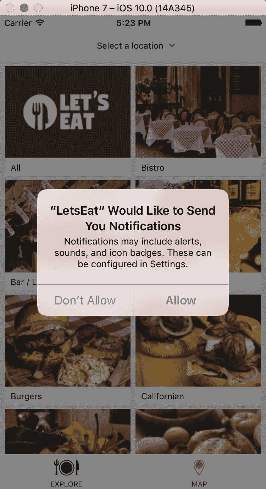

# 设置通知

现在我们已经获得了权限，我们需要设置通知。我们开始设置我们的按钮：

1.  打开`RestaurantDetailViewController.swift`文件，在我们的`showAllReviews()`方法之后和类文件最后一个大括号之前添加以下方法：

```
@IBAction func onTimeTapped(sender: UIButton) {
}
```

1.  保存文件，您会看到旁边出现一个空圆圈，这是新的`@IBAction`。

1.  现在，打开`RestaurantDetail.storyboard`并选择`RestaurantDetailViewController`。

1.  在实用工具面板中选择连接检查器，在`Received Actions`下，您可以看到`onTimeTappedWithSender`：

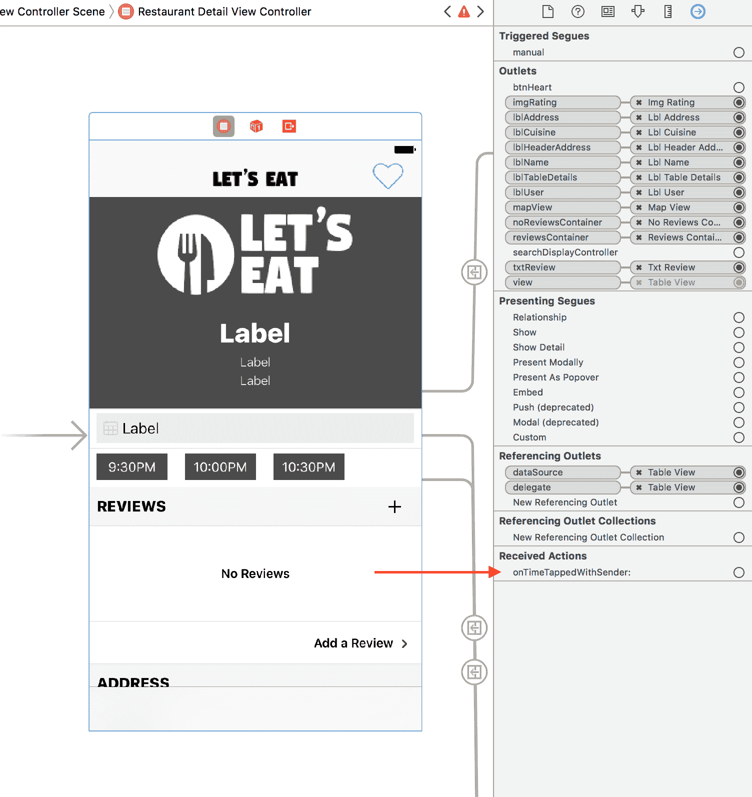

1.  从`onTimeTappedWithSender`旁边的空圆圈拖动到餐厅详情场景中第一个按钮（标记为晚上 9:30）。

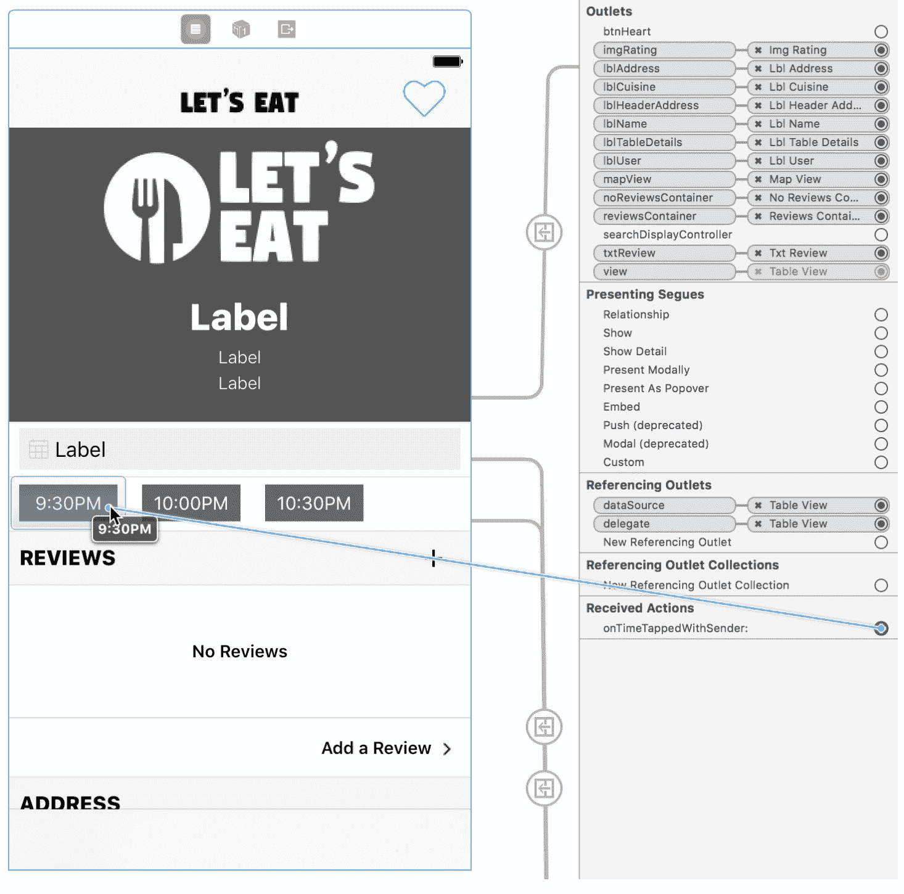

1.  在提示中，选择 Touch Up Inside。

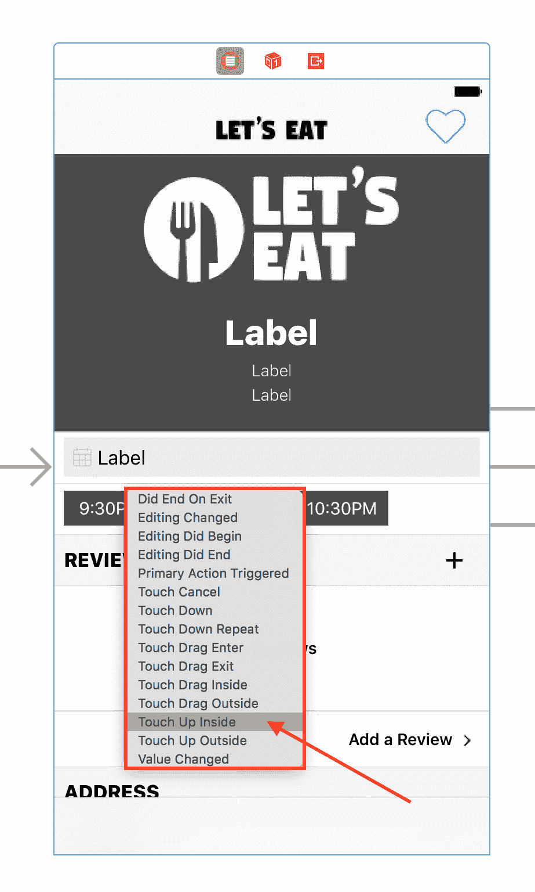

1.  重复这些步骤为剩余的两个按钮（晚上 10:00 和 10:30）操作，点击并拖动相同的圆圈（现在已填充）到场景中剩余的每个按钮，然后为每个随后的提示选择 Touch Up Inside。

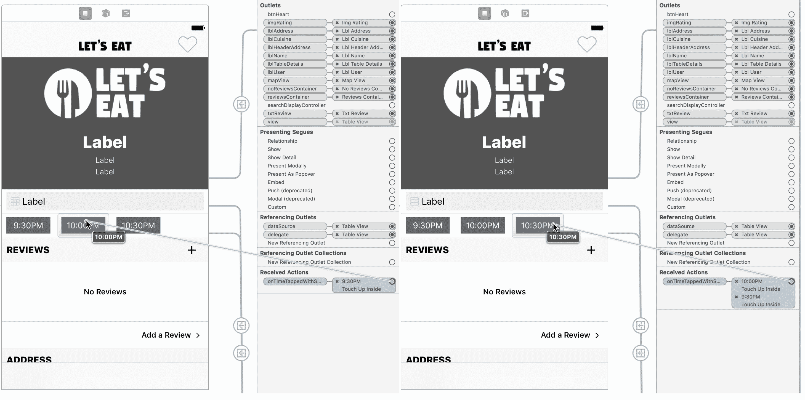

1.  现在，打开`RestaurantDetailViewController.swift`；这是我们从中获取按钮内部时间并将其传递给通知的地方。在`showAllReviews()`方法之后和`onTimeTapped()`方法之上添加以下方法：

```
func showNotification(sender:String?) {
   print(sender as Any)
}
```

1.  在`onTimeTapped()`方法内部添加以下内容：

```
showNotification(sender: sender.titleLabel?.text)
```

我们现在将时间值传递给我们的`showNotification()`方法。通过点击播放按钮（或使用⌘ + *R*）构建和运行项目。您现在应该在控制台中看到每个所选按钮的时间。

# 显示通知

现在我们有了时间，让我们显示与所选时间一起的通知：

1.  在`RestaurantDetailViewController.swift`文件中，在`import LetsEatDataKit`之后添加以下内容：

```
import UserNotifications
```

1.  接下来，在`showNotification()`方法内部添加以下内容：

```
let content = UNMutableNotificationContent()
if let name = selectedRestaurant?.name { content.title = name }
if let time = sender { content.body = "Table for 7, tonight at \(time) " }
content.subtitle = "Restaurant Reservation"
content.badge = 1
content.sound = UNNotificationSound.default()
let trigger = UNTimeIntervalNotificationTrigger(timeInterval: 5, repeats: false)
let identifier = "letsEatReservation"
let request = UNNotificationRequest(identifier: identifier, content: content, trigger: trigger)
UNUserNotificationCenter.current().add(request, withCompletionHandler: { error in
   // handle error
})
```

在前面的代码中，我们正在创建一个通知内容对象。在这个对象中，我们将设置标题、正文、副标题、徽章和声音。

1.  在`initialize()`方法之后添加以下方法：

```
func setupNotificationDefaults() {
   UNUserNotificationCenter.current().delegate = self
}
```

这是我们的通知`delegate`方法。由于我们尚未实现所需的函数，因此我们的`delegate`会有错误。

1.  让我们现在通过在文件末尾创建一个扩展来实现这一点，在最后一个大括号之后。如果您在第十一章的挑战中完成了任务，那么您可能已经在文件中为我们的地图有一个扩展；如果是这样，在该`Map`扩展的最后一个大括号之后添加此新扩展。在任何情况下，添加以下代码：

```
extension RestaurantDetailViewController: UNUserNotificationCenterDelegate {
   func userNotificationCenter(_ center: UNUserNotificationCenter, willPresent notification: UNNotification, withCompletionHandler completionHandler: @escaping (UNNotificationPresentationOptions) -&gt; Void) {
          completionHandler([.alert, .sound])
   }
}
```

1.  最后，我们只需在`initialize()`方法内部调用`setupNotificationDefaults()`方法。您的更新后的`initialize()`方法现在应如下所示：

```
func initialize() {
   setupLabels()
   setupMap()
   setupNotificationDefaults()
}
```

1.  通过点击播放按钮（或使用 ⌘ + *R*）构建并运行项目。打开餐厅详情页面，点击时间按钮，并等待五秒钟。你应该会看到以下内容：

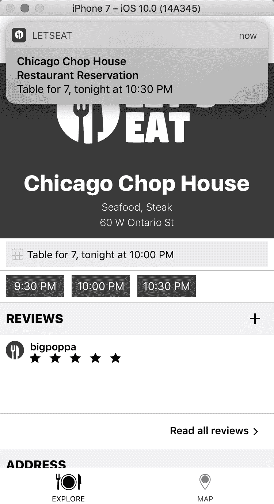

1.  然后，如果你点击并下拉通知，你应该会看到以下内容：

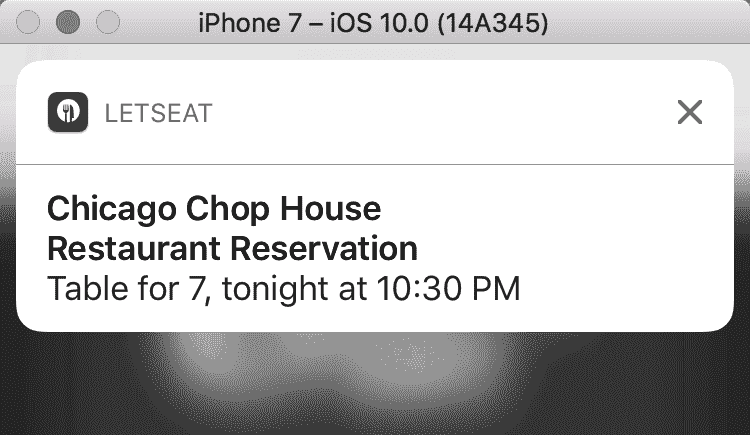

我们刚刚实现了一个基本的通知；然而，我们可以做更多的事情。接下来，让我们在通知中添加一张图片。

# 定制我们的通知

在我们能够嵌入图片之前，我们需要一个测试图片。在导航面板的 `Assets` 文件夹中创建一个新的组，命名为 `Images`。然后，在本书的项目文件夹中打开本章的 `asset` 文件夹，并将图片资源拖动到我们刚刚创建的 `Images` 文件夹中。

# 嵌入图片

接下来，让我们嵌入我们的图片。首先，回到 `RestaurantDetailViewController.swift` 文件，在创建的 `showNotification()` 方法中，移除以下代码：

```
let trigger = UNTimeIntervalNotificationTrigger(timeInterval: 5, repeats: false)
let identifier = "letsEatReservation"
let request = UNNotificationRequest(identifier: identifier, content: content, trigger: trigger)
UNUserNotificationCenter.current().add(request, withCompletionHandler: { error in
   // handle error
})
```

将删除的代码部分替换为以下代码：

```
do {
   let url = Bundle.main.url(forResource: "sample-restaurant-img@3x", withExtension: "png")
   if let imgURL = url {
          let attachment = try UNNotificationAttachment(identifier: "letsEatReservation", url: imgURL, options: nil)
          content.attachments = [attachment]
          let trigger = UNTimeIntervalNotificationTrigger(timeInterval: 5, repeats: false)
          let identifier = "letsEatReservation"
          let request = UNNotificationRequest(identifier: identifier, content: content, trigger: trigger)
          UNUserNotificationCenter.current().add(request, withCompletionHandler: { error in
                 // handle error
          })
   }
}
catch {
   print("there was an error with the notification")
}
```

在这个 `do...catch` 语句中，我们从我们的项目中获取图片 URL 并创建一个附件。我们将丰富的媒体（这里是一个图片）附加到通知上。其余的代码是我们移除并重新添加到 `do...catch` 中的代码。

通过点击播放按钮（或使用 ⌘ + *R*）构建并重新运行项目。当你到达餐厅详情页面时，点击时间按钮并等待五秒钟。你现在应该会在通知中看到一个缩略图图片：

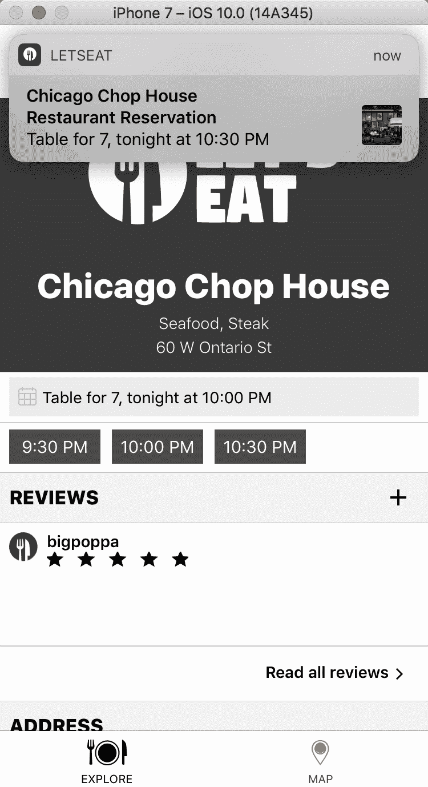

另外，如果你点击并下拉通知，你应该会看到以下内容：

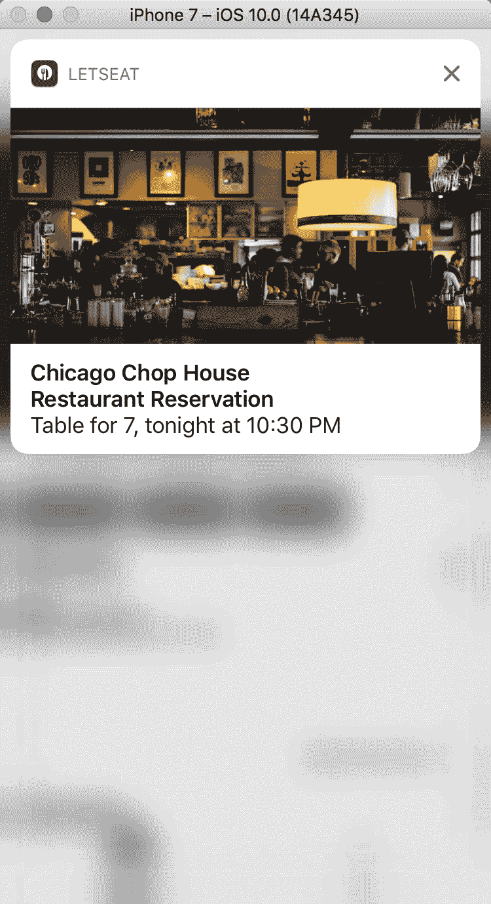

到目前为止，我们一直在应用内部接收通知。如果你想在外部应用测试通知，请执行以下步骤。通过点击播放按钮（或使用 ⌘ + *R*）构建并运行项目。当你到达餐厅详情页面时，点击时间按钮，然后立即按 ⌘ + *Shift* + *H*。这将你从应用中移除，然后你会看到以下内容：

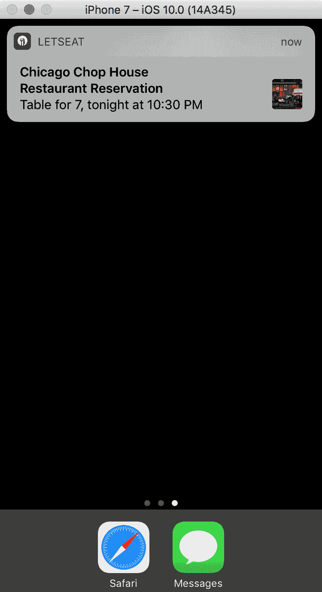

如果你点击并下拉通知，你会看到以下内容：

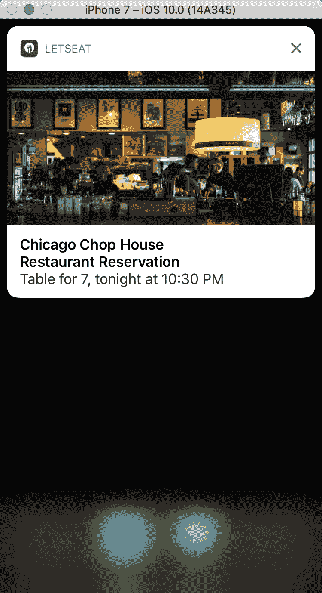

我们的通知看起来不错，但你实际上无法对它们做任何事情。例如，确认预订时使用是或否会很好。我们需要为通知添加一些按钮来实现这一点。

# 添加按钮

我们只需要添加一些东西来给通知添加按钮。首先，我们需要更新我们的餐厅详情：

1.  在 `RestaurantDetailViewController.swift` 文件中，在 `content.sound = UNNotificationSound.default()` 之后添加以下内容：

```
content.categoryIdentifier = "reservationCategory"
```

1.  接下来，我们需要创建一个用于按钮标识符的文件。在 `Common` 文件夹内的 `Misc` 文件夹上右键点击，并选择新建文件。

1.  在创建新文件的选择模板屏幕中，选择顶部的 iOS，然后选择 Swift 文件。然后点击下一步。

1.  将此文件命名为`Identifier`并点击创建。

最好是将你应用中的字符串尽可能多地消除。添加此文件不仅会消除字符串，而且还能防止你意外输入错误的值。例如，我们很容易拼错标识符。因此，将其放在`enum`中是一个保护措施。将以下内容添加到新文件中的`import`语句：

```
enum Identifier:String {
   case reservationCategory
   case reservationIdentifier = "letsEatReservation"
}
enum Option:String {
   case one = "optionOne"
   case two = "optionTwo"
}
```

我们将使用这个来创建我们的通知按钮选项。打开`AppDelegate.swift`文件。在`checkNotifications()`方法中，添加以下代码：

```
let optionOne = UNNotificationAction(identifier: Option.one.rawValue, title: "Yes", options: [.foreground])
let optionTwo = UNNotificationAction(identifier: Option.two.rawValue, title: "No", options: [.foreground])
let category = UNNotificationCategory(identifier: Identifier.reservationCategory.rawValue, actions: [optionOne, optionTwo], intentIdentifiers: [], options: [])
UNUserNotificationCenter.current().setNotificationCategories([category])
```

在`requestAuthorization`块内部添加此代码：


在此代码中，我们设置了两个动作：一个用于是，一个用于否。我们创建了一个类别并将其设置为我们的通知类别，该类别定义了我们想要使用的通知类型。

最后，我们需要编写代码来处理接收到通知的情况。返回到`RestaurantDetailViewController.swift`文件，并在`willPresent()`方法之后添加以下内容到你的新通知扩展中：

```
func userNotificationCenter(_ center: UNUserNotificationCenter, didReceive response: UNNotificationResponse, withCompletionHandler completionHandler: @escaping () -&gt; Void) {
   if let identifier = Option(rawValue: response.actionIdentifier) {
          switch identifier {
          case .one :
                 print("User selected yes")
          case .two:
                 print("User selected no")
          }
   }
   completionHandler()
}
```

通过点击播放按钮（或使用⌘ + *R*）构建并运行项目。当你收到通知并下拉时，你会看到你现在有了按钮选项：


在我们的`didReceive()`方法内部，我们正在打印用户选择的内容，但你可以选择任何你想要的`print`语句。

到目前为止，我们已经探讨了如何创建基本的通知以及包含嵌入图像的通知。接下来，我们可以通过将我们的自定义 UI 添加到通知中，将我们的应用提升到一个新的层次。

# 通知中的自定义 UI

要为我们的通知添加自定义 UI，我们需要添加一个扩展。让我们通过以下步骤开始：

1.  在导航器面板中，选择项目导航器，然后选择你的项目。

1.  在目标区域底部，点击加号按钮。

1.  在应用程序扩展下选择通知内容扩展，然后点击下一步：


1.  在出现的选项屏幕中，将产品名称设置为`LetsEatContentExtension`并点击完成：

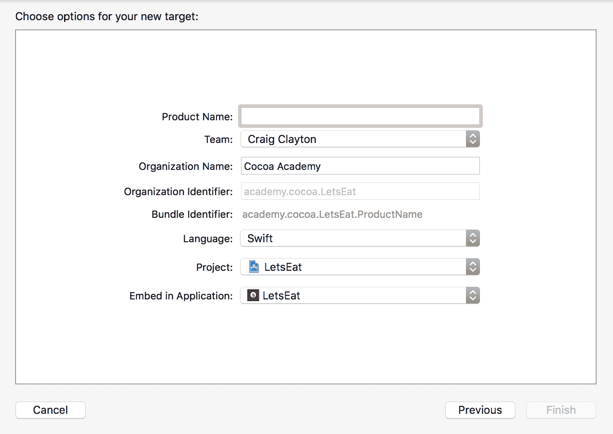

1.  接下来，在出现的屏幕上选择激活：

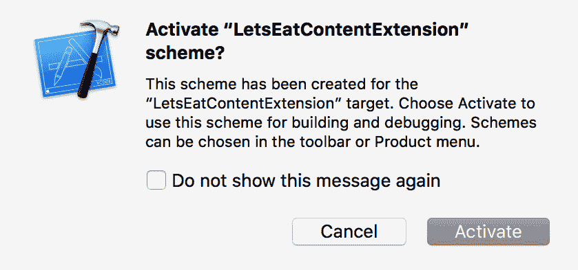

此激活允许我们在模拟器中构建和运行我们的自定义 UI 扩展。现在，你可以选择运行我们的应用、*iMessages*应用、我们的工具包或我们的自定义 UI 扩展。

现在我们已经创建了扩展，我们需要能够使用它。

1.  打开`LetsEatContentExtension`文件夹中的`info.plist`文件。

1.  点击`NSExtension`展开箭头以打开该键。

1.  然后，点击展开箭头以打开`NSExtensionAttributes`，其中你可以看到`UNNotificationExtensionCategory`：

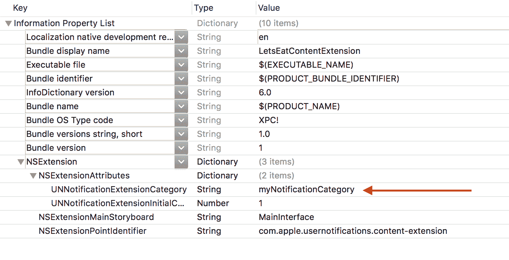

这个类别是我们之前设置的通知类别名称。

1.  将`myNotificationCategory`更新为`reservationCategory`。

保存文件，并将目标切换回`Let's Eat`应用。通过点击播放按钮（或使用⌘ + *R*）来构建和运行项目。这次，我们不再看到自定义图像，而是有以下内容：

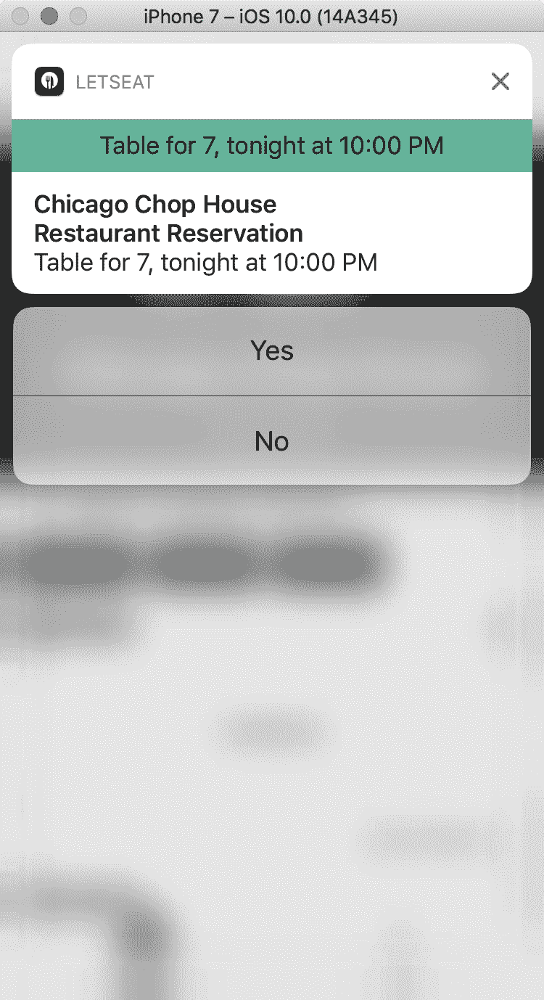

当你下拉通知时，你可能注意到了一些小问题。通知一开始很大，然后缩小。在你的`Info.plist`文件中，有一个属性`UNNotificationExtensionInitialContentSizeRatio`，目前设置为`1`。将其更改为`0.25`可以使这个问题不那么明显。

目前，这个自定义通知同时显示了自定义内容和默认内容。我们可以通过回到`LetsEatContentExtension`内部的`Info.plist`来修复这个问题：

在`NSExtensionAttributes`内部，添加一个名为`UNNotificationExtensionDefaultContentHidden`的新项，并将类型设置为布尔值，值设为 YES：

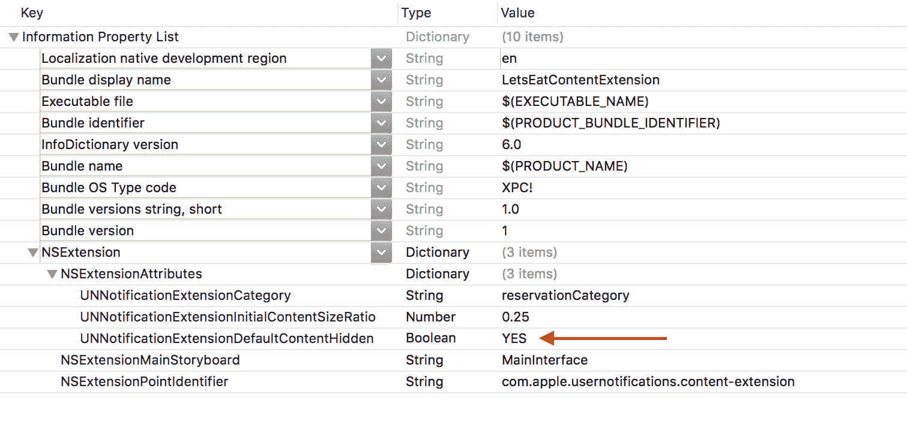

保存文件，通过点击播放按钮（或使用⌘ + *R*）来构建和运行项目。一旦你下拉通知，你会看到默认内容被隐藏：

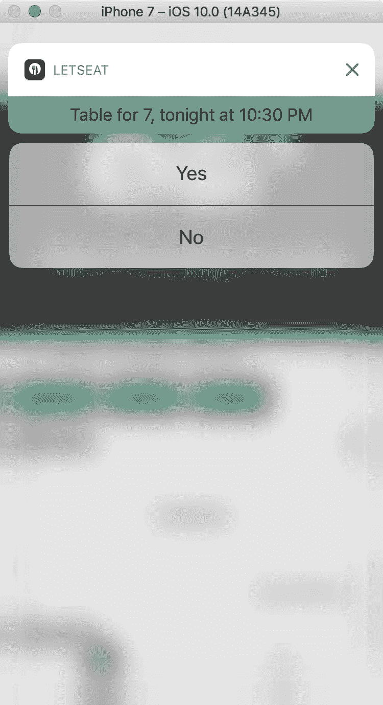

你现在可以更新`LetsEatContentExtension`文件夹内的`MainInterface.storyboard`。在这本书中，我们不会这样做，因为我们已经做了很多故事板设计，这给了你一个机会来练习你在本书中学到的知识，为这个应用创建一个自定义界面。

# 摘要

iOS 10 中的通知现在更加强大，真正地给了你用很少的工作就能创建丰富自定义内容的能力。在本章中，我们学习了如何构建基本的通知，然后通过在通知中添加嵌入图像来进一步提升。最后，我们简要地了解了如何通过扩展添加自定义通知。

在下一章中，我们将讨论如何将 3D Touch 集成到我们的应用中。3D Touch 允许用户通过快捷方式跳入我们的应用。
