# 第二十六章：只看一眼

在 2015 年，当 iPhone 6S 和 6S Plus 发布时，苹果也引入了 3D Touch。3D Touch 使用带有触觉反馈的 Taptic Engine，这使得设备能够感知触摸的压力，从而触发特定操作。例如，用力按图标将使我们能够快速打开操作菜单。

本章将涵盖以下主题：

+   添加 3D Touch 快捷操作

+   理解静态和动态快捷操作之间的区别

+   在集合视图中添加 3D Touch 支持

我们将为我们的应用做的第一件事是为应用图标添加快捷方式。

# 添加 3D Touch 快捷操作

对于我们的应用，我们将添加四个快捷方式（这是你可以拥有的最大数量）。这些操作将执行以下操作：

+   启动地图

+   启动位置

+   选择洛杉矶作为位置

+   选择拉斯维加斯作为位置

有两种类型的快捷方式：静态和动态。静态意味着它们不能被更改，而动态意味着它们可以被更改。例如，苹果在他们的*消息*应用中使用了 3D Touch。如果你在*消息*应用上用力按下，你会看到一个静态快捷方式，新建消息，以及三个动态快捷方式，即三个最常短信的联系人。在我们的应用中，我们将有两个静态快捷方式，启动地图标签和位置列表，以及两个动态快捷方式，启动洛杉矶和拉斯维加斯作为位置。让我们开始设置我们的快捷方式：

1.  右键点击`Misc`文件夹并选择新建文件。

1.  在选择新文件模板的屏幕上，顶部选择 iOS，然后选择 Swift 文件。然后，点击下一步。

1.  将此文件命名为 Shortcut 并点击创建。

在此文件中，在`import`语句之后添加以下`enum`：

```
enum Shortcut: String {
      case openMap
      case openLocations
      case openLosAngeles
      case openLasVegas

      init?(with identifier: String) {
            guard let shortIdentifier = identifier.components(separatedBy: ".").last else { return nil }
            self.init(rawValue: shortIdentifier)
      }

      var type: String {
            guard let identifier = Bundle.main.bundleIdentifier else { return "" }
            return identifier + ".\(self.rawValue)"
      }
}
```

这个`enum`用于我们的快速操作。正如我们讨论的，我们将为我们的应用提供四个快速操作。

1.  现在，打开你的`AppDelegate.swift`文件。在`window`变量之后，添加以下内容：

```
var launchedShortcutItem: UIApplicationShortcutItem?
static let applicationShortcutUserInfoIconKey = "applicationShortcutUserInfoIconKey"
```

这里，我们有一个用于快捷方式项的变量和一个用于用户信息键的常量。当应用程序启动时，我们需要检查应用程序是否是通过快捷方式启动的。

接下来，我们需要创建一个处理我们快捷方式的方法。在`checkNotifications()`方法之后添加以下内容：


现在，让我们分解我们的代码并查看每个部分：

+   **A 部分**：这里是检查快捷方式项的地方。如果我们有一个快捷方式项，那么这个`if...let`语句内部的其余代码将执行：

```
if let shortcutItem = launchOptions?[UIApplicationLaunchOptionsKey.shortcutItem] as? UIApplicationShortcutItem
```

+   **B 部分**：这是我们第一个动态快捷方式。这将设置当前选定的位置为洛杉矶。我们还将在此处设置图标图像为我们的图像资源中的一个自定义图像：

```
let laShortcut = UIMutableApplicationShortcutItem(type: Shortcut.openLosAngeles.type, localizedTitle: "Los Angeles", localizedSubtitle: "", icon: UIApplicationShortcutIcon(templateImageName: "shortcut-city"), userInfo:nil)
```

+   **C 部分**：这是我们第二个动态快捷方式。这将设置当前选定的位置为拉斯维加斯。我们还将在此处设置图标图像为我们的图像资源中的一个自定义图像：

```
let lvShortcut = UIMutableApplicationShortcutItem(type: Shortcut.openLasVegas.type, localizedTitle: "Las Vegas", localizedSubtitle: "", icon: UIApplicationShortcutIcon(templateImageName: "shortcut-city"), userInfo: nil)
```

+   **部分 D**：最后，当我们完成时，我们将返回`true`或`false`。如果没有选择快捷方式图标，将发送`true`，如果选择了快捷方式图标，将发送`false`：

```
return isPerformingAdditionalDelegateHandling
```

现在我们已经创建了方法，让我们更新`didFinishLaunchingWithOptions`中的返回值。将当前的`true`值更新为以下内容：

```
return checkShortCut(application, launchOptions: launchOptions)
```

接下来，我们需要为我们的应用添加一些更多的方法来处理快捷方式。让我们添加一个处理任何选中的快捷链接的方法。在`checkShortCut()`方法之后添加以下方法：

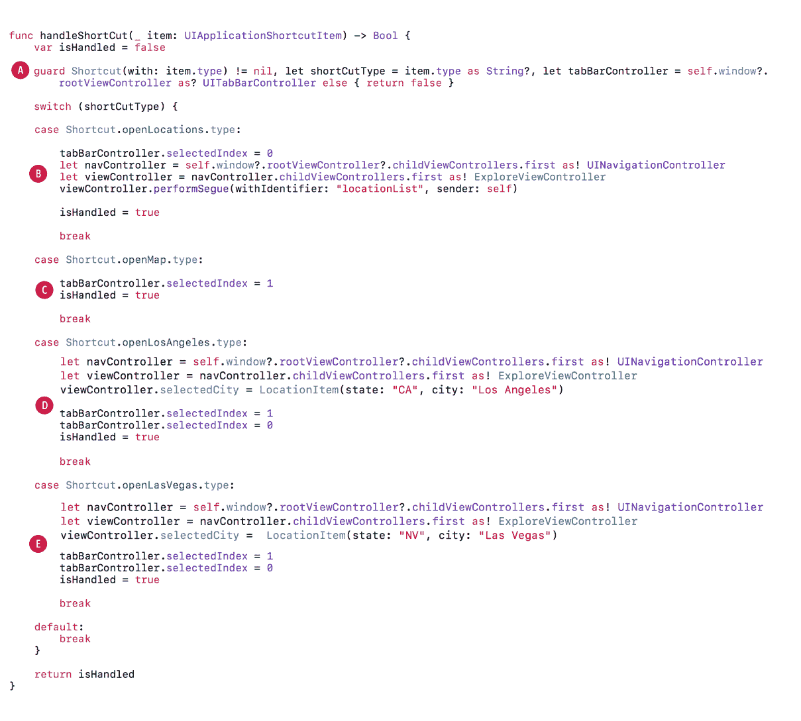

让我们分解这段代码，以便你更好地理解代码的不同部分：

+   **部分 A**：在这里，我们确保有一个快捷项、快捷类型和标签栏控制器。如果我们没有这些中的任何一项，我们将返回`false`并且不会继续进行：

```
guard Shortcut(with: item.type) != nil, let shortCutType = item.type as String?, let tabBarController = self.window?.rootViewController as? UITabBarController else { return false }
```

+   **部分 B**：这个快捷方式将允许我们启动带有洛杉矶已选择的探索视图。我们正在设置标签栏控制器的选中索引，然后使用`performSegue`来启用模态窗口出现：

```
tabBarController.selectedIndex = 0
let navController = self.window?.rootViewController?.childViewControllers.first as! UINavigationController
let viewController = navController.childViewControllers.first as! ExploreViewController
viewController.performSegue(withIdentifier: "locationList", sender: self)
```

+   **部分 C**：这个快捷方式将允许我们直接跳转到地图标签页：

```
tabBarController.selectedIndex = 1
isHandled = true
```

+   **部分 D**：这个快捷方式将允许我们启动带有洛杉矶已选择的探索视图：

```
let navController = self.window?.rootViewController?.childViewControllers.first as! UINavigationController
let viewController = navController.childViewControllers.first as! ExploreViewController
viewController.selectedCity = LocationItem(state: "CA", city: "Los Angeles")

tabBarController.selectedIndex = 1
tabBarController.selectedIndex = 0
isHandled = true
```

+   **部分 E**：这个快捷方式将允许我们启动带有拉斯维加斯已选择的探索视图。

```
let navController = self.window?.rootViewController?.childViewControllers.first as! UINavigationController
let viewController = navController.childViewControllers.first as! ExploreViewController
viewController.selectedCity = LocationItem(state: "NV", city: "Las Vegas")

tabBarController.selectedIndex = 1
tabBarController.selectedIndex = 0
isHandled = true
```

现在我们有一个处理任何快捷链接的方法，在`applicationWillTerminate()`方法之后添加以下方法：

```
func application(_ application: UIApplication, performActionFor shortcutItem: UIApplicationShortcutItem, completionHandler: @escaping (Bool) -> Void) {
   let handledShortCutItem = handleShortCut(shortcutItem)
   completionHandler(handledShortCutItem)
}
```

每当执行快捷方式操作时，都会调用此方法。

最后，我们需要添加代码来检查应用何时变为活动状态。找到`applicationDidBecomeActive()`方法，并在大括号内添加以下代码：

```
guard let item = launchedShortcutItem else { return }
_ = handleShortCut(item)

launchedShortcutItem = nil
if (application.applicationIconBadgeNumber != 0) {
  application.applicationIconBadgeNumber = 0
}
```

在这里，我们处理任何快捷方式操作。同时，我们检查徽章图标是否设置为除`0`以外的数字，如果是，我们将它重置为`0`。

如果你一直在跟踪，你会看到我们至今只添加了两个项——我们的动态项。我们还需要添加我们的静态项；然而，这些实际上将被添加到你的`Info.plist`中。

在导航面板的`Assets`文件夹中打开`Info.plist`。将鼠标悬停在`Privacy - Camera Usage Description`上，然后点击+按钮添加键`UIApplicationShortcutItems`。将类型设置为数组：

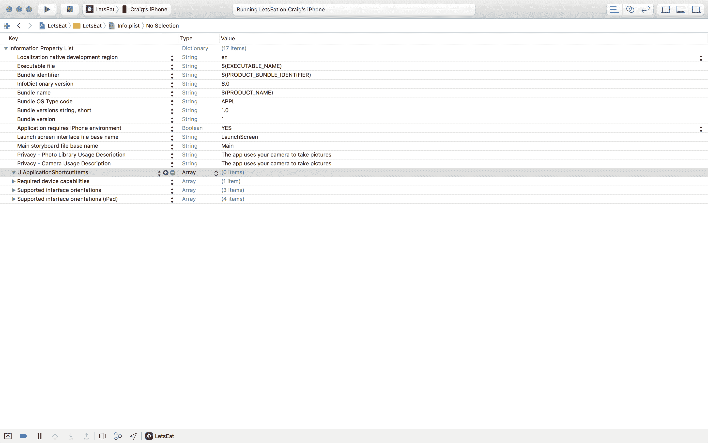

接下来，将鼠标悬停在`UIApplicationShortcutItems`上，然后点击+按钮向此数组添加一个项。将类型更改为字典：

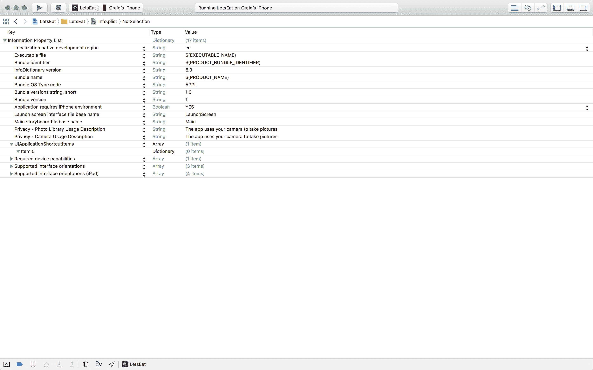

将鼠标悬停在项目 0 上，然后点击+按钮三次以添加三个字符串。给这三个键以下名称：

```
UIApplicationShortcutItemIconFile
UIApplicationShortcutItemTitle
UIApplicationShortcutItemType
```

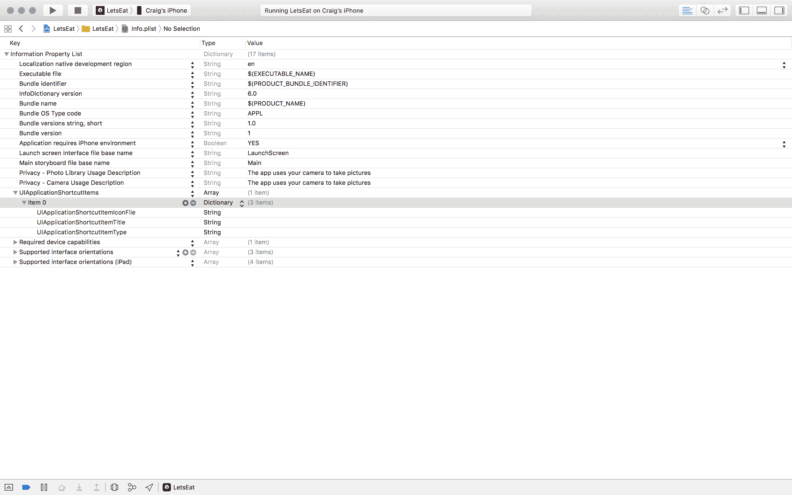

现在，复制项目 0（⌘ + *C*）并将其粘贴到`UIApplicationShortcutItems`中。你现在应该有项目 0 和项目 1，每个都有相同的三个字符串：

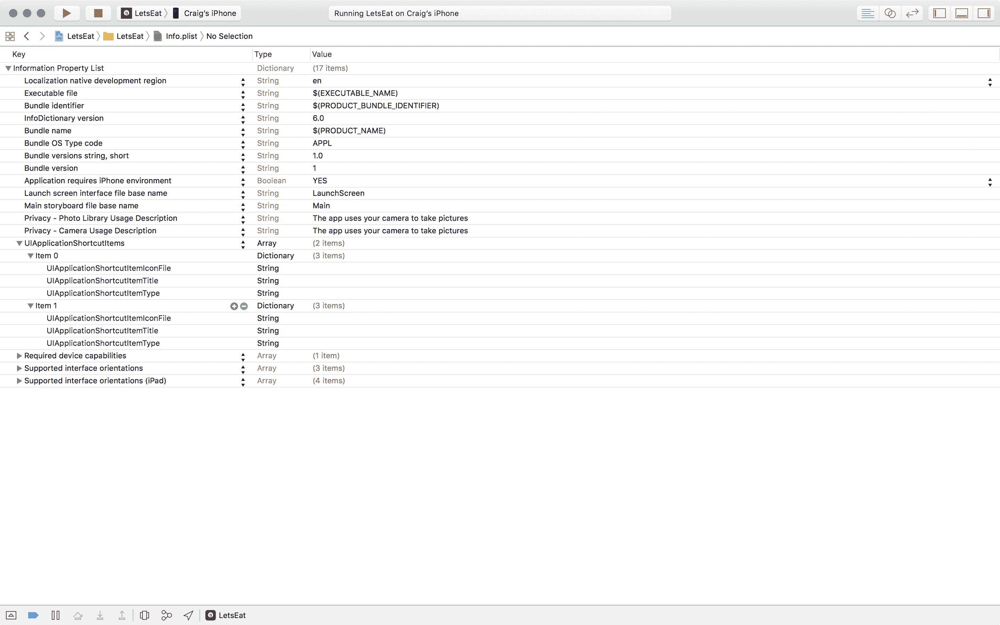

接下来，将它们的值设置为以下内容，用于项目 0：

+   UIApplicationShortcutItemIconFile: `shortcut-map`

+   UIApplicationShortcutItemTitle: `地图`

+   UIApplicationShortcutItemType: `$(PRODUCTBUNDLEIDENTIFIER).openMap`

对于项目 1，设置其值如下：

+   UIApplicationShortcutItemIconFile: `shortcut-location`

+   UIApplicationShortcutItemTitle: `位置`

+   UIApplicationShortcutItemType: `$(PRODUCTBUNDLEIDENTIFIER).openLocations`

当您完成时，您的文件应如下所示：


保存您的文件，并在您的设备上构建和运行项目。如果您有一台带有 Force Touch 鼠标的 MacBook 或 MacBook Pro，您可以在模拟器中运行此操作。

如果您正在构建手机，您可能会遇到错误。这些错误发生是因为您尚未为手机构建框架。只需切换到框架，然后按⌘ + *B*，然后切换到您的*iMessages*应用并重复相同的操作。然后，在您的设备上构建和运行项目。

一旦您的应用启动，在模拟器中按⌘ + *H*（如果您在模拟器中）或按设备上的主页按钮。3D Touch“Let's Eat”应用图标，您现在应该看到以下内容：

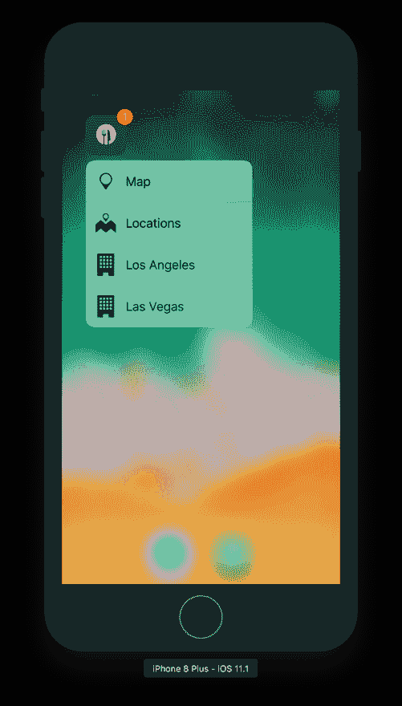

如果您选择洛杉矶或拉斯维加斯，您会看到位置现在已为您设置在顶部。如果您选择地图快捷方式，您将被带到地图标签页。如果您选择位置快捷方式，您将被带到位置列表。我们现在已为我们的应用添加了 3D Touch 快速操作。让我们将 3D Touch 添加到另一个地方。

# 添加收藏

我们应用的一个不错特性是使用 3D Touch 允许用户将收藏添加到我们的餐厅列表视图中。我们已经在餐厅详情页中有了心形图标。因此，让我们将 3D Touch 添加到心形图标以添加收藏。这是我们完成后的样子：

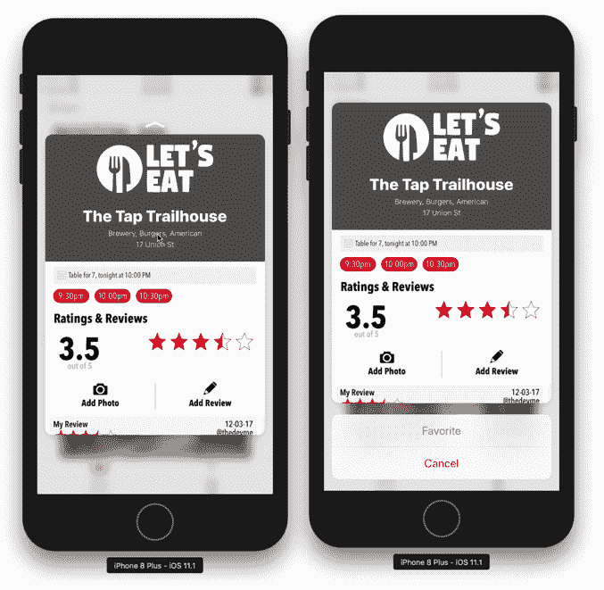

我们需要做的第一件事是添加一个新的模型对象，以便我们可以将我们的餐厅收藏保存到 Core Data。

# 创建新的模型对象

让我们看看如何创建一个新的模型对象：

1.  在导航器面板中，打开位于`Common`文件夹中“Core Data”文件夹内的`LetsEatModel.xcdatamodel`文件。

1.  确保您已选择了“图形样式”：

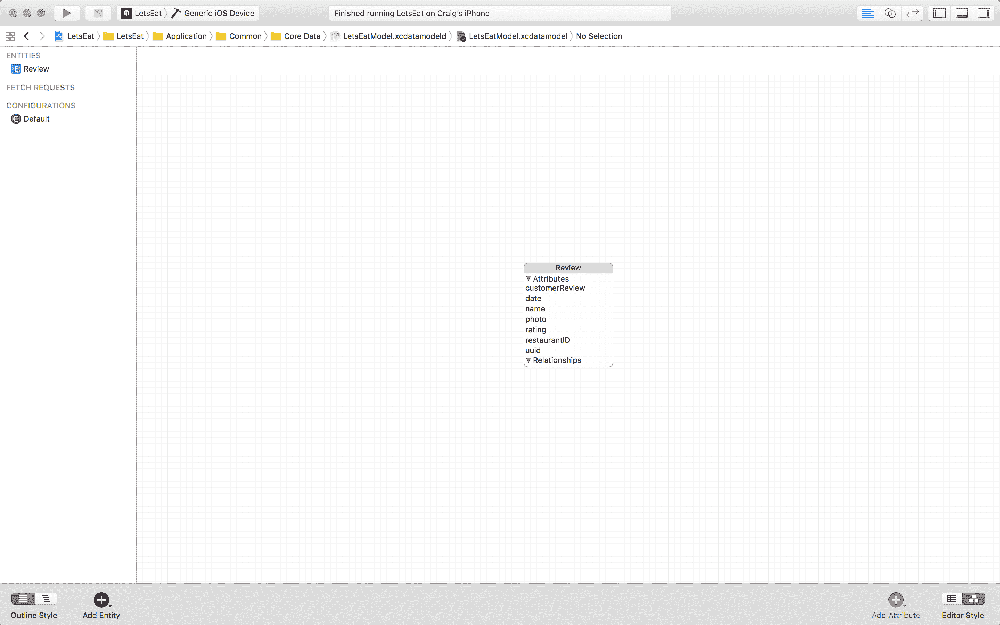

1.  点击“+”按钮以添加实体，然后双击“实体”，并将其更新为“收藏”：

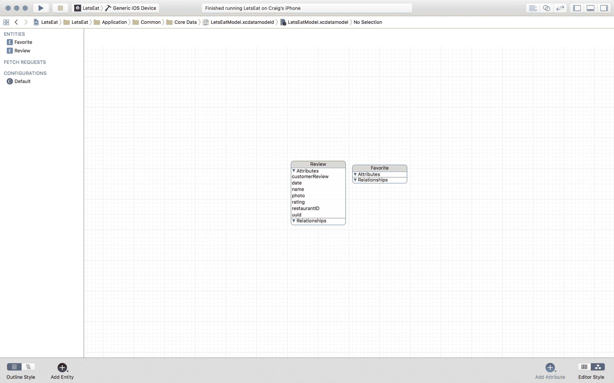

1.  接下来，确保选择了“收藏”实体，然后点击“+”按钮以添加属性：

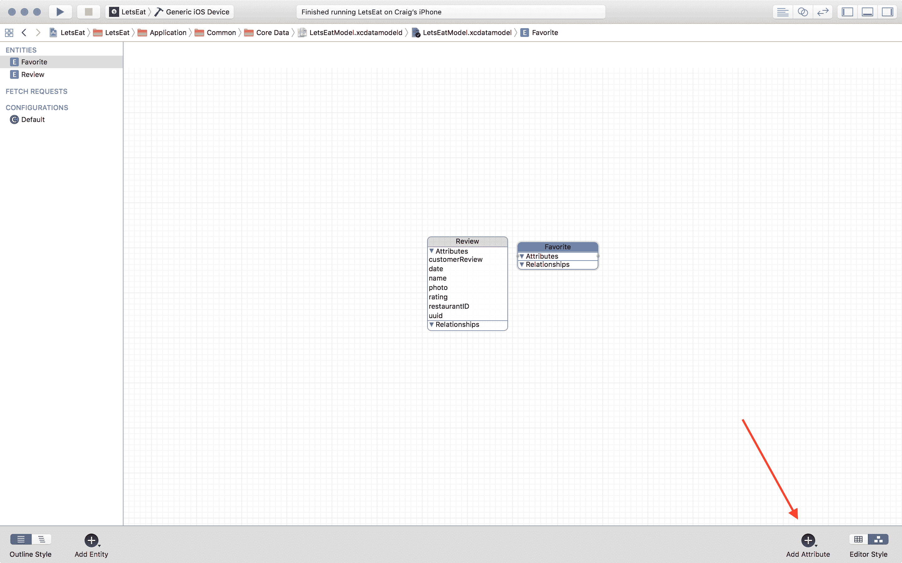

1.  在屏幕中央的框中，在“属性”下，您现在应该看到单词“属性”。双击“属性”并将其更改为`restaurantID`：

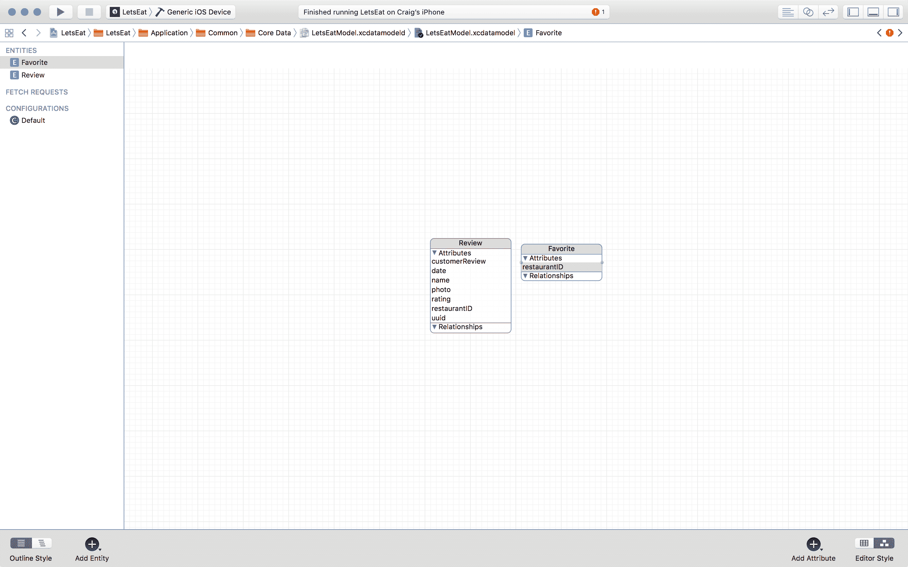

1.  接下来，再次选择“收藏”实体，然后在实用工具面板中选择数据模型检查器。

1.  在“类”下，更新以下内容：

+   +   名称: `收藏`

    +   Codegen: `类定义`

    +   约束：`restaurantID`（通过在约束中点击 + 按钮添加此约束，然后用这个新约束替换自动填充的默认约束）

你的实体设置现在应该看起来像以下这样：

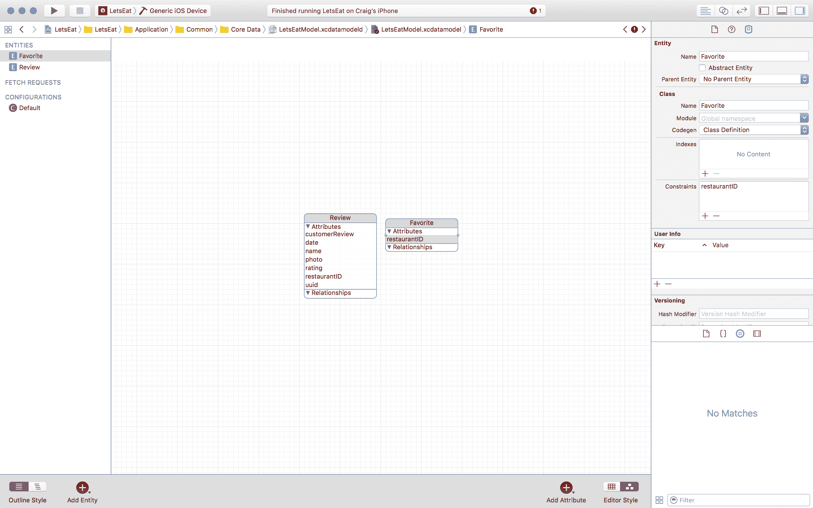

1.  最后，选择 `restaurantID` 属性，并在实用工具面板中的数据模型检查器下，选择整数 32 作为属性类型。关于此属性的错误现在应该消失了：


现在，使用 ⌘ + *B* 构建项目。这将创建我们在 Core Data 中创建的 `Favorite` 类。你不会在任何地方看到这个文件，但它已经被创建了。

# 更新我们的 Core Data 管理器

现在我们已经创建了我们的收藏实体，我们需要更新我们的 Core Data 管理器，以便实际上将餐厅保存为收藏。在 `CoreData-Manager.swift` 文件中，在最后一个花括号之前添加以下代码：

```
func addFavorite(by restaurantID:Int) {
   let item = Favorite(context: container.viewContext)
   item.restaurantID = Int32(restaurantID)

   save()
}
```

此方法创建一个 `Favorite` 对象，然后调用 `save()` 方法。

现在，让我们通过在最后一个花括号之前添加以下代码来向此文件添加一个额外的函数：

```
func isFavorite(with identifier:Int) -> Bool {
   let moc = container.viewContext
   let request:NSFetchRequest<Favorite> = Favorite.fetchRequest()
   let predicate = NSPredicate(format: "restaurantID = %i", Int32(identifier))
   request.predicate = predicate

   do {
         let count = try moc.count(for: request)
         if count == 0 { return false }
         else { return true }
   } catch {
         fatalError("Failed to fetch reviews: \(error)")
   }
}
```

在这个方法中，我们将通过传递一个 `restaurantID` 来获取一个收藏餐厅。该方法将检查 Core Data，如果我们得到数据，那么这个餐厅将被设置为收藏。如果没有数据返回，我们返回 `false`。我们现在可以保存收藏餐厅了。

接下来，打开 `RestaurantViewController.swift` 文件，并在为我们的 Collection View 创建的扩展之后定义一个新的扩展，添加以下代码：

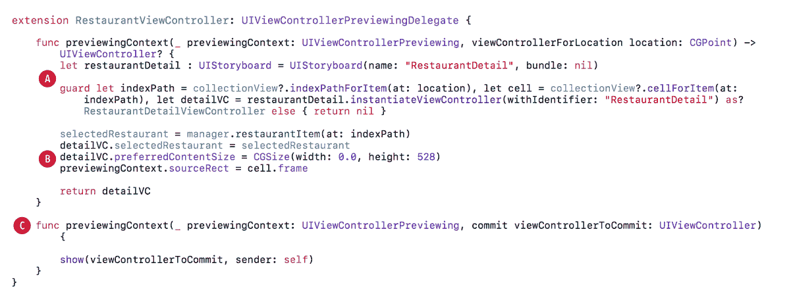

让我们讨论我们刚刚添加的内容：

+   **部分 A**：首先，我们获取我们的 `RestaurantDetail.storyboard` 的实例。然后，我们获取当前的索引路径。一旦我们有了索引路径，我们就检查我们有一个单元格。最后，我们创建一个 `RestaurantDetailViewController` 的实例：

```
let restaurantDetail : UIStoryboard = UIStoryboard(name: "RestaurantDetail", bundle: nil)
guard let indexPath = collectionView?.indexPathForItem(at: location), let cell = collectionView?.cellForItem(at: indexPath), let detailVC = restaurantDetail.instantiateViewController(withIdentifier: "RestaurantDetail") as? RestaurantDetailViewController else { return nil }
```

+   **部分 B**：在这里，我们设置了我们的 `selectedRestaurant`，然后，我们将 `selectedRestaurant` 传递到详细视图。然后，我们设置我们想要的高度，并将单元格框架传递到预览上下文中：

```
selectedRestaurant = manager.restaurantItem(at: indexPath)
detailVC.selectedRestaurant = selectedRestaurant
detailVC.preferredContentSize = CGSize(width: 0.0, height: 450)
previewingContext.sourceRect = cell.frame
```

+   **部分 C**：此方法被调用是为了我们可以准备视图控制器的展示，在这里是提交视图控制器。在我们的案例中，我们正在准备要显示（或弹出）的 `RestaurantDetailViewController`：

```
func previewingContext(_ previewingContext: UIViewControllerPreviewing, commit viewControllerToCommit: UIViewController) {   
   show(viewControllerToCommit, sender: self)
}
```

接下来，打开 `RestaurantDetail.storyboard` 并选择 `RestaurantDetailViewController`。在实用工具面板中打开身份检查器，并在身份下的故事板 ID 中添加 `RestaurantDetail`。

然后，按 *Enter*：

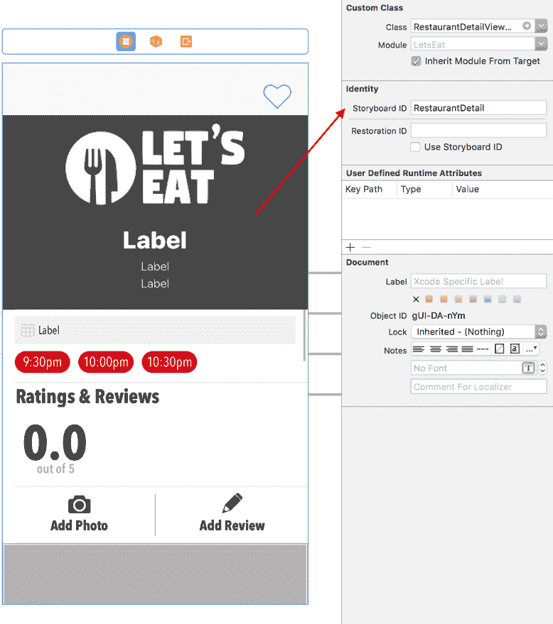

现在，返回到 `RestaurantViewController.swift` 文件，并在 `showRestaurantDetail()` 方法之后添加以下代码：

```
func setup3DTouch() {
   if( traitCollection.forceTouchCapability == .available){
         registerForPreviewing(with: self, sourceView: view)
   }
}
```

在这里，我们需要确保我们的`RestaurantViewController`可以接受 3D Touch。我们需要在`initialize()`方法中的`if`语句之后调用此方法。我们已经在`RestaurantViewController`中完成了设置。

最后，我们需要更新我们的`RestaurantDetailViewController.swift`文件。打开此文件，并在`viewDidLoad()`方法上方添加以下变量：

```
override var previewActionItems: [UIPreviewActionItem] {
   let favorite = UIPreviewAction(title: "Favorite", style: .default) { (action, viewController) -> Void in
         let manager = CoreDataManager()
         if let id = self.selectedRestaurant?.restaurantID { manager.addFavorite(by: id) }
   }

   let cancel = UIPreviewAction(title: "Cancel", style: .destructive) { (action, viewController) -> Void in
         print("You hit cancel")
   }

   return [favorite, cancel]
}
```

这个变量将允许我们在查看餐厅时执行两个操作，即“收藏”和“取消”。如果用户点击“收藏”，我们将获取`restaurantID`并将其保存到 Core Data 中。如果用户点击“取消”，我们将关闭视图。

接下来，在`createRating()`方法上方添加以下代码：

```
func checkFavorites() {
   let manager = CoreDataManager()
   if let id = selectedRestaurant?.restaurantID {
         let isFavorite = manager.isFavorite(with: id)
         let btnImage = UIButton()
         btnImage.frame = CGRect(x: 0, y: 0, width: 30, height: 30)
         btnImage.addTarget(self, action: #selector(getter: UIDynamicBehavior.action), for: .touchUpInside)

         if isFavorite {
               btnImage.setImage(UIImage(named: "heart-selected"), for: .normal)
               btnHeart.customView = btnImage
         }
         else {
               btnImage.setImage(UIImage(named: "heart-unselected"), for: .normal)
               btnHeart.customView = btnImage
         }
   }
}
```

此方法将在我们进入详细视图时运行。首先，我们检查 Core Data 以查看当前餐厅是否被收藏。如果是收藏的，我们将显示一个填充的心形，如果不是，我们将显示一个只有轮廓的心形。此方法将在`initialize()`方法中的`createRating()`方法之后被调用。

通过点击播放按钮（或使用⌘ + *R*）来构建和运行项目。当你到达餐厅列表时，触摸其中一个餐厅项，你会看到以下内容：


如果你同时触摸并向上滑动，你会看到我们现在有两个按钮：

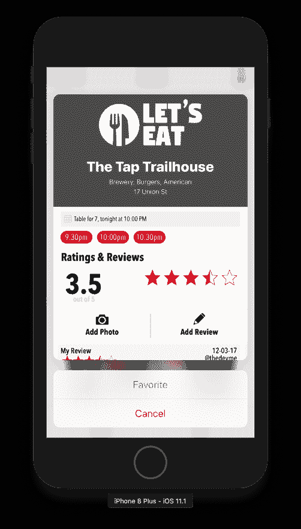

如果你点击“取消”，它将关闭视图。如果你点击“收藏”并选择相同的餐厅，你现在会看到心形会变成一个填充的心形。

# 摘要

我们正式完成了应用程序的构建。在本章中，我们学习了可以在应用程序中添加的两种不同类型的 3D Touch 快速操作。我们还为我们的集合视图添加了 3D Touch 支持。现在我们的餐厅列表有了 3D Touch 支持，这样我们就可以从餐厅列表中添加收藏的餐厅。

现在是时候进入这个应用程序最激动人心的部分了，那就是将我们的应用程序提交到 App Store。在下一章中，我们将讨论你需要了解的有关如何提交你的应用程序到 App Store 的所有内容。
