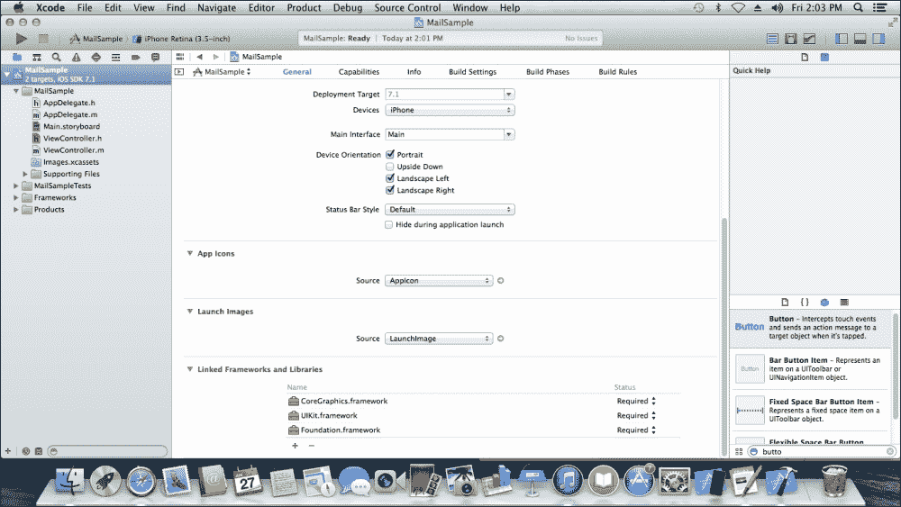
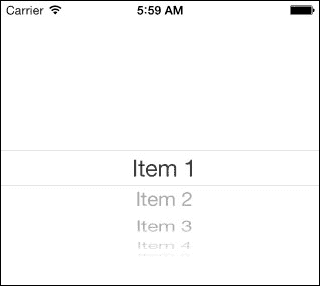
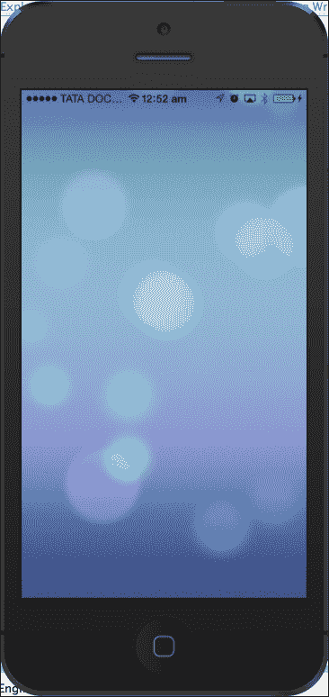

# 第二章. 探索更多 UI 组件

**UI 元素**是我们可以在应用程序中看到的视觉部分。这些元素响应用户交互，如按钮、文本字段和其他标签。一些 UI 元素用于构建我们的图形应用程序；例如，图像、选择器、地图工具包等。**Xcode** 帮助你使用界面构建器构建许多界面。`UIKit` 框架提供了构建和管理应用程序组件或用户界面所需的类。`UIKit` 框架负责处理 `UIComponents`，管理视图和窗口，以及创建组件和代码之间的连接。UI 元素可以使用两种方式使用：

+   通过从界面构建器拖放它们

+   通过编程将组件添加到视图中

在本章中，我们将涵盖以下主题：

+   通过编程添加 UI 组件

+   一些特色 UI 组件

+   理解表格视图的解剖结构

+   滚动视图及其用法

+   导航控制器

# 通过编程添加 UI 组件

如介绍中所述，我们可以通过编码添加组件。让我们从一些简单的例子开始。

## 添加视图

在 Xcode 中，在左侧面板中，你可以找到如以下截图中的**1**点所示的 `AppDelegate.m` 文件。导航到该文件。文件中有很多代码，但我们将只关注一个函数，即以下截图中的**2**点所示的 `application:didFinishLaunchingWithOptions`：


只需在函数（`didFinishLaunching`）中添加以下代码，使其看起来类似于以下内容：

```swift
- (BOOL)application:(UIApplication *)application didFinishLaunchingWithOptions:(NSDictionary *)launchOptions
{
    self.window = [[UIWindow alloc] initWithFrame:[[UIScreen mainScreen] bounds]];

    UIView *view = [[UIView alloc] initWithFrame:self.window.bounds];
    [view setBackgroundColor:[UIColor blueColor]];
    [self.window addSubview:view];

    [self.window makeKeyAndVisible];
    return YES;
}
```

构建并运行程序；如果在模拟器上看到蓝色屏幕，这意味着我们已经完成了。以同样的方式，我们可以为所有 UI 组件编写代码。你可以在本章中找到更多示例，以更快地学习。

## 添加一个标签

要添加子视图，你必须在 `AppDelegate.m` 类中编写代码，就像上一个例子中做的那样。以下是应在 `[self.window addSubview: view];` 行之后添加到同一函数中的代码：

```swift
CGRect labelFrame = CGRectMake( 10, 40, 100, 30 );
UILabel* label = [[UILabel alloc] initWithFrame: labelFrame];
[label setText: @"HELLO"];
[label setTextColor: [UIColor orangeColor]];
[view addSubview: label];
```

在之前的代码中，我们创建了一个 `UILabel` 类的对象。分配内存并初始化对象。然后，我们可以使用内置方法设置文本和文本颜色。最后，将标签添加到视图中。以下截图显示了屏幕上的标签名为 **HELLO**：


## 创建一个新的按钮

要添加一个新按钮，在 `[view addSubview:label]` 行之后编写以下代码，并运行它：

```swift
CGRect buttonFrame = CGRectMake( 10, 80, 100, 30 );
UIButton *button = [[UIButton alloc] initWithFrame: buttonFrame];
[button setTitle: @"My Button" forState: UIControlStateNormal];
[button setTitleColor: [UIColor redColor] forState: UIControlStateNormal];
[button addTarget:self action:@selector(buttonAction:) forControlEvents:UIControlEventTouchUpInside];
[view addSubview: button];
```

此代码将创建一个按钮，点击按钮时将调用 `buttonAction` 方法。在这里，`UIButton` 类的对象是 `button`。将 `button` 的目标设置为 `self`；`@selector` 调用我们的 `buttonAction` 方法并将事件设置为 `TouchUpInside`。`buttonAction` 函数应类似于以下内容：

```swift
- (void)buttonAction:(id)sender
{
    NSLog(@"button clicked");
}
```

当您运行代码时，您将在标签下方看到按钮。您可以通过更改代码中的坐标来更改位置。现在，您可以逐个尝试每个组件。在附加所有之前的代码后，文件应该看起来像这样：

```swift
- (BOOL)application:(UIApplication *)application didFinishLaunchingWithOptions:(NSDictionary *)launchOptions
{
    self.window = [[UIWindow alloc] initWithFrame:[[UIScreen mainScreen] bounds]];

    UIView *view = [[UIView alloc] initWithFrame:self.window.bounds];
    [view setBackgroundColor:[UIColor blueColor]];
    [self.window addSubview:view];

    CGRect labelFrame = CGRectMake( 10, 40, 100, 30 );
    UILabel* label = [[UILabel alloc] initWithFrame: labelFrame];
    [label setText: @"HELLO"];
    [label setTextColor: [UIColor orangeColor]];
    [view addSubview: label];

    CGRect buttonFrame = CGRectMake( 10, 80, 100, 30 );
    UIButton *button = [[UIButton alloc] initWithFrame: buttonFrame];
    [button setTitle: @"My Button" forState: UIControlStateNormal];
    [button setTitleColor: [UIColor redColor] forState:                                                                                                               UIControlStateNormal];
    [button addTarget:self action:@selector(buttonAction:) forControlEvents:UIControlEventTouchUpInside];
    [view addSubview: button];

    [self.window makeKeyAndVisible];
    return YES;
}
```

# 一些特色 UI 组件

iOS 中有一些新组件，以及一些现有组件的变化。让我们在本节中讨论这些组件。

## 地图视图

地图视图是处理位置和地图的一个非常好的方法。它在组件列表中可用。我们可以在我们的故事板中直接拖放地图视图（如下面的截图所示），或者我们可以通过编码来创建它：


为了使用地图视图，您需要将 `MapKit` 框架添加到您的项目中。您可以通过以下步骤添加框架：

1.  点击左侧面板中的项目名称，您可以看到如下所示的屏幕截图：

1.  在前面的屏幕截图中，您可以看到 **Linked Frameworks and Libraries** 选项。框架默认包含在我们的项目中。如果您想添加一个新的框架，请点击 **+**（加号）符号，找到 `MapKit` 框架，然后点击 **Add**。

1.  现在，如果您想显示用户的位置，请转到右侧面板中的检查器工具栏并选择第四个选项卡，即 **Attributes** 检查器。点击 **Shows User Location** 复选框，如下面的截图所示：

## UIPickerView

`UIPickerView` 是一个 UI 元素，可以用来从多个选项中进行选择（类似于下拉菜单在网页上所做的工作）。我们可以在组件面板中找到 `UIPickerView` 元素，并通过拖放的方式简单地使用它，如下面的截图所示。不需要为 `UIPickerView` 添加框架。


将 **Picker** 视图拖放到故事板中并运行程序。您可以在模拟器中看到 Picker 视图。但是，为了更好地使用 Picker 视图，或者在我们的 Picker 视图中插入数据，我们需要以下方式编码：

1.  首先，将 `UIPickerVIew` 元素连接到 `.h` 文件。

1.  在连接时，给 Picker 视图起一个名字（例如：`Picker`）。

1.  连接后，在 `.h` 文件中创建一个属性，如下所示：

    ```swift
       @property (weak , nonatomic) IBOutlet UIPickerView *Picker
    ```

    `Picker` 是我们给 Picker 视图起的名字。我们设置属性如下：

    +   `weak`：这会在使用后自动释放对象。

    +   `nonatomic`：这是线程安全的。一次只有一个线程可以使用该对象。

1.  为了使用 Picker 视图，我们需要在 `.h` 文件中添加两个协议；它们是 `UIPickerViewDataSource` 和 `UIPickerViewDelegate`，如下面的代码片段所示：

    ```swift
    #import <UIKit/UIKit.h>
    @interface ViewController : UIViewController<UIPickerViewDataSource, UIPickerViewDelegate>

    @property (weak, nonatomic) IBOutlet UIPickerView *picker;
    @end
    ```

1.  现在，转到 `.m` 文件。有一个名为 `viewDidLoad` 的函数。向其中添加以下代码：

    ```swift
    - (void)viewDidLoad
    {
          [super viewDidLoad];

          // Initialize Data
          NSArray *pickerData;
          pickerData = @[@"Item 1", @"Item 2", @"Item 3", @"Item 4",@"Item5"];

          // Connect data
          self.picker.dataSource = self;
          self.picker.delegate = self;
    }
    ```

1.  为了正确使用`UIPickerView`，我们需要在`.m`文件中添加 Picker 视图方法，如下所示：

    ```swift
    - (void)didReceiveMemoryWarning
    {
       [super didReceiveMemoryWarning];
    }
    // The number of columns of data
    - (int)numberOfComponentsInPickerView:(UIPickerView *)pickerView
    {
       return 1;
    }
    // The number of rows of data
    - (int)pickerView:(UIPickerView *)pickerView numberOfRowsInComponent:(NSInteger)component
    {
       return pickerData.count;
    }

    // The data to return for the row and component (column) that's being passed in
    - (NSString*)pickerView:(UIPickerView *)pickerView titleForRow:(NSInteger)row forComponent:(NSInteger)component
    {
       return pickerData[row];
    }
    ```

1.  现在，编译并运行代码。我们的模拟器将如下截图所示：

## 网页视图

我们需要网页视图来与网页内容交互。网页视图在我们的设备上显示网站。Safari 和 Chrome 是网页视图的例子，但它包含许多 UI 元素，如标签、刷新按钮、下一页按钮和后退按钮。然而，我们不会深入探讨。首先，我们将只在我们的设备上显示网站。与所有组件一样，网页视图也在左侧组件面板中可用。

让我们从以下步骤开始：

1.  将网页视图拖放到故事板中。

1.  将网页视图连接到`.h`文件，并为网页视图命名（例如，`viewSite`）。连接后，会自动创建一个属性，如下所示：

    ```swift
        @property (weak, nonatomic) IBOutlet UIWebView *viewSite;
    ```

1.  现在，在`.m`文件中，转到`viewDidLoad`函数并添加以下代码：

    ```swift
    - (void)viewDidLoad
    {
        [super viewDidLoad];

        NSString *String = @"http://www.facebook.com";
        NSURL *url = [NSURL URLWithString:String];      //passing string in url
        NSURLRequest *requestObj = [NSURLRequest requestWithURL:url];
        [self.viewSite loadRequest:requestObj];
    }
    ```

1.  简单地编译并运行代码。你将在模拟器上看到 Facebook 登录页面，如下截图所示：

## 图像视图

图像视图用于在屏幕上显示图像。为了使用图像视图，在界面构建器中有一个名为`UIImageView`的组件可用。我们可以使用图像视图创建许多动画，并且根据需要可以同时使用多个图像视图。不需要为图像视图添加任何框架。图像视图接受多种格式的图像，如 PNG、JPEG、BMP 等。我们可以以编程方式或通过拖放两种方式添加图像。

### 使用图像视图

让我们看看以下步骤，了解如何使用图像视图：

1.  在界面构建器中找到图像视图，并将其拖放到故事板中。在插入图像视图后，我们的视图看起来如下：

1.  通过简单地从另一个文件拖放到 Xcode 右侧面板下所有类下面的模拟器中，将图像添加到程序中。会出现一个弹出窗口，你需要勾选**目标**复选框。

1.  现在，转到检查器工具栏中的属性检查器，它在 Xcode 的左侧面板中可用。给图像命名，使其与我们使用的图像名称相同（例如，`image.png`），如下截图所示：

1.  编译并运行程序。你的图像将在模拟器上显示，如下截图所示：

## 理解表格视图的结构

表格视图是 iOS 中的一个常见 UI 元素。它用于以表格形式显示数据列表。我们每天都在许多形式中使用它，如歌曲播放列表、电话中的联系人等。它用于显示一个垂直可滚动的视图，该视图由多个单元格组成。它具有特殊功能，如标题、页脚、行和部分。还有一个用于重用单元格的功能。因此，我们可以根据需要创建无限数量的单元格。

一个空的表格视图看起来如下截图所示：


### 表格视图的重要方法

有许多可用于表格视图的方法。它们在代码片段中描述如下：

```swift
-(UITableViewCell *)cellForRowAtIndexPath:(NSIndexPath *)indexPath
- (void)deleteRowsAtIndexPaths:(NSArray *)indexPathswithRowAnimation:(UITableViewRowAnimation)animation
- (id)dequeueReusableCellWithIdentifier:(NSString *)identifier
- (id)dequeueReusableCellWithIdentifier:(NSString *)identifierforIndexPath:(NSIndexPath *)indexPath
- (void)reloadData
- (void)reloadRowsAtIndexPaths:(NSArray *)indexPaths
   withRowAnimation:(UITableViewRowAnimation)animation
- (NSArray *)visibleCells
```

### 与表格视图一起工作

表格视图是一个在界面构建器中可用的常见元素。以下步骤将帮助我们了解如何使用表格视图：

1.  从界面构建器中选择表格视图组件，将其拖放到我们的视图中，并在视图控制器中正确调整表格视图。

1.  插入表格视图后，我们的故事板看起来如下截图所示：

1.  为了使用表格视图，我们需要在我们的`.h`文件（我们的接口文件）中添加两个协议，`UITableViewDelegate`和`UITableViewDataSource`：

    ```swift
    @interface  TableViewController : UIViewController <UITableViewDelegate, UITableViewDataSource> 
    ```

1.  现在，在`.m`文件中，我们需要声明一个数组。在这里，数组用于按单元格存储数据。在声明数组后，将数据插入到在`viewDidLoad`方法中定义的数组中，如下所示：

    ```swift
    @implementation TableViewControler
    {
       NSArray *Recipelist;
    }
       -(void)viewDidLoad
       {
          [super viewDidLoad];
          // Initialize table data
          Recipelist =  @[@"Crispy Egg",@"Braised Pork", @"Domestic Cheese", @"Roasted baby beets"];}
    ```

1.  现在，我们必须在我们的`.m`文件中的代码中添加两个表格视图方法，`numberOfRowsInSection`和`cellForRowAtIndexPath`。第一个方法用于通知表格视图该部分中存在的行数。第二个方法简单地返回`tableData`数组中的项目数。

1.  添加代码，如以下所示：

    ```swift
    - (NSInteger)tableView:(UITableView *)tableView numberOfRowsInSection:(NSInteger)section
    {
       return [Recipelist count];
    }

    - (UITableViewCell *)tableView:(UITableView *)tableView cellForRowAtIndexPath:(NSIndexPath *)indexPath
    {
        //create identifier for cell
        NSString *TableIdentifier = @"TableCell";

        // dequeReusableCell is method to reuse the cell
        UITableViewCell *cell = [tableView dequeueReusableCellWithIdentifier:TableIdentifier];
        if (cell == nil) {
          cell = [[UITableViewCell alloc] initWithStyle:UITableViewCellStyleDefault reuseIdentifier:TableIdentifier];
        }

        //set the text for each cell as per our array objects
        cell.textLabel.text = [Recipelist objectAtIndex:indexPath.row];
        return cell;
    }
    ```

1.  现在，转到故事板。我们需要建立数据源和代理之间的连接。

1.  从我们的视图中选择表格视图。右键单击它，连接到下面的黄色按钮，这是我们表格视图控制器。

1.  选择两个数据源，并按以下截图所示逐个委托它们：

1.  最后，我们可以编译并运行程序。我们的模拟器看起来如下：

## 滚动视图及其用法

滚动视图用于显示比屏幕尺寸更大的内容。它可以包含所有其他 UI 元素，如图像视图、标签、文本视图，甚至另一个滚动视图。`UIScrollView`是 iOS 中最有用的控件之一。它是一种表示比屏幕更大的数据的好方法；数据可以是图像、列表、论坛等。滚动视图元素存在于界面构建器中，我们可以通过将其拖动到故事板中来直接使用它。让我们通过以下简单活动来了解滚动视图：

1.  创建一个单视图应用程序，并从左侧面板选择故事板。

1.  移动到故事板，并从视图控制器中选择视图。

1.  现在，前往检查器工具栏，然后转到**视图**坐标；将视图的高度更改为**1,000**，如图所示。因此，您的视图将超过屏幕。

1.  在界面构建器中从右侧面板搜索滚动视图，并将其拖动到视图中，如图所示。不要忘记正确调整视图上的滚动视图：

1.  我们需要添加一些元素来检查滚动视图是否工作。因此，添加两个标签，一个位于视图顶部，另一个位于视图底部，并给它们命名。

1.  编译并运行程序。

您将只看到一个顶部标签；现在，向下滚动并查看底部标签。因此，通过滚动视图，我们可以滚动到任何元素，如图像、表格等。

## 导航控制器

导航控制器是 iOS 应用程序中常见的另一个 UI 元素。许多应用程序，如照片应用、YouTube 和联系人，都是由导航控制器构建的。导航控制器管理多个子视图，包括顶部的导航栏和返回按钮。我们可以根据应用程序需求显示或隐藏导航栏。当我们在单个应用程序中使用多个视图时，会使用它。通过导航控制器，我们可以从一个视图移动到另一个视图。导航控制器也是一种元素，并在界面构建器中可用。导航控制器通过提供返回按钮来提供返回前一个视图的功能。我们可以在故事板中添加多个视图，并通过使用切换将它们连接起来。**切换**是导航控制器提供的一种特殊功能，它将导航控制器推送到下一个视图。

让我们通过一个简单的应用程序来创建它，这样我们可以轻松地理解导航控制器：

1.  创建一个单视图应用程序，并移动到故事板。

1.  从左侧面板删除现有的视图。

1.  在界面构建器中搜索导航控制器，并将其拖动到故事板。现在，您的屏幕看起来像这样：

1.  视图之间的链接符号是切换符号。从界面构建器中选择一个按钮，并将其拖动到根视图控制器。

1.  从组件中找到一个视图。将其拖动到根视图控制器附近，并将图像视图插入到新插入的视图中。

1.  从您的目录中复制任何图像到 Xcode 左侧面板的所有类下面。

1.  前往检查器工具栏，并将图像命名为与我们选择的图像相同的名称。

1.  最后，将按钮连接到新视图。右键单击按钮，将蓝色线条拖动到新视图，并在弹出窗口中选择**Push**。

1.  是时候编译并运行程序了。当你看到模拟器时，屏幕顶部将有一个按钮和导航栏。当你点击按钮时，将出现一个新屏幕，显示你的图片，并且还有一个返回按钮可供使用，以获取前一个视图。以下截图显示了第一种视图：

1.  这里是第二种视图：

# 摘要

在本章中，我们学习了组件及其如何通过编程创建。我们掌握了表格视图的概念及其使用方法。此外，我们还使用导航控制器制作了一个简单的应用程序。现在，我们将讨论下一章中的框架。
