# 第七章。应用分发计划

本章将帮助您了解成为 iOS 应用开发者解剖结构。我们将从无账户开始，到在 App Store 上发布。

在本章中，我们将涵盖以下主题：

+   理解和设置您的开发者账户

+   设置配置文件

+   在商店发布应用

# 设置开发者账户

在本章中，您将学习如何注册苹果的 iOS 开发者计划，如何生成所需的各个证书，配置我们的应用的方法，以及最终将应用提交到 App Store 进行审核的步骤。为了本章，我们创建了一个全新的 App Store 账户，并且稍后我们还向苹果的 App Store 提交了一个新的应用。

我们将提交我们在 第四章 中创建的 *AntKiller* 游戏应用改进版本，使用 SpriteKit 游戏引擎。

完成本章所需的先决条件如下：

+   您需要一个网络浏览器

+   您需要一个有效的信用卡

+   您还需要 $99。

+   开发应用必须使用 Mac 电脑，最好安装了 OS X 10.9 Mavericks 操作系统。

+   最后，您将需要 Xcode 6，这是苹果的开发软件；您可以从 [`developer.apple.com/downloads/index.action?name=Xcode`](https://developer.apple.com/downloads/index.action?name=Xcode) 下载它。

在您注册为苹果 iOS 开发者后，可以下载 Xcode。完成本教程的前几节后，您将注册到苹果开发者计划。

# 开始使用

在苹果的开发者门户上注册是我们将应用发布到 App Store 的第一步。要成为 iOS 开发者，您必须支付上述 $99 美元费用，或者支付 $299 美元的企业账户费用。然而，对于企业账户，在注册账户之前，您需要一个额外的 **DUNS**（**数据通用编号系统**）编号。

如果您已经拥有苹果的开发者账户，请随意跳过本节，继续下一节。如果您没有苹果开发者账户，请访问 **iOS 开发中心** ([`developer.apple.com/devcenter/ios/index.action`](https://developer.apple.com/devcenter/ios/index.action)) 并点击以下截图所示的 `免费注册` 链接：

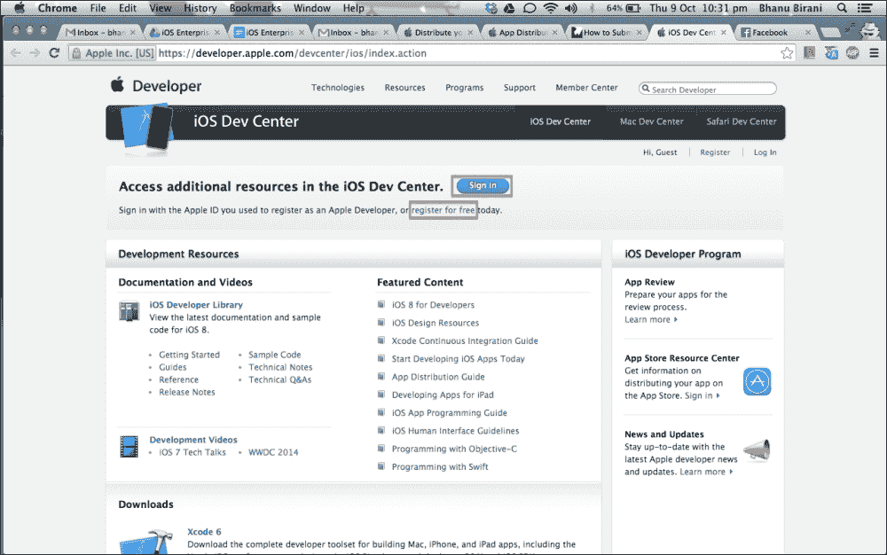

点击如图中红色高亮框所示的 **开始** 按钮：

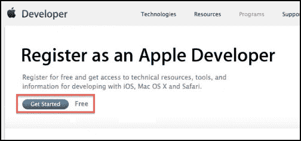

在这个页面上，您可以选择创建一个新的 Apple ID，或者使用现有的 Apple ID。如果您想节省时间，可以使用您已经用于 iTunes 账户购买的相同 Apple ID，例如。然而，为了遵循本章的步骤，我们建议您创建一个新的、全新的 Apple ID。这将帮助您确保所有数据都是正确的。

因此，要创建一个新的 Apple ID，请选择如图所示的**创建 Apple ID**：

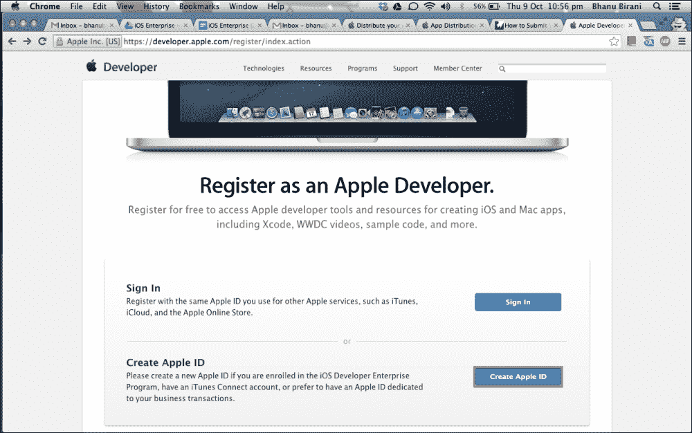

使用以下截图所示的表格填写所有必需的详细信息，例如您的电子邮件、密码和安全信息。建议您使用经常检查的电子邮件地址，因为 Apple 会发送您开发者计划的所有更新以及您提交的待批准应用程序的状态。

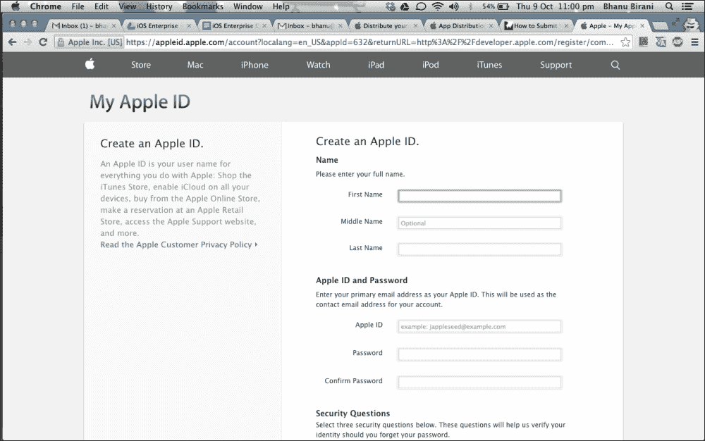

通过向下滚动填写所有个人信息，然后点击**创建 Apple ID**，如图所示：

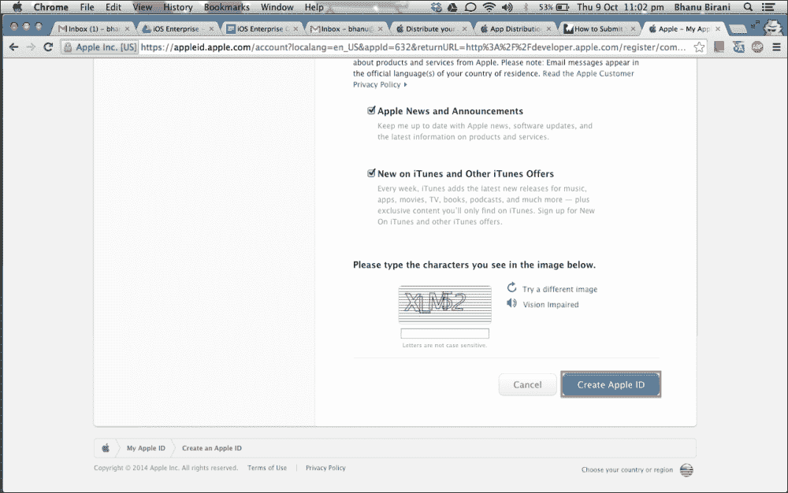

下一页包含与您的专业资料相关的问题。此页面还会询问您开发的应用程序等。根据您的最佳知识填写所有答案。向下滚动并完成以下表格，然后点击**继续**：

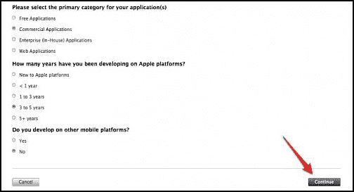

继续按钮

下一页是法律协议。阅读文档，选择复选框，然后点击**我同意**，如图所示：

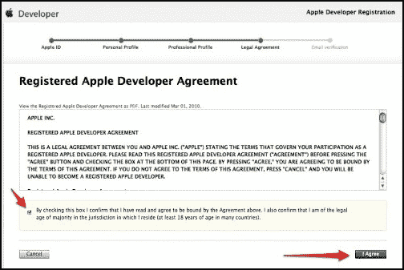

法律协议

现在，注册已完成。只需验证您用于注册的电子邮件地址。您应该会收到一封确认电子邮件地址的邮件。点击以下截图所示的 Apple 注册确认邮件中发送的链接：

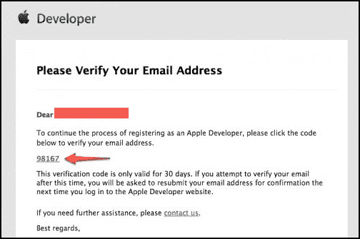

恭喜！您现在已成为 Apple 开发者。在您开始开发 iOS 应用程序并将它们提交到 Apple 的 App Store 之前，您需要点击**继续**（如图所示）并购买 iOS 应用程序开发计划：

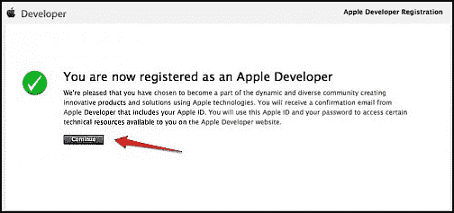

继续按钮

## 加入 iOS 开发者计划

使用您的开发者 Apple ID 可为您提供访问许多资源和信息。然而，它仍然不允许您在 Apple 的 App Store 上发布应用程序。要获得更多访问 Apple 应用发布功能的权限，您必须注册 Apple 的 iOS 开发者计划。这反过来将每年花费您 99 美元，

在前一个屏幕上点击**继续**后，您将被重定向到正确的位置。否则，如果您已经拥有 Apple 开发者账户并选择跳过前面的部分，请转到**开发者会员中心**，登录，您将保持同步。

登录后，只需点击页面右上角的**加入今日**链接，如图所示：

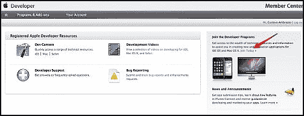

加入今日链接

然后，点击以下截图中的**继续**：

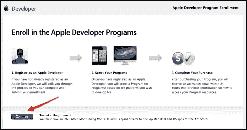

继续按钮

现在，选择**现有** **Apple 开发者**并点击**继续**，如图所示：

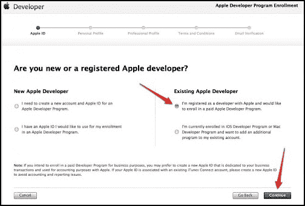

选择现有苹果开发者选项和继续按钮

在下一页，我们需要决定我们是想作为个人还是作为公司注册。在本章中，我们将作为个人注册，如图所示。作为公司注册要复杂一些，因为它需要您提交更多文件来证明您在公司中的参与。

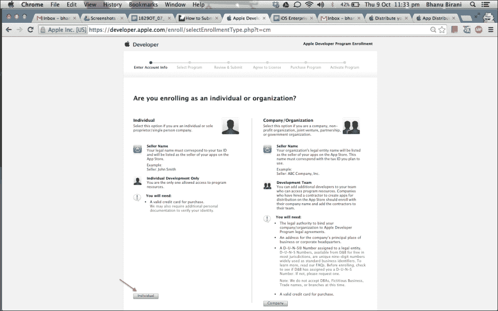

个人按钮

现在，当您点击**个人**时，下一个屏幕将是登录屏幕。在这里，您将需要再次提供您新创建的凭据。之后，点击**登录**。

现在，在登录后的下一个屏幕中，您将需要提供您的账单信息以验证您的身份，如图所示。为了确保您已提供正确的卡信息，苹果会尝试与您的信用卡公司确认此信息。请始终确保您提供了正确的详细信息。

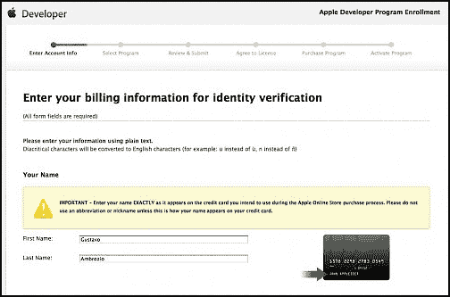

通过向下滚动填写完整的表格，然后点击**继续**，如图所示：

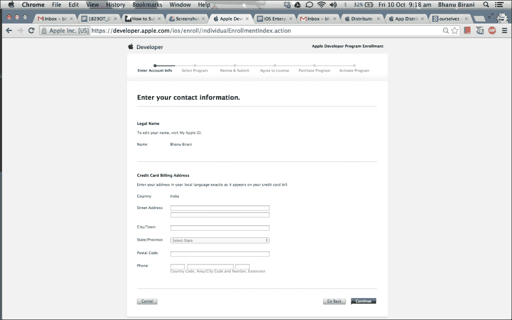

继续按钮

点击**继续**将重定向您到计划选择页面。现在，我们必须选择一个计划。在本章中，我们的主要重点是 iOS 开发者计划，因此我们只将选择此选项。

在选择您的计划后，点击**继续**，如图所示：

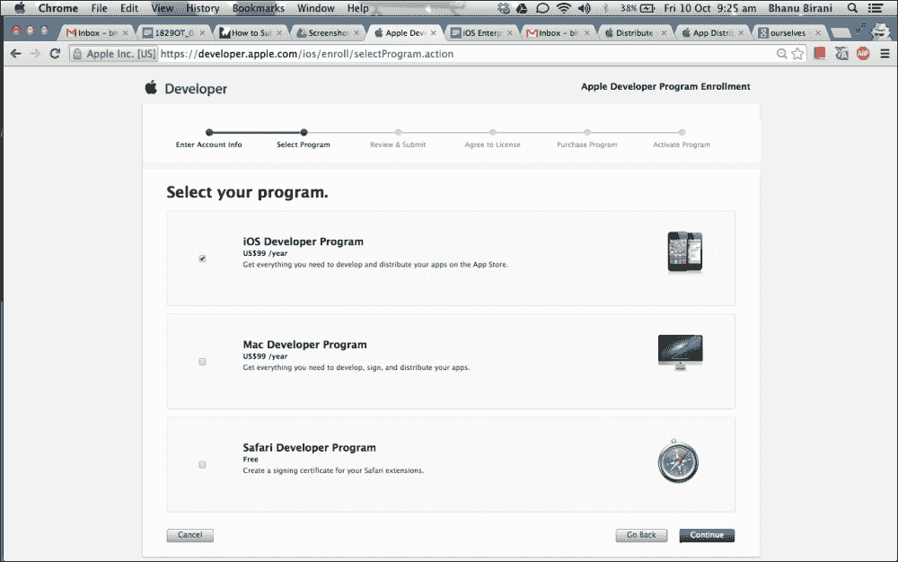

继续按钮

现在，一旦您点击了**继续**，您将需要审查您的信息以纠正任何可见的错误（如有必要）。审查完毕后，您可以通过点击**继续**来提交，如图所示：

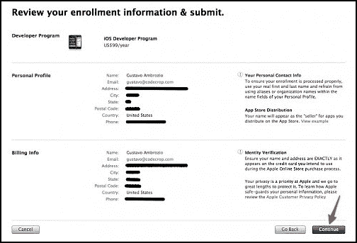

现在，接受许可协议并点击**我同意**，如图所示：

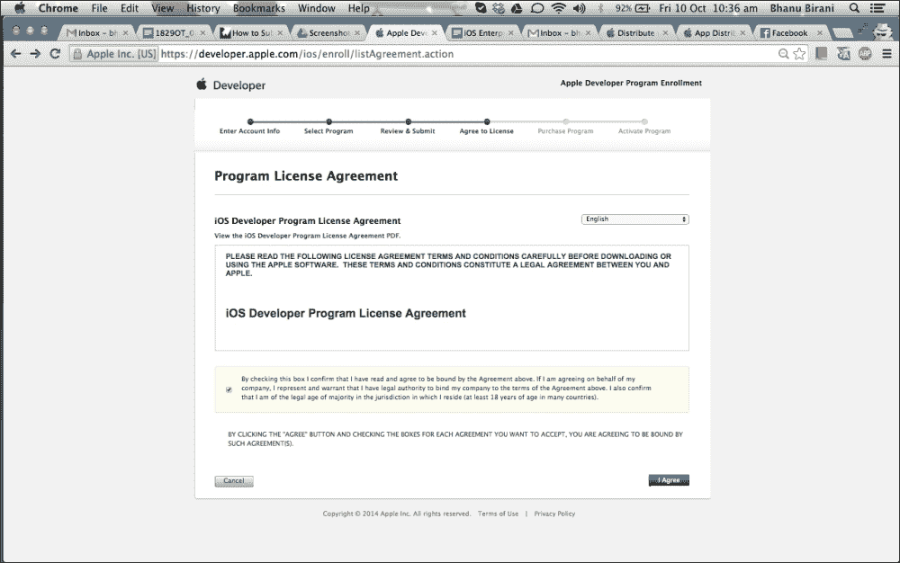

许可协议

您将被重定向到以下截图所示的支付信息页面。填写与您的支付和送货地址相关的所有详细信息，然后点击**继续**。

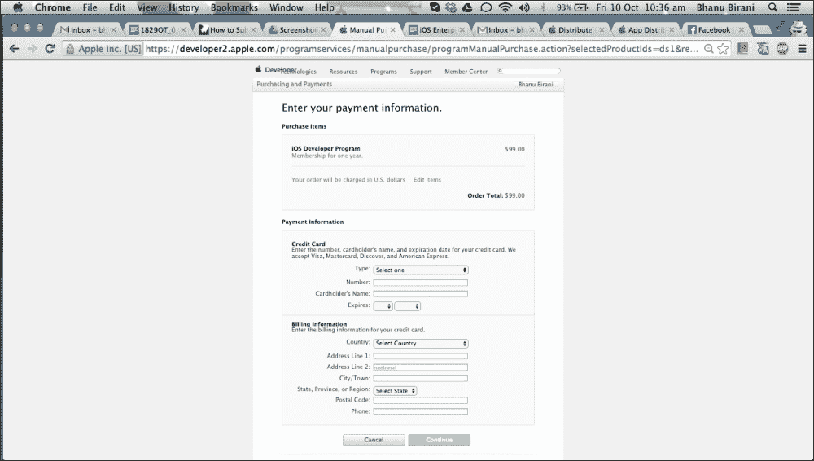

支付信息页面

现在，按照支付程序进行操作；一旦成功支付 99 美元，您将被重定向回苹果支付确认页面，如图所示：

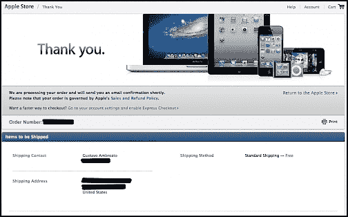

支付确认页面

## 开始使用 iOS 开发者账户

一旦您提交并支付了您的 iOS 开发者注册流程，您将不得不等待一天左右，以便苹果处理您的订单。

一旦您的订单成功处理，您将收到来自苹果公司的电子邮件，如图所示：

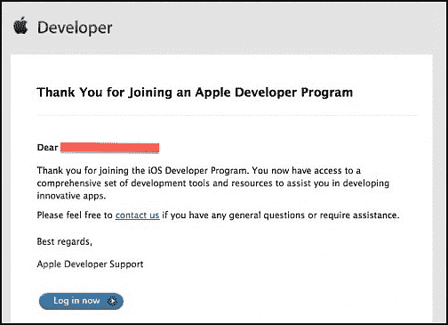

您还将收到一封关于您的**iTunes Connect**账户的电子邮件，如图所示：

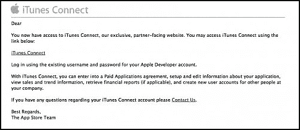

现在，如果您还没有这样做，可以使用您新的 iOS 开发者凭证下载 Xcode，这是主要用于 iOS 开发的工具。我们将简要使用 Xcode 来了解将应用程序发布到 App Store 的过程。

现在，前往**iOS 开发中心**([`developer.apple.com/devcenter/ios/index.action`](https://developer.apple.com/devcenter/ios/index.action))，并点击**登录**，如图所示：

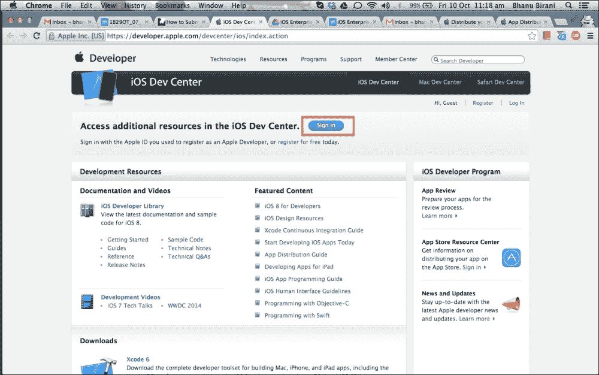

使用您的凭证登录后，您最终将观察到变化。现在，iOS 开发中心为您提供了大量信息。您将找到各种编程指南、下载、**全球开发者大会（WWDC**）视频和文档；最重要的是非常有帮助的开发者论坛和支持中心。

在本章中，我们主要关注在开发 iOS 应用程序时将广泛使用的两个门户：**iOS 配置文件门户**和**iTunes Connect**，如图所示：

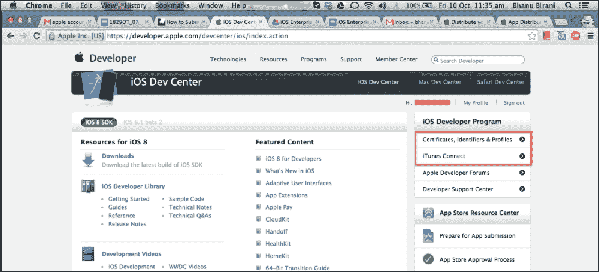

## iOS 配置文件门户

事实上，未越狱的 iOS 设备只能安装和运行苹果公司批准并在 App Store 上可用的应用程序。

苹果公司为此进行了特殊的安全检查；在 iOS 设备上运行的每个应用程序都必须有一个签名的 Apple 证书。然而，对于 App Store，应用程序附带一个捆绑的证书，系统在允许应用程序运行之前会对其进行验证。如果没有找到签名，则认为应用程序无效，系统拒绝运行此类应用程序。

开发者在开发过程中必须非常频繁地编译和运行他们的应用程序。为了在开发过程中编译和运行应用程序，开发者需要一种方法来使用他们自己的证书创建和签名他们的应用程序。

这就是 iOS 配置文件门户发挥作用的地方。您可以使用此门户生成您的配置文件。配置文件也可以理解为“代码签名标识”。这些文件由 iOS 配置文件门户生成，并由 Xcode 用于签名您的应用程序。

了解两种类型的配置文件类型：开发配置文件和发布配置文件非常重要。它们在这里进行解释：

+   **开发配置文件**：这些配置文件与特定的设备相关联，因此应用程序只能在这些设备上运行。开发者可以在开发者门户中添加他们的设备 UDID；这将允许配置文件在设备上安装应用程序时通过验证。

+   **分发配置文件**：这些配置文件专门用于在您将应用提交给苹果公司进行审核之前对应用进行签名。这些配置文件不包含任何设备特定的详细信息；因此，您自己不能使用此配置文件在设备上安装应用。这些配置文件是无设备配置文件，因为苹果公司在批准应用后将对应用进行签名并发布给所有用户。

这些配置文件门户也用于生成推送通知证书，如果您希望您的应用发送它们。

## iTunes Connect

iTunes Connect 门户控制您的应用提交流程。在此门户中，您将注册您的新的应用及其描述、元标签、截图、价格和在应用内购买，以便将它们发布到 App Store。

这还允许您同意新的合同。您还可以在此门户中设置您的财务数据并检查您的销售。此门户提供了对各种分析工具的访问，例如崩溃报告、下载信息等。

## 证书、标识符和配置文件

在本节中，我们将探讨证书、标识符和配置文件，以设置我们的应用部署流程的配置文件；此应用将在稍后发布到 App Store。现在，点击**证书、标识符 & 配置文件**，如图所示，或点击链接([`developer.apple.com/account/overview.action`](https://developer.apple.com/account/overview.action))。结果截图如下：

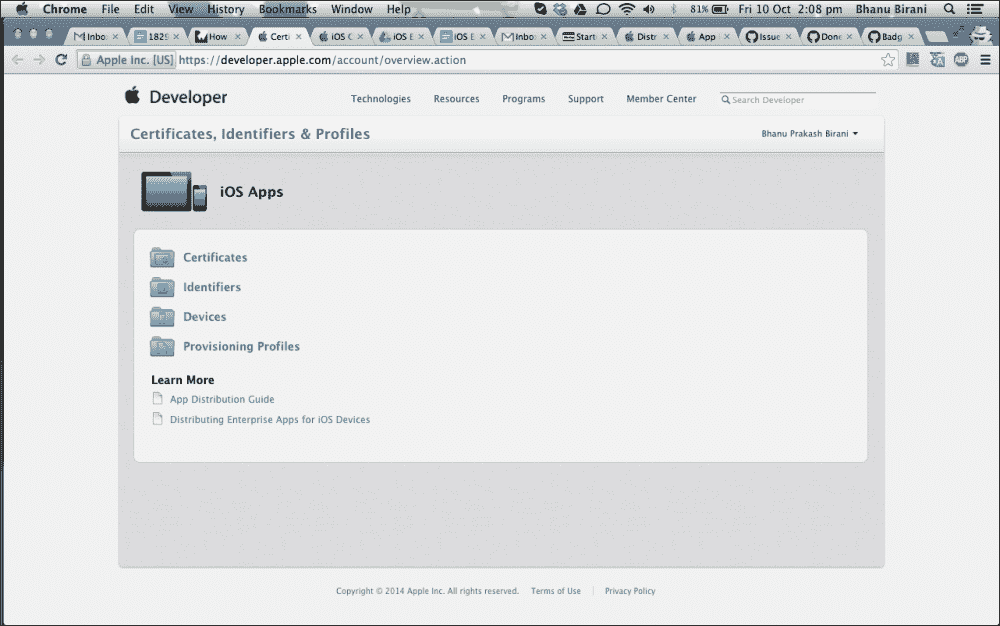

点击**证书**，您将看到类似于以下截图的内容：

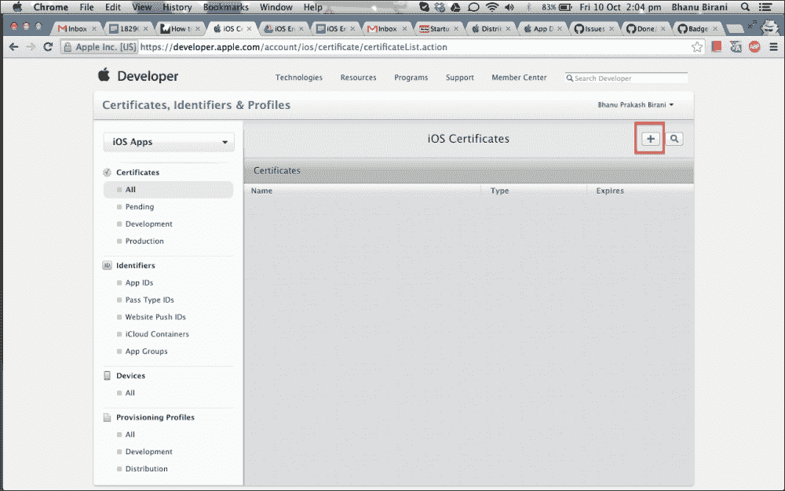

现在，点击**+**按钮创建一个新的证书，此页面将询问您想创建哪种证书。从**开发**部分选择**iOS 应用开发**证书，然后点击**继续**，如图所示：

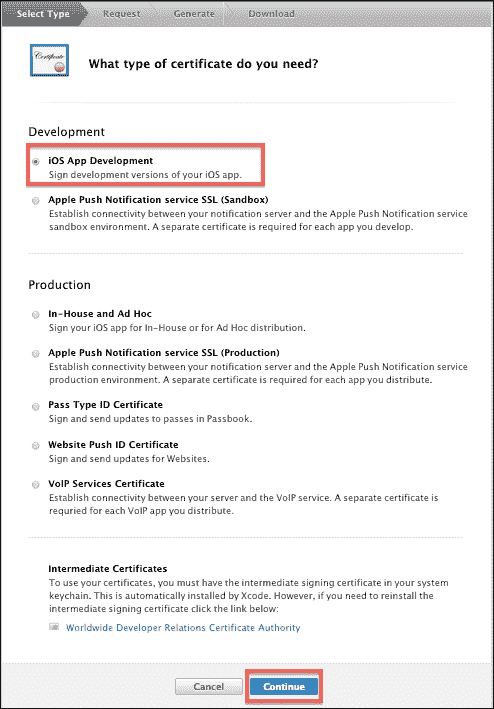

现在，按照以下证书生成页面中指定的流程进行操作，并点击**继续**：

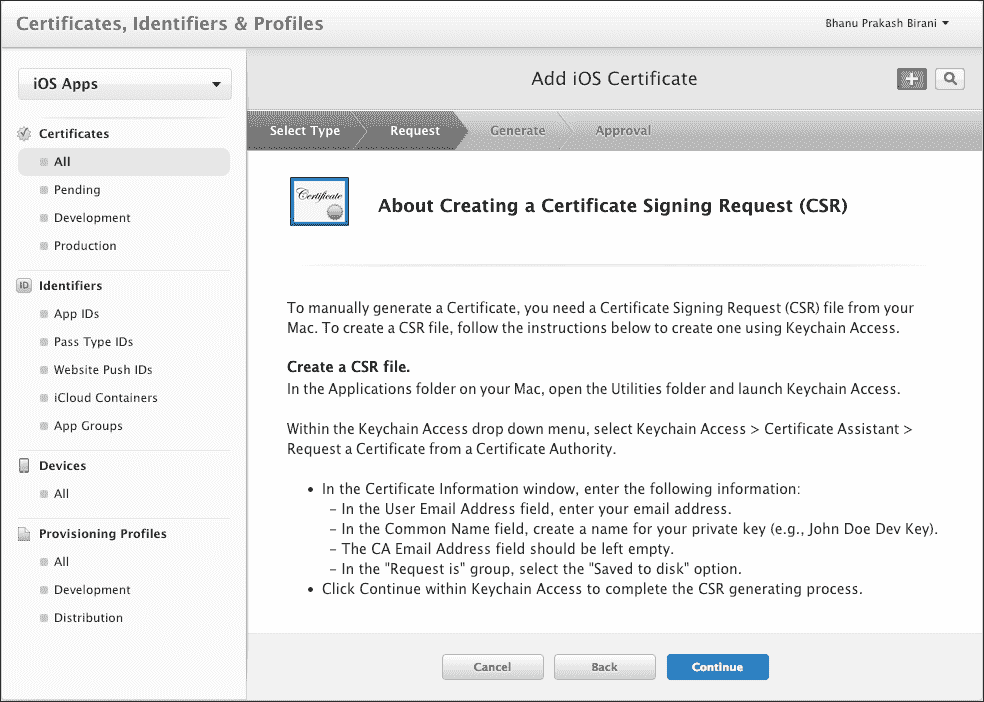

现在，使用列出的说明上传您刚刚创建的`.certSigningRequest`文件。页面应类似于以下截图：

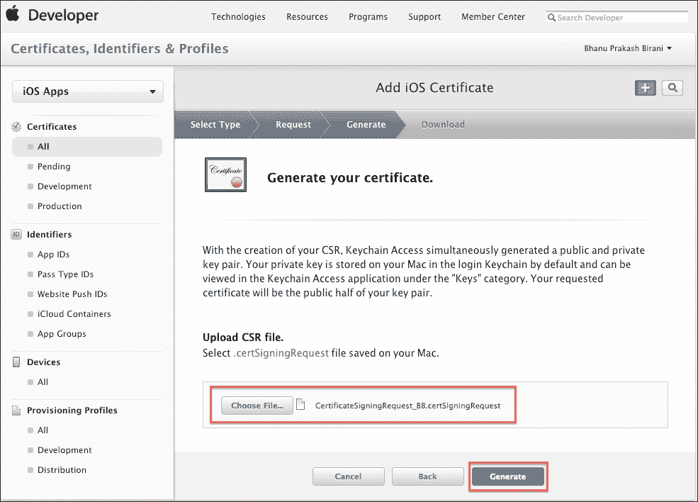

现在，点击**生成**将创建一个开发证书；这可能需要几分钟。一旦证书创建完成，您将能够在证书列表中看到它，如图所示：

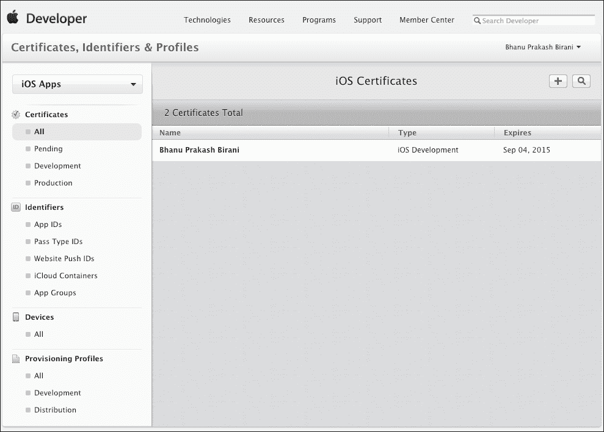

点击证书以下载或撤销。结果截图如下：

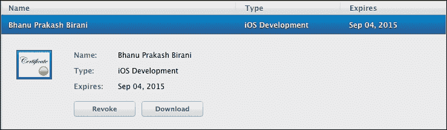

现在，我们已经成功创建了证书。是时候将其添加到 Xcode 中了。打开 Xcode，转到**文件** | **偏好设置**。现在，点击屏幕顶部的图标中的**帐户**。这应该看起来与以下截图类似：

现在，您可以看到，目前还没有与 Xcode 同步的帐户。因此，点击屏幕左下角的**+**按钮，并添加之前步骤中创建的帐户。帐户弹出窗口应该看起来与以下截图类似：

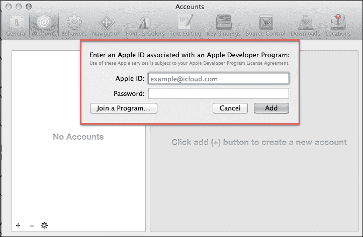

登录成功后，您将能够在列表中看到您的帐户和相关配置文件，如图所示：

现在，让我们回到我们的 Apple 开发者门户中的浏览器。下一步将是注册我们的设备。

现在打开浏览器，让我们继续。下一步是注册我们的设备。在左侧菜单中，点击**设备**并选择`所有`。然后，在右侧，点击**+**按钮以添加设备，如图所示：

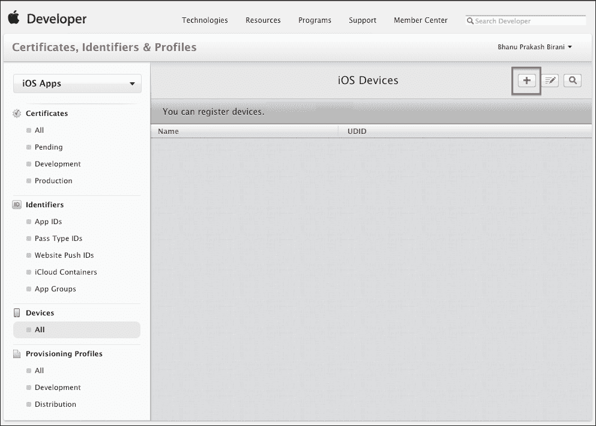

要添加设备，您需要运行您应用的设备（们）的 UDID。您可以通过 Xcode 的组织者或 iTunes 获取设备的 UDID。您可以打开 iTunes 并点击**摘要**以获取设备的 UDID，如图所示：

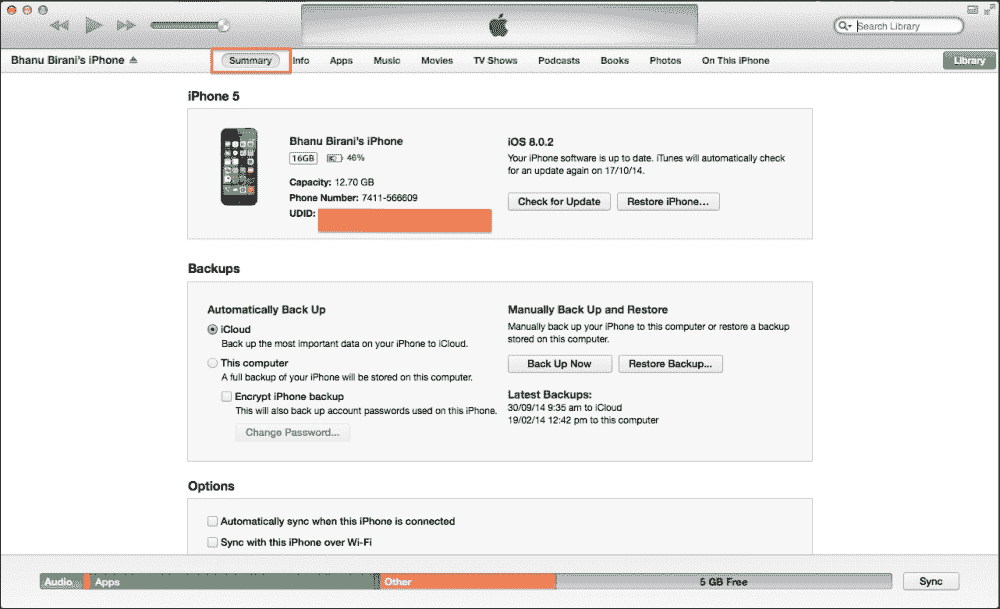

**摘要按钮**

现在，我们已经拥有了添加设备所需的所有信息。点击**+**按钮，并提供设备的 UDID 以及设备名称。在提供详细信息后，点击**继续**，如图所示：

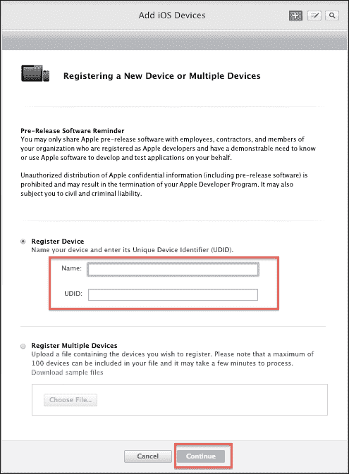

通过点击如图所示的**注册**来确认提交。您可以在列表中添加最多 100 台设备以调试您的应用。

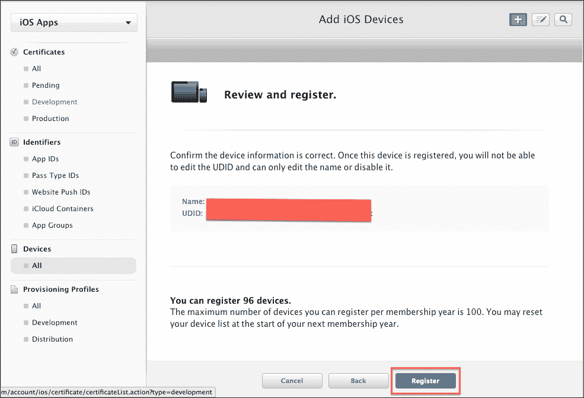

现在，我们已经成功注册了设备，所以是时候注册应用 ID 了。我们构建的所有应用都有一个唯一的 app ID。点击屏幕左侧的**App IDs**以注册您的新 app ID。点击**+**按钮，并填写如图所示的所需详细信息。您还可以从屏幕顶部的 Apple 帮助文本中阅读关于 app ID 的完整描述。

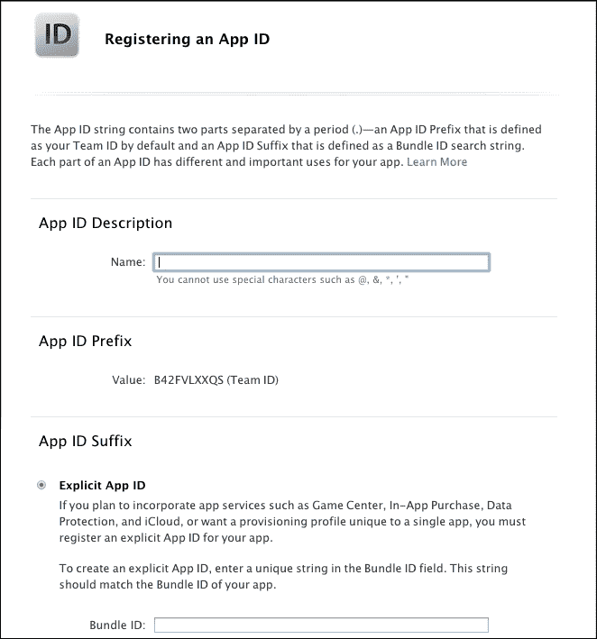

填写所有必要的详细信息，并点击**继续**。成功创建后，应用 ID 将自动显示在列表中。

现在，是最后一步了。我们将创建一个配置文件，它将实际捆绑我们在上一节中遵循的所有步骤。配置文件将开发者的证书与应用 ID 绑定，以便允许应用在配置文件中允许的设备上运行。遵循创建证书和标识符时使用的相同步骤，点击**配置文件**部分，并选择**全部**。然后，点击屏幕右上角的**+**按钮。然后，在表单中，在**开发**部分下选择**iOS 应用开发**。您应该会看到以下截图：

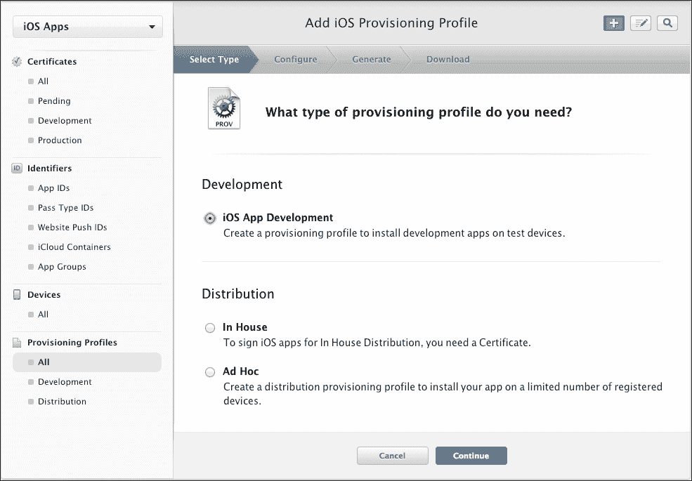

现在，选择您在上一节中创建的应用 ID，并点击**继续**。选择屏幕将类似于以下截图所示：

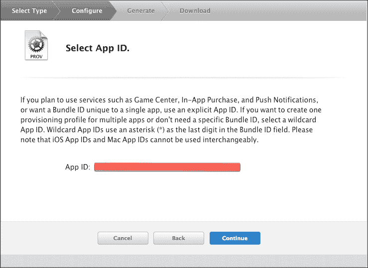

然后，在下一屏，选择此配置文件可用的 iOS 证书列表，并点击**继续**。选择屏幕应类似于此处所示：

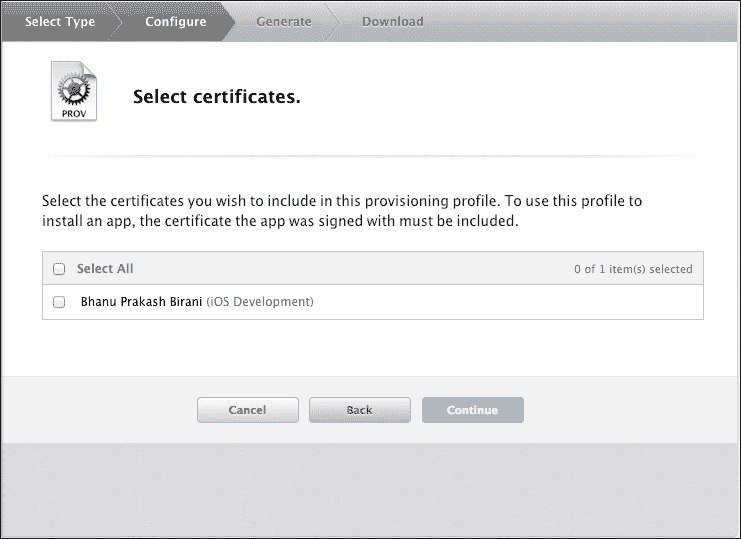

然后，我们将为创建的配置文件添加设备，此配置文件将可用。然后，点击**继续**。选择屏幕应类似于以下截图。检查您想要在设备上运行应用的所有设备。

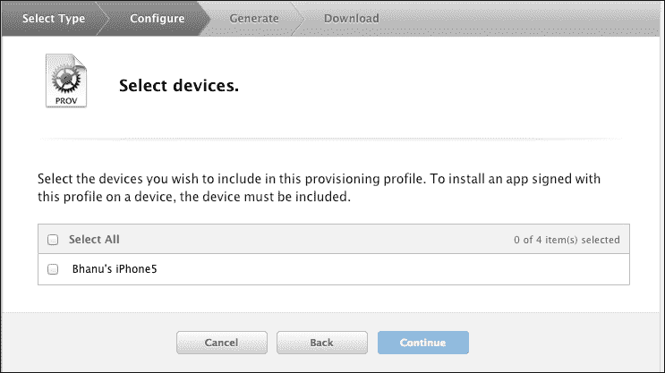

此过程完成后，您的配置文件将成功创建。现在，是时候创建分发配置文件了，该配置文件将用于在 App Store 上部署您的应用。要创建分发配置文件，点击左侧面板中**配置文件**菜单中的相同**+**按钮。

现在，检查页面设置，如图所示：

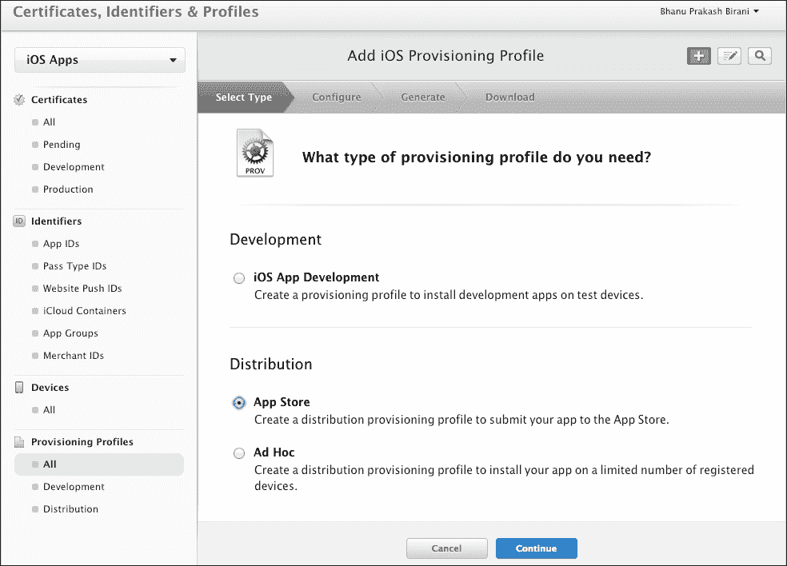

要创建分发配置文件，我们将从**分发**部分选择**App Store**。现在，点击**继续**，在下一页，选择我们在上一节中创建的应用 ID。此分发配置文件将绑定到所选的特定应用 ID。

现在，在下一页，选择**证书**并点击**继续**。

这将使您进入下一页，该页将要求输入配置文件的名称。只需为您的分发配置文件提供一个名称，然后点击**生成**，如图所示：

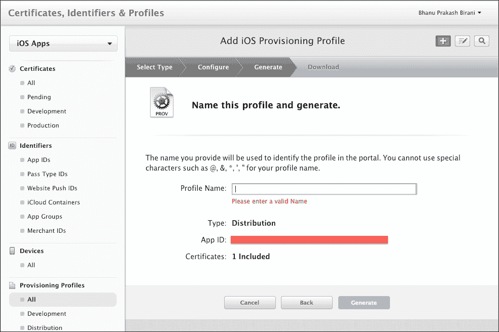

现在，您的分发配置文件已准备好在 App Store 上部署应用。现在是时候将配置文件和证书链接到 Xcode 了。因此，打开 Xcode 并转到**文件** | **偏好设置**。

然后，点击本章前几节中添加的账户。点击**查看详情...**按钮，如图所示：

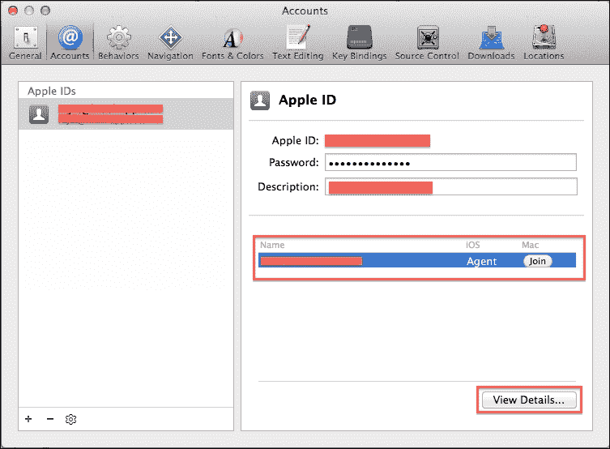

现在，你可以看到我们在前面的部分中创建的所有配置文件和证书，在列表中（如下所示）：

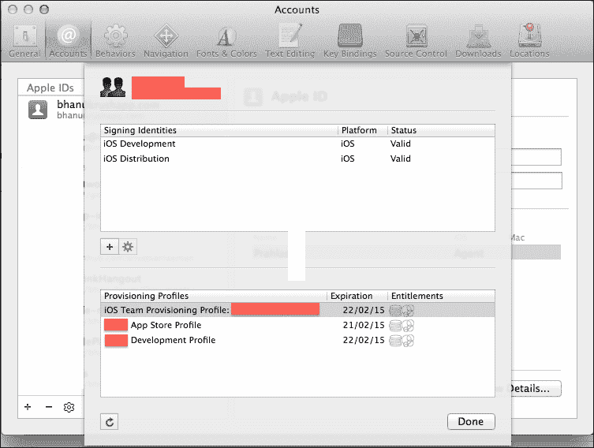

现在，你可以通过在设备上运行你的应用程序来测试你的开发配置文件。只需将设备连接到你的系统，并在检测到后从 Xcode 中选择它。现在，你可以通过点击 Xcode 中的 **播放** 按钮在设备上运行你的应用程序。

太棒了！所以，我们已经拥有了发布应用程序所需的一切。现在，打开你的 iTunes Connect 账户并接受所有联系人以启动账户。它还会要求你提供银行详细信息，以便将你的利润转入。

## 提交应用程序

为了提交你的应用程序，你需要以下项目。在我们开始之前，我们需要确保我们拥有所有这些：

+   应用程序名称

+   应用程序的描述

+   应用程序的图标，尺寸为 512px x 512px

你至少需要一张应用程序的截图。截图的大小应为 640 × 920（视网膜，无状态栏）；640 × 960（视网膜）；或者对于横幅，960 × 640（视网膜）。

我们需要将这些内容组装起来，然后在 iTunes Connect 中点击 **管理您的应用**。现在，点击 iTunes Connect 中的 **+** 按钮，结果屏幕如下所示：

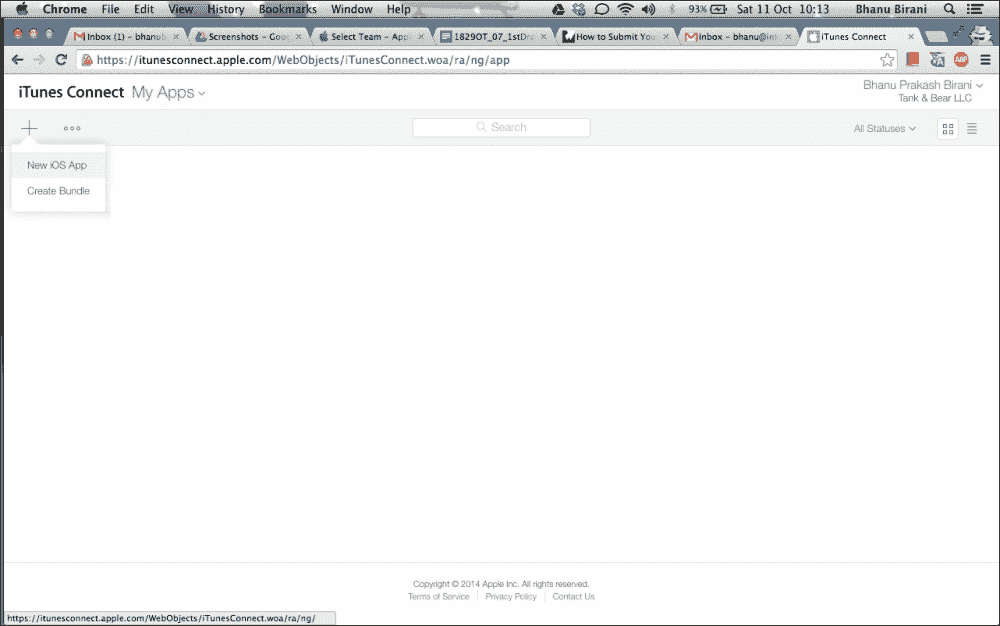

按照以下截图所示填写应用程序的所有必填字段：

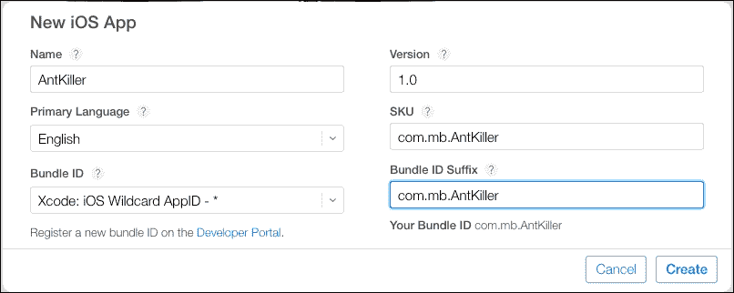

选择为我们应用程序创建的捆绑 ID，并同样填写所有必填字段。一旦你点击 **创建**，你将被带到下一页（如下所示）并要求提供更多关于应用程序的信息；这些信息包括截图、视频（如果有）、应用程序的描述以及与你的应用程序相关的类别信息。

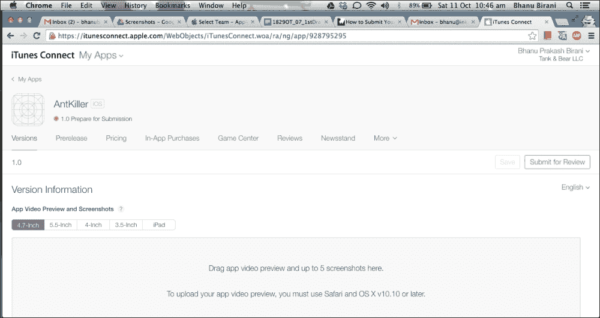

你可以在前面的截图所示的任何选项卡中选择和更新详细信息，并在提供完整信息后点击 **保存**。

## 使用 Xcode 提交

现在，是时候使用 Xcode 提交应用程序了，所以打开 Xcode 并转到 **产品** | **存档**。

一旦存档完成，点击 **验证**。这将检查你的二进制文件的验证情况，并列出所有问题（如果有）；如果没有问题，它将表示验证成功。现在，点击 **提交** 按钮将应用程序提交到 App Store，如下所示。这将要求你选择 **iOS 分发配置文件**以上传二进制文件到 App Store。选择我们在前面的部分中创建的配置文件，然后点击 **提交**。现在，你的应用程序将开始上传到 Apple Store。

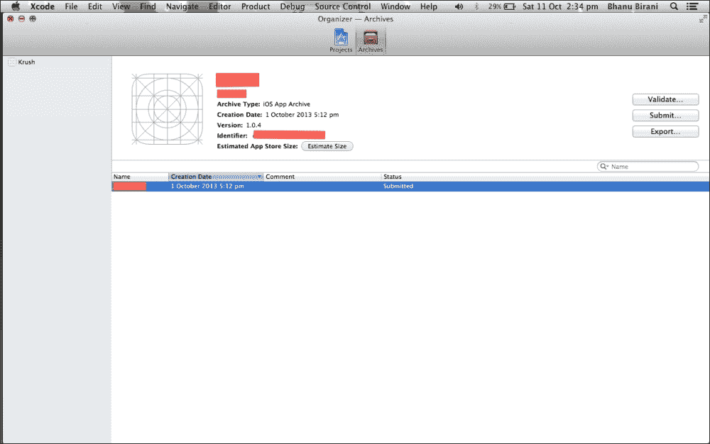

一旦二进制文件成功上传，你将收到一条成功消息。消息将类似于以下截图所示：

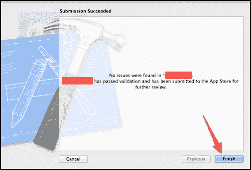

点击**完成**。现在，你可以打开你的 iTunes Connect 账户并检查你的二进制文件是否已接收。你还可以看到将几分钟后变为**等待审核**的**上传接收**消息。

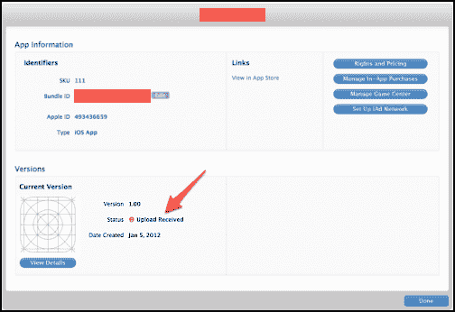

上传接收消息

恭喜！你已经成功将你的应用提交到 App Store！

# 摘要

在本章中，你学习了如何设置并理解你的开发者账户。你还学习了如何设置配置文件以在商店发布你的应用，我们讨论了使用苹果企业账户进行企业级分发的结构。
