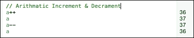
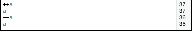
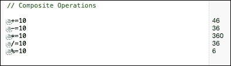
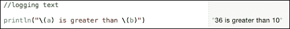
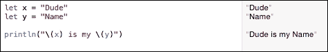
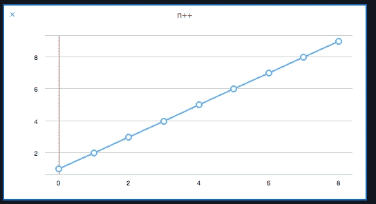
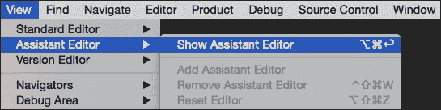
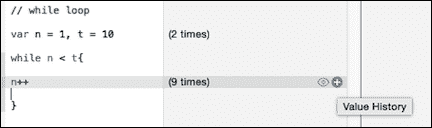
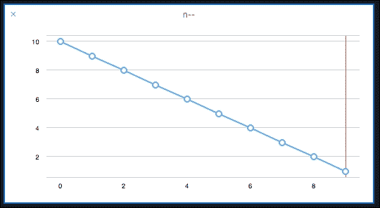
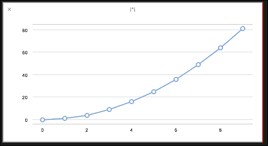

# 第二章。Swift 基础

好的，让我们开始。但在我们深入 Xcode 之前，你需要学习苹果的新编程语言——Swift。对于有其他语言编码经验的人来说，这看起来非常熟悉。苹果从脚本和底层语言中吸取了最好的部分和实践，并集成了它自己的几个惊人的特性，使得 Swift 对任何人来说都很容易入门，并开始编码。随着我们进一步学习，我们将看到苹果还增加了一些真正让 Swift 与其他语言相比更加出色的特性。

正如我们在第一章中看到的，我们将使用 Xcode 的 playground 来完成所有的编码。Playground 是一个非常通用的工具。每次你创建一个新文件，你都可以立即开始工作，而无需任何进一步的设置。它有一个内置的**结果**面板在右侧，每次你更改文件时，它都会实时编译你的代码。还有一个**辅助编辑器**窗口，它将给出我们在代码中做出的更改的图形表示。

在本章中，我们将从 Swift 语言的基础开始，从声明变量到条件语句、循环、数组、函数和类。那么，让我们开始吧。创建一个新的 playground 文件，你可以给它起任何你喜欢的名字，然后打开它。如果你在第一章中创建了一个文件，你将已经在`_Playgrounds`文件夹中有一个可以打开的文件。

本章将涵盖以下主题：

+   数据类型和运算符

+   语句

+   数组和字典

+   函数

+   类

+   可选参数

# 变量

如果你有一些在其他语言中编码的经验，你现在应该知道什么是变量。如果不是，那么知道变量是某种可以随时更改值的实体。这就是为什么它被称为变量。

在 Swift 中，你可以使用`var`关键字来定义一个变量，这与 JavaScript 类似。所以，如果我创建一个新的变量叫做`age`，然后我输入`var age`，这就足够了；变量已经定义了。

经验丰富的 C 语言程序员会注意到我在末尾遗漏了分号。嗯，Swift 中不需要分号，但如果你想使用分号，你当然可以这样做。我这样做是出于习惯，也是因为这是一个好的实践。这是因为当你用 Swift 编码了一段时间后，如果你不使用冒号，然后使用基于 C 的语言，你会在各个地方遇到错误。

但是等等！这里有一个错误。Swift 无法隐式地确定`age`数据类型是什么；也就是说，它是整数、浮点数、布尔值还是字符串？为了 Swift 能够隐式地分配类型，你必须初始化变量。我可以将一个人的年龄表示为一个值为`10`的`int`变量，一个值为`10.0`的`float`变量，或者一个值为`Ten`的`string`变量。根据你分配的变量类型，Swift 将知道该变量是`int`、`float`还是`string`类型。

我将分配一个值为 `10` 的 `age` 变量。在 **结果** 面板中，你会看到变量的值被打印为 **10**。这就是目前存储在 `age` 变量中的值。所以，如果你在下一行只输入 `age`，你将在右侧找到显示的结果。

如果你给 `age` 加上 `1`，你会看到结果为 **11**。这并没有改变 `age` 的值；只是这一行被评估并显示。如果你想将 `age` 的值更改为 `11`，你可以使用简写 `age++` 命令来增加值，就像你在 Objective-C 或任何其他基于 C 的语言中做的那样。

一旦一个变量被分配了某种类型，你就不能再分配其他类型的值。所以现在，如果你尝试分配 `11.0` 或 `Eleven`，它将不会被接受，并且你会得到错误。

好的，我们看到了如何分配 `int` 类型的变量，但如何分配 `float`、`string` 和 `bool` 呢？这可以通过以下代码片段来完成：

```swift
var height = 125.3
var name = "The Dude"
var male = true
```

如果我不想初始化一个变量怎么办？我们可以明确地告诉 Swift 变量的类型。我们可以通过告诉 Swift 我们想要分配的变量类型来告诉 Swift 变量是某种类型。我们通过在变量名称后面添加一个冒号和类型来实现这一点，如下面的代码片段所示：

```swift
var age:Int
var height:Float
var name:String
var male:Bool
```

### 注意

除了 `var` 关键字之外，你可能还看到了这个名为 `let` 的新关键字，这在 Swift 中非常常见。如果你不希望变量的值在代码中改变，那么你应该使用 `let` 关键字而不是 `var`。这也会确保即使你意外地更改了 `let` 存储的值，值也会保持不变。在其他语言中，这些也被称为常量，你可以使用 `const` 关键字来定义它们，但在 Swift 中，你使用 `let` 关键字。

在前面的例子中，你知道无论发生什么，`male` 在他的一生中始终是男性。所以，`bool male` 将保持 `true` 并保持不变；它永远不会改变（好吧，除非这个人真的很不满意他的性别）。一旦它被设置为 `true`，我们就不可以后来意外地将其更改为 `false`。所以，语法将变为以下形式：

```swift
let age = 10
let height = 125.3
let name = "The Dude"
let male = true
```

再次强调，即使你没有明确给出数据类型，你仍然需要初始化变量。所以，你可能认为你没有做任何改变。结果面板仍然显示与变量为 `var` 时相同的值。但现在尝试改变值。例如，假设你增加了 `age` 变量；现在尝试这样做，你一定会得到一个错误。

所以，如果你知道一个变量的值肯定会改变，使用 `var` 会更好。否则，使用 `let` 会更安全，这样可以避免因这种原因在代码中产生大量的错误。

现在你已经了解了如何声明和初始化变量，让我们使用这些变量通过运算符来进行一些操作。

# 运算符

运算符用于计算机语言中执行对变量的各种操作。这可能是一个算术操作（如加法），一个比较操作来检查一个数字是否大于或小于另一个数字，一个逻辑操作来检查条件是否为真或假，或者一个算术赋值，如增加或减少一个值。现在让我们详细看看每种类型。

## 算术运算符

电脑最初是为了执行数值运算，如加法、减法、乘法和除法而制造的。在 Swift 中，我们也有 `+`，`-`，`*`，`/` 和 `%` 等运算符。

让我们声明两个变量，`a` 和 `b`，并将它们初始化为 `36` 和 `10`。如果你想在 Swift 中进行单行初始化，你可以像以下代码片段所示那样做：

```swift
var a = 36, b = 10
```

你也可以使用分号来分隔它们，如下所示：

```swift
var c = 36; var d = 10
```

如果你想要初始化不同类型的变量，这很有用。现在让我们在变量之间使用运算符。结果应该是 `46`，`26`，`360`，`3` 和 `6`。注意，将一个 `int` 变量除以另一个 `int` 变量的结果是一个 `int` 变量，而不是像 `3.6` 这样的 `float` 变量：

```swift
a+b // 46
a-b // 26
a*b // 360
a/b // 3
a%b // 6
```

要得到确切的结果，我们需要对变量进行类型转换。类型转换与其他语言中的做法非常相似；你想要转换的变量类型被添加到变量前面的方括号中，如下所示：

```swift
Float(a)/Float(b) //3.5999999
```

## 比较运算符

逻辑运算符用于检查一个变量是否等于、小于、大于、小于等于或大于等于另一个变量：

```swift
a == b //false
a<b //false
a>b //true
a<=b //false
a>=b //true
```

## 逻辑运算符

与其他语言类似，你可以使用 `&&` 符号来检查两个操作之间的逻辑 AND 条件，使用 `||` 来检查 OR 条件。这两个符号用于检查两个表达式是否都满足其条件，或者只有其中一个条件为真：

```swift
a==b && a > b // false
a==b || a > b // true
```

在前面的例子中，我们知道 `a` 不等于 `b`，但 `a` 大于 `b`。因此，前面例子中的第一个语句是 `false`（因为它的两部分都不是 `true`），但第二个语句是 `true`，因为至少有一个条件是 `true`。

## 算术增量/减量

正如我们在第一个例子中通过在变量末尾添加 `++` 符号来增加年龄一样，我们也可以给变量赋一个 `--` 符号来减少其值。

### 小贴士

请记住，`a++` 与 `++a` 不同。它们分别被称为后增量运算符和前增量运算符。

在以下示例中，我们从初始值为 `36` 的变量 `a` 开始。

如果你执行 `a++`，这被称为后增量。它将首先显示结果，然后增加 `a` 的值。

因此，如果你执行 `a++`，它应该会增加 `a` 的值，但结果显示仍然是 `36`，这表明值还没有被增加。然而，在下一行，如果你要求它输出 `a` 的值，它将显示为 `37`。



如果你执行 `++a`，它被称为预增量。它将首先增加值，然后显示输出。所以在这种情况下，它将在你增加 `a` 的值的那一行显示 `37`，如果你要求它在下一行显示 `a` 的值，它将再次显示 `37`，就像这样：



这只是为了以防将来你遇到代码中的任何错误，并且想知道为什么你的表达式的正确值没有显示出来。

## 复合操作

我们还可以执行复合操作来增加、减少、乘以或除以一个更大的数，例如：`a+=10`、`a-=10`、`a*=10`、`a/=10` 和 `a%=10`，这些都是 `a = a+10`、`a = a-10`、`a = a*10`、`a = a/10` 和 `a = a%10` 的简写方式。所以，如果你用 `a+=10` 替换 `a = a + 10`，它仍然会给出相同的结果。这样做是为了优化代码的可读性。



# 语句

任何编程语言中的语句有两种类型——决策语句和循环语句。

## 决策语句

决策语句有以下类型：`if`、`if else`、`else if` 和 `switch`。这在任何编程语言中都是非常标准的。让我们首先看看 `if` 语句，看看其语法与其他基于 C 的语言有何不同。

### if 语句

在 Swift 中，`if` 语句的写法如下：

```swift
if a > b {

    println("a is greater than b")

}
```

立即，使用 C 语言的那些人可能会说，“亵渎！！没有括号！！”是的，在 Swift 中，为了简洁和可读性，你不需要使用括号。如果你想用，你仍然可以使用它们，而且不会得到任何编译错误。

但你绝对必须将语句包含在大括号内。即使它是一行语句，这也是绝对必要的。如果你不这样做，你肯定会得到编译错误。

### 注意

这里有一个关于在屏幕上记录代码的小提示：当我们开始开发游戏时，我们将非常广泛地使用这个功能，以确保程序确实在执行我们想要它执行的操作。因此，我们将记录语句以检查逻辑错误。

在 Objective-C 中，我们会使用类似 `NSLog(@"Print Stuff to Screen")` 或 `NSLog(@"My age is: %d", age)` 这样的代码。在 Swift 中，这有点不同。首先，你不需要在要记录的字符串前加上 `@` 符号。其次，为了打印值，我们必须使用 `\()` 并在括号中放入变量：

```swift
println("\(a) is greater than \(b)")
```



这同样适用于字符串：

```swift
let x = "Dude"
let y = "Name"
println("\(x) is my \(y)")
```



### if else 语句

与 `if` 语句类似，`if else` 语句的写法如下所示：

```swift
if a < b {

    println("\(a) is smaller than \(b)")

} else {

    println("\(a) is greater than \(b)")

}
```

我们不是检查 `a` 是否大于 `b`，而是检查相反的情况，现在它将通过进入 `else` 语句来打印 **30 大于 10**。

### else if 语句

与我们未在条件周围放置括号的`if`语句类似，在`else if`中，我们不需要在条件周围放置括号：

```swift
if a < b {

    println("\(a) is smaller than \(b)")

} else if a > b {

    println("\(a) is greater than \(b)")

}
```

因此，在这里，我们检查`a`是否大于`b`，然后打印以下语句（来自代码片段），而不是只检查`else`部分。

### 条件表达式

对于检查这样简单的语句，不需要 10 行代码，你可以使用条件表达式语句在一行内完成工作。如果你只是检查`if`-`else`，这会更受欢迎：

```swift
a > b ? a : b
```

在这里，我们检查`a`是否大于`b`。如果`a`大于`b`，则表达式评估为`true`，输出变为`36`。否则，输出变为`10`。

### `switch`语句

Swift 中的`switch`语句与其他语言的`switch`语句略有不同。像`if`语句一样，变量或表达式的括号不是必需的，但这不是唯一的区别。

所有语句都需要打印某个值，或者需要检查某个条件。你不能有一个空的`case`；这将产生错误。其次，由于所有语句都将被评估，因此不需要在每一行的末尾使用`break`。在其他基于 C 的语言中，所有行都将被评估和执行，而 Swift 中的`switch`语句则不同，其中只有有效的`case`将被执行。最后，`case`需要是穷尽的。这意味着需要在末尾有一个默认值，以便如果没有任何`case`匹配，则抛出一个默认值或语句。

让我们看看`switch-case`的一个例子：

```swift
var speed = 30

switch speed {

case 10 : " slow "
case 20 : " moderate"
case 30 : " fast enough"
case 40 : " faster "
case 50 : " fastest "
default : " value needs to >= 10 or <= 50"

}
```

在这里，创建了一个名为`speed`的新变量。根据速度的值，系统将打印值是慢还是最快。如果`speed`不是一个数字，或者值不在`10`到`50`之间，将打印默认消息。因此，在这种情况下，由于值与`case 30`匹配，它将打印**足够快**。

对于情况语句的固定值，你也可以提供一个范围，使得该语句为`true`。例如，如果值在`0`到`10`之间，你希望输出为**慢**。你可以通过在第一个情况中将范围从`0`到`10`表示为`0…10`来实现。重要的是，你需要在值之间放置三个点，因为它们形成一个运算符。

因此，现在，如果你将速度的值更改为`0`到`10`之间的任何值，输出将变为**慢**。同样，范围也可以用于其他情况语句：

```swift
switch speed {

case 0...10 : " slow "
case 20 : " moderate"
case 30 : " fast enough"
case 40 : " faster "
case 50 : " fastest "
default : " value needs to >= 10 or <= 50"

}   
```

## 循环语句

循环语句用于无限执行特定代码块，或者执行指定次数，或者直到满足某个条件。像任何其他语言一样，我们有`while`、`do while`和`for`循环，以及像 C#和 C++11 中的`for each`循环。

### `while`循环

在`while`循环中，我们首先给出一个条件。如果条件保持`true`，则代码后面的块将一直执行。

对于这个例子，我们创建了两个变量，`n`和`t`。我们将`n`设置为`1`，将`t`设置为`10`。在条件中，每次代码执行时我们都会增加值：

```swift
var n = 1, t = 10

while n < t{

n++

}
```

再次强调，没有必要在条件周围放置括号。但你会看到，在结果面板中，除了打印了九次之外，没有其他输出。

在这里有一个加号图标，旁边还有一个图标。按下它将打开一个新面板。这被称为**辅助编辑器**。在其中，你会看到一个图表。这显示了循环运行期间`n`值的增加。它从`1`开始，一直增加到`9`，因为我们告诉循环只在`n`的值小于`10`时运行。你可以将鼠标箭头移到节点上，以了解每个节点的值。或者，还有一个滚动条可以滚动到图表。



你也可以通过在 Xcode 中转到**视图** | **辅助编辑器** | **显示辅助编辑器**来打开**辅助编辑器**：



点击值历史图标以打开图表：



### `do while`循环

与`while`循环类似，`do while`循环的代码块在条件为`true`时执行。然而，在这种情况下，块至少执行一次，然后检查条件。

在这里，每次进入循环时，我们都会将`n`的值减 1，并检查该值是否大于`0`。如果是，则执行代码块。前一条代码中`n`的值是`10`，所以它从`10`开始，回到`1`。再次，这可以通过点击结果面板上的图标在图表中看到：

```swift
do{

    n--

} while n > 0

```



### 小贴士

请务必确保条件会被满足。否则，它将导致无限循环，使你的系统变得不稳定。

### `for`循环

`for`循环可以写成如下所示。即使没有括号，它也能正常工作：

```swift
for var i=0; i < 10 ; i++ {

    i*i

    }
```

在这里，我们不是每次都加`1`，而是将`i`的值乘以自身，在图表中得到一条曲线，范围从`0`到`81`。



### `for in`循环

就像其他语言中的`for each`循环一样，Swift 中也有`for in`循环。它遍历循环中的每个项目，并执行代码中声明的任何内容。在这里，与其他语言不同，没有必要指定变量的类型。Swift 会根据你想要它遍历的项目列表自动理解变量类型。例如，遍历整数列表可以写成以下形式：

```swift
for l in 1...10{

    l * l * l

}
```

在这里，尽管我们在代码中从未提到`l`是整型，但 Swift 根据我们在代码中给出的值列表自动理解了它。由于给出的列表类型是`int`，`l`的值自动被分配为`int`类型，并提供了输出：


此外，在遍历数组的索引时，我们希望从`0`开始，到倒数第二个值结束。当指定范围时，可以使用`..<`而不是`…`运算符来实现这一点。因此，在前面的例子中，如果我们需要从`0`到`9`，我们可以将代码重写如下：

```swift
for l in 0..<10{

    l * l * l

}
```

这显然不仅限于数字；我们可以遍历任何数据类型。例如，我们可以像这样遍历字符串中的字符：

```swift
for c in "string"{

    println("character \(c)")
}
```

在这里，并没有明确提到变量的类型是`char`，然而 Swift 能够隐式判断`c`应该是`char`类型。在控制台中，每个字符将显示如下：

```swift
character s
character t
character r
character i
character n
character g
```

# 数组

数组是一段连续的内存块，用于存储某种类型的数据。它可以是一个预定义的数据类型，如`int`、`float`、`char`、`string`或`bool`，或者它可以是用户定义的。此外，数组是零基的，这意味着数组中的第一个对象是`0`。

数组可以是`var`或`let`类型。如果我们创建一个`var`类型的数组，那么我们可以像在 Objective-C 中拥有`MutableArray`一样更改、添加或从数组中删除对象。如果你想在 Swift 中有一个`ImmutableArray`数组，而不是使用`var`，请使用`let`关键字。Swift 中的数组可以声明和初始化如下：

```swift
var score = [10, 8, 7, 9, 5, 2, 1, 0, 5, 6]

var daysofweek = ["Monday", "Tuesday", "Wednesday"]
```

现在，如果我们想要声明一个数组并在稍后初始化它，我们可以按照以下代码片段所示进行声明：

```swift
 var score : [Int]

var daysofweek : [String]
```

在这里，你必须提供数组将要存储的数据类型。它与定义常规变量非常相似；只是这里的类型被方括号包围。现在我们可以像之前一样初始化它：

```swift
score = [10, 8, 7, 9, 5, 2, 1, 0, 5, 6]

daysofweek = ["Monday", "Tuesday", "Wednesday"]
```

要获取一个索引处的项目，你可以使用带有索引数字的变量名，放在方括号中：

```swift
Score[0] // output: 10

Score[5] // output: 2   
```

## 遍历数组

要遍历数组，我们可以使用`for in`循环，就像我们在循环中看到的那样。在这里，我们不是传递范围，而是提供范围本身，并且像之前一样，Swift 会自动确定数组中的数据类型：

```swift
for myScore in score {

myScore

}

for day in daysofweek{    

    println("\(day)")

}
```

## 向数组中添加、删除和插入对象

要向数组中添加项目，你可以使用`append`方法。因此，要将值添加到`score`或`daysofweek`数组中，我们按照以下代码片段所示进行操作。这将把对象添加到数组的末尾：

```swift
score.append(10)
daysofweek.append("Thursday")
```

你可以通过调用以下方法来移除数组中的最后一个对象：

```swift
score.removeLast()
```

如果你想要删除特定索引处的对象，你可以使用以下行：

```swift
score.removeAtIndex(5) 
```

这将移除第五个索引处的元素，在这里是`2`。要在一个特定的索引处插入一个项目，我们必须提供值和项目要插入的索引：

```swift
score.insert(8 ,atIndex: 5)
```

## 重要的数组函数

除了`append`、`remove`和`insert`等函数之外，还有其他我们将经常在游戏中使用的内置函数。第一个是`count`函数，它告诉我们数组中有多少个元素：

```swift
score.count
```

另一个函数是 `isEmpty`，它可以用来检查一个数组中是否包含任何项目：

```swift
score.isEmpty 
```

# 字典

在其他语言中也称为映射或哈希表，字典——就像数组一样——是一种数据集合类型。然而，与数组不同——在数组中，每个元素只能通过索引号访问——在字典中，我们将提供键，通过这些键我们可以访问特定索引处的元素。键和值的值可以是 `int`、`float`、`bool` 或 `string`。键不能重复，但在字典中显然可以有重复的值。

例如，让我们看看国际足联的国家代码列表：

| Code | 国家 |
| --- | --- |
| AFG | 阿富汗 |
| ALB | 阿尔巴尼亚 |
| ALG | 阿尔及利亚 |
| ASA | 美属萨摩亚 |
| AND | 安道尔 |
| ANG | 安哥拉 |
| AIA | 安圭拉 |
| ATG | 安提瓜和巴布达 |
| ARG | 阿根廷 |
| ARM | 亚美尼亚 |

左侧列中的代码可以称为 **键**，右侧的 **国家** 列表示 **值**。所以，当我想引用阿根廷时，我可以简单地调用 ARG，Swift 会自动理解我是在引用阿根廷。这里还有一个例子：当我们说，“获取 `ATG` 键的值”时，程序将知道我们是在引用安提瓜和巴布达。

字典的优势在于数据不需要排序。如果我们知道键值对存在于字典中，无论它在列表中的位置如何，我们都可以通过键来获取值。

这种语法与数组类似。唯一的区别是在声明时，我们不仅要提供一个变量类型，还要提供两个类型，第一个是键的类型，第二个是值的类型。

再次强调，如果你已经知道 `key` 和 `value` 的类型，你不需要显式提供类型：

```swift
var countries = ["AFG": "Afghanistan",
                "ALB": "Albania",
                "ALG: Algeria"] 
```

键值对可以是任何组合。这意味着你可以有一个 `key` 变量是 `int` 类型，而 `value` 是 `string` 类型；`key` 是 `string` 类型，而 `value` 也是 `string` 类型，如示例所示；或者 `key` 是 `string` 类型，而 `value` 是 `int` 类型；等等。一旦声明了字典键和值的类型，就不能更改或提供不同的类型。另外，如果你已经声明键将是 `string` 类型，就不能添加 `int` 类型的键。

我们还可以显式地指定键值对的数据类型，如下所示：

```swift
var states:[String: String]
```

这告诉我们键将是 `string` 类型，与这些键关联的值也将是 `string` 类型。如果我们想存储一组键的种群，可以按照以下方式操作：

```swift
var population: [String: Int]  
```

## 向字典中添加和删除对象

要向现有字典中添加新的键值对，我们可以简单地运行以下两行代码之一：

```swift
countries["GER"] = "Germany"
countries.updateValue("Netherlands","NED")
```

然而，请注意，如果键已经存在，它将覆盖当前持有的值。

如果你想要删除一个键值对，你可以使用以下任一语句来删除它：

```swift
countries["ALB"] = nil 
countries.removeValueForKey("AND")
```

现在，如果我们尝试访问键值对，我们会注意到它不仅删除了由键存储的值，还删除了键本身。

## 遍历字典中的项

再次强调，我们可以使用`for-in`循环来访问存储在每个键值对中的数据，但我们需要在括号中提供两个值，用逗号分隔键和值：

```swift
for (code, country) in countries{

println("\(code) is the code for \(country) ")

}
```

控制台输出将如下所示：

```swift
GER is the code for Germany 
AFG is the code for Afghanistan 
ALG is the code for Algeria 
NED is the code for Netherlands
```

## 字典函数

与数组类似，字典也有内置函数来确定其中存在的键值对数量。它还有一个`isEmpty`函数，可以调用字典来了解它是否包含任何键值对：

```swift
countries.count
countries.isEmpty
```

# 函数

函数是一段用于执行特定任务的代码块。它可以用来分配一个可重用的代码块，你可以反复调用它而无需每次都重写代码来执行该任务。

## 简单函数

Swift 中的函数编写如下：

```swift
func someFunction(){

Println(" performing some function ")

} 
```

因此，在函数之前，我们需要使用`func`关键字，后跟函数名，括号，以及大括号。

调用函数在这里与任何其他语言非常相似，即函数名后跟括号：

```swift
someFunction() 
```

## 传递参数

现在，要对传递给函数的变量执行某些任务，我们首先需要将一个参数传递给函数。这可以这样做：

```swift
func printText(mtext: String){

    println("Print out \(mtext)")

}
```

这里，我们必须在括号内提供输入变量类型。当函数期望一个字符串时，我们不能在这里提供一个整数，因为它明确地接受类型。

要执行函数，请调用函数，并在括号内包含你想要执行函数的文本：

```swift
printText("Hello Function")
```

应该注意的是，传递给函数的值默认是常量。这意味着即使我们没有指定`mtext`是变量还是常量，它仍然是一个常量。因此，你将无法在函数内对其进行任何修改。

如果你的代码需要类型是变量而不是常量，你需要在创建函数时指定这一点：

```swift
func printVarText(var mtext: String){

    mtext = "Text Changed"

    println("Print out \(mtext)")

}
```

## 传递多个参数

我们显然可以传递多个变量。在这里，你需要用逗号分隔变量类型，如下所示：

```swift
func calcSum(a: int, b: int){

let sum = a + b

println("The sum of the numbers is: \(sum) ") 

}
```

这里，我们向函数传递两个数字，`10`和`15`。我们执行它们的加法，将值存储在名为`sum`的常量中，并通过调用以下函数将其打印到控制台：

```swift
calcSum(10, 15)
```

## 返回值

对于 C++用户来说，这可能会显得有些奇怪。同样，不习惯指针的人可能会对函数返回参数的语法感到恐慌，因为它在 Swift 中使用指针运算符。别担心！这绝对与指针无关。这只是显示这个函数将返回一个数据类型，仅此而已。

函数的编写方式与通常一样，但在括号后面指定返回类型时，我们输入破折号和大于号，然后输入返回类型。

这里，我们使用一个接受两个`int`值并返回`int`值的函数执行乘法运算。我们通过执行乘法操作计算值，将值存储在一个名为`mult`的常量中，然后返回该值。

函数被调用，结果存储在一个变量中，然后打印到控制台：

```swift
func mult(a: Int, b: Int) -> Int{

let mult = a * b

return mult

}

let mVal = mult(10, 20)

println("The Multiplied valued is = \(mVal)")
```

这里，控制台将输出乘积值——`200`。

## 默认和命名参数

如果我们想在函数的参数中指定默认值，我们当然可以这样做，如下所示：

```swift
func defMult(a: Int = 20, b: Int = 30) -> Int{

let mult = a * b

return mult

}

let dVal = defMult()

println("The Multiplied valued is = \(dVal)")
```

这里，我们指定`20`和`30`作为默认值。我们只需调用函数即可得到输出`300`。

但如果我们只想修改一个值，而保留其他值使用默认值怎么办？在这种情况下，我们将在调用函数时通过名称指定一个值。所以，如果我们想将`a`的值设置为`80`而不是默认值，我们将这样做：

```swift
println("The Multiplied valued is = \(defMult(a: 80))")
```

如果我们想改变两个值，我们也可以这样做，如下所示：

```swift
println("The Multiplied valued is = \(defMult(a: 80, b: 50))")
```

## 返回多个值

在 Swift 中，我们可以使用元组返回多个值。

### 注意

元组是可以存储两个值的变量，就像数组一样。实际上，包含三个值的变量被称为 3 元组。

元组可以这样初始化：

```swift
var person : (int, string)
```

单个值可以初始化，如下所示：

```swift
person.0 = 23
person.1 = "The Dude"  
```

你也可以为变量命名以方便使用。然后你可以通过名称来访问它们以分配值，而不是使用索引：

```swift
var person2:(age:Int, name: String)
person2.age = 23
person2.name = "The Dude"
```

在 Swift 中，你将能够传递实际值，对变量执行一些操作，然后返回变量。当返回两个值时，我们需要提供两个值的返回类型，用逗号分隔：

```swift
func getAreaAndPerimeter(a: Int, b: Int) ->(Int, Int){

  let area = a*b

let perimeter = 2a+ 2b 

return(area, perimeter)
}
```

因此，在先前的函数中，我们接受两个整数，计算矩形的面积和周长，然后返回这两个值：

```swift
let value = getAreaAndPerimeter(40 ,80)
```

值存储在一个名为`value`的常量中，要将值输出到控制台，我们使用点操作符。它用`0`来获取第一个值，用`1`来获取第二个值：

```swift
println("Area is = \(value.0) and Perimeter is = (value.1)")
```

这有点麻烦，因为我们必须记住返回的第一个值是面积，第二个值是周长。但在 Swift 中，这也可以很容易地解决。就像我们传递时命名值一样，我们也可以命名返回的值。然后，而不是使用索引值，我们可以使用名称本身来访问值：

```swift
func getNamedAreaAndPerimeter(a: Int, b: Int) ->(area: Int, perimeter: Int){
        let  area = a * b
        let  perimeter = 2 * a + 2 * b

        return (area, perimeter)
}

let namedvalue = getNamedAreaAndPerimeter(80 ,100)

println("Named Area is = \(namedvalue.area) and Named Perimeter is = \(namedvalue.perimeter)")
```

# 类

与 Objective-C 或 C++相比，在 Swift 中创建类相当简单。不需要像接口文件和实现文件这样的单独文件。此外，也没有使用属性关键字来定义属性。所有 Swift 文件都以`.swift`扩展名结尾。

## 属性和初始化器

在创建类时，我们必须使用`class`关键字：

```swift
Class Character{

var name = "The Dude"

var health = 100

}
```

还要注意，在结束括号之后没有分号。要实例化 `character` 类型的变量，可以使用以下代码行。在这种情况下，根本不需要 `alloc`，就像在 Objective-C 中那样：

```swift
var theDude = Character()
```

可以使用点操作符访问 `name` 和 `health` 属性：

```swift
theDude.name

theDude.health
```

要初始化变量，我们需要使用 `init` 函数。这是类的构造函数，它不需要 `func` 关键字，这在创建任何其他函数时是必需的。所以，如果你想在 `init` 函数中初始化 `name` 和 `health` 变量，你必须像以下代码片段中那样做。注意，在这种情况下，你需要明确为 `name` 和 `health` 变量提供变量类型：

```swift
class Character1{

    var name: String

    var health: Int

    init(){

      name = "The Dude"
      health = 100

    }
}
```

我们可以像以前一样实例化和访问类的属性。我们肯定可以创建尽可能多的自定义初始化器。这些也会使用 `init` 关键字，并且你可以在括号中传递变量的类型并将值分配给属性：

```swift
class Character2{

var name: String
var health: Int

    init(){

        name = "The Dude"
        health = 100
    }

    init(name: String){

        self.name = name
        self.health = 100
    }

}
```

注意，在这里，在将传递给属性的变量赋值时，我们执行 `self.name` 以告诉代码我们将传递变量的名称赋给类的 `name` 属性。

此外，在传递值时，我们必须提到我们将它传递给 `name` 参数：

```swift
var hero = Character2(name: "Hero")

hero.name
hero.health
```

## 自定义方法

我们显然可以在类中创建自定义方法。这里，假设我们想让角色在被击中后受到一些伤害。为此，我们将创建一个新的方法，如下所示。在类的结束括号之前添加此块：

```swift
    func takeDamage(damage: Int){

        self.health -= damage

    }
```

类中的方法定义方式与其他任何函数一样。这里，我们定义了一个名为 `takeDamage` 的方法，它接受一个名为 `damage` 的 `int` 类型的变量。现在我们可以调用这个函数在之前实例化的 `hero` 变量上，并传递 `10` 以让英雄受到 10 点伤害。如果我们再次调用 `health` 属性，我们会看到英雄的健康值下降了 10 点：

```swift
hero.takeDamage(10)

hero.health
```

现在，让我们给类添加一个名为 `armour` 的属性，类型为 `int`。让玩家的初始护甲等级为 `10`。每次玩家受到攻击，他的护甲也会下降：

```swift
    func reduceArmour(damage: Int, armour: Int){

        self.health -= damage
        self.armour -= armour
    }
```

我们添加了一个名为 `reduceArmour` 的新函数。在其中，我们接受一个名为 `damage` 的额外参数，并减少类中 `armour` 属性的相应数量：

```swift
hero.reduceArmour(10, armour: 2)
hero.health
hero.armour
```

现在，当我们想要调用方法时，我们必须明确指出传递的第二个值是用于 `armour` 的。当我们调用 `health` 和 `armour` 属性时，我们可以看到 `health` 再次减少了 10 点，而英雄的护甲现在减少了 2 点。

## 继承

就像在其他任何我们希望重用或扩展现有类的面向对象语言中一样，Swift 也允许继承。要继承另一个类，我们需要使用冒号并在定义当前类时指定我们想要扩展的类的名称。

### 小贴士

Swift 不允许多重继承。

假设我们想要创建一个 `Mage` 类，法师有一个名为 `magic` 的属性，这样她就可以在普通伤害之外造成一些“魔法”伤害：

```swift
class Mage: Character2{

    var magic: Int

    override init(name: String){

        self.magic = 100
        super.init()

        //self.name = name
        //self.health = 60
        //self.armour = 15
    }

}
```

在这里，我们创建了一个名为 `Mage` 的新类，并从 `Character2` 类继承。我们需要使用 `override` 关键字来告诉代码我们正在重写 `Character2` 类的 `init` 函数，这是超类。

在 Objective-C 中，我们通常会先调用 `super.init`，但在 Swift 中，我们需要先初始化 `magic` 属性，因为这个属性在超类中不存在。因此，我们首先初始化它，然后调用 `super.init` 方法。

如果我们为名为 `vereka` 的角色创建一个新的变量，其类型为 `Mage` 并将其命名为 `vereka`，我们会看到分配的名称和其他值是 `Character2` 超类的，而不是我们分配的名称：

```swift
var vereka = Mage(name: "Vereka")

vereka.name
vereka.health
vereka.armour
vereka.magic
```

为了为新名称分配，我们必须在 `Mage` 类的 `init` 方法中调用 `super.init` 之后再次初始化它。因此，我们在 `Mage` 类中取消注释分配名称和新的 `health` 以及 `armour` 值的代码行。现在，将显示正确的 `name`、`health`、`armour` 和 `magic` 值。

## 访问修饰符

在 Swift 中，有可以用来封装类、属性和方法的访问修饰符。访问修饰符提供了对变量的读写访问。Swift 中既有常规的 `public` 和 `private` 访问修饰符。

当创建一个类时，如果一个变量或函数被设置为 `public`，那么任何类都可以访问并修改该变量，但如果它被设置为 `private`，那么其他类则不能访问该变量。

除了公共和私有访问修饰符之外，还有一个额外的修饰符称为 `internal`。如果你在 Objective-C 或 C++ 中使用过封装，你会很高兴地知道在 Swift 中公共和私有变量几乎以相同的方式工作，而 `internal` 替换了 `protected` 封装类型。

在 Swift 中，`internal` 规范是默认规范类型，与 C++ 不同，在 C++ 中，如果没有指定，默认规范是私有。

尽管我们没有在 `Character2` 类中指定访问修饰符，但我们仍然能够在 `Mage` 类中访问其变量和函数，因为它们是内部的，可以被子类访问：

```swift
public class myCharacter {
         public var name: String
         private var age:Int  
         var speed:Int         

        public init(){         
          self.name = "The Dude" 
          self.age = 100     
          self.speed = 20
      }
} 
```

`myCharacter` 类和 `name` 变量是公开的。`age` 变量是私有的，速度被假定为内部变量，因为它没有其他指定。

# 可选类型

可选类型是 Swift 中的新数据类型。在本章迄今为止的所有案例中，我们总是初始化了一个变量，无论是直接初始化还是在一个类的初始化器中初始化。如果我们没有初始化变量就开始使用它，我们会得到一个错误，说我们还没有初始化它。快速修复方法是将其初始化为 `0` 或 `""`。

假设这个变量是`score`，我们将其值初始化为零以消除错误。现在我们尝试检索 GameCenter 中存储的最后分数。由于某种原因，没有互联网连接或 Wi-Fi，所以我们无法检索该玩家的最后`score`。如果我们显示分数在屏幕上，它将显示**0**，因为这是存储在`score`中的值。玩家会非常困惑和沮丧，因为他们确信在他们的最后一次尝试中分数远高于零。现在，我们如何告诉玩家我们无法检索分数是因为他们忘记支付互联网账单呢？

换句话说，我们如何告诉程序`score`中没有值？我们甚至不能将`score`等于`nil`，因为我们将会得到一个错误，说它不是`nil`类型。为此，我们在类型后加上一个问号。这意味着如果我们分配一个值，它将是`int`类型；否则，它应该被视为`nil`。

现在，在显示分数的时候，我们可以检查值是否为`nil`。如果是，我们可以打印一条消息说明没有互联网连接，如果`score`包含一个值，我们也可以打印出来：

```swift
var score:Int?

if score != nil {

    println("Yay!! Your current score is \(score)")

}else{

    println(" No internet! Pay your bills on time ")
}
```

之前的代码将从`else`块中打印出来，因为值没有被分配——它仍然是`nil`。

现在，如果我们分配一个值，比如说`score = 75`，它将打印这个值，但会带上可选关键字以及括号内的值。这是因为，由于我们指定的类型是可选的，它让我们知道数据类型。

为了在记录时不出现在可选关键字，我们需要“展开”可选类型。这是通过在`if`块中跟随`score`变量并使用感叹号来完成的，如代码行所示：

```swift
println("Yay!! Your current score is \(score!)")
```

可选关键字现在在记录分数时将消失。

你可能不会在你的游戏中使用可选参数，但如果你不得不这么做，当你看到其中一个时，至少不会感到惊讶。

# 摘要

在本章中，我们看到了 Swift 语言的一些基础知识。这应该让你对语言有足够的了解，以便从下一章开始，你将有一个很好的语法概念，并确切地知道代码中发生了什么。你现在也可以回顾一下第一章，看看 SpriteKit 和 SceneKit 项目文件中的代码，看看你是否能理解这些代码。

正如章节所说，这只是一个 Swift 语言的入门介绍。与其他语言相比，这个语言在某些方面非常相似，在其他方面则非常不同。在接下来的章节中，当我们遇到这些差异时，我会指出它们，这样你就能清楚地意识到错误，并知道如何绕过它们，更好地理解它们。

在下一章中，我们将深入探讨 Xcode，从 Xcode 的基础开始。
