# 第六章：音频和视差效果

在 SpriteKit 中添加背景音乐和音效非常简单，因为它只需要调用一行代码。在添加效果时需要考虑一些重要的事情；例如，在请求 SpriteKit 播放声音后，场景会改变吗？以及应该使用哪种格式的音频文件？

在本章中，我们将为游戏添加背景音乐，并为火箭发射、敌人被火箭击中、屏幕上的按钮被按下以及游戏结束时添加音效。我们还将查看一个可以用来将一个音频文件从一种格式转换为另一种格式的免费应用程序。最后，我们将为背景添加一个漂亮的滚动效果，以增加额外的乐趣。

本章涵盖了以下主题：

+   音频文件格式

+   下载和安装 Audacity

+   转换音频格式

+   添加音效

+   添加背景音乐

+   视差背景——理论

+   实现视差效果

# 音频文件格式

SpriteKit 允许我们使用 OSX 标准的 `.caf` 音频文件格式，但它也支持 `.mp3` 文件。理论上，你可以使用这些格式中的任何一个来在游戏中播放音频或效果。你所需做的只是更改在请求 SpriteKit 播放文件时调用的文件名。但为了优化，我们将使用 `.mp3` 文件格式。原因是 `.mp3` 文件的大小比 `.caf` 文件小得多。以背景音乐文件为例；`.caf` 文件大小为 5.2 兆字节，而 `.mp3` 文件仅为 475 千字节——大约是 `.caf` 文件大小的十分之一，玩家的体验不会有任何不同。

添加的音频文件越多，它将增加捆绑包的大小，这将极大地增加游戏的大小，并使玩家下载和玩游戏的时间更长。对于像我们这样的小型游戏，这可能不是很重要，但当你开始制作包含更多音效和背景音乐的更大游戏时，这是需要记住的事情。

虽然 `.mp3` 是一个非常流行的格式，但有时你可能需要将音频文件格式转换为 `.mp3`。在下一节中，我们将看到如何确切地做到这一点。

# 下载和安装 Audacity

Audacity 是一款免费的跨平台音频录制和编辑软件。你可以从 [`audacity.sourceforge.net/`](http://audacity.sourceforge.net/) 下载最新版本。尽管版本 2.06 表示它是为 Mac OS X 10.4 到 10.9.x 设计的，但它也可以在 Yosemite 上运行。

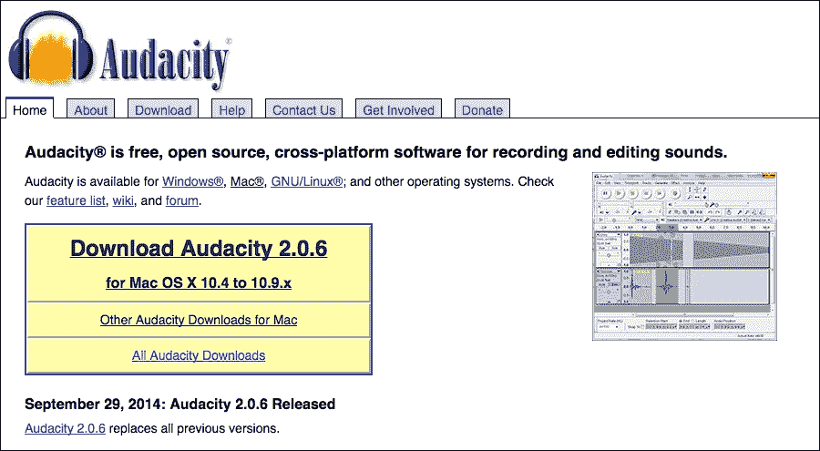

下载 DMG 文件，双击它，然后将 Audacity 文件夹拖到你的 **应用程序** 目录中。从启动台，点击 **Audacity** 应用程序以打开它。

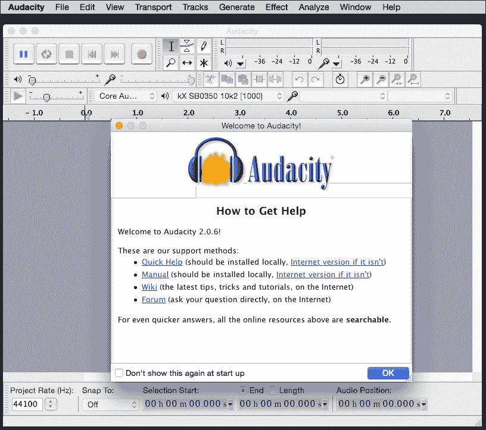

您可以点击**快速帮助**、**手册**、**Wiki**和**论坛**链接来了解更多关于软件及其功能的信息。点击**确定**继续。

我不是声音工程师，所以我真的不是告诉您或解释每个标题做什么的合适人选。我真正能说的是，如果您对声音编程或工程有所了解，您可以用这个免费开源应用程序真正施展魔法。例如，我们可以通过将文件频率从 44 kHz 降低到 22 kHz 来减小文件大小，如下面的截图所示，或者将格式从双声道或立体声减少到单声道。

要更改频率，点击文件名称旁边的向下箭头，选择**设置速率**，并选择**22050 Hz**而不是**44100 Hz**：

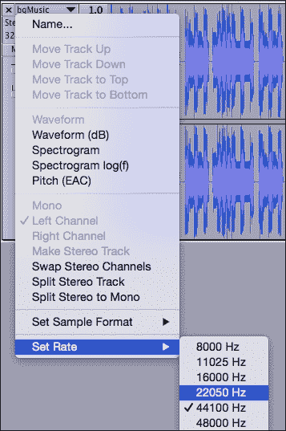

# 转换音频格式

要将格式转换为 MP3，请转到**文件** | **导入** | **音频**。在本章的`Resources`文件夹中，您将找到一个名为`Game Audio Files`的文件夹。在这个文件夹内，还有一个名为`caf`的文件夹。在这个文件夹中，您将找到所有`.caf`格式的音频文件。选择文件夹中的所有文件，然后点击**打开**。现在所有文件都将导入到当前项目中。

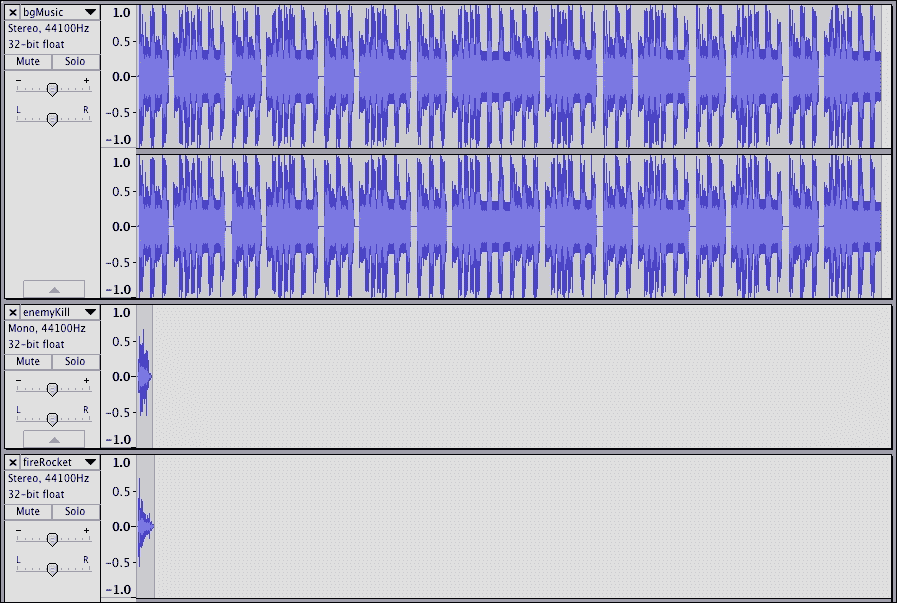

一旦所有文件都导入，要将它们转换为 MP3 文件，您需要从[`lame.buanzo.org/#lameosxdl`](http://lame.buanzo.org/#lameosxdl)安装 lame 库。我知道它的名字很俗气，但它确实有效。下载第一个链接，上面写着**适用于 Audacity 1.3.3 或更高版本**。下载 DMG 文件，打开包，并安装它。

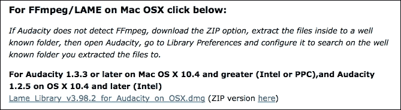

现在回到 Audacity，导航到**文件** | **导出多个**。以下窗口将打开：

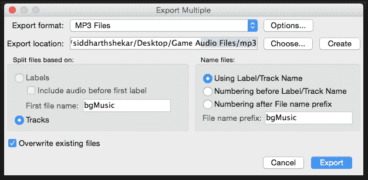

在打开的窗口中，选择格式为**MP3 文件**。对于导出位置，我在`Game Audio Files`文件夹中创建了一个名为`mp3`的新文件夹。对于文件名，选择第一个选项，以便它将保持与我们要提供的文件相同的标签名称。您可以根据您的偏好勾选或取消勾选**覆盖现有文件**框。

### 小贴士

请记住，如果您勾选此框，所有具有相同名称的文件在将来都会被覆盖，所以请小心。

点击**导出**开始转换过程。然后点击所有正在导出的文件的**确定**。您将收到一条确认信息，表明所有文件都已成功转换，如下所示：

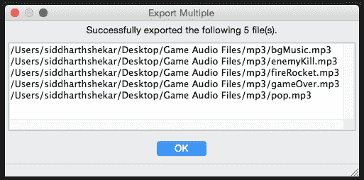

现在，如果您查看`mp3`文件夹，您将看到所有文件都已转换为`.mp3`格式。

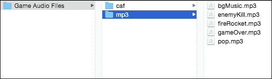

文件准备就绪后，我们可以为游戏添加声音和效果。

# 添加音效

如我之前所述，在 SpriteKit 中添加声音和效果非常简单。实际上只需要添加一行代码来创建所需的音效。

首先，我们将所有文件导入到项目中。因此，选择您之前创建的文件夹中的所有`.mp3`文件，并将它们拖入项目中。

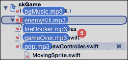

确保您已勾选**“如有需要则复制项目”**，并且您的项目已选为目标。

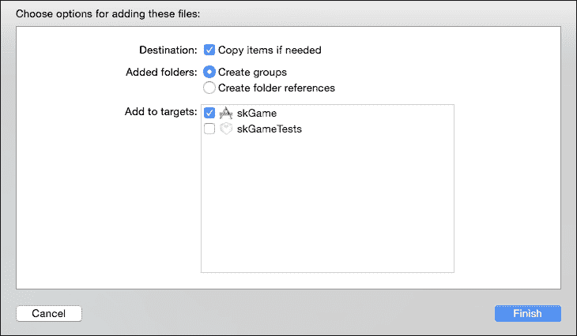

此外，请确保文件位于**构建阶段中的“复制资源包”**下，因为有时即使您已将项目选为目标，文件也可能没有被复制。如果文件不在这里，那么您将收到一个构建错误，表示找不到该文件，尽管文件确实存在于项目层次结构中。在这种情况下，点击**+**按钮并添加文件。

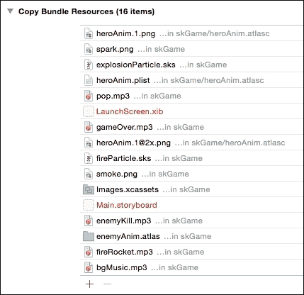

## 添加 fireRocket 音效

好的！所有文件都已导入，让我们在英雄发射火箭时调用`fireRocket`音效。在`GamePlayScene.swift`文件中的`addRockets`函数末尾，添加以下代码行：

```swift
let fireRocker = SKAction.playSoundFileNamed("fireRocket.mp3", waitForCompletion: false)

self.runAction(fireRocker)
```

要播放声音，您还将使用`SKAction`类。`SKAction`类有一个名为`playSoundFileNamed`的属性用于播放声音，它接受两个参数。第一个参数是声音文件的名称，第二个是一个布尔值，它确定动作的长度。如果是`true`，则动作的持续时间等于音频轨道的长度。否则，动作将立即终止。

注意，播放声音时我们必须提供包括扩展名在内的完整名称。所以，如果您在项目中使用`.caf`文件，并且想要调用该文件，您必须相应地替换扩展名。

如果您构建并运行游戏，您将在点击屏幕右侧时听到音效。是的，这真的很简单！

虽然这很简单，但你可能已经注意到，您第一次发射火箭时，从您轻触屏幕到音文件实际播放之间有一点点延迟。这是因为当第一次调用音效时，系统必须从内存中检索文件。系统必须为我们将要调用的每个文件都这样做。一旦初始加载完成，从下一次开始，文件就已经存储在内存中，因此可以立即调用。

## 添加敌人击杀音效

接下来，我们将添加一个效果，该效果将在敌人被击杀时发生。因此，在`checkCollision`函数中，我们检查玩家火箭与敌人之间的碰撞，在`GamePlayScene.swift`文件中增加分数的代码之后，添加以下代码：

```swift
let enemySound = SKAction.playSoundFileNamed("enemyKill.mp3", waitForCompletion: false)

self.runAction(enemySound)
```

哇哦！每次敌人被击败时效果都会开始播放。你可以通过说 `self` 在敌人或类本身上运行动作，这实际上并没有什么区别，只要你确保在某个东西上调用动作，否则音效不会播放。

## 在游戏结束时添加音效

接下来，我们将为游戏结束添加音效。因此，在 `GameOver` 函数中，在我们移除 self 和英雄的动作之后，添加以下代码片段中高亮显示的行。这很重要，因为如果你在之前添加它，那么动作将会立即被移除，你将坐在那里挠头，认为你已经添加了音效，但音效却没有播放：

```swift
//removing actions
self.removeAllActions()

for enemy in enemies{

     enemy._sprite.removeAllActions()
}

hero.removeAllActions()

//playing one last action
let gameOverSound = SKAction.playSoundFileNamed("gameOver.mp3", waitForCompletion: false)

self.runAction(gameOverSound)

```

接下来，我们将为屏幕上的按钮按下时添加一个弹出音效。因此，在 `touchesbegan` 函数中，我们检查 `menuBtn` 是否被按下，在呈现场景之前添加以下代码：

```swift
let popSound = SKAction.playSoundFileNamed("pop.mp3", waitForCompletion: false)
self.runAction(popSound)
```

现在，运行游戏并让它结束。当你按下主页按钮时，没有声音。没有声音？！

嗯，由于我们从 `GameplayScene` 切换到 `MainMenuScene` 时场景已经改变，所以音效没有播放。

解决这个问题的简单方法是在小延迟后调用 `MainMenuScene`，这样在同时，音效将会播放。为此，创建一个名为 `btnPressed` 的函数，并将调用 `MainMenuScene` 的所有代码复制粘贴到其中，如下所示：

```swift
func btnPressed(){

   let scene = MainMenuScene(size: self.size);
   self.view?.presentScene(scene)

}
```

此外，删除以下行，因为它们已经在 `btnPressed` 函数中被调用：

```swift
let scene = MainMenuScene(size: self.size)
self.view?.presentScene(scene)
```

然后，紧接着我们在调用 `popSound` 之后，添加以下代码行，其中我们创建 `SKAction`。这将延迟 1 秒后调用 `btnPressed` 函数：

```swift
let  buttonPressAction = SKAction.sequence(
[SKAction.runBlock(btnPressed),    SKAction.waitForDuration(1.0)])

self.runAction(buttonPressAction)
```

如果你现在按下主页按钮，音效将会播放，并且一秒后场景将切换到 `MainMenuScene`。

与你在这里添加 `popSound` 的方式类似，在 `MainMenuScene` 中，你可以在重置和播放按钮被点击时添加音效。当按下重置按钮时，你只需调用 `popSound` 即可，因为它会毫无问题地播放——这是因为场景没有改变。当按下 `playBtn` 时，你需要使用 `btnPressed` 函数，因为场景会瞬间改变，音效将不会播放。所以，确保你创建一个 `btnPressed` 函数，并在按下播放按钮后延迟调用它，以便完全播放音效。代码如下：

```swift
    override func touchesBegan(touches: NSSet, withEvent event: UIEvent) {
        /* Called when a touch begins */

        for touch: AnyObject in touches {
            let location = touch.locationInNode(self)

            let _node:SKNode = self.nodeAtPoint(location);

            if(_node.name == "playBtn"){

                //println("[GameScene] play btn clicked ");

                let popSound = SKAction.playSoundFileNamed("pop.mp3", waitForCompletion: true)
                self.runAction(popSound)

                let  buttonPressAction = SKAction.repeatActionForever(SKAction.sequence([SKAction.runBlock(btnPressed),SKAction.waitForDuration(1.0)]))
                self.runAction(buttonPressAction)

            }

            else if (_node.name == "resetBtn"){

                let popSound = SKAction.playSoundFileNamed("pop.mp3", waitForCompletion: true)
                self.runAction(popSound)

                NSUserDefaults.standardUserDefaults().setInteger(0, forKey: "tinyBazooka_highscore")
                NSUserDefaults.standardUserDefaults().synchronize()

                var currentHighScore = NSUserDefaults.standardUserDefaults().integerForKey("tinyBazooka_highscore")
                currentHighScoreLabel.text = "Current High Score: \(currentHighScore)";

            }

        }
    }
```

# 添加背景音乐

我们的游戏现在已经充满了音效，但如果我们添加背景音乐将会更加精彩。由于玩家需要不断在 `MainMenuSceen` 和 `GameplayScene` 之间切换，使用 `SKAction` 播放音效是没有意义的，因为它不会正确播放或者每次场景切换时都会被截断。

为了这个目的，我们将不得不使用苹果的音频视觉类 `AVFoundation` 来帮助我们解决这个问题。正如你可能已经猜到的，`AVFoundation` 是一个超类，它处理音频和视频功能，所以如果你想在你游戏中播放任何视频（比如教程），你完全可以使用这个类——这就是它被创建的原因。但让我们回到将背景音乐添加到我们的游戏中。

## 添加音频循环

要创建音频循环，我们必须导入 `AVFoundation`，并且由于我们必须在游戏开始时立即播放音频轨道，让我们在 `GameViewController` 类中添加它。所以，在类的顶部添加以下内容，如高亮所示：

```swift
import UIKit
import SpriteKit
import AVFoundation

```

接下来，在创建类之后，我们包含以下高亮显示的行：

```swift
class GameViewController: UIViewController {

let bgMusic = AVAudioPlayer(contentsOfURL: NSBundle.mainBundle().URLForResource("bgMusic", withExtension: "mp3"), error: nil)

```

在这里，我们创建一个新的常量，称为 `bgMusic`。我们将其赋值为 `AVAudioPlayer` 函数。它接受两个参数。第一个是文件的存储位置，第二个是要显示的错误信息。

在第一个参数中，我们传递文件名和扩展名，以便可以从主包的资源位置检索文件。在 `URLForResource` 函数中，我们传递文件名，即 `bgMusic`，并提供扩展名，即 MP3 格式。这将获取之前在 **Build Phases** 下的 **Copy Bundle Resources** 中添加的 `bgMusic.mp3` 文件。

此外，这需要在视图加载之前检索。如果我们将此行添加到 `viewDidLoad` 中，则不会导致错误，但文件将无法正确播放，因此它是在 `viewDidLoad` 函数之外调用的。

一旦文件在 `viewDidLoad` 函数中加载，添加以下行以告诉文件无限循环并开始播放：

```swift
bgMusic.numberOfLoops = -1
bgMusic.play()
```

通过将循环次数的值设置为 `-1`，我们告诉它连续循环播放声音文件。如果我们设置为 `0`，它将只播放一次；如果设置为 `1`，它将播放声音文件两次；依此类推。

就这样！现在，构建并运行游戏，享受美妙的背景音乐。

现在我们已经在游戏中添加了声音，让我们也添加一个滚动背景来增加趣味性。

# 视差背景理论

在本节中，我们将添加一个视差或滚动背景。这是游戏中非常流行的效果，其中前景中的对象移动速度比背景中的对象快，背景移动速度较慢，从而产生深度和运动的错觉。这与过去的电影非常相似，其中英雄或主题是静止的，并表现得好像他们在骑马奔跑，背景被循环播放，以产生英雄实际上在场景中向前移动的错觉。

我们将实现一个非常简单的视差效果，其中背景中的所有对象，如树木、灌木丛和草地，将以相同的速度移动。因此，我们只需将背景图像移动并循环播放。

### 注意

这就是实现视差效果的方法：我们不会使用一个背景图像的精灵，而是将使用两个精灵，并在游戏开始时将它们水平相邻放置，如下面的图像所示。第一个精灵将是可见的，但第二个精灵将位于屏幕外，最初对玩家不可见。

当游戏开始时，两个精灵将以一定的速度向负*x*方向移动，即向屏幕左侧移动。两个精灵将以相同的速度移动。因此，一旦游戏开始，`sprite1`将逐渐逐渐离开屏幕，而第二个精灵将开始变得可见。

当第一个精灵完全离开屏幕时，它会迅速移动到第二个精灵的末尾，这是第二个精灵在游戏开始时的相同位置。

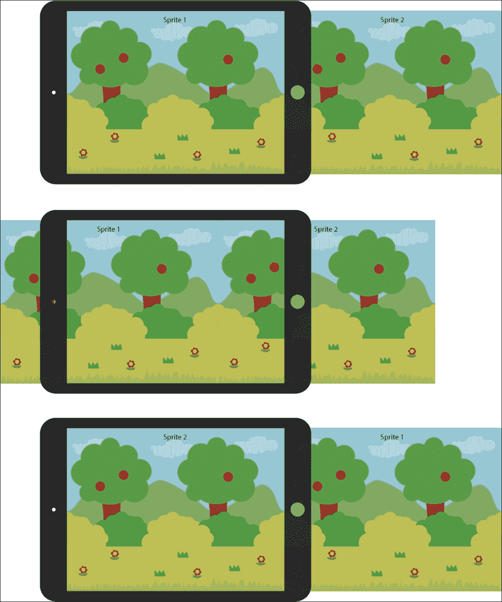

然后处理继续在循环中进行。两个精灵总是向屏幕的左侧移动。每个精灵在左侧离开屏幕后，它会被放置在屏幕右侧的离屏位置，并继续向左移动。

在创建用于视差滚动的资源和编码视差效果时，有几个需要注意的事项。首先，当创建用于视差效果的资源时，艺术作品需要是连续的。例如，如果你看前一个图像的中间，你会看到山脉看起来像是一个连续的山脉。尽管`sprite1`和`sprite2`是两个不同的图像，但当它们放在一起时，它们看起来像是一个单独的图像。这同样可以在山脉下面的浅绿色灌木丛中看到。灌木丛的左侧在`sprite1`中，而右侧在`sprite2`中，但当两个精灵保持相邻时，它给人一种无缝的错觉，好像它是单个灌木丛的一部分。

需要记住的第二点是图像间隙。即使你使图像无缝并且使精灵以相同的速度移动，有时你可能会在精灵之间遇到间隙。这不是一个非常常见的问题，但在某些框架中可能存在。为了应对这个问题，你可以稍微拉伸图像，使精灵相互重叠，这样对玩家来说并不非常明显。另一种方法是确保你手动将精灵放置在屏幕上精灵的末尾，并在必要时进行必要的调整，以弥合精灵之间的间隙。

这是视差滚动的理论基础。让我们在接下来的代码中看看它的实际应用。

# 实现视差效果

要为背景创建视差效果，我们必须创建一个类似于我们创建`MovingSprite`类的新类。所以，转到**文件** | **新建** | **文件**，创建一个名为`ParallaxSprite`的新 swift 文件。

在文件中，在文件顶部导入 SpriteKit 并创建一些常量。在类中，我们将只取我们想要用于视差效果的文件名。然后我们将从它创建两个名为`sprite1`和`sprite2`的精灵。我们将取一个我们想要移动精灵的速度值。然后我们将获取`GameplayScene`类的实例，以便我们可以将精灵添加到游戏类中。我们还将创建一个全局常量以获取视图的大小：

```swift
import Foundation
import SpriteKit

class ParallaxSprite{

    let _sprite1: SKSpriteNode!
    let _sprite2: SKSpriteNode!
    let _speed : CGFloat = 0.0
    let _viewSize:CGSize!

} //class end
```

接下来，我们将为类创建`init`函数，在这个函数中我们将获取要创建视差效果的精灵的*名称*、*速度*和游戏场景，并初始化我们在类顶部创建的常量：

```swift
    init(sprite1: SKSpriteNode, sprite2: SKSpriteNode, viewSize: CGSize, speed: CGFloat){

        _speed = speed
        _viewSize = viewSize

        _sprite1 = sprite1
        _sprite1.position = CGPoint(x: _viewSize.width/2, y: _viewSize.height/2)

        _sprite2 = sprite2
        _sprite2.position = CGPoint(x: _sprite1.position.x + _sprite2.size.width - 2, y: _viewSize.height/2)

    }//init
```

在`init`函数中，我们将速度变量初始化为传入的任何值。我们还将分配从我们在`GameplayScene`类中创建的全局常量中检索到的视图大小。我们还将分配传入的两个精灵名称到本地精灵变量：`_sprite1`和`_sprite2`。

`_sprite1`对象位于视图的中心，因此`x`和`y`位置是通过将`viewSize`的宽度和高度除以二得到的。

对于第二个精灵，`_sprite2`，高度保持在屏幕高度的一半，但就位置而言，它被放置得使得`sprite2`的左边缘与`sprite1`的右边缘重叠。因此，第二个精灵保持在`sprite2`的`x`位置等于其宽度。`-2`是一个小的调整因子，用于确保两个精灵重叠。这是在经过一些尝试和错误后得到的数字。

### 小贴士

您可以增加或减少此值以查看它的影响，并且如果您愿意，可以根据您的偏好添加更多或更少的重叠。

此外，请注意，精灵不是添加到当前类中，而是添加到`GameplayScene`类中。我们不能将精灵添加到当前类中，因为我们没有从`SKNode`或`SKSpriteNode`继承，所以当前类没有`addChild`属性。

接下来，我们定义`update`函数，因为我们需要持续更新`sprite1`和`sprite2`的位置。因此，在`init`函数之后，添加`update`函数：

```swift
func update(){

    _sprite1.position.x += _speed
    _sprite2.position.x += _speed

    if((_sprite1.position.x + _sprite1.size.width/2) < 0){

        _sprite1.position = CGPoint(x: _sprite2.position.x + _sprite1.size.width - 2, y: _viewSize.height/2)

    }

    if((_sprite2.position.x + _sprite2.size.width/2) < 0){

        _sprite2.position = CGPoint(x: _sprite1.position.x + _sprite2.size.width - 2 , y: _viewSize.height/2)

    }

}//update
```

在`update`函数中，我们以一定的速度增加精灵的位置，从而使精灵移动。因此，由于我们是增加而不是减少值，当我们创建这个类的实例时，我们需要记住提供一个负速度值，以便精灵向左移动，否则精灵将开始向正*x*方向移动。

接下来，我们检查`sprite1`的右边缘是否已经超过了屏幕的左端。如果精灵已经离开屏幕，我们获取`sprite2`的位置，将`sprite1`放置在精灵的末尾，并减去调整因子以避免间隙。对`sprite2`也执行类似的过程，但在这里我们将它放置在`sprite1`的末尾。

这就是 `ParallaxSprite` 类的内容。

要实现这个类，请转到 `GameplayScene` 类，并在类顶部 `var score:Int = 0` 之后添加一个全局常量。将名称为 `scrollingBg` 的 `ParallaxSprite` 类型输入，如下面的代码所示。别忘了最后的感叹号：

```swift
let scrollingBg:ParallaxSprite!
```

接下来，我们移除在 `init` 函数中添加的包含 BG 精灵的代码，并替换为以下这些行：

```swift
        let BG1 = SKSpriteNode(imageNamed: "BG");   self.addChild(BG1);
        let BG2 = SKSpriteNode(imageNamed: "BG");   self.addChild(BG2);

        scrollingBg = ParallaxSprite(sprite1: BG1, sprite2: BG2, viewSize: viewSize, speed: -5.0)
```

我们创建了两个精灵常量，分别命名为 `BG1` 和 `BG2`，并将图像 `BG` 传递给它们。接下来，我们初始化 `scrollingBg` 类。在这个类中，我们传递了想要创建滚动效果的图像名称，即 `BG1` 和 `BG2` 精灵。我们给它一个速度 `-5.0`，并将当前的游戏场景实例传递给它，即 `self`。

接下来，我们需要调用 `ParallaxSprite` 类的更新函数，以便更新对象的位子，然后我们就可以拥有我们的滚动背景：

```swift
if(!gameOver){

       scrollingBg.update()

       updateGameObjects()
       updateHero()
       checkCollision()
}//gameOver check 
```

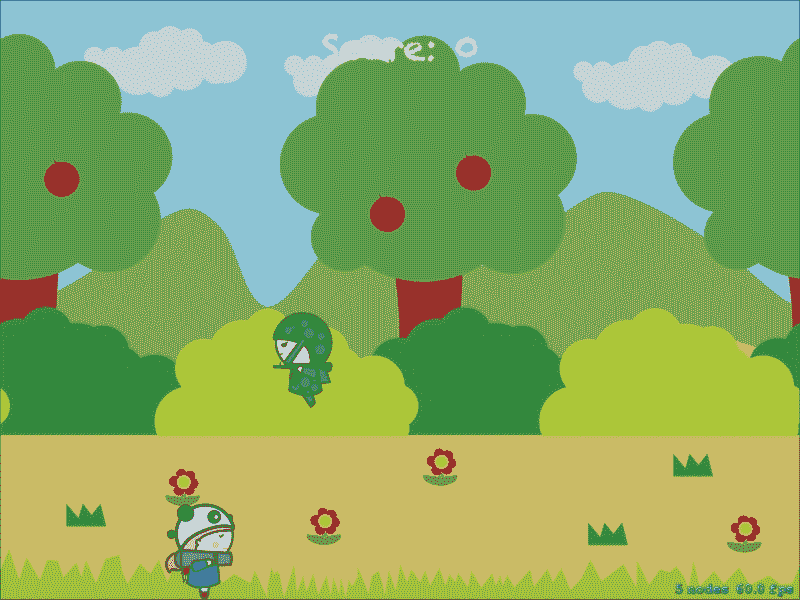

# 概述

因此，在本章中，我们添加了一些音乐和效果，以配合游戏玩法。我们还探讨了音频格式的差异以及如何将一种音频格式转换为其他格式。

更重要的是，我们在游戏中添加了视差效果，使其看起来更加生动。就像背景一样，您也可以传递其他对象以创建更好的视差效果。对于免费的版权效果和音乐，您可以访问 [www.freesound.org](http://www.freesound.org) 或 [www.soundbible.com](http://www.soundbible.com)。

我们将在第十章 “发布和分发” 中看到如何添加开场屏幕、添加图标、将游戏上传到 App Store 以及为游戏添加最后的修饰。在下一章中，我们将探讨 SpriteKit 的一些更高级的功能，例如物理、光照等。下一章再见！
