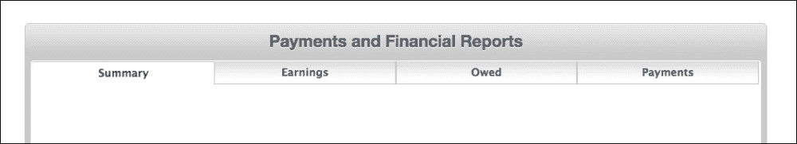
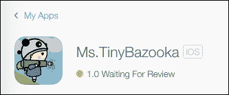

# 第十章。发布和分发

所以，这一刻终于到来了。我们投入了时间和精力，制作了这款出色的游戏。现在，我们想让全世界都知道我们的创作。

如果正确遵循步骤，发布游戏的道路实际上非常直接。就像我们创建开发者配置文件以便在设备上运行游戏一样，我们还需要创建发布者配置文件，以便在 App Store 上发布游戏或在除我们自己的设备以外的任何设备上运行。

下一步将在 iTunesConnect 门户中创建应用。这是你将给应用命名、描述、图标和截图的地方。最后，你将从系统上传应用文件到 App Store。

你还将有机会决定是想免费提供游戏还是收取费用。

虽然成就和排行榜在本书中没有涉及，但你绝对可以将其添加到游戏中，以及广告，这样你就可以通过游戏盈利。

因此，让我们开始准备发布游戏。以下是本章你将学到的内容：

+   准备应用

+   分发证书

+   iTunesConnect 门户

+   创建应用

+   演示安装

+   参考资料

+   替代方案

+   最后的备注

# 准备 Ms. tinyBazooka 应用

首先，我们将对应用进行一些更改。点击项目根目录，然后点击项目的信息屏幕。在这里，通过双击它旁边的区域来更改包标识符。例如，我将包名称更改为`com.growlgamesstudio.Ms.TinyBazooka`。同时，更改包名称以反映游戏名称；否则，将显示项目名称，这我们不想看到。

确保将包版本设置为`1.0`。这是发布版本。稍后，当你对游戏进行更新时，你需要为每次新的更新更改数字。其余的项目可以保持默认设置。


接下来，我们将更改图标，以便我们可以使用自己的图标来代替默认图标，用于游戏。在硬盘上的项目目录中，导航到`images.xcassets`文件夹，并用资源文件夹中提供的图标替换当前存在的`AppIcon.appiconset`文件夹。

现在，如果你构建游戏，名称将正确反映出来，包括你提供的新的图标。


如果你点击项目中的`images.xcassets`文件夹中的**AppIcon**，这也会反映在你的项目中。


这里有为所有 iOS 设备指定的图标。所以，当我想制作通用应用时，我无需为不同的 iPhone 和 iPod 设备指定图标。

最后，我们还将更改启动图像，目前它显示一个空白屏幕，上面有游戏名称和一些版权信息。点击项目根目录。在**通用**选项卡中，位于**应用图标和启动图像**部分下，点击**启动图像源**旁边的**使用资产目录**按钮。


然后，点击**迁移**。然后，点击指向右方的箭头以打开启动图像下拉菜单：


这将带你去资产目录中的启动图像。由于我们只针对 iPad 横屏模式进行开发，我们可以将背景图像拖放到横屏部分的**1x**和**2x**槽位。确保在**应用图标源**和**启动图像源**中的**启动屏幕文件**字段为空。

最后，我们将移除显示添加的节点数量和 FPS 的调试信息。所以，前往`GameViewController`类并注释或删除这两行：

```swift
// Configure the view.
let skView = self.view as SKView
//skView.showsFPS = true // comment this line
//skView.showsNodeCount = true //Comment this line
```

现在，当你启动游戏时，你会看到背景图像而不是其他白色背景。应用将显示正确的图标，并且调试信息将被移除。

# 生成分发证书

为了分发应用，我们需要分发证书。这包含在所有在 App Store 上发布的应用中，因为没有它，应用无法安装在任何设备上。

获取分发证书的步骤与设置开发者证书类似。前往 Apple 开发者门户，并使用你在第一章创建的开发者账户登录[`developer.apple.com/devcenter/ios/index.action`](https://developer.apple.com/devcenter/ios/index.action)。

在屏幕的右侧，点击**iOS 开发者计划**下的**证书、标识符和配置文件**链接。然后，点击**证书**。接下来，点击屏幕右上角的**+**号。

在下一屏幕，选择**App Store 和 AdHoc**并点击**继续**。在下一步，创建一个**证书签名请求**（**CSR**）文件，因为门户要求将其上传。前往 Launchpad，搜索`KeyChain`并打开它。


然后，导航到**KeyChainAccess** | **证书助手** | **请求证书授权**。


输入你的电子邮件地址和姓名，选择**保存到磁盘**，并在下一步点击**继续**。将文件保存在桌面。

在开发者网站上，点击**继续**。在下一步，点击**选择文件**和**生成**。接下来，下载创建的证书。下载后双击文件以安装证书。


在网站上，点击**完成**。现在我们准备好分发游戏。

# iTunesConnect 门户

要创建应用，我们需要前往 iTunesConnect 门户。在开发者门户中，点击 iTunesConnect 链接，或访问 [`itunesconnect.apple.com`](https://itunesconnect.apple.com)。

你可能需要登录，请使用开发者 ID 和密码进行登录。


一旦进入，你应该会看到一个像这样的页面：


该页面的各个部分如下：

+   **我的应用**：这是我们创建新应用和更新现有应用的地方

+   **销售和趋势**：这将显示你在一段时间内销售的应用的各个应用的单位数量。你可以检查按地区、平台、类别、内容类型、交易类型等销售情况。

+   **支付和财务报告**：在这里，你将获得销售摘要、收入、苹果欠款和苹果支付给你的报告：

+   **iAds**：苹果有自己的广告网络，你可以从中收集并展示游戏中的广告。你必须使用 iAds 工作台来配置 iAds。

+   **用户和角色**：在这里，可以更新与账户相关的个人的角色信息。创建 Apple ID 的人需要在此处输入他们的详细信息。稍后，如果你为游戏添加测试人员，你也需要在此处包括他们的详细信息。

+   **协议、税务和银行**：正如其名所示，这里你需要与律师一起坐下，审查苹果的协议，并数字化地同意并签署所有这些协议。你还将在此处提供你的银行信息，以便当你创建付费应用时，你可以因应用的销售而获得报酬。**税务**部分将包含需要填写的税务表格。主要来说，有针对美国、加拿大和澳大利亚的表格，具体取决于你的位置。如果你不是这三个国家中的任何一个，那么你需要填写美国的税务表格。

+   **资源和帮助**：在这里，你可以找到论坛和常见问题解答等资源链接，如果你需要回答任何问题，可以参考。你也可以点击**联系我们**并发送带有查询的电子邮件。苹果的人员将回复你。

在基本介绍完成之后，我们可以点击**我的应用**来发布和分发 Ms. TinyBazooka 游戏。

# 创建应用

要创建一个新应用，在**我的应用**部分，点击页面左上角的**+**号。然后，点击**新建 iOS 应用**，如图所示：


以下窗口将打开：


该页面的各个部分如下：

+   **名称**：这是应用在 App Store 中显示的名称。如果建议的名称已被占用，则需要提供一个备选名称，并在 Xcode 的信息文件中进行更改。

+   **版本**：这需要与项目信息中提供的版本号相同。由于我们的游戏版本为 1.0，我们输入此值。

+   **主要语言**：选择游戏中使用的语言。您可以选择英语。

+   **SKU**：这是您需要提供的库存单位编号。您可以输入`001`。

+   **捆绑 ID**：这是应用在 App Store 中被识别的标识。我们需要在开发者门户中注册`com.growlgamesstudio.Ms.TinyBazook`捆绑 ID，以便当我们上传应用到 iTunesConnect 时，它将应用与捆绑 ID 关联起来。

点击捆绑 ID 下拉菜单下的开发者门户链接。


在**应用 ID 描述**中，为应用输入一个名称；这只是为了参考。接下来，在**应用 ID 后缀**中，输入与应用信息中输入的完全相同的应用捆绑 ID。在这种情况下，我必须输入`com.growlgamesstudio.Ms.TinyBazooka`。再次强调，这对每个应用都是唯一的。


点击**继续**以进行下一步。在下一页，确认您的应用 ID 后，点击**提交**。注册现在完成。点击窗口底部的**完成**。


您现在会看到捆绑 ID 已经添加到开发者门户中**标识**下的**应用 ID**。

返回到**应用创建**窗口，在**捆绑 ID**下拉列表中，您可以选择 tinyBazooka 捆绑 ID。选择它并点击**提交**。这可能需要几分钟的时间来更新并反映在下拉菜单中。

您现在将看到应用页面。在这里，我们将添加描述和截图，并上传二进制文件。在**提交审核**按钮旁边，有一个**保存**按钮，每次您进行更改时都会亮起。**保存**按钮是您的朋友，所以尽可能经常使用它，以免丢失您所做的任何更改。

首先，我们将添加一些截图。您可以通过同时按设备上的电源和主页按钮从您的设备创建截图。拍摄五张截图，将设备连接到 Mac，并将图像传输到桌面。然后，您可以将文件从桌面拖动到 iTunes 应用页面上的空间。您可以单独拖放每个文件或同时拖放所有文件。点击顶部的**iPad**标签，因为我们目前只为 iPad 开发游戏。


接下来，我们必须提供应用在 App Store 中显示的名称。因此，在**名称**部分，输入应用的名称：


我们将需要提供游戏的小描述。我们可以突出游戏类型、故事以及我们想要告诉用户的任何内容。你可以让它尽可能长或尽可能短。


在描述的右侧，我们可以提供关键词、支持、营销和隐私政策 URL。关键词、描述和标题是排名算法的一部分，因此请做好研究以确保您的游戏排名更高。


接下来，我们需要上传应用的图标。图标不应该有圆角和透明度。更高的分辨率会更好；1024 x 1024 将是理想的。在`Resources`文件夹中提供了一个示例图标供您测试。将图标拖入**应用图标**槽中。


现在，我们必须选择应用的主要类别。您可以选择最多两个子类别。对于主要类别，选择**游戏**。子类别主要取决于游戏的类型。在这里，我选择了**动作和街机**作为子类别。


接下来，我们需要指定游戏的评级。在**评级**部分，点击**编辑**链接：


如果描述的内容在游戏中根本不存在，则将每个项目评为**无**。如果存在，则选择不频繁或非常频繁。根据这一点，游戏将针对合适的受众进行评级。因此，如果您的目标受众是儿童，那么第一部分应该是**无**，最后两项理想情况下应该是**否**。这将使游戏评级为 4 岁及以上。否则，您针对的是青少年或成人受众，因此请仔细选择。

在**编辑许可协议**下，默认选中标准最终用户许可协议。否则，您可以包含自定义许可协议：


现在，我们必须上传游戏的构建版本。因此，在 Xcode 中打开游戏。一旦 Xcode 打开，在顶部菜单中，选择**产品**然后**存档**。


一旦应用存档，将打开以下窗口。如果没有打开，你也可以通过转到**窗口** | **组织者** | **存档**来访问它：


注意，标识符和版本号与我们创建应用时在 iTunesConnect 中输入的一致。这很重要，因为如果不一致，则无法上传捆绑包。要上传构建版本，请点击右侧的**提交**按钮。

接下来，Xcode 将检查配置文件所属的团队。如果您是个人，您的账户名称将如以下截图所示显示。选择它并点击**选择**：


接下来，将弹出**发送应用至苹果**窗口。点击**提交**。现在将构建存档包并将其上传到苹果。


这可能需要 5-25 分钟，具体取决于年份和时间以及您的互联网连接的上传速度。在圣诞节和其他假期期间，可能需要更长的时间，因为许多开发者会上传他们的应用，所以最好提前考虑并提前上传。

一旦上传了二进制文件，点击**完成**。如果您遇到一些错误，请不要惊慌。修复提到的错误，创建一个新的存档，并上传新的二进制文件。

现在，返回到 iTunesConnect 上的应用页面。在**添加构建**部分下，点击左侧的**+**号，选择您刚刚上传的构建，并在弹出窗口中选择**完成**：


接下来，在**应用审核信息**标题下，添加您的联系信息。包括您的姓名、电子邮件地址和联系方式。

在**版本发布**下，您可以选择**自动发布**版本或**手动发布**游戏。

如果您选择**自动发布**，应用将在通过审核后立即发布。在手动发布中，您可以指定应用发布的日期。因此，即使应用通过了审核，也只有在发布日期之前才会发布。

接下来，我们必须指定游戏的定价。在顶部，选择**定价**。在这里，您可以选择您希望发布应用的日期以及应用的定价层级。


如果您选择了自动发布，则无需指定日期。对于定价，您可以从提供的任何层级中选择，或者选择免费。要创建付费应用，您必须在**银行和税务**标题下更新银行信息。

在选择定价后，点击屏幕底部的**保存**。接下来，点击**提交审核**：


如果您的应用包含加密、第三方应用或广告，请点击**是**，否则选择**否**。然后，点击**提交**。

恭喜！您已成功提交您的应用进行审核。应用的状态将变为**等待审核**。通常需要 5-7 天时间，苹果的应用审核团队才会审核您的应用，所以请耐心等待。您将收到一封电子邮件，告知您的应用是否被接受或拒绝。



如果应用被接受，它将很快出现在 App Store 中。如果应用被拒绝，请不要担心！您将能够纠正错误，并再次提交应用进行审核。再次审核也需要大约一周的时间。因此，在制作应用时，请确保在上传过程中避免出现错误。同时，当您想在 App Store 上发布应用时，请提前做好准备。

# 创建一个临时应用

您可以通过连接到机器将游戏构建到设备上，但如果朋友或客户想在他们的设备上运行应用程序，而他们住在别处呢？为此，您可以创建一个 ad hoc 应用程序。步骤与在 App Store 上创建和发布非常相似；只是这次，您需要提供应用程序可以运行的设备 ID。

因此，首先，我们需要添加我们想要运行应用程序的设备的设备 ID。设备 ID 是一个唯一的数字，特定于某个特定设备。因此，如果您的朋友有一个 iPad 和一个 iPhone，并且他希望在这两个设备上运行它，那么您将需要从他那里获取两个设备 ID。设备 ID 也是一个 **用户设备 ID**（**UDID**）。

要获取 UDID，将设备连接到 Mac 并打开 iTunes。在 **Settings** 下的摘要中，点击 **Serial Number** 以显示设备的 UDID：


您也可以在 Xcode 的 **Window** 下找到 **Devices** 并选择要显示设备 UDID 的设备：


因此，一旦您从朋友那里获取到 UDID，请打开 Apple 开发者门户。转到 **Certificates, Identifiers and Profiles** 部分。在左侧面板中点击 **Devices**。

一旦打开，点击页面右上角的 **+** 号。


在 **Name** 部分，输入朋友和他们的设备名称，直接在下面输入 UDID，然后点击 **Continue**。重复此过程以添加其他设备的 UDID。

您还可以上传包含 UDID 的文件，通过选择 **Register Multiple Devices** 并上传文件一次性注册所有设备。无论如何，请注意苹果允许您注册最多 100 台设备。因此，它更适合与测试人员测试您的游戏。

现在，在 Xcode 中打开项目。在顶部栏中，转到 **Window** 并从下拉列表中选择 **Organizer**。


这将打开与您存档文件以发布时打开的相同窗口。这次不是点击提交按钮，而是点击 **Export** 按钮。在 **Select the Method for Export** 下，选择 **Save for AdHoc deployment** 并点击 **Next**。


接下来，选择 **用于配置的 Development Team**。从下拉列表中选择您的名字，然后点击 **Choose**。

现在，将创建一个存档。在下一屏幕中，将提供有关应用程序和将包含在捆绑包中的文件的摘要。点击 **Export**。

接下来，您将被要求选择一个位置来保存导出的文件。因此，在项目文件夹中创建一个名为 builds 的目录，并在其中命名和保存文件。


这`.ipa`文件就是现在需要发送给你的朋友，这样他们就可以在自己的设备上运行它。

接下来，让我们看看如何在设备上运行这个应用。将设备连接到你的 Mac 或 PC。你需要安装最新版本的 iTunes 来安装应用。所以，如果你还没有更新 iTunes，那么现在是一个好时机。设备连接后，打开 iTunes；在大多数情况下，iTunes 应该会自动打开。

点击顶部电影部分旁边的三个点，并选择**应用**。


这将显示所有应用。接下来，将你刚刚创建的`.ipa`文件拖入这个区域。应用将被添加到当前存在的应用列表中。然后，选择你之前选择的三个点旁边的设备图标。在左侧的**设置**面板下选择**应用**。这将显示所有准备安装的应用。

滚动列表，查看为 iPad 和 iPhone 设计的应用。选择 Ms.TinyBazooka 应用，并点击**安装**。


一旦点击**安装**，它将变为**将要安装**。在窗口底部，选择**应用**。现在，它将开始将应用安装到设备上。安装完成后，**将要安装**文本将变为**移除**。这意味着安装已完成。

现在，你可以运行这个应用，就像运行其他任何应用一样。

# 参考文献

对于 Swift、SpriteKit、SceneKit 和 Metal，苹果提供了非常好的文档。所有这些都可以从苹果开发者门户免费访问。

所有 API 和函数都解释得非常清晰，如果你想要更深入地了解所使用的函数和变量，每个部分都提供了链接。你可以点击它们，按顺序阅读，以了解它们的实现。

你可以访问[`developer.apple.com/library/mac/navigation/`](https://developer.apple.com/library/mac/navigation/)并搜索 SpriteKit 或 SceneKit 以获取相应的文档。


要了解更多关于 Metal 的信息，你可以访问网站[`developer.apple.com/metal/`](https://developer.apple.com/metal/)：


关于 Swift 的更多信息，你可以访问苹果网站[`developer.apple.com/swift/`](https://developer.apple.com/swift/)：


# 替代框架/引擎

对于 SpriteKit 和 2D 游戏开发，有几个替代方案。一旦你使用 SpriteKit 创建了一个游戏，如果它变得很受欢迎，你显然也希望将其带到其他平台，如 Android 和 Windows Phone。

对于跨平台游戏开发，你有 Cocos2d 和 Cocos2d-x。使用 Cocos2d，你可以同时为 iOS 和 Android 开发游戏。你可以用 Objective-C 或 Swift 开发你的游戏。一旦你了解了使用 SpriteKit 的开发，你将会注意到语法相当相似，所以你会感到非常自在。

行业专业人士长期以来一直使用 Cocos2d 来开发杰出的游戏。它是开源的，并且完全免费。它有一个良好的社区，你可以在这里提问以帮助找到解决问题的答案，并且它定期更新。如果你感兴趣，你可以通过[`cocos2d.spritebuilder.com/`](http://cocos2d.spritebuilder.com/)访问它：


与 Cocos2d 一样，Cocos2d-x 也是完全开源和免费的，并且支持跨平台游戏开发。使用 Cocos2d-x，你可以为 iOS、Android、Windows Phone、PC、Mac、Linux 等平台开发游戏。

你可以使用 Cocos2d-x 创建二维和三维游戏。

为了使用 Cocos2d-x 开发游戏，你需要了解 C++。但还有 Cocos2d-js，它使用 JavaScript 作为其开发语言。通过使用它，你甚至可以开发一个网页游戏。它可以从[`www.cocos2d-x.org/`](http://www.cocos2d-x.org/)下载：


对于三维游戏开发引擎，你可以看看 Unity 和 Unreal Engine。你也可以使用这些引擎来开发二维游戏。

Unity 使用 JavaScript、C# 和 Boo 作为其开发语言，而 Unreal 使用 C++。在 GDC 上，这两个框架都是完全免费的，所以我强烈建议你查看[`unity3d.com/5`](http://unity3d.com/5)和[`www.unrealengine.com/`](https://www.unrealengine.com/)。

# 最后的评论

到现在为止，我希望你已经为使用 Swift、SpriteKit 和 SceneKit 开发 2D 和 3D 游戏打下了良好的基础。我也希望你对使用 Metal 进行图形编程有了基本的了解。

使用这些工具，你应该能够开发并在 iOS 商店发布你的游戏。这是第一步；如果你想要制作看起来更好的游戏，还有更多关于这些框架的知识需要学习。

根据我在 Swift、SpriteKit 和 SceneKit 方面的经验，我可以告诉你，Swift 和 SceneKit 都是在 iOS 8 和 Xcode 6 中首次引入的。这对苹果来说绝对是一个良好的开端，我希望在下一个版本中，这些功能将得到改进。随着越来越多的人开始接受和使用 Swift 和 SceneKit，将会有一个更大的开发者社区供你寻求帮助和参与。这就像 SpriteKit 一样，被许多业余爱好者和爱好者广泛使用。

如果你有任何问题，需要专家意见，或者只是想分享你的作品，你可以通过访问我公司的**联系我**部分来给我发邮件。你也可以在`@sidshekar`上关注我，我会尽快回复你的询问。

# 摘要

因此，在本章的最后，我们看到了如何为我们的应用发布做准备，并创建发布许可证。你了解了 iTunesConnect 门户，在其中创建了一个应用，并最终在 iOS 商店发布了应用。最后，我们看到了如何创建一个可以在特定设备上运行的游戏的临时构建版本。

我在撰写这本书的过程中度过了美好的时光。在这个过程中，我自己对这些技术和游戏开发有了很多了解。我希望你们能像我享受将这本书带给你们一样，享受这本书。

祝你游戏开发愉快！
