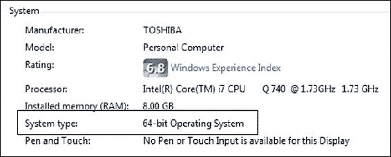
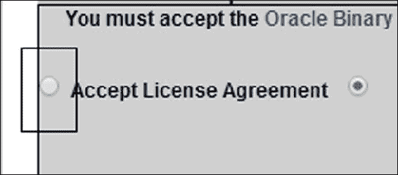
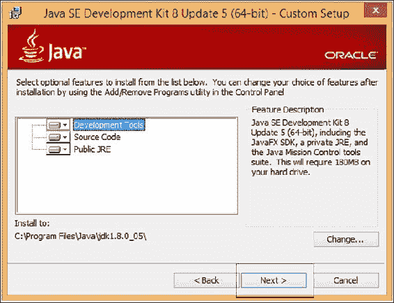
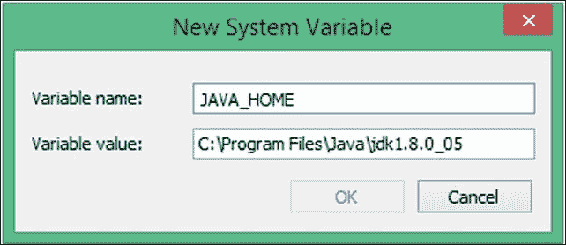
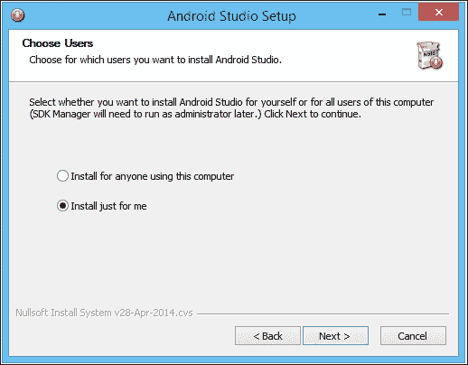
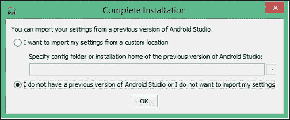

# 第一章。为什么学习 Java、Android 和游戏？

欢迎来到*通过构建 Android 游戏学习 Java*，我希望这只是你激动人心的设计和编写游戏之旅的开始。在本书结束时，我们将完成四款完整的游戏：一个难度动态增加的数学测验，一个类似经典 Simon 玩具的记忆游戏，一个类似乒乓球的游戏，以及一个经典的*贪吃蛇*游戏的克隆。

除了这些游戏，我们还将构建十多个可工作的应用程序，以练习和演示个别概念，帮助我们学习 Java、Android 和游戏。我们的游戏和应用程序将包括声音效果、图形和动画。我们将学习从使用标准 Android 用户界面（UI）设计师到通过绘制单个像素创建流畅动画的一切。

尽管我会鼓励你和我一起工作，并逐步实施本书中详细介绍的具体项目，但我完全期望一旦你掌握了不同的概念，你会想立即将它们用于自己独特的创作中。这正是我希望你会被激发去做的事情。

游戏项目本身并不是本书的目标，而是实现更崇高目标的手段。在本书结束时，你将能够设计和实现自己的 2D Android 游戏，在 Google Play 上销售或免费分享。

### 提示

首先需要做一些基础工作，但我保证不会花很长时间，也不会很复杂。任何人都可以学会编程。

然而，专家们有很多不同的观点，这在初学者中引起了关于学习编程的最佳方式的困惑。因此，看看为什么学习 Java、Android 和游戏是初学者的理想途径是一个好主意。这将是我们在本书中首先讨论的事情。

以下是我们将在本章学到的内容：

+   这本书适合我吗？

+   为什么要用游戏来学习编程？

+   我为什么要学习 Java 和 Android？

+   设置我们的开发环境

# 这本书适合我吗？

如果你已经决定要学习 Java、Android 或游戏，那么下一个问题可能是，“这本书适合我吗？”

有很多适合初学者的 Java 书籍，也有比我更有成就的作者和程序员写的书。我读过其中很多，并且钦佩这些作者。然而，当这些书开始涉及 Java 本地接口、Web 浏览器小程序或服务器端远程通信等话题时，我有时会质疑它们对我的直接相关性。

在这一点上，至少在潜意识中，我的承诺会减弱，学习过程会变得缓慢或停止。

## 如果你只想学习纯粹的 Java

如果你只想学习 Java 本身，这本书将是一个很好的开始。尽管 Android 的内容可能被视为对纯粹的 Java 学习的额外开销，但这远远少于任何其他 Java 书中可能引入的多余主题。这本书唯一的警告是必要的开销都在开始时。但一旦这个最小的开销被清除，我们就可以非常专注地学习 Java。

关于额外开销的问题：

+   在本章中，我们将花大约六页来设置我们的编程环境

+   需要第二章，*开始使用 Android*，来熟悉 Android 工具，创建你的第一个可工作的项目，并瞥见你的第一段真正的 Java 代码

+   从那时起，几乎就是纯粹的 Java 和游戏开发了

你很快就会发现，这点额外的开销并不过分，而且是非常值得的。

## 如果你的重点是 Android

如果是 Android 本身吸引你看这本书，那么我很自豪地说，这是第一本会教你 Android 而不假设你有任何先前 Java 或编程知识的书。

## 这本书将带你去哪里

在本书结束时，你将能够轻松选择其中的一条道路，包括以下内容：

+   为任何平台学习更高级别的 Java

+   包括纯游戏框架的中级水平 Android 学习（将在第九章中更详细地介绍，*使你的游戏成为下一个大事件*）

+   更高级别的游戏开发

+   更容易地处理任何现代面向对象的语言，比如 iOS、Windows 或 Web 开发

因此，如果你知道你想学习 Android 或 Java，希望我已经在某种程度上让你承诺这本书将如何帮助你。但为什么要学习游戏、Android 或 Java 呢？

# 为什么要制作游戏来学习编程？

当然，这很有趣！但也有其他原因。成功地运行我们编写的任何程序都是极其令人满意的，尤其是当它涉及使用我们以前不理解的一些代码时。

但是，正如你很快就会意识到的，制作我们自己的游戏会带来一种难以描述的愉悦感——这必须亲身体验才能感受到。然后，通过在手机或平板电脑上与朋友分享我们的创作，甚至在 Google Play 商店上公开分享它们，你可能会意识到一旦开始制作游戏，就停不下来了。

随着我们逐渐创建更复杂的游戏，你会意识到所有的技巧和代码片段都可以重新利用来创建其他游戏，然后你可以开始规划你自己独特的杰作。这至少是令人振奋的。

和许多其他学科一样，我们练习得越多，就会变得越好。所以游戏是学习编程 Java 的绝佳方式。然而，大多数针对 Android 游戏的初学者书籍都需要相当高水平的 Java 知识。但正如我们将看到的，完全可以将实际示例作为有趣的游戏项目，并从 Java 的基础知识开始。

这样做有一点儿取舍。我们不会总是按照“按部就班”的方式来处理工作中的游戏示例。这是为了避免在掌握前滚之前就做花式翻筋的问题。

学习成果的优先级始终是 Java 编程概念，其次是理解 Android 环境和游戏设计原则。话虽如此，我们将密切研究和实践大量的 Android 和游戏编程基础知识。

当然，从我们刚刚讨论的内容中，你可能可以推测出，如果我们没有制作游戏，那么在同样的页数中可能可以教授更多的 Java 知识。

这是真的，但我们失去了使用游戏作为学习主题所带来的所有好处。制作游戏确实可以带来愉悦，当我们的大脑敞开并渴望获取信息时，我们会学得更快。以这种方式学习的最小开销会被抵消一百倍。如果游戏对你一点兴趣都没有，那么有很多传统方法的 Java 初学者指南可以选择。只是不要期望发布你的第一个带有在线排行榜和成就的游戏时会有相同的刺激感。

# 为什么选择 Android 和 Java？

成功学习的一部分是学生的承诺，不仅是做工作，而且是相信他们正在以正确的方式做正确的事情。因此，许多技术课程和书籍并没有得到读者的承诺，至少在潜意识中没有。

问题在于学生们认为，他们可能在某种程度上，至少部分地，浪费时间在某些已经过时或即将过时的东西上，或者可能不太适合他们。这在很大程度上可能是真的，尤其是在编程方面。那么，为什么你要花费有限的时间学习 Java 和 Android 呢？

## Android 是迄今为止发展最快、增长最快的操作系统

曾经，安卓更新几乎每两个月就会出现。即使现在，它们也大约每六个月出现一次。相比之下，Windows 版本之间需要数年的时间，即使 iOS 更新也只是每年一次，而且版本之间的变化通常相对较小。安卓显然正在以前所未有的速度发展和改进。

### 提示

查看安卓版本的历史，从第 1 版开始，[`www.cnet.com/news/history-of-android/`](http://www.cnet.com/news/history-of-android/)。

安卓的第一个版本于 2008 年发布，当时消费者已经对当时更加花哨的 iPhone 感到兴奋。新闻报道也在报道开发者通过在 iTunes 应用商店出售应用程序而变得富有。

但在这本书写成之前的整整一年里，仅三星一家就发货的安卓设备就比苹果销售的所有 iOS 设备加起来还要多。我不会加入关于哪种设备更好的战争。我喜欢安卓和苹果的各种方面，但纯粹从选择一个学习平台的角度来看，你可能选择了正确的时间和地点，选择了安卓。

## 安卓开发者前景广阔

现在你可能只是为了学习编程游戏的乐趣和满足感而拿起这本书。但如果你决定进一步发展你的学习，你会发现对安卓程序员的需求是巨大的，因此也非常有利可图。

### 提示

一些数据表明薪水超过 10 万美元。欲了解更多信息，请访问[`www.indeed.com/salary?q1=Android+Developer&l1=United+States`](http://www.indeed.com/salary?q1=Android+Developer&l1=United+States)。

## 安卓是开源的

开源意味着尽管谷歌开发了最新设备上使用的所有安卓版本，但一旦代码发布，任何人都可以随心所欲地使用它。谷歌只在有限的时间内施加控制。

实际上，大多数安卓用户使用的是纯谷歌操作系统或三星、HTC 等大型制造商生产的修改版本，但没有任何东西可以阻止任何人拿起操作系统并将其改变、调整或转换成他们喜欢的任何东西。简而言之，安卓永远不会从编程社区中消失。

## Java 会长存下去

好的，所以我们看到安卓不太可能消失，但是 Java 可能会变得多余吗？你的大量时间投资会白费吗？在安卓上，与大多数平台一样，你可以使用许多语言和工具。然而，安卓是从头开始设计的，以促进 Java 开发。所有其他语言和工具都不是无效的，但往往只是为了服务于一个相当特定的目的，而不是真正的 Java 替代品。事实上，就游戏而言，许多纯 Java 开发环境的替代品也是基于 Java 的，并且需要在 Java 上具有良好的技能水平。例如，流行的 LibGDX 游戏开发库，允许你同时为安卓、iOS、Windows、Linux、Mac 甚至 Web 制作游戏，仍然使用 Java！我们将在第九章中更多地讨论这个问题，《使你的游戏成为下一个大事件》。关键是 Java 和安卓是紧密联系在一起的，很可能会共同繁荣。

## Java 不仅仅是为了安卓

事实上，Java 已经存在了很长时间，早在 1990 年代初就有了。尽管 Java 的用途在两个多十年里发生了演变和多样化，但语言本身最初实现的优势至今仍然保持不变。

Java 被设计为平台或计算机无关的。这是通过使用**虚拟机**（**VM**）来实现的。这是一个用另一种语言编写的程序，它解码我们编写的 Java 程序并与其运行的计算机平台进行交互。因此，只要你想在计算机上运行你的 Java 程序，只要有一个 VM，你的 Java 程序就会运行，除了一些例外。因此，如果你学习 Java，你就是在学习一种语言，它在从智能冰箱到网络以及其他大多数地方都被使用。

然而，每个平台上的虚拟机通常会实现特定于其可能被用于的用途的功能。一个明显的例子是移动设备特定的功能，比如传感器、GPS 或许多 Android 设备上的内置摄像头。在 Android 上使用 Java，你可以拍照、检测气压，并准确地确定你在世界的哪个位置。大多数冰箱的虚拟机可能不会这样做。因此，你不能总是在设备 y 上运行为设备 x 设计的 Java 程序，但语言和语法是相同的。在 Android 上学习 Java 在很大程度上为任何情况下的 Java 做好了准备。所以请放心，Java 不会很快消失。

## Java 快速且易于使用

关于哪种语言是最佳的或哪种语言是最适合学习编程的语言的辩论已经进行了几十年。Java 的批评者可能会说 Java 的速度问题。的确，Java 的内存管理以及虚拟机解释过程确实会有一些速度成本。然而，这些事情也有好处；它们显著提高了我们的生产力，而 Android 虚拟机与设备的交互方式在很大程度上抵消了轻微的速度损失。自 Android 4.4 以来，它完全通过**Android Run Time**（**ART**）来实现，它将用 Java 编写的应用程序安装为完全本地的应用程序。现在 Java 程序员可以使用友好的解释语言构建游戏，并使它们运行得就像它们是用更具挑战性的本地编译语言编写的一样。

## Java 和 Android 摘要

在一个快速变化的世界中，如果你担心在哪里投资你宝贵的学习时间，很难有更多的信心。在这里，我们有一种语言（Java），其基本原理几乎在近 25 年里保持不变，以及一个由硬件、软件和零售业的最大名字支持的平台（Android），尽管它受到了巨大的影响，但实际上并不属于任何人。

我不是任何技术的传道者，尽管我确实喜欢在 Android 上做一些事情。但你可以确信，如果你正在考虑开始学习编程的最佳途径，有一个非常有力的论点，那就是 Java 和 Android 是最佳选择。

如果你想学习 Java 以及它的众多用途，那么这是一个非常好的开始。如果你想为 Android 开发或进入任何类型的 Android 开发，那么 Java 是绝对基础的开始方式，而制作游戏已经讨论过的巨大好处。

到书的结尾，你将能够为几乎任何支持 Java 的平台编写 Java 代码。你将能够在 Android 环境之外使用你在本书中学到的几乎所有东西。

如果你计划通过制作 Android 游戏或任何 Android 应用来追求职业或业务，那么这本书可能是初学者开始的唯一选择。

如果你完全是新手，想要掌握 Java 的最简单途径——这是地球上增长最快的平台——那么*通过构建 Android 游戏学习 Java*可能会非常适合你。

因此，希望你确信，这本书学习 Java 的路径是如此简单、有趣和全面，学习 Java 就像是。让我们开始设置，这样我们就可以开始制作游戏。

# 设置我们的开发环境

我们需要做的第一件事是准备我们的 PC 使用 Java 开发 Android。幸运的是，这对我们来说相当简单。

### 提示

如果您正在 Mac 或 Linux 上学习，本书中的所有内容仍然适用。接下来的两个教程有 Windows 特定的说明和截图。但是，稍微调整步骤以适应 Mac 或 Linux 应该不会太困难。

我们需要做的只是：

1.  安装一个名为“Java 开发工具包”（JDK）的软件包，它允许我们使用 Java 进行开发。

1.  安装 Android Studio，这是一个旨在使 Android 开发快速简单的程序。Android Studio 使用 JDK 和一些其他特定于 Android 的工具，这些工具在安装 Android Studio 时会自动安装。

## 安装 JDK

我们需要做的第一件事是获取 JDK 的最新版本。要完成本指南，执行以下步骤：

1.  您需要在 Java 网站上，所以访问[`www.oracle.com/technetwork/java/javase/downloads/index.html`](http://www.oracle.com/technetwork/java/javase/downloads/index.html)。

1.  找到下面截图中显示的三个按钮，并点击标有“JDK”的按钮（高亮显示）。它们位于网页的右侧。点击“JDK”选项下的“下载”按钮：

1.  您将被带到一个页面，上面有多个选项可以下载 JDK。在“产品/文件描述”列中，您需要点击与您的操作系统匹配的选项。Windows、Mac、Linux 和其他一些不太常见的选项都列在其中。

1.  这里一个常见的问题是，“我有 32 位还是 64 位的 Windows？”。要找出来，右键单击“我的电脑”（在 Windows 8 上是“此电脑”）图标，点击“属性”选项，在“系统类型”条目下查看“系统”标题下，如下截图所示：

1.  点击略微隐藏的“接受”“许可协议”复选框：

1.  现在点击下载选项，选择您的操作系统和系统类型，等待下载完成。

1.  在您的“下载”文件夹中，双击刚刚下载的文件。在撰写本文时，64 位 Windows PC 的最新版本是`jdk-8u5-windows-x64`。如果您使用 Mac/Linux 或 32 位操作系统，您的文件名将相应地有所不同。

1.  在几个安装对话框中的第一个，点击“下一步”按钮，您将看到下一个对话框：

1.  通过点击“下一步”接受前面截图中显示的默认设置。在下一个对话框中，您可以通过点击“下一步”接受默认的安装位置。

1.  接下来是 Java 安装程序的最后一个对话框。点击“关闭”。

JDK 现在已安装。接下来我们将确保 Android Studio 能够使用 JDK。

1.  右键单击“我的电脑”（在 Windows 8 上是“此电脑”）图标，导航到“属性”|“高级系统设置”|“环境变量”|“新建”（在“系统变量”下，而不是在“用户变量”下）。现在您可以看到“新建系统变量”对话框，如下截图所示：

1.  在“变量名”中键入`JAVA_HOME`，在“变量值”字段中输入`C:\Program Files\Java\jdk1.8.0_05`。如果您在其他地方安装了 JDK，那么您在“变量值”字段中输入的文件路径将需要指向您放置它的地方。您的确切文件路径可能会有不同的结尾，以匹配您下载时的 Java 最新版本。

1.  点击“确定”保存新设置。现在再次点击“确定”清除“高级系统设置”对话框。

现在我们在我们的 PC 上安装了 JDK。我们离开始学习 Java 编程还差一半，但我们需要一种友好的方式与 JDK 进行交互，并帮助我们用 Java 制作 Android 游戏。

## Android Studio

我们了解到 Android Studio 是一个简化 Android 开发的工具，它使用 JDK 允许我们编写和构建 Java 程序。除了 Android Studio，还有其他工具可以使用。它们各有利弊。例如，另一个非常流行的选择是 Eclipse。就像编程中的许多事情一样，可以提出强有力的论据，说明为什么应该使用 Eclipse 而不是 Android Studio。我两者都使用，但我希望你会喜欢 Android Studio 的以下元素：

+   这是一个非常整洁的界面，尽管仍在开发中，但非常精致和干净。

+   与 Eclipse 相比，Android Studio 更容易上手，因为一些 Android 工具已经包含在软件包中，而不需要单独安装。

+   Android Studio 由 Google 开发，基于另一个名为 IntelliJ IDEA 的产品。有可能它将成为不久的将来开发 Android 的标准方式。

### 提示

如果你想使用 Eclipse，那很好；本书中的所有代码都可以工作。但是，一些键盘快捷键和用户界面按钮显然会有所不同。如果你还没有安装 Eclipse 并且没有使用 Eclipse 的经验，那我更加强烈地建议你使用 Android Studio。

### 安装 Android Studio

所以，不要拖延，让我们安装 Android Studio，然后我们可以开始我们的第一个游戏项目。为此，让我们访问[`developer.android.com/sdk/installing/studio.html`](https://developer.android.com/sdk/installing/studio.html)。

1.  点击标有**下载 Android Studio**的按钮开始下载 Android Studio。这将带你到另一个网页，上面有一个看起来非常相似的按钮。

1.  通过勾选复选框接受许可证，点击标有**为 Windows 下载 Android Studio**的按钮开始下载，并等待下载完成。按钮上的确切文本可能会根据当前最新版本而有所不同。

1.  在你刚刚下载 Android Studio 的文件夹中，右键单击`android-studio-bundle-135.12465-windows.exe`文件，然后点击**以管理员身份运行**。你的文件名结尾会根据 Android Studio 的版本和你的操作系统而有所不同。

1.  当询问是否允许**未知发布者的以下程序更改您的计算机**时，点击**是**。在下一个屏幕上，点击**下一步**。

1.  在下图所示的屏幕上，你可以选择你的 PC 上的用户谁可以使用 Android Studio。选择适合你的选项，然后点击**下一步**：

1.  在下一个对话框中，保持默认设置，然后点击**下一步**。

1.  然后在**选择开始菜单文件夹**对话框中，保持默认设置，然后点击**安装**。

1.  在**安装完成**对话框中，点击**完成**以第一次运行 Android Studio。

1.  下一个对话框是给已经使用过 Android Studio 的用户，所以假设你是第一次使用者，选择**我没有以前的 Android Studio 版本，也不想导入我的设置**复选框，然后点击**确定**：

这是我们需要的最后一个软件。我们刚刚完成的简单的九步流程实际上已经设置了一整套 Android 工具，我们将在下一章开始使用。

# 摘要

我们讨论了为什么游戏、Java 和 Android 不仅极其令人兴奋，而且可以说是学习编程的最佳方式。这是因为游戏可以是一个极具动力的主题，而 Java 和 Android 在流行度和长期性方面具有巨大优势，并且对我们所有人都是免费开放的。

我们还设置了 Java 开发工具包并安装了 Android Studio，为接下来的章节做好准备，我们将实际创建一个工作游戏的一部分，并首次查看一些 Java 代码。
