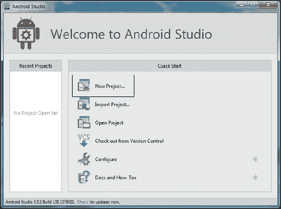
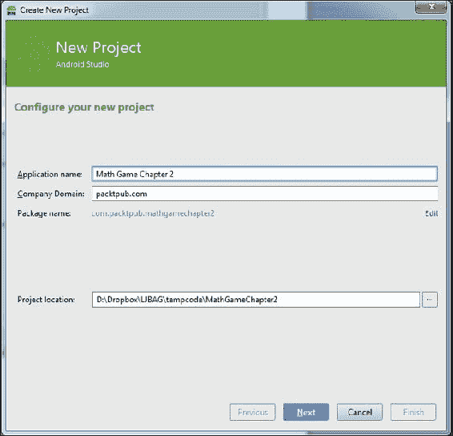
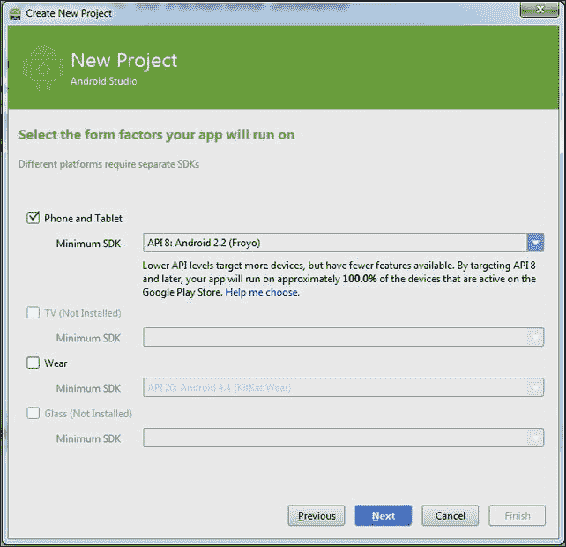
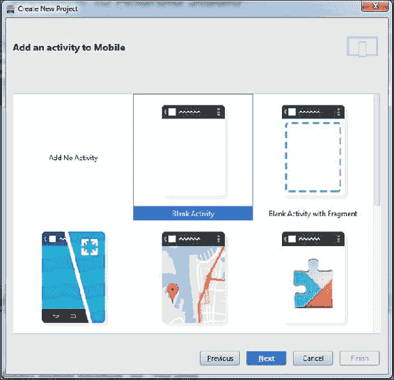
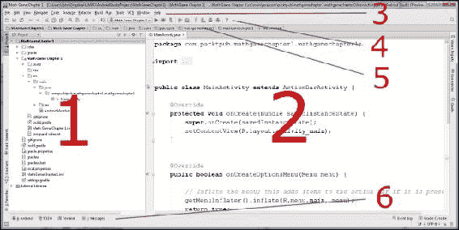
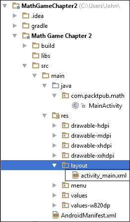
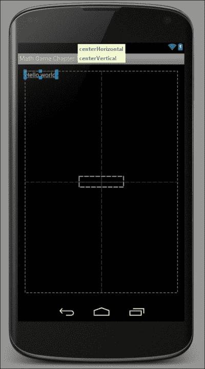
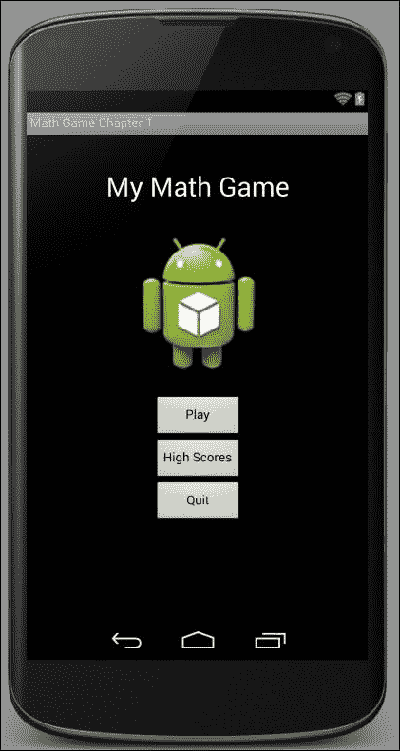
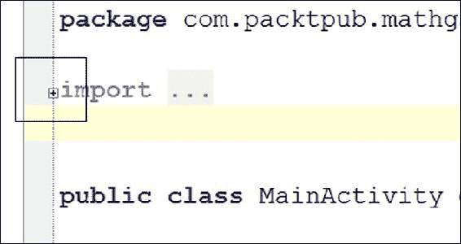
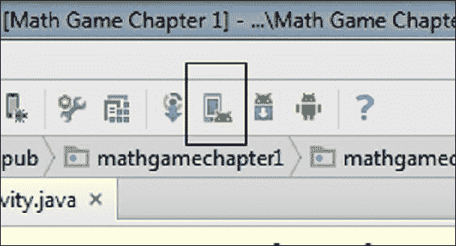

# 第二章：开始使用 Android

在本章中，我们将通过所有 Android 主题的过山车之旅，这些主题是您需要学习的，以便开始学习 Java。不过，这不仅仅是理论。我们将设计一个游戏菜单的**用户界面**（**UI**），并且我们还将看到并编辑我们的第一行 Java 代码。

此外，我们将看到如何在 PC/Mac 上的 Android 模拟器或者如果有的话在真实的 Android 设备上运行我们的应用程序。

本章中我们将涵盖的一些内容只是冰山一角。也就是说，我们讨论的一些主题下面有更多的内容，这些内容不适合于学习 Java 书籍的第二章。有时，我们可能需要相信一些信息。

这将使我们能够在本章结束时实际设计和运行我们自己的 Android 应用程序。然后我们可以在下一章的开始学习真正的 Java。

如果本章看起来有点困难，那么不要担心；继续前进，因为每个后续章节都会逐渐揭开一些不太清晰的主题。

在本章和接下来的两章中，我们将构建一个数学游戏。我们将从简单开始，到第四章结束时，*发现循环和方法*，我们将扩展到使用重要的 Java 技能的游戏功能。

在本章中，我们将：

+   开始我们的第一个游戏项目

+   探索 Android Studio

+   使用 Android Studio 可视化设计器制作我们的游戏 UI

+   了解为 Android 构建代码的结构

+   首次查看一些 Java 代码

+   在模拟器和真实设备上构建和安装我们的游戏

# 我们的第一个游戏项目

现在我们将直接开始使用 Android Studio。通过双击桌面的开始菜单上的 Android Studio 图标，或者在安装它的文件夹中双击 Android Studio 图标来运行 Android Studio。

### 注意

如果您在对话框中收到任何提到**权限提升**的错误，请尝试以管理员权限运行 Android Studio。要做到这一点，通过单击 Windows **开始**按钮并搜索**Android Studio**来找到 Android Studio 图标。现在右键单击该图标，然后单击**以管理员身份运行**。每次运行 Android Studio 时都要这样做。

## 准备 Android Studio

因此，安装了 Android Studio 和 Java 后，我们只需要添加我们将用于制作第一个游戏的最新版本的 Android API。以下是安装 API 的步骤：

1.  从 Android Studio UI 顶部的菜单栏，导航到**工具** | **Android** | **SDK 管理器**。在**Android SDK 管理器**窗口中向下滚动，并选择**Android 4.4.2 (API 19)**的复选框。

### 注意

请注意，由于 Android 发展如此迅速，当您阅读本章时，可能会有比 19 更高的 API，如 20、21 等。如果您遇到这种情况，请选择更新的（编号更高的）API。


1.  点击**安装软件包**。

1.  在下一个屏幕上，点击**接受许可证**复选框，然后点击**安装**按钮。Android Studio 将下载并安装适当的软件包。

刚才所做的是设置 Android Studio，以便提供最新的预写代码，称为 API，我们将在整本书中与之交互。

## 构建项目

1.  点击**新项目...**，如下面的屏幕截图所示：

1.  **创建新项目**配置窗口将出现。在**应用程序名称**字段中填写`Math Game Chapter 2`，在**公司域**中填写`packtpub.com`（或者您可以在此处使用您自己公司的网站名称），如下面的屏幕截图所示：

1.  现在点击**下一步**按钮。在下一个屏幕上，检查**手机和平板电脑**复选框是否被选中。现在我们必须选择要为其构建应用程序的最早版本的 Android。随意在下拉选择器中尝试几个选项。您会发现我们选择的版本越早，我们的应用程序支持的设备百分比就越大。然而，这里的权衡是，我们选择的版本越早，我们的应用程序中可用的尖端 Android 功能就越少。一个很好的平衡是选择**API 8：Android 2.2（Froyo）**。现在就像下一个截图中所示那样去做吧：

1.  点击**下一步**。现在如下截图所示选择**空白活动**，然后再次点击**下一步**：

1.  在下一个屏幕上，只需将**Activity Name**更改为`MainActivity`，然后点击**完成**。

### 提示

默认情况下，Android Studio 在每次启动时都会显示一个“每日提示”对话框。在您还在学习 Java 时，一些提示可能没有意义，但其中许多确实非常有用，并揭示了很多快捷方式和其他节省时间的方法。当它们出现时，花几秒钟时间阅读它们是非常值得的。正如已经讨论过的，Android Studio 是从 IntelliJ IDEA 构建的，您可以在[`www.jetbrains.com/idea/webhelp/keyboard-shortcuts-you-cannot-miss.html`](http://www.jetbrains.com/idea/webhelp/keyboard-shortcuts-you-cannot-miss.html)找到完整的键盘快捷键列表。

1.  通过点击**关闭**清除**每日提示**。

如果您是完全新手，那么代码、选项和文件可能看起来有点令人生畏。不要担心；在学习 Java 时，我们不需要关注它们中的大部分。当与更细节的东西互动的时候，我们将一步一步地进行。

也许很难相信，但我们刚刚创建了我们的第一个可工作的应用程序。我们可以在 Android 设备上构建和运行它，很快我们就会。

在我们继续进行游戏之前，让我们深入了解一下 Android Studio。

# 探索 Android Studio

Android Studio 是一个非常深入的工具，但只需要逐步学习其中的一部分就可以开始。对我们可能有用的是给 UI 的一些部分命名，这样在阅读本书时可以更容易地参考它们。

看一下这个编号的图表，以及对 Android Studio 一些关键部分的快速解释。如果可以的话，尽量记住这些部分，以便将来更容易地讨论它们。



这是一个方便的表格，您可以快速参考并记住我们正在提到的 Android Studio 的哪个部分。接下来是对每个区域的更详细的解释。

| 编号 | 名称 |
| --- | --- |
| 1 | 项目资源管理器 |
| 2 | 编辑器 |
| 3 | 菜单栏 |
| 4 | 工具栏 |
| 5 | 导航栏 |
| 6 | 重要的工具窗口 |

+   **项目资源管理器**（**1**）：这在截图中显示为**1**，有点像 Windows 资源管理器。它显示了为我们的项目生成的所有文件和文件夹。随着本书的继续，我们将从这里做很多事情。实际上，如果您深入研究 Android Studio 创建的文件和文件夹，项目资源管理器并不是一个精确的映射。它稍微简化并突出显示，以便更轻松地管理和探索我们的项目。

+   **编辑器**（**2**）：顾名思义，我们将在编辑器中编辑我们的 Java 代码文件。但是，正如我们很快将看到的，**编辑器**窗口会根据我们正在编辑的文件类型而发生变化。我们还将在这里查看和编辑 UI 设计。

+   **菜单栏**（**3**）：像大多数程序一样，**菜单**栏为我们提供了访问 Android Studio 全部功能的途径。

+   **工具栏**（**4**）：这包含了许多非常有用的一键选项，可以执行诸如部署和调试游戏等操作。将鼠标悬停在图标上，以获得弹出提示，并更深入地了解每个工具栏图标。

+   **导航栏**（**5**）：就像文件路径一样，它显示了当前在编辑器中的文件在项目中的位置。

+   **重要的工具窗口**（**6**）：这是一些选项卡，可以通过单击弹出并再次单击关闭。如果愿意，现在可以尝试一些选项卡，看看它们是如何工作的。

让我们更多地谈谈 Android Studio UI 的各个部分，以及编辑窗口如何转变为可视化 UI 设计师。之后，当我们足够熟悉时，我们将看看为我们的数学游戏构建一个简单的菜单屏幕。

# 使用 Android Studio 可视化设计师

Android Studio 编辑器窗口是一个非常动态的区域。它以最有用的方式呈现不同的文件类型。稍早一点，当我们创建项目时，它还为我们制作了一个基本的 UI。在 Android 中，UI 可以使用 Java 代码构建，或者，正如我们将看到的那样，在不需要一行 Java 代码的情况下使用可视化设计师。然而，正如我们在构建游戏菜单的 UI 之后将要调查的那样，要使 UI 做任何有用的事情，我们需要与之交互。这种交互总是通过 Java 代码完成的。可视化设计师还为我们生成 UI 代码。我们也会快速看一下那个。

随着书籍的进展，我们将主要避开 Android UI 开发，因为这是更多非游戏应用的基本功能。相反，我们将花更多时间直接绘制像素和图像来制作我们的游戏。尽管如此，常规的 Android UI 也有其用途，而 Android Studio 可视化设计师是最快的入门方式。

现在让我们来看看：

1.  在 Android Studio 项目资源管理器中，双击`layout`文件夹，以显示其中的`activity_main.xml`文件。这应该很容易看到，除非您已经折叠了目录。如果看不到`layout`文件夹，请使用项目资源管理器导航到它。它可以在 Android Studio 项目资源管理器中找到，路径为`Math Game Chapter2/src/main/res/layout`，如下面的截图所示：

1.  现在双击**activity_main.xml**以在编辑器窗口中打开它。加载一小段时间后，您将看到与下一个截图非常相似的东西。下一个截图显示了以前只包含我们代码的整个内容。正如您所看到的，以前只是一个文本窗口现在有了多个部分。让我们更仔细地看一下这个截图：

在前面标有（**1**）的截图中，称为**Palette**，您可以从可用的 Android UI 元素中进行选择，然后简单地点击并将它们拖放到您的 UI 设计中。区域（2）是您正在构建的 UI 的可视视图，您将从 Palette 中点击并拖动元素。在可视 UI 视图的右侧，您将看到**Component Tree**区域（3）。组件树允许您检查复杂 UI 的结构，并更轻松地选择特定元素。在此树下方是**Properties**面板（4）。在这里，您可以调整当前选定的 UI 元素的属性。这些可以是简单的东西，如颜色和大小，也可以是更高级的属性。

### 注意

请注意标有（**5**）的标签。这些标签允许您在 Android Studio 为此类型的布局文件提供的两个主要视图之间切换。正如您所看到的，这些视图是**Design**和**Text**。设计视图是默认视图，并且显示在前面的截图中。文本视图还显示您正在建设的 UI，但它显示为我们自动生成的代码，而不是**Palette**元素和组件树。

我们不需要担心这段代码，因为它都是为我们处理的。不过，偶尔查看一下这个选项卡可能会有好处，这样我们就可以开始理解设计工具为我们生成的内容。但是，这并不是学习 Java 所必需的。这段代码称为**可扩展标记语言**（**XML**）。

1.  快速查看**Text**选项卡，完成后点击**Design**选项卡，我们将继续。

现在我们已经看到了可视设计师的概述，甚至还瞥见了它为我们生成的自动生成代码。我们可以更仔细地查看一些我们将在项目中使用的实际 UI 元素。

## Android UI 类型

现在我们将快速浏览一些非常有用的 Android UI 元素，一些关键属性，以及如何将它们组合在一起制作 UI。这些将为我们介绍一些可能性以及如何使用它们。然后我们将快速使用我们所知道的知识来制作我们的菜单。

### TextView

在可视 UI 区域，点击**Hello world!**。我们刚刚选择的是一个称为 TextView 的小部件。TextView 可以是像这样的小文本，也可以是大标题类型的文本，在我们的游戏菜单中可能会有用。

让我们尝试将另一个 TextView 拖放到我们的可视 UI 上：

1.  在我们的调色板中**Widgets**标题下方，您可以看到多种类型的 TextView。它们在调色板中呈现为**普通 TextView**、**大文本**、**中等文本**和**小文本**。将**大文本**小部件拖放到我们的可视设计中。不要立即放开。当您将其拖动到手机图像周围时，请注意 Android Studio 以图形方式显示不同的定位选项。在下一个屏幕截图中，您可以看到当被拖动的小部件位于中心时设计师的外观：

1.  在您想要小部件放置的位置松开鼠标左键。如果您在上一个屏幕截图中显示的位置放开，那么文本将如预期般出现在中心。

1.  现在我们可以玩一下属性。在**Properties**窗口中，点击**textSize**右侧。您可能需要滚动查找。将值输入为`100sp`并按*Enter*键。注意文本变得更大。我们可以通过增加和减少在此处输入的值来调整文本的大小。单位`sp`代表缩放像素，只是一种尝试在不同屏幕密度下将文本缩放到适当的等效实际大小的测量系统。

1.  如果你喜欢的话，可以玩一些更多的属性，完成后，点击我们在可视化设计中创建的 TextView 以突出显示它。然后点击*删除*键来摆脱它。现在删除我们开始时存在的 TextView，上面写着**Hello world!**。

### 布局元素

现在您有一个看似空白的屏幕。但是，如果您在设计预览中的任何位置单击，您将看到**Properties**窗口中仍然有一些选项。这个元素称为 RelativeLayout。它是作为基础提供的几种布局元素类型之一，用于控制和对齐布局小部件，如按钮、文本等。如果您查看**Palette**窗口的顶部，您将看到主要的布局选项。我们将在稍后实际构建游戏菜单时使用此布局元素。

### ImageView 小部件

ImageViews 毫不奇怪地用于显示图像。在标准的 Android UI 中，这是一种快速将我们设计师的艺术品添加到我们的游戏中的方法：

1.  以与刚才定位 TextView 相同的方式将**ImageView**元素拖放到设计中。**ImageView**元素可以在**Widgets**标题下方找到。现在将其放置在中心，或者通过拖动它在设计中玩一下选项。我们将在一会儿删除它；在真正删除之前，我们只是进行了一些探索。

1.  在**属性**窗口中，以与之前选择**textSize**属性相同的方式选择**src**属性。

1.  注意，在选择后，您可以点击**...**以获得更多选项。点击**...**并滚动到选项列表的底部。这些都是我们可以在这个 ImageView 中显示的所有图像文件。只是为了好玩，滚动到列表的底部，选择**ic_launcher**，然后点击**确定**。我们可以使任何我们喜欢的图像可用，这是构建有吸引力的游戏菜单屏幕的一种简单而强大的方法。

1.  将**layout:width**属性更改为`150dp`，将**layout:height**属性更改为`150dp`。单位**dp**是一种在具有非常不同像素数量的屏幕设备上保持相对恒定的元素和小部件大小的方法。

1.  以与之前删除其他视图相同的方式删除 ImageView。

### ButtonView

ButtonView 的使用可能已经被它的名称泄露了。尝试在我们的布局上单击并拖动一些按钮。请注意，有几种类型的 ButtonView，例如**小按钮**，**按钮**，以及，如果您在**小部件**列表中继续向下查看，**图像按钮**。我们将使用常规的 ButtonView，简称为**按钮**。

现在我们将对每个这些 Android UI 元素进行操作，以制作我们的游戏菜单。

### 注意

您可以从本书配套网站的代码下载部分下载整个示例。

### 使用示例代码

本书中的所有代码都是以项目形式组织的。如果一个项目跨越多个章节，那么每个章节都会提供一个已完成状态的项目。这有助于您看到进展，而不仅仅是最终结果。要在 Android Studio 中打开项目，只需按照以下说明操作：

1.  下载本书的代码。

1.  在**Android Studio**中，从菜单栏导航到**文件** | **关闭项目**。

1.  现在创建一个新的空白项目，就像之前一样。浏览到您下载本书代码的位置。

1.  导航到`Chapter2/MathGameChapter2`文件夹。在这里，您将找到本章中创建的所有文件的代码。

1.  使用诸如免费的 Notepad++之类的纯文本编辑器打开代码文件。

1.  复制并粘贴到您的 Android Studio 项目中，或者只是按照您看到的代码进行比较。

### 提示

尽管本书提供了所需的每一行代码，但您仍然需要通过 Android Studio 为自己创建每个项目。然后，您可以简单地将代码的全部内容复制并粘贴到具有匹配名称的文件中，或者只是将您可能遇到困难的代码部分复制并粘贴。请记住，如果您创建了一个具有不同包名称的项目，那么您必须从提供的代码文件中*省略*包名称的代码行。当我们在本章后面更多地谈论包时，这一点将更加清晰。

让我们亲自看看如何做到这一切。

## 制作我们的游戏菜单

现在我们只是让我们的游戏菜单功能正常。稍后在第五章中，*游戏和 Java 基础*，我们将看到如何通过添加一些酷炫的动画来使菜单更具视觉吸引力和乐趣。

这是本教程中我们的目标：



在开始编码之前，您应该先在纸上设计您的布局。但是，Android Studio 的设计师非常友好，特别是对于简单的布局，有很强的论点，可以在布局设计师中实际完善您的设计。执行以下步骤创建游戏菜单：

1.  通过依次单击它们然后依次点击*删除*键，从设计师中删除所有小部件。注意不要删除**RelativeLayout**布局元素，因为我们将把它用作所有其他元素的基础。

1.  从面板中拖动一个**Large Text**元素到设计区域的顶部中心，并赋予它以下属性。请记住，您可以通过单击要更改的属性右侧来在**Properties**面板中更改属性。将**text**属性更改为`My Math Game`，**size**更改为`30sp`。

1.  从面板中拖动一个**ImageView**元素到设计的中心，稍微低于之前的 TextView。将**layout:width**属性更改为`150dp`，将**layout:height**属性更改为`150dp`。

1.  现在点击并拖动三个按钮，分别为**Play**，**High Scores**和**Quit**。将它们垂直居中，放在之前的 ImageView 下方，一个接一个地放置，就像我们之前展示的设计一样。

1.  点击顶部的按钮，配置**text**属性，并输入值`Play`。

1.  点击中间的按钮，配置**text**属性，并输入值`High Scores`。

1.  点击最低的按钮，配置**text**属性，并输入值`Quit`。

1.  由于按钮现在包含的文本量相对于彼此不同，它们的大小也会略有不同。您可以通过点击并拖动较小按钮的边缘来使它们与较大的按钮匹配，以匹配预期的布局。这与您在 Windows 中调整应用程序窗口大小的方式基本相同。

1.  使用*Ctrl* + *S*保存项目，或者导航到**File** | **Save All**保存项目。

### 提示

如果您要在比设计师中显示的 Nexus 4 屏幕大得多或小得多的屏幕上测试游戏，那么您可能希望调整本教程中使用的`sp`和`dp`单位的值。

在多个设备上讨论 Android UI 的全部内容超出了本书的范围，也不需要为本书中的任何游戏做任何讨论。如果你想立即开始为不同的屏幕设计，请查看[`developer.android.com/training/multiscreen/index.html`](http://developer.android.com/training/multiscreen/index.html)。

您可以通过从下拉菜单中选择设备来查看其他设备上的菜单外观，如下面的屏幕截图所示：


在我们的菜单在实际设备上启动之前，让我们先看一下 Android 应用程序的结构以及我们在编写 Java 代码时如何使用该结构。

# 为 Android 构建我们的代码

如果您曾经使用过 Android 设备，您可能已经注意到它的工作方式与许多其他操作系统有很大不同。例如，您正在使用一个应用程序-比如您正在查看 Facebook 上的人们在做什么。然后您收到一封电子邮件通知，您点击电子邮件图标阅读它。在阅读电子邮件的过程中，您可能会收到 Twitter 通知，因为您正在等待您关注的某人的重要消息，所以您中断了阅读电子邮件并触摸了 Twitter 应用。

阅读推特后，你想玩愤怒的小鸟，但在第一次大胆的投掷中途，你突然想起了 Facebook 的帖子。所以你退出了愤怒的小鸟，点击了 Facebook 图标。

然后你恢复了 Facebook，可能是在你离开的同一个点。你本可以继续阅读邮件，决定回复推特，或者开始一个全新的应用程序。所有这些来回都需要操作系统进行相当多的管理，显然独立于各个应用程序本身。

在我们刚刚讨论的情境中，Windows PC 和 Android 之间的区别在于，虽然用户决定使用哪个应用程序，但 Android 操作系统决定何时关闭（销毁）应用程序。我们在编写游戏时需要考虑这一点。

## 生命周期阶段-我们需要知道的内容

Android 系统有不同的**阶段**，任何给定的应用程序都可以处于这些阶段中。根据阶段，Android 系统决定应用程序如何被用户查看，或者是否被用户查看。Android 有这些阶段，以便它可以决定哪个应用程序正在使用，并分配正确数量的资源，如内存和处理能力。但也允许我们作为游戏开发人员与这些阶段进行交互。如果有人退出我们的游戏接听电话呢？他们会失去他们的进度吗？

Android 有一个相当复杂的系统，简化一下以便解释，确保 Android 设备上的每个应用程序都处于以下阶段之一：

+   正在创建

+   开始

+   恢复

+   运行

+   暂停

+   停止

+   被销毁

希望阶段列表看起来相当合乎逻辑。例如，用户按下 Facebook 应用图标，应用程序**创建**。然后它*启动*。到目前为止，所有都相当简单，但接下来的是**恢复**！如果我们能暂时接受应用程序在启动后恢复，那么一切都会变得清晰。

**恢复**后，应用程序正在*运行*。这是当 Facebook 应用程序控制屏幕，可能也控制着更多的系统内存和处理能力。那么我们之前从 Facebook 应用切换到电子邮件应用的例子呢？

当我们点击去读我们的电子邮件时，Facebook 应用程序可能已经进入了**暂停**阶段，电子邮件应用程序将进入**正在创建**阶段，然后是**恢复**，然后是**运行**。如果我们决定重新访问 Facebook，就像之前的情景一样，Facebook 应用程序可能会直接进入**恢复**阶段，然后再次**运行**，很可能会准确地停留在我们离开时的帖子上。

请注意，随时，Android 可以决定*停止*或*销毁*一个应用程序，在这种情况下，当我们再次运行应用程序时，它将需要重新*创建*。因此，如果 Facebook 应用程序长时间不活动，或者愤怒的小鸟需要太多系统资源，以至于 Android 将*销毁* Facebook 应用程序，那么我们之前阅读的确切帖子的体验可能会有所不同。

现在，如果所有这些阶段的东西开始变得令人困惑，那么你会高兴地知道，提到的唯一原因如下：

+   你知道它存在

+   我们偶尔需要与它交互

+   我们将一步一步地进行

## 生命周期阶段 - 我们需要做什么

当我们制作游戏时，我们如何可能与这种复杂性进行交互？好消息是，当我们创建第一个项目时自动生成的 Android 代码大部分为我们处理了交互。

作为游戏开发人员，我们所要做的就是确保 Android 知道在每个阶段发生时该如何处理我们的应用程序。更好的消息是，除非我们覆盖默认处理，否则所有这些阶段都将被默认处理。

这意味着我们可以继续学习 Java 和制作游戏，直到我们遇到少数需要在游戏中做一些事情的情况，特别是在其中一个阶段。

### 将我们的游戏分成活动

我们编写的 Java 代码将被分成称为**活动**的部分或部分。我们可以将活动视为游戏的不同屏幕。例如，在游戏中，我们经常会为主屏幕创建一个活动，为游戏屏幕创建一个活动，以及为高分屏幕创建一个活动。

每个活动都将有自己的生命周期，并将进一步分成部分，这些部分将对应于我们刚刚讨论的 Android 阶段之一。在 Java 中，这些部分被称为**方法**。方法是 Java 编程中的一个重要概念。

然而，在这个阶段，我们只需要知道方法用于将我们编写的 Java 代码分隔开，并且一些方法是由 Android 系统提供的，以便我们可以轻松处理否则复杂的 Android 生命周期。

接下来的列表是 Android 为了我们的方便提供的方法的快速解释，以管理生命周期的各个阶段。为了澄清我们对生命周期阶段的讨论，方法被列在我们一直在讨论的相应阶段旁边。然而，正如您将看到的，方法名称本身已经相当清楚地说明了它们在哪里适用。

在列表中，还有关于何时使用给定方法以及在特定阶段进行交互的简要解释或建议。随着我们在书中的进展，我们将遇到大多数这些方法。我们将在本章后面看到`onCreate`方法。以下是列表：

+   `onCreate`：当活动正在创建时，将执行此方法。在这里，我们准备好一切游戏所需的东西，包括图形、声音，也许还有高分。

+   `onStart`：当应用程序处于启动阶段时执行此方法。

+   `onResume`：此方法在`onStart`之后运行，但也可以在我们的活动在先前暂停后恢复时进入，这可能是最合乎逻辑的。当应用程序被中断时，我们可能会重新加载先前保存的游戏情况，例如电话呼叫或用户运行其他应用程序。

+   `onPause`：当我们的应用程序暂停时发生。在这里，我们可能希望保存当前的游戏。您可能已经掌握了这些方法。

+   `onStop`：这与停止阶段有关。这是我们可能会撤消在`onCreate`中所做的一切的地方。如果我们到达这里，我们的活动很可能很快就会被销毁。

+   `onDestroy`：这是我们的活动最终被销毁时——我们拆除游戏的最后机会。如果我们到达这里，我们肯定会再次经历生命周期的各个阶段。

所有方法的描述及其相关阶段应该是直接的。也许，唯一真正的问题是关于运行阶段。正如我们将看到的，当我们在其他方法/阶段中编写代码时，`onCreate`、`onStart`和`onResume`方法将准备游戏，这将形成运行阶段。`onPause`、`onStop`和`onDestroy`方法将随后发生。现在我们实际上可以看一下其中一个方法以及其他一些方法。

# 我们对 Java 的第一次了解

那么早些时候在创建新项目时 Android Studio 生成的所有代码呢？这些代码将使我们的游戏菜单生动起来。让我们仔细看一下。编辑窗口中的第一行代码是这样的：

```java
package com.packtpub.mathgamechapter2;
```

这行代码定义了我们在创建项目时命名的包。随着书籍的进展，我们将编写跨越多个文件的更复杂的代码。我们创建的所有代码文件都需要清楚地定义它们所属的包，就像前一行代码一样。代码实际上并没有在我们的游戏中*做*任何事情。还要注意，这行代码以分号(`;`)结束。这是 Java 语法的一部分，它表示代码行的结束。删除分号，您将会得到一个错误，因为 Android Studio 试图理解两行代码。如果您愿意，可以尝试一下。

### 提示

请记住，如果您要从下载包中复制和粘贴代码，这是可能会有所不同的一行代码，具体取决于您如何设置项目。如果代码文件中的包名称与您创建的包名称不同，请始终使用创建项目时的包名称。

要查看接下来的四行代码，您可能需要单击小**+**图标以显示它们。Android Studio 试图通过简化我们对代码的视图来提供帮助。请注意，编辑窗口的侧边还有几个小**-**图标。您可以展开和折叠它们以适应自己的需求，而不会影响程序的功能。如下截图所示：



扩展代码后，您将看到这四行：

```java
import android.support.v7.app.ActionBarActivity;
import android.os.Bundle;
import android.view.Menu;
import android.view.MenuItem; 
```

请注意，所有前面的行都以单词`import`开头。这是一个指示，包括其他包在我们的游戏中，而不仅仅是我们自己的包。这非常重要，因为它使我们能够使用其他程序员的辛勤工作，本例中是安卓开发团队的辛勤工作。正是这些导入使我们能够使用我们之前讨论过的方法，并允许我们与安卓生命周期阶段进行交互。再次注意，所有行都以分号（`;`）结尾。

下一行介绍了 Java 的一个基本构建块，称为**class**。类是我们将在整本书中不断扩展知识和理解的内容。现在，先看一下这行代码，然后我们将详细讨论它：

```java
public class MainActivity extends ActionBarActivity {
```

逐字逐句，以下是正在发生的事情。前一行是说：创建一个名为`MainActivity`的新`public class`，并基于（`extends`）`ActionBarActivity`。

你可能还记得，在创建这个项目时我们选择的名称是`MainActivity`。`ActionBarActivity`是由安卓开发团队编写的代码（称为类），它使我们能够将我们的 Java 代码放入安卓中。

如果您有敏锐的眼光，您可能会注意到这行末尾没有分号。但是，有一个左花括号（`{`）。这是因为`MainActivity`包含了其余的代码。实际上，一切都是我们的`MainActivity`类的一部分，它是基于`ActionBarActivity`类/代码构建的。如果您滚动到编辑窗口底部，您将看到一个右花括号（`}`），这表示我们称为`MainActivity`的类的结束。

+   我们现在不需要知道类如何工作

+   我们将使用类来访问其中包含的一些方法的代码，而不需要做任何其他操作，我们已经默认地利用了我们之前讨论过的安卓生命周期方法

+   我们现在可以自由选择是否、何时以及在这些类中定义的方法中覆盖或保留默认值

所以，`ActionBarActivity`类包含了使我们能够与安卓生命周期交互的方法。实际上，有许多不同的类使我们能够做到这一点，一会儿，我们将从使用`ActionBarActivity`更改为一个更合适的类，该类也执行刚才提到的所有操作。

### 提示

此时重要的不是正确理解 Java 类；只需了解您可以导入一个包，一个包可以包含一个或多个类，然后您可以使用这些类的功能或基于自己的 Java 程序。

在接下来的几章中，我们将经常遇到类。把它们看作是做事情的编程黑匣子。在第六章中，*OOP – Using Other People's Hard Work*，我们将打开这个黑匣子，真正掌握它们，甚至开始制作我们自己的类。

继续进行代码，让我们看看我们的类中实际包含的代码是做什么的。

在我们刚刚讨论过的关键行之后，直接是代码块：

```java
@Override
    protected void onCreate(Bundle savedInstanceState) {
        super.onCreate(savedInstanceState);
        setContentView(R.layout.activity_main);
    }
```

希望现在这些代码中的一些内容开始变得有意义，并与我们已经讨论过的内容联系起来。尽管确切的语法仍然会感觉有点陌生，但只要我们意识到发生了什么，我们就可以继续学习 Java。

在前面的代码中，我们注意到的第一件事是`@override`关键字。还记得我们说过所有与 Android 生命周期交互的方法都是默认实现的，我们可以自行选择是否以及何时覆盖它们吗？这就是我们在这里用`onCreate`方法所做的。

`@override`关键字表示接下来的方法被覆盖。`protected void onCreate(Bundle savedInstanceState) {`行包含我们正在覆盖的方法。你可能能猜到，动作从问题行的`{`开始，三行后以`}`结束。

在方法名`onCreate`之前和方法名后的`(Bundle savedInstanceState)`看起来有点奇怪，但这些在这个时候并不重要，因为它们已经为我们处理了。这与数据在我们程序的各个部分之间传递有关。我们只需要知道这里发生的事情将在 Android 生命周期的创建阶段发生。其余内容将在第四章*发现循环和方法*中变得清晰。让我们继续到下一行：

```java
super.onCreate(savedInstanceState);
```

在这里，`super`关键字引用了原始的`onCreate`方法中的代码，即使我们看不到它，它仍然存在。代码的意思是：尽管我正在覆盖你，但我希望你首先像往常一样设置好一切。然后，在`onCreate`完成了我们看不到也不需要看到的大量工作之后，方法继续进行，我们实际上可以用这行代码做一些事情：

```java
setContentView(R.layout.activity_main);
```

在这里，我们告诉 Android 设置主内容视图（我们用户的屏幕），这是我们之前创建的酷炫游戏菜单。具体来说，我们声明它是`layout`文件夹中的`R`或资源，文件名为`activity_main`。

## 清理我们的代码

接下来的两个代码块是由 Android Studio 创建的，假设我们想要覆盖另外两个方法。但我们不需要，因为这些方法更常用于非游戏应用程序：

1.  删除以下代码中显示的整个内容。注意不要删除我们`MainActivity`类的结束大括号：

```java
@Override
    public boolean onCreateOptionsMenu(Menu menu) {

        // Inflate the menu; this adds items to the action bar if it is present.
        getMenuInflater().inflate(R.menu.main, menu);
        return true;
    }

    @Override
    public boolean onOptionsItemSelected(MenuItem item) {
        // Handle action bar item clicks here. The action bar will
        // automatically handle clicks on the Home/Up button, so long
        // as you specify a parent activity in AndroidManifest.xml.
        int id = item.getItemId();
        if (id == R.id.action_settings) {
            return true;
        }
        return super.onOptionsItemSelected(item);
    }
```

1.  现在我们可以删除一些`@import`语句。这是因为我们刚刚删除了不再需要的类的覆盖方法（之前导入的）。请注意编辑器窗口中以下行是灰色的。请注意，如果你保留它们，程序仍然可以正常工作。现在删除它们，以使你的代码尽可能清晰：

```java
import android.view.Menu;
import android.view.MenuItem;
```

1.  在我们的代码完成之前进行一些最终修改：此时，你可能会认为我们已经删除和更改了我们的代码很多，以至于我们可能干脆从空白页面开始重新输入。这几乎是正确的。但是，让 Android Studio 为我们创建一个新项目，然后进行这些修改的过程更加彻底，也避免了很多步骤。以下是最后的代码更改。将`import android.support.v7.app.ActionBarActivity;`行更改为`import android.support.app.Activity;`。

1.  现在你会看到我们的代码下面有几条红线标出错误。这是因为我们试图使用一个尚未导入的类。只需将`public class MainActivity extends ActionBarActivity {`行更改为`public class MainActivity extends Activity {`。

我们对最后两个更改所做的是使用`Activity`类的稍微更合适的版本。为此，我们还必须更改我们导入的内容。

完成后，你的编辑器窗口应该看起来像这样：

```java
package com.packtpub.mathgamechapter2.mathgamechapter2;

import android.support.v7.app.ActionBarActivity;
import android.os.Bundle;

public class MainActivity extends ActionBarActivity {

    @Override
    protected void onCreate(Bundle savedInstancePhase) {
        super.onCreate(savedInstancePhase);
        setContentView(R.layout.activity_main);
    }

}
```

### 提示

**下载示例代码**

你可以从[`www.packtpub.com`](http://www.packtpub.com)的账户中下载你购买的所有 Packt Publishing 图书的示例代码文件。如果你在其他地方购买了这本书，你可以访问[`www.packtpub.com/support`](http://www.packtpub.com/support)并注册，将文件直接发送到你的邮箱。

现在我们知道发生了什么，我们的代码干净而简洁，我们实际上可以看一下我们游戏的开头部分在运行中的样子！

### 提示

如果我们刚才讨论的任何内容看起来复杂，不用担心。安卓强制我们在 Activity 生命周期内工作，所以之前的步骤是不可避免的。即使你没有完全理解关于类和方法等的所有解释，你仍然完全有能力从这里学习 Java。随着书的进展，所有的类和方法都会变得更加简单明了。

# 构建和安装我们的游戏

很快，我们将实际看到我们的菜单在运行。但在这之前，我们需要找出如何使用安卓模拟器以及如何构建我们的游戏。然后我们将把这些放在一起，把我们的游戏放入模拟器或真实设备中，以便像我们的玩家一样看到它。

## 模拟器和设备

现在我们已经准备好运行游戏的第一部分。我们需要测试它，检查是否有任何错误、崩溃或其他意外情况。还要确保它在您想要定位的设备类型/尺寸上看起来好并且运行正确。

### 注意

我们不会详细讨论处理不同设备类型的细节。我们所有的游戏都是全屏的，我们将稍后锁定方向并动态计算屏幕分辨率等方面。所以我们可以只为一个设备类型编写，并专注于学习 Java。

现在知道，你可以为任何屏幕尺寸分类或像素密度创建不同的布局文件。你所需要做的就是将布局文件放在适当的文件夹中，使用完全相同的文件名。安卓设备将*知道*最适合它使用的布局。有关详细讨论，请参阅 Google 开发者网站[`developer.android.com/guide/practices/screens_support.html`](http://developer.android.com/guide/practices/screens_support.html)。

请注意，您不需要理解上述链接中的任何信息就可以学习 Java 并发布您的第一个游戏。

有几种方法可以做到这一点，我们将看两种。首先，我们将使用 Android Studio 和 Android 开发工具来制作一个设备模拟器，这样我们就可以在同一台 PC/Mac 上使用、测试和调试我们的游戏在各种设备模拟器上。所以我们不需要拥有一个设备。这将允许我们从我们的游戏中获得崩溃报告。

然后我们将直接将游戏安装到真实设备上，以便我们可以看到当他们下载我们的应用时，设备的所有者将看到什么。

还有更多的选择。例如，您可以通过 USB 连接真实设备，并在 Android Studio 中直接调试设备上的错误和语法反馈。这个过程可能因不同的设备而有所不同，由于我们只关注基本的调试，我们不会在本书中涵盖这个内容。

### 创建一个模拟器

让我们启动我们的模拟器：

1.  在 Android Studio 快速启动栏的右侧，找到 AVD 管理器图标：

1.  点击图标启动 Android 虚拟设备管理器。然后点击左下角的**创建虚拟设备...**按钮，打开**虚拟设备配置**窗口。

1.  现在点击**Nexus 4**选项，然后点击**下一步**。

1.  现在我们需要选择我们将在其上构建和测试我们的游戏的安卓版本。最新版本（写作时）是**Lollipop - 21 - x86**。这是唯一一个我们不需要完成下载就可以继续的选项。所以选择它（或者在您阅读本文时的默认选项），然后点击**下一步**继续。

1.  在下一个屏幕上，我们可以保留所有默认设置。所以点击**完成**。

我们现在有一个可以直接运行的安卓模拟器。

### 运行模拟器

现在我们将启动（打开）我们的虚拟设备，然后通过以下步骤实际运行我们之前制作的游戏：

1.  点击**Name**列下的**Nexus 4 API 21**。现在点击描述我们的模拟器右侧的三角形播放图标。

### 注意

安卓模拟器需要很长时间才能启动。即使在高规格的 PC 上也是如此。预计至少要等待几分钟，甚至 10 分钟。

1.  一旦启动，通过点击和拖动模拟设备屏幕的任何位置来解锁设备。这类似于在真实的 Nexus 4 上滑动解锁。当我们的 Nexus 4 虚拟设备运行并解锁时，它看起来是这样的：

您可以几乎以与真实安卓设备相同的方式玩这个模拟器。但是，您无法从 Google Play 下载应用。您可能会注意到，与真实设备相比，甚至与旧设备相比，模拟器速度有点慢。不久，我们将看看如何在真实设备上运行我们的应用程序。

### 在模拟器上运行我们的游戏

一旦模拟器运行起来，通常最好让它保持运行，这样每次我们想要使用它时，就不必等待它启动。让我们使用模拟器：

1.  如果模拟器尚未运行，请启动它，并确保设备已按先前描述的方式解锁。

1.  点击工具栏中的运行图标（如下所示）来运行您的应用程序。您也可以通过从菜单栏导航到**Run** | **Math Game Chapter 2**来实现相同的功能：

1.  在 Android Studio 构建我们的应用程序时，弹出对话框将询问您要在哪个设备上运行该应用程序。选择描述中带有**Nexus 4 API 21**的设备。这是我们之前创建的已经运行的设备。现在按**OK**。

1.  注意此时在 Android Studio 的底部部分出现了有用的安卓窗口。如果您遇到任何问题，只需检查代码中的拼写错误。如果事情真的不顺利，只需返回到*使用示例代码*部分，与提供的代码进行比较或复制粘贴。

在另一段暂停后，我们的游戏菜单屏幕将出现在模拟器上。当然，它现在还没有做任何事情，但它正在运行，按钮可以被按下。

完成后，您可以按返回或主屏幕图标退出应用程序，就像在真实的安卓设备上一样。

现在我们已经看到了一种我们可以通过在安卓模拟器中运行来测试我们的应用程序的方法。让我们找出如何将我们的代码制作成一个可以在真实设备上分发和使用的应用程序。

## 构建我们的游戏

在真实的安卓设备上运行我们的游戏，我们需要创建一个以`.apk`结尾的文件，也就是一个以`.apk`为扩展名的文件。`.apk`文件是安卓系统用来运行和安装我们的应用程序的文件和文件夹的压缩存档。以下是使用安卓工作室制作我们游戏的`.apk`的步骤：

1.  从菜单栏导航到**Build** | **Generate Signed APK**。

1.  一个略显冗长的窗口将弹出并显示：**对于基于 Gradle 的项目，签名配置应在 Gradle 构建脚本中指定**。您可以点击**OK**安全地关闭此窗口。

1.  接下来是**Generate Signed APK Wizard**对话框。在这里，我们正在创建一个标识持有者被授权分发 APK 的密钥。在此过程结束时，您将获得一个`.keys`文件，您可以在每次构建`.apk`文件时使用。因此，这一步在将来可以省略。点击**Create new**按钮。

1.  在**Key Store Path**字段中，键入或转到您的硬盘上希望存储密钥的位置。然后，您将被提示选择密钥库的文件名。这是任意的。键入`MyKeystore`并点击**OK**。

1.  在**Password**字段中输入密码，然后在**Confirm**字段中重新输入。这是用于保护您的密钥的存储的密码。

1.  接下来，在**别名**字段中，输入一个易记的别名。您可以将其视为密钥的用户名。再次在**密码**字段中输入密码，然后在**确认**字段中重新输入。这是您的密钥密码。

1.  将**有效年限**下拉菜单保持默认的**25**。

1.  然后您可以填写您的姓名和组织详情（如果有），然后点击**确定**。

1.  现在我们的密钥和密钥库已经完成，我们可以在**生成已签名 APK 向导**对话框上点击**确定**。

1.  然后我们被提示选择**运行 Proguard**。在这个时候，加密和优化我们的`.apk`是不必要的。所以只需点击**完成**生成我们应用程序的`.apk`文件。

1.  生成的`.apk`文件将放在您选择放置项目文件的同一目录中。例如，`MathGameChapter2/app`。

我们现在已经构建了一个`.apk`文件，可以在我们首次创建项目时指定的任何 Android 设备上运行。

## 将设置安装到设备

所以我们有了`.apk`文件，也知道了在哪里找到它。以下是我们将在 Android 设备上运行它的方法。

我们可以使用多种方法将`.apk`文件传输到设备中。我发现其中一种最简单的方法是使用云存储服务，比如 Dropbox。然后您只需点击并拖动`.apk`文件到您的 Dropbox 文件夹，就完成了。或者，您的 Android 设备可能附带了 PC 同步软件，允许您将文件拖放到设备中。在您将`.apk`文件放入 Android 设备后，继续进行教程。

大多数 Android 手机默认设置为只能从 Google Play 商店以外的地方安装应用程序。所以我们需要改变这一点。您将要导航到的确切菜单在您的设备上可能略有不同，但以下选项在大多数设备上几乎是相同的，无论新旧：

1.  找到并点击**设置**应用。大多数 Android 手机也有**设置**菜单选项。任何一个都可以。现在选择**安全**，并滚动到**未知来源**选项。点击**未知来源**复选框，允许从未知来源安装应用程序。

1.  使用 Dropbox 应用或您设备的文件浏览器在您的 Android 设备上找到文件，具体取决于您选择的方法将 APK 放入设备。点击`MathGameChapter2.apk`文件。

1.  现在您可以像安装其他应用程序一样安装该应用程序。在提示时，点击**安装**，然后点击**打开**。游戏现在将在您的设备上运行。

将您的设备保持竖直方向，因为这是 UI 设计的方式。恭喜您在自己的设备上运行自己的 Android 应用程序。在数学游戏的以后版本中，我们将锁定方向，使其更加用户友好。

## 未来的项目

在整本书中，我们将测试和运行我们的游戏项目。你可以自行选择我们讨论过的方法中的哪一种。如果出现崩溃或无法解释的错误，那么您需要使用模拟器。如果一切正常，那么最快、最令人愉悦的方式可能就是在您拥有的设备上运行它。

# 自测问题

Q1）如果所有这些关于生命周期、类和方法的讨论让您感到困惑，您应该怎么办？

Q2）什么是 Java 类？

Q3）方法和类之间有什么区别？

Q4）查看 Android 开发者网站，以及其更详细的生命周期阶段解释，网址为[`developer.android.com/reference/android/app/Activity.html`](http://developer.android.com/reference/android/app/Activity.html)。您能看到我们没有讨论过的阶段及其相关方法吗？在应用程序中它会在什么时候触发？从创建到销毁，活动的确切路径是什么？

# 总结

到目前为止，我们讨论了完全理解代码的工作原理并不重要。这是因为它将仅充当我们在本书其余部分中编写的代码的容器。然而，当我们在第四章中详细讨论诸如方法和第六章中的类时，我们将开始理解我们游戏中的所有代码。

我们详细讨论了有些复杂的 Android 生命周期。我们了解到，我们现阶段需要理解的是，我们必须在与生命周期不同阶段相关的正确方法中编写我们的代码。然后，学习 Java 就不会有任何困难。与类和方法一样，一切都将在实践中得到解释并变得更加清晰。

我们还学习了 Android Studio UI 的关键领域。我们使用 Android Studio 设计师构建了我们数学游戏的开始菜单。此外，我们创建了必要的 Java 代码，使游戏出现在玩家的设备上。这主要是通过修改为我们自动生成的代码来实现的。

这可能是本书中最困难的一章，因为我们需要介绍一些东西，比如 Java 类、Java 方法和 Android 生命周期。我们这样做是因为我们需要了解在学习 Java 时周围发生的事情。

然而，从现在开始，我们可以循序渐进地以非常合乎逻辑的方式进行。如果你已经达到了这一点，那么你将毫无问题地完成本书中最艰难的项目。

如果这一章让你的大脑有点疼，那么请放心，你已经走到了这一步，这非常好地表明你将来会成为 Java 高手。从基础开始，让我们现在学习一些 Java。
