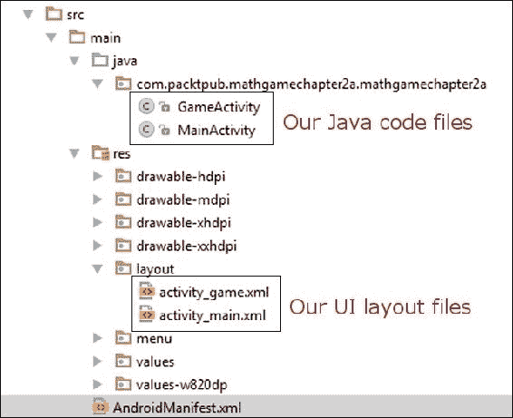
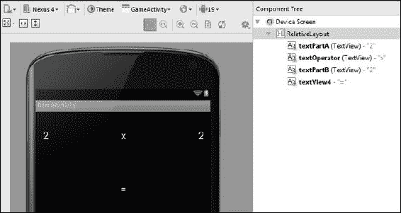
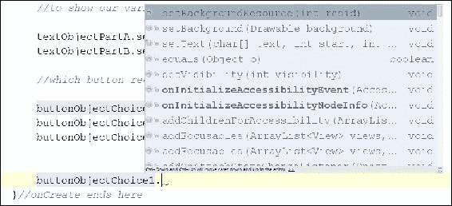
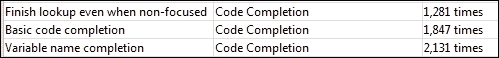
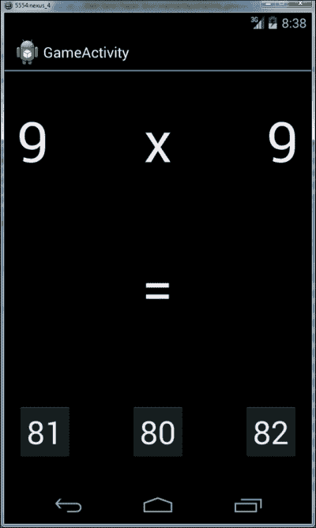
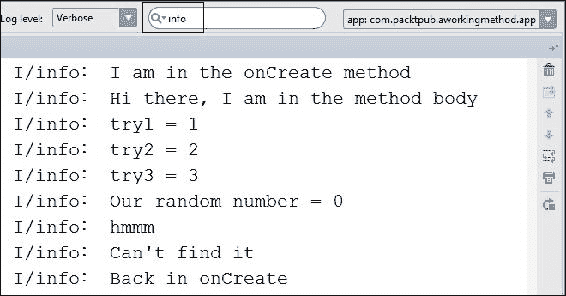

# 第四章。发现循环和方法

在本章中，我们将学习如何通过查看 Java 中不同类型的循环来以受控且精确的方式重复执行我们代码的部分。这些包括`while`循环、`do-while`循环和`for`循环。我们将学习在何种情况下使用不同类型的循环。

然后我们将简要介绍随机数的主题。我们还将看到如何使用 Java 的`Random`类。这显然对增强我们的数学游戏非常有帮助。

接下来，我们将看看**方法**。它们允许我们将代码分隔成更易管理的块。然后，我们将看到如何在方法之间共享数据，并将编程任务分解以简化问题。

然后，我们将在我们的数学游戏项目中使用我们所学到的关于循环、随机数和方法的所有知识。例如，我们将使游戏在每次尝试答案后更改问题。

我们还将添加问题难度级别和在适当难度级别内的随机问题。我们将展示并更新我们的分数。答对问题的难度级别越高，分数增加得越快。最终，即使我们中最优秀的数学家也应该被游戏打败。然而，我们中的大多数人希望能够比下面的截图所显示的更进一步。

如果玩家答错了问题，难度将回到最简单的级别，分数将变为零。这是我们完成后游戏的样子：


在本章中，我们将：

+   了解多种类型的循环中的循环

+   学习如何在 Java 中生成随机数

+   学习有关 Java 方法的所有内容，包括如何编写和调用它们

+   显著增强我们的数学游戏

# 使用循环进行循环

询问循环与编程有什么关系是完全合理的，但它们确实如其名称所示。它们是一种多次执行相同代码的方式，或者循环执行相同代码的一部分，但每次可能会有不同的结果。

这可能意味着做同样的事情，直到循环的代码提示循环结束。它可以在由循环代码本身指定的预定次数后提示循环。它也可以在满足预定情况或**条件**时提示循环结束。或者可能是这些提示循环结束的方式的组合。除了`if`、`else`和`switch`，循环也是 Java**控制流语句**的一部分。

我们将研究 Java 提供的所有主要类型的循环，然后在研究了方法之后，我们将使用其中一些来实现对我们数学游戏的增强。让我们继续进行我们的第一种循环。

## While 循环

`while`循环具有最简单的语法。回想一下第三章中的`if`语句，*说 Java - 你的第一个游戏*。我们可以在`if`语句的条件表达式中放置几乎任何组合的运算符和变量。如果表达式评估为`true`，则执行`if`块中的代码。同样，在`while`循环中，我们放置一个可以评估为`true`或`false`的表达式，如下所示：

```java
int x = 10;

while(x > 0){
  x--;
  //x decreases by one each pass through the loop
}
```

这里发生的是，在`while`循环之外，声明了一个整数`x`，并将其初始化为`10`。然后`while`循环开始。它的条件是`x > 0`，因此它将继续循环执行其主体中的代码，直到条件评估为`false`。因此，代码将执行 10 次。

在第一次循环中，`x`等于`10`，然后是`9`，然后是`8`，依此类推。但一旦`x`等于`0`，显然它不再大于`0`。因此，程序将退出`while`循环，并继续执行循环后的第一行代码。

就像`if`语句一样，`while`循环有可能甚至不执行一次。看一下这个永远不执行的`while`循环的例子：

```java
int x = 10;

while(x > 10){
  //more code here.
  //but it will never run unless x is greater than 10.
}
```

此外，条件表达式的复杂程度或循环体中可以编写的代码量没有限制：

```java
int playerLives = 3;
int alienShips = 10;

while(playerLives >0 && alienShips >0){
  //Entire game code here.
  //...
  //...
  //etc.
}
//continue here when either playerLives or alienShips = 0
```

前面的`while`循环将继续执行，直到`playerLive`或`alienShips`变为等于或小于零。一旦其中一个条件发生，表达式就会评估为`false`，程序就会从`while`循环后的第一行代码继续执行。

值得注意的是，一旦进入循环体，即使表达式在中间某个地方评估为`false`，循环体也会始终完成，因为在代码尝试开始另一次通过之前不会再次检查条件：

```java
int x = 1;

while(x > 0){
  x--;
  //x is now 0 so the condition is false
  //But this line still runs
  //and this one
  //and me!

}
```

前面的循环体将确切地执行一次。我们还可以设置一个永远运行的`while`循环（不出所料地称为**无限循环**），就像这样：

```java
int x = 0;

while(true){
  x++; //I am going to get mighty big!
}
```

### 跳出循环

我们可以使用一个无限循环，就像前面的例子中的循环一样，这样我们就可以决定何时从循环体内退出循环。当我们准备离开循环体时，我们会使用`break`关键字，如下面的代码所示：

```java
int x = 0;

while(true){
  x++; //I am going to get mighty big!
  break; //No you're not haha.
  //code doesn't reach here
}
```

你可能已经猜到，我们可以在`while`循环和我们即将看到的其他循环中结合任何决策工具，比如`if`、`else`和`switch`：

```java
int x = 0;
int tooBig = 10;

while(true){
  x++; //I am going to get mighty big!
  if(x == tooBig){
    break;
  } //No you're not haha.

  //code reaches here only until x = 10
}
```

我们可以简单地继续演示`while`循环的多种用途，但是在某个时候，我们想要回到做一些真正的编程。因此，这是最后一个概念，结合了`while`循环。

### continue 关键字

`continue`关键字的作用方式与`break`类似，但有一点不同。`continue`关键字将跳出循环体，但之后也会检查条件表达式，所以循环*可能*会再次运行。下面的例子将展示`continue`的用法：

```java
int x = 0;
int tooBig = 10;
int tooBigToPrint = 5;

while(true){
  x++; //I am going to get mighty big!
  if(x == tooBig){
    break;
  } //No your not haha.

  //code reaches here only until x = 10

  if(x >= tooBigToPrint){
    //No more printing but keep looping
    continue;
  }
  //code reaches here only until x = 5

  //Print out x 

}
```

## Do-while 循环

`do-while`循环与`while`循环非常相似，唯一的区别是它在循环体之后评估表达式。这意味着`do-while`循环将始终至少执行一次，如下面的代码所示：

```java
int x= 0;
do{
  x++;
}while(x < 10);
//x now = 10 
```

### 注意

`break`和`continue`关键字也可以在`do-while`循环中使用。

## For 循环

`for`循环的语法比`while`和`do-while`循环稍微复杂一些，因为它需要三个部分来初始化。首先看一下下面的`for`循环。然后我们将它拆分开来：

```java
for(int i = 0; i < 10; i++){
  //Something that needs to happen 10 times goes here
}
```

`for`循环的这种看似晦涩的形式在这样表述时更加清晰：

```java
for(declaration and initialization; condition; change after each pass through loop)
```

为了进一步澄清，我们在`for`循环中有以下内容：

+   **声明和初始化**：我们创建一个新的`int`变量`i`，并将其初始化为 0。

+   **条件**：就像其他循环一样，这指的是必须评估为真以使循环继续的条件。

+   **每次通过循环后更改**：在前面的例子中，`i++`表示每次通过循环时`i`增加 1。我们也可以使用`i--`来减少/递减`i`，如下面的代码所示：

```java
for(int i = 10; i > 0; i--){
  //countdown
}
//blast off i = 0
```

### 注意

请注意，`break`和`continue`也可以在`for`循环中使用。

`for`循环本质上控制了初始化、条件评估和控制变量。在我们看完随机数和方法之后，我们将使用`for`循环来增强我们的数学游戏。

## Java 中的随机数

在我们深入研究方法之前，我们首先来看一下如何创建随机数，因为这是我们将生成随机问题的方法。

`Random`类为我们完成了所有的工作。首先我们需要创建一个`Random`类型的对象：

```java
Random randInt = new Random();
```

然后我们使用新对象的`nextInt`方法来生成一个在某个范围内的随机数：

```java
int ourRandomNumber = randInt.nextInt(10);
```

我们输入的数字范围从零开始。因此，前面的代码将生成一个介于 0 和 9 之间的随机数。如果我们想要一个介于 1 和 10 之间的随机数，我们只需要这样做：

```java
ourRandomNumber++;
```

### 提示

在这些早期章节中，我们经常需要接受一些魔法在 Random 等对象中发生。在第六章中，*OOP-使用他人的辛勤工作*，我们将打开黑匣子，甚至制作我们自己的黑匣子。我们将能够编写我们自己的类和这些类中的方法。

一个很好的开始是查看常规的基本方法，接下来我们将这样做。

# 数学游戏-提问

现在我们已经掌握了所有这些知识，我们可以利用它来改进我们的数学游戏。首先，我们将创建一个新的 Android 活动，作为实际的游戏屏幕，而不是开始菜单屏幕。然后，我们将使用 UI 设计师来布置一个简单的游戏屏幕，以便我们可以使用我们的 Java 技能来使用变量、类型、声明、初始化、运算符和表达式来使我们的数学游戏为玩家生成一个问题。然后，我们可以使用一个按钮将开始菜单和游戏屏幕连接在一起。

如果您想节省输入时间，只需查看完成的项目，您可以使用从 Packt Publishing 网站下载的代码。如果您在使任何代码工作时遇到任何问题，您可以查看、比较或复制并粘贴下载包中提供的已完成代码。

完成的代码在以下文件中，这些文件对应于本教程中将使用的文件名：

+   `Chapter3/MathGameChapter3a/java/MainActivity.java`

+   `Chapter3/MathGameChapter3a/java/GameActivity.java`

+   `Chapter3/MathGameChapter3a/layout/activity_main.xml`

+   `Chapter3/MathGameChapter3a/layout/activity_game.xml`

像往常一样，我建议跟着本教程来看看我们如何为自己创建所有的代码。

## 创建新的游戏活动

我们首先需要为游戏活动代码创建一个新的 Java 文件和一个相关的布局文件来保存游戏活动 UI。

1.  运行 Android Studio 并选择我们在第二章中构建的`Math Game Chapter 2`项目，*开始使用 Android*。它可能已经默认打开了。现在我们将创建一个新的 Android 活动，该活动将包含实际的游戏屏幕，当玩家点击主菜单屏幕上的**Play**按钮时将运行。

1.  要创建一个新的活动，我们现在需要另一个布局文件和另一个 Java 文件。幸运的是，Android Studio 会帮助我们做到这一点。要开始创建新活动所需的所有文件，请在项目资源管理器中右键单击`src`文件夹，然后转到**New** | **Activity**。现在点击**Blank Activity**，然后点击**Next**。

1.  现在，我们需要在上面的对话框中输入一些关于我们的新活动的信息。将**Activity Name**字段更改为`GameActivity`。注意**Layout Name**字段会自动更改为`activity_game`，**Title**字段也会自动更改为`GameActivity`。

1.  点击**Finish**。Android Studio 已经为我们创建了两个文件，并且还在清单文件中注册了我们的新活动，所以我们不需要关心它。

1.  如果您查看编辑窗口顶部的选项卡，您会看到`GameActivity.java`已经准备好供我们编辑，如下面的屏幕截图所示：

1.  通过点击之前显示的**GameActivity.java**选项卡，确保`GameActivity.java`在编辑窗口中处于活动状态。

1.  回到第二章*开始使用 Android*，我们谈到了 Android 默认覆盖了一些方法，其中大多数是不必要的。在这里，我们可以看到不必要的代码。如果我们删除它，那么它将使我们的工作环境更简单、更清洁。你可能还记得从第二章*开始使用 Android*，删除和修改代码部分的过程虽然不复杂，但是相当长。为了避免这种情况，我们将简单地使用`MainActivity.java`中的代码作为`GameActivity.java`的模板。然后我们可以进行一些小的修改。

1.  点击编辑器窗口中的**MainActivity.java**选项卡。使用键盘上的*Ctrl* + *A*突出显示编辑器窗口中的所有代码。

1.  现在使用键盘上的*Ctrl* + *C*复制编辑器窗口中的所有代码。

1.  现在点击**GameActivity.java**选项卡。

1.  使用键盘上的*Ctrl* + *A*突出显示编辑器窗口中的所有代码。

1.  现在粘贴复制的代码，并使用键盘上的*Ctrl* + *V*覆盖当前高亮显示的代码。

1.  注意，我们的代码中有一个错误，如下截图所示，用红色下划线表示。这是因为我们将引用`MainActivity`的代码粘贴到名为`GameActivity`的文件中。

只需将文本**MainActivity**更改为**GameActivity**，错误就会消失。在我告诉你之前，花点时间看看还需要做出什么其他小的改变。

1.  记住，`setContentView`加载我们的 UI 设计。我们需要做的是将`setContentView`更改为加载新设计（我们将在下面构建的）而不是主屏幕设计。将`setContentView(R.layout.activity_main);`更改为`setContentView(R.layout.activity_game);`。

1.  保存你的工作，我们准备继续。

注意项目资源管理器，Android Studio 将我们创建的两个新文件放在其中。在下一个截图中，我已经突出显示了两个文件夹。将来，我将简单地称它们为我们的`java`代码文件夹或`layout`文件夹。



### 注意

你可能会想为什么我们不直接复制和粘贴`MainActivity.java`文件，而是要经过创建新活动的过程？原因是 Android Studio 在幕后做了一些事情。首先，它为我们制作了布局模板。它还通过一个稍后会看到的名为`AndroidManifest.xml`的文件注册了新的活动供使用。这对于新的活动能够首先工作是必要的。综上所述，我们的做法可能是最快的。

此阶段的代码与主菜单屏幕的代码完全相同。我们声明包名并导入一些 Android 提供的有用类：

```java
package com.packtpub.mathgamechapter3a.mathgamechapter3a;

import android.app.Activity;
import android.os.Bundle;
```

我们创建一个新的活动，这次叫做`GameActivity`：

```java
public class GameActivity extends Activity {
```

然后我们覆盖`onCreate`方法，并使用`setContentView`方法将我们的 UI 设计设置为玩家屏幕的内容。然而，目前，这个 UI 是空的：

```java
super.onCreate(savedInstanceState);
setContentView(R.layout.activity_main);
```

现在我们可以考虑实际游戏屏幕的布局。

## 布置游戏屏幕 UI

我们知道，我们的数学游戏将提出问题，并为玩家提供一些多个选择来选择答案。我们可以添加许多额外的功能，例如难度级别、高分和更多。但现在，让我们只问一个简单的、预定义的问题，并提供三个预定义的可能答案选择。

保持 UI 设计尽可能简单暗示着布局。我们的目标 UI 将看起来有点像这样：


布局希望是不言自明的，但让我们确保我们真的清楚；当我们在 Android Studio 中构建这个布局时，显示**2 x 2**的部分是问题，将由三个文本视图组成（两个数字和**=**号也是一个单独的视图）。最后，答案的三个选项由**按钮**布局元素组成。我们在上一章中使用了所有这些 UI 元素，但这一次，因为我们将使用我们的 Java 代码来控制它们，我们需要对它们做一些额外的事情。因此，让我们一步一步地进行：

1.  在编辑器窗口中打开将保存我们游戏 UI 的文件。通过双击`activity_game.xml`来执行此操作。这个文件位于项目资源管理器中的 UI `layout`文件夹中。

1.  删除**Hello World** TextView，因为它不是必需的。

1.  在调色板中找到**大文本**元素。它可以在**小部件**部分下找到。将三个元素拖放到 UI 设计区域并排列在设计的顶部附近，如下一张截图所示。它不必完全相同；只需确保它们在一行上，不重叠，如下一张截图所示：

1.  请注意，在**组件树**窗口中，每个三个 TextView 都已被 Android Studio 自动分配了一个名称。它们是**textView**，**textView2**和**textView3**：

1.  Android Studio 将这些元素名称称为**id**。这是一个重要的概念，我们将会用到。因此，为了确认这一点，通过单击组件树中的任何一个 textView 的名称（id）或直接在 UI 设计器中单击它，查看**属性**窗口并找到**id**属性。您可能需要滚动一下来做到这一点：

请注意，**id**属性的值是**textView**。正是这个`id`，我们将用它来与我们的 Java 代码交互。因此，我们希望将所有 TextView 的 ID 更改为一些有用且易于记忆的内容。

1.  如果您回顾我们的设计，您会发现具有**textView** id 的 UI 元素将保存我们数学问题的第一部分的数字。因此，将 id 更改为`textPartA`。注意`text`中的小写`t`，`Part`中的大写`P`和大写`A`。您可以使用任何大小写组合，实际上可以将 ID 命名为任何您喜欢的名称。但是，就像 Java 变量的命名约定一样，在这里遵循约定将使得当我们的程序变得更加复杂时，减少错误的可能性。

1.  现在选择**textView2**并将**id**更改为`textOperator`。

1.  选择当前具有 id **textView3**的元素并将其更改为`textPartB`。这个 TextView 将保存我们问题的后半部分。

1.  现在从调色板中添加另一个**大文本**。将其放在我们刚刚编辑的三个 TextView 的行后面。

这个**大文本**将简单地保存我们的等于号，而且没有计划去改变它。因此，我们不需要在我们的 Java 代码中与它交互。我们甚至不需要关心更改 ID 或知道它是什么。如果情况改变，我们随时可以在以后的时间回来编辑它的 ID。

1.  然而，这个新的 TextView 目前显示**大文本**，我们希望它显示一个等于号。因此，在**属性**窗口中，找到**text**属性，并输入值**=**。我们之前在第二章中更改了**text**属性，*开始使用 Android*，你可能也想更改`textPartA`，`textPartB`和`textOperator`的文本属性。这并非绝对必要，因为我们很快就会看到如何通过我们的 Java 代码来更改它；然而，如果我们将**text**属性更改为更合适的内容，那么我们的 UI 设计师看起来将更像在真实设备上运行游戏时的样子。

1.  所以将**textPartA**的文本属性更改为`2`，**textPartB**更改为`2`，**textOperator**更改为`x`。现在你的 UI 设计和组件树应该是这样的：

1.  为了包含我们的多项选择答案，将三个按钮依次拖到**=**符号下面。将它们整齐地排列，就像我们的目标设计一样。

1.  现在，就像我们为 TextViews 所做的那样，找到每个按钮的**id**属性，并从左到右，将**id**属性更改为`buttonChoice1`，`buttonChoice2`和`buttonChoice3`。

1.  为什么不为每个按钮的**text**属性输入一些任意的数字，以便设计更准确地反映我们的游戏将是什么样子，就像我们为其他 TextView 所做的那样？同样，这并非绝对必要，因为我们的 Java 代码将控制按钮的外观。

1.  我们现在实际上已经准备好继续了。但你可能会同意 UI 元素看起来有点迷失。如果按钮和文本更大会更好看。我们只需要调整每个 TextView 和每个 Button 的 textSize 属性。然后，我们只需要找到每个元素的 textSize 属性，并输入带有 sp 语法的数字。如果你希望你的设计看起来就像我们之前的目标设计一样，那么为每个 TextView 的 textSize 属性输入`70sp`，为每个按钮的 textSize 属性输入`40sp`。当你在真实设备上运行游戏时，你可能需要回来调整一下大小。但在我们实际尝试游戏之前，我们还有更多的工作要做。

1.  保存项目，然后我们可以继续。

与以前一样，我们已经构建了我们的用户界面。然而，这一次，我们为 UI 的所有重要部分提供了一个独特的、有用的、易于识别的 ID。正如我们将看到的，我们现在能够通过我们的 Java 代码与我们的 UI 进行通信。

## 在 Java 中编写问题

凭借我们目前对 Java 的了解，我们还不能完成我们的数学游戏，但我们可以有一个重要的开始。我们将看看如何向玩家提问并提供一些多项选择答案（一个正确答案和两个错误答案）。

在这个阶段，我们已经了解了足够的 Java 知识，可以声明和初始化一些变量来存储我们问题的各个部分。例如，如果我们想要问乘法表问题*2 x 2*，我们可以有以下变量初始化来存储问题的每个部分的值：

```java
int partA = 2;
int partB = 2;
```

上面的代码声明并初始化了两个`int`类型的变量，每个变量的值都为 2。我们使用`int`，因为我们不会处理任何小数。请记住，变量名是任意的，只是因为它们看起来合适才选择的。显然，任何值得下载的数学游戏都需要提出比*2 x 2*更多样化和高级的问题，但这是一个开始。

现在我们知道我们的数学游戏将提供多个选择作为答案。因此，我们需要一个变量来存储正确答案，以及两个变量来存储两个错误答案。看一下这些组合声明和初始化：

```java
int correctAnswer = partA * partB;
int wrongAnswer1 = correctAnswer - 1;
int wrongAnswer2 = correctAnswer + 1; 
```

请注意，错误答案的变量初始化取决于正确答案的值，并且在初始化`correctAnswer`变量之后初始化错误答案的变量。

现在我们需要将我们变量中保存的这些值放入我们 UI 上的适当元素中。问题变量（`partA`和`partB`）需要显示在我们的 UI 元素`textPartA`和`textPartB`中，答案变量（`correctAnswer`，`wrongAnswer1`和`wrongAnswer2`）需要显示在具有以下 ID 的 UI 元素中：`buttonChoice1`，`buttonChoice2`和`buttonChoice3`。我们将在下一个逐步教程中看到如何做到这一点。我们还将实现我们刚才讨论过的变量声明和初始化代码：

1.  首先，在编辑窗口中打开`GameActivity.java`。请记住，您可以通过双击`java`文件夹中的**GameActivity**或单击编辑窗口上方的选项卡来执行此操作，如果`GameActivity.java`已经打开。

1.  我们所有的代码都将放在`onCreate`方法中。它将放在`setContentView(R.layout.activity_game);`行之后，但在`onCreate`方法的结束大括号`}`之前。也许，为了清晰起见，最好留一行空白，并添加一个好的解释性注释，如下面的代码所示。我们可以看到整个`onCreate`方法在最新的修改之后的样子。粗体部分是你需要添加的部分。如果愿意，可以像我一样添加有用的注释：

```java
@Override
    protected void onCreate(Bundle savedInstanceState) {
        super.onCreate(savedInstanceState);
        //The next line loads our UI design to the screen
        setContentView(R.layout.activity_game);

 //Here we initialize all our variables
 int partA = 9;
 int partB = 9;
 int correctAnswer = partA * partB;
 int wrongAnswer1 = correctAnswer - 1;
 int wrongAnswer2 = correctAnswer + 1;

    }//onCreate ends here
```

1.  现在我们需要将变量中包含的值添加到我们 UI 的`TextView`和`Button`中。但首先，我们需要访问我们创建的 UI 元素。我们通过创建适当类的变量并通过适当 UI 元素的 ID 属性进行链接来实现这一点。我们已经知道我们 UI 元素的类：`TextView`和`Button`。以下是为每个必要的 UI 元素创建我们特殊类变量的代码。仔细看看这段代码，但如果现在不理解所有内容也不要担心。一切正常后，我们将详细解析代码。在上一步输入的代码之后立即输入这段代码。如果愿意，可以留一行空白以便清晰。在继续之前，请注意，在键入此代码时，有两个地方会提示您导入另一个类。在这两种情况下都可以继续操作：

```java
/*Here we get a working object based on either the button
or TextView class and base as well as link our new objects directly to the appropriate UI elements that we created previously*/

TextView textObjectPartA = (TextView)findViewById(R.id.textPartA);

TextView textObjectPartB = (TextView)findViewById(R.id.textPartB);

Button buttonObjectChoice1 = (Button)findViewById(R.id.buttonChoice1);

Button buttonObjectChoice2 = (Button)findViewById(R.id.buttonChoice2);

Button buttonObjectChoice3 = (Button)findViewById(R.id.buttonChoice3);
```

### 注意

在上述代码中，如果您阅读多行注释，您会看到我使用了术语**对象**。当我们基于类创建变量类型时，我们称之为对象。一旦我们有了类的对象，我们就可以做任何该类设计的事情。这是非常强大的，并且在第六章中得到了充分探讨，*OOP – Using Other People's Hard Work*。

1.  现在我们有五个新对象与我们需要操作的 UI 元素相关联。我们要用它们做什么？我们需要在 UI 元素的文本中显示变量的值。我们可以使用我们刚刚创建的对象，结合类提供的方法，并将我们的变量作为文本的值。像往常一样，我们将在本教程结束时进一步解析这段代码。以下是要直接输入到上一步代码之后的代码。在我们一起查看之前，试着弄清楚发生了什么：

```java
//Now we use the setText method of the class on our objects
//to show our variable values on the UI elements.
//Just like when we output to the console in the exercise -
//Expressions in Java, only now we use setText method
//to put the values in our variables onto the actual UI.
textObjectPartA.setText("" + partA);
textObjectPartB.setText("" + partB);

//which button receives which answer, at this stage is arbitrary.

buttonObjectChoice1.setText("" + correctAnswer);
buttonObjectChoice2.setText("" + wrongAnswer1);
buttonObjectChoice3.setText("" + wrongAnswer2);
```

1.  保存您的工作。

如果您玩转`partA`和`partB`的赋值，您可以随意设置它们，游戏会相应地调整答案。显然，我们不应该每次想要一个新问题时都需要重新编写我们的游戏，我们很快就会解决这个问题。现在我们需要做的就是将我们刚刚制作的游戏部分与开始屏幕菜单连接起来。我们将在下一个教程中完成这一点。

现在让我们更详细地探讨我们代码中更棘手和更新的部分。

在第 2 步中，我们声明并初始化了到目前为止所需的变量：

```java
//Here we initialize all our variables
int partA = 2;
int partB = 2;
int correctAnswer = partA * partB;
int wrongAnswer1 = correctAnswer - 1;
int wrongAnswer2 = correctAnswer + 1;
```

然后在第 3 步，我们通过 Java 代码获得了对我们 UI 设计的引用。对于 TextView，是这样完成的：

```java
TextView textObjectPartA = (TextView)findViewById(R.id.textPartA);
```

对于每个按钮，获得对我们 UI 设计的引用是这样完成的：

```java
Button buttonObjectChoice1 = Button)findViewById(R.id.buttonChoice1);
```

在第 4 步中，我们做了一些新的事情。我们使用`setText`方法在 UI 元素（`TextView`和`Button`）上向玩家显示我们的变量的值。让我们完全分解一行，看看它是如何工作的。这是显示`correctAnswer`变量显示在`buttonObjectChoice1`上的代码。

```java
buttonObjectChoice1.setText("" + correctAnswer);
```

通过输入`buttonObjectChoice1`并添加一个句点，如下面的代码行所示，我们可以访问 Android 提供的该对象类类型的所有预编程方法：

```java
buttonObjectChoice1.
```

### 提示

**按钮和 Android API 的力量**

实际上，我们可以在 Button 类型的对象上执行许多方法。如果您感到勇敢，尝试一下，看看 Android 有多少功能。

输入以下代码：

```java
buttonObjectChoice1.
```

确保在末尾输入句点。Android Studio 将弹出一个可能要在此对象上使用的方法列表。浏览列表，了解选项的数量和多样性：



如果一个简单的按钮可以做到这一切，想象一下一旦我们掌握了 Android 中包含的所有类，我们的游戏的可能性。一个供他人使用的类集合被称为**应用程序员接口**（**API**）。欢迎来到 Android API！

在这种情况下，我们只想设置按钮的文本。因此，我们使用`setText`并将存储在我们的`correctAnswer`变量中的值连接到空字符串的末尾，就像这样：

```java
setText("" + correctAnswer);
```

我们为每个需要显示我们的变量的 UI 元素执行此操作。

### 提示

**使用自动完成玩耍**

如果您尝试了前面的提示，*按钮和 Android API 的力量*，并探索了 Button 类型对象可用的方法，您可能已经对自动完成有所了解。请注意，当您输入时，Android Studio 会不断地为您提供建议。如果您留意这一点，您可以节省很多时间。只需选择建议的正确代码完成语句并按*Enter*。您甚至可以通过选择**帮助** | **生产力指南**来查看您节省了多少时间。在这里，您将看到有关代码完成和更多内容的统计数据。以下是我的一些条目：



正如您所看到的，如果您早期习惯使用快捷方式，您可以从长远来看节省很多时间。

## 从主菜单链接我们的游戏

目前，如果我们运行应用程序，玩家实际上没有办法到达我们的新游戏活动。我们希望当玩家点击主`MainActivity` UI 上的**Play**按钮时，游戏活动会运行。这是我们需要做的：

1.  打开文件`activity_main.xml`，可以通过在项目资源管理器中双击它或者在编辑窗口中点击它的选项卡来打开。

1.  现在，就像我们构建游戏 UI 时所做的那样，为**Play**按钮分配一个 ID。作为提醒，在 UI 设计或组件树中点击**Play**按钮。在**属性**窗口中找到**id**属性。将`buttonPlay`值分配给它。现在我们可以通过在我们的 Java 代码中引用它来使这个按钮做一些事情。

1.  打开文件`MainActivity.java`，可以通过在项目资源管理器中双击它或者在编辑窗口中点击它的选项卡来打开。

1.  在我们的`onCreate`方法中，在我们`setContentView`的行后面，添加以下突出显示的代码行：

```java
setContentView(R.layout.activity_main);
Button buttonPlay = (Button)findViewById(R.id.buttonPlay);

```

1.  一旦我们让它工作起来，我们将详细解剖这段代码。基本上，我们正在通过创建对`Button`对象的引用变量来连接到**Play**按钮。注意到两个词都是红色高亮显示的，表示有错误。就像之前一样，我们需要导入 Button 类来使这段代码工作。使用*Alt* + *Enter*键盘组合。现在点击弹出的选项列表中的**Import class**。这将自动在我们的`MainActivity.java`文件顶部添加所需的导入指令。

1.  现在是新的内容。我们将使按钮能够*监听*用户点击它。在我们输入的最后一行代码之后立即输入以下内容：

```java
buttonPlay.setOnClickListener(this);
```

1.  注意到`this`关键字是红色高亮显示的，表示有一个错误。这引入了另一个 Java 特性，将在第六章中更加深入地探讨，*OOP – Using Other People's Hard Work*。暂且不谈这个，我们现在需要对我们的代码进行修改，以允许使用一个特殊的代码元素，即接口，它允许我们添加功能，比如监听按钮点击。编辑以下行。在提示导入另一个类时，点击**OK**：

```java
public class MainActivity extends Activity {
```

to

```java
public class MainActivity extends Activity implements View.OnClickListener{
```

现在我们已经用红色下划线标出了整行。这表示了一个错误，但这是我们目前应该在的位置。我们提到通过添加`implements View.OnClickListener`，我们已经实现了一个接口。我们可以把它想象成一个我们可以使用的类，但有额外的规则。`OnClickListener`接口的规则规定我们*必须*实现/使用它的一个方法。注意到到目前为止，我们已经根据需要选择性地重写/使用方法。如果我们希望使用这个接口提供的功能，即监听按钮按下，那么我们必须添加/实现`onClick`方法。

1.  这就是我们的做法。注意到开放的大括号`{`和闭合的大括号`}`。这表示方法的开始和结束。注意到这个方法是空的，它什么也不做，但一个空的方法足以符合`OnClickListener`接口的规则，红线表示我们的代码有错误已经消失。我们一直在使用的这些方法的语法，将在下一章中承诺时解释。确保你在`onCreate`方法的闭合大括号(`}`)之外但在`MainActivity`类的闭合大括号之内输入以下代码：

```java
@Override
    public void onClick(View view) {

    }
```

1.  注意到`onClick`方法的`{`和`}`之间有一行空白。我们现在可以在这里添加代码，使按钮实际上做一些事情。在`onClick`的`{`和`}`之间输入以下高亮显示的代码：

```java
@Override
    public void onClick(View view) {
        Intent i;
 i = new Intent(this, GameActivity.class);
 startActivity(i);
    }
```

1.  好的，这段代码一次理解起来有点费劲。看看你能否猜到发生了什么。提示在名为`startActivity`的方法和熟悉的术语`GameActivity`中。注意到我们正在给`i`赋值。我们将快速让我们的应用程序工作，然后全面诊断代码。当我们探索类在第六章中的工作方式时，我们的理解将是完整的，*OOP – Using Other People's Hard Work*。

1.  注意到我们有一个错误：所有`Intent`一词的实例都是红色的。我们可以通过导入所需的类来解决这个问题，使`Intent`工作。和之前一样，按下*Alt* + *Enter*。

1.  在模拟器或设备上运行游戏。

我们的应用现在将工作。这是在菜单屏幕上按下**Play**后新游戏屏幕的样子：



我们代码的几乎每个部分都有一些变化，我们也添加了很多内容。让我们逐行查看`MainActivity.java`的内容。为了上下文，这是完整的代码：

```java
package com.packtpub.mathgamechapter3a.mathgamechapter3a;

import android.app.Activity;
import android.content.Intent;
import android.os.Bundle;
import android.view.View;
import android.widget.Button;

public class MainActivity extends Activity implements View.OnClickListener{

    @Override
    protected void onCreate(Bundle savedInstanceState) {
        super.onCreate(savedInstanceState);
        setContentView(R.layout.activity_main);
        final Button buttonPlay = (Button)findViewById(R.id.buttonPlay);
        buttonPlay.setOnClickListener(this);
    }

    @Override
    public void onClick(View view) {
        Intent i;
        i = new Intent(this, GameActivity.class);
        startActivity(i);
    }

}
```

我们之前已经看到了大部分这段代码，但在继续之前，让我们一块一块地复习一下，以确保它绝对清晰。代码的工作方式如下：

```java
package com.packtpub.mathgamechapter3a.mathgamechapter3a;

import android.app.Activity;
import android.content.Intent;
import android.os.Bundle;
import android.view.View;
import android.widget.Button;
```

你可能还记得，这个代码块定义了我们的包叫什么，并且使得所有 Android API 的东西对 Button、TextView 和 Activity 都是可用的。

从我们的`MainActivity.java`文件中，我们有这样的内容：

```java
public class MainActivity extends Activity implements View.OnClickListener{
```

我们的`MainActivity`声明与我们的新代码一起实现了`View.OnClickListener`，这使我们能够检测按钮点击。

我们代码中的下一步是这样的：

```java
@Override
    protected void onCreate(Bundle savedInstanceState) {
        super.onCreate(savedInstanceState);
        setContentView(R.layout.activity_main); 
```

自第二章以来，这段代码就没有改变过，*开始使用 Android*。它位于我们的`onCreate`方法的开头，我们首先要求`onCreate`的隐藏代码使用`super.onCreate(savedInstanceState);`来执行其操作。然后我们使用`setContentView(R.layout.activity_main);`将我们的 UI 设置到屏幕上。

接下来，我们获取了一个 ID 为`buttonPlay`的按钮的引用：

```java
Button buttonPlay = (Button)findViewById(R.id.buttonPlay);
buttonPlay.setOnClickListener(this);
```

最后，我们的`onClick`方法使用`Intent`类将玩家发送到我们的`GameActivity`类和相关的 UI，当用户点击**Play**按钮时：

```java
    @Override
    public void onClick(View view) {
        Intent i;
        i = new Intent(this, GameActivity.class);
        startActivity(i);
    }
```

如果你运行这个应用，你会注意到我们现在可以点击**Play**按钮，我们的数学游戏会问我们一个问题。当然，我们现在还不能回答。虽然我们已经非常简要地看过如何处理按钮按下，但我们需要学习更多的 Java 知识才能对其做出智能反应。我们还将揭示如何编写代码来处理来自多个按钮的按下。这对于从我们的多选中心的`game_activity` UI 接收输入是必要的。

# 在 Java 中做决定

我们现在可以召唤足够的 Java 技能来提问，但一个真正的数学游戏显然需要做的远不止这些。我们需要捕获玩家的答案，我们几乎已经做到了——我们可以检测按钮按下。然后，我们需要能够**决定**他们的答案是对还是错。然后，根据这个决定，我们必须**选择**适当的行动方针。

暂时把数学游戏放在一边，看看 Java 如何帮助我们学习一些更基本的 Java 语言的基础知识和语法。

## 更多的运算符

让我们再看看一些运算符：我们已经可以使用运算符进行加法（+）、减法（-）、乘法（*）、除法（/）、赋值（=）、递增（++）、比较（==）和递减（--）。让我们介绍一些更加超级有用的运算符，然后我们将直接理解如何在 Java 中使用它们。

### 提示

不要担心记住这里给出的每个运算符。浏览它们和它们的解释，然后快速转到下一节。在那里，我们将使用一些运算符，当我们看到它们允许我们做些什么的几个例子时，它们将变得更加清晰。它们在这里以列表的形式呈现，只是为了从一开始就清楚地展示运算符的种类和范围。当不与随后的实现讨论混在一起时，这个列表也更方便作为参考。

+   **==**：这是一个我们之前非常简要看到的比较运算符。它用于测试相等，结果要么是真要么是假。例如，表达式`(10 == 9);`是假的。

+   **!**：逻辑非运算符。表达式`! (2+2==5)`.`)`是真的，因为 2+2 不等于 5。

+   **!=**：这是另一个比较运算符，用于测试某物是否不相等。例如，表达式`(10 != 9);)`是真的，也就是说，10 不等于 9。

+   **>**：这是另一个比较运算符，用于测试某物是否大于另一物。表达式`(10 > 9);)`是真的。还有一些其他的比较运算符。

+   **<**：你猜对了。这个测试左边的值是否小于右边的值。表达式`(10 < 9);`是假的。

+   **>=**：这个运算符测试一个值是否大于或等于另一个值，如果其中一个条件成立，结果就是真。例如，表达式`(10 >= 9);`是真的。表达式`(10 >= 10);`也是真的。

+   **<=**：与前一个运算符类似，这个运算符测试两个条件，这次是小于或等于。表达式`(10 <= 9);`为假。表达式`(10 <= 10);`为真。

+   **&&**：这个运算符称为逻辑与。它测试表达式的两个或多个独立部分，所有部分必须为真才能使结果为真。逻辑与通常与其他运算符一起使用，以构建更复杂的测试。表达式`((10 > 9) && (10 < 11));`是真的，因为两部分都为真。表达式`((10 > 9) && (10 < 9));`是假的，因为表达式的一部分为真，另一部分为假。

+   **||**：这个运算符称为逻辑或。它与逻辑与类似，只是表达式中的两个或多个部分中只有一个为真，表达式才为真。让我们看看我们之前使用的最后一个例子，但是用`||`代替`&&`。表达式`((10 > 9) || (10 < 9));`现在为真，因为表达式的一部分为真。

所有这些运算符如果没有正确使用它们来影响真实变量和代码的决策，就几乎没有用。让我们看看如何在 Java 中做出决策。

## 决策 1 - 如果他们过桥，就射击他们

正如我们所看到的，运算符单独使用几乎没有任何意义，但是可能有用的是看到我们可以使用的广泛和多样的范围的一部分。现在，当我们开始使用最常见的运算符`==`时，我们可以开始看到运算符提供给我们的强大而精细的控制。

让我们使用 Java 的`if`关键字和一些条件运算符以及一个有趣的故事和一些代码来使之前的例子不那么抽象。

船长垂危，知道剩下的部下经验不足，他决定在自己死后写一个 Java 程序来传达他的最后命令。部队必须在等待增援的同时守住桥的一侧。

船长想要确保他的部队理解的第一个命令是：如果他们过桥，就射击他们。

那么我们如何在 Java 中模拟这种情况呢？我们需要一个布尔变量`isComingOverBridge`。下一段代码假设`isComingOverBridge`变量已经被声明和初始化。

我们可以这样使用它：

```java
if(isComingOverBridge){
  //Shoot them
}
```

如果`isComingOverBridge`布尔值为真，则大括号内的代码将运行。如果不是，则程序在`if`块之后继续运行而不运行它。

## 决策 2 - 否则，执行这个操作

船长还想告诉他的部队，如果敌人没有过桥，他们应该待在原地。

现在我们介绍另一个 Java 关键字，`else`。当我们想要明确执行某些操作，而`if`块的条件不成立时，我们可以使用`else`。

例如，如果敌人没有过桥，我们使用`else`命令部队留在原地：

```java
if(isComingOverBridge){
  //Shoot them
}else{
  //Hold position
}
```

然后船长意识到问题并不像他最初想的那么简单。如果敌人过桥并且有更多的部队怎么办？他的小队将被压垮。因此，他想出了这段代码（这次我们也将使用一些变量）：

```java
boolean isComingOverTheBridge;
int enemyTroops;
int friendlyTroops;
//Code that initializes the above variables one way or another

//Now the if
if(isComingOverTheBridge && friendlyTroops > enemyTroops){
  //shoot them
}else if(isComingOverTheBridge && friendlyTroops < enemyTroops) {
  //blow the bridge
}else{
  //Hold position
}
```

最后，船长最后的担心是，如果敌人拿着白旗过桥投降，然后被立即屠杀，那么他的部队将成为战争罪犯。所需的 Java 代码是显而易见的。使用`wavingWhiteFlag`布尔变量，他写下了这个测试：

```java
if (wavingWhiteFlag){
  //Take prisoners
}
```

但是在哪里放置这段代码并不太清楚。最后，船长选择了以下嵌套解决方案，并将`wavingWhiteFlag`的测试更改为逻辑非，就像这样：

```java
if (!wavingWhiteFlag){//not surrendering so check everything else
  if(isComingOverTheBridge && friendlyTroops > enemyTroops){
    //shoot them
  }else if(isComingOverTheBridge && friendlyTroops < enemyTroops) {
    //blow the bridge
  }
}else{//this is the else for our first if
  //Take prisoners
{
//Holding position
```

这表明我们可以嵌套`if`和`else`语句以创建更深层次的决策。

我们可以继续做出更多更复杂的决定，但我们已经看到的已经足够作为介绍。如果有任何不清楚的地方，请花时间重新阅读。谁知道，也许在本章末尾的自测中甚至会有一个棘手的逻辑问题。还要指出的是，很多时候，有两种或更多种方法可以得出解决方案。*正确*的方法通常是以最清晰和最简单的方式解决问题的方法。

## 切换以做出决策

我们已经看到了将 Java 运算符与`if`和`else`语句相结合的广阔而几乎无限的可能性。但有时，在 Java 中做出决定可能有其他更好的方法。

当我们必须根据一个清晰的可能性列表做出决定，而不涉及复杂的组合时，**switch**通常是最好的选择。

我们开始一个`switch`决定就像这样：

```java
switch(argument){

}
```

在前面的例子中，参数可以是表达式或变量。然后在大括号内，我们可以根据参数使用 case 和 break 元素做出决定：

```java
case x:
  //code to for x
  break;

case y:
  //code for y
  break;
```

您可以看到在前面的例子中，每个 case 都陈述了可能的结果，每个 break 都表示该 case 的结束以及不再评估进一步 case 语句的点。遇到的第一个 break 将我们带出 switch 块，继续执行下一行代码。

我们还可以使用没有值的**default**来运行一些代码，如果没有一个 case 语句计算为 true，就像这样：

```java
default://Look no value
  //Do something here if no other case statements are true
break;
```

假设我们正在编写一个老式的文本冒险游戏-玩家输入命令，比如“向东走”，“向西走”，“拿剑”等。在这种情况下，switch 可以像这个例子代码一样处理这种情况，我们可以使用`default`来处理玩家输入的未经特别处理的命令的情况：

```java
//get input from user in a String variable called command
switch(command){

  case "Go East":":
  //code to go east
  break;

  case "Go West":
  //code to go west
  break;
  case "Take sword":
  //code to take the sword
  break;

  //more possible cases

  default:
  //Sorry I don't understand your command
  break;

}
```

在接下来的部分中，我们将使用`switch`，这样我们的`onClick`方法就可以处理数学游戏中不同的多选按钮。

### 提示

Java 甚至有比我们在这里介绍的更多的运算符。我们已经看过了本书中需要的所有运算符，也可能是一般情况下使用最多的运算符。如果您想了解有关运算符的完整信息，请查看官方 Java 文档[`docs.oracle.com/javase/tutorial/java/nutsandbolts/operators.html`](http://docs.oracle.com/javase/tutorial/java/nutsandbolts/operators.html)。

# 数学游戏-获取和检查答案

在这里，我们将检测正确或错误的答案，并向玩家提供弹出消息。我们的 Java 现在已经相当不错了，所以让我们深入研究并添加这些功能。我会在我们进行的过程中解释事情，然后像往常一样，在最后彻底解剖代码。

已经完成的代码在下载包中，对应于我们将在 Android Studio 中创建/自动生成的文件名：

+   `Chapter3/MathGameChapter3b/java/MainActivity.java`

+   `Chapter3/MathGameChapter3b/java/GameActivity.java`

+   `Chapter3/MathGameChapter3b/layout/activity_main.xml`

+   `Chapter3/MathGameChapter3b/layout/activity_game.xml`

像往常一样，我建议按步骤跟着本教程，看看我们如何为自己创建所有的代码。

1.  打开编辑器窗口中可见的`GameActivity.java`文件。

1.  现在我们需要将点击检测功能添加到我们的`GameActivity`中，就像我们为`MainActivity`做的那样。但是，这次我们会比上次更进一步。所以让我们一步一步地做，就像它是全新的一样。再一次，我们将让按钮有能力*监听*用户点击它们。在我们输入`onCreate`方法中的最后一行代码之后，但在`}`之前立即输入这个。当然，这次我们需要添加一些代码来监听三个按钮：

```java
buttonObjectChoice1.setOnClickListener(this);
buttonObjectChoice2.setOnClickListener(this);
buttonObjectChoice3.setOnClickListener(this);
```

1.  注意`this`关键字被标记为红色，表示错误。同样，我们需要对代码进行修改，以便允许使用接口，这是一种特殊的代码元素，允许我们添加诸如监听按钮点击之类的功能。编辑以下行。在提示要导入另一个类时，点击**OK**。考虑以下代码行：

```java
public class GameActivity extends Activity {
```

将其更改为以下行：

```java
public class GameActivity extends Activity implements View.OnClickListener{
```

1.  现在我们在整个前一行下划线标记为红色。这表示错误，但这是我们目前应该在的位置。我们提到通过添加`implements View.OnClickListener`，我们已经实现了一个接口。我们可以将其视为一个我们可以使用的类，但带有额外的规则。`OnClickListener`接口的规则之一是我们必须实现其方法之一，您可能还记得。现在我们将添加`onClick`方法。

1.  输入以下代码。注意开头的大括号`{`和结尾的大括号`}`。这些表示方法的开始和结束。注意方法是空的；它什么也不做，但是一个空方法足以符合`OnClickListener`接口的规则，指示错误的红线已经消失。确保您在`onCreate`方法的结束大括号(`}`)之外输入以下代码，但在我们的`MainActivity`类的结束大括号内部：

```java
@Override
    public void onClick(View view) {

    }
```

1.  注意我们的`onClick`方法的`{`和`}`括号之间有一行空行。现在我们可以在这里放一些代码，使按钮实际上做一些事情。在`onClick`的`{`和`}`之间输入以下内容。这是与我们在`MainActivity`中的代码不同的地方。我们需要区分可能被按下的三个按钮。我们将使用我们之前讨论过的`switch`语句来做到这一点。看一下`case`条件；它们应该看起来很熟悉。以下是使用`switch`语句的代码：

```java
switch (view.getId()) {

            case R.id.buttonChoice1:
            //button 1 stuff goes here
                break;

            case R.id.buttonChoice2:
            //button 2 stuff goes here
                break;

            case R.id.buttonChoice3:
           //button 3 stuff goes here
                break;

        }
```

1.  每个`case`元素处理不同的按钮。对于每个按钮情况，我们需要获取刚刚按下的按钮中存储的值，并查看它是否与我们的`correctAnswer`变量匹配。如果匹配，我们必须告诉玩家他们答对了，如果不匹配，我们必须告诉他们答错了。然而，我们仍然有一个问题需要解决。`onClick`方法是单独的，与`onCreate`方法和 Button 对象分开。事实上，所有变量都是在`onCreate`方法中声明的。如果现在尝试输入第 9 步的代码，将会出现很多错误。我们需要使`onClick`中需要的所有变量在`onClick`中可用。为此，我们将它们的声明从`onCreate`方法上方移动到`GameActivity`的开头`{`下方。这意味着这些变量成为`GameActivity`类的变量，并且可以在`GameActivity`中的任何地方看到。像这样声明以下变量：

```java
int correctAnswer;
Button buttonObjectChoice1;
Button buttonObjectChoice2;
Button buttonObjectChoice3;
```

1.  现在更改`onCreate`中这些变量的初始化如下。需要更改的实际代码部分已经突出显示。其余部分仅用于上下文显示：

```java
//Here we initialize all our variables
int partA = 9;
int partB = 9;
correctAnswer = partA * partB;
int wrongAnswer1 = correctAnswer - 1;
int wrongAnswer2 = correctAnswer + 1;
```

和

```java
TextView textObjectPartA = (TextView)findViewById(R.id.textPartA);

TextView textObjectPartB = (TextView)findViewById(R.id.textPartB);

buttonObjectChoice1 = (Button)findViewById(R.id.buttonChoice1);

buttonObjectChoice2 = (Button)findViewById(R.id.buttonChoice2);

buttonObjectChoice3 = (Button)findViewById(R.id.buttonChoice3);

```

1.  这是我们的`onClick`方法的顶部以及我们的`onClick`方法的第一个`case`语句：

```java
@Override
    public void onClick(View view) {
        //declare a new int to be used in all the cases
        int answerGiven=0;
        switch (view.getId()) {

            case R.id.buttonChoice1:
            //initialize a new int with the value contained in buttonObjectChoice1
            //Remember we put it there ourselves previously
                answerGiven = Integer.parseInt("" + buttonObjectChoice1.getText());

                //is it the right answer?
                if(answerGiven==correctAnswer) {//yay it's the right answer
                    Toast.makeText(getApplicationContext(), "Well done!", Toast.LENGTH_LONG).show();
                }else{//uh oh!
                    Toast.makeText(getApplicationContext(),"Sorry that's wrong", Toast.LENGTH_LONG).show();
                }
                break;
```

1.  以下是执行与上一步中的代码相同步骤的其余`case`语句，除了处理最后两个按钮。在上一步输入的代码之后输入以下代码：

```java
            case R.id.buttonChoice2:
                //same as previous case but using the next button
                answerGiven = Integer.parseInt("" + buttonObjectChoice2.getText());
                if(answerGiven==correctAnswer) {
                    Toast.makeText(getApplicationContext(), "Well done!", Toast.LENGTH_LONG).show();
                }else{
                    Toast.makeText(getApplicationContext(),"Sorry that's wrong", Toast.LENGTH_LONG).show();
                }
                break;

            case R.id.buttonChoice3:
                //same as previous case but using the next button
                answerGiven = Integer.parseInt("" + buttonObjectChoice3.getText());
                if(answerGiven==correctAnswer) {
                    Toast.makeText(getApplicationContext(), "Well done!", Toast.LENGTH_LONG).show();
                }else{
                    Toast.makeText(getApplicationContext(),"Sorry that's wrong", Toast.LENGTH_LONG).show();
                }
                break;

        }
```

1.  运行程序，然后我们将仔细查看代码，特别是那个看起来奇怪的`Toast`东西。当我们点击最左边的按钮时会发生什么：

这就是我们做的：在步骤 1 到 6 中，我们设置了处理多选按钮的方法，包括使用`onClick`方法和`switch`块来处理根据按下的按钮做出的决定的能力。

在第 7 和第 8 步中，我们不得不修改我们的代码，以使我们的变量在`onClick`方法中可用。我们通过将它们作为`GameActivity`类的成员变量来实现这一点。

### 提示

当我们将变量作为类的成员时，我们称之为**字段**。我们将在第六章中讨论变量何时应该是字段，何时不应该是字段。

在第 9 和第 10 步中，我们实现了在`onClick`中执行实际工作的代码。让我们逐行查看当`button1`被按下时运行的代码。

```java
case R.id.buttonChoice1:
```

首先，`case`语句在按下 id 为`buttonChoice1`的按钮时为真。然后执行的下一行代码是这样的：

```java
answerGiven = Integer.parseInt(""+ buttonObjectChoice1.getText());
```

前一行使用了两个方法来获取按钮上的值。首先，`getText`以字符串形式获取数字，然后`Integer.parseInt`将其转换为整数。该值存储在我们的`answerGiven`变量中。接下来执行以下代码：

```java
if(answerGiven==correctAnswer) {//yay it's the right answer
  Toast.makeText(getApplicationContext(), "Well done!", Toast.LENGTH_LONG).show();
}else{//uh oh!
    Toast.makeText(getApplicationContext(),"Sorry that's wrong", Toast.LENGTH_LONG).show();
                }
```

`if`语句测试`answerGiven`变量是否与`correctAnswer`相同，使用`==`运算符。如果是，`Toast`对象的`makeText`方法用于显示祝贺消息。如果两个变量的值不同，显示的消息会更消极一些。

### 注意

`Toast`代码行可能是我们迄今为止见过的最邪恶的东西。它看起来异常复杂，需要比我们目前所掌握的 Java 知识更多才能理解。我们现在只需要知道我们可以直接使用代码并只改变消息，这是一个向玩家宣布消息的好工具。到第六章结束时，`Toast`的代码将会清晰明了。如果你现在真的想要解释，你可以这样想：当我们创建按钮对象时，我们可以使用所有按钮方法。但是对于 Toast，我们直接使用类来访问其`makeText`方法，而不需要先创建对象。当类及其方法被设计允许这样做时，我们可以进行这个过程。

最后，我们通过以下方式跳出整个`switch`语句：

```java
break;
```

现在我们已经根据本章学到的知识改进了项目，为什么不测试一下你迄今为止所学到的一切呢？

# 自测问题

Q1) 这段代码做什么？

```java
// setContentView(R.layout.activity_main);
```

Q2) 以下哪行会导致错误？

```java
String a = "Hello";
String b = " Vinton Cerf";
int c = 55;
a = a + b
c = c + c + 10;
a = a + c;
c = c + a;
```

Q3) 我们谈了很多关于运算符以及不同运算符如何一起构建复杂表达式。表达式乍一看有时会让代码看起来复杂。然而，仔细观察时，它们并不像看起来那么难。通常，只是将表达式分成较小的部分来弄清楚发生了什么。这是一个比本书中你将看到的任何其他东西都更复杂的表达式。作为挑战，你能计算出：`x`将是什么吗？

```java
int x = 10;
int y = 9;
boolean isTrueOrFalse = false;
isTrueOrFalse = (((x <=y)||(x == 10))&&((!isTrueOrFalse) || (isTrueOrFalse)));
```

# 总结

本章我们涵盖了很多内容。我们从不了解 Java 语法到学习注释、变量、运算符和决策过程。

与任何语言一样，掌握 Java 可以通过简单的练习、学习和扩展词汇量来实现。此时，诱惑可能是要等到掌握当前 Java 语法后再继续，但最好的方法是同时学习新的语法，同时重新学习我们已经开始学习的内容。

在下一章中，我们将通过添加多种难度的随机问题以及为多选按钮使用更合适和随机的错误答案，最终完成我们的数学游戏。

为了使我们能够做到这一点，我们将首先学习更多的 Java。

# 方法

那么 Java 方法到底是什么？方法是一组变量、表达式和控制流语句。我们已经在使用很多方法；我们只是还没有深入研究过。

学习 Java 方法将是本章最后一个主题，在此之前我们将实际应用我们所学到的知识来增强我们的数学游戏。

## 方法的结构

我们编写的方法的第一部分称为**签名**。以下是一个虚构的签名示例：

```java
public boolean shootLazers(int number, string type)
```

添加一对大括号并包含一些方法执行的代码，我们就有了一个完整的方法，或者**定义**。以下是一个虚构但语法正确的方法：

```java
private void setCoordinates(int x, int y){
  //code to set coordinates goes here
}
```

然后我们可以在我们代码的另一个部分中使用我们的新方法，就像这样：

```java
//I like it here

setCoordinates(4,6);//now I am going off to setCoordinates method

//Phew, I'm back again - code continues here
```

在我们调用`setCoordinates`的地方，我们程序的执行将分支到该方法中包含的代码，直到它达到结束或被告知返回为止。然后代码将从方法调用后的第一行继续运行。

以下是另一个方法的示例，包括使方法返回到调用它的代码的代码：

```java
int addAToB(int a, int b){
  int answer = a + b;
  return answer;
}
```

使用前面的方法的调用可能如下所示：

```java
int myAnswer = addAToB(2,4); 
```

显然，我们不需要编写方法来将两个`int`变量相加，但前面的示例帮助我们更多地了解了方法的工作原理。首先，我们传递值`2`和`4`。在方法的签名中，值`2`被赋给`int a`，值`4`被赋给`int b`。

在方法体内，`a`和`b`变量被相加并用于初始化一个新变量，即`int`答案。`return answer`行就是这样做的。它将存储在`answer`中的值返回给调用代码，导致`myAnswer`被初始化为`6`的值。

请注意，前面示例中的每个方法签名都有所不同。其原因是 Java 方法签名非常灵活，允许我们精确构建我们需要的方法。

方法签名如何定义方法必须如何调用以及方法必须返回值（如果必须返回值）的方式，值得进一步讨论。让我们给签名的每个部分命名，以便我们可以将其分成块并分别学习。

### 提示

以下是一个带有标签并准备讨论的方法签名。您还可以查看以下表格，进一步确定签名的哪个部分是哪个。这将使我们对方法的讨论变得简单明了。

**修饰符** | **返回类型** | **方法名称**（**参数**）

以下是我们迄今为止使用的一些示例，以便您可以清楚地确定正在讨论的签名的部分：

| 签名的一部分 | 示例 |
| --- | --- |
| 修饰符 | `public`，`private`等 |
| 返回类型 | `int`，`boolean`，`float`等，或任何 Java 类型，表达式或对象 |
| 方法名称 | `shootLazers`，`setCoordinates`，`addAToB`等 |
| 参数 | （`int number`，`string type`），（`int x`，`int y`），（`int a`，`int b`）等 |

### 修饰符

在我们之前的示例中，我们只使用了修饰符两次，部分原因是方法不必使用修饰符。修饰符是指定哪些代码可以使用您的方法的一种方式。一些修饰符的类型是`public`和`private`。实际上，常规变量也可以有修饰符，例如：

```java
//Most code can see me
public int a;

//Code in other classes can't see me
private string secret = "Shhh, I am private";
```

修饰符（用于方法和变量）是一个重要的 Java 主题，但最好在我们讨论其他重要的 Java 主题时处理，这些主题我们迄今为止已经绕了几次——对象和类。

### 注意

正如之前承诺的那样，这些神秘的对象将在第六章中揭示，*OOP – 使用他人的辛勤工作*。然而，正如我们从我们的示例方法和迄今为止我们编写的所有示例都可以正常工作的事实中看到的，修饰符并不是必要的，以便促进我们迄今为止的学习。

### 返回类型

接下来是`return`类型。像修饰符一样，`return`类型也是可选的，尽管它对我们来说更有用。所以让我们仔细看一下。我们已经知道我们的方法可以完成任何事情。但是如果我们需要从它们所做的事情中得到结果呢？到目前为止，我们看到的最简单的返回类型示例是这样的：

```java
int addAToB(int a, int b){
  int answer = a + b;
  return answer;
}
```

在这段代码中，签名中的`return`类型被突出显示。所以`return`类型是`int`。`addAToB`方法将一个值返回给调用它的代码，这个值将适合一个`int`变量。

`return`类型可以是我们到目前为止见过的任何 Java 类型。然而，方法不一定要返回一个值。在这种情况下，签名必须使用`void`关键字作为`return`类型。当使用`void`关键字时，方法体不得尝试返回一个值，否则会导致编译器错误。但是，它可以使用没有值的`return`关键字。以下是一些有效的返回类型组合和`return`关键字的用法：

```java
void doSomething(){
  //our code

  //I'm done going back to calling code here
  //no return is necessary
}
```

`return`和`void`的另一种组合如下：

```java
void doSomethingElse(){
  //our code

  //I can do this as long as I don't try and add a value
  return;
}
```

以下代码是`return`和`void`的另一种组合：

```java
void doYetAnotherThing(){
  //some code
  if(someCondition){
    //if someCondition is true returning to calling code 
    //before the end of the method body
    return;
  }
  //More code that might or might not get executed

  return;
  //As I'm at the bottom of the method body 
  //and the return type is void, I'm 
  //really not necessary but I suppose I make it 
  //clear that the method is over.
}

String joinTogether(String firstName, String lastName){
  return firstName + lastName;
}
```

我们可以依次调用前面的每个方法，就像这样：

```java
//OK time to call some methods
doSomething();
doSomethingElse();
doYetAnotherThing();
String fullName = joinTogether("Jeff ","Minter")
//fullName now = Jeff Minter
//continue with code from here
```

### 注意

前面的代码将依次执行每个方法中的所有代码语句。如果方法签名有参数，调用方法的代码会略有不同。

### 方法的名称

当我们设计自己的方法时，方法名是任意的，但有一个约定是使用能清楚解释方法将要做什么的动词。另一个约定是名称中第一个单词的第一个字母小写，后续单词的第一个字母大写。这被称为**驼峰命名法**，因为名称的形状中有一个驼峰：

```java
XGHHY78802c(){
  //code here
}
```

这个名称是完全合法的，并且可以工作。然而，让我们看一个更清晰的示例，使用约定：

```java
doSomeVerySpecificTask(){
  //code here
}

getMySpaceShipHealth(){
  //code here
}

startNewGame(){
  //code here
}
```

这些方法名更清晰。

现在让我们来看一下参数。

### 参数

我们知道方法可以将结果返回给调用代码。如果我们需要将一些数据值从调用代码与方法共享呢？参数允许我们与方法共享值。在查看返回类型时，我们已经看到了一个带有参数的示例。我们将仔细看一下相同的示例：

```java
int addAToB(int a, int b){
  int answer = a + b;
  return answer;
}
```

这段代码中的参数被突出显示。请注意，在方法体的第一行中，我们使用`a + b`，好像它们已经声明并初始化了。那是因为它们确实是。方法签名的参数就是它们的声明，调用方法的代码初始化它们：

```java
int returnedAnswer = addAToB(10,5);
```

此外，正如我们在之前的示例中部分看到的那样，我们不必在参数中使用`int`。我们可以使用任何 Java 类型，包括我们自己设计的类型。我们也可以混合和匹配类型。我们还可以使用尽可能多的参数来解决我们的问题。混合 Java 类型的示例可能会有所帮助：

```java
void addToAddressBook(char firstInitial, String lastName, String city, int age){
  //all the parameters are now living breathing,
  //declared and initialized variables

  //code to add details to address book goes here
}
```

现在是时候认真对待我们的方法体了。

### 在方法体中完成任务

到目前为止，我们一直在避免的部分是方法体，有这样的注释：

```java
//code here
    //some code
```

但实际上，我们已经完全知道在这里该做什么。到目前为止，我们学到的任何 Java 语法都可以在方法体中使用。事实上，如果我们回顾一下，到目前为止我们写的所有代码都是在一个方法中，尽管是别人的方法。例如，我们在`onCreate`和`onClick`方法中编写了代码。

我们接下来最好做的事情是在方法体中写一些真正有用的方法。

## 使用方法

我们不必在我们的数学游戏项目中瞎搞。我们将快速为接下来的两个探索方法创建一个新的空白项目。

我们也不需要花时间制作 UI。我们将使用 Android 控制台查看结果，并讨论我们的方法示例的影响。由于我们正在使用 Android 控制台查看我们使用方法的工作结果，我们需要在 Android 模拟器上运行所有这些示例，而不是在真实设备上。

### 注意

可以设置真实设备输出到控制台，但我们在本书中没有涵盖这一点。如果您想了解更多关于使用实际设备进行调试的信息，请查看[`developer.android.com/tools/device.html`](http://developer.android.com/tools/device.html)上的文章。

通常情况下，您可以以通常的方式打开已输入的代码文件。关于方法的下两个示例可以在`Chapter4`文件夹和`AWorkingMethod`和`ExploringMethodOverloading`子文件夹中的 Packt Publishing 代码下载中找到。

### 提示

以下是如何创建一个新的空白项目的快速提醒。

1.  通过导航到**File** | **Close Project**关闭当前打开的任何项目。

1.  点击**New Project...**。

1.  将出现**Create New Project**配置窗口。在**Application name**字段和**Company Domain**中填写`packtpub.com`，或者您可以在此处使用您自己公司的网站名称。

1.  现在点击**Next**按钮。在下一个屏幕上，确保**Phone and tablet**复选框中有一个勾。现在我们必须选择我们想要为其构建应用程序的最早版本的 Android。随意在下拉选择器中尝试几个选项。您会发现，我们选择的版本越早，我们的应用程序支持的设备百分比就越大。然而，这里的权衡是，我们选择的版本越早，我们的应用程序中可以拥有的最新 Android 功能就越少。一个很好的平衡是选择**API 8: Android 2.2 (Froyo)**。按照下一个截图中所示进行操作。

1.  点击**Next**。现在选择**Blank Activity**，然后再次点击**Next**。

1.  在下一个屏幕上，只需将**Activity Name**更改为`MainActivity`，然后点击**Finish**。

1.  与我们在第二章中所做的一样，为了保持我们的代码清晰简单，您可以删除两个不需要的方法（`onCreateOptionsMenu`和`onOptionsItemSelected`）及其相关的`@override`和`@import`语句，但这对示例的工作并不是必需的。

有关创建新项目的详细说明和图像，请参见第二章，*开始使用 Android*。

### 一个工作方法

首先，让我们创建一个简单的工作方法，包括返回类型和完全功能的主体。

这个方法将接受三个数字作为参数，并根据这三个数字中是否有一个是在方法中随机生成的，返回一个`true`或`false`值给调用代码：

1.  创建一个名为`A Working Method`的新空白项目。

1.  在这个方法中，我们将使用我们之前看到的`Random`类及其`randInt`方法作为演示的一部分。将此方法的代码复制到`onCreate`的结束括号之后，但在`MainActivity`的结束括号之前。当提示导入任何类时，只需点击**OK**： 

```java
  boolean guessANumber(int try1, int try2, int try3){
  //all the Log.i lines print to the Android console
  Log.i("info", "Hi there, I am in the method body");
  //prove our parameters have arrived in the method
  //By printing them in the console
  Log.i("info", "try1 = " + try1);
  Log.i("info", "try2 = " + try2);
  Log.i("info", "try3 = " + try3);
```

1.  现在我们声明一个名为`found`的布尔变量，并将其初始化为`false`。如果我们猜对了随机数，我们将把`found`更改为`true`。接下来，我们声明我们的随机数，并将一些有用的值打印到控制台：

```java
  //we use the found variable to store our true or false
  //setting it to false to begin with
  boolean found = false;

  //Create an object of the Random class so we can use it
  Random randInt = new Random();
  //Generate a random number between 0 and 5
  int randNum = randInt.nextInt(6);
  //show our random number in the console
  Log.i("info", "Our random number = " + randNum);
```

1.  我们方法中的最后一部分代码测试是否有任何匹配我们传入参数的内容，打印一些输出，然后使用`found`变量将`true`或`false`返回给`onCreate`方法中的调用代码：

```java
  //Check if any of our guesses are the same as randNum
  if(try1 == randNum || try2 == randNum || try3 == randNum){
    found = true;
    Log.i("info", "aha!");
   }else{
     Log.i("info", "hmmm");
   }

  return found;
 }
```

1.  现在在`onCreate`方法的结束括号之前编写以下代码，以调用代码并将一些值打印到 Android 控制台：

```java
//all the Log.i lines print to the Android console
Log.i("info", "I am in the onCreate method");

//Call guessANumber with three values
//and if true is returned output - Found it!
if(guessANumber( 1,2,3 )) {
  Log.i("info", "Found It!");
}else{//guessANumber returned false -didn't find it
  Log.i ("info", "Can't find it");
}

//continuing with the rest of the program now
Log.i("info", "Back in onCreate");
```

1.  启动模拟器。

1.  在模拟器上运行应用程序。

1.  我们所有的控制台消息都有一个名为**info**的标签。控制台窗口已经出现在编辑窗口下方。我们可以通过在搜索框中输入`info`来过滤其内容，只显示我们的消息，如下面的截图所示：

在上面的截图中，您可以看到搜索过滤器和控制台输出。我们现在将运行代码并解释输出。

为了清晰起见，这是精确的控制台输出，没有在每行开头添加多余的日期、时间和包名。请记住，我们正在处理一个随机数，因此您的输出可能会有所不同：

```java
info: I am in the onCreate method
info﹕Hi there, I am in the method body
info﹕try1 = 1
info﹕try2 = 2
info﹕try3 = 3
info﹕Our random number = 0
info﹕hmmm
info﹕Can't find it
info﹕Back in onCreate

```

这里发生了什么。在第 2 步中，我们开始编写我们的第一个方法。我们称它为`guessANumber`。它有三个`int`参数，并将返回一个布尔值。请记住，这三个`int`参数将成为完全初始化的变量。然而，首先在我们的方法中，我们只是输出传入参数的新变量的值，以及一个确认我们的方法中的代码当前正在执行的消息：

```java
boolean guessANumber(int try1, int try2, int try3){
  //all the Log.i lines print to the Android console
  Log.i("info", "Hi there, I am in the method body");
  //prove our parameters have arrived in the method
  //By printing them in the console
  Log.i("info", "try1 = " + try1);
  Log.i("info", "try2 = " + try2);
  Log.i("info", "try3 = " + try3);
```

在第 3 步中，我们向我们的方法添加了更多代码。我们声明并初始化了一个名为`found`的布尔变量，我们将使用它来返回一个值给调用代码，并让调用代码知道传入的参数中是否有一个与随机数相同：

```java
//we use the found variable to store our true or false
//setting it to false to begin with
boolean found = false;
```

接下来（仍然是第 3 步），我们以与本章前面相同的方式生成了一个随机数。我们还使用`Log`输出随机数，以便我们可以检查发生了什么：

```java
//Create an object of the Random class so we can use it
Random randInt = new Random();
//Generate a random number between 0 and 5
int randNum = randInt.nextInt(6);
//show our random number in the console
Log.i("info", "Our random number = " + randNum);
```

在第 4 步中，我们使用了一个带有逻辑或运算符的`if`语句来检测传入的参数中是否有任何一个与我们刚生成的随机数匹配，如下面的代码所示：

```java
//Check if any of our guesses are the same as randNum
if(try1 == randNum || try2 == randNum || try3 == randNum){
```

如果条件成立，也就是说，如果`try1`、`try2`或`try3`中的任何一个等于`randNum`，则运行以下代码。我们的`found`布尔值设置为`true`，并打印一条消息：

```java
found = true;
Log.i("info", "aha!");
```

如果条件不成立，将执行`else`语句，打印不同的消息，并且`found`变量保持不变，仍为`false`：

```java
}else{
  Log.i("info", "hmmm");
}
```

最后，在我们的方法中，我们返回`found`变量，它将是`true`或`false`，返回给调用代码：

```java
  return found;
 }
```

现在我们来看第 5 步，即`onCreate`方法中调用我们的`guessANumber`方法的代码。我们首先简单地打印一条消息，说明我们目前正在`onCreate`中：

```java
//all the Log.i lines print to the Android console
Log.i("info", "I am in the onCreate method");
```

然后我们调用`guessANumber`并传入三个参数。在这种情况下，我们使用了 1、2 和 3，但任何`int`值都可以工作。但是，我们将调用包装在一个`if`语句中。这意味着方法的`return`值将用于评估`if`语句。简而言之，如果返回`true`，则将执行`if`语句，并打印“**Found It**”：

```java
//Call guessANumber with three values
//and if true is returned output - Found it!
if(guessANumber(1,2,3)){
  Log.i("info", "Found It!");
  }
```

相反，如果返回`false`，则执行`else`语句，并打印“**Can't find it**”：

```java
else{//guessANumber returned false -didn't find it
  Log.i ("info", "Can't find it");
}

//continuing with the rest of the program now
Log.i("info", "Back in onCreate");
```

请记住，我们正在处理随机数，因此您可能需要运行几次才能看到这个输出：


当然，您应该注意，作为参数发送到函数的猜测是任意的。只要所有数字都在 0 到 5 之间，且不重复，它们一起有 50%的几率找到随机数。

最后，如果您只想读这本书中的一个提示，那就是这个。

### 提示

将变量值打印到控制台是检查游戏内部发生了什么以及查找错误的好方法。

让我们看一个方法的另一个例子。

### 探索方法重载

正如我们所学到的，方法作为一个主题确实是多样且深刻的，但希望一步一步地，我们会发现它们并不令人畏惧。当我们增强我们的数学游戏时，我们将使用我们对方法的了解。在第六章*OOP – 使用他人的辛勤工作*中，我们将更深入地探索方法。然而，现在，我们将看一看关于方法的另一个主题。让我们创建一个新项目来探索**方法重载**。

正如我们将要看到的，我们可以创建多个具有相同名称的方法，只要参数不同。这个项目中的代码比上一个项目简单得多。直到我们稍后分析它的工作原理，这段代码可能看起来有点奇怪：

1.  创建一个名为“探索方法重载”的新空项目。

1.  在第一个方法中，我们将简单地调用它`printStuff`并通过参数传递一个`int`变量进行打印。将此方法的代码复制到`onCreate`的结束括号之后，但在`MainActivity`的结束括号之前。当提示导入任何类时，只需点击**确定**：

```java
void printStuff(int myInt){
  Log.i("info", "This is the int only version");
  Log.i("info", "myInt = "+ myInt);
}
```

1.  我们还将调用第二个方法`printStuff`，但传递一个要打印的`string`变量。将此方法的代码复制到`onCreate`的结束括号之后，但在`MainActivity`的结束括号之前。同样，当提示导入任何类时，只需点击**确定**：

```java
void printStuff(String myString){
  Log.i("info", "This is the String only version");
  Log.i("info", "myString = "+ myString);
}
```

1.  再一次，我们将调用这第三个方法`printStuff`，但传递一个要打印的`string`变量和一个`int`变量。与之前一样，将此方法的代码复制到`onCreate`的结束括号之后，但在`MainActivity`的结束括号之前：

```java
void printStuff(int myInt, String myString){
  Log.i("info", "This is the combined int and String version");
  Log.i("info", "myInt = "+ myInt);
  Log.i("info", "myString = "+ myString);
}
```

1.  现在，在`onCreate`方法的结束括号之前编写这段代码，以调用方法并将一些值打印到 Android 控制台：

```java
//declare and initialize a String and an int
int anInt = 10;
String aString = "I am a string";

//Now call the different versions of printStuff
//The name stays the same, only the parameters vary
printStuff(anInt);
printStuff(aString);
printStuff(anInt, aString);
```

1.  启动模拟器。

1.  在模拟器上运行应用程序。

以下是控制台输出：

```java
info﹕ This is the int only version
info﹕ myInt = 10
info﹕ This is the String only version
info﹕ myString = I am a string
info﹕ This is the combined int and String version
info﹕ myInt = 10
info﹕ myString = I am a string

```

正如你所看到的，Java 已经将具有相同名称的三个方法视为完全不同的方法。正如我们刚刚演示的那样，这可能非常有用。这被称为**方法重载**。

### 提示

**方法重载和覆盖的混淆**

重载和覆盖的定义如下：

+   重载发生在我们有多个具有相同名称但不同参数的方法时

+   覆盖发生在我们实质上用相同名称和相同参数列表替换方法时

我们对重载和覆盖的了解已经足够完成本书，但如果你勇敢而且心神游荡，你可以覆盖重载的方法。然而，这是另一个时间的事情。

这就是前面的代码是如何工作的。在三个步骤（2、3 和 4）中，我们分别创建了一个名为`printStuff`的方法，但每个`printStuff`方法都有不同的参数，因此每个方法都是可以单独调用的不同方法：

```java
void printStuff(int myInt){
...
}

void printStuff(String myString){
...
}

void printStuff(int myInt, String myString){
...
}
```

每个方法的主体都很简单。它只是打印传入的参数，并确认当前调用的方法版本。

我们代码的下一个重要部分是当我们明确指出要调用哪个方法时，使用适当的参数。在第 5 步中，我们依次调用它们，使用适当的参数，以便 Java 知道所需的确切方法：

```java
printStuff(anInt);
printStuff(aString);
printStuff(anInt, aString);
```

现在我们对方法、循环和随机数的了解已经足够多，可以对我们的数学游戏进行一些改进了。

# 增强我们的数学游戏

我们将使用我们刚刚学到的关于方法和循环的知识，为我们的数学游戏添加一些功能。

通常情况下，代码可以在代码下载的`Chapter4`文件夹中找到。该项目位于`MathGameChapter4`子文件夹中，包括本章中涵盖的所有改进阶段，包括增强 UI、修改游戏活动、`setQuestion`、`updateScoreAndLevel`、`isCorrect`和调用我们的新方法。

我们将使游戏在每次尝试答案后更改问题。

我们还将为问题添加难度级别和随机问题，但在适当难度级别范围内。

我们将显示和更新我们的分数。正确回答问题的难度级别越高，分数上升得越快。

如果玩家答错问题，难度将回到最简单的级别，分数将变为零。

## 增强 UI

让我们继续修改我们的数学游戏 UI，以整合我们的新游戏功能。我们将添加一个 TextView 来显示分数，另一个 TextView 来显示级别。

1.  在编辑窗口中打开`activity_game.xml`文件。我们将在 UI 的底部添加一个新的 TextView 来显示我们的分数。

1.  从**Palette**中拖动一个**Large Text**元素，并将其放置在左侧，放置在我们的三个答案按钮下方。

1.  现在我们需要更改**id**属性，以便我们可以从 Java 代码中访问我们的新 TextView。确保通过单击它来选择新的 TextView。现在，在**Properties**窗口中，将**id**属性更改为`textScore`。

1.  为了清晰起见（尽管这一步在编程中没有用处），将**text**属性更改为`Score:999`。

1.  现在将另一个**Large Text**元素放置在我们刚刚配置的元素的右侧，并将**id**属性更改为`textLevel`。我们的 UI 的下半部分现在应该是这样的：

1.  再次为了清晰起见（尽管这一步在编程中没有用处），将**text**属性更改为`Level:4`。

1.  保存项目。

我们刚刚添加了两个新的 TextView 元素，并为它们分配了一个我们可以在 Java 代码中引用的 ID。

### 提示

你可能已经意识到，就让游戏运行而言，我们的 UI 元素的精确布局和大小并不重要。这为我们在设计不同屏幕尺寸的布局时提供了很大的灵活性。只要每个屏幕尺寸的布局包含相同的元素类型和相同的 ID，相同的 Java 代码就可以用于不同的布局。如果你想了解更多关于为多个屏幕尺寸设计的信息，请查看[`developer.android.com/training/multiscreen/screensizes.html`](http://developer.android.com/training/multiscreen/screensizes.html)。

现在我们有了增强的 UI 和对 Java 的`Random`类如何工作的理解，我们可以添加 Java 代码来实现我们的新功能。

## 新的 Java 代码

如前所述，项目代码可在可下载代码的`Chapter4`文件夹中找到。该项目称为`MathGameChapter4`，包含了本章涵盖的所有改进。

在这个阶段，我们将添加大量新代码，移动一些现有代码，并修改一些现有代码。由于变化如此之大，我们将从头开始处理代码。新代码将被完全解释，移动的代码将被指出原因，保持不变且位置不变的代码将有最少的解释。

我们将首先对我们现有的代码进行一些修改和删除。然后，我们将着手设计和实现每个新方法，以改进我们的代码并添加新功能。

### 修改 GameActivity

首先，让我们对我们当前的代码进行必要的修改和删除：

1.  在编辑窗口中打开`GameActivity.java`文件。

1.  现在我们需要考虑代表我们 UI 元素的对象的范围。`textObjectPartA`和`textObjectPartB`都需要从我们即将创建的方法中访问。因此，让我们像在上一章中对多选按钮所做的那样，将它们的声明移到`onCreate`方法之外，以便它们在`GameActivity`类的任何地方都可以访问。以下代码显示了到目前为止所有我们的声明。它们出现在`GameActivity`类开始之后。最近添加（或移动）的声明已经被突出显示。请注意，我们还为我们的两个新文本视图和分数和等级显示添加了声明。此外，还有两个新的`int`变量，我们可以用来操作我们的分数和跟踪我们的等级。它们是`currentScore`和`currentLevel`：

```java
public class GameActivity extends Activity implements View.OnClickListener{

    int correctAnswer;
    Button buttonObjectChoice1;
    Button buttonObjectChoice2;
    Button buttonObjectChoice3;
    TextView textObjectPartA;
 TextView textObjectPartB;
 TextView textObjectScore;
 TextView textObjectLevel;

 int currentScore = 0;
 int currentLevel = 1;

```

1.  为我们的按钮或文本视图对象分配文本的所有代码，以及初始化问题部分并为错误答案分配值的代码，现在都要更改和移动，所以我们需要全部删除。以下代码中显示的所有内容都将被删除：

```java
//Here we initialize all our variables
int partA = 9;
int partB = 9;
correctAnswer = partA * partB;
int wrongAnswer1 = correctAnswer - 1;
int wrongAnswer2 = correctAnswer + 1;
```

1.  以下代码片段也需要被删除：

```java
//Now we use the setText method of the class on our objects
//to show our variable values on the UI elements.
textObjectPartA.setText("" + partA);
textObjectPartB.setText("" + partA);

//which button receives which answer, at this stage is arbitrary.
buttonObjectChoice1.setText("" + correctAnswer);
buttonObjectChoice2.setText("" + wrongAnswer1);
buttonObjectChoice3.setText("" + wrongAnswer2);
```

1.  为了清晰和上下文，以下是整个`onCreate`方法的当前状态。这里没有新内容，但你可以看到我们在第 2 步中声明的按钮和文本视图对象的代码。再次强调，这段代码包括我们的两个新文本视图，但其他所有内容，即第 3 步和第 4 步中描述的内容，都已被删除。与以前一样，有一段代码使我们的游戏监听按钮点击：

```java
protected void onCreate(Bundle savedInstanceState) {
        super.onCreate(savedInstanceState);
        //The next line loads our UI design to the screen
        setContentView(R.layout.activity_game);

        /*Here we get a working object based on either the button
          or TextView class and base as well as link our new objects
          directly to the appropriate UI elements that we created previously*/
        textObjectPartA = (TextView)findViewById(R.id.textPartA);

        textObjectPartB = (TextView)findViewById(R.id.textPartB);

 textObjectScore = (TextView)findViewById(R.id.textScore);

 textObjectLevel = (TextView)findViewById(R.id.textLevel);

        buttonObjectChoice1 = (Button)findViewById(R.id.buttonChoice1);

        buttonObjectChoice2 = (Button)findViewById(R.id.buttonChoice2);

        buttonObjectChoice3 = (Button)findViewById(R.id.buttonChoice3);

        buttonObjectChoice1.setOnClickListener(this);
        buttonObjectChoice2.setOnClickListener(this);
        buttonObjectChoice3.setOnClickListener(this);

}//onCreate ends here
```

1.  现在我们将删除一些不需要的代码，因为我们将通过将其分隔到我们的新方法中并同时添加新功能来使其更有效。因此，在我们的`onClick`方法中，在`switch`语句的每种情况下，我们要删除`if`和`else`语句。我们将完全重写这些内容，但我们将保留初始化`answerGiven`变量的代码。我们的`onClick`方法现在将如下所示：

```java
@Override
    public void onClick(View view) {
        //declare a new int to be used in all the cases
        int answerGiven=0;
        switch (view.getId()) {

            case R.id.buttonChoice1:
                //initialize a new int with the value contained in buttonObjectChoice1
                //Remember we put it there ourselves previously
                answerGiven = Integer.parseInt("" + buttonObjectChoice1.getText());

                break;

            case R.id.buttonChoice2:
                //same as previous case but using the next button
                answerGiven = Integer.parseInt("" + buttonObjectChoice2.getText());

                break;

            case R.id.buttonChoice3:
                //same as previous case but using the next button
                answerGiven = Integer.parseInt("" + buttonObjectChoice3.getText());

                break;

        }

    }
```

1.  保存你的项目。

哇！那是很多代码，但正如我们一路看到的那样，没有新概念。在第 2 步中，我们只是将按钮和文本视图对象的初始化移到了一个现在可以从我们的类中的任何地方看到的地方。

在第 3 步和第 4 步中，我们进行了相当多的删除，因为我们将不再在`onCreate`中提出问题或填充多选按钮，因为这样做不够灵活。我们很快就会看到我们如何改进这一点。

在第 6 步中，我们删除了测试答案是否正确或不正确的代码。然而，正如我们所看到的，我们仍然以相同的方式初始化了`answerGiven`变量——在`onClick`方法的`switch`语句的适当情况下。

太棒了！现在我们准备考虑并设计一些新方法，将我们的代码分隔开，避免重复，并添加我们的额外功能。考虑一下我们很快将实现的以下方法。

### 方法

现在我们将逐步编写一些方法。正如我们将看到的那样，这些方法将把我们的代码分隔开，并防止我们的新功能的实现导致代码变得过长和杂乱：

+   我们将编写一个`setQuestion`方法来准备一个适当难度的问题。

+   我们将编写一个`updateScoreAndLevel`方法来实现这一点。我们还将编写一个`isCorrect`方法，我们的其他方法将使用它来评估答案的正确性。

+   然后我们将策略性地放置调用我们新方法的代码。

我们将逐个执行这些任务，并在此过程中解释代码，因为将解释留到最后会使参考各个步骤变得麻烦。

我们将使用本章和上一章学到的许多 Java 特性。这些包括以下内容：

+   方法

+   一个`for`循环

+   开关控制结构

所以让我们开始我们的第一个方法。

### setQuestion 方法

我们确定我们需要一个方法来为我们准备一个问题；`setQuestion`似乎是这样一个方法的不错名称。每当我们的玩家通过点击三个多选按钮之一给出答案时，都需要准备一个新的问题。

这个方法将需要为我们的`partA`和`partB`变量生成值，并在由`textObjectPartA`和`textObjectPartB`对象引用的 TextViews 中显示它们。此外，该方法将需要将新的正确答案分配给我们的`correctAnswer`变量，然后用它来计算一些合适的错误答案。最后，该方法将在我们的多选按钮上显示正确和错误答案。

此外，我们的`setQuestion`方法将需要考虑`currentLevel`中保存的级别，以确定它将提出的问题的范围或难度。让我们来看看代码。如果你想一边跟着我们打这段代码，那么请确保你把它放在`onClick`的闭合括号之后，但在我们的`GameActivity`类的闭合括号之前：

1.  首先，我们有方法签名和方法体之前的左花括号：

```java
void setQuestion(){
```

1.  这告诉我们返回类型是`void`，所以`setQuestion`不会向调用它的代码返回值。此外，这里没有参数，所以它不需要任何值来工作。让我们看看它做了什么。现在我们输入代码来生成问题的两个部分：

```java
//generate the parts of the question
int numberRange = currentLevel * 3;
Random randInt = new Random();

int partA = randInt.nextInt(numberRange);
partA++;//don't want a zero value

int partB = randInt.nextInt(numberRange);
partB++;//don't want a zero value
```

1.  在上一步中，我们声明了一个新的`int`变量`numberRange`，并通过将玩家的`currentLevel`值乘以`3`来初始化它。然后我们得到了一个名为`randInt`的新的`Random`对象，并用它来生成基于`numberRange`的新值。我们对`partA`和`partB`变量做了这个。随着`currentLevel`的值的增加，问题的难度也可能增加。现在，就像我们过去写的那样，我们写了这个：

```java
correctAnswer = partA * partB;
int wrongAnswer1 = correctAnswer-2;
int wrongAnswer2 = correctAnswer+2;

textObjectPartA.setText(""+partA);
textObjectPartB.setText(""+partB);
```

1.  我们将我们新的乘法问题的答案赋给`correctAnswer`。然后我们声明并赋值了两个错误答案给新的`int`变量`wrongAnswer1`和`wrongAnswer2`。我们还使用了我们的 TextView 对象的`setText`方法来向玩家显示问题。注意我们还没有显示正确和错误答案。这就是它。试着弄清楚这里发生了什么：

```java
//set the multi choice buttons
//A number between 0 and 2
int buttonLayout = randInt.nextInt(3);
switch (buttonLayout){

case 0:
buttonObjectChoice1.setText(""+correctAnswer);
buttonObjectChoice2.setText(""+wrongAnswer1);
buttonObjectChoice3.setText(""+wrongAnswer2);
   break;

case 1:

buttonObjectChoice2.setText(""+correctAnswer);
buttonObjectChoice3.setText(""+wrongAnswer1);
buttonObjectChoice1.setText(""+wrongAnswer2);
   break;

case 2:
buttonObjectChoice3.setText(""+correctAnswer);
buttonObjectChoice1.setText(""+wrongAnswer1);
buttonObjectChoice2.setText(""+wrongAnswer2);
   break;
 }

}
```

1.  在前面的代码中，我们使用了我们的`Random`对象`randInt`来生成 0 到 2 之间的数字，并将该值赋给一个名为`buttonLayout`的新的`int`变量。然后我们使用`buttonLayout`来在它的所有可能值之间进行切换：0、1 或 2。每个`case`语句将正确和错误答案设置为多选按钮上的略有不同的顺序，这样玩家就不能一直点击同一个按钮来获得大量分数。注意在`switch`结束括号之后有一个额外的闭合括号。这是我们`setQuestion`方法的结束。

我们在通过代码时相当彻底地解释了代码，但再仔细看一些部分可能是值得的。

在步骤 1 中，我们看到了我们的方法签名，返回类型为`void`，没有参数。在步骤 2 中，我们生成了一些将在一定范围内的随机数。这个范围并不像乍看起来那么明显。首先，我们这样赋值、声明和初始化了`numberRange`：

```java
int numberRange = currentLevel * 3;
```

所以如果玩家在第一个问题上，那么`currentLevel`将保存值`1`，`numberRange`将被初始化为`3`。然后我们创建了一个新的`Random`对象，就像之前讨论的那样，并输入了这行代码：

```java
int partA = randInt.nextInt(numberRange);
```

这里发生的是`Random`对象`randInt`的`nextInt`方法将返回 0、1 或 2 的值，因为我们给它一个种子 3。我们不希望游戏中有任何零，因为它们会导致非常简单的乘法，所以我们输入了这个：

```java
partA++;//don't want a zero value
```

这个操作符，你可能还记得来自第三章，“说 Java-你的第一个游戏”，当我们讨论操作符时，将 1 添加到`partA`。然后我们对`partB`变量做完全相同的操作，这意味着假设玩家仍然处于 1 级，他们将有一个以下问题之一：

1 x 1, 1 x 2, 1 x 3, 2 x 1, 2 x 2, 2 x 3, 3 x 1, 3 x 2, 或 3 x 3

随着级别的提高，问题的潜在范围显着增加。因此，在第 2 级，问题的选项可能是 1 到 6;对于第 3 级，从 1 到 9;等等。在更高的级别仍然可能得到一个简单的问题，但随着级别的提高，这种可能性变得越来越小。最后，在这一步中，我们使用`setText`方法向玩家显示问题。

在第 3 步中，我们之前已经见过，但这次我们稍微改变了它。我们计算并为`correctAnswer`分配一个值，并声明并为`wrongAnswer1`和`wrongAnswer2`分配值，它们将保存按钮的错误答案选择。

第三部分与上一章的`onCreate`稍有不同，因为我们分别从`wrongAnswer1`和`wrongAnswer2`中减去和加上 2。这使得猜测乘法问题的答案变得更难，因为你不能根据答案是奇数还是偶数来排除答案。

第 4 步只是随机确定正确和错误答案将放在哪些按钮上。我们不需要跟踪这一点，因为当比较按钮上的值与正确答案时，我们可以简单地使用我们的 Java 代码来发现它，就像我们在第三章，“说 Java-你的第一个游戏”中所做的那样。

### 更新`updateScoreAndLevel`方法

这个方法的名称说明了它自己。因为得分的保持并不简单，而且我们希望更高的级别能够产生更高的分数，我们将把代码分隔开来保持我们的程序可读性。如果我们想对记分系统进行修改，它们都可以在那里进行。

让我们写代码。

1.  这段代码可以放在`GameActivity {}`的大括号的任何位置，但最好的做法是按照它们将被使用的大致顺序放置。那么为什么不在`setQuestion`的结束大括号之后开始添加你的代码，但显然在`GameActivity`的结束大括号之前？这是带有开始大括号的方法签名：

```java
void updateScoreAndLevel(int answerGiven){
```

1.  这告诉我们，我们的方法不返回值，但它接收一个`int`，它将需要执行其操作。参数的名称是我们将要传递的一个重要线索。我们将在一分钟内在主体中看到它的作用，但如果将玩家的答案传递给这个方法而不是`isCorrect`方法有点困惑，我们将在下一段代码中看到事情变得更清晰。这是要添加的代码的下一部分：

```java
if(isCorrect(answerGiven)){
  for(int i = 1; i <= currentLevel; i++){
    currentScore = currentScore + i;
   }

   currentLevel++;
}
```

1.  这里发生了很多事情，所以一旦我们完成了这个方法，我们将更详细地解剖它。基本上，它调用`isCorrect`方法（我们很快将写出来），如果响应是`true`，则在`for`循环中增加玩家的分数。之后，该方法将`currentLevel`增加 1。这是代码的`else`部分，以防`isCorrect`的响应是`false`：

```java
else{
  currentScore = 0;
  currentLevel = 1;
}
```

1.  如果响应是`false`，也就是说，如果玩家答错了，`currentScore`变量将设置为`0`，级别回到`1`。最后，对于这个方法，我们输入以下内容：

```java
  //Actually update the two TextViews
  textObjectScore.setText("Score: " + currentScore);
  textObjectLevel.setText("Level: " + currentLevel);
}
```

1.  在上一步中，我们更新了玩家看到的实际 TextViews，显示了新确定的分数和级别。然后方法结束，程序的控制返回到最初调用`updateScoreAndLevel`的代码。保存你的项目。

我们在进行代码编写时已经解释了大部分代码，但快速回顾并深入研究某些部分可能会有好处，特别是在那个看起来很奇怪的`if`语句中调用`isCorrect`。

在步骤 1 中，我们从方法签名开始。然后在步骤 2 中，我们从上述奇怪的`if`开始：

```java
if(isCorrect(answerGiven)){
```

我们在本章的*方法*部分的*一个有效的方法*示例中已经见过这种类型的语句。这里发生的是`isCorrect`的调用正在替换要评估的语句，或者更确切地说，*是*要评估的语句。因此，`isCorrect`被`answerGiven`变量调用。您可能还记得，`answerGiven`变量被传递给`updateScoreAndLevel`。这次，它被传递给`isCorrect`方法，它将对其进行一些处理，也许还有其他一些事情。然后它将返回`true`或`false`的值给`if`语句。如果问题回答正确，则该值为 true，否则为 false。

假设`if`语句评估为 true，则程序运行此代码段（也来自步骤 2）：

```java
for(int i = 1; i <= currentLevel; i++){
  currentScore = currentScore + i;
}

currentLevel++;
```

代码进入一个`for`循环，其中起始变量`i`被初始化为 1，如此：`int i = 1;`。此外，循环被指示只要`i`小于或等于我们的`currentLevel`变量就继续。然后在`for`循环内，我们将`i`添加到当前分数。例如，假设玩家刚刚回答了一个问题正确，我们以`currentLevel`为 1 进入`for`循环。玩家的分数仍然为 0，因为这是他们的第一个正确答案。

在第 1 次通过时，我们得到以下结果：

+   `i = 1`，所以它等于`currentLevel`，也是 1。所以我们进入`for`循环

+   `i = 1`，所以`currentScore`等于 0

+   我们将`i`，即`1`，加到`currentScore`

+   我们的`currentScore`变量现在等于`1`

在第 2 次通过时，发生以下步骤：

+   `i`增加到 2，所以现在大于`currentLevel`，即 1

+   `for`循环条件评估为`false`，我们继续`for`循环后的代码

+   `currentLevel`增加 1 到 2

现在让我们再次看看`for`循环，假设玩家下一个问题也回答正确，我们回到`updateScoreAndLevel`。这次，`isCorrect`评估为 true，我们进入`for`循环，但情况与上次略有不同。

在第 1 次通过时，发生以下步骤：

+   `i = 1`，所以`i`小于`currentLevel`是 2，我们进入`for`循环

+   `i = 1`，`currentScore` `= 1`

+   我们将`i`，即 1，加到`currentScore`

+   我们的`currentScore`变量现在等于 2

在第 2 次通过时，发生以下步骤：

+   `i`增加到 2，现在等于`currentLevel`，也是 2

+   `i = 2`，`currentScore = 2`

+   我们将`i`，现在等于 2，加到`currentScore`

+   我们的`currentScore`变量现在等于 4

在第 3 次通过时，发生以下步骤：

+   `i`增加到 3，现在大于`currentLevel`，即 2。

+   `for`循环条件评估为 false，我们继续`for`循环后的代码。

+   `currentLevel`的值增加 1 到 3。所以下次，我们将有额外的通过我们的`for`循环。

随着每个级别，玩家将获得通过`for`循环的另一个奖励，并且每次通过`for`循环都会为他们的分数增加更大的值。总结一下`for`循环中发生的情况，这里是一个简短的值表，显示了玩家的分数如何基于`currentLevel`变量增加：

| currentLevel | 添加到 currentScore | for 循环后的 currentScore |
| --- | --- | --- |
| 1 | 1 | 1 |
| 2 | 3 (1 + 2) | 4 |
| 3 | 6 (1 + 2 + 3) | 10 |
| 4 | 10 (1 + 2 + 3 + 4) | 20 |
| 5 | 15 (1 + 2 + 3 + 4 + 5) | 35 |

### 注意

当然，我们本可以保持非常简单，不使用`for`循环。也许我们只需使用`currentScore = currentScore + level`，但这并不像我们当前的解决方案那样提供不断增加的奖励，并且我们也无法练习`for`循环。

如果`if(isCorrect(answerGiven))`评估为`false`，则在第 3 步中它只是将分数重置为 0，将级别重置为 1。然后在第 4 步中，使用我们刚讨论过的变量更新我们的分数和级别的 TextView。

现在我们只需要编写一个方法。当然，这就是我们刚刚调用的`isCorrect`方法。

### isCorrect 方法

这个方法很简单，因为我们之前已经看到了所有相关的代码。我们只需要仔细查看方法签名和返回值：

1.  在`updateScoreAndLevel`方法的右括号之后，但在`GameActivity`类的右括号之前输入代码。像这样输入方法签名：

```java
boolean isCorrect(int answerGiven){
```

1.  在这里，我们可以看到该方法必须返回一个布尔值，`true`或`false`。如果没有，程序就无法编译。这保证了当我们将这个方法用作`updateScoreAndLevel`方法中的评估表达式时，我们一定会得到一个结果。它可以是 true 或 false。方法签名还向我们展示了传入的`answerGiven`变量，准备供我们使用。输入这段代码，它将确定结果：

```java
boolean correctTrueOrFalse;
if(answerGiven == correctAnswer){//YAY!
  Toast.makeText(getApplicationContext(), "Well done!", Toast.LENGTH_LONG).show();
   correctTrueOrFalse=true;
}else{//Uh-oh!
    Toast.makeText(getApplicationContext(), "Sorry", Toast.LENGTH_LONG).show();
    correctTrueOrFalse=false;
}
```

1.  我们几乎已经看到了前面的所有代码。唯一的例外是，我们声明了一个布尔变量`correctTrueOrFalse`，如果玩家回答正确则赋值为`true`，如果不正确则赋值为`false`。我们知道玩家是否正确，因为我们在`if`语句中将`answerGiven`与`correctAnswer`进行比较。请注意，我们还触发了适当的 Android 弹出式提示消息，就像以前一样。最后，我们这样做：

```java
  return correctTrueOrFalse;
}
```

我们只返回`correctTrueOrFalse`中包含的任何值。因此，在我们详细讨论过的`updateScoreAndLevel`中的关键`if`语句将知道接下来该做什么。

为了确保我们理解`isCorrect`中发生了什么，让我们通过代码中的事件顺序进行一遍。在第 1 步中，我们有方法签名。我们看到我们将返回一个`true`或`false`值，并接收`int`。

在第 2 步中，我们声明一个名为`correctTrueOrFalse`的布尔变量来保存我们即将返回的值。然后我们用`if(answerGiven == correctAnswer)`来测试答案是否正确。如果两个比较的值匹配，将弹出祝贺消息，并将`true`赋给我们的布尔变量。当然，如果`if`语句为`false`，我们会向玩家表示慰问，并将`false`赋给我们重要的布尔变量。

最后，在第 3 步中，我们发送`true`或`false`，以便`updateScoreAndLevel`方法可以继续工作。

我们现在已经实现了所有的方法。是时候让它们发挥作用了。

### 调用我们的新方法

当然，我们闪亮的新方法在我们调用它们之前不会做任何事情。因此，这是调用这些方法的计划：

1.  游戏开始时，我们希望为玩家设置一个新问题。因此，在我们的`onCreate`方法中的最后一行代码中，我们可以这样调用我们的`setQuestion`方法：

```java
  setQuestion();

}//onCreate ends here
```

1.  然后我们转向`onClick`方法，它已经检测到哪个按钮被按下，并将玩家的答案加载到我们的`answerGiven`变量中。因此，在`onClick`方法的结尾，在`switch`语句的右括号之后，我们只需调用这个函数：

```java
updateScoreAndLevel(answerGiven);
```

1.  这将我们玩家尝试的答案发送到`updateScoreAndLevel`，它使用`isCorrect`来评估答案，添加分数，并在答案正确时增加分数，如果答案不正确，则重置分数和级别。现在我们只需要另一个问题。添加这行。它会问另一个问题：

```java
setQuestion();
```

现在玩家通过在其 Android 设备上点击其图标来开始我们的数学游戏。我们的`GameActivity`类声明了一些我们需要访问的变量：

```java
int correctAnswer;
Button buttonObjectChoice1;
Button buttonObjectChoice2;
Button buttonObjectChoice3;
TextView textObjectPartA;
TextView textObjectPartB;
TextView textObjectScore;
TextView textObjectLevel;

int currentScore = 0;
int currentLevel = 1;
```

然后`onCreate`初始化一些变量，并准备好接收玩家点击的按钮，然后通过调用`setQuestion`来询问第一个问题。游戏然后等待玩家尝试回答。当玩家尝试回答时，它将由`onClick`，`updateScoreAndLevel`和`isCorrect`处理。然后程序控制再次回到`onClick`，再次调用`setQuestion`，然后我们再次等待玩家的答案。

# 最后的修饰

我们的数学游戏进展顺利。不幸的是，我们很快就要继续了。该项目已经达到了它展示一些 Java 编程基础以及一些关键 Android 功能的目的。现在我们需要开始介绍一些更多与游戏相关的主题。

在继续之前，有两件非常容易的事情可以使我们的游戏变得更酷更完整。如果你想知道高分按钮，我们将在第五章中看到如何实现它，*游戏和 Java 基础*。然后你将有足够的信息来轻松地回来并自己实现高分。

另一个真正完善我们的游戏并使其更具可玩性的功能是整体或每个问题的时间限制。也许根据正确答案给出的速度来增加分数会有所帮助。在我们谈论线程时，我们需要一些新的 Java 技巧，但我们将在第五章中看到我们如何测量和响应时间，*游戏和 Java 基础*。

现在我们将快速学习两个改进：

+   锁定屏幕方向

+   更改主屏幕图像

## 全屏和锁定方向

您可能已经注意到，如果在应用程序运行时旋转设备，不仅游戏 UI 会变形，而且游戏进度也会丢失。出现问题的原因是当设备旋转时，将调用`onPause`和`onStop`方法。然后应用程序将重新启动。我们可以通过重写`onPause`方法并保存我们的数据来处理这个问题。我们稍后会这样做。现在无论如何我们都不希望屏幕旋转，所以如果我们停止它，我们就解决了两个问题。

在向此文件添加代码时，Android Studio 可能会尝试通过添加额外的格式来“帮助”。如果出现红色错误指示器，您可以将您的`AndroidManifest.xml`文件与`Chapter4/MathGameChapter4`文件夹中的代码下载中的文件进行比较。或者，您可以简单地用下载文件中的文件内容替换您的文件内容。这个指南详细说明了逐步的更改，只是为了突出发生了什么变化：

1.  这是将应用程序锁定为纵向的第一步。打开`AndroidManifest.xml`文件。它位于项目资源资源管理器中的`res`文件夹直接下方。在代码中找到第一个开放的`<activity`。

1.  输入以下新行：

```java
android:screenOrientation="portrait"
```

1.  在第二个`<activity`实例之后重复步骤 2。我们现在已经将菜单和游戏屏幕都锁定在纵向模式下。

1.  为了使游戏全屏，在同一文件中，找到以下文本，并在其后添加粗体行，但在关闭`>`符号之前：

```java
<activity
android:name="com.packtpub.mathgamechapter4.app.MainActivity"
android:label="@string/app_name"
android:theme="@android:style/Theme.NoTitleBar.Fullscreen">

</activity>

```

1.  对`GameActivity`活动进行相同的更改。同样，这里是上下文中的代码，以避免出现这些`>`符号的错误：

```java
<activity
android:name="com.packtpub.mathgamechapter4.app.GameActivity"
android:label="@string/title_activity_game"
android:theme="@android:style/Theme.NoTitleBar.Fullscreen">
</activity>

```

1.  保存项目。

现在，在游戏过程中旋转设备时，纵向方向将被固定。

## 添加自定义图像（而不是 Android 图标）

我们可能不希望在我们完成的游戏主屏幕上有 Android 图像，所以这是更改它的过程。这个快速指南依赖于您是否有想要使用的图像：

1.  首先，我们需要将所需的图像添加到布局文件夹中。通过在**Windows 资源管理器**中单击图像文件，然后使用*Ctrl* + *C*进行复制。

1.  现在在 Android Studio 项目资源管理器中找到`drawable-mdpi`文件夹。点击该文件夹。

1.  使用*Ctrl* + *V*将图像粘贴到文件夹中。

1.  现在图像已经成为我们项目的一部分。我们只需要像之前选择 Android 机器人的图像一样选择它。在编辑窗口中打开`activity_main.xml`，然后点击**ImageView**（当前是一个 Android 机器人）。

1.  在**属性**窗口中，找到**src**属性。点击它，然后点击**...**。

1.  搜索你的图像并选择它。

1.  保存你的项目。

1.  现在你在主屏幕上有了你选择的图像。

# 自测问题

Q1）猜猜这个方法有什么问题：

```java
void doSomething(){
  return 4;
}
```

Q2）在这段代码结束时，`x`将等于多少？

```java
int x=19;
do{
  x=11;
  x++;
}while(x<20)
```

# 总结

在这一章中，我们走了很长的路。你对 Java 循环有了深入的了解，并且第一次深入地了解了 Java 方法以及如何使用它们。你学会了如何生成随机数，并且利用你所学到的知识显著增强了你的数学游戏。

随着章节的进行，游戏会变得越来越像真正的游戏。在下一章中，我们将制作一个测试玩家记忆的游戏。它将有声音、动画，并且实际上还会保存玩家的最高分。

恭喜你迄今为止的进步，但让我们继续前进。
