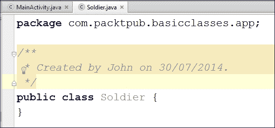

# 第六章：面向对象编程 - 使用他人的辛勤工作

面向对象编程代表**面向对象的编程**。在本章中，你甚至不需要试图记住一切。为什么我这么说？当然，这就是学习。更重要的是掌握这些概念，并开始理解面向对象编程的*为什么*，而不是记住规则、语法和行话。

更重要的是实际开始使用一些概念，即使你可能不得不不断地参考，你的代码可能不完全符合我们讨论的每一个面向对象编程原则。这本书中的代码也是如此。本章的代码是为了帮助你探索和理解面向对象编程的概念。

如果你试图记住本章，你将不得不在你的大脑中腾出很多空间，你可能会忘记一些非常重要的事情，比如去工作或感谢作者告诉你不要试图记住这些东西。

一个很好的目标是尽量接近它。然后我们将开始认识到面向对象编程在实际中的应用，这样我们的理解就会更全面。然后你可以经常回顾本章来温习。

那么我们将学到的所有这些面向对象的东西是什么？实际上，我们已经学到了很多关于面向对象的知识。到目前为止，我们已经使用了诸如`Button`、`Random`和`Activity`之类的类，重写了类的方法（主要是`onCreate`），还使用了**接口**；还记得在前五章中几次实现`onClickListener`吗？

本章只是帮助理解面向对象编程并扩展我们的理解，最后，我们将制作我们自己的类。

然后在接下来的两章中，我们将处于一个很好的位置，制作两个很酷的复古街机游戏，利用了很多其他人的辛勤工作。本章主要是理论，但也有一些使用 LogCat 的实际控制台示例，这样我们就可以看到面向对象编程在实际中的应用。

在本章中，我们将做以下事情：

+   看看面向对象编程是什么。

+   编写我们的第一个类。

+   看看封装是什么，我们如何实现它，以及更深入地了解变量和不同类型。我们还将短暂休息一下，清理一下垃圾。

+   学习继承以及我们如何在使用之前扩展甚至改进一个类。

+   看看多态性，这是一种在编程中同时成为多种东西的方式，非常有用。

# 什么是面向对象编程？

面向对象编程是一种将我们的需求分解为比整体更易管理的块的编程方式。

每个块都是独立的，但也可能被其他程序重复使用，同时与其他块一起作为一个整体工作。

这些块就是我们所说的对象。当我们计划一个对象时，我们会使用一个类。一个类可以被看作是一个对象的蓝图。

我们实现了一个类的对象。这被称为类的**实例**。想象一下一幢房子的蓝图。你不能住在里面，但你可以根据它建造一座房子，这意味着你建造了它的一个实例。然而，面向对象编程不仅仅是这样。它还是一种定义最佳实践的方法，比如以下内容：

+   **封装**：这意味着将代码的内部工作与使用它的程序的干扰隔离开来，并且只允许访问你选择的变量和方法。这意味着只要暴露的部分仍然以相同的方式被访问，你的代码就可以随时更新、扩展或改进，而不会影响使用它的程序。

+   **继承**：就像它听起来的那样，继承意味着我们可以利用其他人的辛勤工作的所有特性和好处，包括封装和多态性，同时针对我们的情况对他们的代码进行特定的改进。实际上，每当我们使用`extends`关键字时，我们都已经这样做了。

+   **多态性**：这使我们能够编写对我们试图操作的类型不太依赖的代码，使我们的代码更清晰、更高效。本章后面的一些例子将使这一点更加清晰。

### 提示

当我们谈论使用其他人的辛勤工作时，我们并不是在谈论一种滥用版权并逍遥法外的神奇方式。有些代码是简单明了的，是别人的财产。我们所说的是在 Java 和 Android API 的背景下，我们可以使用的大量免费代码。如果您需要执行某个特定操作的代码，它可能已经存在。我们只需要找到它，然后使用或修改它。

Java 从一开始就考虑到了所有这些，因此我们在很大程度上受到使用面向对象编程的限制。然而，这是一件好事，因为我们学会了如何使用最佳实践。

## 为什么要这样做？

当正确编写时，所有这些面向对象编程允许您添加新功能，而无需过多担心它们与现有功能的交互。当您必须更改一个类时，它的自包含性意味着对程序的其他部分的影响较小，或者可能为零。这就是封装的部分。

您可以使用其他人的代码，而不知道甚至不关心它是如何工作的。想想 Android 生命周期、按钮、线程等。`Button`类非常复杂，有近 50 个方法——我们真的想为一个按钮写这么多代码吗？

面向对象编程允许您在不费吹灰之力的情况下为高度复杂的情况编写应用程序。您可以使用继承创建类的多个相似但不同版本，而无需从头开始编写类，并且由于多态性，您仍然可以使用原始对象类型的方法来处理新对象。

真的很有道理！让我们写一些类，然后用它们制作一些对象。

# 我们的第一个类和第一个对象

那么究竟什么是类？类是一堆代码，可以包含方法、变量、循环和所有其他类型的 Java 语法。类是包的一部分，大多数包通常会有多个类。通常情况下，每个新类都会在自己的`.java`代码文件中定义，文件名与类名相同。

一旦我们编写了一个类，我们可以使用它来创建我们需要的任意多个对象。记住，类是蓝图，我们根据蓝图制作对象。房子不是蓝图，就像对象不是类；它是从类制作的对象。

这是一个类的代码。我们称之为类实现：

```java
public class Soldier {
  int health;
  String soldierType;

  void shootEnemy(){
    //bang bang
  }

}
```

```java
Soldier. There are two variables, an int variable called health and a string variable called soldierType.
```

还有一个名为`shootEnemy`的方法。该方法没有参数和`void`返回类型，但类方法可以是我们在第五章中讨论的任何形状或大小，*游戏和 Java 基础*。

当我们在类中声明变量时，它们被称为**字段**。当类被实例化为一个真正的对象时，这些字段成为对象本身的变量，因此我们称它们为**实例**变量。无论它们被称为什么花哨的名字，它们只是类的变量。然而，随着我们的进展，字段和方法中声明的变量（称为**局部**变量）之间的区别变得更加重要。我们将在*变量重访*部分再次查看所有类型的变量。

记住，这只是一个类，不是一个对象。这是一个士兵的蓝图，而不是一个实际的`士兵`对象。这是我们如何从我们的`士兵`类中创建一个`士兵`类型的对象：

```java
Soldier mySoldier = new Soldier();
```

在代码的第一部分中，`Soldier mySoldier`声明了一个名为`mySoldier`的`Soldier`类型的新引用类型变量，而在代码的最后部分，`new Soldier()`创建了一个实际的`Soldier`对象。当然，赋值运算符`=`,将第二部分的结果赋给了第一部分的结果。就像常规变量一样，我们也可以像这样执行前面的步骤：

```java
Soldier mySoldier;
mySoldier = new Soldier();
```

这是我们如何分配和使用变量的方式：

```java
mySoldier.health = 100;
mySoldier.soldierType = "sniper";
//Notice that we use the object name mySoldier.
//Not the class name Soldier.
//We didn't do this:
// Soldier.health = 100; ERROR!
```

```java
., is used to access the variables of the class, and this is how we would call the method. Again, we use the object name and not the class name, followed by the dot operator:
```

```java
mySoldier.shootEnemy();
```

### 提示

粗略地说，类的方法是它可以*做*的事情，它的实例变量是它*知道*的关于自己的事情。

我们还可以继续制作另一个`Soldier`对象并访问其方法和变量：

```java
Soldier mySoldier2 = new Soldier();
mySoldier2.health = 150;
mySoldier2.soldierType = "special forces";
mySoldier2.shootEnemy();
```

重要的是要意识到`mySoldier2`是一个完全独立的对象，具有完全独立的实例变量。

还要注意，一切都是在对象本身上完成的。我们必须创建类的对象才能使它们有用。

### 注意

总是有例外情况，但它们是少数，我们将在本章后面再看到这些例外情况。事实上，我们在第三章中已经看到了一个例外情况，*说 Java-你的第一个游戏*。想想`Toast`。

让我们更深入地探索基本类。

## 基本类

当我们想要一个`Soldier`对象的军队时会发生什么？我们将实例化多个对象。我们还将演示对变量和方法使用点运算符，并展示不同的对象具有不同的实例变量。

您可以在代码下载中获取此示例的工作项目。它位于`chapter6`文件夹中，简称为`BasicClasses`。或者继续阅读以创建您自己的工作示例：

1.  创建一个带有空白活动的项目，就像我们在第二章中所做的那样，*开始使用 Android*。通过删除不必要的部分来清理代码，但这并非必要。将应用程序命名为`BasicClasses`。

1.  现在我们创建一个名为`Soldier`的新类。在项目资源管理器窗口中，右键单击`com.packtpub.basicclasses`文件夹。单击**新建**，然后单击**Java 类**。在**名称**字段中，键入`Soldier`，然后单击**确定**。新类已为我们创建，其中包含一个代码模板，准备放入我们的实现，就像以下截图中所示：

1.  请注意，Android Studio 已将该类放在与我们应用程序的其余部分相同的包中。现在我们可以编写其实现。在`Soldier`类的开头和结尾大括号内编写以下类实现代码：

```java
public class Soldier {
    int health;
    String soldierType;

    void shootEnemy(){
        //lets print which type of soldier is shooting
        Log.i(soldierType, " is shooting");
    }
}
```

1.  现在我们有了一个类，一个`Soldier`类型的未来对象的蓝图，我们可以开始建立我们的军队。在编辑窗口中，单击**MainActivity.java**选项卡。我们将像往常一样在`onCreate`方法中编写此代码，就在调用`setContentView`之后：

```java
//first we make an object of type soldier
   Soldier rambo = new Soldier();
   rambo.soldierType = "Green Beret";
   rambo.health = 150;// It takes a lot to kill Rambo

   //Now we make another Soldier object
   Soldier vassily = new Soldier();
   vassily.soldierType = "Sniper";
   vassily.health = 50;//Snipers have less armor

   //And one more Soldier object
   Soldier wellington = new Soldier();
   wellington.soldierType = "Sailor";
   wellington.health = 100;//He's tough but no green beret
```

### 提示

现在是时候开始充分利用 Android Studio 中的自动完成功能了。注意，在声明和创建新对象之后，您只需开始输入对象的名称，所有自动完成选项都会呈现出来。

1.  现在我们有了极其多样化且有些不太可能的军队，我们可以使用它，并验证每个对象的身份。在上一步中的代码下面输入以下代码：

```java
Log.i("Rambo's health = ", "" + rambo.health);
Log.i("Vassily's health = ", "" + vassily.health);
Log.i("Wellington's health = ", "" + wellington.health);

rambo.shootEnemy();
vassily.shootEnemy();
wellington.shootEnemy();
```

1.  现在我们可以在模拟器上运行我们的应用程序。请记住，所有输出都将显示在**LogCat**控制台窗口中。

这就是前面的代码是如何工作的。在第 2 步中，Android Studio 为我们的新`Soldier`类创建了一个模板。在第 3 步中，我们以与以前相同的方式实现了我们的类——两个变量，一个`int`和一个`string`，分别称为`health`和`soldierType`。

我们的类中还有一个名为`shootEnemy`的方法。让我们再次看一下并检查发生了什么：

```java
void shootEnemy(){
        //lets print which type of soldier is shooting
        Log.i(soldierType, " is shooting");
    }
```

在方法的主体中，我们首先将`soldierType`字符串打印到控制台，然后是任意的`" is shooting"`字符串。这里很棒的是，根据我们调用`shootEnemy`方法的对象不同，`soldierType`字符串也会不同。

在第 4 步中，我们声明、创建和分配了三个新的`Soldier`类型对象。它们是`rambo`、`vassily`和`wellington`。在第 5 步中，我们为每个对象初始化了不同的`health`和`soldierType`值。

这是输出：

```java
Rambo's health =﹕ 150
Vassily's health =﹕ 50
Wellington's health =﹕ 100
Green Beret﹕ is shooting
Sniper﹕ is shooting
Sailor﹕ is shooting

```

请注意，每次访问每个`Soldier`对象的`health`变量时，它都会打印出我们分配给它的值，这表明尽管这三个对象是相同类型的，它们是完全独立的个体对象。

也许更有趣的是对`shootEnemy`的三次调用。我们的每个`Soldier`对象的`shootEnemy`方法都被调用了一次，并且我们将`soldierType`变量打印到控制台。该方法对每个单独的对象都具有适当的值，进一步证明我们有三个不同的对象，尽管它们是从同一个`Soldier`类创建的。

## 我们可以用我们的第一类做更多的事情

我们可以像对待其他变量一样对待类。假设我们已经实现了我们的`Soldier`类，我们可以这样创建一个`Soldier`对象的数组：

```java
//Declare an array called myArmy to hold 10 Soldier objects
Soldier [] myArmy = new Soldier[10];

//Then we can add the Soldier objects
//We use the familiar array notation on the left
//And the newly learnt new Soldier() syntax on the right
myArmy[0] = new Soldier();
myArmy[1] = new Soldier();
myArmy[2] = new Soldier();
myArmy[3] = new Soldier();
//Initialize more here
//..
```

然后我们可以使用与常规变量相同的数组表示法从数组中使用对象，就像这样：

```java
myArmy[0].health = 125;
myArmy[0].soldierType = "Pilot";
myArmy[0].shootEnemy();
// Pilot﹕ is shooting
```

我们还可以在方法调用中使用类作为参数。以下是对`healSoldier`方法的假设调用：

```java
healSoldier(rambo);
//Perhaps healSoldier could add to the health instance variable
```

### 提示

当然，前面的例子可能会引发问题，比如`healSoldier`方法应该是一个类的方法吗？

```java
someHospitalObjectPerhaps.healSoldier(rambo);
```

它可能是或不是（如前面的例子所示）。这将取决于对于情况来说什么是最好的解决方案。我们将更多地了解面向对象编程，然后许多类似的难题的最佳解决方案应该更容易地呈现出来。

正如你现在可能已经预料到的，我们可以使用对象作为方法的返回值。以下是假设的`healSoldier`方法可能看起来像的样子：

```java
Soldier healSoldier(Soldier soldierToBeHealed){
  soldierToBeHealed.health++;

  return soldierToBeHealed;
}
```

所有这些信息可能会引发一些问题。面向对象编程就是这样，因此为了尝试将所有这些类的内容与我们已经知道的内容整合起来，让我们再次看看变量和封装。

# 封装

到目前为止，我们真正看到的是一种代码组织约定，尽管我们确实讨论了所有这些面向对象编程的更广泛目标。现在我们将进一步探讨，并开始看到我们如何实际通过面向对象编程实现封装。

### 提示

**封装的定义**

正如我们所学到的，封装意味着保护代码的内部工作方式，使其不受使用它的程序的干扰，只允许访问你选择的变量和方法。这意味着你的代码始终可以更新、扩展或改进，而不会影响使用它的程序，只要暴露的部分仍然以相同的方式提供。它还使使用你封装的代码的代码变得更简单、更容易维护，因为任务的大部分复杂性都封装在你的代码中。

但是我不是说我们不必知道内部发生了什么吗？所以你可能会质疑到目前为止我们所看到的。如果我们不断地设置实例变量，比如`rambo.health = 100;`，难道不可能最终出现问题，比如以下代码行吗？

```java
rambo.soldierType = "ballerina";
```

封装保护了你的类，使其不会被以不符合预期的方式使用。通过严格控制代码的使用方式，它只能做你想让它做的事情，并且你可以控制值。它不会被迫出现错误或崩溃。此外，你可以自由地更改代码的内部工作方式，而不会破坏使用旧版本代码的任何程序或你的程序的其余部分：

```java
weighlifter.legstrength = 100;
weighlifter.armstrength = -100;
weightlifter.liftHeavyWeight();
//one typo and weightlifter rips own arms off
```

我们可以封装我们的类以避免这种情况，以下是方法。

## 使用访问修饰符控制类的使用

类的设计者控制着任何使用他们的类的程序所能看到和操作的内容。我们可以在`class`关键字之前添加一个**访问修饰符**，就像这样：

```java
public class Soldier{
  //Implementation goes here
}
```

有两种类访问修饰符。让我们依次简要看一下每一个：

+   `public`：这很简单。声明为`public`的类可以被所有其他类看到。

+   `default`：当没有指定访问修饰符时，类具有默认访问权限。这将使其对同一包中的类公开，对所有其他类不可访问。

现在我们可以开始使用封装了。然而，即使乍一看，所描述的访问修饰符也不是非常精细。我们似乎只能完全封锁包之外的任何东西，或者完全自由。

实际上，这里的好处很容易利用。想法是设计一个完成一系列任务的包。然后包的所有复杂内部工作，那些不应该被包之外的任何人干扰的东西，应该具有默认访问权限（只能被包内的类访问）。然后我们可以提供一组精心挑选的公共类，供其他人（或程序的其他不同部分）使用。

### 提示

对于本书中游戏的规模和复杂性来说，几乎可以肯定地说，多个包是过度的。

### 类访问权限的要点

一个设计良好的应用程序可能包含一个或多个包，每个包只包含默认或默认和公共类。

除了类级别的隐私控制，Java 还给了我们非常精细的控制，但要使用这些控制，我们必须更详细地查看变量。

## 使用访问修饰符控制变量的使用

为了加强类的可见性控制，我们有变量访问修饰符。这里有一个使用 private 访问修饰符声明的变量：

```java
private int myInt;
```

请注意，我们对变量访问修饰符的讨论也适用于对象变量。例如，这里声明、创建和分配了我们的`Soldier`类的一个实例。正如你所看到的，这种情况下指定的访问权限是 public：

```java
public Soldier mySoldier = new Soldier(); 
```

在将修饰符应用于变量之前，您必须首先考虑类的可见性。如果类`a`对类`b`不可见，比如因为类`a`具有默认访问权限，而类`b`在另一个包中，那么在类`a`的变量上使用任何访问修饰符都没有任何影响；类`b`仍然看不到它。

因此，将一个类显示给另一个类是有意义的，但你应该只暴露需要的变量，而不是所有的变量。

我们还有更多关于访问修饰符的内容要讲，然后我们将看一些示例来帮助澄清事情。现在，这里是不同的变量访问修饰符的解释。它们比类访问修饰符更多，更精细。大多数解释都很直接，而可能引起问题的解释在我们看一个例子时会变得更清晰。

访问修改的深度和复杂性并不在于修饰符的范围，而是通过巧妙地使用它们，我们可以将它们结合起来实现封装的值得目标。以下是变量访问修饰符：

+   `public`：你猜对了！来自任何包的任何类或方法都可以看到这个变量。只有当你确定这就是你想要的时候才使用`public`。

+   `protected`：这是在`public`之后的下一个最不限制的修饰符。设置为 protected 的变量可以被同一包中的任何类和任何方法看到。

+   `default`：这听起来不像`protected`那么限制，但实际上更加限制。当没有指定访问权限时，变量具有默认访问权限。`default`更加限制可能意味着我们应该考虑隐藏变量而不是暴露它们。在这一点上，我们需要介绍一个新概念。你还记得我们简要讨论过继承吗，以及我们如何可以快速地继承一个类的属性，然后使用`extends`关键字对其进行改进吗？只是为了记录，default 访问权限的变量对子类不可见。这意味着当我们像我们在`Activity`中所做的那样扩展一个类时，我们无法看到它的默认变量。我们将在本章后面更详细地讨论继承。

+   `private`：这些变量只能在它们声明的类内部看到。与默认访问一样，它们不能被子类（继承类）看到。

### 变量访问简而言之

一个设计良好的应用程序可能由一个或多个包组成，每个包只包含默认或默认和公共类。在这些类中，变量将具有精心选择的访问修饰符，很可能是不同的。

在我们开始实际操作之前，这些访问修改的东西还有一个小小的转折。

## 方法也有访问修饰符

方法是我们的类可以做的事情。我们将要控制我们的类的用户可以做什么，不能做什么。这里的一般想法是，一些方法只会在内部执行，因此不需要类的用户，而一些方法将是用户使用类的基本方法。

方法的访问修饰符与类变量的访问修饰符相同。这使得事情容易记住，但再次表明成功的封装是一种设计问题，而不是任何特定的规则。

例如，以下代码片段中提供的公共类中的方法可以被任何其他类使用：

```java
public useMeEverybody(){
  //do something everyone needs to do here
}
```

然而，以下方法只能被创建它的类内部使用：

```java
private secretInternalTask(){
  //do something that helps the class function internally
  //Perhaps, if it is part of the same class,
  //useMeEverybody could use this method...
  //On behalf of the classes outside of this class.
  //Neat!
}
```

下一个方法具有默认可见性，没有指定访问权限。它只能被同一包中的其他类使用。如果我们扩展包含此默认访问方法的类，该类将无法访问此方法：

```java
fairlySecretTask(){
  //allow just the classes in the package
  //Not for external use
}
```

在我们继续之前，这是最后一个例子。它包含一个`protected`方法，只对包可见，但可以被扩展它的类使用：

```java
protected familyTask(){
  //allow just the classes in the package
  //And you can use me if you extend me too
}
```

### 方法访问简而言之

应该选择方法访问权限以最好地执行我们已经讨论过的原则。它应该为您的类的用户提供所需的访问权限，最好是没有更多。因此，我们实现了封装目标，例如使代码的内部工作免受使用它的程序的干扰，出于我们已经讨论过的所有原因。

## 使用 getter 和 setter 方法访问私有变量

因此，如果将变量尽可能隐藏为私有是最佳实践，那么如何在不破坏封装的情况下允许访问它们呢？如果`Hospital`类的对象想要访问`Soldier`类型对象的`health`成员变量以增加它，`health`变量应该是私有的，对吗？

为了能够尽可能将成员变量设为私有，同时允许对其中一些进行有限访问，我们使用**getter**和**setter**。Getter 和 setter 是只获取和设置变量值的方法。

这不是我们必须学习的一些特殊或新的 Java 东西。这只是对我们已经知道的东西的使用约定。让我们以我们的`Soldier`和`Hospital`类为例，看看使用 getter 和 setter。

在这个例子中，我们的两个类分别在自己的文件中创建，但在同一个包中。首先，这是我们假设的`Hospital`类：

```java
class Hospital{
  private void healSoldier(Soldier soldierToHeal){
    int health = soldierToHeal.getHealth();
    health = health + 10;
    soldierToHeal.setHealth(health);
  }
}
```

我们的`Hospital`类的实现只有一个方法`healSoldier`。它接收一个`Soldier`对象的引用作为参数，因此这个方法将在传入的任何`Soldier`对象上工作：`vassily`，`wellington`，`rambo`，或其他人。

它还有一个`health`变量。它使用这个变量来临时保存并增加士兵的健康。在同一行中，它将`health`变量初始化为`Soldier`对象的当前健康状况。`Soldier`对象的`health`是私有的，因此使用公共的 getter 方法。

然后`health`增加了 10，`setHealth`设置器方法将新的`health`值加载回`Soldier`对象。

关键在于，尽管`Hospital`对象可以改变`Soldier`对象的健康状况，但它是在 getter 和 setter 方法的范围内进行的。getter 和 setter 方法可以被编写来控制和检查潜在的错误或有害的值。

接下来是我们假设的`Soldier`类，具有最简单的 getter 和 setter 方法的实现：

```java
public class Soldier{
  private int health;
  public int getHealth(){
    return health;
  }

  public void setHealth(int newHealth){
    health = newHealth;
  }
}
```

我们有一个名为`health`的实例变量，它是私有的。私有意味着它只能被`Soldier`类的方法更改。然后我们有一个公共的`getHealth`方法，不出所料地返回`int`类型的私有`health`变量中保存的值。由于这个方法是公共的，任何有权访问`Soldier`类的人都可以使用它。

接下来，实现了`setHealth`方法。同样它是公共的，但这次它以`int`作为参数，并将传递的任何值分配给私有的`health`变量。在一个更贴近生活的例子中，我们会在这里编写更多的代码来确保传递的值在我们期望的范围内。

现在我们将声明、创建并分配我们两个新类的对象，并看看我们的 getter 和 setter 是如何工作的：

```java
Soldier mySoldier = new Soldier();
//mySoldier.health = 100;//Doesn't work private
//we can use the public setter setHealth()
mySoldier.setHealth(100);//That's better

Hospital militaryHospital = new Hospital();

//Oh no mySoldier has been wounded
mySoldier.setHealth(10);

//Take him to the hospital
//But my health variable is private
//And Hospital won't be able to access it
//I'm doomed - tell Laura I love her

//No wait- what about my public getters and setters?
//We can use the public getters and setters from another class

militaryHospital.healSoldier(mySoldier);

//mySoldiers private variable health has been increased by 10
//I'm feeling much better thanks!
```

我们看到我们可以直接在我们的`Soldier`类型的对象上调用我们的公共`setHealth`和`getHealth`方法。不仅如此，我们还可以调用`Hospital`对象的`healSoldier`方法，传递一个对`Soldier`对象的引用，后者可以使用公共的 getter 和 setter 来操作私有的`health`变量。

我们看到私有的`health`变量是可以被简单访问的，但完全受`Soldier`类的设计者控制。

如果你想尝试一下这个例子，在`Chapter6`文件夹的代码包中有一个可用的应用程序，名为`Getters And Setters`。我添加了几行代码来打印到控制台。我们故意以这种方式来覆盖它，以尽可能清晰地保留代码的关键部分。我们很快将构建一些真正的工作示例，探索类、变量和方法的访问。

### 注意

Getter 和 setter 有时被称为它们更正确的名称，**访问器**和**修改器**。我们将坚持使用 getter 和 setter。只是想让你知道。

再一次，我们的例子和解释可能引起更多的问题。这很好！之前，我说过：

+   类有两种访问修饰符，默认和公共

+   类的对象是一种引用变量的类型

+   变量（包括对象）有更多的访问可能性

我们需要更仔细地查看引用和原始变量，以及局部和实例变量。我们将在“变量重访”部分进行。在该部分，我们将进一步整合我们的信息，以更紧密地掌握这个面向对象的编程知识。首先让我们回顾一下封装的一些内容。

使用封装特性（如访问控制）就像签署一项关于如何使用和访问类、它的方法和变量的非常重要的协议。这个合同不仅仅是关于现在的协议，还隐含着对未来的保证。随着我们在本章的进展，我们将看到更多的方式来完善和加强这个合同。

### 注意

完全可以在不考虑封装的情况下重写本书中的每个示例。事实上，本章之外的本书中的项目对封装非常宽松。

在需要的时候使用封装，或者当然，如果你被雇主付费使用它。通常封装在小型学习项目中是多余的，比如本书中的游戏，除非你学习的主题本身就是封装。

我们学习这个 Java OOP 的知识是基于这样一个假设，即有一天你会想要在 Android 或其他使用 OOP 的平台上编写更复杂的应用程序。

## 使用构造函数设置我们的对象。

有了所有这些私有变量及其 getter 和 setter，这是否意味着我们需要为每个私有变量都需要一个 getter 和 setter？那么对于一个需要在开始时初始化许多变量的类呢？想想这个：

```java
mySoldier.name
mysoldier.type
mySoldier.weapon
mySoldier.regiment
...
```

我们可以继续这样下去。其中一些变量可能需要 getter 和 setter，但如果我们只想在对象首次创建时设置好一切，以使对象正确运行，我们需要两个方法（一个 getter 和一个 setter）吗？

为此，我们有一个特殊的方法称为构造函数。在这里，我们创建了一个名为`mySoldier`的对象，并将其分配给`Soldier`类型的对象：

```java
Soldier mySoldier = new Soldier();
```

这里没有什么新鲜事，但看一下代码行的最后部分：

```java
...Soldier();
```

这看起来非常像一个方法。

我们调用了一个特殊的方法，称为构造函数，它已经被编译器自动为我们提供。

然而（这就是现在的重点），就像方法一样，我们可以重写它，这意味着我们可以在使用新对象之前做一些非常有用的事情，并且在堆栈上放置任何方法之前：

```java
public Soldier(){
  health = 200;
  //more setup here
}
```

这是一个构造函数。它在语法上与方法有很多相似之处。它只能通过使用`new`关键字来运行。除非我们像在先前的代码中那样创建自己的构造函数，否则它会被编译器自动创建。

构造函数具有以下属性：

+   它们没有返回类型

+   它们与类名相同

+   它们可以有参数

+   它们可以被重载

我们将在下一个演示中使用构造函数。

## 变量重温

你可能还记得，在数学游戏项目中，我们不断更改变量的声明位置。首先，我们在`onCreate`中声明了一些变量，然后我们将它们移动到类声明的下方，然后我们将它们变成成员或实例变量。

因为我们没有指定访问权限，它们是默认访问权限，并且对整个类可见，由于所有操作都发生在一个类中，我们可以随处访问它们。例如，我们可以从`onClick`更新我们的 TextView 类型对象，但是为什么我们不能在`onCreate`中声明它们时就这样做呢？关于何时以及如何访问不同变量的进一步解释可能会很有用。

### 堆栈和堆

每个 Android 设备内部的虚拟机负责为我们的游戏分配内存。此外，它将不同类型的变量存储在不同的位置。

我们在方法中声明和初始化的变量存储在称为`堆栈`的内存区域中。在谈论堆栈时，我们可以沿用我们的仓库类比——几乎是。我们已经知道我们可以如何操作堆栈。

让我们谈谈堆以及存储在其中的内容。所有引用类型对象，包括对象（类）和数组，都存储在堆中。将堆视为同一仓库的另一个区域。堆有大量的地板空间用于奇形怪状的对象，用于较小对象的货架，用于数组的大量长排和较小尺寸的立方体孔，等等。这是我们的对象存储的地方。问题是我们无法直接访问堆。

让我们再次看看引用变量到底是什么。它是一个我们引用并通过引用使用的变量。引用可以宽泛地（但有用地）定义为一个地址或位置。对象的引用（地址或位置）在堆栈上。当我们使用点运算符时，我们要求 Dalvik 在引用中存储的特定位置执行任务。

### 注意

引用变量就是这样——一个引用。它们是访问和操作对象（变量或方法）的一种方式，但它们不是实际的变量。类比可能是，基本类型就在那里（在堆栈上），但引用是一个地址，我们说在地址上该做什么。在这个类比中，所有地址都在堆上。

我们为什么要有这样的系统？直接把对象放在堆栈上就行了！

### 快速休息一下，扔掉垃圾

还记得在第一章时我说 Java 比一些语言更容易学习，因为它帮助我们管理内存吗？嗯，这整个堆栈和堆的东西就是为我们做的。

正如我们所知，VM 会为我们跟踪所有的对象，并将它们存储在堆中——我们仓库的一个特殊区域。定期，VM 会扫描堆栈，或者我们仓库的常规货架，并将对象与引用进行匹配。如果它发现任何没有匹配引用的对象，它会销毁它们。在 Java 术语中，它执行垃圾回收。想象一辆非常歧视性的垃圾车驶过我们堆的中心，扫描对象以匹配引用。没有引用？你现在是垃圾！毕竟，如果一个对象没有引用变量，我们无法对其进行任何操作。这种垃圾回收系统通过释放未使用的内存帮助我们的游戏更有效地运行。

因此，在方法中声明的变量是局部的，在堆栈上，并且只能在声明它们的方法内部可见。成员变量在堆上，并且可以在有引用的任何地方引用它，前提是访问规范允许引用。

现在我们可以更仔细地看一下变量范围——从哪里可以看到什么。

关于变量还有更多的技巧和转折需要学习。在下一个演示中，我们将探索本章迄今为止学到的所有内容以及一些新的想法。

我们将研究以下主题：

+   静态变量在类的每个实例中都是一致的（相同的）

+   类的静态方法，可以在没有该类类型对象的情况下使用类的方法

+   我们将演示类和局部变量的范围，以及它们在程序的不同部分中可以和不能被看到的地方

+   我们将研究`this`关键字，它允许我们编写引用属于特定类实例的变量的代码，但不需要跟踪我们当前使用的实例是哪个

以下是演示。

### 访问、范围、this、静态和构造函数演示

我们已经看到了控制变量访问和范围的复杂方式，现在可能会对我们有所帮助，看一个实际应用的例子。这些不会是非常实际的真实世界变量使用示例，而更多是为了帮助理解类、方法和变量的访问修饰符，以及引用（或原始）和局部（或实例）等不同类型的变量的演示。然后我们将介绍静态和最终变量以及`this`关键字的新概念。完成的项目在代码下载的`Chapter6`文件夹中。它被称为`AccessScopeThisAndStatic`。我们现在将执行以下步骤来实现它：

1.  创建一个新的空白活动项目，并将其命名为`AccessScopeThisAndStatic`。

1.  通过在项目资源管理器中右键单击现有的`MainActivity`类并导航到**新建** | **类**来创建一个新类。将新类命名为`AlienShip`。

1.  现在我们声明我们的新类和一些成员变量。请注意，`numShips`是私有的和静态的。我们很快就会看到这个变量在类的所有实例中是相同的。`shieldStrength`变量是`private`的，`shipName`是`public`的：

```java
public class AlienShip {
private static int numShips;
private int shieldStrength;
public String shipName;
```

1.  接下来是构造函数。我们可以看到构造函数是公共的，没有返回类型，并且与类名相同，符合规则。在其中，我们递增了私有静态`numShips`变量。请记住，每次创建`AlienShip`类型的新对象时都会发生这种情况。构造函数还使用私有的`setShieldStrength`方法为`shieldStrength`私有变量设置一个值：

```java
public AlienShip(){
  numShips++;

  //Can call private methods from here because I am part
  //of the class
  //If didn't have "this" then this call might be less clear
  //But this "this" isn't strictly necessary
  this.setShieldStrength(100);
  //Because of "this" I am sure I am setting 
  //the correct shieldStrength
}
```

1.  这是公共静态 getter 方法，外部`AlienShip`类可以使用它来找出有多少`AlienShip`对象。我们还将看到我们使用静态方法的不寻常方式：

```java
    public static int getNumShips(){
        return numShips;

    }
```

1.  以下代码显示了我们的私有`setShieldStrength`方法。我们本可以直接从类内部设置`shieldStrength`，但这段代码展示了我们如何使用`this`关键字区分`shieldStrength`局部变量/参数和`shieldStrength`成员变量：

```java
private void setShieldStrength(int shieldStrength){
    //"this" distinguishes between the 
    //member variable shieldStrength
    //And the local variable/parameter of the same name
    this.shieldStrength = shieldStrength;

}
```

1.  接下来的方法是 getter，所以其他类可以读取但不能改变每个`AlienShip`对象的护盾强度：

```java
public int getShieldStrength(){
    return this.shieldStrength;
}
```

1.  现在我们有一个公共方法，每次击中`AlienShip`对象时都可以调用它。它只是打印到控制台，然后检查该特定对象的`shieldStrength`是否为零。如果为零，它调用`destroyShip`方法，接下来我们将看到：

```java
public void hitDetected(){

    shieldStrength -=25;
    Log.i("Incomiming: ","Bam!!");
    if (shieldStrength == 0){
        destroyShip();
    }

}
```

1.  最后，我们将看一下我们的`AlienShip`类的`destroyShip`方法。我们打印一条消息，指示哪艘飞船已被摧毁，基于它的`shipName`，并递增`numShips`静态变量，以便我们可以跟踪`AlienShip`类型的对象数量：

```java
private void destroyShip(){
    numShips--;
    Log.i("Explosion: ", ""+this.shipName + " destroyed");
    }
}
```

1.  现在我们切换到我们的`MainActivity`类，并编写一些使用我们的新`AlienShip`类的代码。所有的代码都放在`setContentView`调用之后的`onCreate`方法中。首先，我们创建两个名为`girlShip`和`boyShip`的新的`AlienShip`对象：

```java
//every time we do this the constructor runs
AlienShip girlShip = new AlienShip();
AlienShip boyShip = new AlienShip();
```

1.  看看我们如何获取`numShips`中的值。我们使用`getNumShips`方法，正如我们所期望的那样。然而，仔细看语法。我们使用的是类名而不是对象。我们还可以使用非静态的方法访问静态变量。我们这样做是为了看到静态方法的运行情况：

```java
//Look no objects but using the static method
Log.i("numShips: ", "" + AlienShip.getNumShips());
```

1.  现在我们给我们的公共`shipName`字符串变量分配名称：

```java
//This works because shipName is public
girlShip.shipName = "Corrine Yu";
boyShip.shipName = "Andre LaMothe";
```

1.  如果我们尝试直接为私有变量分配一个值，它不起作用。因此，我们使用公共的`getShieldStrength` getter 方法来打印`shieldStrength`的值，这个值是分配给构造函数的：

```java
//This won't work because shieldStrength is private
//girlship.shieldStrength = 999;

//But we have a public getter
Log.i("girlShip shieldStrngth: ", "" + girlShip.getShieldStrength());

Log.i("boyShip shieldStrngth: ", "" + boyShip.getShieldStrength());

//And we can't do this because it's private
//boyship.setShieldStrength(1000000);
```

最后，我们通过玩`hitDetected`方法和偶尔检查我们两个对象的护盾强度来炸毁一些东西：

```java
//let's shoot some ships
girlShip.hitDetected();
Log.i("girlShip shieldStrngth: ", "" + girlShip.getShieldStrength());

Log.i("boyShip shieldStrngth: ", "" + boyShip.getShieldStrength());

boyShip.hitDetected();
boyShip.hitDetected();
boyShip.hitDetected();

Log.i("girlShip shieldStrngth: ", "" + girlShip.getShieldStrength());

Log.i("boyShip shieldStrngth: ", "" + boyShip.getShieldStrength());

boyShip.hitDetected();//ahhh

Log.i("girlShip shieldStrngth: ", "" + girlShip.getShieldStrength());

Log.i("boyShip shieldStrngth: ", "" + boyShip.getShieldStrength());
```

1.  当我们认为我们已经摧毁了一艘飞船时，我们再次使用我们的静态`getNumShips`方法来检查我们的静态变量`numShips`是否被`destroyShip`方法改变了：

```java

Log.i("numShips: ", "" + AlienShip.getNumShips());
```

1.  运行演示并查看控制台输出。

以下是前面代码块的输出：

```java
numShips:﹕ 2
girlShip shieldStrngth:﹕ 100
boyShip shieldStrngth:﹕ 100
Incomiming:﹕ Bam!!
girlShip shieldStrngth:﹕ 75
boyShip shieldStrngth:﹕ 100
Incomiming:﹕ Bam!!
Incomiming:﹕ Bam!!
Incomiming:﹕ Bam!!
girlShip shieldStrngth:﹕ 75
boyShip shieldStrngth:﹕ 25
Incomiming:﹕ Bam!!
Explosion:﹕ Andre LaMothe destroyed
girlShip shieldStrngth:﹕ 75
boyShip shieldStrngth:﹕ 0
numShips:﹕ 1
boyShip shieldStrngth:﹕ 0
numShips:﹕ 1

```

在前面的例子中，我们看到我们可以使用`this`关键字区分相同名称的局部变量和成员变量。我们还可以使用`this`关键字编写引用当前对象的代码。

我们看到静态变量，在这种情况下是`numShips`，在所有实例中是一致的。此外，通过在构造函数中递增它，并在我们的`destroyShip`方法中递减它，我们可以跟踪我们创建的`AlienShip`对象的数量。

我们还看到我们可以通过写类名和点运算符而不是对象来使用静态方法。

最后，我们演示了如何使用访问修饰符隐藏和暴露某些方法和变量。

在我们继续进行新的内容之前，让我们快速回顾一下栈和堆。

### 关于栈和堆的快速总结

让我们看看关于堆和栈的知识：

+   你不会删除对象，但是虚拟机在认为合适时会发送垃圾收集器。通常是在对象没有活动引用时执行。

+   局部变量和方法在栈上，局部变量是在声明它们的特定方法中局部的。

+   实例或类变量在堆上（与它们的对象一起），但对对象的引用（地址）是栈上的局部变量。

+   我们控制栈内的内容。我们可以使用堆上的对象，但只能通过引用它们。

+   堆由垃圾收集器维护。

+   当不再有有效引用指向对象时，对象将被垃圾回收。因此，当引用变量（局部或实例）从堆栈中移除时，与之相关的对象就可以进行垃圾回收，当虚拟机决定时机合适时（通常非常迅速），它将释放 RAM 内存以避免耗尽。

+   如果我们尝试引用一个不存在的对象，我们将得到一个**空指针异常**，游戏将崩溃。

# 继承

我们已经看到了我们可以通过实例化/创建来自 Android 等 API 的类的对象来使用其他人的辛勤工作，但是这整个面向对象的东西甚至比这更深入。

如果有一个类中有大量有用的功能，但不完全符合我们的要求，我们可以从该类继承，然后进一步完善或添加其工作方式和功能。

你可能会惊讶地听到我们已经这样做了。事实上，我们在每个游戏和演示中都这样做了。当我们使用`extends`关键字时，我们正在继承，例如，在这行代码中：

```java
public class MainActivity extends Activity ...
```

在这里，我们继承了`Activity`类以及其所有功能，或者更具体地说，类设计者希望我们能够访问的所有功能。以下是我们可以对我们扩展的类做的一些事情。

我们可以重写一个方法，但仍然部分依赖于我们继承的类中被重写的方法。例如，每次我们扩展`Activity`类时，我们都重写了`onCreate`方法，但我们也调用了类设计者提供的默认实现时：

```java
super.onCreate(... 
```

在下一章中，我们还将重写`Activity`类的一些方法。具体来说，我们将重写处理生命周期的方法。

如果我们或类的设计者希望我们在使用他们的类之前强制继承，他们可以将一个类声明为**抽象**。然后我们就不能从中创建对象。因此，我们必须首先扩展它，然后从子类中创建对象。我们将在我们的继承示例中这样做，并在我们讨论多态性时进一步讨论它。

我们还可以声明一个方法为抽象方法，必须在扩展具有抽象方法的类的任何类中重写该方法。我们也将在我们的继承示例中这样做。

在我们的游戏项目中，我们不会设计任何需要扩展的类。在学习构建简单游戏的情况下，我们不需要那样。然而，在未来的每个游戏中，我们都将扩展他人设计的类。

我们主要讨论继承，以便了解我们周围发生的事情，并作为最终能够设计有用的类的第一步，我们或其他人可以扩展。考虑到这一点，让我们创建一些简单的类，并看看我们如何扩展它们，只是为了玩弄一下语法作为第一步，也为了能够说我们已经这样做了。当我们看这一章的最后一个主要主题，多态性时，我们还将更深入地探讨继承。

## 继承的例子

我们已经看过了我们可以创建类的层次结构来模拟适合我们的游戏或软件项目的系统的方式，所以让我们尝试一些使用继承的简单代码。完成的项目在代码下载的`Chapter6`文件夹中。它被称为`InheritanceExample`。我们现在将执行以下步骤：

1.  以通常的方式创建三个新类。一个叫做`AlienShip`，另一个叫做`Fighter`，最后一个叫做`Bomber`。

1.  这是`AlienShip`类的代码。它与我们之前的`AlienShip`类演示非常相似。不同之处在于构造函数现在接受一个`int`参数，它用于设置护盾强度。构造函数还向控制台输出消息，以便我们可以看到它何时被使用。`AlienShip`类还有一个新方法`fireWeapon`，它被声明为`abstract`。这保证了任何继承`AlienShip`的类必须实现自己的`fireWeapon`版本。注意，该类在其声明中有`abstract`关键字。我们必须这样做是因为它的方法之一也使用了`abstract`关键字。当我们讨论这个演示和多态时，我们将解释`abstract`方法和`abstract`类：

```java
public abstract class AlienShip {
    private static int numShips;
    private int shieldStrength;
    public String shipName;

    public AlienShip(int shieldStrength){
        Log.i("Location: ", "AlienShip constructor");
        numShips++;
        setShieldStrength(shieldStrength);
    }

    public abstract void fireWeapon();//Ahh my body

    public static int getNumShips(){
        return numShips;
    }

    private void setShieldStrength(int shieldStrength){
        this.shieldStrength = shieldStrength;
    }

    public int getShieldStrength(){
        return this.shieldStrength;
    }

    public void hitDetected(){
        shieldStrength -=25;
        Log.i("Incomiming: ", "Bam!!");
        if (shieldStrength == 0){
            destroyShip();
        }

    }

    private void destroyShip(){
        numShips--;
        Log.i("Explosion: ", "" + this.shipName + " destroyed");
    }

}
```

1.  现在我们将实现`Bomber`类。注意调用`super(100)`。这将使用`shieldStrength`的值调用超类的构造函数。我们可以在这个构造函数中进一步初始化`Bomber`，但现在我们只是打印位置，以便我们可以看到`Bomber`构造函数何时被执行。我们还实现了一个`Bomber`类特定版本的抽象`fireWeapon`方法，因为我们必须这样做：

```java
public class Bomber extends AlienShip {

    public Bomber(){
        super(100);
        //Weak shields for a bomber
        Log.i("Location: ", "Bomber constructor");
    }

    public void fireWeapon(){
        Log.i("Firing weapon: ", "bombs away");
    }
}
```

1.  现在我们将实现`Fighter`类。注意调用`super(400)`。这将使用`shieldStrength`的值调用超类的构造函数。我们可以在这个构造函数中进一步初始化`Fighter`类，但现在我们只是打印位置，以便我们可以看到`Fighter`构造函数何时被执行。我们还实现了一个`Fighter`特定版本的抽象`fireWeapon`方法，因为我们必须这样做：

```java
public class Fighter extends AlienShip{

    public Fighter(){
        super(400);
        //Strong shields for a fighter
        Log.i("Location: ", "Fighter constructor");
    }

    public void fireWeapon(){
        Log.i("Firing weapon: ", "lasers firing");
    }

}
```

1.  这是我们在`MainActivity`的`onCreate`方法中的代码。像往常一样，在调用`setContentView`之后输入此代码。这是使用我们的三个新类的代码。它看起来很普通，但没有什么新鲜的；有趣的是输出：

```java
Fighter aFighter = new Fighter();
Bomber aBomber = new Bomber();

//Can't do this AlienShip is abstract -
//Literally speaking as well as in code
//AlienShip alienShip = new AlienShip(500);

//But our objects of the subclasses can still do
//everything the AlienShip is meant to do
aBomber.shipName = "Newell Bomber";
aFighter.shipName = "Meier Fighter";

//And because of the overridden constructor
//That still calls the super constructor
//They have unique properties
Log.i("aFighter Shield:", ""+ aFighter.getShieldStrength());
Log.i("aBomber Shield:", ""+ aBomber.getShieldStrength());

    //As well as certain things in certain ways
    //That are unique to the subclass
    aBomber.fireWeapon();
    aFighter.fireWeapon();

    //Take down those alien ships
    //Focus on the bomber it has a weaker shield
    aBomber.hitDetected();
    aBomber.hitDetected();
    aBomber.hitDetected();
    aBomber.hitDetected();
```

以下代码片段的输出如下：

```java
Location:﹕ AlienShip constructor
Location:﹕ Fighter constructor
Location:﹕ AlienShip constructor
Location:﹕ Bomber constructor
aFighter Shield:﹕ 400
aBomber Shield:﹕ 100
Firing weapon:﹕ bombs away
Firing weapon:﹕ lasers firing
Incomiming:﹕ Bam!!
Incomiming:﹕ Bam!!
Incomiming:﹕ Bam!!
Incomiming:﹕ Bam!!
Explosion:﹕ Newell Bomber destroyed

```

我们可以看到子类的构造函数如何调用超类的构造函数。我们还可以清楚地看到`fireWeapon`方法的各个实现确实按预期工作。

好像面向对象编程还不够有用！我们现在可以模拟现实世界的对象并设计它们相互交互。我们还看到了如何通过子类化/扩展/继承其他类使面向对象编程变得更加有用。我们可能想要学习的术语是被扩展的类是**超类**，继承超类的类是**子类**。我们也可以称它们为父类和子类。

### 提示

像往常一样，我们可能会问自己关于继承的问题：为什么？我们可以在父类中编写一次通用代码，并且可以更新该通用代码。所有继承自它的类也会被更新。此外，子类只继承公共实例变量和方法。当设计得当时，这进一步增强了封装的目标。

# 多态

多态大致意味着不同的形式。但对我们来说意味着什么？

用尽可能简单的话来说，任何子类都可以作为使用超类的代码的一部分。

例如，如果我们有一个动物数组，我们可以将任何属于`Animal`子类的对象放入`Animal`数组中，比如猫和狗。

这意味着我们可以编写更简单、更易于理解和修改的代码：

```java
//This code assumes we have an Animal class
//And we have a Cat and Dog class that extends Animal
Animal myAnimal = new Animal();
Dog myDog = new Dog();
Cat myCat = new Cat();
Animal [] myAnimals = new Animal[10];
myAnimals[0] = myAnimal;//As expected
myAnimals[1] = myDog;//This is OK too
myAnimals[2] = myCat;//And this is fine as well
```

我们还可以为超类编写代码，并依赖于这样一个事实，即无论它被子类化多少次，在一定的参数范围内，代码仍然可以工作。让我们继续我们之前的例子：

```java
//6 months later we need elephants
//with its own unique aspects
//As long as it extends Animal we can still do this
Elephant myElephant = new Elephant();
myAnimals[3] = myElephant;//And this is fine as well
```

您还可以编写具有多态返回类型和参数的方法：

```java
Animal feedAnimal(Animal animalToFeed){
  //Feed any animal here
  return animalToFeed;
}
```

因此，即使今天编写代码，一周、一个月或一年后制作另一个子类，相同的方法和数据结构仍将起作用。

此外，我们可以对我们的子类强制执行一组规则，规定它们可以做什么，不能做什么，以及它们应该如何做。因此，一个阶段的良好设计可以影响其他阶段的子类。

如果你突然发现自己有一个像小鸟一样大小的现象，并且你的代码中有很多面向对象编程，那么从一开始就很容易引入雇佣帮助来推动项目的进展，并且仍然保持对项目的控制。

如果你有一个想法，想要一个有很多功能的游戏，但你想尽快推出一个简化版本的游戏，那么聪明的面向对象设计肯定是解决方案。它可以让你编写游戏的基本框架，然后逐渐扩展它。

接下来，让我们看看另一个面向对象编程的概念：抽象类。我们现在可以弄清楚`AlienShip`代码中发生了什么：

```java
public abstract class AlienShip{...
```

## 抽象类

抽象类是一个不能被实例化的类，或者不能被制作成对象。我们在前面的例子中提到`AlienShip`是抽象的。那么它是一个永远不会被使用的蓝图吗？但这就像支付一个建筑师设计你的房子，然后永远不建造它！我有点明白抽象方法的概念，但这太愚蠢了！

一开始可能会觉得是这样的。我们通过使用`abstract`关键字来声明一个类为抽象类，就像这样：

```java
abstract class someClass{
  //All methods and variables here as usual
  //Just don't try and make an object out of me!
}
```

但是为什么呢？

有时，我们希望一个类可以被用作多态类型，但我们需要确保它永远不能被用作对象。例如，`Animal`本身并没有太多意义。

我们不谈论动物；我们谈论动物的类型。我们不会说，“哦，看那只可爱的、蓬松的、白色的动物”，或者“昨天，我们去宠物店买了一只动物和一个动物床。”这太抽象了。

因此，抽象类就像一个模板，可以被任何继承它的类使用。

我们可能想要一个`Worker`类，并扩展为类似`Miner`、`Steelworker`、`OfficeWorker`和当然`Programmer`的类。但是一个普通的`Worker`类到底是做什么的呢？我们为什么要实例化一个？

答案是我们不想实例化它，但我们可能想要将它用作多态类型，这样我们可以在方法之间传递多个工作子类，并且可以拥有可以容纳所有类型工作者的数据结构。

我们称这种类型的类为抽象类，当一个类有一个抽象方法时，就像`AlienShip`一样，它必须被声明为抽象类。正如我们所看到的，所有抽象方法必须被任何扩展抽象类的类重写。这意味着抽象类可以提供一些在其所有子类中都可用的常见功能。例如，`Worker`类可能有`height`、`weight`和`age`成员变量。

它可能有`getPayCheck`方法，在所有子类中都是相同的，还有`doWork`方法，它是抽象的，必须被重写，因为所有不同类型的工作者工作方式都非常不同。

这使我们顺利地进入了另一个值得一提的多态性领域，因为我们迄今为止一直在使用它。

## 接口

接口就像一个类。呼！那么这里没有什么复杂的。然而，它就像一个始终是抽象的类，只有抽象方法。

我们可以把接口看作是一个完全抽象的类，它的所有方法也都是抽象的。好吧，你可能刚刚能理解抽象类，因为它至少可以传递一些功能，而它的方法不是抽象的，可以作为多态类型。

但说真的，这个接口似乎有点无聊。请耐心等待。

要定义一个接口，我们输入以下代码：

```java
public interface myInterface{
  void someAbstractMethod();//omg I've got no body
  int anotherAbstractMethod();//Ahh! Me too

//Interface methods are always abstract and public implicitly 
//but we could make it explicit if we prefer

  public abstract explicitlyAbstractAndPublicMethod();//still no body though

}
```

接口的方法没有主体，因为它们是抽象的，但它们仍然可以有返回类型和参数，也可以没有。

要使用一个接口，我们在类声明后使用`implements`关键字。是的，我们已经为`onClickListener`做了几次。

```java
public class someClass implements someInterface{

//class stuff here

//better implement the methods of the interface or the red error lines will not go away
  public void someAbstractMethod(){
    //code here if you like but just an empty implementation will do
  }

  public int anotherAbstractMethod(){
    //code here if you like but just an empty implementation will do

    //Must have a return type though as that is part of the contract
    return 1;}
}
```

这使我们能够使用多个来自完全不相关的继承层次结构的对象进行多态。只要它实现了一个接口，整个东西就可以像那个东西一样传递。我们甚至可以让一个类同时实现多个不同的接口。只需在每个接口之间添加逗号，并在`implements`关键字后列出它们。只需确保实现所有必要的方法。

让我们回到`onClickListener`接口。任何东西可能都想知道它何时被点击；按钮、文本视图等。我们不希望为每种类型都有不同的`onClick`方法。

### 提示

在使用 Android 时，无论是用于游戏还是更常规的基于 GUI 的应用程序（有点像我们迄今为止的应用程序），你将十有八九实现接口而不是编写自己的接口。然而，知道发生了什么是非常重要的，不是从技术意识的角度来看，因为我们刚刚看到接口指定了一个合同，编译器强制执行它，而更多的是为了理智地知道当你使用`implements`关键字并编写一个你没有选择的名称的方法（或方法）时实际发生了什么。

# 更多关于 OOP 和类

可能会有人写一本关于 OOP 的整本书，许多作者已经这样做了，但学习 OOP 的最佳方法可能是练习它；在我们学习所有理论之前就练习它。不管怎样，在我们继续一些更实际的例子之前，这里有一个稍微理论化的 OOP 例子，如果不提到的话，以后我们会对此感到困惑。

## 内部类

当我们查看我们的基本类演示应用程序时，我们在一个单独的文件中声明和实现了类，而不是在我们的`MainActivity`类中。该文件与类同名。

我们还可以在一个类中声明和实现一个类。当然，唯一剩下的问题是为什么我们要这样做？当我们实现一个内部类时，内部类可以访问外部类的成员变量，外部类也可以访问内部类的成员。我们将在接下来的两章中看到这一点。

如果你不是在建模深层或现实世界的系统，那么内部类通常是一种方法。事实上，在本书的其余部分，我们将编写的所有类都将是扩展的内部类。这意味着我们将扩展一种类型来创建我们自己的类在我们的`Activity`类中。这使我们的代码简单明了。

# 自测问题

Q1) 找出这个类声明有什么问题：

```java
  private class someClass{
    //class implementation goes here
  }
```

Q2) 封装是什么？

Q3) 我并没有完全理解，实际上，我现在比章节开始时还有更多问题。我该怎么办？

# 总结

在本章中，我们涵盖的理论比其他任何一章都多。如果你没有记住一切，那么你已经完全成功了。如果你只是理解 OOP 是通过封装、继承和多态编写可重用、可扩展和高效的代码，那么你有成为 Java 大师的潜力。简而言之，OOP 使我们能够在那些人当时并不知道我们将要做什么的时候使用其他人的辛勤工作。你所要做的就是不断练习，所以让我们在下一章制作一个复古游戏。
