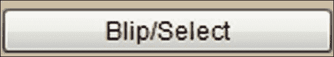

# 第七章：复古壁球游戏

这一章是游戏开始的地方。尽管复古壁球游戏显然比最新的大型预算游戏要差一两步，但这是我们开始看一些基本原理的时候——绘图，检测我们绘制的对象何时相互碰撞，以及有我们实际控制的动画。

一旦你能够绘制一个像素并移动它，只需要一点想象力和工作，你就有了绘制任何东西的潜力。然后，当我们将这些知识与一些非常简单的数学结合起来，来模拟碰撞和重力的物理过程时，我们就接近能够实现我们的壁球游戏了。

### 提示

不幸的是，这本书没有时间深入讲解如何将屏幕上的点变成在三维世界中移动的逼真三维角色的数学。当然，大型预算游戏背后的技术和数学非常先进和复杂。然而，将像素转化为线条，将线条转化为三角形，给三角形贴图，用三角形构建物体，并将它们定位在三维世界中的基础知识，都可以被学过高中数学的任何人掌握。我们经常听说优秀的图形并不一定能创造出优秀的游戏，这是真的，但对我来说，优秀的图形（至少对我来说）是视频游戏中最令人兴奋的方面之一，即使它们显示在一个本身可能更有趣的游戏上。如果你想看看如何将像素变成神奇的世界，并开始欣赏顶级游戏引擎和图形库背后的工作，你可以从《计算机图形学：数学初步》、P.A. Egerton 和 W.S Hall、Prentice Hall 开始。

在本章中，我们将涵盖以下主题：

+   探索 Android 的`Canvas`类，使绘图变得简单有趣

+   编写一个简单的 Canvas 演示应用程序

+   学习如何在屏幕上检测触摸

+   创建复古壁球游戏

+   实现复古的壁球游戏

# 使用 Android Canvas 进行绘图

到目前为止，我们一直在使用 Android UI 设计师来实现所有的图形。当我们只需要按钮和文本等对象时，这是可以的。

Android UI 元素确实比我们迄今所探索的更多。例如，我们知道我们可以用`Animation`类做更多的事情，我们也很简要地看到我们可以为 UI 元素中的一个分配任何我们喜欢的图像。

例如，我们可以将游戏角色（如太空飞船）分配给 UI 元素并对它们进行动画。

然而，如果我们想要平滑移动的太空飞船，准确的碰撞检测，可爱的角色，以及具有多帧、卡通般动画的可怕的坏家伙，那么我们需要摆脱预定义的 UI 元素。

我们需要开始查看和设计单个像素、线条、位图和精灵表。幸运的是，正如你可能已经猜到的那样，Android 有一些类可以让我们轻松愉快地做到这一点。我们将学习如何开始使用`Canvas`和`Paint`类。

位图和精灵表将在下一章中介绍。在本章中，我们将学习如何绘制像素和线条，制作一个简单的、平滑移动的乒乓球风格的壁球游戏。

为了实现这一点，我们将学习我们用来绘制像素和线条的坐标系。然后我们将看看`Paint`和`Canvas`类本身。

## Android 坐标系

像素是我们可以使用`Paint`和`Canvas`类来操作的最小图形元素。它本质上是一个点。如果你的设备分辨率是 1920 x 1080，就像一些新的谷歌品牌平板电脑或高端三星手机一样，那么在设备的最长长度上有 1920 个像素，在宽度上有 1080 个像素。

因此，我们可以将我们要绘制的屏幕看作一个网格。我们在虚拟画布上使用`Canvas`和`Paint`类进行绘制。我们将通过在这个网格上的坐标上绘制点（像素）、线条、形状和文本来实现这一点。

坐标系统从屏幕的左上角开始。

举个例子，看看这行代码：

```java
drawPoint(0, 0); //Not actual syntax (but very close)
```

在这种情况下，我们将在屏幕的左上角绘制一个单个像素。现在看看以下代码：

```java
drawPoint(1920, 1080); //Not actual syntax (but very close)
```

如果我们像这样使用它，我们可以在这些高端设备的右下角绘制一个点（在横向位置时）。

我们也可以通过指定起始和结束坐标位置来绘制线条，就像这样：

```java
drawLine(0,0,1920, 1080); //Not actual syntax (but very close)
```

这将从屏幕的左上角画一条线到右下角。

你可能已经注意到一些潜在的问题。首先，并非所有的 Android 设备都具有如此高的分辨率；事实上，大多数设备的分辨率要低得多。即使是分辨率很高的设备在横向或纵向位置时，坐标也会完全不同。我们将很快看到如何编写适应这些设备的代码，而不管屏幕分辨率如何。

### 我们的像素动画

绘制形状、线条和像素都很好，但我们如何使它们看起来移动呢？我们将使用卡通、电影和其他视频游戏中使用的相同动画技巧：

1.  绘制一个对象。

1.  擦掉它。

1.  在其新位置绘制对象。

1.  以足够快的速度重复，以欺骗玩家的大脑，使游戏对象移动。

理论使所有这些听起来比实际复杂。让我们快速看一下`Paint`和`Canvas`类以及一个快速的入门演示应用程序。然后我们可以真正实现我们的复古壁球游戏。

## 开始使用 Canvas 和 Paint

贴切地命名的`Canvas`类提供了正是你所期望的——一个虚拟画布，用于绘制我们的图形。

我们可以使用`Canvas`类从任何 Android UI 元素创建一个虚拟画布。在我们的演示应用程序中，我们将在一个 ImageView 上绘制，当我们制作我们的游戏时，我们将直接在一个特殊类型的视图上绘制，这将带来一些额外的优势，正如我们将看到的那样。

要开始，我们需要一个视图来绘制。我们已经知道如何使用 Java 代码从我们的 UI 布局中获取视图：

```java
ImageView ourView = (ImageView) findViewById(R.id.imageView);
```

这行代码获取了 UI 设计中放置的 ImageView 的引用，并将其分配给我们 Java 代码中的对象。正如我们所看到的，UI 设计中的 ImageView 具有一个名为`imageView`的分配 ID，而我们在 Java 代码中可控的 ImageView 对象称为`ourView`。

现在我们需要一个位图。位图本身有一个像屏幕一样的坐标系统。我们正在创建一个位图将其转换为画布：

```java
Bitmap ourBitmap = Bitmap.createBitmap(300,600, Bitmap.Config.ARGB_8888);
```

上一行代码声明并创建了一个`Bitmap`类型的对象。它将有 300x600 像素的大小。我们将在稍后绘制时记住这一点。

### 提示

`createBitmap`方法中的最后一个参数`Bitmap.Config.ARGB_8888`只是一个格式，我们可以创建一些很棒的游戏，而不用涉及位图格式的不同选项。

现在我们可以通过从中创建一个`Canvas`对象来准备我们的位图进行绘制：

```java
Canvas ourCanvas = new Canvas(ourBitmap);
```

接下来，我们得到一个`Paint`类型的对象。我们可以把这个对象看作是我们虚拟画布的刷子和颜料：

```java
Paint paint = new Paint();
```

在这一点上，我们准备使用我们的`Paint`和`Canvas`对象进行一些绘图。在屏幕左上角绘制一个像素的实际代码将如下所示：

```java
ourCanvas.drawPoint(0, 0, paint);//How simple is that?
```

现在让我们看一个工作示例。

# Android Canvas 演示应用程序

让我们制作一个使用`Canvas`和`Paint`类并进行一些绘图的应用程序。这个例子将是完全静态的（没有动画），所以我们可以清楚地看到如何在不用后续学习的东西的情况下使用`Canvas`和`Paint`。

在这个演示应用程序中，我们使用了一些概念上有帮助的变量名，以帮助我们理解每个对象所扮演的角色，但我们将在最后通过整个过程，以确保我们确切知道每个阶段发生了什么。当然，你不必输入所有这些。您可以在下载包的`Chapter7`文件夹中的`CanvasDemo`文件夹中打开已完成的代码文件：

1.  开始一个新项目，称之为`CanvasDemo`。如果愿意，可以清理不必要的导入和覆盖。

1.  在编辑器中打开`activity_main.xml`。从调色板中将**ImageView**拖动到布局中。ImageView 默认具有一个 ID，即`imageView`。现在我们将在我们的代码中使用这个 ID。

1.  在编辑器中切换到`MainActivity.java`。首先，我们将创建我们的`Bitmap`、`Canvas`和`Paint`对象，就像我们之前讨论的那样。这是代码的第一部分。在`setContentView`方法调用之后直接输入它：

```java
//Get a reference to our ImageView in the layout
ImageView ourFrame = (ImageView) findViewById(R.id.imageView);

//Create a bitmap object to use as our canvas
Bitmap ourBitmap = Bitmap.createBitmap(300,600, Bitmap.Config.ARGB_8888);
Canvas ourCanvas = new Canvas(ourBitmap);

//A paint object that does our drawing, on our canvas
Paint paint = new Paint();
```

1.  在这里，我们尝试绘制一些很酷的东西。在上一步中的代码之后直接输入代码：

```java
//Set the background color
ourCanvas.drawColor(Color.BLACK);

//Change the color of the virtual paint brush
paint.setColor(Color.argb(255, 255, 255, 255));

//Now draw a load of stuff on our canvas
ourCanvas.drawText("Score: 42 Lives: 3 Hi: 97", 10, 10, paint);
ourCanvas.drawLine(10, 50, 200, 50, paint);
ourCanvas.drawCircle(110, 160, 100, paint);
ourCanvas.drawPoint(10, 260, paint);

//Now put the canvas in the frame
  ourFrame.setImageBitmap(ourBitmap);
```

1.  在模拟器或设备上运行演示。

您的输出将看起来像下面的截图所示：


让我们再次浏览代码。在步骤 1 和 2 中，我们创建了一个新项目，并在 UI 布局上放置了一个 ID 为`imageView`的 ImageView 对象。

在第 3 步中，我们首先获取了布局中`ImageView`对象的引用。然而，我们经常这样做，通常是使用 TextView 和 Button。我们将我们的 ImageView 命名为`ourFrame`，因为它将容纳我们的画布：

```java
ImageView ourFrame = (ImageView) findViewById(R.id.imageView);
```

然后我们创建了一个位图用于制作画布：

```java
Bitmap ourBitmap = Bitmap.createBitmap(300,600, Bitmap.Config.ARGB_8888);
Canvas ourCanvas = new Canvas(ourBitmap);
```

之后，我们创建了新的`Paint`对象：

```java
Paint paint = new Paint();
```

在第 4 步中，我们准备好绘制，并以几种不同的方式绘制。首先，我们将整个画布涂成黑色：

```java
ourCanvas.drawColor(Color.BLACK);
```

然后我们选择了要绘制的颜色。`(255, 255, 255, 255)`是白色的数字表示，完全不透明（没有透明度）：

```java
paint.setColor(Color.argb(255, 255, 255, 255));
```

现在我们看到了一些新东西，但很容易理解。我们还可以将文本字符串绘制到屏幕上，并将该文本定位到精确的屏幕坐标，就像我们可以使用像素一样。

您会注意到，使用`Canvas`类的`drawText`方法和所有其他绘图方法时，我们总是将我们的`Paint`对象作为参数传递。为了让下一行代码中发生的事情绝对清晰，我声明`"Score: 42 Lives:3 Hi: 97`"是将在屏幕上绘制的字符串，`10, 10`是屏幕坐标，`paint`是我们的`Paint`对象：

```java
ourCanvas.drawText("Score: 42 Lives: 3 Hi: 97", 10, 10, paint);
```

接下来，我们画一条线。这里的参数列表可以描述如下：（起始*x*坐标，起始*y*坐标，结束*x*坐标，结束*y*坐标，我们的`Paint`对象）：

```java
ourCanvas.drawLine(10, 50, 200, 50, paint);
```

现在我们看到我们可以绘制圆。我们还可以绘制其他形状。这里的参数列表可以描述如下：（圆的起始*x*坐标，起始*y*坐标，圆的半径，我们的`Paint`对象）：

```java
ourCanvas.drawCircle(110, 160, 100, paint);
```

然后我们画了一个不起眼的孤独像素（点）。我们使用的参数格式如下：（*x*坐标，*y*坐标，`Paint`对象）：

```java
ourCanvas.drawPoint(10, 260, paint);
```

最后，我们将我们的位图画布放在我们的 ImageView 框架上：

```java
ourFrame.setImageBitmap(ourBitmap);
```

我们仍然需要更加智能地管理屏幕分辨率和方向，我们将在我们的复古挤压游戏中这样做。此外，我们需要寻找一种系统，使我们能够在一定的时间间隔内擦除和重绘我们的图像，以创造运动的错觉。实际上，我们已经知道这样的系统。想想我们如何使用线程来实现这种错觉。首先，让我们看看玩家将如何控制游戏。毕竟，我们不会有任何方便的 UI 按钮来按下这个游戏。

# 检测屏幕上的触摸

在我们的复古挤压游戏中，我们将没有 UI 按钮，因此我们无法使用`OnClickListener`接口并重写`onClick`方法。但是这不是问题。我们将使用另一个接口来适应我们的情况。我们将使用`OnTouchListener`并重写`onTouchEvent`方法。它的工作方式有点不同，因此在我们深入游戏代码之前，让我们看看如何实现它。

我们必须为我们想要监听触摸的活动实现`OnTouchListener`接口，就像这样：

```java
public class MainActivity extends Activity implements View.OnTouchListener{
```

然后我们可以重写`onTouchEvent`方法，也许有点像这样。

```java
@Override
public boolean onTouchEvent(MotionEvent motionEvent) {
  float x = motionEvent.getX();
  float y = motionEvent.getY();
  //do something with the x and y values
  return false;
}
```

`x`变量将保存触摸屏幕的水平位置值，`y`将保存垂直位置。值得注意的是`motionEvent`对象参数包含大量信息，以及*x*和*y*的位置，例如屏幕是否被触摸或释放。我们可以利用这些信息制作一些非常有用的开关语句，稍后我们将看到。

知道如何利用这一点来实现我们在壁球游戏中的目标需要我们首先考虑游戏的设计。

# 准备制作复古壁球游戏

现在我们准备讨论制作我们下一个游戏。我们实际上已经知道我们需要的一切。我们只需要考虑如何使用我们学到的不同技术。

让我们首先确切地了解我们想要实现的目标，这样我们就有了一个目标。

## 游戏的设计

让我们看一下游戏的屏幕截图，作为一个很好的起点。当你设计自己的游戏时，绘制游戏对象和游戏机制的草图将是设计过程中非常宝贵的一部分。在这里，我们可以通过查看最终结果来稍微作弊一下。


### 用户界面

从顶部开始，我们有**得分**。每当玩家成功击中球时，就会增加一个点。接下来是**生命**。玩家从三条生命开始，每次让球从球拍下通过，就会失去一条生命。当玩家生命值为零时，他们的得分将被设置为零，生命值将被重新设置为三，游戏将重新开始。在这之后，我们有**FPS**。FPS 代表每秒帧数。如果我们能在屏幕上监视我们的屏幕每秒重绘的次数，那将是很好的，因为这是我们第一次在动画中使用我们自己的图形。

在上一张屏幕截图的中间位置大约是球。它是一个方形的球，符合传统的乒乓球风格。当你需要执行看起来真实的碰撞检测时，方形也更容易。

### 物理

我们将检测当球击中屏幕的四个边缘以及击中球拍时。根据球击中的物体以及碰撞时的当前方向，我们将确定球的下一步动作。以下是每种类型碰撞的大致概述：

+   **击中屏幕顶部**：球将保持相同的水平（*x*）行进方向，但会反转垂直（*y*）行进方向。

+   **击中屏幕的任一侧**：球将保持其*y*行进方向，但会反转其*x*行进方向。

+   **击中屏幕底部**：球将消失，并在屏幕顶部重新开始，向下的*y*行进方向和随机的*x*行进方向。

+   **击中玩家的球拍**：我们将检查球是否击中球拍的左侧或右侧，并改变*x*行进方向以匹配。我们还将反转*y*行进方向，将球再次发送到顶部。

通过强制执行这些粗糙的虚拟物理规则，我们可以简单地创建一个表现几乎像真实球一样的球。我们将添加一些属性，例如在击中球拍后稍微增加球的速度。这些规则在纵向或横向方向上同样有效。

玩家的球拍将是一个简单的矩形，玩家可以通过在屏幕左半部分任意位置按住左移，通过在屏幕右半部分任意位置按住右移。

为了简洁起见，我们不会制作一个主菜单屏幕来实现高分。在我们下一章开始的最终游戏中，我们将继续制作一个动画菜单屏幕、在线高分和成就。然而，当玩家生命值为零时，这个壁球游戏将简单地重新开始。

### 代码的结构

在这里，我们将快速理论地看一下实现中可能引起问题的一些方面。当我们最终开始实现时，我们应该会发现大部分代码非常简单，只有少数几个部分可能需要额外的解释。

我们已经讨论了我们需要知道的一切，我们也将在实现过程中讨论代码的具体内容。我们将在每个实现阶段结束时讨论代码中更棘手的部分。

和往常一样，所有已完成的代码文件都可以在下载包中找到。这个项目的所有阶段的文件都在`Chapter7/RetroSquash`文件夹中。

我们已经了解到，在使用类和它们的方法的应用程序中，代码的不同部分将依赖于其他部分。因此，我们不会在代码中来回跳跃，而是按顺序从第一行到最后一行进行布局。当然，我们在进行过程中也会参考相关的代码部分。我强烈建议全面研究代码，以充分理解正在发生的事情以及代码的哪些部分调用了其他部分。

为了防止这个实现变成一个庞大的待办事项列表，它已经被分成了四个阶段。这应该提供方便的停止和休息的地方。

没有布局文件，只有一个`.java`文件。这个文件叫做`MainActivity.java`。`MainActivity.java`文件的结构如下概述所示。我缩进了一些部分，以显示哪些部分包含在其他部分中。这是一个高层次的视图，它省略了很多细节：

```java
Package name and various import statements
MainActivity class starts{
    Declare some member variables
    OnCreate method{
      Initialization and setup
    }
    SquashCourtView class{
      Constructor
      Multiple methods of SquashCourtView
    }
    Some Android lifecycle method overrides
}
```

正如之前所述，我们可以看到一切都在`MainActivity.java`文件中。和往常一样，在文件的顶部，我们将有一个包名和一堆导入不同类的导入。

接下来，和我们其他项目一样，我们有`MainActivity`类。它包含了其他所有内容，甚至`SquashCourtView`类。这使得`SquashCourtView`类成为一个内部类，因此能够访问`MainActivity`类的成员变量，这在实现中将是必不可少的。

然而，在`SquashCourtView`类之前，`MainActivity`类中声明了所有成员变量，然后是一个相当深入的`onCreate`方法。

我们可以接下来实现其他 Android 生命周期方法，欢迎你这样做。然而，一旦我们看到`SquashCourtView`类方法中的代码，其他 Android 生命周期方法中的代码将更有意义。

在`onCreate`之后，我们将实现`SquashCourtView`类。这个类中有一些相当长的方法，所以我们将把它分成阶段 2 和 3。

最后，我们将实现剩余的 Android 生命周期方法。它们很短，但很重要。

# 详细介绍的四个实现阶段

在我们真正开始之前，让我们更仔细地看看实现。这是我们将如何将实现分成四个阶段，这次更详细地说明每个阶段可以期待的内容：

+   **阶段 1 - MainActivity 和 onCreate**：在这个阶段，我们将创建项目本身，并实现以下步骤：

+   我们将添加我们的导入并创建我们的`MainActivity`类的主体

+   在这个阶段，我们将声明游戏需要的成员变量

+   我们将实现我们的`onCreate`方法，这个方法需要做大量的设置工作，但没有什么难以理解的东西。

+   **阶段 2 - SquashCourtView 第一部分**：在这个阶段，我们将开始处理我们的关键类`SquashCourtView`。具体来说，我们将：

+   实现`SquashCourtView`类及其成员变量的声明。

+   编写一个简单的构造函数。

+   实现`run`方法来控制游戏的流程。

+   实现冗长但相当容易理解的`updateCourt`方法。这个方法处理碰撞检测并跟踪我们的球和球拍。

+   **第 3 阶段-SquashCourtView 第二部分**：在这个阶段，我们将通过实现以下内容完成`SquashCourtView`类：

+   `drawCourt`方法，毫不奇怪地进行所有绘制

+   `controlFPS`方法，使游戏在具有不同 CPU 的设备上以相似的速度运行

+   接下来，我们将快速编写一些帮助 Android 生命周期方法的方法，这些方法具有类似的名称——`pause`和`resume`方法

+   最后，在这个阶段，我们将通过重写我们之前查看过的`onTouchEvent`方法轻松处理游戏的触摸控制

+   **第 4 阶段-剩余的生命周期方法**：在这个简短的阶段，我们将添加最后的修饰：

+   通过重写`onPause`，`onResume`和`onStop`方法快速实现发生的情况

+   我们还将处理玩家在手机或平板上按返回按钮时发生的情况

## 第 1 阶段-MainActivity 和 onCreate

既然我们已经看到了每个阶段我们将要做什么，让我们通过执行以下步骤来开始构建我们的游戏：

1.  创建一个新项目，就像我们以前做的那样，但有一个小小的不同。这一次，在**新项目**对话框中，将**最低要求的 SDK**更改为**API 13：Android 3.2（蜂巢）**。将项目命名为`RetroSquash`。如果愿意，可以删除不必要的重写方法。

1.  编辑`AndroidManifest.xml`文件，就像我们在第四章结束时所做的那样，*发现循环和方法*，使应用程序使用全屏。如有需要，请查看完整的详细信息。请注意，我们*不*锁定方向，因为这个游戏在纵向和横向都很有趣。这是要添加的代码行：

```java
android:theme="@android:style/Theme.NoTitleBar.Fullscreen">
```

1.  使用 Bfxr 制作一些音效，就像我们在第五章中所做的那样，*游戏和 Java 基础*。四个就足够了，但没有什么能阻止你添加更多的声音。要获得真正的 1970 年代风格的声音，请尝试下面截图中显示的**Blip/Select**按钮。将样本命名为`sample1.ogg`，`sample2.ogg`，`sample3.ogg`和`sample4.ogg`。或者你可以使用我的样本。它们在名为`RetroSquash`的文件夹的`assets`文件夹中。

1.  在 Project Explorer 中，在`main`目录中创建一个名为`assets`的目录。将你在上一步中创建的四个声音文件复制到新创建的`assets`文件夹中。

1.  在`MainActivity.java`文件的顶部但在包名之后输入以下导入语句，如下面的代码所示：

```java
package com.packtpub.retrosquash.app;

import android.app.Activity;
import android.content.Context;
import android.content.res.AssetFileDescriptor;
import android.content.res.AssetManager;
import android.graphics.Canvas;
import android.graphics.Color;
import android.graphics.Paint;
import android.graphics.Point;
import android.media.AudioManager;
import android.media.SoundPool;
import android.os.Bundle;
import android.view.Display;
import android.view.KeyEvent;
import android.view.MotionEvent;
import android.view.SurfaceHolder;
import android.view.SurfaceView;
import java.io.IOException;
import java.util.Random;
```

1.  现在输入你的类声明并声明以下成员变量。我们将在本阶段结束时详细讨论成员变量：

```java
public class MainActivity extends Activity {

    Canvas canvas;
    SquashCourtView squashCourtView;

    //Sound
    //initialize sound variables
    private SoundPool soundPool;
    int sample1 = -1;
    int sample2 = -1;
    int sample3 = -1;
    int sample4 = -1;

    //For getting display details like the number of pixels
    Display display;
    Point size;
    int screenWidth;
    int screenHeight;

    //Game objects
    int racketWidth;
    int racketHeight;
    Point racketPosition;

    Point ballPosition;
    int ballWidth;

    //for ball movement
    boolean ballIsMovingLeft;
    boolean ballIsMovingRight;
    boolean ballIsMovingUp;
    boolean ballIsMovingDown;

    //for racket movement
    boolean racketIsMovingLeft;
    boolean racketIsMovingRight;

    //stats
    long lastFrameTime;
    int fps;
    int score;
    int lives;
```

1.  接下来，我们将完整进入`onCreate`方法。我们正在初始化许多在上一步中声明的成员变量，以及从我们的`SquashCourtView`类创建一个对象，我们将在下一阶段开始实现。在这段代码块中，可能最值得注意的一行是对`setContentView`的略有不同的调用。看一下`setContentView`的参数。我们将在本阶段结束时了解更多关于这个参数的信息。这个阶段还设置了`SoundPool`并加载了声音样本。输入`onCreate`代码的第一部分：

```java
protected void onCreate(Bundle savedInstanceState) {
        super.onCreate(savedInstanceState);
        squashCourtView = new SquashCourtView(this);
        setContentView(squashCourtView);

        //Sound code
        soundPool = new SoundPool(10, AudioManager.STREAM_MUSIC, 0);
        try {
            //Create objects of the 2 required classes
            AssetManager assetManager = getAssets();
            AssetFileDescriptor descriptor;

            //create our three fx in memory ready for use
            descriptor = assetManager.openFd("sample1.ogg");
            sample1 = soundPool.load(descriptor, 0);

            descriptor = assetManager.openFd("sample2.ogg");
            sample2 = soundPool.load(descriptor, 0);

            descriptor = assetManager.openFd("sample3.ogg");
            sample3 = soundPool.load(descriptor, 0);

            descriptor = assetManager.openFd("sample4.ogg");
            sample4 = soundPool.load(descriptor, 0);

        } catch (IOException e) {
            //catch exceptions here
        }
```

1.  现在初始化我们之前创建的变量。请注意，有一些很好的潜在候选者可以进行一些封装。但是，为了保持代码的可读性，我们在这个阶段不会这样做。输入这段代码：

```java
        //Could this be an object with getters and setters
        //Don't want just anyone changing screen size.
        //Get the screen size in pixels
        display = getWindowManager().getDefaultDisplay();
        size = new Point();
        display.getSize(size);
        screenWidth = size.x;
        screenHeight = size.y;

        //The game objects
        racketPosition = new Point();
        racketPosition.x = screenWidth / 2;
        racketPosition.y = screenHeight - 20;
        racketWidth = screenWidth / 8;
        racketHeight = 10;

        ballWidth = screenWidth / 35;
        ballPosition = new Point();
        ballPosition.x = screenWidth / 2;
        ballPosition.y = 1 + ballWidth;

        lives = 3;

    }
```

### 解释第 1 阶段的代码

让我们看看我们做了什么。从步骤 1 到 4，我们只是创建了一个项目和一些声音文件。然后，我们像在其他项目中一样将声音文件添加到`assets`文件夹中。在第 5 步，我们为将要使用的类添加了所有必要的导入。

在第 6 步中，我们创建了一大堆成员变量。让我们仔细看看它们。我们声明了一个`Canvas`类型的对象`canvas`。我们将使用这个对象来设置我们的绘图系统。我们还声明了一个`SquashCourtView`的实例叫做`squashCourtView`。这将被划线为错误，因为我们还没有实现这个类。

在这里，我们声明并初始化了变量，作为我们声音文件的引用，就像我们在其他项目中所做的那样。之后，我们做了一些新的事情：

```java
//For getting display details like the number of pixels
Display display;
Point size;
int screenWidth;
int screenHeight;
```

我们声明了一个`Display`对象和一个`Point`对象。我们将在`onCreate`方法中看到它们的作用，再加上两个`int`变量，`screenWidth`和`screenHeight`。我们使用它们来获取屏幕的像素大小，以便我们的游戏可以在任何分辨率的屏幕上运行。

在这里，我们声明了一些变量，它们的目的从它们的名称中就很明显。当我们在第 8 步初始化它们并在整个`SquashCourtView`类中使用它们时，它们的实际用途会变得更清晰：

```java
//Game objects
int racketWidth;
int racketHeight;
Point racketPosition;

Point ballPosition;
int ballWidth;
```

在这里，我们有一堆布尔变量来控制球拍和球的移动逻辑。请注意，球拍和球的每个可能方向都有一个变量。还要注意球拍可以向两个方向移动——左和右——球可以向四个方向移动。当我们在第 2 阶段编写`updateCourt`方法时，所有这些都将变得清晰。以下是该代码：

```java
//for ball movement
boolean ballIsMovingLeft;
boolean ballIsMovingRight;
boolean ballIsMovingUp;
boolean ballIsMovingDown;

//for racket movement
 boolean racketIsMovingLeft;
 boolean racketIsMovingRight;
```

在第 6 步的最后部分，我们声明了两个相当明显的变量，`lives`和`score`。但`lastFrameTime`和`fps`呢？这些将在我们在第 3 阶段编写的`controlFPS`方法中使用。它们将与一些局部变量一起用于测量我们的游戏循环运行的速度。然后我们可以将其锁定以以一致的速度运行，以便具有不同 CPU 速度的设备上的玩家获得类似的体验。

在第 7 步中，我们进入了`onCreate`方法，但这一次情况有所不同。我们将`squashCourtView`初始化为一个新的`SquashCourtView`对象。到目前为止还好，但然后我们似乎在告诉`setContentView`将其作为玩家将看到的整个视图，而不是通常在 Android Studio 设计师中创建的视图，这是我们已经习惯的。在这个游戏中，我们没有使用任何 Android UI 组件，因此视觉设计师及其生成的 XML 对我们没有用处。正如您将在第 2 阶段开始时看到的，我们的`SquashCourtView`类扩展（继承自）`SurfaceView`。

我们创建了一个具有所有`SurfaceView`功能的对象。我们将对其进行自定义以玩我们的壁球游戏。很好！因此，将我们的`squashCourtView`对象设置为玩家将看到的整个视图是完全可以接受和合乎逻辑的：

```java
squashCourtView = new SquashCourtView(this);
setContentView(squashCourtView);

```

然后我们设置了我们的音效，就像以前一样。

在第 8 步中，我们初始化了在第 6 步中声明的许多变量。让我们看看初始化的值和顺序。您可能已经注意到，我们并没有在这里初始化每个变量；有些将稍后初始化。请记住，我们不必初始化成员变量，它们也有默认值。

在接下来的代码中，我们获取设备的像素数（宽和高）。`display`对象在第一行执行后保存了显示的详细信息。然后我们创建了一个名为`size`的`Point`类型的新对象。我们将`size`作为参数发送给`display.getSize`方法。`Point`类型有一个`x`和`y`成员变量，`size`对象也有，现在它保存了显示的宽度和高度（以像素为单位）。然后将这些值分别赋给`screenWidth`和`screenHeight`。我们将在`SquashCourtView`类中广泛使用`screenWidth`和`screenHeight`：

```java
display = getWindowManager().getDefaultDisplay();
size = new Point();
display.getSize(size);
screenWidth = size.x;
screenHeight = size.y;
```

接下来，我们初始化了决定球和球拍大小和位置的变量。在这里，我们初始化了我们的`racketPosition`对象，它是`Point`类型的。记住它有一个`x`和一个`y`成员变量：

```java
racketPosition = new Point();
```

我们将`racketPosition.x`初始化为当前屏幕宽度的一半，这样球拍将始终在水平和中央位置开始，而不受屏幕分辨率的影响：

```java
racketPosition.x = screenWidth / 2;
```

在下一行代码中，`racketPosition.y`被放在屏幕底部，留有 20 像素的间隙：

```java
racketPosition.y = screenHeight - 20;
```

我们将球拍的宽度设置为屏幕宽度的八分之一。当我们运行游戏时，我们会看到这是一个相当有效的大小，但我们可以通过将其除以较小的数字来使其变大，或者通过将其除以较大的数字来使其变小。关键是，无论设备的分辨率如何，它都将是`screenWidth`的相同部分：

```java
racketWidth = screenWidth / 8;
```

在下一行代码中，我们为球拍选择了一个任意的高度：

```java
racketHeight = 10;
```

然后我们将我们的球大小设置为屏幕的 1/35。同样，我们可以将其放大或缩小：

```java
ballWidth = screenWidth / 35;
```

在下一行代码中，我们将创建一个新的点对象来保存球的位置：

```java
ballPosition = new Point();
```

与球拍一样，我们将球放在屏幕中央，如下所示：

```java
ballPosition.x = screenWidth / 2;
```

但是，我们将其设置为从屏幕顶部开始，刚好能看到球的顶部：

```java
ballPosition.y = 1 + ballWidth;
```

玩家从游戏开始就有三条命：

```java
lives = 3;
```

呼！那是一个相当庞大的部分。如果你愿意，可以休息一下，然后我们将继续进行第 2 阶段。

## 第 2 阶段 - SquashCourtView 第一部分

最后，我们来到了我们游戏的秘密武器 - `SquashCourtView`类。前三个方法在这里呈现，并在实现后进行更详细的解释：

1.  这是一个扩展`SurfaceView`的类声明，使我们的类拥有`SurfaceView`的所有方法和属性。它还实现了`Runnable`，这使它可以在单独的线程中运行。正如你将看到的，我们将把大部分功能放在`run`方法中。在声明之后，我们有一个构造函数。记住构造函数是一个与类同名的方法，在我们初始化其类型的新对象时调用。构造函数中的代码初始化了一些对象，然后以随机方向发送球。在我们实现了这个阶段之后，我们将详细查看这部分。在`MainActivity`类的结束大括号之前输入以下代码：

```java
class SquashCourtView extends SurfaceView implements Runnable {
        Thread ourThread = null;
        SurfaceHolder ourHolder;
        volatile boolean playingSquash;
        Paint paint;

        public SquashCourtView(Context context) {
            super(context);
            ourHolder = getHolder();
            paint = new Paint();
            ballIsMovingDown = true;

            //Send the ball in random direction
            Random randomNumber = new Random();
            int ballDirection = randomNumber.nextInt(3);
            switch (ballDirection) {
                case 0:
                    ballIsMovingLeft = true;
                    ballIsMovingRight = false;
                    break;

                case 1:
                    ballIsMovingRight = true;
                    ballIsMovingLeft = false;
                    break;

                case 2:
                    ballIsMovingLeft = false;
                    ballIsMovingRight = false;
                    break;
            }

        }
```

1.  现在我们有了这个简短而甜美的`run`方法的重写。记住`run`方法包含线程的功能。在这种情况下，它有三个调用，分别是`updateCourt`、`drawCourt`和`controlFPS`，这是我们类的三个关键方法。输入以下代码：

```java
@Override
        public void run() {
            while (playingSquash) {
                updateCourt();
                drawCourt();
                controlFPS();

            }

        }
```

1.  我们将在这个阶段中实现一个额外的方法(`updateCourt`)，但它相当长。在我们输入代码之前，我们将把它分成几部分，并简要提到每部分的内容。在这部分代码中，我们处理球拍的左右移动，以及检测和反应当球击中屏幕的左侧或右侧。在上一步的代码之后输入以下代码：

```java
public void updateCourt() {
            if (racketIsMovingRight) {
                racketPosition.x = racketPosition.x + 10;
            }

            if (racketIsMovingLeft) {
                racketPosition.x = racketPosition.x - 10;
            }

            //detect collisions

            //hit right of screen
            if (ballPosition.x + ballWidth > screenWidth) {
                ballIsMovingLeft = true;
                ballIsMovingRight = false;
                soundPool.play(sample1, 1, 1, 0, 0, 1);
            }

            //hit left of screen
            if (ballPosition.x < 0) {
                ballIsMovingLeft = false;
                ballIsMovingRight = true;
                soundPool.play(sample1, 1, 1, 0, 0, 1);
            }
```

1.  在下一部分代码中，我们检查球是否击中了屏幕底部，也就是玩家未能返回球。在上一步的代码之后直接输入这段代码：

```java
//Edge of ball has hit bottom of screen
            if (ballPosition.y > screenHeight - ballWidth) {
                lives = lives - 1;
                if (lives == 0) {
                    lives = 3;
                    score = 0;
                    soundPool.play(sample4, 1, 1, 0, 0, 1);
                }
                ballPosition.y = 1 + ballWidth;//back to top of screen

                //what horizontal direction should we use
                //for the next falling ball
                Random randomNumber = new Random();
                int startX = randomNumber.nextInt(screenWidth - ballWidth) + 1;
                ballPosition.x = startX + ballWidth;

                int ballDirection = randomNumber.nextInt(3);
                switch (ballDirection) {
                    case 0:
                        ballIsMovingLeft = true;
                        ballIsMovingRight = false;
                        break;

                    case 1:
                        ballIsMovingRight = true;
                        ballIsMovingLeft = false;
                        break;

                    case 2:
                        ballIsMovingLeft = false;
                        ballIsMovingRight = false;
                        break;
                }
            }
```

1.  在这部分代码中，我们处理了球是否击中了屏幕顶部。我们还计算了本帧球的所有可能移动。现在输入以下代码：

```java
//we hit the top of the screen
            if (ballPosition.y <= 0) {
                ballIsMovingDown = true;
                ballIsMovingUp = false;
                ballPosition.y = 1;
                soundPool.play(sample2, 1, 1, 0, 0, 1);
            }

            //depending upon the two directions we should
            //be moving in adjust our x any positions
            if (ballIsMovingDown) {
                ballPosition.y += 6;
            }

            if (ballIsMovingUp) {
                ballPosition.y -= 10;
            }

            if (ballIsMovingLeft) {
                ballPosition.x -= 12;
            }

            if (ballIsMovingRight) {
                ballPosition.x += 12;
            }
```

1.  最后，我们处理了球拍和球的碰撞检测和反应。我们还关闭了`updateCourt`方法，这是这个阶段的最后一部分代码。在上一步的代码之后输入以下内容：

```java
//Has ball hit racket
            if (ballPosition.y + ballWidth >= (racketPosition.y - racketHeight / 2)) {
                int halfRacket = racketWidth / 2;
                if (ballPosition.x + ballWidth > (racketPosition.x - halfRacket)
                    && ballPosition.x - ballWidth < (racketPosition.x + halfRacket)) {
                    //rebound the ball vertically and play a sound
                    soundPool.play(sample3, 1, 1, 0, 0, 1);
                    score++;
                    ballIsMovingUp = true;
                    ballIsMovingDown = false;
                    //now decide how to rebound the ball horizontally
                    if (ballPosition.x > racketPosition.x) {
                        ballIsMovingRight = true;
                        ballIsMovingLeft = false;

                    } else {
                        ballIsMovingRight = false;
                        ballIsMovingLeft = true;
                    }

                }
            }
        }
}
```

### 第 2 阶段代码解释

这个阶段的代码很长，但当我们分解它时并没有太多挑战。可能唯一的挑战在于解开一些嵌套的`if`语句。我们现在将这样做。

在步骤 1 中，我们声明了`SquashCourView`类。这实现了`Runnable`接口。你可能还记得来自第五章，*游戏和 Java 基础*，`Runnable`为我们提供了一个线程。我们只需要重写`run`方法，里面的任何内容都将在一个新的线程中运行。

然后我们创建了一个名为`ourThread`的新`Thread`对象，以及一个`SurfaceHolder`对象来保存我们的表面并使我们能够在线程内控制或锁定我们的表面。接下来，我们有`playingSquash`的`boolean`类型。这包裹了我们重写的`run`方法内部，以控制游戏何时运行。看起来奇怪的`volatile`修饰符意味着我们将能够从线程的内部和外部更改它的值。

最后，对于当前讨论的代码块，我们声明了一个`Paint`类型的对象，称为`paint`，来进行绘画：

```java
class SquashCourtView extends SurfaceView implements Runnable {
        Thread ourThread = null;
        SurfaceHolder ourHolder;
        volatile boolean playingSquash;
        Paint paint;
```

接下来，我们实现了我们类的构造函数，这样当我们在`onCreate`中初始化一个新的`SquashCourtView`对象时，这就是运行的代码。首先，我们看到我们运行了超类的构造函数。然后我们使用`getHolder`方法初始化了`ourHolder`。接下来，我们初始化了我们的`paint`对象：

```java
        public SquashCourtView(Context context) {
            super(context);
            ourHolder = getHolder();
            paint = new Paint();
```

现在，在构造函数中，我们让事情开始动起来。我们将`ballIsMovingDown`变量设置为`true`。在每场比赛开始时，我们总是希望球朝下移动。很快我们将看到`updateCourt`方法将执行球的移动。接下来，我们以随机的水平方向发送球。这是通过获取 0 到 2 之间的随机数来实现的。然后我们为每种可能的情况进行切换：0、1 或 2。在每种情况下，我们以不同的方式设置控制水平移动的布尔变量。在`case 0`中，球向左移动，在`case 1`和`case 3`中，球将向右移动和向下移动。然后我们关闭我们的构造函数：

```java
            ballIsMovingDown = true;

            //Send the ball in random direction
            Random randomNumber = new Random();
            int ballDirection = randomNumber.nextInt(3);
            switch (ballDirection) {
                case 0:
                    ballIsMovingLeft = true;
                    ballIsMovingRight = false;
                    break;

                case 1:
                    ballIsMovingRight = true;
                    ballIsMovingLeft = false;
                    break;

                case 2:
                    ballIsMovingLeft = false;
                    ballIsMovingRight = false;
                    break;
            }

        }
```

在第 2 步中，我们有一些非常简单的代码，但这些代码运行了其他所有内容。重写的`run`方法是`ourThread`在定义的时间间隔调用的。正如你所看到的，代码被包裹在一个由我们的`playingSquash`布尔类型变量控制的`while`块中。然后代码简单地调用`updateCourt`，控制移动和碰撞检测；`drawCourt`，将绘制一切；和`controlFPS`，将锁定我们的游戏到一个一致的帧速率。这就是`run`的全部内容。

```java
@Override
        public void run() {
            while (playingSquash) {
                updateCourt();
                drawCourt();
                controlFPS();

            }

        }
```

然后在第 3 步，我们开始`updateCourt`方法。它非常长，所以我们将它分解成几个可管理的部分。前两个`if`块检查`racketIsMovingRight`或`racketIsMovingLeft`布尔变量是否为 true。如果其中一个为 true，则块将从`racketPosition.x`中加上`10`或减去`10`。当球拍在`drawCourt`方法中绘制时，玩家将看到这种效果。布尔变量在`onTouchEvent`方法中如何操作将很快讨论：

```java
public void updateCourt() {
            if (racketIsMovingRight) {
                racketPosition.x = racketPosition.x + 10;
            }

            if (racketIsMovingLeft) {
                racketPosition.x = racketPosition.x - 10;
            }
```

现在，仍然在`updateCourt`方法中，我们检测并处理与屏幕左侧和右侧的碰撞。检查`ballPosition.x`是否大于`screenWidth`就足以看到球是否会反弹。然而，通过更精确一些，测试`ballPosition.x + ballWidth > screenWidth`，我们测试了球的右边缘是否击中了屏幕的右侧。这会产生一个更加令人愉悦的效果，因为它看起来更“真实”。当发生与右侧的碰撞时，我们只需改变球的方向并播放声音。左侧检测的`if`代码更简单的原因是因为我们使用`drawRect`绘制了球，所以`ballPosition.x`是球的精确左侧。当球与左侧碰撞时，我们只需改变它的方向并播放一个哔哔声：

```java
            //detect collisions

            //hit right of screen
            if (ballPosition.x + ballWidth > screenWidth) {
                ballIsMovingLeft = true;
                ballIsMovingRight = false;
                soundPool.play(sample1, 1, 1, 0, 0, 1);
            }

            //hit left of screen
            if (ballPosition.x < 0) {
                ballIsMovingLeft = false;
                ballIsMovingRight = true;
                soundPool.play(sample1, 1, 1, 0, 0, 1);
            }
```

在第 4 步中，我们实现了当球击中屏幕底部时会发生什么。这发生在玩家未能将球击回时，因此这里需要发生一些事情。然而，在这一部分中并没有什么特别复杂的东西。首先是碰撞测试。我们检查球的底部是否击中了屏幕底部：

```java
//Edge of ball has hit bottom of screen
if (ballPosition.y > screenHeight - ballWidth) {
```

如果击中了，我们扣除一条生命。然后我们检查玩家是否失去了所有的生命：

```java
   lives = lives - 1;
   if (lives == 0) {
```

如果所有生命都丢失，我们通过将生命重置为 3 并将得分重置为 0 来重新开始游戏。我们还会播放一个低音响声：

```java
          lives = 3;
          score = 0;
          soundPool.play(sample4, 1, 1, 0, 0, 1);
       }
```

到目前为止，我们仍然在`if`块内，因为球击中了屏幕底部，但是在玩家生命值为零的`if`块外。无论玩家是否生命值为零或者还有一些生命值，我们都需要将球放回屏幕顶部，并使其沿着向下的轨迹和随机的水平方向移动。这段代码与我们在构造函数中看到的代码类似，用于在游戏开始时使球移动：

```java
ballPosition.y = 1 + ballWidth;//back to top of screen
//what horizontal direction should we use
//for the next falling ball
Random randomNumber = new Random();
int startX = randomNumber.nextInt(screenWidth - ballWidth) + 1;
                ballPosition.x = startX + ballWidth;

                int ballDirection = randomNumber.nextInt(3);
                switch (ballDirection) {
                    case 0:
                        ballIsMovingLeft = true;
                        ballIsMovingRight = false;
                        break;

                    case 1:
                        ballIsMovingRight = true;
                        ballIsMovingLeft = false;
                        break;

                    case 2:
                        ballIsMovingLeft = false;
                        ballIsMovingRight = false;
                        break;
                }
            }
```

在第 5 步中，我们处理了球击中屏幕顶部的事件。反转`ballIsMovingDown`和`ballIsMovingUp`所持有的值以改变球的方向。通过`tweak` `ballPosition.y = 1`来调整球的位置。这样可以防止球被卡住，并播放一个愉悦的哔哔声：

```java
//we hit the top of the screen
            if (ballPosition.y <= 0) {
                ballIsMovingDown = true;
                ballIsMovingUp = false;
                ballPosition.y = 1;
                soundPool.play(sample2, 1, 1, 0, 0, 1);
            }
```

现在，在所有这些碰撞检测和布尔变量的切换之后，我们实际上移动了球。对于每个方向为真的情况，我们相应地向`ballPosition.x`和`ballPosition.y`添加或减去。请注意，球向上移动的速度比向下移动的速度快。这样做是为了缩短玩家等待重新参与游戏的时间，并且粗略地模拟球被球拍击中后的加速行为：

```java
            //depending upon the two directions we should be
            //moving in adjust our x any positions
            if (ballIsMovingDown) {
                ballPosition.y += 6;
            }

            if (ballIsMovingUp) {
                ballPosition.y -= 10;
            }

            if (ballIsMovingLeft) {
                ballPosition.x -= 12;
            }

            if (ballIsMovingRight) {
                ballPosition.x += 12;
            }
```

### 提示

您可能已经注意到，通过硬编码球移动的像素数，我们在高分辨率和低分辨率屏幕之间创建了不一致的球速度。查看本章末尾的自测问题，看看我们如何解决这个问题。

我们还有最后一点碰撞检测要做。球是否击中了球拍？这个检测分为几个阶段进行。首先，我们检查球的底部是否到达或超过了球拍的顶部：

```java
if (ballPosition.y + ballWidth >= (racketPosition.y - racketHeight / 2)) {
```

如果这个条件成立，我们会进行一些额外的测试。首先，我们声明并初始化一个名为`halfRacket`的`int`变量，用于保存球拍宽度的一半。我们将在即将进行的测试中使用它：

```java
int halfRacket = racketWidth / 2;
```

接下来的`if`块检查球的右侧是否大于球拍的最左侧角，并且是否与之接触。使用 AND 运算符(`&&`)，该块验证球的左边缘是否没有超过球拍的最右边。如果这个条件成立，我们肯定击中了，可以考虑如何处理反弹：

```java
if (ballPosition.x + ballWidth > (racketPosition.x - halfRacket)
  && ballPosition.x - ballWidth < (racketPosition.x + halfRacket)) {
```

在`if`块内的第一部分代码，确定了一个明确的击中，很简单。播放声音，增加得分，并使球向上运动，就像这样：

```java
//rebound the ball vertically and play a sound
                    soundPool.play(sample3, 1, 1, 0, 0, 1);
                    score++;
                    ballIsMovingUp = true;
                    ballIsMovingDown = false;
```

现在我们有一个`if`-`else`条件，简单地检查球的左边缘是否超过了球拍的中心。如果是，我们将球发送到右侧。否则，我们将球发送到左侧：

```java
                    //now decide how to rebound the ball horizontally
                    if (ballPosition.x > racketPosition.x) {
                        ballIsMovingRight = true;
                        ballIsMovingLeft = false;

                    } else {
                        ballIsMovingRight = false;
                        ballIsMovingLeft = true;
                    }

                }
            }
        }
```

## 第 3 阶段 - SquashCourtView 第二部分

在这个阶段，我们将完成我们的`SquashCourtView`类。还有两个从`run`方法调用的方法，`drawCourt`和`controlFPS`。然后有一些与 Android 生命周期方法交互的短方法，我们将在第四和最后阶段实现：

1.  以下是按照以下顺序绘制的代码：屏幕顶部的文本，球和球拍。所有这些都包含在`drawCourt`方法中，该方法从`run`方法中调用，在调用`updateCourt`之后立即调用。以下是`drawCourt`的代码。在`SquashCourtView`类的结束大括号之前输入以下代码：

```java
public void drawCourt() {

            if (ourHolder.getSurface().isValid()) {
                canvas = ourHolder.lockCanvas();
                //Paint paint = new Paint();
                canvas.drawColor(Color.BLACK);//the background
                paint.setColor(Color.argb(255, 255, 255, 255));
                paint.setTextSize(45);
                canvas.drawText("Score:" + score + " Lives:" + lives + " fps:" + fps, 20, 40, paint);

                //Draw the squash racket
                canvas.drawRect(racketPosition.x - (racketWidth / 2),
                  racketPosition.y - (racketHeight / 2), racketPosition.x + (racketWidth / 2),
                      racketPosition.y + racketHeight, paint);

                //Draw the ball
                canvas.drawRect(ballPosition.x, ballPosition.y,
                        ballPosition.x + ballWidth, ballPosition.y + ballWidth, paint);

                ourHolder.unlockCanvasAndPost(canvas);
            }

        }
```

1.  现在`controlFPS`方法将我们的帧速率锁定到某个平稳一致的值。我们很快将详细了解其确切工作原理。在上一步的代码之后输入以下代码：

```java
public void controlFPS() {
            long timeThisFrame = (System.currentTimeMillis() - lastFrameTime);
            long timeToSleep = 15 - timeThisFrame;
            if (timeThisFrame > 0) {
                fps = (int) (1000 / timeThisFrame);
            }
            if (timeToSleep > 0) {

                try {
                    ourThread.sleep(timeToSleep);
                } catch (InterruptedException e) {
                }

            }

            lastFrameTime = System.currentTimeMillis();
        }
```

1.  接下来，我们编写`pause`和`resume`的代码。这些代码由它们相关的 Android 生命周期方法（`onPause`和`onResume`）调用。我们确保在玩家完成或恢复游戏时，我们的线程能够安全地结束或启动。现在在上一步的代码之后输入以下代码：

```java
public void pause() {
            playingSquash = false;
            try {
                ourThread.join();
            } catch (InterruptedException e) {
            }

        }

        public void resume() {
            playingSquash = true;
            ourThread = new Thread(this);
            ourThread.start();
        }
```

1.  最后，我们有一个控制玩家触摸我们自定义的`SurfaceView`时发生的情况的方法。请记住，当我们讨论游戏的设计时，我们说屏幕左侧的任何位置按下都会将球拍移动到左侧，而屏幕右侧的任何位置按下都会将球拍移动到右侧。在上一步的代码之后输入以下代码：

```java
@Override
        public boolean onTouchEvent(MotionEvent motionEvent) {

            switch (motionEvent.getAction() & MotionEvent.ACTION_MASK) {
                case MotionEvent.ACTION_DOWN:

                    if (motionEvent.getX() >= screenWidth / 2) {
                        racketIsMovingRight = true;
                        racketIsMovingLeft = false;
                    } else {
                        racketIsMovingLeft = true;
                        racketIsMovingRight = false;
                    }

                    break;

                case MotionEvent.ACTION_UP:
                    racketIsMovingRight = false;
                    racketIsMovingLeft = false;
                    break;
            }
            return true;
        }

    }
```

### 第 3 阶段代码解释

在第 1 步中，我们进行所有绘制。我们已经看到`Canvas`类的所有不同绘制方法可以做什么，它们的名称也是不言自明的。但是，我们需要解释如何得到这些坐标。首先，在`drawCourt`内部，我们使用`ourHolder`来获取绘图表面，并检查其有效性（可用性）。然后我们初始化我们的`canvas`和`paint`对象：

```java
public void drawCourt() {

            if (ourHolder.getSurface().isValid()) {
                canvas = ourHolder.lockCanvas();
                //Paint paint = new Paint();
```

接下来，我们清除上一帧绘制的屏幕：

```java
       canvas.drawColor(Color.BLACK);//the background
```

现在我们将画笔颜色设置为白色：

```java
        paint.setColor(Color.argb(255, 255, 255, 255));
```

这是新的，但很容易解释 - 我们为文本设置了一个大小：

```java
                paint.setTextSize(45);
```

现在我们可以在屏幕顶部绘制一行文本。它显示`score`和`lives`变量。我们已经看到如何控制它们的值。它还显示`fps`变量的值。当我们查看下一个方法`controlFPS`时，我们将看到如何为其分配一个值：

```java
  canvas.drawText("Score:" + score + " Lives:" + lives + " fps:" +fps, 20, 40, paint);
```

然后我们绘制球拍。请注意，我们通过从`racketPosition.x`减去球拍宽度的一半来计算`x`起始位置，并通过将宽度添加到`x`来计算`x`结束位置。这使得我们的碰撞检测代码变得简单，因为`racketPosition.x`指的是球拍的中心：

```java
//Draw the squash racket
  canvas.drawRect(racketPosition.x - (racketWidth / 2),
                  racketPosition.y - (racketHeight / 2), 
                  racketPosition.x + (racketWidth / 2),
                  racketPosition.y + racketHeight, paint);
```

接下来，我们绘制球。请注意，起始的*x*和*y*坐标与`ballPosition.x`和`ballPosition.y`中保存的值相同。因此，这些坐标对应于球的左上角。这正是我们简单碰撞检测代码所需要的：

```java
                //Draw the ball
                canvas.drawRect(ballPosition.x, ballPosition.y,
                  ballPosition.x + ballWidth, ballPosition.y + ballWidth, paint);
```

最后一行将我们刚刚完成的内容绘制到屏幕上：

```java
                ourHolder.unlockCanvasAndPost(canvas);
            }

        }
```

在第 2 步中，我们基本上暂停了游戏。我们希望决定我们重新计算对象位置和重绘它们的次数。下面是它的工作原理。

首先，当从`run`方法调用`controlFPS`方法时，我们进入`controlFPS`方法。我们声明并初始化一个`long`变量，其值为毫秒，然后减去上一帧所花费的时间（以毫秒为单位）。时间是在上一次运行此方法时计算的，最后，我们将在此方法的最后看到：

```java
public void controlFPS() {
long timeThisFrame = (System.currentTimeMillis() - lastFrameTime);
```

然后，我们计算我们希望在帧之间暂停多长时间，并将该值初始化为`timeToSleep`，一个新的长变量。计算的方法如下：15 毫秒的暂停让我们大约每秒 60 帧，这对我们的游戏效果很好，提供了非常流畅的动画。因此，`15 - timeThisFrame`等于我们应该暂停的毫秒数，以使帧持续 15 毫秒：

```java
long timeToSleep = 15 - timeThisFrame; 
```

当然，一些设备无法应对这种速度。我们也不希望暂停负数，也不希望在`timeThisFrame`等于零时计算每秒帧数。接下来，我们将每秒帧数的计算包装在一个`if`语句中，以防止我们除以零或负数：

```java
            if (timeThisFrame > 0) {
                fps = (int) (1000 / timeThisFrame);
            }
```

同样，我们将暂停线程的指令包装在类似的谨慎的`if`语句中：

```java
            if (timeToSleep > 0) {

                try {
                    ourThread.sleep(timeToSleep);
                } catch (InterruptedException e) {
                }

            }
```

最后，我们看到我们如何初始化`lastFrameTime`，准备好下一次调用`controlFPS`：

```java
            lastFrameTime = System.currentTimeMillis();
        }
```

在第 3 步，我们快速实现了两种方法。它们是`pause`和`resume`。这些不应与 Android Activity 生命周期方法`onPause`和`onResume`混淆。但是，`pause`和`resume`方法是从它们的近似名称中调用的。它们分别处理停止和启动`ourThread`。我们应该始终清理我们的线程。否则，它们可能会在活动结束后继续运行：

```java
public void pause() {
            playingSquash = false;
            try {
                ourThread.join();
            } catch (InterruptedException e) {
            }

        }

        public void resume() {
            playingSquash = true;
            ourThread = new Thread(this);
            ourThread.start();
        }
```

在第 4 步，我们处理屏幕上的触摸。这是我们如何初始化我们的`racketIsMovingLeft`和`racketIsMovingRight`布尔变量的方式，`updateCourt`方法用于决定是向左还是向右滑动玩家的球拍，还是保持静止。我们之前已经讨论过`onTouchEvent`方法，但让我们看看如何在这些变量中设置值。

首先，我们重写该方法并切换以获取事件类型和事件的*x*，*y*坐标：

```java
@Override
    public boolean onTouchEvent(MotionEvent motionEvent) {

    switch (motionEvent.getAction() & MotionEvent.ACTION_MASK) {
```

如果事件类型是`ACTION_DOWN`，即屏幕已被触摸，我们进入此情况：

```java
    case MotionEvent.ACTION_DOWN:
```

然后我们处理坐标。如果玩家触摸屏幕上 x 坐标大于`screenWidth / 2`的位置，则意味着他们触摸了屏幕的右侧，因此我们将`isMovingRight`设置为`true`，将`isMovingLeft`设置为`false`。`updateCourt`方法将处理必要坐标的更改，而`drawCourt`方法将在适当的位置绘制球拍：

```java
    if (motionEvent.getX() >= screenWidth / 2) {
        racketIsMovingRight = true;
        racketIsMovingLeft = false;
```

`else`语句以相反的方式设置我们的两个布尔变量，因为触摸必须发生在屏幕的左侧：

```java
                } else {
                    racketIsMovingLeft = true;
                    racketIsMovingRight = false;
                }

                    break;
```

现在我们处理`ACTION_UP`事件的情况。但是为什么我们关心两个事件？对于按钮，我们只关心点击，但通过处理`ACTION_UP`事件，我们可以启用允许玩家按住屏幕向左或向右滑动的功能，就像我们在本章的*游戏设计*部分讨论的那样。因此，`ACTION_DOWN`情况设置球拍向左或向右移动，而`ACTION_UP`情况只是完全停止滑动：

```java
                case MotionEvent.ACTION_UP:
                    racketIsMovingRight = false;
                    racketIsMovingLeft = false;
                    break;
            }
            return true;
        }

    }
```

请注意我们不关心*y*坐标。在左侧的任何地方我们向左走，在右侧的任何地方我们向右走。

### 注意

还要注意，所有代码都将在设备以纵向或横向形式保持时运行，并且无论设备的分辨率如何，都将以相同的方式运行。但是（这是一个非常重要的“但是”），在低分辨率屏幕上，游戏会稍微困难一些。这个问题的解决方案非常复杂，直到最后一章才会讨论，但它可能会帮助我们对未来学习 Android、游戏和 Java 的路径做出一些决定。

## 第 4 阶段-剩余的生命周期方法

我们快要完成了；再过几步，我们就会有一个可用的复古壁球游戏。我几乎能闻到怀旧的味道！由于这些剩余的方法非常简单，我们将在编写它们时进行解释。

1.  正如我们之前学到的，当应用程序停止时，`onStop`方法会被 Android 系统调用。这个方法已经为我们实现了。我们在这里重写它的唯一原因是确保我们的线程被停止。我们可以通过下面的代码实现。在`MainActivity`类的结束大括号之前输入以下代码：

```java
@Override
    protected void onStop() {
        super.onStop();

        while (true) {
            squashCourtView.pause();
            break;
        }

        finish();
    }
```

1.  当应用程序暂停时，`onPause`方法会被 Android 系统调用。这也已经为我们实现了，我们在这里重写它的唯一原因是确保我们的线程被停止。我们可以通过下面的代码实现。在前面的代码之后输入这段代码：

```java
@Override
    protected void onPause() {
        super.onPause();
        squashCourtView.pause();
    }
```

1.  当应用程序恢复时，`onResume`方法会被 Android 系统调用。同样，这个方法已经为我们实现了。我们在这里重写它的唯一原因是确保我们的线程被恢复，我们可以通过下面的代码实现。在上一步的代码之后输入以下代码：

```java
@Override
    protected void onResume() {
        super.onResume();
        squashCourtView.resume();
    }
```

1.  最后，我们做一些全新的事情。我们处理玩家在设备上按下返回按钮时会发生什么。你可能已经猜到，我们可以重写一个方法来实现这一点——`onKeyDown`。我们暂停我们的线程，就像我们在重写的生命周期方法中所做的那样，然后调用`finish()`，这将结束活动和我们的应用程序。在上一步的代码之后输入这段代码：

```java
public boolean onKeyDown(int keyCode, KeyEvent event) {
        if (keyCode == KeyEvent.KEYCODE_BACK) {
            squashCourtView.pause();
            finish();
            return true;
        }
        return false;
    }
```

我们在进行这个阶段时已经覆盖了代码，这是迄今为止最短的阶段。那么为什么我们没有封装一切呢？

## 良好的面向对象设计

也许简单的游戏并不是展示良好面向对象设计的最佳方式，但是一个简单的代码设计，使用较少的私有变量实际上增强了项目。这无疑使教授编码游戏方面更简单易懂。

然而，当游戏变得更加复杂，更多的人参与到代码中时，面向对象编程原则变得更加必要。

# 自测问题

Q1) 你能解释一下如何使不同屏幕分辨率下的球速度保持相对吗？

# 总结

希望你喜欢给你的第一个游戏添加动画。你已经取得了很大的成就。你不仅学会了所有的 Java 主题，还学会了 Android 的不同类如何相对简单地制作游戏。

在下一章中，我们将继续进行一个新的、更复杂的游戏。希望你已经准备好了。
