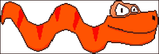
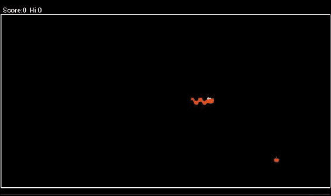

# 第八章：蛇游戏

在本章中，我们将直接着手设计和实现一个高度上瘾的*Snake*游戏的克隆。我们将研究游戏的设计，并学习如何为一些位图添加动画。然后我们将看一下一些新的代码方面，比如我们的坐标系统。之后，我们将快速实现游戏。最后，我们将看一下如何增强我们的游戏。

在本章中，我们将涵盖以下主题：

+   检查我们游戏的设计

+   查看我们的*Snake*游戏的坐标系统

+   检查代码结构，以便在实现游戏时更加简单

+   学习使用精灵表实现游戏主屏幕时的动画

+   将*Snake*游戏的代码分解为可管理的块，并运行其完整实现

+   稍微增强游戏

# 游戏设计

如果你以前没有玩过优秀的*Snake*游戏，这里是它的工作原理的解释。你控制一个非常小的蛇。在我们的版本中，只有一个头部，一个身体部分和一个尾巴。这是我们蛇的截图，由三个部分组成：



以下截图显示了三个部分：


现在，问题来了；我们的蛇非常饥饿，而且成长得非常快。每次他吃一个苹果，他就会长出一个身体部分。这是一个苹果的截图：


生活真是美好！我们的蛇只是吃东西并长大！我们游戏的玩家需要解决的问题是，蛇有点过于活跃。它永远不停止移动！加剧这个问题的是，如果蛇触碰屏幕的边缘，它就会死亡。

起初，这似乎并不是太大的问题，但随着蛇变得越来越长，他不能一直绕圈子走，因为他最终会不可避免地撞到自己。这将再次导致他的死亡：


每吃一个苹果，我们都会将一定数量添加到分数上。这是游戏在基本实现之后和增强之前的样子：



玩家通过点击屏幕的左侧或右侧来控制蛇。蛇将通过向左或向右转向做出响应。转向方向是相对于蛇行进方向的，这增加了挑战，因为玩家需要像蛇一样思考！

在本章结束时，我们还将简要介绍如何增强游戏，使用增强版在下一章中将其发布到 Google Play 商店，并添加排行榜和成就。

# 坐标系统

在上一章中，我们直接将所有游戏对象绘制到屏幕上的点，并使用真实的屏幕坐标来检测碰撞、反弹等。这一次，我们将做一些稍微不同的事情。这在一定程度上是出于必要，但正如我们将看到的，碰撞检测和跟踪游戏对象也会变得更简单。当我们考虑到我们的蛇可能会变得很长时，这可能会让人感到惊讶。

## 跟踪蛇的部分

为了跟踪所有蛇的部分，我们首先定义一个块大小来定义整个游戏区域的网格部分。每个游戏对象将驻留在(x,y)坐标处，不是基于屏幕的像素分辨率，而是基于我们虚拟网格内的位置。在游戏中，我们定义了一个宽度为 40 个方块的网格，就像这样：

```java
//Determine the size of each block/place on the game board
 blockSize = screenWidth/40;
```

因此我们知道：

```java
numBlocksWide = 40;
```

游戏屏幕的高度以方块为单位，将通过将屏幕的高度以像素为单位除以先前确定的`blockSize`的值来简单计算，减去顶部一点空间用于分数：

```java
numBlocksHigh = ((screenHeight - topGap ))/blockSize;
```

然后，这使我们可以使用两个数组来跟踪我们的蛇的*x*和*y*坐标，其中元素零是头部，最后使用的元素是尾部，就像这样：

```java
//An array for our snake
snakeX = new int[200];
snakeY = new int[200];
```

只要我们有一个移动头部的系统，也许类似于挤压球但基于我们的新游戏网格，我们就可以做以下事情让身体跟随头部移动：

```java
//move the body starting at the back
for(int i = snakeLength; i >0 ; i--){
  snakeX[i] = snakeX[i-1];
  snakeY[i] = snakeY[i-1];
}
```

前面的代码简单地从蛇的后部开始，并在网格中创建其位置，而不管前面的部分是什么。它沿着身体向上进行相同的操作，直到一切都被移动到曾经在其前面的部分的位置。

这也使得碰撞检测（即使对于非常长的蛇）变得非常简单。

## 检测碰撞

使用基于`blockSize`的网格，我们可以检测碰撞，例如与屏幕右侧的碰撞，就像这样：

```java
if(snakeX[0] >= numBlocksWide)dead=true;
```

前面的代码只是检查我们的数组的第一个元素（保存蛇的*x*坐标）是否等于或大于游戏网格的宽度（以块为单位）。在我们实现时，试着先想出与左侧、顶部和底部碰撞的代码。

检测蛇撞到自己的事件也很快。我们只需要检查我们的数组的第一个元素（头部）是否与任何其他部分的位置完全相同，就像这样：

```java
//Have we eaten ourselves?
for (int i = snakeLength-1; i > 0; i--) {
  if ((i > 4) && (snakeX[0] == snakeX[i]) && (snakeY[0] == snakeY[i])) {
    dead = true;
    }
}
```

## 绘制蛇

我们只需根据蛇的每个部分相对于其网格位置乘以一个块的像素大小来绘制。`blockSize`变量处理了使游戏在不同屏幕尺寸上运行的整个挑战，就像这样：

```java
//loop through every section of the snake and draw it
//a block at a time.
canvas.drawBitmap(bodyBitmap, snakeX[i]*blockSize, (snakeY[i]*blockSize)+topGap, paint);
```

诚然，关于我们的实现将如何工作可能还有更多问题，但最好的答案可能是通过实际构建游戏来回答。

因此，我们可以通过编写代码或仅从已完成的项目中阅读来轻松跟进。让我们来看看我们代码的整体结构。

# 代码结构

我们将有两个活动，一个用于菜单屏幕，一个用于游戏屏幕。菜单屏幕活动将被称为`MainActivity`，游戏屏幕活动将被称为`GameActivity`。您可以在下载包的`Chapter8/Snake`文件夹中找到所有已完成的代码文件以及所有资产，如图像、精灵表和声音文件。

## 主活动

与我们的其他项目不同，菜单屏幕将不会在 Android Studio UI 设计器中设计 UI。它将由一个动画蛇头、一个标题和一个高分组成。玩家将通过在屏幕上的任何位置轻击来进入`GameActivity`。由于我们需要完成动画和用户交互，即使主屏幕也将有一个线程、一个视图对象和通常与我们的游戏屏幕相关的方法，就像这样：

```java
MainActivity.java file
    Imports
    MainActivity class
        Declare some variables and objects
        onCreate
        SnakeAnimView class
            Constructor
            Run method
            Update method
            Draw method
            controlFPS method
            pause method
            resume method
            onTouchEvent method
        onStop method
        onResume method
        onPause method
        onKeyDown method
```

我们暂时不会深入研究菜单屏幕，因为在本节结束时，我们将逐行实现它。

## 游戏活动

游戏屏幕结构与我们的 Squash 游戏和菜单屏幕的结构有许多相似之处，尽管这种结构的内部差异很大（正如我们已经讨论过的和将要看到的）。在结构的末尾有一些差异，尤其是`loadSound`方法和`configureDisplay`方法。这是结构（之后我们将看到为什么有这两个额外的方法）：

```java
MainActivity.java file
    Imports
    GameActivity class
        Declare some variables and objects
        onCreate
        SnakeView class
            Constructor
            getSnake method
            getApple method
            Run method
            updateGame method
            drawGame method
            controlFPS method
            pause method
            resume method
            onTouchEvent method
        onStop method
        onResume method
        onPause method
        onKeyDown method
        loadSOund method
        configureDisplay method
```

### 整理 onCreate

当您很快实现的`GameActivity`类的代码时，您可能会注意到的第一件事是`onCreate`方法有多么简短：

```java
@Override
    protected void onCreate(Bundle savedInstanceState) {
        super.onCreate(savedInstanceState);

        loadSound();
        configureDisplay();
        snakeView = new SnakeView(this);
        setContentView(snakeView);

    }
```

我们编写了两个方法，`loadSound`和`configureDisplay`。它们完成了我们挤压游戏中的大部分初始化和设置。这使得我们的代码更加整洁。在`onCreate`中只剩下初始化我们的`SnakeView`对象和调用`setContentView`。

当我们实现它们时，我们将详细查看我们的`loadSound`和`configureDisplay`方法。

由于我们已经提前了解了结构并且有了这种实现类型的先前经验，我们将在一个阶段内完成我们游戏活动的所有实现。

让我们快速实现菜单屏幕。

# 动画、精灵表和蛇的主屏幕

在上一章中，我们使用位图在我们用 Java 代码创建的空白位图上绘制文本、圆圈、线条和单个像素。然后，我们使用`Canvas`类显示了所有涂鸦的位图。现在我们将看一种绘制二维图像的技术，有时被称为精灵。这些是由预先绘制的图像制成的。这些图像可以是简单的乒乓球，也可以是拥有肌肉定义、精美服装、武器和头发的辉煌的二维角色。

到目前为止，我们已经用不变的对象进行了动画，也就是说，我们已经将一个静态不变的图像在屏幕上移动了。在本节中，我们将看到如何不仅在屏幕上显示预先绘制的位图图像，而且不断地改变它以创建现场动画的幻觉。

当然，最终的组合将是通过同时改变图像和移动图像来实现位图动画。当我们查看本章节《Snake》游戏的增强版本时，我们将会简要看到这一点，但不会分析代码。

要在现场进行位图动画，我们需要一些位图，正如你所期望的那样。例如，要绘制蛇尾来回摆动，我们至少需要两帧动画，显示尾巴在不同位置的样子。在下面的截图中，花朵的头朝向左侧：

使用精灵表进行动画

在这个截图中，花朵已经被翻转：

动画、精灵表和蛇的主屏幕

如果两个位图连续显示，它们将创建花在风中摇摆的基本效果。当然，两帧动画不会争夺任何动画奖项，而且这些图像还有另一个问题，正如我们将要学到的，所以我们应该添加更多帧来使动画尽可能逼真。

在我们为游戏的主屏幕制作一个动画蛇头之前，我们还有一件事要讨论。我们如何让 Android 在这些位图之间切换？

## 使用精灵表进行动画

首先，我们需要以一种易于在代码中操作的方式呈现帧。这就是精灵表的用武之地。下面的图像显示了我们将在游戏主屏幕上使用的基本蛇头动画的一些帧。这一次，它们呈现在一条帧条中。它们都是同一图像的部分，有点像电影中的一系列图像。另外，请注意在下面的图像中，帧相对于彼此居中并且大小完全相等：

使用精灵表进行动画

如果我们实际上连续显示两个前面的花朵图像，它们不仅会摇摆，而且还会在它们的茎上来回跳动，这可能不是我们想要的效果。

因此，就蛇精灵表而言，只要我们一个接一个地显示帧，我们就会创建一个基本的动画。

那么我们如何让我们的代码从精灵表的一个部分跳到另一个部分呢？每一帧的大小都完全相同，在这种情况下是 64 x 64 像素，所以我们只需要一种方法来显示从 0 到 63 的像素，然后是 64 到 127，然后是 128 到 192，依此类推。由于精灵表图像的每一帧都略有不同，它允许我们使用一个图像文件来创建我们的动画。幸运的是，我们有一个处理这个的类，虽然不像专门的精灵表类那样奢华，但几乎一样。

### 提示

关于精灵表类，这样的东西确实存在，尽管不在常规的 Android 类中。专门为二维游戏设计的 API 通常会包含精灵表的类。我们将在下一章中看到这方面的例子。

`Rect`类保存矩形的坐标。在这里，我们创建了一个`Rect`类型的新对象，并将其初始化为从 0,0 开始到 63,63 结束：

```java
Rect rectToBeDrawn = new Rect(0, 0, 63, 63);
```

然后，`Canvas`类实际上可以使用我们的`Rect`对象来定义先前加载的位图的一部分：

```java
canvas.drawBitmap(headAnimBitmap, rectToBeDrawn, destRect, paint);
```

上述代码比看起来简单得多。首先，我们看到`canvas.drawBitmap`。我们使用`Canvas`类的`drawBitmap`方法，就像以前一样。然后我们将`headAnimBitmap`作为参数传递，它是包含我们要动画的所有帧的精灵表。`rectToBeDrawn`代表当前相关帧在`headAnimationBitmap`中的坐标。`destRect`简单地表示我们要绘制当前帧的屏幕坐标，当然，`paint`是`Paint`类的对象。

现在我们所要做的就是改变`rectToBeDrawn`的坐标，并使用线程控制帧速率，我们就完成了！让我们这样做，为我们的*Snake*游戏创建一个动画主屏幕。

### 实现蛇的主屏幕

通过我们刚刚介绍的背景信息以及我们对即将编写的代码结构的详细了解，这段代码不应该有任何意外。我们将把事情分成几块，只是为了确保我们确切地知道发生了什么：

1.  创建一个 API 级别为 13 的新项目。将其命名为`Snake`。

1.  像以前一样将活动设置为全屏，并将图形放入`drawable/mdpi`文件夹中。当然，您可以像往常一样使用我的图形。它们在`Snake`项目的`graphics`文件夹中提供了代码下载。

1.  在这里，您将找到我们的`MainActivity`类声明和成员变量。注意我们的`Canvas`和`Bitmap`类的变量，我们声明变量来保存帧大小（宽度和高度）以及帧数。我们还有一个`Rect`对象来保存精灵表的当前帧的坐标。我们很快就会看到这些变量的作用。输入以下代码：

```java
public class MainActivity extends Activity {

    Canvas canvas;
    SnakeAnimView snakeAnimView;

    //The snake head sprite sheet
    Bitmap headAnimBitmap;
    //The portion of the bitmap to be drawn in the current frame
    Rect rectToBeDrawn;
    //The dimensions of a single frame
    int frameHeight = 64;
    int frameWidth = 64;
    int numFrames = 6;
    int frameNumber;

    int screenWidth;
    int screenHeight;

    //stats
    long lastFrameTime;
    int fps;
    int hi;

    //To start the game from onTouchEvent
    Intent i;
```

1.  以下是重写的`onCreate`方法的实现。我们以通常的方式获取屏幕尺寸。我们将我们的精灵表加载到`headAnimBitmap`位图中。最后，我们创建一个新的`SnakeAnimView`并将其设置为内容视图。在上一步的代码之后输入以下代码：

```java
@Override
    protected void onCreate(Bundle savedInstanceState) {
      super.onCreate(savedInstanceState);

        //find out the width and height of the screen
        Display display = getWindowManager().getDefaultDisplay();
        Point size = new Point();
        display.getSize(size);
        screenWidth = size.x;
        screenHeight = size.y;

        headAnimBitmap = BitmapFactory.decodeResource(getResources(), R.drawable.head_sprite_sheet);

        snakeAnimView = new SnakeAnimView(this);
        setContentView(snakeAnimView);

        i = new Intent(this, GameActivity.class);

    }
```

1.  这是我们的`SurfaceView`类`SnakeAnimView`的声明，以及它的成员变量。注意它扩展了`SurfaceView`并实现了`Runnable`。它的所有方法都在接下来的步骤中。在上一步的代码之后输入以下代码：

```java
class SnakeAnimView extends SurfaceView implements Runnable {
        Thread ourThread = null;
        SurfaceHolder ourHolder;
        volatile boolean playingSnake;
        Paint paint;
```

1.  这是构造函数，通过将位图宽度除以帧数得到`frameWidth`值，并使用`getHeight`方法得到`frameHeight`值。在上一步的代码之后输入以下代码：

```java
public SnakeAnimView(Context context) {
    super(context);
    ourHolder = getHolder();
    paint = new Paint();
    frameWidth = headAnimBitmap.getWidth()/numFrames;
    frameHeight = headAnimBitmap.getHeight();
}
```

1.  现在我们实现了简短但至关重要的`run`方法。它依次调用这个类的每个关键方法。这三个方法在此步骤之后的三个步骤中实现。在上一步的代码之后输入以下代码：

```java
@Override
        public void run() {
            while (playingSnake) {
                update();
                draw();
                controlFPS();

            }

        }
```

1.  这是`update`方法。它跟踪并选择需要显示的帧编号。每次通过`update`方法，我们使用`frameWidth`，`frameHeight`和`frameNumber`计算要绘制的精灵表的坐标。如果您想知道为什么我们从每个水平坐标中减去`1`，那是因为像屏幕坐标一样，位图从 0,0 开始它们的坐标：

```java
public void update() {

  //which frame should we draw
  rectToBeDrawn = new Rect((frameNumber * frameWidth)-1, 0,(frameNumber * frameWidth +frameWidth)-1, frameHeight);

  //now the next frame
  frameNumber++;

  //don't try and draw frames that don't exist
  if(frameNumber == numFrames){
    frameNumber = 0;//back to the first frame
  }
}
```

1.  接下来是`draw`方法，直到最后都没有什么新的，当它通过`screenHeight`和`screenWidth`变量除以 2 来计算在屏幕上绘制位图的位置时才有变化。然后将这些坐标保存在`destRect`中。`destRect`和`rectToDraw`都传递给`drawBitmap`方法，该方法在所需位置绘制所需的帧。在上一步的代码之后输入这段代码：

```java
public void draw() {

            if (ourHolder.getSurface().isValid()) {
                canvas = ourHolder.lockCanvas();
                //Paint paint = new Paint();
                canvas.drawColor(Color.BLACK);//the background
                paint.setColor(Color.argb(255, 255, 255, 255));
                paint.setTextSize(150);
                canvas.drawText("Snake", 10, 150, paint);
                paint.setTextSize(25);
                canvas.drawText("  Hi Score:" + hi, 10, screenHeight-50, paint);

                //Draw the snake head
                //make this Rect whatever size and location you like
                //(startX, startY, endX, endY)
                Rect destRect = new Rect(screenWidth/2-100, screenHeight/2-100, screenWidth/2+100, screenHeight/2+100);

                canvas.drawBitmap(headAnimBitmap, rectToBeDrawn, destRect, paint);

                ourHolder.unlockCanvasAndPost(canvas);
            }

        }
```

1.  我们可靠的`controlFPS`方法确保我们的动画以合理的速度显示。这段代码的唯一变化是将`timeTosleep`的初始化更改为在每帧之间创建 500 毫秒的暂停。在上一步的代码之后输入以下代码：

```java
public void controlFPS() {
            long timeThisFrame = (System.currentTimeMillis() - lastFrameTime);
            long timeToSleep = 500 - timeThisFrame;
            if (timeThisFrame > 0) {
                fps = (int) (1000 / timeThisFrame);
            }
            if (timeToSleep > 0) {

                try {
                    ourThread.sleep(timeToSleep);
                } catch (InterruptedException e) {
                }

            }

            lastFrameTime = System.currentTimeMillis();
        }
```

1.  接下来是我们的`pause`和`resume`方法，它们与 Android 生命周期方法一起工作，以启动和停止我们的线程。在上一步的代码之后输入这段代码：

```java
public void pause() {
            playingSnake = false;
            try {
                ourThread.join();
            } catch (InterruptedException e) {
            }

        }

        public void resume() {
            playingSnake = true;
            ourThread = new Thread(this);
            ourThread.start();
        }
```

1.  对于我们的`SnakeAnimView`类和`onTouchEvent`方法，当屏幕的任何位置被触摸时简单地启动游戏，我们输入以下代码。显然，我们还没有`GameActivity`：

```java
@Override
        public boolean onTouchEvent(MotionEvent motionEvent) {

            startActivity(i);
            return true;
        }
}
```

1.  最后，在`MainActivity`类中，我们处理了一些 Android 生命周期方法。我们还处理了当玩家按下返回按钮时会发生什么：

```java
@Override
    protected void onStop() {
        super.onStop();

        while (true) {
            snakeAnimView.pause();
            break;
        }

        finish();
    }

    @Override
    protected void onResume() {
        super.onResume();
        snakeAnimView.resume();
    }

    @Override
    protected void onPause() {
        super.onPause();
        snakeAnimView.pause();
    }

    public boolean onKeyDown(int keyCode, KeyEvent event) {
        if (keyCode == KeyEvent.KEYCODE_BACK) {
            snakeAnimView.pause();
            finish();
            return true;
        }
        return false;
    }
```

1.  现在，您必须暂时注释掉步骤 4 中的这行代码以测试动画。这样做的原因是在我们实现`GameActivity`类之前，它会导致错误：

```java
//i = new Intent(this, GameActivity.class);
```

1.  测试应用程序。

1.  当我们实现了`GameActivity`类时，取消步骤 14 中的注释。这是我们完成的主屏幕：

在这个练习中，我们设置了一个扩展了`SurfaceView`的类，就像我们为壁球游戏做的那样。我们有一个控制线程的`run`方法，以及一个计算当前动画在精灵表中坐标的`update`方法。`draw`方法只是使用`update`方法计算的坐标在屏幕上绘制。

就像壁球游戏一样，我们有一个`onTouchUpdate`方法，但这次的代码非常简单。因为我们只需要检测任何位置的任何类型的触摸，所以我们只需在方法中添加一行代码。

# 实现贪吃蛇游戏活动

并不是所有的代码都是新的。事实上，我们要么以前大部分都用过，要么在本章中早些时候已经讨论过。然而，我想按顺序和至少简要解释的方式向您呈现每一行，即使我们以前已经看到过。话虽如此，我没有包括导入的长列表，因为我们要么会被提示自动添加它们，要么在需要时只需按*Alt* + *Enter*。

这样，我们可以在没有任何理解上的空白的情况下回顾整个过程。像往常一样，随着实现的进行，我会进行总结，并在最后深入一些细节：

1.  添加一个名为`GameActivity`的活动。当询问时选择一个空活动。

1.  像以前一样，将活动设置为全屏。

1.  像往常一样，创建一些音效或使用我的音效。按照通常的方式在`main`目录中创建一个`assets`目录。将声音文件（`sample1.ogg`，`sample2.ogg`，`sample3.ogg`和`sample4.ogg`）复制粘贴到其中。

1.  创建单独的非精灵表版本的图形，或者使用我的。将它们复制粘贴到`res/drawable-mdpi`文件夹中。

1.  这是`GameActivity`类声明和成员变量。在这里没有什么新的，直到我们声明了贪吃蛇的数组（`snakeX`和`snakeY`）。还要注意我们用来控制游戏网格的变量（`blockSize`，`numBlocksHigh`和`numBlocksWide`）。现在输入这段代码：

```java
public class GameActivity extends Activity {

    Canvas canvas;
    SnakeView snakeView;

    Bitmap headBitmap;
    Bitmap bodyBitmap;
    Bitmap tailBitmap;
    Bitmap appleBitmap;

    //Sound
    //initialize sound variables
    private SoundPool soundPool;
    int sample1 = -1;
    int sample2 = -1;
    int sample3 = -1;
    int sample4 = -1;

    //for snake movement
    int directionOfTravel=0;
    //0 = up, 1 = right, 2 = down, 3= left

    int screenWidth;
    int screenHeight;
    int topGap;

    //stats
    long lastFrameTime;
    int fps;
    int score;
    int hi;

    //Game objects
    int [] snakeX;
    int [] snakeY;
    int snakeLength;
    int appleX;
    int appleY;

    //The size in pixels of a place on the game board
    int blockSize;
    int numBlocksWide;
    int numBlocksHigh;
```

1.  如前所述，我们的新的小`onCreate`方法几乎没有什么要做的，因为大部分工作都是在`loadSound`和`configureDisplay`方法中完成的。在上一步的代码之后输入这段代码：

```java
@Override
    protected void onCreate(Bundle savedInstanceState) {
        super.onCreate(savedInstanceState);

        loadSound();
        configureDisplay();
        snakeView = new SnakeView(this);
        setContentView(snakeView);

    }
```

1.  这是我们的`SnakeView`类的类声明，成员变量和构造函数。我们为`snakeX`和`snakeY`数组分配了 200 个`int`变量，并调用了`getSnake`和`getApple`方法，这将在屏幕上放置一个苹果和我们的蛇。这正是在类构造时我们想要的：

```java
  class SnakeView extends SurfaceView implements Runnable {
      Thread ourThread = null;
      SurfaceHolder ourHolder;
      volatile boolean playingSnake;
      Paint paint;

      public SnakeView(Context context) {
          super(context);
          ourHolder = getHolder();
          paint = new Paint();

            //Even my 9 year old play tester couldn't
            //get a snake this long
            snakeX = new int[200];
            snakeY = new int[200];

            //our starting snake
            getSnake();
            //get an apple to munch
            getApple();
        }
```

1.  这是我们如何在我们的坐标系统中生成蛇和苹果。在`getSnake`方法中，我们通过将`snakeX[0]`和`snakeY[0]`初始化为高度和宽度均分之后的块数的中心位置，将蛇的头放在屏幕的大致中心。然后我们立即在后面放置一个身体段和尾部段。请注意，我们不需要为不同类型的段做任何特殊安排。只要绘图代码*知道*第一个段是头部，最后一个段是尾部，中间的一切都是身体，那就可以了。在`getApple`方法中，整数变量`appleX`和`appleY`被初始化为游戏网格内的随机位置。这个方法是从构造函数中调用的，就像我们在前一步中看到的那样。每当我们的蛇设法吃掉一个苹果时，它也将被调用以放置一个新的苹果，我们将会看到。在前一步的代码之后输入此代码：

```java
public void getSnake(){
            snakeLength = 3;
            //start snake head in the middle of screen
            snakeX[0] = numBlocksWide / 2;
            snakeY[0] = numBlocksHigh / 2;

            //Then the body
            snakeX[1] = snakeX[0]-1;
            snakeY[1] = snakeY[0];

            //And the tail
            snakeX[1] = snakeX[1]-1;
            snakeY[1] = snakeY[0];
        }

        public void getApple(){
            Random random = new Random();
            appleX = random.nextInt(numBlocksWide-1)+1;
            appleY = random.nextInt(numBlocksHigh-1)+1;
        }
```

1.  接下来是`run`方法，它控制游戏的流程。在前一步的代码之后输入以下代码：

```java
@Override
        public void run() {
            while (playingSnake) {
                updateGame();
                drawGame();
                controlFPS();

            }

        }
```

1.  现在我们将看一下`updateGame`，整个应用程序中最复杂的方法。话虽如此，它可能比我们挤压游戏中的同一方法稍微复杂一些。这是因为我们的坐标系统导致了更简单的碰撞检测。这是`updateGame`的代码。仔细研究它，我们将在最后一行一行地剖析它：

```java
public void updateGame() {

    //Did the player get the apple
    if(snakeX[0] == appleX && snakeY[0] == appleY){
        //grow the snake
        snakeLength++;
        //replace the apple
        getApple();
        //add to the score
        score = score + snakeLength;
        soundPool.play(sample1, 1, 1, 0, 0, 1);
    }

    //move the body - starting at the back
    for(int i=snakeLength; i >0 ; i--){
        snakeX[i] = snakeX[i-1];
        snakeY[i] = snakeY[i-1];
    }

    //Move the head in the appropriate direction
    switch (directionOfTravel){
        case 0://up
        snakeY[0]  --;
        break;

        case 1://right
        snakeX[0] ++;
        break;

        case 2://down
        snakeY[0] ++;
        break;

        case 3://left
        snakeX[0] --;
        break;
        }

        //Have we had an accident
        boolean dead = false;
        //with a wall
        if(snakeX[0] == -1)dead=true;
        if(snakeX[0] >= numBlocksWide) dead = true;
        if(snakeY[0] == -1)dead=true;
        if(snakeY[0] == numBlocksHigh) dead = true;
        //or eaten ourselves?
        for (int i = snakeLength-1; i > 0; i--) {
            if ((i > 4) && (snakeX[0] == snakeX[i]) && (snakeY[0] == snakeY[i])) {
            dead = true;
        }
    }

        if(dead){
        //start again
        soundPool.play(sample4, 1, 1, 0, 0, 1);
        score = 0;
        getSnake();

        }

        }
```

1.  我们已经弄清楚了游戏对象在屏幕上的位置，现在我们可以绘制它们。这段代码很容易理解，因为我们之前大部分都见过：

```java
public void drawGame() {

    if (ourHolder.getSurface().isValid()) {
        canvas = ourHolder.lockCanvas();
        //Paint paint = new Paint();
        canvas.drawColor(Color.BLACK);//the background
        paint.setColor(Color.argb(255, 255, 255, 255));
        paint.setTextSize(topGap/2);
        canvas.drawText("Score:" + score + "  Hi:" + hi, 10, topGap-6, paint);

        //draw a border - 4 lines, top right, bottom , left
        paint.setStrokeWidth(3);//3 pixel border
        canvas.drawLine(1,topGap,screenWidth-1,topGap,paint);
        canvas.drawLine(screenWidth-1,topGap,screenWidth-1,topGap+(numBlocksHigh*blockSize),paint);
        canvas.drawLine(screenWidth-1,topGap+(numBlocksHigh*blockSize),1,topGap+(numBlocksHigh*blockSize),paint);
        canvas.drawLine(1,topGap, 1,topGap+(numBlocksHigh*blockSize), paint);

        //Draw the snake
        canvas.drawBitmap(headBitmap, snakeX[0]*blockSize, (snakeY[0]*blockSize)+topGap, paint);
        //Draw the body
        for(int i = 1; i < snakeLength-1;i++){
            canvas.drawBitmap(bodyBitmap, snakeX[i]*blockSize, (snakeY[i]*blockSize)+topGap, paint);
        }
        //draw the tail
        canvas.drawBitmap(tailBitmap, snakeX[snakeLength-1]*blockSize, (snakeY[snakeLength-1]*blockSize)+topGap, paint);

        //draw the apple
        canvas.drawBitmap(appleBitmap, appleX*blockSize, (appleY*blockSize)+topGap, paint);

        ourHolder.unlockCanvasAndPost(canvas);
    }

        }
```

1.  这是`controlFPS`方法，与我们的挤压游戏的`controlFPS`方法相同，只是我们有一个不同的目标帧率。在前一步的代码之后输入此代码：

```java
public void controlFPS() {
    long timeThisFrame = (System.currentTimeMillis() - lastFrameTime);
    long timeToSleep = 100 - timeThisFrame;
    if (timeThisFrame > 0) {
        fps = (int) (1000 / timeThisFrame);
    }
    if (timeToSleep > 0) {

        try {
            ourThread.sleep(timeToSleep);
        } catch (InterruptedException e) {
        }

        }

        lastFrameTime = System.currentTimeMillis();
        }
```

1.  这里是我们未更改的`pause`和`resume`方法。在前一步的代码之后输入以下代码：

```java
public void pause() {
            playingSnake = false;
            try {
                ourThread.join();
            } catch (InterruptedException e) {
            }

        }

        public void resume() {
            playingSnake = true;
            ourThread = new Thread(this);
            ourThread.start();
        }
```

1.  然后是`onTouchEvent`方法，类似于我们挤压游戏的方法。这里没有新概念，但在这个游戏中它的工作方式如下。我们打开`ACTION_UP`事件。这与检测点击大致相同。然后我们检查按压是在左边还是右边。如果在右边，我们增加`directionOfTravel`。如果在左边，我们减少`directionOfTravel`。如果你仔细看`updateGame`方法，你会发现`directionOfTravel`表示移动蛇的方向。记住，蛇永远不会停止。这就是为什么我们与我们的挤压游戏做法不同的原因。在前一步的代码之后输入此代码：

```java
@Override
    public boolean onTouchEvent(MotionEvent motionEvent) {

        switch (motionEvent.getAction() & MotionEvent.ACTION_MASK) {
            case MotionEvent.ACTION_UP:
            if (motionEvent.getX() >= screenWidth / 2) {
                //turn right
                directionOfTravel ++;
                //no such direction

                if(directionOfTravel == 4)
                //loop back to 0(up)
                directionOfTravel = 0;
            }
        } else {
            //turn left
            directionOfTravel--;
            if(directionOfTravel == -1) {//no such direction
            //loop back to 0(up)
            directionOfTravel = 3;
                        }
                    }
            }
            return true;
        }
```

1.  在`GameActivity`类中，我们现在处理 Android 生命周期方法和“返回”按钮功能。在前一步的代码之后输入以下代码：

```java
@Override
    protected void onStop() {
        super.onStop();

        while (true) {
            snakeView.pause();
            break;
        }

        finish();
    }

    @Override
    protected void onResume() {
        super.onResume();
        snakeView.resume();
    }

    @Override
    protected void onPause() {
        super.onPause();
        snakeView.pause();
    }

    public boolean onKeyDown(int keyCode, KeyEvent event) {
        if (keyCode == KeyEvent.KEYCODE_BACK) {

           snakeView.pause();

            Intent i = new Intent(this, MainActivity.class);
            startActivity(i);
            finish();
            return true;
        }
        return false;
    }
```

1.  这是我们的`loadSound`方法，它通过将所有声音初始化移动到这里，简化了`onCreate`方法。在前一步的代码之后输入以下代码：

```java
public void loadSound(){
    soundPool = new SoundPool(10, AudioManager.STREAM_MUSIC, 0);
    try {
        //Create objects of the 2 required classes
        AssetManager assetManager = getAssets();
        AssetFileDescriptor descriptor;

        //create our three fx in memory ready for use
        descriptor = assetManager.openFd("sample1.ogg");
        sample1 = soundPool.load(descriptor, 0);

        descriptor = assetManager.openFd("sample2.ogg");
        sample2 = soundPool.load(descriptor, 0);

        descriptor = assetManager.openFd("sample3.ogg");
        sample3 = soundPool.load(descriptor, 0);

        descriptor = assetManager.openFd("sample4.ogg");
        sample4 = soundPool.load(descriptor, 0);

        } catch (IOException e) {
        //Print an error message to the console
        Log.e("error", "failed to load sound files);
        }
    }
```

1.  然后是`configureDisplay`方法，它从`onCreate`中调用并完成了位图和屏幕大小计算的整个设置。我们稍后会更详细地看一下这个。在前一步的代码之后输入以下代码：

```java
public void configureDisplay(){
        //find out the width and height of the screen
        Display display = getWindowManager().getDefaultDisplay();
        Point size = new Point();
        display.getSize(size);
        screenWidth = size.x;
        screenHeight = size.y;
        topGap = screenHeight/14;
        //Determine the size of each block/place on the game board
        blockSize = screenWidth/40;

        //Determine how many game blocks will fit into the 
        //height and width
        //Leave one block for the score at the top
        numBlocksWide = 40;
        numBlocksHigh = ((screenHeight - topGap ))/blockSize;

        //Load and scale bitmaps
        headBitmap = BitmapFactory.decodeResource(getResources(), R.drawable.head);
        bodyBitmap = BitmapFactory.decodeResource(getResources(), R.drawable.body);
        tailBitmap = BitmapFactory.decodeResource(getResources(), R.drawable.tail);
        appleBitmap = BitmapFactory.decodeResource(getResources(), R.drawable.apple);

        //scale the bitmaps to match the block size
        headBitmap = Bitmap.createScaledBitmap(headBitmap, blockSize, blockSize, false);
        bodyBitmap = Bitmap.createScaledBitmap(bodyBitmap, blockSize, blockSize, false);
        tailBitmap = Bitmap.createScaledBitmap(tailBitmap, blockSize, blockSize, false);
        appleBitmap = Bitmap.createScaledBitmap(appleBitmap, blockSize, blockSize, false);

    }
```

1.  现在运行应用程序。在实际设备上，游戏比在模拟器上更容易玩。

我们在进行过程中逐步介绍了代码，但像往常一样，这里是一些更复杂方法的逐步剖析，从`updateGame`方法开始。

首先，我们检查玩家是否吃了一个苹果。更具体地说，蛇的头部是否与苹果在同一个网格位置？`if`语句检查是否发生了这种情况，然后执行以下操作：

+   增加蛇的长度

+   通过调用`getApple`在屏幕上放置另一个苹果

+   根据蛇的长度为玩家的分数增加一个值，使每个苹果的价值都比上一个更高

+   发出蜂鸣声

这是我们刚刚描述的操作的代码：

```java
public void updateGame() {

            //Did the player get the apple
            if(snakeX[0] == appleX && snakeY[0] == appleY){
                //grow the snake
                snakeLength++;
                //replace the apple
                getApple();
                //add to the score
                score = score + snakeLength;
                soundPool.play(sample1, 1, 1, 0, 0, 1);
            }
```

现在我们只是简单地移动蛇的每个部分，从后面开始，到它前面的位置。我们使用`for`循环来做到这一点：

```java
            //move the body - starting at the back
            for(int i = snakeLength; i >0 ; i--){
                snakeX[i] = snakeX[i-1];
                snakeY[i] = snakeY[i-1];
            }
```

当然，我们最好也移动头部！我们之所以最后移动头部，是因为如果我们之前移动头部，身体的前部分会移动到错误的位置。只要在进行任何绘图之前完成整个移动，一切都会很好。我们的`run`方法确保这总是成立。以下是根据`directionOfTravel`确定的方向移动头部的代码。正如我们所看到的，`directionOfTravel`是由玩家在`onTouchEvent`方法中操作的：

```java
            //Move the head in the appropriate direction
            switch (directionOfTravel){
                case 0://up
                    snakeY[0]  --;
                    break;

                case 1://right
                    snakeX[0] ++;
                    break;

                case 2://down
                    snakeY[0] ++;
                    break;

                case 3://left
                    snakeX[0] --;
                    break;
            }
```

接下来，我们检查是否与墙壁发生了碰撞。我们在之前查看碰撞检测时看到了这段代码。以下是完整的解决方案，从左墙开始，然后右墙，然后顶部，最后底部：

```java
            //Have we had an accident
            boolean dead = false;
            //with a wall
            if(snakeX[0] == -1)dead=true;
            if(snakeX[0] >= numBlocksWide)dead=true;
            if(snakeY[0] == -1)dead=true;
            if(snakeY[0] == numBlocksHigh)dead=true;
```

然后我们检查蛇是否与自身发生了碰撞。最初，这似乎很尴尬，但正如我们之前看到的，我们只需循环遍历我们的蛇数组，检查任何部分是否与头部在相同的位置，无论是在*x*坐标还是*y*坐标上：

```java
           //or eaten ourselves?
            for (int i = snakeLength-1; i > 0; i--) {
                if ((i > 4) && (snakeX[0] == snakeX[i]) && (snakeY[0] == snakeY[i])) {
                    dead = true;
                }
            }
```

如果我们的任何碰撞检测代码将`dead`设置为`true`，我们只需播放一个声音，将`score`设置为`0`，然后得到一个新的小蛇：

```java
            if(dead){
                //start again
                soundPool.play(sample4, 1, 1, 0, 0, 1);
                score = 0;
                getSnake();

            }

        }
```

现在我们更仔细地看一下`drawGame`方法。首先，我们准备通过清除屏幕来绘制：

```java
public void drawGame() {

            if (ourHolder.getSurface().isValid()) {
                canvas = ourHolder.lockCanvas();
                //Paint paint = new Paint();
                canvas.drawColor(Color.BLACK);//the background
                paint.setColor(Color.argb(255, 255, 255, 255));
                paint.setTextSize(topGap/2);
```

现在我们为玩家的分数绘制文本，就在我们在`configureDisplay`中定义的`topGap`上方：

```java
    canvas.drawText("Score:" + score + "  Hi:" + hi, 10, topGap-6, paint);
```

现在，使用`drawLine`，我们在游戏网格周围绘制一个可见的边框：

```java
 //draw a border - 4 lines, top right, bottom, left
                paint.setStrokeWidth(3);//4 pixel border
                canvas.drawLine(1,topGap,screenWidth-1,topGap,paint);
                canvas.drawLine(screenWidth-1,topGap,screenWidth-1,topGap+(numBlocksHigh*blockSize),paint);
                canvas.drawLine(screenWidth-1,topGap+(numBlocksHigh*blockSize),1,topGap+(numBlocksHigh*blockSize),paint);
                canvas.drawLine(1,topGap, 1,topGap+(numBlocksHigh*blockSize), paint);
```

接下来，我们绘制蛇的头部：

```java
//Draw the snake
canvas.drawBitmap(headBitmap, snakeX[0]*blockSize, (snakeY[0]*blockSize)+topGap, paint);
```

蛇的头部将被所有的身体部分跟随。看一下`for`循环的条件。这从`1`开始，这意味着它不会重绘头部位置，结束于`snakeLength - 1`，这意味着它不会绘制尾部部分。以下是用于绘制身体部分的代码：

```java
//Draw the body
for(int i = 1; i < snakeLength-1; i++){
    canvas.drawBitmap(bodyBitmap, snakeX[i]*blockSize, (snakeY[i]*blockSize)+topGap, paint);
}
```

在这里，我们绘制蛇的尾巴：

```java
//draw the tail
canvas.drawBitmap(tailBitmap, snakeX[snakeLength-
    1]*blockSize, (snakeY[snakeLength-1]*blockSize)+topGap, paint);
```

最后，我们按以下方式绘制苹果：

```java
                //draw the apple
                canvas.drawBitmap(appleBitmap, appleX*blockSize, 
                    (appleY*blockSize)+topGap, paint);

                ourHolder.unlockCanvasAndPost(canvas);
            }

        }
```

接下来，我们将详细介绍`configureDisplay`方法。

首先，我们获取屏幕分辨率，并像往常一样将结果存储在`screenWidth`和`screenHeight`中：

```java
public void configureDisplay(){
        //find out the width and height of the screen
        Display display = getWindowManager().getDefaultDisplay();
        Point size = new Point();
        display.getSize(size);
        screenWidth = size.x;
        screenHeight = size.y;
```

在这里，我们定义了一个叫做`topGap`的间隙。它将是屏幕顶部的一个空间，不会成为游戏区域的一部分。这个间隙用于分数。我们在`drawGame`方法中相当广泛地看到了`topGap`的使用。之后，我们计算剩余区域的宽度和高度：

```java
        topGap = screenHeight/14;
        //Determine the size of each block/place on the game board
        blockSize = screenWidth/40;

        //Determine how many game blocks will fit into the height and width
        //Leave one block for the score at the top
        numBlocksWide = 40;
        numBlocksHigh = (screenHeight - topGap )/blockSize;
```

在代码的下一部分中，我们将所有的图像文件加载到`Bitmap`对象中：

```java
//Load and scale bitmaps
        headBitmap = BitmapFactory.decodeResource(getResources(), R.drawable.head);
        bodyBitmap = BitmapFactory.decodeResource(getResources(), R.drawable.body);
        tailBitmap = BitmapFactory.decodeResource(getResources(), R.drawable.tail);
        appleBitmap = BitmapFactory.decodeResource(getResources(), R.drawable.apple);
```

最后，我们将每个位图缩放为与`blockSize`相同的宽度和高度：

```java
        //scale the bitmaps to match the block size
        headBitmap = Bitmap.createScaledBitmap(headBitmap, blockSize, 
            blockSize, false);
        bodyBitmap = Bitmap.createScaledBitmap(bodyBitmap, blockSize, 
            blockSize, false);
tailBitmap = Bitmap.createScaledBitmap(tailBitmap, blockSize, 
    blockSize, false);
appleBitmap = Bitmap.createScaledBitmap(appleBitmap, 
    blockSize, blockSize, false);

    }
```

现在我们可以快速看一下我们可以改进游戏的几种不同方式。

# 增强游戏

这是一系列问题和答案，引导我们改进*Snake*游戏的版本。如果你无法回答一些（甚至全部）问题，也没关系。只需看一下问题和答案，然后你可以看一下新游戏和代码。

# 自测问题

Q1）有什么可以用来为我们的游戏屏幕提供视觉改进？我们可以使用漂亮的浅绿色草地背景，而不仅仅是黑色吗？

Q2）怎么样一些漂亮的花？

Q3）如果你感到勇敢，让花朵摇曳。想想我们对精灵表学到的东西。理论上与动画蛇头的理论完全相同。我们只需要几行代码来控制帧速率，与游戏帧速率分开。

Q4) 我们可以设置另一个计数器，并在 `GameActivity` 中使用我们的蛇头动画，但这并不是很有用，因为在较小的尺寸下，细微的舌头运动几乎不可见。但我们能摆动尾部吗？

Q5) 这是一个稍微棘手的增强。你会注意到，当蛇精灵朝着四个可能的方向中的三个时，它们看起来不对劲。你能修复这个问题吗？

# 总结

这是又一个成功的游戏项目的结束。现在你知道如何创建和动画精灵表，以增加我们游戏的逼真感。现在我们有了一个增强版的 *Snake* 游戏。

在下一章中，我们将看到添加排行榜和成就是多么简单。这将使我们的游戏变得社交化和引人入胜，让玩家看到他们朋友的高分和成就，并将其与自己的进行比较。
