# 第九章。让您的游戏成为下一个大事件

终于到了我们可以发布第一个游戏的时候了。这一章，虽然比其他章节短，但可能是完成时间最长的一章。在真正开始之前，浏览一下不同的练习内容是个好主意。大多数这些教程都不适合在您最喜欢的电视节目的广告时间或者下班后感到非常疲倦时进行。

阅读本章并制定何时执行每个阶段的计划。这些阶段安排得很好，所以您应该能够在每个阶段之间离开项目。如果您真的下定决心，已经理解了到目前为止的所有代码，对文件和文件夹感到自信，并且没有中断，您可能可以在大约一天内完成本章的工作。

如往常一样，完成的代码位于下载包中相关文件夹中，这种情况下是`Chapter9`文件夹。

### 注意

请注意，由于我无法分享我的开发者帐户的登录凭据，必须使用一系列黑线在代码中掩盖一些 ID 号码。在本章的代码中，当谈到`ids.xml`文件时，您会看到这些。由于其机密性质，该文件包中没有包含该文件。但是，正如您将在*设置蛇项目以准备实施*部分中看到的那样，很容易获得您自己的 ID 代码。还要注意，本章的许多工作涉及在您的开发者控制台中进行的设置。在您完成必要的步骤之前，排行榜和成就将无法正常工作。但是，您可以在`Chapter9`文件夹中查看整个代码，并从第八章下载游戏的增强版本，*蛇游戏*，其中包括来自第九章的工作排行榜和成就，*让您的游戏成为下一个大事件*，从[`play.google.com/store/apps/details?id=com.packtpub.enhancedsnakegame.enhancedsnakegame`](https://play.google.com/store/apps/details?id=com.packtpub.enhancedsnakegame.enhancedsnakegame)下载。

如果您想自己实现所有内容，并且还想从包含上一章自测问题的增强版游戏开始，那么请从`Chapter8`文件夹中获取`EnhancedSnakeGame`代码，并从`Chapter8`更新您的工作项目。

在本章中，您将学习以下主题：

+   如何发布您的应用程序

+   营销您的应用程序，包括通过排行榜和公共成就使其社交化

+   使用 Google Play 游戏服务 API 实施排行榜和成就

+   根据您想要实现的目标，查看接下来要做什么

# 如何发布您的应用程序

本指南中的一些步骤涉及编写描述和提供截图，因此您可能希望在实施任何步骤之前阅读整个指南：

1.  创建一个图标。如何设计图标超出了本书的范围，但简单来说，您需要为每个 Android 屏幕密度类别创建一个漂亮的图像。这比听起来要容易。使用简单的图像，比如蛇头位图，您可以定制并从[`romannurik.github.io/AndroidAssetStudio/icons-launcher.html`](http://romannurik.github.io/AndroidAssetStudio/icons-launcher.html)下载一组图标。有许多网站提供类似的免费服务。当然，您也可以直接使用增强版蛇项目中的图像，跳过这一步和下一步。

1.  一旦您从上述链接下载了`.zip`文件，您可以简单地将下载包中的`res`文件夹复制到项目资源管理器中的`main`文件夹中。现在，所有密度的所有图标都将被更新。

1.  在我们进一步进行之前，您可能需要准备一些游戏的屏幕截图。您将被提示为几种屏幕类型上传截图，但由于游戏在所有屏幕类型上几乎相同，一张图片就可以了。您还需要一张尺寸为 512 x 512 的高分辨率图标和一张尺寸为 1024 x 500 的特色图形。它们不需要很好，但您需要它们才能继续。创建您自己的图形，或者在`Chapter9`文件夹中获取我的非常简单的图形的副本。

1.  现在，不幸的是，您需要花费 25 美元开设一个 Google Play 账户。您可以在[`play.google.com/apps/publish/`](https://play.google.com/apps/publish/)注册。

1.  一旦您注册了，您可以使用与上一步中提到的相同 URL 登录到您的开发者控制台。

1.  一旦进入控制台，点击**+添加新应用程序**按钮：

1.  在**添加新应用程序**对话框中，输入应用程序的名称，例如`Snake Game`。现在点击**上传 APK**。

1.  我们现在需要将我们的应用程序制作成发布版本。打开`AndroidManifest.xml`文件，并在指定位置添加代码中的突出显示行：

```java
<application
        android:debuggable="false"
        android:allowBackup="true"
```

1.  重新构建您的已签名 APK，以获取*Snake*游戏的最新版本，如第二章中所讨论的，*开始使用 Android*。

1.  现在点击**将您的第一个 APK 上传到生产环境**。

1.  现在转到您的 Snake 游戏 APK。

1.  等待 APK 上传完成。您现在可以看到游戏摘要屏幕。请注意下一张图片左上角的突出显示的进度指示器。我们有一个绿色的勾号，表示 APK 已成功上传：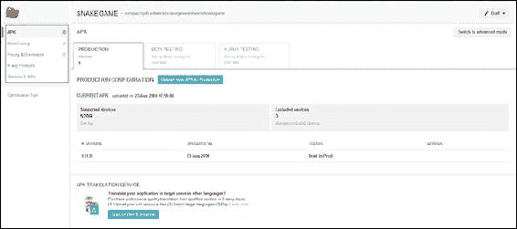

1.  我们需要做的下一件事是配置我们的商店列表，所以点击**商店列表**链接，就在 APK 链接下面。

1.  写一个简短的描述和一个长描述。还要上传你的屏幕截图、特色图形和高分辨率图标。

1.  在**应用程序类型**下拉菜单中，选择**游戏**。在**类别**下拉菜单中，**街机**可能是最合适的。对于**内容评级**，选择**所有人**，对于**隐私政策**，点击**此时不提交隐私政策**的复选框。

1.  将您的网站和电子邮件地址添加到相应的框中。

1.  回到网页顶部，点击**保存**按钮。

1.  现在我们已经到达本指南的最后阶段。点击**定价和分发**链接。它就在第 13 步的**商店列表**链接下面。

1.  点击页面顶部的**免费**按钮。

1.  点击您希望您的游戏在其中列出的所有国家的复选框。

1.  滚动到页面底部，点击**内容指南**和**美国出口法**的复选框。

1.  点击页面顶部的**保存**。

1.  最后，从页面右上角的**准备发布**下拉菜单中，点击**发布此应用程序**，然后您就完成了。

恭喜！您的游戏将在 5 分钟至 24 小时之间在 Google Play 上线。

# 推广您的应用程序

在这个阶段的诱惑是坐下来等待我们的游戏登顶畅销应用。这永远不会发生。

为了确保我们的应用程序发挥其全部潜力，我们需要不断进行以下操作：

改进它

我们已经对*Snake*游戏进行了很多改进，但还有许多其他改进，比如难度设置、音乐、调试（您有没有看到偶尔有点不稳定的身体段？）、设置菜单等等。您可以支付专业人员设计背景和精灵，或者添加更多音效。当您进一步提高您的 Android 和 Java 技能时，您可以使用更流畅的引擎重新编写整个游戏，并称其为版本 2。

**推广它**

这可能是另一本书的主题，但我们可以通过很多方式来宣传我们的应用。我们可以在所有社交媒体网站上创建页面/个人资料，比如 Facebook、Twitter、Flickr 等等。定期更新、公告、挑战（参见强迫）。我们可以创建一个网站来推广我们的应用，并以所有我们推广任何其他网站的方式来推广它。我们可以在应用程序本身中添加一条消息，要求玩家对其进行评分，也许在他们获得高分或成就后弹出一条消息。我们可以要求我们认识的每个人和访问我们社交媒体/网站的每个人给予评分并留下评论。还有许多其他推广应用的方式。它们的秘诀是：不断地进行。例如，不要创建一个 Facebook 页面然后期望它自行流行起来。不断增加所有推广渠道。

**保持玩家的强迫水平**

除了以我们简要提到的方式改进游戏之外，我们需要给玩家一个有力的理由继续回到我们的游戏。一种方法可能是添加新的关卡。例如，在我们的*贪吃蛇*游戏中实现关卡不难。每个关卡可以在不同的地方设置墙壁，布局可以变得越来越具有挑战性。我们需要做的就是制作一个障碍物数组，将它们绘制在屏幕上，并检测碰撞。然后为每个关卡设置蛇长度的目标，当达到目标时进入下一个关卡。

我们可以提供不同的蛇设计来解锁特定挑战。玩家可以将他们收集的所有苹果保存为一种货币，然后有策略地花费这种货币来获得在死后继续的机会，这怎么样？

提供限时挑战怎么样？例如，本月底完成第 10 关以获得一千个额外的苹果。也许，我们可以想出更多苹果可以用来消费的东西。酷炫的蛇配饰或只能用苹果解锁的关卡。关键是所有这些强迫力都可以在我们上传改进的同时添加和更新。在这次讨论中提到的关于强迫力的任何事情都不是我们迄今为止学到的技能无法实现的。

可能，我们可以为我们的游戏增加的最引人入胜的方面是在线排行榜和成就，这样玩家可以将自己与朋友和全世界的其他玩家进行比较。谷歌意识到了这一点，并已经做了很多工作，使向游戏中添加排行榜和成就变得尽可能容易。我们将看看我们如何再次利用其他人的辛勤工作。

而且，玩家在游戏中获得的所有成就都会被记录在他们的 Google Play 个人资料中。这是我相当糟糕的 Google Play 成就个人资料的截图：


你可能已经注意到了一些*贪吃蛇*成就。这个功能使你的游戏可能更加引人入胜。

### 提示

让我们进行一个快速的现实检查——我并不是在建议你花费大量时间来尝试将我们的谦逊的贪吃蛇游戏变成一个真正的业务。它只是作为一个讨论的有用例子。此外，如果我们能为一个如此古老和简单的游戏想出这么多点子，那么我们肯定可以为一个我们热爱的游戏想出一些真正令人惊叹的东西。当你有一个你热爱的想法时，那就是去扩展我们讨论过的简短营销计划的时候了。

# 添加排行榜和成就

所以我们知道为什么排行榜和成就是一件好事。我们需要做的第一件事是规划我们的成就。排行榜就是一个高分榜，就是这样！我们无法做太多事情来使它们不同。然而，成就值得讨论一番。

## 规划贪吃蛇成就

起初，似乎一个非常简单的游戏，比如我们的*蛇*游戏，实现起来并不深刻，可能没有很多，甚至没有任何成就。接下来是一个快速的头脑风暴会话，关于成就的想法：

+   **得分 10、25、50、100 等等**：简单地在不同水平的高分解锁成就。

+   **蛇长度**：简单地在不同的蛇长度解锁成就。

+   **食人族**：第一次玩家与自己的尾部碰撞时解锁成就。

+   **总共收集 x 个苹果**：记录所有收集的苹果，并在重要的里程碑上解锁成就。

+   **玩 10、25、50、100 场比赛**：奖励玩家继续前进。无论他们输赢，都会因努力而解锁成就。

+   **寻宝**：如果每个游戏中都有一个隐藏的地点怎么办？这可能会给玩家一个探索每个级别的理由。他们可以获得积分和苹果的奖励。然后他们可以解锁真正的成就，也许是每发现 5、10 或 20 个隐藏地点。

一些成就表明我们需要记录玩家的进度。令人惊讶的是，Google Play 游戏服务实际上可以为我们做到这一点。这些被称为递增成就。总共收集的苹果数量就是递增成就的一个很好的例子。其他，比如蛇长度，只取决于玩家在任何一场比赛中的表现。

我们将实现总苹果数和蛇长度成就，以便了解如何实现这两种类型。

我们可以为达到以下每个蛇长度设定五个成就：5、10、20、35 和 50。还可以为总苹果数设定五个递增成就。具体来说，玩家将在收集 10、25、50、100、150 和 250 个苹果时获得成就。很快，我们将看到如何做到这一点。

最后，我们需要决定每个成就的价值，每个游戏的上限为 1,000 点。由于我可能会回来添加更多成就，我打算将 250 点分配给苹果的成就，就像这样：

| 吃掉的苹果数量 | 成就点数 |
| --- | --- |
| 10 | 10 |
| 20 | 30 |
| 50 | 40 |
| 100 | 70 |
| 250 | 100 |

我还将在下表中分配 250 点给蛇长度成就，如下所示：

| 蛇的长度 | 成就点数 |
| --- | --- |
| 5 | 10 |
| 10 | 30 |
| 25 | 40 |
| 35 | 70 |
| 50 | 100 |

一旦您了解如何在代码和开发者控制台中实现这些成就，设计和实现您自己的不同成就将会相当简单。

## 逐步排行榜和成就

这可能是完成本书最长的部分。但是，一旦您完成了这个过程，下次再做就会容易得多。

### 在您的 PC 上安装 Google Play 服务 API

首先，我们需要添加使用游戏服务类所需的工具和库。这在 Android Studio 中非常简单：

1.  点击 Android Studio 工具栏中的 SDK 管理器图标：

1.  SDK 管理器将启动。它看起来有点像这样：

1.  滚动到最底部，在**额外**下面，您会看到**Google Play 服务**。通过点击下面的截图中显示的突出显示的框来勾选它：

1.  现在点击**Google 存储库**复选框，就在**Google Play 服务**下面。

1.  点击**安装软件包**，等待软件包下载和安装。

1.  保存您的项目并重新启动 Android Studio。

我们现在已经安装了开始开发 Google Play 游戏服务应用所需的工具。接下来，我们需要设置我们的开发者控制台，以便与我们的应用进行通信，为我们即将编写代码的功能做好准备。

### 配置 Google Play 开发者控制台

在这里，我们将通过创建一个新的游戏服务应用来准备您的开发者控制台。这可能听起来有点违反直觉；毕竟，Snake 就是我们的应用，不是吗？是的，但 Google Play 的结构是这样的，您需要创建一个游戏服务应用，实际的游戏（在这种情况下是 Snake）将与该应用进行通信。游戏服务应用将拥有我们将从 Snake 游戏中授予和显示的成就和排行榜：

1.  登录到[`play.google.com/apps/publish/`](https://play.google.com/apps/publish/)的 Google Play 开发者控制台。

1.  点击网页左侧的**游戏服务**选项卡。

1.  现在点击**添加新游戏**按钮。

1.  将`Snake`输入为游戏名称，并从**类别**下拉菜单中选择**街机**。现在点击**继续**。所有这些都显示在下一个截图中：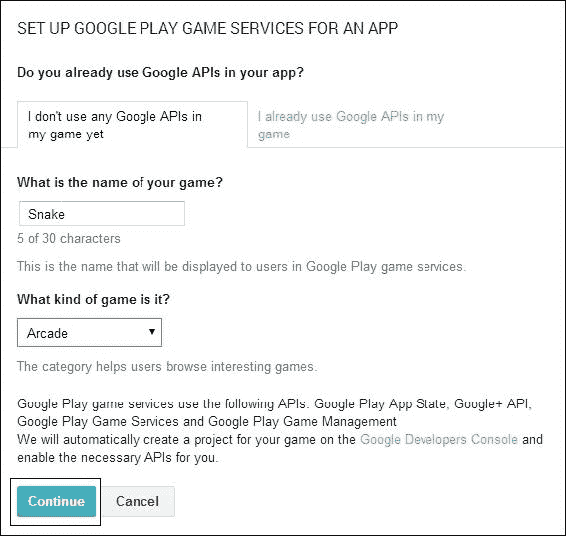

1.  现在我们可以配置我们的游戏。在**描述**字段中输入游戏描述，并添加与上传游戏时添加的相同的高分辨率图标和特色图形。

1.  点击屏幕顶部的**保存**按钮。

1.  现在我们将把 Snake 游戏服务应用与我们实际的*Snake*游戏进行关联。在网页左侧，点击**已关联的应用**选项卡。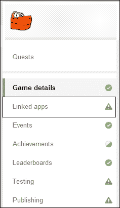

1.  Google Play 游戏服务可以与几乎任何平台一起使用，甚至是苹果。我们在这里使用它来开发 Android 应用，所以点击**Android**按钮。

1.  在这个屏幕上，我们只需要点击**包名称**搜索框，然后点击我们的**Snake 游戏**选项。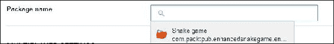

1.  点击屏幕顶部的**保存并继续**。

1.  我们接近这个阶段的结束。点击**立即授权您的应用**并查看信息。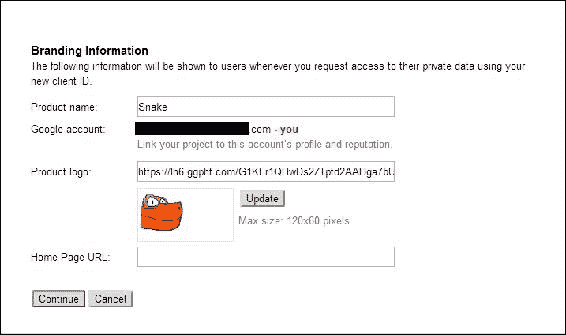

1.  最后，点击**继续**。

我们现在已经设置了一个 Google 游戏服务应用，并与我们的*Snake*游戏进行了关联。

### 在 Google Play 开发者控制台中实现排行榜

现在我们需要在开发者控制台中创建我们的排行榜，以便稍后在我们的 Java 代码中与之交互：

1.  登录到您的开发者控制台。

1.  点击**游戏服务**，然后点击**Snake**，然后点击**排行榜**。

1.  现在点击**添加排行榜**。这是**新排行榜**屏幕：

1.  这可能看起来像是一项漫长的任务，但我们只需要在**名称**字段中输入一个名称（`Snake`就可以了），然后就完成了。可能会觉得奇怪为我们的排行榜输入一个名称，但这是因为一个游戏可以有多个排行榜。

1.  阅读所有选项。您会发现它们对我们来说都是合适的，不需要进一步操作。点击**保存**。

我们的排行榜现在已准备好与我们的*Snake*应用进行通信。

### 在 Google Play 开发者控制台中实现成就

在这里，我们将在开发者控制台中设置我们之前讨论过的成就。

您可能希望准备一些图形来代表这些成就。它们需要每个 512 x 512 像素。或者，您可以使用一个放大的苹果位图，也许是一个蛇身段，分别用于苹果和蛇长度成就：

1.  登录到开发者控制台。点击**游戏服务**，然后点击**蛇**，再点击**成就**。

1.  点击**添加成就**，你将看到**新成就**屏幕：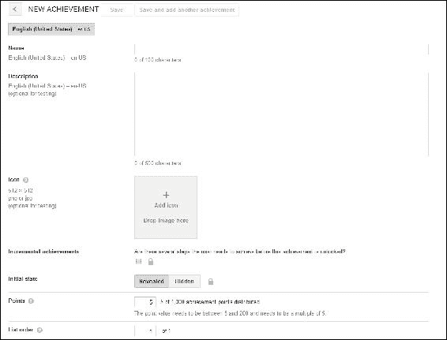

1.  因为我们正在实施增量苹果成就，首先要做的是在**新成就**表单中输入内容。在**名称**字段中输入`苹果食客 1`。

1.  在**描述**字段中输入`吃掉 10 个苹果`。

1.  点击**添加图标**按钮，并选择你喜欢的 512 x 512 图像。

1.  点击**增量成就**复选框，并在**需要多少步骤**字段中输入`5`。这是因为第一个成就是吃掉 5 个苹果。此步骤显示在下一个截图中：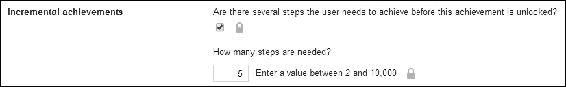

1.  在**点数**字段中输入`10`。

1.  点击**保存**，并重复步骤 2 到 7 四次，为所有苹果成就变化**名称**、**描述**、**需要多少步骤**和**点数**字段，根据我们的计划和成就数值表。

1.  现在我们可以继续进行蛇长度成就。点击**新成就**。在**名称**字段中输入`超级蛇 1`。

1.  在**描述**字段中输入`让你的蛇长到 5 节`。

1.  点击**添加图标**按钮，并浏览到你喜欢的图片。

1.  最后，在**点数**字段中输入`10`。

1.  点击**保存**，并重复步骤 9 到 13 四次，为每个蛇长度成就变化**名称**、**描述**和**点数**字段，根据我们的计划和成就数值表。

我们现在已经设置好了成就，准备在代码中实施。

### 设置好蛇项目以准备实施

在本节中，我们将准备我们的应用与 Google Play 服务器通信：

1.  将这段高亮代码添加到`AndroidManifest.xml`文件中，就在闭合的`</application>`标签之前：

```java
<meta-data android:name="com.google.android.gms.games.APP_ID"
 android:value="@string/app_id" />
<meta-data android:name="com.google.android.gms.version"
 android:value="@integer/google_play_services_version"/>

</application>
```

1.  在项目资源管理器中的`values`文件夹中创建`ids.xml`文件。现在你需要获取你的游戏的唯一代码放入这个文件中。登录到开发者控制台，点击**游戏服务**，然后点击**蛇**。现在点击**成就**。

1.  在你的成就列表下方有一个小的**获取资源**链接：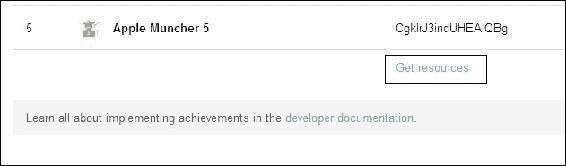

1.  点击**获取资源**链接。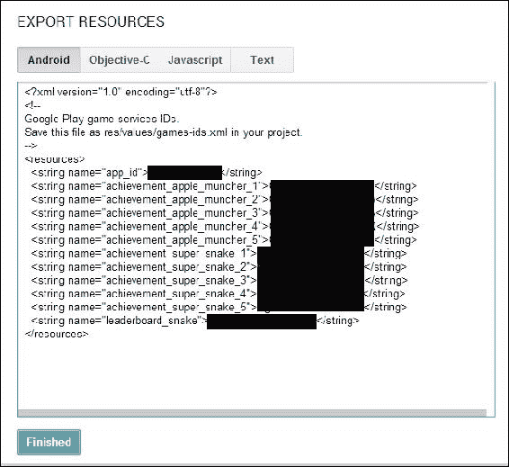

1.  复制并粘贴代码到`ids.xml`文件中。然后点击开发者控制台中的**完成**按钮。

1.  现在我们需要从 Google Play 游戏服务 GitHub 存储库中获取四个代码文件。我们将直接复制并粘贴这些文件到我们的项目中。

1.  在`java`文件夹中创建三个新的空文件。在项目资源管理器中右键点击**GameActivity**，然后导航到**新建** | **Java 类文件**。将新文件命名为`BaseGameActivity`。重复此步骤，将文件命名为`GameHelper`。再重复一次，将文件命名为`GameHelperUtils`。

1.  现在我们将获取 Java 代码，复制到我们刚刚创建的三个文件中。要获取`BaseGameActivity.java`的代码，请访问[`github.com/playgameservices/android-basic-samples/tree/master/BasicSamples/libraries/BaseGameUtils/src/main/java/com/google/example/games/basegameutils`](https://github.com/playgameservices/android-basic-samples/tree/master/BasicSamples/libraries/BaseGameUtils/src/main/java/com/google/example/games/basegameutils)，在那里你可以看到进一步链接到我们在步骤 7 中创建的三个文件的代码：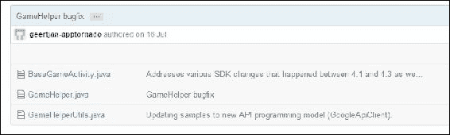

1.  点击**BaseGameActivity.java**，如前面的截图所示。选择所有代码，然后复制粘贴到我们在 Android Studio 中创建的同名文件中。请注意，当我们创建文件时，Android Studio 创建了一些基本模板代码。我们需要删除所有这些代码，除了顶部的包名。当我们粘贴复制的代码时，需要删除 Google 的包名。

1.  点击**GameHelper.java**，如前面的截图所示，并重复第 9 步。

1.  点击**GameHelperUtils.java**，如前面的截图所示，并重复第 9 步。

1.  还有一个文件要创建。在项目资源管理器中右键单击**values**文件夹。导航到**New** | **File**。将文件命名为`gamehelper_strings.xml`。

1.  以与前三个 Java 文件相同的方式获取此文件所需的代码，但是从此链接获取：[`github.com/playgameservices/android-basic-samples/blob/master/BasicSamples/libraries/BaseGameUtils/src/main/res/values/gamehelper_strings.xml`](https://github.com/playgameservices/android-basic-samples/blob/master/BasicSamples/libraries/BaseGameUtils/src/main/res/values/gamehelper_strings.xml)。

1.  将代码粘贴到我们在第 12 步中创建的`gamehelper_strings.xml`中。

1.  现在修改`MainActivity.java`文件中的`MainActivity`声明。

考虑一下这段代码：

```java
public class MainActivity extends Activity {
```

将其更改为以下代码，这样我们现在可以扩展处理游戏服务 API 的 Activity 版本：

```java
public class MainActivity extends BaseGameActivity {
```

1.  现在查看`GameActivity.java`文件中的代码：

```java
public class GameActivity extends Activity {
```

将前面的代码更改为以下代码，这样我们现在可以扩展处理游戏服务 API 的 Activity 版本：

```java
public class GameActivity extends BaseGameActivity {
```

1.  注意，对于这两个 Activity，我们在刚刚输入的类声明中有一个错误。如果将鼠标悬停在我们在上一步中输入的代码上，就可以看到错误的原因。我们需要实现一些我们正在使用的类的抽象方法。回想一下第六章中的内容，OOP – *使用他人的辛勤工作*，如果一个类中的方法被声明为抽象的，那么扩展它的类必须实现它。这就是我们！现在先进行一个空的实现。右键单击带有错误的代码行，导航到**Generate** | **Implement Methods**。现在点击**OK**。对`MainActivity.java`文件和`GameActivity.java`文件执行此步骤。我们的空方法现在已经准备好了。我们将在下一个教程中编写代码。

1.  接下来，使用项目资源管理器找到`build.gradle`文件。要小心，有两个同名的文件。我们需要找到的文件在`AndroidManifest.xml`文件的下面几行。在下一个截图中有高亮显示。双击`build.gradle`文件打开它：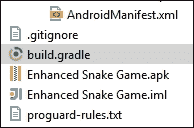

1.  找到这里显示的代码部分，并添加高亮显示的行。这样我们在上一篇指南中下载的所有类都可以在我们的*Snake*游戏中使用：

```java
dependencies {
    compile 'com.google.android.gms:play-services:+'
    compile 'com.android.support:appcompat-v7:+'
    compile fileTree(dir: 'libs', include: ['*.jar'])
}
```

好的，我同意那是一个相当艰难的教程，但是现在我们已经准备好在三个最后步骤中实现我们的代码了：

1.  玩家登录和按钮。

1.  排行榜。

1.  成就。

然后我们就可以上传我们更新的应用程序并使用我们的新排行榜和成就了。

### 实现玩家的登录、成就和排行榜按钮

通过本节结束时，玩家将能够通过游戏登录到我们的空排行榜和成就。接下来的指南将使排行榜和成就真正起作用。

1.  首先，让我们启用游戏服务。到目前为止，在开发者控制台中所做的所有工作都需要在我们可以使用它之前发布。登录到您的开发者控制台。导航至**游戏服务** | **Snake** | **准备发布** | **发布游戏**。然后会显示一个**发布您的游戏**按钮。点击它。最后，阅读简要的免责声明，然后点击**立即发布**。

1.  现在我们需要构建一个具有**登录**、**登出**、**排行榜**和**成就**按钮的 UI。打开`layout_main.xml`文件，并在编辑器窗口的**文本**选项卡上通过添加以下代码进行编辑。显然，需要输入很多内容。您可能希望从`Chapter9\EnhancedSnakeGame\layout`的下载包中复制并粘贴代码。以下是代码。输入或复制并粘贴它：

```java
<RelativeLayout 

    android:layout_width="match_parent"
    android:layout_height="match_parent"
    android:paddingLeft="@dimen/activity_horizontal_margin"
    android:paddingRight="@dimen/activity_horizontal_margin"
    android:paddingTop="@dimen/activity_vertical_margin"
    android:paddingBottom="@dimen/activity_vertical_margin"
    tools:context="com.packtpub.enhancedsnakegame.enhancedsnakegame.MainActivity">

    <Button

        android:id="@+id/llPlay"
        android:layout_width="140dp"
        android:layout_height="wrap_content"
        android:text="Leaderboards"
        android:layout_alignParentBottom="true"
        android:layout_alignParentRight="true"
        android:layout_alignParentEnd="true"
        android:visibility="gone"/>

    <Button
        android:id="@+id/awardsLink"
        android:layout_width="140dp"
        android:layout_height="wrap_content"
        android:text="Achievements"
        android:layout_gravity="center_vertical"
        android:layout_alignTop="@+id/llPlay"
        android:layout_toLeftOf="@+id/llPlay"
        android:visibility="gone"/>

    <!-- sign-in button -->
    <com.google.android.gms.common.SignInButton
        android:id="@+id/sign_in_button"
        android:layout_width="140dp"
        android:layout_gravity="center_horizontal"
        android:layout_height="wrap_content"
        android:layout_alignParentTop="true"
        android:layout_alignParentRight="true"
        android:layout_alignParentEnd="true"
         />

    <!-- sign-out button -->
    <Button
        android:id="@+id/sign_out_button"
        android:layout_width="140dp"
        android:layout_height="wrap_content"
        android:text="Sign Out"
        android:layout_alignParentTop="true"
        android:layout_alignParentRight="true"
        android:layout_alignParentEnd="true"
        android:layout_gravity="center_horizontal"
        android:visibility="gone"
        />

</RelativeLayout>
```

1.  逐行解释代码超出了本书的范围，但这与我们在第二章*开始使用 Android*时使用 UI 设计器自动生成的代码并没有太大不同。上一步中的代码块中的每个代码块定义了一个按钮及其在屏幕上的位置。您可以切换到设计选项卡并移动按钮以适应自己。请注意，设计师中某些按钮不可见的原因是它们在玩家登录之前是隐藏的。我们之所以这样做的原因是为了确保我们以恰当的方式实现登录按钮。请注意每个按钮的`id`属性。接下来我们将在我们的 Java 代码中操作它们。将一些按钮设置为`visibility = gone`后，我们看到类似以下内容：

1.  将一些按钮设置为`visibility = visible`后，我们看到类似以下截图所示的内容：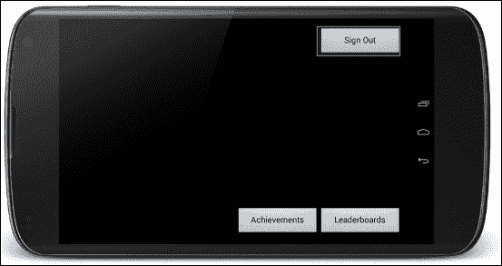

1.  您可能会想知道为什么我们要设计一个 UI，而`SnakeAnimView`是用户看到的内容。我们本可以使用位图实现所有自己的按钮，并使用它们的屏幕坐标来检测按压，但现在我们将在`SnakeAnimView`上加载我们的 UI，这将大大简化事情。切换到编辑器窗口中的**MainActivity**选项卡。

1.  首先，我们想要实现`onClickListener`接口来处理我们的按钮点击。为实现这一点，将类声明更改为以下内容：

```java
public class MainActivity extends BaseGameActivity implements View.OnClickListener{
```

1.  现在，我们可以通过右键单击类声明，导航至**添加** | **实现方法**，然后点击**确定**，让 Android Studio 快速实现所需的`onClick`方法。

1.  在上一行代码之后，我们立即声明了我们的四个新按钮。在上一步中的代码之后添加此代码：

```java
//Our google play buttons
    Button llPlay;
    Button awardsLink;
    com.google.android.gms.common.SignInButton sign_in_button;
    Button sign_out_button;
```

1.  在`onCreate`方法中，在调用`setContent`视图之后，我们使用`LayoutInflater`类的对象在我们的`SnakeAnimView`上加载我们的 UI。在调用`setContentView`之后添加突出显示的代码：

```java
setContentView(snakeAnimView);

 //Load our UI on top of our SnakeAnimView
 LayoutInflater mInflater = LayoutInflater.from(this);
 View overView = mInflater.inflate(R.layout.activity_main, null);
 this.addContentView(overView, new ViewGroup.LayoutParams(ViewGroup.LayoutParams.MATCH_PARENT, ViewGroup.LayoutParams.MATCH_PARENT));

```

1.  在上一步中的代码之后，我们可以引用所有的按钮并以通常的方式监听点击：

```java
//game services buttons
        sign_in_button = (com.google.android.gms.common.SignInButton)findViewById(R.id.sign_in_button);
        sign_in_button.setOnClickListener(this);
        sign_out_button = (Button)findViewById(R.id.sign_out_button);
        sign_out_button.setOnClickListener(this);
        awardsLink = (Button) findViewById(R.id.awardsLink);
        awardsLink.setOnClickListener(this);
        llPlay = (Button)findViewById(R.id.llPlay);
        llPlay.setOnClickListener(this);
```

1.  请记住，在上一篇指南中，当我们扩展`BaseGameActivity`类时，我们覆盖了两个抽象方法。现在我们将在它们的实现中放入一些代码。代码非常简单。当登录失败时，我们隐藏登出按钮并显示登录按钮；当登录成功时，我们隐藏登录按钮并显示其他三个按钮。以下是这两种方法的全部内容。在所示的方法中输入突出显示的代码：

```java
@Override
    public void onSignInFailed() {
        // Sign in failed. So show the sign-in button.
 sign_in_button.setVisibility(View.VISIBLE);
 sign_out_button.setVisibility(View.GONE);
    }

    @Override
    public void onSignInSucceeded() {
        // show sign-out button, hide the sign-in button
 sign_in_button.setVisibility(View.GONE);
 sign_out_button.setVisibility(View.VISIBLE);
 llPlay.setVisibility(View.VISIBLE);
 awardsLink.setVisibility(View.VISIBLE);
    }
```

1.  现在我们处理`onClick`方法以及玩家点击我们四个按钮中的任何一个时会发生什么。首先，我们输入我们的 switch 块的代码。我们将在下一步填写`case`语句：

```java
switch (v.getId()) {

}
```

1.  在这里，我们处理登录按钮。我们只需调用`beginUserInitiatedSignIn`方法。这在`BaseGameActivity`类中已经为我们实现了。在前一步的`switch`块中输入这段代码：

```java
    case R.id.sign_in_button:
                // start the sign
                beginUserInitiatedSignIn();
                break;
```

1.  现在我们处理玩家登出时会发生什么。我们只需调用`signOut`，这在`BaseGameActivity`类中已经为我们实现了。然后隐藏所有按钮，再次显示登录按钮。在上一步的代码后面输入以下代码：

```java
case R.id.sign_out_button:
                // sign out.
                signOut();

                // show sign-in button, hide the sign-out button
                sign_in_button.setVisibility(View.VISIBLE);
                sign_out_button.setVisibility(View.GONE);
                llPlay.setVisibility(View.GONE);
                awardsLink.setVisibility(View.GONE);
                break;
```

1.  接下来，我们处理玩家点击成就按钮时会发生什么。一行代码为我们提供了所有成就功能。这就是面向对象编程的全部意义——别人的辛勤工作为我们做了一切。在前面的代码后面输入这段代码：

```java
case R.id.awardsLink:

                startActivityForResult(Games.Achievements.getAchievementsIntent(getApiClient()), 0);

                break;
```

1.  最后，我们处理了玩家点击**排行榜**按钮时会发生什么。再次，一行代码为我们提供了所有排行榜的功能：

```java
case R.id.llPlay:
                        startActivityForResult(Games.Leaderboards.getLeaderboardIntent(getApiClient(), getResources().getString(R.string.leaderboard_snake)),0);
                        break;
```

我们在进行时解释了代码，但让我们总结一下：

1.  我们设计了一个简单的用户界面。

1.  我们在`SnakeAnimView`上加载了用户界面。

1.  我们得到了对我们的四个按钮的引用，并监听了点击事件。

1.  我们处理了当人们点击我们的按钮时会发生什么，这只不过是根据需要隐藏和显示按钮，从`BaseGameActivity`调用方法，并使用`Intent`类来实现我们所有的排行榜和成就功能。

你实际上可以运行*Snake*游戏并查看排行榜和成就界面。当然，此时还没有人有任何成就或高分。我们现在将修复这个问题。

### 在代码中实现排行榜

再次，我们将见证使用其他人设计良好的代码的简单性。诚然，要达到这一点确实有一些复杂性，但一旦你设置好了，那么你下一个游戏将只需要花费你设置的一小部分时间：

1.  我们希望在游戏结束时向`排行榜`提交分数。Google Play 将处理检查是否为高分。Google Play 甚至会确定这是否是本周或本月的新高分。在代码编辑器窗口中打开`GameActivity.java`文件。

1.  找到`updateGame`方法，并在游戏结束时（当`dead`等于`true`时）在所有其他操作中添加高亮显示的代码。我们只需在检查中包装一行代码，以确保当前玩家已登录：

```java
if(dead){
 if (isSignedIn()) {
 Games.Leaderboards.submitScore(getApiClient(),
 getResources().getString(R.string.leaderboard_snake), 
 score);
 }

```

1.  就是这样！构建游戏并在真正的 Android 设备上玩游戏。现在你可以访问 Google Play 上的排行榜，看到你的最高分。

这很简单。在这里，我们可以看到登录界面：

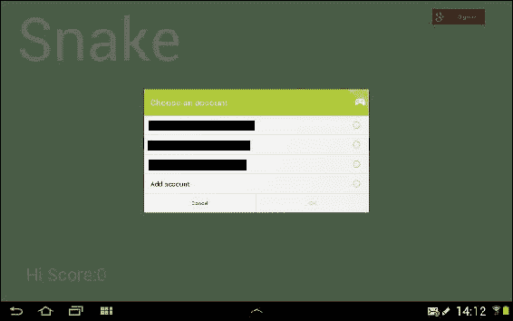

然后是欢迎消息和我们的**成就**和**排行榜**按钮，如下截图所示：


最后，我们可以看到我们的新排行榜只有一个玩家——我。

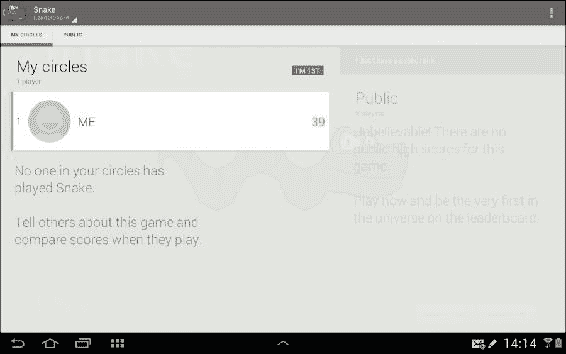

以防你想知道，我可以做得比 39 好得多。

### 在代码中实现成就

这个简短的教程首先会设置我们的游戏，以便发布苹果成就的增量更新和蛇段长度的一次性成就：

1.  在`GameActivity.java`文件中，在类声明后添加一个`applesMunchedThisTurn`变量，如下所示：

```java
public class GameActivity extends BaseGameActivity {

    int applesMunchedThisTurn;
```

1.  找到`updateGame`方法。

1.  每次吃一个苹果时，添加一行代码来增加`applesMunchedThisTurn`，在显示的地方添加高亮显示的代码行：

```java
//Did the player get the apple
            if(snakeX[0] == appleX && snakeY[0] == appleY){
                applesMunchedThisTurn++;
                //grow the snake
                snakeLength++;
                //replace the apple
                getApple();
                //add to the score
                score = score + snakeLength;
                soundPool.play(sample1, 1, 1, 0, 0, 1);
            }
```

1.  注意我们将这一突出显示的行放在了玩家死亡时执行的代码中（`if(dead)`块）。我们可以在玩家吃苹果的时候做这件事，但是如果我们每次玩家吃苹果时向 Google Play 服务器发送五条消息，我们可能会冒着被 Google 认为是垃圾邮件的风险。我们只是通过已吃的苹果数量逐个增加每个成就，然后将`applesMunchedThisTurn`变量重置为零。我们在成就方法调用中加入了一个检查，即玩家已登录并且`applesMunchedThisTurn`大于零。现在添加突出显示的代码：

```java
if(dead){
//start again
if (isSignedIn())
if(applesMunchedTisTurn > 0){//can't increment zero
    Games.Achievements.increment(getApiClient(), getResources().getString(R.string.achievement_apple_muncher_1), applesMunchedThisTurn);
 Games.Achievements.increment(getApiClient(), getResources().getString(R.string.achievement_apple_muncher_2), applesMunchedThisTurn);
 Games.Achievements.increment(getApiClient(), getResources().getString(R.string.achievement_apple_muncher_3), applesMunchedThisTurn);
 Games.Achievements.increment(getApiClient(), getResources().getString(R.string.achievement_apple_muncher_4), applesMunchedThisTurn);
 Games.Achievements.increment(getApiClient(), getResources().getString(R.string.achievement_apple_muncher_5), applesMunchedThisTurn);
 applesMunchedThisTurn = 0;
}//end if(applesMunchedThisTurn > 0)

    Games.Leaderboards.submitScore(getApiClient(), getResources().getString(R.string.leaderboard_snake),score);

}//end if(isSignedIn)
               soundPool.play(sample4, 1, 1, 0, 0, 1);
                score = 0;
                getSnake();

            }

        }
```

1.  现在我们将处理分段长度成就。在`updateGame`方法中，在玩家吃苹果时执行的代码部分，就在增加`snakeLength`的代码行之后，我们测试是否达到了任何值得获得超级贪吃蛇成就的长度。当达到所需长度（5、10、25、35 或 50 段）时，我们要求 Google Play 授予它（如果尚未授予）。我们在成就方法调用中加入了一个检查，即玩家已登录并且至少吃了一个苹果。突出显示的代码是要添加的新代码：

```java
//grow the snake
snakeLength++;
if (isSignedIn()){
if(applesMunchedThisTurn > 0) {//can't increment by zero
 //Are we long enough for a new SuperSnake achievement?
 if(snakeLength == 5){
 Games.Achievements.unlock(getApiClient(), getResources().getString(R.string.achievement_super_snake_1));
 }
 if(snakeLength == 10){
 Games.Achievements.unlock(getApiClient(), getResources().getString(R.string.achievement_super_snake_2));
 }
 if(snakeLength == 25){
 Games.Achievements.unlock(getApiClient(), getResources().getString(R.string.achievement_super_snake_3));
 }
 if(snakeLength == 35){
 Games.Achievements.unlock(getApiClient(), getResources().getString(R.string.achievement_super_snake_4));
 }
 if(snakeLength == 50){
 Games.Achievements.unlock(getApiClient(), getResources().getString(R.string.achievement_super_snake_5));
 }
}

```

1.  就是这样！现在你可以玩游戏并获得成就：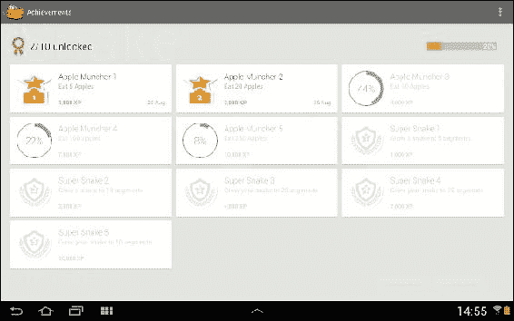

同样，这很简单。你可能可以看到在本章前面讨论的所有其他成就想法要实现起来有多简单。让我们继续更新我们在 Google Play 上的游戏。

### 将更新后的贪吃蛇游戏上传到 Google Play

这很简单，操作如下：

1.  首先，我们需要让 Google Play 知道这是一个新版本。我们通过更改版本号来实现这一点。打开`Build.gradle`文件，找到以下代码行：

```java
versionCode 1
        versionName "1.0"
Change them to the following:
versionCode 2
        versionName "1.1"
```

1.  以通常的方式构建你的 APK。

1.  登录到你的开发者控制台。

1.  点击**贪吃蛇游戏 1.0**，然后点击**APK**，然后点击**上传新 APK 到生产**。

1.  转到你的新更新的 APK。

1.  在**此版本的新功能**字段中输入`添加排行榜和成就`。

1.  点击**立即发布到生产**。

从现在开始，每个下载你的游戏的人都将获得更新的版本。有了我们的第一个游戏，包括精灵表动画、排行榜和成就，是时候休息一下，进行一些理论学习了。

# 接下来呢？

如果这是你的第一次尝试编程，你应该为你迄今为止的创作感到自豪。如果一些概念、语法或项目仍然不清楚，那么考虑休息一下后再重新学习。

我们还没有讨论的一件事是我们需要进一步提高的新技能。这是因为这在很大程度上取决于你最初阅读本书的动机。

## 获得程序员的工作

如果你想成为一名 Java 员工，也就是说，全职在中型或大型公司以专业能力工作，那么你可能需要大学学位，希望这本书能给你一个对编程和 Java 本身世界的一瞥。如果这描述了你，那么在进一步学习时，你可以考虑更正式的 Java 书籍，然后是关于面向对象分析和设计的纯 OOP 书籍。然后你可以继续学习设计模式。

符合这些类别的一些最好的书籍是*Head First Object-Oriented Analysis and Design: A Brain Friendly Guide to OOA&D, Brett McLaughlin and Gary Pollice; Head First Design Patterns*; *Eric Freeman and Elisabeth Robson*, *O'Reilly*; 和 *Design Patterns CD: Elements of Reusable Object-Oriented Software*, *Erich Gamma, Richard Helm, Ralph Johnson, and John Vlissides*, *Addison Wesley*。前两本书非常适合初学者。后者备受推崇，但对初学者来说是一本更具挑战性的阅读。

我猜你之所以选择了一本关于游戏和 Java 的初学者书，很可能不是因为你正朝着那个方向前进，所以让我们来考虑一下到目前为止我们的*巅峰之作*——我们的贪吃蛇游戏。

## 构建更大更好的游戏。

如果你把我们的“贪吃蛇”游戏与现代的专业游戏进行比较，甚至是一个二维游戏，更不用说现代的大型预算第一人称射击游戏（FPS），那么我们仍然有很多需要学习的地方。让我们考虑一下我们的*贪吃蛇*游戏与专业游戏相比的一些不足之处。

想想我们的花朵和尾巴动画。它们之所以有效是因为我们在`controlFPS`方法中建立了一个粗糙的定时系统。但如果我们有十几个或更多需要进行动画处理的游戏对象呢？

那么如果它们都有不同的帧数和帧速率呢？如果一些动画需要在循环中工作，而其他动画需要在每个帧之间倒转再重新开始，我们可以进一步复杂化事情。

现在想象一个角色需要跳跃。当玩家跳跃时，我们如何同步显示的任何帧呢？

实际上，所有这些问题以及更多问题都可以通过快速的网络搜索和一些学习来解决。问题是事情开始变得相当复杂，而我们只谈到了动画。

物理学呢？当我们的未来游戏中的物体弹跳时会有什么行为？我们在“弹球”游戏中能够作弊，因为环境和物体都很少而且简单。如果球是圆的，有很多不同大小和形状的物体，有些移动快，有些静止，我们该如何模拟这个物理模型呢？

答案都在那里，但它们增加了复杂性。其他环境因素如光和阴影呢？当我们的屏幕需要左右滚动时会发生什么？上下呢？

现在考虑所有这些问题，并想象在虚拟的三维世界中实现解决方案。再次强调，解决方案都在那里，但一个决心的初学者可能需要花费数月时间来使用涉及三维计算的原始数学来实现他们自己的解决方案。

接下来，想象一下你希望你的新的三维、基于物理的、动画效果出色的游戏可以在 Android、Apple 和 PC 平台上使用。

如果我打消了你寻找这些解决方案的积极性，但你对找到答案很感兴趣，那么我的建议是去找到答案。这绝对会是一段迷人的旅程，并让你成为一个更好的游戏开发者。然而，在实现任何这些东西时，三思而后行，除非出于好奇心、自我提高或者乐趣之外的任何原因。

原因是因为我们不是第一个遇到这些问题和许多其他问题的人——解决方案已经被实现。猜猜？我们可以使用这些解决方案，通常不需要花费。

例如，有一个名为 OpenGL 的库，它有一个目的——在三维坐标系统中绘制。它有你所需要的一切类和方法。甚至有一个移动版的 OpenGL，叫做 OpenGL ES，你可以用 Java 来编程。的确，OpenGL 本身也有一些复杂性，但可以从简单到困难以逻辑和直接的方式学习。

如果你已经读到了这本书的这一部分，请快速复习一下第六章，“OOP – 使用他人的辛勤工作”，然后获取一本《OpenGL ES2 for Android》，作者 K. Brothaler，Pragmatic Bookshelf 的副本。这本书探讨了代码库以及一些背后的数学知识，因此它应该能够满足对知识好奇和纯粹实用的读者。或者，你可以在[`www.learnopengles.com/`](http://www.learnopengles.com/)上查看大量免费教程。

如果你只是想制作更多的游戏，并且对三维特性并不特别在意，那么下一个合乎逻辑的步骤将是一个基于 Java 的游戏库。有很多，但其中一个特别使用纯 Java 在 Android、iPhone、PC 和 Web 上构建游戏。

事实上，你可以构建一个 Java 游戏，它将在世界上几乎任何设备上运行，甚至是一个网页。它还有一些简化前述 OpenGL ES 使用的类。这个库叫做 LibGDX，我在*学习 Libgdx 游戏开发*（[`www.packtpub.com/game-development/learning-libgdx-game-development`](https://www.packtpub.com/game-development/learning-libgdx-game-development)）中跟着做了一个平台游戏，玩得很开心。LibGDX 还解决了所有我们的动画、滚动和物理难题，而无需任何数学，尽管它实际上并没有涉及三维特性。

### 提示

请注意，这两本书都涉及一些相当深入的面向对象编程，但如果你理解了第六章 *OOP – Using Other People's Hard Work*，并且有决心，这并不是难以掌握的。

如果你想立即进入 3D，那么一个非常有趣的选择就是虚幻引擎。虚幻引擎在许多真正大型预算的游戏中使用，并且可能涉及另一种编程语言中的巨大复杂性。然而，要在 GUI 开发环境中制作二维和三维游戏，它可能是无与伦比的。虚幻引擎 4 使用了一个叫做蓝图的系统，你可以拖放流程图式的元素，而不是编码。它仍然使用了面向对象编程的所有概念，以及循环和分支，但你可以在没有一行*真正*代码的情况下完成大量工作。看看虚幻引擎版本的 Flappy Bird，它是在没有一行代码的情况下创建的，网址是[`play.google.com/store/apps/details?id=com.epicgames.TappyChicken`](https://play.google.com/store/apps/details?id=com.epicgames.TappyChicken)。

虚幻引擎也可以为多个平台构建游戏，但不幸的是，这里有一个小额的月费，而且最具限制性的是，你制作的任何商业项目都将受到协议的约束。在这里，你需要支付 30%给 Epic 游戏，但对于学习和娱乐来说，这可能是无法超越的。

或者，看看我的博客（[www.gamecodeschool.com](http://www.gamecodeschool.com)），我经常添加针对初学者到中级游戏程序员的文章和有趣的游戏构建指南。我的博客讨论了许多不同的编程语言、目标平台，以及之前提到的所有工具，以及更多。

# 自测问题

Q1) 尝试在设备上实现本地高分。

Q2) 有多少著名的计算机科学家在本书的代码中出现过客串？

Q3) 作为最后的挑战，尝试打破我的贪吃蛇排行榜上的最高分。

# 总结

在本章中，我们涵盖了很多内容。我们在 Google Play 上发布了我们的*贪吃蛇*游戏。然后我们添加了一些在线排行榜和成就。我们还更新了我们的出版物。这个过程展示了如何使用 API 将诸如互联网通信之类的非常复杂的任务变得非常简单。

在完成这本书的最后修改时，我看了一段 YouTube 视频，是由软件传奇人物约翰·卡马克（John Carmack）讲的一场讲座。他是*Doom*游戏开发中的关键工程师，该游戏于 1995 年 6 月发布。当他解释说在学校时，他觉得自己错过了技术革命，等到他够大可以工作时，一切都结束了，我不禁笑了起来，他的听众也是如此。

许多技术革命的确已经来临，许多也已经过去。至少，许多早期采用者的机会已经消失。约翰·卡马克解释说，总会有另一个革命就在拐角处。

所以你可能会发展你的技能，并关注下一个大事件。或者，你只是想用任何语言为任何平台编程任何东西，玩得开心。

希望你喜欢我们一起学习 Android 和 Java 的旅程，并且希望你也会继续这个学习之旅。无论你选择什么样的未来道路，我真诚地祝愿你一切顺利。欢迎你来到[www.gamecodeschool.com](http://www.gamecodeschool.com)分享你的经验和知识。这本书的完美续集将于 2015 年中期出版，名为《通过示例学习 Android 游戏编程》。
