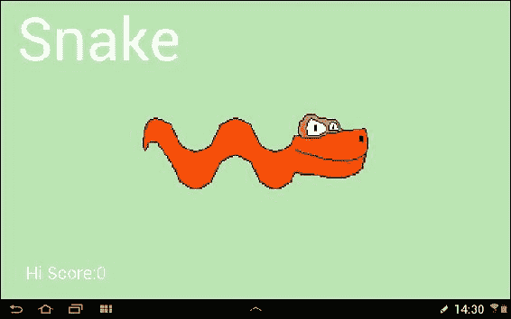
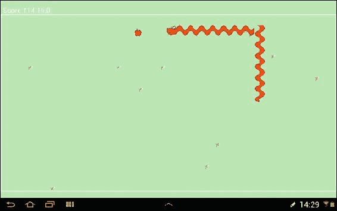

# 附录 A. 自测问题和答案

在这里，我们包含了一些你可以问自己的问题，看看你是否理解了每一章。不要担心！答案也包括在内。

# 第二章

Q1) 如果所有这些关于生命周期、类和方法的讨论让你有点困惑，你应该怎么办？

A) 不要担心它们。理解是一点点来的，如果在这个阶段它们不是完全清楚的，它不会阻碍你彻底学习 Java，随着我们的进展，一切都会变得更清晰。

Q2) 什么是 Java 类？

A) 类是 Java 程序的基本构建块。它们就像我们 Java 代码的容器，我们甚至可以使用其他人的类来简化我们编写的程序，即使没有看到或理解这些类中包含的代码。

Q3) 方法和类之间有什么区别？

A) 方法包含在类中，代表类的特定功能，就像容器中的另一个容器。例如，从游戏中，我们可能有一个`Tank`类，其中包括`shoot`，`drive`和`selfDestruct`方法。我们可以通过制作我们自己的类来使用类及其方法，就像我们将在第六章中所做的那样，或者通过使用`@import`语句，就像我们在本章早些时候所做的那样。

Q4) 查看 Android 开发者网站及其有关生命周期阶段的更多技术解释，网址为[`developer.android.com/reference/android/app/Activity.html`](http://developer.android.com/reference/android/app/Activity.html)。你能看到我们没有讨论过的阶段及其相关的方法吗？在应用程序中它会在什么时候被触发？从创建到销毁，活动会经历怎样的确切路径？

A) 这是重新启动阶段。它对应的方法是`onRestart`。当应用程序停止然后重新启动时，它会被触发。我们在本书中不需要`onRestart`方法，但这个练习有望帮助澄清生命周期的概念。确切的路径会有所不同；我们只需要处理与我们的游戏相关的阶段。到目前为止，我们只是尝试了`onCreate`。

# 第三章

Q1) 这段代码是做什么的？

```java
// setContentView(R.layout.activity_main);
```

A) 什么都没有，因为它被//注释掉了。

Q2) 这些行中哪一行会导致错误？

```java
String a = "Hello";
String b = " Vinton Cerf";
int c = 55;
a = a + b
c = c + c + 10;
a = a + c;
c = c + a;
```

A) 第四行`a = a + b`没有分号，所以会导致错误。最后一行`c = c + a;`也会导致错误，因为你不能将字符串赋给`int`值。

Q3) 我们谈了很多关于运算符以及如何将不同的运算符组合在一起构建复杂的表达式。表达式乍一看有时会让代码看起来复杂。然而，仔细看时，它们并不像看起来那么难。通常，只是将表达式分成较小的部分来弄清楚发生了什么。这里有一个比本书中你会遇到的任何其他东西都更加复杂的表达式。作为挑战，你能计算出`x`会是什么吗？

```java
int x = 10;
int y = 9;
boolean isTrueOrFalse = false;
isTrueOrFalse = (((x <=y)||(x == 10))&&((!isTrueOrFalse) || (isTrueOrFalse)));
```

A) 你可以在代码包的`Chapter3`文件夹中运行`SelfTestC3Q3`项目来在控制台中查看答案，但`isTrueOrFalse`会评估为 true；原因如下。

首先，让我们把这个糟糕的行分解成由括号定义的可管理的部分：

```java
((x <=y)||(x == 10))
```

之前，我们问的问题是，“`x`是否小于或等于`y`，或者`x`是否恰好等于`10`？”。显然，`x`既不等于也不小于`y`，但`x`恰好等于`10`，所以我们在中间使用的逻辑或运算符`||`导致整个表达式评估为`true`。

&&

`&&`运算符的两侧必须都为`true`，整个表达式才为`true`。所以让我们看看另一边：

```java
((!isTrueOrFalse) || (isTrueOrFalse)))
```

好吧，`isTrueOrFalse`是一个布尔值。它只能是真或假，所以表达式的这一部分必须是真，因为我们实质上是在问，“`isTrueOrFalse`是假还是`isTrueOrFalse`是真？”。它必须是其中之一。因此，无论我们如何初始化`isTrueOrFalse`，表达式的最后一部分都将是真。

因此，整个表达式评估为`true`，并且`true`被分配给`isTrueOrFalse`。

# 第四章

Q1）这个方法有什么问题？

```java
void doSomething(){
  return 4;
}
```

A）它返回一个值，但具有`void`返回类型。

Q2）在这段代码片段结束时，`x`将等于多少？

```java
int x=19;
do{
  x=11;
  x++;
}while(x<20)
```

A）好吧，这是一个稍微棘手的问题。无论`x`的值如何，`do`块总是至少执行一次。然后`x`设置为`11`，之后递增为`12`。因此，当评估`while`表达式时，它是真的，`do`块再次执行。再一次，`x`设置为`11`，然后递增为`12`。程序陷入了一个永无止境（无限）的循环。这段代码很可能是一个错误。

# 第五章

Q1）假设我们想要进行一个测验，问题可能是关于总统的名字、首都等。我们如何使用多维数组来实现这一点？

A）我们只需使内部数组保存三个字符串，可能是这样：

```java
String[][] countriesCitiesAndPresidents;
//now allocate like this
countriesAndCities = new String[5][3];
//and initialize like this
countriesCitiesAndPresidents [0][0] = "United Kingdom";
countriesCitiesAndPresidents [0][1] = "London";
countriesCitiesAndPresidents [0][3] = "Cameron";//at time of writing
```

Q2）在我们的持久性示例中，我们将一个不断更新的字符串保存到文件中，以便在应用程序关闭和重新启动后保持。这就像要求用户单击**保存**按钮。在您对第二章的所有知识的基础上，您能想出一种在用户退出应用程序时保存字符串而不是通过按钮点击保存它的方法吗？

A）覆盖`onPause`生命周期方法，并将保存字符串的代码放在其中，就像这样：

```java
@Override
    protected void onPause() {
        editor.putString(stringName, currentString);
        editor.commit();
    }
```

Q3）除了增加难度级别，我们如何使记忆游戏更难？

A）我们可以简单地修改线程执行中的暂停时间，将数字降低，给玩家更少的思考时间，就像这样：

```java
myHandler.sendEmptyMessageDelayed(0, 450);
//This halves the players thinking time
```

Q4）使用普通的 Android UI 和沉闷的灰色按钮并不是很令人兴奋。看看可视化设计师中的 UI 元素。您能想出如何在我们的按钮背景中使用图像吗？

A）只需向`drawable-mdpi`文件夹添加一些`.png`图形，然后在选择按钮时在**属性**窗口中找到背景属性。单击以通常的方式编辑属性，并选择您添加到`drawable-mdpi`文件夹的图形。

# 第六章

Q1）什么是封装？

A）封装是我们以一种方式打包我们的变量、代码和方法，使得我们只向我们想要的应用程序部分（或使用我们类的任何应用程序）公开部分和功能。

Q2）我不太明白这一切，实际上，我现在比章节开始时还有更多问题。我该怎么办？

A）您已经了解足够的面向对象编程知识，可以在游戏和任何其他类型的 Java 编程中取得重大进展。如果您现在急于了解更多面向对象编程知识，那么有很多评价很高的书籍专门讨论面向对象编程。然而，练习和熟悉语法将对实现相同目标产生很大帮助，并且可能更有趣。现在是否急于学习面向对象编程的复杂细节，实际上取决于您的个人目标以及将来想要用编程技能做什么。阅读第九章的最后几页，*使您的游戏成为下一个大事件*，以获取更多讨论。

# 第七章

Q1）球的速度是以像素为单位计算的。不同的设备具有不同数量的像素。您能解释如何使不同屏幕分辨率上的球速度大致相同吗？

A) 适应不同屏幕分辨率的一个简单方法是设计一个系统，考虑屏幕的像素数量。我们已经为球拍和球的大小做到了这一点。我们可以声明一个成员变量，如下所示：

```java
int pixelsPerFrameX;
int pixelsPerFrameY;
```

然后在我们获得屏幕尺寸之后，在`onCreate`中初始化这些变量：

```java
pixelsPerFrameX = screenWidth/50;
pixelsPerFrameY = screenHeight/50;
```

然后我们可以稍微移动我们的球，就像这样：

```java
//moving in adjust our x any positions
            if (ballIsMovingDown) {
                ballPosition.y += pixelsPerFrameX;
            }

            //etc...
```

# 第八章

Q1) 我们的游戏屏幕有什么视觉改进，也许是一个漂亮的浅绿色草地背景，而不仅仅是黑色？

A) 您可以使用大多数图形程序（如 Gimp 或 Photoshop）获取漂亮的浅绿色草地的 RGB 值。或者，您可以使用在线颜色选择器，例如[`www.colorpicker.com/`](http://www.colorpicker.com/)。然后查看我们`drawGame`方法中的这一行：

```java
canvas.drawColor(Color.BLACK);//the background
```

将其更改为以下行：

```java
canvas.drawColor(Color.argb(255,186,230,177));//the background
```

Q2) 在背景中添加一些漂亮的花怎么样？

A) 这是做到这一点的方法。创建一个花位图（或使用我的），在`configureDisplay`方法中加载并按照通常的方式进行缩放。决定绘制多少朵花。在`SnakeView`构造函数中选择并存储板上的位置（或编写并调用一个特殊的方法，也许是`plantFlowers`）。

在`drawGame`方法中的蛇和苹果之前绘制它们。这将确保它们永远不会隐藏苹果或蛇的一部分。您可以在提到的方法中看到我的具体实现，并在`Chapter8`文件夹的`EnhancedSnakeGame`项目中复制花的位图。

Q3) 如果您感到勇敢，可以让花摇摆。想想精灵表。理论上与动画蛇头的理论完全相同。我们只需要几行代码来控制帧速率，与游戏帧速率分开。

A) 查看`controlFPS`方法中的新代码。我们只需为花动画设置一个新的计数器，以便在每六个游戏帧中切换花帧。您还可以从`Chapter8`文件夹中的`EnhancedSnakeGame`项目中复制精灵表。

Q4) 我们可以设置另一个计数器并使用我们的蛇头动画，但这并不是很有用，因为由于尺寸较小，细微的舌头运动几乎不可见。尽管如此，我们可以相当容易地摆动尾部段。

A) 在`Chapter8`文件夹的`EnhancedSnakeGame`项目中有一个两帧尾部位图。由于这也是两帧，我们可以使用与花相同的帧定时器。查看`Chapter8`文件夹中`EnhancedSnakeGame`项目中的实现。唯一需要更改的是`configureDisplay`和`drawGame`。

Q5) 这是一个稍微棘手的增强。您可能已经注意到，当蛇精灵朝着四个可能的方向中的三个方向时，它们看起来不正确。您能修复这个问题吗？

A) 我们需要根据它们的前进方向进行旋转。Android 有一个`Matrix`类，它允许我们轻松旋转位图，而`Bitmap`类有一个重载版本的`createBitmap`方法，它以`Matrix`对象作为参数。

因此，我们可以为我们需要处理的每个角度创建一个矩阵，如下所示：

```java
Matrix matrix90 = new Matrix();
matrix90.postRotate(90);
```

然后我们可以使用以下代码旋转位图：

```java
rotatedBitmap = Bitmap.createBitmap(regularBitmap , 0, 0, regularBitmap .getWidth(), regularBitmap .getHeight(), matrix90, true);
```

另一个问题是，当蛇扭曲和转弯时，我们如何跟踪每个部分的个体方向？我们已经有了一个方向查找方案：0 是向上，1 是向右，依此类推。因此，我们可以为`snakeX`和`snakeY`数组中的身体部分创建另一个方向数组。然后，我们所需要做的就是确保头部有正确的方向，并且在每一帧上从后面更新，就像我们为蛇的坐标所做的那样。您可以在`Chapter8`文件夹的`EnhancedSnakeGame`项目中看到这一实现。

在`Chapter8`文件夹的`EnhancedSnakeGame`项目中有一些更多的增强功能的完成项目。这是我们将在下一章和最后一章中使用的起点版本。您还可以从 Google Play 下载游戏[`play.google.com/store/apps/details?id=com.packtpub.enhancedsnakegame.enhancedsnakegame`](https://play.google.com/store/apps/details?id=com.packtpub.enhancedsnakegame.enhancedsnakegame)。



# 第九章

Q1）尝试在设备上实现本地高分。

A）你已经知道如何做到这一点。如果不确定，只需返回第五章，*游戏和 Java 基础*。该实现也在本章项目的代码中。

Q2）有多少著名的计算机科学家在整本书中的代码中客串出现？

A）9

阿达·洛芙莱斯

查尔斯·巴贝奇

艾伦·图灵

文顿·瑟夫

杰夫·明特

科琳娜·于

安德烈·拉莫特

盖布·纽维尔

西德·梅尔

为什么不在网上搜索一下这些名字？每个人都有一些有趣的故事。
