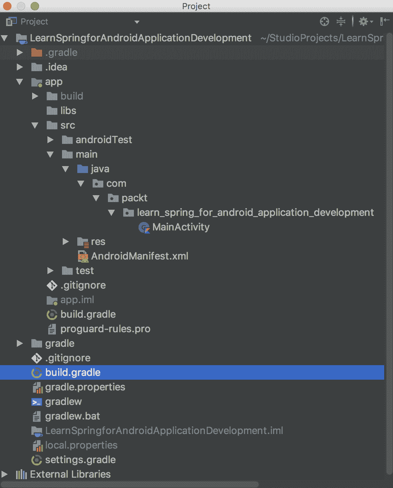

# 第二章：Kotlin 概述

Kotlin 是官方的 Android 编程语言，并且是静态类型的。它与 Java 完全兼容，这意味着任何 Kotlin 用户都可以使用 Java 框架，并且可以无限制地混合 Kotlin 和 Java 的命令。在本章中，我们将介绍 Kotlin 的基础知识，并探讨如何设置环境。我们还将探讨其流程结构，例如 `if { ... } else { ... }` 表达式和循环。此外，我们还将探讨 Kotlin 的面向对象编程，包括类、接口和对象。函数也将被介绍，包括参数、构造函数和语法。

本章将涵盖以下主题：

+   设置环境

+   构建工具

+   基本语法

+   面向对象编程

+   函数

+   控制流程

+   范围

+   字符串模板

+   空安全、反射和注解

# 技术要求

要运行本章中的代码，您只需安装 Android Studio 和 Git 即可。本章不需要任何额外的安装。

您可以在 GitHub 上找到本章的示例，链接如下：[`github.com/PacktPublishing/Learn-Spring-for-Android-Application-Development/tree/master/app/src/main/java/com/packt/learn_spring_for_android_application_development/chapter2`](https://github.com/PacktPublishing/Learn-Spring-for-Android-Application-Development/tree/master/app/src/main/java/com/packt/learn_spring_for_android_application_development/chapter2)。

# Kotlin 简介

Android Studio 的 3.0 版本由 Google 发布，并推广 Kotlin 作为 Android 开发的第一类语言。Kotlin 由 JetBrains 开发，与 Intellij IDEA 平台相同，这是 Android Studio 的基础。这种语言于 2016 年 2 月发布，在发布前已经开发了五年。将项目的代码库从 Java 转换为 Kotlin 很容易，熟悉 Java 的开发者可以在几周内学会 Kotlin。Kotlin 在发布前就已经很受欢迎，因为这种语言功能丰富，并且设计用于与 Java 兼容。以下图表显示了 Kotlin 和 Java 代码是如何编译成相同的字节码的：


如您所见，我们的应用程序的一部分可以用 Java 编写，另一部分可以用 Kotlin 编写。**kotlinc** 编译器将 Kotlin 源代码编译成与 **javac** 编译器相同的字节码。

# 设置环境

要开始 Android 开发，您需要从 [`www.oracle.com/technetwork/java/javase/downloads/index.html`](http://www.oracle.com/technetwork/java/javase/downloads/index.html) 下载并安装 **Java 开发工具包**（**JDK**）。您还需要从 [`developer.android.com/studio/`](https://developer.android.com/studio/) 下载并安装 Android Studio **集成开发环境**（**IDE**）。

要创建一个新的项目，启动 Android Studio 并按下**创建一个新的 Android Studio 项目**。然后，你应该输入项目名称和你的唯一应用程序 ID，如下面的截图所示：


在前面的截图中，**应用程序名称**字段根据本书的名称填写，**公司域名**字段为`packt.com`。Android Studio 将这两个值连接起来，创建一个等于应用程序 ID 标识符的**包名**标识符。在我们的情况下，应用程序 ID 如下所示：

```java
com.packt.learn_spring_for_android_application_development
```

# 构建工具

Android Studio 是 Android 开发的官方 IDE，它基于 IntelliJ IDEA 平台，并使用 Gradle 构建工具系统。一个典型的项目结构如下所示：



`build.gradle`文件包含项目配置并管理库依赖项。要添加对 Spring for Android 扩展的依赖项，我们应该添加以下行：

```java
repositories {
    maven {
        url 'https://repo.spring.io/libs-milestone'
    }
}

dependencies {
    //.......
    implementation 'org.springframework.android:spring-android-rest-template:2.0.0.M3'
}
```

# 基本语法

语法是编程语言的一个重要部分，定义了一组必须应用于符号组合的规则。否则，程序无法编译，将被视为不正确。

本节将描述 Kotlin 的基本语法，包括以下主题：

+   定义包

+   定义变量

+   定义函数

+   定义类

# 定义包

打包是一种机制，允许我们将类、接口和子包分组。在我们的情况下，文件中包的声明可能如下所示：

```java
package com.packt.learn_spring_for_android_application_development
```

文件中的所有公民都属于这个包，并且必须位于适当的文件夹中。

# 定义变量

在 Kotlin 中，我们可以使用`val`关键字定义只读变量，并可以使用`var`关键字定义可变变量。在 Kotlin 中，**变量**可以被定义为第一类公民，这意味着我们不需要创建一个包含变量的类或函数。相反，我们可以直接在文件中声明它们。

以下示例展示了如何定义只读和可变变量：

```java
val readOnly = 3
var mutable = 3
```

# 定义函数

要定义一个函数，我们必须使用`fun`关键字；这也可以被声明为第一类公民。这意味着函数只能在一个文件中定义。我们将在*函数*部分更详细地介绍函数，但就目前而言，让我们看看一个简单的例子，该例子会改变`mutable`变量的值：

```java
fun changeMutable() {
    mutable = 4
}
```

在前面的代码片段中，我们可以看到`changeMutable`函数可以在与`mutable`变量相同的文件中声明为第一类公民，或者在任何其他位置。

# 定义类

要定义一个类，我们必须使用`class`关键字。在 Kotlin 中，所有类默认都是最终的，如果我们想扩展一个类，我们应该使用`open`关键字声明它。一个包含`readOnly`和`mutable`变量以及`changeMutable`方法的类可能看起来像这样：

```java
class Foo {
    val readOnly = 3
    var mutable = 3

    fun changeMutable() {
        mutable = 4
    }
}
```

值得注意的是，作为类成员的函数被称为**方法**。通过这种方式，我们可以明确指定一个函数属于一个类。

# 面向对象编程

**面向对象编程**是一种基于可以表示数据的对象的编程语言模型。Kotlin 以与 Java 相同的方式支持面向对象编程，但更为严格。这是因为 Kotlin 没有原始类型和静态成员。相反，它提供了一个`companion object`：

```java
class Bar {
    companion object {
        const val NAME = "Igor"

        fun printName() = println(NAME)
    }
}
```

`companion object` 是在类初始化期间创建一次的对象。在 Kotlin 中，我们可以像在 Java 中的 `static` 一样引用 `companion object` 的成员：

```java
fun test() {
    Bar.NAME
    Bar.printName()
}
```

然而，在底层，嵌套的 `Companion` 类被创建，我们实际上使用这个类的实例，如下所示：

```java
Bar.Companion.printName();
```

此外，Kotlin 支持以下概念，这使得类型系统更加强大：

+   可空类型

+   只读和可变集合

+   集合没有原始类型

最后一点意味着我们无法编译代码，如下面的截图所示：


这条消息意味着我们必须提供一个泛型来指定此集合的特定类型。

从面向对象编程的角度来看，Kotlin 支持与 Java 相同的功能。这包括封装、继承、多态、组合和委托。它甚至提供了一个语言级别的构造，有助于实现这些概念。

# 函数

要在 Kotlin 中定义一个函数，你必须使用 `fun` 关键字，如下所示：

```java
fun firstClass() {
    println("First class function")
}
```

前面的代码片段演示了我们可以将函数声明为第一类公民。我们还可以将函数定义为类成员，如下所示：

```java
class A {
    fun classMember() {
        println("Class member")
    }
}
```

一个 `local` 函数是在另一个函数中声明的函数，如下所示：

```java
fun outer() {
    fun local() {
        println("Local")
    }

    local()
}
```

在前面的代码片段中，`local` 函数是在 `outer` 函数内部声明的。`local` 函数仅在它们被声明的函数的作用域内可用。如果我们想避免在函数内部重复代码，这种方法可能很有用。

本节将涵盖以下主题：

+   函数式编程

+   高阶函数

+   Lambda

# 函数式编程

Kotlin 特别支持一种函数式风格，允许我们以与变量相同的方式操作函数。这种方法为 Kotlin 带来了许多功能，以及更简洁地描述程序流程的新方法。

本小节将涵盖以下主题：

+   声明式和命令式风格

+   扩展函数

+   Kotlin 中的集合

# 声明式和命令式风格

我们过去在编写面向对象编程时使用命令式编程风格，但对于函数式编程来说，一种更自然的风格是声明式。声明式风格假设我们的代码描述了要做什么，而不是如何做，这与命令式编程的常规做法不同。

以下示例演示了函数式编程在特定情况下如何有用。让我们想象我们有一个数字列表，我们想要找到大于`4`的数字。在命令式风格中，这可能会如下所示：

```java
fun imperative() {
val numbers = listOf(1, 4, 6, 2, 9)
for (i in 0 until numbers.lastIndex) {
if (numbers[i] > 4) {
println(numbers)
        }
    }
}
```

如您所见，我们必须使用大量的控制流语句来实现这个简单的逻辑。在声明式风格中，它可能看起来如下：

```java
fun declarative() {
    println(listOf(1, 4, 6, 2, 9).find { it > 4 })
}
```

前面的代码片段展示了函数式编程的强大功能。这段代码看起来简洁易读。Kotlin 标准库包含许多扩展函数，这些函数扩展了列表类型的功能。

# 扩展函数

Kotlin 的扩展函数特性与函数式编程无关，但最好在继续前进之前解释这个概念。这个特性允许我们通过不使用继承或任何软件设计模式（如装饰者模式），向一个类或类型添加新的功能。

在面向对象编程中，装饰器是一种设计模式，允许我们动态地向一个对象添加行为，而不影响同一类中的其他对象。

在以下代码片段中，`extension`函数被添加到`A`类的功能中：

```java
fun A.extension() {
    println("Extension")
}
```

如您所见，使用这个特性很容易。我们只需要指定一个类名，在点号后面声明一个函数名。现在，我们可以像通常一样调用扩展函数：

```java
fun testExtension() {
    A().extension()
}
```

# Kotlin 中的集合

我们之前看到的`find`函数包含在 Kotlin 标准库的`Collections.kt`文件中。这个文件包含许多扩展函数，这些函数将函数式方法引入 Kotlin，并扩展了 Java 集合的功能，以便简化与之相关的操作。

集合是一系列用于存储和操作一组对象的类和接口的层次结构。

`Collections.kt`文件中最常见的函数如下：

+   `filter`：这个函数返回一个新列表，其中只包含匹配了传入谓词的元素

+   `find`：这个函数返回一个匹配了传入谓词的元素

+   `forEach`：这个函数对每个元素执行一个批准的操作

+   `map`：这个函数返回一个新列表，其中每个元素都根据传入的函数进行了转换

所有这些都被称为高阶函数。

# 高阶函数

如果一个函数可以接收或返回另一个函数，那么它被称为**高阶函数**。以下图例展示了高阶函数的不同情况。

第一个图例演示了`f`函数接收 lambda 并返回一个简单对象的情况：


第二个图例演示了`f`函数接收一个对象并返回一个函数的情况：


最后，第三个图例演示了一个`f`函数接收并返回 lambda 的情况：


让我们看看`firstOrNull`函数的实现，如下所示：

```java
public inline fun <T> Iterable<T>.firstOrNull(predicate: (T) -> Boolean): T? {
    for (element in this) if (predicate(element)) return element
    return null
}
```

`firstOrNull`函数是一个扩展函数，它接受一个 Lambda 作为参数，并以通常的方式调用它——`predicate(element)`。它返回集合中第一个匹配`predicate`的元素；如果没有其他元素满足条件，则为`null`。

# Lambdas

Lambda 是一个未声明的函数。这在我们需要执行一个动作，但又不需要为它定义一个函数时很有用，因为我们只会使用它一次，或者只在一个作用域中使用。Lambda 是一个表达式，意味着它返回一个值。Kotlin 中的所有函数都是表达式，甚至一个函数的作用域也不包含`return`关键字；它返回一个在末尾评估的值。

以下 Lambda 表达式返回一个隐式的`Unit`类型的对象：

```java
{x: Int -> println(x)}
```

`Unit`对象的声明如下：

```java
public object Unit {
    override fun toString() = "kotlin.Unit"
}
```

Lambda 的引用可以保存到变量中：

```java
val predicate: (Int) -> Unit = { println(it) }
```

我们可以使用这个变量来调用保存的 Lambda：

```java
predicate(3)
```

# 控制流元素

在 Kotlin 中，控制流元素是表达式。这与 Java 不同，在 Java 中它们是语句。语句仅指定程序的流程，不返回任何值。本节将涵盖以下控制流元素：

+   `if { ... } else { ... }`表达式

+   `when { ... }`表达式

# `if { ... } else { ... }`表达式

在 Kotlin 中，`if`控制流元素可以像在 Java 中使用一样使用。以下示例演示了`if`作为常规语句的使用：

```java
fun ifStatement() {
    val a = 4
    if (a < 5) {
        println(a)
    }
}
```

如果你使用`if { ... } else { ... }`控制流元素作为表达式，你必须声明`else`块，如下所示：

```java
fun ifExpression() {
    val a = 5
    val b = 4
    val max = if (a > b) a else b
}
```

前面的示例显示`if { ... } else { ... }`返回一个值。

# `when { ... }`表达式

Kotlin 中的`switch { ... }`控制流元素被`when { ... }`所取代。Kotlin 中的`when { ... }`元素比 Java 中的`switch { ... }`元素更加灵活，因为它可以接受任何类型的值。一个分支只需要包含一个匹配条件。

以下示例演示了如何使用`when { ... }`作为语句：

```java
fun whenStatement() {
    val x = 1
    when (x) {
        1 -> println("1")
        2 -> println("2")
        else -> {
            println("else")
        }
    }
}
```

前面的代码片段包含`else`分支，对于具有语句的案例，它是可选的。如果所有其他分支都没有匹配的条件，则调用`else`分支。如果您使用`when { ... }`作为表达式，并且编译器无法确定所有可能的案例都被覆盖，则`else`分支是必需的。以下表达式返回`Unit`：

```java
fun whenExpression(x: Int) = when (x) {
    1 -> println("1")
    2 -> println("2")
    else -> {
        println(x)
    }
}
```

如您所见，表达式提供了一种更简洁的编写代码的方式。为了确保您的分支覆盖了所有可能的案例，您可以使用枚举或 Sealed 类。

Enum 是一个特殊类型的类，用于定义一组常量。Sealed 类是一个具有受限子类层次结构的父类。所有子类都必须在 Sealed 类所在的同一文件中定义。

在 Kotlin 中，枚举的工作方式与 Java 中的方式类似。如果我们想限制类层次结构，可以使用密封类。这如下所示：

1.  您应该使用`sealed`关键字声明一个类

1.  您密封类的所有继承者必须在与其父类相同的文件中声明。

以下示例演示了如何实现这一点：

```java
sealed class Method
class POST: Method()
class GET: Method()
```

使用`when { ... }`表达式，我们可以使用`Method`类型的类，如下所示：

```java
fun handleRequest(method: Method): String = when(method) {
    is POST -> TODO("Handle POST")
    is GET -> TODO("Handle GET")
}
```

如您所见，使用这种方法，我们不必使用`else`分支。

# 循环

循环是一个特殊语句，允许我们重复执行代码。Kotlin 支持两种类型的循环，如下所示：

+   `for`

+   `while`

# for 循环

`for`循环语句允许我们迭代任何包含`iterate()`方法的任何内容。反过来，这通过鸭子类型原则提供了一个符合迭代器接口的实例。

鸭子类型原则意味着如果一个接口包含的所有方法都被实现，则该接口被隐式实现。

`Iterator`接口如下所示：

```java
public interface Iterator<E> {

    boolean hasNext();

    E next();
}
```

如果我们想将`iterator()`、`hasNext()`和`next()`方法作为类成员提供，我们必须使用`operator`关键字声明它们。以下示例演示了这种情况：

```java
class Numbers(val numbers: Array<Int>) {

    private var currentIndex: Int = 0

    operator fun iterator(): Numbers = Numbers(numbers)

    operator fun hasNext(): Boolean = currentIndex < numbers.lastIndex

    operator fun next(): Int = numbers[currentIndex ++]
}
```

`Numbers`类可以如下使用：

```java
fun testForLoop() {
    val numbers = Numbers(arrayOf(1, 2, 3))
    for (item in numbers) {
        //......
    }
}
```

使用扩展函数的实现如下：

```java
class Numbers(val numbers: Array<Int>)

private var currentIndex = 0
operator fun Numbers.iterator(): Numbers {
    currentIndex = 0
    return this
}
operator fun Numbers.hasNext(): Boolean = currentIndex < numbers.lastIndex
operator fun Numbers.next(): Int = numbers[currentIndex ++]
```

如您所见，扩展函数使我们能够使现有的类可迭代。

# while 循环

`while() { ... }`和`do { ... } while()`语句的工作方式与 Java 中的方式相同。`while`语句接受一个条件，而`do`指定了一个在条件为`true`时应调用的代码块。以下示例演示了`do { ... } while()`在 Kotlin 中的样子：

```java
fun testWhileLoop() {
    val array = arrayOf(1, 2, 3)
    do {
        var index = 0
        println(array[index++])
    } while (index < array.lastIndex)
}
```

如您所见，`do { ... } while`构造与在其他 C-like 语言中的工作方式相同。

# 范围

Kotlin 支持范围的概念，它表示可比较类型的序列。要创建范围，我们可以使用在类中实现的`rangeTo`方法，如下所示：

```java
public operator fun rangeTo(other: Byte): LongRange = LongRange(this, other)

public operator fun rangeTo(other: Short): LongRange = LongRange(this, other)

public operator fun rangeTo(other: Int): LongRange = LongRange(this, other)

public operator fun rangeTo(other: Long): LongRange = LongRange(this, other)
```

因此，我们有两种创建范围的方法，如下所示：

+   使用`rangeTo`方法。这可能看起来如下——`1.rangeTo(100)`。

+   使用`..`运算符。这可能看起来如下——`1..100`。

范围在我们使用循环时非常有用：

```java
for (i in 0..100) {
    // .....
}
```

`0..100`范围等于`1 <= i && i <= 100`语句。

如果您想排除最后一个值，可以使用`until`函数，如下所示：

```java
0 until 100
```

我们还可以使用`step`函数，如下所示：

```java
1..100 step 2
```

前面的代码片段表示如下范围：

```java
[1, 3, 5, 7, 9, 11, 13, 15, 17, 19, 21, 23, 25, 27, ... 99]
```

值得注意的是，范围支持许多`until`函数，例如`filter`或`map`：

```java
(0..100)
        .filter { it > 50 }
        .map { it * 2 }
```

# 字符串模板

Kotlin 支持一个更强大的功能——字符串模板。字符串可以包含可执行的代码表达式，并将它们的结果连接到字符串中。字符串模板的语法假设我们在表达式的开头使用 `$` 符号。如果表达式包含一些评估，它必须被大括号包围。

字符串模板的最简单用法如下所示：

```java
var number = 1
val string = "number is $number" 
```

包含表达式的更高级示例如下：

```java
val name = "Igor"
val lengthOfName = "length is ${name.length}"
```

如您所见，字符串模板功能允许我们以比通常的连接或 `StringBuilder` 类更简洁的方式编写代码。

# 空安全、反射和注解

尽管我们已经涵盖了与 Kotlin 基本概述相关的大部分常见主题，但仍有一些更多的话题需要涉及。

本节将介绍以下主题：

+   空安全

+   反射

+   注解

# 空安全

与 Java 相比，Kotlin 支持更严格的类型系统，并将所有类型分为两组，如下所示：

+   可空

+   不可空

应用程序崩溃的最常见原因之一是 `NullPointerException`。这发生在访问 `null` 引用的成员时。Kotlin 提供了一种机制，通过使用类型系统来帮助我们避免这种错误。

以下图表显示了 Kotlin 中的类层次结构看起来像什么：


在 Kotlin 中，可空类型与不可空类型的名称相同，只是在末尾带有 `?` 字符。

如果我们使用不可空变量，则不能将其赋值为 `null`，以下代码无法编译：

```java
var name = "Igor"
name = null
```

要能够编译此代码，我们必须显式声明 `name` 变量为可空：

```java
var name: String? = "Igor"
name = null
```

在完成此操作后，我们无法编译以下代码：

```java
name.length
```

要访问可空类型的成员，我们必须使用 `?.` 操作符，如下例所示：

```java
name?.length
```

一个表达式可以多次包含 `?.` 操作符，所需次数如下：

```java
name?.length?.compareTo(4)
```

如果链中的某个成员为 `null`，则无法调用下一个成员。

为了提供一个替代的程序流程，如果遇到 `null`，我们可以使用 Elvis 操作符 (`?:`)。这可以按以下方式使用：

```java
name?.length?.compareTo(4) ?: { println("name is null") }()
```

前面的代码片段演示了，如果我们想在一个表达式返回 `null` 时调用代码块，可以使用 Elvis 操作符。

# 反射

反射允许我们在运行时对代码进行元编程；这是通过一组语言和标准库功能实现的。Kotlin 标准库包含 `kotlin.reflect` 包，该包反过来包含表示元素引用的类，例如类、函数或属性。

要获取元素引用，我们应该使用 `::` 操作符。以下示例演示了如何获取类引用：

```java
val reference: KClass<String> = String::class
```

如您所见，类引用由 `KClass` 类表示。

函数引用也可以传递给高阶函数。以下示例显示了这可能看起来像什么：

```java
fun isOdd(number: Int): Boolean = number % 2 == 0
val odds = listOf(1, 2, 3, 4, 5).filter(::isOdd)
```

属性的引用由 `KProperty` 类表示，并且可以通过以下方式获得：

```java
val referenceToOddsPreperty = ::odds
```

`KProperty` 是一个表示类属性的类，它可以用来检索元数据，例如名称或类型。

# 注释

注解用于将元数据附加到代码。这是使用 `annotation` 关键字创建的：

```java
public annotation class JvmStatic
```

在最常见的情况下，注解由注解处理工具使用，以生成或修改代码。让我们看看以下示例：

```java
class Example1 {
    companion object {
        fun companionClassMember() {}
    }
}
```

Kotlin 字节码查看器显示了以下代码：

```java
public final class Example1 {
   public static final Example1.Companion Companion = new Example1.Companion((DefaultConstructorMarker)null);

   public static final class Companion {
      public final void companionClassMember() {
      }

      private Companion() {
      }

      // $FF: synthetic method
      public Companion(DefaultConstructorMarker $constructor_marker) {
         this();
      }
   }
}
```

如你所见，`Example1` 类包含嵌套的 `Companion` 类，该类包含 `companionClassMember` 方法。当使用 `@JvmStatic` 注解和反编译后的 Java 代码版本时，我们可以标记 `companionClassMember` 方法，其代码如下：

```java
public final class Example1 {
   public static final Example1.Companion Companion = new Example1.Companion((DefaultConstructorMarker)null);

   @JvmStatic
   public static final void companionClassMember() {
      Companion.companionClassMember();
   }

   public static final class Companion {
      @JvmStatic
      public final void companionClassMember() {}

      private Companion() {}

      // $FF: synthetic method
      public Companion(DefaultConstructorMarker $constructor_marker) {
         this();
      }
   }
}
```

前面的代码片段包含在 `Example1` 类中定义的额外静态 `companionClassMember` 函数，该函数调用 `Companion` 类的方法。使用 `@JvmStatic` 注解，我们告诉编译器生成一个额外的可以从 Java 端使用的方法。

# 摘要

在本章中，我们仔细研究了 Kotlin 的基本语法。我们还介绍并探讨了某些特性的示例，例如 lambda 表达式、字符串模板和范围。此外，你了解到控制流元素，如 `if { ... } else { ... }` 和 `when { ... }`，可以用作表达式，可以使我们的代码更加简洁和易读。

在下一章中，我们将概述 Spring 框架。

# 问题

1.  什么是 Kotlin？

1.  Kotlin 如何支持面向对象编程？

1.  Kotlin 如何支持函数式编程？

1.  我们如何在 Kotlin 中定义变量？

1.  我们如何在 Kotlin 中定义函数？

# 进一步阅读

*Kotlin 快速入门指南* ([`www.packtpub.com/application-development/kotlin-quick-start-guide`](https://www.packtpub.com/application-development/kotlin-quick-start-guide))，作者 Marko Devcic，由 Packt 出版。
