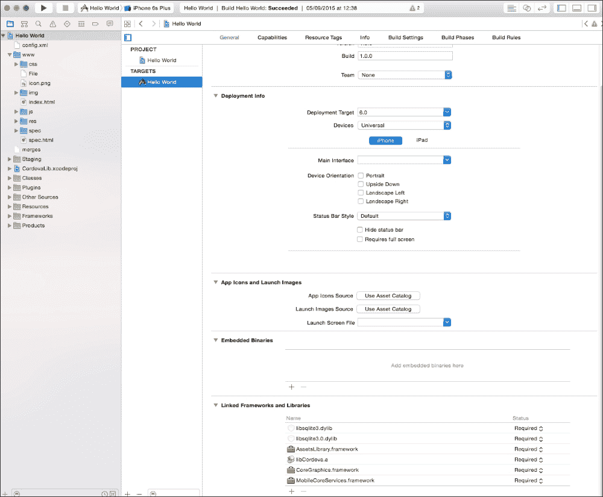
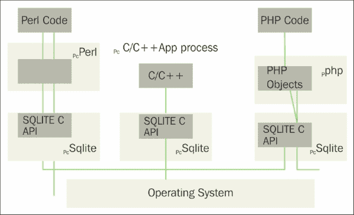
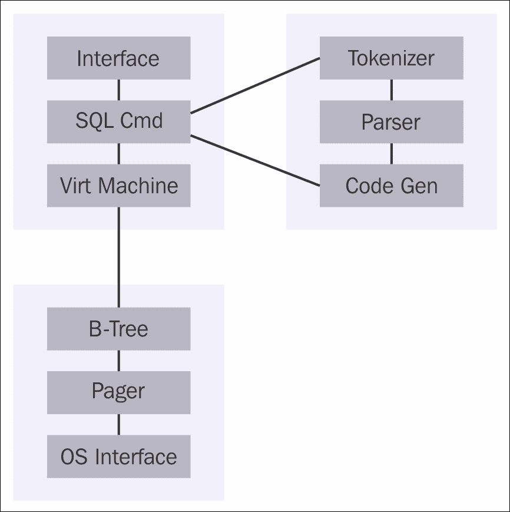
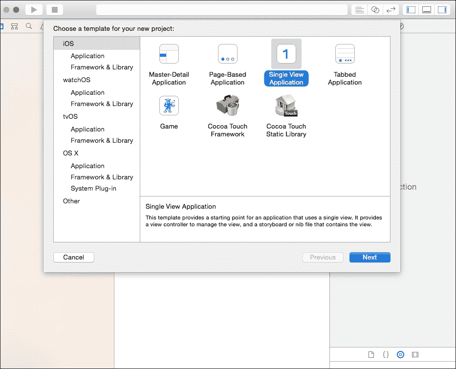
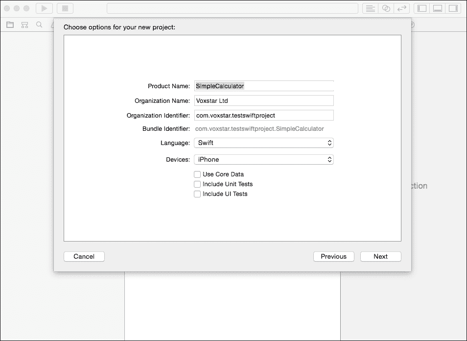
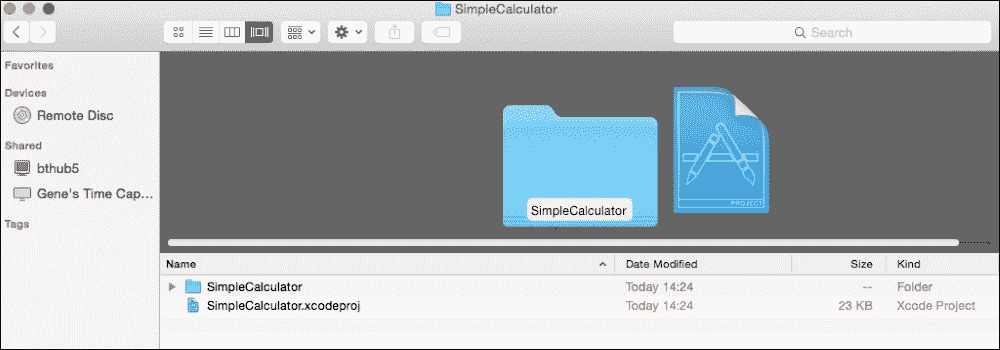
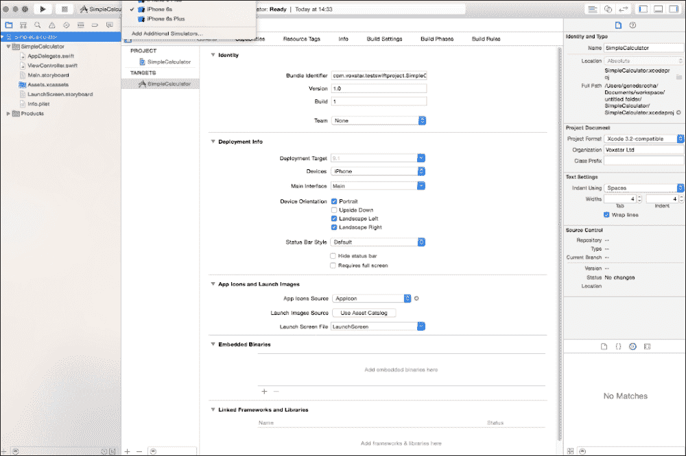
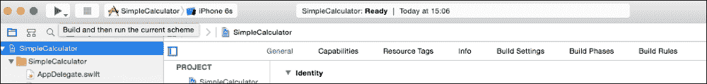
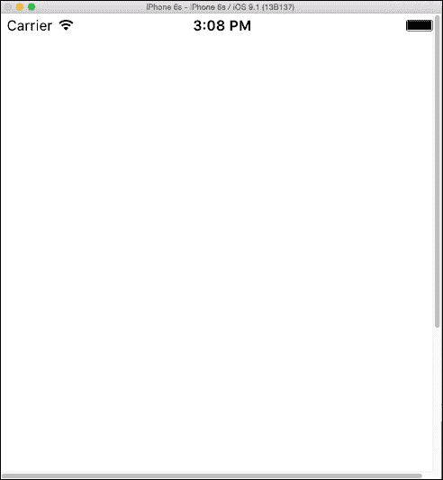

# 第一章。SQL 和 SQLite 简介

在本章中，我将向您介绍 **结构化查询语言**（**SQL**）和移动数据库 **SQLite**。无论您是经验丰富的 SQL 技术人员还是新手，使用这本书将帮助您理解这个越来越受欢迎的酷炫主题。SQLite 是在移动智能手机或平板电脑上使用的数据库，它位于设备本地。SQLite 已被不同的供应商修改，以加固和确保其在各种用途和应用中的安全性。

SQLite 于 2000 年发布，现在已成为移动或智能手机上的事实上的数据库。它是一个占用空间小、开销低的开源软件，包含一个 **RDBMS（关系数据库管理系统**）。

**D. Richard Hipp 先生** 是 SQLite 的发明者和作者，SQLite 是在他加入美国海军的通用动力公司时在军舰上设计和开发的。编程是为 **HP-UX** 操作系统构建的，数据库引擎为 **Informix**。升级或安装数据库软件需要花费许多小时，对于这位经验丰富的 **DBA**（**数据库管理员**）来说，这是一个超乎寻常的数据库。Hipp 先生希望有一个便携式、自包含、易于使用的数据库，它可以移动，快速安装，并且不依赖于操作系统。

最初，SQLite 1.0 使用 **gdbm** 作为其存储系统，但后来，它被自己的 **B-tree** 实现和数据库技术所取代。B-tree 实现得到了增强，以支持事务并按键顺序存储数据行。从 2001 年开始，为其他语言（如 Java、Python 和 Perl）编写的开源家族扩展被编写来支持它们的应用。数据库及其在开源社区和其他人中的受欢迎程度开始增长。

如维基百科所述，SQL 如下：

> *最初基于关系代数和元组关系演算，SQL 由数据定义和操作语言组成。SQL 的范围包括数据插入、查询、更新和删除、模式创建和修改以及数据访问控制。尽管 SQL 经常被描述为，并且在很大程度上是，一种声明性语言（4GL），但它也包括程序性元素。*

国际化支持 UTF-16 和 UTF-8，并在 2004 年的版本 2 和 3 中包含了文本排序序列。它在 2004 年由 **AOL**（**美国在线**）资助。它与各种浏览器一起工作，有时这些浏览器内置了对这项技术的支持。例如，有许多扩展使用 Chrome 或 Firefox，允许您管理数据库。

已向该产品添加了许多功能。随着手机的增长，这个快速简单的关系数据库系统将实现量子飞跃，其中数据库在移动和平板电脑应用空间的使用将增加。

SQLite 以 PostgreSQL 为参考点。SQLite 不强制进行类型检查。模式不会对其施加约束，因为值的类型是动态的，并且触发器将通过转换数据类型而被激活。

# 关于 SQL

1970 年 6 月，一份名为《大型共享数据银行的关系数据模型》的研究论文由*E.F. Codd 博士*发表。**计算机协会**（**ACM**）接受了 Codd 的数据和技术模型，这已成为今天 RDBMS 的标准。IBM 公司发明了一种名为**结构化英语查询语言**（**SEQUEL**）的语言，其中“English”一词被省略，成为**SQL**。

SQL 已经成为 RDMS 的标准，被 Oracle、Sybase 和微软的 SQL Server 等数据库所使用。

今天，有**美国国家标准协会**（**ANSI**）的 SQL 标准，并且有这种技术的许多变体。在提到的制造商中，开源世界也有其他可用的选项，例如，一个 SQL 查询引擎，如**Presto**。

Presto 是开源下的 SQL 分发引擎，旨在执行交互式分析查询。Presto 查询可以在各种数据源大小的数据库下运行——从千兆到拍字节。

Facebook 和 Dropbox 等公司使用 Presto SQL 引擎进行数据仓库和相关应用程序的查询和分析。

SQL 是由在关系格式中使用元组和代数计算构建的数据操作和定义语言。这种语言有多种语句，但大多数人会认识到`INSERT`、`SELECT`、`UPDATE`和`DELETE`语句。这些语句构成了数据库模式管理过程的一部分，并有助于数据和安全访问。SQL 在其设置中包括程序性元素。

# SQLite 在当今行业中的地位如何？

公司可能会使用应用程序，但他们并不了解驱动他们数据存储和信息的 SQL 引擎。尽管在 1986 年已经成为 ANSI 的标准，但 SQL 的功能和特性在不同 SQL 系统之间并不是 100%可移植的。它们还需要代码更改才能变得有用。这些标准总是需要修订，以确保 ANSI 得到维护。

有许多工业和商业数据库，例如 Oracle、SQL Server 或 DB2，但它们没有一个像 SQLite 那样灵活、轻量或开源。尽管智能手机变得越来越强大，但你不能将它们的处理能力与现代桌面或笔记本电脑相提并论。SQLite，正如其名所示，是在轻量环境中运行的 SQL，它也是灵活和通用的。因此，目前最好的、轻量、功能齐全且可定制的移动数据库是 SQLite。

SQLite 不能与像 SQL Server、Oracle 和 MySQL 这样的企业数据库引擎相提并论。这些企业数据库系统提供了一个集中和受控的位置，而 SQLite 在移动设备上提供本地存储。SQLite 有效地基于规模经济和可靠性。它易于使用，体积小，健壮，并且不与这些企业数据库竞争。

由于无需人工输入或管理功能，SQLite 与“物联网”也很好地配合，因此对于处理无人机、医疗设备、机器人和传感器的应用，SQL 成为在多种移动应用上使用的理想候选者。

# iOS 与 SQLite

在所有应用商店的数十万个应用中，很难找到一个不需要某种数据库来以特定方式存储或处理数据的应用。存在不同的数据格式和数据流，但它们都需要某种形式的临时或永久存储。少量数据可能不适用，但中等或大量数据将需要一种存储机制，如数据库来协助应用。

使用 SQLite 这样的数据库与 iOS 结合将使开发者能够使用他们现有的技能来运行他们的 DBMS。对于 SQLite，有一个嵌入式 C 库可供使用，并且可以通过**Xcode** IDE 与 iOS 结合使用。

苹果完全支持 SQLite，它使用包含语句作为库调用的一个部分，但开发者也可以使用**FMDB**，这是围绕 SQLite 的**cocoa/objective-C**包装器。

SQLite 的一些优点是它速度快、轻量级、可靠、使用现有的 SQL 知识、得到苹果在 Mac OS 和 iOS 上的支持以及许多开发者的支持，并且无需大量外部参与即可集成。

在页面的左侧突出显示主项目名称后，SQLite 3 库位于“常规”选项卡下。然后，在页面底部，在“链接框架和库”部分中，点击**+**按钮以出现一个模态窗口。输入单词`sqlite`并选择**libsqlite3.dylib**库，如图所示：



实际上，是框架部分中的 C++包装器，称为`libsqlite3.dylib`库，允许 API 与 SQLite 命令一起工作。

在任何 SQL 处理开始之前，数据库应该已经打开并准备好查询，并且在数据检索成功后，应该将名为`SQLITE_OK`的常量设置为`0`。

一旦使用了 C++包装器并且可以访问 SQLite 命令，使用 SQLite 与 iOS 结合的过程就会变得更容易。

### 小贴士

**下载示例代码**

您可以从[`www.packtpub.com`](http://www.packtpub.com)的账户下载本书的示例代码文件。如果您在其他地方购买了这本书，您可以访问[`www.packtpub.com/support`](http://www.packtpub.com/support)并注册，以便将文件直接通过电子邮件发送给您。

您可以通过以下步骤下载代码文件：

+   使用您的电子邮件地址和密码登录或注册我们的网站。

+   将鼠标指针悬停在顶部的**支持**标签上。

+   点击**代码下载与勘误表**。

+   在**搜索**框中输入书籍的名称。

+   选择您想要下载代码文件的书籍。

+   从下拉菜单中选择您购买此书籍的来源。

+   点击**代码下载**。

下载文件后，请确保使用最新版本的软件解压缩或提取文件夹：

+   Windows 上的 WinRAR / 7-Zip

+   Mac 上的 Zipeg / iZip / UnRarX

+   Linux 上的 7-Zip / PeaZip

# 嵌入式数据库

SQLite 已被设计和开发，以便在其领域内与其他应用程序和进程协同工作。关系数据库管理系统（RDBMS）与需要存储信息但被隐藏、对用户不可见的本地应用程序软件紧密集成，这需要最少的行政管理或维护。

SQLite 可以与用户隐藏的不同 API 一起工作，并且需要最少的行政管理或维护区域。

RDMS SQLite 还将与其他应用程序兼容：

+   它需要最少的监督。

+   由于它是一个基于文件的系统，因此没有网络流量，访问速度更快。

+   没有网络访问冲突或配置问题。

+   没有权限或权限限制的访问限制。

+   减少了大量的开销。

这些使得将您的应用程序部署到应用商店或其他位置更加容易和快捷。

*图 1*，在本节中展示，显示了不同组件如何以和谐的方式无缝协同工作，将数据与 SQLite 库和其他进程连接起来。这些展示了 Apache 和 C/C++进程如何与 SQLite-C 库协同工作，以便进行接口和链接，使其变得无缝并集成到操作系统中。

SQLite 已被开发和集成，以便它将与各种应用程序和多个解决方案进行接口和融合。作为一个轻量级的 RDBMS，它因其多功能性而能够独立存在，不会因为过于复杂而影响您的应用程序。它可以在许多平台上使用，并带有二进制兼容的格式，这使得它更容易与您的移动应用程序结合。

不同的 IT 专业人员将涉及 SQLite，因为它持有数据，影响性能，并涉及数据库设计、用户或移动界面设计专家、分析师和咨询类型。这些专业人员可以使用他们现有的 SQL 知识快速掌握 SQLite。SQLite 可以作为信息的数据处理器，或在内存中处理数据，以出色的表现运行。

*图 1*还概述了如何使用 SQLite 的 C API 接口与其他编程语言代码正确地接口不同软件组件的拼图。例如，C 或 C++代码可以编程以与 SQLITE C API 通信，然后与操作系统和数据库引擎通信。另一种语言，如 PHP，可以使用其自己的语言数据对象进行通信，这将反过来与 SQLite C API 和数据库通信。

SQLite 是一个很好的学习数据库，特别是对于想要使用能够打开他们视野以研究缓存、B-Tree 结构和算法、数据库设计架构以及其他概念的计算机科学家来说。

关于 SQLite 如何在移动设备上的其他应用程序中定位的更多信息，请参阅*图 1*：



图 1：SQLite 的 C API 接口

# SQLite 数据库的架构

作为**操作系统接口**中的库，SQLite 将通过名为`tclsqlite.c`的程序实现许多功能。不同的语言中使用了不同的技术和保留字，但在这里我们使用了 C 语言。核心功能可以在`main.c`、`legacy.c`和`vmbeapi.c`中找到。还有一个用于 TCL 语言的 C 源代码文件，以避免任何混淆；SQLite 库的名称前缀使用`sqlite3`。

**标记器**代码库位于`tokenize.c`文件中。其任务是查看传递给它的字符串，并将它们分割或分离成标记，然后传递给解析器。`tokenize.c`文件通过包含语句包含在代码中，并位于`sqlite/src/tokenize.c`目录区域。

**解析器**代码库位于`parse.y`文件中。SQLite 的解析器是**Lemon LALR(1)**解析生成器；它将标记的概念赋予它们意义。为了保持 RDBMS 的低内存占用，只使用一个 C 文件作为解析生成器。

然后，**代码生成器**用于从解析器输出的标记中创建 SQL 语句。它将生成一些虚拟机代码，这些代码将执行 SQL 语句的工作。如`attach.c`、`build.c`、`delete.c`、`select.c`和`update.c`等几个文件将处理 SQL 语句和语法。

**虚拟机**执行由代码生成器生成的代码。它具有内置的存储，其中每条指令可能有最多三个额外的操作数作为代码的一部分。源文件名为`vdbe.c`，它是 SQLite 数据库库的一部分。内置的还有一个专门创建以与数据库系统集成计算的引擎。

虚拟机有两个头文件。用于连接 SQLite 库之间的接口的头文件是 `vdbe.h` 和 `vdbeaux.c`，它们包含其他模块使用的实用工具。`vdbeapi.c` 文件也通过 `sqlite3_bind` 和其他相关接口连接到虚拟机。C 语言例程从 SQL 函数中调用，以便将它们引用到头文件中。例如，`count()` 等函数定义在 `func.c` 中，日期函数位于 `date.c` 中。

**B-tree** 是 SQLite 中使用的一种表实现类型，其 C 源文件是 `btree.c`。`btree.h` 头文件定义了 B-tree 系统的接口。每个表和索引都有不同的 B-tree 设置，这些设置位于同一文件中。`btree.c` 中有一个头部分，其中包含 B-tree 的详细信息，这些信息位于一个大的注释字段中。

**页面缓存** 或 **页面缓存** 使用 B-tree 将以固定大小的格式请求数据。默认大小为 1024 字节，但可以是 512 到 65536 字节。提交和回滚操作，以及数据的缓存、读取和写入，都由 **页面缓存** 或 **页面缓存器** 处理。数据锁定机制也由 **页面缓存** 处理。名为 `page.c` 的 C 文件被实现来处理 SQLite 库内的请求，其头文件是 `pager.h`。

**操作系统接口** C 文件定义在 `os.h` 中。它说明了 SQLite 如何在不同的操作系统上使用，并且对用户来说是透明和可移植的，因此成为任何开发者的宝贵解决方案。还保留了一个抽象层来处理 Win32 和 POSIX 兼容的系统。不同的操作系统都有自己的 C 文件。例如，`os_win.c` 用于 Windows，`os_unix.c` 用于 Unix；两者都与其各自的 `os_win.h` 和 `os_unix.h` 头文件相关联。

`Util.c` 是处理内存分配和字符串比较的 C 文件。`Utf.c` C 文件将包含 Unicode 转换子例程。

有关 SQLite 架构的更多信息，请参阅 *图 2*：



图 2：SQLite 架构图

`Utf.c` C 文件将包含 Unicode 数据，在 SQL 引擎中对数据进行排序，并使用引擎作为计算数据的一种机制。由于设备内存有限，数据库大小也有相同的限制，因此开发者必须跳出思维定式来使用这些技术。

这些类型的内存和资源管理在过去使用覆盖技术时形成了一部分方法，当时磁盘和内存有限：

```swift
    SELECT parameter1, STTDEV(parameter2)
      FROM Table1 Group by parameter1
      HAVING parameter1 > MAX(parameter3)
```

# 功能

作为其标准的一部分，SQLite 使用并实现了大多数 SQL-92 标准，但并非所有潜在的功能或功能部分都被使用或实现。例如，SQLite 使用并实现了大多数 SQL-92 标准，但并非所有潜在列。触发器的支持不是 100%，因为它无法将输出写入视图。

如前所述，对于列使用公共数据类型是不同的；大多数关系型数据库系统将它们分配给单个值。如果列的首选类型是整数，SQLite 会将字符串转换为整数。当绑定到这种脚本语言时，这是一个很好的功能，但这种技术不可移植到其他 RDBMS 系统中。与其他系统相比，它也因其没有良好的数据完整性机制而受到批评，尤其是在静态类型列方面。

在这两种数据处理方法之间有一些主要差异：一个是 **Core Data**，而 SQLite 方式类似于在用户界面和数据库本身之间有一个信息层。它确实有加快数据库交互读写过程和节省编写大量查询的优势。而 SQLite 是一个具有自身效率和限制的本地关系型数据库，可能不适合所有应用程序。有时，由于设备的速度，Core Data 可能直接具有 SQLite 的优势。

简而言之，你的应用程序将具有模型层对象，这些对象由一个框架持有和管理，即 Core Data。它管理 iOS 中对象的整个生命周期。这只是提供一些背景信息，以展示如何从数据库中读取数据以及这一过程的速度。

# 使用 SQLite 的优势

列出使用 SQLite 的几个优点：

+   SQLite 确实具有数据约束功能，并且可以在不将其加载到内存中的情况下编辑或删除表。

+   SQLite 在磁盘上存储数据，与 Core Data 相比，速度较慢。

+   另一方面，Core Data 没有数据约束，可以使用应用程序的业务逻辑来实现。

+   为了更新或删除表，必须将整个表加载到内存中。

+   Core Data 创建记录/行很快，但保存数据较慢。

+   Core Data 确实具有另一个优势，即它在内存中操作和工作，数据必须从磁盘加载到内存中。

+   Core Data 基于内存中的对象进行操作，或者可以使用标准的较慢的磁盘方法进行访问。

+   Core Data 适用于非事务性、单用户或单线程方法。SQLite 的功能是使用其文件数据库系统检索和存储数据。它通过在磁盘上存储数据，以增量或最小方式加载数据来操作。

+   实际上，数据可以是事务性的、多用途的，并且线程安全。它将数据保存到磁盘上，并且对崩溃具有很高的容错性。如果你需要创建数十万行数据，它可能会变慢，但它确实有数据约束，例如唯一键。

+   SQLite 与许多语言绑定，如 Basic、C、C#、C++、Java、JavaScript、Lua、PHP、Objective-C、Python、Ruby 和 TCL。开源社区的使用和客户及开发者的使用使得其持续增长。

+   这种轻量级的 RDMS 可以在 Google Chrome、Firefox、Safari、Opera 和 Android 浏览器上使用，并支持使用`ADO.NET`、ODBC、COM（ActiveX）和 XULRunner 的中间件。它还支持诸如 Django（基于 Python）、Ruby on Rails 和 Bugzilla（Mozilla）等 Web 应用程序框架。还有其他应用程序，如 Adobe Photoshop Light 和 Skype，使用 SQLite。它也是 Windows 8、Symbian OS、Android 和 OpenBSD 操作系统的组成部分。

+   除了没有其他数据库引擎的大开销外，SQLite 还有一个主要增强功能，称为`EXPLAIN`关键字，具有显式类型。

+   为了控制约束冲突，使用`REPLACE`和`ON CONFLICT`语句。

+   在同一个查询中，可以使用`DETACH`和`ATTACH`语句访问多个独立的数据库。

+   可以使用预定义的 API 创建新的 SQL 函数和排序序列，这提供了更多的灵活性。

+   由于无需配置，SQLite 只需完成工作并运行。

+   不需要列表，如`REPLACE`和`ON CONFLICT`过程。

+   不需要初始化、停止、重启或启动服务器进程，也不需要管理员创建具有适当访问控制或安全许可的数据库。

+   任何故障发生后，不需要用户操作来恢复数据库，因为它具有自我修复功能。

+   SQLite 比之前想象的更先进。与其他 RDMS 不同，它不需要通过服务器设置来提供数据或产生网络流量成本。没有 TCP/IP 调用，也没有频繁的前后通信。

+   SQLite 直接；操作系统进程处理对文件的数据库访问，并通过无中间人进程握手来控制数据库的读写操作。

+   由于没有服务器后端，安装、配置或管理过程显著减少，并且数据库访问权限授予需要此类数据操作的程序。这在一方面是一个优势，但也是安全性和防止数据滥用、数据并发或数据行锁定机制的一个劣势。

+   它还允许数据库同时被不同的应用程序多次访问。

+   它支持跨平台数据库文件的一种可移植性形式，该文件可以通过数据库文件结构定位。数据库文件可以在一个系统上更新，并在具有不同架构的 32 位或 64 位系统上复制到另一个系统；这对 SQLite 没有影响。

+   通过使用不同的架构和开发者的承诺，保持文件系统稳定并与以前、当前和未来的发展兼容，将允许这个数据库增长和繁荣。SQLite 数据库不需要将旧数据上传到新的、格式化和升级后的数据库；它只需工作即可。

+   通过使用单个磁盘文件作为数据库，信息可以复制到 USB 上并共享，或者通过保持所有信息完整，在另一台设备上快速重用。

+   这个便携式数据库 SQLite 的另一个特点是它的尺寸，可以从单个 512 字节页面开始，扩展到每页 65,536 字节、共 2,147,483,646 页，或者以字节计算为 140,737,488,224,256，相当于大约 140 太字节。大多数其他关系型数据库管理系统都更大，但 IBM 的 Cloudscape 较小，有 2 MB 的 jar 文件，但仍然比 SQLite 大。

+   火鸟替代方案的客户端（前端）库大约为 350 KB，而伯克利 Oracle 数据库则大约为 450 KB，不包括 SQL 支持，并且有一个简单的键/值对选项。

+   这个高级便携式数据库系统及其源代码属于公共领域。然而，对于一些测试代码和文档，存在开源许可问题和控制。

+   这对那些可能想要编写新扩展或与他们的程序一起工作的数据库功能（可能成为 SQLite 的“产品扩展”）的开发者来说是个好消息。

+   由于一切都有专利、有限访问或根本没有访问权限，您无法获得此类对 SQL 源代码的访问。

+   有开发者签署的声明，放弃对 SQLite 代码的任何版权利益。SQLite 之所以不同，是因为它根本不受版权法的管辖或统治，版权法监控软件应该如何真正工作或被使用。

使用小分配和可变长度记录，应用程序运行更快，数据库访问更快，使用显式类型，数据库小而敏捷。

使用这种关系型数据库管理系统（RDBMS）的简便性使得大多数中级程序员更容易使用这项技术创建应用程序，因为它有详细的文档和示例。

其他关系型数据库管理系统在内部比较复杂，与数据结构和对象有链接。SQLite 包含一种虚拟机语言，它在查询前使用保留词`EXPLAIN`。

虚拟机通过提供一个优秀的过程或受控环境，在后台（结果计算和输出）和前端（SQL 被解析和执行）之间增加了对这个数据库引擎的好处。

SQL 实现语言与其他关系型数据库管理系统相当，特别是与其轻量级基础相比，它支持递归触发器并要求`FOR`/`EACH ROW`行为。`FOR EACH`语句目前不支持，但未来不能排除其功能。

如本章所述，SQLite 是一个敏捷且易于使用的数据库，开发者可以快速参与其中，使用现有技能，并将系统输出到移动设备和平板电脑上，比以往任何时候都容易。借助 HTML5 和其他 JavaScript 框架的帮助，SQL 的进步和 SQLite 安装数量将实现量子飞跃。

# 与 SQLite 一起工作

SQLite 的网站可在[www.sqlite.org](http://www.sqlite.org)找到，您可以在那里下载数据库、文档和源代码的二进制文件，这些文件适用于 Linux、Windows 和 MAC OS X 等操作系统。

SQLite 的**共享库**或**DLL**是用于 Windows 操作系统的库，可以通过 Visual Studio 使用 C++语言安装或查看。因此，开发者可以使用通过应用程序链接的当前库编写代码。当执行发生时，DLL 将加载，代码中的所有引用将在正确的时间链接到 DLL 中的相应部分。

SQLite3 **命令行程序**—**CLP**—是一个自包含的程序，它包含所有在命令行上运行的组件。

它还附带了一个 TCL 扩展。因此，在 TCL 中，你可以连接和更新 SQLite 数据库。SQLite 下载包含适用于 Unix 系统的 TAR 版本和适用于 Windows 系统的 ZIP 版本。

# iOS 中使用 SQLite 的示例

以下是一个简单的示例，展示了如何使用 Xcode 在 iOS 中与 SQLite 数据库一起使用。它概述了创建应用程序和数据库以及选择数据的基本步骤。

要开始，让我们启动 Xcode，并使用**单视图应用程序**选项创建一个模板，如图所示：



点击**下一步**按钮，进入此过程的下一屏幕。在产品名称字段中，输入`SimpleCalculator`作为语言，并选择**Swift**。对于设备字段，选择**iPhone**。然后，点击**下一步**按钮，进入下一屏幕，如图所示：



在以下截图中，选择代码将驻留的目录。现在，我们可以查看 Xcode 开发者工具创建的内容。然后，选择一个设备来显示信息；在我们的例子中，使用 iPhone 6s。

查看源代码目录，如图所示：



以下是一张截图，显示了在 Xcode 中打开的`SimpleCalculator`应用程序。选择**iPhone 6s**作为开发设备：



接下来，点击**播放**按钮，它将编译和构建应用程序，如图所示，并将出现一个空白屏幕：



上一张截图显示了要构建的应用程序，下一张截图显示了编译和运行图像后的空白屏幕。

这种方法让你通过 Swift 作为画布，掌握 iOS 应用程序的基础。

在这个简短的示例中，我们将使用`SQLiteDB.swift`和`String-Extras.swift`来处理 SQLite 数据库，包括`Bridging-Header.h`文件。在**构建设置**选项中，查看**Objective-C 桥接头**，双击它，并将其桥接到`Bridging-Header.h`，你也可以将其拖动以显示它已被链接。

如前所述，通过导航到**通用** | **链接框架和库**，将`libsqlite3.0.dylib`添加到链接框架中；然后，添加`Libsqlite3.0.dylib`。

现在，重新构建项目以显示它正在工作：



点击**模拟器**按钮，然后点击**退出**以停止当前编译的模拟器程序。程序将无问题编译。接下来，必须创建一个数据库实例，如下面的代码所示。使用`SQLite.DB.query`方法执行这些命令：

+   首先需要一个实例：

    ```swift
    let testdb = SQLiteDB.sharedInstance()
    ```

+   要运行此查询，使用以下代码与`SQLiteDB.query`方式相结合：

    ```swift
    var theresult = testdb.query("select * from people where county = 'Berks'", parameters: nil)
    for row in result
    {
        println(row["name"]!.asString())
    }
    ```

+   例如，要删除一条记录，请按照以下代码片段操作：

    ```swift
    testdb.execute("delete from people where county = 'Bucks' ", parameters: nil)
    ```

# 摘要

在本章中，你将了解 SQL 的历史、关系数据库的影响以及移动 SQL 数据库的使用，即 SQLite。本章概述了 SQLite 的历史和起源以及它是如何发展成为迄今为止在移动设备上使用最多的数据库。在下一章中，你将学习数据库概念组件以及如何设计 SQLite 数据库。下一章将展示 SQLite 数据库设计的基本要素。
