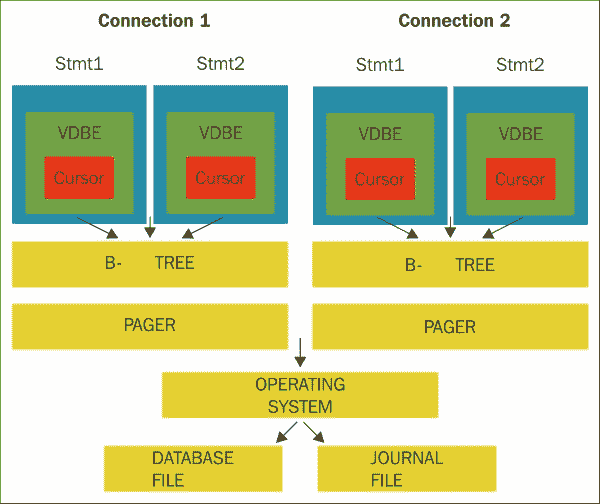

# 第二章：数据库设计概念

在本章中，你将学习 SQLite 的数据库概念。就像大多数数据库一样，SQLite 也可以使用名为`INSERT`的 SQL 命令来添加数据。它还可以使用`UPDATE`命令修改数据，使用`DELETE`命令删除数据。它还可以使用`SELECT`命令检索数据。

这四个命令构成了市场上任何 SQL 数据库 RDMBS 的基础。这组命令操作数据，这种类型的搜索称为**查询**。

# 数据库基础知识

这种持久和结构化的数据存储方式简单地称为数据库，数据本身是使用表格存储的。每个表格由列和行组成，其外观和感觉类似于**Microsoft Excel**。

SQLite 基于 C 语言和市场上的相关 API（RDBMS）。例如，C 语言易于理解，并且基于 RDBMS 的数据库设计基础。然而，学习实际的 API 将有助于提升你的技能和理解。

为了理解 API，你必须学习构成数据库的组件，以提升你的知识。理解数据结构、SQL 事务、并发性和数据锁定机制，以及创建优化的查询将有助于你设计出色的数据库系统。

最后，你需要将这种理解应用到你所编写的应用程序的软件代码中，看看它是如何集成和执行的。本章将进一步讨论 API 语言扩展。

SQLite 的设计目标是使管理和操作简单易用，易于管理。SQLite 是**ACID**（**原子性**、**一致性**、**隔离性**和**持久性**）兼容的，并且完全使用**T-SQL**进行事务处理。

作为设计的一部分，SQLite 数据库具有多种数据类型，就像大多数数据库一样。其中一种类型是`INTEGER`类型，它具有 64 位数值。这个数据库使用 64 位数值，数据存储在 1、2、3、4、5、6 或 8 字节中。`TEXT`类型编码使用 UTF-8 在数据库中存储。`BLOB`数据类型可以直接存储，默认大小为 1,000,000,000 字节。

### 注意

SQLite 还使用`REAL`类型，它是一个 64 位浮点值，同时也有标准的`NULL`值。`REAL`类型将应用于`FLOAT`、`DOUBLE`和`REAL`数据类型。`TEXT`类型适用于`NCHAR`、`NVARCHAR`、`TEXT`和`VARCHAR`数据类型。`NUMERIC`类型适用于`DATE`、`DATETIME`和`BOOLEAN`。SQLite 还使用**CRUD**（**创建**、**读取**、**更新**和**删除**），并且这个数据库**不区分大小写**。

语句如下所示：

+   `CREATE`语句用于在 SQLite 数据库中创建新表。这里显示了`CREATE TABLE`的基本语法和简单示例。`CREATE TABLE`语句有一个固定的数据库名。它后面跟着一个表名，用括号括起来。在这个语句中，有一个要创建的列（s）的列表，从它们的名称和数据类型开始，如下所示：

    +   `CREATE table database-name. table-name( column1 datatype, column2 datatype, column3, datatype, PRIMARY KEY column1);`

+   `INSERT`语句将在前半部分有一组列，后面跟着一个表名。后半部分将有变量，其中来自这些变量的数据将被插入到表中。确保程序员使用与创建的列相同的数据类型很重要；否则，将出现错误或警告：

    +   `INSERT into table-name(column1,column2,column3) VALUES(variable1,variable2,variable3);`

+   `UPDATE`语句用于更新表中的记录或行。`UPDATE`语句将有一个表名，后面跟着左侧要更新的列的集合和一些数据变量，如下所示：

    +   `UPDATE table-name SET column1=variable1, column2=variable2, column3=variable3) [where variable4 = 10];`

+   `SELECT`语句用于从表中选择信息、记录或行。这如图 7 所示。`SELECT`语句将在前半部分有一组列，后面跟着一个表名和一个条件，如下所示：

    +   `SELECT column1, column2, column3 FROM table-name WHERE column1 > 10;`

+   `DELETE`语句用于从表中删除记录或行。这在此处显示。`DELETE`语句将在前半部分有一组列，后面跟着一个表和任何条件：

    +   `DELETE from table-name where column1 >10;`

扩展和核心 API 是构成用 C 语言制作的 API 的部分。核心数据库执行处理 SQL 语法和连接到数据库等功能。其他任务，如错误捕获和字符串格式化，也由核心 API 处理。如前所述，扩展 API 允许程序员通过添加或扩展当前 API 的新功能来添加目前不存在或作为 SQLite 程序当前定义的功能。

虽然数据结构已经概述，如前所述，使用标记化器或解析器，它们的重要性降低，因为编码者对其他部分更感兴趣，如连接语法、参数或当前函数，而不是产品的内部。为了编写一些好的代码，程序员必须了解 SQLite 锁、事务和 API 本身。

虽然不是 API 本身的一部分，但 SQLite 系统的**分页器**和**B 树**部分在锁定和事务机制中作为重要部分做出了贡献。

有八种方法和两种对象构成了 SQLite 数据库系统的 C/C++接口部分。这两个对象是：`sqlite3`，这是实际的数据库连接对象，以及`sqlite3_stmt`，这是`prepare`语句对象。

八种方法包括以下内容：

+   `sqlite3_exec()`: 这是一个包装函数

+   `sqlite3_close()`: 这是`sqlite3`的析构函数

+   `sqlite3_finalize()`: 这是`sqlite3_stmt`的析构函数

+   `sqlite3_column()`: 这个接口保存`sqlite3_stmt`的列值

+   `sqlite3_step()`: 这允许你移动到下一个结果行，是`sqlite3_stmt`的改进。

+   `sqlite3_bind()`: 这是将 SQL 从存储的应用程序数据中分解成参数的方式

+   `sqlite3_prepare()`: 这是`sqlite3_stmt`构造函数的一部分，其中从编译后的 SQL 生成字节码，以便执行 SQL 语句（`SELECT`，`UPDATE`）

+   `sqlite3_open()`: 这是`sqlite3`的构造函数，它允许连接到现有的或新的 SQLite 数据库

最初，SQLite 易于学习，只有五个 C/C++接口，但现在，它已经增长到超过 200 个 API 的大小、功能和接口。使用 200 个 API 可能会让人感到畏惧，但 SQLite 的设计方式使得你只需使用 API，但现在，它已经增长到更大的规模和功能。

这六个核心接口一旦掌握，将使程序员对 SQLite 有更深入的理解。它们在此列出：

+   `SQLite3_open()`: 这个函数建立与 SQLite 数据库的连接，一旦成功，将返回一个数据库连接对象。其他接口在`SQLite3_open()`接口设置之前将不可用。它们需要一个起点，或对数据库的引用，以及一个数据库连接对象。

+   `SQLite3_prepare()`: 这个函数将 SQL 语句转换并设置成格式化的对象，输出将是一个指针，该指针将存储对该对象的引用。为了继续前进，这个接口需要一个由`SQLite3_open()`函数产生的数据库连接对象。

+   `SQLite3_column()`: 这个接口不查询 SQL，它只是生成一个预编译语句。这个接口现在不再是新应用的优先选择，但必须使用替代的`SQLite3_prepare_V2()`接口。

+   `SQLite3_step()`: 这个接口将查看由 `SQLite3_prepare()` 函数设置的预处理语句，并从当前记录集中返回一个单列。这不仅仅是一个函数，而是用于返回不同数据类型值的函数类型的占位符。这些构成了结果集的一部分。还有其他一些是 `sqlite3_column()` 设置的一部分，它们是：`sqlite3_column_blob()`、`sqlite3_column_bytes()`、`sqlite3_column_bytes16()`、`sqlite3_column_count()`、`sqlite3_column_double()`、`sqlite3_column_int()`、`sqlite3_column_int64()`、`sqlite3_column_text()`、`sqlite3_column_type()` 和 `sqlite3_column_value()`。

+   `SQLite3_finalize()`: 这个函数是销毁预处理语句的接口，以防止系统中的内存泄漏。

+   `SQLite3_close()`: 这个接口将在关闭或停止操作之前关闭任何数据库连接和预处理语句。

还有其他一些例程，如 `sqlite3_bind()` 和 `sqlite3_reset()`，允许重复使用先前语句。通常，语句只创建、准备和销毁一次，但上述例程可以在多个实例中使用。

SQLite 有一个 `sqlite3_config()` 接口，在发起任何数据库连接之前首先被选择。这个接口将能够设置数据库的全局更改。它还可以分配内存，为实时嵌入式系统设置分配器，并为预定义的应用程序使用设置页面缓存。它还可以对不同线程模型进行调整。

这个数据库系统是灵活的，使用 `sqlite3_create_collation()`、`sqlite3_create_function()`、`sqlite3_create_module()` 和 `sqlite3_vfs_register()` 函数将允许 SQLite 系统在 RDBMS 上拥有新的专有功能。例如，`sql_create_function()` 函数将为聚合或标量目的创建额外的功能。这些是 `sqlite3_aggregate_context()`、`sqlite3_result()`、`sqlite3_user_data()` 和 `sqlite3_value()`。

这些是 SQLite 系统的标准内置功能，证明了该系统对程序员来说是多么灵活。正是这种灵活性，加上帮助它成长和发展的技术，使得它成为了今天最好的移动 SQL 数据库。

此外，还有许多其他接口和函数，太多以至于无法包含在这本书中。它们可以在该产品的 C/C++ 接口规范下找到。

默认情况下，SQLite 将完成程序员、用户或 DBA 所需的大部分任务。程序员总是寻求超越关系型数据库系统的正常界限，或者利用这些扩展来满足他们的解决方案需求。

# 使用 SQLite 的原因

SQLite 拥有许多使其成为移动技术优秀数据库的特点。例如，无需管理或配置，事务是原子的，数据库包含在一个单一的跨平台文件中，并且具有高级功能，如表表达式和部分索引。使用 SQLite 的原因在此列出：

它有一个小型、多功能且易于使用的 API。它非常符合标准，并使用符合 ANSI-C 的代码编写。没有对外部程序或服务的依赖，代码注释良好。源代码属于公共领域，并提供了独立的**CLI**（**命令行界面**）。它是跨平台兼容的，与 Mac、Linux、BSD、Android、Solaris、VxWorks 和 Windows（WinCE、Win32、WinRT）兼容。

它的代码占用空间非常小，配置时小于 500 kB。使用此数据库的应用程序范围非常广泛。几乎所有的产品都可以拥有或需要 SQLite 可以处理的数据库。

它可能没有企业系统所有的功能，但它非常灵活且易于获取。Adobe、Dropbox、Skype 等许多公司都使用 SQLite。

SQLite 使用自己的测试设施和标准独立进行测试。有针对内存使用、崩溃和断电、模糊测试边界值和禁用优化测试、回归测试和行为检查等的测试。测试工具也是独立开发和验证的。

SQLite 的测试过程经过充分测试和成熟，TCL 测试使用 TCL 脚本语言构建。测试工具使用创建 TCL 界面的 C 代码制作。有超过 800 个测试脚本文件，包含超过 10 GB 的数据和超过 30,000 个测试用例。

还有针对 SQL 逻辑的测试，这些测试将 SQL 语句针对其他数据库引擎运行，例如 SQL Server、PostgreSQL、Oracle 和 SQLite 本身。这些构成了 SLT（SQL 逻辑测试）的一部分，该测试运行超过 700 万个查询和 1GB 的测试数据，作为测试负载的一部分。

此外，还有许多类型的压力和性能测试，包括异常测试，这些测试包括对 SQLite 在各种检查中的行为进行测试，并查看错误发生时的表现。所有测试都在 SQLite 支持的所有平台上运行。存在一个测试脚本的子集，用作快速测试；然而，仍有超过 200,000 个测试用例——足以捕获任何错误或不适配的代码——可以快速执行。

也有用于检查内存使用的测试，这些测试会查看内存分配和`malloc()`函数的使用情况。所有 SQL 数据库都使用`malloc()`函数来分配和释放内存。由于 SQLite 在嵌入式系统中被大量使用，因此需要优雅地处理错误。

进行 I/O 测试以确保正确处理和解决 I/O 错误。这些问题可能与网络错误、配置、磁盘问题或权限有关。创建错误以观察其影响以及软件如何处理它们。

使用虚拟文件系统（**VFS**）来模拟数据库崩溃也是测试程序的一部分。还有使用电力故障的模拟，以便记录任何测量数据。崩溃测试过程是单独完成的。

此外，还有一些模糊测试，以确保 SQLite 能够处理奇数和不同的输入，并且所有结果都经过检查。会启动进程并使用 VFS 来模拟崩溃。除了标准的模糊测试外，还有针对 SQL 的模糊测试，检查数据库的语法和输入，以检查响应和结果。这些构成了 TCL 测试的一部分，并且有超过 10 万个模糊测试。所有结果都被记录和分析。

所有针对此数据库的分支测试都已达到 100%的测试和测量。同时，也有测量和测试来确保任何自动资源泄漏都能被检测、记录并处理。通常，资源泄漏发生在特定情况下，资源由`malloc()`函数分配，但在其他进程可能需要相同资源或某种形式的共享资源时，资源没有被释放。当资源没有按照指示释放或释放时，就会导致资源泄漏。

SQLite 还具有动态分析功能，在代码执行或在线使用时检查内部和外部 SQLite 代码。这种分析类型用于确保 SQLite 为用户提供最佳的可用性和质量。

**Valgrind**是 Linux 二进制和 x86 环境的模拟器。作为一个模拟器，它运行得较慢，但非常有效。**Memsys2**有一个可插拔的内存分配系统；它使用`malloc()`和`free()`函数。如果 SQLite 使用`SQLite_MEMDEBUG`编译时选项编译，那么作为调试内存分配器的一部分，`malloc()`、`realloc()`和`free()`函数周围将使用更大的包装器。如果使用 Memsys2，它将在运行时查找内存分配错误。

SQLite 中有`mutex`子系统，使用`sqlite3_mutex_held()`和`sqlite3_mutex_notheld()`函数。这是一个可插拔的子系统，这两个接口检测特定线程是否存在于`mutex`子系统中。SQLite 使用`assert()`函数集来确保多线程应用程序在数据库系统中正确工作。

SQLite 使用回滚日志来确保在实际上对数据库进行更改之前记录数据库上的所有更改。SQLite 必须与不同的条件一起工作，以避免冲突或引起必须管理的未确定或异常行为。由于代码是用 C 语言开发的，它可能在开发期间与许多实现和库一起工作，但在生产区域，它必须确认并且有时可能不起作用。

因此，可能会尝试使用负数进行移位等检查，或者尝试使用`memcpy()`函数复制重叠的缓冲区，并检查无符号或带符号变量是否适用于`char`数据类型。为了应对这些问题，编译器（**GCC**）可能使用`-fraction`选项在测试套件中。

在代码发布之前，它将进行 ping 操作并检查无符号或带符号、分析或编译时错误，然后再继续。以下两个连接——**连接 1**和**连接 2**——如下所示：



图 9：带有 C API 的 SQLite 对象模型

*图 9*概述了程序员将查看的视图——B 树和分页器，而不是标记化器或解析器等组件。*图 9*概述了组件之间的关系。为了正确理解 SQLite，程序员必须了解 SQLite 的锁、API 和事务。

如*图 9*所示，分页器和 B 树访问在锁和事务中是禁止的，但很重要。当 API 有许多数据结构时，与数据库的连接和 SQL 语句是最重要的。例如，任何 SQLite 数据库的连接都保持为一个事务，并且也是一个连接到 RDBMS 的连接。SQL 语句在内部以**虚拟数据库引擎**（**VDBE**）字节码的形式表示。

与 SQLite 的 B 树和分页器组件一起，它将支持每个连接中的许多数据库对象，如图 9 所示。每个数据库对象都有一个 B 树对象，它与分页器对象有关联。每个连接中的 SQL 代码（SQL 语句）如图 9 所示。每个数据库对象都有一个 B 树对象，它与分页器对象有关联。

当 B 树需要信息时，它会提示分页组件从数据库中获取数据。分页组件将数据移动到其内存缓冲区，然后 B 树组件通过其游标将其关联起来以检索和查看数据。

执行 SQL 语句和命令是 API 的主要部分，有两个方法，即准备或包装查询。如果游标修改了页面，则必须保留原始页面/数据，以防数据库回滚。分页器非常重要，必须处理来自 RDBMS 的读写事件。

一旦执行了操作，就会设置一个事务。例如，数据库连接设置将被视为一个事务。还请记住，在任何给定时间，连接不能打开或可用多个事务。

因此，来自标准连接的 SQL 语句将在同一事务中工作。如果你的程序需要在不同事务中执行多个语句，你必须使用多个连接，如图 9 所示。

了解如何从应用程序设置到 SQLite 数据库的数据库连接非常重要。如果没有连接，那么用于检索、更新或插入数据的任何命令都是无用的。连接语句将定义数据处理及其名称，并设置事务以允许数据传递到数据库并返回。一旦建立连接，其余的过程将设置数据库的交互性。虽然完成这个任务并不困难，但设置数据库是学习的重要部分，因为它是所有数据库活动和应用程序的起点。

# 数据库连接

`sqlite3_open()` C API 函数用于打开到数据库的连接，并且该连接被保存在单个操作系统文件中。此函数实际上打开文件，因此，建立了一个安全且不共享的连接。如果使用内存选项，那么数据库将在**随机存取存储器**（**RAM**）中创建，一旦建立连接。当关闭连接时，数据库将从 RAM 中删除。

SQLite 将尝试打开现有数据库，如果输入的数据库名称不存在，则它将假定程序员想要创建一个。如果你想要创建数据库然后关闭它而不进行任何操作，例如创建表，SQLite 非常聪明：它实际上不会花费资源创建数据库，而只是一个空文件将存在：

```swift
sqlite3 aFile.db "create table aTable(field1 int); drop table aTable;"
```

前面的语句将创建所需的默认文件，其中包含一个表，然后将其删除/删除，留下一个没有任何表的干净数据库。这可能是最整洁的方式来展示一个空数据库。

当打开 SQLite 数据库时，程序员或数据库管理员可以指定页面大小，范围从 512 字节到 32,768 字节。默认情况下，SQLite 将使用 1,024 字节的页面大小。为了获得更好的性能，开发者可以考虑将 SQLite 数据库的页面大小设置为操作系统页面大小，这将使操作更加高效。

这一切都取决于你将要设计的应用程序类型；注意列的类型、大小和类型等细节，这将使表和数据库设计更加高效并表现良好。例如，如果你处理的应用程序有大量的二进制数据，数据库页面大小将增加以匹配数据的加载或选择。`page_size` 参数用作每个数据库页面大小的组成部分。

# 准备查询

这些是构成 SQLite 接口的八个方法和两个对象。这些是每个用户/读者在使用 SQLite 编码时必须了解的基本函数列表。这些语句不会改变，其功能也不会改变。这些是确保用户了解名称、格式以及这些函数使用位置的关键语句：

+   `sqlite3`: 数据库连接对象，由 `sqlite3_open()` 创建，由 `sqlite3_close()` 销毁

+   `sqlite3_stmt`: 准备语句对象，由 `sqlite3_prepare()` 创建，由 `sqlite3_finalize()` 销毁

+   `sqlite3_open()`: 打开数据库（新或现有）并使用构造函数 `sqlite3`

+   `sqlite3_prepare()`: 将一些 SQL 文本编译成字节码以执行更新或查询任务，并且是 `sqlite3_stmt` 的构造函数

+   `sqlite3_bind()`: 将应用程序数据存储到原始 SQL 的参数中

+   `sqlite3_step()`: 将 `sqlite3_stmt` 进一步推进到下一行或完成

+   `sqlite3_column()`: 当前行结果概述 `sqlite3_stmt` 的列值

+   `sqlite3_finalize()`: `sqlite3_stmt` 析构函数

+   `sqlite3_close()`: `sqlite3` 析构函数

+   `sqlite3_exec()`: 一个包装函数，用于使用 `sqlite3_prepare()`、`sqlite3_step()`、`sqlite3_finalize()` 和 `sqlite3_column()` 对一个或多个 SQL 语句进行操作

`sqlite3_prepare_v2()` 函数用于准备和执行 SQL 语句。准备函数是 SQLite 作为以下三个阶段过程的一部分使用的方法：

1.  首先是准备阶段，然后是执行阶段，最后是最终化阶段。在准备阶段（第一步），正如在第一章中所述，*SQL 和 SQLite 简介*，组件概述了解析器、标记器和代码生成器，以调查 SQL 并使用 `sqlite3_prepare_v2()` 函数与编译器一起生成语句。然后，使用 `sqlite3_stmt` 函数创建一个字节码处理句柄，该句柄整理并使用相关资源以执行语句。

1.  其次，SQLite 中的 VDBE 将字节码执行，使用 C API。`SQLite3_step()`将与(VDBE)一起工作，遍历字节码，根据需要查看锁定资源。不同的语句在 VDBE 中工作方式不同，但以`SELECT`语句为例，作为结果集的一部分使用`sqlite3_step()`，`SQLITE_ROW()`将被设置，并且过程将遍历整个数据集，直到达到`SQLITE_DONE`。集合中的其他语句，包括`UPDATE`、`INSERT`和`DELETE`，将在 VDBE 中直接执行。

1.  第三步是最后一步，关闭 VDBE 的资源；`sqlite3_finalize()`函数执行此操作。一旦`sqlite3_finalize()`函数执行并且资源可用，程序将通过 VDBE 结束，并且语句句柄也将关闭。

# 参数化 SQL

在 C 代码和 API 中使用 SQL 将涉及参数化 SQL——在 SQL 语句中包含数据占位符的方式。这些是两种参数化绑定类型：命名和位置。请参阅图 10 以了解更多关于这些类型参数化绑定如何使用的详细信息。第一个语句是位置性的，其位置由问号定位或标记，这些位置基于列的数量。

在可编程语言（如 C 或 Java）中设置的真正变量名，如图 10 中的第二个插入语句所示，概述了使用冒号作为前缀在 SQL 语句中指示的命名参数。如果没有要绑定的值，默认使用`NULL`作为默认值。

一旦一个语句被绑定，你可以多次调用它而不会浪费重新编译的性能或时间。

使用参数化 SQL 的整个想法是使用不同的参数重用相同的代码而不需要重新编译。它节省了资源和时间，并提高了效率。如果设计允许，这允许现有代码被多次重用，以节省更多代码并提高效率。例如，如果你使用引号或字符表示复数，SQLite 默认将转义字符并插入正确数据并正确转换。

它还阻止 SQL 注入、SQL 渗透以及简单的语法问题或错误。对于公司来说，SQL 注入是一个安全漏洞，允许黑客欺骗系统在未授权的地方添加或修改数据。在浏览器中，当看到网站的地址时，数据输入有时没有任何加密，或者在前后端没有进行数据检查，以允许渗透。如图 12 所示和解释的 SQL 注入表明，依赖于使用`%s`字符串的输入的开放代码可以被视为开放的，并且可能影响数据库中的数据：


图 10：使用参数化 SQL

以下代码片段显示了如何使用一组参数编译一个语句；使用`function _reset()`方法将允许相同的编译 SQL 代码再次使用不同的参数：

```swift
#  example of using reset  - START
db1= open('property.db')
sql_statement= db1.prepare('insert into property_info(id,property_id,desc) values(:id,:pr_id,:desc)')
sql_statement.bind('id','100')
sql_statement.bind('property_id','1')
sql_statement.bind('desc','this is a test')
sql_statement.step()
# Reuse existing compiled parameters
sql_statement.reset()
sql_statement.bind('id','200')
sql_statement.bind('property_id','2')
sql_statement.bind('desc','this is a test again')
# End
statement_sql.finalize()
db1.close()
```

# 错误处理

在编写系统时处理错误是强制性的，尤其是如果是为了移动设备；因此，注意细节和通过代码捕捉问题至关重要。程序员使用`SQLITE_BUSY`和`SQLITE_ERROR`函数来通知和捕捉错误，并将它们存储起来以供后续分析。

例如，当资源如锁无法授予或不可用时，`SQL_ERROR`会被激活，而`SQL_BUSY`则涵盖事务和相关问题。另一个名为`sqlite3_errcode()`的函数将处理任何通用的 SQLite 错误。这些方法和函数是处理 SQLite 错误的标准方式。

# db.exec 语句中的查询

`sqlite3_get_table()`函数用于执行实际返回数据的 SQL 语句，例如`SELECT`语句，而`sqlite3_exec()`函数是单向流量执行，不返回任何数据，例如`INSERT`语句。以下代码提供了更多信息：

```swift
db1= open('property.db')
sql_statement= db1.exec("insert into property_info(id,property_id,desc) values(1,2,'Property Description 1')")sql_statement= db1.exec("insert into property_info(id,property_id,desc) values(2,2,'Property Description 2')")
```

# SQL 注入攻击

SQLite 和 SQL 语句通常还存在另一个问题：**SQL 注入攻击**。这些攻击可能导致网站被篡改，数据损坏，并影响您网站及其客户的声誉。如果 SQL 参数的输入是直接的，那么可能存在可被利用的弱点。SQL 数据输入必须进行检查和过滤，以确保没有人能够使用数据元素更改当前语句，甚至替换 SQL 语句以执行恶意行为。这可以通过以下语句实现：

```swift
SELECT * from property where property_name='%s';

```

以下代码显示了注入可能发生的地方，其中`%s`是输入字符串，它可以被更改成其他内容，从而改变结果。为了保护 SQL，限制输入，使用存储过程参数，以及使用动态 SQL 参数来减少威胁。

为了防止您的网站被用于`XSS`或`XSRF`攻击，请使用函数查找并删除用户提供的文本输入中的 HTML 标签。

# 创建用户定义函数

使用 SQLite 而不是其他小型数据库的好处是它可以通过创建自己的用户定义函数来与扩展 API 交互，从而具有灵活性。如果您熟悉在 Java 或 C 等语言中创建自己的函数，那么扩展 SQLite 数据库将不会很难。以下代码概述了如何使用 C API 实现这一点：

```swift
void test_function(sqlite3_content* tmp_value, int tmp_assign, sqlite3_value** values)
{
/* Respond back Text or reply */
    const char *tmp_string ="Test String - Hello World";

/* Set value to be returned */
sqlite3_result_text(tmp_value,tmp_string,strlen(tmp_string),SQL_STATIC);
}
Execute it by creating function using - sqlite3_create_function(db1,"test_function", 0,test_function);
```

# 事务和锁

事务和锁状态是 API 及其函数组成的一部分。

虽然很难完全控制，但锁和事务与 SQLite 和大多数数据库系统中的查询是相互关联的。更好的事务的关键在于程序员编写良好的 SQL 代码，确保其性能良好，并在旅途中处理可能出现的错误和问题，以便应用程序不会崩溃或让用户陷入困境。锁的另一个问题将涉及您需要的资源。有时，可能是因为代码编写不当，没有使用`autocommit`或持有对表和您过程另一部分的排他性锁，例如，您无法更新它。因此，对于程序员来说，评估、学习 API 以及了解锁定和事务策略如何工作以产生流畅和良好的应用程序非常重要。

默认情况下，SQLite 使用`autocommit`，其中事务周期开始和结束，由程序员和用于应用程序的语句控制。每个 SQL 命令都将在其自己的事务中运行，因为使用了`autocommit`。然而，在事务内部，特别是在使用`begin`命令时，程序员必须手动调用回滚或提交以更新数据库。有时，这种锁定策略可能会导致 SQL 违规或错误，这必须在应用程序的错误处理代码中处理。

在密码方面，作为程序员或设计师，不要将密码，如数据库密码，存储在任何可能被任何用户访问的纯文本或脚本中。例如，在指向 Web 服务器的目录中，源文件可能会被破坏。

应用程序的身份验证应在两个级别上进行，使用强密码格式，以确保访问不被破坏，尤其是在像间谍软件这样的技术下，它可能会破坏您的系统。当数据库授权条款提供不足的保护时，数据可以被加密，这是最初所需的。

# 事务 – 读取/写入

当在 SQLite 中使用`SELECT`语句时，它从默认的`UNLOCKED`状态移动到`SHARED`状态，一旦语句被提交，它就恢复到`UNLOCKED`状态。事务锁定状态有几种状态，锁定在`autocommit`开启或`autocommit`关闭的`begin/end`语句安排中有事务控制时起作用。当存在一些竞争时，事务锁定状态可能会从`UNLOCKED`变为`SHARED`、`RESERVED`或`EXCLUSIVE`。

如果要进行更新，程序员可能会编写代码以使用`EXCLUSIVE`锁。这阻止了其他进程的更新，直到工作完成并释放锁为止。在这种情况下，程序员还必须编写代码并发布消息或写入日志文件；如果发生这种情况，审计员或数据库管理员将有一个应用程序生命周期的活动审计记录。这样做是非常好的实践。

# 为 SQLite 设计

通常，程序员会认为数据库系统庞大或者在企业环境中表现最佳，因此 SQLite 和移动环境也会一样。记住，当应用发布时，确保 SQLite 内置了一些基本数据供用户开始使用。确保数据可以轻松动态填充。这将形成优秀数据访问策略和格式的一部分，应该在所有应用中复制。

如前所述，数据安全是强制性的，并且必须考虑隐私和访问要求，包括加密形式，以保护信息。

在设计良好的 SQLite 数据库时，另一个重要因素是性能和软件在小型设备上高效快速工作的能力，而今天对它的需求更多。

使用如**Appium**等移动产品进行手动和自动测试是必须的，因为它可以发现相关错误、问题和问题，这些问题手动测试可能没有发现。SQLite 在你应用中的使用可以像你需要的那么复杂或简单，代码和专家的自由和可访问性都很丰富，以确保你的应用实现其目标。

# 摘要

在本章中，你学习了如何使用 SQLite 为应用设计数据库系统。你了解了如何接近设计细节，并概述了某些概念。下一章将向你展示如何管理 SQLite 数据库并利用这一功能。
