# 第七章：使用 PhoneGap 和 HTML5 进行 iOS 开发

当 PhoneGap 首次推出时，苹果公司拒绝接受由 PhoneGap 创建的应用程序作为真正的原生应用，因为它们不是原生的，而是被解释执行的。但这种情况已经改变，部分原因是因为有如此多的替代方案，部分原因是因为他们失去了数百或数千个应用程序给竞争对手，还有部分原因是因为与过去相比，开发过程本身更加简单。这些都是推动这一变化的力量。

当使用 HTML5 和 PhoneGap 编写代码时，您可以将它部署到特定的目标或平台，如 iOS 或 Android，或者默认创建多个版本，用于苹果应用商店或安卓商店等。这是使用单一代码库、较新且更容易的语言（如 HTML5）以及跨平台开发工具（如 PhoneGap）的好处。

在本章中，我们将探讨如何使用 Xcode 与 PhoneGap 集成和编译源代码，包括 HTML5。我们将向您展示如何使用 SQLite 和 SQL 语句编写代码，并将代码直接输入到 HTML5 中，然后由 PhoneGap 进行预处理。我们将涵盖从开始到结束创建默认的 Apple Xcode 应用程序的所有方面，使用 SQLite 数据库进行数据存储，并使用 PhoneGap 和 HTML5 作为起点。

# HTML5 和 PhoneGap 开发

由于使用 HTML5、PhoneGap 以及通常的跨平台开发工具开发移动和平板电脑应用程序更加容易，因此似乎存在一种软件偏见，有些人认为 HTML5 开发不如原生开发技术娴熟。迄今为止，已经有一些非常糟糕的原生开发，但同样也可能适用于 HTML5 或其他应用商店中的移动应用程序。

如果您想从提供外观和感觉以及展示一些功能的设计中构建原型，使用这些现代的跨平台开发工具是一个好方法，也是快速的方法。跨浏览器技术不会像原生应用那样快速或高效，正如之前提到的，它有一个声誉，即不如原生应用真实。随着移动技术的发展，HTML5 应用程序的数量有了显著增长，因为与原生应用相比，它们的设计、开发和生产速度要快得多。

对于那些认为他们可以为移动设备制作应用程序以产生与桌面相当的东西的网页开发者来说，有一些陷阱。好吧，他们是错的。任何为 iOS 构建移动应用程序的人，例如，都必须阅读他们的人类指南文档，该文档将概述如何真正考虑用户体验、设计按钮和旅程的方式，以及如何最好地构建适合 iOS 生态系统的产品。Google/Android 的检查较少，但随着他们的应用商店的增长，我相信将会有更多或不同类型的控制措施被实施。

网络开发者必须了解这些应用的目标设备的限制。实际上，包括智能手机在内的移动设备并没有桌面那样的处理能力，网络开发者必须意识到编程原则如何在这些类型的发展中应用。

尝试新的软件技术是非常棒的；如果你有一个想法，那么尝试去创造、测试它，并将你的应用提交到 App Store。但如果你让某个人尝试创建一个原生应用，他们必须学习一门全新的语言和做事方式。直到他们能够制作出一个可工作的移动应用，这个过程可能会花费更长的时间，但到那时他们将会积累相当多的经验。有些应用采用了混合模式的原生代码，结合了跨平台开发代码，例如 HTML5。在实践中，尽管这些应用可以工作，但在性能方面存在巨大的陷阱，并且它们的局限性也很大。

构建和使用针对特定移动设备或操作系统的原生应用和应用程序有其优势，这些通常通过应用商店安装到你的手机上。这些好处包括开发速度、跨产品线的相同应用、一套代码以及应用的变更队列。理想情况下，原生是编码的最佳方式，但如果你有网络技能，不想学习新的编程语言，并且想创建一个 HTML5 应用，使用在 iOS、Android 或 Windows 上提供的 PhoneGap 可能是一个使用你技能的替代方式。

随着 HTML5 和 PhoneGap API 选项的进步，有许多新的功能，包括相机操作等，这些可以通过一些基本命令来完成。有了好的设计师，使用 HTML5 可以快速且经济地制作出相当不错的应用。

移动开发者需要接受教育，了解性能交付成果以构建应用，这些是他们可以反复使用的技能。这些好处将应用于他们生产的所有应用。

移动应用的优势超过了移动网站的直接使用。以下列出了一些优势：

+   可以使用多种编程语言来交付最终应用，例如 Swift、Objective-C（iOS）、Java（Android）或 C#（Windows Phone）。

+   所有“控件”和 API 在设计和发展上都是原生的，并且由苹果、谷歌或 Windows 的应用商店进行询问和批准。

+   使用原生的另一个好处是，它不依赖于任何外部技术来工作，如果需要，还有离线工作的可能性。

根据定义，移动 Web 应用将无法访问设备和系统的底层功能。由于 API 和 HTML5、CSS 或 JavaScript 等高级语言的增强开发，这种情况正在通过软件更新和升级而改变。通过使用移动 Web/应用解决方案为移动站点，不需要应用商店的批准，并通过确保适当的代码设计，同一个应用可以在各种设备和设备尺寸以及不同的移动或桌面操作系统或浏览器上运行。信息被提供给应用，并且没有离线功能，与原生应用不同。

HTML5 因其易于使用而受到赞誉，与原生代码提供的原生设施相比。

# HTML5 框架

功能，如内存分配和利用、动画以及各种其他选项，将定义一个好的 HTML5 框架是什么。这个框架确实提供了对手机设备（如摄像头或一些其他只有原生应用才能访问的内部信息）的良好访问。这些因素在很大程度上决定了要使用的框架类型。

只是因为某些框架或 JavaScript 库在一个领域很受欢迎，并不意味着它们在另一个领域就不需要。例如，jQuery JavaScript 框架因其被许多程序员在过去的大型或小型项目中使用而非常流行。

当应用运行时，最终用户很难区分原生和 HTML5 开发。然而，安装方式将决定它是一个 Web 应用还是原生应用。虽然对最终用户来说这并不重要，但用户期望有一个出色的外观和感觉、技术丰富性、易于快速导航，以及应用实际上解决了他们的问题，这是应用的首要功能。

# 混合应用

关于混合 HTML5 应用的使用存在一些误解。用户认为混合应用无法在 SQLite 等数据库中存储离线数据。混合应用可以在在线和离线状态下工作。它们不需要始终连接才能工作。带有 HTML5 的 PhoneGap 提供了更多的设施、功能和选项。

HTML5 应用的标准存储机制是设备本地的本地存储，即使用的数据库是 SQLite。如果你没有连接到网络，数据可以本地存储。一旦数据库连接，它将从本地数据库上传数据。

一种常见的观点是，HTML5 在原生方面并不占优势。然而，今天，通过 HTML5 可以访问应用内购买、游戏中心、执行后台任务、访问 GPS 和摄像头，甚至蓝牙。当需要为 HTML5 应用提供原生包装时，会使用 PhoneGap。原生和混合/跨平台开发应用的工作方式有一些不同，比如与 Objective-C 相比。混合/HTML5 应用运行较慢，尽管 HTML5 的功能有所增加，但仍然无法与原生相媲美。

# 包含 PhoneGap、HTML5 和 Swift 的 Xcode 项目

在我们开始做任何事情之前，你必须首先构建环境和软件工具，并对一些小配置进行一些小的调整，以便一切准备就绪。应用程序本身将是简单的，概述了为 PhoneGap 和 HTML5 创建应用程序的过程。

你需要下载 Xcode 软件，以便使项目工作。

对于苹果用户，可以从以下位置下载 Xcode 命令行工具和 Apache Cordova 产品：[`itunes.apple.com/us/app/xcode/id497799835?mt=12`](https://itunes.apple.com/us/app/xcode/id497799835?mt=12)。

要获取 Xcode 和其他组件的命令行工具，请从 [`developer.apple.com/downloads/index.action`](https://developer.apple.com/downloads/index.action) 下载。你需要注册为苹果开发者，才能下载任何额外的组件。对于 PhoneGap 的第二种方法更简单，只需从网站下载软件并安装它，而不是使用较旧的命令行方式。

以下截图显示了 iTunes Store 中的 Xcode：


下一个截图显示了通过 Apple 开发者账户登录时开发者可用的软件。只需要命令行 Xcode 工具。它还展示了可以下载和安装的命令行工具：

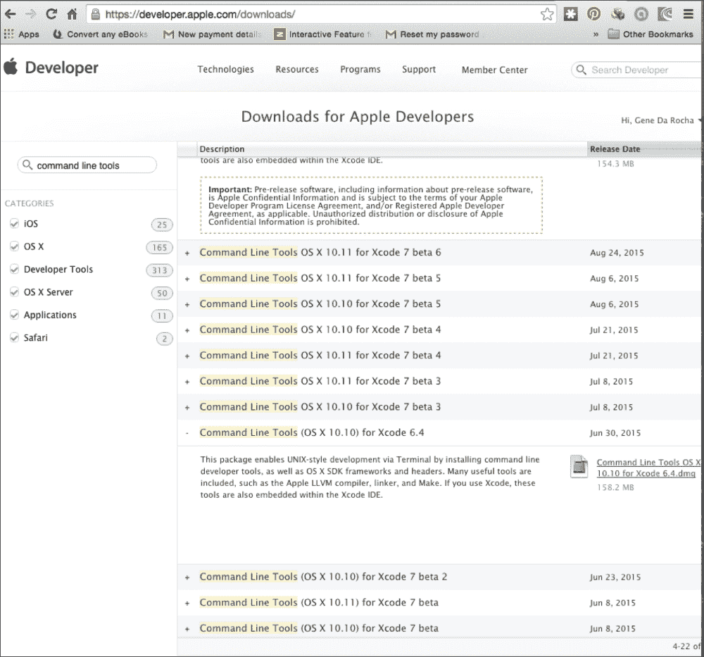

下一个步骤是下载软件的 Cordova 模块，如下一个截图所示。这是最新 Apache/Cordova 版本的存放位置。PhoneGap 在 2011 年被 Adobe 收购，该项目本身被捐赠给了 **Apache 软件基金会**（**ASF**）。使用 PhoneGap 有两种方式。一种是通过其基于云的服务来构建应用程序，另一种是通过 PhoneGap CLI 方式本地/手动构建和打包应用程序。在我们的第一个设置中，我们将使用 PhoneGap CLI 方式，如下所示：


将 Cordova 软件下载到 `下载` 文件夹，解压它，然后在 `cordova-ios` 目录中，你可以找到使用 PhoneGap/Cordova 与 Xcode 创建简单应用程序所需的所有必要组件。以下截图显示了 Cordova/PhoneGap 系统的目录结构。正如你所见，PhoneGap 支持各种技术和跨平台：

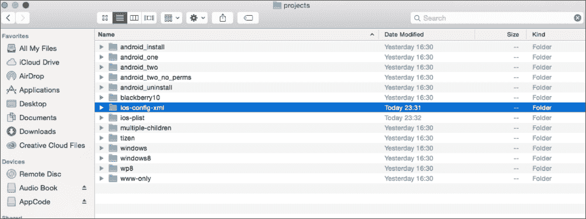

要继续，我们需要调用 **终端** 应用程序。最初，在你的 OS X 机器上，点击 **应用程序** | **实用工具**，然后点击 **终端** 应用程序，如下图所示：


一旦点击图片，就可以看到**终端**应用程序的以下窗口。它将允许你继续设置环境和所需组件的过程。这是你可以执行安装所需命令的地方：


点击屏幕底部的工具栏上的**应用程序**图标，然后点击**实用工具**文件夹，接着点击**终端**图标，如下面的截图所示：

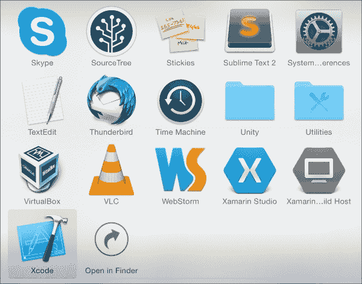

在选择**应用程序**图标后，点击**实用工具**文件夹：

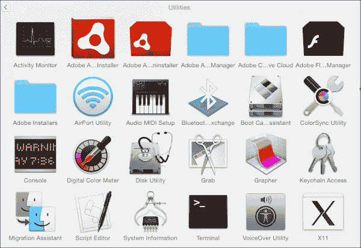

一旦点击了**终端**窗口，将显示以下窗口：


一旦你进入这个目录，执行以下命令：第一个是创建一个项目，第二个是创建一个以你的应用名称命名的目录：

```swift
$cd ~/Documents
$cordova create hello com.example.helloHelloWorld

```

使用 Cordova 已经创建了一个`Hello`程序的包。在开始构建任何项目之前，系统需要知道要针对哪些平台，例如，Android、iOS 或 Windows。Cordova 现在已添加 iOS 平台，如下面的代码所示：

```swift
$ cd hello
$ cordova platform add ios

```

一旦添加了平台，执行以下命令将列出应用程序可以工作的平台：

```swift
$ cordova platforms ls
Installed platforms: ios 3.7.0
Available platforms: amazon-fireos, android, blackberry10, browser, firefoxos

```

在`Hello`应用程序中，使用`ls-l`进行目录列表，你会看到各种目录，例如`platforms`。将`platforms`目录设置为默认目录。然后执行`ls-l`列表，你会看到包括`HelloWorld.xcodeproj`文件在内的各种目录。

一旦打开`Hello.xcodeproj`文件，Xcode 将唤醒，你会看到项目名称。你还可以输入一个公司标识符。请参见以下截图。

执行时，将提示选择一个模拟器手机。选择**iPhone 6.0 的 iOS 模拟器**。接下来，选择模拟器并点击**运行**按钮来编译、链接、构建和执行简单应用程序。你将看到 Cordova 的图像，如下面的截图所示，然后`Hello`应用将被显示出来：

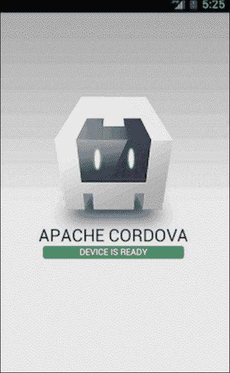

在这个阶段，你已经使用 Cordova 或 PhoneGap 设置了一个 Xcode 项目并编写了一些基本代码。现在，是时候添加一些 HTML5 代码来展示 PhoneGap/iOS 和 SQLite 如何协同工作了。

除了之前使用的安装 Cordova 的方法之外，最简单的方法是直接下载并安装 PhoneGap，而不需要通过命令行方法。点击[`phonegap.com/download`](http://phonegap.com/download)下载页面的**下载**按钮。

该过程可能因某些版本而有所不同，但通常对大多数版本来说都是相同的。接下来，下载 `.zip` 文件，打开它并将文件提取到目录中。然后安装 PhoneGap 程序，这将提供界面，一旦这一步完成，创建一个 Xcode 项目，如下面的截图所示。由于你已经这样做过，这样做会更简单：


当你完成了前面的任务，就像之前的安装一样，PhoneGap 将会多出一个图标。由于你已经安装了 Xcode 和 PhoneGap 共同工作所需的组件，你现在可以开始开发了。

以下截图显示了如何选择 PhoneGap 应用类型：

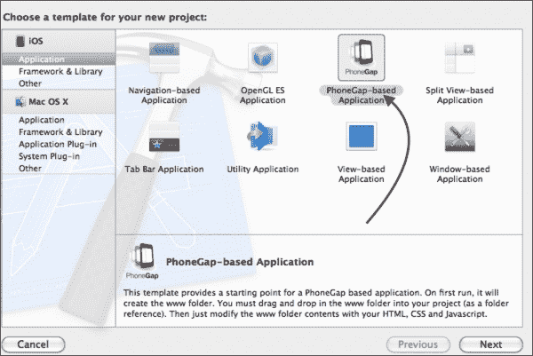

在创建 Cordova 应用程序时，你必须选择基于 Cordova 的应用程序模板，如下面的截图所示：


接下来，为这个项目选择一个项目名称——输入 `Hello`：


下一个字段是用于公司标识符 ID 的。就像之前一样，请添加一个唯一的标识符，这通常是域名反转。

这是在 Xcode 中安装 PhoneGap 框架的标准方式。在你的浏览器中，访问 [`nodejs.org/`](https://nodejs.org/) 并点击 **安装** 按钮下载名为 `node.js` 的 JavaScript 库。最后，输入管理员/用户名和密码详细信息以本地安装软件：

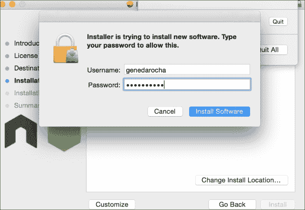

你成功的安装信息如下：


安装完成后，按照以下步骤操作：

1.  打开一个终端应用程序，并输入以下命令：

    ```swift
    $   sudo npm install –g phonegap

    ```

1.  输入 root 的密码以执行实际安装。一旦完成，你就可以使用 PhoneGap 命令并提示它获取一些帮助或协助。

1.  以下截图显示了使用前面的命令安装软件的 PhoneGap 程序：

1.  接下来，为了实际设置你的应用程序，请在终端应用程序程序中定位并设置默认目录。 

1.  运行 `$ phonegap create Hello` 命令。（`Hello` 是你的应用名称。）接下来，将默认设置为你刚刚创建的 PhoneGap 应用的应用程序目录。

以下截图显示了本地目录和创建名为 `Hello` 的新 Cordova 项目。一个新项目已经创建，包含了这个新测试应用所需的所有组件：


接下来，在提示符下，执行以下命令以在 iOS 中运行应用程序。运行 `$ phonegap run ios` 命令。如果您从任何地方运行 iOS 项目，将显示以下错误。但如果您将默认目录设置为正确的目录（`Hello`），则它将工作：

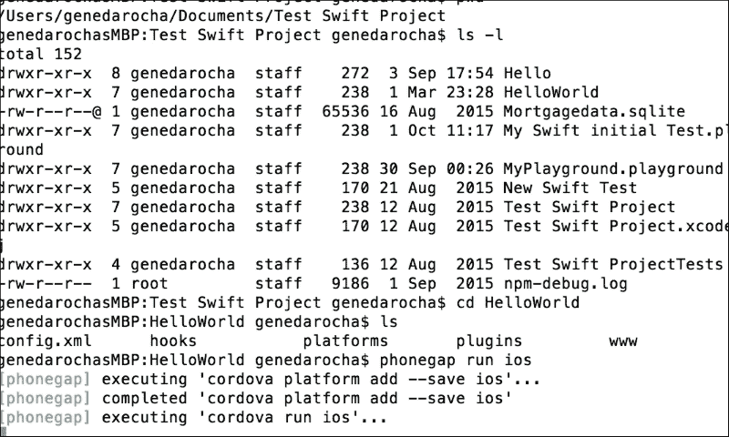

1.  在下一段代码中，你可以看到调用 PhoneGap 以使应用程序工作。这个过程已经变得更加顺畅，以便操作和工作，以利于创建应用程序。

1.  接下来，我们将向源代码中添加一些 HTML5 代码：

1.  一旦新的 Hello 基本应用程序编译和构建完成，就会出现以下图像，显示 Cordova 系统。这一点非常重要，关键是要知道 PhoneGap 及其 Cordova 组件已注册并按预期工作：

1.  我们现在可以通过添加一些 SQLite 和 HTML5 代码来进一步开发此应用程序。将产品的基础设置好、测试好并准备好进一步开发非常重要：

### 注意

更多关于 PhoneGap 的信息可以在[docs.phonegap.com](http://docs.phonegap.com)找到。

要使用 Xcode 项目文件（`Hello World.xcodeproj`）打开代码库，请按照以下步骤操作：

1.  单击**Hello 目录** | **平台** | **iOS**中的文件，这将打开 Xcode、代码和源文件。

1.  以下是我们测试应用程序的 Xcode 源文件区域的截图。为了将 SQLite 库添加到您的项目中，请单击**构建阶段**选项卡，然后选择**链接二进制与库**菜单选项，并从`libsqlite3.dylib`或`libsqlite3.0.dylib`中选择以下库之一：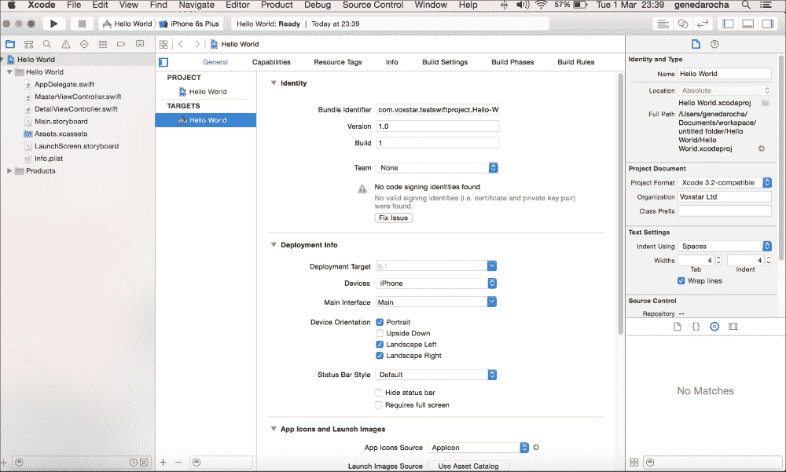

接下来，打开以下截图所示的`Hello`Xcode 项目文件。在结构中，展开 Xcode 项目以显示其中的 HTML 文件。然后，将以下 HTML5 代码添加到`.html`文件中，编译并运行它：


添加以下 HTML5 代码，它将执行一些简单的 SQLite 语句。它将接受几个输入数字；检查本地数据库/本地表的存在，创建必要的表，存储数据，并检索它。此代码将成为 Xcode 的一部分；使用 Cordova/PhoneGap 编译源代码，并执行结果以运行移动应用程序。一旦你将代码输入到`Hello`应用程序中的`index.html`文件，保存文件，并退出 Xcode。

这是一个简单的 HTML5 应用程序，它创建了一个名为`testdb`的数据库。它检查`BLOGS`表是否已创建。如果没有，它将创建`BLOGS`表，为博客信息输入两个记录，并在屏幕上显示数据。你可以看到以下代码和结果：

```swift
<!DOCTYPE HTML>
<html>

<head>

<script type="text/javascript">

var db = openDatabase('testdb', '1.0', 'Test DB', 2 * 1024 * 1024);
var msg;

            db.transaction(function (tx) {
tx.executeSql('CREATE TABLE IF NOT EXISTS BLOGS (id unique, log)');
tx.executeSql('INSERT INTO BLOGS (id, log) VALUES (1, "This is test blog 1")');
tx.executeSql('INSERT INTO BLOGS (id, log) VALUES (2, "This is test blog 2")');
                           msg = '<p>Blog message created and row inserted.</p>';
document.querySelector('#status').innerHTML =  msg;
                           });

                           db.transaction(function (tx) {
tx.executeSql('SELECT * FROM BLOGS', [], function (tx, results) {
var len = results.rows.length, i;
                                                        msg = "<p>Found rows: " + len + "</p>";
document.querySelector('#status').innerHTML +=  msg;

for (i = 0; i < len; i++){
                                                        msg = "<p><b>" + results.rows.item(i).log + "</b></p>";
document.querySelector('#status').innerHTML +=  msg;
                                                        }
                                                        }, null);
                                          });

</script>

</head>

<body>
<div id="status" name="status">Status Message</div>
</body>

</html>
```

1.  点击**终端**应用程序，并在**终端**应用程序中，将默认目录设置为`Hello`应用程序目录，如下面的代码所示：

1.  执行`phonegap run ios`命令，这将显示 PhoneGap/Cordova 启动屏幕，如下面的截图所示。这表明 Cordova/PhoneGap 环境已正确设置，应用程序将开始执行：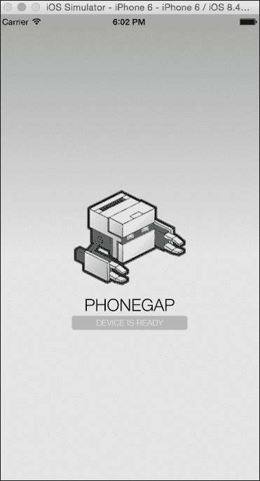

1.  以下是从`Hello`应用程序输出的内容。它显示了两个插入并显示的记录。这是一个简单的过程，但工作流程与我们讨论的是相同的：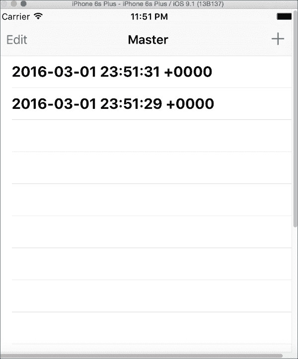

经过这次练习，你已经学会了如何安装 Node.js 和 Cordova，以及如何创建一个简单的 iOS 应用程序，运行 Xcode，并使用 iPhone 6 模拟一个简单的应用程序。

# 摘要

在本章中，你学习了如何使用 Xcode 和 PhoneGap 与 SQLite 和 HTML5。希望这已经帮助你使用这些技术进行 iOS 开发，并展示了如何使用 PhoneGap/SQLite 可以加快应用程序交付给最终用户的速度。

它也是一个跨平台开发平台，源代码只需创建一次，通过快速格式生成方法即可快速分发到各种平台。HTML5 与 Xcode、Swift 和 PhoneGap 以协同和快速的方式工作。

在下一章中，我们将讨论未来的进步、更多功能和 SQLite 功能。这将在开发过程中非常有用，以获得更好和更受控的应用程序。使用单一代码库为多个平台带来的好处对开发者和客户都非常有益。下一章还将提供如何在未来使用这些功能在新和更新的应用程序中的辅助和指南。
